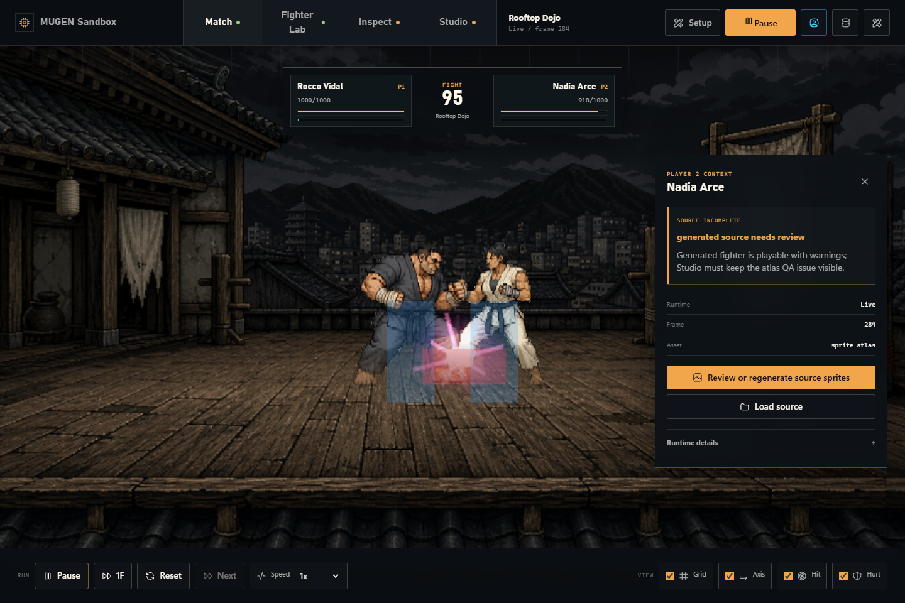
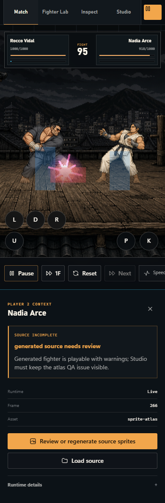
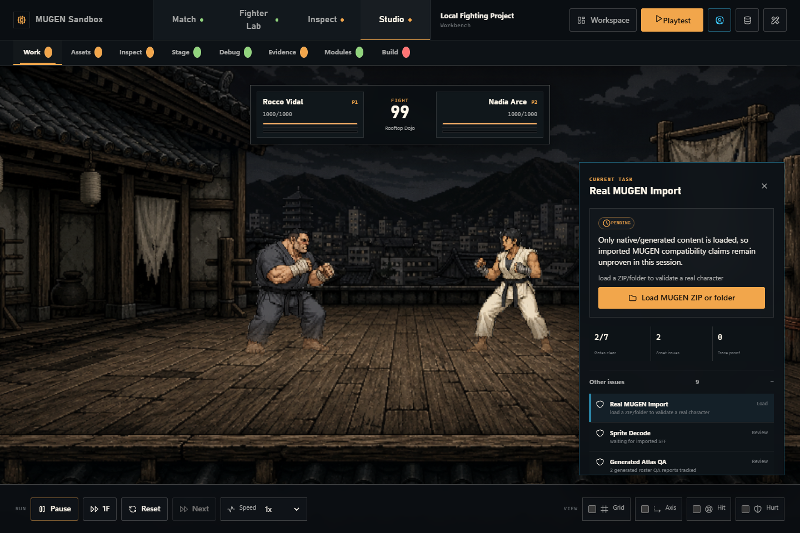
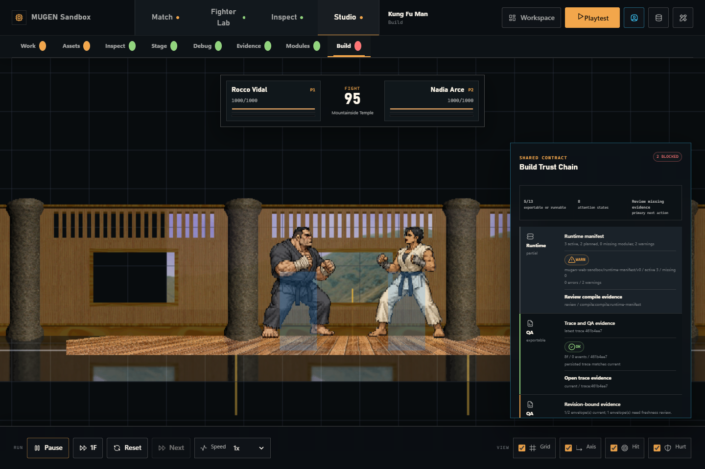

<p align="center">
  <picture>
    <source media="(prefers-color-scheme: dark)" srcset="https://shieldcn.dev/header/document.svg?title=MUGEN+Web+Sandbox&subtitle=Playable+browser+combat.+Inspectable+compatibility.&logo=threedotjs&theme=orange&align=center&mode=dark" />
    
  </picture>
</p>

<p align="center">
  <a href="https://github.com/gvastethecreator/threejs-mugen/actions/workflows/ci.yml"></a>
  <a href="https://gvastethecreator.github.io/threejs-mugen/"></a>
  <a href="https://threejs.org/"></a>
  <a href="https://pnpm.io/"></a>
  <a href="https://github.com/gvastethecreator/threejs-mugen/stargazers"></a>
</p>

A local-first Three.js laboratory for playable combat, MUGEN/IKEMEN package inspection, and evidence-led compatibility work.

This is a port foundation, not a parity claim. A supported path must connect parsing, runtime behavior, and reproducible evidence before it is presented as compatible.

[Project site](https://gvastethecreator.github.io/threejs-mugen/) · [Source](https://github.com/gvastethecreator/threejs-mugen) · [Support](https://ko-fi.com/gvaste)

## What you get

- **Runtime Mode**: a playable fight prototype with original atlas-backed fighters, original stages, keyboard and touch controls, hitboxes, rounds, and debug panels. An imported AIR/SFF route exists when sprites decode.
- **Inspector Mode**: local ZIP or folder loading for MUGEN characters, partial `.def` / `.air` / `.cmd` / `.cns` / `.sff` parsing, AIR playback, and compatibility reports.
- **Studio Mode**: a first workbench for project manifests, asset provenance, module gates, runtime evidence, and a compiled `runtime-manifest/v0` contract.

The captures below come from the Playwright smoke route with local generated content. They contain no commercial character packages. The same smoke run still fails some compatibility assertions; see [screenshot provenance](docs/assets/screenshots/README.md) and the [quality audit](docs/QUALITY_AUDIT.md).

| Playable runtime | Mobile controls |
| --- | --- |
|  |  |
| **Studio workbench** | **Build trust chain** |
|  |  |

## Run

```bash
pnpm install --frozen-lockfile
pnpm dev
```

Open the Vite URL. The app starts in Runtime Mode. You can switch to Inspector Mode or load a character ZIP/folder.

This repository is pnpm-native (`pnpm@11.21.0`). Bun is not required.

## Checks

```bash
pnpm check     # TypeScript + CSS budgets
pnpm test      # Vitest
pnpm build     # Production bundle
pnpm qa:trace  # Deterministic runtime traces
pnpm qa:smoke  # Playwright desktop/mobile smoke
pnpm verify    # check + build
```

Trace artifacts write under ignored `.scratch/qa/`. Optional official KFM confirmation needs `.scratch/fixtures/kfm-official.zip`, which is not shipped.

## Documentation

- [Architecture](docs/ARCHITECTURE.md)
- [Supported features](docs/SUPPORTED_FEATURES.md)
- [Compatibility profiles](docs/COMPATIBILITY_PROFILES.md)
- [Quality audit](docs/QUALITY_AUDIT.md)
- [Playable status](docs/PLAYABLE_V0_STATUS.md)
- [Contributing](CONTRIBUTING.md)
- [Changelog](docs/CHANGELOG.md)
- [ADRs](docs/adr/)

## Status

- Playable local prototype with partial MUGEN 1.1 fixture-backed runtime.
- IKEMEN content is scanned and reported. Named `ikemen-go` slices execute only when a trace proves them.
- Browser smoke still has unresolved compatibility assertions. See [docs/QUALITY_AUDIT.md](docs/QUALITY_AUDIT.md).
- No commercial character assets are included.

## License

MIT. See [LICENSE](LICENSE). Original generated characters and stages in `public/` are project-owned. Do not add third-party commercial MUGEN packages to the repository.
