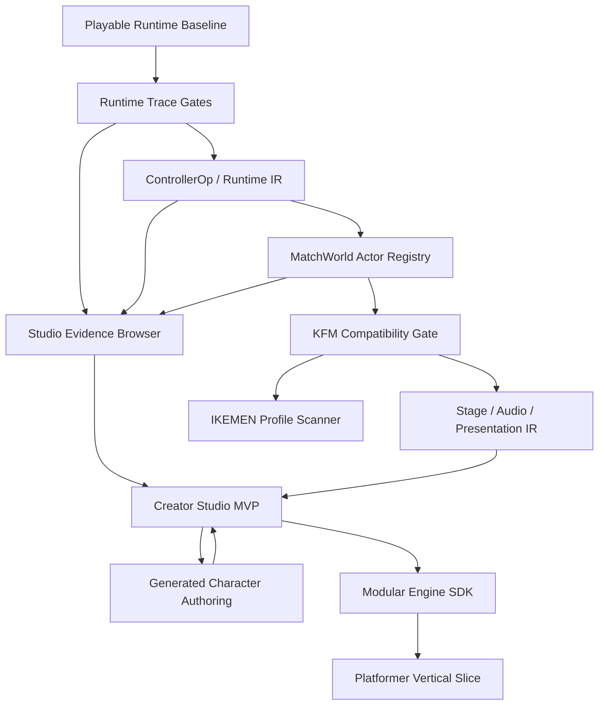

# Build Execution Backlog

## 2026-07-02 - RuntimeMatchPauseControllerWorld ownership extraction

Changed:
- Added `RuntimeMatchPauseControllerWorld` as the bounded Pause/SuperPause result side-effect boundary consumed by `PlayableMatchRuntime`.
- Moved match-pause controller result handling for pause-state application, SuperPause power delta handoff, and pause log emission out of `PlayableMatchRuntime.applyMatchPauseController`.
- Added focused `PauseSystem` coverage for runtime tick/controller/typed-operation forwarding, power-delta handoff, log emission, and zero-length pause no-side-effect behavior.
- No Pause/SuperPause semantics, `RuntimePauseWorld` state ownership, paused-match ordering, trace artifact schema, frontend, CSS, renderer, sprites, or bundled assets changed.

Evidence:
- Focused test passed before full closeout: `pnpm exec vitest run src/tests/PauseSystem.test.ts` -> 1 file / 16 tests.
- Full closeout gates passed: `pnpm test` -> 119 files / 1022 tests, `pnpm typecheck`, `pnpm build` -> passed with existing Vite large-chunk warning, `pnpm check:boundaries`, `pnpm qa:trace` -> 268/268 artifacts, 245 required and 23 optional, and `git diff --check` -> passed with existing CRLF normalization warnings only.
- `pnpm qa:smoke` is intentionally not planned because this cut does not touch frontend, renderer, CSS, sprites, bundled assets, or visible gameplay presentation.

Claim allowed:
- Current Pause/SuperPause controller result side effects have a named, testable ownership boundary while preserving the existing `RuntimePauseWorld.applyController` pause-state contract.

Claim blocked:
- Exact MUGEN/IKEMEN pause layering, SuperPause background/effects/sound timing, helper/team/redirect pause ownership, pause/hitpause command parity, exact paused side-effect tick order, visual/audio parity, score movement, and full pause VM parity remain blocked.

Next:
- Continue R2 helper/effect/combat ownership or R1 KFM/Common1 recovery/guard/FightFX precision.

## 2026-07-02 - RuntimeMatchCombatBridgeWorld ownership extraction

Changed:
- Added `RuntimeMatchCombatBridgeWorld` as the bounded combat-callback bridge consumed by `PlayableMatchRuntime` before `RuntimeMatchInteractionWorld.advanceRuntime`.
- Moved priority-clash, direct-combat, projectile-combat, and helper-combat resolver wiring out of the inline match loop and into one named runtime boundary.
- Added focused `RuntimeMatchCombatBridgeSystem` coverage for priority/direct/projectile/helper route wiring, hurtbox callback forwarding, projectile target-memory callback forwarding, and log forwarding.
- No combat result semantics, Common1/custom-state routing semantics, projectile/helper semantics, trace artifact schema, frontend, CSS, renderer, sprites, or bundled assets changed.

Evidence:
- Focused test passed before full closeout: `pnpm exec vitest run src/tests/RuntimeMatchCombatBridgeSystem.test.ts` -> 1 file / 1 test.
- Full closeout gates passed: `pnpm test` -> 119 files / 1020 tests, `pnpm typecheck`, `pnpm build` -> passed with existing Vite large-chunk warning, `pnpm check:boundaries`, and `pnpm qa:trace` -> 268/268 artifacts, 245 required and 23 optional.
- `pnpm qa:smoke` is intentionally not planned because this cut does not touch frontend, renderer, CSS, sprites, bundled assets, or visible gameplay presentation.

Claim allowed:
- Current match interaction combat callback construction has a named, testable ownership boundary while preserving the existing `RuntimeMatchInteractionWorld` callback contract.

Claim blocked:
- Exact MUGEN/IKEMEN direct-combat priority, helper-owned combat/contact timing, projectile hit/cancel timing, teams/simul/multi-target combat breadth, visual/audio parity, score movement, and full combat VM parity remain blocked.

Next:
- Continue R2 helper/effect/combat ownership or R1 KFM/Common1 recovery/guard precision.

## 2026-07-02 - RuntimeMoveStartWorld ownership extraction

Changed:
- Added `RuntimeMoveStartWorld` as the bounded attack/state-move startup boundary consumed by `PlayableMatchRuntime`.
- Moved current move assignment, move label stamping, move tick reset, hit/reversal reset, attack `moveType` write, control handoff, and authored action state entry handoff out of `PlayableMatchRuntime.startMoveWithSpec`.
- Added focused `RuntimeMoveStartSystem` coverage for selected move metadata/reset behavior and hook ordering for control before state entry.
- No runtime move semantics, State -1 routing semantics, hit/contact semantics, trace artifact schema, frontend, CSS, renderer, sprites, or bundled assets changed.

Evidence:
- Full closeout gates passed: `pnpm test` -> 118 files / 1019 tests, `pnpm typecheck`, `pnpm build` -> passed with existing Vite large-chunk warning, `pnpm check:boundaries`, and `pnpm qa:trace` -> 268/268 artifacts, 245 required and 23 optional.
- `pnpm qa:smoke` was intentionally not run because this cut does not touch frontend, renderer, CSS, sprites, bundled assets, or visible gameplay presentation.

Claim allowed:
- Current native/imported state-move startup has a named, testable ownership boundary while `PlayableMatchRuntime` still supplies concrete control mutation and state-entry hooks.

Claim blocked:
- Exact MUGEN/IKEMEN command timing, cancel windows, combo/input priority, helper/team/redirect move startup, persistent-controller timing, visual parity, score movement, and full move VM parity remain blocked.

Next:
- Continue R2 helper/effect/combat ownership or R1 KFM/Common1 recovery/guard precision.

## 2026-07-02 - RuntimeMatchTickInputWorld ownership extraction

Changed:
- Added `RuntimeMatchTickInputWorld` as the normal-match input/tick stamping boundary consumed by `PlayableMatchRuntime`.
- Moved per-frame `compatibilityTick` / cloned `currentInput` stamping and normal-loop command-buffer pushes out of `PlayableMatchRuntime.advanceOneTick`.
- Added focused `RuntimeMatchTickInputSystem` coverage for input clone isolation, actor tick stamping, normal command-buffer writes without `hitPause`, and keeping stamping separate from pause/hitpause buffering.
- No runtime input semantics, command parser semantics, trace artifact schema, frontend, CSS, renderer, sprites, or bundled assets changed.

Evidence:
- Full closeout gates passed: `pnpm test` -> 117 files / 1017 tests, `pnpm typecheck`, `pnpm build` -> passed with existing Vite large-chunk warning, `pnpm check:boundaries`, `pnpm qa:trace` -> 268/268 artifacts, 245 required and 23 optional, and `git diff --check` -> passed with existing CRLF normalization warnings only.
- `pnpm qa:smoke` was intentionally not run because this cut does not touch frontend, renderer, CSS, sprites, bundled assets, or visible gameplay presentation.

Claim allowed:
- Current normal match tick input stamping and non-hitpause command-buffer writes have a named, testable ownership boundary while preserving existing pause and hitpause buffering ownership.

Claim blocked:
- Exact MUGEN/IKEMEN command timing, input priority/conflict semantics, pause/hitpause command-buffer parity, helper/team/redirect command ownership, visual parity, score movement, and full input VM parity remain blocked.

Next:
- Continue R2 helper/effect/combat ownership or R1 KFM/Common1 recovery/guard precision.

## 2026-07-02 - RuntimeHelperTelemetryWorld ownership extraction

Changed:
- Added `RuntimeHelperTelemetryWorld` as the helper-local Projectile telemetry binding boundary consumed by `PlayableMatchRuntime`.
- Moved owner `onHelperController` / `onHelperOperation` projectile filtering and helper-state fallback telemetry out of `PlayableMatchRuntime.attachHelperTargetStateHandlers`.
- Added focused `RuntimeHelperTelemetrySystem` coverage for projectile controller/typed-operation recording, owner-state fallback when helper state is absent, non-projectile ignore behavior, and stale handler replacement.
- No runtime semantics, trace artifact schema, frontend, CSS, renderer, sprites, or bundled assets changed.

Evidence:
- Focused test passed: `pnpm exec vitest run src/tests/RuntimeHelperTelemetrySystem.test.ts` -> 1 file / 3 tests.
- Full closeout gates passed: `pnpm test` -> 116 files / 1014 tests, `pnpm typecheck`, `pnpm build` -> passed with existing Vite large-chunk warning, `pnpm check:boundaries`, `pnpm qa:trace` -> 268/268 artifacts, 245 required and 23 optional, and `git diff --check` -> passed with existing CRLF normalization warnings only.
- `pnpm qa:smoke` was intentionally not run because this cut does not touch frontend, renderer, CSS, sprites, bundled assets, or visible gameplay presentation.

Claim allowed:
- Current helper-local Projectile controller/op telemetry has a named, testable ownership boundary while preserving existing helper state-number attribution.

Claim blocked:
- Exact helper Projectile tick timing, helper-owned Projectile combat/contact presentation, teams/simul helper telemetry, broader helper controller telemetry semantics, visual/audio parity, score movement, and full Helper VM parity remain blocked.

Next:
- Continue R2 helper/effect/combat ownership or R1 KFM/Common1 recovery/guard precision.

## 2026-07-02 - KFM crouch get-hit progression controller-order fixture gate

Changed:
- Tightened optional private-fixture `kfm-official-default-crouch-gethit-progression` so it now requires KFM-specific `5010/5011` controller and typed-operation order, not only state/frame progression.
- Prefactored `createImportedDefaultGetHitProgressionTraceArtifact` with a `requiredControllerEventSequences` override so fixture-specific Common1 routes can keep the shared progression factory while requiring stricter real-character evidence.
- Added `officialKfmDefaultCrouchGetHitProgressionControllerSequence()` to require real KFM order through `5010` `ChangeAnim` / `ChangeState`, then `5011` `HitVelSet`, `VelMul`, `VelSet`, `DefenceMulSet`, their typed operations, and final `ChangeState`.
- Updated optional KFM crouch QA trace registration and docs without touching runtime semantics, frontend, CSS, renderer, sprites, or bundled assets.

Evidence:
- `pnpm qa:trace` passed -> 268/268 artifacts, 245 required and 23 optional.
- Artifact checksum remains `kfm-official-default-crouch-gethit-progression` checksum `3d197fae`; final checksum remains `f469a942`.
- Gate still requires real KFM held-crouch prep state `11`, states `200`, `5010`, and `5011`, final P2 state `0`/control, KFM-specific `5010`/`5011` actor-frame evidence, and now ordered `HitVelSet` / `VelMul` / `VelSet` / `DefenceMulSet` typed-operation evidence.

Claim allowed:
- Private official KFM fixture can prove bounded crouch Common1-style `5010 -> 5011 -> 0` progression plus the current bounded KFM crouch slide controller/typed-operation order after a direct `HitDef` without `p2stateno` while P2 holds crouch.

Claim blocked:
- Public bundled KFM support, exact MUGEN/IKEMEN controller-loop timing, exact crouch get-hit animation/slide tables beyond this bounded order/frame profile, fall routing, custom-state/helper/team breadth, visual/audio parity, score movement, and full Common1 get-hit parity remain blocked.

Next:
- Continue into exact KFM/Common1 timing/table work, broader recovery/guard precision, or another bounded R1/R2 runtime slice.

## 2026-07-02 - KFM crouch get-hit progression fixture gate

Changed:
- Added optional private-fixture `kfm-official-default-crouch-gethit-progression` trace evidence for real KFM/Common1 crouch `5010 -> 5011 -> 0` HitShakeOver/HitOver progression.
- Prefactored `createImportedDefaultGetHitProgressionTraceArtifact` with a `requiredExecutedStates` override so fixture routes can require KFM's executed crouch prep state `11` without pretending state `0` executed a controller on return.
- Added `officialKfmDefaultCrouchGetHitProgressionPhysicsFrames()` for KFM-specific crouch frame evidence: `5010` anim `5010`, `5011` anim `5020`, `Clsn2 = 2/3`, body width `39/39`, and bounded slide velocity.
- Registered the optional KFM crouch artifact in `scripts/qa_traces.cjs` without touching frontend, CSS, renderer, sprites, or bundled assets.

Evidence:
- Probe artifact passed before docs: `kfm-official-default-crouch-gethit-progression` checksum `3d197fae`, final checksum `f469a942`.
- `pnpm qa:trace` passed -> 268/268 artifacts, 245 required and 23 optional.
- Gate label: `imported-default-crouch-gethit-progression-golden`; required executed states include `11`, `200`, `5010`, and `5011`.
- Required evidence includes final P2 state `0`/control, actor-frame `5010 -> 5011`, `5010` `stateType = C` / `physics = N` / `Clsn2 = 2`, and `5011` `stateType = C` / `physics = C` / `Clsn2 = 3`.

Claim allowed:
- Private official KFM fixture can prove bounded crouch Common1-style `5010 -> 5011 -> 0` progression after a direct `HitDef` without `p2stateno` while P2 holds crouch.

Claim blocked:
- Public bundled KFM support, exact MUGEN/IKEMEN controller-loop timing, exact crouch get-hit animation/slide tables beyond this frame profile, fall routing, custom-state/helper/team breadth, visual/audio parity, score movement, and full Common1 get-hit parity remain blocked.

Next:
- Continue into exact KFM/Common1 timing/table work, broader recovery/guard precision, or another bounded R1/R2 runtime slice.

## 2026-07-02 - Default crouch get-hit progression trace gate

Changed:
- Added required `synthetic-imported-default-crouch-gethit-progression` trace evidence for the bounded crouch Common1-style `5010 -> 5011 -> 0` HitShakeOver/HitOver route.
- Prefactored `createImportedDefaultGetHitProgressionTraceArtifact` so get-hit progression gates can supply the input script, gate label, shake/slide state numbers, and crouch-specific frame requirements instead of hardcoding `5000/5001`.
- Extended synthetic imported progression fixture generation with `shakeStateType`, `slideStateType`, `shakePhysics`, and `slidePhysics`, enabling crouch `Statedef 5010/5011` data without duplicating the stand route.
- Registered the new trace in `scripts/qa_traces.cjs` required artifacts without touching frontend, CSS, renderer, sprites, or bundled assets.

Evidence:
- Focused preset coverage passed: `pnpm vitest run src/tests/RuntimeTraceGatePresets.test.ts -t "crouch Common1 progression"` -> 1 file / 1 test.
- `pnpm qa:trace` passed -> 267/267 artifacts, 245 required and 22 optional.
- New required artifact: `synthetic-imported-default-crouch-gethit-progression.json` checksum `fd986a9e`, final checksum `d6b64044`.
- Gate label: `imported-default-crouch-gethit-progression-golden`; required executed states include `0`, `200`, `5010`, and `5011`.
- Required evidence includes ordered P2 controller events `5010:ChangeState -> 5011:ChangeState`, ordered actor frames `5010 -> 5011`, crouch `stateType = C`, `physics = N/C`, `Clsn2 = 1`, and final P2 idle/control.

Claim allowed:
- Imported defender-owned crouch Common1-style get-hit progression can be proven through bounded `5010 -> 5011 -> 0` HitShakeOver/HitOver evidence when the defender holds crouch and a direct `HitDef` omits `p2stateno`.

Claim blocked:
- Exact MUGEN/IKEMEN controller-loop tick timing, exact crouch get-hit animation/slide tables, fall routing, custom-state/helper/team breadth, visual/audio parity, score movement, and full Common1 get-hit parity remain blocked.

Next:
- Continue into KFM/Common1 precision for the same route, exact timing/table work, or another bounded R1/R2 runtime slice.

## 2026-07-02 - RuntimeFighterAdvanceWorld ownership extraction

Changed:
- Added `RuntimeFighterAdvanceWorld` as the per-fighter advance-order boundary used by `PlayableMatchRuntime`.
- Moved the current fighter tick sequence behind one named world: sprite effects, hit eligibility slots, HitOverride slots, contact timers, render-angle reset, state clock, frame constraints, recovery-window tick, preserve-moveType read, stun, move lifecycle, kinematics, animation, active controllers, ground-recovery landing, lie-down recovery, and frozen-position preservation.
- Added focused `RuntimeFighterAdvanceSystem` coverage proving order, `renderAngle` cleanup before state-clock handoff, preserve-moveType forwarding, and tick-start position capture after the recovery-window tick but before kinematics.
- No runtime semantics, frontend, renderer, CSS, fixture assets, or compatibility scores changed.

Evidence:
- Focused test passed: `pnpm exec vitest run src/tests/RuntimeFighterAdvanceSystem.test.ts` -> 1 file / 1 test.
- `pnpm test` passed -> 115 files / 1007 tests.
- `pnpm typecheck` passed.
- `pnpm build` passed with the known Vite large-chunk warning.
- `pnpm check:boundaries` passed.
- `pnpm qa:trace` passed -> 266/266 artifacts, 244 required and 22 optional.
- `git diff --check` passed with CRLF normalization warnings only.

Claim allowed:
- Current per-fighter match advance ordering has a named, testable boundary while `PlayableMatchRuntime` still supplies concrete worlds, state/action callbacks, active-controller execution, and stage/tick context.

Claim blocked:
- Exact MUGEN/IKEMEN player tick order, persistent-controller timing, helper/team/redirect actor advance semantics, exact recovery/stun/physics arbitration, visual parity, score movement, and full runtime VM parity remain blocked.

Next:
- Continue into R1 Common1/FightFX precision or another R2 helper/effect/combat ownership seam with stable trace behavior.

## 2026-07-02 - KFM air-entry recovery fixture gates

Changed:
- Added optional private-fixture KFM gates for airborne Common1 recovery routes using `.scratch/fixtures/kfm-official.zip` when present.
- Added reusable official KFM air-entry recovery controller and actor-frame sequence helpers for `5020 -> 5030 -> 5035 -> 5050 -> 5210 -> 52 -> 0` and the too-early rejection route `5020 -> 5030 -> 5035 -> 5050`.
- Registered `kfm-official-default-air-fall-recovery-input` and `kfm-official-default-air-fall-recovery-too-early` in `scripts/qa_traces.cjs` without changing runtime behavior, frontend, CSS, or bundled assets.
- Kept the evidence private/optional: no public KFM asset is committed and no score moves from these gates.

Evidence:
- `pnpm qa:trace` passed -> 266/266 artifacts, 244 required and 22 optional.
- New optional artifact: `kfm-official-default-air-fall-recovery-input.json` checksum `3bce8aba`, initial checksum `47d0d864`, final checksum `66456063`.
- New optional artifact: `kfm-official-default-air-fall-recovery-too-early.json` checksum `b199382a`, initial checksum `27df190a`, final checksum `304d01c4`.
- The input route requires executed states `200`, `5020`, `5030`, `5035`, `5050`, `5210`, and `52`; ordered actor-frame evidence shows KFM's `5030` countdown reaches `0` before intermediate `5035`, then `5050`, `5210`, `52`, and idle/control.
- The too-early route requires executed states `200`, `5020`, `5030`, `5035`, and `5050`; recovery, landing, ground-impact, bounce, and lie-down states `5210`, `5200`, `5201`, `52`, `5100`, `5101`, `5110`, and `5120` stay forbidden while `5050` still has positive `fall.recovertime`.

Claim allowed:
- The private official KFM fixture confirms the bounded air-entry Common1 recovery-input and too-early reject routes through KFM's real intermediate `5035` state.

Claim blocked:
- Public bundled KFM support, exact MUGEN/IKEMEN recovery threshold tables, exact velocity math, exact controller-loop tick order, recovery arbitration breadth, visual/audio parity, score movement, and full Common1 recovery parity remain blocked.

Next:
- Continue into exact threshold tables, broader official fixture comparison, guard/recovery precision, or the next R2 MatchWorld ownership slice.

## 2026-07-02 - Default air recovery too-early trace gate

Changed:
- Added required `synthetic-imported-default-air-fall-recovery-too-early` trace evidence for airborne defender-owned Common1-style recovery-input rejection before `fall.recovertime` reaches zero.
- Prefactored `createImportedDefaultFallRecoveryTooEarlyTraceArtifact` with script, state, actor-frame, controller-sequence, forbidden-state, and final-actor overrides so stand-entry and air-entry negative gates share one fixture runner.
- Added reusable air-entry too-early controller and actor-frame sequence helpers for `5020 -> 5030 -> 5050` with no recovery/landing branch.
- Registered the trace in `scripts/qa_traces.cjs` required artifacts without touching frontend CSS/UI.

Evidence:
- Focused preset coverage: `pnpm exec vitest run src/tests/RuntimeTraceGatePresets.test.ts --testNamePattern "air-entry Common1 recovery-input too-early"` -> 1 file / 1 test.
- `pnpm qa:trace` passed -> 264/264 artifacts, 244 required and 20 optional.
- New required artifact: `synthetic-imported-default-air-fall-recovery-too-early.json` checksum `48a2e708`, initial checksum `29c75f4b`, final checksum `cdd20fed`.
- Gate label: `imported-default-fall-recovery-too-early-golden`; required executed states include `200`, `5020`, `5030`, and `5050`.
- Required evidence includes active commands `x` and `recovery`, forbidden states `5210`, `5200`, `5201`, `52`, `5100`, `5101`, `5110`, and `5120`, ordered actor frames `5020 -> 5030 -> 5050`, `5050` positive `hitFall.recoverTime` from `11` to `6`, and final P2 still in `5050` with no control.
- `pnpm test` passed -> 114 files / 1006 tests.
- `pnpm typecheck` passed.
- `pnpm build` passed with the known Vite large-chunk warning.
- `pnpm check:boundaries` passed.
- `git diff --check` passed with CRLF normalization warnings only.
- No `pnpm qa:smoke` because this cut did not touch frontend, renderer, Studio UI, sprites, CSS, or visible gameplay output.

Claim allowed:
- Imported defender-owned Common1-style air-entry fall route rejects early `command = "recovery"` while `fall.recovertime` remains positive, keeping P2 in `5050` after `5020 -> 5030 -> 5050`.

Claim blocked:
- Exact MUGEN/IKEMEN recovery threshold tables, exact air get-hit animation choice, exact velocity math, exact controller-loop timing, exact KFM/public fixture parity, recovery arbitration between air/ground branches, visual/audio parity, score movement, and full Common1 recovery parity remain blocked.

Next:
- Continue into exact threshold tables, KFM/private-fixture comparison for the air-entry route, or another R1 Common1/FightFX precision gate.

## 2026-07-02 - Default air recovery-input trace gate

Changed:
- Added required `synthetic-imported-default-air-fall-recovery-input` trace evidence for airborne defender-owned Common1-style recovery input after a fall `HitDef` omits `p2stateno`.
- Prefactored `createImportedDefaultFallRecoveryInputTraceArtifact` with script and executed-state overrides so stand-entry and air-entry recovery gates share the same fixture runner.
- Added reusable air-entry recovery controller and actor-frame sequence helpers for `5020 -> 5030 -> 5050 -> 5210 -> 52 -> 0`.
- Registered the trace in `scripts/qa_traces.cjs` required artifacts without touching frontend CSS/UI.

Evidence:
- Focused preset coverage: `pnpm exec vitest run src/tests/RuntimeTraceGatePresets.test.ts --testNamePattern "air-entry Common1 recovery-input"` -> 1 file / 1 test.
- `pnpm qa:trace` passed -> 263/263 artifacts, 243 required and 20 optional.
- New required artifact: `synthetic-imported-default-air-fall-recovery-input.json` checksum `334a419e`, initial checksum `d3d91357`, final checksum `c5038a9d`.
- Gate label: `imported-default-fall-recovery-input-golden`; required executed states include `200`, `5020`, `5030`, `5050`, `5210`, and `52`.
- Required evidence includes active commands `x` and `recovery`, ordered actor frames `5020 -> 5030 -> 5050 -> 5210 -> 52`, `5050` positive-to-zero `hitFall.recoverTime`, `5210` air-recovery velocity, `52` y = 0 landing, and final P2 state `0` with control.
- `pnpm test` passed -> 114 files / 1005 tests.
- `pnpm typecheck` passed.
- `pnpm build` passed with the known Vite large-chunk warning.
- `pnpm check:boundaries` passed.
- `git diff --check` passed with CRLF normalization warnings only.
- No `pnpm qa:smoke` because this cut did not touch frontend, renderer, Studio UI, sprites, CSS, or visible gameplay output.

Claim allowed:
- Imported defender-owned Common1-style air-entry fall route can accept recovery input after `5020 -> 5030 -> 5050`, enter `5210`, land through `52`, and return to idle/control when `fall.recover` and `fall.recovertime` permit it.

Claim blocked:
- Exact MUGEN/IKEMEN recovery threshold tables, exact air get-hit animation choice, exact velocity math, exact controller-loop timing, exact KFM/public fixture parity, recovery arbitration between air/ground branches, visual/audio parity, score movement, and full Common1 recovery parity remain blocked.

Next:
- Continue into exact threshold/too-early air-entry rejection, KFM/private-fixture comparison for this air-entry route, or another R1 Common1/FightFX precision gate.

## 2026-07-02 - Default air lie-down recovery trace gate

Changed:
- Added required `synthetic-imported-default-air-liedown-recovery` trace evidence for airborne defender-owned Common1-style bounce, lie-down, get-up, and idle return after a fall `HitDef` omits `p2stateno`.
- Reused the existing `defaultGetHitFall` fixture path with `shakeStateNo: 5020` and `includeRecoveryChain: true`; no global hit/fall runtime behavior changed.
- Added reusable bounce/lie-down controller sequence evidence around `5100 -> 5101 -> 5110`, including `HitFallVel`, `HitFallDamage`, and matching typed hitfall operations.
- Registered the trace in `scripts/qa_traces.cjs` required artifacts without touching frontend CSS/UI.

Evidence:
- Focused preset coverage: `pnpm exec vitest run src/tests/RuntimeTraceGatePresets.test.ts --testNamePattern "lie-down recovery artifact"` -> 1 file / 1 test.
- `pnpm qa:trace` passed -> 262/262 artifacts, 242 required and 20 optional.
- New required artifact: `synthetic-imported-default-air-liedown-recovery.json` checksum `56a8f236`, initial checksum `6b7422cb`, final checksum `20c045a3`.
- Gate label: `imported-default-fall-gethit-golden`; required executed states include `200`, `5020`, `5030`, `5050`, `5100`, `5101`, `5110`, and `5120`.
- Required controller/operation evidence includes `5100` `HitFallDamage`, `5101` `HitFallVel`, `5110` `HitFallDamage`, `hitfall:hitfallvel`, and `hitfall:hitfalldamage`.
- Required actor-frame evidence includes `5110` bounded `hitFall.downRecoverTime` countdown from `59` to `53` before `5120`, and final P2 returns to state `0` with `ctrl = true`.
- `pnpm test` passed -> 114 files / 1004 tests.
- `pnpm typecheck` passed.
- `pnpm build` passed with the known Vite large-chunk warning.
- `pnpm check:boundaries` passed.
- `git diff --check` passed with existing CRLF normalization warnings only.
- No `pnpm qa:smoke` because this cut did not touch frontend, renderer, Studio UI, sprites, CSS, or visible gameplay output.

Claim allowed:
- Imported defender-owned Common1-style fall chain can route an airborne defender through `5020 -> 5030 -> 5050 -> 5100 -> 5101 -> 5110 -> 5120 -> 0` after a fall `HitDef` without `p2stateno`, with bounded bounce, lie-down countdown, get-up, and idle-return evidence.

Claim blocked:
- Exact air get-hit animation choice, exact `HitShakeOver` / `HitOver` timing, exact ground-impact timing/position, exact bounce physics, exact lie-down duration tables, recovery input, landing nuance, controller-loop tick order, visual/audio parity, score movement, and full Common1 fall/get-hit parity remain blocked.

Next:
- Continue into exact recovery thresholds/input timing, KFM/private-fixture comparison for the same air entry route, or another R1 Common1/FightFX precision gate.

## 2026-07-02 - Default air ground-impact trace gate

Changed:
- Added required `synthetic-imported-default-air-ground-impact` trace evidence for airborne defender-owned Common1-style ground-impact routing when a fall `HitDef` omits `p2stateno`.
- Reused the existing `defaultGetHitFall` fixture path with `shakeStateNo: 5020` and `includeRecoveryChain: true` instead of changing global hit/fall runtime behavior.
- Added a small `createImportedDefaultFallGetHitTraceArtifact` option seam for custom final actor and actor-frame requirements, so the older fall-state gate can still assert "falling" while this new chain gate can assert return-to-idle.
- Registered the trace in `scripts/qa_traces.cjs` required artifacts without touching frontend CSS/UI.

Evidence:
- Focused preset coverage: `pnpm exec vitest run src/tests/RuntimeTraceGatePresets.test.ts --testNamePattern "ground-impact artifact"` -> 1 file / 1 test.
- `pnpm qa:trace` passed -> 261/261 artifacts, 241 required and 20 optional.
- New required artifact: `synthetic-imported-default-air-ground-impact.json` checksum `0ba3c80f`, initial checksum `312995af`, final checksum `cb7f1043`.
- Gate label: `imported-default-fall-gethit-golden`; required executed states include `200`, `5020`, `5030`, `5050`, and `5100`.
- Required controller/operation evidence includes `5100` `HitFallDamage` and `hitfall:hitfalldamage`.
- No `pnpm qa:smoke` because this cut did not touch frontend, renderer, Studio UI, sprites, CSS, or visible gameplay output.

Claim allowed:
- Imported defender-owned Common1-style fall state order can route an airborne defender through `5020 -> 5030 -> 5050 -> 5100` after a fall `HitDef` without `p2stateno`, with bounded ground-impact `HitFallDamage` evidence.

Claim blocked:
- Exact air get-hit animation choice, exact `HitShakeOver` / `HitOver` timing, exact ground-impact timing/position, bounce physics, lie-down timing, landing, recovery input, controller-loop tick order, visual/audio parity, score movement, and full Common1 fall/get-hit parity remain blocked.

Next:
- Continue into bounce/lie-down precision from this air entry route, landing/recovery breadth, or another R1 Common1/FightFX precision gate.

## 2026-07-02 - Default air fall get-hit trace gate

Changed:
- Added required `synthetic-imported-default-air-fall-gethit` trace evidence for airborne defender-owned Common1-style fall routing when a fall `HitDef` omits `p2stateno`.
- Reused the existing `defaultGetHitFall` fixture path with `shakeStateNo: 5020` and an air-prep script instead of creating a separate Common1 fixture.
- Added bounded `shakeStateType` / `shakePhysics` fixture options so the synthetic `5020` state can be authored as air state `A` / physics `N` while the older `5000` route stays unchanged.
- Registered the trace in `scripts/qa_traces.cjs` required artifacts without touching frontend CSS/UI.

Evidence:
- Focused preset coverage: `pnpm exec vitest run src/tests/RuntimeTraceGatePresets.test.ts --testNamePattern "air Common1 fall"` -> 1 file / 1 test.
- `pnpm qa:trace` passed -> 260/260 artifacts, 240 required and 20 optional.
- New required artifact: `synthetic-imported-default-air-fall-gethit.json` checksum `1230a2f3`, initial checksum `a98d51df`, final checksum `2ad2abf9`.
- Gate label: `imported-default-fall-gethit-golden`; required executed states include `200`, `5020`, `5030`, and `5050`.
- No `pnpm qa:smoke` because this cut did not touch frontend, renderer, Studio UI, sprites, CSS, or visible gameplay output.

Claim allowed:
- Imported defender-owned Common1-style fall state order can route an airborne defender through `5020 -> 5030 -> 5050` after a fall `HitDef` without `p2stateno`.

Claim blocked:
- Exact air get-hit animation choice, exact `HitShakeOver` / `HitOver` timing, ground impact, bounce, lie-down, landing, recovery input, controller-loop tick order, visual/audio parity, score movement, and full Common1 fall/get-hit parity remain blocked.

Next:
- Continue into `5020 -> 5030 -> 5050 -> 5100` ground impact, landing/recovery breadth, or another R1 Common1/FightFX precision gate.

## 2026-07-02 - Default air get-hit trace gate

Changed:
- Added required `synthetic-imported-default-air-gethit` trace evidence for defender-owned air default get-hit selection when a `HitDef` omits `p2stateno`.
- Reused the shared synthetic imported default get-hit preset seam with an air-prep script and `getHitStateNo: 5020`; no new parallel fixture path.
- Registered the trace in `scripts/qa_traces.cjs` required artifacts without touching frontend CSS/UI.

Evidence:
- Focused preset coverage: `pnpm exec vitest run src/tests/RuntimeTraceGatePresets.test.ts --testNamePattern "air Common1 get-hit"` -> 1 file / 1 test.
- `pnpm qa:trace` passed -> 259/259 artifacts, 239 required and 20 optional.
- New required artifact: `synthetic-imported-default-air-gethit.json` checksum `dc4fb7c9`, initial checksum `1a3b9c61`, final checksum `2fd842bb`.
- Gate label: `imported-default-air-gethit-golden`; final P2 state is `5020`, `stateType` is `A`, and `moveType` is `H`.
- No `pnpm qa:smoke` because this cut did not touch frontend, renderer, Studio UI, sprites, CSS, or visible gameplay output.

Claim allowed:
- Imported defender-owned Common1-style state selection can route an airborne defender into state `5020` after a direct `HitDef` without `p2stateno`.

Claim blocked:
- Exact air get-hit animation choice, fall route, landing route, air recovery, hitshake/hitover progression from `5020`, controller-loop tick order, visual/audio parity, score movement, and full Common1 get-hit parity remain blocked.

Next:
- Continue into deeper `5020` progression/landing, deeper `5010` progression, or another R1 Common1/FightFX precision gate.

## 2026-07-01 - Default crouch get-hit trace gate

Changed:
- Added required `synthetic-imported-default-crouch-gethit` trace evidence for defender-owned crouch default get-hit selection when a `HitDef` omits `p2stateno`.
- Prefactored the existing synthetic imported default get-hit preset with `gateLabel`, `getHitStateNo`, and script overrides so stand/crouch routes share one fixture seam.
- Registered the trace in `scripts/qa_traces.cjs` required artifacts without touching frontend CSS/UI.

Evidence:
- Focused preset coverage: `pnpm exec vitest run src/tests/RuntimeTraceGatePresets.test.ts --testNamePattern "crouch Common1 get-hit"` -> 1 file / 1 test.
- `pnpm qa:trace` passed -> 258/258 artifacts, 238 required and 20 optional.
- New required artifact: `synthetic-imported-default-crouch-gethit.json` checksum `7ec18c61`, initial checksum `2840bc81`, final checksum `1c47d038`.
- No `pnpm qa:smoke` because this cut did not touch frontend, renderer, Studio UI, sprites, CSS, or visible gameplay output.

Claim allowed:
- Imported defender-owned Common1-style state selection can route a held-crouch defender into state `5010` after a direct `HitDef` without `p2stateno`.

Claim blocked:
- Exact crouch get-hit animation choice, slide timing, fall routing, hitshake/hitover progression from `5010`, controller-loop tick order, visual/audio parity, score movement, and full Common1 get-hit parity remain blocked.

Next:
- Continue into air default get-hit `5020`, deeper `5010` progression, or another R1 Common1/FightFX precision gate.

## 2026-07-01 - Projectile fixed-id contact/guard-time trace gates

Changed:
- Added required `synthetic-imported-projectile-contacttime-id` and `synthetic-imported-projectile-guardedtime-id` trace evidence for owner-state fixed-id `ProjContactTime(77)` / `ProjGuardedTime(77)` branching.
- Extended the existing synthetic imported Projectile fixture with `projContactTimeStateNo` / `projGuardedTimeStateNo` branch hooks instead of creating a parallel fixture.
- Registered both traces in `scripts/qa_traces.cjs` required artifacts without touching frontend CSS/UI.

Evidence:
- Focused preset coverage: `pnpm exec vitest run src/tests/RuntimeTraceGatePresets.test.ts --testNamePattern "Projectile .*time"` -> 1 file / 16 tests.
- `pnpm qa:trace` passed -> 257/257 artifacts, 237 required and 20 optional.
- New required artifacts: `synthetic-imported-projectile-contacttime-id.json` checksum `e9ebf36a`, final checksum `8aa67975`; `synthetic-imported-projectile-guardedtime-id.json` checksum `dfd08f28`, final checksum `4f804ef7`.
- No `pnpm qa:smoke` because this cut did not touch frontend, renderer, Studio UI, sprites, CSS, or visible gameplay output.

Claim allowed:
- Imported owner-state CNS can branch after bounded player-owned Projectile contact/guard markers using fixed-id `ProjContactTime(77)` and `ProjGuardedTime(77)`.

Claim blocked:
- Exact contact/guard tick-order/lifetime, multi-projectile same-id selection, helper-owned projectile routing, redirects, teams/simul, visual/audio parity, score movement, and full Projectile timing parity remain blocked.

Next:
- Continue into another R1 Common1/FightFX precision gate or a deeper R2 helper/effect/combat ownership seam.

## 2026-07-01 - Projectile cancel-time owner any-id trace gate

Changed:
- Added required `synthetic-imported-projectile-canceltime-any` trace evidence for owner-state `ProjCancelTime(0)` cancel-time branching.
- Reused the existing synthetic imported Projectile cancel-time fixture seam with `projCancelTimeTrigger = "ProjCancelTime(0) >= 0"` and a dedicated cancel terminal anim/state.
- Registered the trace in `scripts/qa_traces.cjs` required artifacts without touching frontend CSS/UI.

Evidence:
- Focused preset coverage: `pnpm exec vitest run src/tests/RuntimeTraceGatePresets.test.ts --testNamePattern "Projectile cancel-time"` -> 1 file / 4 tests.
- `pnpm qa:trace` passed -> 255/255 artifacts, 235 required and 20 optional.
- New required artifact: `synthetic-imported-projectile-canceltime-any.json` checksum `5bff1961`, final checksum `509bf89c`.
- No `pnpm qa:smoke` because this cut did not touch frontend, renderer, Studio UI, sprites, CSS, or visible gameplay output.

Claim allowed:
- Imported owner-state CNS can branch after a bounded player-owned Projectile is canceled by an opposing Projectile clash using `ProjCancelTime(0)` as the any-projectile cancel counter.

Claim blocked:
- Exact cancel tick-order/lifetime, broader dynamic expression parity, multi-projectile any-id arbitration beyond this route, exact priority classes, helper-owned projectile routing, redirects, teams/simul, visual/audio parity, score movement, and full Projectile cancel parity remain blocked.

Next:
- Continue into R1 Common1/FightFX precision or a deeper R2 helper/effect/combat ownership seam.

## 2026-07-01 - Projectile cancel-time owner var-id trace gate

Changed:
- Added required `synthetic-imported-projectile-canceltime-var` trace evidence for owner-state `ProjCancelTime(var(0))` cancel-time branching after owner-local `VarSet` seeds Projectile id `77`.
- Reused the synthetic imported Projectile cancel-time fixture seam instead of duplicating the whole fighter builder.
- Registered the trace in `scripts/qa_traces.cjs` required artifacts without touching frontend CSS/UI.

Evidence:
- Focused preset coverage: `pnpm exec vitest run src/tests/RuntimeTraceGatePresets.test.ts --testNamePattern "Projectile cancel-time"` -> 1 file / 3 tests.
- `pnpm qa:trace` passed -> 254/254 artifacts, 234 required and 20 optional.
- New required artifact: `synthetic-imported-projectile-canceltime-var.json` checksum `e057e102`, final checksum `029fd1b9`.
- No `pnpm qa:smoke` because this cut did not touch frontend, renderer, Studio UI, sprites, CSS, or visible gameplay output.

Claim allowed:
- Imported owner-state CNS can branch after a bounded player-owned Projectile with var-backed id `var(0)` is canceled by an opposing Projectile clash using `ProjCancelTime(var(0))` as the cancel counter.

Claim blocked:
- Exact cancel tick-order/lifetime, broader dynamic expression parity, multi-projectile id `0` selection, exact priority classes, helper-owned projectile routing, redirects, teams/simul, visual/audio parity, score movement, and full Projectile cancel parity remain blocked.

Next:
- Continue into another R1 Common1/FightFX precision gate or a deeper R2 helper/effect/combat ownership seam.

## 2026-07-01 - Projectile cancel-time owner dynamic-id trace gate

Changed:
- Added required `synthetic-imported-projectile-canceltime-dynamic` trace evidence for owner-state expression-derived `ProjCancelTime(77 + var(0))` cancel-time branching.
- Added focused preset coverage for the owner-state dynamic-id route.
- Prefactored the synthetic imported trace fighter fixture with a `projCancelTimeTrigger` option so future owner-state cancel-time trigger variants can be tested without duplicating the whole fighter builder.
- Registered the trace in `scripts/qa_traces.cjs` required artifacts without touching frontend CSS/UI.

Evidence:
- Focused preset coverage: `pnpm exec vitest run src/tests/RuntimeTraceGatePresets.test.ts --testNamePattern "Projectile cancel-time"` -> 1 file / 2 tests.
- `pnpm test` passed -> 114 files / 995 tests.
- `pnpm typecheck` passed.
- `pnpm build` passed with the known Vite large-chunk warning.
- `pnpm qa:trace` passed -> 253/253 artifacts, 233 required and 20 optional.
- `pnpm check:boundaries` passed.
- `git diff --check` passed with existing CRLF normalization warnings only.
- New required artifact: `synthetic-imported-projectile-canceltime-dynamic.json` checksum `0da26c87`.
- No `pnpm qa:smoke` because this cut did not touch frontend, renderer, Studio UI, sprites, CSS, or visible gameplay output.

Claim allowed:
- Imported owner-state CNS can branch after a bounded player-owned Projectile with expression-derived id `77 + var(0)` is canceled by an opposing Projectile clash using `ProjCancelTime(77 + var(0))` as the cancel counter.

Claim blocked:
- Exact cancel tick-order/lifetime, broader dynamic expression parity, multi-projectile id `0` selection, exact priority classes, helper-owned projectile routing, redirects, teams/simul, visual/audio parity, score movement, and full Projectile cancel parity remain blocked.

Next:
- Continue into another R1 Common1/FightFX precision gate or a deeper R2 helper/effect/combat ownership seam.

## 2026-07-01 - Helper Projectile cancel-time dynamic-id trace gate

Changed:
- Added required `synthetic-imported-helper-projcanceltime-dynamic` trace evidence for helper-local expression-derived `ProjCancelTime(8869 + var(0))` cancel-time branching.
- Added focused helper-local runtime coverage proving nonzero `var(n)` can select the matching helper-parented canceled Projectile id while nonmatching dynamic ids stay inactive.
- Registered the trace in `scripts/qa_traces.cjs` required artifacts without touching frontend CSS/UI.

Evidence:
- Focused helper-local runtime coverage: `pnpm exec vitest run src/tests/EffectActorSystem.test.ts --testNamePattern "ProjCancelTime"` -> 1 file / 2 tests.
- Focused preset coverage: `pnpm exec vitest run src/tests/RuntimeTraceGatePresets.test.ts --testNamePattern "ProjCancelTime"` -> 1 file / 3 tests.
- `pnpm test` passed -> 114 files / 994 tests.
- `pnpm typecheck` passed.
- `pnpm build` passed with the known Vite large-chunk warning.
- `pnpm qa:trace` passed -> 252/252 artifacts, 232 required and 20 optional.
- `pnpm check:boundaries` passed.
- `git diff --check` passed with existing CRLF normalization warnings only.
- New required artifact: `synthetic-imported-helper-projcanceltime-dynamic.json` checksum `cc78dde2`.
- No `pnpm qa:smoke` because this cut did not touch frontend, renderer, Studio UI, sprites, CSS, or visible gameplay output.

Claim allowed:
- Imported helper-local CNS can branch after a bounded helper-parented owner-side Projectile with expression-derived id `8869 + var(0)` is canceled by an opposing Projectile clash using `ProjCancelTime(8869 + var(0))` as the cancel counter.
- Focused helper-local runtime coverage also proves nonzero var-backed `ProjCancelTime(var(n))` id selection against helper-parented canceled Projectiles.

Claim blocked:
- Exact cancel tick-order/lifetime, broader dynamic expression parity, multi-projectile same-id selection, exact priority classes, helper-owned custom states, redirects, teams/simul, visual/audio parity, score movement, and full Helper/Projectile cancel parity remain blocked.

Next:
- Continue into another R1 Common1/FightFX precision gate or a deeper R2 helper/effect/combat ownership seam.

## 2026-07-01 - RuntimeActiveControllerDispatchWorld ownership extraction

Changed:
- Added `RuntimeActiveControllerDispatchWorld` as the active-controller route boundary after scan/trigger pass.
- Routed active state/animation mutation, shared runtime-controller execution, active side-effect dispatch, and unsupported fail-soft dispatch through the new boundary.
- Updated `PlayableMatchRuntime` to delegate active-controller dispatch selection while keeping concrete hooks/worlds/frame/target/tick context in the match runtime.

Evidence:
- Focused dispatch coverage: `pnpm exec vitest run src/tests/RuntimeActiveControllerDispatchSystem.test.ts` -> 1 file / 4 tests.
- `pnpm test` passed -> 114 files / 992 tests.
- `pnpm typecheck` passed.
- `pnpm build` passed with the known Vite large-chunk warning.
- `pnpm qa:trace` passed -> 251/251 artifacts, 231 required and 20 optional.
- `pnpm check:boundaries` passed.
- `git diff --check` passed with existing CRLF normalization warnings only.
- No `pnpm qa:smoke` because this cut did not touch frontend, renderer, Studio UI, sprites, CSS, or visible gameplay output.

Claim allowed:
- Current imported active-controller dispatch route selection has a named, testable boundary that preserves existing route order.

Claim blocked:
- Exact CNS VM tick order, persistent-controller semantics, helper/team/redirect scopes, side-effect ordering parity, missing-action fallback parity, target/combat/presentation semantic parity, unsupported-feature reporting breadth, visual parity, score movement, and full MUGEN/IKEMEN active-controller parity remain blocked.

Next:
- Continue into another R1 Common1/FightFX precision gate or a deeper R2 helper/effect/combat ownership seam.

## 2026-07-01 - Helper Projectile cancel-time fixed-id trace gate

Changed:
- Added required `synthetic-imported-helper-projcanceltime-id` trace evidence for helper-local `ProjCancelTime(8868)` fixed-id cancel-time branching.
- Extended helper-local cancel-time coverage so `ProjCancelTime(8896)` remains inactive while matching `ProjCancelTime(8897)` advances after the helper-parented Projectile cancel in focused coverage.
- Registered the trace in `scripts/qa_traces.cjs` required artifacts without touching frontend CSS/UI.

Evidence:
- Focused preset/runtime coverage: `pnpm vitest run src/tests/EffectActorSystem.test.ts src/tests/RuntimeTraceGatePresets.test.ts --testNamePattern "ProjCancelTime"` -> 3 passed.
- `pnpm qa:trace` passed -> 251/251 artifacts, 231 required and 20 optional.
- New required artifact: `synthetic-imported-helper-projcanceltime-id.json` checksum `fc412176`.

Claim allowed:
- Imported helper-local CNS can branch after a bounded helper-parented owner-side Projectile with id `8868` is canceled by an opposing Projectile clash using `ProjCancelTime(8868)` as the fixed-id cancel counter.

Claim blocked:
- Exact cancel tick-order/lifetime, dynamic ids, multi-projectile same-id selection, exact priority classes, helper-owned custom states, redirects, teams/simul, visual/audio parity, score movement, and full Helper/Projectile cancel parity remain blocked.

## 2026-07-01 - Helper Projectile cancel-time any trace gate

Changed:

- Added required `synthetic-imported-helper-projcanceltime-any` trace evidence for helper-local `ProjCancelTime(0)` any-projectile cancel-time branching.
- Wired helper-local expression contexts through `RuntimeEffectActorWorld` so helper-local CNS reads cancel timers only from helper-parented owner-side Projectiles.
- Added a synthetic helper Projectile clash route with `projcancelanim` terminal playback and focused helper-local VM coverage proving player-owned Projectile cancel markers stay ignored.
- No CSS, Studio UI, renderer, sprite, or visible frontend work was touched.

Evidence:

- Focused helper-local/preset tests passed: `ProjCancelTime` -> 2 tests.
- `pnpm qa:trace` passed -> 250/250 artifacts, 230 required and 20 optional.
- New required artifact: `synthetic-imported-helper-projcanceltime-any.json` checksum `f7e7fa01`.
- No `pnpm qa:smoke` because this cut did not touch frontend, renderer, Studio UI, sprites, CSS, or visible gameplay output.

Claim allowed:

- Imported helper-local CNS can branch after a bounded helper-parented owner-side Projectile is canceled by an opposing Projectile clash using `ProjCancelTime(0)` as the current helper-local any-projectile cancel counter.

Claim blocked:

- Exact cancel tick-order/lifetime, exact projectile priority classes, multi-projectile any-id selection semantics beyond this route, helper-owned custom states, redirects, teams/simul, visual/audio parity, score movement, and full MUGEN/IKEMEN Helper/Projectile cancel parity.

Next:

- Continue into another R1 Common1/FightFX precision gate or a deeper R2 helper/effect/combat ownership seam.

## 2026-07-01 - Projectile cancel-time owner-state trace gate

Changed:

- Added required `synthetic-imported-projectile-canceltime` trace evidence for bounded owner-state `ProjCancelTime(77)` branching.
- Wired projectile-vs-projectile clash cancellation into owner contact memory so the owner of the canceled player-owned Projectile can read the cancel marker from imported CNS.
- Added `ProjCancelTime` to expression compiler/evaluator/runtime expression context support, with `0` treated as the bounded any-id read path.
- Extended projectile clash tests, match-interaction wiring, contact-memory coverage, expression-context/compiler tests, and trace preset coverage.
- No CSS, Studio UI, renderer, sprite, or visible frontend work was touched.

Evidence:

- Focused preset test passed: `RuntimeTraceGatePresets` `Projectile cancel-time` -> 1 test.
- `pnpm qa:trace` passed -> 249/249 artifacts, 229 required and 20 optional.
- New required artifact: `synthetic-imported-projectile-canceltime.json` checksum `64e8dec4`.
- `pnpm typecheck` passed before docs update.
- No `pnpm qa:smoke` was run because this cut did not touch frontend, renderer, Studio UI, sprites, CSS, or visible gameplay output.

Claim allowed:

- Imported owner-state CNS can branch after that owner's bounded player-owned Projectile is canceled by an opposing Projectile clash using `ProjCancelTime(77)`.

Claim blocked:

- Exact cancel tick-order/lifetime, exact projectile priority classes, multi-projectile id `0` selection semantics, helper-owned Projectile cancel routing, redirects, teams/simul, visual/audio parity, score movement, and full MUGEN/IKEMEN Projectile cancel parity.

Next:

- Continue into another R1 Common1/FightFX precision gate or a deeper R2 helper/effect/combat ownership seam.

## 2026-07-01 - Helper Projectile guard/contact-time any trace gates

Changed:

- Added required `synthetic-imported-helper-projguardedtime-any` trace evidence for helper-local `ProjGuardedTime(0)` any-projectile guard-time branching.
- Added required `synthetic-imported-helper-projcontacttime-any` trace evidence for helper-local `ProjContactTime(0)` any-projectile contact-time branching.
- Prefactored synthetic helper Projectile guard/contact route generation so those route blocks can use explicit `branchTrigger` strings instead of only fixed-id defaults.
- Added focused helper-local VM coverage proving same-owner player Projectiles stay ignored by helper-local any-id guard/contact reads while helper-parented Projectiles satisfy the branch after contact age advances.
- No CSS, Studio UI, renderer, sprite, or visible frontend work was touched.

Evidence:

- Focused preset tests passed: `RuntimeTraceGatePresets` `Helper ProjGuardedTime any` / `Helper ProjContactTime any` -> 2 tests.
- Focused helper-local VM tests passed: `EffectActorSystem` `ProjGuardedTime(0)` and `ProjContactTime(0)` -> 2 tests.
- Trace probe passed: `pnpm qa:trace` -> 248/248 artifacts, 228 required and 20 optional.
- New required artifacts: `synthetic-imported-helper-projguardedtime-any.json` checksum `bd64e9db`; `synthetic-imported-helper-projcontacttime-any.json` checksum `5c6a4e11`.
- No `pnpm qa:smoke` was run because this cut did not touch frontend, renderer, Studio UI, sprites, CSS, or visible gameplay output.

Claim allowed:

- Imported helper-local CNS can branch after bounded helper-parented Projectile guard/contact markers using `ProjGuardedTime(0)` and `ProjContactTime(0)` as current helper-local any-projectile counters.

Claim blocked:

- Exact contact/guard tick-order/lifetime, multi-projectile any-id selection semantics, helper-owned custom-state targets, redirects, teams/simul, visual/audio parity, score movement, and full Helper/Projectile parity.

Next:

- Continue into another R1 Common1/FightFX precision gate or a deeper R2 helper/effect/combat ownership seam.

## 2026-07-01 - Helper Projectile hit-time any trace gate

Changed:

- Added required `synthetic-imported-helper-projhittime-any` trace evidence for a helper-local `Projectile` hit-time branch using `ProjHitTime(0)`.
- Added a synthetic helper route where a visual Helper spawns owner-side Projectile anim `988` with `parentId = p1-helper-0`, waits in state/action `1260` / anim `986`, then branches to state/action `1261` / anim `987` after the helper-parented Projectile records a hit.
- Registered the artifact in `pnpm qa:trace` and added focused preset plus `EffectActorSystem` coverage proving helper-local `ProjHitTime(0)` ignores player-owned Projectile contact and reads helper-parented Projectile hit contact.
- No CSS, Studio UI, renderer, sprite, or visible frontend work was touched.

Evidence:

- Focused preset test passed: `RuntimeTraceGatePresets` `Helper ProjHitTime any` -> 1 test.
- Focused helper-local VM test passed: `EffectActorSystem` `ProjHitTime(0)` -> 1 test.
- Trace probe passed: `pnpm qa:trace` -> 246/246 artifacts, 226 required and 20 optional.
- New required artifact: `synthetic-imported-helper-projhittime-any.json` checksum `bca9f47b`.
- No `pnpm qa:smoke` was run because this cut did not touch frontend, renderer, Studio UI, sprites, CSS, or visible gameplay output.

Claim allowed:

- Imported helper-local CNS can branch after a bounded helper-parented Projectile hit using `ProjHitTime(0)` as the current helper-local any-projectile hit-time counter.

Claim blocked:

- Exact hit tick-order/lifetime, multi-projectile any-id selection semantics, exact helper-local contact/guard timing beyond bounded any-id gates, helper-owned custom-state targets, redirects, teams/simul, visual/audio parity, score movement, and full Helper/Projectile parity.

Next:

- Continue into another R1 Common1/FightFX precision gate or a deeper R2 helper/effect/combat ownership seam.

## 2026-07-01 - Projectile hit-time any trace gate

Changed:

- Added required `synthetic-imported-projectile-hittime-any` trace evidence for a player-owned `Projectile` hit-time branch using `ProjHitTime(0)`.
- Extended the synthetic Projectile fixture with a `projHitTimeAnyStateNo` branch so the owner can route into state/action `282` after the projectile records a hit.
- Registered the artifact in `pnpm qa:trace` and added focused preset/compiler/context coverage for bounded `ProjHitTime(0)` any-projectile semantics.
- No CSS, Studio UI, renderer, sprite, or visible frontend work was touched.

Evidence:

- Focused preset test passed: `RuntimeTraceGatePresets` `Projectile hit-time` -> 1 test.
- Focused read-model/compiler tests passed: `RuntimeExpressionContextWorld` compiled triggers and `RuntimeCompiler` supported trigger expressions.
- Trace probe passed: `pnpm qa:trace` -> 245/245 artifacts, 225 required and 20 optional.
- New required artifact: `synthetic-imported-projectile-hittime-any.json` checksum `47c1cf7f`.
- No `pnpm qa:smoke` was run because this cut did not touch frontend, renderer, Studio UI, sprites, CSS, or visible gameplay output.

Claim allowed:

- Imported owner-state CNS can branch after a bounded player-owned Projectile hit using `ProjHitTime(0)` as the current any-projectile hit counter.

Claim blocked:

- Exact hit tick-order/lifetime, multi-projectile selection semantics, helper-owned Projectile `id = 0`, redirects, teams/simul, visual/audio parity, score movement, and full MUGEN/IKEMEN Projectile hit parity.

Next:

- Continue into another R1 Common1/FightFX precision gate or a deeper R2 helper/effect/combat ownership seam.

## 2026-07-01 - Projectile contact-time any trace gate

Changed:

- Added required `synthetic-imported-projectile-contacttime-any` trace evidence for a player-owned `Projectile` contact-time branch using `ProjContactTime(0)`.
- Extended the synthetic Projectile fixture with a `projContactTimeAnyStateNo` branch so the owner can route into state/action `281` after the projectile records contact.
- Registered the artifact in `pnpm qa:trace` and added focused preset/compiler/context coverage for bounded `ProjContactTime(0)` any-projectile semantics.
- No CSS, Studio UI, renderer, sprite, or visible frontend work was touched.

Evidence:

- Focused preset test passed: `RuntimeTraceGatePresets` `Projectile contact-time` -> 1 test.
- Focused read-model/compiler tests passed: `RuntimeExpressionContextWorld` compiled triggers and `RuntimeCompiler` supported trigger expressions.
- Trace probe passed: `pnpm qa:trace` -> 244/244 artifacts, 224 required and 20 optional.
- New required artifact: `synthetic-imported-projectile-contacttime-any.json` checksum `f1751155`.
- No `pnpm qa:smoke` was run because this cut did not touch frontend, renderer, Studio UI, sprites, CSS, or visible gameplay output.

Claim allowed:

- Imported owner-state CNS can branch after a bounded player-owned Projectile contact using `ProjContactTime(0)` as the current any-projectile contact counter.

Claim blocked:

- Exact contact tick-order/lifetime, multi-projectile selection semantics, helper-owned Projectile `id = 0`, redirects, teams/simul, visual/audio parity, score movement, and full MUGEN/IKEMEN Projectile contact parity.

Next:

- Continue into another R1 Common1/FightFX precision gate or a deeper R2 helper/effect/combat ownership seam.

## 2026-07-01 - Projectile guarded-time any trace gate

Changed:

- Added required `synthetic-imported-projectile-guardedtime-any` trace evidence for a player-owned `Projectile` guarded contact-time branch using `ProjGuardedTime(0)`.
- Extended the synthetic Projectile fixture with a `projGuardedTimeAnyStateNo` branch so the owner can route into state/action `279` after the defender guards the projectile.
- Registered the artifact in `pnpm qa:trace` and added focused preset/compiler/context coverage for bounded `ProjGuardedTime(0)` any-projectile semantics.
- No CSS, Studio UI, renderer, sprite, or visible frontend work was touched.

Evidence:

- Focused preset test passed: `RuntimeTraceGatePresets` `Projectile guarded-time` -> 1 test.
- Focused read-model/compiler tests passed: `RuntimeExpressionContextWorld` compiled triggers and `RuntimeCompiler` supported trigger expressions.
- Trace probe passed: `pnpm qa:trace` -> 243/243 artifacts, 223 required and 20 optional.
- New required artifact: `synthetic-imported-projectile-guardedtime-any.json` checksum `c8473340`.
- No `pnpm qa:smoke` was run because this cut did not touch frontend, renderer, Studio UI, sprites, CSS, or visible gameplay output.

Claim allowed:

- Imported owner-state CNS can branch after a bounded player-owned Projectile guard using `ProjGuardedTime(0)` as the current any-projectile guarded-contact counter.

Claim blocked:

- Exact guard tick-order/lifetime, multi-projectile selection semantics, helper-owned Projectile `id = 0`, redirects, teams/simul, visual/audio parity, score movement, and full MUGEN/IKEMEN Projectile guard parity.

Next:

- Continue into another R1 Common1/FightFX precision gate or a deeper R2 helper/effect/combat ownership seam.

## 2026-07-01 - HitDef plus Projectile target-memory mix trace gate

Changed:

- Added required `synthetic-imported-hitdef-projectile-target-mix` trace evidence for one owner retaining separate direct `HitDef` and player-owned `Projectile` target ids.
- Extended the synthetic Projectile fixture helper with `projectileId` so mixed target-memory routes can prove distinct ids instead of reusing `77`.
- Added a mixed contact route where direct `HitDef` id `77` and Projectile id `78` both hit P2 in one active state, then P1 branches through `NumTarget(77)`, `Target(77), Life`, `NumTarget(78)`, and `Target(78), Life` into state/action `278`.
- Registered the artifact in `pnpm qa:trace` and added focused trace-preset coverage for direct hit evidence, projectile lifecycle/payload evidence, and both owner target links.
- No CSS, Studio UI, renderer, sprite, or visible frontend work was touched.

Evidence:

- Focused preset test passed: `RuntimeTraceGatePresets` `HitDef plus Projectile target mix` -> 1 test.
- Full closeout gates passed for this round: `pnpm test` -> 110 files / 931 tests, `pnpm typecheck`, `pnpm build`, `pnpm qa:trace` -> 242/242 artifacts, 222 required and 20 optional, and `pnpm check:boundaries`.
- Trace probe passed: `pnpm qa:trace` -> 242/242 artifacts, 222 required and 20 optional.
- New required artifact: `synthetic-imported-hitdef-projectile-target-mix.json` checksum `e98d4857`.
- No `pnpm qa:smoke` was run because this cut did not touch frontend, renderer, Studio UI, sprites, CSS, or visible gameplay output.

Claim allowed:

- Imported owner-local target memory can retain and read separate direct `HitDef` and player-owned `Projectile` target ids in one bounded active-state route.

Claim blocked:

- Target mutation mixing, helper-owned projectile targets, helper-owned custom state tables, teams/simul, multi-target selection, exact target lifetime/tick order, visual parity, score movement, and full MUGEN/IKEMEN target/combat parity.

Next:

- Continue into another R1 Common1/FightFX precision gate or a deeper R2 helper/effect/combat ownership seam.

## 2026-07-01 - Helper Projectile Air Guard GetHitVar hitshaketime trace gate

Changed:

- Added required `synthetic-imported-helper-projectile-gethitvar-air-guard-hitshaketime` trace evidence for helper-parented Projectile air guard hitshake metadata.
- Extended the synthetic helper `ProjGuard` fixture path so helper-local Projectile controllers can preserve authored `guardflag` instead of forcing `MA`.
- Added an airborne helper Projectile route where P2 blocks while airborne, runs defender-owned `154 -> 155`, then branches through `GetHitVar(hitshaketime) > 0 && GetHitVar(guarded) = 1` into state/action `317`.
- Registered the artifact in `pnpm qa:trace` and added focused trace-preset coverage for helper spawn telemetry, helper-parented Projectile lifecycle/target links, air guard `HitVelSet` / `VelAdd`, and branch evidence.
- No CSS, Studio UI, renderer, sprite, or visible frontend work was touched.

Evidence:

- Focused preset test passed: `RuntimeTraceGatePresets` `Helper Projectile GetHitVar air guard hitshaketime` -> 1 test.
- Full closeout gates passed for this round: `pnpm test` -> 110 files / 930 tests, `pnpm typecheck`, `pnpm build`, `pnpm qa:trace` -> 241/241 artifacts, 221 required and 20 optional, `pnpm check:boundaries`, and `git diff --check`.
- Trace probe passed: `pnpm qa:trace` -> 241/241 artifacts, 221 required and 20 optional.
- New required artifact: `synthetic-imported-helper-projectile-gethitvar-air-guard-hitshaketime.json` checksum `3c3f2e25`.
- No `pnpm qa:smoke` was run because this cut did not touch frontend, renderer, Studio UI, sprites, CSS, or visible gameplay output.

Claim allowed:

- Imported defender-owned air guard-hit CNS can read bounded helper-parented Projectile air guard hitshake timing metadata through `GetHitVar(hitshaketime)`.

Claim blocked:

- Helper-owned custom states, exact helper Projectile air guard timing/landing/effects, projectile presentation, custom-state inheritance breadth, exact VM timing, visual parity, score movement, and full MUGEN/IKEMEN guard parity.

Next:

- Continue into another R1 Common1/FightFX precision gate or a deeper R2 helper/effect/combat ownership seam.

## 2026-07-01 - Projectile Air Guard GetHitVar hitshaketime trace gate

Changed:

- Added required `synthetic-imported-projectile-gethitvar-air-guard-hitshaketime` trace evidence for player-owned Projectile air guard hitshake metadata.
- Extended the synthetic Projectile fixture path so Projectile controllers preserve authored `guardflag` instead of forcing `MA`.
- Added a close-range air-guard projectile fixture route where P2 blocks while airborne, runs `154 -> 155`, then branches through `GetHitVar(hitshaketime) > 0 && GetHitVar(guarded) = 1` into state/action `316`.
- Registered the artifact in `pnpm qa:trace` and added focused trace-preset coverage for Projectile, air guard `HitVelSet` / `VelAdd`, and branch evidence.
- No CSS, Studio UI, renderer, sprite, or visible frontend work was touched.

Evidence:

- Focused preset test passed: `RuntimeTraceGatePresets` `Projectile GetHitVar air guard hitshaketime` -> 1 test.
- Trace probe passed: `pnpm qa:trace` -> 240/240 artifacts, 220 required and 20 optional.
- New required artifact: `synthetic-imported-projectile-gethitvar-air-guard-hitshaketime.json` checksum `3fcf1421`.
- Full closeout gates passed for this round: `pnpm test` -> 110 files / 929 tests, `pnpm typecheck`, `pnpm build`, `pnpm qa:trace` -> 240/240 artifacts, 220 required and 20 optional, `pnpm check:boundaries`, and `git diff --check`.
- No `pnpm qa:smoke` was run because this cut did not touch frontend, renderer, Studio UI, sprites, CSS, or visible gameplay output.

Claim allowed:

- Imported defender-owned air guard-hit CNS can read bounded player-owned Projectile air guard hitshake timing metadata through `GetHitVar(hitshaketime)`.

Claim blocked:

- Helper-parented Projectile air guard metadata, exact air guard timing/landing/proximity, projectile presentation, custom-state inheritance breadth, exact VM timing, visual parity, score movement, and full MUGEN/IKEMEN guard parity.

Next:

- Continue into another R1 Common1/FightFX precision gate or a deeper R2 helper/effect/combat ownership seam.

## 2026-07-01 - Air Guard GetHitVar hitshaketime trace gate

Changed:

- Added required `synthetic-imported-gethitvar-air-guard-hitshaketime` trace evidence for air guard hitshake metadata.
- Extended the synthetic Common1 guard block so air guard-hit state `155` can branch through `GetHitVar(hitshaketime) > 0 && GetHitVar(guarded) = 1` into state/action `315`.
- Registered the artifact in `pnpm qa:trace` and added focused trace-preset coverage for `154 -> 155 -> 315` with airborne guard input, typed `HitVelSet`, `VelAdd`, and branch evidence.
- No CSS, Studio UI, renderer, sprite, or visible frontend work was touched.

Evidence:

- Focused preset test passed: `RuntimeTraceGatePresets` `air guard hitshaketime` -> 1 test.
- Trace probe passed: `pnpm qa:trace` -> 239/239 artifacts, 219 required and 20 optional.
- New required artifact: `synthetic-imported-gethitvar-air-guard-hitshaketime.json` checksum `703e9328`.
- Full closeout gates passed for this round: `pnpm test` -> 110 files / 928 tests, `pnpm typecheck`, `pnpm build`, `pnpm qa:trace` -> 239/239 artifacts, 219 required and 20 optional, `pnpm check:boundaries`, and `git diff --check`.
- No `pnpm qa:smoke` was run because this cut did not touch frontend, renderer, Studio UI, sprites, CSS, or visible gameplay output.

Claim allowed:

- Imported defender-owned air guard-hit CNS can read bounded direct-`HitDef` air guard hitshake timing metadata through `GetHitVar(hitshaketime)`.

Claim blocked:

- Exact air guard timing/landing/proximity, guard end/effects, helper/projectile air-guard variants, custom-state inheritance breadth, exact VM timing, visual parity, score movement, and full MUGEN/IKEMEN guard parity.

Next:

- Continue into another R1 Common1/FightFX precision gate or a deeper R2 helper/effect/combat ownership seam.

## 2026-07-01 - Crouch Guard GetHitVar hitshaketime trace gate

Changed:

- Added required `synthetic-imported-gethitvar-crouch-guard-hitshaketime` trace evidence for crouch guard hitshake metadata.
- Extended the synthetic Common1 guard block so crouch guard-hit state `153` can branch through `GetHitVar(hitshaketime) > 0 && GetHitVar(guarded) = 1` into state/action `314`.
- Registered the artifact in `pnpm qa:trace` and added focused trace-preset coverage for `152 -> 153 -> 314` with crouch guard input, typed `HitVelSet`, and branch evidence.
- No CSS, Studio UI, renderer, sprite, or visible frontend work was touched.

Evidence:

- Focused preset test passed: `RuntimeTraceGatePresets` `crouch guard hitshaketime` -> 1 test.
- Trace probe passed: `pnpm qa:trace` -> 238/238 artifacts, 218 required and 20 optional.
- New required artifact: `synthetic-imported-gethitvar-crouch-guard-hitshaketime.json` checksum `b31d1dac`.
- Full closeout gates passed for this round: `pnpm test` -> 110 files / 927 tests, `pnpm typecheck`, `pnpm build`, `pnpm qa:trace` -> 238/238 artifacts, 218 required and 20 optional, `pnpm check:boundaries`, and `git diff --check`.
- No `pnpm qa:smoke` was run because this cut did not touch frontend, renderer, Studio UI, sprites, CSS, or visible gameplay output.

Claim allowed:

- Imported defender-owned crouch guard-hit CNS can read bounded direct-`HitDef` crouch guard hitshake timing metadata through `GetHitVar(hitshaketime)`.

Claim blocked:

- Exact crouch guard timing/proximity, guard end/effects, air guard hitshake metadata, helper/projectile crouch-guard variants, custom-state inheritance breadth, exact VM timing, visual parity, score movement, and full MUGEN/IKEMEN guard parity.

Next:

- Continue into another R1 Common1/FightFX precision gate or a deeper R2 helper/effect/combat ownership seam.

## 2026-07-01 - Helper Projectile GetHitVar guard hitshaketime trace gate

Changed:

- Added required `synthetic-imported-helper-projectile-gethitvar-guard-hitshaketime` trace evidence for helper-parented Projectile guard hitshake metadata.
- The new route branches from defender-owned state `151` through `GetHitVar(hitshaketime) > 0 && GetHitVar(guarded) = 1` into state/action `313` after a helper-spawned Projectile guard, typed `HitVelSet`, and typed `CtrlSet`.
- Registered the artifact in `pnpm qa:trace` and added focused trace-preset coverage with helper/projectile world lifecycle, effect payload, and target-link evidence.
- No CSS, Studio UI, renderer, sprite, or visible frontend work was touched.

Evidence:

- Focused preset test passed: `RuntimeTraceGatePresets` `Helper Projectile GetHitVar guard hitshaketime` -> 1 test.
- Trace probe passed: `pnpm qa:trace` -> 237/237 artifacts, 217 required and 20 optional.
- New required artifact: `synthetic-imported-helper-projectile-gethitvar-guard-hitshaketime.json` checksum `64a1a8bd`.
- Full closeout gates passed for this round: `pnpm test` -> 110 files / 926 tests, `pnpm typecheck`, `pnpm build`, `pnpm qa:trace` -> 237/237 artifacts, 217 required and 20 optional, `pnpm check:boundaries`, and `git diff --check`.
- No `pnpm qa:smoke` was run because this cut did not touch frontend, renderer, Studio UI, sprites, CSS, or visible gameplay output.

Claim allowed:

- Imported defender-owned guard-hit CNS can read bounded helper-parented Projectile guard hitshake timing metadata through `GetHitVar(hitshaketime)`.

Claim blocked:

- Helper-owned custom states, exact helper Projectile guard timing/effects, projectile visual/audio presentation parity, custom-state guarded metadata, exact VM timing, visual parity, score movement, and full MUGEN/IKEMEN guard parity.

Next:

- Continue into another R1 Common1/FightFX precision gate or a deeper R2 helper/effect/combat ownership seam.

## 2026-07-01 - Projectile GetHitVar guard hitshaketime trace gate

Changed:

- Added required `synthetic-imported-projectile-gethitvar-guard-hitshaketime` trace evidence for player-owned Projectile guard metadata.
- The new route branches from defender-owned state `151` through `GetHitVar(hitshaketime) > 0 && GetHitVar(guarded) = 1` into state/action `312` after a player-owned Projectile guard, typed `HitVelSet`, and typed `CtrlSet`.
- Registered the artifact in `pnpm qa:trace` and added focused trace-preset coverage.
- No CSS, Studio UI, renderer, sprite, or visible frontend work was touched.

Evidence:

- Focused preset test passed: `RuntimeTraceGatePresets` `Projectile GetHitVar guard hitshaketime` -> 1 test.
- Trace probe passed: `pnpm qa:trace` -> 236/236 artifacts, 216 required and 20 optional.
- New required artifact: `synthetic-imported-projectile-gethitvar-guard-hitshaketime.json` checksum `724f66d6`.
- Full closeout gates passed for this round: `pnpm test` -> 110 files / 925 tests, `pnpm typecheck`, `pnpm build`, `pnpm qa:trace` -> 236/236 artifacts, 216 required and 20 optional, `pnpm check:boundaries`, and `git diff --check`.
- No `pnpm qa:smoke` was run because this cut did not touch frontend, renderer, Studio UI, sprites, CSS, or visible gameplay output.

Claim allowed:

- Imported defender-owned guard-hit CNS can read bounded player-owned Projectile guard hitshake timing metadata through `GetHitVar(hitshaketime)`.

Claim blocked:

- Helper-parented Projectile hitshake metadata, custom-state guarded metadata, exact hitpause lifetime, guard timing/effects, projectile visual/audio presentation parity, exact VM timing, visual parity, score movement, and full MUGEN/IKEMEN guard parity.

Next:

- Continue into another R1 Common1/FightFX precision gate or a deeper R2 helper/effect/combat ownership seam.

## 2026-07-01 - GetHitVar guard hitshaketime trace gate

Changed:

- Added required `synthetic-imported-gethitvar-guard-hitshaketime` trace evidence for defender-owned Common1-style guard-hit CNS.
- The new route branches from state `151` through `GetHitVar(hitshaketime) > 0 && GetHitVar(guarded) = 1` into state/action `311` after a direct `HitDef` guard and typed `HitVelSet` evidence.
- Registered the artifact in `pnpm qa:trace` and added focused trace-preset coverage.
- No CSS, Studio UI, renderer, sprite, or visible frontend work was touched.

Evidence:

- Focused preset test passed: `RuntimeTraceGatePresets` `guard hitshaketime` -> 1 test.
- Trace probe passed: `pnpm qa:trace` -> 235/235 artifacts, 215 required and 20 optional before the Projectile guard hitshaketime gate was added.
- New required artifact: `synthetic-imported-gethitvar-guard-hitshaketime.json` checksum `31d76de9`.
- Full closeout gates passed for this round: `pnpm test` -> 110 files / 924 tests, `pnpm typecheck`, `pnpm build`, `pnpm qa:trace` -> 235/235 artifacts, `pnpm check:boundaries`, and `git diff --check`.
- No `pnpm qa:smoke` was run because this cut did not touch frontend, renderer, Studio UI, sprites, CSS, or visible gameplay output.

Claim allowed:

- Imported defender-owned guard-hit CNS can read bounded direct-`HitDef` guard hitshake timing metadata through `GetHitVar(hitshaketime)`.

Claim blocked:

- Exact hitpause lifetime, guard timing/proximity, guard end, guard effects, custom-state/helper/projectile inheritance breadth, exact VM timing, visual parity, score movement, and full MUGEN/IKEMEN guard parity.

Next:

- Continue into another R1 Common1/FightFX precision gate or a deeper R2 helper/effect/combat ownership seam.

## 2026-07-01 - GetHitVar hitshaketime trace gate

Changed:

- Added required `synthetic-imported-gethitvar-hitshaketime` trace evidence for normal defender-owned Common1-style get-hit CNS.
- The new route branches from state `5000` through `GetHitVar(hitshaketime) > 0 && !GetHitVar(guarded)` into state/action `310` after a direct `HitDef` hit.
- Registered the artifact in `pnpm qa:trace` and added focused trace-preset coverage.
- No CSS, Studio UI, renderer, sprite, or visible frontend work was touched.

Evidence:

- Focused preset test passed: `RuntimeTraceGatePresets` `hitshaketime` -> 1 test.
- Trace probe passed: `pnpm qa:trace` -> 234/234 artifacts, 214 required and 20 optional before the guard hitshaketime gate was added.
- New required artifact: `synthetic-imported-gethitvar-hitshaketime.json` checksum `655107b9`.
- Full closeout gates passed for this round: `pnpm test` -> 110 files / 923 tests, `pnpm typecheck`, `pnpm build`, `pnpm qa:trace` -> 234/234 artifacts, `pnpm check:boundaries`, and `git diff --check`.
- No `pnpm qa:smoke` was run because this cut did not touch frontend, renderer, Studio UI, sprites, CSS, or visible gameplay output.

Claim allowed:

- Imported defender-owned normal get-hit CNS can read bounded direct-contact hitshake timing metadata through `GetHitVar(hitshaketime)`.

Claim blocked:

- Exact hitpause tick lifetime, hitshake lifetime, custom-state/helper/projectile inheritance breadth, exact VM timing, visual parity, score movement, and full MUGEN/IKEMEN get-hit parity.

Next:

- Continue into another R1 Common1/FightFX precision gate or a deeper R2 helper/effect/combat ownership seam.

## 2026-07-01 - GetHitVar hittime trace gate

Changed:

- Added required `synthetic-imported-gethitvar-hittime` trace evidence for normal defender-owned Common1-style get-hit CNS.
- Direct and projectile combat now preserve bounded `hitTime` / `hitShakeTime` metadata in runtime `hitVars`, so `GetHitVar(hittime)` and `GetHitVar(hitshaketime)` can read contact timing after state entry.
- `RuntimeHitVarSystem` now owns shared `GetHitVar(...)` lookup semantics for context-world triggers and controller-side expression evaluation.
- The new route branches from state `5000` through `GetHitVar(hittime) > 0 && !GetHitVar(guarded)` into state/action `309` after a direct `HitDef` hit.
- Registered the artifact in `pnpm qa:trace` and added focused preset, direct combat, projectile combat, and expression-context coverage.
- No CSS, Studio UI, renderer, sprite, or visible frontend work was touched.

Evidence:

- Focused tests passed: `RuntimeExpressionContextSystem`, `DirectCombatSystem`, `ProjectileCombatSystem`, and `RuntimeTraceGatePresets` -> 249 tests.
- Trace probe passed: `pnpm qa:trace` -> 233/233 artifacts, 213 required and 20 optional before the hitshaketime gate was added.
- New required artifact: `synthetic-imported-gethitvar-hittime.json` checksum `a11beef0`.
- Full closeout gates passed for this round: `pnpm test` -> 110 files / 922 tests, `pnpm typecheck`, `pnpm build`, `pnpm qa:trace` -> 233/233 artifacts, `pnpm check:boundaries`, and `git diff --check`.
- No `pnpm qa:smoke` was run because this cut did not touch frontend, renderer, Studio UI, sprites, CSS, or visible gameplay output.

Claim allowed:

- Imported defender-owned normal get-hit CNS can read bounded direct-contact hit timing metadata through `GetHitVar(hittime)` and `GetHitVar(hitshaketime)`.

Claim blocked:

- Exact hitstun tick order, hitshake lifetime, custom-state/helper/projectile inheritance breadth, exact VM timing, visual parity, score movement, and full MUGEN/IKEMEN get-hit parity.

Next:

- Continue into another R1 Common1/FightFX precision gate or a deeper R2 helper/effect/combat ownership seam.

## 2026-07-01 - GetHitVar guard timing trace gate

Changed:

- Added required `synthetic-imported-gethitvar-guard-timing` trace evidence for defender-owned Common1-style guard-hit CNS.
- The route branches from state `151` through `GetHitVar(hittime) > 0`, `GetHitVar(slidetime) = 5`, and `GetHitVar(ctrltime) = 7` into state/action `308` after a direct `HitDef` guard and typed `HitVelSet` evidence.
- Added a configurable guard-hit branch trigger to synthetic trace fixture generation while preserving existing default branch timing.
- Registered the artifact in `pnpm qa:trace` and added focused preset plus expression-context coverage.
- No CSS, Studio UI, renderer, sprite, or visible frontend work was touched.

Evidence:

- Trace probe passed: `pnpm qa:trace` -> 232/232 artifacts, 212 required and 20 optional.
- New required artifact: `synthetic-imported-gethitvar-guard-timing.json` checksum `cf92c669`.
- Full closeout gates for this round: `pnpm test`, `pnpm typecheck`, `pnpm build`, `pnpm qa:trace`, `pnpm check:boundaries`, and `git diff --check`.
- No `pnpm qa:smoke` was run because this cut did not touch frontend, renderer, Studio UI, sprites, CSS, or visible gameplay output.

Claim allowed:

- Imported defender-owned guard-hit CNS can read direct-`HitDef` guard timing metadata through `GetHitVar(hittime)`, `GetHitVar(slidetime)`, and `GetHitVar(ctrltime)`.

Claim blocked:

- Exact guard timing/proximity, guard end, guard effects, projectile/helper/custom-state inheritance, exact VM tick order, visual parity, score movement, and full MUGEN/IKEMEN guard parity.

Next:

- Continue into another R1 Common1/FightFX precision gate or a deeper R2 helper/effect/combat ownership seam.

## 2026-07-01 - GetHitVar down-recover trace gate

Changed:

- Added required `synthetic-imported-gethitvar-down-recover` trace evidence for owner-backed get-hit CNS.
- The route branches from state `5100` through `GetHitVar(down.recover)`, `GetHitVar(down.recovertime)`, and alias `GetHitVar(recovertime)` into state/action `307` before lie-down recovery consumes the timer.
- Registered the artifact in `pnpm qa:trace` and added focused preset plus expression-context alias coverage.
- No CSS, Studio UI, renderer, sprite, or visible frontend work was touched.

Evidence:

- Trace probe passed: `pnpm qa:trace` -> 231/231 artifacts, 211 required and 20 optional.
- New required artifact: `synthetic-imported-gethitvar-down-recover.json` checksum `b8a7aef0`.
- Full closeout gates for this round: `pnpm test`, `pnpm typecheck`, `pnpm build`, `pnpm qa:trace`, `pnpm check:boundaries`, and `git diff --check`.
- No `pnpm qa:smoke` was run because this cut did not touch frontend, renderer, Studio UI, sprites, CSS, or visible gameplay output.

Claim allowed:

- Imported owner-backed get-hit CNS can read stored direct-`HitDef` down-recovery flag/timer metadata through `GetHitVar(down.recover)`, `GetHitVar(down.recovertime)`, and alias `GetHitVar(recovertime)`.

Claim blocked:

- Exact liedown tables, 5110/5120 tick order, metadata lifetime/stacking, redirects, helper/projectile/custom-state inheritance, exact VM tick order, visual parity, score movement, and full MUGEN/IKEMEN Common1 recovery parity.

Next:

- Continue into another R1 Common1/FightFX precision gate or a deeper R2 helper/effect/combat ownership seam.

## 2026-07-01 - GetHitVar fall env-shake trace gate

Changed:

- Added required `synthetic-imported-gethitvar-fall-envshake` trace evidence for owner-backed get-hit CNS.
- The route branches from state `5100` through `GetHitVar(fall.envshake.time)`, `GetHitVar(fall.envshake.freq)`, `GetHitVar(fall.envshake.ampl)`, and `GetHitVar(fall.envshake.phase)` into state/action `306` before `FallEnvShake` presentation executes.
- Extended `RuntimeTraceHitFallRequirement` so final actor gates can require `envShakeFreq` and `envShakePhase`, not only time/ampl.
- Registered the artifact in `pnpm qa:trace` and added focused preset plus expression-context coverage.
- No CSS, Studio UI, renderer, sprite, or visible frontend work was touched.

Evidence:

- Trace probe passed: `pnpm qa:trace` -> 230/230 artifacts, 210 required and 20 optional.
- New required artifact: `synthetic-imported-gethitvar-fall-envshake.json` checksum `6364632a`.
- Full closeout gates for this round: `pnpm test`, `pnpm typecheck`, `pnpm build`, `pnpm qa:trace`, `pnpm check:boundaries`, and `git diff --check`.
- No `pnpm qa:smoke` was run because this cut did not touch frontend, renderer, Studio UI, sprites, CSS, or visible gameplay output.

Claim allowed:

- Imported owner-backed get-hit CNS can read stored direct-`HitDef` fall env-shake metadata through `GetHitVar(fall.envshake.*)` before presentation consumes it.

Claim blocked:

- Exact camera waveform, pause/stage/layer interaction, metadata lifetime/stacking, redirects, helper/projectile/custom-state inheritance, exact VM tick order, visual parity, score movement, and full MUGEN/IKEMEN fall presentation parity.

Next:

- Continue into another R1 Common1/FightFX precision gate or a deeper R2 helper/effect/combat ownership seam.

## 2026-07-01 - GetHitVar fall metadata trace gate

Changed:

- Added required `synthetic-imported-gethitvar-fall-metadata` trace evidence for owner-backed get-hit CNS.
- The route branches from state `5100` through `GetHitVar(fall.damage)`, `GetHitVar(fall.kill)`, `GetHitVar(fall.xvel)`, and `GetHitVar(fall.yvel)` into state/action `305` before `HitFallDamage` resolves.
- Registered the artifact in `pnpm qa:trace` and added focused preset coverage.
- No CSS, Studio UI, renderer, sprite, or visible frontend work was touched.

Evidence:

- Focused preset test passed: `pnpm exec vitest run src/tests/RuntimeTraceGatePresets.test.ts -t "fall metadata"` -> 1 file / 1 test.
- Focused hit-var tests passed: `pnpm exec vitest run src/tests/RuntimeCnsSubset.test.ts src/tests/RuntimeExpressionContextSystem.test.ts -t "fall\\.damage|fall\\.kill|runtime hit variables"` -> 1 file / 2 tests, 1 skipped file.
- `pnpm qa:trace` passes: 229/229 artifacts, 209 required and 20 optional.
- New required artifact: `synthetic-imported-gethitvar-fall-metadata.json` checksum `474fa734`.
- No `pnpm qa:smoke` was run because this cut did not touch frontend, renderer, Studio UI, sprites, CSS, or visible gameplay output.

Claim allowed:

- Imported owner-backed get-hit CNS can read stored direct-`HitDef` fall damage, kill, and X/Y velocity metadata through `GetHitVar(fall.*)` before fall damage resolution.

Claim blocked:

- Exact fall metadata lifetime/stacking, redirects, helper/projectile/custom-state inheritance, exact VM tick order, visual parity, score movement, and full MUGEN/IKEMEN fall/get-hit parity.

Next:

- Continue into another R1 Common1/FightFX precision gate or a deeper R2 helper/effect/combat ownership seam.

## 2026-07-01 - TeamSide trigger gate

Changed:

- Added bounded `TeamSide` support to the expression compiler/evaluator.
- Routed player and first-generation helper side metadata through `RuntimeExpressionContextWorld` and helper-local expression contexts: `p1` / `p1-*` resolve to side `1`, `p2` / `p2-*` resolve to side `2`, unknown actor ids resolve to `0`.
- Preserved side metadata through `EnemyNear`, `Target`, `Parent`, and `Root` redirect contexts where the current bounded runtime supplies those contexts.
- Added required `synthetic-imported-teamside` trace evidence where State -1 routes through `TeamSide = 1` and `EnemyNear, TeamSide = 2` into state/action `299` without `HitDef` / combat side effects.
- Updated runtime support docs and QA gate docs. No CSS, Studio UI, renderer, sprite, or visible frontend work was touched.

Evidence:

- Focused tests passed: `pnpm exec vitest run src/tests/RuntimeCnsSubset.test.ts src/tests/RuntimeExpressionContextSystem.test.ts src/tests/RuntimeCompiler.test.ts src/tests/RuntimeTraceGatePresets.test.ts -t "TeamSide|supported and unsupported trigger expressions|basic MUGEN-style comparisons|runtime expression context"` -> 4 files / 5 tests.
- `pnpm typecheck` passes.
- `pnpm qa:trace` passes: 228/228 artifacts, 208 required and 20 optional.
- New required artifact: `synthetic-imported-teamside.json` checksum `f55695b7`.
- No `pnpm qa:smoke` was run because this cut did not touch frontend, renderer, Studio UI, sprites, CSS, or visible gameplay output.

Claim allowed:

- Imported State -1 CNS can branch on bounded one-on-one side context via `TeamSide` and `EnemyNear, TeamSide`.

Claim blocked:

- Teams/simul/turns, indexed opponent selection, helper-owned opponent lists, dynamic side ownership, visual parity, score movement, and full MUGEN/IKEMEN `TeamSide` semantics.

Next:

- Continue into another R1 Common1/FightFX precision gate or a deeper R2 helper/effect/combat ownership seam.

## 2026-07-01 - Helper Projectile controller telemetry trace hardening

Changed:

- Bridged helper-local `Projectile` controller/op telemetry from the visual Helper micro-VM into owner compatibility telemetry through `RuntimeEffectLifecycleWorld` and `PlayableMatchRuntime`.
- Added explicit event `stateNo` support to `RuntimeCompatibilityTelemetryWorld.recordController(...)` / `recordOperation(...)`, so helper telemetry can stay under imported owner `p1` while preserving helper state `1200`.
- Widened helper-local operation callbacks to `ControllerOp` and report the `projectile` operation only after a successful helper-local `Projectile` spawn.
- Hardened `synthetic-imported-helper-projectile-gethitvar-guarded` to require controller `Projectile`, operation `projectile`, and a p1 controller-event sequence from helper state `1200`.
- Updated runtime compatibility docs with intentional helper-Projectile checksum drift. No CSS, Studio UI, renderer, sprite, or visible frontend work was touched.

Evidence:

- Focused telemetry test passed: `pnpm vitest run src/tests/RuntimeCompatibilityTelemetrySystem.test.ts` -> 1 file / 5 tests.
- Focused runtime preset test passed: `pnpm vitest run src/tests/RuntimeTraceGatePresets.test.ts` -> 1 file / 223 tests.
- `pnpm qa:trace` passes: 226/226 artifacts, 206 required and 20 optional.
- Strengthened required artifact: `synthetic-imported-helper-projectile-gethitvar-guarded.json` checksum `2b413bd7`.
- Intentional helper-Projectile trace checksum drift: `synthetic-imported-helper-projectile.json` `b6269136`, `synthetic-imported-helper-modifyprojectile.json` `09d3f7e4`, `synthetic-imported-helper-projhit.json` `2d9a281e`, `synthetic-imported-helper-projguard.json` `1c2c18a5`, `synthetic-imported-helper-projcontact.json` `67ed6c2d`, `synthetic-imported-helper-numproj.json` `3312a554`, `synthetic-imported-helper-projectile-target.json` `49261b53`, `synthetic-imported-helper-projectile-default-target.json` `b0daddf6`, `synthetic-imported-helper-projectile-bare-target.json` `8c9129c1`, `synthetic-imported-helper-projectile-target-controllers.json` `58688be8`, `synthetic-imported-helper-projectile-default-target-controllers.json` `0c4c69ae`, `synthetic-imported-helper-projectile-targetstate.json` `b12e1cb3`, and `synthetic-imported-helper-projectile-default-targetstate.json` `918c42a1`.
- No `pnpm qa:smoke` was run because this cut did not touch frontend, renderer, Studio UI, sprites, CSS, or visible gameplay output.

Claim allowed:

- Helper-local `Projectile` execution in the bounded visual Helper micro-VM now appears in imported owner compatibility telemetry as controller `Projectile`, operation `projectile`, and controller-event state `1200`, and the guarded GetHitVar helper Projectile gate requires it.

Claim blocked:

- Custom-state guarded metadata, exact helper Projectile guard timing/effects, helper-owned Projectile combat/contact presentation, helper-owned custom state tables, visual parity, score movement, and full Common1/helper Projectile parity.

Next:

- Continue into another R1 guard/FightFX/Common1 precision gate or a deeper R2 helper/effect/combat ownership seam.

## 2026-07-01 - Helper Projectile GetHitVar guarded required trace gate

Changed:

- Added required `synthetic-imported-helper-projectile-gethitvar-guarded` trace evidence where an imported defender blocks a helper-parented Projectile, executes `150 -> 151`, runs `HitVelSet` / `CtrlSet`, branches through `GetHitVar(guarded) = 1` into state/action `304`, then returns to idle/control.
- Extended the helper Projectile guard fixture route with optional `guard.hittime`, `guard.slidetime`, and `guard.ctrltime` fields without changing existing helper Projectile defaults.
- Extended imported default guard-state trace requirements so gates can require helper/projectile lifecycle, effect-store, effect-payload, and target-link evidence.
- Registered the new trace as required in `scripts/qa_traces.cjs` and added focused preset coverage.
- Updated runtime compatibility docs with claim allowed / claim blocked wording. No CSS, Studio UI, renderer, sprite, or visible frontend work was touched.

Evidence:

- Focused runtime preset test passed: `pnpm vitest run src/tests/RuntimeTraceGatePresets.test.ts` -> 1 file / 223 tests.
- `pnpm test` passes: 110 files / 913 tests.
- `pnpm typecheck` passes.
- `pnpm build` passes with the existing large-chunk warning.
- `pnpm qa:trace` passes: 226/226 artifacts, 206 required and 20 optional.
- `pnpm check:boundaries` passes.
- `git diff --check` passes with existing CRLF normalization warnings only.
- New required artifact: `synthetic-imported-helper-projectile-gethitvar-guarded.json` checksum `3dad5d5d`.
- Previous player-owned Projectile guarded artifact remains required: `synthetic-imported-projectile-gethitvar-guarded.json` checksum `a0104472`.
- Previous direct `HitDef` guarded artifact remains required: `synthetic-imported-gethitvar-guarded.json` checksum `7c36defb`.
- Current optional private KFM QCF artifact remains `kfm-official-qcf-x.json` checksum `349cd995`.
- No `pnpm qa:smoke` was run because this cut did not touch frontend, renderer, Studio UI, sprites, CSS, or visible gameplay output.

Claim allowed:

- Current imported defender-owned guard-hit CNS can read helper-parented Projectile guard metadata through `GetHitVar(guarded)` after guard-hit velocity/control controllers, with helper/projectile lifecycle, payload, owner target-link, and helper target-link evidence.

Claim blocked:

- Helper micro-VM `Projectile` controller/op telemetry, custom-state guarded metadata, exact helper Projectile guard timing/effects, visual parity, score movement, and full Common1/guard parity.

Next:

- Continue into another R1 guard/FightFX/Common1 precision gate or a deeper R2 helper/effect/combat ownership seam. Do not reselect the direct, player Projectile, or helper Projectile guarded gates or the recent fall-recover / AnimElem / OwnerMetrics / P2Distance / P2StateContext / StateContext / GameTime / EdgeDistance gates.

## 2026-07-01 - Projectile GetHitVar guarded required trace gate

Changed:

- Added bounded `RuntimeGetHitVars.guarded` metadata for player-owned `Projectile` guard results.
- Extended the synthetic Projectile trace fixture builder so required gates can emit `guard.slidetime`, `guard.ctrltime`, and a bounded Projectile-only `guard.hittime` without changing existing Projectile defaults.
- Added required `synthetic-imported-projectile-gethitvar-guarded` trace evidence where an imported defender blocks a player-owned Projectile-only attack, executes `150 -> 151`, runs `HitVelSet` / `CtrlSet`, branches through `GetHitVar(guarded) = 1` into state/action `303`, then returns to idle/control.
- Added focused Projectile combat and trace-preset coverage.
- Updated runtime compatibility docs with claim allowed / claim blocked wording. No CSS, Studio UI, renderer, sprite, or visible frontend work was touched.

Evidence:

- Focused runtime tests passed: `pnpm vitest run src/tests/ProjectileCombatSystem.test.ts src/tests/RuntimeTraceGatePresets.test.ts` -> 2 files / 228 tests.
- `pnpm test` passes: 110 files / 912 tests.
- `pnpm typecheck` passes.
- `pnpm build` passes with the existing large-chunk warning.
- `pnpm qa:trace` passes: 225/225 artifacts, 205 required and 20 optional.
- `pnpm check:boundaries` passes.
- `git diff --check` passes with existing CRLF normalization warnings only.
- New required artifact: `synthetic-imported-projectile-gethitvar-guarded.json` checksum `a0104472`.
- Previous direct `HitDef` guarded artifact remains required: `synthetic-imported-gethitvar-guarded.json` checksum `7c36defb`.
- Current optional private KFM QCF artifact remains `kfm-official-qcf-x.json` checksum `349cd995`.
- No `pnpm qa:smoke` was run because this cut did not touch frontend, renderer, Studio UI, sprites, CSS, or visible gameplay output.

Claim allowed:

- Current imported defender-owned guard-hit CNS can read player-owned Projectile guard metadata through `GetHitVar(guarded)` after guard-hit velocity/control controllers.

Claim blocked:

- Helper-parented Projectile guarded metadata, custom-state guarded metadata, exact guard timing/effects, visual parity, score movement, and full Common1/guard parity.

Next:

- Continue into another R1 guard/FightFX/Common1 precision gate or a deeper R2 helper/effect/combat ownership seam. Do not reselect the direct or Projectile guarded gates or the recent fall-recover / AnimElem / OwnerMetrics / P2Distance / P2StateContext / StateContext / GameTime / EdgeDistance gates.

## 2026-07-01 - GetHitVar guarded required trace gate

Changed:

- Added bounded `RuntimeGetHitVars.guarded` metadata for direct `HitDef` guard results.
- Propagated `GetHitVar(guarded)` across active/passive runtime expression read-model helpers.
- Added required `synthetic-imported-gethitvar-guarded` trace evidence where an imported defender blocks a direct `HitDef`, executes `150 -> 151`, runs `HitVelSet` / `CtrlSet`, branches through `GetHitVar(guarded) = 1` into state/action `302`, then returns to idle/control.
- Added focused direct-combat, expression-context, CNS executor, and trace-preset coverage.
- Updated runtime compatibility docs with claim allowed / claim blocked wording.

Evidence:

- Focused runtime tests passed: `pnpm vitest run src/tests/DirectCombatSystem.test.ts src/tests/RuntimeExpressionContextSystem.test.ts src/tests/RuntimeCnsSubset.test.ts src/tests/RuntimeTraceGatePresets.test.ts` -> 4 files / 255 tests.
- `pnpm test` passes: 110 files / 911 tests.
- `pnpm typecheck` passes.
- `pnpm build` passes with the existing large-chunk warning.
- `pnpm qa:trace` passes: 224/224 artifacts, 204 required and 20 optional.
- `pnpm check:boundaries` passes.
- `git diff --check` passes with existing CRLF normalization warnings only.
- New required artifact: `synthetic-imported-gethitvar-guarded.json` checksum `7c36defb`.
- Current optional private KFM QCF artifact remains `kfm-official-qcf-x.json` checksum `349cd995`.
- No `pnpm qa:smoke` was run because this cut did not touch frontend, renderer, Studio UI, sprites, CSS, or visible gameplay output.

Claim allowed:

- Current imported defender-owned guard-hit CNS can read direct `HitDef` guard metadata through `GetHitVar(guarded)` after guard-hit velocity/control controllers.

Claim blocked:

- Projectile/helper/custom-state guarded metadata, exact guard timing/effects, visual parity, score movement, and full Common1/guard parity.

Next:

- Continue into another R1 guard/FightFX/Common1 precision gate or a deeper R2 helper/effect/combat ownership seam. Do not reselect this guarded gate or the recent fall-recover / AnimElem / OwnerMetrics / P2Distance / P2StateContext / StateContext / GameTime / EdgeDistance gates.

## 2026-07-01 - GetHitVar fall.recover required trace gate

Changed:

- Corrected runtime `GetHitVar(fall.recover)` read-models so they return the HitDef recovery-allowed flag instead of the countdown-gated `CanRecover` result.
- Kept `CanRecover` countdown-gated: it remains false while `fall.recovertime` is positive.
- Added required `synthetic-imported-gethitvar-fall-recover` trace evidence for an owner-backed get-hit branch through `GetHitVar(fall.recover) = 1 && GetHitVar(fall.recovertime) > 0 && !CanRecover`.
- Added focused context, expression, executor, and preset coverage.
- Updated runtime compatibility docs with claim allowed / claim blocked wording and aligned current optional KFM QCF checksum evidence to the latest `qa:trace` output.

Evidence:

- `pnpm test` passes: 110 files / 910 tests.
- `pnpm typecheck` passes.
- `pnpm build` passes with the existing large-chunk warning.
- `pnpm qa:trace` passes: 223/223 artifacts, 203 required and 20 optional.
- `pnpm check:boundaries` passes.
- `git diff --check` passes with existing CRLF normalization warnings only.
- New required artifact: `synthetic-imported-gethitvar-fall-recover.json` checksum `259b300f`.
- Current optional private KFM QCF artifact: `kfm-official-qcf-x.json` checksum `349cd995`.
- No `pnpm qa:smoke` was run because this cut did not touch frontend, renderer, Studio UI, sprites, CSS, or visible gameplay output.

Claim allowed:

- Current imported owner-backed get-hit CNS can read the HitDef recovery-allowed flag through `GetHitVar(fall.recover)` separately from countdown-gated `CanRecover`.

Claim blocked:

- Exact recovery threshold tables, custom-state lifetime, helper/projectile inheritance, controller-loop timing, visual parity, score movement, and full Common1/get-hit parity.

Next:

- Continue into R1 Common1/guard/FightFX precision or deeper R2 helper/effect/combat ownership. Do not reselect this fall-recover gate or the recent AnimElem/OwnerMetrics/P2Distance/P2StateContext/StateContext/GameTime/EdgeDistance gates.

## 2026-07-01 - AnimElem offset required trace gate

Changed:

- Added exact legacy `AnimElem = n` / `AnimElem = n, op t` evaluation before the generic expression parser and a conservative numeric rewrite for simple composite expressions.
- Updated the existing synthetic `AnimElem` trace to emit `AnimElem = 2, = 0`.
- Added `createSyntheticImportedAnimElemOffsetTraceArtifact` for a bounded imported active-state `AnimElem = 2, = 4` route.
- Added the required `synthetic-imported-animelem-offset` QA trace artifact and focused evaluator/preset coverage.
- Updated runtime compatibility docs with claim allowed / claim blocked wording.

Evidence:

- `pnpm exec vitest run src/tests/RuntimeCnsSubset.test.ts src/tests/RuntimeTraceGatePresets.test.ts -t "AnimElem"` passes: 2 files / 5 tests.
- `pnpm qa:trace` passes: 222/222 artifacts, 202 required and 20 optional.
- Final gates passed: `pnpm test` 110 files / 907 tests, `pnpm typecheck`, `pnpm build` with the existing large-chunk warning, `pnpm qa:trace` 222/222 artifacts with 202 required and 20 optional, `pnpm check:boundaries`, and `git diff --check` with existing CRLF normalization warnings only. No `pnpm qa:smoke` was run because this cut did not touch frontend, renderer, Studio UI, sprites, CSS, or visible gameplay output.
- New required artifact: `synthetic-imported-animelem-offset.json` checksum `4484031d`.
- Existing paired required artifact remains: `synthetic-imported-animelem.json` checksum `683d9a10`.

Claim allowed:

- Current imported active-state CNS can branch on bounded current-actor AIR element start and elapsed time through `AnimElem = n` / `AnimElem = n, op t` numeric forms, including simple composite expressions such as `Time >= 0 && AnimElem = 2, = 4`.

Claim blocked:

- AIR loop semantics, negative-duration semantics, helper/state-owner namespaces, persistent-controller timing, visual parity, score movement, and full MUGEN/IKEMEN animation VM parity.

Next:

- Continue into R1 guard/FightFX/Common1 precision or deeper R2 helper/effect/combat ownership. Do not reselect `AnimElem` start/offset, `OwnerMetrics`, `P2Distance`, `P2StateContext`, `StateContext`, `GameTime`, `EdgeDistance`, `AnimElemTime`, `AnimTime`, `SelfAnimExist`, `SelfStateNoExist`, EnemyNear index, identity, fighter-state factory, match reset, or full-chain fall recovery gates.

## 2026-07-01 - OwnerMetrics required trace gate

Changed:

- Added `createSyntheticImportedOwnerMetricsTraceArtifact` for a bounded imported State -1 owner metric route.
- Extended the synthetic imported trace fighter with an `ownerMetricsStateEntry` CNS block and matching state/action `298`.
- Normalized the `RuntimeExpressionContextWorld` expression read for `Time` / `StateTime` so the internal post-transition `stateElapsed = -1` sentinel is observable as `0` to CNS triggers.
- Added the required `synthetic-imported-owner-metrics` QA trace artifact and focused preset/context coverage.
- Updated runtime compatibility docs with claim allowed / claim blocked wording.

Evidence:

- `pnpm vitest run src/tests/RuntimeExpressionContextSystem.test.ts src/tests/RuntimeTraceGatePresets.test.ts -t "owner metrics|transition sentinel"` passes: 2 files / 2 tests.
- `pnpm qa:trace` passes: 220/220 artifacts, 200 required and 20 optional.
- New required artifact: `synthetic-imported-owner-metrics.json` checksum `1a61aaeb`.

Claim allowed:

- Current imported State -1 CNS can branch on bounded current-owner trigger context: `StateNo = 0`, `Anim = 0`, `Time >= 0`, `Life = 1000`, `Power = 0`, `Pos X < 0`, `Pos Y = 0`, `Vel X = 0`, and `Vel Y = 0`, routing P1 into state/action `298` without combat side effects.

Claim blocked:

- Exact VM tick ordering, helper/team/redirect state namespaces, localcoord scaling, visual parity, score movement, and full MUGEN/IKEMEN trigger parity.

Next:

- Continue into R1 guard/FightFX/Common1 precision or deeper R2 helper/effect/combat ownership. Do not reselect `OwnerMetrics`, `P2Distance`, `P2StateContext`, `StateContext`, `GameTime`, `EdgeDistance`, `AnimElemTime`, `AnimTime`, `SelfAnimExist`, `SelfStateNoExist`, EnemyNear index, identity, fighter-state factory, match reset, or full-chain fall recovery gates.

## 2026-07-01 - P2Distance required trace gate

Changed:

- Added `createSyntheticImportedP2DistanceTraceArtifact` for a bounded imported State -1 opponent spacing route.
- Extended the synthetic imported trace fighter with a `p2DistanceStateEntry` CNS block and matching state/action `297`.
- Added the required `synthetic-imported-p2-distance` QA trace artifact and focused preset coverage.
- Updated runtime compatibility docs with claim allowed / claim blocked wording.

Evidence:

- `pnpm vitest run src/tests/RuntimeTraceGatePresets.test.ts --testNamePattern "P2 distance"` passes: 1 file / 1 test.
- `pnpm qa:trace` passes: 219/219 artifacts, 199 required and 20 optional.
- New required artifact: `synthetic-imported-p2-distance.json` checksum `2c584be0`.

Claim allowed:

- Current imported State -1 CNS can branch on bounded current-opponent spacing trigger context: `P2Dist X = 55`, `P2Dist Y = 0`, `P2BodyDist X = 7`, and `P2BodyDist Y = 0`, routing P1 into state/action `297` without combat side effects.

Claim blocked:

- Teams/simul, helpers, exact opponent selection, localcoord scaling, push/corner adjustment, score movement, and full MUGEN/IKEMEN spacing parity.

Next:

- Continue into R1 guard/FightFX/Common1 precision or deeper R2 helper/effect/combat ownership. Do not reselect `P2Distance`, `P2StateContext`, `StateContext`, `GameTime`, `EdgeDistance`, `AnimElemTime`, `AnimTime`, `SelfAnimExist`, `SelfStateNoExist`, EnemyNear index, identity, fighter-state factory, match reset, or full-chain fall recovery gates.

## 2026-07-01 - P2StateContext required trace gate

Changed:

- Added `createSyntheticImportedP2StateContextTraceArtifact` for a bounded imported State -1 opponent metadata route.
- Extended the synthetic imported trace fighter with a `p2StateContextEntry` CNS block and matching state/action `296`.
- Added the required `synthetic-imported-p2-state-context` QA trace artifact and focused preset coverage.
- Updated runtime compatibility docs with claim allowed / claim blocked wording.

Evidence:

- `pnpm vitest run src/tests/RuntimeTraceGatePresets.test.ts --testNamePattern "P2 state-context"` passes: 1 file / 1 test.
- `pnpm qa:trace` passes: 218/218 artifacts, 198 required and 20 optional.
- New required artifact: `synthetic-imported-p2-state-context.json` checksum `caf32557`.

Claim allowed:

- Current imported State -1 CNS can branch on bounded current-opponent metadata trigger context: `P2StateType = S` and `P2MoveType = I`, routing P1 into state/action `296` without combat side effects.

Claim blocked:

- Teams/simul, helpers, custom-state opponent ownership, exact opponent selection, persistent-controller parity, score movement, and full MUGEN/IKEMEN trigger parity.

Next:

- Continue into R1 guard/FightFX/Common1 precision or deeper R2 helper/effect/combat ownership. Do not reselect `P2StateContext`, `StateContext`, `GameTime`, `EdgeDistance`, `AnimElemTime`, `AnimTime`, `SelfAnimExist`, `SelfStateNoExist`, EnemyNear index, identity, fighter-state factory, match reset, or full-chain fall recovery gates.

## 2026-07-01 - StateContext required trace gate

Changed:

- Added `createSyntheticImportedStateContextTraceArtifact` for a bounded imported State -1 owner context route.
- Extended the synthetic imported trace fighter with a `stateContextEntry` CNS block and matching state/action `295`.
- Added the required `synthetic-imported-state-context` QA trace artifact and focused preset coverage.
- Updated runtime compatibility docs with claim allowed / claim blocked wording.

Evidence:

- `pnpm vitest run src/tests/RuntimeTraceGatePresets.test.ts --testNamePattern "state-context"` passes: 1 file / 1 test.
- `pnpm qa:trace` passes: 217/217 artifacts, 197 required and 20 optional.
- New required artifact: `synthetic-imported-state-context.json` checksum `cb9c3d1e`.

Claim allowed:

- Current imported State -1 CNS can branch on bounded owner control and state metadata trigger context: `ctrl`, `StateType = S`, `MoveType = I`, and `Physics = S`, routing P1 into state/action `295` without combat side effects.

Claim blocked:

- Helper/team/redirect metadata ownership, exact controller-loop ordering, persistent-controller parity, score movement, and full MUGEN/IKEMEN trigger parity.

Next:

- Continue into R1 guard/FightFX/Common1 precision or deeper R2 helper/effect/combat ownership. Do not reselect `StateContext`, `GameTime`, `EdgeDistance`, `AnimElemTime`, `AnimTime`, `SelfAnimExist`, `SelfStateNoExist`, EnemyNear index, identity, fighter-state factory, match reset, or full-chain fall recovery gates.

## 2026-07-01 - GameTime required trace gate

Changed:

- Added `createSyntheticImportedGameTimeTraceArtifact` for a bounded imported State -1 `GameTime` route.
- Extended the synthetic imported trace fighter with a `gameTimeEntry` CNS block and matching state/action `294`.
- Added the required `synthetic-imported-gametime` QA trace artifact and focused preset coverage.
- Updated runtime compatibility docs with claim allowed / claim blocked wording.

Evidence:

- `pnpm vitest run src/tests/RuntimeTraceGatePresets.test.ts --testNamePattern "GameTime"` passes: 1 file / 1 test.
- `pnpm qa:trace` passes: 216/216 artifacts, 196 required and 20 optional.
- New required artifact: `synthetic-imported-gametime.json` checksum `bab573f3`.

Claim allowed:

- Current imported State -1 CNS can branch on bounded global match tick through `GameTime >= 4`, routing P1 into state/action `294` without combat side effects.

Claim blocked:

- Exact pause accounting, replay/rollback timing, multi-round timer ownership, IKEMEN round-system behavior, score movement, and full MUGEN/IKEMEN global timing parity.

Next:

- Continue into R1 guard/FightFX/Common1 precision or deeper R2 helper/effect/combat ownership. Do not reselect `GameTime`, `EdgeDistance`, `AnimElemTime`, `AnimTime`, `SelfAnimExist`, `SelfStateNoExist`, EnemyNear index, identity, fighter-state factory, match reset, or full-chain fall recovery gates.

## 2026-07-01 - Edge-distance required trace gate

Changed:

- Added `createSyntheticImportedEdgeDistanceTraceArtifact` for a bounded imported State -1 edge-distance route.
- Extended the synthetic imported trace fighter with an `edgeDistanceEntry` CNS block and matching state/action `293`.
- Added the required `synthetic-imported-edge-distance` QA trace artifact and focused preset coverage.
- Updated runtime compatibility docs with claim allowed / claim blocked wording.

Evidence:

- `pnpm vitest run src/tests/RuntimeTraceGatePresets.test.ts --testNamePattern "edge-distance"` passes: 1 file / 1 test.
- `pnpm qa:trace` passes: 215/215 artifacts, 195 required and 20 optional.
- New required artifact: `synthetic-imported-edge-distance.json` checksum `785de452`.

Claim allowed:

- Current imported State -1 CNS can branch on bounded stage edge-distance triggers: `FrontEdgeDist = 340`, `BackEdgeDist = 300`, `FrontEdgeBodyDist = 301`, and `BackEdgeBodyDist = 261` route P1 into state/action `293` without combat side effects.

Claim blocked:

- Exact camera/screen edge parity, localcoord scaling, push/corner behavior, teams/simul/helper namespace breadth, exact tick order, visual parity, score movement, and full MUGEN/IKEMEN edge-distance parity.

Next:

- Continue into R1 guard/FightFX/Common1 precision or deeper R2 helper/effect/combat ownership. Do not reselect `EdgeDistance`, `AnimElemTime`, `AnimTime`, `SelfAnimExist`, `SelfStateNoExist`, EnemyNear index, identity, fighter-state factory, match reset, or full-chain fall recovery gates.

## 2026-07-01 - Common1 full fall-recovery chain order gate

Changed:

- Strengthened `synthetic-imported-default-fall-recovery.json` so the required gate now checks the full bounded Common1-style fall get-hit chain before the existing lie-down/get-up route.
- Added required controller-event sequence evidence for `5000` `ChangeState`, `5030` `VelAdd` / `HitVelSet` / `kinematic:hitvelset` / `ChangeState`, `5050` `VelAdd` / `ChangeState`, then the existing `5110 -> 5120 -> 0` get-up settlement route.
- Added required actor-frame sequence evidence for imported P2 `5000 -> 5030 -> 5050 -> 5100 -> 5101 -> 5110 -> 5120`, while preserving the bounded `hitFall.downRecoverTime` countdown-range and first-to-last-drop evidence in `5110`.

Evidence:

- Focused test passes: `pnpm vitest run src/tests/RuntimeTraceGatePresets.test.ts --testNamePattern "default Common1 fall recovery chain"` -> 1 file / 1 test.
- `pnpm qa:trace` passes: 214/214 artifacts, 194 required and 20 optional.
- Strengthened required artifact: `synthetic-imported-default-fall-recovery.json` checksum stays `d83797d9`.

Claim allowed:

- Current bounded imported Common1-style fall recovery trace proves ordered airborne fall get-hit, falling, ground impact, bounce entry, lie-down, get-up, and return-to-idle/control evidence on the synthetic route.

Claim blocked:

- Exact MUGEN/IKEMEN controller-loop tick order, exact bounce physics, exact fall/down recovery tables, public bundled KFM parity, input recovery breadth, guard-state parity, score movement, and full Common1 VM parity.

Next:

- Continue into R1 guard/FightFX/Common1 precision or deeper R2 helper/effect/combat ownership. Do not reselect this full-chain fall recovery route.

## 2026-07-01 - AnimElemTime required trace gate

Changed:

- Added `createSyntheticImportedAnimElemTimeTraceArtifact` for a bounded imported active-state AIR element-timing route.
- Extended the synthetic imported trace fighter with multi-frame action `200` durations and `animElemTimeExit` CNS generation.
- Added the required `synthetic-imported-animelemtime` QA trace artifact and focused preset coverage.
- Updated runtime compatibility docs with claim allowed / claim blocked wording.

Evidence:

- `pnpm vitest run src/tests/RuntimeTraceGatePresets.test.ts --testNamePattern AnimElemTime` passes: 1 file / 1 test.
- `pnpm qa:trace` passes: 214/214 artifacts, 194 required and 20 optional.
- New required artifact: `synthetic-imported-animelemtime.json` checksum `2036557d`.

Claim allowed:

- Current imported active-state CNS can branch on current AIR element elapsed time: action `200` advances through authored frame durations `[2,4,4]`, then `AnimElemTime(2) = 2` routes P1 into state `292` without combat side effects.

Claim blocked:

- Exact AIR loop semantics, invalid-element bottom values, negative-duration semantics, helper/state-owner animation namespaces, persistent-controller timing, exact controller-loop tick order, score movement, and full animation VM parity.

Next:

- Continue into R1 Common1 recovery/guard loop precision, FightFX/common presentation precision, or deeper R2 helper/effect/combat ownership. Do not reselect `AnimElemTime`, `AnimTime`, `SelfAnimExist`, `SelfStateNoExist`, EnemyNear index, identity, fighter-state factory, or match reset gates.

## 2026-07-01 - AnimTime required trace gate

Changed:

- Added `createSyntheticImportedAnimTimeTraceArtifact` for a bounded imported active-state animation-end route.
- Extended the synthetic imported trace fighter with `animTimeExit` CNS generation and state/action fixture wiring.
- Added the required `synthetic-imported-animtime` QA trace artifact and focused preset coverage.
- Updated runtime compatibility docs with claim allowed / claim blocked wording.

Evidence:

- `pnpm vitest run src/tests/RuntimeTraceGatePresets.test.ts --testNamePattern AnimTime` passes: 1 file / 1 test.
- `pnpm qa:trace` passes: 213/213 artifacts, 193 required and 20 optional.
- New required artifact: `synthetic-imported-animtime.json` checksum `9e42b546`.

Claim allowed:

- Current imported active-state CNS can wait inside state `200` for its own AIR action to finish, then route through `AnimTime = 0` into state `291` without combat side effects.

Claim blocked:

- Exact AIR negative-duration semantics, looped-action semantics, state-owner/helper namespaces, persistent-controller timing, exact controller-loop tick order, score movement, and full animation VM parity.

Next:

- Continue into R1 Common1 recovery/guard loop precision, FightFX/common presentation precision, or deeper R2 helper/effect/combat ownership. Do not reselect `AnimTime`, `SelfAnimExist`, `SelfStateNoExist`, EnemyNear index, identity, fighter-state factory, or match reset gates.

## 2026-07-01 - SelfAnimExist required trace gate

Changed:

- Added `createSyntheticImportedSelfAnimExistTraceArtifact` for a bounded imported State -1 own-animation lookup route.
- Extended the synthetic imported trace fighter with `selfAnimExistEntry` CNS generation and action/state fixture wiring.
- Added the required `synthetic-imported-selfanimexist` QA trace artifact and focused preset coverage.
- Updated runtime compatibility docs with claim allowed / claim blocked wording.

Evidence:

- `pnpm vitest run src/tests/RuntimeTraceGatePresets.test.ts --testNamePattern SelfAnimExist` passes: 1 file / 1 test.
- `pnpm qa:trace` passes: 212/212 artifacts, 192 required and 20 optional.
- New required artifact: `synthetic-imported-selfanimexist.json` checksum `99930032`.

Claim allowed:

- Current imported State -1 routing can branch on bounded own AIR action existence: `SelfAnimExist(200)` routes while missing action `9999` fails closed before state `290`.

Claim blocked:

- Redirected animation owners, helper/parent/root lookup, common/FightFX namespaces, exact MUGEN/IKEMEN animation lookup parity, score movement, and full trigger parity.

Next:

- Continue into R1 Common1/FightFX precision or deeper R2 helper/effect/combat ownership. Do not reselect `SelfAnimExist`, `SelfStateNoExist`, EnemyNear index, identity, fighter-state factory, or match reset gates.

## 2026-07-01 - RuntimeFighterStateWorld ownership extraction

Changed:

- Added `RuntimeFighterStateWorld` for bounded fighter runtime-state construction.
- Moved resource maxima, damage multipliers from constants, initial runtime/action/control/resource state, command buffers, contact memory, telemetry buckets, injected world references, deterministic RNG seed, and lazy runtime-program compilation out of `PlayableMatchRuntime`.
- Routed constructor and reset fighter creation through the same named factory boundary.
- Added focused coverage proving injected-world preservation, bounded constants, initial runtime state, p2 priority, native no-program behavior, command buffer setup, and contact memory setup.

Evidence:

- `pnpm vitest run src/tests/RuntimeFighterStateSystem.test.ts src/tests/RuntimeMatchResetSystem.test.ts src/tests/PlayableMatchRuntime.test.ts` passes: 3 files / 74 tests.
- `pnpm test` passes: 110 files / 892 tests.
- `pnpm typecheck` passes.
- `pnpm build` passes with the existing Vite large-chunk warning.
- `pnpm qa:trace` passes: 211/211 artifacts, 191 required and 20 optional.
- `pnpm check:boundaries` passes.

Claim allowed:

- Current P1/P2 fighter construction has a named, testable R2 boundary that preserves native/imported initial state and injected world ownership.

Claim blocked:

- Exact player lifecycle parity, helper/custom-state clone breadth, team/simul roster ownership, intro/round lifecycle, visual parity, score movement, and full actor registry parity.

Next:

- Return to R1 Common1/FightFX precision or deeper R2 helper/effect/combat ownership. Do not reselect fighter-state factory, match reset, helper TargetState handler binding, frame/collision, or afterimage sample ownership.

## 2026-07-01 - RuntimeMatchResetWorld ownership extraction

Changed:

- Added `RuntimeMatchResetWorld` for bounded match reset orchestration.
- Moved round timer reset, pause reset, EnvColor reset, effect actor store reset, in-place P1/P2 recreation, helper TargetState handler reattachment, and reset logging out of `PlayableMatchRuntime.reset()`.
- Kept `PlayableMatchRuntime` as the integration owner for concrete fighter construction, stage starts, injected worlds, and field assignment.
- Added focused coverage proving reset order, actor identity preservation, helper handler reattachment, and log handoff.

Evidence:

- `pnpm vitest run src/tests/RuntimeMatchResetSystem.test.ts src/tests/PlayableMatchRuntime.test.ts` passes: 2 files / 72 tests.
- `pnpm test` passes: 109 files / 890 tests.
- `pnpm typecheck` passes.
- `pnpm build` passes with the existing Vite large-chunk warning.
- `pnpm qa:trace` passes: 211/211 artifacts, 191 required and 20 optional.
- `pnpm check:boundaries` passes.

Claim allowed:

- Current sandbox reset lifecycle has a named, testable R2 boundary that preserves actor/store identity and callback reattachment.

Claim blocked:

- Exact round-flow parity, continue/round intro semantics, helper/custom-state reset breadth, screenpack/lifebar reset behavior, visual parity, score movement, and full MUGEN/IKEMEN match lifecycle parity.

Next:

- Return to R1 Common1/FightFX precision or deeper R2 helper/effect/combat ownership. Do not reselect match reset, helper TargetState handler binding, frame/collision, or afterimage sample ownership.

## 2026-07-01 - RuntimeHelperTargetStateWorld handler binding extraction

Changed:

- Moved helper TargetState handler attach/re-attach wiring into `RuntimeHelperTargetStateWorld`.
- Routed `PlayableMatchRuntime` constructor/reset callback binding through the same helper TargetState boundary that already handles owner validation, target lookup, unavailable-state no-op, and owner-backed target state entry.
- Added focused coverage proving stale owner handlers are replaced and owner/helper/target/state id context forwards correctly.

Evidence:

- Focused test: `pnpm vitest run src/tests/RuntimeHelperTargetStateSystem.test.ts src/tests/RuntimeFrameSystem.test.ts src/tests/RuntimeSnapshotSystem.test.ts src/tests/PlayableMatchRuntime.test.ts` passed 4 files / 86 tests.
- `pnpm test` passed 108 files / 889 tests.
- `pnpm typecheck` passed.
- `pnpm build` passed with the existing Vite large-chunk warning.
- `pnpm qa:trace` passed 211/211 artifacts: 191 required and 20 optional.
- `pnpm check:boundaries` passed.
- `git diff --check` passed with CRLF/LF normalization warnings only.

Claim allowed:

- Current helper-local `TargetState` callback binding uses a named, testable runtime boundary shared with helper-owned target state entry.

Claim blocked:

- Helper-owned custom-state tables, throws, teams/simul, multi-target/helper-owned opponent selection, exact helper TargetState timing, visual parity, score movement, and full Helper VM parity remain blocked.

## 2026-07-01 - Studio ledger nowrap readability pass

Changed:

- Let Trust ledger build actions wrap instead of clipping into single-line ellipsis.
- Let Modules/Debug section copy, module/list rows, and debug selection details wrap inside their ledger cells.
- Let Inspector list/timeline rows and state-controller headers wrap descriptive text instead of truncating it.
- Kept badges, status cells, ids, and compact controls on their existing dense treatment.
- Updated Studio/UI trackers with the current detector and CSS budget truth.

Evidence:

- Static interface detector passed with no P1 findings; total CSS findings dropped from 161 to 155 and `nowrap-risk` dropped from 86 to 80, with `fixed-width-mobile-risk` still 75 and `hardcoded-color-drift` still 0.
- `pnpm qa:css:budget` passed: 535,843 bytes / 2,353 rules / 117 repeated declaration groups / 107 cross-file overlaps; 0 duplicate selectors, 0 exact duplicate rules, 0 `src/style.css` overlaps, 0 cross-file shadowed rules.
- `pnpm typecheck` passed.
- `pnpm test` passed: 105 files / 880 tests.
- `pnpm build` passed; Vite kept the existing large-chunk warning and emitted `dist/assets/index-BnjXaMRu.css` at 447.08 kB.
- `pnpm qa:smoke` passed in started-Vite mode with Runtime desktop/mobile, Studio Workbench desktop/tablet, command palette, Build, Modules, source relink, Stage/BGCtrl, Assets, Evidence, Debug, and debug-lens screenshots regenerated.
- Visual QA inspected `studio-build.png`, `studio-evidence.png`, `studio-modules.png`, `studio-debug.png`, `studio-debug-inspector-jump.png`, `studio-workbench-tablet.png`, and `runtime-mobile.png`; no new wrapping overlap, horizontal overflow, clipped primary action, or viewport breakage was visible.
- `git diff --check` passed with existing CRLF normalization warnings only.

Claim allowed:

- Current Trust/System/Inspector ledger copy has fewer forced single-line truncation points while staying below the CSS byte/rule/overlap budget.

Claim blocked:

- Remaining nowrap, fixed-width, cross-file ownership overlap, repeated declaration primitives, broader responsive/content hardening, runtime compatibility, score movement, and full MUGEN/IKEMEN parity remain open.

## 2026-07-01 - RuntimeFrameWorld ownership extraction

Changed:

- Added `RuntimeFrameWorld` for bounded current AIR frame lookup plus cloned `Clsn1` / `Clsn2` projection.
- Moved player snapshot collision-box projection through the new frame boundary so active move hitboxes, frame hitboxes, and default hurtboxes use one renderer-independent contract.
- Routed `PlayableMatchRuntime` current-frame, guard-distance hurtbox, and `AfterImage` frame reads through the same boundary while preserving direct frame `Clsn1` handoff for `ReversalDef`.

Evidence:

- Focused test: `pnpm vitest run src/tests/RuntimeFrameSystem.test.ts src/tests/RuntimeSnapshotSystem.test.ts src/tests/PlayableMatchRuntime.test.ts` passed 3 files / 82 tests.
- `pnpm test` passed 108 files / 888 tests.
- `pnpm typecheck` passed.
- `pnpm build` passed with the existing Vite large-chunk warning.
- `pnpm qa:trace` passed 211/211 artifacts: 191 required and 20 optional.
- `pnpm check:boundaries` passed.
- `git diff --check` passed with CRLF/LF normalization warnings only.

Claim allowed:

- Current match runtime and snapshot projection share a named, testable boundary for current AIR frame lookup, active-hitbox projection, cloned hurtbox projection, and missing-frame default hurtbox fallback.

Claim blocked:

- Exact MUGEN/IKEMEN collision priority, frame timing, guard-distance thresholds, rotated/scaled box semantics, helper/team/redirect collision ownership, renderer parity, score movement, and full frame/collision VM parity remain blocked.

## 2026-07-01 - RuntimeAfterImageSampleWorld ownership extraction

Changed:

- Added `RuntimeAfterImageSampleWorld` for bounded `AfterImage` sample projection from actor runtime state plus current AIR frame.
- Moved afterimage sample object creation out of `PlayableMatchRuntime` while preserving cloned position, facing, frame sprite metadata, and self/state-owner sprite owner metadata.
- Made `RuntimeAfterImageSample.spriteOwnerLabel` explicit because runtime samples already carried that metadata through the previous spread path.

Evidence:

- Focused test: `pnpm vitest run src/tests/RuntimeAfterImageSampleSystem.test.ts src/tests/SpriteEffectSystem.test.ts src/tests/PlayableMatchRuntime.test.ts` passed 3 files / 85 tests.
- `pnpm test` passed 107 files / 884 tests.
- `pnpm typecheck` passed.
- `pnpm build` passed with the existing large-chunk warning.
- `pnpm qa:trace` passed 211/211 artifacts: 191 required and 20 optional.
- `pnpm check:boundaries` passed.
- `git diff --check` passed with CRLF/LF normalization warnings only.

Claim allowed:

- Current `AfterImage` / `AfterImageTime` ghost-trail sampling has a named, testable runtime boundary for actor/frame-to-sample projection before `RuntimeSpriteEffectWorld` captures samples.

Claim blocked:

- Exact sprite material math, draw-order parity, sampling cadence parity, helper/redirect ownership, palette/remap interaction, renderer parity, score movement, and full MUGEN/IKEMEN presentation parity remain blocked.

## 2026-07-01 - RuntimeControllerEvaluationContextWorld ownership extraction

Changed:

- Added `RuntimeControllerEvaluationContextWorld` for bounded `StateControllerExecutor` context creation used by active runtime-controller dispatch.
- Moved `runtimeControllerContext` callback assembly out of local inline object construction in `PlayableMatchRuntime`.
- Kept `PlayableMatchRuntime` as owner of actor/owner selection, deterministic random source, concrete const lookup, dispatch order, and exact VM timing.

Evidence:

- Focused test: `pnpm vitest run src/tests/RuntimeControllerEvaluationContextSystem.test.ts src/tests/RuntimeDispatchEvaluationSystem.test.ts src/tests/RuntimeTriggerEvaluationSystem.test.ts src/tests/PlayableMatchRuntime.test.ts` passed 4 files / 79 tests.
- `pnpm test` passed 106 files / 881 tests.
- `pnpm typecheck` passed.
- `pnpm build` passed with the existing large-chunk warning.
- `pnpm qa:trace` passed 211/211 artifacts: 191 required and 20 optional.
- `pnpm check:boundaries` passed.
- `git diff --check` passed with CRLF/LF normalization warnings only.

Claim allowed:

- Current active runtime-controller executor context has a named, testable world boundary for owner const reads, actor hitpause reads, actor random callbacks, and stage-time forwarding.

Claim blocked:

- Full passive-controller parity, exact CNS controller-loop timing, helper/team/redirect context scopes, exact random stream parity, visual parity, score movement, and full MUGEN/IKEMEN controller VM parity remain blocked.

## 2026-07-01 - RuntimeDispatchEvaluationWorld ownership extraction

Changed:

- Added `RuntimeDispatchEvaluationWorld` for bounded active-controller dynamic dispatch-param fallback.
- Moved `resolveDispatchNumber` / `resolveDispatchBoolean` fallback expression evaluation out of `PlayableMatchRuntime`.
- Kept compiled numeric/Boolean values as the first path, with dynamic expressions evaluated only when compiled values are absent.
- Kept `RuntimeExpressionContextWorld` as the concrete read-model owner while `PlayableMatchRuntime` supplies actor/opponent/owner selection, random/time callbacks, animation timing callbacks, `InGuardDist`, concrete dispatch, and exact VM timing.

Evidence:

- Focused integration test: `pnpm vitest run src/tests/RuntimeDispatchEvaluationSystem.test.ts src/tests/RuntimeTriggerEvaluationSystem.test.ts src/tests/RuntimeTriggerGateSystem.test.ts src/tests/RuntimeActiveControllerScanSystem.test.ts src/tests/RuntimeStateEntryRouteSystem.test.ts src/tests/PlayableMatchRuntime.test.ts` passed 6 files / 90 tests.
- `pnpm test` passed 105 files / 880 tests.
- `pnpm typecheck` passed.
- `pnpm build` passed with the existing large-chunk warning.
- `pnpm qa:trace` passed 211/211 artifacts: 191 required and 20 optional.
- `pnpm check:boundaries` passed.
- `git diff --check` passed with CRLF/LF normalization warnings only.

Claim allowed:

- Current bounded active-controller dispatch params have a named, testable world boundary for compiled-value precedence, context handoff, finite numeric truncation, Boolean truthiness, and actor/opponent/owner/tick forwarding.

Claim blocked:

- Full dynamic-param parity, exact CNS controller tick order, persistent-controller timing, helper/team/redirect parameter scopes, expression language parity, visual parity, score movement, and full MUGEN/IKEMEN controller VM parity remain blocked.

## 2026-07-01 - Studio token-zero color drift pass

Changed:

- Added shared scrollbar and meter-fill tokens for Studio/runtime surfaces.
- Routed Studio desktop scrollbar track/thumb/hover, legacy console bay backgrounds, stage/console editor shell backgrounds, life/power meters, Studio chrome hover, and Match/Inspect versus badge backgrounds through existing/shared tokens instead of direct literals.
- Removed the redundant Studio-scoped life/power meter override because the shared meter token rule now owns the same visual role.
- Updated Studio/UI trackers with the current detector and CSS budget truth.

Evidence:

- Static interface detector passed with no P1 findings; total CSS findings dropped from 175 to 161 and `hardcoded-color-drift` dropped from 14 to 0, with `nowrap-risk` still 86 and `fixed-width-mobile-risk` still 75.
- `pnpm qa:css:budget` passed: 536,002 bytes / 2,353 rules / 117 repeated declaration groups / 107 cross-file overlaps; 0 duplicate selectors, 0 exact duplicate rules, 0 `src/style.css` overlaps, 0 cross-file shadowed rules.
- `pnpm typecheck` passed.
- `pnpm test` passed: 103 files / 873 tests.
- `pnpm build` passed; Vite kept the existing large-chunk warning and emitted `dist/assets/index-Bc9mvBYr.css` at 447.19 kB.
- `pnpm qa:smoke` passed in started-Vite mode with Runtime desktop/mobile, Studio Workbench desktop/tablet, command palette, Build, Modules, source relink, Stage/BGCtrl, Assets, Evidence, Debug, and debug-lens screenshots regenerated.
- Visual QA inspected Runtime desktop, Studio Workbench, Command Palette, Build, Debug, and the direct Inspect screenshot at `.scratch/qa/qa-smoke/inspect-desktop-token-zero.png`; no new meter contrast regression, scrollbar mismatch, command/editor shell background regression, horizontal overflow, or viewport overlap was visible.

Claim allowed:

- Current scanned Studio/runtime CSS has no remaining `hardcoded-color-drift` detector findings, and shared scrollbar/meter/editor chrome colors now route through tokens without adding rules over budget.

Claim blocked:

- Remaining nowrap, fixed-width, cross-file ownership overlap, repeated declaration primitives, broader responsive/content hardening, runtime compatibility, score movement, and full MUGEN/IKEMEN parity remain open.

## 2026-07-01 - RuntimeTriggerEvaluationWorld ownership extraction

Changed:

- Added `RuntimeTriggerEvaluationWorld` for bounded single-trigger expression evaluation.
- Moved normalized `TriggerIr` evaluation out of `PlayableMatchRuntime.evaluateRuntimeTrigger`.
- Kept `RuntimeExpressionContextWorld` as the read-model/context owner and `RuntimeTriggerGateWorld` as the `triggerall` / numbered-group owner.
- Kept `PlayableMatchRuntime` as integration owner for actor/opponent/owner selection, next-random source, animation timing callbacks, `InGuardDist`, concrete dispatch, and exact VM timing.

Evidence:

- Focused integration test: `pnpm vitest run src/tests/RuntimeTriggerEvaluationSystem.test.ts src/tests/RuntimeTriggerGateSystem.test.ts src/tests/RuntimeActiveControllerScanSystem.test.ts src/tests/RuntimeStateEntryRouteSystem.test.ts src/tests/PlayableMatchRuntime.test.ts` passed 5 files / 86 tests.
- `pnpm test` passed 104 files / 876 tests.
- `pnpm typecheck` passed.
- `pnpm build` passed with the existing large-chunk warning.
- `pnpm qa:trace` passed 211/211 artifacts: 191 required and 20 optional.
- `pnpm check:boundaries` passed.
- `git diff --check` passed with CRLF/LF normalization warnings only.

Claim allowed:

- Current bounded active/state-entry single-trigger evaluation has a named, testable world boundary for context creation handoff, normalized expression evaluation, Boolean pass/fail projection, and actor/opponent/owner/tick forwarding.

Claim blocked:

- Full expression language parity, persistent-controller timing, exact CNS trigger tick order, helper/team/redirect trigger scopes, visual parity, score movement, and full MUGEN/IKEMEN trigger VM parity remain blocked.

## 2026-07-01 - RuntimeTriggerGateWorld ownership extraction

Changed:

- Added `RuntimeTriggerGateWorld` for bounded CNS trigger grouping/order evaluation.
- Moved `triggerall` AND handling plus numbered `triggerN` OR-group scanning out of `PlayableMatchRuntime.triggersPass`.
- Kept `PlayableMatchRuntime` as integration owner for concrete expression evaluation, actor/opponent/owner context, next-random source, animation timing callbacks, controller dispatch, and exact VM timing.

Evidence:

- Focused test: `pnpm vitest run src/tests/RuntimeTriggerGateSystem.test.ts src/tests/PlayableMatchRuntime.test.ts` passed 2 files / 75 tests.
- Focused integration test: `pnpm vitest run src/tests/RuntimeTriggerGateSystem.test.ts src/tests/RuntimeActiveControllerScanSystem.test.ts src/tests/RuntimeStateEntryRouteSystem.test.ts src/tests/PlayableMatchRuntime.test.ts` passed 4 files / 83 tests.
- `pnpm test` passed 103 files / 873 tests.
- `pnpm typecheck` passed.
- `pnpm build` passed with the existing large-chunk warning.
- `pnpm qa:trace` passed 211/211 artifacts: 191 required and 20 optional.
- `pnpm check:boundaries` passed.
- `git diff --check` passed with CRLF/LF normalization warnings only.

Claim allowed:

- Current bounded active/state-entry trigger filtering has a named, testable world boundary covering `triggerall` short-circuit, numbered trigger-group OR behavior, no-numbered-trigger pass-through, group short-circuit order, and callback context forwarding.

Claim blocked:

- Full expression language parity, persistent-controller timing, exact CNS trigger tick order, helper/team/redirect trigger scopes, visual parity, score movement, and full MUGEN/IKEMEN trigger VM parity remain blocked.

## 2026-07-01 - Runtime command-room token pass

Changed:

- Routed Runtime/Inspect command-deck and legacy command-room direct background colors through existing shared/local surface tokens.
- Consolidated the runtime command-deck `line-height: 1.05` declaration into the existing shared text rhythm selector group.
- Updated Studio/UI trackers with the current CSS detector and budget truth.

Evidence:

- Static interface detector passed with no P1 findings; total CSS findings dropped from 189 to 175 and `hardcoded-color-drift` dropped from 28 to 14, with `nowrap-risk` still 86 and `fixed-width-mobile-risk` still 75.
- `src/styles/runtime/runtime-command-deck.css` and `src/styles/runtime/runtime-legacy-command-room.css` no longer report `hardcoded-color-drift`; remaining runtime findings are the existing nowrap/fixed-width candidates.
- `pnpm qa:css:budget` passed: 535,917 bytes / 2,355 rules / 117 repeated declaration groups / 107 cross-file overlaps; 0 duplicate selectors, 0 exact duplicate rules, 0 `src/style.css` overlaps, 0 cross-file shadowed rules.
- `pnpm typecheck` passed.
- `pnpm test` passed: 101 files / 866 tests.
- `pnpm build` passed; Vite kept the existing large-chunk warning and emitted `dist/assets/index-CvQQQuX2.css` at 446.89 kB.
- `pnpm qa:smoke` passed in started-Vite mode with Runtime desktop/mobile, Studio Workbench desktop/tablet, command palette, Build, Modules, source relink, Stage/BGCtrl, Assets, Evidence, Debug, and debug-lens screenshots regenerated.
- Visual QA inspected Runtime desktop/mobile, Studio Workbench desktop/tablet, Studio Build, Stage, Assets, Evidence, Debug, and the direct Inspect screenshot at `.scratch/qa/qa-smoke/inspect-desktop-runtime-token.png`; no new token contrast regression, command-room shell mismatch, horizontal overflow, or viewport overlap was visible.

Claim allowed:

- Runtime/Inspect command-room shell backgrounds now follow the shared token palette, and the runtime command-deck no longer carries a duplicate single-purpose line-height rule.

Claim blocked:

- Remaining nowrap, fixed-width, residual color drift, cross-file ownership overlap, broader primitive extraction, editor workflows, runtime compatibility, score movement, and full MUGEN/IKEMEN parity remain open.

## 2026-07-01 - RuntimeAutoGuardStartWorld ownership extraction

Changed:

- Added `RuntimeAutoGuardStartWorld` for bounded imported auto guard-start orchestration.
- Moved imported-defender guard, auto guard eligibility handoff, `InGuardDist` gate, guard-start state selection/availability, clear-state-owner entry, and guard-start runtime mutation out of `PlayableMatchRuntime`.
- Kept `RuntimeGuardWorld` as guard-rule primitive owner and `PlayableMatchRuntime` as integration owner for `InGuardDist`, concrete state availability/entry, and broader combat/guard timing.

Evidence:

- Focused test: `pnpm vitest run src/tests/RuntimeAutoGuardStartSystem.test.ts` passed 1 file / 3 tests.
- Focused integration test: `pnpm vitest run src/tests/RuntimeAutoGuardStartSystem.test.ts src/tests/GuardSystem.test.ts src/tests/PlayableMatchRuntime.test.ts` passed 3 files / 78 tests.
- `pnpm test` passed 102 files / 869 tests.
- `pnpm typecheck` passed.
- `pnpm build` passed with the existing large-chunk warning.
- `pnpm qa:trace` passed 211/211 artifacts: 191 required and 20 optional.
- `pnpm check:boundaries` passed.
- `git diff --check` passed with CRLF/LF normalization warnings only.

Claim allowed:

- Current bounded imported auto guard-start orchestration has a named, testable world boundary covering imported-only entry, current-input/current-move/pause/stun eligibility, guard-distance gating, guard-start state availability, and no-mutation fail-closed behavior.

Claim blocked:

- Exact proximity-guard timing, guard-end/effects/audio, helper/team/redirect guard ownership, visual parity, score movement, and full MUGEN/IKEMEN guard VM parity remain blocked.

## 2026-07-01 - RuntimeActiveControllerScanWorld ownership extraction

Changed:

- Added `RuntimeActiveControllerScanWorld` for bounded active-state controller scan ownership.
- Moved owner/state-owner selection, imported/owner-backed guard, active state-program lookup, `ignorehitpause` filtering, trigger gating, controller iteration, and stop/continue flow out of the top of `PlayableMatchRuntime.runActiveStateControllers`.
- Kept `PlayableMatchRuntime` as integration owner for trigger evaluation, controller classification, concrete side-effect dispatch, state/animation mutation, and broader controller ordering.

Evidence:

- Focused test: `pnpm vitest run src/tests/RuntimeActiveControllerScanSystem.test.ts` passed 1 file / 3 tests.
- Focused integration test: `pnpm vitest run src/tests/RuntimeActiveControllerScanSystem.test.ts src/tests/PlayableMatchRuntime.test.ts` passed 2 files / 74 tests.
- `pnpm test` passed 101 files / 866 tests.
- `pnpm typecheck` passed.
- `pnpm build` passed with the existing large-chunk warning.
- `pnpm qa:trace` passed 211/211 artifacts: 191 required and 20 optional.
- `pnpm check:boundaries` passed.

Claim allowed:

- Current bounded active-state controller scanning has a named, testable world boundary covering owner-backed scanning, hitpause-only filtering, stop-after-ChangeState flow, missing-state skip, non-imported skip, and failed-trigger no-op.

Claim blocked:

- Exact CNS VM tick order, persistent controller semantics, helper/team/redirect controller scopes, full controller-loop parity, visual parity, score movement, and full MUGEN/IKEMEN active-controller parity remain blocked.

## 2026-07-01 - RuntimeTargetStateEntryWorld ownership extraction

Changed:

- Added `RuntimeTargetStateEntryWorld` for bounded active-state `TargetState` state-entry routing.
- Moved controller-owner resolution, state-owner preservation, unavailable-target-state fail-closed behavior, and owner-backed target state-entry handoff out of `PlayableMatchRuntime`.
- Kept `RuntimeTargetControllerDispatchWorld` as the Target-controller dispatch owner, `RuntimeTargetWorld` as the target-memory/candidate owner, and `PlayableMatchRuntime` as integration owner for concrete state availability, state entry mutation, trigger filtering, and broader controller ordering.

Evidence:

- Focused test: `pnpm vitest run src/tests/RuntimeTargetStateEntrySystem.test.ts` passed 1 file / 3 tests.
- Focused related test: `pnpm vitest run src/tests/RuntimeTargetStateEntrySystem.test.ts src/tests/RuntimeHelperTargetStateSystem.test.ts src/tests/RuntimeHelperProjectileTargetSystem.test.ts src/tests/RuntimeStateEntryRouteSystem.test.ts` passed 4 files / 14 tests.
- `pnpm test` passed 100 files / 863 tests.
- `pnpm typecheck` passed.
- `pnpm build` passed with the existing large-chunk warning.
- `pnpm qa:trace` passed 211/211 artifacts: 191 required and 20 optional.
- `pnpm check:boundaries` passed.

Claim allowed:

- Current bounded active-state `TargetState` entry has a named, testable world boundary covering controller-owned entry, owner-backed custom-state preservation, and unavailable-state no-op behavior.

Claim blocked:

- Exact `TargetState` tick order, throws, helper/team/multi-target target state selection, full custom-state parity, visual parity, score movement, and full MUGEN/IKEMEN `TargetState` parity remain blocked.

## 2026-07-01 - Studio desktop foundation token pass

Changed:

- Routed Studio desktop foundation badge, status-badge, stage-status-card, stage-status-main, and stage-status metric colors through existing Studio/global tokens instead of local hex literals.
- Merged the duplicate Workbench/Debug `.empty-state` chrome declaration in `src/styles/workflows/studio-workbench-module-hardening.css` into one shared rule.
- Updated Studio/UI trackers with the current CSS detector and budget truth.

Evidence:

- Static interface detector passed with no P1 findings; total CSS findings dropped from 196 to 189 and `hardcoded-color-drift` dropped from 35 to 28, with `nowrap-risk` still 86 and `fixed-width-mobile-risk` still 75.
- `src/styles/desktop/studio-desktop-foundation.css` no longer reports `hardcoded-color-drift`; remaining findings there are 2 `nowrap-risk` and 1 `fixed-width-mobile-risk`.
- `pnpm qa:css:budget` passed: 535,761 bytes / 2,356 rules / 118 repeated declaration groups / 107 cross-file overlaps; 0 duplicate selectors, 0 exact duplicate rules, 0 `src/style.css` overlaps, 0 cross-file shadowed rules.
- `pnpm typecheck` passed.
- `pnpm test` passed: 99 files / 860 tests.
- `pnpm build` passed; Vite kept the existing large-chunk warning and emitted `dist/assets/index-C6q-sQ_u.css` at 446.73 kB.
- `pnpm qa:smoke` passed in started-Vite mode with Runtime desktop/mobile, Studio Workbench desktop/tablet, command palette, Build, Modules, source relink, Stage/BGCtrl, Assets, Evidence, Debug, and debug-lens screenshots regenerated.
- Visual QA inspected Runtime desktop/mobile, Studio Workbench desktop/tablet, Studio Build, Stage, Assets, Evidence, Debug, Modules, command palette, and Build Trust Focus screenshots; no new token contrast regression, badge/status background mismatch, empty-state chrome regression, horizontal overflow, or viewport overlap was visible.

Claim allowed:

- Studio desktop foundation status surfaces now follow the shared token palette, and Workbench/Debug empty states no longer carry a duplicated chrome rule.

Claim blocked:

- Remaining nowrap, fixed-width, runtime/legacy/desktop color literals, cross-file ownership overlap, broader primitive extraction, editor workflows, runtime compatibility, score movement, and full MUGEN/IKEMEN parity remain open.

## 2026-07-01 - RuntimeHelperTargetStateWorld ownership extraction

Changed:

- Added `RuntimeHelperTargetStateWorld` for bounded helper-owned `TargetState` state-entry routing.
- Moved helper/owner identity validation, target lookup fail-closed behavior, target state availability checks, and owner-backed target state-entry handoff out of `PlayableMatchRuntime`.
- Kept `PlayableMatchRuntime` as integration owner for concrete target lookup, state availability, state entry, controller callback placement, and broader helper/custom-state ordering.

Evidence:

- Focused test: `pnpm vitest run src/tests/RuntimeHelperTargetStateSystem.test.ts src/tests/RuntimeHelperProjectileTargetSystem.test.ts src/tests/RuntimeStateEntryRouteSystem.test.ts` passed 3 files / 11 tests.
- `pnpm test` passed 99 files / 860 tests.
- `pnpm typecheck` passed.
- `pnpm build` passed with the existing large-chunk warning.
- `pnpm qa:trace` passed 211/211 artifacts: 191 required and 20 optional.
- `pnpm check:boundaries` passed.
- `git diff --check` passed with CRLF/LF normalization warnings only.

Claim allowed:

- Current bounded helper-owned `TargetState` routing has a named, testable world boundary covering owner-backed entry, owner-mismatch skip, missing-target no-op, and unavailable-state no-op behavior.

Claim blocked:

- Helper-owned custom state table parity, throws, teams/simul, multi-target/helper-owned opponent selection, exact helper `TargetState` timing, visual parity, score movement, and full helper `TargetState` parity remain blocked.

## 2026-07-01 - RuntimeHelperProjectileTargetWorld ownership extraction

Changed:

- Added `RuntimeHelperProjectileTargetWorld` for bounded helper-parented Projectile target-memory mirroring.
- Moved owner-parented Projectile skip, parent Helper lookup by runtime serial, missing-helper no-op, and helper-local target-memory write out of `PlayableMatchRuntime`.
- Kept `PlayableMatchRuntime` as integration owner for projectile-combat callback placement, concrete owner/defender/projectile tuples, effect actor store access, target-world wiring, and broader combat/effect ordering.

Evidence:

- Focused test: `pnpm vitest run src/tests/RuntimeHelperProjectileTargetSystem.test.ts src/tests/RuntimeStateEntryRouteSystem.test.ts` passed 2 files / 8 tests.
- `pnpm test` passed 98 files / 857 tests.
- `pnpm typecheck` passed.
- `pnpm build` passed with the existing large-chunk warning.
- `pnpm qa:trace` passed 211/211 artifacts: 191 required and 20 optional.
- `pnpm check:boundaries` passed.
- `git diff --check` passed with CRLF/LF normalization warnings only.

Claim allowed:

- Current bounded helper-parented Projectile contact target mirroring has a named, testable world boundary covering helper mirror, owner-projectile skip, and missing-helper fail-closed behavior.

Claim blocked:

- Exact helper Projectile target lifetime, helper-owned custom-state tables, teams/simul, multi-target/helper-owned opponent selection, exact combat/effect tick order, visual parity, score movement, and full helper Projectile parity remain blocked.

## 2026-07-01 - RuntimeStateEntryRouteWorld ownership extraction

Changed:

- Added `RuntimeStateEntryRouteWorld` for bounded State -1 `ChangeState` route selection.
- Moved state-entry iteration, non-ChangeState filtering, trigger gating, dynamic state-id resolution handoff, route telemetry, authored state-move selection, and raw state-entry fallback out of `PlayableMatchRuntime`.
- Kept `PlayableMatchRuntime` as integration owner for trigger evaluation, expression resolution, concrete state entry, move startup, runtime tick order, and broader controller execution.

Evidence:

- Focused test: `pnpm vitest run src/tests/RuntimeStateEntryRouteSystem.test.ts` passed 1 file / 5 tests.
- `pnpm test` passed 97 files / 854 tests.
- `pnpm typecheck` passed.
- `pnpm build` passed with the existing large-chunk warning.
- `pnpm qa:trace` passed 211/211 artifacts: 191 required and 20 optional. Vite also reported port 24678 already in use after the passing trace run.
- `pnpm check:boundaries` passed.
- `git diff --check` passed with CRLF/LF normalization warnings only.

Claim allowed:

- Current bounded State -1 `ChangeState` routing has a named, testable world boundary covering route-to-move, route-to-state, failed-trigger/unresolved no-op scans, dynamic expression handoff, and empty-list skip behavior.

Claim blocked:

- Exact State -1 VM timing, persistent-controller semantics, helper/team/redirect routing breadth, full CNS/IKEMEN command-state parity, visual parity, score movement, and full MUGEN/IKEMEN parity remain blocked.

## 2026-07-01 - Studio command shell token pass

Changed:

- Routed Studio command shell chrome, player markers, command input, action buttons, and Playtest button colors through existing command/studio tokens instead of local hex literals.
- Raised the remaining command-shell kicker/value support text to the current 12px readability floor while preserving dense command-desk layout and authored label case.
- Kept Studio navigation, command actions, runtime/project data, status wiring, and viewport layout unchanged.
- Tightened `RuntimeStateEntryRouteWorld` move typing through a read-only `stateMoves` contract and actor-derived hook move type so the existing state-entry route extraction stays type-clean through production build without changing runtime routing behavior.

Evidence:

- Static interface detector passed with no P1 findings; total CSS findings dropped from 204 to 196 and `hardcoded-color-drift` dropped from 43 to 35, with `nowrap-risk` still 86 and `fixed-width-mobile-risk` still 75.
- `src/styles/command/studio-command-shell.css` no longer reports `hardcoded-color-drift`; remaining findings there are 2 `nowrap-risk` and 1 `fixed-width-mobile-risk`.
- `pnpm qa:css:budget` passed: 535,853 bytes / 2,357 rules / 118 repeated declaration groups / 107 cross-file overlaps; 0 duplicate selectors, 0 exact duplicate rules, 0 `src/style.css` overlaps, 0 cross-file shadowed rules.
- `pnpm typecheck` passed.
- `pnpm test` passed: 97 files / 854 tests.
- `pnpm build` passed; Vite kept the existing large-chunk warning and emitted `dist/assets/index-DP0-rH4P.css` at 446.79 kB.
- `pnpm qa:smoke` passed with Runtime desktop/mobile, Studio Workbench desktop/tablet, command palette, Build, Modules, source relink, Stage/BGCtrl, Assets, Evidence, Debug, and debug-lens screenshots regenerated.
- Visual QA inspected Runtime desktop/mobile, Studio Workbench desktop/tablet, command palette, Build, Build Trust Focus, Modules, Stage, Assets, Evidence, and Debug screenshots; no new command-shell overlap, unreadable token state, viewport regression, or mobile/tablet collapse was visible.
- `pnpm qa:trace` passed 211/211 artifacts, 191 required and 20 optional; `synthetic-imported-projectile-target-redirect` checksum stayed `cd099094` and `synthetic-imported-enemynear-index` stayed `b97e2eda`.
- `git diff --check` passed with only existing CRLF normalization warnings reported.

Claim allowed:

- Studio command shell chrome now follows the shared command palette for panels, player state, action affordances, command text, hover/focus, and playtest emphasis without changing behavior.

Claim blocked:

- Remaining nowrap, fixed-width, command/runtime/legacy/desktop color literals, cross-file ownership overlap, editor workflows, runtime compatibility, score movement, and full MUGEN/IKEMEN parity remain open.

## 2026-07-01 - RuntimeHelperCombatWorld ownership extraction

Changed:

- Added `RuntimeHelperCombatWorld` for bounded helper-owned direct `HitDef` contact resolution.
- Moved helper direct-combat actor projection, active/contact checks, HitBy/NotHitBy reject logging, direct hit/guard handoff, helper target memory, contact presentation, and helper state sync out of `PlayableMatchRuntime`.
- Kept `PlayableMatchRuntime` as integration owner for runtime tick, current hurtboxes, state-entry validation, effect stores, and broader helper/projectile/effect ordering.

Evidence:

- Focused test: `pnpm vitest run src/tests/RuntimeHelperCombatSystem.test.ts` passed 1 file / 3 tests.

Claim allowed:

- Current bounded helper-owned direct-HitDef path has a named, testable world boundary covering hit, guard, target memory, contact presentation, imported default get-hit/guard-state hooks, and reject no-op behavior.

Claim blocked:

- Exact helper hitpause/tick order, helper-owned custom-state tables, multi-target/team helper combat, helper-owned Projectile combat/contact presentation, visual parity, score movement, and full Helper VM parity remain blocked.

## 2026-07-01 - Studio shell color token pass

Changed:

- Routed Studio desktop shell topbar, workstation, playfield, and command playfield control colors through existing Studio/station/global tokens instead of local hex literals.
- Kept shell layout, URL-backed tabs, action wiring, HUD placement, toolbar structure, status states, and runtime/project data unchanged.
- Preserved the 12px visible text floor and authored-case labels while aligning shell panels, edges, active states, icons, and toolbar cells to the shared command-desk palette.
- Restored the runtime helper-combat state hook referenced by the live smoke loop and removed its stale unused input import, so helper combat uses the existing bounded state-entry adapter instead of throwing a browser `ReferenceError`.

Evidence:

- Static interface detector passed with no P1 findings; total CSS findings dropped from 225 to 204 and `hardcoded-color-drift` dropped from 64 to 43, with `nowrap-risk` still 86 and `fixed-width-mobile-risk` still 75.
- `pnpm qa:css:budget` passed: 535,657 bytes / 2,357 rules / 118 repeated declaration groups / 107 cross-file overlaps; 0 duplicate selectors, 0 exact duplicate rules, 0 `src/style.css` overlaps, 0 cross-file shadowed rules.
- `pnpm qa:css:detail` confirms the same zero duplicate/shadowed-rule state and leaves remaining debt in repeated declaration groups plus cross-file overlaps.
- `pnpm typecheck` passed after the smoke-blocking runtime hook fix.
- `pnpm test` passed: 95 files / 846 tests.
- `pnpm build` passed; Vite kept the existing large-chunk warning and emitted `dist/assets/index-DkRcBOPk.css` at 446.60 kB.
- `pnpm qa:smoke` passed with Runtime desktop/mobile, Studio Workbench desktop/tablet, command palette, Build, Modules, source relink, Stage/BGCtrl, Assets, Evidence, Debug, and debug-lens screenshots regenerated.
- Visual QA inspected Runtime desktop/mobile, Studio Workbench desktop/tablet, command palette, Build, Modules, source relink, Stage, Assets, Evidence, and Debug screenshots; no new shell overlap, unreadable token state, or playfield/control regression was visible.
- `pnpm qa:trace` passed 211/211 artifacts, 191 required and 20 optional; `synthetic-imported-enemynear-index` checksum stayed `b97e2eda`.

Claim allowed:

- Studio shell/chrome/playfield colors now follow shared tokens for panel, edge, text, active, icon, HUD, and toolbar states, reducing design-token drift without changing behavior.

Claim blocked:

- Remaining nowrap, fixed-width, command/runtime/legacy/desktop color literals, cross-file ownership overlap, editor workflows, runtime compatibility, score movement, and full MUGEN/IKEMEN parity remain open.

## 2026-07-01 - EnemyNear indexed 1v1 trace gate

Changed:

- Added bounded runtime/compiler support for `EnemyNear(0)` indexed redirects and one-on-one fail-closed `EnemyNear(1+)` redirects.
- Kept negative or dynamic-invalid EnemyNear indexes reported as unsupported.
- Added required synthetic trace `synthetic-imported-enemynear-index` with route state `284` required and trap state `285` forbidden.
- Serialized `forbiddenExecutedStates` in trace artifact requirements.

Evidence:

- Focused EnemyNear/compiler/report/trace-preset Vitest slice passed 8 tests.
- `pnpm qa:trace` passed 211/211 artifacts, 191 required and 20 optional.
- New checksum: `synthetic-imported-enemynear-index.json` `b97e2eda`.

Claim allowed:

- Bounded 1v1 State -1 / expression evaluation now supports `EnemyNear(0), ...` against the current opponent and treats `EnemyNear(1+), ...` as false/fail-closed when no second enemy exists.

Claim blocked:

- Team/simul nth-nearest enemy selection, helper-owned opponent lists, redirect mutation, dynamic-index parity, exact IKEMEN/MUGEN EnemyNear lifetime/ordering, score movement, and full parity remain blocked.

## 2026-07-01 - Studio label case readability pass

Changed:

- Removed forced uppercase transforms from non-status Studio command, shell, Workbench, Assets, Stage, Trust Chain, Modules, and Debug micro-labels.
- Kept source text, status badges, icons, layout, focus states, grid structure, and runtime behavior unchanged.
- Preserved dense mono label treatment while letting operational copy read in authored case instead of shout-style body metadata.
- Kept the existing bounded `EnemyNear(1)` fail-closed path quiet inside nested dynamic `Target(...)` index checks so the current CNS subset tests and trace gate remain aligned.

Evidence:

- Static interface detector passed with no P1 findings; total CSS findings dropped from 253 to 225, P3 from 92 to 64, and `all-caps-body` from 28 to 0.
- `pnpm qa:css:budget` passed: 534,939 bytes / 2,357 rules / 118 repeated declaration groups / 107 cross-file overlaps; 0 duplicate selectors, 0 exact duplicate rules, 0 `src/style.css` overlaps, 0 cross-file shadowed rules.
- `rg -n "text-transform: uppercase" src\styles` returned no matches.
- Focused CNS/compatibility tests passed: `pnpm vitest run src/tests/RuntimeCnsSubset.test.ts src/tests/RuntimeCompiler.test.ts src/tests/CompatibilityReport.test.ts` passed 3 files / 64 tests.
- `pnpm typecheck` passed.
- `pnpm test` passed: 95 files / 845 tests.
- `pnpm build` passed; Vite kept the existing large-chunk warning and emitted `dist/assets/index-aW1R9tkE.css` at 445.87 kB.
- `pnpm qa:smoke` passed with Workbench desktop/tablet overflow checks clear, command-palette accessibility true, Studio Trust Chain rows shared, Stage/BGCtrl checks intact, Assets/Debug data intact, and trace checksum `d99b9475`.
- `pnpm qa:trace` passed 211/211 artifacts, 191 required and 20 optional; `synthetic-imported-enemynear-index` checksum is `b97e2eda`.
- Visual QA inspected `studio-workbench.png`, `studio-command-palette.png`, `studio-build.png`, `studio-modules.png`, `studio-assets.png`, `studio-stage.png`, and `studio-debug.png`; authored-case labels stayed readable with no visible rail overflow, button collapse, or broken state hierarchy.
- `git diff --check` passed; only existing CRLF normalization warnings were reported.

Claim allowed:

- Studio non-status micro-labels now preserve authored case across command chrome, Workbench, Assets, Stage, Build/Evidence, Modules, and Debug, reducing visual noise without changing data or actions.
- Nested dynamic `Target(EnemyNear(1), StateNo)` checks remain fail-closed in the current one-opponent route without surfacing a raw unsupported `EnemyNear` report.

Claim blocked:

- Remaining fixed-width, nowrap, hardcoded-color, and cross-file ownership debt stays open; this does not add Studio workflow features, editor tools, score movement, team/simul `EnemyNear(n)` selection, helper-owned opponent selection, broad redirect parity, or full MUGEN/IKEMEN compatibility.

## 2026-07-01 - HitDef Data spark fallback trace gates

Changed:

- Added required synthetic trace gates for omitted direct `HitDef` `sparkno` and `guard.sparkno` inheriting parsed CNS `[Data]` constants.
- Extended synthetic imported trace fixtures with `[Data] sparkno` / `guard.sparkno` constants.
- Registered the new gates in `pnpm qa:trace` and added focused trace-preset coverage.

Evidence:

- Focused test: `pnpm vitest run src/tests/RuntimeTraceGatePresets.test.ts -t "data-spark|data guard-spark"` passed 2 tests.
- `pnpm qa:trace` passed 210/210 artifacts, 190 required and 20 optional.
- New checksums: `synthetic-imported-hitdef-data-spark.json` `d950796c`; `synthetic-imported-hitdef-data-guard-spark.json` `7bd9d162`.

Claim allowed:

- Portable synthetic imported routes now prove omitted direct `HitDef` `sparkno` / `guard.sparkno` can inherit parsed CNS `[Data] sparkno = 2` / `guard.sparkno = 40` through typed `HitDef` `ControllerOp` data and emit bounded hit/guard `HitSpark` telemetry.

Claim blocked:

- Exact FightFX/common lookup, renderer binding/timing/layering/scale/palette, SND playback, helper-owned presentation, broad HitDef parity, public KFM asset support, score movement, and full MUGEN/IKEMEN parity remain blocked.

## 2026-07-01 - Studio action label wrap pass

Changed:

- Removed forced `white-space: nowrap` from Workbench action/asset/output text, Build/Evidence action labels, and Modules/Debug full-width actions.
- Kept grid structure, button semantics, min heights, colors, icons, and status badges unchanged.
- Let action copy and selected workbench metadata wrap naturally when content is longer than the desktop rail can show cleanly.

Evidence:

- Static interface detector passed with no P1 findings; total CSS findings dropped from 257 to 253, P2 from 165 to 161, and `nowrap-risk` from 90 to 86.
- `pnpm qa:css:budget` passed: 535,823 bytes / 2,357 rules / 118 repeated declaration groups / 107 cross-file overlaps; 0 duplicate selectors, 0 exact duplicate rules, 0 `src/style.css` overlaps, 0 cross-file shadowed rules.
- `pnpm typecheck` passed.
- `pnpm test` passed: 95 files / 845 tests.
- `pnpm build` passed; Vite kept the existing large-chunk warning and emitted `dist/assets/index-SxjhcpTA.css` at 446.57 kB.
- `pnpm qa:smoke` passed with Workbench desktop/tablet overflow checks clear, command-palette accessibility true, Studio Trust Chain rows shared, Stage/BGCtrl checks intact, Assets/Debug data intact, and trace checksum `d99b9475`.
- Visual QA inspected `studio-workbench.png`, `studio-build.png`, `studio-modules.png`, `studio-debug.png`, and `studio-evidence-world-delta.png`; wrapped action labels stayed readable with no visible rail overflow, button collapse, or broken state hierarchy.
- `git diff --check` passed; only existing CRLF normalization warnings were reported.

Claim allowed:

- Studio Workbench, Build/Evidence, and Modules/Debug action text no longer forces single-line truncation where wrapping improves readability.

Claim blocked:

- Remaining fixed-width, nowrap, all-caps, hardcoded-color, and cross-file ownership debt stays open; this does not add Studio workflow features, editor tools, runtime compatibility, or score movement.

## 2026-07-01 - HitDef compiler default spark fallback

Changed:

- Added optional compile-context constants for controller and runtime program compilation.
- Passed parsed character constants from `MugenCharacterLoader` and recompilable fighter definitions into `compileRuntimeProgram`.
- Made typed `HitDef` `ControllerOp` data inherit parsed CNS `[Data] sparkno` / `guard.sparkno` when explicit `sparkno` / `guard.sparkno` refs are omitted.
- Added compiler coverage for default fallback and explicit `HitDef` spark-ref precedence.

Evidence:

- Focused test: `pnpm vitest run src/tests/RuntimeCompiler.test.ts -t "HitDef"` passed.
- `pnpm test` passed 95 files / 843 tests.
- `pnpm typecheck` passed.
- `pnpm build` passed with the existing Vite large-chunk warning.
- `pnpm qa:trace` passed 208/208 artifacts, 188 required and 20 optional; optional `kfm-official-qcf-x.json` checksum remains `70a3e6b2`.
- `pnpm check:boundaries` passed.

Claim allowed:

- Imported/runtime program compilation can preserve bounded `[Data] sparkno` / `guard.sparkno` defaults in typed `HitDef` operation data when character constants are available and the controller omits explicit refs.

Claim blocked:

- No new trace artifact, no renderer/audio playback parity, no exact FightFX/common visual parity, no broader HitDef semantics, no public bundled KFM asset, no score movement, and no full MUGEN/IKEMEN parity.

## 2026-07-01 - Studio shell surface color-token pass

Changed:

- Replaced remaining hardcoded desktop Studio shell surface colors in `src/styles/shell/studio-shell-surface-system.css` with existing `--desk-*`, `--studio-*`, `--ok`, `--warn`, and `--danger` tokens.
- Kept selectors, layout, row structure, badge semantics, toolbar behavior, and runtime state unchanged.
- Preserved the hard neutral desktop register while making shared badges, controls, stage status cards, and pane borders inherit the same system palette as the rest of Studio.

Evidence:

- Static interface detector passed with no P1 findings; total CSS findings dropped from 265 to 257, P3 from 100 to 92, and `hardcoded-color-drift` from 72 to 64.
- `studio-shell-surface-system.css` hardcoded-color findings dropped from 8 to 0.
- `pnpm qa:css:budget` passed: 535,923 bytes / 2,357 rules / 118 repeated declaration groups / 107 cross-file overlaps; 0 duplicate selectors, 0 exact duplicate rules, 0 `src/style.css` overlaps, 0 cross-file shadowed rules.
- `pnpm typecheck` passed.
- `pnpm test` passed: 95 files / 843 tests.
- `pnpm build` passed; Vite kept the existing large-chunk warning and emitted `dist/assets/index-C7vcbupv.css` at 446.64 kB.
- `pnpm qa:smoke` passed with Workbench desktop/tablet overflow checks clear, command-palette accessibility true, Studio Trust Chain rows shared, Stage/BGCtrl checks intact, Assets/Debug data intact, and trace checksum `d99b9475`.
- Visual QA inspected `studio-workbench.png`, `studio-build.png`, `studio-stage.png`, `studio-debug.png`, and `studio-command-palette.png`; shared shell badges, controls, stage status cards, and pane borders stayed readable with no visible overflow or broken state hierarchy.
- `git diff --check` passed; only existing CRLF normalization warnings were reported.

Claim allowed:

- Studio shared shell badges, controls, stage status cards, and pane borders now follow existing color tokens instead of local literal colors.

Claim blocked:

- Remaining fixed-width, nowrap, all-caps, hardcoded-color, and cross-file ownership debt stays open; this does not add Studio workflow features, editor tools, runtime compatibility, or score movement.

## 2026-07-01 - Optional KFM QCF default spark gate

Changed:

- Propagated parsed CNS `[Data] sparkno` / `guard.sparkno` constants into imported state moves when a state `HitDef` omits explicit spark refs.
- Added imported-fighter coverage for default spark fallback and explicit `HitDef` override precedence.
- Tightened optional `kfm-official-qcf-x.json` so real KFM Kung Fu Palm must emit inherited `[Data] sparkno = 2` hit-spark telemetry with authored `sparkxy = -10,-60`, plus a shared contact package with `S5,4`.

Evidence:

- Focused test: `pnpm vitest run src/tests/importedFighter.test.ts` passed 1 file / 6 tests.
- `pnpm qa:trace` passed 208/208 artifacts, 188 required and 20 optional; optional `kfm-official-qcf-x.json` checksum remains `70a3e6b2`.

Claim allowed:

- When `.scratch/fixtures/kfm-official.zip` exists, the optional KFM QCF_x route proves bounded command routing into state `1000`, ordered controller/operation evidence, target-link/final hitfall evidence, authored contact sound telemetry, and inherited `[Data] sparkno` hit-spark telemetry tied to the same contact package.

Claim blocked:

- No public bundled KFM asset, score movement, exact Kung Fu Palm timing, exact pushback, renderer/audio playback parity, broad special-move compatibility, or full MUGEN/IKEMEN special-route parity.

## 2026-07-01 - Studio KV label readability pass

Changed:

- Removed forced uppercase from Studio key/value data labels across Assets, Inspector, Stage, Build/Evidence, Modules/Debug, and shared Studio KV primitives.
- Preserved the mono label weight, alignment, row structure, and existing surface-specific hierarchy while making dense metadata labels read as authored text instead of shouted body copy.
- Kept selectors and runtime behavior unchanged.
- Aligned two imported-fighter spark assertion reads with the optional `stateMoves` type so the final typecheck gate stays green without changing fixture behavior.

Evidence:

- Static interface detector passed with no P1 findings; total CSS findings dropped from 272 to 265, P3 from 107 to 100, and `all-caps-body` from 35 to 28.
- `pnpm qa:css:budget` passed: 535,676 bytes / 2,357 rules / 118 repeated declaration groups / 107 cross-file overlaps; 0 duplicate selectors, 0 exact duplicate rules, 0 `src/style.css` overlaps, 0 cross-file shadowed rules.
- `pnpm typecheck` passed.
- `pnpm test` passed: 95 files / 841 tests.
- `pnpm build` passed; Vite kept the existing large-chunk warning and emitted `dist/assets/index-CfNN9VHu.css` at 446.34 kB.
- `pnpm qa:smoke` passed with Workbench desktop/tablet overflow checks clear, command-palette accessibility true, Studio Trust Chain rows shared, Stage/BGCtrl checks intact, Assets/Debug data intact, and trace checksum `d99b9475`.
- Visual QA inspected `studio-build.png`, `studio-evidence.png`, `studio-assets.png`, `studio-stage.png`, `studio-modules.png`, `studio-debug.png`, and `studio-debug-inspector-jump.png`; KV rows stayed aligned/readable with no new visible overflow or broken hierarchy.
- `git diff --check` passed; only existing CRLF normalization warnings were reported.

Claim allowed:

- Studio ledger key/value labels now keep dense metadata hierarchy without forcing uppercase across body-data rows.

Claim blocked:

- Remaining fixed-width, nowrap, all-caps, hardcoded-color, and cross-file ownership debt stays open; this does not add Studio workflow features, package/source drilldowns, runtime compatibility, or score movement.

## 2026-07-01 - Studio Stage Lab color-token pass

Changed:

- Replaced Stage Lab desktop diagnostics literal colors with shared Studio/global tokens for panels, rows, badges, text, muted metadata, and status rails.
- Kept Stage diagnostics layout and selectors intact while aligning imported-stage rows with the same Studio ledger palette used by other workbench surfaces.
- Removed redundant Stage Lab comment noise so the CSS budget stays under the frozen ceiling.

Evidence:

- Static interface detector passed with no P1 findings; total CSS findings dropped from 280 to 272, P3 from 115 to 107, and `hardcoded-color-drift` from 80 to 72.
- Stage Lab hardcoded-color findings dropped to 0.
- `pnpm qa:css:budget` passed: 535,899 bytes / 2,357 rules / 118 repeated declaration groups / 107 cross-file overlaps; 0 duplicate selectors, 0 exact duplicate rules, 0 `src/style.css` overlaps, 0 cross-file shadowed rules.
- `pnpm typecheck` passed.
- `pnpm test` passed: 95 files / 838 tests.
- `pnpm build` passed with the existing Vite large-chunk warning.
- `pnpm qa:smoke` passed; Workbench desktop/tablet overflow false, command palette accessibility true, Stage reports 7 rendered layers, BGCtrl Lab reports 4 bounded controllers, Build/Evidence Trust Chain rows remain shared, and trace checksum `d99b9475`.
- Visual inspection covered `.scratch/qa/qa-smoke/studio-stage.png`, `studio-stage-bgctrl.png`, and `studio-workbench.png`; no new overlap, broken hierarchy, missing status rail, clipped Stage diagnostics, or viewport overflow was observed.

Claim allowed:

- Studio Stage Lab diagnostics now route their visible desktop panel, row, badge, text, and rail colors through existing tokens instead of one-off literal color values.

Claim blocked:

- Remaining fixed-width, nowrap, all-caps, hardcoded-color, and cross-file ownership debt stays open; this does not add Stage editing, BGCtrl parity, runtime compatibility, or score movement.

## 2026-07-01 - Optional KFM ground recovery actor-frame gate

Changed:

- Added official KFM ground-recovery actor-frame requirement helper.
- Tightened optional `kfm-official-default-fall-ground-recovery.json` so real KFM/Common1 must prove observable `5050 -> 5200 -> 52` actor-frame order in addition to the existing controller/typed-operation order.
- Updated runtime compatibility docs with private-fixture claim allowed / claim blocked wording.

Evidence:

- Focused test: `pnpm vitest run src/tests/RuntimeTraceGatePresets.test.ts -t "official KFM ground-recovery"` passed.
- `pnpm qa:trace` passed 208/208 artifacts, 188 required and 20 optional; optional KFM ground checksum remained `6d361534`.

Claim allowed:

- When `.scratch/fixtures/kfm-official.zip` exists, the optional official KFM ground recovery route now proves real Common1 execution through `5050 -> 5200 -> 5201 -> 52 -> 0`, observable actor-frame order for `5050 -> 5200 -> 52`, bounded controller/typed-operation order through KFM `5050`, `5200`, and `52`, and final idle/control.

Claim blocked:

- No bundled/public KFM asset, score movement, summarized `5201` actor-frame bucket, exact recovery thresholds, exact velocity math, exact controller-loop tick order, guard-state parity, or full MUGEN/IKEMEN recovery parity.

## 2026-07-01 - Optional KFM air recovery precision gate

Changed:

- Added official KFM air-recovery controller and actor-frame requirement helpers.
- Tightened optional `kfm-official-default-fall-recovery-input.json` so real KFM/Common1 must prove `5050 -> 5210 -> 52 -> 0` with ordered controller/typed-operation evidence.
- Updated runtime compatibility docs with private-fixture claim allowed / claim blocked wording.

Evidence:

- Focused test: `pnpm vitest run src/tests/RuntimeTraceGatePresets.test.ts -t "official KFM air-recovery"` passed.
- `pnpm qa:trace` passed 208/208 artifacts, 188 required and 20 optional; optional KFM checksum remained `151486e1`.

Claim allowed:

- When `.scratch/fixtures/kfm-official.zip` exists, the optional official KFM air-recovery route now proves actor-frame order `5050 -> 5210 -> 52`, bounded controller/typed-operation order through KFM `5050`, `5210`, `52`, and landing state `0`, and final idle/control.

Claim blocked:

- No bundled/public KFM asset, score movement, exact recovery thresholds, exact velocity math, exact controller-loop tick order, guard-state parity, or full MUGEN/IKEMEN recovery parity.

## 2026-07-01 - Studio command palette color-token pass

Changed:

- Replaced command palette result, focus, rail, and status literal colors with existing palette/global tokens.
- Kept the local `--cp-*` seed colors as the command palette owner and avoided adding new selectors or runtime behavior.
- Preserved the dense command-table layout while aligning its status rails and focus states with the Studio token system.

Evidence:

- Static interface detector passed with no P1 findings; total findings dropped from 288 to 280, P3 from 123 to 115, and `hardcoded-color-drift` from 88 to 80.
- Command palette hardcoded-color findings dropped to 0.
- `pnpm qa:css:budget` passed: 535,831 bytes / 2,357 rules / 118 repeated declaration groups / 107 cross-file overlaps; 0 duplicate selectors, 0 exact duplicate rules, 0 `src/style.css` overlaps, 0 cross-file shadowed rules.
- `pnpm typecheck` passed.
- `pnpm test` passed: 95 files / 838 tests.
- `pnpm build` passed with the existing Vite large-chunk warning.
- `pnpm qa:smoke` passed; Workbench desktop/tablet overflow false, command palette accessibility true, Build Trust Chain focus remains `package-bundle`, Stage reports 7 rendered layers, Assets/Debug/Evidence checks passed, and trace checksum `d99b9475`.
- Visual inspection covered `.scratch/qa/qa-smoke/studio-command-palette.png`, `studio-workbench.png`, `studio-build.png`, and `studio-evidence.png`; no new overlap, broken hierarchy, missing focus state, or status-color regression was observed.

Claim allowed:

- The desktop Studio command palette now routes its visible result/status/focus color declarations through tokens instead of one-off literal color values.

Claim blocked:

- Remaining fixed-width, nowrap, all-caps, hardcoded-color, and cross-file ownership debt stays open; this does not add command actions, package/source drilldowns, runtime compatibility, or score movement.

## 2026-07-01 - Studio responsive CSS consolidation pass

Changed:

- Removed the Assets drawer summary truncation rule that was already covered by the shared `studio-ledger-drawer` primitive.
- Consolidated Build/Evidence compact action-label truncation into one shared Trust Chain action selector.
- Updated Studio CSS/docs metrics so the current interface budget reflects the smaller active stylesheet.

Evidence:

- Static interface detector passed with no P1 findings; total findings dropped from 290 to 288, P2 from 167 to 165, and `nowrap-risk` from 92 to 90.
- `pnpm qa:css:budget` passed: 535,672 bytes / 2,357 rules / 118 repeated declaration groups / 107 cross-file overlaps; 0 duplicate selectors, 0 exact duplicate rules, 0 `src/style.css` overlaps, 0 cross-file shadowed rules.
- `pnpm typecheck` passed.
- `pnpm test` passed: 95 files / 837 tests.
- `pnpm build` passed with the existing Vite large-chunk warning.
- `pnpm qa:smoke` passed; Workbench desktop/tablet overflow false, command palette accessibility true, Build Trust Chain focus remains `package-bundle`, Stage reports 7 rendered layers, Assets/Debug/Evidence checks passed, and trace checksum `d99b9475`.
- Visual inspection covered `.scratch/qa/qa-smoke/studio-assets.png`, `studio-build.png`, `studio-evidence.png`, `studio-workbench.png`, `studio-workbench-tablet.png`, and `studio-command-palette.png`; no new overlap, broken hierarchy, or viewport overflow was observed.

Claim allowed:

- The current Studio CSS baseline has a lower byte/rule/repeated-group footprint while preserving the shared drawer and Trust Chain action behavior.
- This pass removes two local `nowrap` detector findings without adding new CSS owners or runtime behavior.

Claim blocked:

- Remaining fixed-width, nowrap, all-caps, hardcoded-color, and cross-file ownership debt stays open; this does not add package/source drilldowns, change runtime compatibility, or move port scores.

## 2026-07-01 - Player Projectile default Target controller gate

Changed:

- Added required runtime trace artifact `synthetic-imported-projectile-default-target-controllers.json`.
- Reused the player Projectile-only target-controller route with omitted `projid` / `id` so target memory defaults to id `0`.
- Registered the new artifact in `pnpm qa:trace` required coverage and added focused preset coverage for target id `0`, TargetBind evidence, target side-effect ops, Projectile lifecycle/effect payload, and final P1/P2 state.
- Updated runtime compatibility docs with claim allowed / claim blocked wording for player-owned Projectile default Target side effects.

Evidence:

- Focused test: `pnpm vitest run src/tests/RuntimeTraceGatePresets.test.ts -t "Projectile default Target controllers"` passed.
- `pnpm qa:trace` passed 208/208 artifacts, 188 required and 20 optional; new checksum `1c1a3e77`.

Claim allowed:

- A player-owned Projectile-only route can omit `projid` / `id`, hit P2, record owner target link `p1 -> p2 / 0`, execute delayed owner-local `TargetLifeAdd`, `TargetPowerAdd`, `TargetVelSet`, `TargetVelAdd`, `TargetFacing`, `TargetBind`, and `TargetDrop`, and finish with P1 `targetCount = 0` plus P2 `life = 949` / `power = 40`.

Claim blocked:

- Direct HitDef plus Projectile mixing, helper-owned custom state tables, throws, teams/simul, multi-target selection, exact target lifetime/tick order, visual parity, score movement, and full Projectile target-controller parity remain blocked.

## 2026-07-01 - Player Projectile default TargetState gate

Changed:

- Added required runtime trace artifact `synthetic-imported-projectile-default-targetstate.json`.
- Extended the synthetic imported Projectile fixture path with optional omitted `projid` / `id` output so player-owned Projectile default target id `0` routes can be tested without mixing in direct `HitDef`.
- Registered the new artifact in `pnpm qa:trace` required coverage and added focused preset coverage for target id `0`, custom-owner actor frames, Projectile lifecycle/effect payload, and `SelfState` return.
- Updated runtime compatibility docs with claim allowed / claim blocked wording for player-owned Projectile default TargetState reads into owner-backed state data.

Evidence:

- Focused test: `pnpm vitest run src/tests/RuntimeTraceGatePresets.test.ts -t "Projectile default TargetState"` passed.
- `pnpm qa:trace` passed 207/207 artifacts, 187 required and 20 optional; new checksum `8f35f1fa`.
- Previous related required player Projectile artifacts remain active: explicit TargetState `synthetic-imported-projectile-targetstate.json` checksum `dd1c7962`, Target side effects `synthetic-imported-projectile-target-controllers.json` checksum `8c7bd6c2`, and target redirect `synthetic-imported-projectile-target-redirect.json` checksum `cd099094`.

Claim allowed:

- A player-owned Projectile-only route can omit `projid` / `id`, hit P2, record owner target link `p1 -> p2 / 0`, execute delayed owner-local `TargetState value = 888`, route P2 through attacker-owned custom-state data `888 -> 889`, and return P2 to state `0`/control through `SelfState`.

Claim blocked:

- Direct HitDef plus Projectile mixing, helper-owned custom state tables, throws, teams/simul, multi-target selection, exact target lifetime/tick order, exact final-animation parity, visual parity, score movement, and full Projectile default TargetState parity remain blocked.

## 2026-07-01 - Studio reduced-motion transition guard

Changed:

- Added local `prefers-reduced-motion` contracts to the base motion token, base controls, desktop command polish, Build/Evidence trust ledgers, and Modules/Debug system ledgers.
- Reused `--studio-row-transition` for the desktop command row/action feedback instead of carrying a local transition declaration list.
- Kept normal desktop microinteractions intact: row/action hover and focus still use quiet color/outline feedback, while reduced-motion users get no local transition travel.

Evidence:

- Static interface detector passed with no P1 findings; `missing-reduced-motion-guard` dropped from 5 to 0, total findings from 295 to 290, and P2 findings from 172 to 167.
- Broad motion scan found no `transition: all`, `transition-all`, broad `will-change`, `scale(0)`, or `ease-in` in `src/styles` / `src/app`.
- `pnpm qa:css:budget` passed: 536,014 bytes / 2,359 rules / 119 repeated declaration groups / 107 cross-file overlaps; 0 duplicate selectors, 0 exact duplicate rules, 0 src/style overlaps, 0 cross-file shadowed rules.
- `pnpm typecheck` passed.
- `pnpm test` passed: 95 files / 836 tests.
- `pnpm build` passed with the existing Vite large-chunk warning.
- `pnpm qa:smoke` passed; Workbench desktop/tablet overflow false, command palette accessibility true, Build Trust Chain focus remains `package-bundle`, Stage reports 7 rendered layers, and Assets/Debug/Evidence checks passed.
- Visual inspection covered `.scratch/qa/qa-smoke/studio-workbench.png`, `studio-build.png`, `studio-modules.png`, `studio-debug.png`, `studio-command-palette.png`, `studio-workbench-tablet.png`, `studio-evidence.png`, and `studio-stage.png`; no new overlap, broken hierarchy, or viewport overflow was observed.
- `git diff --check` passed with existing CRLF normalization warnings.

Claim allowed:

- Studio row/action transition owners now have local reduced-motion guards in addition to the global accessibility guard.
- The local static detector no longer reports missing reduced-motion guards in `src/styles`.
- CSS remains under the frozen budget ceiling while preserving exact duplicate and shadowed-rule zeroes.

Claim blocked:

- This does not remove remaining fixed-width, nowrap, all-caps, or hardcoded-color detector findings; it does not reduce repeated declaration groups below 119, add package/source drilldowns, change runtime compatibility, or move port scores.

## 2026-07-01 - Studio-wide CSS text floor

Changed:

- Raised visible Studio command, shell, desktop, workflow, shared primitive, and responsive Assets CSS text below 12px to a 12px floor across `src/styles`.
- Widened compact mission/status/KV/badge columns where the larger text needed room, while keeping the change inside existing CSS owners.
- Moved Stage layer diagnostics badges below layer metadata so 12px metadata no longer stacks vertically in the imported-stage layer rows.
- Kept this as CSS/product-surface polish only: no project data binding, runtime logic, trace semantics, or Studio workflow behavior changed.

Evidence:

- Local `rg` check found no remaining sub-12px `font-size` literal or variable in `src/styles`.
- Static interface detector passed with no P1 findings; tiny-text findings dropped from 36 to 0, total findings from 378 to 295, P2 findings from 242 to 172, and P3 findings from 136 to 123.
- `pnpm typecheck` passed.
- `pnpm test` passed: 95 files / 835 tests.
- `pnpm build` passed with the existing Vite large-chunk warning.
- `pnpm qa:css:budget` passed: 535,080 bytes / 2,354 rules / 119 repeated declaration groups / 107 cross-file overlaps; 0 duplicate selectors, 0 exact duplicate rules, 0 src/style overlaps, 0 cross-file shadowed rules.
- `pnpm qa:smoke` passed; Workbench desktop/tablet overflow false, command palette accessibility true, Build Trust Chain focus remains `package-bundle`, Stage reports 7 rendered layers, and Assets/Debug/Evidence checks passed.
- Visual inspection covered `.scratch/qa/qa-smoke/studio-workbench.png`, `studio-command-palette.png`, `studio-assets.png`, `studio-stage.png`, `studio-build.png`, `studio-evidence.png`, `studio-debug-inspector-jump.png`, and `studio-workbench-tablet.png`; Stage layer metadata no longer stacks vertically and no new incoherent overlap was observed.

Claim allowed:

- `src/styles` now has no sub-12px CSS `font-size` literal or variable, and Studio command/shell/workflow text is more readable without exceeding CSS budget.
- Stage layer diagnostics keep 12px metadata readable by separating metadata and status badges.
- Local CSS tiny-text detector debt is closed for the current Studio stylesheet graph.

Claim blocked:

- This does not remove remaining nowrap/fixed-width/design-token P2 findings, reduce repeated declaration groups below 119, add package/source drilldowns, change runtime compatibility, or move port scores.

## 2026-07-01 - Studio Trust/System ledger readability floor

Changed:

- Raised Trust Chain and Modules/Debug functional ledger typography to a 12px floor in `src/styles/workflows/studio-trust-ledgers.css` and `src/styles/workflows/studio-system-ledgers.css`.
- Kept Build/Evidence plus Modules/Debug on the shared `studio-primitives.css` KV/badge primitive while grouping a repeated Debug selected-strong style to stay inside CSS budget.
- Widened the Trust Chain `Impact` label column so the 12px mono label no longer collides with impact copy.
- Corrected pre-existing helper Projectile runtime test expectation drift back to the already documented `life = 982` evidence, leaving the new player-owned Projectile target redirect `969` proof unchanged.
- Updated Studio UI docs and the S1 local issue with current CSS metrics.

Evidence:

- `pnpm typecheck` passed.
- `pnpm test` passed: 95 files / 833 tests.
- Focused helper Projectile target/bare-target runtime tests passed after the expectation correction.
- `pnpm build` passed with the existing Vite large-chunk warning.
- `pnpm qa:css:budget` passed: 535,168 bytes / 2,354 rules / 119 repeated declaration groups / 107 cross-file overlaps; 0 duplicate selectors, 0 exact duplicate rules, 0 src/style overlaps, 0 cross-file shadowed rules.
- UI detector passed with no P1 findings.
- `pnpm qa:smoke` passed; Build Trust Chain focused row remains `package-bundle`; Workbench tablet overflow false.
- Visual inspection covered `.scratch/qa/qa-smoke/studio-build-trust-focus.png`, `studio-modules.png`, `studio-debug.png`, and `studio-workbench-tablet.png`; Trust Chain Impact copy no longer collides with the label, Modules/Debug remain scannable, and tablet remains overflow-free.

Claim allowed:

- Trust Chain and Modules/Debug ledger copy now has a 12px functional readability floor without exceeding CSS budget.
- Trust Chain Impact labels have enough column width for the larger mono label.
- Helper Projectile target/bare-target tests again match the documented `life = 982` helper evidence.

Claim blocked:

- This does not add package-file/source-file drilldowns, true editing workflows, persistent source handles, runtime compatibility, score movement, or full CSS cascade cleanup.

## 2026-07-01 - Player Projectile target redirect gate

Changed:

- Added required runtime trace artifact `synthetic-imported-projectile-target-redirect.json`.
- Added `withHitDef: false` to the synthetic imported fighter fixture generator so Projectile-only target-memory gates can isolate Projectile hits from direct HitDef routes without changing existing fixture defaults.
- Registered the new artifact in `pnpm qa:trace` required coverage and added focused preset coverage.
- Updated runtime compatibility docs with claim allowed / claim blocked wording for player-owned Projectile target redirect reads.

Evidence:

- Focused test: `pnpm vitest run src/tests/RuntimeTraceGatePresets.test.ts -t "Projectile Target redirect"` passed.
- `pnpm qa:trace` passed 204/204 artifacts, 184 required and 20 optional; new checksum `cd099094`.

Claim allowed:

- A player-owned Projectile-only route can hit P2, record owner target link `p1 -> p2 / 77`, route P1 from state `200` to `277` through `NumTarget(77)` plus `Target(77), Life <= 969`, and preserve Projectile lifecycle/effect payload evidence.

Claim blocked:

- Direct HitDef plus Projectile target mixing, target mutation through redirects, helper-owned projectile targets, teams/simul, multi-target selection, exact target lifetime/tick order, visual parity, score movement, and full Projectile target parity.

## 2026-07-01 - Studio Trust Chain focus and ledger CSS primitive pass

Changed:

- Consolidated shared Build/Evidence and Modules/Debug ledger `studio-kv` / badge-row styling behind `src/styles/surfaces/studio-primitives.css` aliases while keeping trust/system workflow CSS ownership.
- Added visible Trust Chain focused-row state through `studioFocusedTrustRowId`, `data-trust-row-id`, and `.studio-trust-contract-row.is-linked-focus`.
- Extended `pnpm qa:smoke` to click the package Trust Chain row, assert focused row state, and capture `.scratch/qa/qa-smoke/studio-build-trust-focus.png`.
- Updated Studio UI docs/roadmap issue with current CSS metrics and no-score workflow claim.

Evidence:

- `pnpm typecheck` passed.
- `pnpm test` passed: 95 files / 832 tests.
- `pnpm build` passed with the existing Vite large-chunk warning.
- `pnpm qa:css:budget` passed: 535,188 bytes / 2,355 rules / 119 repeated declaration groups / 107 cross-file overlaps; 0 duplicate selectors, 0 exact duplicate rules, 0 src/style overlaps, 0 cross-file shadowed rules.
- UI detector passed with no P1 findings.
- `pnpm qa:smoke` passed; Build Trust Chain focused row proof `trustFocusedRow = package-bundle` / `trustFocusedRowClass = package-bundle`; screenshot `.scratch/qa/qa-smoke/studio-build-trust-focus.png`.
- Visual inspection covered `.scratch/qa/qa-smoke/studio-build-trust-focus.png`, `studio-build.png`, `studio-evidence.png`, `studio-modules.png`, `studio-workbench-tablet.png`, and `runtime-mobile.png`; no new overlap, clipping, or broken desktop/mobile hierarchy was observed.

Claim allowed:

- Studio Trust Chain clicks leave a visible focused package/source/trace/gate row after navigation, and smoke now guards the focused-row contract.
- Build/Evidence and Modules/Debug ledger KV/badge CSS share one primitive without increasing CSS budget or adding exact duplicate rules.

Claim blocked:

- This does not add package-file/source-file drilldowns, true editing workflows, persistent source handles, new runtime compatibility, score movement, or full CSS cascade cleanup.

## 2026-07-01 - Helper Projectile bare Target gate

Changed:

- Added required `synthetic-imported-helper-projectile-bare-target.json` trace evidence: helper-local `Projectile` id `8863` spawns as owner-side Projectile with `parentId = p1-helper-0`, hits P2, writes owner and helper target memory for target id `8863`, then branches helper-local state through `NumTarget(8863)` plus bare `Target, Life`.
- Registered the new required artifact in `pnpm qa:trace` and added focused trace-gate coverage for helper wait/branch actor frames `1241/977 -> 1242/978`, projectile anim `979`, owner/helper target links, helper `targetCount = 1`, final P2 `life = 982`, and shared sound/FightFX package telemetry.
- Kept this as runtime/trace evidence only: no CSS, renderer, Studio UI, sprites, or visible gameplay output changed.

Evidence:

- Focused `pnpm vitest run src/tests/RuntimeTraceGatePresets.test.ts -t "bare Target"` passed.
- `pnpm qa:trace` passes: 203 / 203 artifacts, 183 required, 20 optional, 0 failed.
- `pnpm test` passed: 95 files, 832 tests.
- `pnpm typecheck` passed.
- `pnpm build` passed; existing Vite chunk-size warning remains.
- `pnpm check:boundaries` passed.
- `git diff --check` passed; CRLF normalization warnings remain in docs plus unrelated CSS worktree files.
- No CSS/UI files are part of this runtime checkpoint; the current worktree has unrelated `src/app/App.ts` and CSS changes outside this commit.
- New required checksum: `synthetic-imported-helper-projectile-bare-target.json` `91bce1e6`.
- Previous default helper Projectile TargetState checksum remains required: `synthetic-imported-helper-projectile-default-targetstate.json` `24bf7d1c`.
- Previous explicit helper Projectile TargetState checksum remains required: `synthetic-imported-helper-projectile-targetstate.json` `f5f26b21`.
- Previous default helper Projectile Target-controller checksum remains required: `synthetic-imported-helper-projectile-default-target-controllers.json` `6d8c51dd`.
- Previous explicit helper Projectile Target-controller checksum remains required: `synthetic-imported-helper-projectile-target-controllers.json` `ebf5099a`.
- Previous helper direct-HitDef bare Target checksum remains required: `synthetic-imported-helper-bare-target.json` `15f3c1db`.
- No `pnpm qa:smoke` is required because this cut does not touch frontend, renderer, Studio UI, sprites, CSS, or visible gameplay output.

Claim allowed:

- Current helper-parented Projectile target memory can feed bounded helper-local bare `Target, Life` against remembered P2 target id `8863` after `NumTarget(8863)` confirms the helper has a target. Evidence includes owner/helper target links, helper actor frames, final P2 life, projectile `parentId = p1-helper-0`, projectile `effectId = 8863`, helper `targetCount = 1`, and shared `S5,11` / FightFX `F7017` contact-package telemetry.

Claim blocked:

- This does not add helper-owned custom state tables, throws, teams/simul, multi-target/helper-owned opponent selection, exact target lifetime/tick order, exact helper hitpause/tick order, exact helper `HitDef`/Projectile lifetime parity, visual parity, score movement, or full MUGEN/IKEMEN helper Projectile bare Target parity.

## 2026-07-01 - Helper Projectile default TargetState gate

Changed:

- Added required `synthetic-imported-helper-projectile-default-targetstate.json` trace evidence: helper-local `Projectile` omits `projid` / `id`, spawns owner-side Projectile id `0` with `parentId = p1-helper-0`, the Projectile hits P2, owner and helper target memory both record target id `0`, the helper branches through `NumTarget(0)` / `Target(0), Life`, then executes helper-owned `TargetState value = 888`.
- Reused the bounded helper Projectile `targetState` path for the omitted-id/default-target route, proving the same owner-backed custom-state callback can run after default target memory as after explicit id `8862`.
- Registered the new required artifact in `pnpm qa:trace` and added focused trace-gate coverage for P2 custom-owner frames, `SelfState` return, owner/helper target links for id `0`, projectile default-id payload, helper `targetCount = 1`, and shared sound/FightFX package telemetry.
- Kept this as runtime/trace evidence only: no CSS, renderer, Studio UI, sprites, or visible gameplay output changed.

Evidence:

- Focused `pnpm vitest run src/tests/RuntimeTraceGatePresets.test.ts -t "default TargetState"` passed.
- `pnpm qa:trace` passes: 202 / 202 artifacts, 182 required, 20 optional, 0 failed.
- `pnpm test` passed: 95 files, 831 tests.
- `pnpm typecheck` passed.
- `pnpm build` passed; existing Vite chunk-size warning remains.
- `pnpm check:boundaries` passed.
- `git diff --check` passed; CRLF normalization warnings remain in docs plus unrelated UI-agent CSS worktree files.
- No CSS/UI files are part of this runtime checkpoint; the current worktree has unrelated `src/app/App.ts` and command CSS changes outside this commit.
- New required checksum: `synthetic-imported-helper-projectile-default-targetstate.json` `24bf7d1c`.
- Previous explicit helper Projectile TargetState checksum remains required: `synthetic-imported-helper-projectile-targetstate.json` `f5f26b21`.
- Previous default helper Projectile Target-controller checksum remains required: `synthetic-imported-helper-projectile-default-target-controllers.json` `6d8c51dd`.
- Previous explicit helper Projectile Target-controller checksum remains required: `synthetic-imported-helper-projectile-target-controllers.json` `ebf5099a`.
- Previous helper direct-HitDef TargetState checksum remains required: `synthetic-imported-helper-targetstate.json` `011633b8`.
- No `pnpm qa:smoke` is required because this cut does not touch frontend, renderer, Studio UI, sprites, CSS, or visible gameplay output.

Claim allowed:

- Current helper-parented Projectile default target memory can feed bounded helper-owned `TargetState` against remembered P2 target id `0`, route P2 into the helper owner's known state data, keep owner-backed `888 -> 889` custom-state execution, and return through `SelfState` to P2 state `0`/control. Evidence includes owner/helper target links, P2 custom-owner actor frames, final P2 control restoration, projectile `parentId = p1-helper-0`, projectile `effectId = 0`, helper `targetCount = 1`, and shared `S5,10` / FightFX `F7016` contact-package telemetry.

Claim blocked:

- This does not add helper-owned custom state tables, throws, teams/simul, multi-target/helper-owned opponent selection, exact target lifetime/tick order, exact helper hitpause/tick order, exact helper `HitDef`/Projectile lifetime parity, visual parity, score movement, or full MUGEN/IKEMEN helper Projectile default TargetState parity.

## 2026-07-01 - Helper Projectile TargetState gate

Changed:

- Added required `synthetic-imported-helper-projectile-targetstate.json` trace evidence: helper-local `Projectile` spawns owner-side Projectile id `8862` with `parentId = p1-helper-0`, the Projectile hits P2, owner and helper target memory both record target id `8862`, the helper branches through `NumTarget(8862)` / `Target(8862), Life`, then executes helper-owned `TargetState value = 888`.
- Extended the synthetic helper `ProjHit` route builder with a bounded `targetState` option so helper-parented Projectile target memory can drive the same owner-backed custom-state callback already used by helper direct-HitDef TargetState gates.
- Registered the new required artifact in `pnpm qa:trace` and added focused trace-gate coverage for P2 custom-owner frames, `SelfState` return, owner/helper target links, projectile parent payload, and shared sound/FightFX package telemetry.
- Kept this as runtime/trace evidence only: no CSS, renderer, Studio UI, sprites, or visible gameplay output changed.

Evidence:

- Focused `pnpm vitest run src/tests/RuntimeTraceGatePresets.test.ts -t "Helper Projectile TargetState"` passed.
- `pnpm qa:trace` passes: 201 / 201 artifacts, 181 required, 20 optional, 0 failed.
- `pnpm test` passed: 95 files, 830 tests.
- `pnpm typecheck` passed.
- `pnpm build` passed; existing Vite chunk-size warning remains.
- `pnpm check:boundaries` passed.
- `git diff --check` passed; CRLF normalization warnings remain docs-only.
- No CSS/UI diff: `git diff --name-only -- '*.css'` returned no files.
- New required checksum: `synthetic-imported-helper-projectile-targetstate.json` `f5f26b21`.
- Previous default helper Projectile Target-controller checksum remains required: `synthetic-imported-helper-projectile-default-target-controllers.json` `6d8c51dd`.
- Previous explicit helper Projectile Target-controller checksum remains required: `synthetic-imported-helper-projectile-target-controllers.json` `ebf5099a`.
- Previous helper direct-HitDef TargetState checksum remains required: `synthetic-imported-helper-targetstate.json` `011633b8`.
- No `pnpm qa:smoke` is required because this cut does not touch frontend, renderer, Studio UI, sprites, CSS, or visible gameplay output.

Claim allowed:

- Current helper-parented Projectile target memory can feed bounded helper-owned `TargetState` against remembered P2 target id `8862`, route P2 into the helper owner's known state data, keep owner-backed `888 -> 889` custom-state execution, and return through `SelfState` to P2 state `0`/control. Evidence includes owner/helper target links, P2 custom-owner actor frames, final P2 control restoration, projectile `parentId = p1-helper-0`, helper `targetCount = 1`, and shared `S5,9` / FightFX `F7015` contact-package telemetry.

Claim blocked:

- This does not add helper-owned custom state tables, throws, teams/simul, multi-target/helper-owned opponent selection, exact target lifetime/tick order, exact helper hitpause/tick order, exact helper `HitDef`/Projectile lifetime parity, visual parity, score movement, or full MUGEN/IKEMEN helper Projectile TargetState parity.

## 2026-07-01 - Helper Projectile default Target controller gate

Changed:

- Added required `synthetic-imported-helper-projectile-default-target-controllers.json` trace evidence: helper-local `Projectile` omits `projid` / `id`, spawns an owner-side Projectile with `parentId = p1-helper-0`, the Projectile hits P2, owner and helper target memory both default to target id `0`, the helper branches through `NumTarget(0)` / `Target(0), Life`, then applies bounded helper-owned `TargetLifeAdd`, `TargetPowerAdd`, `TargetVelSet`, `TargetVelAdd`, `TargetFacing`, `TargetBind`, and `TargetDrop`.
- Registered the new required artifact in `pnpm qa:trace` and added focused trace-gate coverage for helper-parented Projectile default target controller side effects.
- Kept this as runtime/trace evidence only: no CSS, renderer, Studio UI, sprites, or visible gameplay output changed.

Evidence:

- Focused `pnpm vitest run src/tests/RuntimeTraceGatePresets.test.ts -t "Helper Projectile default Target controllers"` passed.
- `pnpm qa:trace` passes: 200 / 200 artifacts, 180 required, 20 optional, 0 failed.
- `pnpm test` passed: 95 files, 829 tests.
- `pnpm typecheck` passed.
- `pnpm build` passed; existing Vite chunk-size warning remains.
- `pnpm check:boundaries` passed.
- `git diff --check` passed; CRLF normalization warnings remain docs-only.
- No CSS/UI diff: `git diff --name-only -- '*.css'` returned no files.
- New required checksum: `synthetic-imported-helper-projectile-default-target-controllers.json` `6d8c51dd`.
- Previous explicit helper Projectile Target-controller checksum remains required: `synthetic-imported-helper-projectile-target-controllers.json` `ebf5099a`.
- Previous helper Projectile default target-memory checksum remains required: `synthetic-imported-helper-projectile-default-target.json` `b1541afc`.
- No `pnpm qa:smoke` is required because this cut does not touch frontend, renderer, Studio UI, sprites, CSS, or visible gameplay output.

Claim allowed:

- Current helper-parented Projectile target memory can default omitted `projid` / `id` to target id `0` and feed bounded helper-owned `TargetLifeAdd`, `TargetPowerAdd`, `TargetVelSet`, `TargetVelAdd`, `TargetFacing`, `TargetBind`, and `TargetDrop` against remembered P2, with owner/helper target-link evidence, binding offset `36,-12`, final P2 `life = 958` / `power = 40`, helper `targetCount = 0`, projectile payload `parentId = p1-helper-0`, and shared `S5,8` / FightFX `F7014` contact-package evidence.

Claim blocked:

- This does not add helper-owned custom state tables, throws, teams/simul, multi-target/helper-owned opponent selection, exact target lifetime/tick order, exact helper hitpause/tick order, exact helper `HitDef`/Projectile lifetime parity, visual parity, score movement, or full MUGEN/IKEMEN helper Projectile Target parity.

## 2026-07-01 - Helper Projectile Target controller gate

Changed:

- Added required `synthetic-imported-helper-projectile-target-controllers.json` trace evidence: helper-local `Projectile` spawns owner-side Projectile id `8861` with `parentId = p1-helper-0`, the Projectile hits P2, owner target memory and helper target memory both record target id `8861`, the helper branches through `NumTarget(8861)` / `Target(8861), Life`, then applies bounded helper-owned `TargetLifeAdd`, `TargetPowerAdd`, `TargetVelSet`, `TargetVelAdd`, `TargetFacing`, `TargetBind`, and `TargetDrop`.
- Extended the synthetic helper `ProjHit` trace builder so helper-parented Projectile target memory can also drive bounded helper-owned Target controllers without changing the existing helper direct-HitDef Target-controller or TargetState gates.
- Registered the new required artifact in `pnpm qa:trace` and focused trace-gate coverage.

Evidence:

- Focused `pnpm vitest run src/tests/RuntimeTraceGatePresets.test.ts -t "Helper Projectile Target controllers"` passed.
- `pnpm test` passed: 95 files, 828 tests.
- `pnpm typecheck` passed.
- `pnpm build` passed; existing Vite chunk-size warning remains.
- `pnpm qa:trace` passes: 199 / 199 artifacts, 179 required, 20 optional, 0 failed.
- `pnpm check:boundaries` passed.
- `git diff --check` passed; CRLF normalization warnings remain docs-only.
- No CSS/UI diff: `NO_CSS_OR_UI_DIFF`.
- New required checksum: `synthetic-imported-helper-projectile-target-controllers.json` `ebf5099a`.
- Previous helper Projectile target checksum remains required: `synthetic-imported-helper-projectile-target.json` `1a44cc04`.
- Previous helper TargetState checksum remains required: `synthetic-imported-helper-targetstate.json` `011633b8`.
- Previous helper direct-HitDef Target-controller checksum remains required: `synthetic-imported-helper-target-controllers.json` `61f4c61e`.
- No `pnpm qa:smoke` is required because this cut does not touch frontend, renderer, Studio UI, sprites, CSS, or visible gameplay output.

Claim allowed:

- Current helper-parented Projectile target memory can feed bounded helper-owned `TargetLifeAdd`, `TargetPowerAdd`, `TargetVelSet`, `TargetVelAdd`, `TargetFacing`, `TargetBind`, and `TargetDrop` against remembered P2 target id `8861`, with owner/helper target-link evidence, binding evidence, final P2 life/power evidence, helper `targetCount = 0` evidence, and shared sound/FightFX contact-package evidence.

Claim blocked:

- This does not add default Projectile Target-controller parity, helper-owned custom state tables, throws, teams/simul, multi-target/helper-owned opponent selection, exact target lifetime/tick order, exact helper hitpause/tick order, exact helper `HitDef`/Projectile lifetime parity, visual parity, score movement, or full MUGEN/IKEMEN helper Projectile Target parity.

## 2026-06-30 - Helper TargetState custom-state gate

Changed:

- Added required `synthetic-imported-helper-targetstate.json` trace evidence: helper-local `HitDef id = 8880` hits P2, records helper-owned target memory, executes helper-local `TargetState value = 888`, routes P2 into owner-backed custom state data, keeps `888 -> 889` custom-state execution, and returns through `SelfState` to P2 state `0`/control.
- Threaded a bounded helper `TargetState` callback from `RuntimeEffectLifecycleWorld` into `HelperSystem`, with `PlayableMatchRuntime` resolving the concrete owner fighter and concrete target fighter before entering the target state.
- Added owner-backed custom-state fixture generation without adding an accidental player-owned `TargetState` controller to the synthetic attacker.

Evidence:

- Focused `pnpm vitest run src/tests/RuntimeTraceGatePresets.test.ts -t "Helper TargetState"` passed.
- `pnpm test` passed: 95 files, 827 tests.
- `pnpm typecheck` passed.
- `pnpm build` passed; existing Vite chunk-size warning remains.
- `pnpm qa:trace` passes: 198 / 198 artifacts, 178 required, 20 optional, 0 failed.
- `pnpm check:boundaries` passed.
- `git diff --check` passed; CRLF normalization warnings remain docs-only.
- No CSS/UI diff: `NO_CSS_OR_UI_DIFF`.
- New required checksum: `synthetic-imported-helper-targetstate.json` `011633b8`.
- Previous helper Target-controller checksum remains required: `synthetic-imported-helper-target-controllers.json` `61f4c61e`.
- No `pnpm qa:smoke` is required because this cut does not touch frontend, renderer, Studio UI, sprites, CSS, or visible gameplay output.

Claim allowed:

- Current helper-owned direct `HitDef` target memory can execute a bounded helper-local `TargetState` into the helper owner's known state data, with target-link evidence, custom-owner actor-frame evidence, and `SelfState` return evidence.

Claim blocked:

- This does not add helper-owned custom state tables, helper throws, helper/projectile target redirects beyond the gated subset, teams/simul, multi-target/helper-owned opponent selection, exact target lifetime/tick order, exact helper hitpause/tick order, visual parity, score movement, or full MUGEN/IKEMEN helper TargetState parity.

## 2026-06-30 - Helper Target controller mutation gate

Changed:

- Added required `synthetic-imported-helper-target-controllers.json` trace evidence: helper-local `HitDef id = 8879` hits P2, records helper-owned target memory, applies bounded helper-owned `TargetLifeAdd`, `TargetPowerAdd`, `TargetVelSet`, `TargetVelAdd`, `TargetFacing`, `TargetBind`, and `TargetDrop`, and exposes helper payload `targetCount = 0` after the drop.
- Routed helper micro-VM target-controller dispatch through `RuntimeTargetControllerDispatchWorld` using live target candidates supplied by `RuntimeEffectLifecycleWorld`.
- Added helper effect payload `targetCount` trace requirement support so helper `TargetDrop` can be gated without pretending Helpers are player compatibility actors in the global controller telemetry.

Evidence:

- Focused `pnpm vitest run src/tests/RuntimeTraceGatePresets.test.ts -t "Helper Target controllers"` passed.
- `pnpm test` passed: 95 files, 826 tests.
- `pnpm typecheck` passed.
- `pnpm build` passed; existing Vite chunk-size warning remains.
- `pnpm qa:trace` passes: 197 / 197 artifacts, 177 required, 20 optional, 0 failed.
- `pnpm check:boundaries` passed.
- `git diff --check` passed; CRLF normalization warnings remain docs-only.
- No CSS/UI diff: `NO_CSS_OR_UI_DIFF`.
- New required checksum: `synthetic-imported-helper-target-controllers.json` `61f4c61e`.
- Previous helper bare Target checksum remains required: `synthetic-imported-helper-bare-target.json` `15f3c1db`.
- No `pnpm qa:smoke` is required because this cut does not touch frontend, renderer, Studio UI, sprites, CSS, or visible gameplay output.

Claim allowed:

- Current helper-owned direct `HitDef` target memory can apply bounded helper-owned `TargetLifeAdd`, `TargetPowerAdd`, `TargetVelSet`, `TargetVelAdd`, `TargetFacing`, `TargetBind`, and `TargetDrop` to remembered P2 target id `8879`, with target-link/binding evidence, final P2 life/power evidence, and helper payload target-drop evidence.

Claim blocked:

- This does not add helper `TargetState`, helper-owned custom state tables, throws, teams/simul, multi-target/helper-owned opponent selection, helper/projectile target redirects beyond the gated subset, exact target lifetime/tick order, exact helper hitpause/tick order, visual parity, score movement, or full MUGEN/IKEMEN helper Target parity.

## 2026-06-30 - Helper HitDef bare Target redirect gate

Changed:

- Added required `synthetic-imported-helper-bare-target.json` trace evidence: helper-local `HitDef id = 8878` hits P2, records target link `p1-helper-0 -> p2 / 8878`, emits helper-side `S5,5` plus FightFX `F7011`, and branches to `1230/962` through `NumTarget(8878)` plus bare `Target, Life`.
- Registered the preset in `qa:trace` required coverage and focused trace-gate tests.

Evidence:

- Focused `pnpm vitest run src/tests/RuntimeTraceGatePresets.test.ts -t "Helper bare Target"` passed.
- `pnpm test` passed: 95 files, 825 tests.
- `pnpm typecheck` passed.
- `pnpm build` passed; existing Vite chunk-size warning remains.
- `pnpm qa:trace` passes: 196 / 196 artifacts, 176 required, 20 optional, 0 failed.
- `pnpm check:boundaries` passed.
- `git diff --check` passed; CRLF normalization warnings remain docs-only.
- No CSS/UI diff: `NO_CSS_OR_UI_DIFF`.
- New required checksum: `synthetic-imported-helper-bare-target.json` `15f3c1db`.
- Previous player bare Target checksum remains required: `synthetic-imported-bare-target-redirect.json` `f9c90aa8`.
- Previous helper default Target checksum remains required: `synthetic-imported-helper-default-target.json` `e1bcced0`.
- No `pnpm qa:smoke` is required because this cut does not touch frontend, renderer, Studio UI, sprites, CSS, or visible gameplay output.

Claim allowed:

- Current helper-local direct `HitDef` target memory can satisfy bare helper-owner `Target, Life` trigger reads against the current target after contact, with actor target-link evidence preserved in the required trace.

Claim blocked:

- This does not add helper `Target*` mutation controllers, helper-owned custom state tables, throws, teams/simul, multi-target selection, exact helper hitpause/tick parity, visual parity, score movement, or full MUGEN/IKEMEN target redirect parity.

## 2026-06-30 - Player HitDef bare Target redirect gate

Changed:

- Synthetic imported trace fighter fixtures can now override the exact static Target redirect trigger expression instead of always generating `Target(id), Life < 1000`.
- Added required `synthetic-imported-bare-target-redirect.json` trace evidence: direct player `HitDef` with target id `77` creates target link `p1 -> p2 / 77` and branches owner state `270` through bare `Target, Life < 1000`.

Evidence:

- Focused `pnpm vitest run src/tests/RuntimeTraceGatePresets.test.ts -t "bare Target redirect"` passed.
- `pnpm test` passed: 95 files, 824 tests.
- `pnpm typecheck` passed.
- `pnpm build` passed; existing Vite chunk-size warning remains.
- `pnpm qa:trace` passes: 195 / 195 artifacts, 175 required, 20 optional, 0 failed.
- `pnpm check:boundaries` passed.
- `git diff --check` passed; CRLF normalization warnings remain docs-only.
- New required checksum: `synthetic-imported-bare-target-redirect.json` `f9c90aa8`.
- Previous default Target redirect checksum remains required: `synthetic-imported-default-target-redirect.json` `d43caabf`.
- Previous default NumTarget checksum remains required: `synthetic-imported-default-numtarget.json` `5869ebbd`.
- No `pnpm qa:smoke` is required because this cut does not touch frontend, renderer, Studio UI, sprites, CSS, or visible gameplay output.

Claim allowed:

- Current direct player `HitDef` target memory can satisfy bare owner-local `Target, Life` trigger reads against the current target after contact.

Claim blocked:

- This does not add `Target, ...` mutation controllers, helper/projectile target redirects, helper-owned custom state tables, throws, teams/simul, multi-target selection, exact target lifetime/tick order, visual parity, score movement, or full MUGEN/IKEMEN target redirect parity.

## 2026-06-30 - Player HitDef default Target redirect gate

Changed:

- Synthetic imported trace fighter fixtures can now parameterize static `Target(id), ...` redirect trigger ids instead of hardcoding `Target(77)`.
- Added required `synthetic-imported-default-target-redirect.json` trace evidence: direct player `HitDef` without `id` creates target link `p1 -> p2 / 0` and branches owner state `269` through `Target(0), Life < 1000`.

Evidence:

- Focused `pnpm vitest run src/tests/RuntimeTraceGatePresets.test.ts -t "default Target redirect"` passed.
- `pnpm test` passed: 95 files, 823 tests.
- `pnpm typecheck` passed.
- `pnpm build` passed; existing Vite chunk-size warning remains.
- `pnpm qa:trace` passes: 194 / 194 artifacts, 174 required, 20 optional, 0 failed.
- `pnpm check:boundaries` passed.
- `git diff --check` passed; CRLF normalization warnings remain docs-only.
- New required checksum: `synthetic-imported-default-target-redirect.json` `d43caabf`.
- Previous default NumTarget checksum remains required: `synthetic-imported-default-numtarget.json` `5869ebbd`.
- No `pnpm qa:smoke` is required because this cut does not touch frontend, renderer, Studio UI, sprites, CSS, or visible gameplay output.

Claim allowed:

- Current direct player `HitDef` target memory can use omitted `id` as target id `0`, expose target-link evidence, and satisfy owner-local `Target(0), Life` trigger reads after contact.

Claim blocked:

- This does not add `Target(0), ...` mutation controllers, helper/projectile target redirects, helper-owned custom state tables, throws, teams/simul, multi-target selection, exact target lifetime/tick order, visual parity, score movement, or full MUGEN/IKEMEN target redirect parity.

## 2026-06-30 - Player HitDef default NumTarget gate

Changed:

- Synthetic imported trace fighter fixtures can now omit authored `HitDef id` while keeping generated move target memory aligned to MUGEN default target id `0`.
- Added required `synthetic-imported-default-numtarget.json` trace evidence: direct player `HitDef` without `id` creates target link `p1 -> p2 / 0` and branches owner state `268` through `NumTarget(0)`.

Evidence:

- Focused `pnpm vitest run src/tests/HitDefSystem.test.ts src/tests/RuntimeTraceGatePresets.test.ts -t "default NumTarget|defaults missing HitDef"` passed.
- `pnpm test` passed: 95 files, 822 tests.
- `pnpm typecheck` passed.
- `pnpm build` passed; existing Vite chunk-size warning remains.
- `pnpm qa:trace` passes: 193 / 193 artifacts, 173 required, 20 optional, 0 failed.
- `pnpm check:boundaries` passed.
- `git diff --check` passed after trimming doc EOF whitespace; CRLF normalization warnings remain docs-only.
- New required checksum: `synthetic-imported-default-numtarget.json` `5869ebbd`.
- Previous helper direct default target checksum remains required: `synthetic-imported-helper-default-target.json` `e1bcced0`.
- No `pnpm qa:smoke` is required because this cut does not touch frontend, renderer, Studio UI, sprites, CSS, or visible gameplay output.

Claim allowed:

- Current direct player `HitDef` target memory can use omitted `id` as target id `0`, expose target-link evidence, and satisfy owner-local `NumTarget(0)`.

Claim blocked:

- This does not add `Target(0), ...` redirect mutation breadth, helper-owned custom state tables, throws, teams/simul, multi-target selection, exact target lifetime/tick order, visual parity, score movement, or full MUGEN/IKEMEN target parity.

## 2026-06-30 - Helper HitDef default target id gate

Changed:

- `HitDef` activation now defaults missing `id` to target id `0`, while preserving an existing move target id when present.
- Added required `synthetic-imported-helper-default-target.json` trace evidence: helper state `1200` activates `HitDef` without `id`, hits P2 for 33 damage, records helper target link `p1-helper-0 -> p2 / 0`, and branches helper state `1229/961` through `NumTarget(0)` plus `Target(0), Life`.

Evidence:

- Focused `pnpm vitest run src/tests/HitDefSystem.test.ts src/tests/RuntimeTraceGatePresets.test.ts -t "default Target|defaults missing HitDef"` passed.
- `pnpm test` passed: 95 files, 821 tests.
- `pnpm typecheck` passed.
- `pnpm build` passed; existing Vite chunk-size warning remains.
- `pnpm qa:trace` passes: 192 / 192 artifacts, 172 required, 20 optional, 0 failed.
- `pnpm check:boundaries` passed.
- `git diff --check` passed with CRLF normalization warnings for docs only.
- New required checksum: `synthetic-imported-helper-default-target.json` `e1bcced0`.
- Previous helper Projectile default target checksum remains required: `synthetic-imported-helper-projectile-default-target.json` `b1541afc`.
- No `pnpm qa:smoke` is required because this cut does not touch frontend, renderer, Studio UI, sprites, CSS, or visible gameplay output.

Claim allowed:

- Current bounded helper-local micro-VM can use direct helper `HitDef` default target id `0` for helper target memory and helper-local `NumTarget(0)` plus `Target(0), Life` reads after contact.

Claim blocked:

- This does not add helper `Target*` mutation controllers, helper-owned custom state tables, throws, teams/simul, multi-target/helper-owned opponent selection, exact helper hitpause/tick order, exact helper `HitDef` lifetime/multi-hit parity, visual parity, score movement, or full MUGEN/IKEMEN helper target/combat parity.

## 2026-06-30 - Helper Projectile default target id gate

Changed:

- `Projectile` actors now default missing `projid` / `id` to projectile id and target id `0`.
- Added `helperProjHitRoute.omitProjectileId` to the synthetic trace fixture builder so gates can generate a real helper-local `Projectile` controller without an authored `projid`.
- Added required `synthetic-imported-helper-projectile-default-target.json` trace evidence: helper state `1200` spawns a helper-parented owner-side Projectile without `projid`, the projectile hits P2 for 18 damage, owner target link `p1 -> p2 / 0` and helper target link `p1-helper-0 -> p2 / 0` are both exposed, and helper state `1226` branches to `1227/958` through `NumTarget(0)` plus `Target(0), Life`.

Evidence:

- Focused `pnpm vitest run src/tests/ProjectileSystem.test.ts src/tests/RuntimeTraceGatePresets.test.ts -t "default Target|defaults missing Projectile"` passed.
- `pnpm test` passed: 95 files, 819 tests.
- `pnpm typecheck` passed.
- `pnpm build` passed; existing Vite chunk-size warning remains.
- `pnpm qa:trace` passes: 191 / 191 artifacts, 171 required, 20 optional, 0 failed.
- `pnpm check:boundaries` passed.
- `git diff --check` passed with CRLF normalization warnings for docs only.
- New required checksum: `synthetic-imported-helper-projectile-default-target.json` `b1541afc`.
- Previous helper Projectile explicit target checksum remains required: `synthetic-imported-helper-projectile-target.json` `1a44cc04`.
- No `pnpm qa:smoke` is required because this cut does not touch frontend, renderer, Studio UI, sprites, CSS, or visible gameplay output.

Claim allowed:

- Current bounded helper-local micro-VM can use helper-parented Projectile default target id `0` for owner/helper target memory and helper-local `NumTarget(0)` plus `Target(0), Life` reads after contact.

Claim blocked:

- This does not add helper `Target*` mutation controllers, helper-owned custom state tables, helper throws, teams/simul, multi-target/helper-owned opponent selection, exact helper hitpause/tick order, exact helper `HitDef` or Projectile lifetime/multi-hit parity, helper-owned Projectile presentation ownership, visual parity, score movement, or full MUGEN/IKEMEN helper target/combat/projectile parity.

## 2026-06-30 - Helper Projectile target memory gate

Changed:

- Added bounded helper-owned target memory for helper-parented owner-side `Projectile` contacts.
- `RuntimeProjectileCombatWorld` now passes the contacted projectile into the target-memory callback, and `RuntimeCombatResolutionWorld` exposes a projectile-target hook so `PlayableMatchRuntime` can mirror target memory from owner P1 into the visual Helper that spawned the projectile.
- Added optional `helperProjHitRoute.branchTrigger` support in the synthetic trace fixture builder so helper Projectile routes can branch on `NumTarget(id)` / `Target(id), ...`, not only `ProjHit(id)`.
- Added required `synthetic-imported-helper-projectile-target.json` trace evidence: helper state `1200` spawns Projectile id `8860`, the projectile hits P2 for 18 damage, owner target link `p1 -> p2 / 8860` and helper target link `p1-helper-0 -> p2 / 8860` are both exposed, and helper state `1224` branches to `1225/955` through `NumTarget(8860)` plus `Target(8860), Life`.

Evidence:

- Focused `pnpm vitest run src/tests/RuntimeTraceGatePresets.test.ts -t "Helper Projectile Target"` passed.
- Focused `pnpm vitest run src/tests/RuntimeCombatResolutionSystem.test.ts src/tests/ProjectileCombatSystem.test.ts src/tests/EffectActorSystem.test.ts` passed.
- `pnpm test` passed: 95 files / 817 tests.
- `pnpm typecheck` passed.
- `pnpm build` passed; Vite emitted the existing >500 kB chunk-size warning.
- `pnpm qa:trace` passes: 190 / 190 artifacts, 170 required, 20 optional, 0 failed.
- `pnpm check:boundaries` passed.
- `git diff --check` passed with CRLF normalization warnings for `docs/NEXT_BUILD_ROADMAP.md` and `docs/ROADMAP_PACKAGE_MILESTONES.md`.
- New required checksum: `synthetic-imported-helper-projectile-target.json` `1a44cc04`.
- Previous helper target checksum remains required: `synthetic-imported-helper-target.json` `68f95b67`.
- No `pnpm qa:smoke` is required because this cut does not touch frontend, renderer, Studio UI, sprites, CSS, or visible gameplay output.

Claim allowed:

- Current bounded helper-local micro-VM can mirror explicit-id helper-parented Projectile contact target memory into the spawning Helper, expose owner and helper target links through MatchWorld, and branch on helper-local `NumTarget(id)` plus `Target(id), Life` against current P2.

Claim blocked:

- This does not add default/undefined helper target-id parity, helper `Target*` mutation controllers, helper-owned custom state tables, helper throws, teams/simul, multi-target/helper-owned opponent selection, exact helper hitpause/tick order, exact helper `HitDef` or Projectile lifetime/multi-hit parity, helper-owned Projectile presentation ownership, visual parity, score movement, or full MUGEN/IKEMEN helper target/combat/projectile parity.

## 2026-06-30 - Helper-owned target memory gate

Changed:

- Added bounded helper-owned target memory for helper-local direct `HitDef` when the authored HitDef carries an explicit `id`.
- Helper snapshots now expose target refs and bindings, and MatchWorld registry target links include effect actors.
- `RuntimeEffectLifecycleWorld` now passes opponent actor id into helper redirect context so helper-local `Target(id), ...` can resolve the current P2 only after remembered target memory exists.
- Added required `synthetic-imported-helper-target.json` trace evidence: helper state `1200` activates `HitDef id = 8877`, hits P2 for 31 damage, records target link `p1-helper-0 -> p2 / 8877`, emits helper-side `S5,1` plus FightFX `F7007`, and branches to `1223/953` through `NumTarget(8877)` plus `Target(8877), Life`.

Evidence:

- Focused `pnpm vitest run src/tests/RuntimeTraceGatePresets.test.ts -t "Helper Target"` passed.
- `pnpm test` passed: 95 files / 816 tests.
- `pnpm typecheck` passed.
- `pnpm build` passed; Vite emitted the existing >500 kB chunk-size warning.
- `pnpm qa:trace` passes: 189 / 189 artifacts, 169 required, 20 optional, 0 failed.
- `pnpm check:boundaries` passed.
- `git diff --check` passed with CRLF normalization warnings for `docs/NEXT_BUILD_ROADMAP.md`, `docs/PLAYABLE_V0_STATUS.md`, and `docs/ROADMAP_PACKAGE_MILESTONES.md`.
- New required checksum: `synthetic-imported-helper-target.json` `68f95b67`.
- Stable existing helper direct-combat checksum: `synthetic-imported-helper-hitdef.json` `89f9e876`.
- No `pnpm qa:smoke` is required because this cut does not touch frontend, renderer, Studio UI, sprites, CSS, or visible gameplay output.

Claim allowed:

- Current bounded helper-local micro-VM can remember explicit-id helper HitDef targets, expose helper target links in MatchWorld and trace evidence, and branch on helper-local `NumTarget(id)` plus `Target(id), Life` against current P2.

Claim blocked:

- This does not add default/undefined helper target-id parity, helper `Target*` mutation controllers, helper-owned custom state tables, helper throws, teams/simul, multi-target/helper-owned opponent selection, exact helper hitpause/tick order, exact helper `HitDef` lifetime/multi-hit parity, helper-owned Projectile target ownership, visual parity, score movement, or full MUGEN/IKEMEN helper target/combat parity.

## 2026-06-30 - Helper-owned HitDef direct combat gate

Changed:

- Added bounded helper-local `HitDef` activation support so visual Helpers can activate a direct attack payload from their own CNS micro-VM state.
- Routed helper-owned direct combat through `PlayableMatchRuntime` / `RuntimeMatchInteractionWorld` after normal direct and projectile combat, with helper-side contact presentation, sound, and HitSpark telemetry.
- Applied `Statedef` metadata (`type`, `movetype`, `physics`, `ctrl`) when helper `ChangeState` runs, so helper branch snapshots reflect authored state metadata instead of stale attack movetype.
- Added required `synthetic-imported-helper-hitdef.json` trace evidence: helper state `1200` activates `HitDef`, hits P2 for 29 damage, emits helper-side `S5,0` plus FightFX `F7006` package telemetry, and branches to state/action `1222/952` after `EnemyNear, Life` observes the hit.

Evidence:

- `pnpm test` passed: 95 files / 815 tests.
- `pnpm typecheck` passed.
- `pnpm build` passed; Vite emitted the existing >500 kB chunk-size warning.
- `pnpm qa:trace` passes: 188 / 188 artifacts, 168 required, 20 optional, 0 failed.
- `pnpm check:boundaries` passed.
- `git diff --check` passed with CRLF normalization warnings for `docs/NEXT_BUILD_ROADMAP.md` and `docs/ROADMAP_PACKAGE_MILESTONES.md`.
- New required checksum: `synthetic-imported-helper-hitdef.json` `89f9e876`.
- No `pnpm qa:smoke` is required because this cut does not touch frontend, renderer, Studio UI, sprites, CSS, or visible gameplay output.

Claim allowed:

- Current bounded helper-local micro-VM can activate a direct `HitDef`, resolve helper-owned hit contact against the opponent, emit helper-side sound/FightFX spark contact packages, and branch afterward through current helper trigger context.

Claim blocked:

- This does not add helper-owned target memory, helper-owned custom state tables, helper throws, teams/simul, exact helper hitpause/tick order, exact helper `HitDef` lifetime/multi-hit parity, helper-owned projectile target ownership, visual parity, score movement, or full MUGEN/IKEMEN helper combat parity.

## 2026-06-30 - HitSpark AIR frame trace requirements

Changed:

- Added `assetFrameOffsetX`, `assetFrameOffsetY`, and `assetFrameDuration` to `RuntimeTraceGate.requiredHitEffectEvents`, with matching evidence extracted from the selected `HitSpark` AIR frame.
- Strengthened common/FightFX direct HitSpark gates plus direct HitDef, Projectile, and helper-parented Projectile package gates so the first selected AIR frame must preserve authored frame offset `3,-4` and duration `5` alongside source/action/sprite/frame-list metadata.
- Added positive preset assertions for the new evidence fields and a negative artifact test proving wrong selected-frame metadata fails the gate.
- Updated runtime support docs, progress tracker, scorecard, roadmap board, workplan, and local runtime issue wording to keep the claim limited to trace precision before renderer/audio handoff.

Evidence:

- Focused `pnpm exec vitest run src/tests/RuntimeTraceArtifact.test.ts src/tests/RuntimeTraceGatePresets.test.ts` passed: 2 files / 197 tests.
- `pnpm test` passes: 95 files / 814 tests.
- `pnpm typecheck` passes.
- `pnpm build` passes; Vite reports the existing large chunk warning for `dist/assets/index-*.js`.
- `pnpm qa:trace` passes: 187 / 187 artifacts, 167 required, 20 optional, 0 failed.
- Affected required behavior checksums remain stable: `synthetic-imported-hitdef-common-spark.json` `5ea054d7`, `synthetic-imported-hitdef-fightfx-spark.json` `11537b56`, `synthetic-imported-hitdef-common-guard-spark.json` `7650a09c`, `synthetic-imported-hitdef-fightfx-guard-spark.json` `32f3e92d`, `synthetic-imported-hitdef-hit-effect-package.json` `46aa5ce1`, `synthetic-imported-hitdef-guard-effect-package.json` `1c3167b7`, `synthetic-imported-projectile-contact.json` `ba22ed74`, `synthetic-imported-projectile-guard.json` `4bcc5650`, `synthetic-imported-helper-projhit.json` `3892716e`, `synthetic-imported-helper-projguard.json` `3353eda7`, and `synthetic-imported-helper-projcontact.json` `07653cee`.
- `pnpm check:boundaries` passes.
- `git diff --check` passes with existing CRLF-normalization warnings for `docs/NEXT_BUILD_ROADMAP.md` and `docs/ROADMAP_PACKAGE_MILESTONES.md`.
- No `pnpm qa:smoke` is required because this cut does not touch frontend, renderer, Studio UI, sprites, CSS, or visible gameplay output.

Claim allowed:

- Current bounded common/FightFX HitSpark and contact-package trace gates can require selected AIR frame offset and duration metadata before renderer/audio handoff.

Claim blocked:

- This does not add exact visual binding, render timing, layer ordering, scale, palette, SND playback, helper-owned presentation ownership, score movement, or full MUGEN/IKEMEN presentation parity.

## 2026-06-30 - Spark offset trace gate requirements

Changed:

- Added `offsetX` / `offsetY` to `RuntimeTraceGate.requiredHitEffectEvents`, with matching comparison against `HitSpark` event `sparkxy` evidence.
- Strengthened direct HitDef, common/FightFX, Projectile, and helper-parented Projectile contact package gates so authored spark offsets are required alongside existing sound, contact, source-frame, and multi-frame AIR metadata.
- Added a negative artifact test proving wrong spark offset requirements fail instead of being ignored.
- Updated runtime support docs, QA gates, progress tracker, scorecard, roadmap board, next-build roadmap, workplan, and local runtime issue wording to keep the claim limited to trace precision.

Evidence:

- Focused `pnpm exec vitest run src/tests/RuntimeTraceArtifact.test.ts src/tests/RuntimeTraceGatePresets.test.ts` passed: 2 files / 196 tests.
- `pnpm test` passes: 95 files / 813 tests.
- `pnpm typecheck` passes.
- `pnpm build` passes; Vite reports the existing large chunk warning for `dist/assets/index-*.js`.
- `pnpm qa:trace` passes: 187 / 187 artifacts, 167 required, 20 optional, 0 failed.
- Affected required behavior checksums remain stable: `synthetic-imported-hitdef-hit-effect-package.json` `46aa5ce1`, `synthetic-imported-hitdef-guard-effect-package.json` `1c3167b7`, `synthetic-imported-projectile-contact.json` `ba22ed74`, `synthetic-imported-projectile-guard.json` `4bcc5650`, `synthetic-imported-helper-projhit.json` `3892716e`, `synthetic-imported-helper-projguard.json` `3353eda7`, and `synthetic-imported-helper-projcontact.json` `07653cee`.
- `pnpm check:boundaries` passes.
- `git diff --check` passes with the existing CRLF-normalization warning for `docs/NEXT_BUILD_ROADMAP.md`.
- No `pnpm qa:smoke` is required because this cut does not touch frontend, renderer, Studio UI, sprites, CSS, or visible gameplay output.

Claim allowed:

- Current bounded HitSpark/package trace gates can require authored `sparkxy` offsets before renderer/audio handoff, including direct HitDef, common/FightFX, Projectile, and helper-parented Projectile package routes.

Claim blocked:

- This does not add exact visual binding, render timing, layering, scale, palette, SND playback, helper-owned presentation ownership, score movement, or full MUGEN/IKEMEN presentation parity.

## 2026-06-30 - Helper-parented Projectile contact package gates

Changed:

- Added `parentId` support to `RuntimeTraceGate.requiredEffectPayloads`, so trace gates can require helper-parented Projectile payload ownership instead of only checking it in ad hoc assertions.
- Strengthened `synthetic-imported-helper-projhit.json`, `synthetic-imported-helper-projguard.json`, and `synthetic-imported-helper-projcontact.json` requirements to prove owner-side target-link evidence plus shared sound/FightFX spark package telemetry for helper-parented Projectile contacts.
- Extended the synthetic helper Projectile route fixtures with optional `hitsound`, `guardsound`, `sparkno`, `guard.sparkno`, and `sparkxy` params.
- Updated runtime support docs, QA gates, progress tracker, and scorecard to record the stricter helper-parented Projectile contact evidence without claiming full helper-owned target parity.

Evidence:

- Focused `pnpm exec vitest run src/tests/RuntimeTraceGatePresets.test.ts -t "Helper Proj"` passed: 1 file, 4 tests.
- `pnpm test` passes: 95 files / 812 tests.
- `pnpm typecheck` passes.
- `pnpm build` passes; Vite reports the existing large chunk warning for `dist/assets/index-*.js`.
- `pnpm qa:trace` passes: 187 / 187 artifacts, 167 required, 20 optional, 0 failed.
- Required helper checksums remain behavior-stable: `synthetic-imported-helper-projhit.json` `3892716e`, `synthetic-imported-helper-projguard.json` `3353eda7`, and `synthetic-imported-helper-projcontact.json` `07653cee`.
- `pnpm check:boundaries` passes.
- `git diff --check` passes.
- No `pnpm qa:smoke` is required because this cut does not touch frontend, renderer, Studio UI, sprites, CSS, or visible gameplay output.

Claim allowed:

- Current bounded helper-local Projectile contact gates prove `ProjHit`, `ProjGuarded`, and `ProjContact` routes can read helper-parented owner-side Projectile contact markers while preserving `parentId = p1-helper-0`, owner-side target-link evidence, and shared sound/FightFX spark package metadata.

Claim blocked:

- This does not add exact helper-owned Projectile target ownership, exact `ProjContact` / `ProjHit` / `ProjGuarded` tick order or lifetime, dynamic helper-local Projectile params, exact namespace/team semantics, full helper combat, visual parity, score movement, or full MUGEN/IKEMEN Helper/Projectile parity.

## 2026-06-30 - Official-style air recovery trace gate

Changed:

- Added required `synthetic-imported-default-fall-official-air-recovery.json` trace evidence for a bounded official-style synthetic Common1 `5050 -> 5210 -> 52 -> 0` air-recovery route.
- Added `includeRecoveryInputLanding` to the synthetic Common1 fallback so recovery-input state `5210` can land through state `52` instead of only jumping straight to idle.
- Added `createSyntheticImportedDefaultFallOfficialAirRecoveryTraceArtifact()` with actor-frame sequence requirements for positive-to-zero `fall.recovertime`, `5210` air-recovery velocity telemetry, `52` landing y = 0 evidence, ordered controller/typed-operation evidence, and final idle/control.
- Registered the artifact as required in `pnpm qa:trace`.
- Added focused `RuntimeTraceGatePresets` coverage proving the artifact, requirements, observed actor frames, controller sequence, and final actor state.

Evidence:

- Focused `pnpm test -- src/tests/RuntimeTraceGatePresets.test.ts -t "air-recovery landing"` passed; current Vitest run reports 95 files / 812 tests.
- `pnpm test` passes: 95 files / 812 tests.
- `pnpm typecheck` passes.
- `pnpm build` passes; Vite reports the existing large chunk warning for `dist/assets/index-*.js`.
- `pnpm qa:trace` passes: 187 / 187 artifacts, 167 required, 20 optional, 0 failed.
- New required checksum: `synthetic-imported-default-fall-official-air-recovery.json` `b0363be9`.
- `pnpm check:boundaries` passes.
- `git diff --check` passes with existing CRLF-normalization warnings for `docs/NEXT_BUILD_ROADMAP.md` and `docs/ROADMAP_PACKAGE_MILESTONES.md`.
- No `pnpm qa:smoke` is required because this cut does not touch frontend, renderer, Studio UI, sprites, CSS, or visible gameplay output.

Claim allowed:

- Current bounded imported-runtime trace suite proves an official-style synthetic Common1 air-recovery sequence from fall state `5050` into `5210`, landing state `52`, and final idle/control when recovery input is accepted while airborne.

Claim blocked:

- This does not add exact `fall.recovertime` tables, exact controller-loop timing, exact velocity math, public bundled KFM support, visual parity, score movement, or full MUGEN/IKEMEN Common1 recovery parity.

## 2026-06-30 - Official-style ground recovery trace gate

Changed:

- Added required `synthetic-imported-default-fall-official-ground-recovery.json` trace evidence for a bounded official-style synthetic Common1 `5050 -> 5200 -> 5201 -> 52 -> 0` ground-recovery route.
- Added `createSyntheticImportedDefaultFallOfficialGroundRecoveryTraceArtifact()` with actor-frame sequence requirements for positive-to-zero `fall.recovertime`, bounded `5201` recovery velocity/position telemetry, `52` landing y = 0 evidence, and final idle/control.
- Registered the artifact as required in `pnpm qa:trace`.
- Added focused `RuntimeTraceGatePresets` coverage proving the artifact, requirements, observed actor frames, and final actor state.
- Updated runtime/support docs, scorecard, QA gate docs, roadmap boards, and local issue wording with allowed/blocked claims.

Evidence:

- Focused `pnpm test -- src/tests/RuntimeTraceGatePresets.test.ts -t "official-style Common1 ground-recovery sequence"` passed.
- `pnpm test` passes: 95 files / 811 tests.
- `pnpm typecheck` passes.
- `pnpm build` passes; Vite reports the existing large chunk warning for `dist/assets/index-*.js`.
- `pnpm qa:trace` passes: 186 / 186 artifacts, 166 required, 20 optional, 0 failed.
- New required checksum: `synthetic-imported-default-fall-official-ground-recovery.json` `74b72495`.
- `pnpm check:boundaries` passes.
- `git diff --check` passes with existing CRLF-normalization warnings for `docs/NEXT_BUILD_ROADMAP.md` and `docs/ROADMAP_PACKAGE_MILESTONES.md`.
- No `pnpm qa:smoke` is required because this cut does not touch frontend, renderer, Studio UI, sprites, CSS, or visible gameplay output.

Claim allowed:

- Current bounded imported-runtime trace suite proves an official-style synthetic Common1 ground-recovery sequence from fall state `5050` into `5200`, `5201`, `52`, and final idle/control when recovery input is accepted near ground.

Claim blocked:

- This does not add exact `fall.recovertime` tables, exact controller-loop timing, exact velocity math, public bundled KFM support, visual parity, score movement, or full MUGEN/IKEMEN Common1 recovery parity.

## 2026-06-30 - Helper-local ProjContactTime trace gate

Changed:

- Added required `synthetic-imported-helper-projcontact.json` trace evidence for helper-local `ProjContact(8855)` / `ProjContactTime(8855) >= 1`.
- Added a synthetic helper route where a visual Helper spawns owner-side Projectile anim `951` with `parentId = p1-helper-0`, waits in `1220` / anim `949`, then branches to `1221` / anim `950` after P2 guards the helper-parented Projectile and the generic contact age advances.
- Added focused `EffectActorSystem` coverage proving same-id player-owned Projectile contact does not satisfy helper-local `ProjContact`, while helper-parented Projectile contact does after contact age advances.
- Registered the new required trace in `pnpm qa:trace`.
- Updated runtime/support docs, scorecard, QA gate docs, roadmap boards, and local issue wording with allowed/blocked claims.

Evidence:

- Focused `pnpm exec vitest run src/tests/EffectActorSystem.test.ts src/tests/RuntimeTraceGatePresets.test.ts -t "ProjContact|Helper ProjContact"` passed.
- `pnpm test` passes: 95 files / 810 tests.
- `pnpm typecheck` passes.
- `pnpm build` passes; Vite reports the existing large chunk warning for `dist/assets/index-*.js`.
- `pnpm qa:trace` passes: 185 / 185 artifacts, 165 required, 20 optional, 0 failed.
- New required checksum: `synthetic-imported-helper-projcontact.json` `07653cee`.
- `pnpm check:boundaries` passes.
- `git diff --check` passes with existing CRLF-normalization warnings for `docs/NEXT_BUILD_ROADMAP.md` and `docs/ROADMAP_PACKAGE_MILESTONES.md`.
- No `pnpm qa:smoke` is required because this cut does not touch frontend, renderer, Studio UI, sprites, CSS, or visible gameplay output.

Claim allowed:

- Current first-generation visual Helper actors can branch on helper-local `ProjContact(id)` / `ProjContactTime(id)` from helper-parented owner-side Projectile generic contact markers.

Claim blocked:

- This does not add helper-owned Projectile combat/contact presentation, helper-owned target memory, exact `ProjContact` / `ProjHit` / `ProjGuarded` tick order or lifetime, exact projectile namespace scopes, dynamic Projectile ids/params, teams, exact helper tick order, visual parity, score movement, or full MUGEN/IKEMEN Helper/Projectile parity.

## 2026-06-30 - Helper-local ProjGuarded trace gate

Changed:

- Added required `synthetic-imported-helper-projguard.json` trace evidence for helper-local `ProjGuarded(8854)` / `ProjGuardedTime(8854) >= 1`.
- Added a synthetic helper route where a visual Helper spawns owner-side Projectile anim `948` with `parentId = p1-helper-0`, waits in `1218` / anim `938`, then branches to `1219` / anim `947` after P2 guards the helper-parented Projectile.
- Added focused `EffectActorSystem` coverage proving same-id player-owned Projectile guard contact does not satisfy helper-local `ProjGuarded`, while helper-parented Projectile guard contact does after contact age advances.
- Registered the new required trace in `pnpm qa:trace`.
- Updated runtime/support docs, scorecard, QA gate docs, roadmap boards, and local issue wording with allowed/blocked claims.

Evidence:

- Focused `pnpm exec vitest run src/tests/EffectActorSystem.test.ts src/tests/RuntimeTraceGatePresets.test.ts -t ProjGuard` passed earlier in the round.
- `pnpm test` passes: 95 files / 808 tests.
- `pnpm typecheck` passes.
- `pnpm build` passes; Vite reports the existing large chunk warning for `dist/assets/index-*.js`.
- `pnpm qa:trace` passes: 184 / 184 artifacts, 164 required, 20 optional, 0 failed.
- New required checksum: `synthetic-imported-helper-projguard.json` `3353eda7`.
- `pnpm check:boundaries` passes.
- `git diff --check` passes with existing CRLF-normalization warnings for `docs/NEXT_BUILD_ROADMAP.md` and `docs/ROADMAP_PACKAGE_MILESTONES.md`.
- No `pnpm qa:smoke` was run because this cut did not touch frontend, renderer, Studio UI, sprites, CSS, or visible gameplay output.

Claim allowed:

- Current first-generation visual Helper actors can branch on helper-local `ProjGuarded(id)` / `ProjGuardedTime(id)` from helper-parented owner-side Projectile guard contact.

Claim blocked:

- This does not add helper-owned Projectile combat/contact presentation, helper-owned target memory, exact `ProjContact` / `ProjHit` / `ProjGuarded` tick order or lifetime, exact projectile namespace scopes, dynamic Projectile ids/params, teams, exact helper tick order, visual parity, score movement, or full MUGEN/IKEMEN Helper/Projectile parity.

## 2026-06-30 - Helper-local ProjHit trace gate

Changed:

- Added helper-local `ProjContact` / `ProjHit` / `ProjGuarded` marker reads plus `Proj*Time` reads for current visual Helpers running the bounded helper micro-VM.
- `ProjectileSystem` now records last contact kind and contact age on runtime Projectiles; `ProjectileCombatSystem` writes hit/guard contact kind after resolution.
- `RuntimeEffectActorWorld` / `EffectActorSystem` now expose helper-local projectile contact reads only from helper-parented owner-side Projectiles.
- Added focused `EffectActorSystem` coverage proving same-id player-owned Projectile contact does not satisfy helper-local `ProjHit`, while helper-parented Projectile contact routes the helper.
- Added required `synthetic-imported-helper-projhit.json` trace evidence and registered it in `pnpm qa:trace`.
- Updated runtime/support docs, scorecard, QA gate docs, roadmap boards, and local issue wording with allowed/blocked claims.

Evidence:

- Focused `pnpm exec vitest run src/tests/ProjectileSystem.test.ts src/tests/EffectActorSystem.test.ts -t "Projectile contact|ProjHit|projhits"` passed earlier in the round.
- Focused `pnpm exec vitest run src/tests/RuntimeTraceGatePresets.test.ts -t "Helper ProjHit"` passed earlier in the round.
- `pnpm test` passes: 95 files / 806 tests.
- `pnpm typecheck` passes.
- `pnpm build` passes; Vite reports the existing large chunk warning for `dist/assets/index-*.js`.
- `pnpm qa:trace` passes: 183 / 183 artifacts, 163 required, 20 optional, 0 failed.
- New required checksum: `synthetic-imported-helper-projhit.json` `3892716e`.
- `pnpm check:boundaries` passes.
- `git diff --check` passes with existing CRLF-normalization warnings for `docs/NEXT_BUILD_ROADMAP.md` and `docs/ROADMAP_PACKAGE_MILESTONES.md`.
- No `pnpm qa:smoke` was run because this cut did not touch frontend, renderer, Studio UI, sprites, CSS, or visible gameplay output.

Claim allowed:

- Current first-generation visual Helper actors can branch on helper-local `ProjHit(id)` / contact markers from helper-parented owner-side Projectile contact.

Claim blocked:

- This does not add helper-owned Projectile combat/contact presentation, helper-owned target memory, exact `ProjContact` / `ProjHit` tick order or lifetime, exact projectile namespace scopes, dynamic Projectile ids/params, teams, exact helper tick order, visual parity, score movement, or full MUGEN/IKEMEN Helper/Projectile parity.

## 2026-06-30 - Helper-local ModifyProjectile trace gate

Changed:

- Added helper-local `ModifyProjectile` dispatch for current visual Helpers running the bounded helper micro-VM.
- `RuntimeEffectActorWorld` / `EffectActorSystem` now mutate only helper-parented owner-side Projectiles by static `projid` / `id` for helper-local `ModifyProjectile`.
- Added focused `EffectActorSystem` coverage proving same-id player-owned Projectiles stay unchanged while helper-parented Projectiles mutate velocity, acceleration, velocity multiplier, scale, remove time, sprite priority, projectile priority, hit budget, miss time, and remove-on-hit.
- Added required `synthetic-imported-helper-modifyprojectile.json` trace evidence and registered it in `pnpm qa:trace`.
- Updated runtime/support docs, scorecard, QA gate docs, roadmap boards, and local issue wording with allowed/blocked claims.

Evidence:

- Focused `pnpm exec vitest run src/tests/EffectActorSystem.test.ts -t "helper-parented Projectile"` passed earlier in the round.
- Focused `pnpm exec vitest run src/tests/RuntimeTraceGatePresets.test.ts -t "Helper ModifyProjectile"` passed earlier in the round.
- `pnpm test` passes: 95 files / 804 tests.
- `pnpm typecheck` passes.
- `pnpm build` passes; Vite reports the existing large chunk warning for `dist/assets/index-*.js`.
- `pnpm qa:trace` passes: 182 / 182 artifacts, 162 required, 20 optional, 0 failed.
- New required checksum: `synthetic-imported-helper-modifyprojectile.json` `77df008b`.
- `pnpm check:boundaries` passes.
- `git diff --check` passes with existing CRLF-normalization warnings for `docs/NEXT_BUILD_ROADMAP.md` and `docs/ROADMAP_PACKAGE_MILESTONES.md`.
- No `pnpm qa:smoke` was run because this cut did not touch frontend, renderer, Studio UI, sprites, CSS, or visible gameplay output.

Claim allowed:

- Current first-generation visual Helper actors can execute helper-local static `ModifyProjectile` against helper-parented owner-side Projectile actors by static id after helper-local spawn.

Claim blocked:

- This does not add helper-owned Projectile combat/contact presentation, helper-owned target memory, exact projectile namespace scopes, dynamic Projectile ids/params, teams, `ProjContact` timing, exact helper tick order, visual parity, score movement, or full MUGEN/IKEMEN Helper/Projectile parity.

## 2026-06-30 - Helper-local NumProj trace gate

Changed:

- Added helper-local `NumProj` / `NumProjID(id)` reads for current visual Helpers running the bounded helper micro-VM.
- `RuntimeEffectActorWorld` / `EffectActorSystem` now count only helper-parented owner-side Projectiles for helper-local projectile-count triggers and exclude removed projectiles.
- Added focused `EffectActorSystem` coverage proving same-id player-owned Projectiles do not satisfy the helper-local count and removed helper-parented Projectiles are excluded.
- Added required `synthetic-imported-helper-numproj.json` trace evidence and registered it in `pnpm qa:trace`.
- Updated runtime/support docs, scorecard, QA gate docs, roadmap boards, and local issue wording with allowed/blocked claims.

Evidence:

- Focused `pnpm exec vitest run src/tests/EffectActorSystem.test.ts -t "NumProj"` passed earlier in the round.
- Focused `pnpm exec vitest run src/tests/RuntimeTraceGatePresets.test.ts -t "Helper NumProj"` passed earlier in the round.
- `pnpm test` passes: 95 files / 802 tests.
- `pnpm typecheck` passes.
- `pnpm build` passes; Vite reports the existing large chunk warning for `dist/assets/index-*.js`.
- `pnpm qa:trace` passes: 181 / 181 artifacts, 161 required, 20 optional, 0 failed.
- New required checksum: `synthetic-imported-helper-numproj.json` `4f8612b0`.
- `pnpm check:boundaries` passes.
- No `pnpm qa:smoke` was run because this cut did not touch frontend, renderer, Studio UI, sprites, CSS, or visible gameplay output.

Claim allowed:

- Current first-generation visual Helper actors can branch on helper-local `NumProjID(id)` against helper-parented owner-side Projectile actors spawned through the bounded helper-local micro-VM.

Claim blocked:

- This does not add helper-owned Projectile combat/contact presentation, helper-owned target memory, exact projectile namespace scopes, dynamic Projectile ids/params, teams, `ProjContact` timing, exact helper tick order, visual parity, score movement, or full MUGEN/IKEMEN Helper/Projectile parity.

## 2026-06-30 - SND compatibility summary in reports

Changed:

- Added `CompatibilityReport.sounds` so loaded characters expose parsed SND package telemetry in compatibility exports.
- The report now derives declared sound total, decoded WAV count, unsupported/raw count, format counts, sample-rate counts, and channel counts from the parsed `SndArchive`.
- Passed the already parsed `soundArchive` from `MugenCharacterLoader` into `createCompatibilityReport`.
- Updated native export fallbacks and typed test fixtures with an empty sound summary.
- Documented the summary as asset compatibility telemetry, not audio playback parity.

Evidence:

- Focused `pnpm exec vitest run src/tests/CompatibilityReport.test.ts` passes: 1 file / 4 tests.
- `pnpm test` passes: 95 files / 800 tests.
- `pnpm typecheck` passes.
- `pnpm build` passes; Vite reports the existing large chunk warning for `dist/assets/index-*.js`.
- `pnpm qa:trace` passes: 180 / 180 artifacts, 160 required, 20 optional, 0 failed.
- `pnpm check:boundaries` passes.
- No `pnpm qa:smoke` was run because this cut did not change visible UI, CSS, renderer output, sprites, or gameplay presentation.

Claim allowed:

- Compatibility reports and exports can now inspect SND decoding coverage instead of only showing `files.snd = true`.

Claim blocked:

- This does not prove exact SND playback, channel priority, mixing, panning, loop points, timing, helper/redirect audio ownership, or full MUGEN/IKEMEN audio parity.

## 2026-06-30 - Official-style recovery trace promotion

Changed:

- Promoted `synthetic-imported-default-fall-official-recovery-threshold` to a required `pnpm qa:trace` artifact using an official-style synthetic Common1 fall definition.
- Promoted `synthetic-imported-default-fall-official-recovery-too-early` to a required `pnpm qa:trace` artifact for the matching early recovery-input rejection window.
- Updated trace required-artifact coverage from 178/178 with 158 required to 180/180 with 160 required.
- Updated runtime roadmap, scorecard, feature support, controller registry, QA gate, and local issue docs with the new checksums and blocked claims.

Evidence:

- Focused `pnpm exec vitest run src/tests/RuntimeTraceGatePresets.test.ts -t "official-style"` passes: 1 file / 5 tests, 170 skipped.
- `pnpm test` passes: 95 files / 799 tests.
- `pnpm typecheck` passes.
- `pnpm build` passes; Vite reports the existing large chunk warning for `dist/assets/index-*.js`.
- `pnpm qa:trace` passes: 180 / 180 artifacts, 160 required, 20 optional, 0 failed.
- New required checksums: `synthetic-imported-default-fall-official-recovery-threshold.json` `86804271`, `synthetic-imported-default-fall-official-recovery-too-early.json` `ef945ff5`.
- `pnpm check:boundaries` passes.
- No `pnpm qa:smoke` was run because this cut did not touch frontend, renderer, Studio UI, sprites, CSS, or visible gameplay output.

Claim allowed:

- The required trace suite now proves official-style synthetic Common1 recovery threshold behavior where `5050` countdown evidence reaches `recoverTime = 0` before the `5200 -> 5201 -> 52 -> 0` ground-recovery branch, plus a matching early-input rejection window where `command = "recovery"` is active but the defender remains in `5050` while minimum observed `recoverTime >= 1`.

Claim blocked:

- This does not prove exact `fall.recovertime` tables, exact controller-loop tick order, velocity math, public bundled KFM support, broad KFM/Common1 parity, visual parity, score movement, or full MUGEN/IKEMEN recovery semantics.

## 2026-06-30 - RuntimeCombatResolutionWorld ownership extraction

Changed:

- Added `RuntimeCombatResolutionWorld` as the named owner for bounded active direct/projectile contact orchestration that was still private helper logic inside `PlayableMatchRuntime`.
- Moved direct move eligibility, reversal checks, HitBy/NotHitBy reject logging, HitOverride redirect hooks, target-memory remembering, direct hit/guard result handoff, projectile-combat callbacks, received-damage/contact memory routing, and contact presentation emission through the new world.
- Updated `PlayableMatchRuntime` to delegate combat resolution while still supplying runtime tick, current-frame hurtboxes, concrete state-entry hooks, trigger/controller order, active effect stores, and actor roster.
- Added focused `RuntimeCombatResolutionSystem` coverage for direct target/contact/presentation ordering and projectile callback routing through target/contact/presentation/damage hooks.
- Updated roadmap and architecture docs with allowed/blocked claims for this R2 ownership cut.

Evidence:

- `pnpm exec vitest run src/tests/RuntimeCombatResolutionSystem.test.ts` passes: 1 file / 2 tests.
- `pnpm test` passes: 95 files / 799 tests.
- `pnpm typecheck` passes.
- `pnpm build` passes; Vite reports the existing large chunk warning for `dist/assets/index-*.js`.
- `pnpm qa:trace` passes: 178 / 178 artifacts, 158 required, 20 optional, 0 failed.
- `pnpm check:boundaries` passes.
- `git diff --check` passes with CRLF normalization warnings for `docs/NEXT_BUILD_ROADMAP.md` and `docs/ROADMAP_PACKAGE_MILESTONES.md`.
- No `pnpm qa:smoke` was run because this cut did not touch frontend, renderer, Studio UI, sprites, CSS, or visible gameplay output.

Claim allowed:

- Current player-owned direct/projectile contact orchestration has a named, testable world boundary before future helper/projectile/team expansion. Direct hit/guard target memory, contact memory, sound/spark package emission, and projectile callback side effects route through `RuntimeCombatResolutionWorld`.

Claim blocked:

- This does not add helper-owned combat, projectile target ownership, exact direct/projectile tick order, multi-target/team behavior, exact ReversalDef/HitOverride priority, visual parity, score movement, or full MUGEN/IKEMEN combat VM parity.

## 2026-06-30 - Bounded helper-local Projectile trace gate

Changed:

- Extended the helper-local micro-VM dispatch path so current visual Helper actors can execute bounded static `Projectile` side effects through `RuntimeEffectActorWorld`.
- Added `EffectActorSystem` helper-local Projectile spawning into the owner-side Projectile store while preserving the Helper runtime serial as `parentId`.
- Added focused `EffectActorSystem` coverage for helper-local Projectile payload fields: owner/root/parent ids, proj id, anim, hit anim, offset, velocity, remove time, and sprite priority.
- Added required `synthetic-imported-helper-projectile.json` trace evidence and registered it in `pnpm qa:trace`.

Evidence:

- `pnpm test` passes: 81 files / 728 tests.
- `pnpm typecheck` passes.
- `pnpm build` passes; Vite reports the existing large chunk warning for `dist/assets/index-*.js`.
- `pnpm qa:trace` passes: 178 / 178 artifacts, 158 required, 20 optional, 0 failed; `synthetic-imported-helper-projectile.json` checksum is `893f9427`.
- `pnpm check:boundaries` passes.
- `git diff --check` passes with CRLF normalization warnings for `docs/NEXT_BUILD_ROADMAP.md` and `docs/ROADMAP_PACKAGE_MILESTONES.md`.

Claim allowed:

- Current first-generation visual Helper actors running the bounded helper-local micro-VM can spawn owner-side Projectile actors from static Projectile params when the referenced AIR action exists; required trace evidence proves Helper route `1200 -> 1212` / anim `932`, owner-side Projectile anim `943`, effect store serial progression, world spawn/active lifecycle, Projectile id `8850`, and helper `parentId = p1-helper-0` payload metadata.

Claim blocked:

- This does not add helper-owned Projectile combat/contact presentation, helper-owned target memory, exact projectile namespace scopes, dynamic Projectile params, helper-owned `HitDef`, helper combat/contact presentation, helper-owned effect namespaces, exact helper effect-count parity, nested helper ancestry, team/keyctrl ownership, exact tick order, or full MUGEN/IKEMEN Helper/Projectile parity. No score movement.

## 2026-06-30 - Bounded helper-local NumHelper trace gate

Changed:

- Extended the helper-local expression context so current visual Helper actors can evaluate bounded `NumHelper(id)` through a helper-aware count callback.
- Added `RuntimeEffectActorWorld`/`EffectActorSystem` counting for owner-side visual Helper actors in the same effect store with an optional static helper id.
- Added focused `EffectActorSystem` coverage where helper-local `NumHelper(99) > 0` fails closed and helper-local `NumHelper(43) > 0` branches against a sibling owner-side Helper actor.
- Added required `synthetic-imported-helper-numhelper.json` trace evidence and registered it in `pnpm qa:trace`.

Evidence:

- `pnpm test` passes: 81 files / 726 tests.
- `pnpm typecheck` passes.
- `pnpm build` passes; Vite reports the existing large chunk warning for `dist/assets/index-*.js`.
- `pnpm qa:trace` passes: 177 / 177 artifacts, 157 required, 20 optional, 0 failed; `synthetic-imported-helper-numhelper.json` checksum is `4e32e951`.
- `pnpm check:boundaries` passes.
- `git diff --check` passes with CRLF normalization warnings for `docs/NEXT_BUILD_ROADMAP.md` and `docs/ROADMAP_PACKAGE_MILESTONES.md`.

Claim allowed:

- Current first-generation visual Helper actors running the bounded helper-local micro-VM can count owner-side visual Helper actors by static helper id in the same effect store; required trace evidence proves helper route `1200 -> 1211` / anim `931`, effect store serial progression, world spawn/active lifecycle, helper id `42` payload metadata, and helper-local `NumHelper(42) > 0` branch behavior.

Claim blocked:

- This does not add exact helper ownership scopes, indexed/team/helper-owned redirects, helper-owned `HitDef`, helper-owned `Projectile`, helper combat/contact presentation, helper-owned effect namespaces, exact helper effect-count parity, dynamic helper lookup params, nested helper ancestry, team/keyctrl ownership, or full MUGEN/IKEMEN helper/effect parity. No score movement.

## 2026-06-30 - Bounded helper-local NumExplod trace gate

Changed:

- Extended the helper-local expression context so current visual Helper actors can evaluate bounded `NumExplod(id)` through a helper-aware count callback.
- Added `RuntimeEffectActorWorld`/`EffectActorSystem` counting for helper-parented owner-side Explods, filtering by Helper runtime serial and optional static Explod id.
- Added focused `EffectActorSystem` coverage where helper-local `NumExplod(8840) > 0` ignores a same-id player-owned Explod, while helper-local `NumExplod(8830) > 0` branches after the Helper spawns its own Explod.
- Added required `synthetic-imported-helper-numexplod.json` trace evidence and registered it in `pnpm qa:trace`.

Evidence:

- `pnpm test` passes: 81 files / 724 tests.
- `pnpm typecheck` passes.
- `pnpm build` passes; Vite reports the existing large chunk warning for `dist/assets/index-*.js`.
- `pnpm qa:trace` passes: 176 / 176 artifacts, 156 required, 20 optional, 0 failed; `synthetic-imported-helper-numexplod.json` checksum is `4328278a`.
- `pnpm check:boundaries` passes.
- `git diff --check` passes with CRLF normalization warnings for `docs/NEXT_BUILD_ROADMAP.md` and `docs/ROADMAP_PACKAGE_MILESTONES.md`.

Claim allowed:

- Current first-generation visual Helper actors running the bounded helper-local micro-VM can count helper-parented owner-side visual `Explod` actors by static `id` after spawning them; required trace evidence proves helper route `1200 -> 1210` / anim `930`, Explod anim `942`, effect store serial progression, world spawn/active lifecycle, `parentId = p1-helper-0` metadata, and helper-local `NumExplod(8830) > 0` branch behavior.

Claim blocked:

- This does not add exact helper effect-count parity, helper-owned `HitDef`, helper-owned `Projectile`, helper combat/contact presentation, helper-owned effect namespaces, dynamic effect params, parent/root/team scopes, helper-bound Explod timing beyond this bounded static spawn/count route, FightFX/common animation routing, exact spawn/count tick order, nested helper ancestry, team/keyctrl ownership, or full MUGEN/IKEMEN helper/effect parity. No score movement.

## 2026-06-30 - Bounded helper-local ModifyExplod trace gate

Changed:

- Extended the helper-local micro-VM side-effect bridge with `ModifyExplod`, so current visual Helper actors can request bounded owner-side Explod mutation from local CNS state controllers.
- Routed helper-local `ModifyExplod` through `RuntimeEffectActorWorld`, filtering mutation to Explods whose `parentId` matches the Helper runtime serial so same-id player-owned Explods stay untouched.
- Added focused `EffectActorSystem` coverage where a Helper spawns Explod id `8820`, changes state, mutates only that helper-parented Explod by id, and leaves a same-id player-owned Explod unchanged.
- Added required `synthetic-imported-helper-modifyexplod.json` trace evidence and registered it in `pnpm qa:trace`.

Evidence:

- `pnpm test` passes: 81 files / 722 tests.
- `pnpm typecheck` passes.
- `pnpm build` passes; Vite reports the existing large chunk warning for `dist/assets/index-*.js`.
- `pnpm qa:trace` passes: 175 / 175 artifacts, 155 required, 20 optional, 0 failed; `synthetic-imported-helper-modifyexplod.json` checksum is `0749041c`.
- `pnpm check:boundaries` passes.
- `git diff --check` passes with CRLF normalization warnings for `docs/NEXT_BUILD_ROADMAP.md` and `docs/ROADMAP_PACKAGE_MILESTONES.md`.

Claim allowed:

- Current first-generation visual Helper actors running the bounded helper-local micro-VM can mutate a helper-parented owner-side visual `Explod` actor by static `id` after spawning it; required trace evidence proves helper route `1200 -> 1208 -> 1209` / anims `928` and `929`, Explod anim `941`, effect store serial progression, world spawn/active lifecycle, `parentId = p1-helper-0` metadata, and velocity/scale/priority/pause/remove payload mutation.

Claim blocked:

- This does not add helper-owned `HitDef`, helper-owned `Projectile`, helper combat/contact presentation, helper-owned effect namespaces, dynamic `ModifyExplod` params, position rebinding, helper-bound Explod timing beyond this static owner-side route, FightFX/common animation routing, exact spawn/mutate tick order, nested helper ancestry, team/keyctrl ownership, or full MUGEN/IKEMEN helper/effect parity. No score movement.

## 2026-06-30 - Bounded helper-local RemoveExplod trace gate

Changed:

- Extended the helper-local micro-VM side-effect bridge with `RemoveExplod`, so current visual Helper actors can request bounded owner-side Explod cleanup from local CNS state controllers.
- Returned removal counts from `RuntimeEffectActorWorld.removeExplods(...)` / `removeRuntimeExplodActors(...)` and routed helper-local `RemoveExplod` through `RuntimeEffectActorWorld` without touching `PlayableMatchRuntime`.
- Added focused `EffectActorSystem` coverage where a Helper spawns Explod id `8810`, changes state, then removes that Explod by id from the owner store; `RemoveExplod` with no matching actor is treated as a supported no-op instead of false unsupported telemetry.
- Added required `synthetic-imported-helper-removeexplod.json` trace evidence and registered it in `pnpm qa:trace`.

Evidence:

- `pnpm test` passes: 81 files / 720 tests.
- `pnpm typecheck` passes.
- `pnpm build` passes; Vite reports the existing large chunk warning for `dist/assets/index-*.js`.
- `pnpm qa:trace` passes: 174 / 174 artifacts, 154 required, 20 optional, 0 failed; `synthetic-imported-helper-removeexplod.json` checksum is `ff8658a2`.
- `pnpm check:boundaries` passes.
- `git diff --check` passes with CRLF normalization warnings for `docs/NEXT_BUILD_ROADMAP.md` and `docs/ROADMAP_PACKAGE_MILESTONES.md`.

Claim allowed:

- Current first-generation visual Helper actors running the bounded helper-local micro-VM can remove an owner-side visual `Explod` actor by static `id` after spawning it; required trace evidence proves helper route `1200 -> 1206 -> 1207` / anims `926` and `927`, Explod anim `940`, effect store serial progression, world spawn/active/remove lifecycle, and `parentId = p1-helper-0` payload/lifecycle metadata.

Claim blocked:

- This does not add helper-owned `HitDef`, helper-owned `Projectile`, helper combat/contact presentation, helper-owned effect namespaces, dynamic `RemoveExplod` params, helper-bound Explod timing beyond this static owner-side route, FightFX/common animation routing, exact spawn/remove tick order, nested helper ancestry, team/keyctrl ownership, or full MUGEN/IKEMEN helper/effect parity. No score movement.

## 2026-06-30 - Bounded helper-local Explod trace gate

Changed:

- Extended `HelperSystem` with a helper-local `Explod` side-effect hook so current visual Helper actors can request bounded visual Explod spawns from their local micro-VM.
- Connected that hook through `RuntimeEffectActorWorld`, spawning owner-side Explod actors with `ownerId`/`rootId` preserved and `parentId` set to the Helper runtime serial.
- Added focused `EffectActorSystem` coverage for helper-local Explod spawn metadata, facing-aware position resolution, velocity, remove time, sprite priority, and renderer snapshot payload.
- Added required `synthetic-imported-helper-explod.json` trace evidence and registered it in `pnpm qa:trace`.

Evidence:

- `pnpm vitest run src/tests/EffectActorSystem.test.ts src/tests/RuntimeTraceGatePresets.test.ts` passes: 2 files / 198 tests.
- `pnpm qa:trace` passes: 173 / 173 artifacts, 153 required, 20 optional, 0 failed; `synthetic-imported-helper-explod.json` checksum is `87ae363f`.
- Full closeout gates passed: `pnpm test` (81 files / 717 tests), `pnpm typecheck`, `pnpm build`, `pnpm qa:trace`, `pnpm check:boundaries`, and `git diff --check`.

Claim allowed:

- Current first-generation visual Helper actors running the bounded helper-local micro-VM can spawn an owner-side visual `Explod` actor from static `Explod` params when the referenced AIR action exists; required trace evidence proves helper route `1200 -> 1205` / anim `925`, Explod anim `939`, effect store serial progression, world spawn/active lifecycle, and `parentId = p1-helper-0` payload/lifecycle metadata.

Claim blocked:

- This does not add helper-owned `HitDef`, helper-owned `Projectile`, helper combat/contact presentation, helper-bound Explod timing, dynamic Explod params beyond the current static subset, FightFX/common animation routing, exact spawn/tick order, nested helper ancestry, team/keyctrl ownership, or full MUGEN/IKEMEN helper/effect parity. No score movement.

## 2026-06-30 - Helper ownerBind payload trace strengthening

Changed:

- Extended `RuntimeTraceEffectPayloadRequirement` with helper `ownerBind` target, offset, and remaining-time predicates.
- Hardened required `synthetic-imported-helper-bindtoparent.json` and `synthetic-imported-helper-bindtoroot.json` gates so they assert effect payload `ownerBindTarget` plus static bind offsets, not only helper actor-frame position.
- Deep-cloned helper `ownerBind` payloads in runtime trace and artifact export paths.
- Added focused positive and mismatch coverage for helper `ownerBind` effect payload gates.

Evidence:

- `pnpm exec vitest run src/tests/RuntimeTraceArtifact.test.ts src/tests/RuntimeTraceGatePresets.test.ts -t "effect payload|Helper BindTo"` passes: 2 files / 4 matching tests.
- `pnpm test` passes: 81 files / 715 tests.
- `pnpm typecheck` passes.
- `pnpm build` passes; Vite reports the existing large chunk warning for `dist/assets/index-*.js`.
- `pnpm qa:trace` passes: 172 / 172 artifacts, 152 required, 20 optional, 0 failed; `synthetic-imported-helper-bindtoparent.json` remains checksum `f9922c0e` and `synthetic-imported-helper-bindtoroot.json` remains checksum `bf72306c`.
- `pnpm check:boundaries` passes.
- `git diff --check` passes with CRLF normalization warnings for `docs/NEXT_BUILD_ROADMAP.md` and `docs/ROADMAP_PACKAGE_MILESTONES.md`.

Claim allowed:

- Required helper-local static `BindToParent` / `BindToRoot` traces now prove the visual Helper payload carries the intended bounded owner-bind target and static offset metadata in addition to actor-frame position evidence.

Claim blocked:

- This is trace-gate strengthening only. It does not add player-state `BindToParent` / `BindToRoot`, nested helper ancestry where root differs from parent, dynamic bind params, team/keyctrl ownership, helper-owned opponents/combat/effects/projectiles, exact binding tick order, or full MUGEN/IKEMEN helper binding parity.

## 2026-06-30 - Bounded helper-local BindToRoot trace gate

Changed:

- Added required `synthetic-imported-helper-bindtoroot.json` trace evidence for the existing bounded helper-local `BindToRoot` execution path.
- Extended synthetic helper trace fighter generation with a `BindToRoot` route and action.
- Registered the new artifact in `scripts/qa_traces.cjs`.
- Added focused trace-preset coverage for the helper-root bind artifact.

Evidence:

- `pnpm vitest run src/tests/RuntimeTraceGatePresets.test.ts` passes: 1 file / 169 tests.
- `pnpm test` passes: 81 files / 714 tests.
- `pnpm typecheck` passes.
- `pnpm build` passes; Vite reports the existing large chunk warning for `dist/assets/index-*.js`.
- `pnpm qa:trace` passes: 172 / 172 artifacts, 152 required, 20 optional, 0 failed; `synthetic-imported-helper-bindtoroot.json` checksum is `bf72306c`.
- `pnpm check:boundaries` passes.
- `git diff --check` passes with CRLF normalization warnings for `docs/NEXT_BUILD_ROADMAP.md` and `docs/ROADMAP_PACKAGE_MILESTONES.md`.

Claim allowed:

- Current visual Helper actors running the bounded helper-local micro-VM have required trace evidence for static `BindToRoot` against the supplied root runtime state.

Claim blocked:

- Player-state `BindToParent` / `BindToRoot`, nested helper ancestry where root differs from parent, team/keyctrl ownership, helper-owned opponents/combat/effects/projectiles, exact binding tick order, dynamic params, and full MUGEN/IKEMEN helper binding parity remain blocked.

## 2026-06-30 - Bounded helper-local BindToParent trace gate

Changed:

- Added typed `helper-bind:*` controller op data for static `BindToParent` / `BindToRoot` params.
- Registered `BindToParent` and `BindToRoot` as bounded helper-binding controller families.
- Extended the bounded `HelperSystem` helper-local micro-VM so current visual Helpers can apply static owner/root binds against cloned owner runtime state when `RuntimeEffectLifecycleWorld` supplies parent/root context.
- Added focused helper-runtime coverage for `BindToParent`, `BindToRoot`, persistence across bind time, facing-relative offsets, and fail-closed behavior when owner/root state is missing.
- Added required `synthetic-imported-helper-bindtoparent.json` trace evidence where a spawned visual Helper routes from state `1200` to `1203` / anim `923` and exposes a parent-bound negative Y offset through effect actor-frame evidence.

Evidence:

- `pnpm vitest run src/tests/RuntimeCompiler.test.ts src/tests/RuntimeCompatibilityTelemetrySystem.test.ts src/tests/EffectActorSystem.test.ts src/tests/RuntimeTraceGatePresets.test.ts` passes: 4 files / 237 tests.
- `pnpm test` passes: 81 files / 713 tests.
- `pnpm typecheck` passes.
- `pnpm build` passes; Vite reports the existing large chunk warning for `dist/assets/index-*.js`.
- `pnpm qa:trace` passes: 171 / 171 artifacts, 151 required, 20 optional, 0 failed; `synthetic-imported-helper-bindtoparent.json` checksum is `f9922c0e`.
- `pnpm check:boundaries` passes.
- `git diff --check` passes with CRLF normalization warnings for `docs/NEXT_BUILD_ROADMAP.md` and `docs/ROADMAP_PACKAGE_MILESTONES.md`.

Claim allowed:

- Current visual Helper actors running the bounded helper-local micro-VM can execute static `BindToParent` against the current owner runtime state; focused unit coverage also proves the same bounded helper-local path for `BindToRoot`.

Claim blocked:

- Player-state `BindToParent` / `BindToRoot`, nested helper ancestry, team/keyctrl ownership, helper-owned opponents/combat/effects/projectiles, exact binding tick order, root-vs-parent scope parity beyond first-generation visual Helpers, dynamic params, and full MUGEN/IKEMEN helper binding parity remain blocked.

## 2026-06-30 - Bounded helper-local EnemyNear trace gate

Changed:

- Added read-only `opponentState` context to the bounded `HelperSystem` helper-local micro-VM.
- Wired normal match interaction, regular Pause/SuperPause source-movetime paths, and hitpause paused-presentation paths so visual Helpers can evaluate bounded `EnemyNear, ...` redirects against the current two-player opponent runtime state.
- Added focused helper-runtime coverage for `EnemyNear, StateNo`, `EnemyNear, Life`, `EnemyNear, Pos X`, and `EnemyNear, Var(...)`, including fail-closed behavior when no opponent state is supplied.
- Added required `synthetic-imported-helper-enemynear.json` trace evidence where a spawned visual Helper routes from state `1200` to `1202` / anim `922` through helper-local `EnemyNear, StateNo` plus `EnemyNear, Life` reads.

Evidence:

- `pnpm vitest run src/tests/EffectActorSystem.test.ts src/tests/RuntimeTraceGatePresets.test.ts` passes: 2 files / 191 tests.
- `pnpm vitest run src/tests/EffectActorSystem.test.ts src/tests/PauseSystem.test.ts src/tests/RuntimeHitPauseSystem.test.ts src/tests/MatchInteractionSystem.test.ts` passes: 4 files / 42 tests.
- `pnpm test` passes: 81 files / 708 tests.
- `pnpm typecheck` passes.
- `pnpm build` passes; existing Vite large chunk warning remains.
- `pnpm qa:trace` passes: 170 / 170 artifacts, 150 required, 20 optional, 0 failed; `synthetic-imported-helper-enemynear.json` checksum is `35498955`.
- `pnpm check:boundaries` passes.
- `git diff --check` passes; Git reports CRLF normalization warnings for `docs/NEXT_BUILD_ROADMAP.md` and `docs/ROADMAP_PACKAGE_MILESTONES.md`.

Claim allowed:

- Current visual Helper actors can read the current two-player opponent through bounded helper-local `EnemyNear, ...` redirects and branch inside the helper-local micro-VM.

Claim blocked:

- `EnemyNear(index)`, teams/simul/turns, helper-owned opponents, helper combat, helper-owned HitDefs/Projectiles/Explods/visual effects, `keyctrl`, nested helper ancestry, exact helper/opponent selection, exact tick order, and full MUGEN/IKEMEN helper redirect parity remain blocked.

## 2026-06-30 - Bounded dynamic Target redirect gate

Changed:

- Added bounded dynamic target-id evaluation for `Target(expr), ...` redirects in `ExpressionEvaluator`, including owner-local expressions such as `Target(var(0)), ...`.
- Updated `ExpressionCompiler` support scanning so executable target-id expressions participate in trigger support instead of being classified as `target(dynamic)`.
- Fixed parser-level redirect fail-closed behavior so a missing redirect inside comparisons cannot turn into false-positive numeric comparisons such as `0 < 1000`.
- Added required `synthetic-imported-target-dynamic-redirect.json` trace evidence where direct `HitDef` target id `77` plus owner-local `VarSet` `var(0) = 77` routes P1 from state `200` to `287` through `Target(var(0)), Life < 1000`.

Evidence:

- `pnpm vitest run src/tests/RuntimeCnsSubset.test.ts src/tests/RuntimeCompiler.test.ts src/tests/RuntimeTraceGatePresets.test.ts` passes: 3 files / 223 tests.
- `pnpm test` passes: 81 files / 705 tests.
- `pnpm typecheck` passes.
- `pnpm build` passes; existing Vite large chunk warning remains.
- `pnpm qa:trace` passes: 169 / 169 artifacts, 149 required, 20 optional, 0 failed; `synthetic-imported-target-dynamic-redirect.json` checksum is `9985b62a`.
- `pnpm check:boundaries` passes.
- `git diff --check` passes; Git reports CRLF normalization warnings for `docs/NEXT_BUILD_ROADMAP.md` and `docs/ROADMAP_PACKAGE_MILESTONES.md`.

Claim allowed:

- Current imported owner states can read a recent player target through bounded dynamic executable target-id expressions such as `Target(var(0)), ...` in the two-player sandbox.

Claim blocked:

- Helper/projectile targets, unsupported or negative target-id expressions, mutation through redirects, teams, multi-target selection, exact target lifetime/tick order, and full MUGEN/IKEMEN target redirect parity remain blocked.

## 2026-06-30 - Bounded Target redirect trigger gate

Changed:

- Added compiler/evaluator support for bounded `Target, ...` and static nonnegative `Target(id), ...` trigger redirect reads.
- Wired `PlayableMatchRuntime` trigger contexts to resolve `Target(id)` through current two-player `RuntimeTargetWorld` target memory.
- Added required `synthetic-imported-target-redirect.json` trace evidence for direct `HitDef` target id `77` routing P1 from state `200` to `286` through `Target(77), Life < 1000`.
- Added focused evaluator/compiler/trace-preset coverage, including fail-closed dynamic and negative target ids.

Evidence:

- `pnpm vitest run src/tests/RuntimeCnsSubset.test.ts src/tests/RuntimeCompiler.test.ts src/tests/RuntimeTraceGatePresets.test.ts` passes: 3 files / 222 tests.
- `pnpm test` passes: 81 files / 704 tests.
- `pnpm typecheck` passes.
- `pnpm build` passes; existing Vite large chunk warning remains.
- `pnpm qa:trace` passes: 168 / 168 artifacts, 148 required, 20 optional, 0 failed; `synthetic-imported-target-redirect.json` checksum is `89580963`.
- `pnpm check:boundaries` passes.
- `git diff --check` passes.

Claim allowed:

- Current imported owner states can read a recent player target through bounded `Target, ...` / static nonnegative `Target(id), ...` trigger redirects in the two-player sandbox.

Claim blocked:

- Helper/projectile targets, dynamic or negative target ids, mutation through redirects, teams, multi-target selection, exact target lifetime/tick order, and full MUGEN/IKEMEN target redirect parity remain blocked.

## 2026-06-30 - Bounded helper-local IsHelper trace gate

Changed:

- Added runtime/compiler support for bounded helper identity triggers: `IsHelper` and `IsHelper(id)`.
- Passed visual Helper identity into `HelperSystem` helper-local trigger contexts, while normal player contexts keep `IsHelper` false.
- Added required `synthetic-imported-helper-ishelper.json` trace evidence for a helper-local branch from state `1200` to `1201` / anim `921`.
- Added focused evaluator/compiler/helper-runtime coverage for player-false, helper-true, id match/mismatch, and helper-local state routing.

Evidence:

- `pnpm test` passes: 81 files / 703 tests.
- `pnpm typecheck` passes.
- `pnpm build` passes; existing Vite large chunk warning remains.
- `pnpm qa:trace` passes: 167 / 167 artifacts, 147 required, 20 optional, 0 failed; `synthetic-imported-helper-ishelper.json` checksum is `37877602`.
- `pnpm check:boundaries` passes.

Claim allowed:

- Current visual Helper actors can evaluate bounded helper-local `IsHelper` / `IsHelper(42)` and branch inside the current helper-local micro-VM.

Claim blocked:

- `keyctrl`, nested helper ancestry, helper-owned combat/effects/projectiles, helper resource exactness, teams, exact helper tick order, full helper VM, and full MUGEN/IKEMEN helper parity remain blocked.

## 2026-06-30 - Bounded identity trigger gate

Changed:

- Added runtime/compiler support for bounded identity triggers: `Name`, `P1Name`, `P2Name`, and `AuthorName`.
- Passed fighter display names and author metadata into active-state, State -1, setup, and dynamic dispatch trigger contexts for imported and generated runtime fighters.
- Extended `EnemyNear` redirect contexts so `EnemyNear, AuthorName` and composite expressions with redirected identity metadata read the current two-actor opponent metadata.
- Added required `synthetic-imported-identity.json` trace evidence for a State -1 route gated by current P1/P2 identity and opponent author checks.

Evidence:

- `pnpm test` passes: 81 files / 701 tests.
- `pnpm typecheck` passes.
- `pnpm build` passes; existing Vite large chunk warning remains.
- `pnpm qa:trace` passes: 166 / 166 artifacts, 146 required, 20 optional, 0 failed; `synthetic-imported-identity.json` checksum is `c9be5cf1`.
- `pnpm check:boundaries` passes.
- `git diff --check` passes.

Claim allowed:

- Imported State -1 routing can branch on bounded current fighter identity (`Name`/`P1Name`), current opponent display name (`P2Name`), current author (`AuthorName`), and redirected current-opponent author (`EnemyNear, AuthorName`) in the two-actor sandbox.

Claim blocked:

- Team/simul/turns identity selection, multiple opponents, helper-owned identities, parent/root/target identity redirects, exact string/localization edge behavior, player-indexed identity semantics, and full MUGEN/IKEMEN identity trigger parity remain blocked.

## 2026-06-30 - Typed no-op controller operations

Changed:

- Added `NoopControllerOp` for accepted player-state no-op controllers: `Null`, `ForceFeedback`, debug clipboard controllers, `MakeDust`, and player-state `DestroySelf`.
- Routed no-op operations through compatibility telemetry as stable `noop:*` operation keys while preserving current no-mutation runtime behavior.
- Strengthened `synthetic-imported-noop.json` so it now requires typed `noop:*` operation evidence next to the existing controller-count and `HitDef` continuation evidence.
- Updated support docs so player-state no-ops remain accepted/countable only; helper-local `DestroySelf` removal remains a separate bounded micro-VM behavior.

Evidence:

- `pnpm exec vitest run src/tests/RuntimeCompiler.test.ts src/tests/RuntimeCompatibilityTelemetrySystem.test.ts src/tests/PlayableMatchRuntime.test.ts src/tests/RuntimeTraceGatePresets.test.ts -t "no-op|ForceFeedback|operation keys|controller support"` passes: 4 files, 5 matching tests.
- `pnpm test` passes: 81 files / 700 tests.
- `pnpm typecheck` passes.
- `pnpm build` passes; existing Vite large chunk warning remains.
- `pnpm qa:trace` passes: 165 / 165 artifacts, 0 failed; `synthetic-imported-noop.json` checksum is now `2877b222`.
- `pnpm check:boundaries` passes.
- `git diff --check` passes.

Claim allowed:

- Current imported player-state no-op controllers can be proven as typed `noop:*` operations in compatibility telemetry while leaving runtime state unchanged and continuing into combat flow.

Claim blocked:

- Device force feedback, debug text rendering, clipboard output, dust rendering, helper removal/lifecycle side effects from player active states, helper/redirect ownership, exact no-op timing/order, and full MUGEN/IKEMEN no-op/debug controller parity remain blocked.

## 2026-06-30 - Typed AssertSpecial controller operation

Changed:

- Added `AssertSpecialControllerOp` for static `AssertSpecial` flag lowering into typed `assertspecial` operation evidence.
- Routed typed flags through `StateControllerExecutor` while preserving the existing raw fallback for dynamic/unparseable flags.
- Strengthened `synthetic-imported-assertspecial-control.json` so it now requires typed `assertspecial` operation evidence next to bounded `NoAutoTurn`, `NoWalk`, and `Invisible` telemetry.
- Updated support docs so `AssertSpecial` remains `compiled, executed-partial`, not persistence/global/helper/team parity.

Evidence:

- `pnpm exec vitest run src/tests/RuntimeCompiler.test.ts src/tests/RuntimeCnsSubset.test.ts src/tests/RuntimeCompatibilityTelemetrySystem.test.ts src/tests/RuntimeTraceGatePresets.test.ts -t "AssertSpecial|operation keys|controller support"` passes: 4 files, 12 matching tests.
- `pnpm test` passes: 81 files / 699 tests.
- `pnpm typecheck` passes.
- `pnpm build` passes; existing Vite large chunk warning remains.
- `pnpm qa:trace` passes: 165 / 165 artifacts, 0 failed; `synthetic-imported-assertspecial-control.json` checksum is now `144ac7bc`.
- `pnpm check:boundaries` passes.
- `git diff --check` passes.

Claim allowed:

- Current bounded imported `AssertSpecial` control flags can be proven through typed `assertspecial` operation evidence plus the existing control/render telemetry.

Claim blocked:

- Dynamic/unparseable flags, exact flag lifetime/persistence, priority, pause interaction, global/team/helper ownership, KFM/Common1 confirmation, round/no-KO semantics beyond existing bounded gates, and full MUGEN/IKEMEN `AssertSpecial` parity remain blocked.

## 2026-06-30 - Typed EnvShake controller operation

Changed:

- Added `EnvShakeControllerOp` for static `EnvShake` lowering into typed `envshake` operation evidence.
- Routed typed `EnvShake` operations through `RuntimeEnvShakeWorld` while preserving raw controller fallback for unsupported/dynamic params.
- Strengthened the required `synthetic-imported-envshake.json` gate so it now requires `hitdef` and `envshake` operation evidence next to bounded shake-event telemetry.
- Updated support docs so `EnvShake` remains `compiled, executed-partial`, not camera-waveform or pause/layer parity.

Evidence:

- `pnpm exec vitest run src/tests/RuntimeCompiler.test.ts src/tests/EnvShakeSystem.test.ts src/tests/RuntimeCompatibilityTelemetrySystem.test.ts src/tests/PlayableMatchRuntime.test.ts src/tests/RuntimeTraceGatePresets.test.ts -t "EnvShake|envshake|operation keys|Width, SprPriority"` passes: 5 files, 13 matching tests.
- `pnpm test` passes: 81 files / 698 tests.
- `pnpm typecheck` passes.
- `pnpm build` passes; existing Vite large chunk warning remains.
- `pnpm qa:trace` passes: 165 / 165 artifacts, 0 failed; `synthetic-imported-envshake.json` checksum is now `061f17d5`.
- `pnpm check:boundaries` passes.
- `git diff --check` passes.

Claim allowed:

- Current bounded imported `EnvShake` routes can be proven through typed `envshake` operation evidence plus the existing runtime shake-event telemetry.

Claim blocked:

- Dynamic params, `mul`, exact pause/stage/layer behavior, helper/redirect ownership, waveform parity, and full MUGEN/IKEMEN presentation parity remain blocked.

## 2026-06-30 - Typed audio controller operations

Changed:

- Added `AudioControllerOp` for static `PlaySnd` / `StopSnd` lowering into `audio:playsnd` and `audio:stopsnd` operation evidence.
- Routed typed audio operations through `RuntimeAudioWorld`, `AudioEventSystem`, `PlayableMatchRuntime`, and helper-local sound emission while preserving raw controller fallback for unsupported/dynamic sound refs.
- Strengthened the required `synthetic-imported-sound.json` gate so it now requires `hitdef`, `audio:playsnd`, and `audio:stopsnd` operation evidence next to bounded sound-event telemetry.
- Updated support docs so audio remains `compiled, executed-partial`, not playback/channel parity.

Evidence:

- `pnpm exec vitest run src/tests/RuntimeCompiler.test.ts src/tests/AudioEventSystem.test.ts src/tests/RuntimeCompatibilityTelemetrySystem.test.ts src/tests/PlayableMatchRuntime.test.ts src/tests/RuntimeTraceGatePresets.test.ts -t "audio|sound|PlaySnd|StopSnd|operation keys|Width, SprPriority"` passes: 5 files, 17 matching tests.
- `pnpm test` passes: 81 files / 696 tests.
- `pnpm typecheck` passes.
- `pnpm build` passes; existing Vite large chunk warning remains.
- `pnpm qa:trace` passes: 165 / 165 artifacts, 145 required, 20 optional, 0 failed; `synthetic-imported-sound.json` checksum is now `c9d880c0`.
- `pnpm check:boundaries` passes.
- `git diff --check` passes; Git reports the existing CRLF normalization warning for `docs/PLAYABLE_V0_STATUS.md`.

Claim allowed:

- Current bounded imported `PlaySnd` / `StopSnd` routes can be proven through typed audio operation evidence plus the existing runtime sound-event telemetry.

Claim blocked:

- Dynamic sound expressions, exact SND playback/mixing/channel priority, loops, pan, volume, system sound fallback, helper/redirect ownership, and full MUGEN/IKEMEN audio parity remain blocked.

## 2026-06-30 - Runtime state clock ownership

Changed:

- Added `RuntimeStateClockWorld` as the bounded owner for state elapsed-time advancement and changed-state elapsed reset.
- Replaced inline `fighter.stateElapsed += 1` and changed-state `stateElapsed = -1` mutation in `PlayableMatchRuntime` with the new runtime-system boundary.
- Kept current behavior intact: state elapsed starts at `-1`, advances to `0` on the first active frame, and resets to `-1` only when a real state-number transition requests elapsed reset.
- Added focused `RuntimeStateClockSystem` coverage for advance, reset, and no-op transition behavior.

Evidence:

- `pnpm exec vitest run src/tests/RuntimeStateClockSystem.test.ts src/tests/RuntimeStateMetadataSystem.test.ts src/tests/PlayableMatchRuntime.test.ts -t "Prev|state elapsed|RuntimeStateClock"` passes: 2 files passed / 1 skipped, 7 tests passed.
- `pnpm test` passes: 81 files / 693 tests.
- `pnpm typecheck` passes.
- `pnpm build` passes; existing Vite large chunk warning remains.
- `pnpm qa:trace` passes: 165 / 165 artifacts, 145 required, 20 optional, 0 failed.
- `pnpm check:boundaries` passes.
- `git diff --check` passes; Git still warns that `docs/NEXT_BUILD_ROADMAP.md` and `docs/ROADMAP_PACKAGE_MILESTONES.md` will normalize CRLF to LF when touched.

Claim allowed:

- Current bounded `Time` / state elapsed clock mutation has a named runtime-system boundary for per-frame advance and changed-state reset.

Claim blocked:

- This is R2 ownership cleanup only. It does not add exact CNS `Time` tick-order parity, persistent-controller timing parity, pause/hitpause timing changes, helper/team/redirect state clocks, or score movement.

## 2026-06-30 - Runtime state metadata ownership

Changed:

- Added `RuntimeStateMetadataWorld` as the bounded owner for previous-state transition metadata: `prevStateNo`, `prevAnimNo`, `prevStateType`, and `prevMoveType`.
- Replaced inline previous-state metadata writes in `PlayableMatchRuntime` state transitions with the new runtime-system boundary while preserving current `currentStateType` / `currentStateMoveType` lookup behavior.
- Routed basic `StateControllerExecutor` `ChangeState` / `SelfState` output through the same transition helper so parser/runtime-only executor paths also preserve previous state and animation metadata.
- Added focused `RuntimeStateMetadataSystem` coverage for changed-state metadata capture and unchanged-state no-op behavior.

Evidence:

- `pnpm exec vitest run src/tests/RuntimeStateMetadataSystem.test.ts src/tests/RuntimeCnsSubset.test.ts` passes: 2 files / 22 tests.
- `pnpm exec vitest run src/tests/PlayableMatchRuntime.test.ts -t "Prev"` passes: 4 matching tests.
- `pnpm test` passes: 80 files / 690 tests.
- `pnpm typecheck` passes.
- `pnpm build` passes; existing Vite large chunk warning remains.
- `pnpm qa:trace` passes: 165 / 165 artifacts, 145 required, 20 optional, 0 failed.
- `pnpm check:boundaries` passes.
- `git diff --check` passes; Git still warns that `docs/NEXT_BUILD_ROADMAP.md` and `docs/ROADMAP_PACKAGE_MILESTONES.md` will normalize CRLF to LF when touched.

Claim allowed:

- Current bounded `PrevStateNo`, `PrevAnim`, `PrevStateType`, and `PrevMoveType` transition metadata writes have a named runtime-system boundary shared by match runtime state entry and the basic CNS executor path.

Claim blocked:

- This is R2 ownership cleanup only. It does not add exact MUGEN/IKEMEN state-entry tick order, redirects/helper/team previous-state ownership, persistent controller semantics, full `ChangeState` / `SelfState` parity, or score movement.

## 2026-06-30 - Runtime target binding expiry pruning

Changed:

- Tightened `advanceRuntimeTargetMemory` so `TargetBind` binding records are pruned when their bound actor id / target id no longer survives target-memory expiry.
- Reused one live-target binding helper across target-memory advance, `TargetDrop`, active `TargetBind`, and active `BindToTarget` application.
- Updated focused `TargetSystem` coverage so an infinite-duration binding survives only while matching target memory is still live.

Evidence:

- `pnpm exec vitest run src/tests/TargetSystem.test.ts` passes: 1 file / 17 tests.
- `pnpm test` passes: 79 files / 688 tests.
- `pnpm typecheck` passes.
- `pnpm build` passes; existing Vite large chunk warning remains.
- `pnpm qa:trace` passes: 165 / 165 artifacts, 145 required, 20 optional, 0 failed.
- `pnpm check:boundaries` passes.
- `git diff --check` passes; Git still warns that `docs/NEXT_BUILD_ROADMAP.md` and `docs/ROADMAP_PACKAGE_MILESTONES.md` will normalize CRLF to LF when touched.

Claim allowed:

- Current bounded `TargetBind` binding records are dropped by `TargetSystem` when target memory expiry removes the bound target.

Claim blocked:

- This is R2 target-lifetime cleanup only. It does not add exact MUGEN/IKEMEN target persistence, bind/drop tick order parity, helper/root/parent target ownership, teams, multi-target selection, throws/custom-state binding parity, or score movement.

## 2026-06-30 - Runtime target binding lifetime guard

Changed:

- Tightened `RuntimeTargetWorld.applyTargetBindings` and `applyBindToTarget` so active `TargetBind` / `BindToTarget` position mutation requires matching live target memory for the same actor id and target id.
- Added a shared target-system lookup helper so stale binding records no longer move actors after target memory has been dropped or expired.
- Updated focused `TargetSystem` coverage for active binding success plus stale-binding no-mutation behavior.

Evidence:

- `pnpm exec vitest run src/tests/TargetSystem.test.ts` passes: 1 file / 17 tests.
- `pnpm test` passes: 79 files / 688 tests.
- `pnpm typecheck` passes.
- `pnpm build` passes; existing Vite large chunk warning remains.
- `pnpm qa:trace` passes: 165 / 165 artifacts, 145 required, 20 optional, 0 failed.
- `pnpm check:boundaries` passes.
- `git diff --check` passes; Git still warns that `docs/NEXT_BUILD_ROADMAP.md` and `docs/ROADMAP_PACKAGE_MILESTONES.md` will normalize CRLF to LF when touched.

Claim allowed:

- Current bounded active `TargetBind` / `BindToTarget` position application is gated by live target memory inside `TargetSystem`.

Claim blocked:

- This is R2 target-lifetime cleanup only. It does not add helper/root/parent target ownership, teams, multi-target selection parity, exact bind/drop tick order, throws/custom-state binding parity, or score movement.

## 2026-06-30 - Runtime target anchor ownership

Changed:

- Moved `BindToTarget` `postype` anchor resolution out of `PlayableMatchRuntime` and into `TargetSystem` through `resolveRuntimeTargetAnchor`.
- Replaced the old match-runtime `targetAnchor` callback with a narrower `getTargetConst` hook so the target boundary owns MUGEN `Foot` / `Mid` / `Head` anchor semantics while the match runtime only supplies character constants.
- Preserved current bounded behavior: `Foot` resolves to `0,0`, `Head` reads `size.head.pos.x/y`, and `Mid` reads `size.mid.pos.x/y` with the legacy scalar `size.*.pos` x fallback.
- Added focused `TargetSystem` coverage for direct `BindToTarget` placement plus constant-backed `postype` anchor resolution.

Evidence:

- `pnpm exec vitest run src/tests/TargetSystem.test.ts` passes: 1 file / 17 tests.
- `pnpm test` passes: 79 files / 688 tests.
- `pnpm typecheck` passes.
- `pnpm build` passes; existing Vite large-chunk warning remains.
- `pnpm qa:trace` passes: 165/165 artifacts, 145 required and 20 optional.
- `pnpm check:boundaries` passes.

Claim allowed:

- Current bounded `BindToTarget` `postype` anchor math is owned by `TargetSystem` instead of inline match-runtime glue.

Claim blocked:

- This is R2 ownership cleanup only. It does not add exact MUGEN/IKEMEN bind tick order, multi-target/team/helper target ownership, custom-state throw binding, exact target lifetime/drop parity, or score movement.

## 2026-06-30 - Runtime contact presentation ownership

Changed:

- Added `RuntimeContactPresentationWorld` as the bounded owner for direct `HitDef` and `Projectile` contact presentation packages: shared `contactId` / `contactTick` / `contactKind` metadata, attacker-side `PlaySnd` telemetry, attacker-side HitSpark telemetry, and hit-spark asset-frame handoff.
- Replaced inline `PlayableMatchRuntime` direct/projectile contact metadata and sound/spark emission helpers with the new runtime system while keeping combat resolution, damage, guard/hit state routing, contact memory, and projectile removal on their existing systems.
- Added focused `RuntimeContactPresentationSystem` tests for direct-hit package metadata and projectile-guard package metadata shared across sound and spark events.
- Updated runtime roadmap, progress, workplan, architecture, and local issue docs so this is tracked as the latest R2 ownership checkpoint with no score movement.

Evidence:

- `pnpm exec vitest run src/tests/RuntimeContactPresentationSystem.test.ts` passes: 1 file / 2 tests.
- `pnpm test` passes: 79 files / 687 tests.
- `pnpm typecheck` passes.
- `pnpm build` passes; existing Vite large-chunk warning remains.
- `pnpm qa:trace` passes: 165/165 artifacts, 145 required and 20 optional.
- `pnpm check:boundaries` passes.
- `pnpm qa:smoke` passes from started Vite server `http://127.0.0.1:5300`.
- Visual inspection covered `.scratch/qa/qa-smoke/runtime-desktop.png`, `.scratch/qa/qa-smoke/runtime-mobile.png`, `.scratch/qa/qa-smoke/studio-debug-audio.png`, and `.scratch/qa/qa-smoke/studio-evidence.png`; actors, hit sparks, runtime HUD/debug, audio lens, Evidence trust chain, and console remain visible without obvious overlap or framing regression.
- `git diff --check` passes; Git reports CRLF normalization warnings for `docs/NEXT_BUILD_ROADMAP.md` and `docs/ROADMAP_PACKAGE_MILESTONES.md`.

Claim allowed:

- Current direct `HitDef` and `Projectile` contact presentation package emission has a named runtime-system boundary with focused unit coverage and stable required trace behavior.

Claim blocked:

- This is R2 ownership cleanup only. It does not add exact intra-tick audio/spark ordering, SND playback/mixing/channel priority, exact FightFX/common lookup/binding/layering/timing/scale/palette, helper-owned contact presentation, multi-target presentation, full MUGEN/IKEMEN presentation parity, or score movement.

## 2026-06-30 - Studio CSS primitive truncation budget trim

Changed:

- Moved repeated desktop Studio truncation rules for workbench action labels, Build runway labels, shell/chrome labels, Stage layer labels, and Stage status metrics into shared `src/styles/surfaces/studio-primitives.css` selectors.
- Removed the matching one-off truncation rules from command, desktop, shell, Stage, and Build workflow CSS modules without changing selector ownership for local color/layout rules.
- Tightened `pnpm qa:css:budget` from 536,876 bytes / 2,368 rules to 536,051 bytes / 2,364 rules; repeated declaration groups remain 119 and cross-file overlap remains 108.
- Updated Interface/System roadmap docs and the S1 local issue with the new CSS budget truth.

Evidence:

- `pnpm qa:css` passes: 536,051 active CSS bytes, 2,364 scanned rules, 0 duplicate selector keys, 0 exact duplicate rules, 119 repeated declaration groups, 108 cross-file overlaps, 0 `src/style.css` overlaps, and 0 fully shadowed cross-file rules.
- `pnpm qa:css:budget` passes with the tightened ceilings above.
- `pnpm test` passes: 78 files / 685 tests.
- `pnpm typecheck` passes.
- `pnpm build` passes; existing Vite chunk-size warning remains.
- `pnpm check:boundaries` passes.
- `git diff --check` passes; Git reports CRLF normalization warnings for `docs/ROADMAP_PACKAGE_MILESTONES.md`, `src/styles/command/studio-command-pipeline.css`, and `src/styles/shell/studio-shell-workstation.css`.
- `pnpm qa:smoke` passes from started Vite server `http://127.0.0.1:5300`.
- Visual inspection covered `.scratch/qa/qa-smoke/studio-workbench.png`, `.scratch/qa/qa-smoke/studio-build.png`, `.scratch/qa/qa-smoke/studio-stage.png`, and `.scratch/qa/qa-smoke/runtime-mobile.png`; shell/chrome labels, Build rows, Stage layer diagnostics, stage framing, and mobile runtime panels remain visible without obvious overflow or overlap regression.

Claim allowed:

- Current active CSS still has no exact duplicate rules or same-file duplicate selector keys, and the guarded CSS payload/rule budget is lower through shared Studio truncation primitives.

Claim blocked:

- This is Studio CSS hygiene only. It does not reduce the remaining 119 repeated declaration groups or 108 cross-file selector overlaps, finish shared row/action/status primitive extraction, change Studio behavior, change runtime behavior, or move port scores.

## 2026-06-30 - Runtime guard-distance ownership

Changed:

- Added `RuntimeGuardDistanceWorld` as a bounded runtime ownership boundary for `InGuardDist` / auto-guard proximity checks: current move presence, spent-hit rejection, pre-active guard-distance window, guardflag / `AssertSpecial` / unguardable filtering, caller-supplied hurtboxes, and authored/default `guard.dist` thresholds.
- Replaced the inline `PlayableMatchRuntime` guard-distance helper logic with the new runtime system while preserving the existing fallback hurtbox and keeping `CombatResolver` as the low-level box/guard eligibility helper owner.
- Added focused `RuntimeGuardDistanceSystem` tests for the pre-active guard-distance window, missing/spent/out-of-window rejects, guardflag and `AssertSpecial` rejects, unguardable attacks, and authored `guard.dist` thresholds.
- Updated roadmap/workplan docs and the runtime local issue so `RuntimeGuardDistanceWorld` is tracked as the latest R2 ownership checkpoint.

Evidence:

- `pnpm test` passes: 78 files / 685 tests.
- `pnpm typecheck` passes.
- `pnpm build` passes; existing Vite chunk-size warning remains.
- `pnpm qa:trace` passes: 165/165 artifacts, 145 required and 20 optional.
- `pnpm check:boundaries` passes.
- `git diff --check` passes; Git reports existing CRLF normalization warnings for `docs/NEXT_BUILD_ROADMAP.md` and `docs/ROADMAP_PACKAGE_MILESTONES.md`.
- `pnpm qa:smoke` passes from started Vite server `http://127.0.0.1:5300`.
- Visual inspection covered `.scratch/qa/qa-smoke/runtime-desktop.png`, `.scratch/qa/qa-smoke/runtime-mobile.png`, `.scratch/qa/qa-smoke/studio-debug.png`, and `.scratch/qa/qa-smoke/studio-evidence.png`; actors, hit spark, HUD, runtime debug, Evidence trust chain, and Studio panels remain visible without obvious overlap or framing regression.

Claim allowed:

- Current `InGuardDist` / auto-guard distance logic has a named runtime-system boundary with focused unit coverage and no trace drift.

Claim blocked:

- This is R2 ownership cleanup only. It does not add exact MUGEN/IKEMEN proximity guard parity, guard-end timing, guard effects, air-guard landing, broad Common1 controller-loop parity, full guard VM parity, or score movement.

## 2026-06-30 - Studio Trust/System CSS budget trim

Changed:

- Grouped Build/Evidence Trust Chain alternating-row backgrounds, end-border resets, and final action-button borders in `src/styles/workflows/studio-trust-ledgers.css`.
- Folded the Modules boundary-card alternating/background/end-border reset into the existing Modules/Debug system-ledger grouped selectors in `src/styles/workflows/studio-system-ledgers.css`.
- Tightened `pnpm qa:css:budget` from 537,761 bytes / 2,375 rules / 122 repeated declaration groups to 536,876 bytes / 2,368 rules / 119 repeated declaration groups; cross-file selector overlap remains 108 because this pass only compacted low-risk ledger declarations.
- Updated the Studio/UI CSS docs and S1 local issue with the current CSS budget truth.

Evidence:

- `pnpm qa:css` passes: 536,876 active CSS bytes, 2,368 scanned rules, 0 duplicate selector keys, 0 exact duplicate rules, 119 repeated declaration groups, 108 cross-file overlaps, 0 `src/style.css` overlaps, and 0 fully shadowed cross-file rules.
- `pnpm qa:css:budget` passes with the tightened ceilings above.
- `pnpm test` passes: 77 files / 681 tests.
- `pnpm typecheck` passes.
- `pnpm build` passes; existing Vite chunk-size warning remains.
- `pnpm check:boundaries` passes.
- `git diff --check` passes; Git reports an existing CRLF normalization warning for `docs/ROADMAP_PACKAGE_MILESTONES.md`.
- `pnpm qa:smoke` passes from started Vite server `http://127.0.0.1:5300`.
- Visual inspection covered `.scratch/qa/qa-smoke/studio-build.png`, `.scratch/qa/qa-smoke/studio-evidence.png`, `.scratch/qa/qa-smoke/studio-modules.png`, `.scratch/qa/qa-smoke/studio-debug.png`, and `.scratch/qa/qa-smoke/studio-workbench.png`; Trust/System ledger rows, action rows, stage framing, and command surfaces remain visible without obvious overlap or broken row rhythm.

Claim allowed:

- Current active CSS still has no exact duplicate rules or same-file duplicate selector keys, and the guarded CSS payload/repeated-declaration budget is lower.

Claim blocked:

- This is Studio CSS hygiene only. It does not reduce the remaining 108 cross-file selector overlaps, finish shared chrome/action primitive extraction, change Studio behavior, change runtime behavior, or move port scores.

## 2026-06-30 - Runtime animation ownership

Changed:

- Added `RuntimeAnimationWorld` as a bounded runtime ownership boundary for actor animation advancement: `animTime`, `frameIndex`, `frameElapsed`, completion, final-frame hold, `loopStart`, invalid-duration clamping, `AnimTime` / `AnimElemTime` helper math, and current `HitDef` active-window duration math.
- Replaced the inline `PlayableMatchRuntime` animation tick with the new runtime system while keeping `ChangeAnim` / `ChangeAnim2`, state-owner action selection, state/action entry, and controller ordering in the match runtime.
- Added focused `RuntimeAnimationSystem` tests for empty actions, authored durations, frame changes, loop completion, final-frame hold, invalid-duration clamping, and timing helpers.
- Updated roadmap/workplan docs and the runtime local issue so `RuntimeAnimationWorld` is tracked as the latest R2 ownership checkpoint.

Evidence:

- `pnpm test` passes: 77 files / 681 tests.
- `pnpm typecheck` passes.
- `pnpm build` passes; existing Vite chunk-size warning remains.
- `pnpm qa:trace` passes: 165/165 artifacts, 145 required and 20 optional.
- `pnpm check:boundaries` passes.
- `git diff --check` passes; Git reports existing CRLF normalization warnings for `docs/NEXT_BUILD_ROADMAP.md` and `docs/ROADMAP_PACKAGE_MILESTONES.md`.
- `pnpm qa:smoke` passes from started Vite server `http://127.0.0.1:5300`.
- Visual inspection covered `.scratch/qa/qa-smoke/runtime-desktop.png`, `.scratch/qa/qa-smoke/runtime-mobile.png`, `.scratch/qa/qa-smoke/studio-workbench.png`, and `.scratch/qa/qa-smoke/studio-debug.png`; actors, hit spark, HUD, runtime debug, and Studio panels remain visible without obvious overlap or framing regression.

Claim allowed:

- Current actor animation advancement has a named runtime-system boundary with focused unit coverage and no trace drift.

Claim blocked:

- This is R2 ownership cleanup only. It does not add exact AIR negative-duration semantics, `elem` / `elemtime` parity, state-owner namespace behavior, controller tick-order parity, full MUGEN/IKEMEN animation VM parity, or score movement.

## 2026-06-30 - Studio CSS duplicate budget trim

Changed:

- Grouped repeated Studio desktop shell truncation rules in `src/styles/shell/studio-shell-workstation.css` across the workspace brand, mode switch, workspace summary, command launcher, and workspace action rows.
- Grouped the duplicate left-pane panel-kicker/workspace-eyebrow rule in `src/styles/desktop/studio-desktop-foundation.css`.
- Tightened `pnpm qa:css:budget` from 538,290 bytes / 2,379 rules / 124 repeated declaration groups to 537,761 bytes / 2,375 rules / 122 repeated declaration groups; cross-file selector overlap remains 108 because this pass did not migrate cascade ownership.

Evidence:

- `pnpm qa:css` passes: 537,761 active CSS bytes, 2,375 scanned rules, 0 duplicate selector keys, 0 exact duplicate rules, 122 repeated declaration groups, 108 cross-file overlaps, 0 `src/style.css` overlaps, and 0 fully shadowed cross-file rules.
- `pnpm qa:css:budget` passes with the tightened ceilings above.
- `pnpm test` passes: 76 files / 674 tests.
- `pnpm typecheck` passes.
- `pnpm build` passes; existing Vite chunk-size warning remains.
- `pnpm qa:smoke` passes from started Vite server `http://127.0.0.1:5300`.
- `pnpm check:boundaries` passes.
- Visual inspection covered `.scratch/qa/qa-smoke/studio-workbench.png`, `.scratch/qa/qa-smoke/studio-workbench-tablet.png`, `.scratch/qa/qa-smoke/studio-command-palette.png`, `.scratch/qa/qa-smoke/studio-build.png`, `.scratch/qa/qa-smoke/studio-evidence.png`, `.scratch/qa/qa-smoke/runtime-desktop.png`, `.scratch/qa/qa-smoke/studio-assets.png`, `.scratch/qa/qa-smoke/studio-modules.png`, and `.scratch/qa/qa-smoke/studio-debug.png`; no obvious overlap, broken truncation, missing shell labels, or runtime framing regression was visible.
- `git diff --check` passes; Git reports existing CRLF normalization warnings for `docs/ROADMAP_PACKAGE_MILESTONES.md` and `src/styles/shell/studio-shell-workstation.css`.

Claim allowed:

- The current CSS has no exact duplicate rules or same-file duplicate selector keys, and the active duplicate-declaration budget is lower.

Claim blocked:

- This is Studio CSS hygiene only. It does not reduce cross-file selector overlap, finish CSS architecture cleanup, add Studio workflows, change runtime behavior, or move port scores.

## 2026-06-30 - Runtime kinematics ownership and CSS primitive trim

Changed:

- Added `RuntimeKinematicsWorld` as a bounded runtime ownership boundary for actor position integration: position advance, sandbox airborne gravity, ground snap, imported hit-state ground-snap preservation, and landing idle-action requests.
- Replaced the inline `PlayableMatchRuntime` position/gravity/landing block with the new runtime system while keeping concrete state/action entry and recovery hooks in the match runtime.
- Added focused `RuntimeKinematicsSystem` tests for grounded movement, airborne gravity, landing snap/idle, active-move landing, and imported hit-state preservation.
- Consolidated repeated Studio desktop truncation into `src/styles/surfaces/studio-primitives.css` and removed matching editor/desktop/drawer overrides.
- Grouped identical acceptance-gate/workbench-ops section declarations, tightened CSS budget from 539,198 bytes / 2,382 rules to 538,290 bytes / 2,379 rules, and updated Studio/runtime roadmap docs plus local issues.

Evidence:

- `pnpm test` passes: 76 files / 674 tests.
- `pnpm typecheck` passes.
- `pnpm build` passes; existing Vite chunk-size warning remains.
- `pnpm qa:trace` passes: 165/165 artifacts, 145 required and 20 optional.
- `pnpm qa:css:budget` passes: 538,290 active CSS bytes, 2,379 scanned rules, 0 duplicate selector keys, 0 exact duplicate rules, 124 repeated declaration groups, 108 cross-file overlaps, 0 `src/style.css` overlaps, and 0 fully shadowed cross-file rules.
- `pnpm qa:smoke` passes from started Vite server `http://127.0.0.1:5300`.
- `pnpm check:boundaries` passes.
- Visual inspection covered `.scratch/qa/qa-smoke/runtime-desktop.png`, `.scratch/qa/qa-smoke/studio-workbench.png`, `.scratch/qa/qa-smoke/studio-workbench-tablet.png`, `.scratch/qa/qa-smoke/studio-command-palette.png`, `.scratch/qa/qa-smoke/studio-build.png`, `.scratch/qa/qa-smoke/studio-assets.png`, `.scratch/qa/qa-smoke/studio-evidence.png`, `.scratch/qa/qa-smoke/studio-debug.png`, and `.scratch/qa/qa-smoke/studio-modules.png`; no obvious overflow, clipped ledger text, drawer summary regression, or runtime framing regression was visible.
- `git diff --check` passes; Git reports existing CRLF normalization warnings for `docs/NEXT_BUILD_ROADMAP.md` and `docs/ROADMAP_PACKAGE_MILESTONES.md`.

Claim allowed:

- Actor kinematic advance now has a named system boundary with unit coverage, and the match runtime delegates the bounded branch without trace checksum drift.
- CSS does not have exact duplicate rules or same-file duplicate selector keys; current debt is live repeated declarations and cross-file cascade overlap, now guarded by a tighter byte/rule budget.

Claim blocked:

- This is ownership/CSS cleanup only. It does not add exact MUGEN physics, `yaccel` constants, landing timing, air recovery parity, helper physics ownership, new Studio behavior, full CSS architecture cleanup, runtime compatibility score movement, or full MUGEN/IKEMEN parity.

## 2026-06-30 - Runtime input control ownership

Changed:

- Added `RuntimeInputControlWorld` as a bounded runtime ownership boundary for local player and simple AI control intent: blocked input gates, State -1 setup/entry precedence, punch/kick intent, crouch, jump, walk, idle, airborne drift, `AssertSpecial NoWalk`, AI chase, and AI attack cooldown.
- Replaced inline `PlayableMatchRuntime` player/AI control branches with the new system while keeping state-entry, action-change, state-number, and move-start hooks explicit in the match runtime.
- Added focused `RuntimeInputControlSystem` tests for blocked input, state-entry precedence, movement branches, NoWalk/air drift, and simple AI chase/attack behavior.
- Updated runtime roadmap/progress docs and the local runtime issue with allowed/blocked wording.

Evidence:

- `pnpm test` passes: 75 files / 669 tests.
- `pnpm typecheck` passes.
- `pnpm build` passes; existing Vite chunk-size warning remains.
- `pnpm qa:trace` passes: 165/165 artifacts, 145 required and 20 optional.

Claim allowed:

- Local player/simple AI control intent now has a named system boundary with focused unit coverage, and the match runtime delegates those bounded control branches without behavior-checksum drift.

Claim blocked:

- This is ownership cleanup only. It does not add new input semantics, exact command timing, exact AI behavior parity, AILevel support, full MUGEN/IKEMEN control routing, visual UI changes, or score movement.

## 2026-06-30 - Runtime move lifecycle ownership

Changed:

- Added `RuntimeMoveLifecycleWorld` as a small runtime ownership boundary for active-move lifecycle mutation: tick advance, non-reversal attack lock, completed move cleanup, reversal cleanup, and idle/control restoration callbacks.
- Replaced the inline `PlayableMatchRuntime` current-move lifecycle block with the new runtime system while preserving fighting-specific idle state/action callbacks in the match runtime.
- Added focused `RuntimeMoveLifecycleSystem` tests for no current move, active non-reversal move, completed non-reversal move, and completed reversal move.
- Updated roadmap/progress docs with the current allowed/blocked claim and next non-`RuntimeMoveLifecycleWorld` ownership candidate.
- Re-ran the CSS budget audit for the current UI debt answer without changing CSS.

Evidence:

- `pnpm qa:css:budget` passes: 539,198 active CSS bytes, 2,382 scanned rules, 0 duplicate selector keys, 0 exact duplicate rules, 124 repeated declaration groups, 108 cross-file overlaps, 0 `src/style.css` overlaps, and 0 fully shadowed cross-file rules.
- `pnpm test` passes: 74 files / 664 tests.
- `pnpm typecheck` passes.
- `pnpm build` passes; existing Vite chunk-size warning remains.
- `pnpm qa:trace` passes: 165/165 artifacts, 145 required and 20 optional.
- `git diff --check` passes; Git reports existing CRLF normalization warnings for `docs/NEXT_BUILD_ROADMAP.md` and `docs/ROADMAP_PACKAGE_MILESTONES.md`.

Claim allowed:

- Active move lifecycle mutation now has a named system boundary with unit coverage, and the match runtime delegates this bounded branch without behavior-checksum drift.
- Current CSS has no exact duplicate rules or same-file duplicate selector keys; remaining CSS debt is measured as repeated declaration groups and cross-file overlaps.

Claim blocked:

- This is ownership cleanup only. It does not add new move cancel semantics, input timing parity, exact active-move MUGEN/IKEMEN parity, Studio UI behavior, CSS primitive extraction, or score movement.

## 2026-06-30 - Studio CSS base budget trim

Changed:

- Split the remaining base/reset payload behind `src/style.css` into `src/styles/base/tokens.css`, `src/styles/base/elements.css`, and `src/styles/base/accessibility.css` while keeping `src/styles/base/app-shell.css` as the app-shell owner.
- Removed unused root custom properties from `tokens.css`, consolidated duplicate base hidden-state rules, removed button hover/active declarations that repeated the base state, and centralized reduced-motion handling in `base/accessibility.css`.
- Kept `src/styles/studio.css` from reimporting the base layer already owned by `src/style.css`.
- Tightened `pnpm qa:css:budget` from 540,088 bytes / 2,387 rules to 539,198 bytes / 2,382 rules while preserving the 124 repeated-declaration and 108 cross-file-overlap ceilings.
- Updated Studio/UI roadmap docs and the S1 local issue with the current CSS debt truth.

Evidence:

- `pnpm qa:css:budget` passes: 539,198 active CSS bytes, 2,382 scanned rules, 0 duplicate selector keys, 0 exact duplicate rules, 124 repeated declaration groups, 108 cross-file overlaps, 0 `src/style.css` overlaps, and 0 fully shadowed cross-file rules.
- `pnpm test` passes: 73 files / 660 tests.
- `pnpm typecheck` passes.
- `pnpm build` passes; existing Vite chunk-size warning remains.
- `pnpm qa:trace` passes: 165/165 artifacts, 145 required and 20 optional.
- `pnpm qa:smoke` passes from started Vite server `http://127.0.0.1:5300`.
- Visual inspection covered `.scratch/qa/qa-smoke/studio-command-palette.png`, `.scratch/qa/qa-smoke/studio-workbench.png`, `.scratch/qa/qa-smoke/runtime-desktop.png`, and `.scratch/qa/qa-smoke/runtime-mobile.png`; no obvious command-palette clipping, Workbench column breakage, or runtime/stage framing regression was visible.
- `git diff --check` passes; Git reports existing CRLF normalization warnings for `docs/NEXT_BUILD_ROADMAP.md` and `docs/ROADMAP_PACKAGE_MILESTONES.md`.

Claim allowed:

- The active CSS budget is lower, base ownership is clearer, reduced-motion handling has one base owner, and exact duplicate rules / same-file duplicate selector keys remain zero.

Claim blocked:

- This is Studio/base CSS hygiene only. It does not add editor behavior, runtime compatibility, IKEMEN execution, generated-asset QA automation, or score movement. Remaining CSS debt is 124 repeated declaration groups and 108 cross-file overlaps; the next cleanup should extract shared row/action/status primitives.

## 2026-06-30 - Composite helper parent/root redirects

Changed:

- Extended `ExpressionEvaluator` so bounded helper-local `Parent, ...` / `Root, ...` redirects can be evaluated as operands inside composite arithmetic, boolean, and `IfElse(...)` expressions, not only as leading expressions.
- Updated `ExpressionCompiler` support scanning so composite parent/root redirects are classified as executable while indexed redirects remain unsupported.
- Added focused runtime/compiler coverage for composite parent/root redirects, arithmetic values, `IfElse(...)`, and fail-closed missing parent/root behavior.
- Updated runtime compatibility docs with claim allowed / blocked wording.

Evidence:

- Focused coverage is included in `pnpm test`: `RuntimeCnsSubset`, `RuntimeCompiler`, and `EffectActorSystem` assert composite helper parent/root redirect behavior.
- `pnpm test` passes: 73 files / 660 tests.
- `pnpm typecheck` passes.
- `pnpm build` passes; existing Vite chunk-size warning remains.
- `pnpm qa:trace` passes: 165/165 artifacts, 145 required and 20 optional.

Claim allowed:

- Current visual Helper actors can read bounded owner/root runtime state through `Parent, ...` / `Root, ...` as leading expressions and as operands inside composite arithmetic, boolean, and `IfElse(...)` expressions.

Claim blocked:

- Indexed redirects, `EnemyNear(index)`, team/keyctrl ownership, redirect mutation, nested helper ancestry, helper-owned combat/effects/projectiles/HitDefs/Explods, exact parent/root scope/tick-order semantics, full Helper VM parity, and score movement remain blocked.

## 2026-06-30 - Studio CSS primitive budget trim

Changed:

- Moved Build/Evidence right-rail header chrome into the shared Studio primitive header selectors in `src/styles/surfaces/studio-primitives.css`.
- Removed local duplicate Assets action icon and primary-action rules from `src/styles/workflows/studio-assets.css`; the Assets workbench actions now rely on existing Studio action primitives.
- Kept the visible Assets action icons added in `src/app/App.ts` while tightening `pnpm qa:css:budget` from the previous 541,328-byte / 2,392-rule ceiling to 540,088 bytes / 2,387 rules.
- Updated Studio/UI roadmap docs and the S1 local issue with the current CSS debt truth.

Evidence:

- `pnpm qa:css:budget` passes: 540,088 active CSS bytes, 2,387 scanned rules, 0 duplicate selector keys, 0 exact duplicate rules, 124 repeated declaration groups, 108 cross-file overlaps, 0 `src/style.css` overlaps, and 0 fully shadowed cross-file rules.
- `pnpm test` passes: 73 files / 659 tests.
- `pnpm typecheck` passes.
- `pnpm build` passes; existing Vite chunk-size warning remains.
- `pnpm qa:smoke` passes from started Vite server `http://127.0.0.1:5300`.
- Visual inspection covered `.scratch/qa/qa-smoke/studio-build.png`, `.scratch/qa/qa-smoke/studio-evidence.png`, `.scratch/qa/qa-smoke/studio-assets.png`, `.scratch/qa/qa-smoke/studio-workbench.png`, `.scratch/qa/qa-smoke/studio-workbench-tablet.png`, `.scratch/qa/qa-smoke/studio-command-palette.png`, `.scratch/qa/qa-smoke/studio-source-relink.png`, and `.scratch/qa/qa-smoke/runtime-desktop.png`; no obvious broken shared headers, Assets action overflow, command palette clipping, or runtime framing regression was visible.
- `git diff --check` passes; Git reports existing CRLF normalization warnings for `docs/NEXT_BUILD_ROADMAP.md`, `docs/ROADMAP_PACKAGE_MILESTONES.md`, and `src/styles/command/studio-command-shell.css`.

Claim allowed:

- Current Studio CSS has no exact duplicate rules or same-file duplicate selector keys, and the CSS budget is lower than the previous baseline while preserving visible Studio actions and Trust Chain rows.

Claim blocked:

- This is Studio CSS/product-surface hygiene only. It does not add authoring behavior, runtime compatibility, IKEMEN execution, generated-asset QA automation, or score movement. Remaining CSS debt is 124 repeated declaration groups and 108 cross-file overlaps; the next cleanup should extract shared row/action/status primitives instead of adding final override blocks.

## 2026-06-30 - Studio Assets CSS graph and budget prune

Changed:

- Extracted Assets dependency graph styling into `src/styles/workflows/studio-assets-graph.css` and kept `src/styles/workflows.css` as the ordered workflow import owner.
- Pruned Assets row/panel selectors from older desktop/editor finish modules so `studio-assets.css`, `studio-assets-ledger.css`, and `studio-assets-graph.css` own the current Assets surface.
- Compacted repeated Assets ledger/graph selector lists with scoped `:is(...)` groups and tightened `pnpm qa:css:budget` to the new 541,328-byte / 2,392-rule / 124 repeated-group / 108-overlap ceiling.
- Updated Studio/UI roadmap docs and the S1 local issue with the current CSS truth.

Evidence:

- `pnpm qa:css:budget` passes: 541,328 active CSS bytes, 2,392 scanned rules, 0 duplicate selector keys, 0 exact duplicate rules, 124 repeated declaration groups, 108 cross-file overlaps, 0 `src/style.css` overlaps, and 0 fully shadowed cross-file rules.
- `pnpm test` passes: 73 files / 657 tests.
- `pnpm typecheck` passes.
- `pnpm build` passes; existing Vite chunk-size warning remains.
- `pnpm qa:trace` passes: 165/165 artifacts, 145 required and 20 optional.
- `pnpm qa:smoke` passes from started Vite server `http://127.0.0.1:5300`.
- Visual inspection covered `.scratch/qa/qa-smoke/studio-assets.png`, `.scratch/qa/qa-smoke/studio-assets-replacement.png`, and `.scratch/qa/qa-smoke/studio-workbench-tablet.png`; no obvious Assets row/graph overflow, broken panel chrome, or tablet horizontal overflow was visible.

Claim allowed:

- Studio Assets CSS has lower measured payload/overlap debt, graph ownership is separated from generic tab hardening, and future CSS growth is guarded by the tighter budget.

Claim blocked:

- This is Studio CSS architecture and product-surface hygiene only. It does not add authoring behavior, runtime compatibility, generated asset QA automation, IKEMEN execution, or score movement. Remaining CSS debt is shared chrome/action primitives, token cleanup, and deeper cross-file cascade reduction.

## 2026-06-30 - Helper-local sound event telemetry

Changed:

- Added helper-local `PlaySnd` / `StopSnd` event emission inside `HelperSystem` for current visual Helpers running owner runtime-program data.
- Helpers now carry bounded local `RuntimeSoundEvent` history and helper snapshots clone those events.
- `MugenAudioSystem` scans effect actor snapshots as well as player snapshots so helper-local sound telemetry can reach the browser audio adapter.
- Updated runtime compatibility docs with claim allowed / blocked wording around helper-local sound.

Evidence:

- `pnpm test` passes: 73 files / 657 tests, including focused helper/effect/audio runtime coverage.
- `pnpm typecheck` passes.
- `pnpm build` passes; existing Vite chunk-size warning remains.
- `pnpm qa:trace` passes: 165/165 artifacts, 145 required and 20 optional.

Claim allowed:

- Current visual Helper actors can emit bounded helper-local `PlaySnd` / `StopSnd` telemetry into cloned effect snapshots, and the browser audio adapter now sees effect actor sound events.

Claim blocked:

- No exact helper-local audio timing/channel/mixing/redirect ownership, no helper-owned HitDefs/Projectiles/Explods/visual effects/combat, no parent/root/team/keyctrl, no full Helper VM parity, and no score movement.

## 2026-06-30 - Studio CSS status-rail extraction

Changed:

- Added `src/styles/surfaces/studio-status-rails.css` as the late Studio owner for shared status side rails across Workbench lanes, Assets rows/lanes, Build/Evidence trust rows, Stage layer rows, and command/acceptance rows.
- Removed duplicate status-rail `box-shadow` blocks from desktop/editor/surface polish files and from workflow modules that should own layout/content, not repeated state rails.
- Kept `src/styles/studio.css` as the single ordered Studio cascade entrypoint and tightened `pnpm qa:css:budget` to the new 554,644-byte / 2,432-rule / 130 repeated-group ceiling while preserving the 111-overlap ceiling.

Evidence:

- `pnpm qa:css` reports 554,644 active CSS bytes, 2,432 scanned rules, 0 duplicate selector keys, 0 exact duplicate rules, 130 repeated declaration groups, 111 cross-file overlaps, 0 `src/style.css` overlaps, and 0 fully shadowed cross-file rules.
- `pnpm qa:css:budget` passes against the new 554,644-byte / 2,432-rule / 130-repeated-group / 111-overlap ceiling.
- `pnpm typecheck` passes.
- `pnpm test` passes: 73 files / 656 tests.
- `pnpm build` passes; existing Vite chunk-size warning remains.
- `pnpm qa:smoke` passes from started Vite server `http://127.0.0.1:5301`.
- Visual inspection covered `.scratch/qa/qa-smoke/studio-workbench.png`, `.scratch/qa/qa-smoke/studio-build.png`, `.scratch/qa/qa-smoke/studio-evidence.png`, `.scratch/qa/qa-smoke/studio-assets.png`, `.scratch/qa/qa-smoke/studio-stage.png`, and `.scratch/qa/qa-smoke/runtime-desktop.png`.
- `git diff --check` passes; Git reports existing CRLF normalization warnings for `docs/NEXT_BUILD_ROADMAP.md` and `docs/ROADMAP_PACKAGE_MILESTONES.md`.

Claim allowed:

- Studio status rails now have one modular CSS owner instead of repeated rail blocks spread across editor, desktop, surface, and workflow polish files.

Claim blocked:

- This is CSS architecture and UI-state ownership cleanup only. It does not add runtime behavior, authoring workflows, IKEMEN support, or score movement.

## 2026-06-30 - Studio CSS byte-budget and selector compaction

Changed:

- Compacted repeated Studio status-rail selector lists in desktop/editor/surface CSS with scoped `:is(...)` selectors while preserving the same status classes and row semantics.
- Extended `scripts/audit_css_duplication.cjs` to report per-file and total active CSS bytes.
- Tightened `pnpm qa:css:budget` with a new 557,419-byte ceiling alongside the existing 2,446-rule / 131 repeated-group / 111 overlap ceilings.
- Updated Studio/UI roadmap docs and the S1 local issue with the current CSS truth: no exact duplicate rules, no same-file duplicate selector keys, and remaining debt is live cross-file cascade ownership.

Evidence:

- Manual HEAD comparison across the touched CSS files dropped 3,687 source bytes before the new byte budget was frozen.
- `pnpm qa:css:budget` passes: 557,419 bytes, 2,446 scanned rules, 0 duplicate selector keys, 0 exact duplicate rules, 131 repeated declaration groups, 111 cross-file overlaps, 0 `src/style.css` overlaps, and 0 fully shadowed cross-file rules.
- `pnpm test` passes: 73 files / 656 tests.
- `pnpm typecheck` passes.
- `pnpm build` passes; existing Vite chunk-size warning remains.
- `pnpm qa:smoke` passes from started Vite server `http://127.0.0.1:5300`.
- Visual inspection covered `.scratch/qa/qa-smoke/studio-workbench.png`, `.scratch/qa/qa-smoke/studio-workbench-tablet.png`, `.scratch/qa/qa-smoke/studio-build.png`, `.scratch/qa/qa-smoke/studio-evidence.png`, `.scratch/qa/qa-smoke/studio-assets.png`, `.scratch/qa/qa-smoke/runtime-desktop.png`, and `.scratch/qa/qa-smoke/runtime-mobile.png`.

Claim allowed:

- CSS has no literal duplicate-rule problem, active byte size is now guarded, and status-rail selector repetition is lower without changing markup or runtime behavior.

Claim blocked:

- Full CSS architecture cleanup remains open: cross-file cascade ownership, shared ledger/status/action primitives, token cleanup, code splitting, and broader Studio UX review still need separate slices. No port/runtime score movement.

## 2026-06-29 - Studio viewport toolbar dock polish

Changed:

- Converted the Studio playfield toolbar from a full-width bottom strip into a compact bottom-right instrument dock.
- Kept existing runtime controls, labels, tooltips, and browser semantics intact; this is CSS-only.
- Preserved shared toolbar ownership in `src/styles/command/stage-toolbar-controls.css` while leaving Match/Inspect toolbar behavior untouched.

Evidence:

- `pnpm qa:css` reports 2,446 scanned rules, 0 duplicate selector keys, 0 exact duplicate rules, 131 repeated declaration groups, 111 cross-file overlaps, 0 `src/style.css` overlaps, and 0 fully shadowed cross-file rules.
- `pnpm qa:css:budget` passes against the 2,446-rule / 131-repeated-group / 111-overlap ceiling.
- `pnpm typecheck` passes.
- `pnpm test` passes: 73 files / 656 tests.
- `pnpm build` passes; existing Vite chunk-size warning remains.
- `pnpm qa:smoke` passes from started Vite server `http://127.0.0.1:5300`.
- Visual inspection covered `.scratch/qa/qa-smoke/studio-workbench.png`, `.scratch/qa/qa-smoke/studio-assets.png`, `.scratch/qa/qa-smoke/studio-stage.png`, and `.scratch/qa/qa-smoke/runtime-desktop.png`.

Claim allowed:

- Studio desktop viewport controls no longer occupy the full center width; the playfield keeps more clear space while runtime controls remain visible and operable.

Claim blocked:

- This is Studio UI/viewport chrome polish only. It does not add runtime behavior, Studio editing/export workflows, IKEMEN behavior, or score movement.

## 2026-06-29 - Studio CSS duplicate-budget trim

Changed:

- Removed retired hidden pseudo indicator rules for workspace actions, command center, and command launcher.
- Grouped duplicate life/power meter colors and mission/mode status-dot token rules.
- Tightened `pnpm qa:css:budget` from 2,452 rules / 135 repeated groups / 112 overlaps to 2,446 rules / 131 repeated groups / 111 overlaps.

Evidence:

- `pnpm qa:css` reports 2,446 scanned rules, 0 duplicate selector keys, 0 exact duplicate rules, 131 repeated declaration groups, 111 cross-file overlaps, 0 `src/style.css` overlaps, and 0 fully shadowed cross-file rules.
- `pnpm qa:css:budget` passes against the 2,446-rule / 131-repeated-group / 111-overlap ceiling.
- `node C:\Users\cristian\.agents\skills\improve-interfaces\scripts\detect-ui-antipatterns.mjs --format=text src` scanned 256 files and surfaced broad existing P2/P3 UI debt; this slice only used it as a static signal and did not attempt a full product-interface review.
- `pnpm qa:smoke` passes from started Vite server `http://127.0.0.1:5300`.
- Visual inspection covered `.scratch/qa/qa-smoke/runtime-desktop.png`, `.scratch/qa/qa-smoke/runtime-mobile.png`, `.scratch/qa/qa-smoke/studio-workbench.png`, `.scratch/qa/qa-smoke/studio-build.png`, `.scratch/qa/qa-smoke/studio-evidence.png`, and `.scratch/qa/qa-smoke/studio-debug.png`.
- `pnpm test` passes: 73 files / 656 tests.
- `pnpm typecheck` passes.
- `pnpm build` passes; existing Vite chunk-size warning remains.
- `pnpm qa:trace` passes: 165/165 artifacts, 145 required and 20 optional.
- `git diff --check` passes; Git reports CRLF normalization warnings for `docs/NEXT_BUILD_ROADMAP.md`, `docs/PLAYABLE_V0_STATUS.md`, and `docs/ROADMAP_PACKAGE_MILESTONES.md`.

Claim allowed:

- CSS debt is lower and guarded by a tighter budget; exact duplicate CSS remains zero.

Claim blocked:

- Broader primitive extraction, cross-file selector consolidation, dense typography cleanup, and full interface review remain open. This is Studio/UI hygiene only and does not move port scores.

## 2026-06-29 - Helper-local resource VM cut

Changed:

- Added bounded helper-local `LifeAdd`, `LifeSet`, `PowerAdd`, and `PowerSet` execution inside `HelperSystem`.
- Helpers now carry local `lifeMax`, `life`, `powerMax`, and `power` resource state, expose it through snapshots, and can branch later on `Life`, `LifeMax`, `Power`, and `PowerMax` triggers.
- Extended focused helper-local VM coverage so resource mutations route through the same `StateControllerExecutor` resource path as player controllers.

Evidence:

- `pnpm vitest run src/tests/EffectActorSystem.test.ts` passes: 1 file / 18 tests.
- `pnpm test` passes: 73 files / 656 tests.
- `pnpm typecheck` passes.
- `pnpm build` passes; existing Vite chunk-size warning remains.
- `pnpm qa:trace` passes: 165/165 artifacts, 145 required and 20 optional. Helper snapshot resource projection intentionally updates helper trace checksums to `synthetic-imported-helper.json` `60538bd3`, helper velocity `dc0fb203`, helper scale `a161d896`, helper supermovetime `857f927e`, helper pausemovetime `bfe83f64`, and helper ignorehitpause `7d008a66`.
- `pnpm qa:smoke` passes after the CSS duplicate-budget trim.
- `git diff --check` passes; Git reports CRLF normalization warnings for `docs/NEXT_BUILD_ROADMAP.md`, `docs/PLAYABLE_V0_STATUS.md`, and `docs/ROADMAP_PACKAGE_MILESTONES.md`.

Claim allowed:

- Current visual Helper actors can execute bounded helper-local `LifeAdd` / `LifeSet` / `PowerAdd` / `PowerSet`, persist helper-local life/power resource values, expose them in helper snapshots, and branch later on helper-local resource triggers.

Claim blocked:

- Redirects, parent/root/team ownership, `keyctrl`, helper fvar/sysvar `VarRandom`, helper audio/effects, helper-owned HitDefs/Projectiles/Explods, helper combat, exact helper resource semantics, exact random stream parity, exact tick-order/pause parity, custom-state helper lifecycle, score movement, and full MUGEN/IKEMEN helper parity remain blocked.

## 2026-06-29 - Studio CSS legacy prune

Changed:

- Removed the retired `studio-legacy-neutral-pass.css` import from the active Studio cascade.
- Retired `studio-legacy-responsive.css` as a legacy pass by moving its required global app-shell responsive rules into `src/styles/base/app-shell.css`, then deleting the old pass file.
- Removed a stray `runtime-overview-panel` background/padding correction from legacy ownership while leaving runtime-owned styling intact.
- Tightened `pnpm qa:css:budget` from 2,467 rules / 138 repeated groups / 113 overlaps to 2,452 rules / 135 repeated groups / 112 overlaps.

Evidence:

- `pnpm qa:css` reports 2,452 scanned rules, 0 duplicate selector keys, 0 exact duplicate rules, 135 repeated declaration groups, 112 cross-file overlaps, 0 `src/style.css` overlaps, and 0 fully shadowed cross-file rules.
- `pnpm qa:css:budget` passes against the 2,452-rule / 135-repeated-group / 112-overlap ceiling.
- `pnpm qa:smoke` passes after the responsive shell migration; runtime mobile canvas is visible again.
- Visual inspection covered `.scratch/qa/qa-smoke/runtime-desktop.png`, `.scratch/qa/qa-smoke/runtime-mobile.png`, `.scratch/qa/qa-smoke/studio-workbench.png`, `.scratch/qa/qa-smoke/studio-workbench-tablet.png`, `.scratch/qa/qa-smoke/studio-build.png`, and `.scratch/qa/qa-smoke/studio-debug.png`.
- `pnpm test` passes: 73 files / 655 tests.
- `pnpm typecheck` passes.
- `pnpm build` passes; existing Vite chunk-size warning remains.
- `pnpm qa:trace` passes: 165/165 artifacts, 145 required and 20 optional.
- `git diff --check` passes; Git reports CRLF normalization warnings for `docs/NEXT_BUILD_ROADMAP.md` and `docs/ROADMAP_PACKAGE_MILESTONES.md`.

Claim allowed:

- The active CSS cascade is smaller and guarded by a lower budget; exact duplicate CSS remains zero.

Claim blocked:

- Broader CSS primitive extraction and component-level row/status/action consolidation are still required before calling Studio CSS cleanup complete.

## 2026-06-29 - Helper-local VarRandom VM cut

Changed:

- Allowed `VarRandom` inside the bounded `HelperSystem` helper-local micro-VM for current visual Helper actors.
- Extended focused helper-local VM coverage so helper-local `VarRandom` writes `var(8)` and a later `ChangeState` trigger can branch on that helper-local value.

Evidence:

- `pnpm vitest run src/tests/EffectActorSystem.test.ts` passes: 1 file / 17 tests.
- `pnpm test` passes: 73 files / 655 tests.
- `pnpm typecheck` passes.
- `pnpm build` passes; existing Vite chunk-size warning remains.
- `pnpm qa:trace` passes: 165/165 artifacts, 145 required and 20 optional.
- `pnpm qa:smoke` passes after the CSS responsive migration.
- `git diff --check` passes; Git reports CRLF normalization warnings for `docs/NEXT_BUILD_ROADMAP.md` and `docs/ROADMAP_PACKAGE_MILESTONES.md`.

Claim allowed:

- Current visual Helper actors can execute bounded helper-local int `VarRandom` through the existing `StateControllerExecutor` random path and branch later on helper-local `var(n)`.

Claim blocked:

- Exact MUGEN random stream parity, helper parent/root/team redirects, helper life/power resources, helper fvar/sysvar `VarRandom`, helper combat, helper-owned HitDefs/Projectiles/Explods/audio/effects, exact helper tick-order/pause parity, custom-state helper lifecycle, and score movement remain blocked.

## 2026-06-29 - Helper-local metadata and variable VM cut

Changed:

- Extended the bounded `HelperSystem` helper-local micro-VM with helper-local runtime metadata/control/variable state.
- Helpers now persist `CtrlSet`, `StateTypeSet`, `VarSet`, `VarAdd`, and `VarRangeSet` mutations through `CharacterRuntimeState` snapshots.
- Helper-local trigger evaluation can branch on `ctrl`, `statetype`, `movetype`, `physics`, `var(n)`, and `fvar(n)` after those controllers execute.
- Helper actor snapshots now expose the helper-local `ctrl`, state metadata, and cloned `vars` / `fvars` / `sysvars` arrays instead of hard-coded empty/default values.

Evidence:

- Focused `EffectActorSystem` coverage proves helper-local `StateTypeSet`, `CtrlSet`, `VarSet`, `VarAdd`, `VarRangeSet`, and `fvar` assignment can drive a later `ChangeState` trigger inside the helper VM.
- Focused `HelperSystem` coverage proves helper snapshots preserve helper-local runtime metadata.
- `pnpm vitest run src/tests/EffectActorSystem.test.ts src/tests/HelperSystem.test.ts` passes: 2 files / 22 tests.
- `pnpm test` passes: 73 files / 655 tests.
- `pnpm typecheck` passes.
- `pnpm build` passes; existing Vite chunk-size warning remains.
- `pnpm qa:trace` passes: 165/165 artifacts, 145 required and 20 optional.
- `pnpm qa:smoke` passes; visual inspection covered regenerated runtime desktop, Studio Workbench, Studio Build, and Studio Debug screenshots.
- `pnpm qa:css:budget` passes at the current 2,467-rule / 138-repeated-group / 113-overlap ceiling.

Claim allowed:

- Current visual Helper actors can persist a small local runtime state and use helper-local control/metadata/variables for later helper trigger branches inside the bounded micro-VM.

Claim blocked:

- Parent/root/team redirects, `keyctrl`, helper life/power resources, `VarRandom`, audio/effects from helper states, helper-owned HitDefs/Projectiles/Explods, helper combat, exact tick-order/pause parity, full custom-state helper lifecycle, broad imported Helper parity, and score movement remain blocked.

## 2026-06-29 - Helper-local VM and CSS overlap prune

Changed:

- Added a bounded helper-local micro-VM in `HelperSystem` for current visual Helper actors spawned with owner runtime-program data.
- Routed owner `runtimeProgram` and animation maps through `RuntimeEffectSpawnWorld` into spawned Helpers.
- Added helper-local support for `Time` trigger checks, `ChangeState`, `ChangeAnim`, helper-local kinematic controllers, and `DestroySelf` removal.
- Consolidated Studio chrome/status/header CSS ownership into base/surface owners and pruned redundant legacy shell/layout overrides.
- Tightened `pnpm qa:css:budget` from 2,486 to 2,467 max scanned rules and from 123 to 113 cross-file overlaps; repeated declaration groups remain 138.
- Updated runtime support, controller registry, architecture, QA, roadmap, workplan, and local runtime issue docs with allowed/blocked scope.

Evidence:

- Focused coverage added in `EffectActorSystem` for helper-local movement/animation/state-change/destruction and in `EffectSpawnSystem` for helper runtime-program/animation handoff.
- `pnpm test` passes: 73 files / 654 tests.
- `pnpm typecheck` passes.
- `pnpm build` passes; existing Vite chunk-size warning remains.
- `pnpm qa:trace` passes: 165/165 artifacts, 145 required and 20 optional.
- `pnpm qa:smoke` passes, and screenshots for runtime desktop, Studio Workbench desktop/tablet, Build, Evidence, and Debug were visually inspected for header/status/chrome regressions.
- `pnpm qa:css` passes: 2,467 scanned rules, 0 duplicate selector keys, 0 exact duplicate rules, 138 repeated declaration groups, 113 cross-file overlaps, 0 `src/style.css` overlaps, and 0 fully shadowed cross-file rules.
- `pnpm qa:css:budget` passes against the tightened 2,467-rule / 113-overlap ceiling.
- `git diff --check` passes.

Claim allowed:

- Current visual Helper actors can run a tiny local state/action/kinematic/destruction subset through `HelperSystem`, and Studio CSS has less cross-file selector overlap under a stricter budget.

Claim blocked:

- Redirects, parent/root/team/keyctrl, helper life/power resources/audio/effects, helper-owned HitDefs/Projectiles/Explods, helper combat, exact tick-order/pause parity, full custom-state helper lifecycle, broader CSS primitive extraction, and score movement remain blocked.

## 2026-06-29 - Visual helper removal ownership

Changed:

- Added pure `HelperSystem` removal for current visual helper actors by helper id, runtime serial, or owner-wide clear.
- Routed helper removal through `RuntimeEffectActorWorld` with p1/p2 store isolation and removed-count reporting.
- Exposed the bounded helper-removal handoff through `RuntimeEffectSpawnWorld` for future controller dispatch.
- Updated runtime architecture/support docs and the R1/R2 local issue with explicit allowed/blocked wording.

Evidence:

- Focused coverage added in `EffectActorSystem` and `EffectSpawnSystem` for id removal, serial removal, owner-wide clear, and p1/p2 isolation.
- `pnpm test` passes: 73 files / 652 tests.
- `pnpm typecheck` passes.
- `pnpm build` passes; existing Vite chunk-size warning remains.
- `pnpm qa:trace` passes: 165/165 artifacts, 145 required and 20 optional.
- `git diff --check` passes.

Claim allowed:

- Current visual helper actors can be removed through one named effect-actor world boundary by helper id or runtime serial without mutating owner stores directly.

Claim blocked:

- Helper VM execution, real `DestroySelf`, redirects, parent/root/team ownership, helper-owned HitDefs/Projectiles, custom-state helper lifecycle, exact lifecycle tick-order parity, and full MUGEN/IKEMEN helper parity remain blocked. No score movement.

## 2026-06-29 - Studio legacy CSS atom prune

Changed:

- Grouped repeated legacy Studio grid, alignment, subtle text, and mono metric declarations in `src/styles/legacy/studio-legacy-surfaces.css`.
- Removed equivalent one-off rules for file/action split grids, module/tab/lane columns, source/state/command row alignment, command/runtime subtle labels, and runtime/trace/timeline mono metrics.
- Tightened `pnpm qa:css:budget` from 2,498 to 2,486 max scanned rules and from 144 to 138 repeated declaration groups; cross-file overlap remains 123 because this pass intentionally did not migrate ownership between CSS modules.

Evidence:

- `pnpm qa:css` passes: 2,486 scanned rules, 0 duplicate selector keys, 0 exact duplicate rules, 138 repeated declaration groups, 123 cross-file overlaps, 0 `src/style.css` overlaps, and 0 fully shadowed cross-file rules.

Claim allowed:

- The repo still does not have literal CSS duplication, and the active CSS budget is smaller through low-risk same-file atom consolidation.

Claim blocked:

- Remaining cross-file overlaps still need owner-by-surface migration or shared chrome, ledger-row, status-cell, and command-action primitive extraction. This does not move runtime compatibility, Studio capability, or port score.

## 2026-06-29 - Studio structural dead-selector CSS prune

Changed:

- Pruned unused structural Studio CSS hooks that no longer appear in `src` outside CSS: `build-readiness-list`, `evidence-record-list`, `asset-focus-panel`, `asset-flow-strip`, `trace-scrubber-section`, `studio-stat-card`, and `build-export-console`.
- Collapsed the resulting duplicate `.triage-grid` legacy rule into one rule using the already-effective 3-column grid.
- Tightened `pnpm qa:css:budget` from 2,500 to 2,498 max scanned rules; repeated declaration groups remain 144 and cross-file overlaps remain 123.

Evidence:

- `pnpm qa:css` passes: 2,498 scanned rules, 0 duplicate selector keys, 0 exact duplicate rules, 144 repeated declaration groups, 123 cross-file overlaps, 0 `src/style.css` overlaps, and 0 fully shadowed cross-file rules.

Claim allowed:

- The active Studio CSS budget is slightly smaller and dead structural hooks are removed without broad visual redesign.

Claim blocked:

- Remaining cross-file overlaps and repeated declaration groups still need shared chrome, ledger-row, status-cell, and command-action primitive extraction. This does not move runtime compatibility, Studio capability, or port score.

## 2026-06-29 - Projectile contact-effect package trace cut

Changed:

- `ProjectileControllerOp` and `RuntimeProjectile` now carry bounded `hitsound`, `guardsound`, `sparkno`, `guard.sparkno`, and `sparkxy` metadata from imported Projectile controllers.
- `RuntimeProjectileCombatWorld` exposes an optional contact-presentation callback for resolved projectile hit/guard contacts, while `PlayableMatchRuntime` routes it through the existing `RuntimeAudioWorld`, `RuntimeHitEffectWorld`, and `HitSparkAssetSystem` paths.
- Strengthened `synthetic-imported-projectile-contact.json` and `synthetic-imported-projectile-guard.json` so required gates demand shared contact-effect packages tying attacker-side sound telemetry and FightFX multi-frame spark metadata to the same projectile contact id/tick/kind.
- Updated runtime support docs, controller registry, QA gates, workplan, execution board, and the runtime compatibility issue with allowed/blocked wording.

Evidence:

- Focused Projectile verification passes: `pnpm vitest run src/tests/ProjectileCombatSystem.test.ts src/tests/RuntimeTraceGatePresets.test.ts -t Projectile` -> 2 files, 17 tests.
- `pnpm qa:trace` passes: 165/165 artifacts, 145 required and 20 optional.
- Affected required checksums remain `synthetic-imported-projectile-contact.json` `ba22ed74` and `synthetic-imported-projectile-guard.json` `4bcc5650`; telemetry evidence is inspection/package data and does not alter behavior checksums.

Claim allowed:

- Bounded imported Projectile hit and guard contacts can emit shared contact package telemetry before handoff: `hitsound = S5,0` plus FightFX `sparkno = F7002` for hit, and `guardsound = S6,0` plus FightFX `guard.sparkno = F7004` for guard, each with non-empty projectile contact id/tick/kind metadata.

Claim blocked:

- Exact projectile effect timing, SND playback/mixing, channel priority, FightFX/common renderer lookup, binding, layering, scale, palette, helper-owned projectile effects, multi-target presentation, and full MUGEN/IKEMEN Projectile parity remain blocked. No score movement.

## 2026-06-29 - Studio unused CSS selector prune

Changed:

- Removed unused legacy Studio command, readiness, health, module-summary, log-level, and stage-status selector hooks after source search confirmed those class names no longer appear outside CSS.
- Kept live command shell, Workbench, Assets, Evidence, Build, Modules, Debug, runtime, and stage ownership modules intact; this is a dead-selector prune, not a visual redesign.
- Tightened `pnpm qa:css:budget` from 2,594 to 2,500 max rules and from 159 to 144 repeated declaration groups; cross-file overlap ceiling remains 123 because remaining overlaps are live cascade ownership debt.
- Updated Studio/UI roadmap docs and the S1 local issue to use the new 2,500 / 144 / 123 CSS baseline.

Evidence:

- `pnpm qa:css` passes: 2,500 scanned rules, 0 duplicate selector keys, 0 exact duplicate rules, 144 repeated declaration groups, 123 cross-file overlaps, 0 `src/style.css` overlaps, and 0 fully shadowed cross-file rules.
- `pnpm qa:css:budget` passes with the new lower ceilings.
- `pnpm test` passes: 73 files / 649 tests.
- `pnpm typecheck` passes.
- `pnpm build` passes; existing Vite chunk-size warning remains.
- `pnpm qa:smoke` passes in started-Vite mode; visual inspection covered Studio Workbench desktop/tablet, Runtime desktop, Studio Build, Studio Assets, Studio Evidence, Studio Debug, and Command Palette screenshots with no obvious layout or missing-surface regression from the selector prune.
- `git diff --check` passes.

Claim allowed:

- The repo still does not have literal CSS duplication, and the active CSS budget is smaller: dead legacy selectors are pruned while exact duplicate selectors/rules remain zero.

Claim blocked:

- This does not finish CSS architecture cleanup. The remaining 123 cross-file overlaps still need owner-by-surface migration or shared primitive extraction, and this pass does not move runtime compatibility, Studio workflow capability, or port score.

## 2026-06-29 - Common1 stand get-hit physics-frame gate

Changed:

- Strengthened `synthetic-imported-default-gethit-progression.json` so the required gate now checks actor-frame state metadata for the bounded defender-owned `5000 -> 5001 -> 0` stand get-hit route.
- Added `defaultGetHitProgressionPhysicsFrames()` with required `stateType`, `moveType`, `physics`, `Clsn1`/`Clsn2`, frame counts, ground position, and bounded X/Y velocity telemetry for states `5000` and `5001`.
- Added `officialKfmDefaultGetHitProgressionPhysicsFrames()` so optional private KFM keeps its real `Clsn2 = 2`, state `5001` animation split, body width, and slide-velocity profile instead of inheriting synthetic-only frame assumptions.
- Extended focused trace preset coverage so the gate asserts both ordered controller events and the required physics-frame evidence while preserving the behavior checksum.

Evidence:

- Focused trace preset test passes: `pnpm vitest run src/tests/RuntimeTraceGatePresets.test.ts -t "Common1 progression"` -> 1 file, 2 tests.
- `pnpm test` passes: 73 files / 649 tests.
- `pnpm typecheck` passes.
- `pnpm build` passes; existing Vite chunk-size warning remains.
- `pnpm qa:trace` passes: 165/165 artifacts, 145 required and 20 optional, 0 skipped.
- Expected checksum remains `synthetic-imported-default-gethit-progression.json` `ef2a67f8` because this cut tightens gate requirements without changing runtime behavior.

Claim allowed:

- The bounded imported Common1-style stand get-hit progression now requires controller order, actor-frame order, and frame-level stand shake/slide physics telemetry before claiming `HitShakeOver` / `HitOver` progression evidence.

Claim blocked:

- Exact MUGEN/IKEMEN controller tick order, exact `HitShakeOver` / `HitOver` timing, fall/bounce/liedown/recovery parity, helper/custom-state ownership breadth, and full Common1 VM parity remain blocked.

## 2026-06-29 - Studio CSS overlap audit prune

Changed:

- Removed one redundant base Studio `.workspace-header` override from `src/styles/base/app-shell.css` after confirming the later editor shell layer owns the same selector with the definitive gap and padding.
- Tightened `pnpm qa:css:budget` from 2,595 to 2,594 max rules and from 124 to 123 cross-file overlaps; repeated declaration group ceiling remains 159.
- Updated current-truth Studio/UI docs and the S1 local issue to use the live CSS debt baseline instead of the older 2,618 / 164 / 125 numbers.

Evidence:

- `pnpm qa:css` passes: 2,594 scanned rules, 0 duplicate selector keys, 0 exact duplicate rules, 159 repeated declaration groups, 123 cross-file overlaps, 0 `src/style.css` overlaps, and 0 fully shadowed cross-file rules.
- `pnpm qa:css:budget` passes with the new lower ceilings.
- `pnpm test` passes: 73 files / 648 tests.
- `pnpm typecheck` passes.
- `pnpm build` passes; existing Vite chunk-size warning remains.
- `pnpm qa:smoke` passes in started-Vite mode; visual inspection covered Studio Workbench desktop/tablet and Runtime desktop with no obvious header, pane, text-overflow, or viewport regression from the redundant override prune.
- `git diff --check` passes.

Claim allowed:

- The repo does not currently have literal CSS duplication: same-file duplicate selectors and exact duplicate rules remain at zero. Remaining CSS debt is mostly cross-file cascade overlap plus repeated declaration patterns.

Claim blocked:

- This does not finish CSS architecture cleanup. The remaining 159 repeated declaration groups and 123 cross-file overlaps still need shared primitive extraction or owner-by-surface migration, and this pass does not move runtime compatibility, Studio workflow capability, or port score.

## 2026-06-29 - Studio legacy CSS atom consolidation

Changed:

- Grouped repeated Studio legacy grid-stack, mono-subtle text, command/state list, debug/asset/module map, and compact list atoms in `src/styles/legacy/studio-legacy-surfaces.css`.
- Removed the equivalent one-off declarations from later legacy selectors without changing classes, markup, imports, runtime behavior, or visual feature scope.
- Tightened `pnpm qa:css:budget` from 2,618 to 2,595 max rules, from 164 to 159 repeated declaration groups, and from 125 to 124 cross-file overlaps.

Evidence:

- `pnpm qa:css` passes: 2,595 scanned rules, 0 duplicate selector keys, 0 exact duplicate rules, 159 repeated declaration groups, 124 cross-file overlaps, 0 `src/style.css` overlaps, and 0 fully shadowed cross-file rules.
- `pnpm qa:css:budget` passes with the new lower ceilings.
- `pnpm test` passes: 73 files / 648 tests.
- `pnpm typecheck` passes.
- `pnpm build` passes; existing Vite chunk-size warning remains.
- `pnpm qa:trace` passes: 165/165 artifacts, 145 required and 20 optional, 0 skipped.
- `pnpm qa:smoke` passes; visual inspection covered Studio Workbench desktop/tablet, Studio Assets, Studio Evidence, Studio Debug desktop/mobile, Studio Build, Studio Modules, and Runtime desktop/mobile with no obvious text, list, panel, or viewport regression from the grouped CSS atoms.
- `git diff --check` passes.

Claim allowed:

- Current CSS duplication is lower in measured rule/repeated-group terms, and exact duplicate selectors/rules remain at zero.

Claim blocked:

- This does not finish CSS architecture cleanup. Remaining cross-file cascade overlaps still need owner-by-surface migration, and this pass does not move runtime compatibility, Studio workflow, or port score.

## 2026-06-29 - HitDef contact-package trace correlation

Changed:

- Added direct `HitDef` contact metadata (`contactId`, `contactTick`, `contactKind`) to bounded HitDef sound and HitSpark runtime telemetry.
- Added `RuntimeTraceGate.requiredContactEffectPackages` and contact-package evidence so required package gates can prove sound and spark came from the same direct or guarded contact package.
- Strengthened required hit/guard-effect package presets/tests for `synthetic-imported-hitdef-hit-effect-package.json` and `synthetic-imported-hitdef-guard-effect-package.json`.

Evidence:

- `pnpm test` passes: 73 files / 648 tests.
- `pnpm typecheck` passes.
- `pnpm build` passes; existing Vite chunk-size warning remains.
- `pnpm qa:trace` passes: 165/165 artifacts, 145 required and 20 optional, 0 skipped. Contact-package trace checksums remain `synthetic-imported-hitdef-hit-effect-package.json` `46aa5ce1` and `synthetic-imported-hitdef-guard-effect-package.json` `1c3167b7`.
- `pnpm qa:smoke` passes; visual inspection covered Studio Workbench desktop/tablet, Studio Assets, Studio Evidence, Studio Debug desktop/mobile, Studio Build, Studio Modules, and Runtime desktop/mobile.
- `git diff --check` passes.

Claim allowed:

- Required hit/guard-effect package traces can now require one direct or guarded `HitDef` contact where attacker-side `PlaySnd` and `HitSpark` evidence share non-empty contact id, contact tick, and hit/guard kind before renderer/audio handoff.

Claim blocked:

- Exact intra-tick audio/spark ordering, SND playback, channel/mixing parity, FightFX/common render lookup, visual timing, binding, layering, scale, palette, motif ownership, hit/guard-effect parity, and full MUGEN/IKEMEN presentation parity remain unproven.

## 2026-06-29 - Studio text CSS atom cleanup

Changed:

- Grouped repeated Studio text-wrap safeguards in `src/styles/legacy/studio-legacy-surfaces.css` for command decisions, workspace next actions, surface jump buttons, operator/action callouts, trace rows, debug rows, asset graph rows, compatibility rows, actor tree rows, log rows, empty states, and command result rows.
- Grouped repeated one-line truncation rows in `src/styles/legacy/studio-legacy-surfaces.css` for debug filters, debug actor rows, trace frame buttons, timeline frames, module nodes, and fighter bars.
- Grouped repeated workbench directive/route text-wrap declarations in `src/styles/legacy/studio-legacy-layout-refresh.css`.
- Tightened `pnpm qa:css:budget` from 2,639 to 2,618 max rules and from 167 to 164 repeated declaration groups; the cross-file overlap ceiling remains 125.

Evidence:

- `pnpm qa:css` passes: 2,618 scanned rules, 0 duplicate selector keys, 0 exact duplicate rules, 164 repeated declaration groups, 125 cross-file overlaps, 0 `src/style.css` overlaps, and 0 fully shadowed cross-file rules.
- `pnpm qa:css:budget` passes with the new lower ceilings.
- `pnpm qa:smoke` passes; visual inspection covered Studio Workbench desktop/tablet, Studio Build, Studio Evidence, Studio Assets, Studio Debug, Runtime desktop/mobile, Studio source-package relink, Studio Stage, and BGCtrl Lab captures with no obvious text-wrap, truncation, horizontal overflow, or viewport regression.

Claim allowed:

- CSS duplication is not high in the exact-duplicate sense: same-file duplicate selectors, exact duplicate rules, and fully shadowed cross-file rules remain zero. The current useful CSS debt is repeated declarations and cross-file cascade overlap; this pass reduces the repeated declaration/rule budget through grouped text primitives.

Claim blocked:

- This does not finish CSS optimization. The remaining 125 cross-file overlaps still need owner-by-surface migration, and broader grid reset / border reset / chrome primitive extraction remains future work. No runtime compatibility, editor workflow, or score movement is claimed.

## 2026-06-29 - Studio status CSS primitive cleanup

Changed:

- Added shared status metric atoms in `src/styles/base/app-shell.css` for repeated ok/warn/error numeric text and ok/warn summary/health/lane panel tint.
- Removed equivalent one-off status color and panel tint rules from `src/styles/legacy/studio-legacy-surfaces.css`.
- Tightened `pnpm qa:css:budget` from 2,656 to 2,639 max rules and from 172 to 167 repeated declaration groups; the cross-file overlap ceiling remains 125.

Evidence:

- `pnpm qa:css` passes: 2,639 scanned rules, 0 duplicate selector keys, 0 exact duplicate rules, 167 repeated declaration groups, 125 cross-file overlaps, 0 `src/style.css` overlaps, and 0 fully shadowed cross-file rules.
- `pnpm qa:css:budget` passes with the new lower ceilings.
- `improve-interfaces` static detector output is saved to `.scratch/qa/ui-antipatterns-css-status-primitives.txt`; it still reports existing P2/P3 interface debt, with no blocker introduced by this status-primitive cleanup.
- `pnpm qa:smoke` passes; visual inspection covered Studio Workbench desktop/tablet, Studio Build, Studio Evidence, Studio Assets, Studio Debug, Runtime desktop/mobile, Studio source-package relink, Studio Stage, and BGCtrl Lab captures with no obvious status-color, overflow, or panel-regression issue.

Claim allowed:

- Studio metric/status colors and repeated summary/health/lane panel tints now share a small primitive instead of scattered legacy one-off rules, with a tighter CSS budget.

Claim blocked:

- This does not finish CSS optimization. The remaining 125 cross-file overlaps still need owner-by-surface migration, and larger typography/grid/border reset repetition remains future primitive work. No runtime compatibility, editor workflow, or score movement is claimed.

## 2026-06-29 - Studio legacy responsive CSS prune

Changed:

- Removed five redundant responsive rules from `src/styles/legacy/studio-legacy-shell-refresh.css`.
- The removed `.stage`, `.console`, `.round-hud`, and mobile `.workspace-action-grid` declarations are already covered by later responsive/legacy CSS in the current import order.
- Tightened `pnpm qa:css:budget` from 2,661 to 2,656 max rules and from 173 to 172 repeated declaration groups; the cross-file overlap ceiling remains 125.

Evidence:

- `pnpm qa:css` passes: 2,656 scanned rules, 0 duplicate selector keys, 0 exact duplicate rules, 172 repeated declaration groups, 125 cross-file overlaps, 0 `src/style.css` overlaps, and 0 fully shadowed cross-file rules.
- Ad hoc exact cross-file block scan reports 0 duplicated blocks after the prune.
- `pnpm qa:css:budget` passes with the new lower ceilings.
- `pnpm qa:smoke` passes; visual inspection covered `studio-workbench.png`, `studio-workbench-tablet.png`, `runtime-desktop.png`, `studio-assets.png`, and `studio-debug.png` with no obvious overflow, panel overlap, or stage/HUD placement regression.

Claim allowed:

- The CSS budget is slightly tighter and the obvious cross-file exact responsive duplicates are gone before the next Studio surface work.

Claim blocked:

- This does not finish broader CSS optimization. The remaining 125 cross-file overlaps still need owner-by-surface migration and shared primitives for chrome, ledger rows, status cells, typography/truncation, and command actions.

## 2026-06-29 - HitDef combined hit-effect trace gate

Changed:

- Added required `synthetic-imported-hitdef-hit-effect-package.json` trace gate.
- The route uses one direct `HitDef` hit contact with `hitsound = S5,0` and `sparkno = F7002`.
- The gate requires attacker-side `PlaySnd` telemetry for `S5,0` plus attacker-side hit `HitSpark` telemetry with FightFX AIR metadata: 2 frames, frame indices `[0, 1]`, total authored duration `11`, and first-frame sprite `8102,0`.
- Registered the artifact in `pnpm qa:trace` required coverage so separate hit sound/spark gates cannot silently prove only isolated routes.

Evidence:

- Focused `pnpm vitest run src/tests/RuntimeTraceGatePresets.test.ts` passes: 1 file / 161 tests.
- `pnpm qa:trace` passes: 165/165 artifacts, 145 required and 20 optional, 0 skipped.
- New checksum: `synthetic-imported-hitdef-hit-effect-package.json` `46aa5ce1`.

Claim allowed:

- Current imported direct `HitDef` hit routes can require bounded hit sound telemetry and FightFX hit-spark multi-frame AIR metadata on the same contact before renderer/audio handoff.

Claim blocked:

- Exact same-tick ordering between audio and spark events, SND playback, channel priority, common/FightFX visual timing, binding, layering, scale, palette, motif/screenpack ownership, hit-effect parity, and full MUGEN/IKEMEN `HitDef` presentation parity.

## 2026-06-29 - Studio CSS duplicate-budget prune

Changed:

- Removed a redundant `.pane-right` `box-shadow` override from `src/styles/legacy/studio-legacy-shell-refresh.css`; `.pane, .pane-right` already applied the same value.
- Folded tab, collapsible summary, runtime-versus, and runtime-metric one-line truncation selectors into the existing grouped truncation atom in `src/styles/legacy/studio-legacy-surfaces.css`.
- Tightened `pnpm qa:css:budget` from 2,666 to 2,661 max rules and from 126 to 125 max cross-file overlaps.

Evidence:

- `pnpm qa:css` passes: 2,661 scanned rules, 0 duplicate selector keys, 0 exact duplicate rules, 173 repeated declaration groups, 125 cross-file overlaps, 0 `src/style.css` overlaps, and 0 fully shadowed cross-file rules.
- `pnpm qa:css:budget` passes with the new lower ceilings.
- `pnpm qa:smoke` passes; visual inspection covered `studio-workbench.png`, `studio-assets.png`, `runtime-desktop.png`, and `studio-debug.png` with no obvious truncation, panel overlap, or horizontal overflow regression from the CSS grouping.

Claim allowed:

- The current CSS has no exact duplicate rules, no same-file duplicate selector keys, and a slightly tighter rule/overlap budget before the next Studio UI work.

Claim blocked:

- This does not finish broader token consolidation, typography cleanup, shared chrome/status primitives, or the remaining repeated declaration groups.

## 2026-06-29 - HitDef combined guard-effect trace gate

Changed:

- Added required `synthetic-imported-hitdef-guard-effect-package.json` trace gate.
- The route uses one guarded direct `HitDef` contact with `guardsound = S6,0` and `guard.sparkno = F7004`.
- The gate requires attacker-side `PlaySnd` telemetry for `S6,0` plus attacker-side guard `HitSpark` telemetry with FightFX AIR metadata: 2 frames, frame indices `[0, 1]`, total authored duration `11`, and first-frame sprite `8104,0`.
- Registered the artifact in `pnpm qa:trace` required coverage so separate sound/spark gates cannot silently prove only isolated routes.

Evidence:

- Focused `pnpm vitest run src/tests/RuntimeTraceGatePresets.test.ts` passes: 1 file / 160 tests.
- `pnpm qa:trace` passes: 164/164 artifacts, 144 required and 20 optional, 0 skipped.
- New checksum: `synthetic-imported-hitdef-guard-effect-package.json` `1c3167b7`.

Claim allowed:

- Current imported guarded direct `HitDef` routes can require bounded guard sound telemetry and FightFX guard-spark multi-frame AIR metadata on the same contact before renderer/audio handoff.

Claim blocked:

- Exact same-tick ordering between audio and spark events, SND playback, channel priority, common/FightFX visual timing, binding, layering, scale, palette, motif/screenpack ownership, guard-effect parity, and full MUGEN/IKEMEN `HitDef` presentation parity.

## 2026-06-29 - Studio truncation CSS primitive cleanup

Changed:

- Consolidated repeated Studio truncation declarations for health queue text, module names, mode labels, command launcher labels, and asset-row labels into one grouped CSS atom in `src/styles/legacy/studio-legacy-surfaces.css`.
- Removed parallel `min-width` / `overflow` / `text-overflow` / `white-space` declarations from the individual selector blocks while preserving the existing class hooks and cascade order.
- Lowered `pnpm qa:css:budget` max rule budget from 2,669 to 2,666 so the small cleanup cannot silently regress.

Evidence:

- `pnpm qa:css` passes: 2,666 scanned rules, 0 duplicate selector keys, 0 exact duplicate rules, 173 repeated declaration groups, 126 cross-file overlaps, 0 `src/style.css` overlaps, and 0 fully shadowed cross-file rules.
- `pnpm qa:smoke` passes.
- Visual inspection covered `.scratch/qa/qa-smoke/studio-workbench.png`, `studio-assets.png`, `studio-build.png`, `studio-evidence.png`, and `studio-command-palette.png`; no obvious text overflow, broken truncation, panel overlap, or horizontal overflow appeared from the CSS grouping.

Claim allowed:

- Studio CSS has one fewer repeated truncation pattern and a tighter rule-count budget before future UI work.

Claim blocked:

- This is a narrow CSS hygiene cut. It does not reduce the larger repeated-declaration group count or cross-file overlap count yet, and it does not add Studio workflows, runtime compatibility, or score movement.

## 2026-06-29 - HitDef common/FightFX guard-spark trace gates

Changed:

- Added required `synthetic-imported-hitdef-common-guard-spark.json` and `synthetic-imported-hitdef-fightfx-guard-spark.json` trace gates.
- The common/default guard route requires unprefixed `guard.sparkno = 7003` to resolve bounded common/default AIR asset metadata: 2 frames, frame indices `[0, 1]`, total authored duration `11`, and first frame sprite `7103,0`.
- The FightFX guard route requires `guard.sparkno = F7004` to resolve bounded FightFX AIR asset metadata: 2 frames, frame indices `[0, 1]`, total authored duration `11`, and first frame sprite `8104,0`.
- Both routes run through guarded direct `HitDef` contact and require attacker-side `HitSpark:guard` telemetry before renderer handoff.

Evidence:

- Focused `pnpm vitest run src/tests/RuntimeTraceGatePresets.test.ts` passes: 1 file / 159 tests.
- `pnpm qa:trace` passes: 163/163 artifacts, 143 required and 20 optional, 0 skipped.
- New checksums: `synthetic-imported-hitdef-common-guard-spark.json` `7650a09c`; `synthetic-imported-hitdef-fightfx-guard-spark.json` `32f3e92d`.

Claim allowed:

- Current imported `HitDef` guard routes can require bounded common/default and FightFX guard-spark AIR metadata before renderer handoff.

Claim blocked:

- Exact common/FightFX sprite lookup, visual timing, binding, layering, scale, palette, motif/screenpack ownership, guard-effect parity, and full MUGEN/IKEMEN `HitDef` presentation parity.

## 2026-06-29 - Studio CSS budget guard

Changed:

- Extended `scripts/audit_css_duplication.cjs` with optional CSS budget flags for total rules, same-file duplicate selector keys, exact duplicate rule keys, repeated declaration groups, cross-file selector overlaps, `src/style.css` overlaps, and fully shadowed cross-file rules.
- Added `pnpm qa:css:budget` to freeze the current audited CSS debt ceilings before more Studio/runtime UI work lands.
- Kept the budget guard separate from default `pnpm qa:css`, so runtime-only work is not blocked by intentional future Studio CSS growth unless a CSS cleanup/review round opts into the stricter gate.

Evidence:

- `pnpm qa:css:budget` passes with the current baseline: 2,669 scanned rules, 0 duplicate selector keys, 0 exact duplicate rules, 173 repeated declaration groups, 126 cross-file overlaps, 0 `src/style.css` overlaps, and 0 fully shadowed cross-file rules.

Claim allowed:

- CSS cleanup/review rounds can now prevent silent growth beyond the current repeated-declaration and cross-file-overlap baseline.

Claim blocked:

- This is a guard/control cut. It does not reduce the existing 173 repeated declaration groups or 126 cross-file overlaps; those still need primitive extraction for truncation rows, ledger rows, status cells, and command actions.

## 2026-06-29 - RuntimeHitPause runtime-system bridge

Changed:

- Added `RuntimeHitPauseWorld.advanceRuntime(...)` as the concrete hitpause bridge for command buffering and paused-presentation orchestration.
- Moved `PlayableMatchRuntime` hitpause command-buffer and paused-presentation glue behind that named bridge.
- Kept the existing generic `advance(...)` ordering API for pure hitpause-order tests and future non-runtime call sites.
- Extended `RuntimeHitPauseSystem` tests to prove runtime command buffers receive the current tick/input with `hitPause: true`, while paused presentation routes through `RuntimeEffectLifecycleWorld` using the `hitpause` pause kind.

Evidence:

- Focused `pnpm vitest run src/tests/RuntimeHitPauseSystem.test.ts` passes: 1 file / 3 tests.
- `pnpm test` passes: 73 files / 642 tests.
- `pnpm build` passes; Vite still reports the existing large-chunk warning.
- `pnpm qa:trace` passes: 161/161 artifacts, 141 required and 20 optional, 0 skipped.

Claim allowed:

- `RuntimeHitPauseWorld` now owns both bounded global hitpause ordering and the runtime-system bridge for current command buffering plus paused presentation during hitpause.

Claim blocked:

- This is ownership cleanup only. It does not add new hitpause semantics, helper-owned hitpause execution, broad side-effect ordering during hitpause, exact first-frame decrement order, exact MUGEN/IKEMEN hitpause parity, or score movement.

## 2026-06-29 - RuntimePausedMatch runtime-system bridge

Changed:

- Added `RuntimePausedMatchWorld.advanceRuntime(...)` as the concrete paused-match bridge for source-movetime target/effect/constraint orchestration.
- Moved `PlayableMatchRuntime` paused-match glue for target-memory aging, active-effect advance, presentation-effect advance, active target binding, stage clamp, and frozen-actor paused presentation behind that named bridge.
- Kept the existing generic `advance(...)` ordering API for pure paused-order tests and future non-runtime call sites.
- Removed now-dead local target/bind wrappers from `PlayableMatchRuntime`.
- Extended `PauseSystem` tests to prove the paused runtime bridge wires actor-local `targetWorld`, `effectLifecycleWorld`, and `RuntimeActorConstraintWorld` in the same bounded source-movetime order.

Evidence:

- Focused `pnpm vitest run src/tests/PauseSystem.test.ts` passes: 1 file / 13 tests.
- `pnpm typecheck` passes.
- `pnpm test` passes: 73 files / 641 tests.
- `pnpm build` passes with the existing Vite large-chunk warning.
- `pnpm qa:trace` passes: 161/161 artifacts, 141 required and 20 optional.

Claim allowed:

- `RuntimePausedMatchWorld` now owns both bounded regular Pause/SuperPause source-movetime ordering and the runtime-system bridge for current target/effect/constraint side effects during source movetime.

Claim blocked:

- This is ownership cleanup only. It does not add new pause semantics, helper VM execution during pause, exact MUGEN/IKEMEN pause layering, exact paused effect tick order, parent/root/team redirects, or score movement.

## 2026-06-29 - RuntimeMatchInteraction runtime-system bridge

Changed:

- Added `RuntimeMatchInteractionWorld.advanceRuntime(...)` as the concrete match-runtime bridge for post-fighter target/effect/constraint/projectile-clash orchestration.
- Moved main `PlayableMatchRuntime` post-fighter interaction glue for target-memory aging, active-effect advance, projectile clash, body separation, target binding, stage clamp, and presentation-effect advance behind that named bridge.
- Kept the existing generic `advance(...)` ordering API for pure order tests and future non-runtime call sites.
- Removed the now-dead local projectile-clash wrapper from `PlayableMatchRuntime`.
- Extended `MatchInteractionSystem` tests to prove the runtime bridge wires actor-local `targetWorld`, `effectLifecycleWorld`, `effectActorWorld.resolveProjectileClashes(...)`, and `RuntimeActorConstraintWorld` in the same bounded post-fighter order.

Evidence:

- Focused `pnpm vitest run src/tests/MatchInteractionSystem.test.ts` passes: 1 file / 2 tests.
- `pnpm typecheck` passes.
- `pnpm test` passes: 73 files / 640 tests.
- `pnpm build` passes with the existing Vite large-chunk warning.
- `pnpm qa:trace` passes: 161/161 artifacts, 141 required and 20 optional.

Claim allowed:

- `RuntimeMatchInteractionWorld` now owns both the bounded post-fighter ordering contract and the runtime-system bridge for current target/effect/constraint/projectile-clash side effects in the normal match loop.

Claim blocked:

- This is ownership cleanup only. It does not add helper VM execution, new target/projectile/effect semantics, exact post-fighter tick-order parity, exact pause-specific ordering, parent/root/team redirects, or full MUGEN/IKEMEN interaction parity.

## 2026-06-29 - Studio Assets drawer primitive cleanup

Changed:

- Audited the current CSS duplication state before continuing broader port work.
- Confirmed `pnpm qa:css` still reports 0 same-file duplicate selector keys, 0 exact duplicate rules, 0 `src/style.css` overlaps, and 0 fully shadowed cross-file rules.
- Consolidated repeated Assets right-pane collapsible drawer markup through `renderStudioLedgerDrawer(...)`, while preserving the existing `asset-side-panel` and `asset-inspector-drawer` classes.
- Added shared `studio-ledger-drawer` and `studio-ledger-drawer-body` hooks, with reusable drawer styling in `src/styles/surfaces/studio-ledger-drawers.css` and reusable Assets row styling in `src/styles/workflows/studio-assets-ledger.css`, so side-panel/inspector drawers no longer need parallel summary/body selectors.
- Updated Studio/UI docs with the current 2,669-rule CSS audit, the shared drawer primitive, and the remaining repeated-declaration/cross-file overlap debt.

Evidence:

- `pnpm qa:css` passes: 2,669 scanned rules, 0 duplicate selector keys / 0 instances, 0 exact duplicate rules, 173 repeated declaration groups, 126 cross-file duplicate selectors, and 0 fully shadowed cross-file rules.
- `pnpm typecheck` passes.
- `pnpm test` passes: 73 files / 639 tests.
- `pnpm build` passes with the existing Vite large-chunk warning.
- `pnpm qa:smoke` passes; inspected `.scratch/qa/qa-smoke/studio-assets.png`, `.scratch/qa/qa-smoke/studio-assets-replacement.png`, `.scratch/qa/qa-smoke/studio-workbench.png`, and `.scratch/qa/qa-smoke/studio-workbench-tablet.png` for drawer/header regressions.
- `node C:\Users\cristian\.agents\skills\improve-interfaces\scripts\detect-ui-antipatterns.mjs src\app\App.ts src\style.css src\styles --out .scratch\qa\ui-antipatterns-after-css-modular.txt` reports 384 findings; remaining P2/P3 debt is tracked, not introduced as a blocker for this CSS modularization cut.
- `git diff --check` passes.

Claim allowed:

- The app does not have exact duplicated CSS rules today, but it does have tracked Studio cascade debt: repeated declaration groups and cross-file selector overlap.
- Assets right-pane drawers now share one rendering helper and shared CSS primitive, reducing structural duplication before more Studio surfaces are added.

Claim blocked:

- This is Studio CSS/markup hygiene only. It does not add runtime compatibility, IKEMEN behavior, editing/export workflow, or score movement.
- The 173 repeated declaration groups and 126 cross-file overlaps remain active debt; future cuts should extract truncation, ledger-row, status-cell, and command-action primitives instead of adding broad override files.

## 2026-06-29 - Studio desktop command readability polish

Changed:

- Tightened the Studio desktop command center without changing runtime behavior: top chrome, command palette, bottom console, row focus, and scrollbar treatment now use hard neutral surfaces, larger readable text, exact-property transitions, and less modal glow.
- Increased the desktop console from a thin status strip into a usable log instrument with clearer severity cells, stable file/source columns, and visible scroll affordance.
- Rebalanced the command palette as a denser action table with larger row text, aligned meta columns, and a reduced hard-edged shadow instead of a glow-heavy modal.
- Kept edits inside the modular CSS ownership paths: `src/styles/desktop/studio-desktop-command-polish.css`, `src/styles/command/studio-command-console.css`, and `src/styles/command/studio-command-palette.css`.

Evidence:

- `pnpm typecheck` passes.
- `pnpm test` passes: 73 files / 639 tests.
- `pnpm build` passes with the existing Vite large-chunk warning.
- `pnpm qa:css` passes: 2,672 scanned rules, 0 duplicate selector keys / 0 instances, 0 exact duplicate rules, 173 repeated declaration groups, 126 cross-file duplicate selectors, and 0 fully shadowed cross-file rules.
- `pnpm qa:smoke` passes; inspected `.scratch/qa/qa-smoke/studio-workbench.png`, `.scratch/qa/qa-smoke/studio-command-palette.png`, `.scratch/qa/qa-smoke/studio-build.png`, and `.scratch/qa/qa-smoke/studio-evidence.png`.
- `pnpm qa:trace` passes: 161/161 artifacts.
- `git diff --check` passes.

Claim allowed:

- Studio desktop command-center reading is stronger on Workbench, Build, Evidence, console, and command palette surfaces, while preserving playfield visibility and command palette keyboard/focus behavior.

Claim blocked:

- This is UI/product-surface polish only. It does not add runtime compatibility, IKEMEN behavior, production editing/export workflow, or score movement.
- Detector debt remains in legacy nested-card markup, desktop-only media-query false positives, and older repeated literal colors; future cuts should flatten asset/right-pane panels and extract shared row/status primitives instead of adding broad new override layers.

## 2026-06-29 - RuntimeResourceSystem projectile/target ownership

Changed:

- Routed projectile hit/guard attacker power gain through `applyRuntimePowerDelta`.
- Routed projectile guard control loss through `applyRuntimeControl`.
- Routed `TargetLifeAdd` through `applyRuntimeLifeAdd`, preserving scaled damage, `kill`, and NoKO behavior.
- Routed `TargetPowerAdd` through `applyRuntimePowerDelta`.
- Extended projectile and target-system tests to prove resource max clamps and guard control behavior at those boundaries.
- Updated R2 roadmap, workplan, issue, progress, and architecture docs to keep the resource ownership claim current.

Evidence:

- Focused `pnpm vitest run src/tests/ProjectileCombatSystem.test.ts src/tests/TargetSystem.test.ts src/tests/RuntimeResourceSystem.test.ts src/tests/PlayableMatchRuntime.test.ts` passes: 4 files / 101 tests.
- `pnpm test` passes: 73 files / 639 tests.
- `pnpm typecheck` passes.
- `pnpm build` passes with the existing Vite large-chunk warning.
- `pnpm qa:trace` passes: 161/161 artifacts, 141 required and 20 optional.
- `pnpm qa:smoke` passes in started-Vite mode at `http://127.0.0.1:5300`; visual spot-check inspected runtime desktop, command palette, Studio Build, Studio Evidence, and Studio Assets screenshots without obvious overflow or broken layout.
- `git diff --check` passes.

Claim allowed:

- Current direct, projectile, target-controller, pause, and reversal power/control/life mutation paths now use the named resource-system helpers where behavior already exists.

Claim blocked:

- This does not add new controller semantics, helper/team/redirect resource ownership, exact CNS resource tick-order, exact target/resource parity, projectile parity, or score movement.

## 2026-06-29 - RuntimeResourceSystem max/control ownership

Changed:

- Added shared `RuntimeResourceSystem` helpers for authored life/power max resolution, runtime power-delta clamping, direct control writes, and StateDef `ctrl` application.
- Replaced duplicate local power-max helpers in `RuntimeDirectCombatWorld`, `RuntimeReversalWorld`, and `PlayableMatchRuntime`.
- Routed direct-combat guard control loss, direct/reversal power gain, match pause/superpause power deltas, move/control toggles, and state-entry `ctrl` application through the resource-system boundary.
- Extended `RuntimeResourceSystem` coverage for constant max resolution, runtime-max precedence, fallback power clamping, and direct/StateDef control writes.
- Updated R2 roadmap, workplan, issue, progress, and architecture docs to mark this as ownership cleanup only.

Evidence:

- Focused `pnpm vitest run src/tests/RuntimeResourceSystem.test.ts src/tests/DirectCombatSystem.test.ts src/tests/ReversalSystem.test.ts src/tests/PlayableMatchRuntime.test.ts` passes: 4 files / 88 tests.
- `pnpm test` passes: 73 files / 638 tests.
- `pnpm typecheck` passes.
- `pnpm build` passes with the existing Vite large-chunk warning.
- `pnpm qa:trace` passes: 161/161 artifacts, 141 required and 20 optional.
- `git diff --check` passes.

Claim allowed:

- Current match-runtime power/control mutation paths now use one named resource-system boundary while preserving existing bounded behavior.

Claim blocked:

- This does not add new controller semantics, exact CNS resource tick-order, helper/team/redirect resource ownership, full MUGEN/IKEMEN resource parity, or score movement.

## 2026-06-29 - Studio CSS entrypoint and audit detail

Changed:

- Added `src/styles/studio.css` as the single ordered Studio/app CSS entrypoint, preserving the previous CSS import order while reducing `src/main.ts` to the base stylesheet plus the Studio entrypoint.
- Grouped the CSS files into category folders with category entrypoints for base, legacy, editor, runtime, desktop, shell, command, surfaces, and workflows.
- Updated `scripts/audit_css_duplication.cjs` so `pnpm qa:css` follows the `src/main.ts` import list plus local CSS `@import` graphs before scanning discovered CSS files, keeping duplication metrics honest after the entrypoint move.
- Balanced the legacy split CSS modules so old braces no longer cross file boundaries between `studio-legacy-surfaces.css`, `studio-legacy-shell-refresh.css`, `studio-legacy-layout-refresh.css`, `studio-legacy-neutral-pass.css`, `studio-legacy-command-refinement.css`, and `studio-legacy-command-final.css`.
- Added `pnpm qa:css:detail` for overlap plus repeated-declaration inspection so future primitive extraction can target real repeated CSS groups instead of broad visual rewrites.
- Updated Studio/UI docs with the current CSS debt numbers and no-score/no-new-workflow claim wording.

Evidence:

- `pnpm fix:css` removes the newly exposed cross-file shadowed rules after category grouping.
- `pnpm qa:css` passes: 2,661 scanned rules, 0 duplicate selector keys / 0 instances, 0 exact duplicate rules, 173 repeated declaration groups, 126 cross-file duplicate selectors, 0 selectors shared with `src/style.css`, 0 legacy `src/style.css` rules fully shadowed by later imports, and 0 cross-file rules fully shadowed by later imports.
- `pnpm qa:css -- --detail-repeated --detail-repeated-limit=20` prints the biggest repeated declaration groups; the largest actionable buckets are hidden states, border-end resets, text truncation, grid resets, status colors, and ledger text atoms.
- Full closeout gates and visual QA are recorded in the active run output for this cut.

Claim allowed:

- The Studio CSS cascade now has a single import contract in `src/styles/studio.css`, and the CSS audit still scans the real nested import graph with zero exact duplicates, zero same-file duplicate selectors, and zero fully shadowed cross-file rules.
- Future CSS cleanup has a concrete repeated-declaration report through `pnpm qa:css:detail`.

Claim blocked:

- This is Studio/product-surface hygiene only. It does not add runtime compatibility, IKEMEN behavior, production editing/export workflow, new Studio data flow, or score movement.
- Repeated declarations and cross-file overlaps remain; the next cleanup should extract shared chrome, truncation, ledger-row, status-cell, and command-action primitives instead of adding more override files.

## 2026-06-29 - Studio Trust Chain targets and deltas

Changed:

- Extended `studioTrustChain` rows with target kind/id, freshness, and delta text so Build and Evidence can expose current/stale/missing/changed state without separate status logic.
- Tightened Trust Chain row actions: runtime manifest targets compile evidence, trace evidence targets the trace filter and frame `0`, asset validation targets the first attention asset, compatibility gates target gate evidence, and missing source packages target the exact relink source package.
- Strengthened `pnpm qa:smoke` to verify Trust Chain targets, deltas, button bindings, and Build/Evidence target parity instead of only checking shared row ids.

Evidence:

- `pnpm typecheck` passes.
- Final full-gate evidence is recorded in the active run output for this cut.

Claim allowed:

- Trust Chain rows now carry real target and delta metadata for the next action, making the shared Build/Evidence contract less generic and easier to QA.

Claim blocked:

- This still does not add a new replay diff UI, package-file drilldown, persistent source handles, or production editing workflow.

## 2026-06-29 - Studio Build/Evidence Trust Chain

Changed:

- Added a shared Studio Trust Chain contract derived from Build Readiness records and rendered at the top of both Studio Build and Studio Evidence right panes.
- Trust rows now cover runtime manifest, QA evidence, project package, asset validation, source packages, compatibility gates, and architecture boundaries with lane, state, evidence, impact, blockers, and next action.
- Wired direct row actions for compile, export package, export trace, asset attention, and source package relink when the row can safely trigger the work instead of only navigating.
- Exposed `studioTrustChain` through the browser QA bridge and strengthened `pnpm qa:smoke` so Build/Evidence fail if shared row ids or next-action binding drift.
- Kept styling inside `src/styles/studio-trust-ledgers.css` with a compact two-level ledger layout for the narrow desktop right pane, then reduced the initial long prefixed component selectors to avoid adding another heavy override block.

Evidence:

- `pnpm typecheck` passes.
- `pnpm test` passes: 73 files / 635 tests.
- `pnpm build` passes with the existing Vite large-chunk warning.
- `pnpm qa:css` passes: 2,666 scanned rules, 0 duplicate selector keys / 0 instances, 0 exact duplicate rules, 173 repeated declaration groups, 135 cross-file duplicate selectors, 0 selectors shared with `src/style.css`, 0 legacy `src/style.css` rules fully shadowed by later imports, and 0 cross-file rules fully shadowed by later imports.
- `pnpm qa:smoke` passes in started-Vite mode. Studio Build and Evidence each report 7 Trust Chain rows with ids `runtime-manifest`, `evidence`, `package-bundle`, `asset-validation`, `source-packages`, `compatibility-gates`, and `architecture-boundaries`; trace checksum remains `9c9f205b`.
- Visual QA inspected `.scratch/qa/qa-smoke/studio-build.png` and `.scratch/qa/qa-smoke/studio-evidence.png`; Trust Chain rows keep lane labels, status/evidence, and next-action rows visible without obvious broken overlap or horizontal overflow.

Claim allowed:

- Studio Build and Studio Evidence now point at the same product trust contract for export/evidence readiness instead of separate summary panels, and smoke verifies that shared ids and next actions stay present on both surfaces.
- The visible Trust Chain uses real readiness/evidence/project state and direct next actions where available.

Claim blocked:

- This is S1 Studio workflow evidence only. It does not add runtime compatibility, imported MUGEN/IKEMEN parity, a new production export backend, full editor workflow, replay diff UI, or deeper per-row evidence jumps beyond existing tab/action routing.
- CSS cross-file overlap and repeated declaration groups remain known cascade debt; this cut preserves exact duplicate/shadow guards rather than finishing shared primitive extraction.

## 2026-06-29 - DestroySelf no-op compatibility cut

Changed:

- Added MUGEN `DestroySelf` to the controller support registry as `noop("helper lifecycle no-op")`.
- Routed `DestroySelf` through state-program runtime-controller dispatch and `StateControllerExecutor` no-op handling.
- Extended `synthetic-imported-noop.json` to execute `DestroySelf` before the simple `HitDef` route.
- Added focused compiler/runtime/preset tests for `DestroySelf` no-op support and trace requirements.
- Updated compatibility docs and roadmap docs to name `DestroySelf` as accepted/countable no-op only.

Evidence:

- Focused `pnpm vitest run src/tests/RuntimeCompiler.test.ts src/tests/RuntimeCnsSubset.test.ts src/tests/RuntimeTraceGatePresets.test.ts` passes: 209 tests.
- `pnpm qa:trace` passes: 161/161 artifacts, 141 required and 20 optional.
- `synthetic-imported-noop.json` checksum is now `dbe1ee9e`.
- `pnpm qa:trace` coverage reports 78 controller families.

Claim allowed:

- Imported CNS/Common1 `DestroySelf` controllers are accepted, counted, and visible in no-op compatibility telemetry without mutating runtime state or crashing the route.

Claim blocked:

- Real helper removal, recursive destruction, helper VM interruption, helper/redirect ownership, bound-player/explod cleanup, exact no-op timing, and full MUGEN/IKEMEN helper lifecycle parity are not implemented.

## 2026-06-29 - Studio CSS cross-file shadow prune

Changed:

- Extended `scripts/audit_css_duplication.cjs` so `pnpm qa:css -- --detail-overlaps` prints real cross-file overlap details and `pnpm fix:css` removes fully shadowed cross-file rules in import order, not only same-file duplicate/shadowed rules.
- Split the active Studio shell/command-center CSS ownership into focused `src/styles/studio-shell-*` and `src/styles/studio-command-*` modules while removing the old monolithic `studio-shell-overrides.css` and `studio-command-center.css` imports.
- Ran the expanded duplicate/shadow audit; no additional fully shadowed cross-file rules remained to prune automatically.
- Updated interface, roadmap, progress, and Studio issue docs with the current module ownership and CSS metrics.

Evidence:

- `pnpm test` passes: 73 files / 635 tests.
- `pnpm typecheck` passes.
- `pnpm build` passes with the existing large chunk warning.
- `pnpm qa:css` passes: 2,626 scanned rules, 0 duplicate selector keys / 0 instances, 0 exact duplicate rule groups / 0 exact duplicate instances, 168 repeated declaration groups, 135 cross-file duplicate selectors, 0 selectors shared with `src/style.css`, 0 legacy `src/style.css` rules fully shadowed by later imports, and 0 cross-file rules fully shadowed by later imports.
- `pnpm qa:smoke` passes in started-Vite mode with runtime desktop/mobile, Studio Workbench, Build, Modules, Stage, Assets, Evidence, Debug, source relink, IKEMEN scan, and BGCtrl Stage screenshots captured.
- Visual QA inspected `runtime-desktop.png`, `studio-workbench.png`, `studio-build.png`, `studio-assets.png`, and `studio-evidence.png`; no obvious broken panels, text overlap, or horizontal overflow appeared from the CSS split/prune.

Claim allowed:

- The audited Studio CSS import order has zero exact duplicate rules, zero same-file duplicate selector keys, zero `src/style.css` overlap, and zero fully shadowed cross-file rules.
- Active Studio command/shell CSS has smaller ownership modules for shell, workstation/topbar/playfield/surface-system, command shell, mission/action pipeline, playfield frame, and console dock.
- The visible Runtime and Studio surfaces remain smoke-green after the CSS split/prune.

Claim blocked:

- This is Studio/product-surface hygiene only. It does not add new Studio workflows, production editing/export behavior, runtime compatibility, IKEMEN behavior, or score movement.
- Cross-file selector overlap and repeated declaration groups remain; the next CSS cleanup should extract shared chrome, ledger-row, status-cell, and command-action primitives rather than add more tail-end override modules.

## 2026-06-29 - Studio CSS module split and duplicate-selector prune

Changed:

- Split large legacy/editor/hardening/desktop Studio CSS cascades into smaller import-ordered modules under `src/styles/*`, keeping `src/style.css` as the base/reset file and preserving the existing focused command-center, workbench/assets, trust-ledger, system-ledger, command-palette, stage, and inspector ownership modules.
- Updated `src/main.ts` CSS imports so the extracted modules keep their cascade order before the later focused Studio modules.
- Updated `pnpm fix:css` so it removes exact duplicate rules plus fully shadowed same-selector rules through the existing CSS audit script.
- Updated Studio/UI roadmap docs with the final CSS metrics and no-score/no-new-workflow claim wording.

Evidence:

- `pnpm test` passes: 73 files / 634 tests.
- `pnpm typecheck` passes.
- `pnpm build` passes with the existing large chunk warning.
- `pnpm qa:css` passes: 2,608 scanned rules, 0 duplicate selector keys / 0 instances, 0 exact duplicate rule groups / 0 exact duplicate instances, 173 repeated declaration groups, 143 cross-file duplicate selectors, 0 selectors shared with `src/style.css`, and 0 legacy `src/style.css` rules fully shadowed by later imports.
- `pnpm qa:smoke` passes in started-Vite mode with runtime desktop/mobile, Studio Workbench, Build, Modules, Stage, Assets, Evidence, and Debug screenshots captured.
- Visual QA inspected `runtime-desktop.png`, `runtime-mobile.png`, `studio-workbench.png`, `studio-build.png`, `studio-evidence.png`, `studio-modules.png`, `studio-stage.png`, and `studio-assets.png`; no obvious broken panels, text overlap, or horizontal overflow appeared from the CSS split.

Claim allowed:

- The Studio CSS cascade no longer has same-file duplicate selector keys or exact duplicate rules in the audited import order, and the previous large legacy/editor/hardening/desktop files are split into smaller named modules.
- The visible Runtime and Studio surfaces remain smoke-green after the CSS module split.

Claim blocked:

- This is Studio/product-surface hygiene only. It does not add new Studio workflows, production editing/export behavior, runtime compatibility, IKEMEN behavior, or score movement.
- Cross-file selector overlap and repeated declaration groups remain; the next CSS cleanup should extract shared chrome, ledger-row, status-cell, and command-action primitives rather than add more tail-end override modules.

## 2026-06-29 - RuntimeSnapshotWorld effect snapshot aggregation

Changed:

- Added `RuntimeSnapshotWorld.effects(...)` as the bounded owner for final effect snapshot aggregation across Explod, Helper, and Projectile groups.
- Updated `PlayableMatchRuntime.getSnapshot()` so it delegates effect snapshot ordering/clone ownership to `RuntimeSnapshotWorld` instead of assembling the `effects` array inline.
- Added focused `RuntimeSnapshotSystem` coverage proving stable p1/p2 explod/helper/projectile ordering and clone isolation for effect snapshots.
- Updated roadmap/docs wording so bounded effect snapshot aggregation is no longer listed as missing from the current `RuntimeSnapshotWorld` ownership cut.
- Corrected the previous CSS claim wording: current `pnpm qa:css` evidence has 0 selectors shared with `src/style.css`, not 7.
- Verified the companion Studio mission-state label cleanup already present in the working tree: mission steps now distinguish `NEXT`, `WAIT`, and `CHECK` states in text instead of collapsing pending/warn states into less useful labels.

Evidence:

- Focused snapshot test passes: `pnpm vitest run src/tests/RuntimeSnapshotSystem.test.ts`.
- Full closeout gates for this runtime snapshot ownership cut: `pnpm test`, `pnpm typecheck`, `pnpm build`, `pnpm qa:trace`, `pnpm qa:smoke`, and `git diff --check`.
- Visual QA inspected `runtime-desktop.png`, `studio-debug-effects.png`, `studio-evidence-world-delta.png`, and `studio-workbench.png`; runtime rendering, effect-store evidence, and Studio mission labels remained readable.

Claim allowed:

- `RuntimeSnapshotWorld` now owns bounded stage/camera, player actor, and final effect snapshot aggregation before trace/debug/render consumers read `MugenSnapshot`.
- Current effect snapshot aggregation preserves existing order and clones source snapshots so later mutable effect-store data cannot leak into emitted snapshots.
- Studio mission rows expose clearer next/wait/check text for current project-flow state.

Claim blocked:

- This is ownership cleanup only. It does not add helper VM lifecycle, exact effect tick order, parent/root/redirect semantics, renderer parity, compatibility session ownership, motif/screenpack snapshot rules, or full MUGEN/IKEMEN snapshot parity.
- The Studio mission label cleanup does not add new Studio workflows, persistence, export readiness, or score movement.

## 2026-06-29 - Required common/FightFX HitSpark multi-frame trace metadata

Changed:

- Extended `RuntimeTraceGate.requiredHitEffectEvents` with bounded asset-frame sequence requirements: `minAssetFrameCount`, `minAssetTotalDuration`, and `requiredAssetFrameIndices`.
- Extended hit-effect gate evidence with `assetFrameCount`, `assetTotalDuration`, and `assetFrameIndices`, then preserved those arrays through `RuntimeTraceArtifact` cloning.
- Strengthened required `synthetic-imported-hitdef-common-spark.json` and `synthetic-imported-hitdef-fightfx-spark.json` so supplied common/default and FightFX libraries must prove two AIR frames, frame indices `[0, 1]`, and total authored duration `11` before renderer handoff.
- Kept the Studio chrome/workbench/CSS follow-ups in this checkpoint: the compile action label now reads `Build`, compact utility buttons use a fixed grid with visible truncated labels instead of icon-only desktop actions, Project Health now exposes a text `Readiness` band (`Ready` / `Review` / `Critical`) next to the numeric score, and the remaining app shell plus legacy Studio cascade was extracted from `src/style.css` into `src/styles/app-shell.css`, `src/styles/studio-legacy-surfaces.css`, `src/styles/studio-editor-cascade.css`, `src/styles/studio-ui-hardening.css`, and `src/styles/studio-desktop-authority.css`.

Evidence:

- Focused runtime preset test passes: `pnpm vitest run src/tests/RuntimeTraceGatePresets.test.ts` -> 1 file, 157 tests.
- `pnpm qa:trace` passes: 161/161 artifacts, 141 required and 20 optional.
- Required presentation checksums remain `synthetic-imported-hitdef-common-spark.json` `5ea054d7` and `synthetic-imported-hitdef-fightfx-spark.json` `11537b56`.
- `pnpm qa:css` passes: 2,622 scanned rules, 83 duplicate selector keys / 184 instances, 0 exact duplicate rule groups / 0 exact duplicate instances, 198 repeated declaration groups, 79 cross-file duplicate selectors, 0 selectors shared with `src/style.css`, and 0 legacy `src/style.css` rules fully shadowed by later imports.
- Final full-round gates were run after docs/code: `pnpm test`, `pnpm typecheck`, `pnpm build`, `pnpm qa:trace`, `pnpm qa:css`, `pnpm qa:smoke`, and `git diff --check`.

Claim allowed:

- Required common/default and FightFX HitSpark traces now prove bounded multi-frame AIR metadata before renderer handoff for supplied libraries, including frame count, frame indices, and authored total duration.
- Studio chrome/workbench actions are clearer in the compact desktop command rail, Project Health is less number-only, and legacy `src/style.css` is now a small base stylesheet with 0 selectors shared against imported CSS modules while exact duplicate rules remain zero.

Claim blocked:

- Exact common/FightFX lookup, render timing, binding, layering, scale, palette, motif/screenpack ownership, SND playback, and full HitSpark parity remain blocked.
- The Studio chrome tweak does not prove new Studio workflows, export readiness, CSS-debt completion, or score movement.

## 2026-06-29 - Studio command-center CSS overlap prune

Changed:

- Pruned legacy desktop Studio rules from `src/style.css` now owned by `src/styles/studio-command-center.css`, including old command chrome, compact tab, stage, console, round HUD, and mission-node override fragments.
- Preserved the focused command-center module as the authority for Studio chrome, mission strip, viewport framing, toolbar/HUD, and console after the legacy base stylesheet.
- Kept the mission strip and compact surface navigator status-text contract documented so state is not color-only.
- Removed dead `tab-dot*` CSS after the compact Studio navigator switched to textual `tab-state` badges.

Evidence:

- `pnpm qa:css` passes: 2,622 scanned rules, 115 duplicate selector keys / 264 instances, 0 exact duplicate rule groups / 0 exact duplicate instances, 216 repeated declaration groups, 40 cross-file duplicate selectors, 16 selectors shared with `src/style.css`, and 0 legacy `style.css` rules fully shadowed by later imports.
- `pnpm test` passes: 73 files, 633 tests.
- `pnpm typecheck` passes.
- `pnpm build` passes with the existing Vite large-chunk warning.
- `pnpm qa:smoke` passes in started-Vite mode; inspected `studio-workbench.png`, `studio-workbench-tablet.png`, `runtime-mobile.png`, and `studio-modules.png` for visible mission status text, no horizontal overflow, readable command-center rows, and intact runtime/stage framing.

Claim allowed:

- Studio command-center ownership is cleaner: command-center overlaps against legacy `src/style.css` are reduced to 3 remaining structural selectors, while exact duplicate CSS rules remain zero.

Claim blocked:

- Remaining legacy overlaps are still cascade debt, mostly in shell/foundation selectors. This does not prove new Studio workflows, runtime compatibility, IKEMEN behavior, exported project readiness, or score movement.

## 2026-06-29 - Required Common1 fall get-hit entry order gate

Changed:

- Strengthened `synthetic-imported-default-fall-gethit.json` so the required gate now checks ordered P2 controller/typed-operation evidence through the bounded fall-entry route: `5000` `ChangeState` -> `5030` `VelAdd` / `HitVelSet` / `kinematic:hitvelset` / `ChangeState` -> `5050` `VelAdd` / `ChangeState`.
- Added required actor-frame sequence evidence that imported P2 is observed in states `5000 -> 5030 -> 5050` with `moveType = H`.
- Added reusable synthetic and official KFM fall get-hit sequence helpers; the optional private-fixture `kfm-official-default-fall-gethit.json` now requires bounded official KFM controller/typed-operation order and actor-frame order through `5000 -> 5030 -> 5050 -> 5100 -> 5101 -> 5110` when `.scratch/fixtures/kfm-official.zip` exists.

Evidence:

- Focused test passes: `pnpm vitest run src/tests/RuntimeTraceGatePresets.test.ts` -> 1 file, 157 tests.
- `pnpm qa:trace` passes: 161/161 artifacts, 141 required and 20 optional.
- Strengthened required checksum remains `synthetic-imported-default-fall-gethit.json` `6af73a91`.
- Strengthened optional local KFM checksum remains `kfm-official-default-fall-gethit.json` `813ff55d`.

Claim allowed:

- The bounded imported Common1-style fall get-hit branch now requires trace evidence for ordered `5000 -> 5030 -> 5050` actor frames plus controller/typed-operation order through `HitVelSet`; optional KFM evidence also requires the bounded ground-impact/bounce/lie-down entry order through `5100 -> 5101 -> 5110`.

Claim blocked:

- Exact Common1 controller-loop tick order, exact fall/bounce/liedown velocity math, exact `HitShakeOver`/`HitOver` timing, recovery thresholds/input branching, guard-state parity, public bundled KFM support, and full MUGEN/IKEMEN fall get-hit parity remain blocked.

## 2026-06-29 - Studio CSS legacy shadow prune

Changed:

- Updated `scripts/audit_css_duplication.cjs` so `pnpm qa:css` reads CSS files in the real `src/main.ts` import order instead of alphabetical module order.
- Added `--fix-legacy-style-shadowed` to remove only legacy `src/style.css` rules whose declarations are fully covered by later CSS imports with the same selector/context.
- Removed 9 fully shadowed legacy rules from `src/style.css`, including the old global Module ledger repair block now owned by `src/styles/studio-system-ledgers.css`.
- Kept the Modules two-line row and 40px system-action layout in `src/styles/studio-system-ledgers.css`.
- Updated roadmap and Studio issue docs with the final CSS metrics and no-score movement wording.

Evidence:

- `pnpm qa:css` passes: 2,645 scanned rules, 121 duplicate selector keys / 277 instances, 0 exact duplicate rule groups / 0 exact duplicate instances, 217 repeated declaration groups, 57 cross-file duplicate selectors, 35 selectors shared with `src/style.css`, and 0 legacy `style.css` rules fully shadowed by later imports.
- `pnpm test` passes: 73 files, 632 tests.
- `pnpm typecheck` passes.
- `pnpm build` passes.
- `pnpm qa:smoke` passes in started-Vite mode; inspected `studio-workbench.png`, `studio-modules.png`, `studio-modules-contracts.png`, and `runtime-desktop.png` for no horizontal overflow and no broken module rows.
- `git diff --check` passes.

Claim allowed:

- The legacy CSS cascade is measurably smaller, `src/style.css` has no remaining rules fully shadowed by later imported CSS modules, and the CSS audit can keep detecting that class of dead legacy rule.

Claim blocked:

- Remaining 35 selectors shared with `src/style.css` need manual module extraction or shared primitives. This does not prove new Studio workflows, runtime compatibility, IKEMEN behavior, or any score movement.

## 2026-06-29 - Required Common1 lie-down get-up recovery order gate

Changed:

- Strengthened `synthetic-imported-default-fall-recovery.json` so the required gate now checks ordered P2 controller events for the bounded Common1-style `5110 -> 5120 -> 0` lie-down/get-up route.
- Added required actor-frame sequence evidence that imported P2 is observed in lie-down state `5110` with `moveType = H` before get-up state `5120` with `moveType = I`.
- Added reusable synthetic and official KFM sequence helpers; the optional private-fixture `kfm-official-default-fall-recovery.json` now requires bounded `5110`/`5120` controller/typed-operation order plus the same actor-frame order when `.scratch/fixtures/kfm-official.zip` exists.

Evidence:

- Focused test passes: `pnpm vitest run src/tests/RuntimeTraceGatePresets.test.ts` -> 1 file, 156 tests.
- `pnpm qa:trace` passes: 161/161 artifacts, 141 required and 20 optional.
- Strengthened required checksum: `synthetic-imported-default-fall-recovery.json` `d83797d9`.
- Strengthened optional local KFM checksum: `kfm-official-default-fall-recovery.json` `978b8343`.

Claim allowed:

- The bounded imported Common1-style fall recovery chain now requires trace evidence for lie-down state `5110` before get-up state `5120`, plus controller/typed-operation order through `5120` fall recovery settlement before final stand/control.

Claim blocked:

- Exact Common1 controller-loop tick order, exact animation timing, exact recovery threshold tables, velocity math, recovery-input branching, guard-state parity, public bundled KFM support, and full MUGEN/IKEMEN fall recovery parity remain blocked.

## 2026-06-29 - CSS overlap audit guard

Changed:

- Extended `scripts/audit_css_duplication.cjs` / `pnpm qa:css` so the CSS audit now reports duplicate selectors across files and selectors shared between legacy `src/style.css` and imported `src/styles/*` modules.
- Added `--detail-overlaps` output for targeted cleanup slices that need line-level overlap samples before moving or deleting selectors.
- Updated interface and roadmap docs to treat current CSS duplication as legacy cascade debt, not exact duplicate-rule garbage.

Evidence:

- `pnpm qa:css` passes on the current working tree: 2,662 scanned rules, 126 duplicate selector keys / 289 instances, 0 exact duplicate rule groups / 0 exact duplicate instances, 217 repeated declaration groups, 62 cross-file duplicate selectors, and 42 selectors shared with `src/style.css`.

Claim allowed:

- Future CSS cleanup can now identify which modules still overlap legacy `src/style.css` before a visual migration pass.

Claim blocked:

- This is tooling/docs control only. It does not remove visible CSS, prove a new UI layout, change runtime compatibility, move port scores, or replace required `pnpm qa:smoke` plus screenshot inspection for any real frontend/style migration.

## 2026-06-29 - Required Common1 stand get-hit progression order gate

Changed:

- Strengthened `synthetic-imported-default-gethit-progression.json` so its required gate now checks ordered P2 controller events for defender-owned `5000` `ChangeState` before `5001` `ChangeState`.
- Added required actor-frame sequence evidence that imported P2 is observed in state `5000` before state `5001`; final actor evidence still proves return to idle/control.
- Added reusable helpers for default get-hit progression controller and actor-frame sequence requirements.

Evidence:

- Focused test passes: `pnpm vitest run src/tests/RuntimeTraceGatePresets.test.ts` -> 1 file, 155 tests.
- `pnpm qa:trace` passes: 161/161 artifacts, 141 required and 20 optional.
- Strengthened required checksum remains `synthetic-imported-default-gethit-progression.json` `ef2a67f8`.

Claim allowed:

- The bounded imported Common1-style stand get-hit progression now requires trace evidence for `HitShakeOver` routing state `5000 -> 5001` before `HitOver` returns the defender to idle/control.

Claim blocked:

- Exact MUGEN/IKEMEN controller tick order, exact `HitShakeOver` / `HitOver` timing, fall/bounce/liedown/recovery parity, helper/custom-state ownership breadth, and full Common1 VM parity remain blocked.

## 2026-06-29 - Required common/FightFX HitSpark asset-frame trace gates

Changed:

- Extended `RuntimeTraceGate` hit-effect evidence with flat asset-frame fields: `assetSource`, `assetActionId`, `assetFrameIndex`, `assetSpriteGroup`, and `assetSpriteIndex`.
- Preserved `assetFrame` / `assetFrames` in runtime trace hit-effect events so exported artifacts can inspect package/library spark-frame metadata.
- Added required synthetic trace artifacts for unprefixed common/default spark refs and `F`-prefixed FightFX spark refs:
  - `synthetic-imported-hitdef-common-spark.json`
  - `synthetic-imported-hitdef-fightfx-spark.json`

Evidence:

- Focused tests pass: `pnpm vitest run src/tests/RuntimeTraceGatePresets.test.ts src/tests/RuntimeTraceArtifact.test.ts src/tests/RuntimeTrace.test.ts` -> 3 files, 170 tests.
- `pnpm qa:trace` passes: 161/161 artifacts, 141 required and 20 optional.
- New required checksums: `synthetic-imported-hitdef-common-spark.json` `5ea054d7`; `synthetic-imported-hitdef-fightfx-spark.json` `11537b56`.

Claim allowed:

- Imported HitDef spark telemetry can now be required to prove bounded source-frame metadata for unprefixed common/default refs and `F`-prefixed FightFX refs when `hitSparkLibraries` supplies the AIR action frames.

Claim blocked:

- Exact common/FightFX sprite lookup parity, renderer timing, layering, scale, palette, motif/screenpack ownership, system sound fallback, and full MUGEN/IKEMEN hit-effect parity remain blocked.

## 2026-06-29 - Studio CSS cascade prune and optional KFM HitDef presentation gates

Changed:

- Removed the obsolete `Desktop Evidence Audit` and `Desktop Release Desk` media blocks from `src/style.css`; current Evidence/Build/Modules/Debug ownership lives in the imported Studio modules.
- Added `src/styles/studio-command-palette.css`, `src/styles/studio-stage.css`, and `src/styles/studio-inspector.css` as desktop ownership modules and imported them after the shared Studio modules.
- Pruned legacy `src/style.css` rules whose same-selector properties are fully overridden by later `src/styles/*` Studio modules.
- Added optional private-fixture KFM gates `kfm-official-x-hit-sound.json` and `kfm-official-x-hit-spark.json` to prove the real KFM `x -> 200` route emits bounded `hitsound = S5,0` and `sparkno = 0` telemetry after contact when `.scratch/fixtures/kfm-official.zip` exists.

Evidence:

- `pnpm qa:css` passes: 3,256 scanned rules, 266 duplicate selector keys / 804 instances, 0 exact duplicate rule groups / 0 exact duplicate instances, and 238 repeated declaration groups.
- `pnpm qa:smoke` passes in started-Vite mode with runtime desktop/mobile, Studio Workbench desktop/tablet, command palette, Build, Modules, Assets, Evidence, Debug, Stage, IKEMEN scan, and replacement flow.
- Visual inspection checked `.scratch/qa/qa-smoke/studio-command-palette.png`, `.scratch/qa/qa-smoke/studio-stage.png`, `.scratch/qa/qa-smoke/studio-debug-inspector-jump.png`, `.scratch/qa/qa-smoke/studio-workbench.png`, `.scratch/qa/qa-smoke/studio-workbench-tablet.png`, `.scratch/qa/qa-smoke/runtime-desktop.png`, `.scratch/qa/qa-smoke/runtime-mobile.png`, `.scratch/qa/qa-smoke/studio-modules.png`, `.scratch/qa/qa-smoke/studio-debug.png`, `.scratch/qa/qa-smoke/studio-build.png`, and `.scratch/qa/qa-smoke/studio-evidence.png`.
- `pnpm qa:trace` passes: 159/159 artifacts, 139 required and 20 optional. `kfm-official-x-hit-sound.json` and `kfm-official-x-hit-spark.json` both pass with checksum `9668e88a`; latest required checksum remains `synthetic-imported-target-noko.json` `28ac8636`.

Claim allowed:

- Legacy Studio cascade in `src/style.css` is smaller, exact duplicate CSS remains zero, and private official KFM `x` HitDef presentation telemetry now has optional local sound/spark gates.

Claim blocked:

- CSS duplicate selector cascade still exists, broader token/primitive extraction remains open, no new Studio workflow is proved, no SND decode/playback or exact FightFX/common render parity is proved, and no runtime score moves from optional private fixture evidence.

## 2026-06-29 - Studio system-ledger CSS extraction

Changed:

- Added `src/styles/studio-system-ledgers.css` and imported it after the existing Studio modules.
- Moved dense Modules/Debug system-ledger rows, contracts, runtime focus, actor/debug lenses, target/effect/pause/audio rows, and execution-evidence styling out of tail-end `src/style.css`.
- Kept Build/Evidence ownership in `src/styles/studio-trust-ledgers.css` and documented the current Studio CSS ownership split.
- Added `inspect` as a compatibility alias for the canonical `inspector` Studio tab id.

Evidence:

- `pnpm qa:css` passes: 4,035 scanned rules, 372 duplicate selector keys / 1,172 instances, 0 exact duplicate rule groups / 0 exact duplicate instances, and 305 repeated declaration groups.
- `pnpm qa:smoke` passes in started-Vite mode with runtime desktop/mobile, Studio Workbench desktop/tablet, command palette, Build, Modules, Assets, Evidence, Debug, Stage, IKEMEN scan, and replacement flow.
- Visual inspection checked `.scratch/qa/qa-smoke/studio-modules.png`, `.scratch/qa/qa-smoke/studio-debug.png`, `.scratch/qa/qa-smoke/studio-build.png`, and `.scratch/qa/qa-smoke/studio-evidence.png` for readability and obvious overflow.
- `pnpm qa:trace` passes: 157/157 artifacts, 139 required and 18 optional; latest required checksum remains `synthetic-imported-target-noko.json` `28ac8636`.

Claim allowed:

- Modules/Debug desktop ledger styling has a named CSS ownership module, while scanned CSS still has zero exact duplicate rule groups.

Claim blocked:

- Duplicate selector cascade remains in legacy `src/style.css`, repeated declaration groups remain, and this does not finish token consolidation, mobile Studio redesign, new editing workflows, runtime compatibility, or score movement.

## 2026-06-29 - TargetLifeAdd NoKO required trace gate

Changed:

- Added `createSyntheticImportedTargetNoKoTraceArtifact` and required `synthetic-imported-target-noko.json` to the trace gate suite.
- Made the synthetic imported target-controller block accept a configurable `TargetLifeAdd` value so the existing Target* route stays checksum-stable while the new NoKO route can be lethal.
- Added focused preset coverage for ordered P2 `AssertSpecial NoKO` -> P1 `HitDef` -> P1 `TargetLifeAdd`, target-link id `77`, typed `target:targetlifeadd` evidence, and final P2 life `1`.
- Updated support, controller registry, QA, roadmap, progress, scorecard, and runtime issue docs with claim allowed / blocked wording.

Evidence:

- `pnpm exec vitest run src/tests/RuntimeTraceGatePresets.test.ts -t "TargetLifeAdd NoKO"` passes.
- `pnpm test` passes: 73 files, 629 tests.
- `pnpm typecheck` passes.
- `pnpm build` passes with the existing Vite large-chunk warning.
- `pnpm qa:trace` passes: 157/157 artifacts, 139 required and 18 optional; new `synthetic-imported-target-noko.json` checksum is `28ac8636`.
- `pnpm qa:smoke` is not required because this runtime trace/docs cut does not change frontend, renderer, stage, sprite, CSS, or visible UI behavior.

Claim allowed:

- The bounded two-player imported target-controller route applies defender-side `AssertSpecial NoKO` before lethal `TargetLifeAdd` target damage and clamps the target to life `1`.

Claim blocked:

- Exact NoKO lifetime, KO/round flow, shadows, helper/root/parent redirects, teams, multi-target behavior, exact target lifetime/tick-order, and full MUGEN/IKEMEN target/no-KO parity.

## 2026-06-29 - Studio CSS module ownership cleanup

Changed:

- Reordered Studio stylesheet imports so `studio-desktop-foundation.css` and `studio-primitives.css` load before command-center, workbench, and assets modules.
- Merged the final desktop Studio stage, HUD, stage-toolbar, compact-tab, and mission-strip cascade values into `src/styles/studio-command-center.css`, making it the single owner for shell/viewport framing.
- Removed global shell/stage/mission overrides from `src/styles/studio-workbench.css` and `src/styles/studio-desktop-foundation.css`, leaving those files focused on workbench ledger panels and shared neutral atoms.
- Kept `src/styles/studio-assets.css` focused on the Assets surface and left broader token/typography cleanup as follow-up debt.

Evidence:

- Focused before/after CSS audit for the five Studio module files reduced duplicate selectors from 19 to 4 and rules from 279 to 265; remaining duplicates are semantic variable scopes, tab-specific token scopes, or reduced-motion repeats rather than competing visual overrides.
- `pnpm qa:css` passes: 4,033 scanned rules, 409 duplicate selector keys / 1,256 instances, 0 exact duplicate rule groups / 0 exact duplicate instances, and 312 repeated declaration groups.
- `improve-interfaces` static detector passes with no P1 findings on changed Studio module files; remaining 68 P2/P3 findings are dense-product UI debt such as nowrap metadata, tiny labels, and literal color drift.
- Playwright visual inspection on `http://localhost:5177/` checked match, Studio Workbench, and Studio Assets at 1440x960 with no page-level horizontal or vertical overflow.
- `pnpm qa:smoke` passes, including runtime desktop/mobile, Studio Workbench desktop/tablet, command palette a11y, Studio Build, Modules, Assets, Evidence, Debug, IKEMEN scan, Stage, replacement flow, and generated screenshots under `.scratch/qa/qa-smoke/`.
- `pnpm test` passes: 73 files, 628 tests.
- `pnpm typecheck` passes.
- `pnpm build` passes with the existing large-chunk warning; built CSS is 725.97 kB before gzip.
- `git diff --check` passes.

Claim allowed:

- Studio desktop shell/stage/HUD/toolbar/compact-tab/mission-strip CSS no longer depends on later Workbench or foundation stylesheet overrides for its final global layout values.

Claim blocked:

- This is CSS ownership cleanup only. It does not finish token consolidation, remove the legacy `src/style.css` selector cascade, solve all dense UI typography warnings, create new Studio workflows, change runtime compatibility, or move port scores.

## 2026-06-29 - RuntimeSnapshotWorld player actor projection

Changed:

- Extended `RuntimeSnapshotWorld` so it owns player actor snapshot projection in addition to the existing stage/camera projection: actor identity/source, sprite-owner metadata, cloned runtime state, target refs/bindings, active move or AIR-frame collision boxes, fallback hurtbox, sound events, hit-effect events, and env-shake events.
- Replaced the inline `PlayableMatchRuntime.toSnapshot` helper with `this.snapshotWorld.actor(...)`, keeping effect snapshots, compatibility sessions, and round snapshots on their existing seams.
- Added focused `RuntimeSnapshotSystem` coverage for active hitbox selection, frame collision boxes, missing-frame fallback hurtbox, runtime/event cloning, target snapshot handoff, bind-to-target projection, and state-owner sprite metadata.
- Updated R2 roadmap docs and issue wording so actor snapshot projection is no longer listed as blocked under the current `RuntimeSnapshotWorld` ownership cut.

Evidence:

- `pnpm vitest run src/tests/RuntimeSnapshotSystem.test.ts src/tests/PlayableMatchRuntime.test.ts` passes: 2 files, 77 tests.
- `pnpm typecheck` passes.
- `pnpm qa:trace` passes: 156/156 artifacts, 138 required and 18 optional.
- `pnpm test` passes: 73 files, 628 tests.
- `pnpm build` passes with the existing large-chunk warning.
- `git diff --check` passes.
- `pnpm qa:smoke` is not required because this runtime snapshot ownership cut does not change renderer, Studio, stage art, sprite assets, CSS, or visible UI behavior.

Claim allowed:

- Current player actor snapshot projection has a named runtime ownership boundary separate from `PlayableMatchRuntime` match orchestration.

Claim blocked:

- This is ownership cleanup only. It does not add target semantics, effect snapshot ownership, compatibility session ownership, renderer parity, motif/screenpack snapshot rules, exact MUGEN/IKEMEN camera behavior, or full MUGEN/IKEMEN snapshot parity.

## 2026-06-29 - RuntimeCompatibilityTelemetryWorld ownership extraction

Changed:

- Added `RuntimeCompatibilityTelemetryWorld` as the named owner for imported compatibility telemetry and session projection: imported/owner-backed actor filtering, executed-state bookkeeping, routed State -1 entries, controller/operation counts, bounded controller-event history, active commands, command history, and `compatibilitySession` construction.
- Replaced inline `PlayableMatchRuntime` helper functions for state/controller/operation/session telemetry with the new world boundary while preserving existing operation keys and event caps.
- Added focused `RuntimeCompatibilityTelemetrySystem` coverage for imported filtering, owner-backed state owners, routed-state projection, event cap behavior, active command dedupe, command-history handoff, and operation-key stability.
- Updated R2 roadmap docs and issue wording so future agents do not reselect this ownership cut.

Evidence:

- `pnpm vitest run src/tests/RuntimeCompatibilityTelemetrySystem.test.ts src/tests/PlayableMatchRuntime.test.ts src/tests/RuntimeTrace.test.ts src/tests/RuntimeTraceArtifact.test.ts` passes: 4 files, 90 tests.
- `pnpm typecheck` passes.
- `pnpm qa:trace` passes: 156/156 artifacts, 138 required and 18 optional.
- `pnpm test` passes: 73 files, 625 tests.
- `pnpm build` passes with the existing large-chunk warning.
- `git diff --check` passes.
- `pnpm qa:smoke` is not required because this runtime ownership cut does not change renderer, Studio, stage, sprite, CSS, or visible UI behavior.

Claim allowed:

- Imported compatibility telemetry/session projection now has a named runtime ownership boundary separate from `PlayableMatchRuntime` controller dispatch.

Claim blocked:

- This is ownership cleanup only. It does not add new controller semantics, exact CNS VM timing, actor snapshot ownership, broad imported runtime parity, or full MUGEN/IKEMEN compatibility.

## 2026-06-29 - Studio CSS hygiene and duplication audit

Changed:

- Added `scripts/audit_css_duplication.cjs` plus `pnpm qa:css` / `pnpm fix:css` for CSS duplication metrics and exact-rule cleanup.
- Kept active Studio command-center desktop authority in `src/styles/studio-command-center.css`, imported after the legacy base stylesheet.
- Removed exact duplicate CSS rules from `src/style.css` while preserving the final cascade owner for each repeated rule.
- Updated Studio interface/roadmap docs to name remaining duplicated selector cascade as debt instead of claiming a finished design-system refactor.

Evidence:

- `pnpm qa:css` reports 4,018 scanned rules, 423 duplicate selector keys / 1,334 instances, 0 exact duplicate rule groups / 0 exact duplicate instances, and 314 repeated declaration groups.
- `git diff --minimal --shortstat -- src/style.css` reports 26 inserted lines and 2,100 deleted lines from the legacy stylesheet after exact duplicate cleanup plus the command-center extraction.

Claim allowed:

- The current CSS source no longer has exact duplicate rules in the scanned base/Studio styles, and future agents can measure duplication with `pnpm qa:css`.

Claim blocked:

- This is CSS hygiene only. It does not finish shared Studio primitives, remove the remaining duplicated selector cascade, prove new Studio workflows, change runtime compatibility, or move port scores.

## 2026-06-29 - Studio chrome CSS containment

Changed:

- Merged the duplicate desktop Studio chrome correction block into the main command-desk media block instead of layering another tail-end override over the same selectors.
- Removed the redundant correction block that hid the Build/Compile, dock, and inspector utility actions during smoke, keeping Compile/Nav/Inspect/Focus visible in the command bar.
- Updated Studio interface/roadmap docs to record this as CSS containment only, with broader shared chrome/ledger/status primitive extraction still open.

Evidence:

- Static `improve-interfaces` detector output remains 50 findings, including 24 P2 and 26 P3; this confirms systemic CSS/UI debt still exists after the containment fix.
- `pnpm qa:smoke` passes with Workbench desktop/tablet `overflowX: false`, command palette keyboard Enter executing Build, Studio Build compiling/exporting trace checksum `9c9f205b`, and Runtime desktop/mobile still rendering active player-source hit sparks.
- Visual inspection completed for `.scratch/qa/qa-smoke/studio-workbench.png`, `.scratch/qa/qa-smoke/studio-workbench-tablet.png`, and `.scratch/qa/qa-smoke/studio-build.png`.
- `pnpm test` passes: 72 files, 621 tests.
- `pnpm typecheck` passes.
- `pnpm build` passes with the existing large-chunk warning.
- `git diff --check` passes, with the existing `src/style.css` CRLF warning still reported by Git.

Claim allowed:

- Studio command-desk CSS no longer depends on a duplicate desktop correction block for chrome/readout/action layout, and the critical Build/Compile action remains visible and executable in smoke.

Claim blocked:

- This is CSS containment and smoke repair only. It does not finish the global Studio CSS refactor, create shared UI primitives, prove new Studio editing workflows, change runtime compatibility, or move port scores.

## 2026-06-29 - RuntimeAssertSpecialWorld ownership extraction

Changed:

- Added `RuntimeAssertSpecialWorld` as the named owner for the imported pre-facing `AssertSpecial` pass: owner-backed active-state lookup, `AssertSpecial` controller filtering, trigger gating, and runtime flag application before automatic facing.
- Replaced the inline `PlayableMatchRuntime` pre-facing `AssertSpecial` helper with the new world boundary while keeping trigger evaluation and controller execution callbacks in the match runtime.
- Added focused `RuntimeAssertSpecialSystem` coverage for imported current-state application, owner-backed custom-state application, trigger filtering, and non-imported skip behavior.
- Updated R2 roadmap docs, the runtime issue ledger, and AGENTS current-checkpoint wording so future agents do not reselect this ownership cut.

Evidence:

- `pnpm vitest run src/tests/RuntimeAssertSpecialSystem.test.ts` passes: 1 file, 4 tests.
- `pnpm test` passes: 71 files, 618 tests.
- `pnpm typecheck` passes.
- `pnpm build` passes with the existing large-chunk warning.
- `pnpm qa:trace` passes: 156/156 artifacts, 138 required and 18 optional; `synthetic-imported-assertspecial-control.json` remains checksum `c09b07b5`, `synthetic-imported-assertspecial-guarddeny.json` remains `f636748d`, `synthetic-imported-assertspecial-lifetime.json` remains `181ded30`, `synthetic-imported-assertspecial-noko.json` remains `9dd76f9b`, `synthetic-imported-hitpausetime-ignorehitpause.json` remains `a3a78bb8`, and `synthetic-imported-variable.json` remains `3b33f7a8`.
- `git diff --check` passes, with the unrelated unstaged `src/style.css` CRLF warning still reported by Git.
- `pnpm qa:smoke` is not required for this checkpoint because the committed runtime ownership cut does not change renderer, Studio, stage, sprite, or visible UI behavior.

Claim allowed:

- Bounded imported pre-facing `AssertSpecial` ordering now has a named runtime boundary separate from hit-eligibility reset and orientation ownership.

Claim blocked:

- This is ownership cleanup only. Exact `AssertSpecial` persistence layering, global/team/helper ownership, pause interaction, flag priority, and full MUGEN/IKEMEN `AssertSpecial` parity remain unsupported.

## 2026-06-29 - RuntimeHitPauseWorld ownership extraction

Changed:

- Added `RuntimeHitPauseWorld` as the named owner for the global hitpause mini-loop: hitpause command buffering, `ignorehitpause` controller dispatch for both actors, paused presentation advancement, and per-actor hitpause countdown.
- Replaced inline `PlayableMatchRuntime` hitpause branching with the new hitpause world boundary while keeping controller execution and presentation callbacks in the match runtime.
- Added focused `RuntimeHitPauseSystem` coverage for order, countdown, and no-op behavior outside hitpause.

Evidence:

- `pnpm vitest run src/tests/RuntimeHitPauseSystem.test.ts` passes: 1 file, 2 tests.
- `pnpm test` passes: 70 files, 614 tests.
- `pnpm typecheck` passes.
- `pnpm build` passes with the existing large-chunk warning.
- `pnpm qa:trace` passes: 156/156 artifacts, 138 required and 18 optional; `synthetic-imported-hitpausetime-ignorehitpause.json` remains checksum `a3a78bb8`, `synthetic-imported-hitstun.json` remains `d739e194`, `synthetic-imported-superpause.json` remains `f78c0366`, and `synthetic-imported-variable.json` remains `3b33f7a8`.
- `git diff --check` passes, with the unrelated unstaged `src/style.css` CRLF warning still reported by Git.
- `pnpm qa:smoke` is not required for this checkpoint because the runtime ownership cut does not change renderer, Studio, stage, sprite, or visible UI behavior.

Claim allowed:

- Bounded global hitpause ordering now has a named runtime boundary separate from regular match pause and stun ownership.

Claim blocked:

- This is ownership cleanup only. Persistent controller semantics, helper-owned hitpause counters, broad side-effect ordering during hitpause, exact first-frame decrement order, and full MUGEN/IKEMEN hitpause parity remain unsupported.

## 2026-06-29 - RuntimePausedMatchWorld ownership extraction

Changed:

- Added `RuntimePausedMatchWorld` as the named owner for the regular `Pause` / `SuperPause` paused-match mini-loop: paused command buffering, source `movetime` advancement, active/presentation effect advancement, target bindings, stage clamp, frozen actor presentation, pause replacement interruption, and pause countdown ticking.
- Replaced inline `PlayableMatchRuntime.advancePausedMatch` branching with the new paused-match world boundary while keeping fighting-specific callbacks in the match runtime.
- Added focused `PauseSystem` coverage for source movetime ordering, frozen-actor presentation ticks, pause replacement interruption, and pause countdown behavior.

Evidence:

- `pnpm vitest run src/tests/PauseSystem.test.ts` passes: 1 file, 12 tests.
- `pnpm test` passes: 69 files, 612 tests.
- `pnpm typecheck` passes.
- `pnpm build` passes with the existing large-chunk warning.
- `pnpm qa:trace` passes: 156/156 artifacts, 138 required and 18 optional; `synthetic-imported-superpause.json` remains checksum `f78c0366`, `synthetic-imported-superpause-projectile-freeze.json` remains `b68cc36c`, `synthetic-imported-superpause-effect-freeze.json` remains `1ec6871f`, `synthetic-imported-targetbind-pause.json` remains `df621628`, and `synthetic-imported-variable.json` remains `3b33f7a8`.
- `git diff --check` passes.
- `pnpm qa:smoke` is not required for this checkpoint because the runtime ownership cut does not change renderer, Studio, stage, sprite, or visible UI behavior.

Claim allowed:

- Bounded regular match-pause ordering now has a named runtime boundary separate from current pause state storage/controller application.

Claim blocked:

- This is ownership cleanup only. Exact MUGEN/IKEMEN pause layering, super backgrounds, helper VM pause behavior, pause-specific helper/explod/projectile VM ownership, rollback timing, and full pause parity remain unsupported.

## 2026-06-29 - Setup-project lane checkpoint taxonomy

Changed:

- Rechecked the existing setup-project profile: repo `AGENTS.md`, parent router `AGENTS.md`, `docs/agents/*`, root `CONTEXT.md`, `docs/adr/`, GitHub remote, and local `.scratch/roadmap/` tracker are present and aligned.
- Added lane checkpoint taxonomy so future agents keep latest overall closeout, runtime/port, Studio/UI, generated assets, IKEMEN scanner, modular boundary, and G1 project-control truth separate.
- Updated AGENTS/setup docs, roadmap navigation, progress system, package milestones, tactical roadmap, execution board, progress tracker, and the G1 local issue to route docs-only work back to R1/R2 evidence-producing cuts.

Evidence:

- `pnpm test` passes: 69 files, 609 tests.
- `pnpm typecheck` passes.
- `pnpm build` passes with the existing large-chunk warning.
- `git diff --check` passes, with the pre-existing `src/style.css` CRLF warning still reported by Git.
- `pnpm qa:trace` and `pnpm qa:smoke` were not required for this docs/project-control checkpoint because it does not change runtime semantics, renderer behavior, Studio layout, sprites, stage, or visible UI behavior.

Claim allowed:

- Project-control docs now tell future agents not to treat the latest Studio/UI or docs-only backlog entry as the latest runtime checkpoint. Setup-project defaults remain local markdown issues, canonical labels, and single-context domain docs.

Claim blocked:

- This is docs/project-control work only. It does not prove new runtime compatibility, Studio workflow execution, generated asset QA, IKEMEN execution, modular boundary extraction, or score movement.

## 2026-06-29 - Studio command inspector readability and smoke stability

Changed:

- Tightened Studio desktop navigator controls, mode switch, workspace summary, mission strip, and panel borders into compact ledger-like rows in the current local UI stack.
- Renamed compact Studio tab labels from `Data` to `Inspect` and `Trace` to `Evidence` so labels match the surface vocabulary.
- Improved dense Build/Evidence right-pane readability for long route/copy rows, tightened stage toolbar placement, and made Assets replacement rows wrap without breaking ledger density.
- Stabilized `pnpm qa:smoke` Chromium launch for local WebGL screenshots with SwiftShader/dev-shm flags after started-Vite smoke runs intermittently closed the browser while external-server smoke passed.

Evidence:

- `pnpm qa:smoke` passes with `started-vite` mode on `http://127.0.0.1:5300`.
- Visual inspection completed for `.scratch/qa/qa-smoke/studio-workbench.png`, `.scratch/qa/qa-smoke/studio-workbench-tablet.png`, `.scratch/qa/qa-smoke/studio-modules-contracts.png`, `.scratch/qa/qa-smoke/studio-stage.png`, `.scratch/qa/qa-smoke/studio-evidence.png`, and `.scratch/qa/qa-smoke/studio-debug-evidence-mobile.png`.
- Smoke diagnostics confirm Runtime desktop/mobile still render active player-source hit sparks, Studio Build compiles and exports a passing trace `9c9f205b`, Studio Modules exposes 8 shared contracts and 5 module contracts, Studio Stage exposes 7 rendered imported layers, Studio Evidence exposes current plus persisted trace comparison, and Studio Debug exposes imported KFM CNS/command evidence.
- `pnpm test` passes: 69 files, 609 tests.
- `pnpm typecheck` passes.
- `pnpm build` passes with the existing large-chunk warning.
- `git diff --check` passes.

Claim allowed:

- Studio navigation, mission/control surfaces, inspector route copy, toolbar placement, and replacement rows are denser and clearer while remaining bound to real project/runtime/evidence data; smoke automation is more stable for local WebGL visual QA.

Claim blocked:

- This is visual/QA-harness polish only. It does not prove new Studio editing workflows, persistent source handles, production export, runtime parity, IKEMEN execution, or score movement.

## 2026-06-29 - RuntimeStunWorld presentation ownership extraction

Changed:

- Added `RuntimeStunWorld` as the named owner for bounded hitstun/guardstun advance plus the former match-loop glue for hitstun action requests and idle moveType restoration.
- Replaced inline `PlayableMatchRuntime` stun presentation/recovery branching with `RuntimeStunWorld.advance`.
- Added focused `RuntimeStunSystem` coverage for guard+hit callback behavior, imported hit-state moveType preservation, current-move guardrails, and state-owner presentation suppression.

Evidence:

- `pnpm vitest run src/tests/RuntimeStunSystem.test.ts` passes: 1 file, 8 tests.
- `pnpm test` passes: 69 files, 609 tests.
- `pnpm typecheck` passes.
- `pnpm build` passes with the existing large-chunk warning.
- `pnpm qa:trace` passes: 156/156 artifacts, 138 required and 18 optional; `synthetic-imported-hitstun.json` remains checksum `d739e194`, `synthetic-imported-target-owned-custom-state.json` remains `410fb8c0`, `synthetic-imported-custom-state.json` remains `bf632df3`, and `synthetic-imported-variable.json` remains `3b33f7a8`.
- `git diff --check` passes.
- `pnpm qa:smoke` is not required for this checkpoint because the staged runtime/setup slice does not change renderer, Studio, stage, sprite, or visible UI behavior.

Claim allowed:

- Bounded hitstun/guardstun timer advance, presentation-action requests, imported hit-state moveType preservation, current-move guardrails, and non-imported idle moveType restoration now have a named runtime boundary.

Claim blocked:

- This is ownership cleanup only. Exact MUGEN/IKEMEN hitstun, guard recovery thresholds, Common1 tick-order parity, helper/custom-state stun ownership, pause interaction, and full guard/hitstun semantics remain unsupported.

## 2026-06-29 - Studio command desk visual pass

Changed:

- Added icons to stage status metrics for Runtime, Inspector, Studio, and Character preview readouts.
- Added a Studio viewport Pause metric sourced from live `matchPause` / actor `hitPause` snapshot data.
- Added desktop-only Studio command-desk styling so the chrome, viewport instruments, status strip, toolbar, badges, and dense rows read as one neutral operational surface.
- Kept the change presentation/status-only: no runtime, parser, trace, export, package, or compatibility behavior changed.

Evidence:

- `pnpm qa:smoke` passes.
- Visual inspection completed for `.scratch/qa/qa-smoke/studio-workbench.png`, `.scratch/qa/qa-smoke/studio-workbench-tablet.png`, `.scratch/qa/qa-smoke/studio-debug-pause.png`, `.scratch/qa/qa-smoke/studio-build.png`, `.scratch/qa/qa-smoke/studio-assets.png`, and `.scratch/qa/qa-smoke/runtime-desktop.png`.
- `pnpm qa:smoke` diagnostics confirm Studio Workbench has no horizontal overflow at desktop/tablet, Stage Status is visible on tablet, Studio Debug Pause lens shows hitpause actor state, Studio Build still compiles and reports a passing trace artifact, Studio Assets still exposes project asset data, and Runtime desktop still renders active hit spark evidence.

Claim allowed:

- Studio's desktop command surface is more coherent and the viewport status strip exposes live pause/hitpause state while staying bound to runtime/project evidence.

Claim blocked:

- This is visual/product polish only. It does not prove new Studio editing workflows, persistent source handles, package/export parity, runtime compatibility, IKEMEN execution, or score movement.

## 2026-06-29 - RuntimeStateAvailabilityWorld ownership extraction

Changed:

- Added `RuntimeStateAvailabilityWorld` / `StateAvailabilitySystem` as the named owner for bounded runtime state/action availability lookup.
- Replaced inline `PlayableMatchRuntime` state lookup and `canEnterState` checks with the shared state-availability boundary used by get-hit, guard, custom-state, target, recovery, HitOverride, and ReversalDef routes.
- Added focused `StateAvailabilitySystem` tests for compiled runtime-program state precedence, parsed state lookup, animation-only fallback, owner-backed custom-state lookup, and missing-state rejection.

Evidence:

- `pnpm test` passes: 69 files, 605 tests.
- `pnpm typecheck` passes.
- `pnpm build` passes with the existing large-chunk warning.
- `pnpm qa:trace` passes: 156/156 artifacts, 138 required and 18 optional; `synthetic-imported-target-owned-custom-state.json` remains checksum `410fb8c0`, `synthetic-imported-custom-state.json` remains `bf632df3`, `synthetic-imported-reversal.json` remains `88d91494`, and `synthetic-imported-variable.json` remains `3b33f7a8`.
- `git diff --check` passes.
- `pnpm qa:smoke` not required because this cut does not change renderer, Studio, stage, sprite, or visible UI behavior.

Claim allowed:

- Bounded state/action availability for current imported and native runtime routes now has a named runtime boundary.

Claim blocked:

- Exact StateDef lookup edge cases, redirects beyond current owner hook, helper/root/parent/team lookup, IKEMEN state lookup extensions, state-entry mutation, and full CNS VM state ownership parity remain unsupported.

## 2026-06-29 - RuntimeHitStateTransitionWorld ownership extraction

Changed:

- Added `RuntimeHitStateTransitionWorld` / `HitStateTransitionSystem` as the named owner for bounded direct-hit `p1stateno` / `p2stateno` transition routing.
- Replaced inline `PlayableMatchRuntime` custom-state transition helpers with a shared runtime boundary for direct combat and ReversalDef target-state routing.
- Added focused `HitStateTransitionSystem` tests for attacker-owned `p1stateno`, attacker-owned `p2stateno`, target-owned `p2getp1state = 0`, and unavailable-state no-op behavior.
- Revalidated the setup-project route while updating roadmap docs: `AGENTS.md` remains the repo agent file, parent `AGENTS.md` remains only a router, `docs/agents/*` remains the active local markdown / canonical label / single-context profile, and `.scratch/roadmap/` remains the working tracker.

Evidence:

- `pnpm test` passes: 68 files, 602 tests.
- `pnpm typecheck` passes.
- `pnpm build` passes with the existing large-chunk warning.
- `pnpm qa:trace` passes: 156/156 artifacts, 138 required and 18 optional; `synthetic-imported-target-owned-custom-state.json` remains checksum `410fb8c0`, `synthetic-imported-custom-state.json` remains `bf632df3`, `synthetic-imported-reversal.json` remains `88d91494`, and `synthetic-imported-variable.json` remains `3b33f7a8`.
- `git diff --check` passes.
- `pnpm qa:smoke` not required because this cut does not change renderer, Studio, stage, sprite, or visible UI behavior.

Claim allowed:

- Bounded direct-hit and ReversalDef target-state transition routing now has a named runtime boundary for current `p1stateno`, `p2stateno`, and `p2getp1state` ownership behavior.

Claim blocked:

- Throws, helpers/root/parent redirects, team ownership, exact bind/tick order, exact custom-state VM semantics, projectile-specific state ownership breadth, and full MUGEN/IKEMEN custom-state parity remain unsupported.

## 2026-06-29 - RuntimeGetHitStateWorld ownership extraction

Changed:

- Added `RuntimeGetHitStateWorld` / `GetHitStateSystem` as the named owner for bounded default get-hit state selection.
- Replaced inline `PlayableMatchRuntime` selection for imported default direct-hit and projectile-hit state routing with `RuntimeGetHitStateWorld.defaultGetHitStateNo`.
- Added focused `GetHitStateSystem` tests for stand `5000`, crouch `5010 -> 5000`, air `5020 -> 5000`, and missing-state no-op selection.

Evidence:

- `pnpm test` passes: 67 files, 599 tests.
- `pnpm typecheck` passes.
- `pnpm build` passes with the existing large-chunk warning.
- `pnpm qa:trace` passes: 156/156 artifacts, 138 required and 18 optional; `synthetic-imported-default-gethit.json` remains checksum `9d610605`, `synthetic-imported-default-fall-gethit.json` remains `6af73a91`, `synthetic-imported-projectile-guard.json` remains `4bcc5650`, and `synthetic-imported-variable.json` remains `3b33f7a8`.
- `git diff --check` passes.
- `pnpm qa:smoke` not required because this cut does not change renderer, Studio, stage, sprite, or visible UI behavior.

Claim allowed:

- Bounded default get-hit state selection for current imported direct and projectile hit routes now has a named runtime boundary.

Claim blocked:

- Exact Common1 get-hit animation selection, custom-state ownership breadth, helper/team/redirect get-hit routing, projectile-specific get-hit parity, full hit/fall/recovery VM tick order, and full MUGEN/IKEMEN get-hit parity remain unsupported.

## 2026-06-29 - Setup-project G1 roadmap control refresh

Changed:

- Revalidated the existing setup-project profile: `AGENTS.md` is the repo agent file, parent `AGENTS.md` is only a router, `docs/agents/*` exists, `CONTEXT.md` plus `docs/adr/` make this a single-context repo, `.scratch/roadmap/` remains the active local markdown tracker, and the GitHub remote is not the working issue tracker.
- Tightened `AGENTS.md` with a G1 setup-project control section that names default decisions, docs to update, no-score rule, and return-to-evidence routing.
- Expanded `docs/agents/*` with skill consumers, lane tags, autonomous-pass routing, and no-duplicate-tracker guidance.
- Added roadmap decision routing and health-check guidance to `docs/ROADMAP_NAVIGATION.md`, `docs/ROADMAP_PROGRESS_SYSTEM.md`, and `docs/ROADMAP_OPERATIONAL_CHECKLIST.md`.
- Updated package/progress docs so the latest project-control truth is explicit while the next implementation work still returns to R1/R2 evidence-producing slices.

Evidence:

- Repo exploration confirmed `AGENTS.md`, `docs/agents/*`, `CONTEXT.md`, `docs/adr/0001-roadmap-control-and-local-issues.md`, `.scratch/roadmap/`, and GitHub remote config are present.
- `.scratch/roadmap/issues/06-roadmap-control-and-qa-ledger.md` records this as G1 setup/project-control work.
- No runtime, parser, renderer, Studio workflow, generated asset, IKEMEN scanner, or modular boundary behavior changed in this docs-only pass.

Claim allowed:

- Future agents and setup-aware skills can identify the issue tracker, triage labels, domain docs, roadmap owner docs, task lane, closeout gates, and next evidence-producing slice without re-discovery.

Claim blocked:

- Docs-only G1 control work does not move scores, prove imported runtime compatibility, improve Studio functionality, execute IKEMEN features, or replace tests, traces, smoke, fixture evidence, or build/export proof.

## 2026-06-29 - Studio Assets ledger visual pass

Changed:

- Added desktop-only Studio Assets CSS so project asset filters, selected asset detail, replacement flow, dependency sections, source/runtime map, filtered assets, provenance, playtest entries, and attention queue render as dense ledger rows.
- Kept the change presentation-only: no runtime, parser, trace, export, package, or compatibility behavior changed.
- Documented the visual QA closeout in the S1 Studio issue and interface docs.

Evidence:

- `pnpm test` passes: 66 files, 596 tests.
- `pnpm typecheck` passes.
- `pnpm build` passes with the existing large-chunk warning.
- `pnpm qa:smoke` passes.
- `git diff --check` passes.
- Visual inspection completed for `.scratch/qa/qa-smoke/studio-assets.png`, `.scratch/qa/qa-smoke/studio-assets-replacement.png`, and `.scratch/qa/qa-smoke/studio-workbench.png`.
- `pnpm qa:smoke` diagnostics confirm Studio Assets still exposes 6 asset records, 3 attention records, selected generated asset `nova-boxer`, 10 source/runtime records, 7 dependency graph nodes, replacement candidates, and a successful P1 replacement flow from `nova-boxer` to `mira-volt`.

Claim allowed:

- Studio Assets desktop surface is denser and easier to scan while still binding to real project asset, replacement, dependency, source/runtime, and QA bridge data.

Claim blocked:

- This is visual/product polish only. It does not prove persistent source handles, automatic regeneration, a production asset database, full editor workflows, runtime parity, or score movement.

## 2026-06-29 - RuntimeGuardWorld ownership extraction

Changed:

- Added `RuntimeGuardWorld` / `GuardSystem` as the named owner for bounded guard-hit state selection and auto guard-start eligibility/mutation.
- Replaced inline guard-hit state selection in direct and projectile combat callbacks with `RuntimeGuardWorld.defaultGuardHitStateNo`.
- Replaced inline auto guard-start checks/mutation in `PlayableMatchRuntime` with `RuntimeGuardWorld.canAttemptAutoGuardStart`, `defaultGuardStartStateNo`, and `applyAutoGuardStart`.
- Added focused `GuardSystem` tests for Common1-style guard-hit and guard-start state fallback, held-back/current-move/pause/stun/guard-state rejection, and control/velocity start mutation.

Evidence:

- `pnpm test` passes: 66 files, 596 tests.
- `pnpm typecheck` passes.
- `pnpm build` passes with the existing large-chunk warning.
- `pnpm qa:trace` passes: 156/156 artifacts, 138 required and 18 optional; `synthetic-imported-auto-guard-start.json` remains checksum `0c734290`, `synthetic-imported-auto-guard-end.json` remains `d1dc0aa3`, `synthetic-imported-default-guard-state.json` remains `016938a1`, `synthetic-imported-projectile-guard.json` remains `4bcc5650`, and `synthetic-imported-variable.json` remains `3b33f7a8`.
- `git diff --check` passes.
- `pnpm qa:smoke` not required because this cut does not change renderer, Studio, stage, sprite, or visible UI behavior.

Claim allowed:

- Bounded guard state selection and auto guard-start gating/mutation now have a named runtime boundary consumed by direct combat, projectile combat, and the match loop.

Claim blocked:

- Exact proximity guard, guard-end timing, guard effects, air-guard landing, Common1 controller-loop parity, helper/team/redirect guard ownership, and full MUGEN/IKEMEN guard VM parity remain unsupported.

## 2026-06-29 - Studio Evidence audit visual pass

Changed:

- Added desktop-only Studio Evidence CSS so trace summary, QA evidence, persisted history, and trace detail panes render as dense audit ledgers.
- Kept the change presentation-only: no runtime, parser, trace, export, or compatibility behavior changed.
- Documented the visual QA closeout in the S1 Studio issue and interface tracker docs.

Evidence:

- `pnpm qa:smoke` passes after the Evidence visual change and subsequent runtime orientation extraction.
- Visual inspection completed for `.scratch/qa/qa-smoke/studio-evidence.png`.
- `pnpm qa:smoke` diagnostics confirm Studio Evidence still exposes trace artifacts, persisted trace history, comparison rows, frame scrubber data, world-delta stats, and top actionable next step from the QA bridge.

Claim allowed:

- Studio Evidence desktop surface is denser and easier to scan while still binding to real trace/project evidence.

Claim blocked:

- This is visual/product polish only. It does not prove a full trace diff UI, production Evidence workflow, multi-artifact replay, runtime parity, or score movement.

## 2026-06-29 - RuntimeOrientationWorld ownership extraction

Changed:

- Added `RuntimeOrientationWorld` / `OrientationSystem` as the named owner for bounded automatic facing and `Turn` facing flips.
- Replaced inline automatic facing mutation in `PlayableMatchRuntime` with `RuntimeOrientationWorld.updateAutoFacing`.
- Replaced the inline `Turn` flip in `StateControllerExecutor` with `applyRuntimeTurn`.
- Added focused `RuntimeOrientationSystem` tests for opponent-facing, `AssertSpecial NoAutoTurn`, and `Turn`.

Evidence:

- `pnpm test` passes: 65 files, 592 tests.
- `pnpm typecheck` passes.
- `pnpm build` passes with the existing large-chunk warning.
- `pnpm qa:trace` passes: 156/156 artifacts, 138 required and 18 optional; `synthetic-imported-turn.json` remains checksum `9b7936e7`, `synthetic-imported-assertspecial-control.json` remains `c09b07b5`, and `synthetic-imported-variable.json` remains `3b33f7a8`.
- `pnpm qa:smoke` passes after the runtime extraction; runtime desktop/mobile still report active player-source resolved hit sparks, Studio Build still reports compiled project / passing trace artifact / linked source packages, and Studio Modules still reports the shared-engine contract.
- Visual inspection completed for `.scratch/qa/qa-smoke/runtime-desktop.png`, `.scratch/qa/qa-smoke/studio-build.png`, and `.scratch/qa/qa-smoke/studio-modules.png`.

Claim allowed:

- Bounded orientation mutation now has a named runtime boundary consumed by the match loop and controller executor.

Claim blocked:

- Exact MUGEN/IKEMEN auto-facing order, target-facing/team/helper orientation semantics, redirect ownership, `Turn` tick-order parity, and full orientation VM parity remain unsupported.

## 2026-06-29 - Studio Build and Modules release-desk visual pass

Changed:

- Added desktop-only Studio Build / Modules CSS so readiness, manifest, contract, and module rows render as dense command-ledger surfaces instead of loose card stacks.
- Kept the change presentation-only: no runtime, parser, trace, export, or compatibility behavior changed.
- Documented the visual QA closeout in the S1 Studio issue and interface tracker docs.

Evidence:

- `pnpm qa:smoke` passes.
- Visual inspection completed for `.scratch/qa/qa-smoke/studio-build.png`, `.scratch/qa/qa-smoke/studio-modules.png`, and `.scratch/qa/qa-smoke/studio-modules-contracts.png`.
- `pnpm qa:smoke` diagnostics confirm Studio Build still compiles a project, emits a passing trace artifact, exposes shared/module contracts, bundles source packages, and reports no horizontal overflow in the checked Studio routes.

Claim allowed:

- Studio Build and Modules desktop surfaces are denser and easier to scan while still binding to real QA bridge/project evidence.

Claim blocked:

- This is visual/product polish only. It does not prove a full editor, production export pipeline, multi-project asset DB, runtime parity, or score movement.

## 2026-06-29 - RuntimeHitEligibilityWorld ownership extraction

Changed:

- Added `RuntimeHitEligibilityWorld` as the named owner for bounded `HitBy` / `NotHitBy` slot ticking and per-frame `AssertSpecial` / render-opacity reset.
- Replaced the remaining inline hit-eligibility ticking and frame-flag reset in `PlayableMatchRuntime` with the new system boundary.
- Added focused `RuntimeHitEligibilitySystem` tests for finite slot decrement/removal, infinite slot preservation, empty-container cleanup, and `AssertSpecial` reset.

Evidence:

- `pnpm test` passes: 64 files, 589 tests.
- `pnpm typecheck` passes.
- `pnpm build` passes with the existing large-chunk warning.
- `pnpm qa:trace` passes: 156/156 artifacts, 138 required and 18 optional; `synthetic-imported-hitby-allow.json` remains checksum `c75d5c7d`, `synthetic-imported-hitby-reject.json` remains `65185fd1`, `synthetic-imported-assertspecial-lifetime.json` remains `181ded30`, and `synthetic-imported-variable.json` remains `3b33f7a8`.
- `pnpm qa:smoke` not required because this cut does not change renderer, Studio, stage, sprite, or visible UI behavior.

Claim allowed:

- Bounded hit-eligibility lifetime maintenance now has a named runtime boundary consumed by the match loop.

Claim blocked:

- Exact HitBy/NotHitBy attr grammar, slot priority, helper/custom-state/team ownership, AssertSpecial persistence layering, pause interaction, global flags, and full MUGEN/IKEMEN hit-eligibility parity remain unsupported.

## 2026-06-29 - Target binding position ownership extraction

Changed:

- Added `RuntimeTargetWorld.applyTargetBindings` and `RuntimeTargetWorld.applyBindToTarget` as the named boundary for per-frame active target binding position application.
- Replaced the remaining inline `TargetBind` / active `BindToTarget` position mutation in `PlayableMatchRuntime` with target-world delegation.
- Added focused `TargetSystem` tests for active `TargetBind` target-position application, active `BindToTarget` owner-position application, and missing-target no-op behavior.

Evidence:

- `pnpm test` passes: 63 files, 586 tests.
- `pnpm typecheck` passes.
- `pnpm build` passes with the existing large-chunk warning.
- `pnpm qa:trace` passes: 156/156 artifacts, 138 required and 18 optional; `synthetic-imported-targetbind-pause.json` remains checksum `df621628`, `synthetic-imported-bindtotarget-head.json` remains `474deaa2`, `synthetic-imported-bindtotarget-mid.json` remains `c65ebf56`, and `synthetic-imported-variable.json` remains `3b33f7a8`.
- `pnpm qa:smoke` not required because this cut does not change renderer, Studio, stage, sprite, or visible UI behavior.

Claim allowed:

- Active bounded target binding position application now runs through `RuntimeTargetWorld` instead of inline match-loop mutation.

Claim blocked:

- Exact bind tick order, redirect/helper/team target ownership, multi-target semantics, throw/custom-state breadth, pause-order parity, and full MUGEN/IKEMEN target/bind parity remain unsupported.

## 2026-06-29 - BindToTarget target-system ownership extraction

Changed:

- Moved `BindToTarget` target lookup, raw `pos/postype` parsing, duration binding, facing-aware position application, and operation reporting into `RuntimeTargetWorld.applyBindToTargetController`.
- Kept `PlayableMatchRuntime` responsible only for the MUGEN `[Size]` anchor callback and controller evidence recording.
- Added focused `TargetSystem` tests for raw `BindToTarget` with `Head` postype anchors, typed `BindToTarget` operation application, and miss/no-mutation behavior.

Evidence:

- `pnpm test` passes: 63 files, 584 tests.
- `pnpm typecheck` passes.
- `pnpm build` passes with the existing large-chunk warning.
- `pnpm qa:trace` passes: 156/156 artifacts, 138 required and 18 optional; `synthetic-imported-variable.json` remains checksum `3b33f7a8`, `synthetic-imported-bindtotarget-head.json` remains `474deaa2`, and `synthetic-imported-bindtotarget-mid.json` remains `c65ebf56`.
- `pnpm qa:smoke` not required for this ownership cut because it does not change renderer, Studio, stage, sprite, or visible UI behavior.

Claim allowed:

- Bounded `BindToTarget` controller mutation now has a named target-system boundary consumed by the match loop.

Claim blocked:

- Exact bind tick order, multi-target/team ownership, helper/parent/root redirects, advanced postype behavior, custom-state breadth, and full MUGEN/IKEMEN target/bind parity remain unsupported.

## 2026-06-28 - RuntimeRecoverySystem ownership extraction

Changed:

- Added `RuntimeRecoverySystem` as the named owner for bounded hit-fall recovery countdown, Common1 liedown recovery default/decrement, and imported ground-recovery landing hooks.
- Replaced inline recovery helpers in `PlayableMatchRuntime` with the recovery system while keeping state validation and state entry in the match runtime through callbacks.
- Added focused `RuntimeRecoverySystem` tests for `fall.recovertime` countdown, `data.liedown.time` defaulting, `5110 -> 5120` liedown recovery transition, and imported `5201 -> 52` landing behavior.
- Refreshed setup-project/roadmap docs so the latest closed ownership cut is `RuntimeRecoverySystem` and the next queue returns to R1 Common1/FightFX precision or deeper R2 helper/effect/target ownership.

Evidence:

- `pnpm test` passes 63 files / 582 tests.
- `pnpm typecheck` passes.
- `pnpm build` passes with the existing Vite large-chunk warning.
- `pnpm qa:trace` passes 156/156 artifacts, 138 required and 18 optional; `synthetic-imported-variable.json` remains checksum `3b33f7a8`.
- `pnpm qa:smoke` was not required because this slice did not change frontend, renderer, stage, sprite, or Studio UI behavior.

Claim allowed:

- Bounded recovery timer/default/landing behavior now has a named runtime-system boundary consumed by the match loop.

Claim blocked:

- Exact Common1 recovery thresholds, exact controller-loop/tick order, full get-hit/fall/recovery VM parity, helper/redirect/team ownership, and full MUGEN/IKEMEN recovery parity remain unsupported.

## 2026-06-28 - HitSpark asset resolver ownership extraction

Changed:

- Added `HitSparkAssetSystem` as the named owner for resolving HitDef spark asset frames from `S` player AIR refs, unprefixed common refs, and `F` FightFX refs.
- Replaced inline player/common/FightFX asset-frame resolution in `PlayableMatchRuntime` with `resolveRuntimeHitSparkAssetFrames`.
- Added focused `HitSparkAssetSystem` tests for source-prefix routing, state-owner player AIR lookup, common/FightFX library lookup, and missing/unsupported refs.
- Kept `HitSparkRenderer` behavior unchanged; this is runtime presentation ownership cleanup before deeper FightFX/common parity work.

Evidence:

- `pnpm qa:trace` passes 156/156 artifacts, 138 required and 18 optional; `synthetic-imported-variable.json` remains checksum `3b33f7a8`.
- `pnpm test` passes 62 files / 576 tests.
- `pnpm typecheck` passes.
- `pnpm build` passes with the existing Vite large-chunk warning.
- `pnpm qa:smoke` was not required because this slice did not change visible renderer/UI behavior; existing renderer behavior stays delegated from the same event asset-frame data.

Claim allowed:

- Bounded HitDef spark asset-frame resolution now has a named runtime presentation system consumed by the match loop.

Claim blocked:

- Exact FightFX/common layering, scale, palette, motif/screenpack ownership, spark timing, helper-owned spark routing, and full MUGEN/IKEMEN visual-effect parity remain unsupported.

## 2026-06-28 - RuntimeRandomSystem ownership extraction

Changed:

- Added `RuntimeRandomSystem` as the named owner for deterministic runtime random seed creation, LCG advance, controller-safe unit clamping, and fallback `VarRandom` unit derivation.
- Replaced ad hoc RNG helpers in `PlayableMatchRuntime` and `StateControllerExecutor` with the shared system while preserving per-actor seed storage and expression/controller random callbacks.
- Added focused `RuntimeRandomSystem` tests for seed determinism, sequence advance, clamping, and fallback salt stability.
- Updated roadmap/docs to mark the random ownership extraction as closed ownership cleanup, not score movement or exact MUGEN random-stream parity.

Evidence:

- `pnpm qa:trace` passes 156/156 artifacts, 138 required and 18 optional; `synthetic-imported-variable.json` remains checksum `3b33f7a8`.
- `pnpm test` passes 61 files / 572 tests.
- `pnpm typecheck` passes.
- `pnpm build` passes with the existing Vite large-chunk warning.

Claim allowed:

- Deterministic sandbox-side random behavior used by partial `VarRandom` and trigger/controller expression contexts now has a named runtime-system boundary.

Claim blocked:

- Exact MUGEN random stream parity, helper/parent/root random ownership, fvar/sysvar `VarRandom`, IKEMEN map vars, persistent/tick-order edge cases, and full VM parity remain unsupported.

## 2026-06-28 - VarRandom variable compatibility cut

Changed:

- Added MUGEN `VarRandom` to the controller support registry as partial variable support.
- Compiled static `VarRandom` into typed `variable:varrandom` operations with owner-local int var index and inclusive range metadata.
- Routed `VarRandom` through shared runtime-controller dispatch, State -1 setup dispatch, and `StateControllerExecutor`.
- Added deterministic sandbox-side actor RNG for playable imported runtime expression/controller evaluation so trace output does not depend on `Math.random`.
- Extended `synthetic-imported-variable.json` to execute `VarRandom` and branch through `var(5)`.
- Added focused compiler/runtime/dispatch/preset tests for `VarRandom`.
- Updated compatibility docs and roadmap docs to name `VarRandom` as partial owner-local int variable support only.

Evidence:

- `pnpm qa:trace` passes 156/156 artifacts, 138 required and 18 optional.
- `synthetic-imported-variable.json` checksum is now `3b33f7a8`.
- Controller-family coverage rises to 77.

Claim allowed:

- Imported CNS `VarRandom` controllers can write bounded owner-local int vars and appear as typed `variable:varrandom` telemetry in required trace evidence.

Claim blocked:

- Exact MUGEN random stream parity, helper/parent/root variable scopes, fvar/sysvar `VarRandom`, persistent/tick-order edge cases, IKEMEN map vars, and full CNS VM parity remain unsupported.

## 2026-06-28 - Setup-project next-build roadmap refresh

Changed:
- Verified the repo setup-project profile remains `AGENTS.md`, local markdown issues under `.scratch/`, canonical triage labels, root `CONTEXT.md`, `docs/agents/*`, and ADRs under `docs/adr/`.
- Added `docs/NEXT_BUILD_ROADMAP.md` as the tactical next-10-slices board spanning R1 runtime compatibility, R2 ownership, S1 Studio, A1 generated assets, I1 IKEMEN scanner, and M1 modular boundaries.
- Linked the new tactical roadmap from `AGENTS.md`, `docs/agents/domain.md`, `docs/ROADMAP_NAVIGATION.md`, `docs/ROADMAP_PROGRESS_SYSTEM.md`, `docs/ROADMAP_PACKAGE_MILESTONES.md`, `docs/ROADMAP_CONTINUITY_GUIDE.md`, `docs/ROADMAP_EXECUTION_BOARD.md`, `docs/PROGRESS_TRACKER.md`, and `.scratch/roadmap/issues/06-roadmap-control-and-qa-ledger.md`.

Evidence:
- Docs-only setup/project-control pass. Normal closeout gates still required before commit.

Claim allowed:
- Future agents have a clearer route from setup-project context to the next evidence-producing implementation slice. The first selected slice from that route was R2 `RuntimeRandomSystem` ownership extraction, now recorded above as a follow-up implementation cut.

Claim blocked:
- This does not move port scores, add runtime compatibility, add IKEMEN execution, improve Studio implementation, or replace tests/traces/visual QA for future code changes.

## 2026-06-28 - MakeDust no-op compatibility cut

Changed:

- Added deprecated MUGEN `MakeDust` to the controller support registry as `noop("deprecated dust presentation no-op")`.
- Routed `MakeDust` through state-program runtime-controller dispatch and `StateControllerExecutor` no-op handling.
- Extended `synthetic-imported-noop.json` to execute `MakeDust` before the simple `HitDef` route.
- Added focused compiler/runtime/preset tests for `MakeDust` no-op support and trace requirements.
- Updated compatibility docs and roadmap docs to name `MakeDust` as accepted/countable no-op only.

Evidence:

- `pnpm qa:trace` passes 156/156 artifacts, 138 required and 18 optional.
- `synthetic-imported-noop.json` checksum is now `a5fe169e`.
- Controller-family coverage rises to 76.

Claim allowed:

- Imported CNS/Common1 `MakeDust` controllers are accepted, counted, and visible in no-op compatibility telemetry without mutating runtime state or crashing the route.

Claim blocked:

- No dust rendering, FightFX/common dust asset lookup, spacing/pos visual timing, helper/redirect ownership, exact no-op timing, or full CNS VM parity is claimed.

## 2026-06-28 - Setup-project AGENTS and roadmap sync refresh

Changed:

- Refreshed repo `AGENTS.md` without creating a duplicate agent contract; the setup-project profile remains local markdown issues, canonical triage labels, and single-context domain docs.
- Tightened `docs/agents/issue-tracker.md` and `docs/agents/domain.md` so setup-project consumers know where roadmap-control refreshes live and how to resolve stale "next" gates.
- Updated roadmap control docs to recognize the latest implementation checkpoint: `RuntimeContactMemoryWorld` ownership extraction passed normal gates and kept `pnpm qa:trace` stable at 156/156 artifacts, 138 required and 18 optional.
- Updated `docs/ROADMAP_PACKAGE_MILESTONES.md`, `docs/ROADMAP_EXECUTION_BOARD.md`, `docs/ROADMAP_PROGRESS_SYSTEM.md`, `docs/ROADMAP_CONTINUITY_GUIDE.md`, `docs/ROADMAP_OPERATIONAL_CHECKLIST.md`, `docs/PROGRESS_TRACKER.md`, `docs/PORT_COMPLETION_SCORECARD.md`, and `.scratch/roadmap/issues/06-roadmap-control-and-qa-ledger.md` so future agents return to R1 Common1/FightFX precision or deeper R2 helper/effect/target ownership after docs-only work.

Evidence:

- Docs/setup-project control pass only.
- No runtime, renderer, Studio, asset, IKEMEN, or modular-engine behavior changed.
- No score movement.

Claim allowed:

- Future agents have a fresher setup-project contract and roadmap route that starts from the latest backlog truth before selecting the next implementation slice.

Claim blocked:

- This pass does not prove new compatibility, rendering, Studio, generated-asset, IKEMEN, or modular-engine support.

## 2026-06-28 - Setup-project continuity pass

Changed:

- Confirmed the repo's `setup-project` profile is already active: `AGENTS.md`, `docs/agents/issue-tracker.md`, `docs/agents/triage-labels.md`, `docs/agents/domain.md`, local `.scratch/roadmap/`, and `docs/adr/0001-roadmap-control-and-local-issues.md` are present.
- Added `docs/ROADMAP_CONTINUITY_GUIDE.md` as a handoff guide for continuing the long-running MUGEN/IKEMEN Three.js port without drifting.
- Linked the continuity guide from `AGENTS.md`, `README.md`, `docs/ROADMAP_NAVIGATION.md`, `docs/ROADMAP_EXECUTION_BOARD.md`, `docs/PROGRESS_TRACKER.md`, and `docs/agents/domain.md`.

Evidence:

- Docs-only setup/project-control pass.
- No score movement.

Claim allowed:

- Future agents have a clearer setup-project and roadmap-continuity path for local markdown issues, canonical labels, single-context domain docs, next-slice selection, and closeout documentation.

Claim blocked:

- No new runtime, parser, renderer, Studio, asset-pipeline, IKEMEN, or modular-engine compatibility behavior was implemented in this pass.

This document turns the agreed architecture, Studio, generated-asset, QA, and modular-engine directions into an executable backlog. The single cross-stream construction map lives in `MASTER_CONSTRUCTION_PLAN.md`; the current operating ledger lives in `WORKPLAN.md`; architecture constraints live in `ARCHITECTURE_DECISIONS.md`. This file remains the expanded backlog context for deciding the next implementation rounds without losing the playable prototype. It does not replace `FULL_BUILD_PROGRAM.md`, `CONSTRUCTION_PROGRAM.md`, or `BUILD_PLAN.md`.

The practical wave map for all approved directions lives in `CONSTRUCTION_WAVES.md`. Use it when deciding which package can start now, which gates must close first, and which claims remain blocked.

The immediate execution authority lives in `WORKPLAN.md -> Current Execution Authority`. This backlog is intentionally broader; do not use a later backlog item to skip the runtime/evidence gates that the current authority table requires.

The product direction is intentionally broad:

1. Progressive MUGEN / IKEMEN-GO compatibility in TypeScript.
2. A local Creator Studio for importing, inspecting, generating, editing, playtesting, and exporting projects.
3. A generated character and stage pipeline backed by image generation plus sprite atlas QA.
4. A modular browser game-engine foundation that can later host platformers, beat-em-ups, arena games, and custom sprite projects.

The construction order is intentionally narrow:

```txt
Playable runtime
  -> deterministic trace gates
  -> typed controller operations
  -> real MatchWorld ownership
  -> KFM compatibility gate
  -> stage/audio/presentation parity
  -> evidence-first Studio MVP
  -> generated authoring pipeline
  -> IKEMEN profile scanner
  -> other genre module slices
```

The currently approved scope contract lives in `APPROVED_HORIZON_PLAN.md`. Use it when deciding whether a new task belongs in the current execution queue, can run in parallel as evidence/UI work, or must stay blocked until the runtime and Studio gates are stronger.

## Construction Campaign Board

This is the working board for building all agreed directions without splitting the project into unrelated prototypes.

| Campaign | Build first | Unlocks | Do not start yet |
| --- | --- | --- | --- |
| Port engine | Deterministic traces, typed controller ops, `MatchWorld` ownership, KFM route gates. | Real MUGEN compatibility can grow by evidence instead of parser counts. | ZSS/Lua, rollback, netplay, full screenpack parity. |
| Playable sandbox | Keep generated roster, Rooftop Dojo, match controls, HUD, debug bridge, and runtime URL params stable. | A usable game loop for testing every engine and Studio change. | Large visual redesigns that hide runtime diagnostics. |
| Creator Studio | Evidence Browser, Asset Library, Build Center, Character/Stage preview surfaces. | Local projects can be created, saved, compiled, playtested, and exported. | Advanced editing before project/build/evidence truth is visible. |
| Generated assets | Concept brief records, source prompt provenance, regenerated sprite rows, atlas/motion/scale QA, collision/action authoring. | Original fighters and stages become repeatable project assets. | Cropping bad source motion to pretend it is fixed. |
| IKEMEN profile | Scanner and reports for IKEMEN-only files/features before execution. | Users can understand why content loads partially or not at all. | Executing ZSS/Lua or IKEMEN-specific runtime features. |
| Modular engine | Shared project/module/input/render/audio/snapshot contracts after fighting contracts harden. | Platformer or beat-em-up slices can reuse the engine without MUGEN leakage. | Production multi-genre tooling before the fighting MVP proves the shared seams. |

The first usable horizon is not "full MUGEN." It is a private workbench where a user can load or select a character, see exactly what parsed/decoded/compiled/executed, play a stable match, export evidence, and keep building from that truth.

## Latest Execution Note

- Modular boundary automation now exists as `pnpm check:boundaries`: `scripts/check_boundaries.cjs` guards future `src/core/**` from MUGEN imports and fighting terminology, guards future platformer module paths from fighting-module imports, and keeps `src/engine/**` fighting terms constrained to the explicit `ModuleContracts.ts` registry. `runtime-manifest/v0` exports the same command as `contracts.verificationCommands.boundary`. Claim allowed: shared/module boundary leakage now has a command-level safety net visible in build contracts. Claim blocked: no production shared core, no platformer runtime, no generic SDK, and no guarantee beyond the checked source paths/terms.

- IKEMEN scanner coverage expanded from local Ikemen-GO data ZSS references: `IkemenFeatureScanner` now recognizes `LifeBarAction`, `GameMakeAnim`, `Text`, and `RedLifeSet` controller syntax as scanner-only IKEMEN findings. Focused tests prove these features are counted as recognized/unsupported; no ZSS, Lua, lifebar, text, red-life, system animation, or IKEMEN runtime behavior is executed.

- R2 post-fighter interaction ordering now has a named boundary: `RuntimeMatchInteractionWorld` owns the bounded order after both fighters have run controller logic: target-memory aging, active-effect advance, projectile clash, body separation, target binding, direct priority/direct combat, projectile combat, stage clamp, and presentation-effect advance. `PlayableMatchRuntime` still supplies the concrete MUGEN/fighting callbacks, so behavior should stay unchanged while the order becomes testable through focused `MatchInteractionSystem` coverage. Claim allowed: one current MatchWorld/PlayableMatchRuntime ordering seam is now explicit and unit-tested. Claim blocked: no new combat/effect semantics, no exact MUGEN/IKEMEN tick-order parity, no helper VM lifecycle, no parent/root/redirect parity, and no full interaction lifecycle parity.

- Optional official KFM ground recovery is now stricter when `.scratch/fixtures/kfm-official.zip` exists: `kfm-official-default-fall-ground-recovery.json` keeps checksum `dd48f0b8` and now requires bounded real KFM controller/typed-operation order through `5050` `VelAdd`/`ChangeState`, `5200` `VelAdd`/`SelfState`, and `52` landing `VelSet`/`PosSet`/`kinematic:*`/`ChangeState` evidence. Claim allowed: one private official KFM ground recovery route now has stronger controller-order evidence. Claim blocked: exact threshold tables, velocity math, broad corpus compatibility, and full MUGEN/IKEMEN VM tick order.

- `synthetic-imported-default-fall-ground-recovery.json` is now stricter without changing its current checksum `7945fd93`: the required gate still proves bounded near-ground `5050 -> 5200 -> 5201 -> 52 -> 0` recovery selection and velocity telemetry, and now also requires an ordered named controller/typed-operation sequence across `5050` gravity/recovery input, `5200` self-land, `5201` ground-recovery velocity/position/safety/land, and `52` land velocity/position/control restore. Claim allowed: this bounded synthetic Common1-style ground recovery route has stronger controller-order evidence. Claim blocked: exact threshold tables, exact velocity math, broad KFM parity, and full MUGEN/IKEMEN VM tick order.

- First-pass package FightFX/common spark asset loading is now wired: `MugenCharacterLoader` discovers optional `data/fight.def`, resolves `fightfx.air` / `fightfx.sff`, parses AIR actions as current common/FightFX hit-spark libraries, decodes the system SFF when possible, `createImportedFighterDefinition` carries those package-backed libraries into runtime fighter definitions, and `App` registers decoded system SFF sprites through a global hit-spark provider route. Focused tests cover loader discovery/decoding, imported-fighter library handoff, `HitSparkRenderer` resolving package-backed `common`/`fightfx` frames through the global sprite provider without player-owner context, bounded AIR-duration frame advance, bounded AIR/SFF axis binding around the `sparkxy` anchor, and QA diagnostics for selected frame, sprite axis, and local mesh position. Claim allowed: package-backed common/FightFX spark AIR/SFF can enter the bounded `HitSparkRenderer` sprite lookup path, advance frames by AIR durations, bind sprite meshes from AIR offsets plus SFF axes with facing, and expose frame/axis diagnostics for inspection. Claim blocked: exact layering, scale, palette, motif/screenpack ownership, and full FightFX parity.

## Usable MVP Definition

The next "usable" bar is:

1. Default match mode opens with at least three local fighters and one stage.
2. Inspector can load a MUGEN character ZIP/folder, inspect DEF/AIR/CMD/CNS/SFF status, scrub AIR actions, and show Clsn1/Clsn2.
3. Runtime can route at least one imported KFM/CodeFuMan-style attack through real CMD/CNS data when the local fixture exists.
4. Studio can save/reopen a project, list assets with provenance, compile `project.json` into `runtime-manifest/v0`, and export compatibility/runtime evidence.
5. Build Center can export `export-bundle/v0` with browser-fetchable assets, current-session imported source files, checksums, and `sourcePackages` relink metadata.
6. Evidence Browser can filter parser, compiler, runtime trace, asset QA, compatibility, and diagnostic records.
7. Generated fighter pipeline can produce or replace one fighter with visible prompt provenance, atlas QA, motion/scale checks, collisions, and a playtest route.
8. End-of-round gates are green: `pnpm test`, `pnpm typecheck`, `pnpm build`, plus browser screenshots/diagnostics for visible or runtime behavior.

## Review Consensus

The current consensus from runtime architecture, product/UX, and QA review is:

- The expandable MVP is a typed, traceable, renderer-independent `MatchWorld`, not a bigger UI shell.
- `PlayableMatchRuntime` must shrink through incremental system extraction instead of gaining more raw controller paths.
- The hard runtime path is `RuntimeTrace -> ControllerOp -> MatchWorld -> KFM gate`; Studio and modular-engine work should not bypass that order.
- Studio should expose real project, runtime, asset, and evidence data before advanced editing.
- The Studio product order is Asset Library, Evidence Browser, Build Center, Character/Stage previews, Runtime Debug Studio, then authoring.
- Generated assets must be regenerated when source motion, scale, or pose is wrong; atlas slicing is not a cure for bad source art.
- A future platformer or beat-em-up module should prove shared engine contracts only after the fighting module has earned them.
- Every milestone closes with tests, a repeatable browser smoke where visible/runtime behavior changed, and honest compatibility labels.
- Official fixtures can be optional for local availability, but skipped official fixtures block official compatibility claims.
- Studio IA should behave like a trust workflow: `Project / Workbench -> Assets -> Evidence -> Build`, with `Character`, `Stage`, and `Debug` as contextual tools rather than equal editor tabs.
- Shared-core extraction starts with Studio/Build/Evidence contracts and import-boundary checks. Do not promote `src/game`, `MugenSnapshot`, or fighting renderer/audio types into core before they are behind generic interfaces.

## Delivery Plan

Use `MASTER_CONSTRUCTION_PLAN.md` as the release-train source of truth. The backlog is worked in this order:

| Step | Work package | Exit signal |
| --- | --- | --- |
| 1 | Runtime evidence kernel | Trace artifacts explain commands, controllers, combat reasons, actor/effect summaries, and final checksum. |
| 2 | Typed controller-operation migration | New high-value controller families produce typed operation evidence instead of only raw controller-name counts. |
| 3 | MatchWorld actor ownership | Players, helpers, projectiles, explods, targets, owners, roots, parents, and sprite owners are inspectable without changing tick behavior. |
| 4 | Official fixture gate | KFM/KFM720/CodeFuMan/SF3 Ryu reports drive focused compatibility work; one KFM normal and one special have hit/guard/state-exit evidence. |
| 5 | Stage/audio/presentation IR | Stage and sound behavior has renderer-independent diagnostics before richer Three.js presentation. |
| 6 | Evidence-first Creator Studio | Project, assets, evidence, build, preview, debug, and modules expose real data before advanced editing. |
| 7 | Generated authoring pipeline | Imagegen and `sprite-atlas-builder` outputs become provenance-rich, QA-gated, collision-authored runtime assets. |
| 8 | IKEMEN profile scanner | IKEMEN-only features are classified separately from MUGEN support claims. |
| 9 | Modular engine contracts | Shared module contracts are extracted only after fighting-runtime seams are proven. |
| 10 | Platformer slice | A non-fighting scene runs from project/build data through shared adapters. |

2026-06-25 construction refresh: all approved ideas remain in scope, but the next implementation work should tighten the runtime/evidence spine before adding more editor surface. The first refreshed runtime slices moved `Projectile`, `Helper`, `Explod`, `HitFall*`, and `FallEnvShake` into typed `ControllerOp` plus system/trace evidence. `RuntimeEffectActorWorld` is now the world-style boundary for effect actor stores, active/presentation effect advance passes, reset, summaries, and bounded projectile combat handoff; it is created by `MatchWorld` and injected into `PlayableMatchRuntime`. `MatchWorld.targetLinks` now exposes bounded target memory/binding ownership to Debug Studio and trace world evidence, `RuntimeTraceGate.requiredWorldLifecycleEvents` can require world spawn/active/remove evidence such as the synthetic Projectile spawn/remove path, `RuntimeTraceGate.requiredEffectStores` can require producer-store evidence for helper/projectile/explod ownership, and `RuntimeTraceGate.requiredMatchPauses` / `requiredMatchPauseAdvances` / `requiredMatchPauseFreezes` can require actual match-freeze snapshot plus actor/effect advance/freeze evidence for Pause/SuperPause routes, including bounded SuperPause+Projectile and SuperPause+Helper/Explod source-movetime advance/freeze artifacts. `ProjectileCombatSystem` now also proves a bounded held-back projectile guard route through `synthetic-imported-projectile-guard`, a bounded single-target `projhits`/`projmisstime` multi-hit route through `synthetic-imported-projectile-multihit`, a bounded equal-`projpriority` projectile-vs-projectile trade/removal route through `synthetic-imported-projectile-clash`, and a bounded higher-priority cancel/decrement route through `synthetic-imported-projectile-priority-cancel`; projectile removal evidence now includes bounded visible terminal playback for resolved `projhitanim`/`projremanim`/`projcancelanim` AIR actions plus actor-frame trace requirements, but exact projectile priority classes, exact terminal timing, full guard effects, multi-target projectile behavior, and IKEMEN/MUGEN projectile parity remain future work. Next runtime work should promote exact projectile parity beyond the bounded multi-hit/clash/cancel/decrement/playback subset, exact effect pause/tick ordering, exact target semantics, or real KFM/Common1 get-hit/fall/guard-state gates. Studio visual planning is allowed, but implementation must stay evidence-bound.

2026-06-27 custom-state evidence refresh: `RuntimeTraceGate` can now require `customOwnerId` in actor-frame and final-actor evidence. `pnpm qa:trace` includes required `synthetic-imported-custom-state.json` (checksum `bf632df3`), proving bounded two-actor owner-backed `HitDef p2stateno = 888` entry, P1-owned `ChangeState` chain to `889`, and `SelfState` return to P2 state `0`/control. Claim allowed: imported custom-state ownership entry/chain/return is trace-gated for this route. Still blocked: throws, redirects, helper/root/parent ownership, teams, exact tick order, and complete custom-state parity.

2026-06-27 TargetState evidence refresh: `pnpm qa:trace` now includes required `synthetic-imported-targetstate-custom.json` (checksum `fedaf0a4`), proving direct `HitDef` target memory can feed typed `TargetState value = 888`, route P2 into P1-owned state data, chain through `ChangeState` to `889`, and return through `SelfState` to P2 state `0`/control. Claim allowed: target-memory-driven owner-backed custom-state entry/chain/return is trace-gated for this route. Still blocked: throws, redirects, helper/root/parent ownership, multi-target/team semantics, exact bind/target tick order, and complete custom-state parity.

## Planning Principles

### Runtime First

The app should always open into a playable match. Imported compatibility can be partial, but the local generated roster and native stage must remain usable for runtime, renderer, UI, and QA checks.

### Runtime Monolith Pressure

`PlayableMatchRuntime` is the current risk center. Every runtime feature proposal must answer whether it reduces, preserves, or increases raw-runtime complexity. Increases are allowed only for small transitional cuts with a trace/test and a follow-up item that moves the behavior into typed IR, `ControllerOp`, `MatchWorld`, or a named system.

### Evidence Before Editing

Studio surfaces should first answer:

- What exists?
- Where did it come from?
- What parsed, decoded, compiled, executed, or failed?
- What artifact proves that?

Only then should the same surface become an editor.

### Contracts Before Features

New runtime features should enter through typed seams:

- `RuntimeTrace` and `RuntimeTraceArtifact` for repeatable evidence.
- `ControllerOp` / compiled IR for state controllers.
- `MatchWorld` for tick order, actor ownership, and snapshots.
- `project.json` for editor/project state.
- `runtime-manifest/v0` for runtime build data.

### Labels Before Claims

Compatibility status must use these levels:

```txt
Parsed
Decoded
Recognized
Compiled
Executed Partial
Executed Parity
Unsupported
Unknown
```

Never collapse parser coverage into runtime support.

## Dependency Graph



## Workstreams

### WS1: Runtime Kernel

Purpose: make the match engine deterministic, inspectable, and modular enough to host MUGEN behavior without becoming an untestable monolith.

Owns:

- `MatchWorld` as the public runtime boundary.
- Actor registry and ownership metadata.
- Tick order, pause order, collision order, and snapshot building.
- Structured combat decisions and runtime events.
- Deterministic traces and replay-style QA artifacts.

Primary deliverables:

- `MatchWorld` owns actor lifecycle instead of only delegating.
- `PlayableMatchRuntime` becomes an integration layer around systems.
- Actors expose `actorKind`, `ownerId`, `rootId`, `parentId`, `stateOwner`, and `spriteOwner`.
- Combat explains hit, guard, whiff, reject, override, reversal, and projectile interactions.

Hard gate:

- Runtime trace checksums remain stable for unchanged behavior.
- Every tick-order or combat change produces trace evidence.

### WS2: Compatibility Compiler

Purpose: convert MUGEN text/binary data into bounded, typed contracts that can be executed, skipped, and reported honestly.

Owns:

- CMD compiler.
- Expression and trigger compiler.
- CNS controller compiler.
- Compatibility profiles: `mugen-1.0`, `mugen-1.1`, `ikemen-go-scan`.
- Source locations and unsupported feature classification.

Primary deliverables:

- `HitDef`, `Target*`, `Pause`/`SuperPause`, `Projectile`, `Helper`, `Explod`, and high-value body/collision controllers such as `Width` move through typed controller operations.
- `[State -1]` command routing is inspectable from compiled command and trigger data.
- Reports show recognized, compiled, executable, partial, unsupported, and unknown counts separately.

Hard gate:

- New controller parity cannot increase raw `controller.source` dependency without a debt note and test coverage.

### WS3: KFM And Fixture Compatibility

Purpose: make one official character meaningfully playable through real imported data, then broaden coverage through measured fixtures.

Owns:

- Official KFM and KFM720 local fixture gates.
- CodeFuMan SFF v1 / PCX path.
- SF3 Ryu demo parser/report stress path.
- Imported stage fixture path.

Primary deliverables:

- KFM idle, walk, crouch, jump, one normal, one special, hit, guard, state exit, target memory, and partial custom-state return.
- Browser QA for imported sprites, boxes, commands, state numbers, HUD, and runtime debug.
- Fixture matrix results under `.scratch/qa/<feature>/`.

Hard gate:

- Do not claim full KFM or IKEMEN compatibility. The gate is explicitly partial and evidence-backed.

### WS4: Stage, Camera, Audio, And Presentation

Purpose: turn imported stages, common effects, and sound behavior into testable systems instead of renderer guesses.

Owns:

- Stage BG IR.
- Camera, floor, bounds, zoffset, localcoord, player starts.
- Delta/parallax, tiling, velocity, masks, windows, layers, and first BGCtrl pass.
- SND channel model and Web Audio diagnostics.
- FightFX/common effect resolution plan.

Primary deliverables:

- Stage reports separate parsed, rendered, animated, fallback, and unsupported layers.
- Audio diagnostics include source actor, channel, group/index, decoded payload, and stop behavior.
- Projection and camera logic remain testable outside Three.js.

Hard gate:

- No stage layer or audio event may silently disappear.

### WS5: Creator Studio Product Surface

Purpose: turn the sandbox into a local project workspace while keeping runtime truth visible.

Owns:

- Project Dashboard.
- Asset Library.
- Character Studio.
- Stage Studio.
- Runtime Debug Studio.
- QA / Evidence Browser.
- Module Studio.
- Build Center.

Primary deliverables:

- `project.json` is the editor/source-preserving contract.
- `runtime-manifest/v0` is the compiled runtime contract.
- Asset records show provenance: `mugen-import`, `ikemen-import`, `generated`, `authored`, `converted`, `runtime`.
- Build Center exports project, runtime manifest, compatibility reports, trace artifacts, and eventually workspace packages.

Hard gate:

- Studio cannot persist or export a "green" state when compile warnings, missing assets, or unverified runtime paths exist.

### WS6: Generated Asset Authoring

Purpose: make generated fighters and stages reliable runtime assets with visible provenance and QA.

Owns:

- Character concept briefs.
- Imagegen source prompts and generated-sheet provenance.
- `sprite-atlas-builder` normalization, manifests, contact sheets, GIFs, and motion QA.
- Collision/action authoring.
- MUGEN-lite template export for generated characters.

Primary deliverables:

- Generated fighter has idle, walk, crouch, jump, punch, kick, hitstun.
- Walk reads as walking, with alternating legs and stable cadence.
- Crouch and jump do not inflate relative to idle.
- Character Studio surfaces source art, atlas status, QA reports, collisions, and runtime playtest.

Hard gate:

- Bad generated motion requires regenerated source art, not cosmetic cropping.

### WS7: IKEMEN Profile And Extensions

Purpose: classify IKEMEN features without confusing them with broken MUGEN content.

Owns:

- IKEMEN profile detection.
- ZSS, Lua, and extended stage/system feature scanning.
- IKEMEN-only unsupported sections in reports.
- Research notes for future execution.

Primary deliverables:

- `ikemen-go-scan` profile scanner.
- Report sections for IKEMEN-only files, controllers, config, scripts, and presentation features.
- No execution claims without runtime evidence.

Hard gate:

- Do not implement ZSS, Lua, rollback, netplay, or model stages before the MUGEN/fighting MVP is stable.

### WS8: Modular Engine Expansion

Purpose: prove the engine can host another genre after the fighting module stabilizes.

Owns:

- Shared module contract.
- Platformer project template.
- Level/tile model.
- Platformer physics, camera follow, collectibles, hazards, and basic enemies.
- Module Studio configuration.

Primary deliverables:

- Tiny platformer scene runs from project/build data.
- Three.js adapter consumes snapshots without knowing platformer rules.
- Shared core remains free from CNS, HitDef, round, helper, and command-routing concepts.

Hard gate:

- Do not start production platformer tooling before the fighting module proves shared contracts.

## Milestone Backlog

### M0: Baseline Control

Goal: keep the current app stable while the expanded plan becomes operational.

Build:

- Preserve Runtime, Inspector, and Studio URL modes.
- Keep three local fighters and Rooftop Dojo playable.
- Keep trace artifact export visible in Studio Build and evidence records visible in Studio Evidence.
- Keep docs linked and honest.

Acceptance:

- `pnpm test`
- `pnpm typecheck`
- `pnpm build`
- Runtime screenshot.
- Studio Build screenshot after trace export.
- `window.__MUGEN_WEB_SANDBOX__` diagnostics include mode, selected fighters, stage, renderer, project, compiled project, studio evidence, and trace artifact when exported.

Blockers:

- Blank canvas.
- Broken roster/stage selection.
- Atlas QA hidden.
- Unsupported feature crash.
- Docs implying full MUGEN/IKEMEN compatibility.

### M1: Trace Gates And Controller Ops

Goal: make compatibility changes proveable before expanding controller parity.

Build:

- Add golden runtime trace scripts for native generated match.
- Add synthetic imported CMD/CNS trace gates.
- Add optional KFM trace scripts when local fixtures exist.
- Extend controller IR for `HitDef` and `Target*`.
- Make `CombatResolver` return structured reason payloads.

Acceptance:

- Trace artifacts include script, checksum, final actors/effects, events, and gates.
- A failed gate says what evidence is missing.
- State Browser / Evidence UI can show compiled operations separately from parsed controllers.

Blockers:

- Unstable checksums for unchanged scripts.
- Gate passes without evidence.
- Raw controller paths grow without explicit debt.

### M2: MatchWorld Actor Ownership

Goal: move match behavior behind a first-class world model.

Build:

- Actor registry for players, helpers, projectiles, explods, and target records.
- Ownership metadata for logical state ownership and sprite ownership.
- Snapshot builder owned by `MatchWorld`.
- First migration of helper/projectile/explod lifecycle behind systems.
- Trace coverage for owner/root/parent metadata.

Acceptance:

- Runtime Debug Studio can show actor tree and ownership.
- Helpers, projectiles, and explods are inspectable entities.
- Combat reports owner and reason for hit/guard/whiff/reject.

Blockers:

- Owner/root/parent confusion.
- Target memory leaks.
- Renderer state used as runtime source of truth.
- New side effect bypasses world systems.

### M3: Official KFM Fixture Route Gate

Goal: make official KFM meaningfully playable through real data without inflating support claims.

Build:

- Improve `[State -1]` routing for common attacks and one special.
- Broaden trigger expression support needed by KFM/Common1.
- Execute supported controller subset through typed ops.
- Improve HitDef, guard, target memory, get-hit, recovery, and state exit evidence.

Acceptance:

- KFM stands, walks, crouches, jumps, performs one normal, performs one special.
- Normal/special can hit or guard a dummy.
- Runtime session report shows routed states, executed controllers, active commands, hit/guard events, and unsupported features.

Blockers:

- Parser count sold as runtime support.
- Missing fixture but compatibility claimed.
- External assets committed to repo.
- Fixture crashes instead of reporting unsupported features.

### M4: Stage, Camera, Audio, Presentation

Goal: make stage and audiovisual behavior measurable.

Build:

- Stage BG IR for static and animated layers.
- More complete camera/floor/projection tests.
- Delta/parallax/tile/velocity/window/mask/layer support by level.
- First BGCtrl classification.
- SND channel model and audio event diagnostics.
- FightFX/common effect lookup plan.

Acceptance:

- Imported stage report separates parsed, rendered, animated, fallback, unsupported.
- Browser screenshots prove stage projection and fallback labels.
- Audio diagnostics prove decoded sounds or clear failure reasons.

Blockers:

- Silent missing layer.
- Fallback presented as rendered parity.
- Camera/floor visibly wrong without diagnostics.
- Sound event claim without decoded payload.

### M5: Evidence-First Creator Studio MVP

Goal: make Studio a usable local project workspace.

Build:

- Project Dashboard for recent projects and templates.
- Asset Library table with provenance, validation, reports, and missing refs.
- Evidence Browser with filters by asset, feature, level, fixture, and session.
- Build Center for project manifest, runtime manifest, warnings, trace artifact, report export, and package export.
- Character Studio preview for AIR/action/collision/command/state summaries.
- Stage Studio preview for bounds/floor/zoffset/starts/layers/report.
- Runtime Debug Studio for entity tree, commands, states, controllers, targets, helpers, projectiles, explods, pause/audio/effects.

Acceptance:

- User can create, save, reopen, compile, playtest, and export a project locally.
- `project.json -> runtime-manifest/v0 -> playtest/export` is visible and diagnostics-backed.
- Reports are filterable instead of JSON walls.
- Center preview/playtest remains visible for workbench-style flows.

Blockers:

- Hidden renderer state becomes editor state.
- Missing external asset marked valid.
- Persisted edit lacks compile/playtest warning.
- Unsupported/partial status not visible near affected feature.

### M6: Generated Character Authoring

Goal: make original generated fighters a repeatable authoring pipeline.

Build:

- Character concept brief schema.
- Imagegen prompt/source/provenance records.
- Sprite row regeneration workflow.
- Atlas normalization and motion/scale QA ingestion.
- Collision/action authoring first pass.
- Generated MUGEN-lite DEF/AIR/CMD/CNS template export.
- Runtime roster integration and QA badges.

Acceptance:

- One new generated fighter can be created, atlas-normalized, visually reviewed, collision-authored, and played.
- Contact sheets, GIFs, motion reports, browser screenshots, and trace artifacts are preserved.
- Walk/crouch/jump scale and motion checks are visible in Studio.

Blockers:

- Bad source motion hidden by slicing.
- Scale inflation in crouch/jump.
- Missing QA report but green badge.
- Generated asset confused with imported MUGEN support.

### M7: IKEMEN Compatibility Profile

Goal: classify IKEMEN-specific content honestly.

Current first cut:

- `IkemenFeatureScanner` creates `CompatibilityReport.profiles.ikemen` and labels findings as `Recognized + Unsupported`.
- Exported compatibility JSON, DebugPanel, Studio Evidence, and unsupported-feature summaries show scanner-only IKEMEN findings.
- Detected scanner features include ZSS files/references/fallback `.cns.zss`, ZSS function/local-variable/loop/`ignoreHitPause`/`persistent` blocks, ZSS controller syntax, Lua files/hooks including `hook.*`, IKEMEN config JSON, screenpack/select/menu/movelist signals such as `unlock`, `commandlist`, `movelist*`, and `menu.itemname.*`, `IkemenVersion`, selected IKEMEN-only controllers/triggers/params/`AssertSpecial` flags, model-stage assets, and named 3D/Z stage params.

Build:

- Broader `ikemen-go-scan` fixture corpus.
- Broader ZSS/Lua/config/screenpack/stage/system feature detection.
- Report sections for IKEMEN-only features.
- Research notes mapped to future implementation slices.

Acceptance:

- IKEMEN-only content is classified, counted, and shown in reports.
- MUGEN 1.0, MUGEN 1.1, and IKEMEN-compatible profiles stay separate.

Blockers:

- IKEMEN parse coverage described as execution.
- Unknown feature omitted from report.
- ZSS/Lua attempted before runtime contracts are ready.

### M8: Platformer Module Slice

Goal: prove modular engine expansion after the fighting module is trustworthy.

Build:

- Shared module contract.
- Platformer project template.
- Level/tile model.
- Platformer runtime module.
- Camera follow, platform collision, collectible, hazard, and simple enemy.
- Module Studio configuration.

Acceptance:

- Tiny platformer scene runs from a project manifest.
- Fighting Runtime Mode still passes regression.
- Shared core has no CNS, HitDef, round, helper, or MUGEN command-routing dependency.

Blockers:

- Platformer implementation breaks fighting runtime.
- MUGEN-only concepts leak into shared core.
- Multi-genre support is claimed before a scene runs.

## Studio Interface Roadmap

The Studio should feel like a dense game-development workbench, not a landing page.

### Shell

Destination IA: two public modes, `Playable Runtime` and `Creator Studio`. The existing public `Inspector Mode` is transitional and should move under Studio as Character Studio/Data Inspector once Studio has enough project/import surfaces to host it cleanly.

| Zone | Purpose |
| --- | --- |
| Top bar | Active project, project type, build status, Playtest, Save, Export. |
| Left rail | Project, Assets, Character, Stage, Runtime Debug, Evidence, Modules, Build. |
| Center viewport | Match playtest, AIR preview, stage preview, or trace playback. |
| Right inspector | Contextual selection details: asset, frame, layer, actor, warning, module. |
| Bottom strip | Timeline, trace scrubber, logs, commands, warnings, recent events. |

### Surfaces

| Surface | First useful version | Later version |
| --- | --- | --- |
| Project Dashboard | Recent projects, templates, active entry, project health, Playtest. | Search, tags, thumbnails, health history. |
| Asset Library | Dense asset browser with type, source, status, reports, missing refs, selected-asset dependency graph, playtest-entry replacement flow, and source/runtime mapping. | Batch import, diff, source asset replacement. |
| Evidence Browser | Filter by asset, feature, support level, fixture, trace, runtime session. | Trace scrubber, comparison, release evidence bundles. |
| Build Center | `project.json`, `runtime-manifest/v0`, warnings, trace/report export, `export-bundle/v0` ZIP with browser-fetchable local assets and current-session imported source files/checksums. | Persisted source-package reassociation, release checklist. |
| Character Studio | AIR actions, frame timeline, sprite source, axis, Clsn1/Clsn2, command/state summary. | Collision editing, action editing, generated sprite replacement. |
| Stage Studio | Floor, bounds, starts, zoffset, camera, layer list, stage report. | BGCtrl timeline, layer editing, parallax debugger. |
| Runtime Debug Studio | Entity tree, commands, states, controllers, targets, helpers, projectiles, explods, pause/audio/effects. | Breakpoint-like watches, trace diffing, compatibility replay. |
| Module Studio | Active/planned/missing modules, read-only settings, SDK notes. | Editable module settings, custom module registration. |

## First Implementation Rounds

Use this as the next practical queue.

0. Done first cut: `pnpm qa:smoke` now starts or targets a Vite server, captures Runtime desktop/mobile and Studio Build/Evidence screenshots, exports a smoke trace artifact, and writes QA bridge diagnostics under `.scratch/qa/qa-smoke/`.
1. Done first cut: `pnpm qa:trace` now exports deterministic required native-hit and synthetic imported CMD/CNS gates, plus optional official KFM `x` and `QCF_x` artifacts when the local fixture exists.
2. Done second cut: `RuntimeTraceArtifact` gates now export combat reason evidence for hit, inferred whiff, held-back guard, and HitBy/NotHitBy reject routes; override/reversal reasons are typed and categorized for future gates.
3. Done first cut: imported runtime sessions and trace gates now expose `executedOperations`, and synthetic imported traces require typed `hitdef` operation evidence instead of accepting controller-name execution alone.
4. Done first cut: `pnpm qa:trace` now includes a synthetic imported Target* route proving typed `target:*` operations after real HitDef target memory; later evidence gates now also require world-visible `targetLinks` for the same route.
5. Promote trace artifact visibility into a reusable Evidence Browser data source. First cut plus bounded in-session trace history, persisted history, artifact comparison, metric/gate review, and a frame checksum/event/delta scrubber exist in Studio Evidence; next work is multi-artifact replay-style trace diffing, source relink/regenerate actions, and richer reason/operation payloads in the UI.
6. Done first cut: `MatchWorld` exposes a derived actor registry from runtime snapshots, indexing players/effects by id, kind, owner, lifecycle status, and per-tick lifecycle event without changing match state.
7. Done first cut: Runtime Debugger now surfaces the actor registry and `pnpm qa:smoke` validates that both player actors are visible through the UI/QA bridge.
8. Done first cut: Studio now has a URL-addressable `Debug` surface with the live match playtest, actor registry, ownership index, runtime snapshot facts, selectable actor detail, command-palette actor jumps, and QA smoke coverage. Next work is filters and links to traces/controllers.
9. First extraction cut done: Target* controller side effects now apply through `TargetSystem` instead of living inline in the main `PlayableMatchRuntime` controller loop, while state-entry validation remains a match-runtime callback. `EffectActorSystem` now owns the mutable per-fighter store for Explod/Helper/Projectile serials, bounded lists, advance/removal mutation, hit-removal pruning, snapshot handoff, and read-only store summaries. `RuntimeEffectActorWorld` wraps those stores behind a world-style contract for spawn, active/presentation advance passes, removal, reset, snapshots, summaries, and bounded projectile combat handoff; `ProjectileCombatSystem` owns the bounded projectile contact/reject/override/damage/removal loop; `MatchWorld` creates/injects the world and exposes lifecycle status plus `spawn`/`active`/`remove` events, `targetLinks`, and `effectStores` to Debug Studio, trace artifacts, and smoke QA. Next: lift exact projectile parity, exact target semantics, and exact effect pause/tick decisions into `MatchWorld` without checksum drift.
10. Done Pause/SuperPause typed-operation cut: `Pause`/`SuperPause` now compile into typed `pause:*` operations, `PauseSystem` consumes that data, imported runtime sessions record `pause:pause` and `pause:superpause`, and `pnpm qa:trace` includes required `synthetic-imported-superpause.json` with typed operation, pause event, required `matchPause` snapshot evidence for actor/state/darken/remaining/movetime, and required P2 frozen-actor evidence. The follow-up `synthetic-imported-superpause-projectile-freeze.json` gate proves bounded `p1` projectile effect evidence for advancing during source `movetime` and freezing afterward during SuperPause without claiming full projectile/helper/explod pause parity.
11. Done guard/hitstun/fall-metadata/custom-get-hit/state-exit cut: `pnpm qa:trace` now exports required synthetic imported guard, hitstun, fall-metadata, attacker-owned custom get-hit controller-flow, and state-exit gates plus optional `kfm-official-x-guard.json`, `kfm-official-x-hitstun.json`, and `kfm-official-x-state-exit.json` when the local KFM fixture exists. The real KFM normal route now proves `x -> 200`, hit/guard evidence, target partial hitstun (`animNo=500`, `moveType=H`), and a longer recovery script returning P1 to idle/control. The synthetic fall gate proves simple `fall.*` HitDef metadata reaches `hitFall`; the synthetic custom get-hit gate proves `p2stateno` can route the defender into an attacker-owned state that executes partial `HitFallVel`, `HitFallDamage`, `HitFallSet`, and `FallEnvShake`. Later cuts added defender-owned Common1 fall, bounded synthetic plus optional official KFM recovery gates, a first bounded defender-owned guard-hit state route, a bounded synthetic recovery-input branch, optional official KFM air recovery-input evidence, and optional official KFM ground recovery-input evidence; remaining work is exact guard start/end/proximity/crouch/air parity, exact recovery thresholds/velocities, broader ground/air recovery parity beyond the bounded routes, and exact tick-order parity.
12. Done sixth cut: Studio now has a URL-addressable `Assets` surface with provenance/status filters, project asset flow summary, selectable asset cards, asset triage metrics, selected asset detail, playtest-entry replacement flow, source/runtime mapping, visual dependency graph, dependency drilldown, missing/partial reference summary, related evidence, entry asset summary, attention queue, QA bridge `studioAssets`, and smoke screenshot coverage. Later UI polish replaced the narrow sidebar table with card-based selection, kept the right pane as the asset detail/triage authority, moved the mobile runtime status strip away from the fighters, and removed list virtualization that produced blank full-page visual QA rows. Next work is source asset replacement and binary asset bundling.
13. Done Projectile typed-operation cut: `Projectile` now compiles into typed `projectile` operations, `ProjectileSystem` consumes that data, imported runtime sessions record `executedOperations.projectile`, and `pnpm qa:trace` includes required `synthetic-imported-projectile.json` with projectile effect actor, required world lifecycle spawn/remove evidence, required producer-store evidence, hit evidence, and required world-visible target-memory `targetLinks` evidence.
14. Done Helper typed-operation cut: `Helper` now compiles into typed `helper` operations, `HelperSystem` consumes that data, imported runtime sessions record `executedOperations.helper`, and `pnpm qa:trace` includes required `synthetic-imported-helper.json` with helper effect actor plus required world lifecycle spawn/active and producer-store evidence.
15. Done Explod typed-operation cut: `Explod` now compiles into typed `explod` operations, `RemoveExplod` compiles into typed remove data, `ExplodSystem` consumes typed spawn data, imported runtime sessions record `executedOperations.explod`, and `pnpm qa:trace` includes required `synthetic-imported-explod.json` with visual explod effect actor plus required world lifecycle spawn/active and producer-store evidence.
16. Done HitFall typed-operation cut: `HitFallVel`, `HitFallDamage`, and `HitFallSet` now compile into typed `hitfall:*` operations, `FallEnvShake` compiles into typed `fallenvshake` evidence, `StateControllerExecutor` prefers typed `HitFallSet` values, and the required `synthetic-imported-common-gethit.json` gate asserts those operation counts.
17. Done default Common1 get-hit entry cut: `HitDef` without `p2stateno` can route imported defenders into their own known Common1-style state `5000`; `pnpm qa:trace` includes required `synthetic-imported-default-gethit.json` plus optional `kfm-official-default-gethit.json`, where official KFM as defender enters real Common1 state `5000`.
18. Done default Common1 stand progression cut: `HitShakeOver` and `HitOver` triggers now advance defender-owned get-hit states; `pnpm qa:trace` includes required `synthetic-imported-default-gethit-progression.json` plus optional `kfm-official-default-gethit-progression.json`, where official KFM as defender executes real Common1 `5000 -> 5001 -> 0` and returns to idle/control. Later cuts now cover synthetic fall/recovery, synthetic recovery input, optional KFM lie-down entry, optional KFM `5110 -> 5120 -> 0` recovery, optional KFM `5050 -> 5210 -> 52 -> 0` air recovery input, optional KFM `5050 -> 5200 -> 5201 -> 52 -> 0` ground recovery input, and bounded stand/crouch guard-hit `150 -> 151` / `152 -> 153`; next work is exact guard behavior, exact recovery thresholds/velocities, broader ground/air recovery parity, and exact tick-order parity.
19. Done default Common1 fall branch, bounded recovery-chain, and bounded recovery-input cuts: `GetHitVar(yaccel)` now has a bounded runtime default, synthetic fall HitDefs can include `ground.velocity` Y, imported no-control/get-hit states are preserved from input/AI idle overrides, `fall.recovertime` now gates `CanRecover`, and `pnpm qa:trace` includes required `synthetic-imported-default-fall-gethit.json`, required `synthetic-imported-default-fall-recovery.json`, required `synthetic-imported-default-fall-recovery-input.json`, plus optional `kfm-official-default-fall-gethit.json`; the required synthetic fall gate proves `5000 -> 5030 -> 5050`, the required synthetic recovery gate proves `5000 -> 5030 -> 5050 -> 5100 -> 5101 -> 5110 -> 5120 -> 0`, the required synthetic recovery-input gate proves `CanRecover + command = "recovery"` can route `5050 -> 5210 -> 0`, and official KFM now proves real Common1 `5000 -> 5030 -> 5050 -> 5100 -> 5101 -> 5110`. Later `kfm-official-default-fall-recovery.json` evidence proves `5110 -> 5120 -> 0`, `kfm-official-default-fall-recovery-input.json` proves `5050 -> 5210 -> 52 -> 0` with checksum `b9da6303`, and `kfm-official-default-fall-ground-recovery.json` proves `5050 -> 5200 -> 5201 -> 52 -> 0` with checksum `dd48f0b8`. Next: exact guard behavior, exact recovery thresholds/velocities, broader ground/air recovery parity, and exact tick-order parity.
20. Done KFM official lie-down/get-up and air recovery-input cuts: CNS `[Movement]` and `[Data]` constants now flow into imported character definitions for `Const(movement.*)` and bounded down-recovery lookups, imported state entry provides a `Time = 0` evaluation point, imported CNS-derived attacks require their own `HitDef` before runtime hit activation, imported get-hit states can preserve positive ground-impact `pos y` until Common1 controllers resolve the transition, `kfm-official-default-fall-recovery.json` proves real KFM can continue from `5110` into `5120` and return to `0` with control, and `kfm-official-default-fall-recovery-input.json` proves real KFM can leave `5050` through `CanRecover + command = "recovery"`, enter `5210`, land through `52`, and return to `0` with control.
21. Done Common1 guard-hit route cut: guarded imported defenders can enter known defender-owned stand/crouch guard-hit states such as `150 -> 151` and `152 -> 153`; `command = "name"` can now be evaluated inside simple composite expressions such as `151 + 2*(command = "holddown")`; `GetHitVar(slidetime)` and `GetHitVar(ctrltime)` now return runtime-backed values from parsed `guard.slidetime` and `guard.ctrltime` on direct `HitDef` and bounded `Projectile` guard results, falling back to bounded `0` when absent; `pnpm qa:trace` includes required `synthetic-imported-default-guard-state.json`, required `synthetic-imported-crouch-guard-state.json`, required `synthetic-imported-diagonal-crouch-guard-state.json`, optional `kfm-official-default-guard-state.json`, and optional `kfm-official-default-crouch-guard-state.json` when the local KFM fixture exists. This does not claim exact guard distance, guard start/end, full crouch/air guard transitions, guard sparks/sounds, or perfect MUGEN/IKEMEN guard parity.
36. Done guard timing evidence cut: the synthetic default guard-state artifact now declares `guard.slidetime` and `guard.ctrltime`, verifies those values through the runtime snapshot and trace final actor evidence, and keeps trace actor fields optional so old artifacts without nonzero guard timing do not gain meaningless checksum noise. Remaining work is exact IKEMEN/MUGEN guard tick-order, proximity, air guard, and guard effect parity.
37. Done AssertSpecial guard-restriction cut: defender-side `NoStandGuard`/`NoCrouchGuard`/`NoAirGuard` now deny bounded guard by state type, attacker-side `Unguardable` forces hit evidence in the partial hit/guard resolver, and required `synthetic-imported-assertspecial-unguardable` proves held-back defender input no longer produces guard evidence for that route. This does not claim broad AssertSpecial lifetime/persistence, priority, global behavior, pause layering, or full MUGEN/IKEMEN guard parity.
38. Done damage-scale typed-operation cut: static numeric `AttackMulSet` and `DefenceMulSet` now compile into typed `damage-scale:attackmulset` / `damage-scale:defencemulset` operations, the runtime prefers those operations before raw param fallback, compatibility sessions record the operation keys, final trace-actor gates can assert `life`, and required `synthetic-imported-damage-scale.json` proves bounded outgoing/incoming multiplier plumbing with final target life `970`. This does not claim exact MUGEN/IKEMEN scaling order for helpers, projectiles, guards, custom states, or round edge cases.
22. Done KFM official ground recovery-input cut: CNS `[Velocity]` constants now flow into imported character definitions for `Const(velocity.*)` so the bounded ground recovery route can evaluate KFM-style `velocity.air.gethit.groundrecover`; `kfm-official-default-fall-ground-recovery.json` proves real KFM can leave `5050` through `CanRecover + command = "recovery"` near the ground, enter `5200`, self-return into `5201`, land through `52`, and return to `0` with control. Current checksum: `dd48f0b8`. This is still executed partial evidence, not exact threshold, velocity, tick-order, or guard-state parity.
23. Build Evidence Browser filters over compatibility reports and trace artifacts.
24. Done fifth cut: Build Center now shows readiness rows for runtime playtest, project manifest, runtime manifest, asset validation, source packages, trace evidence, package bundle, and compatibility gates using runnable/partial/blocked/exportable states. It can export an `export-bundle/v0` ZIP with project/runtime contracts, source-runtime maps, evidence, reports, README, latest trace when available, browser-fetchable local assets, current-session imported ZIP/folder source files with package paths/bytes/source kind/SHA-256 checksums, and `project.json` source-package metadata for linked/missing relink state. Missing source packages now have explicit ZIP/Folder relink actions in Build Center and Source Packages, and the relink validator marks a reopened package linked when the loaded source contains the required normalized paths. Next work is persistent source handles, IndexedDB source metadata, and broader blocked-action affordances.
25. Plan the Studio visual direction with three focused workbench concepts before a large UI rewrite; implement only the selected direction and only against real data.
25. Move the standalone Inspector experience into Studio as Character Studio/Data Inspector, while preserving the current URL route until the Studio replacement is visually verified.
26. Build Stage Studio preview route over current stage reports.
27. Done seventh Runtime Debug Studio cut: actor rows can be selected from the Debug surface or command palette, selection is URL-restorable through `actor`, and the selected debug lens is URL-restorable through `debug=overview|targets|effects|pause|audio`. The detail panel shows ownership, lifecycle, runtime, target links, owned actors, effect-store context, imported CNS execution evidence, command-buffer history, and linked trace frame/gate evidence. Trace frame buttons jump to the Evidence Browser scrubber; execution/trace state and controller keys jump into Inspector States with URL-restorable `filter`, `state`, `controller`, and `controllerLine` params; the Inspector States list now highlights the exact state/controller row with trigger and param detail; command links jump into Inspector Commands with URL-restorable `command` params and selected token/param detail; the Debug Lens panel exposes target-link rows, effect actors/stores, pause snapshots plus pause operation evidence, and sound/envshake event diagnostics; target/effect/pause lenses now render `RuntimeTraceArtifact.world`/gate evidence from the latest trace, including target-link frame rows when present, effect-store frame rows, and Pause/SuperPause gate evidence where available, and world frame rows can jump to the Evidence scrubber; `.studioDebug` exposes runtime session plus trace evidence and `.studioDebugFilter` exposes the active lens; and `pnpm qa:smoke` validates a `p2` selection probe, imported `p1` execution/trace drilldown, exact `hitdef` Debug-to-Inspector controller jump, command-buffer evidence, CMD Browser command jump, URL-backed targets/effects/pause/audio lens screenshots, world-evidence panels, effect world rows, and effect-world-evidence-to-scrubber navigation. Next work is deeper helper/projectile/explod detail drilldowns and richer trace-frame world diffs.
28. Add stage BG IR for currently rendered static/action-backed layers.
29. Done bounded InGuardDist trigger cut: the expression evaluator now accepts a runtime `InGuardDist` callback, imported `HitDef` data carries typed/raw `guard.dist`, `CombatResolver` exposes a bounded guard-distance box check, and `pnpm qa:trace` includes required `synthetic-imported-inguarddist.json`. This proves near-but-not-contacting explicit trigger plumbing only; exact proximity guard, exact guard end, guard effects, and air guard remain future work.
30. Done bounded automatic guard-start cut: imported defenders holding back can enter defender-owned Common1-style guard-start states such as `120 -> 130` when bounded `InGuardDist` is true before contact; `pnpm qa:trace` includes required `synthetic-imported-auto-guard-start.json` plus optional `kfm-official-auto-guard-start.json` when the local KFM fixture exists. This proves the first automatic guard-start bridge only, not exact MUGEN/IKEMEN proximity guard, guard end, effects, or air guard parity.
31. Done bounded automatic guard-end cut: imported defenders can leave the bounded auto guard route through defender-owned Common1-style state `140` and return to idle/control when `InGuardDist` is no longer true; `pnpm qa:trace` includes required `synthetic-imported-auto-guard-end.json` plus optional `kfm-official-auto-guard-end.json` when the local KFM fixture exists. This proves the first automatic guard-end bridge only, not exact MUGEN/IKEMEN guard-end timing, proximity guard, effects, or air guard parity.
32. Done first actionable Studio status contract cut: generated/imported asset records, Studio gates, Evidence records, Build readiness rows, selected asset detail, `project.json`, `.studioAssets`, `.studioEvidence`, and `pnpm qa:smoke` now carry or verify severity, impact, evidence ids, blockers, exportability, and next action.
33. Done second persisted Studio evidence comparison/review/scrubber cut: exported trace artifacts are stored in bounded browser-local evidence history with project id, entry, source-package metadata, checksum, stale/current status, `.storedTraceEvidence` / `.studioEvidence.stats.persistedTraceArtifacts` QA bridge exposure, current-vs-persisted checksum/frame/event/gate/pass deltas in `.studioEvidence.persistedTraceComparisons`, a visible Trace Comparison Review with metric/gate rows, a Trace Frame Scrubber exposed as `.traceFrameScrubber`, and `pnpm qa:smoke` coverage. The scrubber now renders per-frame actor/effect/input/event deltas plus World Delta rows for trace frames with `world`, including live actor, effect-store, target-link, and lifecycle-event counts against the previous frame plus effect-store/target/lifecycle rows. Next work is replay-style multi-artifact diffing plus real relink/regenerate action affordances.
34. Add generated fighter authoring records only after project/build/evidence surfaces can show provenance.
35. Add IKEMEN profile scanner before any IKEMEN execution work.
38. Done broader IKEMEN scanner source-map cut: report-only scanning now recognizes ZSS controller syntax, Lua `hook.*` usage, screenpack/select package signals, selected IKEMEN-only controllers, `AssertSpecial` flags, source-mapped extended triggers, model-stage assets, and named 3D/Z stage parameters while keeping ZSS/Lua/IKEMEN execution blocked.
36. Define the first platformer module slice only after shared contracts prove they do not depend on CNS, HitDef, round, helper, or MUGEN command routing.
37. Done first Stage BG IR cut: imported stage layers now preserve BG section/type metadata and `StageCompatibilityReport.backgrounds.layers` classifies each layer as rendered, animated, fallback, missing, or unsupported with start/delta/tile, sprite/action coverage, decoded frame counts, unsupported layer notes, and fallback reasons. Debug compatibility output and Studio asset summaries can now point to specific stage-layer issues. Exact parallax/window/mask/trans behavior and Stage Studio editing remain future work.
38. Done first Stage Studio preview cut: Studio now has a URL-addressable `Stage` tab that shows selected stage facts, available stage switching, floor/bounds/zoffset/camera/player starts, imported DEF/SFF/music coverage, BG layer status rows, layer diagnostics, fallback reasons, BG controller diagnostics, and unsupported stage features. `pnpm qa:smoke` captures `studio-stage.png` and asserts that imported stage layer IR is visible through the browser QA bridge. This is still preview/diagnostic-only; layer editing, exact BGCtrl parity, exact parallax/mask/window/trans behavior, and authoring tools remain future work.
39. Done bounded Stage BGCtrl execution cut: `[BG ...]` layers now preserve MUGEN `id`, `[BGCtrlDef ...]`/`[BGCtrl ...]` sections parse into renderer-independent controller IR with group `looptime`, `ctrlID`, timing, type, params, and target layer labels, and `StageCompatibilityReport.backgrounds.controllers` exposes bounded/unsupported controller rows. `stageProjection`/`AxisRenderer` apply bounded `Visible`/`Enabled`/`VelSet`/`VelAdd`/`PosSet`/`PosAdd`/`Anim`/`SinX`/`SinY` behavior to matching layers, Stage Studio shows bounded BGCtrl counts and controller diagnostics for imported and native stages, and `pnpm qa:smoke` now includes a native `BGCtrl Lab` visual/canvas probe with bounded controller rows. Exact timing/parity, window/mask/trans, broader stage side effects, and editor timelines remain future work.
40. Done Workbench command-center interface cut: Studio Workbench now opens with readiness lanes for Source/Assets/Evidence/Build, a visible operator-priority callout, direct surface jumps to Assets/Evidence/Build/Debug, and primary actions for Playtest, MUGEN ZIP intake, trace export, and runtime compile. `pnpm qa:smoke` now captures `studio-workbench.png` and asserts the command center, lanes, surface jumps, action bar, and no horizontal overflow.
41. Done Projectile higher-priority cancel evidence cut: `ProjectileCombatSystem` now has unit coverage for higher `projpriority` cancel behavior, and `pnpm qa:trace` includes required `synthetic-imported-projectile-priority-cancel.json`, proving both projectiles spawn, the lower-priority projectile is removed, and the winner remains visible in its producer effect store. This did not yet claim exact MUGEN/IKEMEN projectile priority classes, terminal playback, helper-owned projectile semantics, or timing parity.
42. Done Projectile priority decrement cut: when a higher-`projpriority` projectile cancels a lower-priority projectile, the winning projectile now decrements its remaining bounded priority by 1 before later same-tick projectile clashes are resolved. `ProjectileCombatSystem` has direct chained-clash coverage, `EffectActorSystem` verifies the behavior through `RuntimeEffectActorWorld`, and the required `synthetic-imported-projectile-priority-cancel.json` trace gate requires the runtime substring `winner priority 3 -> 2`. Exact priority classes, terminal playback, and broader MUGEN/IKEMEN projectile lifecycle parity remained future work at that cut.
43. Done Projectile multi-hit cooldown cut: `Projectile` typed operations now preserve bounded `projhits` and `projmisstime`, `ProjectileSystem` tracks remaining hits and contact cooldown, `ProjectileCombatSystem` can leave a projectile alive after its first hit until the cooldown expires, and `pnpm qa:trace` includes required `synthetic-imported-projectile-multihit.json` evidence for two hits from one projectile before final removal. Exact multi-target behavior, hitpause layering, terminal playback, helper-owned projectiles, and full MUGEN/IKEMEN projectile lifecycle parity remained future work at that cut.
44. Done atomic diagonal runtime-input cut: `RuntimeInput` now normalizes atomic diagonal samples so `DB` participates in down/back checks and `UB` participates in up/back checks for bounded movement and guard detection. `PlayableMatchRuntime` uses the helper for crouch/jump/walk, direct HitDef guard, Projectile guard, and automatic guard-start checks, and `pnpm qa:trace` includes required `synthetic-imported-diagonal-crouch-guard-state.json` proving atomic `DB` can trigger both `holdback` and `holddown` command evidence. Exact MUGEN/IKEMEN simultaneous-direction conflict handling remains future work.
45. Done TargetBind SuperPause movetime cut: `PlayableMatchRuntime` re-applies active target bindings after a source actor advances during a paused `SuperPause` movetime branch, and `pnpm qa:trace` includes required `synthetic-imported-targetbind-pause.json` with checksum `df621628`, typed `hitdef`, `target:targetbind`, `pause:superpause`, source `PosAdd`, `matchPauseAdvances`, and bound `MatchWorld.targetLinks` evidence. This proves only the bounded two-actor TargetBind + source-movetime path, not exact target persistence, throws, helpers, redirects, or full MUGEN/IKEMEN pause layering.
46. Done SuperPause helper/explod effect-freeze evidence cut: `pnpm qa:trace` now includes required `synthetic-imported-superpause-effect-freeze.json` with checksum `1ec6871f`, typed `helper`, `explod`, and `pause:superpause` operation evidence, `MatchWorld` lifecycle/store evidence for source-owned visual Helper/Explod actors, and `matchPauseAdvances`/`matchPauseFreezes` evidence proving those actors advance during source `movetime` and freeze afterward. This proves only the bounded visual Helper/Explod pause path, not full Helper VM behavior, Explod binding/removal parity, exact pause layering, sound/spark/super-background timing, or IKEMEN/MUGEN effect parity.
47. Done trace coverage matrix gate: `pnpm qa:trace` now writes `diagnostics.json.coverage` with compact coverage for controller families, typed operations, effect kinds, combat reasons, match-pause routes, world lifecycle routes, target-link routes, and effect-store routes. The command now fails if the current critical spine loses required coverage for `hitdef`, `target:targetbind`, `pause:superpause`, `projectile`, `helper`, `explod`, or the bounded SuperPause player/projectile/helper/explod advance/freeze routes. This is coverage accounting and regression protection; it does not add new runtime parity by itself.
48. Done broader IKEMEN scanner fixture corpus guard: `IkemenFeatureScanner` test coverage now includes Windows-style package paths, nested `save/config.json`, screenpack `fight.def`, model-stage assets, extended 3D/Z stage parameters, `Zoom`, and extended trigger recognition for `StageTime`. `SelfCommand` and `StageTime` were later promoted to bounded runtime/compiler evidence in items 118 and 119, while the rest remains report-only compatibility evidence; ZSS/Lua/IKEMEN runtime execution is still blocked until dedicated gates exist.
49. Done IKEMEN ZSS/menu/controller scanner expansion: report-only scanning now recognizes matching `.cns.zss` fallback files for CNS/ST references, ZSS language blocks, nested ZSS controller calls such as `AssertInput`, `Camera`, `ChangeMovelist`, `Depth`, `GetHitVarSet`, and `MapSet`, `RedirectID`, fightfx `F` animation prefixes, `movelist*`, `menu.itemname.*`, and selected IKEMEN-only menu modes. Claim allowed: `IkemenFeatureScanner.test.ts` proves scanner classification and `CompatibilityReport` export plumbing. Claim blocked: ZSS/Lua/screenpack/IKEMEN runtime execution, fightfx routing, controller redirection, and model-stage rendering remain unsupported.
50. Done first shared module contract draft: `src/engine/ModuleContracts.ts` now defines shared contract ids, known active/planned module records, shared-core forbidden legacy concepts, and platformer-specific blocked fighting concepts; `ProjectCompiler` exports the same contract report through `runtime-manifest/v0` so Studio Build can describe active/planned/missing module boundaries. Claim allowed: `ModuleContracts.test.ts` and `ProjectCompiler.test.ts` prove the contract registry, runtime-manifest export shape, and platformer/shared-core forbidden concept lists. Claim blocked: production platformer runtime, generic engine SDK, cross-genre tooling, and any leakage of CNS/CMD/HitDef/round/helper/projectile/explod/target/MUGEN command routing/IKEMEN ZSS into shared core remain unsupported.
51. Done Studio Modules contract visibility cut: `StudioModuleRecord` now hydrates consume/provide/forbidden/claim data from `ModuleContracts`, Studio Modules renders shared contract chips plus shared-core/platformer blocked concept panels, and `pnpm qa:smoke` captures `studio-modules.png` while asserting the visible surface, QA bridge, and exported `runtime/runtime-manifest.json` package all carry `shared-engine-contracts/v0`. Claim allowed: Studio can show which contracts modules consume/provide and which MUGEN/IKEMEN concepts are blocked from shared core. Claim blocked: this remains visibility and package evidence, not an implemented platformer module or generic SDK runtime.
52. Done architecture import-boundary gate: `ArchitectureBoundaries.test.ts` now scans static/dynamic imports and fails if `src/engine/*` imports MUGEN/App/Game/Three/package-loader code, or if `src/mugen/*` imports App/Game/Three renderer code. Claim allowed: the shared contract layer is guarded against immediate backsliding into fighting/runtime/render dependencies, and the MUGEN parser/runtime layer remains renderer-independent. Claim blocked: this is an import-boundary safety net, not full modular extraction, not a platformer runtime, and not a guarantee about higher-level design quality outside the checked import graph.
53. Done architecture boundary Studio evidence cut: Studio project gates, Build Readiness, and Evidence Browser now expose the import-boundary contract as `architecture-boundaries` / `test:architecture-boundaries`, and `pnpm qa:smoke` fails if the gate, visible Build row, or Evidence bridge record disappears. Claim allowed: the modular engine boundary is now a visible Studio/build acceptance item instead of a hidden unit-test fact. Claim blocked: this still does not implement the platformer module, full SDK extraction, or cross-genre runtime.
54. Done typed kinematic operation cut: `VelSet`, `VelAdd`, `VelMul`, `PosSet`, `PosAdd`, and bounded `Gravity` now compile into `kinematic:*` operations when their params are static numeric values; `StateControllerExecutor` consumes those ops while preserving raw expression fallback for `Const(...)` and other dynamic params; imported runtime sessions record `kinematic:posadd` evidence, and the synthetic TargetBind + SuperPause movetime gate requires it. Claim allowed: static movement/position controllers now have typed IR/evidence in at least one required runtime route. Claim blocked: exact MUGEN physics, dynamic expression lowering, full tick-order parity, and all remaining runtime-controller families are still future work.
55. Done typed resource/variable operation cut: static numeric `CtrlSet`, `LifeAdd`, `LifeSet`, `PowerAdd`, `PowerSet`, `VarSet`, `VarAdd`, and `VarRangeSet` now compile into `resource:*` / `variable:*` operations; `StateControllerExecutor` consumes those ops while preserving raw expression fallback for dynamic params and assignment forms not yet lowered; imported runtime sessions record typed resource/variable operation keys, and the required default guard-state trace now requires `resource:ctrlset` evidence. Claim allowed: basic resource/control/variable controllers have typed IR plus one runtime trace proof for control regain. Claim blocked: exact variable scoping, redirects, parent/root vars, expression lowering, IKEMEN map vars, and full controller VM parity remain future work.
56. Done typed hit-eligibility operation cut: static `HitBy`, `NotHitBy`, and `HitOverride` controllers now compile into `eligibility:*` / `hitoverride` operations; `StateControllerExecutor` consumes those ops while preserving raw fallback for dynamic timing/slot/state params; imported runtime sessions record the typed keys, and the required reject trace now requires `eligibility:nothitby` evidence. Claim allowed: bounded attr allow/deny and hit-override slot setup can be proven through typed IR and runtime evidence. Claim blocked: exact attr grammar, all `HitOverride` edge params, redirect parity, helper/projectile/custom-state corner cases, and full MUGEN/IKEMEN hit eligibility parity remain future work.
57. Done typed ReversalDef operation cut: static `ReversalDef` controllers now compile into a `reversaldef` operation carrying `reversal.attr`, `pausetime`, `p1stateno`, optional `p2stateno`, and optional target id; `PlayableMatchRuntime` consumes that typed data while preserving raw fallback for dynamic params, imported runtime sessions record `executedOperations.reversaldef`, and `pnpm qa:trace` includes required `synthetic-imported-reversal.json` evidence with reversal event/reason plus defender route `777`. Claim allowed: bounded Clsn1-based counters against matching incoming `HitDef` attrs can be proven through typed IR and runtime trace evidence. Claim blocked: exact `ReversalDef` priority, guard, projectile/helper/custom-state interactions, attr grammar parity, and full MUGEN/IKEMEN reversal semantics remain future work.
58. Done bounded direct HitDef priority cut: static `HitDef priority` params now compile into typed `hitdef` operation data and direct active-attack clashes resolve a bounded numeric priority check before normal hit resolution. A higher-priority direct attack consumes the lower-priority attack and can still hit; equal priority trades consume both. `pnpm qa:trace` includes required `synthetic-imported-hitdef-priority.json` with runtime event substring evidence, hit evidence, and final life evidence proving priority `6` beats `3`. Claim allowed: direct same-tick imported `HitDef` priority clashes have bounded runtime evidence. Claim blocked: exact MUGEN/IKEMEN priority classes, reversal/projectile/helper/custom-state priority, multi-hit priority, hitpause/tick-order parity, and full combat priority semantics remain future work.
59. Done bounded HitDef kill-flag cut: static imported `HitDef` params now preserve `kill`, `guard.kill`, and `fall.kill` through typed operation/imported-fighter data. Direct lethal hits with `kill = 0`, guarded lethal chip with `guard.kill = 0`, and stored fall damage applied by `HitFallDamage` with `fall.kill = 0` clamp the defender to life `1`. `pnpm qa:trace` includes required `synthetic-imported-hitdef-kill.json` and `synthetic-imported-hitdef-guard-kill.json`; focused runtime tests cover direct, guard, compiler, and `HitFallDamage` paths. Claim allowed: bounded nonlethal clamps for direct `HitDef`, guarded `HitDef`, and stored fall damage have typed/runtime evidence. Claim blocked: exact KO/round/no-KO/shadow behavior, helper/projectile/custom-state kill inheritance, and full MUGEN/IKEMEN kill semantics remain future work.
60. Done target-link gate detail cut: `RuntimeTraceGate.requiredTargetLinks` can now require target-link frame counts, target age, finite binding remaining ranges, and exact TargetBind offsets. The Target* and TargetBind+SuperPause gates now require the observed `36,-12` binding offset and bounded remaining evidence instead of only checking that a target link exists. Claim allowed: trace gates can catch regressions where target memory survives but binding metadata disappears or drifts. Claim blocked: full target semantics, throws, helper-owned targets, redirects, and exact MUGEN/IKEMEN target lifetime parity remain future work.
61. Done Target Debug gate-evidence UI cut: Studio Debug's `Targets` lens now renders latest trace target-link gate evidence separately from per-frame world rows, including observed tick range, frame count, target age, binding remaining, and TargetBind offset when an artifact carries it. `pnpm qa:smoke` now asserts the Targets lens exposes this gate-evidence panel. Claim allowed: target binding regressions that reach trace gates have a visible Studio inspection surface. Claim blocked: this is evidence presentation, not broader target runtime parity.
60. Done bounded AssertSpecial NoKO / LifeAdd kill cut: shared damage-kill checks now let direct `HitDef`, projectile combat, target-life damage, and stored `HitFallDamage` respect defender-side `AssertSpecial NoKO` as a clamp to life `1`. Static `LifeAdd kill` now compiles into resource operations, and negative `LifeAdd` respects both `kill = 0` and defender-side `NoKO`. `pnpm qa:trace` includes required `synthetic-imported-assertspecial-noko.json`; focused runtime tests cover direct imported hits, target life damage, `LifeAdd`, compiler output, and `HitFallDamage`. Claim allowed: bounded two-actor no-KO/nonlethal clamps have runtime and trace evidence. Claim blocked: exact round/KO state, shadow/no-KO timing, helper ownership, projectile inheritance edge cases, custom-state no-KO semantics, and full MUGEN/IKEMEN parity remain future work.
61. Done bounded Projectile terminal-animation metadata cut: static and fallback `Projectile` params now preserve `projhitanim`, `projremanim`, and `projcancelanim` into typed/runtime projectile data; hit, timeout, bounds, and cancel removal paths mark a bounded removal reason plus selected terminal animation number; projectile hit/guard/clash logs and required clash/priority-cancel trace gates expose that metadata. Claim allowed: runtime evidence can distinguish hit/remove/cancel terminal-animation intent. Claim blocked at that cut: terminal playback, exact timing, `ModifyProjectile`, rem triggers, helper-owned projectile semantics, and full MUGEN/IKEMEN projectile lifecycle parity remained future work.
62. Done bounded Projectile terminal-playback cut: removed projectiles now stay in the effect actor store long enough to play resolved hit/remove/cancel AIR actions, freeze velocity, switch to `moveType = I`, expose no collision boxes during terminal playback, and disappear after bounded terminal duration. `RuntimeTraceGate.requiredActorFrames` can require effect actor frame evidence, and the required projectile hit, clash, and priority-cancel artifacts now prove visible terminal playback for `projhitanim`/`projcancelanim` where actions exist. Exact terminal timing, `ModifyProjectile`, rem triggers, helper-owned projectile semantics, sparks/sounds, and full MUGEN/IKEMEN lifecycle parity remain future work.
63. Done Studio responsive/a11y smoke gate cut: `pnpm qa:smoke` now captures `studio-workbench-tablet.png` at 1024px and fails on horizontal overflow or missing stage-status visibility; it also captures `studio-command-palette.png` and fails if the command palette does not open with search focus, keep keyboard focus inside the dialog, close on Escape, and restore focus to the command launcher. Claim allowed: the current Studio shell polish has repeatable layout and keyboard-regression coverage. Claim blocked: this is not a full design-system refactor, full WCAG audit, or replacement for manual visual review.
64. Done bounded air guard-hit evidence cut: airborne back/forward input no longer converts the defender into standing walk state, synthetic imported guard states now include Common1-style `154 -> 155`, and `pnpm qa:trace` includes required `synthetic-imported-air-guard-state.json` proving an airborne held-back defender can block an `A`-guardable `HitDef` with `HitVelSet`, `VelAdd`, and `CtrlSet` evidence. Claim allowed: bounded imported air guard-hit routing has trace evidence. Claim blocked: exact MUGEN/IKEMEN air guard physics, landing, proximity guard, guard effects, spark/sound timing, and full guard parity remain unsupported.
65. Done official KFM air guard-hit landing evidence cut: `sysvar(n)` expression reads plus raw/typed `VarSet` and typed `VarAdd sysvar(n)` writes now work in the runtime subset, closing the Common1 state `155` landing branch that sets `sysvar(0)` before `VelSet`/`PosSet`/`ChangeState`. When `.scratch/fixtures/kfm-official.zip` exists, `pnpm qa:trace` now exports optional `kfm-official-default-air-guard-state.json` with checksum `f4378971`, using a synthetic `A`-guardable HitDef against real KFM as airborne defender and requiring Common1 states `154 -> 155 -> 52 -> grounded control` plus `HitVelSet`, `VarSet`, `VelAdd`, `CtrlSet`, `VelSet`, and `PosSet` evidence. Claim allowed: the local official KFM fixture can execute the bounded air guard-hit landing/control route. Claim blocked: this is optional fixture evidence, not CI-required public asset coverage, exact air guard physics, proximity guard, guard effects, or full IKEMEN/MUGEN parity.
66. Done bounded contact-trigger cut: direct HitDef contacts now mark state-local `MoveContact`/`MoveHit`/`MoveGuarded` trigger memory, Projectile contacts mark owner-local `ProjContact`/`ProjHit`/`ProjGuarded(projid)` trigger memory, the required `synthetic-imported-x.json` gate now proves a bounded direct `MoveHit` branch from state `200` into state `261` with checksum `55a91717`, the required `synthetic-imported-movecontact.json` gate proves direct `MoveContact` from `200` into `262` with checksum `2d0fe577`, the required `synthetic-imported-projectile.json` gate proves `ProjHit(77)` from `200` into `270` with checksum `26333e4c`, and `synthetic-imported-projectile-contact.json` proves `ProjContact(77)` from `200` into `272` with checksum `ba22ed74`. Focused runtime tests cover direct `MoveContact`/`MoveHit` and projectile `ProjContact(77)`/`ProjHit(77)` routing. Claim allowed: imported owner states can react to the current bounded direct/projectile contact markers after runtime contact is recorded. Claim blocked: exact MUGEN/IKEMEN first-tick trigger timing, helper/projectile ownership redirects, multi-target trigger lifetime, pause layering, and full contact-trigger parity.
67. Done bounded guard contact-trigger evidence cut: the required `synthetic-imported-guard.json` gate now proves held-back direct guard contact can evaluate a bounded `MoveGuarded` branch from state `200` into state `260` with checksum `ae745727`, and `synthetic-imported-projectile-guard.json` proves held-back projectile guard contact can evaluate `ProjGuarded(77)` from state `200` into state `271` with checksum `4bcc5650`. Claim allowed: direct and projectile guard contacts can drive owner-state trigger branches in the current two-actor runtime. Claim blocked: exact first-tick trigger timing, helper/projectile redirected ownership, multi-target guard lifetime, guard sparks/sounds, and full IKEMEN/MUGEN guard-trigger parity.
68. Done bounded `NumTarget` trigger cut: the expression compiler now classifies `NumTarget`, `MoveGuarded`, `ProjContact`, `ProjHit`, and `ProjGuarded` as runtime-supported instead of unsupported when they are part of the current bounded subset. `ExpressionEvaluator` can read `NumTarget`/`NumTarget(id)` from live runtime target memory or snapshot target refs, and `PlayableMatchRuntime` wires that into State -1 and active-state trigger evaluation. `pnpm qa:trace` includes required `synthetic-imported-numtarget.json` with checksum `e6b6722d`, proving direct `HitDef` target memory can make `NumTarget(77) > 0` branch from state `200` into `263`. Claim allowed: bounded target-count triggers can react to current two-actor target memory. Claim blocked: full redirect semantics, helper-owned targets, multi-target teams, exact target lifetime/drop parity, and full MUGEN/IKEMEN target trigger behavior.
69. Done bounded effect-count trigger cut: `ExpressionEvaluator` now supports `NumHelper(id)`, `NumProj`, and `NumProjID(id)` through runtime callbacks, `PlayableMatchRuntime` wires those callbacks to `RuntimeEffectActorWorld` helper/projectile stores, and the expression compiler classifies those triggers as executable in the current subset. `pnpm qa:trace` includes required `synthetic-imported-numhelper.json` with checksum `efcbd1ae`, proving `NumHelper(42) > 0` branches from state `200` into `264` after helper spawn, plus required `synthetic-imported-numproj.json` with checksum `b45b43ea`, proving `NumProjID(77) > 0` branches from state `200` into `273` after projectile spawn. Claim allowed: bounded helper/projectile owner states can react to current effect-actor store counts. Claim blocked: helper VM execution, redirects, exact parent/root semantics, helper-owned projectiles, exact projectile count/lifetime parity, multi-helper/team ownership, and full MUGEN/IKEMEN Helper/Projectile trigger behavior.
70. Done bounded `NumExplod` trigger cut: `ExpressionEvaluator` now supports `NumExplod(id)`, `PlayableMatchRuntime` wires it to `RuntimeEffectActorWorld` explod store counts, and the expression compiler classifies it as executable in the current subset. `pnpm qa:trace` includes required `synthetic-imported-numexplod.json` with checksum `37cf1554`, proving `NumExplod(9000) > 0` branches from state `200` into `274` after Explod spawn. Claim allowed: bounded owner states can react to current visual Explod store counts. Claim blocked: exact Explod binding parity, remove triggers, FightFX/common animation routing, ownpal/remappal, exact velocity/scaling semantics, exact lifetime parity, and full MUGEN/IKEMEN Explod trigger behavior.
71. Done bounded `RemoveExplod` evidence cut: `pnpm qa:trace` now includes required `synthetic-imported-removeexplod.json` with checksum `2387da19`, proving a visual Explod spawned from state `200`, `RemoveExplod id = 9000` executed through typed `removeexplod` operation evidence, MatchWorld emitted explod `remove` lifecycle evidence, and the final frame had no P1 Explod actors. Claim allowed: bounded owner-side visual Explods can be removed by id. Claim blocked: advanced remove triggers, exact bind/removetime parity, FightFX/common animation routing, ownpal/remappal, exact scaling/velocity semantics, and full MUGEN/IKEMEN Explod behavior.
72. Done bounded Explod `vel`/`accel` cut: `ExplodControllerOp` now carries static `vel`/`velocity` and `accel` params, `ExplodSystem` advances visual Explod position and velocity each presentation tick, `RuntimeTraceGate` actor-frame evidence now records observed min/max position and velocity, and `pnpm qa:trace` includes required `synthetic-imported-explod-velocity.json` with checksum `5adcfc81`. Claim allowed: bounded visual Explods can move through typed/raw `vel` + `accel` and prove observed motion in trace evidence. Claim blocked: exact bindtime parity, exact MUGEN/IKEMEN Explod physics/tick-order/lifetime parity, exact scaling parity, ownpal/remappal, and FightFX/common animation routing.
73. Done bounded Explod `bindtime` cut: `ExplodControllerOp` now carries static `bindtime`, `ExplodSystem` can keep visual Explods bound to owner-side `p1`/`front`/`back` offsets during presentation advance, and `pnpm qa:trace` includes required `synthetic-imported-explod-bind.json` with checksum `6e71298b`, proving a bound Explod follows P1 while the owner moves through `PosAdd`. Claim allowed: bounded owner-side visual Explods can follow the owner for static `bindtime`. Claim blocked: exact MUGEN/IKEMEN bind tick order, `p2`/screen-space binding parity, remove triggers, exact lifetime/physics parity, exact scaling parity, ownpal/remappal, and FightFX/common animation routing.
74. Done bounded Explod `scale` cut: `ExplodControllerOp` now carries static `scale`, `ExplodSystem` clamps and emits non-default `renderScale` in visual Explod snapshots, renderer projection scales sprites/collision boxes around the sprite axis, and `pnpm qa:trace` includes required `synthetic-imported-explod-scale.json` with checksum `52bc1513`, proving `scale = 2,0.5` through actor-frame scale evidence. Claim allowed: bounded static Explod render scaling works in the current Three.js snapshot path. Claim blocked: exact MUGEN/IKEMEN scaling parity, scale/tick-order interactions, `ownpal`, FightFX/common animation routing, and advanced blend/shadow semantics.

75. Done bounded Explod `removeongethit` cut: `ExplodControllerOp` and raw `ExplodSystem` fallback now carry `removeongethit`, `RuntimeEffectActorWorld` exposes owner-side pruning, and current direct get-hit/guard/HitOverride force-guard/Reversal victim routes remove flagged owner Explods instead of crashing or leaking actors. `pnpm qa:trace` now includes required `synthetic-imported-explod-removeongethit.json` with checksum `0c394dc9`, proving P2 Explod spawn/remove lifecycle around a current get-hit route. Claim allowed: bounded owner-side visual Explods flagged `removeongethit = 1` are pruned when the owner enters current get-hit routes. Claim blocked: exact MUGEN/IKEMEN tick order, helper-owned Explods, projectile get-hit parity, custom-state edge cases, FightFX/common animation routing, ownpal/remappal, and full remove-trigger semantics.

76. Done bounded Projectile -> Explod `removeongethit` cut: `ProjectileCombatSystem` now exposes a defender get-hit callback, and `PlayableMatchRuntime` routes projectile hits through the shared get-hit marker so owner-side Explods flagged `removeongethit = 1` are pruned for current projectile hit routes too. `pnpm qa:trace` includes required `synthetic-imported-explod-removeonprojectilehit.json` with checksum `c37db36c`. Claim allowed: bounded imported Projectile hit can remove the defender's owner-side visual Explod through shared effect-world pruning. Claim blocked: exact MUGEN/IKEMEN projectile hitpause order, helper-owned Explods, projectile custom states, ownpal/remappal, and full remove-trigger semantics.

77. Done bounded Projectile guard -> Explod `removeongethit` cut: the same shared projectile get-hit/guard callback path now has required trace evidence for held-back Projectile guard cleanup. `pnpm qa:trace` includes required `synthetic-imported-explod-removeonprojectileguard.json` with checksum `1faf8796`. Claim allowed: bounded imported Projectile guard can remove the defender's owner-side visual Explod through shared effect-world pruning. Claim blocked: exact MUGEN/IKEMEN projectile guard hitpause order, guard-state tick timing, helper-owned Explods, projectile custom states, ownpal/remappal, and full remove-trigger semantics.

78. Done bounded Explod pause-budget cut: `ExplodControllerOp` and raw `ExplodSystem` fallback now carry `ignorehitpause`, `pausemovetime`, and `supermovetime`. Hit pause advances only visual Explods with `ignorehitpause = 1`; `Pause`/`SuperPause` first honor source `movetime`, then paused presentation passes advance only Explods with remaining `pausemovetime`/`supermovetime` budget. `pnpm qa:trace` includes required `synthetic-imported-explod-ignorehitpause.json` with checksum `a351168e`, proving one P1 Explod remains frozen during hitpause while a sibling with `ignorehitpause = 1` advances and both are visible in MatchWorld lifecycle/store evidence. It also includes required `synthetic-imported-explod-supermovetime.json` with checksum `1d99f66f`, proving one P1 Explod remains frozen after source SuperPause `movetime` while a sibling with `supermovetime = 4` advances, and required `synthetic-imported-explod-pausemovetime.json` with checksum `467c2030`, proving the same bounded actor-budget route for regular `Pause` with `pausemovetime = 4`. Claim allowed: bounded visual Explod actor pause budgets can advance during current hitpause/pause paths. Claim blocked: exact MUGEN/IKEMEN pause layering, helper-owned Explods, sound/spark/super-background timing, FightFX/common animation routing, and full tick-order parity.

79. Done runtime trace effect-payload evidence cut: `RuntimeTrace` now preserves typed `Explod`, `Helper`, and `Projectile` effect payload summaries on actor/effect snapshots, while `RuntimeTraceArtifact` clones them into final effects and exposes per-frame effect field deltas for Evidence review. Behavior checksums explicitly omit the inspection payload so richer diagnostics do not drift existing trace gates by themselves. Claim allowed: Studio/Evidence artifacts can inspect helper/projectile/explod runtime payload changes without relying only on effect-store counts. Claim blocked: full replay VM, netplay, exact MUGEN/IKEMEN effect parity, and any behavior claim without separate trace gates.

80. Done `qa:trace` effect-payload coverage cut: `scripts/qa_traces.cjs` now counts final effect payload kinds and frame-delta payload routes in `diagnostics.json.coverage`, and the trace gate fails if required `projectile`, `helper`, or `explod` payload kinds or key `projectile:hits`, `projectile:removal`, `projectile:terminal`, and `explod:bindRemaining` deltas disappear. Claim allowed: required trace artifacts prove the new effect payload inspection channel is present in the regression matrix. Claim blocked: this still does not claim exact effect behavior without separate runtime semantics gates.

81. Done trace-gated effect payload requirements cut: `RuntimeTraceGate.requiredEffectPayloads` now lets required trace gates assert typed Helper/Projectile/Explod payload samples directly, including helper id/name/state, projectile hit/removal/terminal metadata, and Explod id/bind/scale/pause flags. The synthetic Projectile, Helper, Explod, Explod bind, and Explod scale golden routes now use those requirements. Claim allowed: effect payload evidence is not only exported and counted, it can fail the actual trace gate when expected runtime payload facts disappear. Claim blocked: exact effect behavior still requires dedicated runtime semantics gates and fixture/oracle evidence.

82. Done official `TargetDrop` semantics cut: typed TargetDrop IR now preserves `excludeID` separately from normal Target* `id`, runtime dropping preserves only matching non-negative `excludeID` targets, `excludeID = -1` drops all targets, `keepone = 1` bounds preserved targets to one, and target bindings are pruned to the surviving target entries. Synthetic fixtures now use explicit `excludeID = -1` for drop-all routes. Claim allowed: bounded two-actor TargetDrop no longer inverts MUGEN's exclude-id contract. Claim blocked: redirect ownership, helper/root/parent targets, team multi-target behavior, target lifetime parity, and exact IKEMEN/MUGEN target semantics remain future work.
82a. Done TargetDrop default cut: typed TargetDrop IR and raw runtime fallback now default omitted `keepone` to `1`, matching the official MUGEN state-controller default instead of preserving every matching `excludeID` target. Unit gates cover compiler output and TargetSystem fallback with bindings pruned to the single surviving target. `RuntimeTrace` final-actor evidence now carries `targetCount` without checksum drift, and the required `synthetic-imported-target.json` gate requires final P1 `targetCount = 0` after TargetDrop cleanup. Claim allowed: bounded TargetDrop default filtering and the current two-actor cleanup route are closer to MUGEN for future multi-target/throw work. Claim blocked: multi-target runtime, redirect ownership, helper/root/parent targets, team semantics, and exact target lifetime parity remain future work.

83. Done bounded `BindToTarget` cut: static `BindToTarget` now compiles into typed `bindtotarget` operation data and the imported runtime can bind the controller owner to a recent target at `pos = x,y,Foot` for bounded `time`, exposing the active bind as `runtime.bindToTarget`. The synthetic imported Target route now requires `BindToTarget` controller and `bindtotarget` operation evidence, while focused runtime tests prove target-facing-relative Foot offsets and countdown. Claim allowed: a first owner-to-target binding route exists for throw/custom-state buildup. Claim blocked: target redirects, helper/root/parent targets, team multi-target semantics, and exact bind tick-order parity remain future work; Head/Mid target anchors are covered by item 84.

84. Done bounded `BindToTarget` target-anchor cut: CNS `[Size]` constants now index into imported character definitions as `size.*`, including `size.head.pos.x/y` and `size.mid.pos.x/y`; `BindToTarget` now resolves static `pos = x,y,Head|Mid|Foot` against the target actor's facing-relative anchor when those constants exist, with missing anchors falling back to zero instead of crashing. Focused parser/runtime tests prove Size constant indexing and Head-anchor owner binding. Claim allowed: a first two-actor `BindToTarget` Head/Mid anchor path exists for imported characters with parsed `[Size]`. Claim blocked: exact tick-order parity, redirects, helper/root/parent target resolution, multi-target/team binding, and full throw/custom-state ownership remain future work.

85. Done trace-gated `BindToTarget` Head anchor evidence cut: `MatchWorld` actor records now carry `runtime.bindToTarget` as `bindToTarget`, and `MatchWorld.targetLinks` can expose owner-to-target `BindToTarget` links separately from regular `TargetBind` links. `pnpm qa:trace` now includes required `synthetic-imported-bindtotarget-head.json` with checksum `474deaa2`, built from two synthetic imported fighters where the target parses `[Size] head.pos = 6,-72`, and the gate requires typed `bindtotarget` operation evidence plus world target-link binding offset `26,-80`. Claim allowed: the Head-anchor `BindToTarget` path has required renderer-independent trace evidence. Claim blocked: redirects, helper/root/parent target resolution, teams, exact bind tick-order parity, and full throw/custom-state ownership remain future work.

86. Done trace-gated `BindToTarget` Mid anchor evidence cut: `pnpm qa:trace` now includes required `synthetic-imported-bindtotarget-mid.json` with checksum `c65ebf56`, built from two synthetic imported fighters where the target parses `[Size] mid.pos = 4,-42`, and the gate requires typed `bindtotarget` operation evidence plus world target-link binding offset `24,-50`. Claim allowed: both Head and Mid target-size anchor paths have required renderer-independent trace evidence. Claim blocked: redirects, helper/root/parent target resolution, teams, exact bind tick-order parity, and full throw/custom-state ownership remain future work.

87. Done bounded Projectile `accel` + `projscale` cut: `ProjectileControllerOp` now carries static `accel` and `projscale`/`scale` params, `ProjectileSystem` advances projectile velocity by acceleration, exposes non-default projectile `accel`/`scale` effect payloads, and emits non-default `renderScale` for Three.js projection. `pnpm qa:trace` now includes required `synthetic-imported-projectile-motion.json` with checksum `4e5c5114`, which proves bounded projectile acceleration through observed actor-frame velocity and bounded static `projscale = 1.75,0.5` through actor-frame scale evidence. Claim allowed: bounded visual Projectile acceleration and static render scaling work in the current effect actor path. Claim blocked: exact `velmul`, scaled collision boxes, exact contact/removal timing, helper-owned projectile semantics, and full MUGEN/IKEMEN projectile parity.

88. Done bounded Projectile `velmul` cut: `ProjectileControllerOp` now carries static `velmul`, `ProjectileSystem` applies a clamped velocity multiplier after current velocity/acceleration integration, non-default projectile `velMul` is exposed in effect payloads, and `pnpm qa:trace` includes required `synthetic-imported-projectile-velmul.json` with checksum `749b8552`. Claim allowed: bounded visual Projectile velocity multipliers can be parsed, executed, and proven through observed actor-frame velocity decay. Claim blocked: exact MUGEN/IKEMEN `velmul` tick-order parity, scaled collision boxes, exact contact/removal timing, helper-owned projectiles, and full Projectile parity.

89. Done typed `HitVelSet` operation cut: static `HitVelSet x/y` flags now lower into typed `kinematic:hitvelset` operation evidence, `StateControllerExecutor` consumes that op before raw fallback, and required synthetic Common1 guard-hit trace gates now require `kinematic:hitvelset` alongside controller-name evidence. Claim allowed: bounded stand/crouch/air guard-hit routes prove `HitVelSet` came through compiled IR instead of only raw controller params. Claim blocked: dynamic `HitVelSet` expressions, exact MUGEN/IKEMEN hit-velocity tick order, full Common1 physics parity, and official-fixture parity claims without local fixture evidence.

90. Done typed `PosFreeze` / `ScreenBound` operation cut: static one-frame bounds controllers now lower into typed `bounds:posfreeze` / `bounds:screenbound` operation evidence, `StateControllerExecutor` consumes those ops before raw dynamic fallback, `RuntimeTrace` can gate actor-frame `posFreeze` and screen/camera flags without adding those inspection fields to behavior checksums, and required `synthetic-imported-bounds.json` proves state `200` executes both typed ops. Claim allowed: bounded imported state controllers can set current-tick position-freeze and screen/camera-bound flags through compiled IR. Claim blocked: dynamic bounds expressions, exact MUGEN/IKEMEN camera and screen-edge parity, exact tick-order parity, and broad stage/camera oracle claims.
91. Done bounded `ScreenBound` camera/clamp trace cut: `RuntimeTrace` and trace artifacts now carry stage camera/bounds summaries outside behavior checksums, gates can require stage-frame camera ranges, and required `synthetic-imported-screenbound-camera.json` proves static `ScreenBound value = 0, movecamera = 0,1` plus static `PosAdd` can exceed `boundright` for the current tick while excluding P1 from X camera centering. Claim allowed: current bounded runtime has regression evidence for X clamp bypass and X camera-follow exclusion. Claim blocked: exact MUGEN/IKEMEN camera, zoom, screen-edge, vertical camera, and tick-order parity.

92. Done typed `Width` operation cut: static `Width player/value` lowers into typed `collision:width`, `PlayableMatchRuntime` records the operation and applies it to bounded body-width/push separation, `RuntimeTrace` actor-frame/final-actor evidence can require `bodyWidthFront`/`bodyWidthBack`, and required `synthetic-imported-width.json` proves state `200` executes `Width` with body width `18,44`. Claim allowed: imported state controllers can set bounded player body width through compiled IR and trace evidence. Claim blocked: dynamic width expressions, edge-width semantics, exact player/edge collision resolution, exact push overlap rules, and MUGEN/IKEMEN tick-order parity.

93. Done typed `StateTypeSet` operation cut: static `StateTypeSet statetype/movetype/physics` lowers into typed `metadata:statetypeset`, `StateControllerExecutor` consumes that operation before raw fallback, imported runtime sessions record the operation key, and required `synthetic-imported-statetypeset.json` proves state `200` updates actor-frame metadata to `C/A/N`. Claim allowed: imported state controllers can set bounded state/move/physics metadata through compiled IR and trace evidence. Claim blocked: dynamic metadata expressions, exact MUGEN/IKEMEN physics side effects, exact tick-order interactions, and broader state metadata parity.

94. Done typed `PlayerPush` operation cut: static `PlayerPush value` lowers into typed `collision:playerpush`, `StateControllerExecutor` consumes that operation before raw fallback, imported runtime sessions record the operation key, and required `synthetic-imported-playerpush.json` proves state `200` updates actor-frame `playerPush = false` evidence. Claim allowed: imported state controllers can toggle the bounded body-push flag through compiled IR and trace evidence. Claim blocked: dynamic push expressions, exact overlap resolution, team/helper push rules, and MUGEN/IKEMEN tick-order parity.
95. Done typed `Turn` operation cut: static `Turn` lowers into typed `orientation:turn`, `StateControllerExecutor` consumes that operation before raw fallback, imported runtime sessions record the operation key, and required `synthetic-imported-turn.json` proves state `200` updates actor-frame `facing = -1` evidence with checksum `9b7936e7`. Claim allowed: imported state controllers can flip bounded runtime facing through compiled IR and trace evidence. Claim blocked: exact auto-facing, tick-order, team/helper/target-facing parity, and full MUGEN/IKEMEN orientation semantics.
96. Done typed `SprPriority` operation cut: static `SprPriority value/priority` lowers into typed `sprite-effect:sprpriority`, the imported runtime consumes the operation before raw fallback, imported runtime sessions record the operation key, and required `synthetic-imported-sprpriority.json` proves state `200` updates actor-frame `spritePriority = 5` evidence with checksum `2ea86059`. Claim allowed: imported state controllers can set bounded renderer-ordering telemetry through compiled IR and trace evidence. Claim blocked: exact layer/shadow/helper/Explod draw-order parity, dynamic priority expressions, and MUGEN/IKEMEN tick-order semantics.
97. Done typed `PalFX` operation cut: static `PalFX time/add/mul/color/invert` lowers into typed `sprite-effect:palfx`, the imported runtime consumes the operation before raw fallback, imported runtime sessions record the operation key, and required `synthetic-imported-palfx.json` proves state `200` updates clamped actor-frame material telemetry with checksum `8208535e`. Claim allowed: imported state controllers can set bounded material/tint telemetry through compiled IR and trace evidence. Claim blocked: dynamic PalFX expressions, `sinadd`, exact palette math, blending/remap interaction, and MUGEN/IKEMEN timing parity.
98. Done typed `RemapPal` operation cut: static `RemapPal source/dest` lowers into typed `sprite-effect:remappal`, `StateControllerExecutor` consumes the operation before raw fallback, imported runtime sessions record the operation key, and required `synthetic-imported-remappal.json` proves state `200` updates actor-frame palette-remap telemetry with checksum `0bd6615d`. Claim allowed: imported state controllers can set bounded palette-remap telemetry through compiled IR and trace evidence. Claim blocked: dynamic RemapPal expressions, ACT/SFF pixel remapping, exact palette application, PalFX interaction, and MUGEN/IKEMEN timing parity.
99. Done bounded `InGuardDist` far-reject evidence cut: `pnpm qa:trace` now includes required `synthetic-imported-inguarddist-far.json` with checksum `d6d99236`, proving a near-but-not-contacting `HitDef` outside static `guard.dist` records whiff evidence and leaves the defender in state `0`/control instead of entering guard-start state `130`. Claim allowed: the current two-actor guard-distance box has both near-trigger and far-reject trace evidence. Claim blocked: exact MUGEN/IKEMEN proximity guard boxes, push timing, guard-end timing, sparks/sounds, and full guard parity.
100. Done typed `AfterImage` / `AfterImageTime` operation cut: static `AfterImage time/length/timegap/framegap/paladd/palmul/trans` and static `AfterImageTime time/value` lower into typed `sprite-effect:afterimage` / `sprite-effect:afterimagetime`, the imported runtime consumes those operations before raw fallback, imported runtime sessions record both operation keys, and required `synthetic-imported-afterimage.json` proves state `200` updates actor-frame ghost-trail telemetry with checksum `a254802b`. Claim allowed: imported state controllers can set bounded trail telemetry through compiled IR and trace evidence. Claim blocked: dynamic trail expressions, exact blend modes, palette/remap interaction, sampling cadence, persistence edge cases, and MUGEN/IKEMEN timing parity.
101. Done MatchWorld target-world ownership cut: `RuntimeTargetWorld` now wraps target remember/advance/snapshot/count/find/controller application; `MatchWorld` creates and injects it into `PlayableMatchRuntime`; focused target-system tests cover the world contract; existing target-link trace artifacts should remain behavior-stable. Claim allowed: current target-memory ownership has a named world boundary instead of direct helper calls in the integration runtime. Claim blocked: exact target lifetime, redirects, helper/root/parent target resolution, teams, multi-target behavior, exact bind tick-order, and full throw/custom-state parity.
102. Done Studio Command Palette action-index polish: the Studio command dialog now reads as a dense `Action index`, exposes filtered/total counts, separates Action/Surface/Signal columns, and shows status signals per action. Claim allowed: command discovery is more scannable for the Studio workflow. Claim blocked: full command workflow redesign, keyboard macro editor, or proof of advanced editing flows.
103. Done target-link ownership follow-up: `RuntimeTargetWorld` now derives target-link snapshots from target memory, TargetBind bindings, and owner-side BindToTarget bindings; `MatchWorld` actor registry consumes `RuntimeTargetWorld.snapshotLinks` instead of rebuilding the same matching logic inline. Focused tests cover bound and unbound link snapshots. Claim allowed: renderer/debug target-link evidence now uses the same target-world contract as target memory. Claim blocked: no new MUGEN target semantics, redirect/helper/team target resolution, exact lifetime, or throw parity.
104. Done Studio viewport instrument-strip polish: the Studio playtest overlay now labels the center surface as `Viewport`, uses readable Studio tab labels, and compresses the status panel into a harder telemetry strip on desktop. `pnpm qa:smoke` visually covers Runtime, Workbench, Debug, target lens, and viewport screenshots. Claim allowed: the Studio viewport status is less card-like and easier to scan. Claim blocked: no new editing workflow, no Character Studio completion, and no runtime compatibility claim.
105. Done bounded `HitDefAttr` trigger cut: `ExpressionEvaluator` can route `HitDefAttr = ...` and `HitDefAttr(...)` through a runtime callback, and `PlayableMatchRuntime` resolves it with `CombatResolver.hitAttributeMatches` against the current active imported `HitDef` attr. Focused tests cover direct expression matching plus a synthetic imported `HitDefAttr = SC, NA, SA, HA` + `MoveContact` branch, and `pnpm qa:trace` now exports required `synthetic-imported-hitdefattr.json` evidence for state `200 -> 266`. Claim allowed: KFM-style attr-filter trigger forms no longer hard-return false when the current bounded move attr matches. Claim blocked: full cancel timing/parity, exact priority classes, helper/projectile/redirect attrs, and engine-perfect MUGEN/IKEMEN attribute semantics.
106. Done bounded `PrevStateNo` trigger cut: runtime state now records the previous state when `ChangeState` / `SelfState` changes `stateNo`, `ExpressionEvaluator` reads `PrevStateNo` from live runtime state instead of a placeholder, and focused imported-runtime tests prove a synthetic CNS route `200 -> 267 -> 268` through `PrevStateNo = 200`. `pnpm qa:trace` now exports required `synthetic-imported-prevstateno.json` evidence for the same branch. Claim allowed: imported states can branch on the immediately previous state in the current two-actor runtime. Claim blocked: exact MUGEN/IKEMEN tick-order parity, redirects/custom-state ownership edges, and every state-owner transition case.
107. Done bounded `EnemyNear` redirect cut: `ExpressionEvaluator` now maps `EnemyNear, ...` and `EnemyNear(0), ...` to the current opponent runtime state, while the compiler/report classifier treats indexed `EnemyNear(1+)` as unsupported instead of overclaiming redirect parity. Focused expression/report tests cover the supported and unsupported forms, and `pnpm qa:trace` now exports required `synthetic-imported-enemynear.json` evidence for a State -1 route gated by `EnemyNear, StateNo = 0`. Claim allowed: two-actor imported routing can branch on the current opponent state through a bounded redirect. Claim blocked: `EnemyNear(n)` indexing, helpers/teams, redirects through parent/root/target, exact ownership, and full IKEMEN/MUGEN redirect semantics.
108. Done bounded P2 metric trigger cut: `ExpressionEvaluator` and the compiler now support `Facing`, `P2Facing`, `P2Life`, `P2Power`, and `NumEnemy` in the current two-actor runtime. Focused expression/compiler tests cover those identifiers, and `pnpm qa:trace` now exports required `synthetic-imported-p2metrics.json` evidence for a State -1 route gated by those opponent metrics. Claim allowed: imported routing can branch on current opponent life/power/facing presence in the sandbox. Claim blocked: team/simul/turns opponent selection, helper-owned opponents, exact redirect target ownership, and full MUGEN/IKEMEN team semantics.
109. Done bounded Projectile time trigger cut: `ExpressionEvaluator` and the compiler now support `ProjContactTime(id)`, `ProjHitTime(id)`, and `ProjGuardedTime(id)` in the current owner-state projectile-contact memory path. `PlayableMatchRuntime` records per-state projectile contact counters, treats `id = 0` as any projectile for the time triggers, and resets those counters on state entry. Focused expression/compiler tests cover the new trigger family, and `pnpm qa:trace` now exports required `synthetic-imported-projectile-time.json` evidence for a `ProjHitTime(77) >= 1` branch. Claim allowed: imported states can branch after a bounded projectile hit using time-since-contact evidence. Claim blocked: exact MUGEN/IKEMEN hitpause/tick-order parity, multi-projectile target selection, helper-owned projectile routing, redirects, teams, and exact `Proj*Time` lifetime semantics remain future work.
110. Done bounded direct-contact counter cut: `MoveContact`, `MoveHit`, and `MoveGuarded` now return state-local direct-contact frame counters instead of only booleans, and partial `MoveHitReset` clears that direct-contact memory for the controller owner. Focused runtime tests prove `MoveHit >= 1` routing after direct `HitDef` contact and prove `MoveHitReset` prevents the later counter branch. `pnpm qa:trace` now exports required `synthetic-imported-movehit-counter.json` evidence for a `MoveHit >= 1` branch. Claim allowed: imported states can branch on bounded direct contact age and can clear the current direct-contact memory. Claim blocked: exact first-tick timing, hitpause accounting, helper/redirect/team ownership, multi-target lifetime, projectile memory reset semantics, and full MUGEN/IKEMEN parity.
111. Done bounded direct hit-count trigger cut: `ExpressionEvaluator`, compiler support, and `PlayableMatchRuntime` now support bounded `HitCount` and `UniqHitCount` for direct `HitDef` hits in the current two-actor owner state. Focused runtime tests prove a `HitCount >= 1 && UniqHitCount >= 1` branch after direct imported contact, and `pnpm qa:trace` now exports required `synthetic-imported-hitcount.json` evidence for state `200 -> 264`. Claim allowed: imported states can branch on current-state direct hit counts in the bounded two-actor path. Claim blocked: guard/projectile counts, helper-owned hits, multi-target uniqueness, combo lifetime, hitpause/tick-order accounting, and full MUGEN/IKEMEN parity.
112. Done bounded `MoveReversed` trigger cut: `ExpressionEvaluator`, compiler support, and `PlayableMatchRuntime` now support bounded `MoveReversed` after a defender-side partial `ReversalDef` counters a matching direct `HitDef`. Focused runtime tests prove the attacker can branch on `MoveReversed >= 1` after hitpause, and `pnpm qa:trace` now requires `synthetic-imported-reversal.json` evidence for defender state `777` plus attacker state `778`. Claim allowed: imported states can react to the current two-actor direct reversal marker. Claim blocked: exact reversal priority, projectile/helper/custom-state reversal behavior, redirect ownership, trigger lifetime, hitpause/tick-order parity, and full MUGEN/IKEMEN parity.
113. Done bounded `PrevMoveType` trigger cut: runtime state now records previous move type when `ChangeState` / `SelfState` changes `stateNo`, using the current parsed statedef metadata when available instead of only stale runtime metadata. `ExpressionEvaluator` and the compiler classify `PrevMoveType` as executable, focused runtime tests prove `200(A) -> 269(I) -> 270` via `PrevMoveType = A`, and `pnpm qa:trace` requires `synthetic-imported-prevmovetype.json` evidence. Claim allowed: imported states can branch on the previous move type in the current two-actor runtime. Claim blocked: exact tick-order parity, redirects/custom-state ownership edges, helpers/teams, and full MUGEN/IKEMEN previous-state semantics.
114. Done IKEMEN scanner honesty cut: `IkemenFeatureScanner` no longer reports bounded-supported previous-metadata triggers as unsupported IKEMEN extended triggers once the runtime/compiler subset executes them. Focused scanner tests prove currently bounded previous-metadata triggers are omitted while adjacent unsupported triggers remain reported. Claim allowed: compatibility reports avoid false unsupported findings for bounded-supported trigger cuts. Claim blocked: broader IKEMEN trigger support remains report-only until each trigger has runtime evidence.
115. Done bounded `PrevStateType` trigger cut: runtime state now records previous state type when state changes, using parsed statedef metadata when available. `ExpressionEvaluator` and the compiler classify `PrevStateType` as executable, focused runtime tests prove an airborne attack route `200(A) -> 271(S) -> 272` via `PrevStateType = A`, and `pnpm qa:trace` requires `synthetic-imported-prevstatetype.json` evidence. Claim allowed: imported states can branch on previous state type in the current two-actor runtime. Claim blocked: exact tick-order parity, redirects/custom-state ownership edges, helpers/teams, and full MUGEN/IKEMEN previous-state semantics.
116. Done bounded `PrevAnim` trigger cut: runtime state now records previous animation when `ChangeState` / `SelfState` changes `stateNo`; `ExpressionEvaluator` and the compiler classify `PrevAnim` as executable; focused runtime tests prove a synthetic route where state `200` runs `ChangeAnim 205`, changes into `275`, then branches into `276` through `PrevAnim = 205`; and `pnpm qa:trace` requires `synthetic-imported-prevanim.json` evidence. `IkemenFeatureScanner` now omits `PrevMoveType`, `PrevAnim`, and `PrevStateType` from unsupported extended-trigger findings while still reporting adjacent unsupported triggers such as `RedLife`. Claim allowed: imported states can branch on previous animation in the current two-actor runtime. Claim blocked: exact tick-order parity, redirects/custom-state ownership edges, helpers/teams, and full MUGEN/IKEMEN previous-animation semantics.
117. Done bounded `SelfStateNoExist` trigger cut: `ExpressionEvaluator` and the compiler classify `SelfStateNoExist(n)` as executable; imported runtime trigger evaluation checks the fighter's compiled/parsed own-state table; compatibility reports no longer count this trigger as unsupported; and `pnpm qa:trace` requires `synthetic-imported-selfstatenoexist.json` evidence for a State -1 route that accepts existing state `277` and rejects missing state `9999`. Claim allowed: imported State -1 routing can branch on bounded own-state existence. Claim blocked: redirected state owners, helper/parent/root state lookup, teams, dynamic state spaces, and exact IKEMEN/MUGEN lookup parity.
118. Done bounded `SelfCommand` trigger cut: `ExpressionEvaluator` and the compiler classify `SelfCommand` as executable in the bounded owner-command-buffer path; `IkemenFeatureScanner` no longer reports `SelfCommand` as an unsupported extended trigger when the runtime subset covers it; and `pnpm qa:trace` requires `synthetic-imported-selfcommand.json` evidence for a State -1 route that reads `SelfCommand = "x"` and enters state `278`. Claim allowed: imported State -1 routing can branch on the current owner's active command. Claim blocked: helper/team/redirect command ownership, command buffer sharing, and exact IKEMEN/MUGEN lookup parity.
119. Done bounded `StageTime` trigger cut: `ExpressionEvaluator` and the compiler classify `StageTime` plus `GameTime` as executable against the current match tick; `PlayableMatchRuntime` passes that tick into active-state, State -1, setup, and dynamic dispatch evaluation; `IkemenFeatureScanner` no longer reports `StageTime` as unsupported when this bounded subset covers it; and `pnpm qa:trace` requires `synthetic-imported-stagetime.json` evidence for a delayed `x` route entering state `279` after `StageTime >= 3`. Claim allowed: imported routing can branch on current global match tick. Claim blocked: stage script timing, pause/replay/rollback accounting, round-system edge cases, and exact IKEMEN/MUGEN timing parity.

120. Done bounded defender-local received-damage trigger cut: `ExpressionEvaluator`, compiler support, and `PlayableMatchRuntime` now support bounded `ReceivedDamage` and `ReceivedHits` for the current defender state after a direct imported `HitDef` hit. The runtime records the direct hit's damage after default get-hit routing, scanner findings no longer classify `ReceivedDamage`/`ReceivedHits` as unsupported when covered by this subset, focused tests cover expression/compiler/scanner behavior, and `pnpm qa:trace` requires `synthetic-imported-receiveddamage.json` evidence for defender route `5000 -> 280`. Claim allowed: imported defender states can branch on bounded direct received-damage markers in the current two-actor path. Claim blocked: guard chip, projectile damage, target-controller damage, helpers, teams, exact trigger lifetime, hitpause accounting, and full MUGEN/IKEMEN parity.

121. Done bounded projectile received-damage trigger cut: Projectile hit resolution now routes imported defenders into known default get-hit states when available and records bounded `ReceivedDamage`/`ReceivedHits` after that state entry. `pnpm qa:trace` requires `synthetic-imported-projectile-receiveddamage.json` evidence for a Projectile route where P2 enters `5000` and branches into `280`. Claim allowed: imported defender states can branch on bounded projectile-hit received-damage markers in the current two-actor path. Claim blocked: projectile guard, target-controller damage, helpers, teams, exact trigger lifetime, hitpause accounting, exact Common1 projectile state semantics, and full MUGEN/IKEMEN parity.

122. Done bounded visual Helper velocity cut: `HelperControllerOp` and `HelperSystem` now preserve static `velset`/`vel`/`velocity`, visual Helpers move by that bounded velocity each active tick, snapshots expose helper velocity, and `pnpm qa:trace` requires `synthetic-imported-helper-velocity.json` evidence for `velset = 3,-1` with actor-frame position/velocity proof. Claim allowed: visual imported Helpers can move through bounded static velocity in the current effect actor path. Claim blocked: helper VM execution, exact helper physics/tick order, redirects, keyctrl, DestroySelf, helper-owned HitDefs/Projectiles, helper combat, parent/root semantics, scaling/palette ownership, and full MUGEN/IKEMEN helper parity.

123. Done bounded visual Helper scale cut: `HelperControllerOp` and `HelperSystem` now preserve static `scale` plus `size.xscale`/`size.yscale`, snapshots expose helper effect scale and `runtime.renderScale`, and `pnpm qa:trace` requires `synthetic-imported-helper-scale.json` evidence for `scale = 2,0.5` with actor-frame render-scale proof and helper payload proof, checksum `c749d4ba`. Claim allowed: visual imported Helpers can render with bounded static scale in the current effect actor path. Claim blocked: helper VM execution, helper collision-scale parity, helper physics/tick order, ownpal/palette ownership, redirects, keyctrl, DestroySelf, helper-owned HitDefs/Projectiles, helper combat, parent/root semantics, and full MUGEN/IKEMEN helper parity.

124. Done bounded visual Helper pause-budget cut: `HelperControllerOp` and `HelperSystem` now preserve bounded `ignorehitpause`, `pausemovetime`, and `supermovetime`; paused presentation passes can advance visual Helpers only when the matching budget allows it; helper payloads expose those pause flags. `pnpm qa:trace` requires `synthetic-imported-helper-supermovetime.json` evidence where a Helper with `supermovetime = 4` advances during `SuperPause` after source movetime expires, checksum `1511601c`. Claim allowed: visual imported Helpers can honor a bounded `supermovetime` presentation budget in the current effect actor path. Claim blocked: Helper VM execution during pause, exact pause layering/tick order, helper-owned HitDefs/Projectiles, helper combat, redirects, keyctrl, DestroySelf, parent/root semantics, and full MUGEN/IKEMEN Helper pause parity.

125. Done bounded visual Helper pause/ignore-hitpause evidence expansion: `pnpm qa:trace` now also requires `synthetic-imported-helper-pausemovetime.json` where a Helper with `pausemovetime = 4` advances during regular `Pause` after source movetime expires, checksum `5a96a425`, and `synthetic-imported-helper-ignorehitpause.json` where a Helper with `ignorehitpause = 1` advances through hitpause while sibling visual Explods prove the freeze/advance contrast, checksum `37629a95`. Claim allowed: visual imported Helpers now have separate required evidence for `pausemovetime`, `supermovetime`, and `ignorehitpause` presentation budgets. Claim blocked: Helper VM execution during pause, exact pause/hitpause layering, helper-owned combat, redirects, parent/root semantics, and full MUGEN/IKEMEN Helper parity.
126. Done bounded `ModifyProjectile` cut: `ModifyProjectile` now compiles into typed `modifyprojectile` operations, dispatches as a side-effect controller, and mutates matching live owner-side Projectile actors through `RuntimeEffectActorWorld`. The bounded static subset covers `projid` / `id`, `velocity` / `vel`, `accel`, `velmul`, `projscale` / `scale`, `projremovetime` / `removetime`, `sprpriority`, `projpriority`, `projhits`, `projmisstime`, and `projremove`. `pnpm qa:trace` requires `synthetic-imported-modifyprojectile.json` evidence for typed controller/op execution plus observed live projectile velocity/scale/effect-payload changes; checksum `63a87da1`. Claim allowed: imported owner states can mutate a live projectile in the current bounded effect-actor path. Claim blocked: exact MUGEN/IKEMEN tick order, dynamic expressions, helper-owned projectiles, redirects, multi-projectile selection parity, rem triggers, scaled collision parity, and full Projectile lifecycle parity.
127. Done bounded `Trans` cut: static `Trans trans/value` lowers into typed `sprite-effect:trans` operations, `StateControllerExecutor` consumes the operation before raw fallback, imported runtime sessions record the operation key, and required `synthetic-imported-trans.json` proves state `200` updates actor-frame render-opacity telemetry; checksum `020c52c7`. Claim allowed: imported state controllers can set bounded opacity telemetry through compiled IR and trace evidence. Claim blocked: dynamic Trans expressions, exact add/sub alpha math, palette/remap interaction, draw-order interaction, and MUGEN/IKEMEN blending parity.
128. Done bounded `EnvColor` cut: static `EnvColor value/time/under` lowers into typed `envcolor` operations, `PlayableMatchRuntime` records bounded stage-flash events through `EnvColorSystem`, `RuntimeTrace` can gate stage-frame color/opacity evidence, and Three.js renders the resolved overlay from the stage snapshot. Required `synthetic-imported-envcolor.json` proves `value = 16,96,255`, `time = 12`, `under = 0`; checksum `956b0f4b`. Claim allowed: imported state controllers can trigger bounded stage flash telemetry/rendering through compiled IR and trace evidence. Claim blocked: dynamic EnvColor expressions, exact blend math, layer/window ordering, pause timing, and full MUGEN/IKEMEN presentation parity.

129. Done bounded `AngleDraw` cut: static `AngleSet value` and `AngleAdd value` lower into typed `sprite-effect:angleset` / `sprite-effect:angleadd` operations, `AngleDraw` lowers into `sprite-effect:angledraw`, `SpriteEffectSystem` updates bounded actor `angle` / current-tick `renderAngle`, `RuntimeTrace` gates actor-frame render-angle evidence, and Three.js rotates the sprite quad from the snapshot. Required `synthetic-imported-angle.json` proves `AngleSet = 45`, `AngleAdd = 10`, `AngleDraw`, and observed actor-frame angle `55`; checksum `127250a6`. Claim allowed: imported state controllers can trigger bounded sprite rotation telemetry/rendering through compiled IR and trace evidence. Claim blocked: dynamic angle expressions, exact MUGEN/IKEMEN axis pivot, collision-box rotation, draw-order/scale/palette interaction, and full presentation parity.

130. Done bounded `HitAdd` cut: static `HitAdd value` lowers into typed `contact:hitadd` operation evidence, `StateProgramExecutor` dispatches it through the contact side-effect path, and `PlayableMatchRuntime` adds the bounded value to current-state direct `HitCount` telemetry while leaving `UniqHitCount` tied to real target uniqueness. Required `synthetic-imported-hitadd.json` proves `HitAdd value = 2` routes `HitCount >= 3 && UniqHitCount = 1` into state `265`; checksum `910574ea`. Claim allowed: imported owner states can adjust bounded current-state direct hit count through compiled IR and trace evidence. Claim blocked: combo lifetime, guard/projectile counts, helper-owned hits, redirects, teams, exact hitpause/tick-order accounting, and full MUGEN/IKEMEN parity.

131. Done contact-memory ownership cut: `ContactMemorySystem` now owns the mutable bounded contact-memory store and read/write helpers for direct `MoveContact`/`MoveHit`/`MoveGuarded`, direct `HitCount`/`UniqHitCount`, `HitAdd`, `MoveReversed`, defender-local `ReceivedDamage`/`ReceivedHits`, and projectile contact/time markers. `PlayableMatchRuntime` now acts as actor/state-number glue for that system instead of carrying the mutation rules inline. Focused unit tests cover direct-hit uniqueness, `HitAdd`, direct reset vs projectile memory preservation, projectile id/time reads, and received-damage counters. `pnpm qa:trace` remains behavior-stable with 114/114 artifacts passed, including `synthetic-imported-hitadd.json` checksum `910574ea`. Claim allowed: bounded contact-memory mutation has a named runtime system boundary and focused tests. Claim blocked: exact contact/combo lifetime, helper/redirect/team ownership, exact hitpause/tick-order accounting, and full MUGEN/IKEMEN parity.

132. Done resource/variable ownership cut: `RuntimeResourceSystem` now owns bounded `CtrlSet`, `LifeAdd`, `LifeSet`, `PowerAdd`, `PowerSet`, `VarSet`, `VarAdd`, `VarRangeSet`, and sysvar write semantics after `StateControllerExecutor` resolves typed operation data or dynamic fallback params. Focused tests cover nonlethal negative `LifeAdd`, lower-bound power semantics, var/fvar/sysvar writes, and clamped range writes. Claim allowed: current resource/variable mutation has a named runtime system boundary and focused tests. Claim blocked: exact CNS variable scopes, parent/root/helper redirects, IKEMEN map vars, expression lowering completeness, and full controller VM parity.

133. Done stun ownership cut: `RuntimeStunSystem` now owns bounded hitstun/guardstun input-lock checks, guardstun decay, guarding flag maintenance, hit/guard horizontal friction, and hitstun decay. `PlayableMatchRuntime` delegates those timer mutations while still choosing hitstun presentation actions and preserving imported state behavior. Focused tests cover input-lock reporting, guard decay, hitstun decay, and combined friction. Claim allowed: current stun timer mutation has a named runtime system boundary and focused tests. Claim blocked: exact MUGEN/IKEMEN hitpause accounting, guard recovery thresholds, Common1 tick-order parity, helper/custom-state ownership, and full guard/hitstun semantics.

134. Done MatchWorld lifecycle extraction cut: `MatchWorldLifecycleSystem` now owns actor/effect lifecycle records, spawn/active/remove events, live/removed lists, first/last seen ticks, age, and bounded recent-event history. `MatchWorld` consumes that system while continuing to build registry records from runtime snapshots and effect stores. Focused tests cover spawn, active, removal, removed-age, recent-event, and stateless synthetic registry paths. Claim allowed: lifecycle evidence now has a named MatchWorld-owned system boundary and focused tests. Claim blocked: full actor simulation ownership, exact helper/projectile/explod VM lifecycle parity, rollback/replay lifecycle authority, and parent/root ownership parity.

135. Done bounded `AssertSpecial` control evidence cut: imported directional input now respects `NoWalk` by zeroing horizontal velocity and preserving the current controlled imported state instead of collapsing into sandbox walk/idle, and imported active states get a pre-facing `AssertSpecial` pass so bounded `NoAutoTurn` can hold facing before automatic facing updates. `pnpm qa:trace` now requires `synthetic-imported-assertspecial-control.json`, proving passive state `0` `AssertSpecial` execution, held facing with the opponent behind, no walk velocity/position drift under held-forward input, and `Invisible` render-opacity evidence. Claim allowed: bounded `NoAutoTurn`, `NoWalk`, and `Invisible` behavior is protected by runtime trace evidence. Claim blocked: global AssertSpecial flags, helper-owned AssertSpecial behavior, pause-layer lifetimes, exact team/redirect timing, and full MUGEN/IKEMEN parity remain future work.

136. Done bounded `Alive` trigger evidence cut: `ExpressionEvaluator` and the compiler already classify `Alive` as executable; the QA trace suite now requires `synthetic-imported-alive.json`, proving a State -1 route can branch on current owner `life > 0` into state `280`. Focused runtime/compiler/trace tests cover the trigger and artifact. Claim allowed: imported State -1 routing can branch on bounded owner life. Claim blocked: exact KO transition timing, round-state lifetimes, helper/redirect owner life, team modes, and full IKEMEN/MUGEN `Alive` semantics.

137. Done bounded `RoundNo` / `RoundState` trigger evidence cut: `ExpressionEvaluator` and the compiler classify the current bounded single-round context as executable; the QA trace suite now requires `synthetic-imported-round-trigger.json`, proving a State -1 route can branch on `RoundNo = 1` and `RoundState = 2` into state `281`. Focused runtime/compiler/trace tests cover the route. Claim allowed: imported routing can inspect the current bounded fight-round context. Claim blocked: intro/KO/win/round-transition states, multi-round sequencing, simul/team modes, pause/rollback accounting, and exact IKEMEN/MUGEN round-system semantics.

138. Done bounded `RoundsExisted` / `MatchOver` trigger evidence cut: `ExpressionEvaluator` and the compiler classify the current bounded match context as executable; the QA trace suite now requires `synthetic-imported-match-context.json`, proving a State -1 route can branch on `RoundsExisted = 0` and `!MatchOver` into state `282`. Focused runtime/compiler/trace tests cover the route. Claim allowed: imported routing can inspect current bounded non-matchover state. Claim blocked: multi-round accounting, win/loss bookkeeping, team modes, continue/rematch flow, pause/rollback accounting, and exact IKEMEN/MUGEN match lifecycle semantics.

139. Done bounded `LifeMax` / `PowerMax` trigger evidence cut: `ExpressionEvaluator` and the compiler classify default resource caps as executable; the QA trace suite now requires `synthetic-imported-resource-max.json`, proving a State -1 route can branch on `LifeMax = 1000` and `PowerMax = 3000` into state `283`. Focused runtime/compiler/trace tests cover defaults plus evaluator overrides. Claim allowed: imported routing can inspect bounded default resource caps. Claim blocked: per-character `[Data]` cap wiring, lifebar/team scaling, power mode variants, and exact IKEMEN/MUGEN resource-cap semantics.
140. Done per-character `[Data]` resource-cap wiring cut: parsed CNS `data.life` / `data.power` now initialize `CharacterRuntimeState.lifeMax` / `powerMax`, imported fighters start at parsed max life, `LifeMax` / `PowerMax` read runtime-state caps, match/projectile/target/resource power gains clamp to the current actor's max where that cap exists, and `synthetic-imported-resource-max.json` now proves a non-default `LifeMax = 750` / `PowerMax = 1200` route into state `283` with final P1 life `750`. Claim allowed: imported routing and bounded match resource clamps can use parsed per-character CNS `[Data]` caps. Claim blocked: lifebar/team scaling, power mode variants, helper/redirect cap ownership, exact over-cap controller behavior, and exact IKEMEN/MUGEN resource-cap semantics.
141. Done bounded `[Data] attack` / `defence` base damage-scale cut: parsed CNS `data.attack` initializes imported actor outgoing `attackMultiplier`, parsed `data.defence` initializes incoming `defenseMultiplier` as a bounded inverse, and `synthetic-imported-data-damage-scale.json` now proves a `HitDef damage = 40` route with attacker `attack = 150` and defender `defence = 200` resolves to `30` damage, P2 final life `970`, without `AttackMulSet` or `DefenceMulSet` controllers. Claim allowed: direct imported `HitDef` damage can use bounded per-character CNS base attack/defence stats. Claim blocked: exact MUGEN/IKEMEN stacking/rounding with controller multipliers, helper/projectile/custom-state/guard interactions, and round/team scaling.
142. Done bounded `fall.defence_up` cut: static `HitDef fall.defence_up` now compiles into typed fall metadata, imported fighter bridging preserves the value, runtime hit-fall snapshots carry it, and `HitFallDamage` applies a bounded percentage scale to deferred fall damage. Required `synthetic-imported-fall-defence-up.json` proves initial direct hit plus stored fall damage `70` with `fall.defence_up = 150` produces final P2 life `858`. Claim allowed: deferred `HitFallDamage` can consume bounded `fall.defence_up` metadata from imported `HitDef`. Claim blocked: exact MUGEN/IKEMEN fall-defense lifetime, stacking with other multipliers, helper/projectile/custom-state inheritance, recovery edge cases, and tick-order parity.
143. Done bounded `GetHitVar(fall.defence_up)` route cut: runtime/evaluator hit-var lookup now exposes stored `fall.defence_up`, defaulting to `100`, and required `synthetic-imported-gethitvar-fall-defence-up.json` proves an owner-backed get-hit state can route through `GetHitVar(fall.defence_up) = 150` into state `286`. Claim allowed: imported CNS can branch on bounded fall-defense metadata. Claim blocked: exact lifetime/stacking, helper/projectile/custom-state inheritance, redirects, and tick-order parity.
144. Done `fall.kill` hit-var alignment cut: shared `StateControllerExecutor` hit-var lookup now matches match-runtime lookup for `GetHitVar(fall.kill)`, so dynamic controller params can see stored nonlethal fall metadata instead of falling back to the default `1`. Focused executor coverage proves `CtrlSet value = GetHitVar(fall.kill)` consumes stored `fall.kill = 0`. Claim allowed: isolated controller execution and match runtime agree on bounded `fall.kill` lookup. Claim blocked: broader custom-state/helper/redirect lifetime parity.
145. Done bounded get-hit classification hit-var cut: static `HitDef animtype`, `fall.animtype`, `ground.type`, and `air.type` now compile/import into runtime `hitVars`, and `GetHitVar(animtype)`, `GetHitVar(groundtype)`, `GetHitVar(airtype)`, and `GetHitVar(isbound)` read them in match runtime plus shared controller execution. Required `synthetic-imported-gethitvar-animtype.json` proves an owner-backed get-hit state can branch on `fall.animtype = Up`, `ground.type = Low`, `air.type = Trip`, and `!isbound` into state `287`. Claim allowed: imported CNS can branch on bounded get-hit classification metadata used by Common1-style routes. Claim blocked: exact Common1 animation selection, bound-target lifetime, helper/projectile/custom-state inheritance, redirects, and tick-order parity.
146. Done bounded `HitOverride` trace evidence cut: `pnpm qa:trace` now includes required `synthetic-imported-hitoverride.json` checksum `dff6a468`, where imported P2 runs a typed `HitOverride` slot in state `0`, imported P1's matching `HitDef attr = S,NA` is redirected, P2 enters known state `777`, override event/combat-reason evidence is emitted, `hitoverride` operation evidence is recorded, and P2 final life remains `1000` instead of taking normal damage. Claim allowed: imported defenders can use bounded `HitOverride` slots to redirect matching direct `HitDef` contacts into known local states without normal damage. Claim blocked: exact slot priority, attr grammar, helper/projectile/custom-state redirects, `forceguard`/`forceair` edge timing, redirect ownership, and full MUGEN/IKEMEN HitOverride parity.
147. Done bounded `MoveHitReset` trace evidence cut: `pnpm qa:trace` now includes required `synthetic-imported-movehitreset.json` checksum `719c2cc7`, where imported P1 lands a direct `HitDef`, executes typed `contact:movehitreset`, stays in state `200`, and does not enter the later `MoveHit >= 1` branch state `263`. Claim allowed: imported owner states can clear bounded current-state direct contact memory before later direct `MoveHit` branches execute. Claim blocked: exact first-tick timing, hitpause accounting, helper/redirect/team ownership, multi-target lifetime, projectile memory reset semantics, and full MUGEN/IKEMEN contact-memory parity.
148. Done bounded variable-controller trace evidence cut: `pnpm qa:trace` now includes required `synthetic-imported-variable.json` checksum `a72c5b4e`, where imported P1 executes static typed `variable:varset`, `variable:varadd`, and `variable:varrangeset` operations in state `200`, fills `var(7)` and `var(2..4)`, then routes through a `var(...)` trigger into state `288`. Claim allowed: imported owner states can use bounded typed variable writes to drive later local CNS branches. Claim blocked: exact CNS variable scopes, helper/parent/root redirects, sysvar/fvar lifetime parity beyond current subsets, dynamic expression lowering completeness, IKEMEN map vars, and full controller VM parity.
149. Done bounded resource-controller trace evidence cut: `pnpm qa:trace` now includes required `synthetic-imported-resource.json` checksum `7bbcb2e4`, where imported P1 executes static typed `resource:lifeadd`, `resource:lifeset`, `resource:poweradd`, and `resource:powerset` operations in state `200`, mutates owner life/power, then routes through `Life = 750` and `Power = 900` triggers into state `289` with final P1 life `750` and power `900`. `RuntimeTrace` final-actor gate evidence now includes `power`, so resource gates can assert both life and power outcomes. Claim allowed: imported owner states can use bounded typed life/power writes to drive later local CNS branches. Claim blocked: exact resource scaling, helper/parent/root redirects, team modes, round/KO flow, dynamic expression lowering completeness, and full controller VM parity.
150. Done bounded sound-controller trace evidence cut: `pnpm qa:trace` now includes required `synthetic-imported-sound.json` checksum `c9d880c0`, where imported P1 executes partial `PlaySnd value = S5,0 channel = 2` and `StopSnd channel = 2` controllers in state `200`; `RuntimeTrace` exports sound-event gate evidence and final actor sound-event history without folding that telemetry into behavior checksums. Claim allowed: imported owner states can emit bounded sound events for debugger/Web Audio consumption and trace-gate parsed group/index/channel/state data. Claim blocked: SND decode breadth, Web Audio timing/mixing, loops, volume, pan, priority/channel arbitration, helper/redirect ownership, and full MUGEN/IKEMEN audio parity.

151. Done bounded EnvShake trace evidence cut: `pnpm qa:trace` now includes required `synthetic-imported-envshake.json` checksum `50e0ad4c`, where imported P1 executes partial `EnvShake time = 16`, `freq = 30`, `ampl = -7`, and `phase = 0.5` in state `200`; `RuntimeTrace` exports env-shake event gate evidence and final actor env-shake history without folding that telemetry into behavior checksums. Claim allowed: imported owner states can emit bounded EnvShake events for debugger/Three.js camera-shake consumption and trace-gate parsed time/frequency/amplitude/phase/state data. Claim blocked: dynamic EnvShake expressions, `mul`, exact pause/stage/layer behavior, helper/redirect ownership, and full MUGEN/IKEMEN camera-shake waveform parity.

152. Done bounded Gravity trace evidence cut: `pnpm qa:trace` now includes required `synthetic-imported-gravity.json` checksum `92161764`, where imported P1 enters airborne state `200`, executes the real `Gravity` controller through typed `kinematic:gravity` operation evidence, and exposes actor-frame vertical velocity telemetry. Claim allowed: imported airborne owner states can use bounded Gravity acceleration through compiled IR and trace evidence. Claim blocked: exact `yaccel` constants, floor snap, pause/tick order, helper/custom-state ownership, and full MUGEN/IKEMEN air-physics parity.

## Release Evidence Bundle

Every milestone should leave a bundle under `.scratch/qa/<milestone-or-feature>/`:

```txt
.scratch/qa/<feature>/
  diagnostics.json
  runtime.png
  studio.png
  inspector.png
  trace-artifact.json
  notes.md
```

Minimum closeout:

```bash
pnpm test
pnpm typecheck
pnpm build
```

Visible changes also require browser verification. Runtime, renderer, debug panel, stage, and sprite-pipeline changes should include screenshots plus QA bridge diagnostics.

## Explicit Non-Goals For Now

- Full IKEMEN-GO parity.
- ZSS execution.
- Lua execution.
- Rollback or netplay.
- Full screenpack/motif engine.
- Full throws/custom states.
- Full helper VM.
- Full BGCtrl/model-stage parity.
- Production platformer or beat-em-up tooling before the fighting MVP stabilizes.
- Large folder reshuffles that do not reduce runtime risk.

These are future horizons, not blockers for the private usable MVP.

153. Done bounded static kinematic trace evidence cut: `pnpm qa:trace` now includes required `synthetic-imported-kinematic.json` checksum `92804390`, where imported P1 enters state `200`, executes real static `VelSet`, `VelAdd`, `VelMul`, `PosSet`, and `PosAdd` controllers through typed `kinematic:velset`, `kinematic:veladd`, `kinematic:velmul`, `kinematic:posset`, and `kinematic:posadd` operation evidence, and exposes bounded actor-frame position/velocity telemetry. Claim allowed: imported owner states can use bounded static movement/position controllers through compiled IR and required trace evidence. Claim blocked: dynamic expressions, exact MUGEN/IKEMEN physics/tick order, floor snapping, helper/custom-state ownership, and full movement parity.

154. Done bounded static control trace evidence cut: `pnpm qa:trace` now includes required `synthetic-imported-control.json` checksum `80c4c446`, where imported P1 enters state `200`, executes real static `CtrlSet` controllers through typed `resource:ctrlset` operation evidence, and ends with owner control restored. Claim allowed: imported owner states can use bounded static `CtrlSet` through compiled IR and required trace evidence. Claim blocked: dynamic expressions, helper/parent/root/redirect ownership, exact state-entry control timing, and full MUGEN/IKEMEN control semantics.

155. Done bounded animation-controller trace evidence cut: `pnpm qa:trace` now includes required `synthetic-imported-animation.json` checksum `ee651cbc`, where imported P1 enters state `200`, executes `ChangeAnim value = 205`, then executes partial `ChangeAnim2 value = 206`, and exposes actor-frame plus final-actor `animNo` evidence for both retargeted AIR actions. Claim allowed: imported owner states can retarget active actions through bounded `ChangeAnim` and partial state-owner `ChangeAnim2` evidence. Claim blocked: missing-action fallback, full `elem`/`elemtime` parity, redirects, helper/custom-state ownership, multi-import SFF namespaces, and exact MUGEN/IKEMEN animation-source behavior.

156. Done bounded AssertSpecial guard-deny trace evidence cut: `pnpm qa:trace` now includes required `synthetic-imported-assertspecial-guarddeny.json` checksum `f636748d`, where an imported defender executes defender-owned `AssertSpecial NoWalk` + `NoStandGuard`, holds back without leaving its owner state, receives an otherwise `A`-guardable `HitDef` as a hit, records hit event/combat reason and hitstun actor-frame evidence, avoids guard evidence, and ends at life `963`. Claim allowed: bounded stand guard denial through defender-owned AssertSpecial has runtime trace evidence. Claim blocked: broader AssertSpecial lifetime/persistence layering, priority, global/team/helper ownership, pause layering, guard effects, and full MUGEN/IKEMEN guard parity remain future work; see entries 157 and 158 for crouch/air denial and one-frame expiry promotion.

157. Done bounded AssertSpecial crouch/air guard-deny trace evidence cut: `pnpm qa:trace` now also requires `synthetic-imported-assertspecial-crouch-guarddeny.json` checksum `e47a0cb1` and `synthetic-imported-assertspecial-air-guarddeny.json` checksum `62179385`. The crouch route executes defender-owned `AssertSpecial NoCrouchGuard` in state `10` while holding down-back; the air route executes defender-owned `AssertSpecial NoAirGuard` in state `40` while holding back. Both receive otherwise guardable `HitDef` contacts as hits, record hit event/combat-reason and hitstun actor-frame evidence, avoid guard evidence, and end at defender life `963`. Claim allowed: bounded stand/crouch/air guard denial through defender-owned AssertSpecial now has required runtime trace evidence. Claim blocked: broader AssertSpecial lifetime/persistence layering, priority, pause interaction, KFM/Common1 confirmation, global/team/helper ownership, guard effects, and full MUGEN/IKEMEN guard parity remain future work; see entry 158 for one-frame expiry promotion.

158. Done bounded AssertSpecial one-frame lifetime trace evidence cut: `pnpm qa:trace` now requires `synthetic-imported-assertspecial-lifetime.json` checksum `181ded30`. The defender executes `AssertSpecial NoWalk, NoStandGuard` only while `Time < 1`; after that trigger stops passing, a later held-back contact resolves as guard evidence instead of hit evidence, with final defender life `995`. Claim allowed: bounded defender-owned AssertSpecial flags reset/expire per tick for this owner-state path. Claim blocked: broader AssertSpecial persistence layering, priority, pause interaction, KFM/Common1 confirmation, global/team/helper ownership, guard effects, and full MUGEN/IKEMEN guard parity remain future work.

159. Done bounded early recovery-input reject trace evidence cut: `pnpm qa:trace` now requires `synthetic-imported-default-fall-recovery-too-early.json` checksum `050e7e3c`. The trace detects active `command = "recovery"` while `fall.recovertime` is still positive, forbids execution of state `5210`, and requires final imported defender state `5050` with hit move type and no control. Claim allowed: current Common1-style fall recovery does not accept the recovery command before the bounded recovery timer expires. Claim blocked: exact ground/air recovery thresholds, recovery velocities, tick-order parity, official KFM oracle parity for this negative window, and full MUGEN/IKEMEN fall-recovery semantics.

160. Done optional official KFM early recovery-input reject evidence cut: `pnpm qa:trace` now emits `kfm-official-default-fall-recovery-too-early.json` when `.scratch/fixtures/kfm-official.zip` exists; current local checksum is `878b10b5`. The gate loads real KFM/Common1, detects active `command = "recovery"` before the bounded recovery timer permits it, forbids `5210`, `5200`, and `5201`, and requires final defender state `5050` with hit move type and no control. Claim allowed: the synthetic early-recovery reject behavior is now confirmed against the private official KFM fixture for this bounded timing window. Claim blocked: public compatibility without the fixture, exact recovery thresholds/velocities, exact tick-order parity, broader ground/air recovery windows, and full MUGEN/IKEMEN fall-recovery semantics.

161. Done setup-project and roadmap-control docs pass: `AGENTS.md` now names repo entry points and a roadmap update protocol, `docs/agents/*` remains the configured local markdown issue/domain setup, `docs/ROADMAP_EXECUTION_BOARD.md` now gives the current R1/R2/S1/A1/I1/M1 queue and handoff rules, and `.scratch/roadmap/issues/06-roadmap-control-and-qa-ledger.md` tracks roadmap synchronization itself. Claim allowed: future agents have a single current queue plus explicit docs/issue update rules before choosing the next implementation slice. Claim blocked: docs-only setup does not raise compatibility scores, prove runtime behavior, or replace trace/smoke/build evidence.

162. Done bounded recovery-threshold actor-frame evidence cut: `RuntimeTraceGate.requiredActorFrames` can now require observed `hitFall.recoverTime` ranges, and `pnpm qa:trace` now requires `synthetic-imported-default-fall-recovery-threshold.json` checksum `7bb15a5f`. The gate observes imported defender state/action `5050` while `hitFall.recoverTime` is still positive, then observes state/action `5210` with `recoverTime = 0` after `CanRecover` plus `command = "recovery"` routes. Current aggregate: 140/140 artifacts passed, 123 required and 17 optional. Claim allowed: bounded synthetic Common1-style recovery input now has positive threshold-handoff evidence in actor frames, not only a final positive route plus an early reject gate. Claim blocked: exact recovery timing, recovery velocities, exact ground/air recovery selection, official KFM threshold oracle breadth, tick-order parity, and full MUGEN/IKEMEN fall-recovery semantics.

163. Done bounded synthetic ground-recovery selection/velocity evidence cut: `createSyntheticImportedDefaultFallGroundRecoveryTraceArtifact` now emits a required `synthetic-imported-default-fall-ground-recovery.json` artifact, and `pnpm qa:trace` now requires checksum `7945fd93`. The gate routes an imported defender through `5050 -> 5200 -> 5201 -> 52 -> 0`, requires `SelfState`, `VelSet`, and `PosSet`, and uses actor-frame evidence to prove the bounded synthetic `velocity.air.gethit.groundrecover.*` constants are visible during `5201`. Current aggregate: 141/141 artifacts passed, 124 required and 17 optional. Claim allowed: bounded synthetic Common1-style near-ground recovery can select the ground branch and expose recovery velocity telemetry. Claim blocked: exact threshold tables, exact velocity math, official KFM threshold oracle breadth, exact tick-order parity, and full MUGEN/IKEMEN fall-recovery semantics.

164. Done bounded synthetic air-recovery velocity evidence cut: `createSyntheticImportedDefaultFallAirRecoveryVelocityTraceArtifact` now emits a required `synthetic-imported-default-fall-air-recovery-velocity.json` artifact, and `pnpm qa:trace` now requires checksum `560f6308`. The gate routes an imported defender through `5050 -> 5210 -> 0`, requires active `command = "recovery"`, requires `VelSet`, and uses actor-frame evidence to prove bounded air-recovery velocity telemetry is visible during `5210`. Current aggregate: 142/142 artifacts passed, 125 required and 17 optional. Claim allowed: bounded synthetic Common1-style air recovery can expose recovery velocity telemetry before returning to idle/control. Claim blocked: exact threshold tables, exact velocity math, official KFM threshold oracle breadth, exact tick-order parity, and full MUGEN/IKEMEN fall-recovery semantics.

165. Done bounded actor-frame recovery tick-order evidence cut: `RuntimeTraceGate.requiredActorFrameSequences` now gates ordered summarized actor-frame evidence, and `createSyntheticImportedDefaultFallRecoveryTickOrderTraceArtifact` emits required `synthetic-imported-default-fall-recovery-tick-order.json` checksum `e2691aab`. The gate proves `5050` with positive `hitFall.recoverTime` precedes `5210` with `recoverTime = 0` on the bounded recovery-input route. Current aggregate: 143/143 artifacts passed, 126 required and 17 optional. Claim allowed: trace evidence can now require bounded Common1-style recovery countdown actor-frame order. Claim blocked: exact controller ordering, exact VM tick order, official KFM threshold oracle breadth, exact velocity math, and full MUGEN/IKEMEN fall-recovery semantics.

166. Done bounded round-state ownership cut: `RuntimeRoundSystem` now owns the sandbox round timer, KO/time-over finish state, winner/message snapshot projection, and reset behavior. `PlayableMatchRuntime` delegates those mutations while still owning life changes and playback stop. Focused unit tests cover timer projection, KO winner wording, double-KO/time-over draw wording, and reset; `pnpm qa:trace` remains 143/143 passed, 126 required and 17 optional. Claim allowed: current sandbox round state has a named runtime system boundary. Claim blocked: exact MUGEN/IKEMEN round flow, lifebars, intros/winposes, simul/tag/turns, screenpacks, KO slowdowns, and full timer/tick-order parity.

167. Done bounded round-snapshot trace gate cut: `RuntimeTraceGate.requiredRoundFrames` can now require summarized `RoundSnapshot` evidence by state, winner, message, frame count, and observed timer range. `RuntimeTraceArtifact` preserves per-frame `round` summaries plus gate `roundFrames` evidence, and `pnpm qa:trace` now includes required `synthetic-imported-round-ko.json` checksum `bfd5f073`, where a lethal imported `HitDef` routes to KO, exposes winner/message evidence, and leaves final P2 life `0`. Current aggregate: 144/144 artifacts passed, 127 required and 17 optional. Claim allowed: bounded sandbox KO/winner/message state is now trace-gated instead of only visible through runtime snapshots. Claim blocked: exact MUGEN/IKEMEN KO slowdown, round transitions, lifebars, intros/winposes, simul/tag/turns, screenpacks, timer/tick-order parity, and full round-system semantics.

168. Done bounded round time-over trace gate cut: `PlayableMatchRuntimeOptions` / `MatchWorldOptions` now accept `roundTimerFrames`, so QA can build short deterministic round fixtures without waiting for the default 99-second timer. `pnpm qa:trace` now includes required `synthetic-imported-round-timeover.json` checksum `7d9f7907`, where a synthetic imported P1 and demo P2 run a one-frame timer to `RoundSnapshot.state = "timeover"`, winner `Draw`, message `Time over - draw`, and observed timer `0`; `diagnostics.coverage` now counts `roundFrames` routes so round-only gates appear in the required artifact ledger. Current aggregate: 145/145 artifacts passed, 128 required and 17 optional. Claim allowed: bounded time-over/draw round snapshot evidence is now trace-gated. Claim blocked: exact MUGEN/IKEMEN timer speed, time-over transition timing, round intro/winpose/lifebar/screenpack/team flow, and full round-system semantics.

169. Done target snapshot ownership cut: `RuntimeTargetWorld.snapshotRuntimeState` now owns cloned runtime target snapshots for target refs, TargetBind bindings, `BindToTarget`, and derived target counts, and `MatchWorld` consumes that contract when building actor-registry records instead of cloning target-memory fields itself. Focused tests cover clone isolation, target-link registry behavior, match-world behavior parity, and DebugPanel target-link rendering. Claim allowed: current target-memory evidence shown by `MatchWorld` and Debug Studio now passes through a named target-world snapshot boundary. Claim blocked: no new target controller semantics, target redirect/team/helper ownership, exact `Target*` tick order, or full MUGEN/IKEMEN target parity.

170. Done match pause ownership cut: `RuntimePauseWorld` now owns the current partial match pause state for `Pause`/`SuperPause`, including controller application, current-state reads, snapshot projection, source `movetime` movement checks, deterministic countdown ticks, and reset. `PlayableMatchRuntime` delegates match-pause state mutation to that boundary while preserving existing pause traces. Focused `PauseSystem` and `PlayableMatchRuntime` tests cover the world contract plus current Pause/SuperPause behavior. Claim allowed: current bounded match-pause state has a named runtime-system boundary. Claim blocked: no new pause semantics, exact MUGEN/IKEMEN pause layering, super backgrounds, helper VM pause behavior, sound/spark timing, rollback/netplay timing, or full SuperPause parity.

171. Done optional official KFM recovery-threshold oracle cut: `RuntimeTraceGate.requiredActorFrames` can now require actor-frame `stateNo` in addition to animation and observed telemetry, so fixture gates can distinguish MUGEN states that keep a previous action. `pnpm qa:trace` now emits optional `kfm-official-default-fall-recovery-threshold.json` checksum `891d0f6d` when `.scratch/fixtures/kfm-official.zip` exists, proving real KFM/Common1 reaches state `5050` while `hitFall.recoverTime` is still positive, then accepts `command = "recovery"` into ground recovery `5200 -> 5201 -> 52 -> 0`. Current aggregate: 146/146 artifacts passed, 128 required and 18 optional. Claim allowed: the bounded synthetic threshold/ground-recovery path now has a private official KFM confirmation for this timing route. Claim blocked: public broad compatibility, exact threshold tables, exact velocity math, air/ground selection parity, exact controller/VM tick order, and full MUGEN/IKEMEN fall-recovery semantics remain future work.

172. Done ordered optional KFM threshold gate cut: `createImportedDefaultFallGroundRecoveryTraceArtifact` now passes `requiredActorFrameSequences`, and the optional `kfm-official-default-fall-recovery-threshold.json` gate requires the real KFM defender's summarized actor-frame evidence to observe state `5050` with positive `hitFall.recoverTime` before state `5200` with `recoverTime = 0`. Focused coverage asserts both the gate requirement and tick order for the official-style fixture. Claim allowed: the private official KFM threshold oracle now rejects unordered or disconnected `5050`/`5200` evidence for this bounded route. Claim blocked: exact controller execution order, exact VM tick order inside a frame, exact threshold tables, velocity math, public broad KFM compatibility, and full MUGEN/IKEMEN fall-recovery parity remain future work.

173. Done EnvShake ownership cut: `RuntimeEnvShakeWorld` now owns bounded EnvShake/FallEnvShake event insertion plus deterministic camera-shake projection consumed by `PlayableMatchRuntime`, while actor snapshots still expose the same env-shake event history for renderer/debug/trace consumers. Focused `EnvShakeSystem` coverage proves controller-event insertion, fall-event insertion, bounded history, and multi-actor camera projection. Claim allowed: current camera-shake event history/projection has a named runtime-system boundary. Claim blocked: no new EnvShake semantics, no exact pause/stage/layer interaction, no helper/redirect ownership, no waveform parity, and no full MUGEN/IKEMEN presentation parity.

174. Done audio ownership cut: `RuntimeAudioWorld` now owns bounded `PlaySnd`/`StopSnd` event insertion consumed by `PlayableMatchRuntime`, while actor snapshots still expose the same sound-event history for Web Audio/debug/trace consumers. Focused `AudioEventSystem` coverage proves controller-event insertion and bounded history mutation through the world boundary. Claim allowed: current sound controller event history has a named runtime-system boundary. Claim blocked: no new audio semantics, no exact timing/mixing/channel priority/loop/pan/volume behavior, no helper/redirect ownership, and no full MUGEN/IKEMEN audio parity.

175. Done EnvColor ownership cut: `RuntimeEnvColorWorld` now owns bounded `EnvColor` event history, stage-flash projection, and reset consumed by `PlayableMatchRuntime`, while stage snapshots still expose the same bounded color/opacity telemetry for Three.js/debug/trace consumers. Focused `EnvColorSystem` coverage proves controller-event insertion, flash projection, and reset through the world boundary. Claim allowed: current stage-flash event history/projection has a named runtime-system boundary. Claim blocked: no new EnvColor semantics, no exact blend math, no layer/window ordering, no pause timing parity, and no full MUGEN/IKEMEN presentation parity.

176. Done sprite-effect ownership cut: `RuntimeSpriteEffectWorld` now owns current match-runtime `SprPriority`, `PalFX`, `AfterImage`, `AfterImageTime`, and `Angle*` mutation/ticking consumed by `PlayableMatchRuntime`, while actor snapshots still expose the same bounded sprite priority, material, trail, and angle telemetry for Three.js/debug/trace consumers. Focused `SpriteEffectSystem` coverage proves the world boundary delegates mutation and ticking without changing existing behavior. Claim allowed: current actor presentation effect state has a named runtime-system boundary. Claim blocked: no new sprite-effect semantics, no exact draw order, no exact palette/material math, no exact afterimage cadence, no helper/redirect ownership, and no full MUGEN/IKEMEN presentation parity.

177. Done actor-constraint ownership cut: `RuntimeActorConstraintWorld` now owns bounded `Width`, one-frame `PlayerPush`/`PosFreeze`/`ScreenBound` constraint reset/projection, stage clamping, and body-push separation consumed by `PlayableMatchRuntime`, while actor snapshots still expose the same bounded body width, push, freeze, and screen-bound telemetry for debug/trace consumers. Focused `ActorConstraintSystem` coverage proves Width parsing/clamping, one-frame reset, PosFreeze projection, stage clamp bypass, and body-push separation through the world boundary. Claim allowed: current actor body/bounds constraints have a named runtime-system boundary. Claim blocked: no new constraint semantics, no exact player/edge collision, no exact screen/camera behavior, no team/helper push parity, and no full MUGEN/IKEMEN actor-constraint parity.

178. Done direct-combat ownership cut: `RuntimeDirectCombatWorld` now owns bounded direct hit/guard result mutation consumed by `PlayableMatchRuntime`, including life, pause, stun, velocity, hit vars, hit fall metadata, power gain, contact memory, received-damage memory, and get-hit cleanup. Collision selection, ReversalDef, HitOverride, target routing, and Common1/custom-state transitions remain explicit integration points. Focused `DirectCombatSystem` coverage proves guard and hit result application through the world boundary. Claim allowed: current direct HitDef result mutation has a named runtime-system boundary. Claim blocked: no new combat semantics, no exact priority classes, no throws, no full multi-hit/combo lifetime, no helper/team/redirect combat ownership, and no full MUGEN/IKEMEN direct-combat parity.

179. Done HitOverride ownership cut: `RuntimeHitOverrideWorld` now owns bounded HitOverride slot countdown and redirect mutation consumed by direct and projectile combat paths in `PlayableMatchRuntime`, while state-entry validation remains an explicit integration hook. Focused `HitOverrideSystem` coverage proves finite/infinite slot ticking, forceair/forceguard redirect mutation, keepState handling, and get-hit cleanup through the world boundary. Claim allowed: current bounded HitOverride redirect/tick behavior has a named runtime-system boundary. Claim blocked: no new HitOverride semantics, no exact slot priority, no exact attr grammar, no broad helper/custom-state redirect ownership, no projectile/custom-state edge timing parity, and no full MUGEN/IKEMEN HitOverride parity.

180. Done ReversalDef ownership cut: `RuntimeReversalWorld` now owns bounded ReversalDef activation, active counter detection, and direct counter-result mutation consumed by direct HitDef contact paths in `PlayableMatchRuntime`, while state-entry and target-state routing remain explicit integration hooks. Focused `ReversalSystem` coverage proves runtime reversal setup/clear, active attr/box detection, MoveReversed marking, hitpause/power/guard cleanup, and p1/p2 state-route hooks through the world boundary. Claim allowed: current bounded ReversalDef counter behavior has a named runtime-system boundary. Claim blocked: no new ReversalDef semantics, no exact priority, no guard/projectile/helper/custom-state counter breadth, no exact attr grammar, no trigger lifetime/tick-order parity, and no full MUGEN/IKEMEN ReversalDef parity.

181. Done direct-priority ownership cut: `RuntimeDirectCombatWorld` now also owns bounded same-tick direct `HitDef` priority clash mutation for win/trade outcomes consumed by `PlayableMatchRuntime`. Focused `DirectCombatSystem` coverage proves higher-priority winner suppression, equal-priority trade, and skip conditions for inactive/consumed/reversal/requires-HitDef/separated attacks through the world boundary. Claim allowed: current bounded direct `HitDef` priority win/trade behavior has a named runtime-system boundary. Claim blocked: no new priority semantics, no exact MUGEN/IKEMEN priority classes, no reversal/projectile/helper/custom-state priority parity, no multi-hit priority parity, no hitpause/tick-order parity, and no full combat parity.

182. Done roadmap progress-system docs pass: `docs/ROADMAP_PROGRESS_SYSTEM.md` now defines the source-of-truth stack, package lifecycle, horizon ladder, update matrix, closeout template, and current priority order; `AGENTS.md`, `CONTEXT.md`, `docs/agents/domain.md`, `docs/ROADMAP_EXECUTION_BOARD.md`, `docs/PROGRESS_TRACKER.md`, `docs/WORKPLAN.md`, `.scratch/roadmap/PRD.md`, and this scorecard now point future agents at that operating contract. Claim allowed: future implementation and planning rounds have a clearer progress-control path after setup-project. Claim blocked: docs-only roadmap control does not increase port scores, prove runtime behavior, or replace test/trace/smoke evidence.

183. Done projectile-combat ownership cut: `RuntimeProjectileCombatWorld` now owns bounded projectile contact/reject/HitOverride/hit-or-guard/cleanup mutation plus projectile clash trade/cancel/decrement mutation, and `RuntimeEffectActorWorld` delegates projectile combat/clash handling through that named world instead of calling loose resolver functions directly. Focused `ProjectileCombatSystem` coverage proves hit mutation/cleanup and equal-priority clash mutation through the world boundary while legacy resolver exports remain compatible. Claim allowed: current bounded projectile combat and projectile-vs-projectile clash mutation have a named runtime-system boundary. Claim blocked: no new projectile semantics, no exact projectile priority classes, no multi-target/helper-owned projectile combat, no exact contact-trigger lifetime, no exact terminal-animation timing, no guard-effect/pause-layering parity, and no full MUGEN/IKEMEN projectile parity.

184. Done setup-project release-target docs pass: `AGENTS.md` now names the active setup-project profile, repo entry startup, roadmap control docs, release-target doc, and score-movement rule; `docs/agents/*` documents local markdown issue schema, canonical triage/status guidance, and ADR/domain reading rules; `docs/adr/0001-roadmap-control-and-local-issues.md` records the local issue tracker and source-of-truth decision; `docs/ROADMAP_RELEASE_TARGETS.md` defines the R0-R6 release trains, MUGEN-lite usable milestone, gate stack, and closeout rules; `CONTEXT.md`, `docs/ROADMAP_PROGRESS_SYSTEM.md`, `docs/ROADMAP_EXECUTION_BOARD.md`, `docs/PORT_COMPLETION_SCORECARD.md`, `docs/PROGRESS_TRACKER.md`, `docs/WORKPLAN.md`, `.scratch/roadmap/PRD.md`, and `.scratch/roadmap/issues/06-roadmap-control-and-qa-ledger.md` link the new operating docs. Claim allowed: future agents have a stronger project-control and release-target map for choosing next implementation slices. Claim blocked: docs-only setup does not raise port scores, prove runtime behavior, or replace tests, traces, visual QA, fixture evidence, or build/export proof.

185. Done effect-spawn ownership cut: `RuntimeEffectSpawnWorld` now owns bounded Explod/Helper/Projectile spawn resolution, RemoveExplod dispatch, and ModifyProjectile dispatch before those calls reach `RuntimeEffectActorWorld`; `PlayableMatchRuntime` delegates those side effects while keeping controller execution/operation recording and match orchestration explicit. Focused `EffectSpawnSystem` coverage proves Explod position/bind/default-duration resolution and removal, Helper state-owner action resolution, Projectile terminal-action/offset resolution, and ModifyProjectile dispatch through the effect actor world. Claim allowed: current bounded effect spawn/modify/remove controller dispatch has a named runtime-system boundary. Claim blocked: no new effect semantics, no helper VM, no exact parent/root/redirect ownership, no helper-owned projectile parity, no exact spawn timing, no FightFX/common animation routing, no advanced remove-trigger parity, and no full MUGEN/IKEMEN effect lifecycle parity.

186. Done effect-lifecycle ownership cut: `RuntimeEffectLifecycleWorld` now owns bounded active-effect tick, presentation tick, paused presentation tick, effect snapshot grouping, and shared get-hit cleanup orchestration before those operations reach `RuntimeEffectActorWorld`; `PlayableMatchRuntime` delegates current effect lifecycle passes and projectile get-hit cleanup through it, while direct combat, HitOverride, and Reversal share the same get-hit cleanup helper. Focused `EffectLifecycleSystem` coverage proves active/presentation/snapshot/get-hit orchestration through the lifecycle boundary. Claim allowed: current bounded effect lifecycle orchestration has a named runtime-system boundary. Claim blocked: no new effect semantics, no helper VM lifecycle, no exact pause/combat ordering, no exact remove-trigger timing across every custom-state/helper/projectile path, no parent/root/redirect parity, and no full MUGEN/IKEMEN effect lifecycle parity.
187. Done post-fighter interaction-order ownership cut: `RuntimeMatchInteractionWorld` now owns bounded post-fighter ordering for target memory, active effects, projectile clashes, actor separation, target bindings, priority/direct combat, projectile combat, stage clamps, and presentation effects, while `PlayableMatchRuntime` provides concrete fighting callbacks. Focused `MatchInteractionSystem` coverage proves the sequence. Claim allowed: current post-fighter interaction order has a named runtime-system boundary. Claim blocked: no new interaction semantics, no exact MUGEN/IKEMEN tick-order parity, no helper VM lifecycle, no parent/root/redirect parity, and no full combat/effect lifecycle parity.
188. Done IKEMEN scanner presentation/system controller expansion: report-only scanning now recognizes IKEMEN-GO data ZSS controller syntax for `LifeBarAction`, `GameMakeAnim`, `Text`, and `RedLifeSet`, with focused scanner coverage. Claim allowed: compatibility reports can classify these IKEMEN features as recognized/unsupported. Claim blocked: no ZSS execution, Lua execution, lifebar/text rendering, red-life semantics, system animation execution, rollback/netplay, or IKEMEN runtime parity.
189. Done modular boundary command gate: `scripts/check_boundaries.cjs` plus `pnpm check:boundaries` now guards future shared core and platformer paths from MUGEN/fighting imports and forbidden terms, while allowing `src/engine/ModuleContracts.ts` to remain the explicit boundary registry. `runtime-manifest/v0` now carries `contracts.verificationCommands.boundary = "pnpm check:boundaries"`. Claim allowed: M1 now has an executable boundary check exposed through build contracts. Claim blocked: this is not shared-core extraction, not platformer runtime support, not a generic SDK, and not a complete architectural proof outside the checked paths.

187. Done bounded controller-event trace gate cut: imported compatibility sessions now expose a bounded chronological controller/operation event timeline, and `RuntimeTraceGate.requiredControllerEventSequences` can require ordered controller-event evidence without changing behavior checksums. `synthetic-imported-default-fall-recovery-tick-order.json` keeps checksum `e2691aab` and now requires `5050` `VelAdd` -> recovery `ChangeState` -> `5210` `VelSet` -> `HitFallSet` -> `ChangeState` in addition to actor-frame `5050` countdown evidence before `5210`. Claim allowed: the current synthetic recovery route has bounded actor-frame plus controller-event order evidence. Claim blocked: no exact VM tick order, no full Common1 parity, no official KFM controller-order oracle, no helper/team/redirect tick-order parity, and no full MUGEN/IKEMEN controller-loop parity.

188. Done named controller/typed-operation recovery order cut: `RuntimeTraceGate.requiredControllerEventSequences` now supports matching controller `name` as well as controller type and typed operation. The required `synthetic-imported-default-fall-recovery-tick-order.json` gate now pins the bounded recovery route to `5050` `VelAdd` `Gravity` -> `ChangeState` `Recovery Input` -> `5210` `VelSet` `Air Recovery Velocity` -> `kinematic:velset` -> `HitFallSet` `Fall Recovery Settled` -> `hitfall:hitfallset` -> `ChangeState` `Stand`, while preserving behavior checksum `e2691aab`. Claim allowed: the synthetic recovery route now has stricter named-controller and typed-operation ordering evidence. Claim blocked: no exact VM tick order, no official KFM controller-order oracle, no exact Common1 threshold/velocity parity, no helper/team/redirect order parity, and no full MUGEN/IKEMEN controller-loop parity.

189. Done stand guard-hit controller-order gate cut: `synthetic-imported-default-guard-state.json` now uses `RuntimeTraceGate.requiredControllerEventSequences` to require the bounded stand guard-hit route `150` `ChangeAnim` `Guard Shake Anim` -> `ChangeState` `Guard Shake Over` -> `151` `HitVelSet` `Apply Guard Velocity` -> `kinematic:hitvelset` -> `CtrlSet` `Regain Guard Control` -> `resource:ctrlset` -> `ChangeState` `Guard Hit Over`. Claim allowed: synthetic stand guard-hit state routing has named controller and typed operation order evidence. Claim blocked: no exact guard-start/end/proximity parity, no exact spark/sound/guard-effect timing, no public bundled official fixture claim, and no full MUGEN/IKEMEN guard VM parity.

190. Done crouch/air guard-hit controller-order gate cut: `synthetic-imported-crouch-guard-state.json`, `synthetic-imported-diagonal-crouch-guard-state.json`, and `synthetic-imported-air-guard-state.json` now use `RuntimeTraceGate.requiredControllerEventSequences` to require bounded named controller/typed-operation routes for crouch `152 -> 153`, atomic-`DB` crouch `152 -> 153`, and air `154 -> 155`; air also pins the named `VelAdd` gravity controller between `kinematic:hitvelset` and `CtrlSet`. Claim allowed: synthetic crouch, atomic-`DB`, and air guard-hit state routing now has named controller/typed operation order evidence. Claim blocked: no exact guard-start/end/proximity/landing parity, no exact spark/sound/guard-effect timing, and no full MUGEN/IKEMEN guard VM parity.

191. Done optional KFM guard-hit controller-order oracle cut: when `.scratch/fixtures/kfm-official.zip` exists, `kfm-official-default-guard-state.json`, `kfm-official-default-crouch-guard-state.json`, and `kfm-official-default-air-guard-state.json` now require ordered controller/typed-operation evidence for real KFM/Common1 stand `150 -> 151`, crouch `152 -> 153`, and air `154 -> 155 -> 52` guard-hit routes; the air route additionally requires landing `VelSet`/`PosSet` typed operation evidence. Claim allowed: private official KFM fixture guard-hit routes now have bounded controller/operation order evidence for stand, crouch, and air. Claim blocked: no public bundled KFM asset, no exact guard-start/end/proximity/landing parity, no exact spark/sound/guard-effect timing, and no full MUGEN/IKEMEN guard VM parity.

192. Done optional KFM auto guard-start/end controller-order oracle cut: when `.scratch/fixtures/kfm-official.zip` exists, `kfm-official-auto-guard-start.json` checksum `ad493cde` now requires ordered real KFM Common1 `120` `ChangeAnim` -> `StateTypeSet` -> `metadata:statetypeset` -> `ChangeState` -> `130` `ChangeAnim`, and `kfm-official-auto-guard-end.json` checksum `ee962d04` additionally requires `130` `ChangeState` plus return-to-idle `VelSet` / `kinematic:velset` evidence. Claim allowed: private official KFM fixture auto guard-start/end routes now have bounded controller/operation order evidence through `120 -> 130 -> 140 -> 0`. Claim blocked: no public bundled KFM asset, no exact proximity guard, no exact guard-end timing, no sparks/sounds/effects, and no full MUGEN/IKEMEN guard VM parity.

193. Done optional KFM guard-hit actor-frame physics oracle cut: when `.scratch/fixtures/kfm-official.zip` exists, `kfm-official-default-guard-state.json` checksum `885bb1da`, `kfm-official-default-crouch-guard-state.json` checksum `d11153d0`, and `kfm-official-default-air-guard-state.json` checksum `f4378971` now require actor-frame state/physics/body evidence for real KFM Common1 stand `150 -> 151`, crouch `152 -> 153`, and air `154 -> 155 -> 52` guard-hit routes; air also requires bounded velocity and landing-frame telemetry. Current aggregate: 146/146 artifacts passed, 128 required and 18 optional. Claim allowed: private official KFM guard-hit routes now have bounded controller/order plus frame-level physics telemetry. Claim blocked: no public bundled KFM asset, no exact proximity guard, no sparks/sounds/effects, no exact air guard physics parity, and no full MUGEN/IKEMEN guard VM parity.

194. Done bounded HitDef guard-sound trace cut: static `HitDef` `hitsound` / `guardsound` refs now compile into typed HitDef operation data and the runtime can emit bounded attacker-side `PlaySnd` telemetry from a resolved direct HitDef hit/guard result. `pnpm qa:trace` now requires `synthetic-imported-hitdef-guard-sound.json` checksum `fdf1f7f6`, where a guarded imported direct HitDef with `guardsound = S6,0` produces sound-event evidence after guard contact. Current aggregate: 147/147 artifacts passed, 129 required and 18 optional. Claim allowed: bounded direct HitDef guard-sound event telemetry is now trace-gated. Claim blocked: exact SND playback, FightFX/common sound fallback, channel priority, sound timing/mixing, guard sparks, and full MUGEN/IKEMEN guard-effect parity.

195. Done bounded HitDef guard-spark trace cut: static `HitDef` `sparkno` / `guard.sparkno` / `sparkxy` refs now compile into typed HitDef operation data and `RuntimeHitEffectWorld` emits bounded attacker-side `HitSpark` telemetry from a resolved direct HitDef hit/guard result. `pnpm qa:trace` now requires `synthetic-imported-hitdef-guard-spark.json` checksum `72c8fa3a`, where a guarded imported direct HitDef with `guard.sparkno = S7000` and `sparkxy = 12,-64` produces hit-effect evidence after guard contact. Current aggregate: 148/148 artifacts passed, 130 required and 18 optional. Claim allowed: bounded direct HitDef guard-spark event telemetry is now trace-gated. Claim blocked: exact FightFX/common sprite lookup, visual binding, render timing, layering, scale, palette, audio/spark synchronization, and full MUGEN/IKEMEN guard-effect parity.

196. Done bounded HitDef hit-spark trace cut: `createImportedXTraceArtifact` can now require hit-effect event evidence, and `pnpm qa:trace` now requires `synthetic-imported-hitdef-hit-spark.json` checksum `b6554124`, where an imported direct HitDef with `sparkno = S7001` and `sparkxy = 10,-72` produces attacker-side `HitSpark` telemetry after hit contact. Current aggregate: 149/149 artifacts passed, 131 required and 18 optional. Claim allowed: bounded direct HitDef hit-spark event telemetry is now trace-gated alongside guard-spark telemetry. Claim blocked: exact FightFX/common sprite lookup, visual binding, render timing, layering, scale, palette, hit/guard effect synchronization, and full MUGEN/IKEMEN HitDef effect parity.

197. Done setup-project resume/checkpoint docs pass: `AGENTS.md` now includes a session bootstrap checklist, and `docs/ROADMAP_PROGRESS_SYSTEM.md` mirrors the resume/checkpoint protocol for new agents and resumed goal turns. `.scratch/roadmap/issues/06-roadmap-control-and-qa-ledger.md` now records the setup-project evidence, claim allowed, and claim blocked sections for roadmap-control work. Claim allowed: future agents have explicit startup, issue-selection, verification, and checkpoint rules. Claim blocked: docs-only project-control work does not raise scores, prove runtime behavior, or replace trace/smoke/build evidence.

198. Done bounded HitSpark fallback render cut: `HitSparkRenderer` now consumes recent actor `hitEffectEvents` snapshots and renders additive fallback spark geometry at facing-adjusted `sparkxy`, while `projectHitSpark` keeps the coordinate math testable outside Three.js. Native demo moves now carry bounded `hitSpark`/`guardSpark` refs so `pnpm qa:smoke` can require active spark renderer diagnostics after `KeyA`; imported HitDef hit/guard spark telemetry remains trace-gated by `synthetic-imported-hitdef-hit-spark.json` checksum `b6554124` and `synthetic-imported-hitdef-guard-spark.json` checksum `72c8fa3a`. Claim allowed: recent `HitSpark` snapshot events have a visible bounded fallback renderer path in the Three.js adapter. Claim blocked: exact FightFX/common sprite lookup, visual binding, render timing, layering, scale, palette, hit/guard effect synchronization, and full MUGEN/IKEMEN HitDef effect parity.

199. Done setup-project audit plus smoke-stable HitSpark presentation cut: the repo already had `AGENTS.md`, `docs/agents/*`, `CONTEXT.md`, `docs/adr/`, GitHub remote config, and `.scratch/roadmap/`; the setup-project profile was revalidated and `AGENTS.md` records the audit date. `ThreeMugenRenderer` now refreshes the QA bridge after render, `HitSparkRenderer` starts visual lifetime from first renderer observation and uses a bounded 180-frame fallback linger, and `pnpm qa:smoke` now warms the renderer, resets the round, drives native close-contact input, and requires active desktop/mobile spark diagnostics. Visual screenshots show the additive fallback spark in Runtime Mode. Claim allowed: roadmap/setup-project context is current and the default browser smoke can prove a visible bounded native HitSpark fallback path. Claim blocked: docs/setup audit does not raise scores, and the spark fallback still does not prove exact FightFX/common sprite lookup, binding, layering, timing, scale, palette, or full MUGEN/IKEMEN effect parity.

200. Corrected HitSpark source-metadata and setup-project roadmap hardening cut: `HitSparkRenderer` resolves direct HitDef spark refs into explicit presentation asset metadata where `S` maps to player AIR, `F` maps to FightFX, and unprefixed refs map to common/default data before the current fallback geometry path; smoke diagnostics expose active presentations and source counts so the browser gate can require player-source spark metadata. `AGENTS.md` records named-skill routing, `docs/agents/domain.md` names skill-specific domain rules, and `docs/ROADMAP_EXECUTION_BOARD.md` adds the next concrete gates for runtime, Studio, generated assets, IKEMEN scanner, and shared-contract work. Claim allowed: the renderer/debug layer can distinguish corrected spark source classes and future agents have clearer setup-project/roadmap routing. Claim blocked: no real common/FightFX sprite lookup, no exact spark binding/layering/timing/scale/palette parity, no score movement from docs/setup work, and no full MUGEN/IKEMEN effect parity.

201. Done player AIR HitSpark sprite lookup cut: direct `HitSpark` events can now carry a render-only `assetFrame` resolved from `S`-prefixed player AIR action ids, demo fighters expose local spark actions `7000-7002`, `NativeHitSparkSpriteProvider` supplies bounded local spark canvases for smoke fixtures, and `HitSparkRenderer` resolves the first local AIR frame to a Three.js sprite texture before falling back to additive geometry. Trace clones omit `assetFrame` so behavior checksums stay tied to runtime semantics, while `pnpm qa:smoke` now requires player-source resolved-sprite diagnostics instead of the previous system-source metadata. Claim allowed: `S`-prefixed sparks have a first-frame player AIR sprite path in the Three.js adapter with fallback. Claim blocked: no exact multi-frame spark timing, no common/FightFX sprite lookup, no exact binding/layering/scale/palette parity, and no full MUGEN/IKEMEN HitDef effect parity.

202. Done bounded common/FightFX HitSpark lookup-frame cut: `HitSparkRenderer` now keeps `S` refs owner-scoped to player AIR frames while unprefixed common/default and `F` FightFX refs synthesize bounded three-frame system lookup probes through the global `SpriteProvider`; missing sprites still fall back to the 180-frame additive overlay. Focused renderer tests prove the source mapping and generated common/FightFX `assetFrame` metadata, and `pnpm qa:smoke` now samples active spark diagnostics before slower screenshots so mobile visual QA does not expire a valid spark before assertion. Claim allowed: common/default and `F` FightFX spark refs now have a bounded renderer-side sprite lookup path. Claim blocked: no package-backed fightfx/common AIR/SFF loading, no exact multi-frame timing, no binding/layering/scale/palette parity, and no full MUGEN/IKEMEN HitDef effect parity.

203. Done package-frame HitSpark handoff cut: `DemoFighterDefinition` now has optional `hitSparkLibraries` for common/default and FightFX action libraries, `PlayableMatchRuntime` resolves unprefixed `sparkno` and `F`-prefixed refs into render-only `assetFrame` metadata when those libraries are supplied, and `HitSparkRenderer` preserves that package-backed frame before falling back to synthetic system lookup frames. Focused runtime and renderer tests prove common/default and FightFX frame handoff with distinct sprite groups. Claim allowed: current runtime/render contract can carry package-backed common/FightFX spark action frames without changing trace checksums. Claim blocked: no real fight.def/FightFX/common AIR/SFF loading, no decoded system-SFF provider registration, no exact multi-frame timing, no binding/layering/scale/palette parity, and no full MUGEN/IKEMEN HitDef effect parity.

204. Done bounded `ModifyExplod` trace cut: `ModifyExplod` now compiles into typed `modifyexplod` operations, dispatches as a side-effect controller through `RuntimeEffectSpawnWorld`, and mutates matching live owner-side visual Explods through `RuntimeEffectActorWorld` / `ExplodSystem`. The bounded static subset covers `id`, `vel`/`velocity`, `accel`, `scale`, `removetime`, `sprpriority`, `removeongethit`, `ignorehitpause`, `pausemovetime`, `supermovetime`, `facing`, `trans`, and existing-bind `bindtime`. `pnpm qa:trace` requires `synthetic-imported-modifyexplod.json` evidence for typed controller/op execution plus observed live Explod velocity/scale/effect-payload changes; checksum `bca75991`. Current aggregate: 150/150 artifacts passed, 132 required and 18 optional. Claim allowed: imported owner states can mutate a live visual Explod in the current bounded effect-actor path. Claim blocked: exact MUGEN/IKEMEN tick order, dynamic params, position rebinding, helper-owned Explods, FightFX/common routing, remove-trigger parity, and full Explod lifecycle parity.

205. Done bounded `HitPauseTime` expression cut: the expression compiler now classifies `HitPauseTime` as executable, `ExpressionEvaluator` reads it from a runtime `hitPauseTime` callback with a safe `0` fallback, `PlayableMatchRuntime` wires the current actor `hitPause` counter into trigger/dispatch/controller-param expression contexts, and `StateControllerExecutor` can evaluate controller numeric params against the same context when supplied. Focused tests cover expression evaluation, compiler classification, and controller-param evaluation. Claim allowed: current imported/runtime expression evaluation can inspect the bounded actor hitpause counter when the controller loop is running. Claim blocked: ordinary controllers still do not execute during the current global hitpause freeze path, and this does not prove `ignorehitpause`, helper-owned hitpause, pause layering, exact hitpause tick order, or full MUGEN/IKEMEN pause semantics.

206. Done bounded active-state `ignorehitpause` controller cut: during global hitpause, `PlayableMatchRuntime` now runs a controller-only pass over imported active-state controllers marked `ignorehitpause = 1` while keeping physics, AI, animation, ordinary non-ignore controllers, and match interaction frozen. Focused match-runtime tests prove a `HitPauseTime > 0` `ChangeState` branch can route during hitpause only when `ignorehitpause = 1`; the same controller without `ignorehitpause` remains frozen. Claim allowed: imported active-state controllers can use bounded `ignorehitpause = 1` with `HitPauseTime` during the current hitpause freeze branch. Claim blocked: persistent controller semantics, broad side-effect ordering, helper-owned controller execution, exact pause layering, exact hitpause tick order, and full MUGEN/IKEMEN pause semantics.

207. Done required `HitPauseTime` / `ignorehitpause` trace cut: `pnpm qa:trace` now requires `synthetic-imported-hitpausetime-ignorehitpause.json` checksum `a3a78bb8`. The artifact proves imported P1 executes `HitDef`, enters hitpause, evaluates `HitPauseTime > 0` from an active-state `ChangeState` marked `ignorehitpause = 1`, routes into state `220`, records P1 `HitPause:player` advance, and records P2 `HitPause:player` freeze. Current aggregate: 151/151 artifacts passed, 133 required and 18 optional. Claim allowed: bounded imported active-state controller-only routing can use `HitPauseTime` during the current hitpause branch. Claim blocked: persistent controller semantics, ordinary non-ignore controllers, helper-owned hitpause, broad side-effect ordering, exact pause layering, exact hitpause tick order, and full MUGEN/IKEMEN pause semantics.

208. Done required no-op controller trace cut: `pnpm qa:trace` now requires `synthetic-imported-noop.json` checksum `57c74c93`. The artifact proves imported P1 executes `ChangeState`, then `Null`, browser no-op `ForceFeedback`, and `HitDef` in state `200`; the hit route still resolves, final P1 remains in state/anim `200`, and no typed side-effect operation is required beyond `hitdef`. Current aggregate: 152/152 artifacts passed, 134 required and 18 optional. Claim allowed: `Null` and `ForceFeedback` are accepted and visible as imported CNS no-op controller executions in the current trace/compatibility telemetry. Claim blocked: device force feedback, no-op side effects, persistent/no-op timing edge cases, helper/redirect ownership, exact CNS VM ordering, and full MUGEN/IKEMEN parity.

209. Done FallEnvShake trace-strengthening cut: `synthetic-imported-common-gethit.json` still has checksum `713e49b7`, but its gate now requires bounded `RuntimeEnvShakeWorld` event telemetry from P2 state `5100` with `time = 15`, `freq = 178`, `ampl = 6`, and `phase = 0`, in addition to `HitFallVel`, `HitFallDamage`, `HitFallSet`, and `fallenvshake` typed operation evidence. Current aggregate remains 152/152 artifacts passed, 134 required and 18 optional. Claim allowed: the current attacker-owned get-hit route emits inspectable FallEnvShake runtime event telemetry from stored `HitDef fall.envshake.*` metadata. Claim blocked: exact camera waveform, pause/stage/layer interaction, helper/redirect ownership, and full MUGEN/IKEMEN fall presentation parity.

210. Done common-get-hit controller-order gate cut: `synthetic-imported-common-gethit.json` checksum remains `713e49b7`, but its gate now also requires ordered controller-event evidence for P2 state `5100`: `HitFallVel -> hitfall:hitfallvel -> HitFallDamage -> hitfall:hitfalldamage -> HitFallSet -> hitfall:hitfallset -> FallEnvShake -> fallenvshake`. Current aggregate remains 152/152 artifacts passed, 134 required and 18 optional. Claim allowed: the current attacker-owned custom get-hit route preserves this bounded controller/typed-operation order. Claim blocked: exact Common1 animation selection, exact fall-defense lifetime, exact recovery thresholds/velocity math, redirects, helper ownership, and full MUGEN/IKEMEN get-hit/fall VM tick-order parity.

211. Done AssertSpecial NoKO order gate cut: `synthetic-imported-assertspecial-noko.json` checksum is `9dd76f9b` and now requires ordered controller-event evidence where P2 state `0` `Passive AssertSpecial` executes before P1 state `200` lethal `HitDef`, plus final P2 life `1`. Current aggregate remains 152/152 artifacts passed, 134 required and 18 optional. Claim allowed: the current two-player imported route applies defender-side NoKO before lethal direct-hit damage resolution. Claim blocked: exact NoKO lifetime, shadow/round/KO semantics, helper/team/global ownership, pause layering, custom-state edge cases, and full MUGEN/IKEMEN no-KO parity.

212. Done AssertSpecial guard-deny order gate cut: `synthetic-imported-assertspecial-guarddeny.json` checksum remains `f636748d`, `synthetic-imported-assertspecial-crouch-guarddeny.json` remains `e47a0cb1`, and `synthetic-imported-assertspecial-air-guarddeny.json` remains `62179385`, but each gate now requires ordered controller-event evidence where defender-side `AssertSpecial` executes before the attacker-side guardable `HitDef`. Current aggregate remains 152/152 artifacts passed, 134 required and 18 optional. Claim allowed: the current two-player imported route applies bounded stand/crouch/air guard-deny flags before direct-hit guard resolution. Claim blocked: exact guard priority, lifetime/persistence layering, pause interaction, helper/team/global ownership, KFM/Common1 confirmation, and full MUGEN/IKEMEN guard parity.

213. Done synthetic auto guard actor-order gate cut: `synthetic-imported-auto-guard-start.json` checksum is `0c734290` and now requires ordered actor-frame evidence where defender state `120` appears before `130`; `synthetic-imported-auto-guard-end.json` checksum is `d1dc0aa3` and now requires `120 -> 130 -> 140` actor-frame order plus final `0`/control evidence. Current aggregate remains 152/152 artifacts passed, 134 required and 18 optional. Claim allowed: the bounded synthetic auto guard-start/end route now has minimum state-order evidence around `InGuardDist`. Claim blocked: exact proximity guard, exact guard-end timing, controller-loop parity, guard effects, air guard, and full MUGEN/IKEMEN guard VM parity.

214. Done HitBy allow-list required gate cut: `synthetic-imported-hitby-allow.json` checksum is `c75d5c7d` and now requires defender-side `HitBy`, typed `eligibility:hitby`, accepted direct-hit evidence, and final P2 life `963`; QA coverage also requires both `eligibility:hitby` and `eligibility:nothitby` operation families. Current aggregate is 153/153 artifacts passed, 135 required and 18 optional. Claim allowed: the bounded static `HitBy value = S,NA` allow-list route accepts a matching `HitDef attr = S,NA` through the current hit-eligibility path. Claim blocked: exact attr grammar, slot priority, helper/custom-state ownership, edge timing, and full MUGEN/IKEMEN hit-eligibility parity.

215. Done setup-project package-milestone docs refresh: the repo setup-project profile remains local markdown issues, canonical triage labels, and single-context domain docs, with parent `AGENTS.md` routing into `mugen-web-sandbox`. Added `docs/ROADMAP_PACKAGE_MILESTONES.md` as the compact package ladder for G1/R1/R2/S1/A1/I1/M1, milestone exits, package closeout ownership, and the default next implementation slice after docs/setup work: an R1 `HitBy` mismatch-reject required trace. Linked it from `AGENTS.md`, `docs/agents/domain.md`, roadmap navigation/progress/continuity/checklist docs, `docs/PROGRESS_TRACKER.md`, `docs/WORKPLAN.md`, `docs/PORT_COMPLETION_SCORECARD.md`, and `.scratch/roadmap/*`; `.scratch/roadmap/issues/01-runtime-compatibility-gates.md` now names the same next R1 trace. Claim allowed: future agents can resume, select the next package, and return from docs-only work to an evidence-producing runtime slice without re-planning. Claim blocked: docs-only setup work does not move scores, prove runtime behavior, or replace trace/smoke/build evidence.

216. Done HitBy mismatch-reject required gate cut: `synthetic-imported-hitby-reject.json` checksum is `65185fd1` and now requires defender-side `HitBy`, typed `eligibility:hitby`, reject event/combat-reason telemetry, and final P2 life `1000` for `HitBy value = S,NT` rejecting `HitDef attr = S,NA`; focused preset coverage also asserts no accepted hit event. Current aggregate is 154/154 artifacts passed, 136 required and 18 optional. Claim allowed: bounded static `HitBy` allow-list behavior now has both accept (`synthetic-imported-hitby-allow.json`) and mismatch-reject evidence through the current hit-eligibility path. Claim blocked: exact attr grammar, slot priority, helper/custom-state ownership, edge timing, and full MUGEN/IKEMEN hit-eligibility parity.

217. Done HitDef hit-sound required gate cut: `synthetic-imported-hitdef-hit-sound.json` checksum is `6fc00d8a` and now requires imported direct `HitDef` hit contact plus attacker-side `PlaySnd` telemetry for `hitsound = S5,0` on P1 state `200`. Current aggregate is 155/155 artifacts passed, 137 required and 18 optional. Claim allowed: bounded direct `HitDef hitsound` event telemetry is trace-gated alongside existing guard-sound and hit/guard-spark effect telemetry. Claim blocked: exact SND playback, FightFX/common sound fallback, channel priority, audio timing/mixing, helper/redirect ownership, and full MUGEN/IKEMEN HitDef effect parity.

218. Done target-owned custom-state required gate cut: `synthetic-imported-target-owned-custom-state.json` checksum is `410fb8c0` and now requires imported direct `HitDef p2stateno = 888` with `p2getp1state = 0`, P2 defender-owned state/action `888` actor-frame evidence with no attacker `customOwnerId`, P2 `SelfState`, and final P2 state `0`/control. Current aggregate is 156/156 artifacts passed, 138 required and 18 optional. Claim allowed: bounded direct `HitDef p2stateno` can route to target-owned state data when `p2getp1state = 0`, complementing owner-backed `synthetic-imported-custom-state.json`. Claim blocked: throws, helpers/root/parent redirects, team ownership, exact bind/tick order, and full MUGEN/IKEMEN custom-state parity.

219. Done setup-project and roadmap drift refresh: verified the repo already has the active setup-project profile (`AGENTS.md`, `docs/agents/*`, `CONTEXT.md`, `docs/adr/`, `.scratch/roadmap/`, GitHub remote) and tightened roadmap selection so future docs-only closeout no longer points back to the already-closed `HitBy` mismatch-reject gate. `docs/ROADMAP_PROGRESS_SYSTEM.md` now routes back to R1 Common1/FightFX precision or R2 `MatchWorld` ownership after setup/docs work; `docs/ROADMAP_PACKAGE_MILESTONES.md`, `AGENTS.md`, and `.scratch/roadmap/issues/06-roadmap-control-and-qa-ledger.md` now tell agents to compare the latest backlog/package/issue truth before choosing a slice. Claim allowed: future agents can avoid duplicate gates and return from docs/setup work to an evidence-producing cut. Claim blocked: docs-only setup does not move scores, prove runtime behavior, or replace tests, traces, visual QA, fixture evidence, or build/export proof.

220. Done synthetic guard-hit actor-frame gate strengthening: `RuntimeTraceGatePresets` now exports reusable synthetic stand/crouch/air guard-hit actor-frame requirements, and required `synthetic-imported-default-guard-state.json`, `synthetic-imported-crouch-guard-state.json`, `synthetic-imported-diagonal-crouch-guard-state.json`, and `synthetic-imported-air-guard-state.json` require actor-frame state/physics/body/push telemetry in addition to existing named controller/typed-operation order. Checksums stay `016938a1`, `6c4321af`, `1dd33fb5`, and `ce9cc9ba`; current aggregate remains 156/156 artifacts passed, 138 required and 18 optional. Claim allowed: synthetic Common1-style stand/crouch/atomic-DB/air guard-hit routes now have both controller-order and frame-level physics/body evidence. Claim blocked: exact proximity guard, exact guard effects, air landing parity, exact guard-end timing, controller-loop parity, official fixture/public asset claims, and full MUGEN/IKEMEN guard VM parity.

221. Done synthetic auto guard controller-order gate strengthening: `RuntimeTraceGatePresets` now exports reusable synthetic auto guard-start/end controller-event requirements, and required `synthetic-imported-auto-guard-start.json` plus `synthetic-imported-auto-guard-end.json` require P2 `ChangeState` event order in addition to existing actor-frame order. The start gate pins state `120` `Guard Start Done`; the end gate pins `120` `Guard Start Done` before state `130` `Stop Guarding`, while the existing frame sequence still proves `120 -> 130 -> 140` plus final idle/control. Checksums stay `0c734290` and `d1dc0aa3`; current aggregate remains 156/156 artifacts passed, 138 required and 18 optional. Claim allowed: synthetic Common1-style auto guard-start/end routes now have minimum controller-event plus actor-frame state-order evidence around bounded `InGuardDist`. Claim blocked: exact proximity guard, exact guard-end timing, full Common1 controller-loop parity, guard effects/sounds/sparks, air guard, official/public fixture claims, and full MUGEN/IKEMEN guard VM parity.

222. Done debug no-op controller compatibility cut: the controller registry now accepts `DisplayToClipboard`, `AppendToClipboard`, and `ClearClipboard` as runtime no-ops next to `Null` and browser no-op `ForceFeedback`; `StateProgramExecutor` dispatches them through the runtime-controller path and `StateControllerExecutor` leaves runtime state unchanged. `synthetic-imported-noop.json` now requires all five no-op/debug controllers before the same simple `HitDef` route; focused tests assert noop support/immutability and trace requirements. `pnpm qa:trace` passes 156/156 artifacts, 138 required and 18 optional; `synthetic-imported-noop.json` checksum is now `72d54f24`, and controller-family coverage rises to 75. Claim allowed: these common CNS debug/clipboard controllers are accepted and counted in compatibility telemetry without crashing imported flow. Claim blocked: debug text rendering, clipboard output, device force feedback, no-op side effects, helper/redirect ownership, exact no-op timing, and full CNS VM parity.

223. Done contact-memory world ownership cut: `RuntimeContactMemoryWorld` now owns bounded direct/projectile contact-memory creation, reset, mutation, and readback for `MoveContact`/`MoveHit`/`MoveGuarded`, `HitCount`/`UniqHitCount`, `HitAdd`, `MoveReversed`, `ReceivedDamage`/`ReceivedHits`, and projectile contact/time markers. `PlayableMatchRuntime` injects the world into fighter state; `RuntimeDirectCombatWorld` and `RuntimeReversalWorld` now receive the same boundary for direct hit/guard, received-damage, and reversal marker writes. Focused tests prove world readback and injected boundary calls. `pnpm test` passes 60 files / 568 tests, `pnpm typecheck` passes, `pnpm build` passes with the existing Vite large-chunk warning, and `pnpm qa:trace` remains stable at 156/156 artifacts, 138 required and 18 optional. Claim allowed: bounded contact-memory mutation has a world-style runtime boundary consumed by the main match loop plus direct-combat/reversal systems without trace drift. Claim blocked: exact contact/combo lifetime, helper/redirect/team ownership, hitpause/tick-order accounting, multi-target lifetime, and full MUGEN/IKEMEN contact-memory parity.

224. Done MakeDust no-op compatibility cut: the controller registry now accepts deprecated MUGEN `MakeDust` as a presentation no-op, `StateProgramExecutor` routes it through runtime-controller dispatch, and `StateControllerExecutor` leaves runtime state unchanged. `synthetic-imported-noop.json` now requires `MakeDust` next to `Null`, browser no-op `ForceFeedback`, and debug clipboard no-ops before the same simple `HitDef` route; focused tests assert registry metadata, runtime immutability, and trace requirements. `pnpm qa:trace` passes 156/156 artifacts, 138 required and 18 optional; `synthetic-imported-noop.json` checksum is now `a5fe169e`, and controller-family coverage rises to 76. Claim allowed: imported CNS/Common1 `MakeDust` controllers are accepted and counted in no-op compatibility telemetry without crashing imported flow. Claim blocked: dust rendering, FightFX/common dust lookup, visual spacing/pos timing, helper/redirect ownership, exact no-op timing, and full CNS VM parity.

225. Done VarRandom variable compatibility cut: the controller registry now accepts MUGEN `VarRandom` as partial owner-local int variable support, `ControllerOps` lowers static `v`/`range` params into typed `variable:varrandom` operations, `StateProgramExecutor` routes it through runtime-controller and State -1 setup dispatch, and `StateControllerExecutor` writes a bounded inclusive random value to `var(n)`. `PlayableMatchRuntime` now provides deterministic per-actor sandbox RNG to controller and trigger expression evaluation so traces stay stable. `synthetic-imported-variable.json` now requires `VarRandom` and `variable:varrandom` alongside `VarSet`, `VarAdd`, and `VarRangeSet`; focused tests assert registry, compile, runtime, dispatch, and trace requirements. `pnpm qa:trace` passes 156/156 artifacts, 138 required and 18 optional; `synthetic-imported-variable.json` checksum is now `3b33f7a8`, and controller-family coverage rises to 77. Claim allowed: imported CNS `VarRandom` can execute as typed owner-local int var telemetry and drive later `var(...)` branches. Claim blocked: exact MUGEN random stream parity, helper/parent/root variable scopes, fvar/sysvar `VarRandom`, persistent/tick-order edge cases, IKEMEN map vars, and full CNS VM parity.

226. Done IKEMEN text-system scanner expansion: `IkemenFeatureScanner` now recognizes IKEMEN-GO text lifecycle signals `RemoveText` and `NumText` from the local compiler/bytecode source map as scanner-only unsupported findings. Focused scanner coverage proves ZSS-style `removeText{}` blocks and `NumText(...)` trigger expressions are counted without creating runtime execution claims. Claim allowed: compatibility reports can classify these IKEMEN text-system features as recognized/unsupported. Claim blocked: no ZSS execution, Lua execution, text rendering, text removal/count semantics, screenpack/lifebar text parity, rollback/netplay, or IKEMEN runtime parity.

227. Done RuntimeSnapshotWorld ownership cut: `RuntimeSnapshotWorld` now owns bounded stage/camera snapshot projection previously inline in `PlayableMatchRuntime`, including `ScreenBound moveCameraX = 0` camera exclusion, all-disabled camera-follow fallback, stage camera offsets, EnvShake camera-shake handoff, and EnvColor stage-flash handoff into `StageSnapshot`. `PlayableMatchRuntime.getSnapshot()` delegates the stage snapshot boundary while actor snapshots, effect snapshots, compatibility sessions, and round snapshots stay on their existing seams. Focused `RuntimeSnapshotSystem` coverage proves camera exclusion/fallback plus shake/envcolor/stage data projection, `MatchWorld` behavior coverage remains green, and `pnpm qa:trace` stays stable at 156/156 artifacts, 138 required and 18 optional. Claim allowed: current stage/camera snapshot projection has a named runtime ownership boundary. Claim blocked: exact stage/motif camera logic, actor snapshot projection, compatibility session projection, renderer parity, screenpack ownership, and full MUGEN/IKEMEN stage-camera parity.

228. Done Studio chrome CSS containment cut: merged the duplicate desktop Studio chrome correction block into the main command-desk media block, removed the redundant override that hid the Build/Compile utility action during smoke, and documented remaining CSS debt as broader primitive extraction rather than a finished cleanup. `pnpm qa:smoke` passes with Workbench desktop/tablet overflow disabled, command palette keyboard Build execution, Studio Build trace checksum `9c9f205b`, and Runtime desktop/mobile hit-spark evidence; visual inspection covered Workbench desktop/tablet and Build screenshots. `pnpm test` passes 72 files / 621 tests, `pnpm typecheck` passes, `pnpm build` passes with the existing large-chunk warning, and `git diff --check` passes with the existing `src/style.css` CRLF warning. Claim allowed: Studio chrome no longer depends on a duplicate desktop correction block and critical command actions remain visible/executable. Claim blocked: no global CSS primitive extraction, no new Studio workflow, no runtime compatibility change, and no score movement.

229. Done Target* side-effect trace-strengthening cut: `synthetic-imported-target.json` checksum is now `f5a16dc9` and requires typed TargetLifeAdd/TargetPowerAdd/TargetVelSet/TargetVelAdd/TargetFacing/TargetBind/BindToTarget/TargetDrop operation evidence, world-visible target-link/binding evidence, actor-frame P2 `facing = 1` plus velocity telemetry, final P1 `targetCount = 0`, and final P2 `life = 943` / `power = 40`. `pnpm qa:trace` passes 156/156 artifacts, 138 required and 18 optional. Claim allowed: the bounded two-actor Target* route proves observable target resource, facing, velocity, binding, and drop effects instead of only controller/op counters. Claim blocked: full target redirects, helper/root/parent ownership, teams, multi-target behavior, exact target lifetime/drop semantics, exact bind tick-order, and full MUGEN/IKEMEN target parity.

230. Done Studio trust-ledger CSS extraction: `src/styles/studio-trust-ledgers.css` now owns the desktop Build/Evidence right-rail rows, status cells, key-value tables, trace strips, Impact/Next copy, and dense trust-panel tokens that previously lived as tail-end blocks in `src/style.css`; `src/main.ts` imports the module after Workbench/Assets styles and `docs/INTERFACE_SYSTEM.md` documents the ownership split. `pnpm qa:css` reports 4,022 scanned rules, 390 duplicate selector keys, 0 exact duplicate rules, and 308 repeated declaration groups. `pnpm qa:smoke` passes in started-Vite mode with Build checksum `9c9f205b`; screenshots `studio-build.png`, `studio-evidence.png`, and `studio-evidence-world-delta.png` were visually inspected. `pnpm test` passes 73 files / 628 tests, `pnpm typecheck` passes, `pnpm build` passes with the existing large-chunk warning, and `git diff --check` passes. Claim allowed: Build/Evidence trust-ledger styling has a named CSS ownership module and the visible surfaces remain usable under smoke. Claim blocked: no new Studio workflow, no production export, no runtime compatibility change, no score movement, and broader legacy selector-cascade cleanup remains open.

231. Done Studio system-ledger CSS extraction: `src/styles/studio-system-ledgers.css` now owns the desktop Modules/Debug contracts, runtime focus, compact rows, target/effect/pause/audio lenses, and execution-evidence rows that previously lived in tail-end `src/style.css`; `StudioTabs.parseStudioTab` also accepts legacy `inspect` URLs as `inspector`. `pnpm qa:css` reports 4,035 scanned rules, 372 duplicate selector keys, 0 exact duplicate rules, and 305 repeated declaration groups. `pnpm qa:smoke` passes in started-Vite mode; screenshots `studio-modules.png`, `studio-debug.png`, `studio-build.png`, and `studio-evidence.png` were visually inspected. Claim allowed: Modules/Debug ledger styling has a named CSS ownership module while exact duplicate CSS rules stay at zero. Claim blocked: legacy `src/style.css` still owns most remaining duplicate selector cascade, repeated declaration groups remain, and this does not add new Studio workflows or move runtime scores.

232. Done TargetLifeAdd NoKO required trace gate: required `synthetic-imported-target-noko.json` checksum `28ac8636` now proves a bounded two-player imported route where P2 state `0` `AssertSpecial NoKO` executes before P1 state `200` `HitDef`, P1 later applies lethal `TargetLifeAdd` through target id `77`, and final P2 life clamps to `1`. `pnpm qa:trace` passes 157/157 artifacts, 139 required and 18 optional. Claim allowed: defender-side NoKO can clamp lethal target-controller damage in the bounded imported Target* route. Claim blocked: exact NoKO lifetime, KO/round flow, helper/root/parent redirects, teams, multi-target behavior, exact target lifetime/tick order, and full MUGEN/IKEMEN target/no-KO parity remain open.

233. Done effect-count query ownership cut: `RuntimeEffectActorWorld.countActors(...)` now owns the unified bounded effect-count query used by `PlayableMatchRuntime` for `NumExplod`, `NumHelper`, and `NumProj`/`NumProjID` trigger callbacks. Focused `EffectActorSystem` coverage proves Explod/Helper/Projectile counts, id filters, and removed-projectile exclusion through one world boundary while keeping existing trigger semantics intact. `pnpm test` passes 73 files / 635 tests, `pnpm typecheck` passes, `pnpm build` passes with the existing large-chunk warning, `pnpm qa:trace` passes 161/161 artifacts with 141 required and 20 optional, clean `HEAD` `pnpm qa:css` reports 2,634 rules with 0 duplicate selector keys and 0 exact duplicate rules, and `git diff --check` passes. Claim allowed: owner-local effect-count trigger reads now use a single named effect-actor world query. Claim blocked: no new effect semantics, no helper VM execution, no exact projectile lifetime parity, no helper-owned projectile parity, no parent/root/team scopes, no redirect breadth, and no full MUGEN/IKEMEN effect-trigger parity.

234. Done Studio ledger density polish: `src/styles/studio-command-center.css` and `src/styles/studio-workbench.css` tighten Workbench/mission rows, icon sizes, readiness rails, warning/action density, and row status accents so the Studio surface reads more like an operational tool instead of a loose prototype. `pnpm qa:smoke` passes with Workbench desktop/tablet overflow disabled, Runtime desktop/mobile actors and hit sparks visible, Build trace checksum `9c9f205b`, and visual inspection covered Workbench desktop/tablet, Runtime desktop, and Build screenshots. `pnpm qa:css` reports 2,634 rules with 0 duplicate selector keys and 0 exact duplicate rules. Claim allowed: the Studio Workbench/command ledgers are denser and visually verified. Claim blocked: no new Studio workflow, no runtime compatibility change, no production export, no score movement, and broader token/primitive consolidation remains future work.

235. Done Assets tablet responsive polish: `src/styles/studio-responsive-hardening.css` now gives the Assets tab a compact 900-1160px layout for source QA, project assets, triage, detail, provenance, replacement candidates, runtime maps, and attention queues without turning the right pane into an oversized card stack. `pnpm qa:smoke` passes, the manual 1024px Playwright capture `studio-assets-tablet-1024.png` reports `clientWidth/bodyScrollWidth/documentScrollWidth = 1024/1024/1024`, and visual inspection confirmed the Assets tablet surface remains dense and readable. `pnpm qa:css` reports 2,634 rules with 0 duplicate selector keys and 0 exact duplicate rules. Claim allowed: Assets tablet/compact desktop layout is visually checked and overflow-safe. Claim blocked: no new asset workflow, no sprite regeneration, no runtime compatibility change, no production export, no score movement, and broader CSS primitive extraction remains future work.

236. Done bounded helper parent/root redirect cut: `ExpressionEvaluator` now routes leading `Parent, ...` and `Root, ...` expressions through read-only runtime states provided by `HelperSystem`, `ExpressionCompiler` classifies those leading redirects as executable, and `RuntimeEffectLifecycleWorld` passes the current owner runtime state as helper parent/root context during active and paused helper presentation passes. Focused `EffectActorSystem` tests prove helper-local branches on owner/root `Var`, `StateNo`, and `Vel X`, prove a `Root,Var(...)` `ChangeState` value, prove owner-state clone isolation, and prove fail-closed behavior when no parent/root state is provided; focused `RuntimeCompiler` coverage proves parent/root trigger classification. Claim allowed: current visual Helper actors can read bounded owner/root runtime state in simple leading redirect triggers and numeric controller values. Claim blocked: nested/general redirects inside composite expressions, team/keyctrl ownership, redirect mutation, nested helper ancestry, helper-owned combat/effects/projectiles, exact parent/root scopes, exact tick order, full helper VM, and score movement.

237. Done RuntimeAnimationWorld ownership cut: `RuntimeAnimationWorld` now owns bounded actor animation advancement and timing helpers previously inline in `PlayableMatchRuntime`, including `animTime`, `frameIndex`, `frameElapsed`, completion, final-frame hold, `loopStart`, invalid-duration clamping, `AnimTime` / `AnimElemTime` helper math, and current `HitDef` active-window duration math. `PlayableMatchRuntime` delegates the per-fighter animation tick through the named system while still owning `ChangeAnim` / `ChangeAnim2`, state-owner action selection, state/action entry, and controller ordering. Focused `RuntimeAnimationSystem` tests prove empty actions, authored durations, frame changes, loop completion, final-frame hold, invalid-duration clamping, and timing helpers. Claim allowed: current actor animation advancement has a named runtime-system boundary without adding new behavior claims. Claim blocked: exact AIR negative-duration semantics, `elem` / `elemtime` parity, state-owner namespace behavior, controller tick-order parity, full MUGEN/IKEMEN animation VM parity, and score movement.

238. Done Common1 down-recovery actor-frame evidence cut: `RuntimeTraceGate.requiredActorFrames` now supports `observedHitFallDownRecoverTimeAtLeast` and `observedHitFallDownRecoverTimeAtMost`, trace gate evidence summarizes min/max `hitFall.downRecoverTime`, and `synthetic-imported-default-fall-recovery.json` checksum stays `d83797d9` while now requiring imported P2 state/action `5110` to expose positive `hitFall.downRecoverTime` before the existing `5110 -> 5120` get-up order. Focused trace-artifact and trace-preset tests cover the new field and preset requirement. `pnpm test` passes 81 files / 729 tests, `pnpm typecheck` passes, `pnpm build` passes with the existing Vite large-chunk warning, `pnpm qa:trace` passes 178/178 artifacts with 158 required and 20 optional, `pnpm check:boundaries` passes, and `git diff --check` passes with CRLF-normalization warnings for `docs/NEXT_BUILD_ROADMAP.md` and `docs/ROADMAP_PACKAGE_MILESTONES.md`. No `pnpm qa:smoke` was run because this cut did not touch frontend, renderer, Studio UI, sprites, or CSS. Claim allowed: bounded Common1-style lie-down/get-up recovery now proves the lie-down down-recovery timer was live before get-up evidence. Claim blocked: exact `down.recovertime` tables, exact Common1 controller-loop tick order, animation timing, velocity math, recovery-input branching, public bundled KFM support, visual parity, and full MUGEN/IKEMEN fall recovery parity.

239. Done Common1 down-recovery countdown-range gate strengthening: `synthetic-imported-default-fall-recovery.json` checksum stays `d83797d9`, but the required actor-frame gate now demands imported P2 state/action `5110` expose a bounded down-counting `hitFall.downRecoverTime` range (`max >= 58`, `min <= 54`, at least 2 summarized frames) before the existing `5110 -> 5120` get-up order. Focused trace-artifact coverage now proves one summarized 5110 actor-frame bucket can satisfy both high and low `downRecoverTime` bounds, and trace-preset coverage asserts the stricter Common1 recovery requirement. `pnpm test` passes 81 files / 729 tests, `pnpm typecheck` passes, `pnpm build` passes with the existing Vite large-chunk warning, `pnpm qa:trace` passes 178/178 artifacts with 158 required and 20 optional, `pnpm check:boundaries` passes, and `git diff --check` passes with CRLF-normalization warnings for `docs/NEXT_BUILD_ROADMAP.md` and `docs/ROADMAP_PACKAGE_MILESTONES.md`. No `pnpm qa:smoke` was run because this cut did not touch frontend, renderer, Studio UI, sprites, or CSS. Claim allowed: bounded Common1-style lie-down/get-up recovery now proves the lie-down recovery timer counts down across observed frames before get-up evidence. Claim blocked: exact `down.recovertime` tables, exact Common1 controller-loop tick order, animation timing, velocity math, recovery-input branching, official/public KFM parity, visual parity, and full MUGEN/IKEMEN fall recovery parity.

240. Done Common1 down-recovery first/last drop gate: `RuntimeTraceGate.requiredActorFrames` now supports `observedHitFallDownRecoverTimeDropAtLeast`, and actor-frame evidence records first/last observed `hitFall.downRecoverTime` for each summarized bucket. `synthetic-imported-default-fall-recovery.json` checksum stays `d83797d9`, but the required P2 `5110` gate now requires `max >= 58`, `min <= 54`, first-to-last drop `>= 1`, and at least 2 summarized frames before `5120`. Focused trace-artifact tests prove first `2` / last `1` drop evidence in a minimal 5110 bucket, and trace-preset tests prove the real synthetic 5110 bucket drops from high to low before get-up. `pnpm test` passes 81 files / 729 tests, `pnpm typecheck` passes, `pnpm build` passes with the existing Vite large-chunk warning, `pnpm qa:trace` passes 178/178 artifacts with 158 required and 20 optional, `pnpm check:boundaries` passes, and `git diff --check` passes with CRLF-normalization warnings for `docs/NEXT_BUILD_ROADMAP.md` and `docs/ROADMAP_PACKAGE_MILESTONES.md`. No `pnpm qa:smoke` was run because this cut did not touch frontend, renderer, Studio UI, sprites, or CSS. Claim allowed: bounded Common1-style lie-down/get-up recovery now proves temporal down-recovery timer countdown inside state/action `5110`, not only a min/max range. Claim blocked: exact `down.recovertime` tables, exact Common1 controller-loop tick order, exact per-frame VM timing, animation timing, velocity math, recovery-input branching, official/public KFM parity, visual parity, and full MUGEN/IKEMEN fall recovery parity.

241. Done Common1 recovery-input first/last drop gate: `RuntimeTraceGate.requiredActorFrames` now supports `observedHitFallRecoverTimeDropAtLeast`, and actor-frame evidence records first/last observed `hitFall.recoverTime` for each summarized bucket. Required `synthetic-imported-default-fall-recovery-threshold.json` checksum remains `7bb15a5f`, and required `synthetic-imported-default-fall-recovery-tick-order.json` checksum remains `e2691aab`; both now prove imported P2 state/action `5050` drops from first `recoverTime = 1` to last `recoverTime = 0` across 5 summarized frames before `5210`. Focused trace-artifact tests prove first `2` / last `0` drop evidence in a minimal 5050 bucket, and trace-preset tests prove both synthetic recovery-input presets require the drop. `pnpm test` passes 81 files / 730 tests, `pnpm typecheck` passes, `pnpm build` passes with the existing Vite large-chunk warning, `pnpm qa:trace` passes 178/178 artifacts with 158 required and 20 optional, `pnpm check:boundaries` passes, and `git diff --check` passes with CRLF-normalization warnings for `docs/NEXT_BUILD_ROADMAP.md`, `docs/PLAYABLE_V0_STATUS.md`, and `docs/ROADMAP_PACKAGE_MILESTONES.md`. No `pnpm qa:smoke` was run because this cut did not touch frontend, renderer, Studio UI, sprites, or CSS. Claim allowed: bounded Common1-style recovery input now proves temporal `fall.recovertime` countdown inside state/action `5050`, not only a positive/zero range or state order. Claim blocked: exact `fall.recovertime` threshold tables, exact Common1 controller-loop tick order, exact per-frame VM timing, velocity math, recovery-input branching breadth, official/public KFM parity, visual parity, and full MUGEN/IKEMEN fall recovery parity.

242. Done RuntimeStateEntryWorld ownership cut: `RuntimeStateEntryWorld` now owns bounded state-entry mutation that was still inline in `PlayableMatchRuntime`: state/action availability lookup, state-number transition metadata, changed-state elapsed reset, owner-backed custom-state assignment/clearing, stale current-move cancellation, `firedHitDefs` clearing, contact reset callback, StateDef `type` / `movetype` / `physics` / `ctrl` / `velset` application, and self/state-owner animation handoff. `PlayableMatchRuntime` delegates concrete entry through this boundary while still supplying compatibility telemetry, contact reset, and action-change callbacks. Focused `RuntimeStateEntrySystem` tests prove normal state entry, owner-backed custom states, owner-derived previous-state metadata, and metadata normalization. `pnpm test` passes 82 files / 734 tests, `pnpm typecheck` passes, `pnpm build` passes with the existing Vite large-chunk warning, `pnpm qa:trace` passes 178/178 artifacts with 158 required and 20 optional, `pnpm check:boundaries` passes, and `git diff --check` passes with CRLF-normalization warnings for `docs/NEXT_BUILD_ROADMAP.md` and `docs/ROADMAP_PACKAGE_MILESTONES.md`. No `pnpm qa:smoke` was run because this cut did not touch frontend, renderer, Studio UI, sprites, or CSS. Claim allowed: current bounded state-entry mutation has a named runtime-system boundary and the main match runtime no longer owns those entry details inline. Claim blocked: exact CNS `ChangeState` / `SelfState` tick-order parity, persistent-controller timing, helper/team/root redirects, full state-entry parity, visual parity, and score movement.

243. Done optional KFM recovery-threshold drop gate: optional `kfm-official-default-fall-recovery-threshold.json` checksum `bf7b058a` now requires real KFM P2 state `5050` actor-frame evidence with positive `hitFall.recoverTime`, observed `recoverTime <= 0`, first-to-last `recoverTime` drop `>= 1`, and at least 2 summarized frames before ordered state `5200` with `recoverTime = 0` and ground recovery completion. Focused `RuntimeTraceGatePresets` coverage proves the official-style preset requirement and observed first/last actor-frame telemetry. `pnpm test` passes 82 files / 734 tests, `pnpm typecheck` passes, `pnpm build` passes with the existing Vite large-chunk warning, `pnpm qa:trace` passes 178/178 artifacts with 158 required and 20 optional, `pnpm check:boundaries` passes, and `git diff --check` passes with CRLF-normalization warnings for `docs/NEXT_BUILD_ROADMAP.md`, `docs/PLAYABLE_V0_STATUS.md`, and `docs/ROADMAP_PACKAGE_MILESTONES.md`. No `pnpm qa:smoke` was run because this cut did not touch frontend, renderer, Studio UI, sprites, or CSS. Claim allowed: the private official KFM/Common1 ground-recovery threshold oracle now proves a temporal `fall.recovertime` drop inside state `5050`, not only a positive sample before `5200`. Claim blocked: exact `fall.recovertime` threshold tables, exact Common1 controller-loop tick order, exact per-frame VM timing, velocity math, public bundled KFM support, visual parity, and full MUGEN/IKEMEN fall recovery parity.

244. Done Common1 too-early recovery positive-window reject gate: `RuntimeTraceGate.requiredActorFrames` now supports `observedHitFallRecoverTimeMinAtLeast`, and the required `synthetic-imported-default-fall-recovery-too-early.json` checksum `050e7e3c` plus optional `kfm-official-default-fall-recovery-too-early.json` checksum `d2edbde4` require imported/KFM P2 state `5050` actor-frame evidence where `hitFall.recoverTime` stays positive for the whole observed window (`min >= 1`), still drops first-to-last by at least `1`, and summarizes at least 2 frames while recovery input is active and recovery states remain forbidden. Focused `RuntimeTraceArtifact` and `RuntimeTraceGatePresets` coverage proves the minimum-positive actor-frame field and both too-early presets. `pnpm test` passes 82 files / 735 tests, `pnpm typecheck` passes, `pnpm build` passes with the existing Vite large-chunk warning, `pnpm qa:trace` passes 178/178 artifacts with 158 required and 20 optional, `pnpm check:boundaries` passes, and `git diff --check` passes with CRLF-normalization warnings for `docs/NEXT_BUILD_ROADMAP.md`, `docs/PLAYABLE_V0_STATUS.md`, and `docs/ROADMAP_PACKAGE_MILESTONES.md`. No `pnpm qa:smoke` was run because this cut did not touch frontend, renderer, Studio UI, sprites, or CSS. Claim allowed: bounded Common1-style early recovery-input rejection now proves the active-command window was still too early across all summarized `5050` samples, not only at one positive sample. Claim blocked: exact `fall.recovertime` threshold tables, exact Common1 controller-loop tick order, exact per-frame VM timing, velocity math, broader recovery branching, public bundled KFM support, visual parity, and full MUGEN/IKEMEN fall recovery parity.

245. Done resource actor-frame evidence gate: `RuntimeTraceGate.requiredActorFrames` now supports observed life/power ranges through `observedLifeAtLeast`, `observedLifeAtMost`, `observedPowerAtLeast`, and `observedPowerAtMost`, and actor-frame evidence now records `minLife`, `maxLife`, `minPower`, and `maxPower`. The required `synthetic-imported-resource.json` checksum stays `7bbcb2e4` but now requires imported P1 state/action `289` actor-frame evidence with life `750` and power `900` after typed `resource:lifeadd`, `resource:lifeset`, `resource:poweradd`, and `resource:powerset` operations route through `Life` / `Power` triggers. Focused `RuntimeTraceArtifact` coverage proves life/power range matching on summarized actor frames, and `RuntimeTraceGatePresets` coverage proves the resource preset emits and requires the new evidence. `pnpm test` passes 82 files / 736 tests, `pnpm typecheck` passes, `pnpm build` passes with the existing Vite large-chunk warning, `pnpm qa:trace` passes 178/178 artifacts with 158 required and 20 optional, `pnpm check:boundaries` passes, and `git diff --check` passes with CRLF-normalization warnings for `docs/NEXT_BUILD_ROADMAP.md`, `docs/PLAYABLE_V0_STATUS.md`, and `docs/ROADMAP_PACKAGE_MILESTONES.md`. No `pnpm qa:smoke` was run because this cut did not touch frontend, renderer, Studio UI, sprites, or CSS. Claim allowed: bounded owner-local `LifeAdd`, `LifeSet`, `PowerAdd`, and `PowerSet` writes now have actor-frame resource evidence before final snapshot assertions. Claim blocked: exact resource scaling, helper/parent/root/team redirects or ownership, round/KO flow, dynamic lowering, exact CNS resource timing, full controller VM/MUGEN/IKEMEN parity, visual parity, and score movement.

246. Done RuntimeResourceWorld ownership extraction: `RuntimeResourceWorld` now owns bounded authored max-resource resolution, life/power clamping, control writes, resource-controller writes, and variable/range assignments inside `RuntimeResourceSystem`, while the existing exported helper functions delegate through that world to preserve current call sites and behavior. Focused `RuntimeResourceSystem` coverage proves direct world mutation for life, power, ctrl, and vars, bringing the suite to 9 focused resource tests. `pnpm exec vitest run src/tests/RuntimeResourceSystem.test.ts` passes 1 file / 9 tests, `pnpm typecheck` passes, `pnpm test` passes 82 files / 737 tests, `pnpm build` passes with the existing Vite large-chunk warning, `pnpm qa:trace` passes 178/178 artifacts with 158 required and 20 optional, and `pnpm check:boundaries` passes. No `pnpm qa:smoke` was run because this cut did not touch frontend, renderer, Studio UI, sprites, or CSS. Claim allowed: current match-runtime direct/projectile/target/pause/reversal/controller resource mutation paths have a named, testable resource-world boundary without changing trace behavior. Claim blocked: new controller semantics, exact CNS resource tick-order, helper/team/redirect resource ownership, exact target/projectile resource parity, round/KO flow, full MUGEN/IKEMEN resource parity, visual parity, and score movement.

247. Done RuntimeControllerDispatchWorld ownership extraction: `RuntimeControllerDispatchWorld` now owns bounded runtime-controller execution dispatch for active imported state controllers, State -1 setup controllers, and pre-facing `AssertSpecial` application. `PlayableMatchRuntime` delegates runtime-state replacement, evaluation context handoff, controller telemetry, typed-operation telemetry, and unsupported-controller reporting through the named world while keeping trigger filtering, `ChangeState` / `ChangeAnim`, side-effect controller dispatch, and tick order explicit. Focused `RuntimeControllerDispatchSystem` coverage proves runtime mutation, telemetry hook behavior, dynamic `HitPauseTime` context, and unsupported reporting. `pnpm exec vitest run src/tests/RuntimeControllerDispatchSystem.test.ts` passes 1 file / 3 tests, `pnpm test` passes 83 files / 740 tests, `pnpm typecheck` passes, `pnpm build` passes with the existing Vite large-chunk warning, `pnpm qa:trace` passes 178/178 artifacts with 158 required and 20 optional, `pnpm check:boundaries` passes, and `git diff --check` passes with CRLF-normalization warnings for `docs/NEXT_BUILD_ROADMAP.md` and `docs/ROADMAP_PACKAGE_MILESTONES.md`. No `pnpm qa:smoke` was run because this cut did not touch frontend, renderer, Studio UI, sprites, or CSS. Claim allowed: current runtime-controller dispatch into `StateControllerExecutor` has a named, testable world boundary without changing trace behavior. Claim blocked: exact CNS controller-loop order, persistent controller semantics, side-effect VM parity, helper/team/redirect execution, full controller VM parity, visual parity, score movement, and full MUGEN/IKEMEN runtime parity.

248. Done RuntimeStateEntrySetupWorld ownership extraction: `RuntimeStateEntrySetupWorld` now owns bounded imported State -1 setup-controller selection before command routing. `PlayableMatchRuntime` delegates imported-only guard, `ChangeState` bypass, trigger gating, setup-controller classification, and execution handoff through the named world while concrete mutation still routes through `RuntimeControllerDispatchWorld` for evaluation context, telemetry, and unsupported reporting. Focused `RuntimeStateEntrySetupSystem` coverage proves imported setup execution, non-imported skip, trigger failure, and non-setup runtime-controller filtering. `pnpm exec vitest run src/tests/RuntimeStateEntrySetupSystem.test.ts` passes 1 file / 3 tests, `pnpm test` passes 84 files / 743 tests, `pnpm typecheck` passes, `pnpm build` passes with the existing Vite large-chunk warning, `pnpm qa:trace` passes 178/178 artifacts with 158 required and 20 optional, `pnpm check:boundaries` passes, and `git diff --check` passes with CRLF-normalization warnings for `docs/NEXT_BUILD_ROADMAP.md` and `docs/ROADMAP_PACKAGE_MILESTONES.md`. No `pnpm qa:smoke` was run because this cut did not touch frontend, renderer, Studio UI, sprites, CSS, or visible gameplay output. Claim allowed: current imported State -1 setup-controller selection has a named, testable world boundary without changing trace behavior. Claim blocked: exact State -1 ordering, persistent controller semantics, redirect/helper/team scopes, full CNS VM parity, visual parity, score movement, and full MUGEN/IKEMEN runtime parity.

249. Done RuntimeSpriteEffectControllerWorld ownership extraction: `RuntimeSpriteEffectControllerWorld` now owns bounded active-state sprite-effect side-effect dispatch from compiled CNS classification into `RuntimeSpriteEffectWorld`. `PlayableMatchRuntime` delegates controller telemetry, typed `sprite-effect:*` operation selection, operation telemetry, and mutation handoff for `SprPriority`, `PalFX`, `AfterImage`, `AfterImageTime`, and `AngleSet` / `AngleAdd` / `AngleDraw` while still owning trigger filtering, active-state order, hitpause selection, and render projection. Focused `SpriteEffectSystem` coverage proves PalFX telemetry/mutation and AfterImage sampling through the dispatch boundary. `pnpm exec vitest run src/tests/SpriteEffectSystem.test.ts` passes 1 file / 11 tests, `pnpm test` passes 84 files / 745 tests, `pnpm typecheck` passes, `pnpm build` passes with the existing Vite large-chunk warning, `pnpm qa:trace` passes 178/178 artifacts with 158 required and 20 optional, `pnpm check:boundaries` passes, and `git diff --check` passes with CRLF-normalization warnings for `docs/NEXT_BUILD_ROADMAP.md` and `docs/ROADMAP_PACKAGE_MILESTONES.md`. No `pnpm qa:smoke` was run because this cut did not touch frontend, renderer, Studio UI, sprites, CSS, or visible gameplay output. Claim allowed: current active-state sprite-effect controller dispatch has a named, testable world boundary without changing trace behavior. Claim blocked: exact visual tick order, helper/redirect ownership, renderer parity, full CNS VM parity, visual parity, score movement, and full MUGEN/IKEMEN runtime parity.

250. Done RuntimeTargetControllerDispatchWorld ownership extraction: `RuntimeTargetControllerDispatchWorld` now owns bounded active-state Target / BindToTarget side-effect dispatch from compiled CNS classification into `RuntimeTargetWorld`. `PlayableMatchRuntime` delegates controller telemetry, typed `target:*` / `bindtotarget` operation selection, operation telemetry, damage-scaling callback handoff, TargetState state-entry callback handoff, and target-constant callback handoff while still owning trigger filtering, active-state order, concrete state validation, and candidate target selection. Focused `TargetSystem` coverage proves `TargetLifeAdd` telemetry/mutation and `BindToTarget` anchor/position telemetry through the dispatch boundary. `pnpm exec vitest run src/tests/TargetSystem.test.ts` passes 1 file / 19 tests, `pnpm test` passes 84 files / 747 tests, `pnpm typecheck` passes, `pnpm build` passes with the existing Vite large-chunk warning, `pnpm qa:trace` passes 178/178 artifacts with 158 required and 20 optional, `pnpm check:boundaries` passes, and `git diff --check` passes with CRLF-normalization warnings for `docs/NEXT_BUILD_ROADMAP.md` and `docs/ROADMAP_PACKAGE_MILESTONES.md`. No `pnpm qa:smoke` was run because this cut did not touch frontend, renderer, Studio UI, sprites, CSS, or visible gameplay output. Claim allowed: current active-state Target / BindToTarget controller dispatch has a named, testable world boundary without changing trace behavior. Claim blocked: helper/projectile target ownership, exact multi-target semantics, throw binding, target lifetime parity, full CNS VM parity, visual parity, score movement, and full MUGEN/IKEMEN runtime parity.

251. Done RuntimeContactControllerDispatchWorld ownership extraction: `RuntimeContactControllerDispatchWorld` now owns bounded active-state contact-memory side-effect dispatch from compiled CNS classification into `RuntimeContactMemoryWorld`. `PlayableMatchRuntime` delegates controller telemetry, typed `contact:*` operation selection, operation telemetry, `HitAdd` mutation, and `MoveHitReset` direct contact reset while still owning trigger filtering, active-state order, and direct/projectile contact creation. Focused `ContactMemorySystem` coverage proves `HitAdd` telemetry/mutation and `MoveHitReset` reset telemetry through the dispatch boundary. `pnpm exec vitest run src/tests/ContactMemorySystem.test.ts` passes 1 file / 7 tests, `pnpm test` passes 84 files / 749 tests, `pnpm typecheck` passes, `pnpm build` passes with the existing Vite large-chunk warning, `pnpm qa:trace` passes 178/178 artifacts with 158 required and 20 optional, `pnpm check:boundaries` passes, and `git diff --check` passes with CRLF-normalization warnings for `docs/NEXT_BUILD_ROADMAP.md` and `docs/ROADMAP_PACKAGE_MILESTONES.md`. No `pnpm qa:smoke` was run because this cut did not touch frontend, renderer, Studio UI, sprites, CSS, or visible gameplay output. Claim allowed: current active-state contact-memory controller dispatch has a named, testable world boundary without changing trace behavior. Claim blocked: exact combo lifetime, helper/projectile contact ownership, guard-count parity, projectile multi-target counters, full CNS VM parity, visual parity, score movement, and full MUGEN/IKEMEN runtime parity.

252. Done RuntimeAudioControllerDispatchWorld ownership extraction: `RuntimeAudioControllerDispatchWorld` now owns bounded active-state audio side-effect dispatch from compiled CNS classification into `RuntimeAudioWorld`. `PlayableMatchRuntime` delegates controller telemetry, typed `audio:*` operation selection, operation telemetry, and `PlaySnd` / `StopSnd` event handoff while still owning trigger filtering, active-state order, hit/contact timing, and actor context. Focused `AudioEventSystem` coverage proves `PlaySnd` telemetry/mutation through the dispatch boundary. `pnpm exec vitest run src/tests/AudioEventSystem.test.ts` passes 1 file / 11 tests, `pnpm test` passes 84 files / 750 tests, `pnpm typecheck` passes, `pnpm build` passes with the existing Vite large-chunk warning, `pnpm qa:trace` passes 178/178 artifacts with 158 required and 20 optional, `pnpm check:boundaries` passes, and `git diff --check` passes with CRLF-normalization warnings for `docs/NEXT_BUILD_ROADMAP.md` and `docs/ROADMAP_PACKAGE_MILESTONES.md`. No `pnpm qa:smoke` was run because this cut did not touch frontend, renderer, Studio UI, sprites, CSS, or visible gameplay output. Claim allowed: current active-state audio controller dispatch has a named, testable world boundary without changing trace behavior. Claim blocked: exact SND playback, channel priority, mixing, FightFX/common fallback, helper/redirect audio ownership, full CNS/audio VM parity, visual parity, score movement, and full MUGEN/IKEMEN runtime parity.

253. Done RuntimeEnvColorControllerDispatchWorld ownership extraction: `RuntimeEnvColorControllerDispatchWorld` now owns bounded active-state EnvColor side-effect dispatch from compiled CNS classification into `RuntimeEnvColorWorld`. `PlayableMatchRuntime` delegates controller telemetry, typed `envcolor` operation selection, operation telemetry, and stage-flash event handoff while still owning trigger filtering, active-state order, stage-world ownership, and pause/hitpause callback routing. Focused `EnvColorSystem` coverage proves `EnvColor` telemetry/mutation through the dispatch boundary. `pnpm exec vitest run src/tests/EnvColorSystem.test.ts` passes 1 file / 8 tests, `pnpm test` passes 84 files / 751 tests, `pnpm typecheck` passes, `pnpm build` passes with the existing Vite large-chunk warning, `pnpm qa:trace` passes 178/178 artifacts with 158 required and 20 optional, `pnpm check:boundaries` passes, and `git diff --check` passes with CRLF-normalization warnings for `docs/NEXT_BUILD_ROADMAP.md` and `docs/ROADMAP_PACKAGE_MILESTONES.md`. No `pnpm qa:smoke` was run because this cut did not touch frontend, renderer, Studio UI, sprites, CSS, or visible gameplay output. Claim allowed: current active-state EnvColor controller dispatch has a named, testable world boundary without changing trace behavior. Claim blocked: exact blend math, layer/window ordering, pause timing, renderer parity, helper/redirect presentation ownership, full CNS/presentation VM parity, visual parity, score movement, and full MUGEN/IKEMEN runtime parity.

254. Done RuntimeEnvShakeControllerDispatchWorld ownership extraction: `RuntimeEnvShakeControllerDispatchWorld` now owns bounded active-state EnvShake side-effect dispatch from compiled CNS classification into `RuntimeEnvShakeWorld`. `PlayableMatchRuntime` delegates controller telemetry, typed `envshake` operation selection, operation telemetry, and camera-shake event handoff while still owning trigger filtering, active-state order, actor/world ownership, and FallEnvShake routing. Focused `EnvShakeSystem` coverage proves `EnvShake` telemetry/mutation through the dispatch boundary. `pnpm exec vitest run src/tests/EnvShakeSystem.test.ts` passes 1 file / 9 tests, `pnpm test` passes 84 files / 752 tests, `pnpm typecheck` passes, `pnpm build` passes with the existing Vite large-chunk warning, `pnpm qa:trace` passes 178/178 artifacts with 158 required and 20 optional, `pnpm check:boundaries` passes, and `git diff --check` passes with CRLF-normalization warnings for `docs/NEXT_BUILD_ROADMAP.md` and `docs/ROADMAP_PACKAGE_MILESTONES.md`. No `pnpm qa:smoke` was run because this cut did not touch frontend, renderer, Studio UI, sprites, CSS, or visible gameplay output. Claim allowed: current active-state EnvShake controller dispatch has a named, testable world boundary without changing trace behavior. Claim blocked: exact waveform, pause/stage/layer interaction, helper/redirect ownership, full CNS/presentation VM parity, visual parity, score movement, and full MUGEN/IKEMEN runtime parity.

255. Done RuntimePauseControllerDispatchWorld ownership extraction: `RuntimePauseControllerDispatchWorld` now owns bounded active-state Pause/SuperPause side-effect dispatch from compiled CNS classification into the match pause handler. `PlayableMatchRuntime` delegates controller telemetry, typed `pause` operation selection, apply-controller callback handoff, and operation telemetry after a real pause result while still owning trigger filtering, active-state order, `RuntimePauseWorld` mutation, power/log application, paused-match progression, and hitpause ignored routing. Focused `PauseSystem` coverage proves `SuperPause` telemetry/application through the dispatch boundary. `pnpm exec vitest run src/tests/PauseSystem.test.ts` passes 1 file / 14 tests, `pnpm test` passes 84 files / 753 tests, `pnpm typecheck` passes, `pnpm build` passes with the existing Vite large-chunk warning, `pnpm qa:trace` passes 178/178 artifacts with 158 required and 20 optional, `pnpm check:boundaries` passes, and `git diff --check` passes with CRLF-normalization warnings for `docs/NEXT_BUILD_ROADMAP.md` and `docs/ROADMAP_PACKAGE_MILESTONES.md`. No `pnpm qa:smoke` was run because this cut did not touch frontend, renderer, Studio UI, sprites, CSS, or visible gameplay output. Claim allowed: current active-state Pause/SuperPause controller dispatch has a named, testable world boundary without changing trace behavior. Claim blocked: exact pause layering, super background/sound/spark timing, helper/redirect ownership, full CNS/pause VM parity, visual parity, score movement, and full MUGEN/IKEMEN runtime parity.

256. Done RuntimeActorConstraintControllerDispatchWorld ownership extraction: `RuntimeActorConstraintControllerDispatchWorld` now owns bounded active-state `Width` side-effect dispatch from compiled CNS classification into `RuntimeActorConstraintWorld`. `PlayableMatchRuntime` delegates controller telemetry, typed `collision:width` operation selection, operation telemetry, and body-width mutation handoff while still owning trigger filtering, active-state order, per-frame constraint reset, stage clamp, and body-push ordering. Focused `ActorConstraintSystem` coverage proves `Width` telemetry/mutation through the dispatch boundary. `pnpm exec vitest run src/tests/ActorConstraintSystem.test.ts` passes 1 file / 5 tests, `pnpm test` passes 84 files / 754 tests, `pnpm typecheck` passes, `pnpm build` passes with the existing Vite large-chunk warning, `pnpm qa:trace` passes 178/178 artifacts with 158 required and 20 optional, `pnpm check:boundaries` passes, and `git diff --check` passes with CRLF-normalization warnings for `docs/NEXT_BUILD_ROADMAP.md` and `docs/ROADMAP_PACKAGE_MILESTONES.md`. No `pnpm qa:smoke` was run because this cut did not touch frontend, renderer, Studio UI, sprites, CSS, or visible gameplay output. Claim allowed: current active-state Width controller dispatch has a named, testable world boundary without changing trace behavior. Claim blocked: exact player/edge collision, team/helper push behavior, screen-edge/camera parity, Width edge semantics, full CNS/constraint VM parity, visual parity, score movement, and full MUGEN/IKEMEN runtime parity.

257. Done RuntimeFallEnvShakeControllerDispatchWorld ownership extraction: `RuntimeFallEnvShakeControllerDispatchWorld` now owns bounded active-state FallEnvShake side-effect dispatch from compiled CNS classification into `RuntimeEnvShakeWorld`. `PlayableMatchRuntime` delegates controller telemetry, typed `fallenvshake` operation selection, fall-shake event handoff, `hitFall.envShake` cleanup, and operation telemetry after a real event while still owning trigger filtering, active-state order, actor/world ownership, and upstream HitDef fall metadata. Focused `EnvShakeSystem` coverage proves `FallEnvShake` telemetry/mutation through the dispatch boundary. `pnpm exec vitest run src/tests/EnvShakeSystem.test.ts` passes 1 file / 10 tests, `pnpm test` passes 84 files / 755 tests, `pnpm typecheck` passes, `pnpm build` passes with the existing Vite large-chunk warning, `pnpm qa:trace` passes 178/178 artifacts with 158 required and 20 optional, `pnpm check:boundaries` passes, and `git diff --check` passes with CRLF-normalization warnings for `docs/NEXT_BUILD_ROADMAP.md` and `docs/ROADMAP_PACKAGE_MILESTONES.md`. No `pnpm qa:smoke` was run because this cut did not touch frontend, renderer, Studio UI, sprites, CSS, or visible gameplay output. Claim allowed: current active-state FallEnvShake controller dispatch has a named, testable world boundary without changing trace behavior. Claim blocked: exact waveform, pause/stage/layer interaction, helper/redirect ownership, full CNS/presentation VM parity, visual parity, score movement, and full MUGEN/IKEMEN runtime parity.

258. Done RuntimeEffectSpawnControllerDispatchWorld ownership extraction: `RuntimeEffectSpawnControllerDispatchWorld` now owns bounded active-state Explod / RemoveExplod / ModifyExplod / Helper / Projectile / ModifyProjectile side-effect dispatch from compiled CNS classification into `RuntimeEffectSpawnWorld`. `PlayableMatchRuntime` delegates controller telemetry, typed effect operation selection, spawn/count mutation handoff, and success-gated operation telemetry while still owning trigger filtering, active-state order, actor/opponent context, effect actor world ownership, and exact spawn/combat ordering. Focused `EffectSpawnSystem` coverage proves successful Explod telemetry/mutation and failed ModifyExplod no-operation gating through the dispatch boundary. `pnpm exec vitest run src/tests/EffectSpawnSystem.test.ts` passes 1 file / 6 tests, `pnpm test` passes 84 files / 756 tests, `pnpm typecheck` passes, `pnpm build` passes with the existing Vite large-chunk warning, `pnpm qa:trace` passes 178/178 artifacts with 158 required and 20 optional, `pnpm check:boundaries` passes, and `git diff --check` passes with CRLF-normalization warnings for `docs/NEXT_BUILD_ROADMAP.md` and `docs/ROADMAP_PACKAGE_MILESTONES.md`. No `pnpm qa:smoke` was run because this cut did not touch frontend, renderer, Studio UI, sprites, CSS, or visible gameplay output. Claim allowed: current active-state effect-spawn controller dispatch has a named, testable world boundary without changing trace behavior. Claim blocked: exact effect spawn tick order, helper-owned effect namespaces, dynamic effect params, helper-owned projectile combat/contact/target memory, full effect/helper/projectile VM parity, visual parity, score movement, and full MUGEN/IKEMEN runtime parity.

259. Done RuntimeReversalControllerDispatchWorld ownership extraction: `RuntimeReversalControllerDispatchWorld` now owns bounded active-state ReversalDef side-effect dispatch from compiled CNS classification into `RuntimeReversalWorld`. `PlayableMatchRuntime` delegates controller telemetry, typed `reversaldef` operation selection, raw fallback activation payload, activation handoff, and operation telemetry while still owning trigger filtering, active-state order, current-frame hitbox lookup, and later counter-result state routing. Focused `ReversalSystem` coverage proves controller/op telemetry plus ReversalDef activation through the dispatch boundary. `pnpm exec vitest run src/tests/ReversalSystem.test.ts` passes 1 file / 5 tests, `pnpm test` passes 84 files / 757 tests, `pnpm typecheck` passes, `pnpm build` passes with the existing Vite large-chunk warning, `pnpm qa:trace` passes 178/178 artifacts with 158 required and 20 optional, `pnpm check:boundaries` passes, and `git diff --check` passes with CRLF-normalization warnings for `docs/NEXT_BUILD_ROADMAP.md` and `docs/ROADMAP_PACKAGE_MILESTONES.md`. No `pnpm qa:smoke` was run because this cut did not touch frontend, renderer, Studio UI, sprites, CSS, or visible gameplay output. Claim allowed: current active-state ReversalDef controller dispatch has a named, testable world boundary without changing trace behavior. Claim blocked: exact ReversalDef priority, guard/projectile/helper/custom-state counter breadth, attr grammar, trigger lifetime, hitpause/tick order, full ReversalDef VM parity, visual parity, score movement, and full MUGEN/IKEMEN runtime parity.

260. Done RuntimeHitDefControllerDispatchWorld ownership extraction: `RuntimeHitDefControllerDispatchWorld` now owns bounded active-state HitDef activation dispatch from compiled CNS classification into the current attack payload. `PlayableMatchRuntime` delegates controller telemetry, typed `hitdef` operation selection, raw fallback attack params, fired-HitDef dedupe, current-frame `Clsn1` hitbox handoff, currentMove mutation, attack movetype/control writes, and operation telemetry while still owning trigger filtering, active-state order, current-frame lookup, direct/projectile contact resolution, Common1/custom-state routing, and target/reversal consequences. Focused `HitDefSystem` coverage proves activation payloads plus duplicate suppression through the dispatch boundary. `pnpm exec vitest run src/tests/HitDefSystem.test.ts` passes 1 file / 2 tests, `pnpm test` passes 85 files / 759 tests, `pnpm typecheck` passes, `pnpm build` passes with the existing Vite large-chunk warning, `pnpm qa:trace` passes 178/178 artifacts with 158 required and 20 optional, `pnpm check:boundaries` passes, and `git diff --check` passes with CRLF-normalization warnings for `docs/NEXT_BUILD_ROADMAP.md` and `docs/ROADMAP_PACKAGE_MILESTONES.md`. No `pnpm qa:smoke` was run because this cut did not touch frontend, renderer, Studio UI, sprites, CSS, or visible gameplay output. Claim allowed: current active-state HitDef activation has a named, testable world boundary without changing trace behavior. Claim blocked: exact HitDef trigger lifetime, contact ordering, multi-hit windows, helper/projectile/custom-state ownership, broad attr grammar, hitpause/tick order, full HitDef VM parity, visual parity, score movement, and full MUGEN/IKEMEN runtime parity.

261. Done RuntimeHitDefenseWorld ownership extraction: `RuntimeHitDefenseWorld` now owns bounded passive `HitBy`, `NotHitBy`, and `HitOverride` slot setup/removal from typed `eligibility:*` / `hitoverride` operations or raw controller params. `StateControllerExecutor` delegates those mutations while still owning controller routing, expression context creation, and broad runtime-controller execution. Focused `HitDefenseSystem` coverage proves typed `HitBy` slot installation, raw `NotHitBy` fallback duration/secondary-slot semantics, typed `HitOverride` slot sorting, and raw empty-attr removal behavior. `pnpm exec vitest run src/tests/HitDefenseSystem.test.ts` passes 1 file / 4 tests, `pnpm test` passes 86 files / 763 tests, `pnpm typecheck` passes, `pnpm build` passes with the existing Vite large-chunk warning, `pnpm qa:trace` passes 178/178 artifacts with 158 required and 20 optional, `pnpm check:boundaries` passes, and `git diff --check` passes with CRLF-normalization warnings for `docs/NEXT_BUILD_ROADMAP.md` and `docs/ROADMAP_PACKAGE_MILESTONES.md`. No `pnpm qa:smoke` was run because this cut did not touch frontend, renderer, Studio UI, sprites, CSS, or visible gameplay output. Claim allowed: current passive hit-eligibility and HitOverride slot installation/removal has a named, testable world boundary without changing trace behavior. Claim blocked: exact attr grammar, slot priority, helper/custom-state redirect breadth, projectile/custom-state edge timing, forceair/forceguard edge order, controller-loop timing, full HitBy/NotHitBy/HitOverride parity, visual parity, score movement, and full MUGEN/IKEMEN runtime parity.

262. Done RuntimeDamageScaleWorld ownership extraction: `RuntimeDamageScaleWorld` now owns bounded passive `AttackMulSet` and `DefenceMulSet` multiplier setup from typed `damage-scale:*` operations or raw controller params. `StateControllerExecutor` delegates those mutations while still owning controller routing, expression context creation, and broad runtime-controller execution. Focused `DamageScaleSystem` coverage proves typed setup, raw expression fallback through `Const(data.attack)`, clamp behavior, and no-value no-op behavior. `pnpm exec vitest run src/tests/DamageScaleSystem.test.ts` passes 1 file / 3 tests, `pnpm test` passes 87 files / 766 tests, `pnpm typecheck` passes, `pnpm build` passes with the existing Vite large-chunk warning, `pnpm qa:trace` passes 178/178 artifacts with 158 required and 20 optional, `pnpm check:boundaries` passes, and `git diff --check` passes with CRLF-normalization warnings for `docs/NEXT_BUILD_ROADMAP.md` and `docs/ROADMAP_PACKAGE_MILESTONES.md`. No `pnpm qa:smoke` was run because this cut did not touch frontend, renderer, Studio UI, sprites, CSS, or visible gameplay output. Claim allowed: current AttackMulSet/DefenceMulSet multiplier setup has a named, testable world boundary without changing trace behavior. Claim blocked: exact MUGEN/IKEMEN damage scaling stack/order, helper/projectile/custom-state/guard edge cases, redirect ownership, controller-loop timing, full AttackMulSet/DefenceMulSet parity, visual parity, score movement, and full MUGEN/IKEMEN runtime parity.

263. Done RuntimeStateTypeWorld ownership extraction: `RuntimeStateTypeWorld` now owns bounded passive `StateTypeSet` `stateType` / `moveType` / `physics` setup from typed `metadata:statetypeset` operations or raw controller params. `StateControllerExecutor` delegates those mutations while still owning controller routing and broad runtime-controller execution. Focused `StateTypeSystem` coverage proves typed metadata setup, raw case-normalized fallback, and invalid raw no-op behavior. `pnpm exec vitest run src/tests/StateTypeSystem.test.ts` passes 1 file / 3 tests, `pnpm test` passes 88 files / 769 tests, `pnpm typecheck` passes, `pnpm build` passes with the existing Vite large-chunk warning, `pnpm qa:trace` passes 178/178 artifacts with 158 required and 20 optional, `pnpm check:boundaries` passes, and `git diff --check` passes with CRLF-normalization warnings for `docs/NEXT_BUILD_ROADMAP.md` and `docs/ROADMAP_PACKAGE_MILESTONES.md`. No `pnpm qa:smoke` was run because this cut did not touch frontend, renderer, Studio UI, sprites, CSS, or visible gameplay output. Claim allowed: current StateTypeSet metadata setup has a named, testable world boundary without changing trace behavior. Claim blocked: dynamic metadata expressions, helper/team/redirect ownership, exact physics/tick-order interactions, full StateTypeSet parity, visual parity, score movement, and full MUGEN/IKEMEN runtime parity.

264. Done RuntimeHitFallControllerWorld ownership extraction: `RuntimeHitFallControllerWorld` now owns bounded passive `HitFallVel`, `HitFallDamage`, and `HitFallSet` mutation from typed `hitfall:*` operations or raw controller params. `StateControllerExecutor` delegates those mutations while still owning controller routing, expression context creation, and broad runtime-controller execution. Focused `HitFallControllerSystem` coverage proves typed `HitFallSet`, raw expression fallback through `GetHitVar(...)` / `Const(...)`, stored fall velocity application, bounded `fall.defence_up` scaling, and nonlethal deferred fall damage. `pnpm exec vitest run src/tests/HitFallControllerSystem.test.ts` passes 1 file / 4 tests, `pnpm test` passes 89 files / 773 tests, `pnpm typecheck` passes, `pnpm build` passes with the existing Vite large-chunk warning, `pnpm qa:trace` passes 178/178 artifacts with 158 required and 20 optional, `pnpm check:boundaries` passes, and `git diff --check` passes with CRLF-normalization warnings for `docs/NEXT_BUILD_ROADMAP.md` and `docs/ROADMAP_PACKAGE_MILESTONES.md`. No `pnpm qa:smoke` was run because this cut did not touch frontend, renderer, Studio UI, sprites, CSS, or visible gameplay output. Claim allowed: current HitFall controller mutation has a named, testable world boundary without changing trace behavior. Claim blocked: exact Common1 controller-loop order, helper/team/redirect ownership, exact recovery thresholds/velocity math, full fall/get-hit parity, visual parity, score movement, and full MUGEN/IKEMEN runtime parity.

265. Done RuntimeBoundsControllerWorld ownership extraction: `RuntimeBoundsControllerWorld` now owns bounded passive `PlayerPush`, `PosFreeze`, and `ScreenBound` setup from typed `collision:playerpush` / `bounds:*` operations or raw controller params. `StateControllerExecutor` delegates those mutations while still owning controller routing, expression context creation, and broad runtime-controller execution; `RuntimeActorConstraintWorld` still owns one-frame reset/projection, stage clamp, and body-push separation. Focused `BoundsControllerSystem` coverage proves typed PlayerPush/PosFreeze/ScreenBound setup, raw PlayerPush defaults, raw PosFreeze axis/default fallback, raw ScreenBound expression fallback, and executor routing. `pnpm exec vitest run src/tests/BoundsControllerSystem.test.ts` passes 1 file / 4 tests, `pnpm test` passes 90 files / 777 tests, `pnpm typecheck` passes, `pnpm build` passes with the existing Vite large-chunk warning, `pnpm qa:trace` passes 178/178 artifacts with 158 required and 20 optional, `pnpm check:boundaries` passes, and `git diff --check` passes with CRLF-normalization warnings for `docs/NEXT_BUILD_ROADMAP.md` and `docs/ROADMAP_PACKAGE_MILESTONES.md`. No `pnpm qa:smoke` was run because this cut did not touch frontend, renderer, Studio UI, sprites, CSS, or visible gameplay output. Claim allowed: current passive actor-bounds controller setup has a named, testable world boundary without changing trace behavior. Claim blocked: exact player/edge collision, team/helper push behavior, screen-edge/camera parity, PosFreeze tick order, full constraint VM parity, visual parity, score movement, and full MUGEN/IKEMEN runtime parity.

266. Done RuntimeKinematicControllerWorld ownership extraction: `RuntimeKinematicControllerWorld` now owns bounded passive `VelSet`, `VelAdd`, `VelMul`, `HitVelSet`, `PosSet`, `PosAdd`, and `Gravity` setup from typed `kinematic:*` operations or raw controller params. `StateControllerExecutor` delegates those mutations while still owning controller routing, expression context creation, and broad runtime-controller execution; `RuntimeKinematicsWorld` still owns per-frame actor integration, sandbox gravity, ground snap, and landing hooks. Focused `KinematicControllerSystem` coverage proves typed setup, raw expression fallback, default-axis behavior, hit-velocity flags, gravity defaults, and executor routing. `pnpm exec vitest run src/tests/KinematicControllerSystem.test.ts` passes 1 file / 5 tests, `pnpm test` passes 91 files / 782 tests, `pnpm typecheck` passes, `pnpm build` passes with the existing Vite large-chunk warning, `pnpm qa:trace` passes 178/178 artifacts with 158 required and 20 optional, `pnpm check:boundaries` passes, and `git diff --check` passes with CRLF-normalization warnings for `docs/NEXT_BUILD_ROADMAP.md` and `docs/ROADMAP_PACKAGE_MILESTONES.md`. No `pnpm qa:smoke` was run because this cut did not touch frontend, renderer, Studio UI, sprites, CSS, or visible gameplay output. Claim allowed: current passive kinematic controller setup has a named, testable world boundary without changing trace behavior. Claim blocked: exact MUGEN/IKEMEN physics, velocity tick order, `yaccel` constants, helper/team/redirect ownership, full kinematic VM parity, visual parity, score movement, and full MUGEN/IKEMEN runtime parity.

267. Done RuntimeAnimationControllerWorld ownership extraction: `RuntimeAnimationControllerWorld` now owns bounded passive `ChangeAnim` / `ChangeAnim2` setup in the basic `StateControllerExecutor` path. `StateControllerExecutor` delegates raw-param animation retargeting, self/state-owner source marking, reset, and bounded `elem` / `elemtime` seeding to the world while still owning controller routing, expression context creation, and broad runtime-controller execution; `PlayableMatchRuntime` still owns active-state action lookup, state-owner selection, and controller tick order. Focused `AnimationControllerSystem` coverage proves expression fallback, known-AIR `elem` / `elemtime` seeding, clamped/fallback element behavior, missing-value no-op, and executor routing. `pnpm exec vitest run src/tests/AnimationControllerSystem.test.ts` passes 1 file / 5 tests, `pnpm test` passes 92 files / 787 tests, `pnpm typecheck` passes, `pnpm build` passes with the existing Vite large-chunk warning, `pnpm qa:trace` passes 178/178 artifacts with 158 required and 20 optional, `pnpm check:boundaries` passes, and `git diff --check` passes with CRLF-normalization warnings for `docs/NEXT_BUILD_ROADMAP.md` and `docs/ROADMAP_PACKAGE_MILESTONES.md`. No `pnpm qa:smoke` was run because this cut did not touch frontend, renderer, Studio UI, sprites, CSS, or visible gameplay output. Claim allowed: current passive animation-controller setup has a named, testable world boundary without changing trace behavior. Claim blocked: missing-action fallback, full active-state `elem`/`elemtime` parity, redirects/helper/team ownership, full state-owner namespace behavior, exact animation-source parity, visual parity, score movement, and full MUGEN/IKEMEN runtime parity.

268. Done RuntimeStateTransitionControllerWorld ownership extraction: `RuntimeStateTransitionControllerWorld` now owns bounded passive `ChangeState` / `SelfState` setup in the basic `StateControllerExecutor` path. `StateControllerExecutor` delegates raw-param `value` / `stateno` expression fallback, previous-state metadata writes through `RuntimeStateMetadataSystem`, frame/time reset, optional `ctrl`, and missing-value reporting to the world while still owning controller routing, expression context creation, and broad runtime-controller execution; `RuntimeStateEntryWorld` and `PlayableMatchRuntime` still own active-state entry, concrete state/action lookup, custom-state owner selection, and controller tick order. Focused `StateTransitionControllerSystem` coverage proves expression fallback, metadata writes, reset, ctrl, missing-value no-op/reporting, unchanged-state timing reset, and executor routing. `pnpm exec vitest run src/tests/StateTransitionControllerSystem.test.ts` passes 1 file / 5 tests, `pnpm test` passes 93 files / 792 tests, `pnpm typecheck` passes, `pnpm build` passes with the existing Vite large-chunk warning, `pnpm qa:trace` passes 178/178 artifacts with 158 required and 20 optional, `pnpm check:boundaries` passes, and `git diff --check` passes with CRLF-normalization warnings for `docs/NEXT_BUILD_ROADMAP.md` and `docs/ROADMAP_PACKAGE_MILESTONES.md`. No `pnpm qa:smoke` was run because this cut did not touch frontend, renderer, Studio UI, sprites, CSS, or visible gameplay output. Claim allowed: current passive state-transition-controller setup has a named, testable world boundary without changing trace behavior. Claim blocked: exact ChangeState/SelfState tick-order parity, persistent controller semantics, redirects/helper/team ownership, full custom-state breadth, state-entry VM parity, visual parity, score movement, and full MUGEN/IKEMEN runtime parity.

269. Done RuntimeExpressionContextWorld ownership extraction: `RuntimeExpressionContextWorld` now owns bounded active runtime expression/trigger context creation for imported state triggers and dynamic controller-param fallback. `PlayableMatchRuntime` delegates target redirects, contact/projectile/effect count reads, command/const/state/anim/hitvar reads, `HitDefAttr`, `HitPauseTime`/`HitOver`/`HitShakeOver`, `InGuardDist`, random/stage/time wiring, and numeric expression truncation through that world while still owning trigger grouping/order, active-state dispatch, next-random source, animation timing callbacks, and exact VM timing. Focused `RuntimeExpressionContextSystem` coverage proves numeric reads, `Target` redirect, compiled trigger evaluation, const/state/HitVar helpers, and shared context creation. `pnpm exec vitest run src/tests/RuntimeExpressionContextSystem.test.ts` passes 1 file / 4 tests, `pnpm test` passes 94 files / 796 tests, `pnpm typecheck` passes, `pnpm build` passes with the existing Vite large-chunk warning, `pnpm qa:trace` passes 178/178 artifacts with 158 required and 20 optional, `pnpm check:boundaries` passes, and `git diff --check` passes with CRLF-normalization warnings for `docs/NEXT_BUILD_ROADMAP.md` and `docs/ROADMAP_PACKAGE_MILESTONES.md`. No `pnpm qa:smoke` was run because this cut did not touch frontend, renderer, Studio UI, sprites, CSS, or visible gameplay output. Claim allowed: current active runtime expression/trigger read context has a named, testable world boundary without changing trace behavior. Claim blocked: full expression language parity, composite `HitDefAttr` parity, helper/team/redirect mutation, exact VM timing, visual parity, score movement, and full MUGEN/IKEMEN runtime parity.

270. Done RuntimeTargetWorld candidate-resolution ownership extraction: `RuntimeTargetWorld.resolveCandidates` now owns bounded target-candidate filtering from live target memory before current Target* / BindToTarget controller application and active TargetBind / BindToTarget position application. `PlayableMatchRuntime` and the match/pause loops still supply the currently materialized concrete actor roster and own trigger ordering, state validation, helper/projectile actor materialization, and combat context. Focused `TargetSystem` coverage proves actor-id and target-id filtering plus mutation only against remembered targets. `pnpm exec vitest run src/tests/TargetSystem.test.ts` passes 1 file / 20 tests, `pnpm test` passes 94 files / 797 tests, `pnpm typecheck` passes, `pnpm build` passes with the existing Vite large-chunk warning, `pnpm qa:trace` passes 178/178 artifacts with 158 required and 20 optional, `pnpm check:boundaries` passes, and `git diff --check` passes with CRLF-normalization warnings for `docs/NEXT_BUILD_ROADMAP.md` and `docs/ROADMAP_PACKAGE_MILESTONES.md`. No `pnpm qa:smoke` was run because this cut did not touch frontend, renderer, Studio UI, sprites, CSS, or visible gameplay output. Claim allowed: current two-actor Target* side effects and active target bindings have a named, testable candidate-resolution boundary without trace drift. Claim blocked: helper/projectile target ownership, exact team/multi-target selection, exact target lifetime, throw binding, exact bind tick order, visual parity, score movement, and full MUGEN/IKEMEN target VM parity.

271. Done helper-local NumProj trace gate: `HelperSystem` can now evaluate bounded helper-local `NumProj` / `NumProjID(id)` through a projectile-count callback supplied by `RuntimeEffectActorWorld`, and `EffectActorSystem` counts only helper-parented owner-side Projectiles while excluding removed projectiles. Focused `EffectActorSystem` coverage proves same-id player-owned Projectiles do not satisfy the helper-local count and removed helper-parented Projectiles are excluded. Required `synthetic-imported-helper-numproj.json` checksum `4f8612b0` proves a visual Helper routes `1200 -> 1213` / anim `933` through `NumProjID(8851) > 0` after spawning owner-side Projectile anim `944` with `parentId = p1-helper-0`. `pnpm test` passes 95 files / 802 tests, `pnpm typecheck` passes, `pnpm build` passes with the existing large-chunk warning, `pnpm qa:trace` passes 181/181 artifacts with 161 required and 20 optional, and `pnpm check:boundaries` passes. No `pnpm qa:smoke` was run because this cut did not touch frontend, renderer, Studio UI, sprites, CSS, or visible gameplay output. Claim allowed: current first-generation visual Helper actors can branch on helper-local `NumProjID(id)` against helper-parented owner-side Projectile actors. Claim blocked: helper-owned Projectile combat/contact presentation, helper-owned target memory, exact projectile namespace scopes, dynamic ids/params, teams, `ProjContact` timing, exact helper tick order, visual parity, score movement, and full MUGEN/IKEMEN Helper/Projectile parity.

272. Done bounded edge-distance expression cut: `ExpressionEvaluator` now computes `FrontEdgeDist`, `BackEdgeDist`, `FrontEdgeBodyDist`, and `BackEdgeBodyDist` from supplied stage bounds and actor facing/body width, while preserving the previous no-stage fallback of `999`. `PlayableMatchRuntime`, `RuntimeExpressionContextWorld`, `RuntimeControllerEvaluationContextWorld`, `StateControllerExecutor`, extracted passive controller systems, `EffectActorSystem`, and `HelperSystem` now forward stage bounds into active trigger evaluation, dynamic controller-param fallback, passive controller expression fallback, and first-generation visual Helper micro-VM contexts. Focused `RuntimeCnsSubset`, `RuntimeExpressionContextSystem`, and `EffectActorSystem` coverage proves direct evaluator values, runtime-context values, helper-local trigger branches, helper-local controller expressions, body-width subtraction, facing-aware front/back selection, and no-stage fallback. `pnpm test` passes 110 files / 897 tests, `pnpm typecheck` passes, `pnpm build` passes with the existing Vite large-chunk warning, `pnpm qa:trace` passes 214/214 artifacts with 194 required and 20 optional, `pnpm check:boundaries` passes, and `git diff --check` passes with CRLF-normalization warnings for existing touched docs/CSS files. No `pnpm qa:smoke` was run because this cut did not touch frontend, renderer, Studio UI, sprites, CSS, or visible gameplay output. Claim allowed: current runtime and first-generation visual Helper CNS expressions can branch on bounded stage edge distance when stage bounds are available. Claim blocked: exact camera/screen edge parity, localcoord scaling, teams/simul/helper namespace breadth, push/corner behavior, exact tick order, visual parity, score movement, and full MUGEN/IKEMEN edge-distance parity.

273. Done edge-distance required trace gate: `synthetic-imported-edge-distance.json` checksum `785de452` is now a required `pnpm qa:trace` artifact. The synthetic imported State -1 route presses `x`, evaluates `FrontEdgeDist = 340`, `BackEdgeDist = 300`, `FrontEdgeBodyDist = 301`, and `BackEdgeBodyDist = 261` against the close training stage bounds, and routes P1 into state/action `293` without `HitDef` or combat side effects. Focused `RuntimeTraceGatePresets` coverage proves the artifact requirements, and fresh `pnpm qa:trace` passes 215/215 artifacts with 195 required and 20 optional. No `pnpm qa:smoke` was run because this cut did not touch frontend, renderer, Studio UI, sprites, CSS, or visible gameplay output. Claim allowed: bounded imported State -1 routing can branch on supplied stage edge-distance triggers with body-width subtraction. Claim blocked: exact camera/screen edge parity, localcoord scaling, teams/simul/helper namespace breadth, push/corner behavior, exact tick order, visual parity, score movement, and full MUGEN/IKEMEN edge-distance parity.

274. Done GameTime required trace gate: `synthetic-imported-gametime.json` checksum `bab573f3` is now a required `pnpm qa:trace` artifact. The synthetic imported State -1 route delays the `x` command until the bounded global tick reaches `GameTime >= 4`, then routes P1 into state/action `294` without `HitDef` or combat side effects. Focused `RuntimeTraceGatePresets` coverage proves the artifact requirements, and fresh `pnpm qa:trace` passes 216/216 artifacts with 196 required and 20 optional. No `pnpm qa:smoke` was run because this cut did not touch frontend, renderer, Studio UI, sprites, CSS, or visible gameplay output. Claim allowed: bounded imported State -1 routing can branch on current global game time through `GameTime`. Claim blocked: exact pause accounting, replay/rollback timing, multi-round timer ownership, IKEMEN round-system behavior, score movement, and full MUGEN/IKEMEN global timing parity.

275. Done StateContext required trace gate: `synthetic-imported-state-context.json` checksum `cb9c3d1e` is now a required `pnpm qa:trace` artifact. The synthetic imported State -1 route presses `x`, then evaluates `ctrl`, `StateType = S`, `MoveType = I`, and `Physics = S` before routing P1 into state/action `295` without `HitDef` or combat side effects. Focused `RuntimeTraceGatePresets` coverage proves the artifact requirements, and fresh `pnpm qa:trace` passes 217/217 artifacts with 197 required and 20 optional. No `pnpm qa:smoke` was run because this cut did not touch frontend, renderer, Studio UI, sprites, CSS, or visible gameplay output. Claim allowed: bounded imported State -1 routing can branch on current owner control and state metadata trigger context. Claim blocked: helper/team/redirect metadata ownership, exact controller-loop ordering, persistent-controller parity, score movement, and full MUGEN/IKEMEN trigger parity.

276. Done P2StateContext required trace gate: `synthetic-imported-p2-state-context.json` checksum `caf32557` is now a required `pnpm qa:trace` artifact. The synthetic imported State -1 route presses `x`, then evaluates `P2StateType = S` and `P2MoveType = I` before routing P1 into state/action `296` without `HitDef` or combat side effects. Focused `RuntimeTraceGatePresets` coverage proves the artifact requirements, and fresh `pnpm qa:trace` passes 218/218 artifacts with 198 required and 20 optional. No `pnpm qa:smoke` was run because this cut did not touch frontend, renderer, Studio UI, sprites, CSS, or visible gameplay output. Claim allowed: bounded imported State -1 routing can branch on current-opponent state/move metadata trigger context. Claim blocked: teams/simul, helpers, custom-state opponent ownership, exact opponent selection, persistent-controller parity, score movement, and full MUGEN/IKEMEN trigger parity.

277. Done P2Distance required trace gate: `synthetic-imported-p2-distance.json` checksum `2c584be0` is now a required `pnpm qa:trace` artifact. The synthetic imported State -1 route presses `x`, then evaluates `P2Dist X = 55`, `P2Dist Y = 0`, `P2BodyDist X = 7`, and `P2BodyDist Y = 0` before routing P1 into state/action `297` without `HitDef` or combat side effects. Focused `RuntimeTraceGatePresets` coverage proves the artifact requirements, and fresh `pnpm qa:trace` passes 219/219 artifacts with 199 required and 20 optional. No `pnpm qa:smoke` was run because this cut did not touch frontend, renderer, Studio UI, sprites, CSS, or visible gameplay output. Claim allowed: bounded imported State -1 routing can branch on current-opponent spacing trigger context. Claim blocked: teams/simul, helpers, exact opponent selection, localcoord scaling, push/corner adjustment, score movement, and full MUGEN/IKEMEN spacing parity.

278. Done OwnerMetrics required trace gate: `synthetic-imported-owner-metrics.json` checksum `1a61aaeb` is now a required `pnpm qa:trace` artifact. The synthetic imported State -1 route presses `x`, then evaluates `StateNo = 0`, `Anim = 0`, `Time >= 0`, `Life = 1000`, `Power = 0`, `Pos X < 0`, `Pos Y = 0`, `Vel X = 0`, and `Vel Y = 0` before routing P1 into state/action `298` without `HitDef` or combat side effects. `RuntimeExpressionContextWorld` now clamps the internal post-transition `stateElapsed = -1` sentinel to observable `Time` / `StateTime` zero for CNS expression reads. Focused `RuntimeExpressionContextSystem` and `RuntimeTraceGatePresets` coverage proves the sentinel read and artifact requirements, and fresh `pnpm qa:trace` passes 220/220 artifacts with 200 required and 20 optional. No `pnpm qa:smoke` was run because this cut did not touch frontend, renderer, Studio UI, sprites, CSS, or visible gameplay output. Claim allowed: bounded imported State -1 routing can branch on current-owner state, animation, time, resource, position, and velocity trigger context. Claim blocked: exact VM tick ordering, helper/team/redirect state namespaces, localcoord scaling, visual parity, score movement, and full MUGEN/IKEMEN trigger parity.

279. Done AnimElem required trace gate: `synthetic-imported-animelem.json` checksum `683d9a10` is now a required `pnpm qa:trace` artifact. The synthetic imported active-state route enters state `200`, advances through authored AIR frame durations `[2,4,4]`, then evaluates `AnimElem = 2` before routing P1 into state/action `299` without `HitDef` or combat side effects. Focused `RuntimeTraceGatePresets` coverage proves the artifact requirements, and final gates passed: `pnpm test` 110 files / 905 tests, `pnpm typecheck`, `pnpm build` with the existing large-chunk warning, `pnpm qa:trace` 221/221 artifacts with 201 required and 20 optional, `pnpm check:boundaries`, and `git diff --check` with existing CRLF normalization warnings only. No `pnpm qa:smoke` was run because this cut did not touch frontend, renderer, Studio UI, sprites, CSS, or visible gameplay output. Claim allowed: bounded imported active-state CNS can branch on the current AIR element number. Claim blocked: exact one-tick `AnimElem` trigger parity, AIR loop semantics, negative-duration semantics, helper/state-owner namespaces, persistent-controller timing, visual parity, score movement, and full MUGEN/IKEMEN animation VM parity.

280. Done ChangeAnim2 elem/elemtime required trace gate: `synthetic-imported-changeanim2-elem.json` checksum `b0b46d33` is now a required `pnpm qa:trace` artifact. The synthetic imported State -1 route presses `x`, enters state `200`, executes active-state `ChangeAnim2 value = 207`, `elem = 3`, and `elemtime = 1`, retargets to a known state-owner AIR action with authored frame durations `[4,5,6]`, and final P1 evidence ends at `frameIndex = 2` / `animTime = 20`. Focused `RuntimeTraceGatePresets` coverage proves the artifact requirements and final snapshot timing, and fresh `pnpm qa:trace` passes 227/227 artifacts with 207 required and 20 optional. No `pnpm qa:smoke` was run because this cut does not touch frontend, renderer, Studio UI, sprites, CSS, or visible gameplay output. Claim allowed: bounded active-state `ChangeAnim2` can seed a known owner-backed AIR element/time route. Claim blocked: missing-action fallback, redirects/helper/custom-state ownership, multi-import SFF namespaces, exact controller tick order, visual parity, score movement, and full MUGEN/IKEMEN animation-source parity.

281. Done RuntimeAnimationWorld active action-retarget ownership cut: `RuntimeAnimationWorld` now owns bounded active action lookup/reset plus `elem` / `elemtime` seeding for known AIR actions, extending the earlier animation-advance boundary. `PlayableMatchRuntime` delegates its local `changeAction` helper through the animation world while still owning active-state `ChangeAnim` / `ChangeAnim2` controller dispatch, state-owner selection, concrete state/action entry, and controller ordering. Focused `RuntimeAnimationSystem` coverage now proves authored-action retargeting, same-action element retargeting without full reset, and missing-action no-mutation behavior. Verification passed: `pnpm exec vitest run src/tests/RuntimeAnimationSystem.test.ts` 10 tests, `pnpm typecheck`, `pnpm test` 110 files / 948 tests, `pnpm build` with the existing Vite large-chunk warning, `pnpm qa:trace` 251/251 artifacts with 231 required and 20 optional, `pnpm check:boundaries`, and `git diff --check` with CRLF-normalization warnings only. No `pnpm qa:smoke` was run because this cut did not touch frontend, renderer, Studio UI, sprites, CSS, or visible gameplay output. Claim allowed: current active action retarget mutation has a named animation-world boundary without trace drift. Claim blocked: exact AIR negative-duration semantics, missing-action fallback parity, full `elem` / `elemtime` parity, helper/team redirect namespaces, controller tick order, visual parity, score movement, and full MUGEN/IKEMEN animation VM parity.

282. Done RuntimeEffectLifecycleWorld helper advance-context ownership cut: `RuntimeEffectLifecycleWorld` now forwards `stageBounds`, `stageTime`, and `runtimeTick` into first-generation visual Helper active and paused lifecycle passes. `RuntimeMatchInteractionWorld`, `RuntimePausedMatchWorld`, `RuntimeHitPauseWorld`, and `PlayableMatchRuntime` now pass the current match tick through that boundary, so helper-local controller execution can evaluate stage edge-distance params, global `GameTime` / `StageTime`, and audio telemetry with the caller's runtime tick instead of falling back to helper age or missing stage bounds. Focused `EffectLifecycleSystem` coverage proves helper-local `GameTime` rejection/pass behavior, `FrontEdgeDist` controller-param evaluation from stage bounds, `PlaySnd` `runtimeTick` telemetry, and `ChangeState` handoff. Verification passed: `pnpm exec vitest run src/tests/EffectLifecycleSystem.test.ts` 2 tests, `pnpm typecheck`, `pnpm test` 110 files / 949 tests, `pnpm build` with the existing Vite large-chunk warning, `pnpm qa:trace` 251/251 artifacts with 231 required and 20 optional. No `pnpm qa:smoke` was run because this cut did not touch frontend, renderer, Studio UI, sprites, CSS, or visible gameplay output. Claim allowed: current first-generation visual Helper lifecycle controller execution receives explicit match stage/time/tick context through a named effect-lifecycle boundary. Claim blocked: exact helper-local clock parity, pause/combat ordering parity, helper/root/parent/target redirect breadth, teams/simul, full helper VM parity, visual parity, score movement, and full MUGEN/IKEMEN Helper lifecycle parity.

283. Done helper-local EnemyNear indexed redirect context cut: `ExpressionEvaluator` now accepts an explicit enemy-near redirect callback for `EnemyNear(index)`, and `HelperSystem` can pass a bounded `opponentStates` list into helper-local trigger/value evaluation. Focused coverage proves direct evaluator support, dynamic index expressions through `var(n)`, helper-local indexed routing, and missing-index fail-closed behavior; the runtime still falls back to the existing one-opponent context when no list exists. Verification passed: `pnpm exec vitest run src/tests/RuntimeCnsSubset.test.ts --testNamePattern "common MUGEN"` 1 test, `pnpm exec vitest run src/tests/RuntimeCnsSubset.test.ts src/tests/EffectActorSystem.test.ts --testNamePattern "EnemyNear"` 3 tests, `pnpm typecheck`, `pnpm test` 110 files / 950 tests, `pnpm build` with the existing Vite large-chunk warning, `pnpm qa:trace` 251/251 artifacts with 231 required and 20 optional, `pnpm check:boundaries`, and `git diff --check` with existing CRLF normalization warnings only. No `pnpm qa:smoke` was run because this cut did not touch frontend, renderer, Studio UI, sprites, CSS, or visible gameplay output. Claim allowed: current bounded helper-local redirect execution can read `EnemyNear(0)`, `EnemyNear(1)`, and `EnemyNear(var(n))` from caller-supplied opponent runtime states. Claim blocked: teams/simul opponent ordering, helper-owned opponent rosters, broader indexed redirect ownership beyond supplied lists, redirect mutation, visual parity, score movement, and full MUGEN/IKEMEN Helper VM parity.

284. Done helper-local NumEnemy explicit opponent-context cut: `ExpressionEvaluator` now accepts an explicit `NumEnemy` provider, clamps invalid provider values to `0`, and keeps the existing one-opponent fallback when no provider exists. `HelperSystem` derives helper-local `NumEnemy` from the same bounded `opponentStates` list used by caller-provided `EnemyNear(index)` redirects, so helper-local CNS can gate indexed reads with an explicit opponent count. Focused coverage proves direct evaluator override/clamp behavior and helper-local `NumEnemy = 2` routing beside `EnemyNear(1)` reads. Verification passed: `pnpm exec vitest run src/tests/RuntimeCnsSubset.test.ts src/tests/EffectActorSystem.test.ts --testNamePattern "EnemyNear|common MUGEN"` 2 files / 4 tests, `pnpm test` 110 files / 950 tests, `pnpm typecheck`, `pnpm build` with the existing Vite large-chunk warning, `pnpm qa:trace` 251/251 artifacts with 231 required and 20 optional, `pnpm check:boundaries`, and `git diff --check` with existing CRLF normalization warnings only. No `pnpm qa:smoke` was run because this cut did not touch frontend, renderer, Studio UI, sprites, CSS, or visible gameplay output. Claim allowed: current bounded helper-local trigger execution can read `NumEnemy` from caller-supplied opponent runtime-state lists. Claim blocked: teams/simul opponent ordering, helper-owned opponent rosters, caller-independent nearest-enemy selection, broader indexed redirect ownership beyond supplied lists, visual parity, score movement, and full MUGEN/IKEMEN Helper VM parity.

285. Done RuntimeExpressionContextWorld opponent-roster read-model cut: `RuntimeExpressionContextWorld` now accepts an optional explicit opponent roster and wires `EnemyNear(index)` plus `NumEnemy` through that list before falling back to the current one-opponent context. Focused `RuntimeExpressionContextSystem` coverage proves roster-backed `EnemyNear(1)` / `EnemyNear(var(n))` reads, `NumEnemy = 2`, default one-opponent fallback, and missing-index fail-closed behavior. Verification passed: `pnpm exec vitest run src/tests/RuntimeExpressionContextSystem.test.ts --testNamePattern "opponent roster|TeamSide"` 1 file / 2 tests, `pnpm test` 110 files / 951 tests, `pnpm typecheck`, `pnpm build` with the existing Vite large-chunk warning, `pnpm qa:trace` 251/251 artifacts with 231 required and 20 optional, `pnpm check:boundaries`, and `git diff --check` with existing CRLF normalization warnings only. No `pnpm qa:smoke` was run because this cut did not touch frontend, renderer, Studio UI, sprites, CSS, or visible gameplay output. Claim allowed: active runtime expression contexts can evaluate caller-supplied opponent rosters through the shared read model. Claim blocked: teams/simul opponent ordering, helper-owned opponent rosters, caller-independent nearest-enemy selection, broader indexed redirect ownership beyond supplied lists, redirect mutation, visual parity, score movement, and full MUGEN/IKEMEN helper/team VM parity.

286. Done Runtime trigger/dispatch opponent-roster passthrough cut: `RuntimeDispatchEvaluationWorld` and `RuntimeTriggerEvaluationWorld` now forward optional explicit opponent rosters into their context factories, and `PlayableMatchRuntime` routes its current one-opponent list through the same seam into `RuntimeExpressionContextWorld`. Focused coverage proves roster forwarding plus `NumEnemy` reads through dynamic controller-param fallback and trigger evaluation. Verification passed: `pnpm exec vitest run src/tests/RuntimeDispatchEvaluationSystem.test.ts src/tests/RuntimeTriggerEvaluationSystem.test.ts` 2 files / 7 tests, `pnpm test` 110 files / 951 tests, `pnpm typecheck`, `pnpm build` with the existing Vite large-chunk warning, `pnpm qa:trace` 251/251 artifacts with 231 required and 20 optional, `pnpm check:boundaries`, and `git diff --check` with existing CRLF normalization warnings only. No `pnpm qa:smoke` was run because this cut did not touch frontend, renderer, Studio UI, sprites, CSS, or visible gameplay output. Claim allowed: active runtime trigger and dynamic-param adapters preserve caller-supplied opponent rosters all the way into the shared read model. Claim blocked: teams/simul opponent ordering, helper-owned opponent rosters, caller-independent nearest-enemy selection, broader indexed redirect ownership beyond supplied lists, redirect mutation, visual parity, score movement, and full MUGEN/IKEMEN helper/team VM parity.

287. Done RuntimeExpressionContextWorld EnemyNear nearest-roster ordering cut: explicit opponent rosters supplied to `RuntimeExpressionContextWorld` are now sorted by bounded nearest body-distance before `EnemyNear(index)` resolves, with caller order preserved for stable ties and `NumEnemy` still reporting the supplied roster length. Focused coverage proves `EnemyNear(0..3)` resolves nearest/stable-tie/far order from an unsorted roster while the existing one-opponent fallback stays intact. Verification passed: `pnpm exec vitest run src/tests/RuntimeExpressionContextSystem.test.ts --testNamePattern "EnemyNear"` 1 file / 2 tests, `pnpm test` 110 files / 952 tests, `pnpm typecheck`, `pnpm build` with the existing Vite large-chunk warning, `pnpm qa:trace` 251/251 artifacts with 231 required and 20 optional, `pnpm check:boundaries`, and `git diff --check` with existing CRLF normalization warnings only. No `pnpm qa:smoke` was run because this cut did not touch frontend, renderer, Studio UI, sprites, CSS, or visible gameplay output. Claim allowed: active runtime expression contexts can resolve caller-supplied opponent rosters in bounded n-th-nearest order through the shared read model. Claim blocked: real teams/simul roster ownership, helper-owned opponent rosters, y-axis/priority selection parity, broader indexed redirect ownership beyond supplied lists, redirect mutation, visual parity, score movement, and full MUGEN/IKEMEN helper/team VM parity.

288. Done RuntimeOpponentSelectionWorld ownership extraction cut: `RuntimeOpponentSelectionWorld` now owns bounded horizontal body-distance scoring and stable nearest-roster ordering for runtime opponent lists, and `RuntimeExpressionContextWorld` delegates explicit `EnemyNear(index)` roster ordering through that boundary instead of keeping opponent sorting inline. Focused coverage proves nearest ordering, stable ties, finite-before-nonfinite sorting, distance values, and unchanged `EnemyNear` integration. Verification passed: `pnpm exec vitest run src/tests/RuntimeOpponentSelectionSystem.test.ts` 1 file / 2 tests, `pnpm exec vitest run src/tests/RuntimeExpressionContextSystem.test.ts --testNamePattern EnemyNear` 1 file / 2 tests, `pnpm test` 111 files / 954 tests, `pnpm typecheck`, `pnpm build` with the existing Vite large-chunk warning, `pnpm qa:trace` 251/251 artifacts with 231 required and 20 optional, `pnpm check:boundaries`, and `git diff --check` with existing CRLF normalization warnings only. No `pnpm qa:smoke` was run because this cut did not touch frontend, renderer, Studio UI, sprites, CSS, or visible gameplay output. Claim allowed: active runtime expression contexts resolve caller-supplied opponent rosters through a named opponent-selection boundary. Claim blocked: real teams/simul roster registry, helper-owned opponent rosters, y-axis/priority selection parity, broader indexed redirect ownership beyond supplied lists, redirect mutation, visual parity, score movement, and full MUGEN/IKEMEN helper/team VM parity.

289. Done helper-local opponent selection boundary reuse cut: `RuntimeOpponentSelectionWorld` now also owns raw runtime-state list ordering, and `HelperSystem` routes caller-supplied helper-local `opponentStates` through that boundary before `EnemyNear(index)`, `EnemyNear(var(n))`, `NumEnemy`, and direct helper opponent context resolve. Focused coverage proves raw runtime-state ordering plus a visual Helper resolving an unsorted `[far, near, tie]` list by nearest/stable-tie order. Verification passed: `pnpm exec vitest run src/tests/RuntimeOpponentSelectionSystem.test.ts` 1 file / 3 tests, `pnpm exec vitest run src/tests/EffectActorSystem.test.ts --testNamePattern "EnemyNear indexed|nearest opponent distance"` 1 file / 2 tests, `pnpm test` 111 files / 956 tests, `pnpm typecheck`, `pnpm build` with the existing Vite large-chunk warning, `pnpm qa:trace` 251/251 artifacts with 231 required and 20 optional, `pnpm check:boundaries`, and `git diff --check` with existing CRLF normalization warnings only. No `pnpm qa:smoke` was run because this cut did not touch frontend, renderer, Studio UI, sprites, CSS, or visible gameplay output. Claim allowed: bounded visual Helper micro-VM contexts resolve caller-supplied opponent-state lists through the named opponent-selection boundary. Claim blocked: real teams/simul roster registry, helper-owned opponent roster discovery, opponent ids for non-current helper-roster entries, y-axis/priority selection parity, broader indexed redirect ownership beyond supplied lists, redirect mutation, visual parity, score movement, and full MUGEN/IKEMEN helper/team VM parity.

290. Done helper-local opponent roster metadata cut: `HelperSystem` now accepts optional helper-local `opponentRoster` entries carrying id plus runtime state, keeps that metadata attached while `RuntimeOpponentSelectionWorld` sorts by nearest body distance, and uses the entry id for bounded `EnemyNear(index), TeamSide` redirects after sorting. Focused coverage proves an unsorted roster with ids resolves a non-current `EnemyNear(1), TeamSide = 2` after nearest/stable-tie ordering. Verification passed: `pnpm exec vitest run src/tests/EffectActorSystem.test.ts --testNamePattern "opponent roster ids|nearest opponent distance"` 1 file / 2 tests, `pnpm exec vitest run src/tests/RuntimeOpponentSelectionSystem.test.ts` 1 file / 3 tests, `pnpm test` 111 files / 957 tests, `pnpm typecheck`, `pnpm build` with the existing Vite large-chunk warning, `pnpm qa:trace` 251/251 artifacts with 231 required and 20 optional, `pnpm check:boundaries`, and `git diff --check` with existing CRLF normalization warnings only. No `pnpm qa:smoke` was run because this cut did not touch frontend, renderer, Studio UI, sprites, CSS, or visible gameplay output. Claim allowed: bounded visual Helper micro-VM contexts can resolve caller-supplied opponent roster state plus id metadata through the named opponent-selection boundary. Claim blocked: real teams/simul roster registry, helper-owned opponent roster discovery, richer identity metadata beyond ids/team side, y-axis/priority selection parity, broader indexed redirect ownership beyond supplied lists, redirect mutation, visual parity, score movement, and full MUGEN/IKEMEN helper/team VM parity.

291. Done effect-lifecycle opponent roster bridge cut: `RuntimeEffectLifecycleWorld` now forwards the current opponent as an id-bearing `opponentRoster` into active and paused first-generation visual Helper lifecycle contexts while preserving legacy `opponentId` / `opponentState` fallback. Focused `EffectLifecycleSystem` coverage proves active and paused lifecycle options carry the current opponent id plus runtime state, so real lifecycle helper advancement now uses the same metadata path `HelperSystem` and `RuntimeOpponentSelectionWorld` already understand. Verification passed: `pnpm exec vitest run src/tests/EffectLifecycleSystem.test.ts --testNamePattern "opponent roster|stage bounds"` 1 file / 1 test, `pnpm exec vitest run src/tests/EffectLifecycleSystem.test.ts` 1 file / 3 tests, `pnpm test` 111 files / 958 tests, `pnpm typecheck`, `pnpm build` with the existing Vite large-chunk warning, `pnpm qa:trace` 251/251 artifacts with 231 required and 20 optional, `pnpm check:boundaries`, and `git diff --check` with existing CRLF normalization warnings only. No `pnpm qa:smoke` was run because this cut did not touch frontend, renderer, Studio UI, sprites, CSS, or visible gameplay output. Claim allowed: current first-generation visual Helper lifecycle execution receives the current opponent through the id-bearing roster metadata path. Claim blocked: real teams/simul roster registry, multi-opponent lifecycle roster construction, helper-owned opponent roster discovery, richer identity metadata beyond ids/team side, y-axis/priority selection parity, broader indexed redirect ownership beyond supplied lists, redirect mutation, visual parity, score movement, and full MUGEN/IKEMEN helper/team VM parity.

292. Done opponent-selection roster builder cut: `RuntimeOpponentSelectionWorld` now builds id-bearing `opponentRoster` entries in nearest order without cloning runtime states, `RuntimeHelperOpponentEntry` is now an alias of that shared roster-entry contract for full `CharacterRuntimeState`, and `RuntimeEffectLifecycleWorld` delegates current-opponent lifecycle roster construction through the named opponent-selection boundary. Focused coverage proves ids and state refs survive nearest ordering, and active/paused lifecycle forwarding still carries the current opponent metadata. Verification passed: `pnpm exec vitest run src/tests/RuntimeOpponentSelectionSystem.test.ts src/tests/EffectLifecycleSystem.test.ts --testNamePattern "opponent roster|id-bearing|nearest"` 2 files / 3 tests, `pnpm exec vitest run src/tests/RuntimeOpponentSelectionSystem.test.ts src/tests/EffectLifecycleSystem.test.ts` 2 files / 7 tests, `pnpm test` 111 files / 959 tests, `pnpm typecheck`, `pnpm build` with the existing Vite large-chunk warning, `pnpm qa:trace` 251/251 artifacts with 231 required and 20 optional, `pnpm check:boundaries`, and `git diff --check` with existing CRLF normalization warnings only. No `pnpm qa:smoke` was run because this cut did not touch frontend, renderer, Studio UI, sprites, CSS, or visible gameplay output. Claim allowed: current first-generation visual Helper lifecycle execution gets current-opponent roster metadata from `RuntimeOpponentSelectionWorld`, not an inline array. Claim blocked: real teams/simul roster registry, multi-opponent lifecycle roster sources, helper-owned opponent roster discovery, richer identity metadata beyond ids/team side, y-axis/priority selection parity, broader indexed redirect ownership beyond supplied lists, redirect mutation, visual parity, score movement, and full MUGEN/IKEMEN helper/team VM parity.

293. Done effect-lifecycle explicit opponent list cut: `RuntimeEffectLifecycleWorld` now accepts an explicit lifecycle `opponents` list, builds an id-bearing nearest-order `opponentRoster` through `RuntimeOpponentSelectionWorld`, keeps legacy current `opponentId` / `opponentState` separate for one-opponent fallback routes, and strips the `opponents` control field before helper options reach `HelperSystem`. Focused coverage proves an unsorted `[far, near, tied]` lifecycle list becomes a nearest-order helper roster while the current direct opponent remains the legacy fallback target. Verification passed: `pnpm exec vitest run src/tests/EffectLifecycleSystem.test.ts --testNamePattern "opponent"` 1 file / 2 tests, `pnpm exec vitest run src/tests/EffectLifecycleSystem.test.ts` 1 file / 4 tests, `pnpm test` 111 files / 960 tests, `pnpm typecheck`, `pnpm build` with the existing Vite large-chunk warning, `pnpm qa:trace` 251/251 artifacts with 231 required and 20 optional, `pnpm check:boundaries`, and `git diff --check` with existing CRLF normalization warnings only. No `pnpm qa:smoke` was run because this cut did not touch frontend, renderer, Studio UI, sprites, CSS, or visible gameplay output. Claim allowed: first-generation visual Helper lifecycle callers can supply explicit multi-opponent roster sources into the existing helper-local read path. Claim blocked: real teams/simul roster registry, automatic match-level multi-opponent lifecycle wiring, helper-owned opponent roster discovery, richer identity metadata beyond ids/team side, y-axis/priority selection parity, broader indexed redirect ownership beyond supplied lists, redirect mutation, visual parity, score movement, and full MUGEN/IKEMEN helper/team VM parity.

294. Done concrete lifecycle opponent source bridge cut: `RuntimeMatchInteractionWorld`, `RuntimePausedMatchWorld`, and `RuntimeHitPauseWorld` now pass explicit one-opponent lifecycle `opponents` lists into `RuntimeEffectLifecycleWorld` from concrete 1v1 match/pause/hitpause routes while preserving the legacy direct opponent argument for current `opponentId` / `opponentState` fallback paths. Focused coverage proves normal-loop active lifecycle, paused-match active lifecycle, paused-match frozen presentation, and hitpause presentation calls carry `[current opponent]` plus stage/runtime tick metadata into the explicit roster source path. Verification passed: `pnpm exec vitest run src/tests/MatchInteractionSystem.test.ts src/tests/PauseSystem.test.ts src/tests/RuntimeHitPauseSystem.test.ts` 3 files / 19 tests, `pnpm test` 111 files / 960 tests, `pnpm typecheck`, `pnpm build` with the existing Vite large-chunk warning, `pnpm qa:trace` 251/251 artifacts with 231 required and 20 optional, `pnpm check:boundaries`, and `git diff --check` with existing CRLF normalization warnings only. No `pnpm qa:smoke` was run because this cut did not touch frontend, renderer, Studio UI, sprites, CSS, or visible gameplay output. Claim allowed: current concrete 1v1 lifecycle callers now exercise the explicit opponent-list source path used by helper-local roster construction. Claim blocked: real teams/simul roster registry, automatic multi-opponent match roster discovery, helper-owned opponent roster discovery, richer identity metadata beyond ids/team side, y-axis/priority selection parity, broader indexed redirect ownership beyond supplied lists, redirect mutation, visual parity, score movement, and full MUGEN/IKEMEN helper/team VM parity.

295. Done RuntimeActiveStateDispatchWorld ownership extraction cut: `RuntimeActiveStateDispatchWorld` now owns bounded active-state `ChangeState` / `SelfState` and `ChangeAnim` / `ChangeAnim2` dispatch mutation previously inline in `PlayableMatchRuntime`. `PlayableMatchRuntime` still owns active-controller scan order, trigger filtering, side-effect dispatch, and state/action callback implementations, but delegates dynamic numeric/boolean param resolution, controller telemetry, state entry handoff, optional ctrl mutation, state-owner animation source selection, and `elem` / `elemtime` handoff through the named world. Verification passed: `pnpm exec vitest run src/tests/RuntimeActiveStateDispatchSystem.test.ts` 1 file / 4 tests, `pnpm test` 112 files / 964 tests, `pnpm typecheck`, `pnpm build` with the existing Vite large-chunk warning, `pnpm qa:trace` 251/251 artifacts with 231 required and 20 optional, `pnpm check:boundaries`, and `git diff --check` with existing CRLF normalization warnings only. No `pnpm qa:smoke` was run because this cut did not touch frontend, renderer, Studio UI, sprites, CSS, or visible gameplay output. Claim allowed: current active-state state/animation dispatch has a named, testable world boundary without changing trace behavior. Claim blocked: exact CNS VM tick order, persistent-controller semantics, helper/team/redirect controller scopes, missing-action fallback parity, full ChangeState/ChangeAnim VM parity, visual parity, score movement, and full MUGEN/IKEMEN runtime parity.

296. Done RuntimeActiveSideEffectDispatchWorld ownership extraction cut: `RuntimeActiveSideEffectDispatchWorld` now owns bounded active-state side-effect dispatch routing previously inline in `PlayableMatchRuntime`: `HitDef`, `ReversalDef`, `Width`, `FallEnvShake`, sprite-effect families, effect-spawn families, `Target*` / `BindToTarget`, `Pause` / `SuperPause`, sound, `EnvColor`, `EnvShake`, and contact controller routes are grouped through one named router before delegating to existing controller worlds. `PlayableMatchRuntime` still supplies concrete world instances, frame lookup, target-entry hooks, telemetry callbacks, stage/tick context, and exact active-loop ordering. Verification passed: `pnpm exec vitest run src/tests/RuntimeActiveSideEffectDispatchSystem.test.ts src/tests/RuntimeActiveStateDispatchSystem.test.ts` 2 files / 28 tests, `pnpm test` 113 files / 988 tests, `pnpm typecheck`, `pnpm build` with the existing Vite large-chunk warning, `pnpm qa:trace` 251/251 artifacts with 231 required and 20 optional, `pnpm check:boundaries`, and `git diff --check` with existing CRLF normalization warnings only. No `pnpm qa:smoke` was run because this cut did not touch frontend, renderer, Studio UI, sprites, CSS, or visible gameplay output. Claim allowed: current active side-effect controller routing has a named, testable boundary without adding new controller semantics. Claim blocked: exact CNS VM tick order, persistent-controller semantics, helper/team/redirect controller scopes, side-effect ordering parity, target/combat/presentation semantic parity, visual parity, score movement, and full MUGEN/IKEMEN runtime parity.

297. Done RuntimeActiveControllerDispatchWorld ownership extraction cut: `RuntimeActiveControllerDispatchWorld` now owns bounded active-controller route orchestration after scan/trigger pass. The new boundary tries `RuntimeActiveStateDispatchWorld` first for `ChangeState` / `SelfState` and `ChangeAnim` / `ChangeAnim2`, routes shared runtime-controller execution second, routes `RuntimeActiveSideEffectDispatchWorld` third, and keeps unsupported dispatches fail-soft/reportable last. `PlayableMatchRuntime` now delegates route selection while still supplying concrete hooks, world instances, frame lookup, target-entry callbacks, telemetry callbacks, stage/tick context, and active-loop order. Verification passed: `pnpm exec vitest run src/tests/RuntimeActiveControllerDispatchSystem.test.ts` 1 file / 4 tests, `pnpm test` 114 files / 992 tests, `pnpm typecheck`, `pnpm build` with the existing Vite large-chunk warning, `pnpm qa:trace` 251/251 artifacts with 231 required and 20 optional, `pnpm check:boundaries`, and `git diff --check` with existing CRLF normalization warnings only. No `pnpm qa:smoke` was run because this cut did not touch frontend, renderer, Studio UI, sprites, CSS, or visible gameplay output. Claim allowed: current imported active-controller dispatch route selection has a named, testable boundary that preserves existing route order. Claim blocked: exact CNS VM tick order, persistent-controller semantics, helper/team/redirect scopes, side-effect ordering parity, missing-action fallback parity, target/combat/presentation semantic parity, unsupported-feature reporting breadth, visual parity, score movement, and full MUGEN/IKEMEN active-controller parity.
