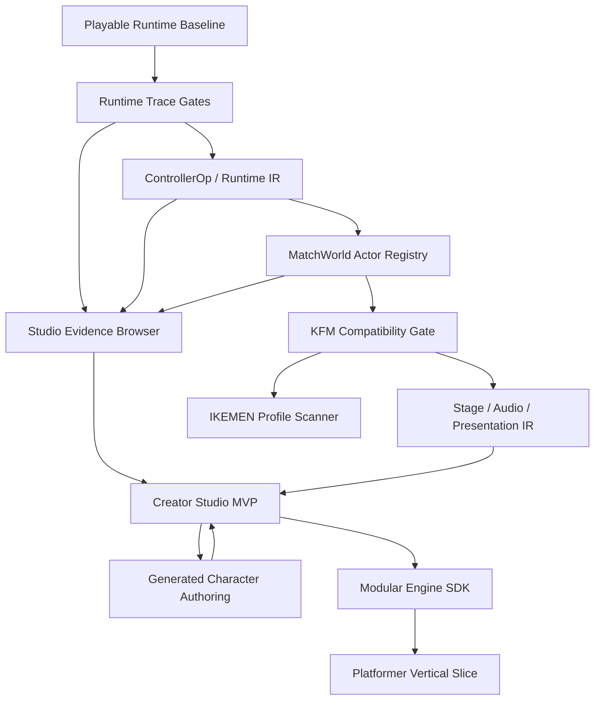

# Build Execution Backlog

This document turns the agreed architecture, Studio, generated-asset, QA, and modular-engine directions into an executable backlog. The single cross-stream construction map lives in `MASTER_CONSTRUCTION_PLAN.md`; the current operating ledger lives in `WORKPLAN.md`; architecture constraints live in `ARCHITECTURE_DECISIONS.md`. This file remains the expanded backlog context for deciding the next implementation rounds without losing the playable prototype. It does not replace `FULL_BUILD_PROGRAM.md`, `CONSTRUCTION_PROGRAM.md`, or `BUILD_PLAN.md`.

The practical wave map for all approved directions lives in `CONSTRUCTION_WAVES.md`. Use it when deciding which package can start now, which gates must close first, and which claims remain blocked.

The immediate execution authority lives in `WORKPLAN.md -> Current Execution Authority`. This backlog is intentionally broader; do not use a later backlog item to skip the runtime/evidence gates that the current authority table requires.

The product direction is intentionally broad:

1. Progressive MUGEN / IKEMEN-GO compatibility in TypeScript.
2. A local Creator Studio for importing, inspecting, generating, editing, playtesting, and exporting projects.
3. A generated character and stage pipeline backed by image generation plus sprite atlas QA.
4. A modular browser game-engine foundation that can later host platformers, beat-em-ups, arena games, and custom sprite projects.

The construction order is intentionally narrow:

```txt
Playable runtime
  -> deterministic trace gates
  -> typed controller operations
  -> real MatchWorld ownership
  -> KFM compatibility gate
  -> stage/audio/presentation parity
  -> evidence-first Studio MVP
  -> generated authoring pipeline
  -> IKEMEN profile scanner
  -> other genre module slices
```

The currently approved scope contract lives in `APPROVED_HORIZON_PLAN.md`. Use it when deciding whether a new task belongs in the current execution queue, can run in parallel as evidence/UI work, or must stay blocked until the runtime and Studio gates are stronger.

## Construction Campaign Board

This is the working board for building all agreed directions without splitting the project into unrelated prototypes.

| Campaign | Build first | Unlocks | Do not start yet |
| --- | --- | --- | --- |
| Port engine | Deterministic traces, typed controller ops, `MatchWorld` ownership, KFM route gates. | Real MUGEN compatibility can grow by evidence instead of parser counts. | ZSS/Lua, rollback, netplay, full screenpack parity. |
| Playable sandbox | Keep generated roster, Rooftop Dojo, match controls, HUD, debug bridge, and runtime URL params stable. | A usable game loop for testing every engine and Studio change. | Large visual redesigns that hide runtime diagnostics. |
| Creator Studio | Evidence Browser, Asset Library, Build Center, Character/Stage preview surfaces. | Local projects can be created, saved, compiled, playtested, and exported. | Advanced editing before project/build/evidence truth is visible. |
| Generated assets | Concept brief records, source prompt provenance, regenerated sprite rows, atlas/motion/scale QA, collision/action authoring. | Original fighters and stages become repeatable project assets. | Cropping bad source motion to pretend it is fixed. |
| IKEMEN profile | Scanner and reports for IKEMEN-only files/features before execution. | Users can understand why content loads partially or not at all. | Executing ZSS/Lua or IKEMEN-specific runtime features. |
| Modular engine | Shared project/module/input/render/audio/snapshot contracts after fighting contracts harden. | Platformer or beat-em-up slices can reuse the engine without MUGEN leakage. | Production multi-genre tooling before the fighting MVP proves the shared seams. |

The first usable horizon is not "full MUGEN." It is a private workbench where a user can load or select a character, see exactly what parsed/decoded/compiled/executed, play a stable match, export evidence, and keep building from that truth.

## Usable MVP Definition

The next "usable" bar is:

1. Default match mode opens with at least three local fighters and one stage.
2. Inspector can load a MUGEN character ZIP/folder, inspect DEF/AIR/CMD/CNS/SFF status, scrub AIR actions, and show Clsn1/Clsn2.
3. Runtime can route at least one imported KFM/CodeFuMan-style attack through real CMD/CNS data when the local fixture exists.
4. Studio can save/reopen a project, list assets with provenance, compile `project.json` into `runtime-manifest/v0`, and export compatibility/runtime evidence.
5. Build Center can export `export-bundle/v0` with browser-fetchable assets, current-session imported source files, checksums, and `sourcePackages` relink metadata.
6. Evidence Browser can filter parser, compiler, runtime trace, asset QA, compatibility, and diagnostic records.
7. Generated fighter pipeline can produce or replace one fighter with visible prompt provenance, atlas QA, motion/scale checks, collisions, and a playtest route.
8. End-of-round gates are green: `pnpm test`, `pnpm typecheck`, `pnpm build`, plus browser screenshots/diagnostics for visible or runtime behavior.

## Review Consensus

The current consensus from runtime architecture, product/UX, and QA review is:

- The expandable MVP is a typed, traceable, renderer-independent `MatchWorld`, not a bigger UI shell.
- `PlayableMatchRuntime` must shrink through incremental system extraction instead of gaining more raw controller paths.
- The hard runtime path is `RuntimeTrace -> ControllerOp -> MatchWorld -> KFM gate`; Studio and modular-engine work should not bypass that order.
- Studio should expose real project, runtime, asset, and evidence data before advanced editing.
- The Studio product order is Asset Library, Evidence Browser, Build Center, Character/Stage previews, Runtime Debug Studio, then authoring.
- Generated assets must be regenerated when source motion, scale, or pose is wrong; atlas slicing is not a cure for bad source art.
- A future platformer or beat-em-up module should prove shared engine contracts only after the fighting module has earned them.
- Every milestone closes with tests, a repeatable browser smoke where visible/runtime behavior changed, and honest compatibility labels.
- Official fixtures can be optional for local availability, but skipped official fixtures block official compatibility claims.
- Studio IA should behave like a trust workflow: `Project / Workbench -> Assets -> Evidence -> Build`, with `Character`, `Stage`, and `Debug` as contextual tools rather than equal editor tabs.
- Shared-core extraction starts with Studio/Build/Evidence contracts and import-boundary checks. Do not promote `src/game`, `MugenSnapshot`, or fighting renderer/audio types into core before they are behind generic interfaces.

## Delivery Plan

Use `MASTER_CONSTRUCTION_PLAN.md` as the release-train source of truth. The backlog is worked in this order:

| Step | Work package | Exit signal |
| --- | --- | --- |
| 1 | Runtime evidence kernel | Trace artifacts explain commands, controllers, combat reasons, actor/effect summaries, and final checksum. |
| 2 | Typed controller-operation migration | New high-value controller families produce typed operation evidence instead of only raw controller-name counts. |
| 3 | MatchWorld actor ownership | Players, helpers, projectiles, explods, targets, owners, roots, parents, and sprite owners are inspectable without changing tick behavior. |
| 4 | Official fixture gate | KFM/KFM720/CodeFuMan/SF3 Ryu reports drive focused compatibility work; one KFM normal and one special have hit/guard/state-exit evidence. |
| 5 | Stage/audio/presentation IR | Stage and sound behavior has renderer-independent diagnostics before richer Three.js presentation. |
| 6 | Evidence-first Creator Studio | Project, assets, evidence, build, preview, debug, and modules expose real data before advanced editing. |
| 7 | Generated authoring pipeline | Imagegen and `sprite-atlas-builder` outputs become provenance-rich, QA-gated, collision-authored runtime assets. |
| 8 | IKEMEN profile scanner | IKEMEN-only features are classified separately from MUGEN support claims. |
| 9 | Modular engine contracts | Shared module contracts are extracted only after fighting-runtime seams are proven. |
| 10 | Platformer slice | A non-fighting scene runs from project/build data through shared adapters. |

2026-06-25 construction refresh: all approved ideas remain in scope, but the next implementation work should tighten the runtime/evidence spine before adding more editor surface. The first refreshed runtime slices moved `Projectile`, `Helper`, `Explod`, `HitFall*`, and `FallEnvShake` into typed `ControllerOp` plus system/trace evidence. `RuntimeEffectActorWorld` is now the world-style boundary for effect actor stores, active/presentation effect advance passes, reset, summaries, and bounded projectile combat handoff; it is created by `MatchWorld` and injected into `PlayableMatchRuntime`. `MatchWorld.targetLinks` now exposes bounded target memory/binding ownership to Debug Studio and trace world evidence, `RuntimeTraceGate.requiredWorldLifecycleEvents` can require world spawn/active/remove evidence such as the synthetic Projectile spawn/remove path, `RuntimeTraceGate.requiredEffectStores` can require producer-store evidence for helper/projectile/explod ownership, and `RuntimeTraceGate.requiredMatchPauses` / `requiredMatchPauseAdvances` / `requiredMatchPauseFreezes` can require actual match-freeze snapshot plus actor/effect advance/freeze evidence for Pause/SuperPause routes, including the bounded SuperPause+Projectile source-movetime advance/freeze artifact. `ProjectileCombatSystem` now also proves a bounded held-back projectile guard route through `synthetic-imported-projectile-guard` and a bounded equal-`projpriority` projectile-vs-projectile trade/removal route through `synthetic-imported-projectile-clash`, but exact projectile priority classes, cancel/remove animations, full guard effects, and IKEMEN/MUGEN projectile parity remain future work. Next runtime work should promote exact projectile parity beyond the bounded clash subset, exact effect pause/tick ordering, exact target semantics, or real KFM/Common1 get-hit/fall/guard-state gates. Studio visual planning is allowed, but implementation must stay evidence-bound.

## Planning Principles

### Runtime First

The app should always open into a playable match. Imported compatibility can be partial, but the local generated roster and native stage must remain usable for runtime, renderer, UI, and QA checks.

### Runtime Monolith Pressure

`PlayableMatchRuntime` is the current risk center. Every runtime feature proposal must answer whether it reduces, preserves, or increases raw-runtime complexity. Increases are allowed only for small transitional cuts with a trace/test and a follow-up item that moves the behavior into typed IR, `ControllerOp`, `MatchWorld`, or a named system.

### Evidence Before Editing

Studio surfaces should first answer:

- What exists?
- Where did it come from?
- What parsed, decoded, compiled, executed, or failed?
- What artifact proves that?

Only then should the same surface become an editor.

### Contracts Before Features

New runtime features should enter through typed seams:

- `RuntimeTrace` and `RuntimeTraceArtifact` for repeatable evidence.
- `ControllerOp` / compiled IR for state controllers.
- `MatchWorld` for tick order, actor ownership, and snapshots.
- `project.json` for editor/project state.
- `runtime-manifest/v0` for runtime build data.

### Labels Before Claims

Compatibility status must use these levels:

```txt
Parsed
Decoded
Recognized
Compiled
Executed Partial
Executed Parity
Unsupported
Unknown
```

Never collapse parser coverage into runtime support.

## Dependency Graph



## Workstreams

### WS1: Runtime Kernel

Purpose: make the match engine deterministic, inspectable, and modular enough to host MUGEN behavior without becoming an untestable monolith.

Owns:

- `MatchWorld` as the public runtime boundary.
- Actor registry and ownership metadata.
- Tick order, pause order, collision order, and snapshot building.
- Structured combat decisions and runtime events.
- Deterministic traces and replay-style QA artifacts.

Primary deliverables:

- `MatchWorld` owns actor lifecycle instead of only delegating.
- `PlayableMatchRuntime` becomes an integration layer around systems.
- Actors expose `actorKind`, `ownerId`, `rootId`, `parentId`, `stateOwner`, and `spriteOwner`.
- Combat explains hit, guard, whiff, reject, override, reversal, and projectile interactions.

Hard gate:

- Runtime trace checksums remain stable for unchanged behavior.
- Every tick-order or combat change produces trace evidence.

### WS2: Compatibility Compiler

Purpose: convert MUGEN text/binary data into bounded, typed contracts that can be executed, skipped, and reported honestly.

Owns:

- CMD compiler.
- Expression and trigger compiler.
- CNS controller compiler.
- Compatibility profiles: `mugen-1.0`, `mugen-1.1`, `ikemen-go-scan`.
- Source locations and unsupported feature classification.

Primary deliverables:

- `HitDef`, `Target*`, `Pause`/`SuperPause`, `Projectile`, `Helper`, and `Explod` move through typed controller operations.
- `[State -1]` command routing is inspectable from compiled command and trigger data.
- Reports show recognized, compiled, executable, partial, unsupported, and unknown counts separately.

Hard gate:

- New controller parity cannot increase raw `controller.source` dependency without a debt note and test coverage.

### WS3: KFM And Fixture Compatibility

Purpose: make one official character meaningfully playable through real imported data, then broaden coverage through measured fixtures.

Owns:

- Official KFM and KFM720 local fixture gates.
- CodeFuMan SFF v1 / PCX path.
- SF3 Ryu demo parser/report stress path.
- Imported stage fixture path.

Primary deliverables:

- KFM idle, walk, crouch, jump, one normal, one special, hit, guard, state exit, target memory, and partial custom-state return.
- Browser QA for imported sprites, boxes, commands, state numbers, HUD, and runtime debug.
- Fixture matrix results under `.scratch/qa/<feature>/`.

Hard gate:

- Do not claim full KFM or IKEMEN compatibility. The gate is explicitly partial and evidence-backed.

### WS4: Stage, Camera, Audio, And Presentation

Purpose: turn imported stages, common effects, and sound behavior into testable systems instead of renderer guesses.

Owns:

- Stage BG IR.
- Camera, floor, bounds, zoffset, localcoord, player starts.
- Delta/parallax, tiling, velocity, masks, windows, layers, and first BGCtrl pass.
- SND channel model and Web Audio diagnostics.
- FightFX/common effect resolution plan.

Primary deliverables:

- Stage reports separate parsed, rendered, animated, fallback, and unsupported layers.
- Audio diagnostics include source actor, channel, group/index, decoded payload, and stop behavior.
- Projection and camera logic remain testable outside Three.js.

Hard gate:

- No stage layer or audio event may silently disappear.

### WS5: Creator Studio Product Surface

Purpose: turn the sandbox into a local project workspace while keeping runtime truth visible.

Owns:

- Project Dashboard.
- Asset Library.
- Character Studio.
- Stage Studio.
- Runtime Debug Studio.
- QA / Evidence Browser.
- Module Studio.
- Build Center.

Primary deliverables:

- `project.json` is the editor/source-preserving contract.
- `runtime-manifest/v0` is the compiled runtime contract.
- Asset records show provenance: `mugen-import`, `ikemen-import`, `generated`, `authored`, `converted`, `runtime`.
- Build Center exports project, runtime manifest, compatibility reports, trace artifacts, and eventually workspace packages.

Hard gate:

- Studio cannot persist or export a "green" state when compile warnings, missing assets, or unverified runtime paths exist.

### WS6: Generated Asset Authoring

Purpose: make generated fighters and stages reliable runtime assets with visible provenance and QA.

Owns:

- Character concept briefs.
- Imagegen source prompts and generated-sheet provenance.
- `sprite-atlas-builder` normalization, manifests, contact sheets, GIFs, and motion QA.
- Collision/action authoring.
- MUGEN-lite template export for generated characters.

Primary deliverables:

- Generated fighter has idle, walk, crouch, jump, punch, kick, hitstun.
- Walk reads as walking, with alternating legs and stable cadence.
- Crouch and jump do not inflate relative to idle.
- Character Studio surfaces source art, atlas status, QA reports, collisions, and runtime playtest.

Hard gate:

- Bad generated motion requires regenerated source art, not cosmetic cropping.

### WS7: IKEMEN Profile And Extensions

Purpose: classify IKEMEN features without confusing them with broken MUGEN content.

Owns:

- IKEMEN profile detection.
- ZSS, Lua, and extended stage/system feature scanning.
- IKEMEN-only unsupported sections in reports.
- Research notes for future execution.

Primary deliverables:

- `ikemen-go-scan` profile scanner.
- Report sections for IKEMEN-only files, controllers, config, scripts, and presentation features.
- No execution claims without runtime evidence.

Hard gate:

- Do not implement ZSS, Lua, rollback, netplay, or model stages before the MUGEN/fighting MVP is stable.

### WS8: Modular Engine Expansion

Purpose: prove the engine can host another genre after the fighting module stabilizes.

Owns:

- Shared module contract.
- Platformer project template.
- Level/tile model.
- Platformer physics, camera follow, collectibles, hazards, and basic enemies.
- Module Studio configuration.

Primary deliverables:

- Tiny platformer scene runs from project/build data.
- Three.js adapter consumes snapshots without knowing platformer rules.
- Shared core remains free from CNS, HitDef, round, helper, and command-routing concepts.

Hard gate:

- Do not start production platformer tooling before the fighting module proves shared contracts.

## Milestone Backlog

### M0: Baseline Control

Goal: keep the current app stable while the expanded plan becomes operational.

Build:

- Preserve Runtime, Inspector, and Studio URL modes.
- Keep three local fighters and Rooftop Dojo playable.
- Keep trace artifact export visible in Studio Build and evidence records visible in Studio Evidence.
- Keep docs linked and honest.

Acceptance:

- `pnpm test`
- `pnpm typecheck`
- `pnpm build`
- Runtime screenshot.
- Studio Build screenshot after trace export.
- `window.__MUGEN_WEB_SANDBOX__` diagnostics include mode, selected fighters, stage, renderer, project, compiled project, studio evidence, and trace artifact when exported.

Blockers:

- Blank canvas.
- Broken roster/stage selection.
- Atlas QA hidden.
- Unsupported feature crash.
- Docs implying full MUGEN/IKEMEN compatibility.

### M1: Trace Gates And Controller Ops

Goal: make compatibility changes proveable before expanding controller parity.

Build:

- Add golden runtime trace scripts for native generated match.
- Add synthetic imported CMD/CNS trace gates.
- Add optional KFM trace scripts when local fixtures exist.
- Extend controller IR for `HitDef` and `Target*`.
- Make `CombatResolver` return structured reason payloads.

Acceptance:

- Trace artifacts include script, checksum, final actors/effects, events, and gates.
- A failed gate says what evidence is missing.
- State Browser / Evidence UI can show compiled operations separately from parsed controllers.

Blockers:

- Unstable checksums for unchanged scripts.
- Gate passes without evidence.
- Raw controller paths grow without explicit debt.

### M2: MatchWorld Actor Ownership

Goal: move match behavior behind a first-class world model.

Build:

- Actor registry for players, helpers, projectiles, explods, and target records.
- Ownership metadata for logical state ownership and sprite ownership.
- Snapshot builder owned by `MatchWorld`.
- First migration of helper/projectile/explod lifecycle behind systems.
- Trace coverage for owner/root/parent metadata.

Acceptance:

- Runtime Debug Studio can show actor tree and ownership.
- Helpers, projectiles, and explods are inspectable entities.
- Combat reports owner and reason for hit/guard/whiff/reject.

Blockers:

- Owner/root/parent confusion.
- Target memory leaks.
- Renderer state used as runtime source of truth.
- New side effect bypasses world systems.

### M3: Official KFM Fixture Route Gate

Goal: make official KFM meaningfully playable through real data without inflating support claims.

Build:

- Improve `[State -1]` routing for common attacks and one special.
- Broaden trigger expression support needed by KFM/Common1.
- Execute supported controller subset through typed ops.
- Improve HitDef, guard, target memory, get-hit, recovery, and state exit evidence.

Acceptance:

- KFM stands, walks, crouches, jumps, performs one normal, performs one special.
- Normal/special can hit or guard a dummy.
- Runtime session report shows routed states, executed controllers, active commands, hit/guard events, and unsupported features.

Blockers:

- Parser count sold as runtime support.
- Missing fixture but compatibility claimed.
- External assets committed to repo.
- Fixture crashes instead of reporting unsupported features.

### M4: Stage, Camera, Audio, Presentation

Goal: make stage and audiovisual behavior measurable.

Build:

- Stage BG IR for static and animated layers.
- More complete camera/floor/projection tests.
- Delta/parallax/tile/velocity/window/mask/layer support by level.
- First BGCtrl classification.
- SND channel model and audio event diagnostics.
- FightFX/common effect lookup plan.

Acceptance:

- Imported stage report separates parsed, rendered, animated, fallback, unsupported.
- Browser screenshots prove stage projection and fallback labels.
- Audio diagnostics prove decoded sounds or clear failure reasons.

Blockers:

- Silent missing layer.
- Fallback presented as rendered parity.
- Camera/floor visibly wrong without diagnostics.
- Sound event claim without decoded payload.

### M5: Evidence-First Creator Studio MVP

Goal: make Studio a usable local project workspace.

Build:

- Project Dashboard for recent projects and templates.
- Asset Library table with provenance, validation, reports, and missing refs.
- Evidence Browser with filters by asset, feature, level, fixture, and session.
- Build Center for project manifest, runtime manifest, warnings, trace artifact, report export, and package export.
- Character Studio preview for AIR/action/collision/command/state summaries.
- Stage Studio preview for bounds/floor/zoffset/starts/layers/report.
- Runtime Debug Studio for entity tree, commands, states, controllers, targets, helpers, projectiles, explods, pause/audio/effects.

Acceptance:

- User can create, save, reopen, compile, playtest, and export a project locally.
- `project.json -> runtime-manifest/v0 -> playtest/export` is visible and diagnostics-backed.
- Reports are filterable instead of JSON walls.
- Center preview/playtest remains visible for workbench-style flows.

Blockers:

- Hidden renderer state becomes editor state.
- Missing external asset marked valid.
- Persisted edit lacks compile/playtest warning.
- Unsupported/partial status not visible near affected feature.

### M6: Generated Character Authoring

Goal: make original generated fighters a repeatable authoring pipeline.

Build:

- Character concept brief schema.
- Imagegen prompt/source/provenance records.
- Sprite row regeneration workflow.
- Atlas normalization and motion/scale QA ingestion.
- Collision/action authoring first pass.
- Generated MUGEN-lite DEF/AIR/CMD/CNS template export.
- Runtime roster integration and QA badges.

Acceptance:

- One new generated fighter can be created, atlas-normalized, visually reviewed, collision-authored, and played.
- Contact sheets, GIFs, motion reports, browser screenshots, and trace artifacts are preserved.
- Walk/crouch/jump scale and motion checks are visible in Studio.

Blockers:

- Bad source motion hidden by slicing.
- Scale inflation in crouch/jump.
- Missing QA report but green badge.
- Generated asset confused with imported MUGEN support.

### M7: IKEMEN Compatibility Profile

Goal: classify IKEMEN-specific content honestly.

Current first cut:

- `IkemenFeatureScanner` creates `CompatibilityReport.profiles.ikemen` and labels findings as `Recognized + Unsupported`.
- Exported compatibility JSON, DebugPanel, Studio Evidence, and unsupported-feature summaries show scanner-only IKEMEN findings.
- Detected first-cut features include ZSS files/references/controller syntax, Lua files/hooks including `hook.*`, IKEMEN config JSON, screenpack/select signals such as `unlock` and `commandlist`, `IkemenVersion`, selected IKEMEN-only controllers/triggers/`AssertSpecial` flags, model-stage assets, and named 3D/Z stage params.

Build:

- Broader `ikemen-go-scan` fixture corpus.
- Broader ZSS/Lua/config/screenpack/stage/system feature detection.
- Report sections for IKEMEN-only features.
- Research notes mapped to future implementation slices.

Acceptance:

- IKEMEN-only content is classified, counted, and shown in reports.
- MUGEN 1.0, MUGEN 1.1, and IKEMEN-compatible profiles stay separate.

Blockers:

- IKEMEN parse coverage described as execution.
- Unknown feature omitted from report.
- ZSS/Lua attempted before runtime contracts are ready.

### M8: Platformer Module Slice

Goal: prove modular engine expansion after the fighting module is trustworthy.

Build:

- Shared module contract.
- Platformer project template.
- Level/tile model.
- Platformer runtime module.
- Camera follow, platform collision, collectible, hazard, and simple enemy.
- Module Studio configuration.

Acceptance:

- Tiny platformer scene runs from a project manifest.
- Fighting Runtime Mode still passes regression.
- Shared core has no CNS, HitDef, round, helper, or MUGEN command-routing dependency.

Blockers:

- Platformer implementation breaks fighting runtime.
- MUGEN-only concepts leak into shared core.
- Multi-genre support is claimed before a scene runs.

## Studio Interface Roadmap

The Studio should feel like a dense game-development workbench, not a landing page.

### Shell

Destination IA: two public modes, `Playable Runtime` and `Creator Studio`. The existing public `Inspector Mode` is transitional and should move under Studio as Character Studio/Data Inspector once Studio has enough project/import surfaces to host it cleanly.

| Zone | Purpose |
| --- | --- |
| Top bar | Active project, project type, build status, Playtest, Save, Export. |
| Left rail | Project, Assets, Character, Stage, Runtime Debug, Evidence, Modules, Build. |
| Center viewport | Match playtest, AIR preview, stage preview, or trace playback. |
| Right inspector | Contextual selection details: asset, frame, layer, actor, warning, module. |
| Bottom strip | Timeline, trace scrubber, logs, commands, warnings, recent events. |

### Surfaces

| Surface | First useful version | Later version |
| --- | --- | --- |
| Project Dashboard | Recent projects, templates, active entry, project health, Playtest. | Search, tags, thumbnails, health history. |
| Asset Library | Dense asset browser with type, source, status, reports, missing refs, selected-asset dependency graph, playtest-entry replacement flow, and source/runtime mapping. | Batch import, diff, source asset replacement. |
| Evidence Browser | Filter by asset, feature, support level, fixture, trace, runtime session. | Trace scrubber, comparison, release evidence bundles. |
| Build Center | `project.json`, `runtime-manifest/v0`, warnings, trace/report export, `export-bundle/v0` ZIP with browser-fetchable local assets and current-session imported source files/checksums. | Persisted source-package reassociation, release checklist. |
| Character Studio | AIR actions, frame timeline, sprite source, axis, Clsn1/Clsn2, command/state summary. | Collision editing, action editing, generated sprite replacement. |
| Stage Studio | Floor, bounds, starts, zoffset, camera, layer list, stage report. | BGCtrl timeline, layer editing, parallax debugger. |
| Runtime Debug Studio | Entity tree, commands, states, controllers, targets, helpers, projectiles, explods, pause/audio/effects. | Breakpoint-like watches, trace diffing, compatibility replay. |
| Module Studio | Active/planned/missing modules, read-only settings, SDK notes. | Editable module settings, custom module registration. |

## First Implementation Rounds

Use this as the next practical queue.

0. Done first cut: `pnpm qa:smoke` now starts or targets a Vite server, captures Runtime desktop/mobile and Studio Build/Evidence screenshots, exports a smoke trace artifact, and writes QA bridge diagnostics under `.scratch/qa/qa-smoke/`.
1. Done first cut: `pnpm qa:trace` now exports deterministic required native-hit and synthetic imported CMD/CNS gates, plus optional official KFM `x` and `QCF_x` artifacts when the local fixture exists.
2. Done second cut: `RuntimeTraceArtifact` gates now export combat reason evidence for hit, inferred whiff, held-back guard, and HitBy/NotHitBy reject routes; override/reversal reasons are typed and categorized for future gates.
3. Done first cut: imported runtime sessions and trace gates now expose `executedOperations`, and synthetic imported traces require typed `hitdef` operation evidence instead of accepting controller-name execution alone.
4. Done first cut: `pnpm qa:trace` now includes a synthetic imported Target* route proving typed `target:*` operations after real HitDef target memory; later evidence gates now also require world-visible `targetLinks` for the same route.
5. Promote trace artifact visibility into a reusable Evidence Browser data source. First cut plus bounded in-session trace history, persisted history, artifact comparison, metric/gate review, and a frame checksum/event/delta scrubber exist in Studio Evidence; next work is multi-artifact replay-style trace diffing, source relink/regenerate actions, and richer reason/operation payloads in the UI.
6. Done first cut: `MatchWorld` exposes a derived actor registry from runtime snapshots, indexing players/effects by id, kind, owner, lifecycle status, and per-tick lifecycle event without changing match state.
7. Done first cut: Runtime Debugger now surfaces the actor registry and `pnpm qa:smoke` validates that both player actors are visible through the UI/QA bridge.
8. Done first cut: Studio now has a URL-addressable `Debug` surface with the live match playtest, actor registry, ownership index, runtime snapshot facts, selectable actor detail, command-palette actor jumps, and QA smoke coverage. Next work is filters and links to traces/controllers.
9. First extraction cut done: Target* controller side effects now apply through `TargetSystem` instead of living inline in the main `PlayableMatchRuntime` controller loop, while state-entry validation remains a match-runtime callback. `EffectActorSystem` now owns the mutable per-fighter store for Explod/Helper/Projectile serials, bounded lists, advance/removal mutation, hit-removal pruning, snapshot handoff, and read-only store summaries. `RuntimeEffectActorWorld` wraps those stores behind a world-style contract for spawn, active/presentation advance passes, removal, reset, snapshots, summaries, and bounded projectile combat handoff; `ProjectileCombatSystem` owns the bounded projectile contact/reject/override/damage/removal loop; `MatchWorld` creates/injects the world and exposes lifecycle status plus `spawn`/`active`/`remove` events, `targetLinks`, and `effectStores` to Debug Studio, trace artifacts, and smoke QA. Next: lift exact projectile parity, exact target semantics, and exact effect pause/tick decisions into `MatchWorld` without checksum drift.
10. Done Pause/SuperPause typed-operation cut: `Pause`/`SuperPause` now compile into typed `pause:*` operations, `PauseSystem` consumes that data, imported runtime sessions record `pause:pause` and `pause:superpause`, and `pnpm qa:trace` includes required `synthetic-imported-superpause.json` with typed operation, pause event, required `matchPause` snapshot evidence for actor/state/darken/remaining/movetime, and required P2 frozen-actor evidence. The follow-up `synthetic-imported-superpause-projectile-freeze.json` gate proves bounded `p1` projectile effect evidence for advancing during source `movetime` and freezing afterward during SuperPause without claiming full projectile/helper/explod pause parity.
11. Done guard/hitstun/fall-metadata/custom-get-hit/state-exit cut: `pnpm qa:trace` now exports required synthetic imported guard, hitstun, fall-metadata, attacker-owned custom get-hit controller-flow, and state-exit gates plus optional `kfm-official-x-guard.json`, `kfm-official-x-hitstun.json`, and `kfm-official-x-state-exit.json` when the local KFM fixture exists. The real KFM normal route now proves `x -> 200`, hit/guard evidence, target partial hitstun (`animNo=500`, `moveType=H`), and a longer recovery script returning P1 to idle/control. The synthetic fall gate proves simple `fall.*` HitDef metadata reaches `hitFall`; the synthetic custom get-hit gate proves `p2stateno` can route the defender into an attacker-owned state that executes partial `HitFallVel`, `HitFallDamage`, `HitFallSet`, and `FallEnvShake`. Later cuts added defender-owned Common1 fall, bounded synthetic plus optional official KFM recovery gates, a first bounded defender-owned guard-hit state route, a bounded synthetic recovery-input branch, optional official KFM air recovery-input evidence, and optional official KFM ground recovery-input evidence; remaining work is exact guard start/end/proximity/crouch/air parity, exact recovery thresholds/velocities, broader ground/air recovery parity beyond the bounded routes, and exact tick-order parity.
12. Done sixth cut: Studio now has a URL-addressable `Assets` surface with provenance/status filters, project asset flow summary, selectable asset cards, asset triage metrics, selected asset detail, playtest-entry replacement flow, source/runtime mapping, visual dependency graph, dependency drilldown, missing/partial reference summary, related evidence, entry asset summary, attention queue, QA bridge `studioAssets`, and smoke screenshot coverage. Later UI polish replaced the narrow sidebar table with card-based selection, kept the right pane as the asset detail/triage authority, moved the mobile runtime status strip away from the fighters, and removed list virtualization that produced blank full-page visual QA rows. Next work is source asset replacement and binary asset bundling.
13. Done Projectile typed-operation cut: `Projectile` now compiles into typed `projectile` operations, `ProjectileSystem` consumes that data, imported runtime sessions record `executedOperations.projectile`, and `pnpm qa:trace` includes required `synthetic-imported-projectile.json` with projectile effect actor, required world lifecycle spawn/remove evidence, required producer-store evidence, hit evidence, and required world-visible target-memory `targetLinks` evidence.
14. Done Helper typed-operation cut: `Helper` now compiles into typed `helper` operations, `HelperSystem` consumes that data, imported runtime sessions record `executedOperations.helper`, and `pnpm qa:trace` includes required `synthetic-imported-helper.json` with helper effect actor plus required world lifecycle spawn/active and producer-store evidence.
15. Done Explod typed-operation cut: `Explod` now compiles into typed `explod` operations, `RemoveExplod` compiles into typed remove data, `ExplodSystem` consumes typed spawn data, imported runtime sessions record `executedOperations.explod`, and `pnpm qa:trace` includes required `synthetic-imported-explod.json` with visual explod effect actor plus required world lifecycle spawn/active and producer-store evidence.
16. Done HitFall typed-operation cut: `HitFallVel`, `HitFallDamage`, and `HitFallSet` now compile into typed `hitfall:*` operations, `FallEnvShake` compiles into typed `fallenvshake` evidence, `StateControllerExecutor` prefers typed `HitFallSet` values, and the required `synthetic-imported-common-gethit.json` gate asserts those operation counts.
17. Done default Common1 get-hit entry cut: `HitDef` without `p2stateno` can route imported defenders into their own known Common1-style state `5000`; `pnpm qa:trace` includes required `synthetic-imported-default-gethit.json` plus optional `kfm-official-default-gethit.json`, where official KFM as defender enters real Common1 state `5000`.
18. Done default Common1 stand progression cut: `HitShakeOver` and `HitOver` triggers now advance defender-owned get-hit states; `pnpm qa:trace` includes required `synthetic-imported-default-gethit-progression.json` plus optional `kfm-official-default-gethit-progression.json`, where official KFM as defender executes real Common1 `5000 -> 5001 -> 0` and returns to idle/control. Later cuts now cover synthetic fall/recovery, synthetic recovery input, optional KFM lie-down entry, optional KFM `5110 -> 5120 -> 0` recovery, optional KFM `5050 -> 5210 -> 52 -> 0` air recovery input, optional KFM `5050 -> 5200 -> 5201 -> 52 -> 0` ground recovery input, and bounded stand/crouch guard-hit `150 -> 151` / `152 -> 153`; next work is exact guard behavior, exact recovery thresholds/velocities, broader ground/air recovery parity, and exact tick-order parity.
19. Done default Common1 fall branch, bounded recovery-chain, and bounded recovery-input cuts: `GetHitVar(yaccel)` now has a bounded runtime default, synthetic fall HitDefs can include `ground.velocity` Y, imported no-control/get-hit states are preserved from input/AI idle overrides, `fall.recovertime` now gates `CanRecover`, and `pnpm qa:trace` includes required `synthetic-imported-default-fall-gethit.json`, required `synthetic-imported-default-fall-recovery.json`, required `synthetic-imported-default-fall-recovery-input.json`, plus optional `kfm-official-default-fall-gethit.json`; the required synthetic fall gate proves `5000 -> 5030 -> 5050`, the required synthetic recovery gate proves `5000 -> 5030 -> 5050 -> 5100 -> 5101 -> 5110 -> 5120 -> 0`, the required synthetic recovery-input gate proves `CanRecover + command = "recovery"` can route `5050 -> 5210 -> 0`, and official KFM now proves real Common1 `5000 -> 5030 -> 5050 -> 5100 -> 5101 -> 5110`. Later KFM recovery evidence proves `5110 -> 5120 -> 0`, KFM air recovery-input evidence proves `5050 -> 5210 -> 52 -> 0` with checksum `e9a28c13`, and KFM ground recovery-input evidence proves `5050 -> 5200 -> 5201 -> 52 -> 0` with checksum `7894f132`. Next: exact guard behavior, exact recovery thresholds/velocities, broader ground/air recovery parity, and exact tick-order parity.
20. Done KFM official lie-down/get-up and air recovery-input cuts: CNS `[Movement]` and `[Data]` constants now flow into imported character definitions for `Const(movement.*)` and bounded down-recovery lookups, imported state entry provides a `Time = 0` evaluation point, imported CNS-derived attacks require their own `HitDef` before runtime hit activation, imported get-hit states can preserve positive ground-impact `pos y` until Common1 controllers resolve the transition, `kfm-official-default-fall-recovery.json` proves real KFM can continue from `5110` into `5120` and return to `0` with control, and `kfm-official-default-fall-recovery-input.json` proves real KFM can leave `5050` through `CanRecover + command = "recovery"`, enter `5210`, land through `52`, and return to `0` with control.
21. Done Common1 guard-hit route cut: guarded imported defenders can enter known defender-owned stand/crouch guard-hit states such as `150 -> 151` and `152 -> 153`; `command = "name"` can now be evaluated inside simple composite expressions such as `151 + 2*(command = "holddown")`; `GetHitVar(slidetime)` and `GetHitVar(ctrltime)` now return runtime-backed values from parsed `guard.slidetime` and `guard.ctrltime` on direct `HitDef` and bounded `Projectile` guard results, falling back to bounded `0` when absent; `pnpm qa:trace` includes required `synthetic-imported-default-guard-state.json`, required `synthetic-imported-crouch-guard-state.json`, optional `kfm-official-default-guard-state.json`, and optional `kfm-official-default-crouch-guard-state.json` when the local KFM fixture exists. This does not claim exact guard distance, guard start/end, full crouch/air guard transitions, guard sparks/sounds, or perfect MUGEN/IKEMEN guard parity.
36. Done guard timing evidence cut: the synthetic default guard-state artifact now declares `guard.slidetime` and `guard.ctrltime`, verifies those values through the runtime snapshot and trace final actor evidence, and keeps trace actor fields optional so old artifacts without nonzero guard timing do not gain meaningless checksum noise. Remaining work is exact IKEMEN/MUGEN guard tick-order, proximity, air guard, and guard effect parity.
37. Done AssertSpecial guard-restriction cut: defender-side `NoStandGuard`/`NoCrouchGuard`/`NoAirGuard` now deny bounded guard by state type, attacker-side `Unguardable` forces hit evidence in the partial hit/guard resolver, and required `synthetic-imported-assertspecial-unguardable` proves held-back defender input no longer produces guard evidence for that route. This does not claim exact AssertSpecial lifetime, priority, global behavior, pause layering, or full MUGEN/IKEMEN guard parity.
22. Done KFM official ground recovery-input cut: CNS `[Velocity]` constants now flow into imported character definitions for `Const(velocity.*)` so the bounded ground recovery route can evaluate KFM-style `velocity.air.gethit.groundrecover`; `kfm-official-default-fall-ground-recovery.json` proves real KFM can leave `5050` through `CanRecover + command = "recovery"` near the ground, enter `5200`, self-return into `5201`, land through `52`, and return to `0` with control. Current checksum: `7894f132`. This is still executed partial evidence, not exact threshold, velocity, tick-order, or guard-state parity.
23. Build Evidence Browser filters over compatibility reports and trace artifacts.
24. Done fifth cut: Build Center now shows readiness rows for runtime playtest, project manifest, runtime manifest, asset validation, source packages, trace evidence, package bundle, and compatibility gates using runnable/partial/blocked/exportable states. It can export an `export-bundle/v0` ZIP with project/runtime contracts, source-runtime maps, evidence, reports, README, latest trace when available, browser-fetchable local assets, current-session imported ZIP/folder source files with package paths/bytes/source kind/SHA-256 checksums, and `project.json` source-package metadata for linked/missing relink state. Missing source packages now have explicit ZIP/Folder relink actions in Build Center and Source Packages, and the relink validator marks a reopened package linked when the loaded source contains the required normalized paths. Next work is persistent source handles, IndexedDB source metadata, and broader blocked-action affordances.
25. Plan the Studio visual direction with three focused workbench concepts before a large UI rewrite; implement only the selected direction and only against real data.
25. Move the standalone Inspector experience into Studio as Character Studio/Data Inspector, while preserving the current URL route until the Studio replacement is visually verified.
26. Build Stage Studio preview route over current stage reports.
27. Done seventh Runtime Debug Studio cut: actor rows can be selected from the Debug surface or command palette, selection is URL-restorable through `actor`, and the selected debug lens is URL-restorable through `debug=overview|targets|effects|pause|audio`. The detail panel shows ownership, lifecycle, runtime, target links, owned actors, effect-store context, imported CNS execution evidence, command-buffer history, and linked trace frame/gate evidence. Trace frame buttons jump to the Evidence Browser scrubber; execution/trace state and controller keys jump into Inspector States with URL-restorable `filter`, `state`, `controller`, and `controllerLine` params; the Inspector States list now highlights the exact state/controller row with trigger and param detail; command links jump into Inspector Commands with URL-restorable `command` params and selected token/param detail; the Debug Lens panel exposes target-link rows, effect actors/stores, pause snapshots plus pause operation evidence, and sound/envshake event diagnostics; target/effect/pause lenses now render `RuntimeTraceArtifact.world`/gate evidence from the latest trace, including target-link frame rows when present, effect-store frame rows, and Pause/SuperPause gate evidence where available, and world frame rows can jump to the Evidence scrubber; `.studioDebug` exposes runtime session plus trace evidence and `.studioDebugFilter` exposes the active lens; and `pnpm qa:smoke` validates a `p2` selection probe, imported `p1` execution/trace drilldown, exact `hitdef` Debug-to-Inspector controller jump, command-buffer evidence, CMD Browser command jump, URL-backed targets/effects/pause/audio lens screenshots, world-evidence panels, effect world rows, and effect-world-evidence-to-scrubber navigation. Next work is deeper helper/projectile/explod detail drilldowns and richer trace-frame world diffs.
28. Add stage BG IR for currently rendered static/action-backed layers.
29. Done bounded InGuardDist trigger cut: the expression evaluator now accepts a runtime `InGuardDist` callback, imported `HitDef` data carries typed/raw `guard.dist`, `CombatResolver` exposes a bounded guard-distance box check, and `pnpm qa:trace` includes required `synthetic-imported-inguarddist.json`. This proves near-but-not-contacting explicit trigger plumbing only; exact proximity guard, exact guard end, guard effects, and air guard remain future work.
30. Done bounded automatic guard-start cut: imported defenders holding back can enter defender-owned Common1-style guard-start states such as `120 -> 130` when bounded `InGuardDist` is true before contact; `pnpm qa:trace` includes required `synthetic-imported-auto-guard-start.json` plus optional `kfm-official-auto-guard-start.json` when the local KFM fixture exists. This proves the first automatic guard-start bridge only, not exact MUGEN/IKEMEN proximity guard, guard end, effects, or air guard parity.
31. Done bounded automatic guard-end cut: imported defenders can leave the bounded auto guard route through defender-owned Common1-style state `140` and return to idle/control when `InGuardDist` is no longer true; `pnpm qa:trace` includes required `synthetic-imported-auto-guard-end.json` plus optional `kfm-official-auto-guard-end.json` when the local KFM fixture exists. This proves the first automatic guard-end bridge only, not exact MUGEN/IKEMEN guard-end timing, proximity guard, effects, or air guard parity.
32. Done first actionable Studio status contract cut: generated/imported asset records, Studio gates, Evidence records, Build readiness rows, selected asset detail, `project.json`, `.studioAssets`, `.studioEvidence`, and `pnpm qa:smoke` now carry or verify severity, impact, evidence ids, blockers, exportability, and next action.
33. Done second persisted Studio evidence comparison/review/scrubber cut: exported trace artifacts are stored in bounded browser-local evidence history with project id, entry, source-package metadata, checksum, stale/current status, `.storedTraceEvidence` / `.studioEvidence.stats.persistedTraceArtifacts` QA bridge exposure, current-vs-persisted checksum/frame/event/gate/pass deltas in `.studioEvidence.persistedTraceComparisons`, a visible Trace Comparison Review with metric/gate rows, a Trace Frame Scrubber exposed as `.traceFrameScrubber`, and `pnpm qa:smoke` coverage. The scrubber now renders per-frame actor/effect/input/event deltas plus World Delta rows for trace frames with `world`, including live actor, effect-store, target-link, and lifecycle-event counts against the previous frame plus effect-store/target/lifecycle rows. Next work is replay-style multi-artifact diffing plus real relink/regenerate action affordances.
34. Add generated fighter authoring records only after project/build/evidence surfaces can show provenance.
35. Add IKEMEN profile scanner before any IKEMEN execution work.
38. Done broader IKEMEN scanner source-map cut: report-only scanning now recognizes ZSS controller syntax, Lua `hook.*` usage, screenpack/select package signals, selected IKEMEN-only controllers, `AssertSpecial` flags, source-mapped extended triggers, model-stage assets, and named 3D/Z stage parameters while keeping ZSS/Lua/IKEMEN execution blocked.
36. Define the first platformer module slice only after shared contracts prove they do not depend on CNS, HitDef, round, helper, or MUGEN command routing.
37. Done first Stage BG IR cut: imported stage layers now preserve BG section/type metadata and `StageCompatibilityReport.backgrounds.layers` classifies each layer as rendered, animated, fallback, missing, or unsupported with start/delta/tile, sprite/action coverage, decoded frame counts, unsupported layer notes, and fallback reasons. Debug compatibility output and Studio asset summaries can now point to specific stage-layer issues. Exact parallax/window/mask/trans behavior and Stage Studio editing remain future work.
38. Done first Stage Studio preview cut: Studio now has a URL-addressable `Stage` tab that shows selected stage facts, available stage switching, floor/bounds/zoffset/camera/player starts, imported DEF/SFF/music coverage, BG layer status rows, layer diagnostics, fallback reasons, BG controller diagnostics, and unsupported stage features. `pnpm qa:smoke` captures `studio-stage.png` and asserts that imported stage layer IR is visible through the browser QA bridge. This is still preview/diagnostic-only; layer editing, exact BGCtrl parity, exact parallax/mask/window/trans behavior, and authoring tools remain future work.
39. Done bounded Stage BGCtrl execution cut: `[BG ...]` layers now preserve MUGEN `id`, `[BGCtrlDef ...]`/`[BGCtrl ...]` sections parse into renderer-independent controller IR with group `looptime`, `ctrlID`, timing, type, params, and target layer labels, and `StageCompatibilityReport.backgrounds.controllers` exposes bounded/unsupported controller rows. `stageProjection`/`AxisRenderer` apply bounded `Visible`/`Enabled`/`VelSet`/`VelAdd`/`PosSet`/`PosAdd`/`Anim`/`SinX`/`SinY` behavior to matching layers, Stage Studio shows bounded BGCtrl counts and controller diagnostics for imported and native stages, and `pnpm qa:smoke` now includes a native `BGCtrl Lab` visual/canvas probe with bounded controller rows. Exact timing/parity, window/mask/trans, broader stage side effects, and editor timelines remain future work.
40. Done Workbench command-center interface cut: Studio Workbench now opens with readiness lanes for Source/Assets/Evidence/Build, a visible operator-priority callout, direct surface jumps to Assets/Evidence/Build/Debug, and primary actions for Playtest, MUGEN ZIP intake, trace export, and runtime compile. `pnpm qa:smoke` now captures `studio-workbench.png` and asserts the command center, lanes, surface jumps, action bar, and no horizontal overflow.

## Release Evidence Bundle

Every milestone should leave a bundle under `.scratch/qa/<milestone-or-feature>/`:

```txt
.scratch/qa/<feature>/
  diagnostics.json
  runtime.png
  studio.png
  inspector.png
  trace-artifact.json
  notes.md
```

Minimum closeout:

```bash
pnpm test
pnpm typecheck
pnpm build
```

Visible changes also require browser verification. Runtime, renderer, debug panel, stage, and sprite-pipeline changes should include screenshots plus QA bridge diagnostics.

## Explicit Non-Goals For Now

- Full IKEMEN-GO parity.
- ZSS execution.
- Lua execution.
- Rollback or netplay.
- Full screenpack/motif engine.
- Full throws/custom states.
- Full helper VM.
- Full BGCtrl/model-stage parity.
- Production platformer or beat-em-up tooling before the fighting MVP stabilizes.
- Large folder reshuffles that do not reduce runtime risk.

These are future horizons, not blockers for the private usable MVP.
