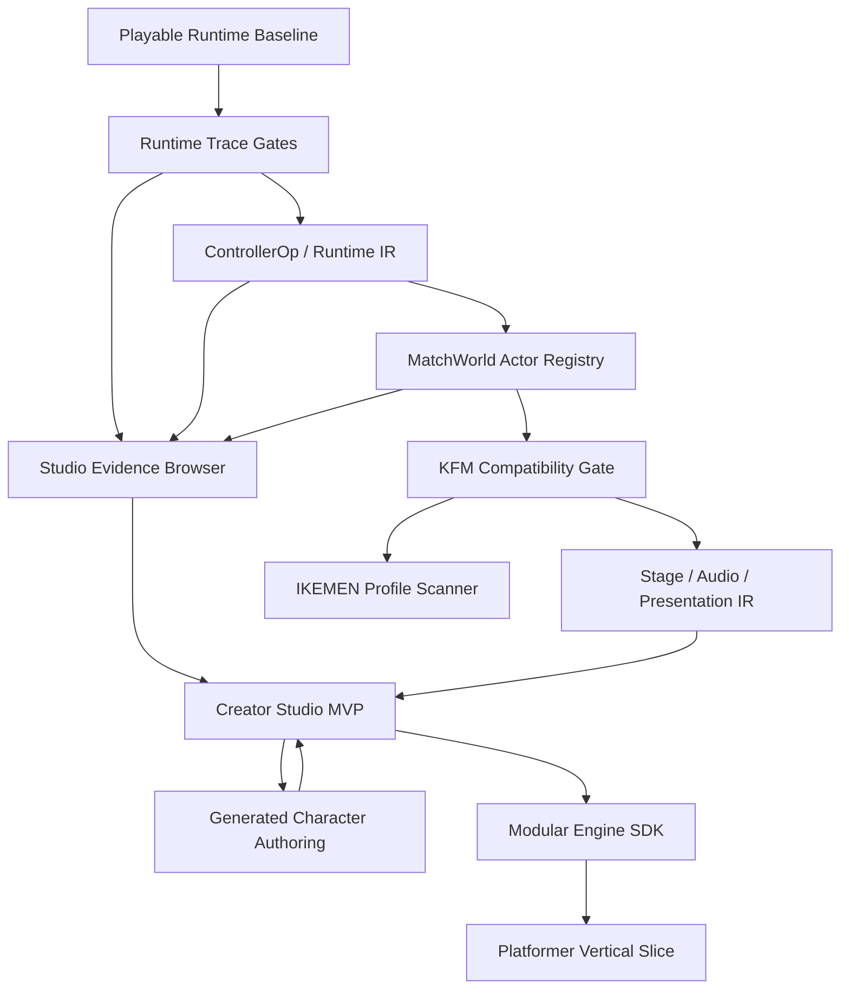

# Build Execution Backlog

## Entry 555 - bounded ProjTypeCollision collision policy/v1

Closed the source-backed IKEMEN `ProjTypeCollision` boundary. `AssertSpecial`
now exposes typed `projTypeCollision` capability; active `HitFlag = P` cancels
overlapping projectiles through defender contact memory and existing projectile
removal; flagged projectile contact uses strict current-frame `Clsn2`; paired
flagged players use `Clsn2` for direct and priority admission. Missing `Clsn2`
fails closed and flag-off behavior remains unchanged.

Focused coverage passes 5 files / 110 tests. TypeScript 7, build, boundaries,
and `git diff --check` pass. `pnpm qa:trace` passes 633/633 artifacts (599
required, 34 optional). The full `pnpm test` batch reaches 2257/2259; the two
failures are unrelated pre-existing post-fighter self-projectile expectations
and a five-second round-context timeout. No score movement. Exact projectile
trade ordering, `p2clsncheck`, `p2clsnrequire`, `affectteam`, depth/order,
rollback/netplay, and full parity remain blocked. See
`docs/reports/2026-07-16-projtypecollision-v1-closeout.md`,
`docs/research/2026-07-16-projtypecollision.md`, and Wayfinder ticket 208.

## Entry 554 - bounded TargetFacing RedirectID

Closed the root-only IKEMEN `RedirectID` route for `TargetFacing` across active
CNS and imported State -1 setup. The live root PlayerID destination owns
remembered-target facing mutation while the caller retains typed value/ID and
RedirectID expression context. Missing RedirectID stays local; invalid,
unavailable, disabled, destroyed, negative, empty, malformed, and legacy routes
fail closed. Required active and State -1 traces prove reciprocal target links,
destination ownership, target-facing mutation, target ID filtering, and typed
controller/operation telemetry with checksums `85d7fa7b` and `63d2ec84`.
Affected suites pass 5 files / 898 tests; TypeScript 7, trace syntax,
`git diff --check`, and full `pnpm qa:trace` pass 617/617 (583 required, 34
optional, 0 skipped). No score movement. TargetBind, TargetState,
helpers, projectiles, teams, exact multi-target ordering, persistence,
rollback/netplay, presentation, and full parity remain bounded separately. See
`docs/reports/2026-07-15-target-facing-redirectid-v1-closeout.md` and
`docs/research/2026-07-15-target-facing-redirectid-selection.md`.

## Entry 553 - bounded TargetVelAdd/TargetVelSet RedirectID

Closed the root-only IKEMEN `RedirectID` route for imported
`TargetVelAdd`/`TargetVelSet` across active CNS and State -1 setup. The live
root PlayerID destination owns remembered-target velocity mutation while the
caller retains typed x/y/ID and RedirectID expression context. Missing
RedirectID stays local; invalid, unavailable, disabled, destroyed, negative,
empty, malformed, and legacy routes fail closed. Required active and
state-entry traces prove target links, destination ownership, velocity
mutation, and typed controller/operation telemetry with checksums `4f62267d`
and `dedf1499`. Affected suites pass 5 files / 893 tests; TypeScript 7, trace
syntax, `git diff --check`, and full `pnpm qa:trace` pass 615/615 (581
required, 34 optional, 0 skipped). No score movement. TargetFacing,
TargetBind, TargetState, helpers, projectiles, teams, exact multi-target
ordering, persistence, rollback/netplay, presentation, and full parity remain
bounded separately. See
`docs/reports/2026-07-15-target-velocity-redirectid-v1-closeout.md` and
`docs/research/2026-07-15-target-velocity-redirectid-selection.md`.

## Entry 552 - bounded TargetLifeAdd state-entry RedirectID

Closed the explicit IKEMEN root RedirectID route for imported State -1
TargetLifeAdd. The live PlayerID 56 destination owns remembered-target life
mutation while the caller retains typed `ID`, value, `absolute`, `kill`, and
RedirectID expression context; missing RedirectID stays local and invalid,
unavailable, disabled, destroyed, negative, empty, malformed, and legacy routes
fail closed. Required trace checksum `2e4c8c1b` proves both target links,
PlayerID 56 ownership, target id 77, final p1/p2 life `1000/980`, and target
count `1` each. Affected suites pass 4 files / 867 tests; TypeScript 7, trace
syntax, `git diff --check`, and full `pnpm qa:trace` pass 613/613 (579 required,
34 optional, 0 skipped). No score movement. Active-state TargetLifeAdd is the
preceding bounded entry; helpers, projectiles, teams, exact multi-target
ordering, persistence, rollback/netplay, presentation, and full parity remain
blocked. See
`docs/reports/2026-07-15-target-life-state-entry-redirectid-v1-closeout.md` and
`docs/research/2026-07-15-target-life-state-entry-redirectid-v1.md`.

## Entry 551 - bounded TargetLifeAdd RedirectID

Closed the explicit IKEMEN root RedirectID route for imported active-CNS
TargetLifeAdd. The live PlayerID destination owns remembered-target life
mutation while the caller retains typed `ID`, value, `absolute`, and `kill`
context; missing RedirectID stays local and invalid, unavailable, disabled,
destroyed, negative, empty, malformed, and legacy routes fail closed. Required
trace checksum `74f63e7d` proves both target links, PlayerID 57 ownership, final
p1/p2 life `980/1000`, and target count `1` each. Affected suites pass 3 files /
860 tests; TypeScript 7, trace syntax, `git diff --check`, and full
`pnpm qa:trace` pass 612/612 (578 required, 34 optional, 0 skipped). No score
movement. State-entry TargetLifeAdd, helpers, projectiles, teams, exact
multi-target ordering, persistence, rollback/netplay, presentation, and full
parity remain blocked. See
`docs/reports/2026-07-15-target-life-redirectid-v1-closeout.md` and
`docs/research/2026-07-15-target-life-redirectid-v1.md`.

## Entry 550 - bounded TargetPowerAdd state-entry RedirectID

Closed the explicit IKEMEN root RedirectID route for imported State -1
TargetPowerAdd. The live PlayerID destination owns the target-memory
mutation while the caller retains value and RedirectID expression context;
missing RedirectID stays local and invalid, unavailable, disabled, destroyed,
negative, empty, malformed, and legacy routes fail closed. A required
imported trace proves the state-entry schedule, both target links, PlayerID 56
ownership, target id 77, and checksum `e531fcdc`. Affected runtime suites pass
3 files / 814 tests; TypeScript 7, trace syntax, `git diff --check`, and full
`pnpm qa:trace` pass 611/611 (577 required, 34 optional, 0 skipped). No score
movement. Helpers, projectiles, neutral identity, team/simul targets, other
Target* families, persistence, rollback/netplay, presentation, and full parity
remain blocked. See
`docs/reports/2026-07-15-target-power-state-entry-redirectid-v1-closeout.md`
and `docs/research/2026-07-15-target-power-state-entry-redirectid-v1.md`.

## Entry 549 - bounded TargetPowerAdd RedirectID

Extended the explicit IKEMEN root RedirectID route to TargetPowerAdd in
active CNS. The live PlayerID destination owns the target-memory mutation:
the destination applies the amount to its remembered target while the caller
retains the controller value and RedirectID expression context. Missing
RedirectID stays local, while empty, malformed, negative, missing, disabled,
destroyed, and legacy-profile routes fail closed before mutation. Focused
coverage passes 3 files / 855 tests, TypeScript 7, trace syntax,
git diff --check, and full pnpm qa:trace 610/610 (576 required, 34 optional,
0 skipped), with required checksum bf1cb5ce. No score movement. State-entry
controllers, helpers, projectiles, neutral identity, aggregate/team targets,
persistent timing, rollback/netplay, presentation, and full parity remain
blocked. See
docs/reports/2026-07-15-target-power-redirectid-v1-closeout.md and
docs/research/2026-07-15-target-power-redirectid-v1.md.

## Entry 548 - bounded CtrlSet RedirectID

Extended the explicit IKEMEN root RedirectID route to `CtrlSet` in active CNS
and state-entry setup. The live PlayerID target receives the control flag while
the caller retains its own control and resource state; values and RedirectID
expressions remain caller-owned, missing RedirectID stays local, and invalid
or legacy routes fail closed before mutation. Focused coverage passes 3 files /
852 tests, TypeScript 7, trace syntax, `git diff --check`, and full
`pnpm qa:trace` 609/609 (575 required, 34 optional, 0 skipped), with checksums
`9c62ad5b` and `2f21266e`. No score movement. Helpers, projectiles, neutral
identity, aggregate/team control, persistent-controller timing, rollback,
netplay, presentation, and full parity remain blocked. See
`docs/reports/2026-07-15-control-redirectid-v1-closeout.md` and
`docs/research/2026-07-15-control-redirectid-v1.md`.

## Entry 547 - bounded auxiliary resource RedirectID

Extended root-only IKEMEN `RedirectID` to GuardPointsAdd/Set, DizzyPointsAdd/Set,
and RedLifeAdd/Set across active CNS and state-entry setup. Destination lookup
uses the live PlayerID registry; dynamic values and `absolute` resolve in the
caller context, missing RedirectID stays local, and empty/malformed/negative/
missing/legacy targets fail closed before mutation. Focused coverage passes
3 files / 848 tests, TypeScript 7, trace syntax, `git diff --check`, and full
`pnpm qa:trace` 607/607 (573 required, 34 optional, 0 skipped), with checksums
`79f60677` and `0e280069`. No score movement. `CtrlSet`, helpers, projectiles,
neutral identity, shared/team banks, exact red-life recovery, and full parity
remain blocked. See
`docs/reports/2026-07-15-resource-redirectid-auxiliary-v1-closeout.md` and
`docs/research/2026-07-15-resource-redirectid-auxiliary-v1.md`.

## Entry 546 - bounded root resource RedirectID

Added IKEMEN root `RedirectID` execution for `LifeAdd`, `LifeSet`, `PowerAdd`,
and `PowerSet` in active CNS and state-entry setup paths. Destination lookup
uses the live identity registry; dynamic `value`/`kill` parameters resolve in
the caller context before target dispatch, and imported telemetry remains
visible for demo destinations. Focused coverage passes 3 files / 843 tests,
TypeScript 7, trace syntax, `git diff --check`, and full `pnpm qa:trace` 605/605
(571 required, 34 optional, 0 skipped), with checksums `a10bfbff` and
`6adde9e8`. No score movement. Helpers, projectiles, neutral identity,
shared/auxiliary resource families, exact `LifeAdd absolute`, and full parity
remain blocked. See `docs/reports/2026-07-15-resource-redirectid-v0-closeout.md`
and `docs/research/2026-07-15-resource-redirectid-v0.md`.

## Entry 545 - bounded PlayerID root-roster trigger extension

Active PlayerID trigger contexts now receive the match-owned live root roster
and caller-bound identity resolver, closing the pair-only gap for standby roots.
The required `synthetic-imported-playerid-root-roster` trace proves P3 reads P1
in tag mode and reaches state 2794 while retaining reserve/effective-control
evidence. Focal coverage passes 7 files / 845 tests, TypeScript 7, trace syntax,
`git diff --check`, and full `pnpm qa:trace` 603/603 (569 required, 34
optional, 0 skipped), with checksum `ac6f6a4b`. No score movement. Helper/
neutral identity, generic `RedirectID` mutation, exact tag scheduling/input
ownership, lifecycle promotion, and full MUGEN/IKEMEN parity remain blocked.
See `docs/reports/2026-07-15-playerid-root-roster-trigger-v1-closeout.md` and
`docs/research/2026-07-15-playerid-root-roster-trigger-v1.md`.

## Entry 544 - bounded PlayerID trigger redirection

Added static and dynamic non-negative `PlayerID(id), trigger` redirects to the
existing live root identity registry. The resolver is propagated through active,
paused, standby, and state-entry controller contexts; legacy profiles fail
closed. Numeric `PlayerID(x)` values are supported as expressions, but generic
controller `RedirectID` mutation is intentionally outside this slice. Focal
coverage passes 7 files / 685 tests, TypeScript 7, trace syntax,
`git diff --check`, and full `pnpm qa:trace` 602/602 (568 required, 34
optional, 0 skipped), including the required
`synthetic-imported-playerid` artifact. No score movement. See
`docs/reports/2026-07-15-playerid-trigger-redirection-v0-closeout.md` and
`docs/research/2026-07-15-playerid-trigger-redirection-v0.md`.

## Entry 543 - bounded identity and roster redirection

Added `partner`, `enemy`, and indexed roster redirection over the existing
`RuntimeRootSelection/v0` projection, plus `NumPartner`, `P3Name`, and
`P4Name`. `EnemyNear` keeps nearest ordering while `Enemy` keeps stable root
ordering; explicit P2 selection still fails closed. Focused compiler/evaluator/
context/root coverage passes 4 files / 95 tests, TypeScript 7, trace syntax, a
new synthetic Enemy artifact, and full `pnpm qa:trace` 601/601 (567 required,
34 optional, 0 skipped). No score movement. Exact team lifecycle, helper/neutral
redirects, input/combat/effect ownership, and full MUGEN/IKEMEN parity remain
blocked. See `docs/reports/2026-07-15-identity-redirection-v0-closeout.md` and
`docs/research/2026-07-15-identity-redirection-v0.md`.

## Entry 542 - AssetProvenance/v2 closeout

Added the versioned Studio asset provenance record and wired it into Build,
Assets, ZIP manifests, and `studio/asset-provenance.json`. Records preserve
explicit SPDX license state, input/output digests, ordered transform evidence,
config digests, QA links, migration warnings, and redacted paths. Missing
license or evidence blocks release readiness but leaves a diagnostic snapshot
available. Focal 8/8, TypeScript 7, and the focused browser/ZIP gate pass with
6 records, 6 blocked, 12 transforms, zero path leaks, and no browser errors.
The broad smoke wrapper timed out later and is not counted as global green. No
score movement. See
`docs/reports/2026-07-14-asset-provenance-v2-closeout.md` and
`docs/research/2026-07-14-asset-provenance-v2.md`.

## Entry 541 - PackageAnalysis/v0 closeout

Added `mugen-web-sandbox/package-analysis/v0` over the existing VirtualFileSystem.
The report classifies character, stage, system, and screenpack files, resolves
or preserves missing dependencies, reads `select.def` entries, carries
source-located parser diagnostics, exposes MUGEN profile/version metadata, and
maps the existing IKEMEN scanner to explicit `recognized` / `unsupported` /
`unknown` findings. The result is deterministic and checksum-protected. Mixed,
stage-only, and system-only fixtures use the same VFS entrypoint. Focal coverage
passes 1 file / 4 tests and TypeScript 7 passes. No score movement; runtime,
ZSS/Lua, license, screenpack parity, rollback, and netplay claims remain
blocked. See `docs/reports/2026-07-14-package-analysis-v0-closeout.md` and
`docs/research/2026-07-14-package-analysis-v0.md`.

## Entry 540 - StudioSemanticDraft/v0 closeout

Closed the accumulated Studio source-editing gate. The official KFM browser
route compiles 58 states / 318 controllers, rejects one invalid semantic edit,
accepts the repaired CNS edit, reimports explicitly, and leaves the draft clean
with matched source identity. Native verification passes 212 files / 2145
tests, TypeScript 7, 290-module build, boundaries, CSS budget, `qa:trace`
600/600, and `qa:stage`. The complete smoke gate remains open because its
automatic server startup timed out once and its stable-server rerun stops in
the pre-existing MUGEN Lite attack-frame route before Studio. The next
independent candidates are `PackageAnalysis/v0` or `AssetProvenance/v2`.
See `docs/reports/2026-07-14-studio-semantic-draft-v0-closeout.md`.

## Entry 539 - StudioSemanticDraft/v0

Added an in-memory semantic preflight for one existing CNS/ST source document.
The draft records source package/path, base and active revision/fingerprint,
compiler profile/version, deterministic source/diagnostic digests, parser
diagnostics, and Runtime IR compile counts. Invalid syntax and unsupported
formats remain editable for repair but cannot save; stale source/revision state
pauses editing until explicit reimport or conflict resolution. Before
`createWritable()`, Studio requests write permission, fingerprints the remembered
folder again, and fails closed on drift. After explicit reimport it verifies the
edited document digest. Focused coverage passes 1 file / 5 tests and TypeScript
7 passes. ZIP rewrite, create/delete, watch/merge, post-close rollback, and
broad structured editors remain blocked. See
`docs/reports/2026-07-14-studio-semantic-draft-v0.md` and
`.scratch/wayfinder/mugen-ikemen-threejs-port/tickets/178-studio-semantic-draft-v0.md`.

## Entry 538 - Stage quality checkpoint

Closed Entries 535-537 with native 211 files / 2140 tests, TypeScript 7,
289-module build, boundaries, CSS budget, official stage browser, and
`qa:trace` 600/600 (566 required / 34 optional / 0 skipped). Scores remain
unchanged; the large-chunk advisory and exact stage-parity gaps remain tracked.
See `docs/reports/2026-07-14-stage-quality-checkpoint-entry-538.md` and
`.scratch/wayfinder/mugen-ikemen-threejs-port/tickets/177-stage-quality-checkpoint-entry-538.md`.

## Entry 537 - Legacy stage vertical scale

Added bounded legacy `yscalestart`/`yscaledelta` parsing, report/Studio
visibility, and reciprocal vertical scale resolution. General authored scale
takes precedence. Focal stage/parser/report coverage passes 3 files / 25 tests
and TypeScript 7 passes. See
`docs/reports/2026-07-14-stage-legacy-vertical-scale.md` and
`.scratch/wayfinder/mugen-ikemen-threejs-port/tickets/176-stage-legacy-vertical-scale.md`.

## Entry 536 - Stage positionlink

Preserved typed `positionlink` target/offset metadata, inherited linked delta,
same-tick target resolution, cycle protection, compatibility reporting, and
Studio detail output. Focal stage/parser/report coverage passes 3 files / 23
tests and TypeScript 7 passes after the final Studio formatting helper.
See `docs/reports/2026-07-14-stage-positionlink.md` and
`.scratch/wayfinder/mugen-ikemen-threejs-port/tickets/175-stage-positionlink.md`.

## Entry 535 - Stage layer scaling

Added bounded `scalestart`/`scaledelta`/`zoomdelta` parsing, compatibility
reporting, Studio detail output, and Three.js projection for normal, animated,
asset, and placeholder layers. Sprite placement scales around the authored SFF
axis; explicit zoomdelta is compensated against the global Three.js camera.
Focal stage/parser/report coverage passes 3 files / 21 tests and TypeScript 7
passes. See `docs/reports/2026-07-14-bg-layer-scaling.md` and
`.scratch/wayfinder/mugen-ikemen-threejs-port/tickets/174-bg-layer-scaling.md`.

## Entry 534 - Stage quality checkpoint

Audited the accumulated stage slices: native 211 files / 2134 tests, TypeScript
7, 289-module build, boundaries, CSS budget, `qa:trace` 600/600 (566 required /
34 optional), and official Training Room browser desktop/mobile all pass. The
first trace shell window timed out at 5 minutes; a 15-minute rerun passed in
294.5s. Scores remain unchanged. See
`docs/reports/2026-07-14-stage-quality-checkpoint-entry-534.md` and
`.scratch/wayfinder/mugen-ikemen-threejs-port/tickets/173-stage-quality-checkpoint-entry-534.md`.

## Entry 533 - Stateful BGCtrl motion

Added imported initial layer velocity plus bounded authored-order
`VelSet`/`VelAdd`/`PosSet`/`PosAdd` motion resolution with loop-aware
reset origin. Focused stage/parser coverage passes 2 files / 17 tests and
TypeScript 7 passes. See
`docs/reports/2026-07-14-bgctrl-stateful-motion.md` and
`.scratch/wayfinder/mugen-ikemen-threejs-port/tickets/172-bgctrl-stateful-motion.md`.

## Entry 532 - BGCtrl Enabled animation clock

Resolved stage layers now carry a runtime-only action clock that pauses while a
targeted `Enabled = 0` controller is active; `Visible` keeps advancing time.
The focused stage projection gate passes 1 file / 12 tests. Stateful motion and
full stage parity remain open. See
`docs/reports/2026-07-14-bgctrl-enabled-animation-clock.md` and
`.scratch/wayfinder/mugen-ikemen-threejs-port/tickets/171-bgctrl-enabled-animation-clock.md`.

## Entry 531 - Composed BGCtrl timing

Preserved explicit controller and parent `BGCtrlDef` loop periods separately in
the stage model, parser, compatibility report, Studio row, and projection clock.
The focused stage/parser gate passes 2 files / 15 tests. Exact mutable motion,
enabled animation pause, and full stage parity remain open. See
`docs/reports/2026-07-14-bgctrl-composed-timing.md` and
`.scratch/wayfinder/mugen-ikemen-threejs-port/tickets/170-bgctrl-composed-timing.md`.

## Entry 530 - Score-band adjudication

Adjudicated the written `36-55` practical MVP band against the expanded
compatibility corpus. Passed local official KFM movement, attack/special,
guard, get-hit, fall, and recovery traces plus visible loader/Studio reports
meet the bounded entry criterion. Practical MUGEN compatibility moves from
35 to 36/100, the minimum band threshold; all other scores remain unchanged.
See `docs/reports/2026-07-14-score-band-adjudication-entry-530.md` and
`.scratch/wayfinder/mugen-ikemen-threejs-port/tickets/169-score-band-adjudication-entry-530.md`.

## Entry 529 - Promote official stage route into compatibility corpus

Extended `CompatibilityCorpus/v0` to accept both character and stage journey
schemas. Stage entries retain `journeySchema`, package identity, route IDs,
unsupported `stage:*` density, evidence references, and `optional-private`
availability without copying DEF/SFF/readme payloads. The parser rejects an
unknown journey schema. Focal corpus coverage passes 4/4 tests; TypeScript 7
typecheck passes. The live stage browser and native closeout evidence remains
separate and score movement is deferred. See
`docs/reports/2026-07-14-official-stage-corpus-promotion.md` and
`.scratch/wayfinder/mugen-ikemen-threejs-port/tickets/168-official-stage-corpus-promotion.md`.

## Entry 528 - Official stage browser compatibility gate

Added `pnpm qa:stage` as a focused Playwright gate for the official MUGEN 1.1b1
Training Room route. The gate generates a temporary package from the external
stage sample plus the existing KFM fixture, imports it through the real ZIP
input, opens Studio Stage, selects Training Room, and captures desktop/mobile
screenshots and canvas evidence. It passes with 2 decoded sprites, 2 rendered
background layers, nonblank 106/213-color canvas samples, no horizontal
overflow, and zero page/console errors. Native closeout is green from Entry
529 and no binary fixture is committed.
See `docs/reports/2026-07-14-official-stage-browser-gate.md` and
`.scratch/wayfinder/mugen-ikemen-threejs-port/tickets/167-official-stage-browser-gate.md`.

## Entry 527 - Official stage compatibility journey

Added `StageCompatibilityJourney/v1` and a reproducible manifest for the
official Elecbyte MUGEN 1.1b1 Training Room stage. The production stage loader
now has a typed package-evidence envelope covering license provenance, DEF/SFF
report output, runtime stage-clock checks, and explicit browser/native gates.
The local official fixture route passes 4 focal files / 213 tests and
TypeScript 7 typecheck; its deferred-gate fixture scenario remains `partial`,
while the executed browser/native evidence is recorded by Entries 528-529. No
binary fixture is copied into the repository.
See `docs/reports/2026-07-14-official-stage-compatibility-journey.md` and
`.scratch/wayfinder/mugen-ikemen-threejs-port/tickets/166-official-stage-compatibility-journey.md`.

## Entry 526 - Stage resetBG round clock

Added the source-backed `StageInfo.resetBG` slice. Stage parsing now preserves
whether background animation/controllers reset between rounds; the playable
runtime publishes a separate `backgroundTick`, resets it at a real numbered
round boundary, keeps Turns continuation inside the current round, and the
Three.js stage renderer consumes it for BGCtrl and action-backed layers. The
focal stage/parser/runtime set passes 3 files / 218 tests and TypeScript 7
typecheck. Exact stage controller, zoom, window, and motif parity remain open.
See `docs/reports/2026-07-14-stage-resetbg-round-clock.md` and
`.scratch/wayfinder/mugen-ikemen-threejs-port/tickets/165-stage-resetbg-round-clock.md`.

## Entry 525 - CompatibilityCorpus/v0

Added the normalized `CompatibilityCorpus/v0` index over journey evidence.
Required legal, portable legal, and optional private routes remain distinct;
duplicate identities, missing required evidence, unverified licenses, claim
drift, and checksum tampering fail closed. Focused 3/3 tests, the full 210-file
/ 2125-test suite, TypeScript 7 build, boundaries, CSS budget, and 600/600
trace artifacts pass. Scores remain unchanged. See
`docs/reports/2026-07-14-compatibility-corpus-v0.md` and
`.scratch/wayfinder/mugen-ikemen-threejs-port/tickets/164-compatibility-corpus-v0.md`.

## Entry 524 - Turns match-win runtime command

Added the profile-gated typed equivalent of IKEMEN `setMatchWins`, including
side-specific target mutation, aggregate target coherence, and immediate
closure when a positive existing score reaches the new target. See
`docs/reports/2026-07-14-turns-match-wins-runtime-command.md`.

## Entry 523 - Turns max-draw runtime command

Added the profile-gated typed equivalent of IKEMEN `setMatchMaxDrawGames`,
including initial `MatchWorld` forwarding and side-isolated live mutation. See
`docs/reports/2026-07-14-turns-max-draws-runtime-command.md`.

## Entry 522 - Turns draw and effective loss

Closed the bounded automatic Turns draw/effective-loss boundary while keeping
neutral DKO, per-side draw limits, bilateral effective loss, and terminal draw
states distinct. See `docs/reports/2026-07-14-turns-draw-effective-loss.md`.

## Entry 521 - Turns terminal outcome and score ownership

Closed bounded automatic Turns terminal outcome and winner-owned score
ownership. See `docs/reports/2026-07-14-turns-terminal-outcome-score.md`.

## Entry 520 - Turns roster and recovery

Closed ordered roster projection and source-backed recovery at the automatic
Turns continuation boundary. See `docs/reports/2026-07-14-turns-roster-recovery.md`.

## Entry 519 - Automatic Turns continuation

Connected the typed KO/post-round handoff, resource reset, state-5900 entry,
and resumed pair without incrementing the numbered round context. See
`docs/reports/2026-07-14-automatic-turns-continuation.md`.

## Entry 518 - Sequential round context

Added typed per-root `RuntimeRoundContext/v0`, preserved the live round
counter during next-round fighter reset, routed `RoundNo`/`RoundsExisted`/
`MatchOver` into CNS expressions, and added a required imported 1 -> 2 -> 3
trace. Focal coverage passes 202 tests; the full suite passes 207 files / 2102
tests with `--maxWorkers=4`; TypeScript 7, build, boundaries, CSS budget,
desktop/mobile/Studio smoke, and the trace corpus pass 600/600 artifacts (566
required / 34 optional). Claim ceiling: Turns
continuation, exact state-5900 controller breadth, winpose/motif ownership,
rollback/netplay, and full MUGEN/IKEMEN parity remain separate.

## Entry 517 - Match outcome and state 5900

Added typed match score/draw ownership, terminal match-over blocking, imported
state-5900 preflight and entry at the successful next-round boundary, score HUD
and control state, and required Runtime Trace evidence. Focused coverage,
TypeScript 7, build, boundaries, CSS budget, 599/599 trace artifacts, and
desktop/mobile/Studio smoke pass. Claim ceiling: exact winpose/motif
choreography, per-actor round context, automatic Turns continuation, and full
MUGEN/IKEMEN parity remain open. See Wayfinder 156 and the dated research and
report.

## Entry 516 - Exact red-life round reset

Added the first verified post-KO next-round boundary. `RuntimeRoundResourceResetSystem/v0`
restores life, carries bounded power/guard/dizzy resources, and clears red-life;
Turns keeps a bounded winner life value. `PlayableMatchRuntime` preserves
variables and match tick continuity, exposes `MatchWorld.nextRound()` and UI
controls, and publishes numbered rounds after the initial snapshot. Required
artifact `synthetic-imported-red-life-round-reset` passes. Focused resource/
round/trace coverage passes 592/592 and the Playable/trace set passes 778/778.
TypeScript 7, build, 598/598 trace artifacts (564 required / 34 optional),
boundaries, CSS budget, and desktop/mobile/Studio smoke pass. Claim blocked:
match-over adjudication, state-5900 choreography, complete variable/map/remap
persistence, rollback/netplay, and full MUGEN/IKEMEN parity. See Wayfinder 155
and the dated research/report.

## Entry 515 - Red-life HUD presentation

Added bounded runtime-owned red-life presentation. Solo fighters and IKEMEN
team slots now render a separate recoverable-life meter backed by normalized
`redLife`/`redLifeRatio` data, with stable actor/slot bindings, accessible
values, and right-aligned P2 meters. Focused lifebar/match coverage passes
17/17 tests. TypeScript 7, build, 597/597 trace artifacts, architecture
boundaries, CSS budget, and desktop/mobile Playwright smoke pass; evidence is
under `.scratch/qa/qa-smoke-redlife-hud/`. Claim blocked: exact
screenpack/motif layout, animated recovery, round persistence, native HUD
triggers, rollback/netplay, and full MUGEN/IKEMEN parity. See Wayfinder 154
and the dated research/report.

## Entry 514 - Red-life lifecycle rebind

Closed the bounded imported red-life lifecycle edge. Explicit team handoff now
reconciles the root-only red-life bank immediately after the typed handoff, so
standby/active replacement does not wait for a later tick. The adapter keeps
its bank topology across standby changes, and match `reset()` rebinds the
shared value from the representative root. Focused lifecycle, handoff, and
trace coverage passes 588/588 tests. The accumulated checkpoint passes
`pnpm test -- --maxWorkers=4` with 203 files and 2082 tests, `pnpm typecheck`,
`pnpm build` (283 modules), `pnpm qa:trace` with 597/597 artifacts (563
required, 34 optional), `pnpm check:boundaries`, `pnpm qa:css:budget`, and
`pnpm qa:smoke` with desktop/mobile runtime and Studio evidence at
`.scratch/qa/qa-smoke-entry514/diagnostics.json`. The default unconstrained
Vitest run showed one byte-level JSZip round-trip nondeterminism; the bounded
worker gate is the reproducible repository command until that harness issue is
isolated. Build still reports the existing 1.75 MB minified JS chunk warning.
Claim blocked: exact multi-round persistence, native triggers,
projectile/Explod/team-helper sharing, HUD bars, rollback/netplay, and full
MUGEN/IKEMEN parity. See Wayfinder 153 and the dated research/report.

## Entry 513 - Red-life LifeShare root adapter

Implemented the bounded imported IKEMEN `TeamLifeShare` red-life adapter.
`RuntimeRedLifeShareSystem/v0` keeps team red-life ownership separate from the
existing life/power bank and mirrors positive root mutations through a shared
team bank only when explicit IKEMEN sharing is enabled. Local mode remains
actor-owned. Positive values use the current-life to life-max clamp, and a KO
side clears red-life to zero. Required shared, local, and Helper-local trace
artifacts are green; focused coverage is 611/611 tests. Full trace-corpus
regeneration, typecheck, build, and repository gates remain batched for the
next accumulated checkpoint. Claim blocked: native red-life triggers,
projectile/Explod/team-helper sharing, reset/persistence, HUD bars,
rollback/netplay, exact round semantics, and full MUGEN/IKEMEN parity. See
Wayfinder 152 and the dated research/report.

## Entry 512 - Dizzy break transition

Implemented the bounded imported direct-hit dizzy break route. When a
defender's actor-local dizzy points cross from positive to zero, and no
explicit `p2stateno` owns the hit, the runtime enters the available common
`StateDizzy` (`6565300`) with `AnimDizzy` (`5300`). The transition is gated by
state availability, does not re-trigger from an already-zero resource, and
does not widen native, sharing, reset/persistence, HUD, rollback/netplay, or
full-parity behavior. Required artifact
`synthetic-imported-dizzy-state` and focused transition tests are green. The
global trace corpus and full repository gates remain batched for the next
checkpoint. See Wayfinder 151 and the dated research/report.

## Entry 511 - Dizzy-points defaults and AttackMulSet scaling

Implemented omitted direct HitDef dizzy defaults from authored
`Default.LifeToDizzyPointsMul` / `Super.LifeToDizzyPointsMul` constants,
including negative receiver deltas, plus the dedicated
`AttackMulSet.DizzyPoints` multiplier before defender scaling. Required
focused artifacts `synthetic-imported-dizzypoints-default` and
`synthetic-imported-dizzypoints-attack-scale` are green. The global trace
corpus and full repository gates remain batched until the next checkpoint.
Break transitions, sharing, reset/persistence, HUD, rollback/netplay, and
full MUGEN/IKEMEN parity remain separate gates. See Wayfinder 150 and the
dated research/report.

## Entry 510 - Dizzy-points suppression/v0

Done: defender-owned `AssertSpecial NoDizzyPointsDamage` now compiles into typed
runtime state and suppresses only explicit direct HitDef `dizzypoints`. The
auxiliary projection reports bounded dizzy suppression while red-life and
guard-point suppression remain deferred. Required trace
`synthetic-imported-dizzypoints-suppression` passes with checksum `29e75f2a`;
the corpus is 591/591 artifacts (557 required / 34 optional). Focal coverage
passes 23 tests across four files. Full repository gates are intentionally
batched into the next implementation round. Claim blocked: omitted defaults,
`AttackMulSet DizzyPoints`, break transitions, sharing, reset/persistence, HUD,
rollback, netplay, and full MUGEN/IKEMEN parity. See Wayfinder 149 and the
dated research/report.

## Entry 509 - Dizzy-points runtime/v0

Done: actor-local `dizzyPoints` state now uses authored `[Data] dizzypoints`
with life fallback, bounded `DizzyPointsAdd`/`DizzyPointsSet`, explicit direct
HitDef `dizzypoints`, signed attack/defence scaling, Helper plumbing, and
available auxiliary projection. Required trace
`synthetic-imported-dizzypoints` passes with checksum `00d3b052`. Full
verification passes 201 files / 2061 tests, TypeScript 7, a 280-module build,
590/590 trace artifacts (556 required / 34 optional), boundaries, CSS QA, and
diff hygiene. Browser smoke is N/A because no visible surface changed. Claim
allowed: bounded actor-local dizzy state and explicit direct-hit/controller
routes. Claim blocked: omitted defaults, `NoDizzyPointsDamage`, `AttackMulSet
DizzyPoints`, break transitions, sharing, reset/persistence, HUD, rollback,
netplay, and full MUGEN/IKEMEN parity. See Wayfinder 148 and the dated
research/report.

## Entry 508 - Auxiliary resource projection/v0

Done: explicit IKEMEN snapshots and trace frames now publish a read-only
`RuntimeAuxiliaryResourceProjection/v0` for roots and live Helpers. The
projection carries owner/root/parent identity, actor-local red-life and guard
points with maxima, explicit dizzy-point unavailability, suppression status,
stable ordering, finite normalization, and orphan/max diagnostics. Projectile
and Explod actors are excluded, and the projection remains outside behavior
checksums. Focused coverage passes 198 tests; full verification passes 201
files / 2056 tests, TypeScript 7, a 280-module production build, 589/589 trace
artifacts (555 required / 34 optional), boundaries, CSS QA, and diff hygiene.
Browser smoke is N/A because no visible surface changed. Claim allowed:
read-only auxiliary-resource ownership and value
projection. Claim blocked: dizzy mutation/break state, red-life LifeShare
mutation, suppression, projectile/team sharing, HUD bars, reset/persistence,
rollback/netplay, and full MUGEN/IKEMEN parity. See Wayfinder 147 and the dated
research/report.

## Entry 507 - Guard-points ownership/v0

Done: explicit direct HitDef `guardpoints` values now compile and flow through
guarded direct combat with signed attack/defence scaling. Actor-local
`GuardPointsAdd` and `GuardPointsSet` use authored `[Data] guardpoints` maxima,
life fallback, and clamps; fighter and Helper state plumbing stay local. The
required synthetic imported trace `synthetic-imported-guardpoints` proves
guarded p2 `1000 -> 988`, p1 `GuardPointsAdd`/`GuardPointsSet`, and final p1
`900`. Focused coverage passes 615 tests; full verification passes 200 files /
2052 tests, TypeScript 7, a 279-module production build, 589/589 trace
artifacts (555 required / 34 optional), boundaries, CSS QA, and diff hygiene.
Browser smoke is N/A because no visible surface changed. Claim allowed:
explicit direct guard points, signed scaling, actor-local init/max,
Add/Set/clamping, and trace evidence. Claim blocked: omitted defaults,
`NoGuardPointsDamage`, `AttackMulSet GuardPoints`, `TargetGuardPointsAdd`,
projectile/helper/team sharing, reset/persistence, HUD, rollback/netplay, and
full MUGEN/IKEMEN parity. See Wayfinder 146 and the dated research/report.

## Entry 506 - Red-life ownership/v0

Done: explicit direct HitDef `redlife = hit, guard` values now compile and
flow through direct combat into defender-local red life with attack/defence
scaling. Actor-local `RedLifeAdd` and `RedLifeSet` execute through the typed
resource boundary, including `absolute` handling and life-max clamping. The
required synthetic imported red-life trace proves both controller writes and
the direct-hit value, while zero-valued red life remains absent from behavior
checksums. Claim allowed: bounded explicit direct red-life ownership. Claim
blocked: omitted HitDef defaults, NoRedLifeDamage, AttackMulSet RedLife,
TargetRedLifeAdd, projectile/helper/team sharing, persistence, rollback,
lifebar presentation, and full MUGEN/IKEMEN parity. See Wayfinder 145 and the
dated research/report.

## Entry 505 - Studio folder source editing/v0

Done: Studio Build now opens a focused required source path in a real text
editor when the active package is linked through a matched folder handle. The
write plan rejects ZIP sources, stale/unknown fingerprints, project revision
conflicts, missing permission, unsafe paths, and unsupported handles. Accepted
folder writes use an exclusive staged writable stream; Save & Reimport then
parses the edited folder and replaces the fingerprint baseline only after the
explicit transaction succeeds. Focused source-write and transaction tests
pass. Claim allowed: bounded existing-file folder authoring. Claim blocked:
ZIP rewrite, file creation/deletion, watchers, merge/rollback, and semantic
state/controller/collision editing.

## Entry 504 - Helper-local resource boundary/v1

Done: helper-local `LifeAdd`, `LifeSet`, `PowerAdd`, and `PowerSet` routes now
feed the shared helper telemetry boundary, so the imported compatibility
session records controller and `resource:*` operation evidence with the
helper's state number. A required IKEMEN trace proves a Helper settles at life
`750` / power `900` while its owning root remains life `1000` / power `0`.
Projectiles remain effect actors with no mutable life/power fields and are not
eligible for root/team resource banks. Focused helper telemetry and trace gate
coverage pass; browser smoke is not required because no visible surface
changed. Claim allowed: bounded Helper-local resource ownership and telemetry.
Claim blocked: helper maxima/damage ownership, projectile resources, red-life,
guard/stun, persistence, rollback, netplay, and full MUGEN/IKEMEN parity.

## Entry 503 - RuntimeTeamResourceBank/v1 route promotion

Done: required imported Tag traces now exercise the existing root-bank boundary
through `SuperPause.poweradd` and `TargetLifeAdd`/`TargetPowerAdd`. The first
fixture isolates PowerShare and mirrors P1's power to standby P3 while life
stays local; the second isolates LifeShare and mirrors P2's target damage to
standby P4 while target power stays local. Trace checksums are `31f427d5` and
`22c7d56a`. Focused verification passes 570 tests, TypeScript 7 typecheck, and
`pnpm qa:trace` passes 586/586 artifacts (552 required, 34 optional). No
browser smoke is required because the visible HUD contract did not change.
Claim allowed: exercised root `SuperPause`/Target resource routes agree with
the v1 bank owner and independent share switches. Claim blocked: exact
upstream multi-write ordering, helper/projectile resources, red-life,
guard/stun, persistence, rollback, netplay, and full parity.

## Entry 502 - RuntimeTeamResourceBank/v1 root mutation

Done: `RuntimeTeamResourceBankRuntime/v1` now consumes root runtime deltas after
completed IKEMEN non-Single ticks. Independent LifeShare and PowerShare options
either apply a clamped delta to one side bank and mirror all side roots, or keep
each resource root-local. Construction and match reset rebind baselines, and
Tag active/standby changes preserve bank ids and `resourceOwnerId`. Required
imported Tag traces prove shared standby mirroring and non-shared local values.
Aggregate closure is green: 199 files / 2035 tests, TypeScript 7 typecheck,
584/584 trace artifacts (550 required, 34 optional), 277-module production
build, boundaries, CSS QA, and diff hygiene. Claim allowed: bounded root
LifeShare/PowerShare mutation. Claim blocked: exact Set conflict ordering,
helpers/projectiles, red-life, guard/stun, variable maps, round persistence,
rollback, netplay, and full MUGEN/IKEMEN resource parity. See Wayfinder 141 and
the dated research/report.

## Entry 501 - RuntimeTeamResourceBank/v0 ownership

Done: `RuntimeTeamResourceBankWorld/v0` publishes explicit life/power bank
identity for IKEMEN non-Single snapshots. Root-local policy maps each resource
to its actor id; `teamLifeShare` and `teamPowerShare` independently map the
side to `team:1` / `team:2`; Tag active/standby changes do not silently move
ownership. Snapshot, trace, and artifact evidence stays outside behavior
checksums. Claim allowed: bounded resource-owner resolution. Claim blocked:
shared mutation, damage/power routing, reset, Pause/SuperPause, target/helper
redirects, red-life/guard/stun sharing, variable-map sharing, rollback, netplay,
and full parity. See Wayfinder 140 and the dated research/report.

## Entry 500 - RuntimeTeamRoundLifebar HUD Projection/v0

Done: the main match HUD now consumes the versioned team lifebar snapshot for
IKEMEN non-Single routes. It renders stable `p1,p3,p2,p4` leader/member slots,
life/max ratios, active/standby/KO/disabled state, actor ids, and plural active
ids without changing Three.js root selection or resource ownership. The legacy
pair HUD uses actor maxima. Required Tag smoke proves baseline active ids
`p1,p2`, handoff active ids `p3,p2`, stable slots on desktop/mobile, clean
browser diagnostics, and non-blank canvases. Claim allowed: exercised visible
team slot/life presentation. Claim blocked: motif/AIR animation, red-life,
shared resources, automatic Turns continuation, exact Tag choreography,
KO/win timing, screenpack parity, rollback, netplay, and full parity. See
Wayfinder 139 and the dated research/report.

## Entry 499 - RuntimeTeamRoundLifebar/v0

Done: `RuntimeTeamRoundLifebarWorld/v0` now publishes a renderer-independent
IKEMEN non-Single team lifebar read model with stable per-side leader/member
slots, plural active-root ids, explicit active/standby/KO/disabled state,
finite life/max-life ratios, and `NoBarDisplay` visibility. Snapshots and
trace frame summaries preserve the diagnostic outside behavior checksums, and
the Studio debug panel uses real actor maxima rather than fixed life/power
divisors. Aggregate closure is green: `pnpm test` 198 files / 2024 tests,
`pnpm qa:trace` 582/582 artifacts, `pnpm build`, boundaries, CSS QA, and the
browser smoke diagnostics all pass. Claim allowed: bounded team slot/life
presentation data. Claim blocked: motif/AIR lifebar rendering, red-life
interpolation, power/stun/shared resources, automatic Turns continuation,
exact Tag switching, KO/win timers, rollback, netplay, and full MUGEN/IKEMEN
parity. See Wayfinder 138 and the dated research/report.

## Entry 498 - Required TeamRoundHandoff trace/v0

Done: the aggregate runtime gate now executes a real four-root imported IKEMEN
Turns scenario through `MatchWorld`, preserves the lethal KO sample before
promotion, and applies the public typed handoff on the next trace step. The
required trace proves ordered `decision:replacement-required`, preflight,
commit, completion, outgoing p2 standby/over-KO, and incoming p4 active state;
the production pair-owned round scheduler remains unchanged. Focused preset
coverage passes; full `pnpm qa:trace` passes `582/582` artifacts (`548`
required, `34` optional), with new checksum `150f1d03`. Claim allowed: required
aggregate KO/handoff ordering evidence. Claim blocked: automatic KO scheduling,
slot/reference remapping, life/resource reset, round continuation, lifebars,
win poses, rollback, netplay, and full MUGEN/IKEMEN parity. See Wayfinder 137,
the dated research, and the progress report.

## Entry 497 - RuntimeTeamRoundHandoff/v0 transaction

Done: `RuntimeTeamRoundHandoffWorld/v0` now consumes the bounded team-round
decision and owns ordered Turns promotion preflight plus atomic `standby` /
`overKo` commit. One-side, two-side, missing-current, `RoundNotOver`,
side-defeat, stale-replacement, malformed-decision, and public
`PlayableMatchRuntime` / `MatchWorld` boundary coverage are green. The public
options now accept `teamMode: "turns"` while the existing Tag scheduler path
remains unchanged. Focused verification passes 4 files / 26 tests and
TypeScript 7 typecheck. Full closeout gates are recorded after this entry is
validated. Claim allowed: bounded ordered team-state promotion for explicit
Turns actors. Claim blocked: automatic KO scheduling, slot/reference remap,
life/resource reset, P1/P2 ownership transfer, round continuation, lifebars,
input/effects/presentation transfer, rollback, and full MUGEN/IKEMEN parity.
Focused verification passes 4 files / 27 tests; full verification passes 197
files / 2019 tests, TypeScript 7 typecheck, production build (275 modules; JS
1,712.70 kB / gzip 430.89 kB), `qa:trace` 581/581 artifacts (547 required, 34
optional), module boundaries, and `git diff --check`. Browser smoke is N/A;
no visible surface changed. The final adversarial pass fixed fail-closed
preflight for unrelated disabled roots and malformed side decisions. No
independent reviewer was available. See Wayfinder 136, ADR 0005, and the
research/report dated 2026-07-13.

## Entry 496 - RuntimeTeamRoundDecision/v0 read model

Done: `RuntimeTeamRoundDecisionWorld/v0` now exposes explicit Single/Simul/Tag/Turns
policy facts without mutating the pair-owned round. Actor KO, `overKo`, side
defeat, winner side, `LoseOnKO`, and explicit healthy standby replacement
candidates remain separate; `RoundNotOver` blocks only the global outcome while
preserving side facts. Helpers, duplicates, unknown sides, invalid life values,
and malformed replacement shape produce deterministic diagnostics. Focused
coverage is added in `RuntimeTeamRoundDecisionSystem.test.ts`; the read model is
exposed through `RuntimeMatchRoundWorld`. Focused verification passes 2 files /
17 tests; full verification passes 195 files / 2009 tests, TypeScript 7
typecheck, production build (274 modules; JS 1,707.70 kB / gzip 429.63 kB),
581/581 traces (547 required, 34 optional), boundaries, and diff hygiene.
Browser smoke is N/A because no visible surface changed. Claim allowed: bounded
read-only team round decisions. Claim blocked: ordered KO/handoff traces,
replacement mutation, exact Simul/Tag/Turns timing, lifebars/resources, scores,
rollback, and full MUGEN/IKEMEN parity. See Wayfinder 135, ADR 0004, and the
research note dated 2026-07-13.

## Entry 495 - RuntimeGlobalAssertSpecial/v0 ownership

Done: `RuntimeGlobalAssertSpecialWorld/v0` now reduces recognized global
`AssertSpecial` flags once per current pair-round read, records deterministic
source actor ids, reports unknown global names, and exposes typed
`NoKOSlow`/`NoKOSnd`/`TimerFreeze`/`RoundNotOver` policy. `RuntimeMatchRoundWorld`
consumes that read model for timer freeze, KO slowdown, KO sound suppression,
and round-finish blocking; the model does not latch between ticks. Existing
trace payloads/checksums remain unchanged. Claim allowed: bounded pair-round
global `AssertSpecial` ownership and diagnostics. Claim blocked: team
KO/replacement, multi-root precedence, Helper/Projectile global ownership,
post-KO echo timing, IKEMEN-only `roundFreeze`, and full parity. Evidence:
focused 3 files / 19 tests, 194 files / 2003 tests, TypeScript 7 typecheck,
production build, 581/581 traces (547 required, 34 optional), boundaries, and
`git diff --check`; visual smoke N/A because no visible surface changed. See
`docs/reports/2026-07-13-global-assertspecial-ownership.md`, ADR 0003, and
Wayfinder 134.

## Entry 494 - SourceHandle/v0 read-only folder recovery

Done: `SourceHandle/v0` now accepts a directory handle, recursively enumerates
its asynchronous `values()` entries, preserves the selected root as an explicit
relative-path segment, rejects unsafe path segments, and feeds the resulting
`{ file, relativePath }` records into `FolderCharacterSource`. Build Center now
shows the handle kind (`file` or `directory`) alongside state and storage. The
existing source fingerprint and `SourceTransaction/v0` admission boundary still
decide whether the recovered package can replace the active session. Claim
allowed: read-only folder recovery in the current browser session with matched
identity, readable source bytes, and explicit non-writable transaction state.
Claim blocked: native cross-reload folder persistence proof, source writes,
directory watching, background reacquire, and complete MUGEN/IKEMEN parity.
Closure passes 2 focused files / 9 tests, 193 files / 2000 tests, TypeScript 7,
boundaries, Node smoke syntax, CSS budget at 319,446 bytes / 1,472 rules / 70
repeated declaration groups / 51 cross-file overlaps / 0 duplicate keys,
production build at 1,704.40 kB JavaScript / 428.45 kB gzip, and 581/581 trace
artifacts (547 required, 34 optional, 0 skipped). Browser smoke passes with 0
page errors, 0 console issues, Code Fu Man states `0 -> 200 -> 1000 -> 1100`
plus idle returns, and folder recovery evidence for 14 fixture entries,
`directory/granted/canRead`, matched SHA-256 identity, `linked/canRead=true`,
`canWrite=false`, visible Build Center evidence, and 0 absolute-path leaks.
The smoke picker uses a non-cloneable test handle and therefore reports the
explicit memory/session fallback; native IndexedDB persistence remains
capability-dependent and is not claimed by this browser proof. Next: native
permission/persistence evidence or the next bounded source-edit transaction.

## Entry 493 - SourceHandle/v0 persistent ZIP recovery

Done: Studio now exposes a permission-aware `SourceHandle/v0` read model for
ZIP packages, native File System Access picker/permission adapters, an
IndexedDB-backed handle repository with an explicit memory fallback, stale
fingerprint blocking, and Build Center remember/permit/recover actions.
Recovery reads through the existing ZIP loader and `SourceTransaction/v0`, so
changed bytes cannot silently replace the active session. Claim allowed:
permission/storage/read/recovery metadata and the current-session rollback
boundary. Claim blocked: native folder recovery, source writes, background
reacquire, crash-safe external replacement, and full MUGEN/IKEMEN parity.
Closure passes 4 focused files / 29 tests, 192 files / 1997 tests, TypeScript
7, boundaries, Node smoke syntax, CSS budget at 319,446 bytes / 1,472 rules /
70 repeated declaration groups / 51 cross-file overlaps / 0 duplicate keys,
production build at 1,703.26 kB JavaScript / 428.16 kB gzip, and 581/581 trace
artifacts (547 required, 34 optional, 0 skipped). Browser smoke passes with
0 page errors, 0 console issues, Code Fu Man states `0 -> 200 -> 1000 ->
1100` plus idle returns, 64 exported package files, 53 bundled binaries, 14
source file digests, 10 provenance inputs, 53 outputs, 2 complete records, and
0 absolute-path leaks. The browser handle row is proven as
`available/indexeddb/not-linked`; native picker persistence remains capability-
dependent and is not claimed by this smoke. Next: browser-backed persisted
handle evidence, then folder enumeration only if it preserves identity and
rollback guarantees.

## Entry 492 - AssetProvenance/v1 per-file digest coverage

Done: source identity now records a SHA-256 digest and
byte length for every virtual source file, persists that inventory in
`project.json`, and joins imported VFS candidates with the hashes of files
actually bundled by the browser exporter. `studioAssets.provenance` exposes
sorted redacted `inputFiles` and `outputFiles` records under
`mugen-web-sandbox/asset-provenance/v1`; completeness remains partial when
either side is absent or has an undigested file. Claim allowed: per-file hash
coverage for the current source/export session. Claim blocked: durable handles,
license certainty, source writes, aggregate output identity for arbitrary
multi-file transforms, and full MUGEN/IKEMEN parity. Closure passes 4 focused
files / 29 tests, 191 files / 1991 tests, TypeScript 7, boundaries, CSS budget,
production build at 1,690.37 kB JavaScript / 424.86 kB gzip, 581/581 trace
artifacts (547 required, 34 optional, 0 skipped), and browser smoke with 0
page errors, 0 console issues, 14 persisted source file digests, 10 input
files, 53 output files, 2 complete records, and 0 absolute-path leaks. Next:
permission-aware source replacement/recovery, then generated-authoring
transform chains.

## Entry 491 - AssetProvenance/v0 read model

Done: Asset Library now publishes `AssetProvenance/v0` records with separate
input/output SHA-256 evidence, optional durable permission state, redacted
source references, explicit complete/partial/blocked status, and provenance
readiness. A source package fingerprint is never mislabeled as an output-file
digest. The Studio bridge, selected Asset Detail panel, and browser smoke share
the same record set and prove zero absolute local path leaks. Claim allowed:
provenance completeness and redaction evidence. Claim blocked: per-file output
hash coverage, license certainty, durable source editing, handle persistence,
and full MUGEN/IKEMEN parity. Closure passes 3 focused files / 25 tests, 191
files / 1989 tests, TypeScript 7, boundaries, CSS budget, Node smoke syntax,
production build at 1,688.02 kB JavaScript / 424.20 kB gzip, 581/581 trace
artifacts (547 required, 34 optional, 0 skipped), and full browser smoke with
0 page errors, 0 console issues, 6/6 provenance records, the v0 schema,
selected status `partial`, and 0 absolute-path leaks. Next: per-file binary
digest coverage and permission-aware source replacement/recovery.

## Entry 490 - SourceTransaction/v0 read model

Done: Studio now publishes a pure `SourceTransaction/v0` record for each
imported source package. The record distinguishes readable session bytes from
durable write permission, models linked/changed/missing/conflict states,
surfaces expected versus observed project revisions, selects one next action,
and invalidates runtime manifest, trace artifact, and project bundle outputs
outside the linked/equal-revision/granted-write case. Build Center and the
diagnostics bridge expose the contract, while browser smoke proves the normal
relink is readable but non-writable without a requested permission and a
changed reimport retains the prior linked/matched session. Claim allowed:
read-only source transaction state and evidence. Closure passes 3 focused files
/ 23 tests, 190 files / 1985 tests, TypeScript 7, boundaries, CSS budget,
production build at 1,685.38 kB JavaScript / 423.41 kB gzip, 581/581 trace
artifacts (547 required, 34 optional, 0 skipped), and full browser smoke with
0 page errors and 0 console issues. Claim blocked: durable handles, permission
requests, source writes, crash recovery, and full MUGEN/IKEMEN parity. Next:
permission-aware durable source replacement/recovery, then content-addressed
asset provenance.

## Entry 489 - Studio source import transaction boundary

Done: Studio source imports now plan admission before active-session mutation,
accept matched relinks and legacy baseline establishment, reject changed
fingerprints or missing contracts, and expose explicit reasons. The commit
boundary rolls back runtime, manifest, providers, audio, stages, inspector,
build outputs, and autosave state if a later install step fails. Build Center
exposes linked-package reimport plus a visible rejection notice; browser smoke
changes one DEF byte and proves `rejected / changed-source` while the active
package remains `linked / matched` with its prior fingerprint. Closure passes
190 files / 1981 tests, TypeScript 7, boundaries, CSS budget, production build
at 1,682.34 kB JavaScript / 422.57 kB gzip with the known chunk advisory,
`581/581` trace artifacts (547 required, 34 optional, 0 skipped), and full
browser smoke with no page or console issues. Claim allowed: current-session
source admission, rejection, and commit rollback boundary. Claim blocked:
persisted source editing/reimport, external file recovery, automatic reacquire,
and full MUGEN/IKEMEN parity. Next: durable handle/permission-aware source
replacement and recovery protocol.

## Entry 488 - Studio project storage conflict boundary

Done: Studio project saves now carry an expected revision, reject stale writes
without replacing the remote entry, and listen for same-origin `storage` events.
The browser proof uses two pages in one context to detect a clean remote edit,
pause autosave after a second edit arrives while local changes are dirty, and
prove that a stale save leaves the remote name/revision intact. Closure passes
`13/13` focused tests, `188/188` files / `1974/1974` tests, TypeScript 7,
boundaries, build, `581/581` trace artifacts (`547` required, `34` optional),
and full Playwright smoke. Claim allowed: external revision detection plus
optimistic local save rejection. Closure also proves the visible `Reload
Remote` action and `Keep Local Copy` fork, which preserves the remote revision
while clearing the local conflict. Claim blocked: durable file persistence,
source writes/reimport, deep editor authoring, and full MUGEN/IKEMEN parity.
Next: define source identity and one write/reimport rollback transaction.

## Entry 487 - Versioned local project index

Done: `ProjectStorage` now migrates valid `project-index/v0` payloads to
`project-index/v1` under the existing localStorage key, assigns revision `1`
to migrated entries, increments revisions on replacement, and keeps valid read
access if migration writes are blocked by browser policy. Focused coverage
proves migration, revision increment, malformed revision normalization, and
corrupted-entry filtering. Closure passes `188` files / `1973` tests, TypeScript
7 typecheck, boundaries, build, `581/581` trace artifacts (`547` required,
`34` optional), and full Playwright smoke. Claim allowed: backward-compatible
versioned local project-index persistence. Claim blocked: cross-tab conflict
detection/resolution, IndexedDB/File System Access persistence, source writes,
and full MUGEN/IKEMEN parity. Next: implement an explicit transaction boundary
for external edits before adding conflict UI.

## Entry 486 - Studio project autosave

Done: Studio now coalesces dirty project identity edits into a debounced local
project-index save after `1.5s`. Explicit save, manifest import, and source
replacement cancel the pending timer; the diagnostics bridge exposes pending
state and the browser smoke asserts the authored manifest is persisted, the
timer is clear, and `projectDirty` returns to `false`. The dedicated controller
has `2/2` focused tests. Closure passes `188` files / `1971` tests, TypeScript 7
typecheck, boundaries, build, `581/581` trace artifacts (`547` required,
`34` optional), and full Playwright smoke. Claim allowed: debounced local
autosave for the current Studio identity spine. Claim blocked: filesystem and
source writes, conflict resolution, migrations, deeper editor transactions,
multi-scene graphs, and full MUGEN/IKEMEN parity. Next: define a durable
project/source transaction boundary before adding deeper authoring surfaces.

## Entry 485 - Studio dirty-navigation guard

Done: the Studio now protects unsaved project identity edits across browser
exit and project/source replacement boundaries. `beforeunload` cancels dirty
Studio exits, opening another manifest or stored project asks for confirmation,
and ZIP/folder imports ask before replacing the current source context. The
guard is isolated behind a small tested predicate so match/inspector surfaces
and clean projects remain non-blocking. Browser smoke proves the real
`beforeunload` event, dismissible project confirmation, preserved
`dirty=true`, and unchanged authored stage after cancellation. Closure passes
`2/2` focused guard tests, `187` files / `1969` tests, TypeScript 7 typecheck,
boundaries, build, `581/581` trace artifacts (`547` required, `34` optional),
and full Playwright smoke. Claim allowed: dirty-navigation protection for the
current Studio project/source boundaries. Claim blocked: autosave, conflict
resolution, migrations, filesystem/source writes, deeper editor transactions,
and full MUGEN/IKEMEN parity. Next: specify save-safe local persistence and
source transaction boundaries before adding deeper authoring surfaces.

## Entry 484 - Studio project edit history

Done: Studio now has a bounded project-edit history for the current authoring
spine. Project name, P1, CPU, and stage changes record immutable
`projectName/p1/p2/stage` snapshots, expose icon-only undo/redo controls, and
support `Ctrl/Cmd+Z`, `Ctrl/Cmd+Shift+Z`, and `Ctrl/Cmd+Y`. Undo/redo rebuilds
the match runtime, invalidates stale compile/trace/package outputs, preserves
the dirty marker, updates the project manifest, and resets history when a new
manifest or imported package becomes the active source. The history model
rejects stale current states, skips no-op edits, bounds retained entries to
50, and clears redo after a new branch. Browser smoke proves four edits,
button undo/redo, keyboard undo/redo, dirty state, save, and reopen. Closure
passes `3/3` focused history tests, `186` files / `1967` tests, TypeScript 7
typecheck, boundaries, build, `581/581` trace artifacts (`547` required,
`34` optional), and full Playwright smoke. Claim allowed: bounded identity
authoring history for the current Studio project spine. Claim blocked:
autosave/navigation guards, multi-scene graphs, state/controller/collision
authoring, filesystem conflict handling, migrations, source writes, and full
MUGEN/IKEMEN parity. Next: continue the open Studio authoring ticket toward
save-safe navigation and deeper editable runtime contracts.

## Entry 483 - Independent Code Fu Man upper route

Done: the optional MIT Code Fu Man package now proves a second authored route,
`upper_x -> state 1100 -> AIR 1100`, through the production loader,
deterministic runtime trace, and real browser input. The route is sourced from
`kfm.cmd` (`~F, D, DF, x` plus State -1 value `1100`) and `kfm.cns` (authored
`Width` plus two `HitDef` branches). The bounded trace
`codefuman-independent-upper-x` passes with checksum `f26de55f`, initial
`3bb8fbdd`, final `392e1dbb`, and 31 frames; it requires state `1100`,
`ChangeState`, `Width`, `HitDef`, typed `collision:width` / `hitdef`, active
`upper_x` / `x`, and a hit event. Browser smoke sends physical `F -> D -> DF -> x`
and captures imported `1100/1100`, nonblank pixels, and idle return. Full
closure passes `185` files / `1964` tests, TypeScript 7 typecheck, boundaries,
build, `581/581` trace artifacts (`547` required, `34` optional), and full
browser smoke. Claim allowed: a second bounded independent authored route.
Claim blocked: complete Code Fu Man/special breadth, exact command or Width
semantics, public asset support, broad corpus compatibility, and full
MUGEN/IKEMEN parity. Next: Wayfinder 003 defines the practical Studio editor
authoring spine.

## Entry 482 - Independent Code Fu Man QCF special route

Done: the optional MIT Code Fu Man package now proves one authored
`QCF_x -> state 1000 -> AIR 1000` route through the production loader,
deterministic runtime trace, and real browser input. The route is sourced from
`kfm.cmd` (`~D, DF, F, x` plus State -1 value `1000`) and `kfm.cns` (authored
`PosAdd` plus `HitDef` at animation element `5`). The required bounded trace
evidence is `codefuman-independent-qcf-x`, checksum `5540d52b`, initial
`3bb8fbdd`, final `f1dac6db`, and 31 frames; it requires state `1000`,
`ChangeState`, `PosAdd`, `HitDef`, typed `kinematic:posadd` / `hitdef`, active
`QCF_x` / `x`, and a hit event. Browser smoke sends physical `D -> DF -> F -> x`
and captures imported state/action `1000/1000`, nonblank pixels, and idle
return. Closure for this slice passes focused `4/4`, `580/580` trace artifacts
(`547` required, `33` optional), and full browser smoke. Full repository tests,
TypeScript 7 typecheck, boundaries, and build are intentionally batched into
the next quality round. Claim allowed: one independent authored Code Fu Man
special route. Claim blocked: all other specials, exact command priority or
Common1 timing, public asset support, broad corpus compatibility, and full
MUGEN/IKEMEN parity. Next: Wayfinder 133 maps the next authored independent
route.

## Entry 481 - Independent Code Fu Man package route

Done: Code Fu Man is now the second independently sourced legal package in the
compatibility frontier. `ExternalFixtureManifest/v1` records the GitHub source,
MIT license path, exact 20-entry ZIP inventory, 307511-byte archive size, and
SHA-256 `7974f5101a3f3bca0ef3aef3b491fc34d81cbc132d91b53a51b78f34819b1ca0`.
Optional fixture tests verify archive provenance and the production ZIP -> VFS
-> loader -> imported-fighter path. `qa:trace` adds
`codefuman-independent-x` with checksum `91e27e22`, initial `3bb8fbdd`, final
`827caf7d`, and 14 frames; it requires imported `x`, state `200`, `HitDef`,
`hitdef`, and a hit event. `qa:smoke` uploads the local ZIP through the real
browser input, proves idle plus authored state `200` / AIR action `1055`,
nonblank Three.js pixels, and idle return. Full closure passes 185/1962 tests,
TypeScript 7 typecheck, boundaries, build, 579/579 trace artifacts, and the
full browser smoke. Claim allowed: one independently sourced MIT package at
bounded loader/runtime/browser scope. Claim blocked: public asset bundling,
exact Common1 timing, QCF/special breadth, exact visual/audio/AI parity, broad
corpus support, score movement, and full MUGEN/IKEMEN parity. Next: Wayfinder
132 maps one independent Code Fu Man special route.

## Entry 480 - Legal ACT/RemapPal route

Done: the repository-owned `MugenLiteJourneyFixture/v1` now carries two deterministic 768-byte ACT palettes through DEF `pal1`/`pal2`, and imported state `220` executes `RemapPal source = 1,1` to `dest = 1,2` from the physical `y` command. The loader records both palettes, the runtime trace promotes `mugen-lite-journey-palette` to a required artifact with checksum `1291909d` / final `380400cf`, and browser smoke is wired to capture per-color destination coverage within rendering tolerance on desktop/mobile with idle return. Current `CompatibilityJourney/v1` values are checksum `11da5411` and package digest `sha256:b8e917e9b968f86765db017388823e897779d46041b3738a47c702ce57adfc50`; trace refs are `7615fd2b`, `ceac9f37`, and `1291909d`. Claim ceiling remains one repository-owned ACT source/destination route; arbitrary palette depth, transitive mappings, PalFX interaction, helper/projectile ownership, commercial breadth, exact Common1 timing, and full MUGEN/IKEMEN parity remain blocked. Next: Wayfinder 131 maps a second independent legal character package.

## Entry 482 - Common1 fall defense-up

Done: imported root actors derive canonical `[Data] fall.defence_up` into
`data.fall.defence_mul`, apply the incoming-damage factor once in Common1
states `5070`/`5100`, honor `AssertSpecial NoFallDefenceUp`, and clear the
factor after leaving `Hit`. The existing synthetic `HitDef`-level
`hitFall.defenceUp` path remains unchanged. Focused coverage passes `7` files /
`56/56`; the full suite passes `230/230` files / `2394/2394` tests; TypeScript
7, production build, repository boundaries, redirect boundary, and
`qa:trace` `633/633` artifacts (`599` required, `34` optional) pass. Browser
smoke is N/A because no visible surface changed. No compatibility score
moved. Claim allowed: one source-backed root Common1 fall-defense lifecycle.
Claim blocked: complete Common1/default tables, fall-count/invulnerability,
later restoration choreography, helpers/custom states, ZSS/Lua, rollback/
netplay, visual/audio parity, and full MUGEN/IKEMEN parity.

## Entry 483 - Common1 NoFallCount

Done: IKEMEN `AssertSpecial NoFallCount` is now typed and suppresses the
existing state-`5100` `HitFallDamage` ground-impact increment while preserving
fall damage, other hit-fall metadata, default counting, and
`GetHitVar(fallcount)`. Focused coverage passes `4` files / `61/61`; the full
suite passes `230/230` files / `2396/2396` tests; TypeScript 7, production
build, repository boundaries, redirect boundary, and `qa:trace` `633/633`
artifacts (`599` required, `34` optional) pass. Browser smoke is N/A because
no visible surface changed. No compatibility score moved. Claim allowed: one
source-backed IKEMEN opt-out at the current Common1 controller boundary.
Claim blocked: exact state-loop timing, repeated-fall invulnerability,
recovery shortening, other fall flags, helpers/custom states, ZSS/Lua,
rollback/netplay, visual/audio parity, and full MUGEN/IKEMEN parity.

## Entry 479 - MUGEN-lite milestone adjudication

Done: the written M2 Imported MUGEN-lite MVP exit is accepted at bounded fixture scope. Current optional local KFM artifacts prove imported idle/walk/crouch/jump (`02b6bfc0` / `81e3500f`), normal and QCF special input (`89bc15e0` / `330f329a`, `5242ac11` / `9e559255`), guard (`07870510` / `b4c3f3b9`), get-hit (`dc476568` / `bc7d27b6`), fall, and recovery (`88a7c7aa` / `86e41e54`, `ecce3c63` / `60591b38`). The repository-owned CC0 package remains separately evidenced by `CompatibilityJourney/v1` checksum `cabcd573`, digest `sha256:f0389c3f95003bb16e26d6ae2020acdb57c12fa0f088d63ba25ca3466ed71eb0`, and runtime refs `a372a02c` / `ceac9f37`. Unsupported findings and blocked claims remain visible. Scores are unchanged; broad corpus, exact Common1 timing, and full MUGEN/IKEMEN parity remain blocked. Verification passes 184/1958 tests, typecheck, boundaries, build, 577/577 traces (546 required), and smoke. Next: Wayfinder 130 selects one independent legal package or ACT/palette route.

## Entry 478 - CompatibilityJourney/v1 aggregate

Done: `CompatibilityJourney/v1` now provides one immutable typed result over the existing repository-owned legal MUGEN-lite evidence. It references package/license/provenance and canonical source digest `sha256:f0389c3f95003bb16e26d6ae2020acdb57c12fa0f088d63ba25ca3466ed71eb0`, loader findings including intentional `JourneyUnknownController`, runtime traces `a372a02c` / `ceac9f37`, browser desktop/mobile diagnostics, and native tests/typecheck/boundaries/build without duplicating payloads or implementation. Aggregate checksum is `cabcd573`; serialized checksum mismatch fails closed. Focused coverage passes the aggregate, current legal fixture, and serialization tamper cases. Claim allowed: one inspectable evidence envelope for the existing legal MUGEN-lite journey. Claim blocked: milestone/score adjudication, independent package breadth, exact Common1 timing, broad compatibility, and full MUGEN/IKEMEN parity. No score movement.

## Entry 477 - Active-root air guard landing

Done: a required 44-frame explicit IKEMEN Tag trace now extends the existing command-driven P3 A-only guard contact through the fixture-owned authored route `40/A -> 132/A -> 154/A -> 155/A -> 52/S -> 20/S`. Active roots maintain guard stun before the existing state clock, restricted CNS, local kinematics, animation, and constraints; the trace requires `HitVelSet`, `VelAdd`, `CtrlSet`, `VelSet`, `PosSet`, and `ChangeState` before kinematics. Root admission contains exactly `p4 -> p3`, direct combat records one zero-chip `guard`, P4 target id `138`, P3 life remains `1000`, and the final frame is `20/S/I` with control. Required `synthetic-imported-ikemen-active-root-air-guard-landing.json` checksum `fe532005` / final `8434e7f8` passes. Verification passes focused coverage, full `183` files / `1953` tests, TypeScript typecheck, module boundaries, production build with the existing `1,662.07 kB` JavaScript chunk advisory, and `577/577` traces (`546` required). Browser smoke is N/A because no visual surface changed. Claim allowed: one fixture-owned authored active-root air-guard exit/landing route under the current scheduler. Claim blocked: generic `physics = A` landing, jumping/air movement, exact Common1/IKEMEN timing, complete guard policy, projectiles/helpers, target precedence, Pause/hitpause, guard presentation/audio, custom-state or forceguard variants, team replacement/KO, HUD/resources, rollback, score movement, and full MUGEN/IKEMEN parity.

## Entry 476 - Active-root air guard contact

Done: a required four-frame explicit IKEMEN Tag trace now proves one command-driven P3 A fixture state guards a direct A-only P4 contact without widening generic root movement, guard-distance, automatic guard, admission, or combat ownership. Held-back P3 enters state `40` A at x = `-220`; its fixture-local `PosSet` authors x = `-100`, y = `-24` and the normal A tick observes y = `-23.45`, where authored P4 `guardflag = A` becomes the sole direct latch. State `120` is unavailable, so existing automatic guard selects state `132` A before delayed P4 overlap; existing admission then admits exactly `p4 -> p3`, and existing direct combat records `guard`, target id `136`, P3 A guard state `154`, `guarding = true`, and zero-chip life `1000`. Required `synthetic-imported-ikemen-active-root-air-guard.json` checksum `e8856c68` / final `d4148a87` passes. Verification passes focused trace coverage, full `183` files / `1951` tests, TypeScript typecheck, module boundaries, production build with the existing `1,661.99 kB` Vite chunk advisory, and `576/576` traces (`545` required). Browser smoke is N/A because no visual surface changed. Claim allowed: one normal-tick direct A-versus-A active-root guard through current command, guard-distance, automatic guard, admission, combat, target/contact, and default air guard-state ownership. Claim blocked: generic jump/air movement or landing, exact Common1 timing, a complete high-low-air policy, projectiles/helpers, target precedence, Pause/hitpause, guard presentation/audio, custom-state or forceguard variants, team replacement/KO, HUD/resources, rollback, score movement, and full MUGEN/IKEMEN parity.

## Entry 475 - Active-root standing high-guard contact

Done: a required four-frame explicit IKEMEN Tag trace now proves one command-driven P3 standing fixture state guards a direct high-only P4 contact without widening generic root movement, guard-distance, automatic guard, admission, or combat ownership. Held-back P3 enters state `20` S at x = `-220`; its fixture-local `PosSet` reaches x = `-100`, where authored P4 `guardflag = H` becomes the sole direct latch. Existing imported `120 -> 130` completes before delayed P4 overlap; existing admission then admits exactly `p4 -> p3`, and existing direct combat records `guard`, target id `134`, P3 S guard state `150`, `guarding = true`, and zero-chip life `1000`. Required `synthetic-imported-ikemen-active-root-standing-high-guard.json` checksum `bec58061` / final `3faaf48b` passes. Verification passes the focused trace test, full `183` files / `1950` tests, TypeScript typecheck, module boundaries, production build with the existing `1,661.99 kB` Vite chunk advisory, and `575/575` traces (`544` required). Browser smoke is N/A because no visual surface changed. Claim allowed: one normal-tick direct H-versus-S active-root guard through current command, guard-distance, automatic guard, admission, combat, target/contact, and default guard-state ownership. Claim blocked: generic standing movement, crouch/air and complete high-low behavior, automatic-guard breadth, projectiles/helpers, target precedence, Pause/hitpause, guard presentation/audio, custom-state or forceguard variants, team replacement/KO, HUD/resources, rollback, score movement, and full MUGEN/IKEMEN parity.

## Entry 474 - Active-root standing low-guard rejection

Done: a required four-frame explicit IKEMEN Tag trace now proves one command-driven P3 standing fixture state rejects a direct low-only P4 contact without widening generic root movement, guard-distance, admission, or combat ownership. Held-back P3 enters state `20` S at x = `-220`; its fixture-local `PosSet` reaches x = `-100`, but P4 `guardflag = L` remains absent from direct guard-distance provenance. Delayed P4 overlap then reaches existing admission, which admits exactly `p4 -> p3`, and existing direct combat records `hit`, target id `132`, P3 S state `20`, `moveType = H`, `guarding = false`, `ctrl = true`, and life `963`. Required `synthetic-imported-ikemen-active-root-standing-low-guard-reject.json` checksum `906e4751` / final `1eaa402b` passes. Verification passes the focused trace test, full `183` files / `1949` tests, TypeScript typecheck, module boundaries, production build with the existing `1,661.99 kB` Vite chunk advisory, and `574/574` traces (`543` required). Browser smoke is N/A because no visual surface changed. Claim allowed: one normal-tick direct L-versus-S active-root rejection through current command, guard-distance, admission, combat, target/contact, and get-hit ownership. Claim blocked: generic standing movement, H-versus-S positive contact, crouch/air and complete high-low behavior, automatic-guard breadth, projectiles/helpers, target precedence, Pause/hitpause, guard presentation/audio, custom-state or forceguard variants, team replacement/KO, HUD/resources, rollback, score movement, and full MUGEN/IKEMEN parity.

## Entry 469 - Active-root HitOverride route

Done: explicit IKEMEN Tag active-motion now permits the existing typed `HitOverride` runtime controller and ages actor-local override slots once before the root controller phase. The generic direct resolver, root admission, target/contact buffers, state-entry hooks, and effect stores are reused unchanged. Required `synthetic-imported-ikemen-active-root-hitoverride` proves P3 programs slot `2`, P4 authors a direct `HitDef`, root admission admits `p4 -> p3`, the resolver emits exactly one `override`, P3 enters its own state `777` at life `1000`, P4 records target id `116` against P3, and no normal hit/guard result occurs. Companion required `synthetic-imported-ikemen-active-root-hitoverride-expiry` installs P3's slot only at `Time = 0`, admits no initial P4 pair, then proves delayed `Time >= 1` P4 contact hits P3 normally at life `963`; that makes the new active-root slot-aging call observable. Trace checksums `dd6bc943` / final `5a093268` and `eae92580` / final `9314ef50`; full trace regression passes `568/568` artifacts, `537` required. Claim allowed: one ordinary direct-root HitOverride redirect and one-tick expiration with actor-local slot/state/target/contact ownership. Claim blocked: automatic guard, broad guard interaction, custom-state/force variants, helpers/projectiles, throws, dual ReversalDef ordering, team KO/replacement, HUD/audio/resources, rollback, scores, and full parity.

## Entry 467 - Legal AIR multi-frame attack

Done: the repository-owned MUGEN-lite fixture now authors action `200` with explicit AIR elements `200,0,0,0,4` then `200,1,0,0,4`, backed by two distinct indexed SFF v1 PCX sprites. `RuntimeTrace` preserves historical actor-frame aggregation while publishing observed AIR element indices and per-index counts, so an `observedFrameIndex` requirement evaluates `minFrames` against its specific AIR element. The required legal-package trace requires both `0` and `1`. Browser smoke drives real keyboard `a -> x`, pauses on each exact imported state/action/frame, validates action-palette crop pixels and distinct masks, and returns to idle independently on desktop/mobile. Existing fall captures now use bounded visible `1F` toolbar steps for exact intermediate-state synchronization rather than render-rate polling. Quality gate: independent re-review reports no P0/P1/P2; focused `21/21`, full `183` files / `1936` tests, TypeScript 7 typecheck/build, boundaries, two consecutive browser smokes, and `565/565` traces (`534` required) pass with legal-package checksum `a372a02c` / final `24709fb2`. Claim allowed: this legal fixture visibly advances one two-element attack AIR action through the production loader, runtime, trace, and Three.js renderer. Claim blocked: loop semantics, arbitrary AIR timing/loopstart/interpolation/offset/flip/trans behavior, multi-frame coverage beyond action `200`, production art, and visual parity.

## Entry 466 - Imported visual guarded contact

Done: legal-fixture smoke uses exact imported P1/demo Nova Boxer AI P2 roster, waits until native AI state `200`, applies physical ArrowLeft only during its attack window, and atomically captures imported P1 guard-hit `150/150`. It requires `guarding=true`, exact no-chip life `1000`, frame `150,0`, action-palette crop evidence, and idle return independently on desktop/mobile. Quality gate: independent re-review reports no P1/P2; browser smoke, 183 files / 1935 tests, TypeScript 7 typecheck/build, boundaries, diff hygiene, and 565/565 traces (534 required) pass. Claim allowed: this fixture matchup visibly routes held-back imported P1 through a zero-damage guarded contact. Claim blocked: nonzero chip formulas, exact guard timing/slide, crouch/air guard, body-push, multi-hit, touch input, production art, and visual parity.

## Entry 465 - Input-driven imported recovery visual journey

Done: legal-fixture smoke reverses the roster through Match selects to imported MUGEN-lite P1 and demo Nova Boxer AI P2, verifies exact identities, and waits for the native AI to deliver the real fall route. It atomically captures `5000 -> 5050 -> 5100`, advances two visible one-frame controls without input, holds physical `a+s`, advances one real frame containing fresh `x+y`, captures imported `5200`, and requires return to `0/0`. Every state requires exact `945` post-hit life, action-palette crop evidence, and mutually distinct masks in independent desktop/mobile runs. Claim allowed: current fixture CNS `command = "recovery"` can visibly drive imported `5100 -> 5200` through the production browser input and step controls. Claim blocked: Common1 recovery tables/thresholds, body-push, guard, multi-hit, touch input, production art, and visual parity.

## Entry 464 - Imported get-hit and fall visual journey

Done: legal-fixture smoke swaps the roster through real Match selects to demo Nova Boxer P1 and imported MUGEN-lite P2, verifies exact manifest ids plus actor source/label identity, approaches to a bounded center distance, attacks through keyboard `a`, and atomically captures imported `5000 -> 5050 -> 5100`. The route requires life `1000 -> 945`, exact state/action pairs, action-palette pixels in each camera-projected P2 crop, mutually distinct combat masks, and natural return to idle. Desktop/mobile runs reload independently. Claim allowed: demo attack visibly drives imported get-hit, airborne fall, grounded fall, damage, and idle return. Claim blocked: body-push semantics, visual recovery `5200` because keyboard input routes P1, guard visuals, repeated hits, production art, and visual parity.

## Entry 463 - Input-driven legal movement poses

Done: desktop/mobile legal-fixture smoke now drives ArrowRight, ArrowDown, and ArrowUp through the production keyboard adapter, atomically pauses on imported state/action pairs `20/20`, `10/10`, and `40/40`, and captures each Three.js pose. Every camera-projected P1 crop must contain its action-specific fixture palette; idle, walk, crouch, and jump masks must be mutually distinct; every route then returns to `0/0`. Claim allowed: real keyboard input visibly drives imported walk, crouch, and jump transitions. Claim blocked: backward/diagonal movement, guard/get-hit/fall/recovery visual routes, touch input, multi-frame animation, production art, and visual parity.

## Entry 462 - Input-driven legal sprite transition

Done: the legal ZIP browser gate now holds the physical `a` key long enough to emit MUGEN command `x`, atomically pauses the app on imported state/action `200`, captures the attack sprite, resumes play, and requires return to state/action `0`. Camera-aware crops use the action-specific generated palette and spatial mask checksums, so idle and attack geometry must differ on desktop and mobile. Claim allowed: real keyboard input drives a visible imported `idle -> attack -> idle` transition through CMD/CNS/AIR/SFF and Three.js. Claim blocked: every movement/combat/recovery pose, multi-frame animation, attack contact in this visual route, touch input, production art, and visual parity.

## Entry 461 - Legal ZIP browser render gate

Done: `qa:smoke` generates the repository-owned MUGEN-lite ZIP from its TypeScript fixture inside the served app, independently uploads it through `#zip-input` at desktop and mobile viewports, switches the imported fighter into Match, and requires Three.js P1 frame `0,0` at `32x64@16,62`. Camera-aware crops must contain fixture-palette pixels, preventing the stage or P2 from satisfying visual proof; full canvas checks remain nonblank. The emitted ZIP and four visual artifacts remain under `.scratch/qa/qa-smoke`. Claim allowed: the legal package crosses generated ZIP -> browser ingestion -> production loader -> imported roster -> visible Three.js idle sprite on desktop/mobile. Claim blocked: visual quality beyond fixture art, every pose transition, input-driven animation evidence, production build hosting, public character compatibility, and visual parity.

## Entry 460 - Visible legal fixture sprites

Done: the legal MUGEN-lite package replaces its 2x2 decoder probes with twelve authored 32x64 indexed PCX sprites in SFF v1. Idle, crouch, airborne, attack, guard, get-hit, fall, and recovery groups use distinct bounded poses; every sprite anchors at axis `16,62`. Loader tests require exact dimensions/axes, twelve unique indexed payloads, terrestrial baseline contact, airborne separation, and no pixels below the axis while ZIP byte reproducibility remains covered. Claim allowed: the legal package supplies visible decoded character frames suitable for the current Three.js imported-sprite route. Claim blocked: production art quality, multi-frame animation, palette-selection breadth, exact MUGEN reserved-action art, browser render proof until the next gate, and visual parity.

## Entry 459 - Bounded untrusted ZIP ingestion

Done: `ZipCharacterSourcePolicy/v0` now bounds compressed bytes, file count, per-entry expanded bytes, and aggregate expanded bytes before materializing a VFS where JSZip central-directory metadata is available, then enforces hard actual-byte limits during sequential extraction. Typed errors reject invalid archives, sanitized traversal, absolute/drive/NUL paths, and case-insensitive VFS collisions; `App` logs rejection instead of leaking an unhandled async failure. Focused hostile and valid-package tests pass. Claim allowed: bounded browser-side ingestion for the covered malformed/path/size/count/collision cases. Claim blocked: antivirus/content scanning, parser exploit containment, perfect pre-decompression bomb prevention when metadata is unavailable, password/multivolume support, broad third-party layouts, and full sandbox security.

## Entry 458 - Deterministic ZIP package transport

Done: the legal MUGEN-lite acceptance journey now generates deterministic DEFLATE ZIP bytes with fixed entry metadata, loads them through production `ZipCharacterSource`, and only then enters `MugenCharacterLoader`. Focused coverage proves the ZIP signature, byte-for-byte repeated generation, exact VFS file parity including the CC0 notice, loader compatibility, and archive source name. Required `mugen-lite-journey.json` currently checksums to `a372a02c` / final `24709fb2`. Claim allowed: one repository-owned package crosses deterministic ZIP generation, archive extraction, character loading, import, and runtime execution. Claim blocked: hostile/corrupt ZIP policy beyond JSZip, password/multivolume archives, broad third-party archive layouts, exact Common1 behavior, visual/audio parity, and full MUGEN/IKEMEN parity.

## Entry 457 - Legal MUGEN-lite package journey

Done: one repository-authored `CC0-1.0` character package now loads its real DEF/CMD/CNS/AIR/SFF surfaces through `MugenCharacterLoader` and executes a deterministic idle, walk, crouch, jump, attack, guard, get-hit, fall, recovery, and final-idle journey. Required `mugen-lite-journey.json` currently checksums to `a372a02c` / final `24709fb2`; it gates imported ownership, command activation, guard and hit events, ordered actor states, both action-`200` AIR element indices, controller counts, 10 chip plus 70 hit damage, and final control restoration. Loader coverage also requires one intentional unknown controller to remain visible in compatibility diagnostics. Trace QA passes 565/565 artifacts, 534 required. Claim allowed: one legal portable in-memory MUGEN-format package exercises the current loader-to-runtime seam end to end. Claim blocked: archive/ZIP transport, exact Common1 timing, commercial character compatibility, visual/audio parity, broad unsupported controllers, and full MUGEN/IKEMEN parity.

## Entry 439 - TargetBind and BindToTarget logical Z

Done: typed `TargetBind pos=x,y,z` and `BindToTarget posz=z` now preserve optional logical-Z offsets in target memory, immediate application, multi-tick maintenance, snapshots, and target-link trace evidence. Cross-localcoord conversion follows pinned IKEMEN ownership: TargetBind converts owner-local position plus offset into target-local units; BindToTarget converts target position into actor-local units before adding actor-local `posz`. Required imported traces prove P2 remains at owner-relative Z `15` under TargetBind and P1 remains at target-relative Z `12` under BindToTarget. Trace QA passes 557/557 artifacts, 526 required; 1863 tests, TypeScript 7 typecheck, build, and boundaries pass. Claim allowed: bounded root TargetBind/BindToTarget Z authoring, scaling, memory, maintenance, telemetry, and imported execution. Claim blocked: helper/projectile bind Z traces, bind-facing edge cases, pause/hitpause Z ordering, depth push/bounds, visual projection, and full parity. Wayfinder 134 maps stage depth bounds next.

## Entry 438 - Required active-root PosFreeze Z trace

Done: required `synthetic-imported-ikemen-active-root-posfreeze-depth` proves an explicit IKEMEN Tag P3 executes `VelSet z=20`, full `PosFreeze`, and delayed `HitDef`; active-motion now admits PosFreeze and applies one-frame constraint reset/snapshot/restore before stage clamp. New actor trace telemetry exposes logical Z position/velocity and gate ranges while excluding the additive field from the legacy behavior checksum projection. Both frames observe P3 at Z zero while Z velocity decays through standing friction; delayed admission hits P4 for 37 damage and records one target. Trace QA passes 555/555 artifacts, 524 required. Claim allowed: imported active-root full-PosFreeze logical Z preservation and direct-hit consequence. Claim blocked: bind Z, corner-push exception parity, pause/hitpause ordering, depth bounds/push, helper/projectile Z constraints, visual projection, and full parity. Wayfinder 133 maps bind/depth-bound ownership next.

## Entry 437 - Root PosFreeze logical Z ownership

Done: root one-frame `PosFreeze` state now owns a Z flag alongside X/Y. Official `value` and omitted-value routes freeze all three logical axes; the sandbox's legacy axis-specific `x/y` extension keeps Z unfrozen. `RuntimeFighterAdvanceWorld` snapshots logical depth before kinematics/controllers, and `RuntimeActorConstraintWorld` restores it at the existing end-of-tick constraint point without clearing velocity. Focused bounds/constraint/advance/playable tests and TypeScript 7 typecheck pass. Claim allowed: bounded root full-PosFreeze logical Z preservation through existing scheduler ownership. Claim blocked: corner-push exception parity, binds, pause/hitpause ordering, required imported Z-moving trace, helpers/projectiles, visual projection, and full parity. Wayfinder 132 adds required imported PosFreeze Z evidence.

## Entry 436 - Imported standing/crouching X/Z friction

Done: imported fighter kinematics now applies the pinned IKEMEN physics order: integrate position first, then multiply X and logical Z velocity by the same standing or crouching friction. Standing physics uses authored `[Movement] stand.friction` or official `0.85`, then zeros both axes below the player-local `localcoord.width / 320` threshold; crouching uses authored `crouch.friction` or `0.82` without that standing threshold. Demo fighters retain existing sandbox motion. Focused kinematics tests and TypeScript 7 typecheck pass. Claim allowed: bounded imported root S/C X/Z friction and localcoord-aware standing stop threshold. Claim blocked: get-hit HitDef friction overrides, PosFreeze/bind Z, depth push/bounds, helper/projectile physics, renderer projection, and full parity. Wayfinder 131 closes root PosFreeze Z ownership next.

## Entry 435 - Required imported Vel Z integration trace

Done: required `synthetic-imported-ikemen-active-root-depth-velocity` proves active P3 executes CNS `VelSet z=20`, advances logical Z through the normal kinematics phase, then authors a delayed HitDef. Frame one records `missing-move`; subsequent root admissions record P3->P4 `no-contact` from dynamic depth separation, with unchanged life, no targets, and no combat reasons. Trace QA passes 554/554 artifacts, 523 required; checksum `6cf14866`. Claim allowed: imported end-to-end root Vel Z authoring, tick integration, and direct HitDef depth rejection. Claim blocked: S/C friction, PosFreeze/bind Z, hit velocity Z, depth bounds/push, ReversalDef/projectile/helper Z routes, visual projection, and full parity. Wayfinder 130 maps shared X/Z friction and PosFreeze ownership.

## Entry 434 - Logical Z velocity and tick integration

Done: root `combatDepth` now owns logical Z velocity. Static/dynamic `VelSet.z`, `VelAdd.z`, and `VelMul.z` compile and execute through typed kinematic operations; `Vel Z` reads the value; `RuntimeKinematicsWorld` integrates `position += velocity` in the same pass as X/Y. Legacy states lazily receive Ikemen depth defaults when a Z velocity controller first executes. Focused compiler/controller/expression/kinematics tests and TypeScript 7 typecheck pass. Claim allowed: bounded root logical Z velocity authoring, query, and per-tick integration through the existing scheduler. Claim blocked: S/C friction parity, PosFreeze/bind Z, hit velocity Z, depth bounds/push, imported trace, projectiles/helpers, render projection, and full parity. Wayfinder 129 adds imported velocity-Z evidence and maps shared X/Z friction ownership.

## Entry 433 - Required imported Pos Z depth-miss trace

Done: required `synthetic-imported-ikemen-active-root-depth-miss` runs explicit IKEMEN Tag roots through playable `MatchWorld`: P3 executes CNS `PosSet z=20` and `HitDef`, root admission observes X/Y Clsn contact but records P3->P4 `no-contact` from logical depth, both frames admit zero pairs, P4 keeps 1000 life, no target is acquired, and no hit/guard/override/reversal event occurs. Trace QA passes 553/553 artifacts, 522 required; checksum `7719d4ec`. Claim allowed: imported end-to-end root Pos Z-driven direct HitDef depth rejection. Claim blocked: Z velocity/physics, depth push/bounds, ReversalDef depth trace, projectiles/helpers, visual projection, and full parity. Wayfinder 128 maps logical Z velocity and tick ownership.

## Entry 432 - Authored root Pos Z controllers and trigger

Done: typed/static and dynamic `PosSet.z` / `PosAdd.z` now write renderer-independent `combatDepth.position`, initialize Ikemen depth defaults for legacy states on first authored Z use, and preserve Z in `kinematic:posset` / `kinematic:posadd` telemetry. Expression normalization and evaluation support official `Pos Z`, defaulting to zero when logical depth is absent. X/Y position and Three.js render transforms remain unchanged. Focused compiler/controller/expression tests and TypeScript 7 typecheck pass. Claim allowed: bounded root-authored logical Z set/add/query through existing kinematic CNS execution. Claim blocked: VelSet/VelAdd/VelMul Z, PosFreeze Z, redirects, depth bounds/push, projectiles/helpers, visual projection, and full parity. Wayfinder 127 builds required imported trace evidence for Pos Z-driven hit admission.

## Entry 431 - Root combat-depth admission

Done: explicit-Tag root direct admission now applies the pinned Ikemen Z predicate before Clsn contact. Ordinary HitDef compares attacker attack depth against getter body depth; directed ReversalDef clash compares both attack depths. Each side uses its own `320/localcoord.width` scale, edge contact remains admitted, and actors without logical depth preserve legacy 2D behavior. Clash mutation revalidates the same shared predicate before applying state/target/contact changes, preventing stale depth admission. Focused admission/resolution/trace-regression coverage passes. Claim allowed: bounded logical-depth filtering for root direct HitDef and ReversalDef clash admission plus clash revalidation. Claim blocked: CNS-authored Z movement, ordinary direct mutation revalidation, projectiles/helpers, stage depth bounds, 3D presentation, and full parity. Wayfinder 126 maps first authored Z-position controller/trigger route.

## Entry 430 - Renderer-independent combat-depth model

Done: runtime roots now initialize a renderer-independent `combatDepth` value with Ikemen defaults (`position=0`, body `[3,3]`, attack `[4,4]`) and parsed asymmetric `[Size] depth` / `attack.depth` overrides. CNS constants expose semantic `.top`/`.bottom` aliases while retaining existing `.x`/`.y` compatibility. Imported precompiled state moves preserve explicit attack depth or character defaults, and fresh HitDef/ReversalDef activation consumes actor defaults instead of inheriting stale authored depth. The overlap primitive matches pinned Ikemen edge-inclusive interval behavior and supports per-character `320/localcoord.width` scale. Focused parser/import/state/runtime tests and TypeScript 7 typecheck pass. Claim allowed: actor-owned combat-depth defaults, parsing, scaling primitive, and activation handoff. Claim blocked: admission consumption, authored Z movement/controllers, stage depth bounds, projectiles/helpers, presentation projection, and full parity. Wayfinder 125 wires depth overlap into bounded root direct/ReversalDef admission.

## Entry 429 - Typed attack-depth preservation

Done: CNS `attack.depth` now compiles as a normalized two-sided combat-depth tuple for both `HitDef` and `ReversalDef`; a single authored value duplicates to both sides, matching pinned Ikemen-GO evaluation. Runtime dispatch preserves the tuple on `DemoMove`, and active ReversalDef state exposes the same value without coupling combat depth to Three.js render Z. Focused compiler/HitDef/ReversalDef tests and TypeScript 7 typecheck pass. Claim allowed: explicit authored attack-depth preservation through compiler and runtime activation. Claim blocked: `size.attack.depth` defaults, actor combat Z/size depth, localcoord scaling, Z-overlap admission, projectile depth, render projection, and full parity. Wayfinder 124 adds renderer-independent actor depth prerequisites before collision filtering.

## Entry 428 - Directed ReversalDef clash mutation

Done: explicit IKEMEN Tag consumes `admittedReversalClashPairIds` before HitDef priority and ordinary direct combat through a dedicated `resolveReversalClash` primitive. The primitive revalidates live dual-ReversalDef identity and attr/Clsn contact through `RuntimeReversalWorld.findActive`, applies attacker-owned reversal state/target/hitpause/power/contact semantics, buffers reverser-to-getter plus IKEMEN's reciprocal getter-to-reverser HitDef contact memory, and skips stale inverse candidates after the first mutation consumes both moves. Required P1/P2 evidence proves `p2->p1` mutates once, P2 reaches state 777, target id 127 binds to P1, and no hit/guard/override occurs; focused primitive evidence proves both contact buffers. Claim allowed: bounded first-directed ReversalDef-vs-ReversalDef mutation for explicit Tag. Claim blocked: broader tie/randomness, attack depth/Z, AffectTeam, helper/projectile clashes, advanced state ownership, and full parity. Wayfinder 123 maps attack-depth/Z prerequisites.

## Entry 427 - Read-only ReversalDef clash admission

Done: `RuntimeRootDirectHitAdmission/v1` now exposes a separate read-only `reversalClashDecisions` / `admittedReversalClashPairIds` channel. It considers only dual active ReversalDefs, keeps sorted getter order and stable runtime attacker order, then checks enemy side, activity, authored reversal attr against getter attack attr, and Clsn1-to-Clsn1 contact. Ordinary `admittedPairIds` still reject reversal moves and no mutation consumer reads the new channel. Required explicit-Tag P1/P2 evidence proves `p2->p1`, then `p1->p2`, with zero combat reasons and targets. Claim allowed: directed read-only ReversalDef clash candidate projection. Claim blocked: winner/tie/randomness, mutation, state routing, hitpause/power/targets, attack depth/Z, AffectTeam, projectiles/helpers, and full parity. Wayfinder 122 selects the dedicated mutation oracle.

## Entry 426 - ReversalDef-versus-ReversalDef ownership research

Done: pinned IKEMEN source confirms `hitDetectionPlayer(getter)` iterates attacking characters separately. A ReversalDef actor is both sorted early as a getter and later eligible as the directed attacker through `atktmp`; successful reversal neutralizes the getter HitDef. Local `RuntimeRootDirectHitAdmissionWorld` and `resolveDirect` intentionally reject `move.isReversal`, while `RuntimeReversalWorld.findActive` models only an incoming non-reversal move against a defender-owned counter. Therefore admitting reversal actors through the ordinary direct pair would invert ownership and is rejected. Wayfinder 121 selects a read-only directed ReversalDef-clash projection with exact PlayerNo order, attr and Clsn1 evidence before any mutation primitive. Claim allowed: implementation-ready ownership gap and bounded next cut. Claim blocked: winner semantics before attr/contact proof, random/tie behavior, mutation, state routing, projectiles/helpers, attack depth/Z, AffectTeam, and full parity.

## Entry 425 - Active-root ReversalDef getter-first ordering

Done: explicit IKEMEN Tag `active-motion` now admits both direct `HitDef` and `ReversalDef` side effects. `RuntimeRootDirectHitAdmissionWorld` traverses sorted getters first, matching IKEMEN's `hitDetectionPlayer(getter)` ownership after its ReversalDef/HitDef/PlayerNo sort, while preserving the independent attacker-order diagnostic used by priority arbitration. Required five-root evidence proves P4 authors ReversalDef and `p5->p4` reverses before competing `p2->p5` can interrupt P5. Claim allowed: getter-first direct mutation ordering and active-root ReversalDef authoring for the exercised Tag route. Claim blocked: ReversalDef-versus-ReversalDef exact ordering/randomness, projectile reflection/removal, helpers, throws, attack depth/Z, AffectTeam, guard/custom-state breadth, and full parity. Wayfinder 120 maps ReversalDef-versus-ReversalDef and remaining priority interaction.

## Entry 424 - Typed HitDef priority-class matrix

Done: CNS `priority = n, Hit|Miss|Dodge` now preserves its normalized class through typed `HitDefControllerOp`, runtime HitDef dispatch, and `DemoMove`; omission resets each authored HitDef to `4, Hit` instead of inheriting. Equal-priority arbitration implements all nine directional combinations from Elecbyte's six canonical rows for Pair and Tag: Hit/Hit batches bilateral contacts, Hit beats Miss, and every Dodge-related or non-Hit tie suppresses both directions only for the current frame without consuming HitDefs. Required Tag Hit/Miss and Hit/Dodge plus Pair Miss/Hit and Hit/Dodge traces prove unilateral, reverse-order, and repeated no-contact behavior. Priority-clash telemetry is runtime evidence; Hit/Miss victory logs only after accepted contact. Claim allowed: typed direct-HitDef equal-priority class matrix for admitted Pair/Tag root actors. Claim blocked: exact ReversalDef/HitOverride/guard interaction, throw randomization/unhittabletime, projectile priority classes, immutable secondary batch mutation, and full parity. Wayfinder 119 maps ReversalDef ordering against typed priority classes.

## Entry 423 - Active-root equal-priority Hit trade

Done: equal-priority default `Hit` versus `Hit` now resolves through a frame-local batch prepared before contact mutation, matching Elecbyte's tie matrix instead of consuming both directions without damage. The batch stores exact move identity, clears every frame, prepares every valid graph edge before applying any, emits trade telemetry only after bilateral preflight, then interrupts all original moves. Required P3/P4 evidence proves one trade, two hits, reciprocal targets, and final life 971/959; focused A/B/C coverage proves all three unordered pairs and six directed contacts resolve. Claim allowed: bounded equal-priority default Hit/Hit trade for admitted pair graphs. Claim blocked: Miss/Dodge matrix, equal-priority guard/override/reversal interaction, fully immutable secondary state transitions, throws/projectiles/helpers, team KO/resources, and full parity. Wayfinder 118 selects priority-type parsing and matrix ownership next.

## Entry 422 - Active-root plural HitDef priority

Done: explicit IKEMEN Tag resolves every unordered admitted active-root pair through the existing direct-combat priority primitive before mutation. Unequal priorities suppress only the loser-to-winner getter pair; equal priorities preserve the current bounded trade behavior; Pair/Single retain their legacy pair call. Required `synthetic-imported-ikemen-active-root-priority` proves simultaneous P3/P4 admission, priority 6 over 3, one 41-damage contact, exact repeat suppression, target/contact commit, and stable final life. Claim allowed: deterministic plural active-root `HitDef` priority for the exercised acyclic Hit-priority route. Claim blocked: exact Hit/Miss/Dodge parity, ReversalDef ordering, cyclic three-plus-actor arbitration, throws/projectiles/helpers, team KO/resources, and full parity. Wayfinder 117 maps the next priority/reversal oracle.

## Entry 421 - CNS-authored active-root direct HitDef

Done: explicit IKEMEN Tag `active-motion` admits only the `hitdef` side-effect route beyond its previous bounded CNS profile. Required `synthetic-imported-ikemen-active-root-direct-hit` proves active P3 authors HitDef before admission, exactly `p3->p4` mutates, P4 life changes 1000 to 963 once, target id 115 binds immediately, committed getter memory blocks the second-frame repeat, and stable P1-P4 contact commits follow combat. `RuntimeRootPhaseCapabilities/v5` now reports direct combat for structurally active Tag roots while standby, round, and resources remain false. Claim allowed: bounded CNS-authored direct HitDef mutation for the exercised passive P3->P4 route. Claim blocked: simultaneous plural priority/trade/ReversalDef, Helper/Projectile/throws, team KO/replacement, broad effect lifecycle, HUD/camera contact rendering, shared resources, rollback, scores, and full parity. Wayfinder 116 pluralizes priority arbitration next.

## Entry 420 - Active-root ordered direct-hit execution

Done: explicit IKEMEN Tag now consumes `RuntimeRootDirectHitAdmission/v0` admitted pairs through the existing actor-generic direct resolver, replacing rather than duplicating the legacy pair calls. Exact committed/pending getter memory supersedes scalar `hasHit` when present, so one HitDef may contact a new getter while the same getter stays closed. Pair/Single remain on their original route; unknown admitted ids fail closed. Claim allowed: ordered direct hit/guard/accepted HitOverride mutation for exercised explicit-Tag roots, including actor-local life, power, state, targets, contact, spark, and sound events. Claim blocked: active-motion CNS HitDef authoring, plural priority/trade/ReversalDef parity, helpers/projectiles/throws, team KO/replacement, HUD/camera, shared resources, scores, and full parity. Wayfinder 115 selects the next executable P3/P4 trace prerequisite.

## Entry 419 - Deferred HitDef contact memory

Done: roots now own committed/pending direct-HitDef getter ids. Accepted direct hit/guard/HitOverride and direct ReversalDef buffer exact ids while CNS target memory remains immediate; active post-combat commits P1-P8 in stable order; MoveStart/HitDef/ReversalDef reset both lists. Detached `RuntimeHitDefContactMemory/v0` diagnostics and actor-scoped commit phases expose proof. Root admission rejects only exact contacted getters when explicit memory exists, while scalar pair mutation remains intact. Claim allowed: direct-HitDef contact memory and exact read-only repeated-contact admission. Claim blocked: P3-P8 mutation, exact hitonce/juggle/priority/reversal, throws, projectile/helper parity, round/HUD/audio/resources, scores, and full parity. Wayfinder 114 maps first mutation next.

## Entry 418 - Deferred HitDef contact-memory research

Done: pinned IKEMEN source corrects the prior target-buffer assumption. Live CNS targets are acquired immediately through deduplicating `addTarget`; a separate non-projectile `hitdefTargetsBuffer` records getter contacts, commits after character update, resets with the next HitDef, and feeds hitonce/juggle/priority/reversal policy. Wayfinder 113 selects actor-local committed/pending contact ids plus post-combat commit and exact read-only root admission, preserving current pair mutation and all Projectile/Helper routes. Claim allowed: implementation-ready HitDef contact-memory contract. Claim blocked: P3-P8 direct mutation, exact hitonce/juggle/priority/reversal parity, throws, round/HUD/audio, scores, and full parity.

## Entry 417 - Active-root target maintenance

Done: explicit Tag normal post-fighter execution now ages target memory once for each stable unique valid root and resolves existing TargetBind passes before BindToTarget passes against the complete exact-id root roster. Pair/Single and pause/hitpause remain unchanged. `post-fighter:target-maintenance` records actor-scoped P1-P8 evidence; invalid, disabled, non-player, and duplicate roots fail closed. Claim allowed: existing actor-key target maintenance. Claim blocked: deferred acquisition, active-root hit mutation, target-controller widening, throws, helpers/projectiles, round/HUD/audio, scores, and full parity. Wayfinder 112 maps deferred HitDef acquisition next.

## Entry 416 - Active-root target lifecycle research

Done: pinned IKEMEN source separates successful HitDef target buffering from later character-update commit. Local audit finds actor-generic stores/primitives but P1/P2-only normal aging and one-opponent binding resolution. Wayfinder 111 selects deterministic explicit-Tag root maintenance against complete exact-id candidates, leaving pause behavior and all acquisition/combat mutation unchanged. Claim allowed: implementation-ready plural existing-target maintenance. Claim blocked: deferred acquisition, active-root hit mutation, target parity, throws, helpers/projectiles, round/HUD/audio, scores, and full parity.

## Entry 415 - Root-key effect stores

Done: `RuntimeEffectActorWorld` now owns exact actor-keyed stores for every authoritative runtime root while preserving P1/P2 compatibility access. Unknown owners fail closed, reset clears every unique registered store, Helper get-hit cleanup resolves its root owner, and actor-registry/trace summaries expose P1-P8 ownership without activating plural effect lifecycle, presentation, or combat. Focused and full gates are recorded in the implementation report. Claim allowed: exact runtime-root effect-store ownership. Claim blocked: active-root hit mutation, plural effect execution, target parity, round/HUD/audio, scores, and full parity. Wayfinder 110 maps target aging/binding/deferred commit next.

## Entry 414 - Active-root mutation prerequisite research

Done: pinned Ikemen-GO mutation ordering confirms priority/vulnerability, HitOverride/guard/state transaction, target buffering, and later target commit. Local audit rejects direct P3-P8 mutation because `RuntimeEffectActorWorld` still owns fixed P1/P2 stores and unknown root ids can alias pair effects during get-hit cleanup or future spawns. Wayfinder 109 selects exact actor-keyed root effect stores with registration, unknown-owner failure, isolation, reset, and trace proof while lifecycle/presentation/combat widening stays blocked. Claim allowed: implementation-ready ownership prerequisite. Claim blocked: active-root hit mutation, plural effect lifecycle/combat/presentation, target parity, round/HUD/audio, scores, and full parity.

## Entry 413 - Active-root read-only direct-hit admission

Done: `RuntimeRootDirectHitAdmissionWorld` validates runtime-root actor/id/PlayerNo identity, filters invalid/non-player/disabled/standby roots, retains over-KO, orders ReversalDef/active-HitDef/PlayerNo, and records enemy-pair decisions for move state, repeated contact, HitBy/NotHitBy, explicit hurt Clsn, and overlap. `RuntimeRootPhaseCapabilities/v4`, `RuntimeRootDirectHitAdmission/v0`, snapshot/trace cloning, and actor-scoped pre-combat schedule rows expose proof. Pair/Single combat remains exact; pause/hitpause/reset clear stale evidence; no mutation service enters the API. Full gates and trace totals are recorded in the implementation report. Claim allowed: deterministic read-only explicit-Tag root hit admission. Claim blocked: hit/guard/reversal/HitOverride mutation, targets, juggle, helpers/projectiles, throws, resources, round/HUD/audio, scores, and full parity.

## Entry 412 - Active-root direct-hit admission research

Done: pinned Ikemen-GO SHA `05b7d98af690c73c7bffe5cb4f4eeb6933fa2703` establishes ReversalDef/HitDef/ID ordering, independent standby/disabled attacker/getter filters, enemy/team policy, guard-distance-before-admission order, HitBy/NotHitBy plus Clsn checks, and mutation only after `hitResultCheck`. Local audit keeps pair combat unchanged. Wayfinder 107 selects read-only `RuntimeRootDirectHitAdmissionWorld` from authoritative runtime roots, exact pair/reason diagnostics, pause/hitpause/reset freshness, and zero combat mutation. Claim allowed: implementation-ready active-root admission projection. Claim blocked: runtime combat widening, guard/juggle/priority/reversal/HitOverride mutation, targets/effects/helpers/projectiles/throws/resources/round/HUD/audio, scores, and full parity.

## Entry 411 - Active-root bounded plural body push

Done: `RuntimeRootBodyPushWorld` promotes explicit-Tag roots into deterministic plural X/Width push before combat, validates unique identities, filters disabled/standby/nonplayer/invalid roots, resolves each unordered pair once, and reclamps moved roots. `RuntimeRootPhaseCapabilities/v3`, `RuntimeRootBodyPush/v0`, actor-scoped schedule rows, reset cleanup, and trace cloning expose proof. Pair/Single remain exact. Required active-motion checksum `fdd687cb` and active-constraint checksum `c4d89ec3` pass inside 543/543 traces with zero effects/targets and no hit/guard evidence. Full gates pass 177 files / 1802 tests, TypeScript 7 build 1,611.24 kB, boundaries, and diff. Wayfinder 106 maps hit admission. Scores unchanged.

## Entry 410 - Active-root body-push research

Resolved Wayfinder 104 from pinned global push code and local ownership. Selected Wayfinder 105: stable runtime-root eligibility, unique-id validation, each unordered pair once through current X/Width primitive, final stage clamp, explicit capability/schedule/trace, no diagnostic/combat authority leakage. Research only; no runtime or score change.

## Entry 409 - Active-root diagnostic collision runtime

Done: `RuntimeRootPresentation/v1` adds independent collision reasons/ids; Three.js strictly resolves active roots across pair/reserve snapshots and renders their existing Clsn1/Clsn2 beside unchanged effect overlays. Trace stays 543/543. Browser handoff/reset passes desktop/mobile with exact collision ids, two boxes, 1006/1163 unique colors, and stale cleanup. Full gates pass 176 files / 1798 tests, TypeScript 7 build 1,609.20 kB, boundaries, visual and diff audit. Next: Wayfinder 104 plural body-push research. No combat or score movement.

## Entry 408 - Active-root diagnostic collision research

Resolved Wayfinder 102 from pinned debug Clsn and local ownership. Selected Wayfinder 103: presentation v1 collision reasons/ids, strict pair/reserve renderer resolution, trace/browser handoff/reset proof, no gameplay widening. No runtime or score change.

## Entry 407 - Active-root stage constraint runtime

Done: active-motion P3-P8 roots apply stage-X constraints after animation; `RuntimeRootPhaseCapabilities/v2` adds `constraints`; tick schedule adds actor-scoped `fighter:constraints`. Required checksum `870f8871` passes inside 543/543 traces with final P3 `x=-154`, target count zero, empty effect stores, and no hit/guard evidence. Full gates pass 176 files / 1797 tests and build 1,608.23 kB. Next: Wayfinder 102 diagnostic collision research. No score movement.

## Entry 406 - Active-root constraint/collision research

Resolved Wayfinder 100 from pinned IKEMEN source and current ownership. Selected Wayfinder 101: actor-local stage-X clamp after active-root motion, explicit capability, actor-scoped schedule proof, and required zero-interaction trace. No runtime or score change. Next cut must not widen pair push, collision debug, combat, targets, effects, round, HUD/audio, or resources.

## Previous closed slice: player SprPriority draw-order oracle (2026-07-10)

Player controller values clamp to official `-5..5`; effective CharacterRenderer z depth and higher-priority-front order are browser-gated on desktop/mobile without collapsing effect actor ranges. Wayfinder 024 owns the next selection; no score movement.

## Latest closed slice: renderer axis-parity oracle (2026-07-10)

Effective Three.js character transforms are now checked against an independent SFF-axis/AIR-offset/facing/scale oracle in desktop/mobile smoke. Renderer ladder L2 reached for this bounded player-sprite route. Wayfinder 023 owns the next selection; no score movement.

## Latest closed slice: persistent Studio scene and dirty-state (2026-07-10)

Name/matchup/stage edits now produce explicit `Unsaved` state, invalidate outputs, persist through manifest save, and reopen as `Saved` under browser proof. Wayfinder 022 owns the next selection; no score movement.

## Latest closed slice: persistent Studio project-name authoring (2026-07-10)

Workbench project names are validated, propagated into manifests, saved locally, and proven across reload/reopen by `qa:smoke`. Build outputs invalidate on rename. Wayfinder 021 owns the next selection; no score movement.

## Latest closed slice: KO sound and NoKOSnd handoff (2026-07-10)

KO emits common `f:11,0` per defeated player, time-over remains silent, and global `NoKOSnd` suppresses emission. Required trace `bfd5f073` / final `33b91196`; 524/524 green. Wayfinder 020 owns the next selection; no score movement.

## Latest closed slice: contextual player/common SND banks (2026-07-10)

Context-aware defaults are implemented for `PlaySnd`, `HitDef`, and `SuperPause`; focused tests and 524/524 traces pass. Wayfinder 019 owns the next selection. No score movement.

## 2026-07-10 - Voice channel zero hit cancellation

Summary:

- Added optional `receivedHitSequence` to runtime actor state and increment it only when `RuntimeDirectCombatWorld` applies an accepted normal hit; guarded contact leaves the sequence unchanged.
- `MugenAudioSystem` tracks the last consumed sequence per actor and stops actor-local channel `0` once for each new hit after processing snapshot sound events, which also cancels a same-frame pending voice decode.
- Added focused combat assertions and controlled AudioContext coverage proving P1 voice cancellation does not stop P2, does not repeat throughout the same hitstun, and permits later P1 voices.
- Official source checked: [Elecbyte State Controller Reference](https://www.elecbyte.com/mugendocs/sctrls.html), which reserves channel `0` for player voices and states those voices stop when the player is hit.

Evidence:

- Focused red: accepted hit left sequence `4` instead of `5`; P1 channel `0` remained active after sequence `0 -> 1`.
- Focused green: 2 selected direct-combat tests, 2 Projectile hit/guard tests, 1 helper-hit test, 2 controlled/deferred AudioContext cancellation tests, and TypeScript 7 typecheck pass.
- `pnpm qa:trace` passes 524/524 artifacts, 493 required and 31 optional, with the existing checksum projection stable.
- Full closeout: `pnpm test` passes 153 files / 1510 tests; `pnpm typecheck`; `pnpm build`; `pnpm check:boundaries`; `git diff --check`; and `pnpm qa:smoke` pass. Build retains the known Vite chunk-size warning above 500 kB.

Claim allowed: bounded accepted direct, Projectile, and helper attacks that share `RuntimeDirectCombatWorld` signal a player hit once, and browser audio cancels only that defender's channel `0` voice without continuous hitstun inference.

Claim blocked: HitOverride/reversal voice policy, helper-as-defender breadth, exact simultaneous/multi-hit ordering, common/system/BGM ownership, KO voice policy, perceptual/device parity, score movement, and full MUGEN/IKEMEN audio parity.

## 2026-07-10 - Actor-scoped Web Audio channels

Summary:

- Replaced the global `Map<number, source>` playback registry with `RuntimeAudioChannelStore`, keyed by runtime actor and channel.
- `PlaySnd`, `SndPan`, numbered `StopSnd`, replacement, and `ended` cleanup now share actor-local channel identity; global stop behavior remains available through channel `-1` and `stopAll()`.
- Added an AudioContext-backed integration test proving P1 and P2 can play channel `2` concurrently and a later P1 source stops only P1's prior source.
- Added actor-channel request generations so an older WAV decode that finishes late is discarded instead of replacing the newest requested sound.
- Official source checked: [Elecbyte State Controller Reference](https://www.elecbyte.com/mugendocs/sctrls.html) for player-owned `PlaySnd channel`, one voice per player channel, free-channel default `-1`, `SndPan`, and global `StopSnd -1` semantics.

Evidence:

- Focused red: 2/7 tests failed because the actor-scoped channel store did not exist.
- Focused green: `MugenAudioSystem.test.ts` passes 9/9, including store isolation/replacement, controlled AudioContext playback, and out-of-order decode rejection.
- TypeScript 7 `pnpm typecheck` passes.
- Full closeout: `pnpm test` passes 153 files / 1508 tests; `pnpm qa:trace` passes 524/524 artifacts, 493 required and 31 optional; `pnpm typecheck`; `pnpm build`; `pnpm check:boundaries`; `git diff --check`; and `pnpm qa:smoke` pass. Build retains the known Vite chunk-size warning above 500 kB.

Claim allowed: matching numbered channels from different runtime actors no longer cross-interrupt, cross-block through `lowpriority`, cross-pan, or cross-stop in the bounded browser audio system.

Claim blocked: exact free-channel allocation for omitted/`-1`, channel `0` cancellation on hit, priority classes beyond current `lowpriority`, common/system/BGM ownership, device/perceptual parity, score movement, and full MUGEN/IKEMEN audio parity.

## 2026-07-10 - Helper direct-HitDef persistence sound typed audio

Summary:

- Upgraded five required first-generation helper-local direct HitDef/persistence traces to require owner-attributed typed `audio:playsnd` while preserving helper-side contact sound/FightFX telemetry.
- Reused the helper-local expression resolver so direct HitDef `hitsound` / `guardsound` values, including `Svar/var` expressions, populate active move metadata.
- Forwarded accepted helper contact audio operations through `RuntimeHelperCombatWorld` and `RuntimeMatchCombatBridgeWorld`; HitBy rejection remains fail-closed with no sound, effect, or audio operation.
- Official sources checked: [Elecbyte State Controller Reference](https://www.elecbyte.com/mugendocs/sctrls.html) for HitDef sound refs and [Elecbyte CNS Reference](https://www.elecbyte.com/mugendocs/cns.html) for StateDef persistence semantics.

Evidence:

- `synthetic-imported-helper-hitdef.json`: trace `99b55e47`, final `cd02ded0`, `S5,0`.
- `synthetic-imported-helper-hitdefpersist.json`: trace `61b3ffbf`, final `b005d52a`, `S5,1`.
- `synthetic-imported-helper-hitcountpersist.json`: trace `ba2a19f4`, final `e9ccdc9c`, `S5,2`.
- `synthetic-imported-helper-movehitpersist.json`: trace `1e37fd5c`, final `4d6e93b5`, `S5,3`.
- `synthetic-imported-helper-moveguardedpersist.json`: trace `4b48e97d`, final `c7ce0ae6`, `S6,4`.
- Focused red failed helper hit/guard callbacks, bridge forwarding, and all five trace requirements; focused green passed 8 helper/bridge/dynamic-resolution tests and 5 selected trace tests.
- `pnpm qa:trace` passed 524/524 artifacts, 493 required and 31 optional.
- Full regression passed: `pnpm test` 153 files / 1504 tests; `pnpm typecheck`; `pnpm build`; `pnpm check:boundaries`; `git diff --check` with CRLF normalization warnings only. Build retains the known Vite chunk-size warning above 500 kB.

Claim allowed: these five bounded first-generation helper routes resolve helper-local contact sound refs, retain direct-contact/StateDef persistence behavior, and record owner-attributed typed audio only after accepted hit or guard contact.

Claim blocked: exact SND archive lookup/playback, channel priority, timing, mixing, panning, nested helper ancestry, redirect/team ownership, exact presentation ordering, renderer parity, score movement, and full MUGEN/IKEMEN helper/audio parity.

## 2026-07-10 - Player Projectile GetHitVar sound typed audio

Summary:

- Upgraded all three required player-owned Projectile normal-hit GetHitVar traces to require typed contact audio and FightFX package evidence.
- Preserved defender Common1 branches `5000 -> 335/337/339`, target links, Projectile ids/lifecycle payloads, and `damage/hittime/xvel/yvel`, `hitid/chainid`, and `hitcount` semantics.
- Added attacker-side `hitsound = S5,45/46/47`, FightFX `F7002`, shared contact package metadata, and required `audio:playsnd` telemetry through one typed package builder.
- Official sources checked: [Elecbyte State Controller Reference](https://www.elecbyte.com/mugendocs/sctrls.html) for Projectile/HitDef and `hitsound`; [Elecbyte Trigger Reference](https://www.elecbyte.com/mugendocs/trigger.html) for the gated GetHitVar fields.

Evidence:

- `synthetic-imported-projectile-gethitvar-hit-metadata.json`: trace `8e5df79b`, final `4d078c5d`, `S5,45`.
- `synthetic-imported-projectile-gethitvar-hitid-chainid.json`: trace `4356b5cb`, final `4b270d45`, `S5,46`.
- `synthetic-imported-projectile-gethitvar-hitcount.json`: trace `df2619f9`, final `5469bc69`, `S5,47`.
- Focused red: 3/3 selected tests failed because `audio:playsnd` was absent.
- Focused green: the same 3 selected tests passed after implementation.
- `pnpm qa:trace` passed 524/524 artifacts, 493 required and 31 optional.
- Full regression: `pnpm test` passed 153 files / 1503 tests; `pnpm typecheck`, `pnpm build`, and `pnpm check:boundaries` passed under TypeScript 7.0.2.
- `git diff --check` passed with CRLF normalization warnings only. Build retains the known Vite chunk-size warning above 500 kB.

Claim allowed:

- Bounded player-owned Projectile normal-hit GetHitVar routes can preserve defender metadata/branch/lifecycle evidence while resolving player `hitsound` refs into typed `audio:playsnd` plus FightFX contact package telemetry.

Claim blocked:

- Exact SND lookup/playback, channel priority/timing/mixing/panning, exact combo/chain arbitration, Projectile/helper `hitcountpersist`, broader helper/redirect/team ownership, renderer parity, score movement, and full Projectile/GetHitVar or audio parity remain blocked.

Global port report:

- Runtime remains at 524/524 trace artifacts, 493 required and 31 optional. This strengthens three existing required R1 traces without score movement. Studio/UI was not touched; IKEMEN remains scanner-first outside bounded INI parsing.

Next:

- Continue with `.scratch/wayfinder/mugen-ikemen-threejs-port/tickets/015-next-runtime-gap-after-player-projectile-gethitvar-sound-audio.md`.

## 2026-07-09 - Player Projectile HitCount sound typed audio

Summary:

- Upgraded required `synthetic-imported-projectile-hitcount.json` so the player-owned Projectile normal-hit attacker-side `HitCount` / `UniqHitCount` route now requires typed contact audio and FightFX package evidence.
- The owner route still branches P1 `200 -> 341` through `HitCount >= 1 && UniqHitCount >= 1`, preserves target link `p1 -> p2 / 77`, and keeps projectile lifecycle payload evidence.
- New contact presentation requirements add attacker-side `hitsound = S5,44`, FightFX `F7002`, shared contact package metadata, and required `audio:playsnd` operation telemetry.
- Official source checked: [Elecbyte State Controller Reference](https://www.elecbyte.com/mugendocs/sctrls.html) defines `Projectile` as taking HitDef parameters. [Elecbyte Trigger Reference](https://www.elecbyte.com/mugendocs/trigger.html) defines `HitCount` / `UniqHitCount` as current-attack hit counters.

Evidence:

- `synthetic-imported-projectile-hitcount.json` trace checksum `ee8f4e19`, final checksum `0fd4adf8`; required executed ops now include `projectile` and `audio:playsnd`, with contact package sound `S5,44` and FightFX `F7002`.
- Focused test: `pnpm vitest run src/tests/RuntimeTraceGatePresets.test.ts -t "Projectile HitCount artifact"` passed 1 file / 2 selected tests.
- Trace gate: `pnpm qa:trace` passed 524/524 artifacts, 493 required and 31 optional.
- Full regression: `pnpm test` passed 153 files / 1503 tests; `pnpm typecheck`, `pnpm build`, and `pnpm check:boundaries` passed.
- TypeScript 7 closeout: `pnpm exec tsc --version` reports 7.0.2; the dedicated upgrade audit reports 0 errors and 0 warnings.

Claim allowed:

- The bounded player-owned Projectile attacker-side HitCount route can feed owner `HitCount` / `UniqHitCount`, preserve target/lifecycle evidence, and resolve attacker-side `hitsound = S5,44` into typed `audio:playsnd` evidence plus FightFX contact package telemetry.

Claim blocked:

- Broader helper Projectile normal-hit sound breadth beyond current helper routes, Projectile/helper `hitcountpersist` breadth, exact SND archive lookup/playback, channel priority classes, timing, mixing, panning semantics, broader helper/redirect/team ownership, renderer parity, score movement, and full Projectile/HitCount or audio parity remain blocked.

Quality notes:

- Baseline beat: `synthetic-imported-projectile-hitcount.json` already proved owner attacker-side hit-count memory after player-owned Projectile contact, but it did not require typed audio operation or shared contact-effect package assertions.
- Quality delta: the same required gate now asserts contact sound/effect package evidence and typed `audio:playsnd` without broadening playback or renderer claims.
- Adjacent surface checked: helper Projectile HitCount sound gate, prior player-owned Projectile contact sound gates, support registry wording, QA gate docs, scorecard/report wording, Wayfinder frontier, and research notes.

Global port report:

- Runtime/port remains at `pnpm qa:trace` 524/524 artifacts, 493 required and 31 optional. This strengthens one existing required player-owned Projectile attacker-side HitCount trace and does not move scores. Studio/UI remains on the latest smoke-verified surfaces; no new smoke was required for this runtime-only trace slice. IKEMEN remains scanner-only outside bounded INI config parsing.

Next:

- Continue with `.scratch/wayfinder/mugen-ikemen-threejs-port/tickets/014-next-runtime-gap-after-player-projectile-hitcount-sound-audio.md`. Good candidates include broader helper Projectile normal-hit sound breadth, exact SND lookup/playback, channel priority/timing/mixing/panning, helper/redirect/team ownership, renderer parity proof, target ownership, or another raw-fallback controller family that can safely emit typed telemetry after expression resolution.

## 2026-07-09 - Helper Projectile HitCount sound typed audio

Summary:

- Upgraded required `synthetic-imported-helper-projectile-hitcount.json` so the helper-parented/root-owned Projectile normal-hit attacker-side `HitCount` / `UniqHitCount` route now requires typed contact audio and FightFX package evidence.
- The visual Helper route still branches helper `1257 -> 1258` through helper-local `HitCount >= 1 && UniqHitCount >= 1`, preserves owner/helper target links for target id `8893`, and keeps helper/projectile lifecycle payload evidence.
- New contact presentation requirements add helper-local `hitsound = S5,43`, FightFX `F7002`, shared contact package metadata, and required `audio:playsnd` operation telemetry.
- Official source checked: [Elecbyte State Controller Reference](https://www.elecbyte.com/mugendocs/sctrls.html) defines `Projectile` as taking HitDef parameters and helper-created Projectiles as immediately root-owned. [Elecbyte Trigger Reference](https://www.elecbyte.com/mugendocs/trigger.html) defines `HitCount` / `UniqHitCount` as current-attack hit counters.

Evidence:

- `synthetic-imported-helper-projectile-hitcount.json` trace checksum `c8f5dc55`, final checksum `e1569fab`; required executed ops now include `helper`, `projectile`, and `audio:playsnd`, with contact package sound `S5,43` and FightFX `F7002`.
- Focused test: `pnpm vitest run src/tests/RuntimeTraceGatePresets.test.ts -t "Helper Projectile HitCount"` passed 1 file / 1 selected test.
- Trace gate: `pnpm qa:trace` passed 524/524 artifacts, 493 required and 31 optional.

Claim allowed:

- The bounded first-generation helper-parented/root-owned Projectile attacker-side HitCount route can mirror helper-local `HitCount` / `UniqHitCount`, preserve owner/helper target links, and resolve helper-local `hitsound = S5,43` into typed `audio:playsnd` evidence plus FightFX contact package telemetry.

Claim blocked:

- Player-owned Projectile HitCount sound, broader helper Projectile normal-hit sound breadth beyond this HitCount route and the three GetHitVar routes, Projectile/helper `hitcountpersist` breadth, exact SND archive lookup/playback, channel priority classes, timing, mixing, panning semantics, broader helper/redirect/team ownership, renderer parity, score movement, and full Projectile/HitCount or audio parity remain blocked.

Quality notes:

- Baseline beat: `synthetic-imported-helper-projectile-hitcount.json` already proved helper-local attacker-side hit-count memory after helper Projectile contact, but it was still package-only/operation-light for contact sound.
- Quality delta: the same required gate now asserts contact sound/effect package evidence and typed `audio:playsnd` without broadening playback or renderer claims.
- Adjacent surface checked: prior helper Projectile GetHitVar sound gates, helper Projectile guard sound gates, support registry wording, QA gate docs, scorecard/report wording, Wayfinder frontier, and research notes.

Global port report:

- Runtime/port remains at `pnpm qa:trace` 524/524 artifacts, 493 required and 31 optional. This strengthens one existing required helper Projectile attacker-side HitCount trace and does not move scores. Studio/UI remains on the latest smoke-verified surfaces; no new smoke was required for this runtime-only trace slice. IKEMEN remains scanner-only outside bounded INI config parsing.

Next:

- Superseded by `.scratch/wayfinder/mugen-ikemen-threejs-port/tickets/014-next-runtime-gap-after-player-projectile-hitcount-sound-audio.md` after the player-owned Projectile HitCount sound typed-audio gate closed the symmetric owner route.

## 2026-07-09 - Helper Projectile normal-hit GetHitVar sound typed audio

Summary:

- Upgraded the three required helper-parented/root-owned Projectile normal-hit `GetHitVar` routes so contact presentation now records typed `audio:playsnd` evidence beside the existing metadata, target-link, lifecycle, and FightFX package telemetry.
- The helper-spawned Projectile routes now carry helper-local `hitsound` refs `S5,40`, `S5,41`, and `S5,42`, pair them with FightFX `F7002`, and require shared contact-effect packages for damage/timing/velocity, hitid/chainid, and hitcount defender reads.
- Official source checked: [Elecbyte State Controller Reference](https://www.elecbyte.com/mugendocs/sctrls.html) defines `Projectile` as taking HitDef parameters, helper-created Projectiles as immediately root-owned, expression-capable numeric controller params, and `HitDef hitsound` / `guardsound` sound group/index params.

Evidence:

- `synthetic-imported-helper-projectile-gethitvar-hit-metadata.json` trace checksum `28afbcea`, final checksum `c960b1cf`; required executed ops now include `helper`, `projectile`, and `audio:playsnd`, with contact package sound `S5,40` and FightFX `F7002`.
- `synthetic-imported-helper-projectile-gethitvar-hitid-chainid.json` trace checksum `616e0b2c`, final checksum `0aebcc73`; required executed ops now include `helper`, `projectile`, and `audio:playsnd`, with contact package sound `S5,41` and FightFX `F7002`.
- `synthetic-imported-helper-projectile-gethitvar-hitcount.json` trace checksum `40ec4f4b`, final checksum `6f15ff30`; required executed ops now include `helper`, `projectile`, and `audio:playsnd`, with contact package sound `S5,42` and FightFX `F7002`.
- Focused tests: `pnpm vitest run src/tests/RuntimeTraceGatePresets.test.ts -t "Helper Projectile GetHitVar hit metadata|Helper Projectile GetHitVar hitid|Helper Projectile GetHitVar hitcount"` passed 1 file / 3 selected tests.
- Trace gate: `pnpm qa:trace` passed 524/524 artifacts, 493 required and 31 optional.
- Closeout gates: `pnpm test` passed 153 files / 1503 tests; `pnpm typecheck` passed; `pnpm build` passed with the existing large-chunk Vite warning; `pnpm check:boundaries` passed; `git diff --check` passed with CRLF normalization warnings only.

Claim allowed:

- The three bounded first-generation helper-parented/root-owned Projectile normal-hit `GetHitVar` routes for damage/timing/velocity, hitid/chainid, and hitcount now resolve helper-local `hitsound` refs into typed `audio:playsnd` operation evidence while preserving target links, Common1-style defender routes, and FightFX contact package metadata.

Claim blocked:

- Broader helper Projectile normal-hit contact sound breadth, exact SND archive lookup, Web Audio timing/mixing, channel priority classes, exact panning semantics, broader helper/redirect/team ownership, exact presentation ordering, renderer parity, score movement, and full MUGEN/IKEMEN audio/Projectile parity remain blocked.

Quality notes:

- Baseline beat: the helper Projectile normal-hit `GetHitVar` routes already proved metadata and owner/helper target links, but lacked typed contact audio operation evidence.
- Quality delta: the same three required gates now assert `audio:playsnd` plus sound/effect package telemetry without broadening playback or renderer claims.
- Adjacent surface checked: player-owned Projectile sound gates, helper Projectile guard sound gates, direct HitDef contact sound gates, support registry wording, QA gate docs, scorecard/report wording, Wayfinder frontier, and research notes.

Global port report:

- Runtime/port remains at `pnpm qa:trace` 524/524 artifacts, 493 required and 31 optional. This strengthens three existing required helper Projectile normal-hit traces and does not move scores. Studio/UI remains on the latest smoke-verified surfaces; no new smoke was required for this runtime-only trace slice. IKEMEN remains scanner-only outside bounded INI config parsing.

Next:

- Continue with `.scratch/wayfinder/mugen-ikemen-threejs-port/tickets/012-next-runtime-gap-after-helper-projectile-normal-hit-sound-audio.md`. Good candidates include broader helper Projectile normal-hit contact sound breadth, exact SND lookup/playback, channel priority/timing/mixing, helper/redirect/team ownership, renderer parity proof, target ownership, or another raw-fallback controller family that can safely emit typed telemetry after expression resolution.

## 2026-07-09 - TypeScript 7 follow-up audit

Summary:

- Re-audited the current repo after the runtime helper Projectile guard-audio feature to confirm the project is still on the direct TypeScript 7 route.
- No package changes were required: `package.json` remains `typescript: "~7.0.2"` and `pnpm-lock.yaml` resolves `typescript@7.0.2`.
- Official source checked: [Announcing TypeScript 7.0](https://devblogs.microsoft.com/typescript/announcing-typescript-7-0/) confirms TS7 is available from the standard `typescript` npm package and reserves TypeScript 6 side-by-side usage for tools needing compiler API compatibility.

Evidence:

- `npm view typescript version dist-tags --json` -> `latest = 7.0.2`; `npm view @typescript/typescript6 version dist-tags --json` -> `latest = 6.0.2`.
- `pnpm exec tsc --version` -> `Version 7.0.2`; `pnpm list typescript` -> only `typescript@7.0.2`.
- `node D:\DEV\agents-matrix\skills\typescript-7-upgrade\scripts\audit-typescript-7-upgrade.mjs . --json` -> 0 errors, 0 warnings, 3 infos.
- `tsconfig.json` keeps TS7-sensitive defaults explicit: `rootDir: "src"` and `types: ["vite/client"]`.
- Gates under TS7 passed after the latest runtime slice: `pnpm typecheck`, `pnpm build`, `pnpm test` (153 files / 1503 tests), `pnpm qa:trace` (524/524 artifacts, 493 required and 31 optional), `pnpm check:boundaries`, and `git diff --check`.

Decision:

- Keep direct `typescript@~7.0.2`; do not add `@typescript/typescript6` until a real compiler-API consumer or gate failure requires it.

## 2026-07-09 - Helper Projectile guard sound typed audio

Summary:

- Added typed audio-operation recording for bounded helper-parented/root-owned `Projectile guardsound` refs after guard contact resolution.
- `HelperSystem` now resolves helper-local `hitsound` / `guardsound` params through the helper micro-VM expression context, and `EffectActorSystem` passes that resolver into helper Projectile spawning so existing contact presentation can record typed `audio:playsnd` telemetry.
- Upgraded required `synthetic-imported-helper-projectile-guard-ko.json`, `synthetic-imported-helper-projectile-guard-kill.json`, and `synthetic-imported-helper-projectile-guard-terminal.json` from sound-event/package evidence into typed audio-operation evidence.
- Official source checked: [Elecbyte State Controller Reference](https://www.elecbyte.com/mugendocs/sctrls.html) defines `Projectile` as taking HitDef parameters, helper-created Projectiles as immediately root-owned, expression-capable numeric controller params, and `HitDef hitsound` / `guardsound` sound group/index params.

Evidence:

- `synthetic-imported-helper-projectile-guard-ko.json` trace checksum `05dbcded`, final checksum `98b8bf17`; required executed ops now include `helper`, `projectile`, and `audio:playsnd`.
- `synthetic-imported-helper-projectile-guard-kill.json` trace checksum `33930a00`, final checksum `8412e638`; required executed ops now include `helper`, `projectile`, and `audio:playsnd`.
- `synthetic-imported-helper-projectile-guard-terminal.json` trace checksum `c6937f42`, final checksum `e0835e33`; required executed ops now include `helper`, `projectile`, and `audio:playsnd`.
- Contact package telemetry still preserves helper-parented/root-owned guard contact metadata: actor `p1`, source `imported`, actor kind `player`, guard contact kind, `S6,0` sound package, and shared contact id.
- Focused tests: `pnpm vitest run src/tests/EffectActorSystem.test.ts -t "helper-local micro-VM"` passed 1 file / 4 selected tests; `pnpm vitest run src/tests/RuntimeTraceGatePresets.test.ts -t "Helper Projectile guard"` passed 1 file / 4 selected tests.
- Trace/type gates: `pnpm typecheck` passed; `pnpm qa:trace` passed 524/524 artifacts, 493 required and 31 optional. The known non-fatal Vite websocket port warning for port `24678` was still emitted after the JSON pass output.

Claim allowed:

- Bounded first-generation helper-parented/root-owned Projectile guard contacts can resolve helper-local `guardsound = S6,0` into typed `audio:playsnd` operation evidence while preserving existing sound-event and FightFX package telemetry.

Claim blocked:

- Helper Projectile normal-hit contact sound operation telemetry, exact SND archive lookup, Web Audio timing/mixing, channel priority classes, exact panning semantics, helper/redirect/team ownership beyond the current visual-helper route, exact presentation ordering, renderer parity, score movement, and full MUGEN/IKEMEN audio/Projectile parity remain blocked.

Quality notes:

- Baseline beat: the three helper Projectile guard routes already proved guard KO/no-KO/terminal behavior and package telemetry, but explicitly lacked typed `audio:*` operation evidence.
- Quality delta: helper Projectile guarded contacts now follow the resolved-operation posture used by direct HitDef, SuperPause, active-state audio, and player-owned Projectile contacts without expanding playback parity claims.
- Adjacent surface checked: player-owned Projectile sound gates, dynamic/direct HitDef sound gates, helper Projectile guard KO/kill/terminal routes, helper contact-package gates, audio runtime boundary docs, support registry wording, QA gate docs, Wayfinder frontier, and research notes.

Global port report:

- Runtime/port remains at `pnpm qa:trace` 524/524 artifacts, 493 required and 31 optional. This strengthens three existing required helper Projectile guard traces and does not move scores. Studio/UI remains on the latest smoke-verified surfaces; no new smoke was required for this runtime-only trace slice. IKEMEN remains scanner-only outside bounded INI config parsing.

Next:

- Continue with `.scratch/wayfinder/mugen-ikemen-threejs-port/tickets/011-next-runtime-gap-after-helper-projectile-guard-sound-audio.md`. Good candidates include helper Projectile normal-hit contact sound typed telemetry, helper/redirect ownership breadth, exact presentation timing, renderer parity proof, target ownership, or another raw-fallback controller family that can safely emit typed telemetry after expression resolution.

## 2026-07-09 - Projectile contact sound typed audio

Summary:

- Added typed audio-operation recording for bounded player-owned `Projectile hitsound` / `guardsound` refs after hit/guard contact resolution.
- `ProjectileSystem` now stores resolved contact sound refs at spawn time, `EffectSpawnSystem` and `PlayableMatchRuntime` pass a Projectile sound resolver through the existing active expression context, and `RuntimeContactPresentationWorld` records typed `audio:playsnd` telemetry while preserving existing sound-event and FightFX package metadata.
- Upgraded required `synthetic-imported-projectile-contact.json` and `synthetic-imported-projectile-guard.json` from sound-event/package evidence into typed audio-operation evidence.
- Official source checked: [Elecbyte State Controller Reference](https://www.elecbyte.com/mugendocs/sctrls.html) defines `Projectile` as taking HitDef parameters, expression-capable numeric controller params, and `HitDef hitsound` / `guardsound` sound group/index params.

Evidence:

- `synthetic-imported-projectile-contact.json` trace checksum `57b3b556`, final checksum `e0f3e41c`; executed ops include `hitdef = 1`, `projectile = 1`, and `audio:playsnd = 1`.
- `synthetic-imported-projectile-guard.json` trace checksum `eb9c2e58`, final checksum `b1c74e5e`; executed ops include `hitdef = 1`, `projectile = 1`, and `audio:playsnd = 1`.
- Sound/effect package telemetry still preserves attacker-side `S5,0` / `S6,0`, FightFX `F7002` / `F7004`, authored spark offsets, selected AIR-frame metadata, and shared projectile contact package ids.
- Focused tests: `pnpm vitest run src/tests/RuntimeContactPresentationSystem.test.ts src/tests/RuntimeCombatResolutionSystem.test.ts src/tests/RuntimeMatchCombatBridgeSystem.test.ts src/tests/EffectSpawnSystem.test.ts` passed 4 files / 24 tests; `pnpm vitest run src/tests/RuntimeTraceGatePresets.test.ts -t "Projectile contact|Projectile guard"` passed 14 selected tests.
- Trace gate: `pnpm qa:trace` passed 524/524 artifacts, 493 required and 31 optional. The known non-fatal Vite websocket port warning for port `24678` was still emitted after the JSON pass output.

Claim allowed:

- Bounded imported player-owned Projectile hit/guard contacts can resolve authored `hitsound` / `guardsound` refs into typed `audio:playsnd` operation evidence while preserving existing sound-event and FightFX package metadata.

Claim blocked:

- Helper Projectile normal-hit contact sound operation telemetry, exact SND archive lookup, Web Audio timing/mixing, channel priority classes, exact panning semantics, helper/redirect/team ownership beyond the current visual-helper route, exact presentation ordering, renderer parity, score movement, and full MUGEN/IKEMEN audio/Projectile parity remain blocked.

Quality notes:

- Baseline beat: both player-owned Projectile contact routes already proved sound-event and FightFX package telemetry, but explicitly lacked typed `audio:*` operation evidence.
- Quality delta: Projectile contact sounds now follow the resolved-operation posture used by direct HitDef, SuperPause, and active-state audio without expanding playback parity claims.
- Adjacent surface checked: dynamic active-state audio gates, SuperPause sound gate, direct HitDef sound gates, Projectile contact/guard package gates, audio runtime boundary docs, support registry wording, QA gate docs, Wayfinder frontier, and research notes.

Global port report:

- Runtime/port remains at `pnpm qa:trace` 524/524 artifacts, 493 required and 31 optional. This strengthens two existing required Projectile/audio-presentation traces and does not move scores. Studio/UI remains on the latest smoke-verified surfaces; no new smoke was required for this runtime-only trace slice. IKEMEN remains scanner-only outside bounded INI config parsing.

Next:

- Ticket 011 later led to the helper Projectile normal-hit GetHitVar sound slice and is now resolved; continue with `.scratch/wayfinder/mugen-ikemen-threejs-port/tickets/012-next-runtime-gap-after-helper-projectile-normal-hit-sound-audio.md`. Good candidates remain broader helper Projectile normal-hit sound breadth, helper/redirect ownership breadth, exact presentation timing, renderer parity proof, target ownership, or another raw-fallback controller family that can safely emit typed telemetry after expression resolution.

## 2026-07-09 - Dynamic HitDef contact sound typed audio

Summary:

- Added typed audio-operation recording for bounded dynamic direct `HitDef hitsound` / `guardsound` refs after contact sound resolution.
- `RuntimeContactPresentationWorld` now records typed `audio:playsnd` telemetry for resolved direct contact sound refs while preserving the existing authored raw `RuntimeSoundEvent` metadata.
- Upgraded required `synthetic-imported-hitdef-dynamic-hitsound.json` and `synthetic-imported-hitdef-dynamic-guardsound.json` from event-only fallback evidence into typed audio-operation evidence.
- Official source checked: [Elecbyte State Controller Reference](https://www.elecbyte.com/mugendocs/sctrls.html) defines expression-capable numeric controller params and `HitDef hitsound` / `guardsound` as sound group/index pairs.

Evidence:

- `synthetic-imported-hitdef-dynamic-hitsound.json` trace checksum `fe3c0f3d`, final checksum `855df386`; executed ops include `variable:varset = 2`, `hitdef = 1`, and `audio:playsnd = 1`.
- `synthetic-imported-hitdef-dynamic-guardsound.json` trace checksum `bb38362a`, final checksum `3e0ddeb0`; executed ops include `variable:varset = 2`, `hitdef = 1`, and `audio:playsnd = 1`.
- Sound telemetry preserves raw `Fvar(0),var(1)` and `soundPrefix = kfm`; typed operations record resolved `F5,4` for hit contact and `F6,4` for guard contact.
- Focused tests: `pnpm exec vitest run src/tests/RuntimeContactPresentationSystem.test.ts src/tests/RuntimeTraceGatePresets.test.ts --testNamePattern "direct HitDef contact sounds|dynamic hitsound|dynamic guardsound"` passed 3 selected tests.
- Trace gate: `pnpm qa:trace` passed 524/524 artifacts, 493 required and 31 optional. The known non-fatal Vite websocket port warning for port `24678` was still emitted after the JSON pass output.

Claim allowed:

- Bounded imported direct `HitDef hitsound = Fvar(0),var(1)` and guarded `HitDef guardsound = Fvar(0),var(1)` can resolve at contact presentation into typed `audio:playsnd` operation evidence while preserving existing contact sound-event debug metadata.

Claim blocked:

- Exact SND archive lookup, Web Audio timing/mixing, channel priority classes, exact panning semantics, helper/redirect ownership, broader helper Projectile normal-hit sound breadth beyond current helper routes, super-background audio, score movement, and full MUGEN/IKEMEN audio parity remain blocked.

Quality notes:

- Baseline beat: both dynamic direct HitDef sound routes already proved contact sound-event telemetry, but explicitly lacked typed `audio:*` operation evidence.
- Quality delta: direct HitDef contact sounds now follow the resolved-operation posture used by active-state and SuperPause audio without expanding playback parity claims.
- Adjacent surface checked: dynamic active-state audio gates, SuperPause sound gate, direct HitDef sound gates, audio runtime boundary docs, support registry wording, QA gate docs, Wayfinder frontier, and research notes.

Global port report:

- Runtime/port remains at `pnpm qa:trace` 524/524 artifacts, 493 required and 31 optional. This strengthens two existing required HitDef/audio traces and does not move scores. Studio/UI remains on the latest smoke-verified surfaces; no new smoke was required for this runtime-only trace slice. IKEMEN remains scanner-only outside bounded INI config parsing.

Next:

- Ticket 009 led to player-owned Projectile contact sound typed telemetry, ticket 010 led to helper Projectile guard sound typed telemetry, and ticket 011 later led to bounded helper Projectile normal-hit GetHitVar sound typed telemetry. Good candidates remain broader helper Projectile normal-hit sound breadth, helper/redirect ownership breadth, exact presentation timing, renderer parity proof, target ownership, or another raw-fallback controller family that can safely emit typed telemetry after expression resolution.

## 2026-07-09 - SuperPause sound typed audio

Summary:

- Added typed audio-operation recording for bounded dynamic `SuperPause sound` refs.
- `RuntimeMatchPauseControllerWorld` now resolves the SuperPause sound ref once, emits the existing pause-start `RuntimeSoundEvent`, and records typed `audio:playsnd` telemetry through the match runtime compatibility telemetry bridge.
- Upgraded required `synthetic-imported-superpause-sound.json` from event-only fallback evidence into typed audio-operation evidence.
- Official source checked: [Elecbyte State Controller Reference](https://www.elecbyte.com/mugendocs/sctrls.html) defines expression-capable numeric controller params and `SuperPause sound = snd_grp, snd_no`, with `S` selecting the player's own SND data.

Evidence:

- `synthetic-imported-superpause-sound.json` trace checksum `3e19cb86`, final checksum `c5fb9428`; executed ops include `variable:varset = 2`, `hitdef = 1`, `pause:superpause = 1`, and `audio:playsnd = 1`.
- Sound telemetry preserves raw `Svar(0),var(1)` and resolves group `10`, index `0`; typed operation records resolved `S10,0`.
- Focused tests: `pnpm exec vitest run src/tests/PauseSystem.test.ts --reporter verbose` passed 25 tests; `pnpm exec vitest run src/tests/RuntimeTraceGatePresets.test.ts` passed 517 tests.
- Trace gate: `pnpm qa:trace` passed 524/524 artifacts, 493 required and 31 optional. The known non-fatal Vite websocket port warning for port `24678` was still emitted after the JSON pass output.

Claim allowed:

- Bounded imported dynamic `SuperPause sound = Svar(0),var(1)` can resolve at pause start into typed `audio:playsnd` operation evidence while preserving existing pause-start sound-event debug metadata.

Claim blocked:

- Exact common/player SND archive lookup, Web Audio timing/mixing, channel priority classes, exact panning semantics, helper/redirect ownership, direct `HitDef` audio operation telemetry, super-background audio, score movement, and full MUGEN/IKEMEN audio parity remain blocked.

Quality notes:

- Baseline beat: the SuperPause sound route already proved pause-start sound-event telemetry, but explicitly lacked typed `audio:*` operation evidence.
- Quality delta: SuperPause sound now follows the active audio telemetry posture while staying honest that this is not full PlaySnd playback parity.
- Adjacent surface checked: dynamic active-state audio gates, direct HitDef sound gates, SuperPause pause/anim/p2defmul gates, audio runtime boundary docs, support registry wording, QA gate docs, Wayfinder frontier, and research notes.

Global port report:

- Runtime/port remains at `pnpm qa:trace` 524/524 artifacts, 493 required and 31 optional. This strengthens one existing required SuperPause/audio trace and does not move scores. Studio/UI remains on the latest smoke-verified surfaces; no new smoke was required for this runtime-only trace slice. IKEMEN remains scanner-only outside bounded INI config parsing.

Next:

- Ticket 008 resolved direct HitDef audio operation telemetry, ticket 009 resolved player-owned Projectile contact sound typed telemetry, ticket 010 resolved helper Projectile guard sound typed telemetry, and ticket 011 later resolved bounded helper Projectile normal-hit GetHitVar sound typed telemetry; remaining candidates include broader helper Projectile normal-hit sound breadth, helper/redirect ownership breadth, exact presentation timing, renderer parity proof, target ownership, or another raw-fallback controller family that can safely emit typed telemetry after expression resolution.

## 2026-07-09 - Dynamic audio typed telemetry

Summary:

- Added runtime typed-operation resolution for dynamic active-state `PlaySnd`, `SndPan`, and `StopSnd` params.
- `RuntimeAudioControllerDispatchWorld` now records resolved `audio:*` operations when compiled static lowering is unavailable, while `RuntimeSoundEvent.raw` preserves authored dynamic sound expressions for debug/trace evidence.
- Upgraded required `synthetic-imported-sound-dynamic-pan.json` and `synthetic-imported-sound-dynamic-value.json` from event-only fallback gates into typed audio-operation gates.
- Official source checked: [Elecbyte State Controller Reference](https://www.elecbyte.com/mugendocs/sctrls.html) defines expression-capable numeric controller params, `PlaySnd value/channel/pan/abspan`, `F` sound prefix behavior, `SndPan channel/pan/abspan`, and `StopSnd channel`.

Evidence:

- `synthetic-imported-sound-dynamic-pan.json` trace checksum `879afcf4`, final checksum `b780e5e9`; executed ops include `variable:varset = 3`, `hitdef = 1`, `audio:playsnd = 1`, `audio:sndpan = 1`, and `audio:stopsnd = 1`.
- `synthetic-imported-sound-dynamic-value.json` trace checksum `bcdafe32`, final checksum `31b8a7b3`; executed ops include `variable:varset = 2`, `hitdef = 1`, and `audio:playsnd = 1`, while final sound telemetry keeps raw `Fvar(0),var(1)` plus `soundPrefix = kfm`.
- Focused tests: `pnpm exec vitest run src/tests/AudioEventSystem.test.ts --reporter verbose` passed 21 tests; `pnpm exec vitest run src/tests/RuntimeTraceGatePresets.test.ts --reporter verbose` passed 517 tests.
- Trace gate: `pnpm qa:trace` passed 524/524 artifacts, 493 required and 31 optional. The known non-fatal Vite websocket port warning for port `24678` was still emitted after the JSON pass output.

Claim allowed:

- Bounded imported active-state dynamic `PlaySnd value/channel/pan`, `SndPan channel/abspan`, and `StopSnd channel` expressions can resolve through the runtime expression context, record typed `audio:*` telemetry, and preserve existing sound-event debug metadata.

Claim blocked:

- Exact Web Audio archive lookup, channel priority classes, timing, mixing, panning semantics, helper/redirect ownership, direct `HitDef` audio operation telemetry, dynamic `SuperPause sound` typed audio operation telemetry, super-background audio, and full MUGEN/IKEMEN audio parity remain blocked.

Quality notes:

- Baseline beat: both dynamic audio traces already proved bounded sound-event telemetry, but explicitly lacked typed `audio:*` operation evidence.
- Quality delta: active-state dynamic audio now follows the same resolved-operation posture as other dynamic runtime controller families without changing playback parity claims.
- Adjacent surface checked: static audio trace, dynamic PlaySnd value/pan traces, direct HitDef sound traces, SuperPause sound trace, audio runtime boundary docs, support registry wording, QA gate docs, Wayfinder frontier, and research notes.

Global port report:

- Runtime/port remains at `pnpm qa:trace` 524/524 artifacts, 493 required and 31 optional. This strengthens two existing required runtime traces and does not move scores. Studio/UI remains on the latest smoke-verified surfaces; no new smoke was required for this runtime-only trace slice. IKEMEN remains scanner-only outside bounded INI config parsing.

Next:

- Continue with the next bounded runtime frontier or run the queued TypeScript 7 follow-up audit if toolchain drift appears. Good runtime candidates remain helper/redirect ownership, exact presentation timing, renderer parity proof, or another raw-fallback controller family that can safely emit typed telemetry after expression resolution.

## 2026-07-09 - Dynamic damage-scale typed telemetry

Summary:

- Added runtime typed-operation resolution for dynamic `AttackMulSet value` and `DefenceMulSet value` params.
- Registered `damage-scale:*` dynamic operation recording in `RuntimeControllerDispatchWorld`, preserving the existing raw execution fallback for actual multiplier mutation.
- Added required `synthetic-imported-damage-scale-dynamic.json` to `qa:trace`, with VarSet-seeded owner-local `var`/`fvar` expressions for both attacker and defender.
- Official source checked: [Elecbyte State Controller Reference](https://www.elecbyte.com/mugendocs/sctrls.html) defines `AttackMulSet`, `DefenceMulSet`, and expression-capable numeric controller params; [Elecbyte CNS format docs](https://www.elecbyte.com/mugendocs/cns.html) define controller-param evaluation timing.

Evidence:

- `synthetic-imported-damage-scale-dynamic.json` trace checksum `3433b369`, final checksum `e3db6dd9`; executed ops include `variable:varset = 10`, `damage-scale:attackmulset = 1`, `damage-scale:defencemulset = 10`, and `hitdef = 1`.
- The dynamic route records `for 30` damage and final P2 life `970`, matching `40 * 1.5 * 0.5`.
- Focused tests: `pnpm exec vitest run src/tests/DamageScaleSystem.test.ts src/tests/RuntimeControllerDispatchSystem.test.ts --reporter verbose` passed 15 tests; `pnpm exec vitest run src/tests/RuntimeTraceGatePresets.test.ts --testNamePattern damage-scale --reporter verbose` passed 4 matching tests.
- Closeout gates: `pnpm typecheck` passed; `pnpm build` passed with the known Vite large-chunk warning; `pnpm test` passed 153 files / 1498 tests; `pnpm qa:trace` passed 524/524 artifacts, 493 required and 31 optional; `pnpm check:boundaries` passed; `git diff --check` passed with CRLF-normalization warnings only.
- Trace gate note: the known non-fatal Vite websocket port warning for port `24678` was still emitted after `pnpm qa:trace`.

Claim allowed:

- Bounded imported dynamic `AttackMulSet value` and `DefenceMulSet value` expressions can resolve owner-local `var`/`fvar` values at controller trigger time, record typed `damage-scale:*` telemetry, and feed the current direct HitDef damage math.

Claim blocked:

- Exact MUGEN/IKEMEN damage-scaling order for helpers, projectiles, custom states, guards, target-side systems, stacking, rounding, score movement, and full damage VM parity remain blocked.

Quality notes:

- Baseline beat: static `AttackMulSet` / `DefenceMulSet` already had typed evidence, and dynamic raw fallback could mutate multipliers, but dynamic routes had no resolved `damage-scale:*` telemetry.
- Quality delta: damage-scale now matches the nearby dynamic runtime-controller telemetry posture without broadening damage parity claims.
- Adjacent surface checked: static damage-scale gate, CNS Data attack/defence scaling gate, SuperPause `p2defmul` damage-scale route, dynamic resource/kinematic dispatch patterns, support registry wording, roadmap truth, Wayfinder map, and research notes.

Global port report:

- Runtime/port now verifies at `pnpm qa:trace` 524/524 artifacts, 493 required and 31 optional. This adds one required runtime trace artifact and does not move scores. Studio/UI remains on its latest smoke-verified surfaces; no new smoke was required for this runtime-only trace slice. IKEMEN remains scanner-only outside bounded INI config parsing.

Next:

- Continue R1/R2 with another bounded runtime truth gap. Good next candidates remain helper/redirect ownership, exact presentation timing, renderer parity proof, or another raw-fallback controller family that can safely emit typed telemetry after expression resolution.

## 2026-07-09 - TypeScript 7 rootDir audit hardening

Summary:

- Re-ran the TypeScript 7 upgrade audit against the current tree after the initial 7.0.2 upgrade.
- Added explicit `rootDir: "src"` to `tsconfig.json` so TS7's new `./` default cannot silently affect future emit layout if the project later enables declaration or JS output.
- Kept the direct TS7 route: no `@typescript/typescript6` alias is present because current repo usage remains CLI `tsc` only and no local TypeScript compiler API imports were found.

Evidence:

- Official TypeScript 7 blog: TS7 adopts new defaults, including `rootDir` defaulting to `./`, and projects with inner source directories should set `rootDir` when layout matters.
- Current package facts: `npm view typescript version dist-tags --json` reports latest `7.0.2`; `npm view @typescript/typescript6 version dist-tags --json` reports latest `6.0.2`; `pnpm exec tsc --version` reports `Version 7.0.2`; `pnpm why typescript` reports only `typescript@7.0.2`.
- Local audit before the config hardening had 0 errors and 1 warning for implicit `rootDir`; after the config change, the TypeScript 7 upgrade audit passed with 0 errors and 0 warnings.
- Gates after hardening: `pnpm typecheck` passed, `pnpm build` passed with the known Vite large-chunk warning, `pnpm test` passed 153 files / 1495 tests, `pnpm qa:trace` passed 523/523 artifacts, 492 required and 31 optional, `pnpm check:boundaries` passed, and `git diff --check` passed with the existing CRLF warning for `docs/PROGRESS_TRACKER.md`.

Claim allowed:

- The TS7 upgrade posture is now explicit about `src` as the TypeScript root while preserving the current direct `typescript@~7.0.2` route.

Claim blocked:

- This does not prove future compiler-API tools are TS7-compatible; add `@typescript/typescript6` only with failing-output evidence from a concrete tool.

## 2026-07-09 - Dynamic EnvColor typed telemetry

Summary:

- Upgraded required `synthetic-imported-envcolor-dynamic.json` from fallback-only stage-flash evidence into typed `envcolor` telemetry.
- Added `resolveRuntimeEnvColorControllerOperation` and routed dynamic `EnvColor value/time/under` operation resolution through `RuntimeEnvColorControllerDispatchWorld`.
- `RuntimeTraceGatePresets` now requires `variable:varset`, `envcolor`, and `hitdef` for the dynamic EnvColor route.
- Official source checked: [Elecbyte State Controller Reference](https://www.elecbyte.com/mugendocs/sctrls.html) defines `EnvColor value`, `time`, and `under`; [Elecbyte CNS format docs](https://www.elecbyte.com/mugendocs/cns.html) cover expression-capable controller params.
- Focused tests: `pnpm exec vitest run src/tests/EnvColorSystem.test.ts src/tests/RuntimeTraceGatePresets.test.ts --testNamePattern EnvColor` passed 12 matching tests.
- Trace gate: `pnpm qa:trace` passed 523/523 artifacts, 492 required and 31 optional.

Evidence:

- `synthetic-imported-envcolor-dynamic.json` trace checksum `845c3d5e`, final checksum `282fc77f`; executed ops include `variable:varset = 5`, `envcolor = 1`, and `hitdef = 1`.
- Stage-frame telemetry stays `color = 32,128,240`, `under = true`, opacity at least `0.2`.

Claim allowed:

- Bounded active imported dynamic `EnvColor value/time/under` params can resolve owner-local expressions through runtime expression fallback, record typed `envcolor` telemetry after resolution, and preserve stage-frame flash evidence.

Claim blocked:

- Exact MUGEN/IKEMEN blend math, layer/window behavior, pause timing, renderer parity, helper/redirect ownership, score movement, and full presentation parity remain blocked.

Quality notes:

- Baseline beat: the required dynamic route already proved bounded stage-flash mutation, but intentionally had no `envcolor` operation evidence because params were dynamic.
- Quality delta: dynamic EnvColor now matches the nearby dynamic EnvShake and sprite-effect telemetry posture without broadening exact renderer/presentation claims.
- Adjacent surface checked: static EnvColor evidence, under-layer evidence, previous dynamic fallback route, EnvShake typed path, trace operation recording, support registry wording, QA gates, scorecard/report wording, roadmap docs, Wayfinder map, and research notes.

Global port report:

- Runtime/port remains verified at `pnpm qa:trace` 523/523 artifacts, 492 required and 31 optional. This upgrades one required runtime trace artifact and does not move scores. Studio/UI remains on its last smoke-verified surfaces; no new smoke was required for this runtime-only trace slice. IKEMEN remains scanner-only outside bounded INI config parsing.

Next:

- Continue R1/R2 with another bounded runtime truth gap. Good next candidates remain helper/redirect ownership, exact presentation timing, renderer parity proof, or a simple parser-only controller that can become a typed no-crash runtime operation.

## 2026-07-08 - Dynamic AfterImage typed sprite-effect telemetry

Summary:

- Upgraded required `synthetic-imported-afterimage-dynamic.json` from ghost-trail fallback evidence into typed `sprite-effect:afterimage` telemetry.
- Added `resolveRuntimeAfterImageControllerOperation` and routed dynamic `AfterImage time/length/timegap/framegap/paladd/palmul` operation resolution through `RuntimeSpriteEffectControllerWorld`.
- `RuntimeTraceGatePresets` now requires `variable:varset`, `sprite-effect:afterimage`, and `hitdef` for the dynamic AfterImage route.
- Official source checked: [Elecbyte State Controller Reference](https://www.elecbyte.com/mugendocs/sctrls.html) defines numeric state-controller params as arithmetic-expression capable unless otherwise specified and defines `AfterImage time`, `length`, `timegap`, `framegap`, `paladd`, `palmul`, and `trans`.
- Focused tests: `pnpm exec vitest run src\tests\SpriteEffectSystem.test.ts src\tests\RuntimeTraceGatePresets.test.ts --testNamePattern "AfterImage" --reporter verbose` passed 11 matching tests.
- Trace gate: `pnpm qa:trace` passed 523/523 artifacts, 492 required and 31 optional.

Evidence:

- `synthetic-imported-afterimage-dynamic.json` trace checksum `e7299ac5`, final checksum `b946d805`; executed ops include `variable:varset = 80`, `sprite-effect:afterimage = 10`, and `hitdef = 1`.
- Final imported actor ghost-trail telemetry stays `afterImageTime = 18`, `afterImageLength = 5`, `afterImageTimeGap = 2`, `afterImageFrameGap = 3`, `palAdd [-20,40,90]`, `palMul [180,160,280]`, `sampleCount = 1`, and opacity `0.34`.

Claim allowed:

- Bounded active imported dynamic `AfterImage time/length/timegap/framegap/paladd/palmul` params can resolve owner-local expressions through runtime expression fallback, record typed `sprite-effect:afterimage` telemetry after resolution, and preserve actor-frame/final ghost-trail evidence.

Claim blocked:

- Exact trail blending, palette math, sampling cadence, renderer parity, helper/redirect ownership, score movement, and full MUGEN/IKEMEN presentation VM parity remain blocked.

Quality notes:

- Baseline beat: the required dynamic route already proved bounded ghost-trail mutation, but intentionally had no `sprite-effect:afterimage` operation evidence because params were dynamic.
- Quality delta: dynamic AfterImage now matches the surrounding sprite-effect telemetry posture for PalFX, AfterImageTime, RemapPal, Trans, SprPriority, and Angle without broadening exact renderer/trail semantics.
- Adjacent surface checked: static AfterImage gate, dynamic AfterImageTime typed path, dynamic PalFX/RemapPal/Trans/SprPriority/Angle typed paths, sprite-effect boundary recording, active-state resolver handoff, trace requirements, support registry wording, QA gates, scorecard/report wording, and roadmap truth docs.

Global port report:

- Runtime/port remains verified at `pnpm qa:trace` 523/523 artifacts, 492 required and 31 optional. This upgrades one required runtime trace artifact and does not move scores. Studio/UI remains on its last smoke-verified surfaces; no new smoke was required for this runtime-only trace slice. IKEMEN remains scanner-only outside bounded INI config parsing.

Next:

- Continue R1/R2 with another bounded runtime truth gap. Good next candidates are helper/redirect ownership, exact presentation timing, renderer parity proof, or a simple parser-only controller that can become a typed no-crash runtime operation.

## 2026-07-08 - TypeScript 7 toolchain upgrade

Summary:

- Upgraded the repo dev dependency from `typescript ~6.0.2` / resolved `6.0.3` to `typescript ~7.0.2` / resolved `7.0.2`.
- Added `docs/research/2026-07-08-typescript-7-upgrade.md` with primary-source notes from the official TypeScript 7 announcement, `typescript-go` `CHANGES.md`, and npm package version checks.
- Kept the upgrade direct: no `@typescript/typescript6` compatibility alias was added because local audit found no direct TypeScript compiler API imports in `src` or `scripts`.
- `pnpm-workspace.yaml` now records the minimum-release-age exclusions pnpm generated for the TypeScript 7 package plus its native optional platform packages.

Evidence:

- Official TypeScript 7 blog: TypeScript 7 ships through the standard `typescript` npm package and provides the new native `tsc`; TypeScript 7.0 does not ship a compiler API, so TypeScript 6 compatibility is only needed for tools that still need programmatic access.
- Official `typescript-go` `CHANGES.md`: main intentional differences are concentrated around JavaScript/JSDoc/CommonJS behavior and component-level port differences; this repo typechecks TypeScript under `src` and does not include Node `.cjs` scripts in `tsconfig.json`.
- Local audit: `pnpm why typescript` now reports only `typescript@7.0.2`; `pnpm exec tsc --version` reports `Version 7.0.2`.
- Gates under TS7: `pnpm typecheck` passed, `pnpm build` passed with the existing Vite large-chunk warning, `pnpm test` passed 153 files / 1495 tests, `pnpm qa:trace` passed 523/523 artifacts, 492 required and 31 optional, `pnpm check:boundaries` passed, and `git diff --check` passed with a CRLF warning only.

Claim allowed:

- The current project toolchain can run the repo's typecheck, production build, unit suite, and runtime trace gates on TypeScript 7.0.2.

Claim blocked:

- This does not prove compatibility for future tools that import the TypeScript compiler API. If such a tool is added or fails later, revisit the official `@typescript/typescript6` side-by-side guidance with failing-output evidence.

## 2026-07-08 - Dynamic Angle typed sprite-effect telemetry

Summary:

- Upgraded required `synthetic-imported-angle-dynamic.json` and `synthetic-imported-anglemul-dynamic.json` from render fallback evidence into typed Angle sprite-effect telemetry.
- Added `resolveRuntimeAngleControllerOperation` and routed dynamic Angle operation resolution through `RuntimeSpriteEffectControllerWorld`.
- `RuntimeTraceGatePresets` now requires `variable:varset`, typed `sprite-effect:angleset`, `sprite-effect:angleadd`, `sprite-effect:anglemul`, `sprite-effect:angledraw`, and `hitdef` across the dynamic Angle and AngleMul routes.
- Official source checked: [Elecbyte State Controller Reference](https://www.elecbyte.com/mugendocs/sctrls.html) defines `AngleSet`, `AngleAdd`, `AngleMul`, and optional `AngleDraw value/scale` params as floats and says rotation/scaling does not affect collision boxes.
- Focused tests: `pnpm exec vitest run src\tests\SpriteEffectSystem.test.ts src\tests\RuntimeTraceGatePresets.test.ts --testNamePattern Angle --reporter verbose` passed 7 matching tests.
- Trace gate: `pnpm qa:trace` passed 523/523 artifacts, 492 required and 31 optional.

Evidence:

- `synthetic-imported-angle-dynamic.json` checksum `13560dcd`, final checksum `4d7c4726`; executed ops include `variable:varset = 5`, `sprite-effect:angleset = 10`, `sprite-effect:angleadd = 10`, `sprite-effect:angledraw = 10`, `hitdef = 1`; final imported actor render telemetry stays `renderAngle = 35`, `renderScale = 2,0.5`.
- `synthetic-imported-anglemul-dynamic.json` checksum `0bb54a1c`, final checksum `c9f2b557`; executed ops include `variable:varset = 2`, `sprite-effect:angleset = 10`, `sprite-effect:anglemul = 10`, `sprite-effect:angledraw = 10`, `hitdef = 1`; imported actor render telemetry stays `renderAngle = 45`.

Claim allowed:

- Bounded active imported dynamic `AngleSet value`, `AngleAdd value`, `AngleMul value`, and `AngleDraw value/scale` can resolve owner-local var/fvar expressions through runtime expression fallback, record typed sprite-effect telemetry after resolution, and preserve actor-frame/final render-angle/render-scale evidence.

Claim blocked:

- Exact MUGEN/IKEMEN axis pivot, collision rotation/scale, draw-order/palette interaction, renderer parity, helper/redirect ownership, score movement, and full presentation VM parity remain blocked.

Quality notes:

- Baseline beat: static Angle routes already had typed `sprite-effect:angle*` evidence, while dynamic routes only mutated presentation state through fallback.
- Quality delta: dynamic Angle routes now close the operation-telemetry gap without broadening exact renderer/collision semantics.
- Adjacent surface checked: static Angle/AngleMul gates, dynamic Angle and AngleMul traces, sprite-effect boundary recording, active-state resolver handoff, trace requirements, support registry wording, QA gates, scorecard, architecture docs, and roadmap truth docs.

Next cut:

- Continue R1/R2 with another bounded runtime truth gap. Do not claim exact axis pivot/collision rotation/scale, renderer parity, or full presentation VM parity until those routes have their own gates.

## 2026-07-08 - Dynamic PalFX typed sprite-effect telemetry

Changed:

- Upgraded required `synthetic-imported-palfx-dynamic.json` from palette-effect fallback evidence into typed `sprite-effect:palfx` telemetry.
- `SpriteEffectSystem` now exposes `resolveRuntimePaletteFxControllerOperation`, resolving dynamic `time`, `add`, `mul`, `color`, and `invertall` through the active runtime palette resolver when compiled IR has no static operation.
- `RuntimeSpriteEffectControllerWorld` now records the resolved dynamic PalFX typed operation while preserving bounded palette-effect mutation.
- `RuntimeTraceGatePresets` now requires `variable:varset`, `sprite-effect:palfx`, and `hitdef` for the dynamic PalFX route.
- Updated roadmap, progress tracker, scorecard, QA gates, support registry, supported features, workplan, architecture notes, and the active R1 issue slice around checksum `36cdca15` / final checksum `7a1a4525`.

Evidence:

- Official source checked: [Elecbyte State Controller Reference](https://www.elecbyte.com/mugendocs/sctrls.html) defines numeric state-controller params as arithmetic-expression capable unless otherwise specified and defines `PalFX time`, `add`, `mul`, `invertall`, and `color`.
- Focused tests: `pnpm exec vitest run src\tests\SpriteEffectSystem.test.ts src\tests\RuntimeTraceGatePresets.test.ts --testNamePattern "PalFX" --reporter json --outputFile .scratch\qa\dynamic-palfx-typed-vitest-focused.json` passed.
- Full Vitest suite: `pnpm exec vitest run --reporter json --outputFile .scratch\qa\full-vitest-dynamic-palfx-typed.json` passed: 311 suites, 1494 tests.
- Standard test script: `pnpm test` passed: 153 files, 1494 tests.
- Typecheck: `pnpm typecheck` passed.
- Production build: `pnpm build` passed; Vite still reports the existing large-chunk warning for `dist/assets/index-*.js`.
- Runtime trace gate: `pnpm qa:trace` -> 523/523 artifacts, 492 required and 31 optional.
- Trace artifact: `synthetic-imported-palfx-dynamic.json` checksum `36cdca15`, final checksum `7a1a4525`; required operations are `variable:varset`, `sprite-effect:palfx`, and `hitdef`; executed ops include `variable:varset = 80`, `sprite-effect:palfx = 10`, `hitdef = 1`; final imported actor palette-effect telemetry stays `time = 12`, `add [64,-16,255]`, `mul [224,144,256]`, `color = 200`, `invert = true`.
- Boundary check: `pnpm check:boundaries` passed.
- Diff check: `git diff --check` passed with CRLF-normalization warnings only on touched files.

Claim allowed:

- Bounded active imported dynamic `PalFX time/add/mul/color/invertall` can resolve owner-local numeric expressions through runtime expression fallback, record typed `sprite-effect:palfx` telemetry after resolution, and preserve actor-frame/final palette-effect evidence.

Claim blocked:

- `sinadd`, exact palette math/blend/remap order, ACT/SFF pixel parity beyond existing bounded handoff, renderer parity, helper/redirect ownership, score movement, and full MUGEN/IKEMEN presentation parity remain blocked.

Quality contract and adjacent audit:

- Baseline beat: static `PalFX` already had typed `sprite-effect:palfx` evidence through `synthetic-imported-palfx.json`, while dynamic material params relied on raw execution without typed trace evidence.
- Quality delta: the bounded dynamic PalFX route now closes the operation-telemetry gap without broadening exact palette/renderer semantics.
- Adjacent surface checked: static PalFX gate, dynamic RemapPal/Trans/SprPriority/AfterImageTime typed paths, dynamic AfterImage/Angle fallback expectations, sprite-effect boundary recording, active-state resolver handoff, trace requirements, support registry wording, QA gates, scorecard, architecture docs, and roadmap truth docs.

Global port report:

- Runtime/port remains verified at `pnpm qa:trace` 523/523 artifacts, 492 required and 31 optional. This upgrades one required runtime trace artifact and does not move scores. Studio/UI remains on its last smoke-verified surfaces; no new smoke was required for this runtime-only trace slice. IKEMEN remains scanner-only outside bounded INI config parsing.

Next:

- Continue R1/R2 with another bounded runtime truth gap. Do not claim `sinadd`, exact palette math/blend/remap order, renderer parity, or full presentation VM parity until those routes have their own gates.

## 2026-07-08 - Dynamic AfterImageTime typed sprite-effect telemetry

Changed:

- Upgraded required `synthetic-imported-afterimagetime-dynamic.json` from ghost-trail fallback evidence into typed `sprite-effect:afterimagetime` telemetry.
- `SpriteEffectSystem` now exposes `resolveRuntimeAfterImageTimeControllerOperation`, resolving dynamic `time` / alternate `value` through the active runtime expression resolver when compiled IR has no static operation.
- `RuntimeSpriteEffectControllerWorld` now records the resolved dynamic AfterImageTime typed operation while preserving bounded `afterImageTime = 14` ghost-trail mutation.
- `RuntimeTraceGatePresets` now requires `variable:varset`, `sprite-effect:afterimage`, `sprite-effect:afterimagetime`, and `hitdef` for the dynamic AfterImageTime route.
- Updated roadmap, progress tracker, scorecard, QA gates, support registry, supported features, workplan, architecture notes, and the active R1 issue slice around checksum `c5ef6fff` / final checksum `661a233d`.

Evidence:

- Official source checked: [Elecbyte State Controller Reference](https://www.elecbyte.com/mugendocs/sctrls.html) defines numeric state-controller params as arithmetic-expression capable unless otherwise specified and defines `AfterImageTime time` plus alternate `value`.
- Focused tests: `pnpm exec vitest run src\tests\SpriteEffectSystem.test.ts src\tests\RuntimeTraceGatePresets.test.ts --testNamePattern "AfterImageTime" --reporter json --outputFile .scratch\qa\dynamic-afterimagetime-vitest-focused.json` passed.
- Full Vitest suite: `pnpm exec vitest run --reporter json --outputFile .scratch\qa\full-vitest-dynamic-afterimagetime.json` passed: 311 suites, 1493 tests.
- Standard test script: `pnpm test` passed: 153 files, 1493 tests.
- Typecheck: `pnpm typecheck` passed.
- Production build: `pnpm build` passed; Vite still reports the existing large-chunk warning for `dist/assets/index-*.js`.
- Runtime trace gate: `pnpm qa:trace` -> 523/523 artifacts, 492 required and 31 optional.
- Trace artifact: `synthetic-imported-afterimagetime-dynamic.json` checksum `c5ef6fff`, final checksum `661a233d`; final imported actor ghost-trail telemetry stays `afterImageTime = 14`, `afterImageLength = 4`, `afterImageTimeGap = 1`, `afterImageFrameGap = 1`, sample count >= 1, opacity `0.34`.
- Boundary check: `pnpm check:boundaries` passed.
- Diff check: `git diff --check` passed with CRLF-normalization warnings only on touched files.

Claim allowed:

- Bounded active imported dynamic `AfterImageTime value = var(0)` can resolve owner-local numeric expressions through runtime expression fallback, record typed `sprite-effect:afterimagetime` telemetry after resolution, and preserve actor-frame/final ghost-trail duration evidence.

Claim blocked:

- Exact no-active-afterimage behavior, trail blending, palette math, sampling cadence, renderer parity, helper/redirect ownership, score movement, and full MUGEN/IKEMEN presentation parity remain blocked. Newer entries above later closed the dynamic typed telemetry gap for `PalFX`, `Angle*`, and `AfterImage`.

Quality contract and adjacent audit:

- Baseline beat: static `AfterImageTime` already had typed `sprite-effect:afterimagetime` evidence through `synthetic-imported-afterimage.json`, while dynamic `value/time` relied on raw execution without typed trace evidence.
- Quality delta: the bounded dynamic AfterImageTime route now closes the operation-telemetry gap without broadening exact renderer/trail semantics.
- Adjacent surface checked: static AfterImageTime gate, dynamic AfterImage fallback expectation, dynamic RemapPal/Trans/SprPriority typed paths, sprite-effect boundary recording, active-state resolver handoff, trace requirements, support registry wording, QA gates, scorecard, and roadmap truth docs.

Global port report:

- Runtime/port remains verified at `pnpm qa:trace` 523/523 artifacts, 492 required and 31 optional. This upgrades one required runtime trace artifact and does not move scores. Studio/UI remains on its last smoke-verified surfaces; IKEMEN remains scanner-only outside bounded INI config parsing.

Next:

- Continue R1/R2 with another bounded runtime truth gap. Dynamic `AfterImage` typed telemetry is now gate-backed; do not claim exact trail cadence/blending, renderer parity, helper/redirect ownership, or full presentation VM parity until those routes have their own gates.

## 2026-07-08 - Dynamic RemapPal typed sprite-effect telemetry

Changed:

- Upgraded required `synthetic-imported-remappal-dynamic.json` from palette-remap fallback evidence into typed `sprite-effect:remappal` telemetry.
- `SpriteEffectSystem` now exposes `resolveRuntimeRemapPalControllerOperation`, resolving dynamic `source` / `dest` palette pairs through the active runtime expression resolver when compiled IR has no static operation.
- `RuntimeSpriteEffectControllerWorld` now records the resolved dynamic RemapPal typed operation while preserving the same bounded `paletteRemap` mutation.
- `RuntimeTraceGatePresets` now requires `variable:varset`, `sprite-effect:remappal`, and `hitdef` for the dynamic RemapPal route.
- Updated roadmap, progress tracker, scorecard, QA gates, support registry, supported features, workplan, architecture notes, and the active R1 issue slice around checksum `5f04f2d4` / final checksum `71ad06f0`.

Evidence:

- Official source checked: [Elecbyte State Controller Reference](https://www.elecbyte.com/mugendocs/sctrls.html) defines numeric state-controller params as arithmetic-expression capable unless otherwise specified and defines `RemapPal source` / `dest` as palette-pair params.
- Focused tests: `pnpm exec vitest run src\tests\SpriteEffectSystem.test.ts src\tests\RuntimeTraceGatePresets.test.ts --testNamePattern "RemapPal|Trans|SprPriority|dynamic PalFX" --reporter json --outputFile .scratch\qa\dynamic-remappal-vitest-files.json` passed.
- Full Vitest suite: `pnpm exec vitest run --reporter json --outputFile .scratch\qa\full-vitest-dynamic-remappal.json` passed: 311 suites, 1493 tests.
- Typecheck: `pnpm typecheck` passed.
- Production build: `pnpm build` passed; Vite still reports the existing large-chunk warning for `dist/assets/index-*.js`.
- Runtime trace gate: `pnpm qa:trace` -> 523/523 artifacts, 492 required and 31 optional.
- Trace artifact: `synthetic-imported-remappal-dynamic.json` checksum `5f04f2d4`, final checksum `71ad06f0`; `sprite-effect:remappal` executed 10 times and final imported actor palette remap stayed `source [1,5] -> dest [2,7]`.
- Boundary check: `pnpm check:boundaries` passed.
- Diff check: `git diff --check` passed with CRLF-normalization warnings only on touched files.

Claim allowed:

- Bounded active imported dynamic `RemapPal source = 1,var(0)` / `dest = 2,var(1)` can resolve owner-local numeric expressions through runtime expression fallback, record typed `sprite-effect:remappal` telemetry after resolution, and preserve actor-frame/final `paletteRemap` evidence.

Claim blocked:

- Exact source-bank/default/removal semantics, ACT/SFF pixel parity, truecolor/PNG remap, exact PalFX order/math, renderer parity, helper/redirect ownership, score movement, and full MUGEN/IKEMEN palette parity remain blocked.

Quality contract and adjacent audit:

- Baseline beat: static `RemapPal` already had typed `sprite-effect:remappal` evidence through `synthetic-imported-remappal.json`, while dynamic `source` / `dest` relied on raw execution without typed trace evidence.
- Quality delta: the bounded dynamic RemapPal route now closes the operation-telemetry gap without broadening exact palette-bank or renderer semantics.
- Adjacent surface checked: static RemapPal gate, dynamic PalFX fallback expectation, dynamic SprPriority/Trans typed paths, sprite-effect boundary recording, active-state resolver handoff, trace requirements, support registry wording, QA gates, scorecard, and roadmap truth docs.

Global port report:

- Runtime/port remains verified at `pnpm qa:trace` 523/523 artifacts, 492 required and 31 optional. This upgrades one required runtime trace artifact and does not move scores. Studio/UI remains on its last smoke-verified surfaces; IKEMEN remains scanner-only outside bounded INI config parsing.

Next:

- Continue R1/R2 with another bounded runtime truth gap. Do not claim typed lowering for `PalFX`, `AfterImage`, `AfterImageTime`, or `Angle*` dynamic params, exact palette math, renderer parity, or full presentation VM parity until those routes have their own gates.

## 2026-07-08 - Dynamic Trans typed sprite-effect telemetry

Changed:

- Upgraded required `synthetic-imported-trans-dynamic.json` from render-opacity fallback evidence into typed `sprite-effect:trans` telemetry.
- `SpriteEffectSystem` now exposes a bounded `resolveRuntimeTransControllerOperation` path that resolves `Trans alpha` through the active runtime expression resolver when compiled IR has no static operation, records the resolved typed operation, and still applies the same runtime opacity mutation.
- `RuntimeTraceGatePresets` now requires `variable:varset`, `sprite-effect:trans`, and `hitdef` for the dynamic Trans route.
- Updated roadmap, progress tracker, scorecard, QA gates, support registry, supported features, workplan, continuity docs, architecture notes, and the active R1 issue slice around checksum `4bffcd82` / final checksum `5beea0f0`.

Evidence:

- Official source checked: [Elecbyte State Controller Reference](https://www.elecbyte.com/mugendocs/sctrls.html) defines numeric state-controller params as arithmetic-expression capable unless otherwise specified, defines `Trans` as a current-tick transparency override, and defines `alpha = source_alpha,dest_alpha` for `addalpha` values 0-256.
- Focused tests: `pnpm exec vitest run src\tests\SpriteEffectSystem.test.ts src\tests\RuntimeTraceGatePresets.test.ts --testNamePattern "Trans|dynamic PalFX|SprPriority" --reporter json --outputFile .scratch\qa\dynamic-trans-vitest-files.json` passed: 14 matching tests.
- Full Vitest suite: `pnpm exec vitest run --reporter json --outputFile .scratch\qa\full-vitest-dynamic-trans.json` passed: 311 suites, 1492 tests.
- Typecheck: `pnpm typecheck` passed.
- Production build: `pnpm build` passed; Vite still reports the existing large-chunk warning for `dist/assets/index-*.js`.
- Runtime trace gate: `pnpm qa:trace` -> 523/523 artifacts, 492 required and 31 optional.
- Trace artifact: `synthetic-imported-trans-dynamic.json` checksum `4bffcd82`, final checksum `5beea0f0`; `sprite-effect:trans` executed 10 times and final imported actor `renderOpacity` stayed `0.375`.
- Boundary check: `pnpm check:boundaries` passed.
- Diff check: `git diff --check` passed with CRLF-normalization warnings only on touched files.

Claim allowed:

- Bounded active imported dynamic `Trans trans = addalpha` plus `alpha = var(0),var(1)` can resolve owner-local numeric expressions through runtime expression fallback, record typed `sprite-effect:trans` telemetry after resolution, and preserve actor-frame/final `renderOpacity = 0.375`.

Claim blocked:

- Dynamic typed lowering for other sprite-effect params, exact add/sub alpha math, palette/remap interaction, draw-order parity, renderer parity, helper/redirect ownership, score movement, and full MUGEN/IKEMEN presentation parity remain blocked.

Quality contract and adjacent audit:

- Baseline beat: static `Trans` already had typed `sprite-effect:trans` evidence through `synthetic-imported-trans.json`, while dynamic `alpha` relied on raw execution without typed trace evidence.
- Quality delta: the bounded dynamic Trans route now closes the operation-telemetry gap without broadening exact renderer blending or draw-order semantics.
- Adjacent surface checked: static Trans gate, dynamic PalFX fallback expectation, dynamic SprPriority typed path, sprite-effect boundary recording, active-state resolver handoff, trace requirements, support registry wording, QA gates, scorecard, and roadmap truth docs.

Global port report:

- Runtime/port remains verified at `pnpm qa:trace` 523/523 artifacts, 492 required and 31 optional. This upgrades one required runtime trace artifact and does not move scores. Studio/UI remains on its last smoke-verified surfaces; IKEMEN remains scanner-only outside bounded INI config parsing.

Next:

- Continue R1/R2 with another bounded runtime truth gap. Do not claim typed lowering for `PalFX`, `RemapPal`, `AfterImage`, `AfterImageTime`, or `Angle*` dynamic params, exact add/sub alpha math, renderer parity, or full presentation VM parity until those routes have their own gates.

## 2026-07-08 - Dynamic SprPriority typed sprite-effect telemetry

Changed:

- Upgraded required `synthetic-imported-sprpriority-dynamic.json` from sprite-priority fallback evidence into typed `sprite-effect:sprpriority` telemetry.
- `RuntimeSpriteEffectControllerWorld` now resolves dynamic `SprPriority value` through a bounded operation resolver when compiled IR has no static operation, records the resolved typed operation, and still applies the same runtime sprite-priority mutation.
- `RuntimeTraceGatePresets` now requires `variable:varset`, `sprite-effect:sprpriority`, and `hitdef` for the dynamic SprPriority route.
- Updated roadmap, progress tracker, scorecard, QA gates, support registry, supported features, workplan, continuity docs, architecture notes, and the active R1 issue slice around checksum `a9e0862d` / final checksum `4919326d`.

Evidence:

- Official source checked: [Elecbyte State Controller Reference](https://www.elecbyte.com/mugendocs/sctrls.html) defines numeric state-controller params as arithmetic-expression capable unless otherwise specified and defines `SprPriority value` draw-priority semantics.
- Focused tests: `pnpm exec vitest run --reporter json --outputFile .scratch\qa\dynamic-sprpriority-vitest-files.json src\tests\SpriteEffectSystem.test.ts src\tests\RuntimeTraceGatePresets.test.ts --testNamePattern "SprPriority|dynamic PalFX"` passed: 4 suites, 8 matching tests.
- Full Vitest suite: `pnpm exec vitest run --reporter json --outputFile .scratch\qa\full-vitest-dynamic-sprpriority.json` passed: 311 suites, 1491 tests.
- Typecheck: `pnpm typecheck` passed.
- Production build: `pnpm build` passed; Vite still reports the existing large-chunk warning for `dist/assets/index-*.js`.
- Runtime trace gate: `pnpm qa:trace` -> 523/523 artifacts, 492 required and 31 optional.
- Trace artifact: `synthetic-imported-sprpriority-dynamic.json` checksum `a9e0862d`, initial checksum `520d1d7c`, final checksum `4919326d`; `sprite-effect:sprpriority` executed 10 times.
- Boundary check: `pnpm check:boundaries` passed.
- Diff check: `git diff --check` passed with CRLF-normalization warnings only on touched files.

Claim allowed:

- Bounded active imported dynamic `SprPriority value = var(0)` can resolve owner-local numeric expressions through runtime expression fallback, record typed `sprite-effect:sprpriority` telemetry after resolution, and preserve actor-frame/final `spritePriority = 4`.

Claim blocked:

- Dynamic typed lowering for other sprite-effect params, exact layer/shadow/helper/Explod draw-order parity, renderer parity, helper/redirect ownership, score movement, and full MUGEN/IKEMEN presentation parity remain blocked.

Quality contract and adjacent audit:

- Baseline beat: static `SprPriority` already had typed `sprite-effect:sprpriority` evidence through `synthetic-imported-sprpriority.json`, while dynamic `value` relied on raw execution without typed trace evidence.
- Quality delta: the bounded dynamic SprPriority route now closes the operation-telemetry gap without broadening exact renderer draw-order semantics.
- Adjacent surface checked: static SprPriority gate, dynamic PalFX fallback expectation, sprite-effect boundary recording, active-state resolver handoff, trace requirements, support registry wording, QA gates, scorecard, and roadmap truth docs.

Global port report:

- Runtime/port now verifies at `pnpm qa:trace` 523/523 artifacts, 492 required and 31 optional. This upgrades one required runtime trace artifact and does not move scores. Studio/UI remains on its last smoke-verified surfaces; IKEMEN remains scanner-only outside bounded INI config parsing.

Next:

- Continue R1/R2 with another bounded runtime truth gap. Do not claim dynamic typed lowering for other sprite-effect params, exact layer/shadow/helper/Explod draw-order parity, renderer parity, or full presentation VM parity until those routes have their own gates.

## 2026-07-08 - Dynamic LifeSet/PowerAdd/PowerSet typed resource telemetry

Changed:

- Added required `synthetic-imported-resourceset-dynamic.json` for bounded active imported dynamic `LifeSet`, `PowerAdd`, and `PowerSet` typed resource telemetry.
- `RuntimeTraceGatePresets` now seeds owner-local `var(10)=1`, `var(11)=1`, and `var(12)=1`, executes `LifeSet value = IfElse(var(10), 750, 0)`, `PowerAdd value = IfElse(var(11), 350, 0)`, and `PowerSet value = IfElse(var(12), 900, 0)`, then requires `ChangeState`, `VarSet`, `HitDef`, `LifeSet`, `PowerAdd`, `PowerSet`, `variable:varset`, `hitdef`, `resource:lifeset`, `resource:poweradd`, `resource:powerset`, actor-frame state/action `291` with life `750` / power `900`, and final owner life `750` / power `900`.
- `qa_traces` now treats `synthetic-imported-resourceset-dynamic` as a required critical artifact.
- Updated roadmap, progress tracker, scorecard, QA gates, support registry, supported features, workplan, continuity docs, and the active R1 issue slice around checksum `1bd04945` / final checksum `35db4dcd`.

Evidence:

- Official source checked: [Elecbyte State Controller Reference](https://www.elecbyte.com/mugendocs/sctrls.html) defines `LifeSet`, `PowerAdd`, `PowerSet`, and numeric state-controller params as arithmetic-expression capable unless otherwise specified, with bottom expressions set to zero.
- Focused tests: `pnpm exec vitest run --reporter json --outputFile .scratch\qa\dynamic-resourceset-vitest-files.json src\tests\RuntimeResourceSystem.test.ts src\tests\RuntimeControllerDispatchSystem.test.ts src\tests\RuntimeTraceGatePresets.test.ts` passed.
- Full Vitest suite: `pnpm exec vitest run --reporter json --outputFile .scratch\qa\full-vitest-dynamic-resourceset.json` passed.
- Typecheck: `pnpm typecheck` passed.
- Production build: `pnpm build` passed; Vite still reports the existing large-chunk warning for `dist/assets/index-*.js`.
- Runtime trace gate: `pnpm qa:trace` -> 523/523 artifacts, 492 required and 31 optional.
- Trace artifact: `synthetic-imported-resourceset-dynamic.json` checksum `1bd04945`, initial checksum `8940e162`, final checksum `35db4dcd`.
- Boundary check: `pnpm check:boundaries` passed.
- Diff check: `git diff --check` passed with CRLF-normalization warnings only on touched files.

Claim allowed:

- Bounded active imported dynamic `LifeSet value = IfElse(var(10), 750, 0)`, `PowerAdd value = IfElse(var(11), 350, 0)`, and `PowerSet value = IfElse(var(12), 900, 0)` can resolve owner-local numeric expressions through runtime expression fallback, record typed resource telemetry after resolution, and preserve owner life `750` / power `900`.

Claim blocked:

- Broader dynamic resource-family lowering beyond current owner-local routes, exact KO/round/lifebar flow, helper/team ownership, redirect breadth, exact resource scaling, score movement, and full MUGEN/IKEMEN resource parity remain blocked.

Quality contract and adjacent audit:

- Baseline beat: static `LifeSet` / `PowerAdd` / `PowerSet` already had typed resource evidence through `synthetic-imported-resource.json`, while dynamic values relied on raw execution without typed trace evidence.
- Quality delta: the bounded dynamic resource-set route now closes the operation-telemetry and actor-frame/final resource evidence gap without broadening exact KO or resource-scaling semantics.
- Adjacent surface checked: static resource gate, dynamic `LifeAdd` resolver shape, resource mutation clamps, runtime dispatcher operation recording, trace actor-frame/final resource assertions, critical `qa:trace` coverage, support registry wording, and roadmap truth docs.

Global port report:

- Runtime/port now verifies at `pnpm qa:trace` 523/523 artifacts, 492 required and 31 optional. This adds one required runtime trace artifact and does not move scores. Studio/UI remains on its last smoke-verified surfaces; IKEMEN remains scanner-only outside bounded INI config parsing.

Next:

- Continue R1/R2 with another bounded runtime truth gap. Do not claim broader dynamic resource-family lowering, exact KO/round/lifebar flow, helper/team/redirect ownership, exact resource scaling, or full resource VM parity until those routes have their own gates.

## 2026-07-08 - Dynamic LifeAdd typed resource telemetry

Changed:

- Added required `synthetic-imported-lifeadd-dynamic.json` for bounded active imported dynamic `LifeAdd value/kill` typed resource telemetry.
- Added `RuntimeResourceSystem.resolveRuntimeResourceControllerOperation` so resource-family dynamic params can produce typed operation evidence when they resolve through runtime expression fallback.
- `RuntimeControllerDispatchWorld` now records dynamic `LifeAdd` operation telemetry through the resource-controller resolver.
- `RuntimeTraceGatePresets` now seeds owner-local `var(8)=1` and `var(9)=0`, executes `LifeAdd value = IfElse(var(8), -2000, 0), kill = var(9)`, requires `ChangeState`, `VarSet`, `HitDef`, `LifeAdd`, `variable:varset`, `hitdef`, `resource:lifeadd`, actor-frame state/action `290` with life `1`, and final owner life `1`.
- `qa_traces` now treats `synthetic-imported-lifeadd-dynamic` as a required critical artifact.
- Updated roadmap, progress tracker, scorecard, QA gates, support registry, supported features, workplan, continuity docs, and the active R1 issue slice around checksum `8b0493f8` / final checksum `cbe4ab51`.

Evidence:

- Official source checked: [Elecbyte State Controller Reference](https://www.elecbyte.com/mugendocs/sctrls.html) defines `LifeAdd value` / `kill` and numeric state-controller params as arithmetic-expression capable unless otherwise specified, with bottom expressions set to zero.
- Focused tests: `pnpm exec vitest run --reporter json --outputFile .scratch\qa\dynamic-lifeadd-vitest-files.json src\tests\RuntimeResourceSystem.test.ts src\tests\RuntimeControllerDispatchSystem.test.ts src\tests\RuntimeTraceGatePresets.test.ts` passed.
- Runtime trace gate: `pnpm qa:trace` -> 522/522 artifacts, 491 required and 31 optional.
- Trace artifact: `synthetic-imported-lifeadd-dynamic.json` checksum `8b0493f8`, initial checksum `2702eddc`, final checksum `cbe4ab51`.

Claim allowed:

- Bounded active imported dynamic `LifeAdd value = IfElse(var(8), -2000, 0), kill = var(9)` can resolve owner-local numeric expressions through runtime expression fallback, record typed `resource:lifeadd` telemetry after resolution, and preserve nonlethal owner life at `1`.

Claim blocked:

- Full dynamic `LifeSet` / `PowerAdd` / `PowerSet` lowering, exact KO/round flow, helper/team ownership, redirect breadth, exact resource scaling, score movement, and full MUGEN/IKEMEN resource parity remain blocked.

Quality contract and adjacent audit:

- Baseline beat: static `LifeAdd` already had typed `resource:lifeadd` evidence through `synthetic-imported-resource.json`, while dynamic values relied on raw execution without typed trace evidence.
- Quality delta: the bounded dynamic route now closes the operation-telemetry gap without broadening exact KO or resource-family semantics.
- Adjacent surface checked: static resource gate, dynamic CtrlSet resolver shape, resource mutation clamps, runtime dispatcher operation recording, trace actor-frame/final resource assertions, critical `qa:trace` coverage, support registry wording, and roadmap truth docs.

Global port report:

- Runtime/port now verifies at `pnpm qa:trace` 522/522 artifacts, 491 required and 31 optional. This adds one required runtime trace artifact and does not move scores. Studio/UI remains on its last smoke-verified surfaces; IKEMEN remains scanner-only outside bounded INI config parsing.

Next:

- Continue R1/R2 with another bounded runtime truth gap. Do not claim full dynamic resource-family lowering, exact KO/round flow, helper/team/redirect ownership, exact resource scaling, or full resource VM parity until those routes have their own gates.

## 2026-07-08 - Dynamic CtrlSet typed resource telemetry

Changed:

- Added required `synthetic-imported-control-dynamic.json` for bounded active imported dynamic `CtrlSet value` typed resource telemetry.
- `RuntimeResourceSystem.resolveRuntimeCtrlSetControllerOperation` now resolves `value` through the runtime controller expression context and produces bounded `resource:ctrlset` telemetry for dynamic fallback.
- `RuntimeControllerDispatchWorld` now records dynamic `CtrlSet` operation telemetry through the resource-controller resolver.
- `RuntimeTraceGatePresets` now seeds owner-local `var(0)=1`, executes `CtrlSet value = IfElse(var(0), 1, 0)`, requires `ChangeState`, `VarSet`, `CtrlSet`, `HitDef`, `variable:varset`, `resource:ctrlset`, `hitdef`, actor-frame state/action `200`, and final owner `ctrl = true`.
- `qa_traces` now treats `synthetic-imported-control-dynamic` as a required critical artifact.
- Updated roadmap, progress tracker, scorecard, QA gates, support registry, supported features, workplan, continuity docs, and the active R1 issue slice around checksum `885cc464` / final checksum `ecf2bec6`.

Evidence:

- Official source checked: [Elecbyte State Controller Reference](https://www.elecbyte.com/mugendocs/sctrls.html) defines numeric state-controller params as arithmetic-expression capable unless otherwise specified and documents bottom expressions as zero.
- Official source checked: [Elecbyte Trigger Reference](https://www.elecbyte.com/mugendocs/trigger.html) defines `IfElse(exp_cond, exp_true, exp_false)` branch-return behavior.
- Full Vitest suite: `pnpm exec vitest run --reporter json --outputFile .scratch\qa\full-vitest-dynamic-ctrlset-after-typefix.json` -> 311 suites / 1485 tests passed.
- Typecheck: `pnpm typecheck` passed.
- Production build: `pnpm build` passed; Vite still reports the existing large-chunk warning for `dist/assets/index-*.js`.
- Runtime trace gate: `pnpm qa:trace` -> 521/521 artifacts, 490 required and 31 optional.
- Trace artifact: `synthetic-imported-control-dynamic.json` checksum `885cc464`, initial checksum `657bacbc`, final checksum `ecf2bec6`.
- Boundary check: `pnpm check:boundaries` passed.
- Diff check: `git diff --check` passed with CRLF-normalization warnings only on touched files.

Claim allowed:

- Bounded active imported dynamic `CtrlSet value = IfElse(var(0), 1, 0)` can resolve owner-local numeric expressions through runtime expression fallback, record typed `resource:ctrlset` telemetry after resolution, preserve actor-frame state/action evidence, and restore final owner control.

Claim blocked:

- Exact state-entry control timing, persistent-controller timing, helper/team ownership, redirect breadth, broad dynamic resource lowering, score movement, and full MUGEN/IKEMEN control parity remain blocked.

Quality contract and adjacent audit:

- Baseline beat: static `CtrlSet` already had typed `resource:ctrlset` evidence through `synthetic-imported-control.json`, while dynamic values relied on raw execution without typed trace evidence.
- Quality delta: the bounded dynamic route now closes the operation-telemetry gap without broadening exact control timing semantics.
- Adjacent surface checked: static `CtrlSet` typed evidence, resource controller mutation, dynamic controller dispatch recording, runtime expression fallback semantics, trace actor-frame vs final-actor requirement boundaries, critical `qa:trace` coverage, support registry wording, and roadmap truth docs.

Global port report:

- Runtime/port now verifies at `pnpm qa:trace` 521/521 artifacts, 490 required and 31 optional. This adds one required runtime trace artifact and does not move scores. Studio/UI remains on its last smoke-verified surfaces; IKEMEN remains scanner-only outside bounded INI config parsing.

Next:

- Continue R1/R2 with another bounded runtime truth gap. Do not claim exact state-entry control timing, persistent-controller timing, helper/team/redirect control ownership, broad dynamic resource lowering, or full control VM parity until those routes have their own gates.

## 2026-07-08 - Dynamic ScreenBound typed bounds telemetry

Changed:

- Added required `synthetic-imported-screenbound-dynamic.json` for bounded active imported dynamic `ScreenBound value/movecamera` typed bounds telemetry.
- `RuntimeBoundsControllerWorld.applyScreenBoundController` now returns the resolved bounded `bounds:screenbound` operation after applying typed or raw `value` / `movecamera` params.
- `RuntimeControllerDispatchWorld` now records dynamic `ScreenBound` operation telemetry through `resolveRuntimeScreenBoundControllerOperation`.
- `RuntimeTraceGatePresets` now requires `variable:varset`, `bounds:screenbound`, and `kinematic:posadd` evidence plus actor-frame `screenBound = false`, `moveCameraX = false`, `moveCameraY = true`, and stage-frame bound/camera evidence.
- `qa_traces` now treats `synthetic-imported-screenbound-dynamic` as a required critical artifact.
- Updated roadmap, progress tracker, scorecard, QA gates, support registry, supported features, workplan, continuity docs, and the active R1 issue slice around checksum `9797bdfe` / final checksum `d76b641a`.

Evidence:

- Official source checked: [Elecbyte State Controller Reference](https://www.elecbyte.com/mugendocs/sctrls.html) defines numeric state-controller params as arithmetic-expression capable unless otherwise specified and documents one-tick `ScreenBound value` / `movecamera` semantics and defaults.
- Focused tests: `pnpm exec vitest run src/tests/BoundsControllerSystem.test.ts src/tests/RuntimeTraceGatePresets.test.ts --testNamePattern ScreenBound` -> 2 files / 5 tests passed, 514 skipped.
- Broad regression: `pnpm test` -> 153 files / 1481 tests passed.
- Runtime trace gate: `pnpm qa:trace` -> 519/519 artifacts, 488 required and 31 optional.
- Trace artifact: `synthetic-imported-screenbound-dynamic.json` checksum `9797bdfe`, initial checksum `b20e1c71`, final checksum `d76b641a`.
- Typecheck: `pnpm typecheck` passed.
- Production build: `pnpm build` passed; Vite still reports the existing large-chunk warning for `dist/assets/index-*.js`.
- Boundary check: `pnpm check:boundaries` passed.
- Diff check: `git diff --check` passed with CRLF-normalization warnings only on touched files.

Claim allowed:

- Bounded active imported dynamic `ScreenBound value = var(0), movecamera = var(1),var(2)` can resolve owner-local vars through runtime expression fallback, record typed `bounds:screenbound` telemetry after resolution, skip the X stage clamp, and exclude the actor from X camera centering for the same bounded tick.

Claim blocked:

- Exact camera/screen-edge behavior, exact tick order, pause/hitpause behavior, helper/team ownership, score movement, and full MUGEN/IKEMEN constraint parity remain blocked.

Quality contract and adjacent audit:

- Baseline beat: static `ScreenBound` had typed operation evidence and the static camera gate proved clamp/camera projection, but the dynamic active-state route lacked resolved typed operation evidence.
- Quality delta: the same bounded route now closes the operation-telemetry gap without broadening exact camera or screen-edge semantics.
- Adjacent surface checked: static ScreenBound typed operation handling, static screen-bound camera gate, dynamic PosFreeze and PlayerPush typed fallback, bounds-controller raw fallback defaults, generic active controller operation recording, stage-frame/actor-frame trace requirements, QA coverage matrix, support registry wording, and roadmap truth docs.

Global port report:

- Runtime/port now verifies at `pnpm qa:trace` 519/519 artifacts, 488 required and 31 optional. This adds one required runtime trace artifact and does not move scores. Studio/UI remains on its last smoke-verified surfaces; IKEMEN remains scanner-only outside bounded INI config parsing.

Next:

- Continue R1/R2 with another bounded runtime truth gap. Do not start exact ScreenBound camera/screen-edge parity, exact PosFreeze tick order, pause/hitpause, or helper/team constraint parity until the constraint/camera VM ownership decision is explicit.

## 2026-07-08 - Dynamic PosFreeze typed bounds telemetry

Changed:

- Added required `synthetic-imported-posfreeze-dynamic.json` for bounded active imported dynamic `PosFreeze x/y` typed bounds telemetry.
- `RuntimeBoundsControllerWorld.applyPosFreezeController` now returns the resolved bounded `bounds:posfreeze` operation after applying typed or raw `value` / `x` / `y` params.
- `RuntimeControllerDispatchWorld` now records dynamic `PosFreeze` operation telemetry through `resolveRuntimePosFreezeControllerOperation`.
- `RuntimeTraceGatePresets` now requires `variable:varset`, `bounds:posfreeze`, and `hitdef` evidence plus actor-frame/final `posFreezeX = true`, `posFreezeY = false`.
- `qa_traces` now treats `synthetic-imported-posfreeze-dynamic` as a required critical artifact.
- Updated roadmap, progress tracker, scorecard, QA gates, support registry, supported features, workplan, continuity docs, and the active R1 issue slice around checksum `8de0c2e9` / final checksum `6c40bb79`.

Evidence:

- Official source checked: [Elecbyte State Controller Reference](https://www.elecbyte.com/mugendocs/sctrls.html) defines numeric state-controller params as arithmetic-expression capable unless otherwise specified and documents `PosFreeze value` as the temporary position-freeze flag.
- Focused tests: `pnpm exec vitest run src/tests/BoundsControllerSystem.test.ts src/tests/RuntimeTraceGatePresets.test.ts --testNamePattern PosFreeze` -> 2 files / 4 tests passed, 513 skipped.
- Broad regression: `pnpm test` -> 153 files / 1479 tests passed.
- Runtime trace gate: `pnpm qa:trace` -> 518/518 artifacts, 487 required and 31 optional.
- Trace artifact: `synthetic-imported-posfreeze-dynamic.json` checksum `8de0c2e9`, initial checksum `11ea7878`, final checksum `6c40bb79`.
- Typecheck: `pnpm typecheck` passed.
- Production build: `pnpm build` passed; Vite still reports the existing large-chunk warning for `dist/assets/index-*.js`.
- Boundary check: `pnpm check:boundaries` passed.
- Diff check: `git diff --check` passed with CRLF-normalization warnings only on touched files.

Claim allowed:

- Bounded active imported dynamic `PosFreeze x = var(0), y = var(1)` can resolve owner-local vars through runtime expression fallback, record typed `bounds:posfreeze` telemetry after resolution, and preserve actor-frame/final `posFreezeX = true`, `posFreezeY = false` telemetry.

Claim blocked:

- Exact PosFreeze tick order, pause/hitpause behavior, helper/team ownership, dynamic `ScreenBound` params, exact screen/camera interaction, score movement, and full MUGEN/IKEMEN constraint parity remain blocked.

Quality contract and adjacent audit:

- Baseline beat: static `PosFreeze` had typed bounds evidence and dynamic raw params could affect actor freeze flags, but the dynamic active-state route lacked required typed operation evidence.
- Quality delta: the same bounded route now closes the operation-telemetry gap without broadening exact constraint timing or camera semantics.
- Adjacent surface checked: static PosFreeze typed operation handling, dynamic PlayerPush and Width typed fallback, bounds-controller raw fallback defaults, generic active controller operation recording, actor-frame/final posFreeze trace requirements, QA coverage matrix, support registry wording, and roadmap truth docs.

Global port report:

- Runtime/port now verifies at `pnpm qa:trace` 518/518 artifacts, 487 required and 31 optional. This adds one required runtime trace artifact and does not move scores. Studio/UI remains on its last smoke-verified surfaces; IKEMEN remains scanner-only outside bounded INI config parsing.

Next:

- Continue R1/R2 with another bounded runtime truth gap, likely dynamic `ScreenBound` or the next small constraint trace. Do not start exact PosFreeze tick-order, pause/hitpause, helper/team, or camera parity until the constraint VM ownership decision is explicit.

## 2026-07-08 - Dynamic PlayerPush typed collision telemetry

Changed:

- Upgraded required `synthetic-imported-playerpush-dynamic.json` from body-push-only fallback evidence to runtime-resolved typed `collision:playerpush` telemetry.
- `RuntimeBoundsControllerWorld.applyPlayerPushController` now returns the resolved bounded `collision:playerpush` operation after applying typed or raw `value` params.
- `RuntimeControllerDispatchWorld` now records dynamic `PlayerPush` operation telemetry through `resolveRuntimePlayerPushControllerOperation`.
- `RuntimeTraceGatePresets` now requires `variable:varset`, `collision:playerpush`, and `hitdef` evidence for the dynamic PlayerPush route.
- Updated roadmap, support registry, QA gates, scorecard, progress tracker, supported features, workplan, continuity docs, and the active R1 issue slice around checksum `b7775652` / final checksum `92aca1cd`.

Evidence:

- Official source checked: [Elecbyte State Controller Reference](https://www.elecbyte.com/mugendocs/sctrls.html) defines numeric state-controller params as arithmetic-expression capable unless otherwise specified and documents `PlayerPush value` as the one-tick push-checking flag.
- Focused tests: `pnpm exec vitest run src/tests/BoundsControllerSystem.test.ts src/tests/RuntimeTraceGatePresets.test.ts --testNamePattern "PlayerPush"` -> 2 files / 4 tests passed, 511 skipped.
- Broad regression: `pnpm test` -> 153 files / 1477 tests passed.
- Runtime trace gate: `pnpm qa:trace` -> 517/517 artifacts, 486 required and 31 optional.
- Trace artifact: `synthetic-imported-playerpush-dynamic.json` checksum `b7775652`, final checksum `92aca1cd`.
- Typecheck: `pnpm typecheck` passed.
- Production build: `pnpm build` passed; Vite still reports the existing large-chunk warning for `dist/assets/index-*.js`.
- Boundary check: `pnpm check:boundaries` passed.
- Diff check: `git diff --check` passed with CRLF-normalization warnings only on touched files.

Claim allowed:

- Bounded active imported dynamic `PlayerPush value = var(0)` can resolve owner-local vars through runtime expression fallback, record typed `collision:playerpush` telemetry after resolution, and preserve actor-frame/final `playerPush = false` telemetry.

Claim blocked:

- Exact push overlap, team/helper ownership, exact tick order, score movement, and full MUGEN/IKEMEN constraint parity remain blocked.

Quality contract and adjacent audit:

- Baseline beat: dynamic PlayerPush already resolved into body-push telemetry, but lacked typed operation evidence.
- Quality delta: the same required route now closes the operation-telemetry gap without broadening exact push/collision semantics.
- Adjacent surface checked: static PlayerPush typed operation handling, dynamic Width typed fallback, bounds-controller raw fallback defaults, generic active controller operation recording, body-push trace requirements, QA coverage matrix, support registry wording, and roadmap truth docs.

Global port report:

- Runtime/port remains at `pnpm qa:trace` 517/517 artifacts, 486 required and 31 optional. This adds no new trace count and does not move scores; it tightens an existing required artifact. Studio/UI remains on its last smoke-verified surfaces; IKEMEN remains scanner-only outside bounded INI config parsing.

Next:

- Continue R1/R2 with another bounded runtime truth gap. Do not start exact push-overlap or team/helper collision parity until the constraint VM ownership decision is explicit.

## 2026-07-08 - Dynamic Width typed collision telemetry

Changed:

- Upgraded required `synthetic-imported-width-dynamic.json` from body-width-only fallback evidence to runtime-resolved typed `collision:width` telemetry.
- `RuntimeActorConstraintWorld.applyWidth` now returns the resolved bounded `collision:width` operation after applying `player` / `value` params.
- `RuntimeActorConstraintControllerDispatchWorld` now records dynamic Width operation telemetry after expression fallback resolves owner-local vars.
- `RuntimeTraceGatePresets` now requires `variable:varset`, `collision:width`, and `hitdef` evidence for the dynamic Width route.
- Updated roadmap, support registry, QA gates, scorecard, progress tracker, supported features, architecture docs, workplan, continuity docs, and the active R1 issue slice around checksum `51554c91` / final checksum `84a85277`.

Evidence:

- Official source checked: [Elecbyte State Controller Reference](https://www.elecbyte.com/mugendocs/sctrls.html) defines numeric state-controller params as arithmetic-expression capable unless otherwise specified and documents `Width` as a temporary width-bar change with `edge`, `player`, and alternate `value` params.
- Focused tests: `pnpm exec vitest run src/tests/ActorConstraintSystem.test.ts src/tests/RuntimeTraceGatePresets.test.ts --testNamePattern "dynamic active Width|dynamic Width"` -> 2 files / 2 tests passed, 514 skipped.
- Broad regression: `pnpm test` -> 153 files / 1477 tests passed.
- Runtime trace gate: `pnpm qa:trace` -> 517/517 artifacts, 486 required and 31 optional.
- Trace artifact: `synthetic-imported-width-dynamic.json` checksum `51554c91`, final checksum `84a85277`.
- Typecheck: `pnpm typecheck` passed.
- Production build: `pnpm build` passed; Vite still reports the existing large-chunk warning for `dist/assets/index-*.js`.
- Boundary check: `pnpm check:boundaries` passed.
- Diff check: `git diff --check` passed with CRLF-normalization warnings only on touched files.

Claim allowed:

- Bounded active imported dynamic `Width player = var(0),var(1)` can resolve owner-local vars through active expression fallback, record typed `collision:width` telemetry after resolution, and preserve actor-frame/final body-width telemetry `front = 21`, `back = 43`.

Claim blocked:

- `edge` width parity, exact push overlap, team/helper ownership, exact tick order, score movement, and full MUGEN/IKEMEN constraint parity remain blocked.

Quality contract and adjacent audit:

- Baseline beat: dynamic Width already resolved into body-width telemetry, but lacked typed operation evidence.
- Quality delta: the same required route now closes the operation-telemetry gap without broadening exact collision semantics.
- Adjacent surface checked: static Width typed operation handling, dynamic PlayerPush fallback boundaries before the later typed telemetry cut, actor constraint dispatch, operation telemetry recording, body-width trace requirements, QA coverage matrix, support registry wording, and roadmap truth docs.

Global port report:

- Runtime/port remains at `pnpm qa:trace` 517/517 artifacts, 486 required and 31 optional. This adds no new trace count and does not move scores; it tightens an existing required artifact. Studio/UI remains on its last smoke-verified surfaces; IKEMEN remains scanner-only outside bounded INI config parsing.

Next:

- Continue R1/R2 with another bounded runtime truth gap. Do not start exact `Width edge` / push-overlap parity until the constraint VM ownership decision is explicit.

## 2026-07-08 - Helper dynamic PosAdd typed telemetry

Changed:

- Added required trace artifact `synthetic-imported-helper-dynamic-posadd.json` for a bounded first-generation visual Helper route.
- The helper route seeds position with `PosSet x = 2, y = 3`, resolves `PosAdd x = Parent,Life - 984` and `y = Root,StateNo - 220`, then routes on helper position `18,-17` into state/action `1405` / anim `945`.
- `qa_traces` now registers the artifact as required and coverage-required.
- Focused trace coverage asserts helper actor-frame position, helper lifecycle/payload evidence, controller evidence, typed `kinematic:posset`, and typed `kinematic:posadd` operation evidence.
- Updated roadmap, support registry, QA gates, scorecard, progress tracker, fixture goldens, supported features, workplan, continuity docs, and the active R1 issue slice around checksum `97ec15d0`.

Evidence:

- Official source checked: [Elecbyte State Controller Reference](https://www.elecbyte.com/mugendocs/sctrls.html) defines numeric state-controller params as arithmetic-expression capable unless otherwise specified and documents `PosAdd` as offsetting optional `x` / `y` player position amounts.
- Focused tests: `pnpm exec vitest run src/tests/RuntimeTraceGatePresets.test.ts --testNamePattern "Helper dynamic PosSet|Helper dynamic PosAdd"` -> 1 file / 2 tests passed, 508 skipped.
- Broad regression: `pnpm test -- RuntimeTraceGatePresets` -> 153 files / 1477 tests passed.
- Runtime trace gate: `pnpm qa:trace` -> 517/517 artifacts, 486 required and 31 optional.
- Trace artifact: `synthetic-imported-helper-dynamic-posadd.json` checksum `97ec15d0`.
- Typecheck: `pnpm typecheck` passed.
- Production build: `pnpm build` passed; Vite still reports the existing large-chunk warning for `dist/assets/index-*.js`.
- Boundary check: `pnpm check:boundaries` passed.
- Diff check: `git diff --check` passed with CRLF-normalization warnings only on touched files.

Claim allowed:

- Bounded first-generation helper-local `PosAdd` controller params can resolve through `Parent,Life` and `Root,StateNo`, offset helper position to `18,-17`, emit typed `kinematic:posadd` telemetry after a static `PosSet` seed, and route helper state/action `1405` / anim `945`.

Claim blocked:

- Nested helper ancestry where root differs from parent, helper-spawned helpers, player `Parent` controller-param redirects, helper-local dynamic typed lowering beyond current `VelSet` / `VelAdd` / `VelMul` / `PosSet` / `PosAdd` routes, recursive redirection, debug warning text, teams/simul, score movement, and full helper/controller expression parity remain blocked.

Quality contract and adjacent audit:

- Baseline beat: helper-local dynamic `VelSet`, `VelAdd`, `VelMul`, and `PosSet` had typed telemetry, but adjacent helper-local dynamic `PosAdd` had no required oracle.
- Quality delta: helper-local position offset mutation now uses the same dispatcher and typed-operation evidence path, without broadening helper VM parity claims.
- Adjacent surface checked: helper runtime controller dispatch, helper Parent/Root read model, active-state dynamic `PosAdd` evidence, position actor-frame telemetry, trace requirements, support registry wording, roadmap truth docs, and aggregate trace coverage.

Global port report:

- Runtime/port now verifies at `pnpm qa:trace` 517/517 artifacts, 486 required and 31 optional. This adds one required runtime trace artifact and does not move scores. Studio/UI remains on its last smoke-verified surfaces; IKEMEN remains scanner-only outside bounded INI config parsing.
- Previous required `synthetic-imported-helper-dynamic-posset.json` checksum `50596bc2`, `synthetic-imported-helper-dynamic-velmul.json` checksum `08220a98`, `synthetic-imported-helper-dynamic-veladd.json` checksum `fbb8bcae`, and `synthetic-imported-helper-controller-param-parentroot.json` checksum `94919326` remain required for helper-local dynamic `PosSet`, `VelMul`, `VelAdd`, and `VelSet`.

Next:

- Continue R1 only where the helper ownership boundary stays first-generation and explicit; pause before nested helper/root ancestry or helper-owned custom-state table work.

## 2026-07-08 - Helper dynamic PosSet typed telemetry

Changed:

- Added required trace artifact `synthetic-imported-helper-dynamic-posset.json` for a bounded first-generation visual Helper route.
- The helper route seeds position with `PosSet x = 2, y = 3`, resolves `PosSet x = Parent,Life - 984` and `y = Root,StateNo - 220`, then routes on helper position `16,-20` into state/action `1404` / anim `944`.
- `qa_traces` now registers the artifact as required and coverage-required.
- Focused trace coverage now asserts helper actor-frame position, helper lifecycle/payload evidence, controller evidence, and typed `kinematic:posset` operation evidence.
- Updated roadmap, support registry, QA gates, scorecard, progress tracker, fixture goldens, workplan, continuity docs, and the active R1 issue slice around checksum `50596bc2`.

Evidence:

- Official source checked: [Elecbyte State Controller Reference](https://www.elecbyte.com/mugendocs/sctrls.html) defines numeric state-controller params as arithmetic-expression capable unless otherwise specified and documents `PosSet` as setting optional `x` / `y` player coordinates.
- Focused tests: `pnpm exec vitest run src/tests/RuntimeTraceGatePresets.test.ts --testNamePattern "Helper dynamic PosSet|Helper dynamic VelMul"` -> 1 file / 2 tests passed, 507 skipped.
- Broad regression: `pnpm test -- RuntimeTraceGatePresets` -> 153 files / 1476 tests passed.
- Runtime trace gate: `pnpm qa:trace` -> 516/516 artifacts, 485 required and 31 optional.
- Trace artifact: `synthetic-imported-helper-dynamic-posset.json` checksum `50596bc2`.
- Typecheck: `pnpm typecheck` passed.
- Production build: `pnpm build` passed; Vite still reports the existing large-chunk warning for `dist/assets/index-*.js`.
- Boundary check: `pnpm check:boundaries` passed.
- Diff check: `git diff --check` passed with CRLF-normalization warnings only on touched files.

Claim allowed:

- Bounded first-generation helper-local `PosSet` controller params can resolve through `Parent,Life` and `Root,StateNo`, set helper position to `16,-20`, emit typed `kinematic:posset` telemetry, and route helper state/action `1404` / anim `944`.

Claim blocked:

- Nested helper ancestry where root differs from parent, helper-spawned helpers, player `Parent` controller-param redirects, helper-local dynamic typed lowering beyond current `VelSet` / `VelAdd` / `VelMul` / `PosSet` routes, recursive redirection, debug warning text, teams/simul, score movement, and full helper/controller expression parity remain blocked.

Quality contract and adjacent audit:

- Baseline beat: helper-local dynamic `VelSet`, `VelAdd`, and `VelMul` had typed telemetry, but adjacent helper-local dynamic `PosSet` had no required oracle.
- Quality delta: helper-local position mutation now uses the same dispatcher and typed-operation evidence path, without broadening helper VM parity claims.
- Adjacent surface checked: helper runtime controller dispatch, helper Parent/Root read model, position actor-frame telemetry, trace requirements, support registry wording, roadmap truth docs, and aggregate trace coverage.

Global port report:

- Runtime/port now verifies at `pnpm qa:trace` 516/516 artifacts, 485 required and 31 optional. This adds one required runtime trace artifact and does not move scores. Studio/UI remains on its last smoke-verified surfaces; IKEMEN remains scanner-only outside bounded INI config parsing.
- Previous required `synthetic-imported-helper-dynamic-velmul.json` checksum `08220a98`, `synthetic-imported-helper-dynamic-veladd.json` checksum `fbb8bcae`, and `synthetic-imported-helper-controller-param-parentroot.json` checksum `94919326` remain required for helper-local dynamic `VelMul`, `VelAdd`, and `VelSet`.

Next:

- Continue R1 only where the helper ownership boundary stays first-generation and explicit; pause before nested helper/root ancestry or helper-owned custom-state table work.

## 2026-07-08 - Helper dynamic VelMul typed telemetry

Changed:

- Added required trace artifact `synthetic-imported-helper-dynamic-velmul.json` for a bounded first-generation visual Helper route.
- The helper route seeds velocity with `VelSet x = 2, y = 3`, resolves `VelMul x = Parent,Life - 998` and `y = Root,StateNo - 202`, then routes on helper velocity `4,-6` into state/action `1403` / anim `943`.
- `qa_traces` now registers the artifact as required and coverage-required.
- Focused trace coverage now asserts helper actor-frame velocity, helper lifecycle/payload evidence, controller evidence, and typed `kinematic:velset` plus `kinematic:velmul` operation evidence.
- Updated roadmap, support registry, QA gates, scorecard, progress tracker, fixture goldens, workplan, continuity docs, and the active R1 issue slice around checksum `08220a98`.

Evidence:

- Official source checked: [Elecbyte State Controller Reference](https://www.elecbyte.com/mugendocs/sctrls.html) defines numeric state-controller params as arithmetic-expression capable unless otherwise specified and documents `VelMul` as multiplying optional `x` / `y` velocity factors.
- Focused tests: `pnpm exec vitest run src/tests/RuntimeTraceGatePresets.test.ts --testNamePattern "Helper dynamic VelMul|Helper dynamic VelAdd"` -> 1 file / 2 tests passed, 506 skipped.
- Broad regression: `pnpm test -- RuntimeTraceGatePresets` -> 153 files / 1475 tests passed.
- Runtime trace gate: `pnpm qa:trace` -> 515/515 artifacts, 484 required and 31 optional.
- Trace artifact: `synthetic-imported-helper-dynamic-velmul.json` checksum `08220a98`.
- Typecheck: `pnpm typecheck` passed.
- Production build: `pnpm build` passed; Vite still reports the existing large-chunk warning for `dist/assets/index-*.js`.
- Boundary check: `pnpm check:boundaries` passed.
- Diff check: `git diff --check` passed with CRLF-normalization warnings only on touched files.

Claim allowed:

- Bounded first-generation helper-local `VelMul` controller params can resolve through `Parent,Life` and `Root,StateNo`, multiply helper velocity from `2,3` to `4,-6`, emit typed `kinematic:velmul` telemetry, and route helper state/action `1403` / anim `943`.

Claim blocked:

- Nested helper ancestry where root differs from parent, helper-spawned helpers, player `Parent` controller-param redirects, helper-local dynamic typed lowering beyond current `VelSet` / `VelAdd` / `VelMul` routes, recursive redirection, debug warning text, teams/simul, score movement, and full helper/controller expression parity remain blocked.

Quality contract and adjacent audit:

- Baseline beat: helper-local dynamic `VelSet` and `VelAdd` had typed telemetry, but adjacent helper-local dynamic `VelMul` had no required oracle.
- Quality delta: a third helper-local dynamic kinematic route now uses the same dispatcher and typed-operation evidence path, without broadening helper VM parity claims.
- Adjacent surface checked: helper runtime controller dispatch, helper Parent/Root read model, trace requirements, support registry wording, roadmap truth docs, and aggregate trace coverage.

Global port report:

- Runtime/port now verifies at `pnpm qa:trace` 515/515 artifacts, 484 required and 31 optional. This adds one required runtime trace artifact and does not move scores. Studio/UI remains on its last smoke-verified surfaces; IKEMEN remains scanner-only outside bounded INI config parsing.
- Previous required `synthetic-imported-helper-dynamic-veladd.json` checksum `fbb8bcae` and `synthetic-imported-helper-controller-param-parentroot.json` checksum `94919326` remain required for helper-local dynamic `VelAdd` and `VelSet`.

Next:

- Continue R1 only where the helper ownership boundary stays first-generation and explicit; pause before nested helper/root ancestry or helper-owned custom-state table work.

## 2026-07-08 - Helper dynamic VelAdd typed telemetry

Changed:

- Added required trace artifact `synthetic-imported-helper-dynamic-veladd.json` for a bounded first-generation visual Helper route.
- The helper route seeds velocity with `VelSet x = 1, y = 2`, resolves `VelAdd x = Parent,Life - 996` and `y = Root,StateNo - 205`, then routes on helper velocity `5,-3` into state/action `1402` / anim `942`.
- `qa_traces` now registers the artifact as required and coverage-required.
- Focused trace coverage now asserts helper actor-frame velocity, helper lifecycle/payload evidence, controller evidence, and typed `kinematic:velset` plus `kinematic:veladd` operation evidence.
- Adjacent audit found helper runtime-controller callbacks were double-recorded after dispatcher routing; `HelperSystem` now records runtime controllers once through `RuntimeControllerDispatchWorld` while keeping typed operation telemetry intact.
- Updated roadmap, support registry, QA gates, scorecard, progress tracker, fixture goldens, workplan, continuity docs, and the active R1 issue slice around checksum `fbb8bcae`.

Evidence:

- Official source checked: [Elecbyte State Controller Reference](https://www.elecbyte.com/mugendocs/sctrls.html) defines numeric state-controller params as arithmetic-expression capable unless otherwise specified and documents `VelAdd` as adding optional `x` / `y` velocity amounts.
- Regression audit: `pnpm exec vitest run src/tests/EffectActorSystem.test.ts --testNamePattern "bounded helper-local state program|metadata, control|life and power|parent and root redirects|does not satisfy helper parent and root redirects"` -> 1 file / 5 tests passed.
- Broad regression: `pnpm test -- RuntimeTraceGatePresets` -> 153 files / 1474 tests passed.
- Runtime trace gate: `pnpm qa:trace` -> 514/514 artifacts, 483 required and 31 optional.
- Trace artifact: `synthetic-imported-helper-dynamic-veladd.json` checksum `fbb8bcae`.
- Typecheck: `pnpm typecheck` passed.
- Production build: `pnpm build` passed; Vite still reports the existing large-chunk warning for `dist/assets/index-*.js`.
- Boundary check: `pnpm check:boundaries` passed.
- Diff check: `git diff --check` passed with CRLF-normalization warnings only on touched files.

Claim allowed:

- Bounded first-generation helper-local `VelAdd` controller params can resolve through `Parent,Life` and `Root,StateNo`, add to helper velocity from `1,2` to `5,-3`, emit typed `kinematic:veladd` telemetry, and route helper state/action `1402` / anim `942`.

Claim blocked:

- Nested helper ancestry where root differs from parent, helper-spawned helpers, player `Parent` controller-param redirects, helper-local dynamic typed lowering beyond current `VelSet` / `VelAdd` routes, recursive redirection, debug warning text, teams/simul, score movement, and full helper/controller expression parity remain blocked.

Quality contract and adjacent audit:

- Baseline beat: helper-local dynamic `VelSet` had typed telemetry, but adjacent helper-local dynamic `VelAdd` had no required oracle.
- Quality delta: a second helper-local dynamic kinematic route now uses the same dispatcher and typed-operation evidence path, without broadening helper VM parity claims.
- Adjacent surface checked: helper runtime controller dispatch, duplicate controller telemetry callback behavior, helper Parent/Root read model, trace requirements, support registry wording, roadmap truth docs, and aggregate trace coverage.

Global port report:

- Runtime/port now verifies at `pnpm qa:trace` 514/514 artifacts, 483 required and 31 optional. This adds one required runtime trace artifact and does not move scores. Studio/UI remains on its last smoke-verified surfaces; IKEMEN remains scanner-only outside bounded INI config parsing.
- Previous required `synthetic-imported-helper-controller-param-parentroot.json` checksum `94919326` remains required for helper-local dynamic `VelSet`; previous active-state dynamic kinematic gates also remain required.

Next:

- Continue R1 by extending helper-local dynamic typed telemetry only where the helper ownership boundary stays first-generation and explicit, or switch to nested helper/root ancestry once that architecture is ready.

## 2026-07-08 - Helper dynamic VelSet typed telemetry

Changed:

- Routed helper runtime controllers through `RuntimeControllerDispatchWorld` instead of directly calling the raw controller executor.
- Extended helper telemetry from projectile-only evidence to bounded controller telemetry that records helper-local projectile and kinematic operations.
- Upgraded required `synthetic-imported-helper-controller-param-parentroot.json` so the first-generation visual Helper route now requires `VelSet` controller evidence plus typed `kinematic:velset` operation evidence.
- Updated helper binding to attach the broader controller telemetry bridge while keeping the projectile telemetry alias for compatibility.
- Updated roadmap, support registry, QA gates, scorecard, progress tracker, continuity docs, and the active R1 issue slice around checksum `94919326`.

Evidence:

- Official source checked: [Elecbyte State Controller Reference](https://www.elecbyte.com/mugendocs/sctrls.html) defines numeric state-controller params as arithmetic-expression capable unless otherwise specified and documents `VelSet` velocity params.
- Focused tests: `pnpm exec vitest run src/tests/RuntimeHelperTelemetrySystem.test.ts src/tests/RuntimeTraceGatePresets.test.ts --testNamePattern "RuntimeHelperTelemetryWorld|Helper controller-param Parent/Root"` -> 2 files / 4 tests passed, 505 skipped.
- Runtime trace gate: `pnpm qa:trace` -> 513/513 artifacts, 482 required and 31 optional.
- Trace artifact: `synthetic-imported-helper-controller-param-parentroot.json` checksum `94919326`.
- Typecheck: `pnpm typecheck` passed.
- Production build: `pnpm build` passed; Vite still reports the existing large-chunk warning for `dist/assets/index-*.js`.
- Boundary check: `pnpm check:boundaries` passed.
- Diff check: `git diff --check` passed with CRLF-normalization warnings only on touched files.

Claim allowed:

- Bounded first-generation helper-local `VelSet` controller params can resolve through `Parent,Life` and `Root,StateNo`, mutate helper velocity to `5,-3`, emit typed `kinematic:velset` telemetry, and route helper state/action `1401` / anim `941`.

Claim blocked:

- Nested helper ancestry where root differs from parent, helper-spawned helpers, player `Parent` controller-param redirects, helper-local dynamic typed lowering beyond this `VelSet` route, recursive redirection, debug warning text, teams/simul, score movement, and full helper/controller expression parity remain blocked.

Quality contract and adjacent audit:

- Baseline beat: the helper controller-param trace had velocity evidence, but the helper micro-VM bypassed the runtime dispatcher and therefore did not expose typed dynamic controller operation evidence.
- Quality delta: helper-local dynamic `VelSet` now uses the same dispatch path as active runtime controllers for operation recording, without broadening helper parity claims.
- Adjacent surface checked: helper runtime controller execution, helper telemetry attachment, match helper binding, trace requirements, support registry wording, and roadmap truth docs.

Global port report:

- Runtime/port remains at `pnpm qa:trace` 513/513 artifacts, 482 required and 31 optional, with the helper controller-param oracle intentionally strengthened rather than adding a new artifact. Studio/UI remains on its previous smoke-verified surfaces; no new smoke was required for this runtime-only trace slice. IKEMEN remains scanner-only outside bounded INI config parsing.
- The previous active-state dynamic `PosAdd` gate `synthetic-imported-dynamic-posadd.json` checksum `8ac604b1` remains required.

Next:

- Continue R1 by extending helper-local dynamic typed telemetry to another narrow controller route, or by proving a nested helper ancestry route only after the root/parent ownership boundary is explicit.

## 2026-07-08 - Dynamic PosAdd typed telemetry

Changed:

- Extended bounded active runtime-controller typed telemetry from dynamic `VelSet` / `VelAdd` / `VelMul` / `PosSet` to dynamic `PosAdd`.
- Active runtime-controller dispatch now resolves dynamic `PosAdd` params before execution and records `kinematic:posadd` when the controller has no static `ControllerOp`.
- Added required trace artifact `synthetic-imported-dynamic-posadd.json` for a bounded imported active-state route with `VarSet` seeds, a static `PosSet` seed position, and dynamic `PosAdd x = var(0) + 5, y = var(1) - 2`.
- Added focused dispatcher, kinematic-controller, and trace-preset tests so the direct runtime path proves resolved position addition and the trace gate proves ordered typed telemetry.
- `qa_traces` now includes `synthetic-imported-dynamic-posadd` as a required artifact.

Evidence:

- Official source checked: [Elecbyte State Controller Reference](https://www.elecbyte.com/mugendocs/sctrls.html) states numeric state-controller parameters generally accept arithmetic expressions unless otherwise specified and defines `PosAdd` `x` / `y` params as optional position offsets.
- Focused/full test: `pnpm test -- KinematicControllerSystem RuntimeControllerDispatchSystem RuntimeTraceGatePresets` -> 153 files / 1473 tests passed.
- Runtime trace gate: `pnpm qa:trace` -> 513/513 artifacts, 482 required and 31 optional.
- Trace artifact: `synthetic-imported-dynamic-posadd.json` checksum `8ac604b1`.
- Typecheck: `pnpm typecheck` passed.
- Production build: `pnpm build` passed; Vite still reports the existing large-chunk warning for `dist/assets/index-*.js`.
- Diff check: `git diff --check` passed with CRLF-normalization warnings only on touched files.

Claim allowed:

- Bounded active-state `PosAdd` expression params can mutate current actor position through runtime expression fallback and emit typed `kinematic:posadd` telemetry in a facing-right owner route.

Claim blocked:

- Dynamic typed lowering for every kinematic controller, helper-local dynamic telemetry, exact coordinate/facing ownership, exact physics/tick order, floor snapping, teams/simul/helper ownership, broad coordinate translation, score movement, and full movement parity remain blocked.

Quality contract and adjacent audit:

- Baseline beat: dynamic `PosAdd` could mutate through fallback, but active-state traces did not carry typed `kinematic:posadd` evidence when params were expression-backed.
- Quality delta: bounded dynamic position-add now joins dynamic `PosSet` and the dynamic velocity trio with replay-visible typed telemetry in an active-state route, while unsupported dynamic families remain blocked.
- Adjacent surface checked: runtime controller dispatch, `RuntimeKinematicControllerWorld`, trace preset registration, far-stage isolation against body-push interference, `qa_traces` required artifact list, controller support wording, and roadmap truth docs.

Global port report:

- Runtime/port now verifies at `pnpm qa:trace` 513/513 artifacts, 482 required and 31 optional. This adds one required runtime trace artifact and does not move scores. Studio/UI remains on its last smoke-verified surfaces; IKEMEN remains scanner-only outside bounded INI config parsing.
- Optional private KFM trace checksums did not need migration for this player-owned synthetic route; `synthetic-imported-dynamic-posset.json` remains required as the previous dynamic position-set gate.

Next:

- Continue R1 by extending typed dynamic telemetry to another bounded controller family only if it avoids broad compiler ownership; otherwise move a helper-local dynamic route behind a named ownership boundary before claiming helper parity.

## 2026-07-08 - Dynamic PosSet typed telemetry

Changed:

- Extended bounded active runtime-controller typed telemetry from dynamic `VelSet` / `VelAdd` / `VelMul` to dynamic `PosSet`.
- Active runtime-controller dispatch now resolves dynamic `PosSet` params before execution and records `kinematic:posset` when the controller has no static `ControllerOp`.
- Added required trace artifact `synthetic-imported-dynamic-posset.json` for a bounded imported active-state route with `VarSet` seeds, a static `PosSet` seed position, and dynamic `PosSet x = var(0) + 5, y = var(1) - 2`.
- Added focused dispatcher, kinematic-controller, and trace-preset tests so the direct runtime path proves resolved position mutation and the trace gate proves ordered typed telemetry.
- `qa_traces` now includes `synthetic-imported-dynamic-posset` as a required artifact.

Evidence:

- Official source checked: [Elecbyte State Controller Reference](https://www.elecbyte.com/mugendocs/sctrls.html) states numeric state-controller parameters generally accept arithmetic expressions unless otherwise specified and defines `PosSet` `x` / `y` params as optional position coordinates.
- Focused/full test: `pnpm test -- KinematicControllerSystem RuntimeControllerDispatchSystem RuntimeTraceGatePresets` -> 153 files / 1471 tests passed.
- Runtime trace gate: `pnpm qa:trace` -> 512/512 artifacts, 481 required and 31 optional.
- Trace artifact: `synthetic-imported-dynamic-posset.json` checksum `aeb730fb`.
- Typecheck: `pnpm typecheck` passed.
- Production build: `pnpm build` passed; Vite still reports the existing large-chunk warning for `dist/assets/index-*.js`.
- Diff check: `git diff --check` passed with CRLF-normalization warnings only on touched files.

Claim allowed:

- Bounded active-state `PosSet` expression params can mutate current actor position through runtime expression fallback and emit typed `kinematic:posset` telemetry.

Claim blocked:

- Dynamic typed lowering for every kinematic controller, helper-local dynamic telemetry, exact physics/tick order, floor snapping, teams/simul/helper ownership, broad coordinate translation, score movement, and full movement parity remain blocked.

Quality contract and adjacent audit:

- Baseline beat: dynamic `PosSet` could mutate through fallback, but active-state traces did not carry typed `kinematic:posset` evidence when params were expression-backed.
- Quality delta: bounded dynamic position-setting now joins the dynamic velocity trio with replay-visible typed telemetry in an active-state route, while unsupported dynamic families remain blocked.
- Adjacent surface checked: runtime controller dispatch, `RuntimeKinematicControllerWorld`, trace preset registration, far-stage isolation against body-push interference, `qa_traces` required artifact list, controller support wording, and roadmap truth docs.

Global port report:

- Runtime/port now verifies at `pnpm qa:trace` 512/512 artifacts, 481 required and 31 optional. This adds one required runtime trace artifact and does not move scores. Studio/UI remains on its last smoke-verified surfaces; IKEMEN remains scanner-only outside bounded INI config parsing.
- Optional private KFM trace checksums did not need migration for this player-owned synthetic route; `synthetic-imported-dynamic-velmul.json` remains required as the previous dynamic velocity-multiply gate.

Next:

- Continue R1 by extending active-state dynamic typed telemetry to `PosAdd`; or move a helper-local dynamic route behind a named ownership boundary before claiming helper parity.

## 2026-07-08 - Dynamic VelMul typed telemetry

Changed:

- Extended bounded active runtime-controller typed telemetry from dynamic `VelSet` / `VelAdd` to dynamic `VelMul`.
- Active runtime-controller dispatch now resolves dynamic `VelMul` params before execution and records `kinematic:velmul` when the controller has no static `ControllerOp`.
- Added required trace artifact `synthetic-imported-dynamic-velmul.json` for a bounded imported active-state route with `VarSet` seeds, static `VelSet` seed velocity, and dynamic `VelMul x = var(0) * 0.5, y = 0 - var(1)`.
- Added focused dispatcher, kinematic-controller, and trace-preset tests so the direct runtime path proves resolved velocity multiplication and the trace gate proves ordered typed telemetry.
- `qa_traces` now includes `synthetic-imported-dynamic-velmul` as a required artifact.

Evidence:

- Official source checked: [Elecbyte State Controller Reference](https://www.elecbyte.com/mugendocs/sctrls.html) states numeric state-controller parameters generally accept arithmetic expressions unless otherwise specified and defines `VelMul` `x` / `y` params as optional velocity multipliers.
- Focused/full test: `pnpm test -- KinematicControllerSystem RuntimeControllerDispatchSystem RuntimeTraceGatePresets` -> 153 files / 1469 tests passed.
- Runtime trace gate: `pnpm qa:trace` -> 511/511 artifacts, 480 required and 31 optional.
- Trace artifact: `synthetic-imported-dynamic-velmul.json` checksum `4d241401`.
- Typecheck: `pnpm typecheck` passed.
- Production build: `pnpm build` passed; Vite still reports the existing large-chunk warning for `dist/assets/index-*.js`.
- Diff check: `git diff --check` passed with CRLF-normalization warnings only on touched files.

Claim allowed:

- Bounded active-state `VelMul` expression params can mutate current actor velocity through runtime expression fallback and emit typed `kinematic:velmul` telemetry.

Claim blocked:

- Dynamic typed lowering for every kinematic controller, helper-local dynamic telemetry, exact physics/tick order, floor snapping, teams/simul/helper ownership, broad coordinate translation, score movement, and full movement parity remain blocked.

Quality contract and adjacent audit:

- Baseline beat: dynamic `VelMul` could mutate through fallback, but active-state traces did not carry typed `kinematic:velmul` evidence when params were expression-backed.
- Quality delta: the core velocity setter/add/multiply trio now has replay-visible dynamic typed telemetry in bounded active-state routes, while unsupported dynamic families remain blocked.
- Adjacent surface checked: runtime controller dispatch, `RuntimeKinematicControllerWorld`, trace preset registration, `qa_traces` required artifact list, controller support wording, and roadmap truth docs.

Global port report:

- Runtime/port now verifies at `pnpm qa:trace` 511/511 artifacts, 480 required and 31 optional. This adds one required runtime trace artifact and does not move scores. Studio/UI remains on its last smoke-verified surfaces; IKEMEN remains scanner-only outside bounded INI config parsing.
- Optional private KFM trace checksums did not need migration for this player-owned synthetic route; `synthetic-imported-dynamic-veladd.json` remains required as the previous dynamic velocity-add gate.

Next:

- Continue R1 by extending active-state dynamic typed telemetry to `PosSet` or `PosAdd`; or move a helper-local dynamic route behind a named ownership boundary before claiming helper parity.

## 2026-07-08 - Dynamic VelAdd typed telemetry

Changed:

- Extended bounded active runtime-controller typed telemetry from dynamic `VelSet` to dynamic `VelAdd`.
- Active runtime-controller dispatch now resolves dynamic `VelAdd` params before execution and records `kinematic:veladd` when the controller has no static `ControllerOp`.
- Added required trace artifact `synthetic-imported-dynamic-veladd.json` for a bounded imported active-state route with `VarSet` seeds, static `VelSet` seed velocity, and dynamic `VelAdd x = var(0) + 1, y = var(1) - 1`.
- Added focused dispatcher, kinematic-controller, and trace-preset tests so the direct runtime path proves resolved velocity mutation and the trace gate proves ordered typed telemetry.
- `qa_traces` now includes `synthetic-imported-dynamic-veladd` as a required artifact.

Evidence:

- Official source checked: [Elecbyte State Controller Reference](https://www.elecbyte.com/mugendocs/sctrls.html) states numeric state-controller parameters generally accept arithmetic expressions unless otherwise specified and defines `VelAdd` `x` / `y` params as optional velocity additions.
- Focused/full test: `pnpm test -- KinematicControllerSystem RuntimeControllerDispatchSystem RuntimeTraceGatePresets` -> 153 files / 1467 tests passed.
- Runtime trace gate: `pnpm qa:trace` -> 510/510 artifacts, 479 required and 31 optional.
- Trace artifact: `synthetic-imported-dynamic-veladd.json` checksum `daf99fb4`.
- Typecheck: `pnpm typecheck` passed.
- Production build: `pnpm build` passed; Vite still reports the existing large-chunk warning for `dist/assets/index-*.js`.
- Diff check: `git diff --check` passed with CRLF-normalization warnings only on touched files.

Claim allowed:

- Bounded active-state `VelAdd` expression params can mutate current actor velocity through runtime expression fallback and emit typed `kinematic:veladd` telemetry.

Claim blocked:

- Dynamic typed lowering for every kinematic controller, helper-local dynamic telemetry, exact physics/tick order, floor snapping, teams/simul/helper ownership, broad coordinate translation, score movement, and full movement parity remain blocked.

Quality contract and adjacent audit:

- Baseline beat: dynamic `VelAdd` could mutate through fallback, but active-state traces did not carry typed `kinematic:veladd` evidence when params were expression-backed.
- Quality delta: one more core movement controller now has replay-visible typed telemetry, preserving the existing `VelSet` static/dynamic proof and keeping unsupported dynamic families blocked.
- Adjacent surface checked: runtime controller dispatch, `RuntimeKinematicControllerWorld`, trace preset registration, `qa_traces` required artifact list, controller support wording, and roadmap truth docs.

Global port report:

- Runtime/port now verifies at `pnpm qa:trace` 510/510 artifacts, 479 required and 31 optional. This adds one required runtime trace artifact and does not move scores. Studio/UI remains on its last smoke-verified surfaces; IKEMEN remains scanner-only outside bounded INI config parsing.
- Optional private KFM trace checksums that include the newly typed `VelAdd` evidence were updated in live status docs; historical backlog entries remain historical.

Next:

- Continue R1 by extending active-state dynamic typed telemetry to `VelMul`, `PosSet`, or `PosAdd`; or move a helper-local dynamic route behind a named ownership boundary before claiming helper parity.

## 2026-07-08 - Dynamic VelSet typed telemetry for Const controller params

Changed:

- Added bounded dynamic `VelSet` typed-operation telemetry: active runtime-controller dispatch now resolves dynamic `VelSet` params before execution and records `kinematic:velset` when the controller has no static `ControllerOp`.
- `RuntimeKinematicControllerWorld` now returns the effective kinematic operation it applied, sharing the same resolver used by runtime dispatch evidence.
- Added required trace artifact `synthetic-imported-const-controller-param.json` for bounded player-local `Const240p` / `Const480p` / `Const720p` evaluation inside active-state `VelSet` numeric params.
- Reused the existing dynamic controller-param `VelSet` route so this slice proves parameter-context execution instead of only State -1 branch evaluation.
- The route presses `x`, enters state/action `200`, seeds a static `VelSet`, then executes `VelSet x = Const240p(3) + Const480p(6), y = 0 - Const720p(12)` for a 640x480 player `localCoord`, proving velocity telemetry `x = 12`, `y = -6`, and two ordered `kinematic:velset` events: one static seed and one dynamic resolved op.

Evidence:

- Official sources checked: [Elecbyte State Controller Reference](https://www.elecbyte.com/mugendocs/sctrls.html) states numeric state-controller parameters generally accept arithmetic expressions unless otherwise specified; [Elecbyte Trigger Reference](https://www.elecbyte.com/mugendocs/trigger.html) defines `Const240p`, `Const480p`, and `Const720p` as coordinate conversion functions into the player's coordinate space using width ratios.
- Focused/full test: `pnpm test -- KinematicControllerSystem RuntimeControllerDispatchSystem RuntimeTraceGatePresets` -> 153 files / 1465 tests passed.
- Runtime trace gate: `pnpm qa:trace` -> 509/509 artifacts, 478 required and 31 optional.
- Typecheck: `pnpm typecheck` passed.
- Production build: `pnpm build` passed; Vite still reports the existing large-chunk warning for `dist/assets/index-*.js`.
- Diff check: `git diff --check` passed with CRLF-normalization warnings only on touched files.
- Trace artifact: `synthetic-imported-const-controller-param.json` checksum `2dad3a50`.

Claim allowed:

- Bounded current runtime `VelSet` controller params can evaluate `Const240p`, `Const480p`, and `Const720p` against current player localcoord width, apply the resulting dynamic velocity, and emit typed `kinematic:velset` telemetry after dynamic param resolution.

Claim blocked:

- Broad coordinate translation across all controller params, dynamic typed-operation lowering beyond active-state `VelSet`, exact renderer/screenpack viewport ownership, camera animation parity, IKEMEN `config.json` execution, helper/team/simul namespace breadth, score movement, and full MUGEN/IKEMEN coordinate parity remain blocked.

Global port report:

- Runtime/port now verifies at `pnpm qa:trace` 509/509 artifacts, 478 required and 31 optional. This adds one required runtime trace artifact and does not move scores. Studio/UI remains on its last smoke-verified surfaces; IKEMEN remains scanner-only outside bounded INI config parsing.

Next:

- Continue R1 by extending player-local coordinate conversion into another high-value controller family, adding a Common1/FightFX oracle, or move an R2 mutable helper/target/effect path behind a named runtime boundary with focused tests.

## 2026-07-08 - Const coordinate conversion trace gate

Changed:

- Added bounded `Const240p`, `Const480p`, and `Const720p` runtime expression support, converting numeric args from official 240p/480p/720p coordinate widths into the current player `localCoord` width.
- Stopped treating `Const720p(...)` as a raw `Const(...)` lookup, so expressions such as `Const720p(var(0))` are evaluated before conversion.
- Threaded player/opponent `localCoord` through runtime expression contexts, controller-param contexts, and bounded redirect targets where localcoord metadata exists.
- Registered required trace artifact `synthetic-imported-const-coordinate.json`, which presses `x`, evaluates `Const240p(3) = 6`, `Const480p(6) = 6`, and `Const720p(12) = 6` for a 640x480 player localcoord, and routes imported State -1 into state/action `9304`.

Evidence:

- Official source checked: [Elecbyte Trigger Reference](https://www.elecbyte.com/mugendocs/trigger.html) defines `Const240p`, `Const480p`, and `Const720p` as coordinate conversion functions into the player's coordinate space using width ratios.
- Focused tests: `pnpm exec vitest run src/tests/RuntimeCnsSubset.test.ts src/tests/RuntimeCompiler.test.ts src/tests/RuntimeControllerExpressionContextSystem.test.ts src/tests/RuntimeTraceGatePresets.test.ts --testNamePattern "Const240p|Const480p|Const720p|supported and unsupported trigger expressions|raw controller numbers|config game-space|GameWidth/GameHeight"` -> 3 files passed, 1 skipped; 5 tests passed and 561 skipped.
- Full tests: `pnpm test` -> 153 files / 1463 tests passed.
- Typecheck: `pnpm typecheck` passed.
- Production build: `pnpm build` passed; Vite still reports the existing large-chunk warning for `dist/assets/index-*.js`.
- Runtime trace gate: `pnpm qa:trace` -> 508/508 artifacts, 477 required and 31 optional.
- Diff check: `git diff --check` passed with CRLF-normalization warnings only on touched files.
- Trace artifact: `synthetic-imported-const-coordinate.json` checksum `ea879c1b`.

Claim allowed:

- Bounded current runtime trigger and controller-param expressions can evaluate `Const240p`, `Const480p`, and `Const720p` against current player localcoord width, including nested numeric args.

Claim blocked:

- Broad coordinate translation across all controller params, renderer/screenpack viewport ownership, camera animation parity, IKEMEN `config.json` execution, full viewport/camera/screenpack split, helper/team/simul namespace breadth, score movement, and full MUGEN/IKEMEN viewport parity remain blocked.

Global port report:

- Runtime/port now verifies at `pnpm qa:trace` 508/508 artifacts, 477 required and 31 optional. This runtime trace slice adds one required artifact and does not move scores. Studio/UI remains on its last smoke-verified surfaces; IKEMEN remains scanner-only outside bounded INI config parsing.

Next:

- Continue R1 with broader player-local coordinate translation, exact camera/screen/stage ownership, another Common1/FightFX oracle, or continue R2 by moving one mutable helper/target/effect path behind a named runtime boundary with focused tests.

## 2026-07-08 - Config GameWidth GameHeight trace gate

Changed:

- Added a bounded MUGEN/IKEMEN INI config parser for `[Config] GameWidth` / `GameHeight`, with diagnostics for invalid positive-number dimensions.
- Added config discovery for `mugen.cfg` / `config.ini` style packages, attaching parsed game-space dimensions to imported stages and system assets.
- Updated `RuntimeStageGameSpaceSystem` so parsed game config dimensions override stage `[StageInfo] localcoord` when evaluating `ScreenWidth` / `ScreenHeight` and inverse-zoom `GameWidth` / `GameHeight`.
- Registered required trace artifact `synthetic-imported-config-gamespace.json`, which presses `x`, uses parsed-config-equivalent dimensions `1280x720` over a 640x480 stage localcoord, evaluates `ScreenWidth = 1280`, `ScreenHeight = 720`, `GameWidth = 2560`, and `GameHeight = 1440` at camera zoom `0.5`, and routes imported State -1 into state/action `9303`.

Evidence:

- Official source checked: [Elecbyte Coordinate Space Notes](https://www.elecbyte.com/mugendocs/coordspace.html) defines the game coordinate space as coming from `mugen.cfg` `[Config]` `GameWidth` / `GameHeight`; [Elecbyte Trigger Reference](https://www.elecbyte.com/mugendocs-11b1/trigger.html) defines `GameWidth` / `GameHeight` zoom scaling and non-zooming `ScreenWidth` / `ScreenHeight`.
- Ikemen-GO source snapshot checked locally: `.scratch/refs/Ikemen-GO/src/resources/defaultConfig.ini` uses `[Config] GameWidth = 1280` and `GameHeight = 720` as game native dimensions.
- Focused tests: `pnpm exec vitest run src/tests/MugenConfigParser.test.ts src/tests/MugenSystemAssetsLoader.test.ts src/tests/StageDefParser.test.ts src/tests/RuntimeStageGameSpaceSystem.test.ts src/tests/RuntimeCnsSubset.test.ts src/tests/RuntimeExpressionContextSystem.test.ts src/tests/RuntimeControllerExpressionContextSystem.test.ts src/tests/RuntimeTraceGatePresets.test.ts --testNamePattern "MugenConfig|system assets|stage|game-space|GameWidth|GameHeight|ScreenWidth|ScreenHeight|config"` -> 6 files passed, 2 skipped; 21 tests passed and 525 skipped.
- Full tests: `pnpm test` -> 153 files / 1462 tests passed.
- Typecheck: `pnpm typecheck` passed after adding `config` to the shared diagnostic format union.
- Production build: `pnpm build` passed; Vite still reports the existing large-chunk warning for `dist/assets/index-*.js`.
- Runtime trace gate: `pnpm qa:trace` -> 507/507 artifacts, 476 required and 31 optional.
- Diff check: `git diff --check` passed with CRLF-normalization warnings only on touched files.
- Trace artifact: `synthetic-imported-config-gamespace.json` checksum `2f3c0a63`.

Claim allowed:

- Bounded INI package config parsing can carry `[Config] GameWidth` / `GameHeight` into imported stage/system metadata and make current runtime trigger expressions prefer those dimensions over stage localcoord for screen-space and inverse-zoom game-space reads.

Claim blocked:

- Exact player-local coordinate translation, renderer/screenpack viewport ownership, camera animation parity, IKEMEN `config.json` execution, full viewport/camera/screenpack split, helper/team/simul namespace breadth, score movement, and full MUGEN/IKEMEN viewport parity remain blocked.

Global port report:

- Runtime/port now verifies at `pnpm qa:trace` 507/507 artifacts, 476 required and 31 optional. This runtime trace slice adds one required artifact and does not move scores. Studio/UI remains on its last smoke-verified surfaces; IKEMEN remains scanner-only outside bounded INI config parsing.

Next:

- Continue R1 with player-local coordinate translation, exact camera/screen/stage ownership, camera animation parity, another Common1/FightFX oracle, or continue R2 by moving one mutable helper/target/effect path behind a named runtime boundary with focused tests.

## 2026-07-08 - ScreenWidth ScreenHeight trace gate

Changed:

- Added bounded `ScreenWidth` / `ScreenHeight` trigger support through the shared expression `gameSpace` context, preserving the existing inverse-zoom `GameWidth` / `GameHeight` behavior.
- Extended compiler support so `ScreenWidth` and `ScreenHeight` classify as executable trigger identifiers instead of unsupported expressions.
- Registered required trace artifact `synthetic-imported-screenspace.json`, which presses `x`, evaluates `ScreenWidth = 640`, `ScreenHeight = 480`, `GameWidth = 1280`, and `GameHeight = 960` at camera zoom `0.5`, and routes imported State -1 into state/action `9302`.

Evidence:

- Official source checked: [Elecbyte Trigger Reference](https://www.elecbyte.com/mugendocs-11b1/trigger.html) defines `GameWidth` / `GameHeight` as game-space dimensions in player local coordinates that inverse-scale with camera zoom and defines `ScreenWidth` / `ScreenHeight` as equivalent triggers not affected by camera zoom.
- Focused tests: `pnpm exec vitest run src/tests/RuntimeCnsSubset.test.ts src/tests/RuntimeExpressionContextSystem.test.ts src/tests/RuntimeControllerExpressionContextSystem.test.ts src/tests/RuntimeCompiler.test.ts src/tests/RuntimeTraceGatePresets.test.ts --testNamePattern "ScreenWidth|ScreenHeight|GameWidth|GameHeight|runtime compiler IR|runtime expression context|raw controller numbers"` -> 4 files passed, 1 skipped; 44 tests passed and 531 skipped.
- Full tests: `pnpm test` -> 152 files / 1458 tests passed.
- Typecheck: `pnpm typecheck` passed.
- Production build: `pnpm build` passed; Vite still reports the existing large-chunk warning for `dist/assets/index-*.js`.
- Runtime trace gate: `pnpm qa:trace` -> 506/506 artifacts, 475 required and 31 optional.
- Trace artifact: `synthetic-imported-screenspace.json` checksum `5330bacd`.

Claim allowed:

- Bounded current runtime trigger expressions can read zoom-stable `ScreenWidth` / `ScreenHeight` from stage localcoord-derived screen-space context while `GameWidth` / `GameHeight` inverse-scale by camera zoom where stage game-space context is available.

Claim blocked:

- Exact mugen.cfg/game-config negotiation was narrowed by the later config gate; renderer/screenpack viewport ownership, camera animation parity, full viewport/camera/screenpack split, helper/team/simul namespace breadth, score movement, and full MUGEN/IKEMEN viewport parity remain blocked.

Global port report:

- Runtime/port now verifies at `pnpm qa:trace` 506/506 artifacts, 475 required and 31 optional. This runtime trace slice adds one required artifact and does not move scores. Studio/UI remains on its last smoke-verified surfaces; IKEMEN remains scanner-only.

Next:

- Continue R1 with exact player-local coordinate translation, exact camera/screen/stage ownership, camera animation parity, another Common1/FightFX oracle, or continue R2 by moving one mutable helper/target/effect path behind a named runtime boundary with focused tests.

## 2026-07-08 - GameWidth GameHeight trace gate

Changed:

- Added bounded `GameWidth` / `GameHeight` trigger support through shared expression context data instead of a one-off evaluator branch.
- Parsed stage `[StageInfo] localcoord` into runtime stage definitions and added a `runtimeStageGameSpace` helper that derives game-space width, height, and positive camera zoom with conservative defaults.
- Threaded `gameSpace` through active player triggers, paused/hitpause paths, passive assert-special evaluation, helper-local effect actors, and controller-param fallback contexts.
- Registered required trace artifact `synthetic-imported-gamespace.json`, which presses `x`, evaluates `GameWidth = 640` and `GameHeight = 480`, and routes imported State -1 into state/action `9301`.

Evidence:

- Official source checked: [Elecbyte Trigger Reference](https://www.elecbyte.com/mugendocs-11b1/trigger.html) defines `GameWidth` / `GameHeight` as game-space dimensions in player local coordinates, inverse-scaled by camera zoom, and keeps `ScreenWidth` / `ScreenHeight` separate from camera zoom.
- Focused tests: `pnpm exec vitest run src/tests/EffectLifecycleSystem.test.ts src/tests/RuntimeCnsSubset.test.ts src/tests/RuntimeExpressionContextSystem.test.ts src/tests/RuntimeActiveExpressionContextSystem.test.ts src/tests/RuntimeControllerEvaluationContextSystem.test.ts src/tests/RuntimeControllerExpressionContextSystem.test.ts src/tests/RuntimeStageGameSpaceSystem.test.ts src/tests/RuntimeCompiler.test.ts src/tests/RuntimeTraceGatePresets.test.ts --testNamePattern "GameWidth|GameHeight|game-space|game space|localcoord|runtime compiler IR|runtime expression context|active expression contexts|executor context|raw controller numbers|opponent as an id-bearing"` -> 8 files passed, 1 skipped; 51 tests passed and 532 skipped.
- Full tests: `pnpm test` -> 152 files / 1457 tests passed.
- Typecheck: `pnpm typecheck` passed.
- Production build: `pnpm build` passed; Vite still reports the existing large-chunk warning for `dist/assets/index-*.js`.
- Runtime trace gate: `pnpm qa:trace` -> 505/505 artifacts, 474 required and 31 optional.
- Trace artifact: `synthetic-imported-gamespace.json` checksum `b6f248ab`.

Claim allowed:

- Bounded current runtime trigger expressions can read `GameWidth` / `GameHeight` from stage localcoord and camera zoom where stage game-space context is available, including imported State -1 routing and current helper/controller expression contexts.

Claim blocked:

- Exact mugen.cfg/game-config negotiation, screenpack ownership, `ScreenWidth` / `ScreenHeight`, camera animation parity, full viewport/camera/screenpack split, helper/team/simul namespace breadth, score movement, and full MUGEN/IKEMEN viewport parity remain blocked.

Global port report:

- Runtime/port now verifies at `pnpm qa:trace` 505/505 artifacts, 474 required and 31 optional. This runtime trace slice adds one required artifact and does not move scores. Studio/UI remains on its last smoke-verified surfaces; IKEMEN remains scanner-only.

Next:

- Continue R1 with `ScreenWidth` / `ScreenHeight` semantics, exact camera/screen/stage negotiation, camera animation parity, another Common1/FightFX oracle, or continue R2 by moving one mutable helper/target/effect path behind a named runtime boundary with focused tests.

## 2026-07-08 - ModifyProjectile omitted bounds preservation trace gates

Changed:

- Added required owner-side trace artifact `synthetic-imported-modifyprojectile-omitted-bounds.json` and helper-local trace artifact `synthetic-imported-helper-modifyprojectile-omitted-bounds.json`.
- Extended the synthetic helper `ModifyProjectile` route fixture with explicit Projectile spawn bounds plus `omitModifyBounds`, so helper routes can prove later partial `ModifyProjectile` mutation does not reset authored bounds.
- Registered both artifacts in `pnpm qa:trace`; owner/helper routes mutate velocity/scale/timing/priority payload fields while omitting `projedgebound`, `projstagebound`, and `projheightbound` from `ModifyProjectile`.

Evidence:

- Official source checked: [Elecbyte State Controller Reference](https://www.elecbyte.com/mugendocs-11b1/sctrls.html#Projectile) defines Projectile bound defaults; Ikemen-GO source snapshot `5f12c8c82ec06f5173b51f565cf2cd61ac2ab802` initializes Projectile defaults on spawn and assigns `ModifyProjectile` bound params only when present.
- Focused preset test: `pnpm vitest run src/tests/RuntimeTraceGatePresets.test.ts --testNamePattern "omitted bounds"` -> 1 file / 2 tests passed.
- Focused ModifyProjectile regression: `pnpm vitest run src/tests/ProjectileSystem.test.ts src/tests/EffectSpawnSystem.test.ts src/tests/EffectActorSystem.test.ts src/tests/RuntimeTraceGatePresets.test.ts --testNamePattern "ModifyProjectile"` -> 4 files / 15 tests passed.
- Full tests: `pnpm test` -> 151 files / 1453 tests passed.
- Typecheck: `pnpm typecheck` passed.
- Production build: `pnpm build` passed; Vite still reports the existing large-chunk warning for `dist/assets/index-DhpKwbrW.js`.
- Runtime trace gate: `pnpm qa:trace` -> 504/504 artifacts, 473 required and 31 optional.
- Trace artifacts: `synthetic-imported-modifyprojectile-omitted-bounds.json` checksum `24cbb1dc` / final checksum `e94d1480`; `synthetic-imported-helper-modifyprojectile-omitted-bounds.json` checksum `9db04bbc` / final checksum `555d744b`.

Claim allowed:

- Bounded owner-side and helper-local `ModifyProjectile` preserve a live Projectile's existing explicit removal bounds when a later `ModifyProjectile` omits `projedgebound`, `projstagebound`, and `projheightbound`, while still mutating other supported Projectile payload fields.

Claim blocked:

- Exact camera/screen/stage split, exact tick order, helper/team namespace breadth, team/simul helper selection, score movement, and full MUGEN/IKEMEN Projectile parity remain blocked.

Global port report:

- Runtime/port now verifies at `pnpm qa:trace` 504/504 artifacts, 473 required and 31 optional. This runtime trace slice adds two required artifacts and does not move scores. Studio/UI remains on its last smoke-verified surfaces; IKEMEN remains scanner-only.

Next:

- Continue R1 with exact GameWidth/GameHeight and camera/screen/stage/height semantics, full localcoord scaling across Projectile params/controllers, exact terminal/cancel tick-order, team/simul breadth, or continue R2 by extracting another mutable combat/effect behavior behind a named world boundary with focused tests.

## 2026-07-08 - Helper ModifyProjectile dynamic params trace gate

Changed:

- Added required trace artifact `synthetic-imported-helper-modifyprojectile-dynamic-params.json` and registered it in `pnpm qa:trace`.
- Extended the synthetic helper `ModifyProjectile` route so the spawned Projectile id can stay static while the `ModifyProjectile` selection id resolves as an expression through `modifyProjectileId`.
- Allowed helper `ModifyProjectile` route fields to emit `Parent` / `Root` expression-backed `projid`, `velocity`, `accel`, `velmul`, `projscale`, `projremovetime`, `sprpriority`, `projpriority`, `projhits`, `projmisstime`, and `projremove` values.
- Preserved existing static helper routes by keeping defaults numeric and only converting boolean `projremove` values to `0` / `1` when the input is boolean.

Evidence:

- Official docs already checked for this R1 slice: [Elecbyte State Controller Reference](https://www.elecbyte.com/mugendocs/sctrls.html) states numeric controller parameters can generally be arithmetic expressions unless a parameter says otherwise; [Elecbyte CNS Format](https://www.elecbyte.com/mugendocs-11b1/cns.html) documents controller params evaluating when the controller triggers and comma-list evaluation order.
- Focused preset test: `pnpm vitest run src/tests/RuntimeTraceGatePresets.test.ts --testNamePattern "Helper dynamic ModifyProjectile params"` -> 1 test passed.
- Focused ModifyProjectile regression: `pnpm vitest run src/tests/ProjectileSystem.test.ts src/tests/EffectSpawnSystem.test.ts src/tests/EffectActorSystem.test.ts src/tests/RuntimeTraceGatePresets.test.ts --testNamePattern "ModifyProjectile"` -> 4 files / 13 tests passed.
- Full tests: `pnpm test` -> 151 files / 1451 tests passed.
- Typecheck: `pnpm typecheck` passed.
- Production build: `pnpm build` passed; Vite still reports the existing large-chunk warning for `dist/assets/index-*.js`.
- Runtime trace gate: `pnpm qa:trace` -> 502/502 artifacts, 471 required and 31 optional.
- Diff hygiene: `git diff --check` passed with only existing CRLF-normalization warnings on touched files.
- Trace artifact: `synthetic-imported-helper-modifyprojectile-dynamic-params.json` checksum `2d88a550`, final checksum `edb6d2d2`; previous owner dynamic params gate remains `synthetic-imported-modifyprojectile-dynamic-params.json` checksum `6ffbef92`, final checksum `5665a98e`.

Claim allowed:

- Bounded helper-local `ModifyProjectile` can resolve `Parent` / `Root` redirected dynamic projectile selection, motion, scale, remove time, sprite priority, projectile priority, hit budget, miss time, and remove-on-hit expressions and mutate a helper-parented live Projectile.

Claim blocked:

- Default-bound reset semantics through `ModifyProjectile`, exact camera/screen/stage split, exact tick order, helper/team namespace breadth, team/simul helper selection, score movement, and full MUGEN/IKEMEN Projectile parity remain blocked.

Global port report:

- Runtime/port now verifies at `pnpm qa:trace` 502/502 artifacts, 471 required and 31 optional. This runtime trace slice adds one required artifact and does not move scores. Studio/UI remains on its last smoke-verified surfaces; IKEMEN remains scanner-only.

Next:

- Continue R1 with default-reset `ModifyProjectile` bounds semantics, exact GameWidth/GameHeight and camera/screen/stage/height semantics, full localcoord scaling across Projectile params/controllers, exact terminal/cancel tick-order, team/simul breadth, or continue R2 by extracting another mutable combat/effect behavior behind a named world boundary with focused tests.

## 2026-07-08 - ModifyProjectile dynamic params trace gate

Changed:

- Added required trace artifact `synthetic-imported-modifyprojectile-dynamic-params.json` and registered it in `pnpm qa:trace`.
- Extended bounded `ModifyProjectile` dynamic fallback beyond removal bounds to `projid`/`id`, `velocity`/`vel`, `accel`, `velmul`, `projscale`/`scale`, `projremovetime`/`removetime`, `sprpriority`, `projpriority`/`priority`, `projhits`, `projmisstime`, and `projremove`.
- Routed the expanded resolver through owner-side active-state dispatch and helper-local `Parent` / `Root` expression evaluation; focused tests cover helper-local dynamic non-bound mutation, while the new required trace is owner-side.
- Preserved static plain-number/list params as typed/static values before invoking expression fallback, avoiding resolver overrides for authored static `projid = 77`.

Evidence:

- Official docs checked: [Elecbyte State Controller Reference](https://www.elecbyte.com/mugendocs/sctrls.html) states numeric controller parameters can generally be arithmetic expressions unless a parameter says otherwise; [Elecbyte CNS Format](https://www.elecbyte.com/mugendocs-11b1/cns.html) documents controller params evaluating when the controller triggers and comma-list evaluation order.
- Focused tests: `pnpm vitest run src/tests/ProjectileSystem.test.ts src/tests/EffectSpawnSystem.test.ts src/tests/EffectActorSystem.test.ts src/tests/RuntimeTraceGatePresets.test.ts --testNamePattern "ModifyProjectile"` -> 4 files / 12 tests passed.
- Full tests: `pnpm test` -> 151 files / 1450 tests passed.
- Typecheck: `pnpm typecheck` passed.
- Production build: `pnpm build` passed; Vite still reports the existing large-chunk warning for `dist/assets/index-*.js`.
- Runtime trace gate: `pnpm qa:trace` -> 501/501 artifacts, 470 required and 31 optional.
- Diff hygiene: `git diff --check` passed with only existing CRLF-normalization warnings on touched files.
- Trace artifact: `synthetic-imported-modifyprojectile-dynamic-params.json` checksum `6ffbef92`, final checksum `5665a98e`; previous dynamic bounds gates remain `synthetic-imported-helper-modifyprojectile-dynamic-bounds.json` checksum `f582153e` / final checksum `adc63407` and `synthetic-imported-modifyprojectile-dynamic-bounds.json` checksum `e2f7a077` / final checksum `aa78704a`.

Claim allowed:

- Bounded owner-side `ModifyProjectile` can resolve dynamic projectile selection, motion, scale, remove time, sprite priority, projectile priority, hit budget, miss time, and remove-on-hit expressions from the active controller context and mutate matching live Projectiles. Focused coverage also proves helper-local `Parent` / `Root` dynamic non-bound params can mutate helper-parented Projectiles.

Claim blocked:

- Required helper-local trace coverage for dynamic non-bound `ModifyProjectile` params, default-bound reset semantics through `ModifyProjectile`, exact camera/screen/stage split, exact tick order, helper/team namespace breadth, score movement, and full MUGEN/IKEMEN Projectile parity remain blocked.

Global port report:

- Runtime/port now verifies at `pnpm qa:trace` 501/501 artifacts, 470 required and 31 optional. This runtime trace slice adds one required artifact and does not move scores. Studio/UI remains on its last smoke-verified surfaces; IKEMEN remains scanner-only.

Next:

- Continue R1 with helper-local required trace coverage for dynamic non-bound `ModifyProjectile`, default-reset `ModifyProjectile` bounds semantics, exact GameWidth/GameHeight and camera/screen/stage/height semantics, full localcoord scaling across Projectile params/controllers, exact terminal/cancel tick-order, team/simul breadth, or continue R2 by extracting another mutable combat/effect behavior behind a named world boundary with focused tests.

## 2026-07-08 - Helper ModifyProjectile dynamic bounds trace gate

Changed:

- Added required trace artifact `synthetic-imported-helper-modifyprojectile-dynamic-bounds.json` and registered it in `pnpm qa:trace`.
- Extended the synthetic helper `ModifyProjectile` route fixture so helper-local bounds can use expression strings and owner-side `VarSet` seeds before Helper spawn.
- Gated helper-local `Parent` / `Root` redirected `projedgebound`, `projstagebound`, and `projheightbound` mutation for helper-parented Projectiles.

Evidence:

- Official docs checked: [Elecbyte State Controller Reference](https://www.elecbyte.com/mugendocs-11b1/sctrls.html#Projectile) defines helper-created Projectiles as root-owned, Projectile bound params, and numeric controller parameters as expression-capable unless otherwise specified.
- Focused trace test: `pnpm exec vitest run src/tests/RuntimeTraceGatePresets.test.ts -t "Helper dynamic ModifyProjectile"` -> 1 file / 1 test passed.
- Runtime trace gate: `pnpm qa:trace` -> 500/500 artifacts, 469 required and 31 optional.
- Trace artifact: `synthetic-imported-helper-modifyprojectile-dynamic-bounds.json` checksum `f582153e`, final checksum `adc63407`; paired owner-side dynamic gate remains `synthetic-imported-modifyprojectile-dynamic-bounds.json` checksum `e2f7a077`, final checksum `aa78704a`.
- Final verification: `pnpm test` -> 151 files / 1447 tests; `pnpm typecheck`; `pnpm build` passed with the existing Vite large-chunk warning; `pnpm qa:trace` -> 500/500 artifacts, 469 required and 31 optional; `git diff --check` passed with CRLF-normalization warnings only.

Claim allowed:

- Bounded helper-local `ModifyProjectile` can resolve `Parent` / `Root` redirected dynamic Projectile removal-bound expressions and mutate helper-parented live Projectiles inside the existing first-generation helper scope.

Claim blocked:

- Dynamic `ModifyProjectile` velocity/scale/timing/hit-count params, default-bound reset semantics through `ModifyProjectile`, exact camera/screen/stage split, exact tick order, helper/team namespace breadth, score movement, and full MUGEN/IKEMEN Projectile parity remain blocked.

Global port report:

- Runtime/port now verifies at `pnpm qa:trace` 500/500 artifacts, 469 required and 31 optional. This runtime trace slice adds one required artifact and does not move scores. Studio/UI remains on its last smoke-verified surfaces; IKEMEN remains scanner-only.

Next:

- Continue R1 with default-reset `ModifyProjectile` bounds semantics, dynamic non-bound `ModifyProjectile` params, exact GameWidth/GameHeight and camera/screen/stage/height semantics, full localcoord scaling across Projectile params/controllers, exact terminal/cancel tick-order, team/simul breadth, or continue R2 by extracting another mutable combat/effect behavior behind a named world boundary with focused tests.

## 2026-07-08 - ModifyProjectile dynamic bounds trace gate

Changed:

- Added a bounded `RuntimeProjectileModifyResolver` path for `ModifyProjectile` `projedgebound`, `projstagebound`, and `projheightbound` dynamic params.
- Routed the resolver through owner-side active-state `RuntimeEffectSpawnControllerDispatchWorld` / `RuntimeEffectSpawnWorld` and through helper-local `HelperSystem` / `RuntimeEffectActorWorld`.
- Added top-level-comma candidate splitting for dynamic `projheightbound` expressions so redirect forms such as `Parent,Var(2),Root,Var(3)` do not split at redirect commas.
- Added required trace artifact `synthetic-imported-modifyprojectile-dynamic-bounds.json` and registered it in `pnpm qa:trace`.

Evidence:

- Official docs checked: [Elecbyte State Controller Reference](https://www.elecbyte.com/mugendocs-11b1/sctrls.html#Projectile) defines Projectile `projedgebound`, `projstagebound`, and `projheightbound`, and the same reference states numeric controller parameters generally accept arithmetic expressions unless a parameter says otherwise.
- Focused tests: `pnpm exec vitest run src/tests/ProjectileSystem.test.ts src/tests/EffectSpawnSystem.test.ts src/tests/EffectActorSystem.test.ts` -> 3 files / 84 tests passed.
- Focused trace tests: `pnpm exec vitest run src/tests/RuntimeTraceGatePresets.test.ts -t "ModifyProjectile"` -> 1 file / 3 matching tests passed.
- Runtime trace gate: `pnpm qa:trace` -> 499/499 artifacts, 468 required and 31 optional.
- Trace artifact: `synthetic-imported-modifyprojectile-dynamic-bounds.json` checksum `e2f7a077`, final checksum `aa78704a`; previous static gates remain `synthetic-imported-modifyprojectile.json` checksum `63a87da1` and `synthetic-imported-helper-modifyprojectile.json` checksum `09d3f7e4`.
- Final verification: `pnpm test` -> 151 files / 1446 tests; `pnpm typecheck`; `pnpm build` passed with the existing Vite large-chunk warning; `pnpm qa:trace` -> 499/499 artifacts, 468 required and 31 optional; `git diff --check` passed with CRLF-normalization warnings only.

Claim allowed:

- Bounded owner-side active-state `ModifyProjectile` can resolve dynamic Projectile removal-bound expressions from the active controller context and mutate matching live Projectiles. Focused tests also prove helper-local `Parent`/`Root` dynamic bound expressions can mutate helper-parented Projectiles while same-id player-owned Projectiles remain excluded by helper-local scope.

Claim blocked:

- Dynamic `ModifyProjectile` velocity/scale/timing/hit-count params, default-bound reset semantics through `ModifyProjectile`, exact camera/screen/stage split, exact tick order, helper/team namespace breadth, score movement, and full MUGEN/IKEMEN Projectile parity remain blocked. Helper-local dynamic bounds trace coverage is closed by the later `synthetic-imported-helper-modifyprojectile-dynamic-bounds.json` gate.

Global port report:

- Runtime/port now verifies at `pnpm qa:trace` 499/499 artifacts, 468 required and 31 optional. This runtime trace slice adds one required artifact and does not move scores. Studio/UI remains on its last smoke-verified surfaces; IKEMEN remains scanner-only.

Next:

- Continue R1 with default-reset `ModifyProjectile` bounds semantics, dynamic non-bound `ModifyProjectile` params, exact GameWidth/GameHeight and camera/screen/stage/height semantics, full localcoord scaling across Projectile params/controllers, exact terminal/cancel tick-order, team/simul breadth, or continue R2 by extracting another mutable combat/effect behavior behind a named world boundary with focused tests.

## 2026-07-08 - ModifyProjectile bounds mutation trace payload gate

Changed:

- Extended typed `ModifyProjectile` operations with `projedgebound`, `projstagebound`, and `projheightbound`.
- Runtime `modifyRuntimeProjectiles(...)` now mutates live matching Projectiles' `edgeBound`, `stageBound`, and `heightBound` when those params are explicitly authored.
- Strengthened existing required player/helper `ModifyProjectile` trace artifacts so owner-side and helper-parented routes must expose explicit bound payload evidence.
- Covered owner-side `RuntimeEffectSpawnWorld` dispatch and helper-local micro-VM mutation so same-id player-owned Projectiles remain unchanged while helper-parented Projectiles mutate.

Evidence:

- Official docs checked: [Elecbyte State Controller Reference](https://www.elecbyte.com/mugendocs-11b1/sctrls.html#Projectile) defines Projectile `projedgebound`, `projstagebound`, and `projheightbound` removal bounds plus 240p/480p/720p defaults. Elecbyte does not list a separate 1.1 `ModifyProjectile` page, so this slice follows the repo's existing bounded `ModifyProjectile` contract: static mutation of a documented Projectile param subset.
- Focused trace tests: `pnpm exec vitest run src/tests/RuntimeTraceGatePresets.test.ts -t "ModifyProjectile"` -> 1 file / 2 tests passed.
- Focused tests: `pnpm exec vitest run src/tests/RuntimeCompiler.test.ts src/tests/ProjectileSystem.test.ts src/tests/EffectSpawnSystem.test.ts src/tests/EffectActorSystem.test.ts` -> 4 files / 121 tests passed.
- Runtime trace gate: `pnpm qa:trace` -> 498/498 artifacts, 467 required and 31 optional.
- Trace artifacts: `synthetic-imported-modifyprojectile.json` checksum `63a87da1`; `synthetic-imported-helper-modifyprojectile.json` checksum `09d3f7e4`.
- Final verification: `pnpm typecheck`; `pnpm test` -> 151 files / 1442 tests; `pnpm build` passed with the existing Vite large-chunk warning; `pnpm qa:trace` -> 498/498 artifacts, 467 required and 31 optional; `git diff --check` passed with CRLF-normalization warnings only.

Claim allowed:

- Bounded static `ModifyProjectile` can compile and execute explicit Projectile removal-bound mutations for matching live owner-side and helper-parented Projectiles, while helper-local scope still excludes same-id player-owned Projectiles.

Claim blocked:

- Dynamic bound params, default-bound reset semantics through ModifyProjectile, exact camera/screen/stage split, exact tick order, helper/team namespace breadth, and full MUGEN/IKEMEN Projectile parity remain blocked.

Global port report:

- Runtime/port now verifies at `pnpm qa:trace` 498/498 artifacts, 467 required and 31 optional; no artifact count changed because existing required player/helper `ModifyProjectile` gates were strengthened. This runtime trace slice does not move scores. Studio/UI remains on its last smoke-verified surfaces; IKEMEN remains scanner-only.

Next:

- Continue R1 with dynamic/default-reset `ModifyProjectile` bounds semantics, exact GameWidth/GameHeight and camera/screen/stage/height semantics, full localcoord scaling across Projectile params/controllers, exact terminal timing, exact cancel tick-order/lifetime, exact sprite/layer/palette parity, exact KO slowdown/lifebar timing, team/simul guard breadth, custom-state ReversalDef breadth, projectile reflection/removal semantics after reversal, helper-owned custom-state tables, exact attr grammar, hitpause tick ordering, multi-projectile/multi-target/team breadth, or continue R2 by extracting another mutable combat/effect behavior behind a named world boundary with focused tests.

## 2026-07-06 - Projectile localcoord default bounds trace gates

Changed:

- Parsed character `[Info] localcoord` into `MugenCharacterDef.info.localCoord` and carried it into imported runtime fighter definitions.
- Routed `localCoord` through player-owned Projectile and helper-parented/root-owned Projectile spawn paths.
- Scaled omitted Projectile defaults from character coordinate width: 640x480 localcoord derives `projedgebound = 80`, `projstagebound = 80`, and `projheightbound = -480,2`; explicit bounds remain authored.
- Added required `synthetic-imported-projectile-localcoord-default-bounds-terminal.json` and `synthetic-imported-helper-projectile-localcoord-default-bounds-terminal.json` trace coverage.

Evidence:

- Official docs checked: [Elecbyte Coordinate Space](https://www.elecbyte.com/mugendocs/coordspace.html) defines character `localcoord` and width-ratio coordinate translation; [Elecbyte State Controller Reference](https://www.elecbyte.com/mugendocs/sctrls.html#Projectile) defines 480p omitted Projectile defaults and Helper-created Projectiles as root-owned.
- Focused tests: `pnpm vitest run src/tests/DefParser.test.ts src/tests/importedFighter.test.ts src/tests/ProjectileSystem.test.ts` -> 33 passed; `pnpm vitest run src/tests/RuntimeTraceGatePresets.test.ts -t "localcoord default bounds"` -> 2 passed, 488 skipped.
- Runtime trace gate: `pnpm qa:trace` -> 497/497 artifacts, 467 required and 30 optional.
- Trace artifacts: `synthetic-imported-projectile-localcoord-default-bounds-terminal.json` checksum `af7ee80e`, final checksum `3fcb4661`; `synthetic-imported-helper-projectile-localcoord-default-bounds-terminal.json` checksum `46b0164c`, final checksum `b1531c44`.

Claim allowed:

- Bounded imported player-owned and helper-parented/root-owned Projectiles inherit parsed 640x480 character localcoord, derive omitted default bounds to `80` / `80` / `-480,2`, remove by bounds before timeout, and expose scaled payload evidence plus visible terminal playback.

Claim blocked:

- Exact GameWidth/GameHeight negotiation, exact camera/screen/stage split, full localcoord scaling across all Projectile params/controllers, exact terminal timing, exact sprite/layer/palette parity, team/simul breadth, score movement, and full Projectile bounds parity.

Global port report:

- Runtime/port is at `pnpm qa:trace` 497/497 artifacts, 467 required and 30 optional. Latest required runtime evidence is the paired player/helper Projectile localcoord default-bounds gates; previous 240p player/helper default bounds, helper/player explicit bounds, bounds-removal, terminal fallback/cancel, guard.kill no-KO/KO, direct `HitDef` KO/no-KO, guarddist/ReversalDef no-contact, guard-input ReversalDef, SuperPause, dynamic audio/presentation, AssertSpecial, and Projectile timing gates remain required. Studio/UI remains on its last smoke-verified surfaces; IKEMEN remains scanner-only; modular extraction remains guarded until fighting contracts stabilize. No score movement.

Next:

- Continue R1 with exact GameWidth/GameHeight and camera/screen/stage/height semantics, full localcoord scaling across Projectile params/controllers, exact terminal timing, exact cancel tick-order/lifetime, exact sprite/layer/palette parity, exact KO slowdown/lifebar timing, team/simul guard breadth, custom-state ReversalDef breadth, projectile reflection/removal semantics after reversal, helper-owned custom-state tables, exact attr grammar, hitpause tick ordering, multi-projectile/multi-target/team breadth, or continue R2 by extracting another mutable combat/effect behavior behind a named world boundary with focused tests.

## 2026-07-06 - Helper Projectile default bounds terminal trace gate

Changed:

- Added required `synthetic-imported-helper-projectile-default-bounds-terminal.json` trace coverage for helper-parented/root-owned Projectile omitted-bound terminal playback.
- Reused the existing helper Projectile route with omitted `projedgebound`, `projstagebound`, and `projheightbound` params so runtime defaults drive removal.
- Registered the helper default-bounds artifact in `pnpm qa:trace` required coverage.

Evidence:

- Official docs checked: [Elecbyte State Controller Reference](https://www.elecbyte.com/mugendocs/sctrls.html#Projectile) defines Helper-created Projectiles as immediately assigned to root, omitted `projedgebound`/`projstagebound` as `40` in 240p, and omitted `projheightbound` as `-240,1` in 240p.
- Focused test: `pnpm vitest run src/tests/RuntimeTraceGatePresets.test.ts -t "Helper Projectile default bounds terminal"` -> 1 passed, 487 skipped.
- Runtime trace gate: `pnpm qa:trace` -> 495/495 artifacts, 465 required and 30 optional.
- Trace artifact: `synthetic-imported-helper-projectile-default-bounds-terminal.json` checksum `e85d7bbf`, final checksum `bea653fa`.

Claim allowed:

- Bounded imported helper-parented/root-owned Projectile derives official 240p omitted bound values and can remove by default bounds before timeout with visible `projremanim = 1134` terminal playback, typed Helper/Projectile evidence, root/parent lifecycle evidence, and payload evidence for `removalReason = bounds`, `terminalReason = bounds`, and terminal duration `2`.

Claim blocked:

- Exact camera/screen/stage split, localcoord scaling beyond current 240p runtime, exact terminal timing, exact sprite/layer/palette parity, team/simul breadth, score movement, and full helper Projectile bounds parity.

Global port report:

- Runtime/port is at `pnpm qa:trace` 495/495 artifacts, 465 required and 30 optional. Latest required runtime evidence is `synthetic-imported-helper-projectile-default-bounds-terminal.json`; previous player default bounds, helper/player explicit bounds, bounds-removal, helper/player timeout fallback, helper/player cancel fallback, explicit timeout removal, helper/player Projectile terminal, player/helper Projectile guard.kill no-KO/KO, direct `HitDef` KO/no-KO, guarddist/ReversalDef no-contact, guard-input ReversalDef, SuperPause, dynamic audio/presentation, AssertSpecial, and Projectile timing gates remain required. Studio/UI remains on its last smoke-verified surfaces; IKEMEN remains scanner-only; modular extraction remains guarded until fighting contracts stabilize. No score movement.

Next:

- Continue R1 with exact camera/screen/stage/height semantics, exact terminal timing, exact cancel tick-order/lifetime, exact sprite/layer/palette parity, exact KO slowdown/lifebar timing, exact guard-finish/no-KO recovery timing, team/simul guard breadth, custom-state ReversalDef breadth, projectile reflection/removal semantics after reversal, helper-owned custom-state tables, exact attr grammar, hitpause tick ordering, multi-projectile/multi-target/team breadth, or continue R2 by extracting another mutable combat/effect behavior behind a named world boundary with focused tests.

## 2026-07-06 - Projectile default bounds terminal trace gate

Changed:

- Corrected runtime Projectile omitted-bound defaults to Elecbyte 240p values: `projedgebound = 40`, `projstagebound = 40`, and `projheightbound = -240,1`.
- Kept default bound values omitted from effect snapshots while preserving explicit bound payload fields for non-default gates.
- Added required `synthetic-imported-projectile-default-bounds-terminal.json` trace coverage for player-owned Projectile omitted-bound terminal playback.
- Registered the default-bounds artifact in `pnpm qa:trace` required coverage.

Evidence:

- Official docs checked: [Elecbyte State Controller Reference](https://www.elecbyte.com/mugendocs/sctrls.html#Projectile) defines omitted `projedgebound`/`projstagebound` as `40` in 240p and omitted `projheightbound` as `-240,1` in 240p.
- Focused tests: `pnpm vitest run src/tests/ProjectileSystem.test.ts` -> 21 passed; `pnpm vitest run src/tests/RuntimeTraceGatePresets.test.ts -t "Projectile default bounds terminal|Projectile bounds remove terminal|Projectile projstagebound terminal|Projectile projedgebound terminal|Projectile projheightbound terminal"` -> 8 passed, 479 skipped.
- Runtime trace gate: `pnpm qa:trace` -> 494/494 artifacts, 464 required and 30 optional.
- Trace artifact: `synthetic-imported-projectile-default-bounds-terminal.json` checksum `52879717`, final checksum `df3e2061`.

Claim allowed:

- Bounded imported player-owned Projectile derives official 240p omitted bound values and can remove by default bounds before timeout with visible `projremanim = 927` terminal playback, typed Projectile evidence, lifecycle evidence, and payload evidence for `removalReason = bounds`, `terminalReason = bounds`, and terminal duration `2`.

Claim blocked:

- Exact camera/screen/stage split, localcoord scaling beyond current 240p runtime, helper-owned default-bound trace parity, exact terminal timing, exact sprite/layer/palette parity, team/simul breadth, score movement, and full Projectile bounds parity.

Global port report:

- Runtime/port is at `pnpm qa:trace` 494/494 artifacts, 464 required and 30 optional. Latest required runtime evidence is `synthetic-imported-projectile-default-bounds-terminal.json`; previous helper explicit `projstagebound`, helper explicit `projedgebound`, helper explicit `projheightbound`, player-owned explicit height/edge/stage bounds, bounds-removal, helper/player timeout fallback, helper/player cancel fallback, explicit timeout removal, helper/player Projectile terminal, player/helper Projectile guard.kill no-KO/KO, direct `HitDef` KO/no-KO, guarddist/ReversalDef no-contact, guard-input ReversalDef, SuperPause, dynamic audio/presentation, AssertSpecial, and Projectile timing gates remain required. Studio/UI remains on its last smoke-verified surfaces; IKEMEN remains scanner-only; modular extraction remains guarded until fighting contracts stabilize. No score movement.

Next:

- Continue R1 with helper-owned default-bound trace parity, exact camera/screen/stage/height semantics, exact terminal timing, exact cancel tick-order/lifetime, exact sprite/layer/palette parity, exact KO slowdown/lifebar timing, exact guard-finish/no-KO recovery timing, team/simul guard breadth, custom-state ReversalDef breadth, projectile reflection/removal semantics after reversal, helper-owned custom-state tables, exact attr grammar, hitpause tick ordering, multi-projectile/multi-target/team breadth, or continue R2 by extracting another mutable combat/effect behavior behind a named world boundary with focused tests.

## 2026-07-06 - Helper Projectile projstagebound terminal trace gate

Changed:

- Added required `synthetic-imported-helper-projectile-stagebound-terminal.json` trace coverage for helper-parented/root-owned Projectile explicit `projstagebound = 24` terminal playback.
- Extended the synthetic helper Projectile route builder with explicit `projstagebound` emission so helper-parented Projectiles can prove bounded horizontal stage-edge removal.
- Registered the helper stage-bound artifact in `pnpm qa:trace` required coverage.

Evidence:

- Official docs checked: [Elecbyte State Controller Reference](https://www.elecbyte.com/mugendocs/sctrls.html#Projectile) defines `projstagebound` as the distance off the stage edge before automatic removal, defines `projremanim` as expired-time/removal-boundaries playback, and notes that Projectiles created by Helpers immediately become root-owned.
- Focused test: `pnpm vitest run src/tests/RuntimeTraceGatePresets.test.ts -t "Helper Projectile projstagebound terminal"` -> 1 passed, 485 skipped.
- Runtime trace gate: `pnpm qa:trace` -> 493/493 artifacts, 463 required and 30 optional.
- Trace artifact: `synthetic-imported-helper-projectile-stagebound-terminal.json` checksum `ed518fa6`, final checksum `dd0d956d`.

Claim allowed:

- Bounded imported helper-parented/root-owned Projectile removal honors explicit `projstagebound = 24` as the current horizontal stage-bound removal proxy, resolves authored `projremanim = 1131`, plays visible terminal anim `1131`, records helper plus Projectile spawn/remove lifecycle evidence with parent `p1-helper-0`, and preserves payload evidence with `stageBound = 24`, `hasHit = false`, `hitsRemaining = 1`, `removalReason = bounds`, `terminalReason = bounds`, and terminal duration `2`.

Claim blocked:

- Exact default `projstagebound` values, exact camera/stage-edge geometry, exact stage-vs-screen split, exact terminal timing, exact sprite/layer/palette parity, team/simul breadth, score movement, and full helper Projectile bounds parity.

Global port report:

- Runtime/port is at `pnpm qa:trace` 493/493 artifacts, 463 required and 30 optional. Latest required runtime evidence is `synthetic-imported-helper-projectile-stagebound-terminal.json`; previous helper `projedgebound`, helper `projheightbound`, player-owned `projheightbound`, explicit `projedgebound`, explicit `projstagebound`, generic bounds-removal, helper/player timeout fallback, helper/player cancel fallback, explicit timeout removal, helper/player Projectile terminal, player/helper Projectile guard.kill no-KO/KO, direct `HitDef` KO/no-KO, guarddist/ReversalDef no-contact, guard-input ReversalDef, SuperPause, dynamic audio/presentation, AssertSpecial, and Projectile timing gates remain required. Studio/UI remains on its last smoke-verified surfaces; IKEMEN remains scanner-only; modular extraction remains guarded until fighting contracts stabilize. No score movement.

Next:

- Continue R1 with exact Projectile default bound values, exact camera/screen/stage/height semantics, exact terminal timing, exact cancel tick-order/lifetime, exact sprite/layer/palette parity, exact KO slowdown/lifebar timing, exact guard-finish/no-KO recovery timing, team/simul guard breadth, custom-state ReversalDef breadth, projectile reflection/removal semantics after reversal, helper-owned custom-state tables, exact attr grammar, hitpause tick ordering, multi-projectile/multi-target/team breadth, or continue R2 by extracting another mutable combat/effect behavior behind a named world boundary with focused tests.

## 2026-07-06 - Helper Projectile projedgebound terminal trace gate

Changed:

- Added required `synthetic-imported-helper-projectile-edgebound-terminal.json` trace coverage for helper-parented/root-owned Projectile explicit `projedgebound = 24` terminal playback.
- Extended the synthetic helper Projectile route builder with explicit `projedgebound` emission so helper-parented Projectiles can prove bounded horizontal screen-edge removal.
- Registered the helper edge-bound artifact in `pnpm qa:trace` required coverage.

Evidence:

- Official docs checked: [Elecbyte State Controller Reference](https://www.elecbyte.com/mugendocs/sctrls.html#Projectile) defines `projedgebound` as the distance off the screen edge before automatic removal, defines `projremanim` as expired-time/removal-boundaries playback, and notes that Projectiles created by Helpers immediately become root-owned.
- Focused test: `pnpm vitest run src/tests/RuntimeTraceGatePresets.test.ts -t "Helper Projectile projedgebound terminal"` -> 1 passed, 484 skipped.
- Runtime trace gate: `pnpm qa:trace` -> 492/492 artifacts, 462 required and 30 optional.
- Trace artifact: `synthetic-imported-helper-projectile-edgebound-terminal.json` checksum `6f99970d`, final checksum `1ab7d718`.

Claim allowed:

- Bounded imported helper-parented/root-owned Projectile removal honors explicit `projedgebound = 24` as the current horizontal screen-edge removal proxy, resolves authored `projremanim = 1128`, plays visible terminal anim `1128`, records helper plus Projectile spawn/remove lifecycle evidence with parent `p1-helper-0`, and preserves payload evidence with `edgeBound = 24`, `hasHit = false`, `hitsRemaining = 1`, `removalReason = bounds`, `terminalReason = bounds`, and terminal duration `2`.

Claim blocked:

- Exact default `projedgebound` values, exact camera/screen-edge geometry, exact stage-vs-screen split, exact terminal timing, exact sprite/layer/palette parity, team/simul breadth, score movement, and full helper Projectile bounds parity.

Global port report:

- Runtime/port is at `pnpm qa:trace` 492/492 artifacts, 462 required and 30 optional. Latest required runtime evidence is `synthetic-imported-helper-projectile-edgebound-terminal.json`; previous helper `projheightbound`, player-owned `projheightbound`, explicit `projedgebound`, explicit `projstagebound`, generic bounds-removal, helper/player timeout fallback, helper/player cancel fallback, explicit timeout removal, helper/player Projectile terminal, player/helper Projectile guard.kill no-KO/KO, direct `HitDef` KO/no-KO, guarddist/ReversalDef no-contact, guard-input ReversalDef, SuperPause, dynamic audio/presentation, AssertSpecial, and Projectile timing gates remain required. Studio/UI remains on its last smoke-verified surfaces; IKEMEN remains scanner-only; modular extraction remains guarded until fighting contracts stabilize. No score movement.

Next:

- Continue R1 with helper `projstagebound`, exact Projectile default bound values, exact camera/screen/height semantics, exact terminal timing, exact cancel tick-order/lifetime, exact sprite/layer/palette parity, exact KO slowdown/lifebar timing, exact guard-finish/no-KO recovery timing, team/simul guard breadth, custom-state ReversalDef breadth, projectile reflection/removal semantics after reversal, helper-owned custom-state tables, exact attr grammar, hitpause tick ordering, multi-projectile/multi-target/team breadth, or continue R2 by extracting another mutable combat/effect behavior behind a named world boundary with focused tests.

## 2026-07-06 - Helper Projectile projheightbound terminal trace gate

Changed:

- Added required `synthetic-imported-helper-projectile-heightbound-terminal.json` trace coverage for helper-parented/root-owned Projectile explicit `projheightbound = -120,60` terminal playback.
- Extended the synthetic helper Projectile route builder with explicit `projheightbound` emission so helper-parented Projectiles can prove bounded vertical y-bound removal.
- Registered the helper height-bound artifact in `pnpm qa:trace` required coverage.

Evidence:

- Official docs checked: [Elecbyte State Controller Reference](https://www.elecbyte.com/mugendocs/sctrls.html#Projectile) defines `projheightbound` as the least and greatest y values a projectile may reach before automatic removal, defines `projremanim` as expired-time/removal-boundaries playback, and notes that Projectiles created by Helpers immediately become root-owned.
- Focused test: `pnpm vitest run src/tests/RuntimeTraceGatePresets.test.ts -t "Helper Projectile projheightbound terminal"` -> 1 passed, 483 skipped.
- Runtime trace gate at this previous checkpoint: `pnpm qa:trace` -> 491/491 artifacts, 461 required and 30 optional.
- Trace artifact: `synthetic-imported-helper-projectile-heightbound-terminal.json` checksum `debb08b1`, final checksum `0821ec70`.

Claim allowed:

- Bounded imported helper-parented/root-owned Projectile removal honors explicit `projheightbound = -120,60` as a vertical y-bound threshold, resolves authored `projremanim = 1125`, plays visible terminal anim `1125`, records helper plus Projectile spawn/remove lifecycle evidence with parent `p1-helper-0`, and preserves payload evidence with `heightBound = { low: -120, high: 60 }`, `hasHit = false`, `hitsRemaining = 1`, `removalReason = bounds`, `terminalReason = bounds`, and terminal duration `2`.

Claim blocked:

- Exact default `projheightbound` values, exact coordinate/camera/height scaling parity, exact stage-vs-screen/edge split, exact terminal timing, exact sprite/layer/palette parity, team/simul breadth, score movement, and full helper Projectile bounds parity.

Global port report:

- At that previous checkpoint, runtime/port was at `pnpm qa:trace` 491/491 artifacts, 461 required and 30 optional. The required runtime evidence was `synthetic-imported-helper-projectile-heightbound-terminal.json`; player-owned `projheightbound`, explicit `projedgebound`, explicit `projstagebound`, generic bounds-removal, helper/player timeout fallback, helper/player cancel fallback, explicit timeout removal, helper/player Projectile terminal, player/helper Projectile guard.kill no-KO/KO, direct `HitDef` KO/no-KO, guarddist/ReversalDef no-contact, guard-input ReversalDef, SuperPause, dynamic audio/presentation, AssertSpecial, and Projectile timing gates remained required. Studio/UI remained on its last smoke-verified surfaces; IKEMEN remained scanner-only; modular extraction remained guarded until fighting contracts stabilize. No score movement.

Next:

- Continue R1 with exact Projectile default bound values, exact camera/screen/height semantics, exact terminal timing, exact cancel tick-order/lifetime, exact sprite/layer/palette parity, exact KO slowdown/lifebar timing, exact guard-finish/no-KO recovery timing, team/simul guard breadth, custom-state ReversalDef breadth, projectile reflection/removal semantics after reversal, helper-owned custom-state tables, exact attr grammar, hitpause tick ordering, multi-projectile/multi-target/team breadth, or continue R2 by extracting another mutable combat/effect behavior behind a named world boundary with focused tests.

## 2026-07-06 - Projectile projheightbound terminal trace gate

Changed:

- Added explicit `projheightbound` parsing/execution for player-owned Projectile vertical y-bound removal.
- Added required `synthetic-imported-projectile-heightbound-terminal.json` trace coverage for authored `projheightbound = -120,60` terminal playback.
- Registered explicit non-default `heightBound` in Projectile snapshots and trace payload requirements so gates can prove the authored vertical bound without changing default-bound artifacts.

Evidence:

- Official docs checked: [Elecbyte State Controller Reference](https://www.elecbyte.com/mugendocs/sctrls.html#Projectile) defines `projheightbound` as the least and greatest y values a projectile may reach before automatic removal, noting y values decrease with increasing height, and defines `projremanim` as the removal animation for expired time or removal boundaries.
- Focused tests: `pnpm vitest run src/tests/ProjectileSystem.test.ts` -> 20 passed; `pnpm vitest run src/tests/RuntimeTraceGatePresets.test.ts -t "projheightbound terminal"` -> 1 passed, 482 skipped.
- Runtime trace gate: `pnpm qa:trace` -> 490/490 artifacts, 460 required and 30 optional.
- Trace artifact: `synthetic-imported-projectile-heightbound-terminal.json` checksum `1164a584`, final checksum `363aced8`.

Claim allowed:

- Bounded imported player-owned Projectile removal honors explicit `projheightbound = -120,60` as a vertical y-bound threshold, resolves authored `projremanim = 926`, plays visible terminal anim `926`, records Projectile spawn/remove lifecycle evidence, and preserves payload evidence with `heightBound = { low: -120, high: 60 }`, `hasHit = false`, `hitsRemaining = 1`, `removalReason = bounds`, `terminalReason = bounds`, and terminal duration `2`.

Claim blocked:

- Exact default `projheightbound` values, exact coordinate/camera/height scaling parity, exact stage-vs-screen/edge split, helper-owned height-bound removal parity, exact terminal timing, exact sprite/layer/palette parity, team/simul breadth, score movement, and full Projectile bounds parity.

Global port report:

- Runtime/port is at `pnpm qa:trace` 490/490 artifacts, 460 required and 30 optional. Latest required runtime evidence is `synthetic-imported-projectile-heightbound-terminal.json`; previous explicit `projedgebound`, explicit `projstagebound`, generic bounds-removal, helper/player timeout fallback, helper/player cancel fallback, explicit timeout removal, helper/player Projectile terminal, player/helper Projectile guard.kill no-KO/KO, direct `HitDef` KO/no-KO, guarddist/ReversalDef no-contact, guard-input ReversalDef, SuperPause, dynamic audio/presentation, AssertSpecial, and Projectile timing gates remain required. Studio/UI remains on its last smoke-verified surfaces; IKEMEN remains scanner-only; modular extraction remains guarded until fighting contracts stabilize. No score movement.

Next:

- Continue R1 with exact Projectile default bound values, exact camera/screen/height semantics, helper-owned bounds-removal parity, exact terminal timing, exact cancel tick-order/lifetime, exact sprite/layer/palette parity, exact KO slowdown/lifebar timing, exact guard-finish/no-KO recovery timing, team/simul guard breadth, custom-state ReversalDef breadth, projectile reflection/removal semantics after reversal, helper-owned custom-state tables, exact attr grammar, hitpause tick ordering, multi-projectile/multi-target/team breadth, or continue R2 by extracting another mutable combat/effect behavior behind a named world boundary with focused tests.

## 2026-07-06 - Projectile projedgebound terminal trace gate

Changed:

- Added explicit `projedgebound` parsing/execution for player-owned Projectile horizontal bounds removal through the current bounded screen-edge proxy.
- Added required `synthetic-imported-projectile-edgebound-terminal.json` trace coverage for authored `projedgebound = 24` terminal playback.
- Registered explicit non-default `edgeBound` in Projectile snapshots and trace payload requirements so gates can prove the authored edge-bound value without changing default-bound artifacts.

Evidence:

- Official docs checked: [Elecbyte State Controller Reference](https://www.elecbyte.com/mugendocs/sctrls.html#Projectile) defines `projedgebound` as the distance off screen edge before automatic projectile removal and `projremanim` as the removal animation for expired time or removal boundaries.
- Focused tests: `pnpm vitest run src/tests/ProjectileSystem.test.ts` -> 19 passed; `pnpm vitest run src/tests/RuntimeTraceGatePresets.test.ts -t "projedgebound terminal"` -> 1 passed, 481 skipped.
- Runtime trace gate: `pnpm qa:trace` -> 489/489 artifacts, 459 required and 30 optional.
- Trace artifact: `synthetic-imported-projectile-edgebound-terminal.json` checksum `e4361063`, final checksum `6dcae566`.

Claim allowed:

- Bounded imported player-owned Projectile removal honors explicit `projedgebound = 24` as the current horizontal screen-edge removal proxy, resolves authored `projremanim = 925`, plays visible terminal anim `925` at ticks `5..6`, records Projectile spawn/remove lifecycle evidence, and preserves payload evidence with `edgeBound = 24`, `hasHit = false`, `hitsRemaining = 1`, `removalReason = bounds`, `terminalReason = bounds`, and terminal duration `2`.

Claim blocked:

- Exact default `projedgebound` values, exact camera/screen-edge geometry, exact `projstagebound` vs `projedgebound` split, `projheightbound` parity, exact terminal timing, helper-owned bounds-removal parity, exact sprite/layer/palette parity, team/simul breadth, score movement, and full Projectile bounds parity.

Global port report:

- Runtime/port is at `pnpm qa:trace` 489/489 artifacts, 459 required and 30 optional. Latest required runtime evidence is `synthetic-imported-projectile-edgebound-terminal.json`; previous explicit `projstagebound`, generic bounds-removal, helper/player timeout fallback, helper/player cancel fallback, explicit timeout removal, helper/player Projectile terminal, player/helper Projectile guard.kill no-KO/KO, direct `HitDef` KO/no-KO, guarddist/ReversalDef no-contact, guard-input ReversalDef, SuperPause, dynamic audio/presentation, AssertSpecial, and Projectile timing gates remain required. Studio/UI remains on its last smoke-verified surfaces; IKEMEN remains scanner-only; modular extraction remains guarded until fighting contracts stabilize. No score movement.

Next:

- Continue R1 with `projheightbound`, exact default bound values, exact camera/screen-edge geometry, exact stage-vs-screen bound split, helper-owned bounds-removal parity, exact terminal timing, exact cancel tick-order/lifetime, exact sprite/layer/palette parity, exact KO slowdown/lifebar timing, exact guard-finish/no-KO recovery timing, team/simul guard breadth, custom-state ReversalDef breadth, projectile reflection/removal semantics after reversal, helper-owned custom-state tables, exact attr grammar, hitpause tick ordering, multi-projectile/multi-target/team breadth, or continue R2 by extracting another mutable combat/effect behavior behind a named world boundary with focused tests.

## 2026-07-06 - Projectile projstagebound terminal trace gate

Changed:

- Added explicit `projstagebound` parsing/execution for player-owned Projectile stage-bound removal.
- Added required `synthetic-imported-projectile-stagebound-terminal.json` trace coverage for bounded authored `projstagebound = 24` terminal playback.
- Registered explicit non-default `stageBound` in Projectile snapshots and trace payload requirements so gates can prove the authored bound value without changing default-bound artifacts.

Evidence:

- Official docs checked: [Elecbyte State Controller Reference](https://www.elecbyte.com/mugendocs/sctrls.html#Projectile) defines `projstagebound` as the distance off the stage edge before automatic projectile removal and `projremanim` as the removal animation for expired time or removal boundaries.
- Focused tests: `pnpm vitest run src/tests/ProjectileSystem.test.ts` -> 18 passed; `pnpm vitest run src/tests/RuntimeTraceGatePresets.test.ts -t "projstagebound terminal"` -> 1 passed, 480 skipped.
- Runtime trace gate: `pnpm qa:trace` -> 488/488 artifacts, 458 required and 30 optional.
- Trace artifact: `synthetic-imported-projectile-stagebound-terminal.json` checksum `fe3df8e7`, final checksum `b467573f`.

Claim allowed:

- Bounded imported player-owned Projectile removal honors explicit `projstagebound = 24` as the horizontal stage-bound threshold, resolves authored `projremanim = 924`, plays visible terminal anim `924` at ticks `5..6`, records Projectile spawn/remove lifecycle evidence, and preserves payload evidence with `stageBound = 24`, `hasHit = false`, `hitsRemaining = 1`, `removalReason = bounds`, `terminalReason = bounds`, and terminal duration `2`.

Claim blocked:

- Exact default `projstagebound` values, `projedgebound` / `projheightbound` parity, exact screen-edge/camera semantics, exact terminal timing, helper-owned bounds-removal parity, exact sprite/layer/palette parity, team/simul breadth, score movement, and full Projectile bounds parity.

Global port report:

- Runtime/port is at `pnpm qa:trace` 488/488 artifacts, 458 required and 30 optional. Latest required runtime evidence is `synthetic-imported-projectile-stagebound-terminal.json`; previous generic bounds-removal, helper/player timeout fallback, helper/player cancel fallback, explicit timeout removal, helper/player Projectile terminal, player/helper Projectile guard.kill no-KO/KO, direct `HitDef` KO/no-KO, guarddist/ReversalDef no-contact, guard-input ReversalDef, SuperPause, dynamic audio/presentation, AssertSpecial, and Projectile timing gates remain required. Studio/UI remains on its last smoke-verified surfaces; IKEMEN remains scanner-only; modular extraction remains guarded until fighting contracts stabilize. No score movement.

Next:

- Continue R1 with `projedgebound`, `projheightbound`, exact default bound values, exact screen/camera edge semantics, helper-owned bounds-removal parity, exact terminal timing, exact cancel tick-order/lifetime, exact sprite/layer/palette parity, exact KO slowdown/lifebar timing, exact guard-finish/no-KO recovery timing, team/simul guard breadth, custom-state ReversalDef breadth, projectile reflection/removal semantics after reversal, helper-owned custom-state tables, exact attr grammar, hitpause/tick ordering, multi-projectile/multi-target/team breadth, or continue R2 by extracting another mutable combat/effect behavior behind a named world boundary with focused tests.

## 2026-07-06 - Projectile bounds remove terminal trace gate

Changed:

- Added required `synthetic-imported-projectile-bounds-remove-terminal.json` trace coverage for bounded player-owned Projectile stage-bound removal terminal playback.
- Added `projectileRemoveTime` to the synthetic imported Projectile route with default `24`, preserving older gates while allowing a long-lived fast projectile to leave stage bounds before timeout.
- Registered the artifact in `scripts/qa_traces.cjs` beside the player Projectile timeout, fallback, guard terminal, and cancel terminal gates.

Evidence:

- Official docs checked: [Elecbyte State Controller Reference](https://www.elecbyte.com/mugendocs/sctrls.html#Projectile) defines `projremanim` as the animation used when a projectile is removed by expired time or removal boundaries, and defines `projedgebound`, `projstagebound`, and `projheightbound` as automatic removal bounds.
- Focused test: `pnpm vitest run src/tests/RuntimeTraceGatePresets.test.ts -t "Projectile bounds remove terminal"` -> 1 passed, 479 skipped.
- Runtime trace gate: `pnpm qa:trace` -> 487/487 artifacts, 457 required and 30 optional.
- Trace artifact: `synthetic-imported-projectile-bounds-remove-terminal.json` checksum `10d27a3c`, final checksum `39b81931`.

Claim allowed:

- Bounded imported player-owned Projectile stage-bound removal can resolve authored `projremanim = 923`, produce visible terminal playback, record Projectile spawn/remove lifecycle evidence, and preserve payload evidence with `hasHit = false`, `hitsRemaining = 1`, `removalReason = bounds`, `terminalReason = bounds`, and terminal duration `2`.

Claim blocked:

- Exact MUGEN/IKEMEN bounds thresholds, edge/stage/height bound parameter parity, exact terminal timing, helper-owned bounds-removal parity, fallback breadth, exact sprite/layer/palette parity, team/simul breadth, score movement, and full Projectile bounds parity.

Global port report:

- At that checkpoint, runtime/port was at `pnpm qa:trace` 487/487 artifacts, 457 required and 30 optional. Required runtime evidence was `synthetic-imported-projectile-bounds-remove-terminal.json`; helper/player timeout fallback, helper/player cancel fallback, explicit timeout removal, helper/player Projectile terminal, player/helper Projectile guard.kill no-KO/KO, direct `HitDef` KO/no-KO, guarddist/ReversalDef no-contact, guard-input ReversalDef, SuperPause, dynamic audio/presentation, AssertSpecial, and Projectile timing gates remained required. Studio/UI remained on its last smoke-verified surfaces; IKEMEN remained scanner-only; modular extraction remained guarded until fighting contracts stabilized. No score movement.

Next:

- Continue R1 with exact Projectile bounds parameter parity (`projedgebound`, `projstagebound`, `projheightbound`), helper-owned bounds-removal parity, exact terminal timing, exact cancel tick-order/lifetime, exact sprite/layer/palette parity, exact KO slowdown/lifebar timing, exact guard-finish/no-KO recovery timing, team/simul guard breadth, custom-state ReversalDef breadth, projectile reflection/removal semantics after reversal, helper-owned custom-state tables, exact attr grammar, hitpause/tick ordering, multi-projectile/multi-target/team breadth, or continue R2 by extracting another mutable combat/effect behavior behind a named world boundary with focused tests.

## 2026-07-06 - Helper Projectile remove hit fallback terminal trace gate

Changed:

- Added required `synthetic-imported-helper-projectile-remove-hit-fallback-terminal.json` trace coverage for bounded helper-parented/root-owned Projectile timeout-removal fallback playback.
- Extended the synthetic helper Projectile route so tests can author `projhitanim`, omit `projremanim`, set static velocity, and force a no-contact `projremovetime` timeout without changing older helper Projectile gates.
- Registered the artifact in `scripts/qa_traces.cjs` beside the helper Projectile guard/cancel terminal gates.

Evidence:

- Official docs checked: [Elecbyte State Controller Reference](https://www.elecbyte.com/mugendocs/sctrls.html#Projectile) defines helper-created Projectiles as root-owned, `projremanim` as timeout/bounds removal animation, omitted `projremanim` as falling back to `projhitanim`, and `projremovetime` timeout removal.
- Focused test: `pnpm vitest run src/tests/RuntimeTraceGatePresets.test.ts -t "Helper Projectile remove hit fallback terminal"` -> 1 passed, 478 skipped.
- Runtime trace gate: `pnpm qa:trace` -> 486/486 artifacts, 456 required and 30 optional.
- Trace artifact: `synthetic-imported-helper-projectile-remove-hit-fallback-terminal.json` checksum `0ed9e229`, final checksum `9cd6d27b`.

Claim allowed:

- Bounded imported helper-parented/root-owned Projectile timeout removal can fall back from omitted `projremanim` to authored `projhitanim = 1122`, producing visible terminal playback, helper state/action evidence `1320` / anim `1120`, Projectile spawn/remove lifecycle evidence, and payload evidence with `hasHit = false`, `hitsRemaining = 1`, `hitAnimNo = 1122`, `removalReason = timeout`, `terminalReason = timeout`, and terminal duration `2`.

Claim blocked:

- Exact terminal timing, bounds-removal parity, broader fallback breadth, exact sprite/layer/palette parity, team/simul breadth, score movement, and full helper Projectile terminal parity.

Global port report:

- Runtime/port is at `pnpm qa:trace` 486/486 artifacts, 456 required and 30 optional. Latest required runtime evidence is `synthetic-imported-helper-projectile-remove-hit-fallback-terminal.json`; previous helper/player cancel fallback, player remove fallback, explicit remove, helper/player Projectile terminal, player/helper Projectile guard.kill no-KO/KO, direct `HitDef` KO/no-KO, guarddist/ReversalDef no-contact, guard-input ReversalDef, SuperPause, dynamic audio/presentation, AssertSpecial, and Projectile timing gates remain required. Studio/UI remains on its last smoke-verified surfaces; IKEMEN remains scanner-only; modular extraction remains guarded until fighting contracts stabilize. No score movement.

Next:

- Continue R1 with exact terminal timing, bounds-removal parity, broader Projectile fallback breadth, exact cancel tick-order/lifetime, exact sprite/layer/palette parity, exact KO slowdown/lifebar timing, exact guard-finish/no-KO recovery timing, team/simul guard breadth, custom-state ReversalDef breadth, projectile reflection/removal semantics after reversal, helper-owned custom-state tables, exact attr grammar, hitpause/tick ordering, multi-projectile/multi-target/team breadth, or continue R2 by extracting another mutable combat/effect behavior behind a named world boundary with focused tests.

## 2026-07-06 - Helper Projectile cancel remove fallback terminal trace gate

Changed:

- Added required `synthetic-imported-helper-projectile-cancel-remove-fallback-terminal.json` trace coverage for bounded helper-parented/root-owned Projectile cancel-removal fallback playback.
- Extended the synthetic helper Projectile cancel route so tests can omit `projcancelanim` while authoring `projremanim`, without changing existing explicit-cancel routes.
- Registered the artifact in `scripts/qa_traces.cjs` beside the helper Projectile terminal and helper `ProjCancelTime` gates.

Evidence:

- Official docs checked: [Elecbyte State Controller Reference](https://www.elecbyte.com/mugendocs/sctrls.html#Projectile) defines helper-created Projectiles as root-owned, omitted `projcancelanim` as falling back to `projremanim`, and `projpriority` projectile cancellation behavior.
- Focused test: `pnpm vitest run src/tests/RuntimeTraceGatePresets.test.ts -t "Helper Projectile cancel remove fallback terminal"` -> 1 passed, 477 skipped.
- Runtime trace gate: `pnpm qa:trace` -> 485/485 artifacts, 455 required and 30 optional.
- Trace artifact: `synthetic-imported-helper-projectile-cancel-remove-fallback-terminal.json` checksum `cf33c924`, final checksum `bd3a1279`.

Claim allowed:

- Bounded imported helper-parented/root-owned Projectile priority cancellation can fall back from omitted `projcancelanim` to authored `projremanim = 1028`, producing visible terminal playback, helper branch evidence `1272 -> 1273`, P1 helper Projectile remove lifecycle evidence, P2 active Projectile evidence, and payload evidence with `hasHit = true`, `removeAnimNo = 1028`, `removalReason = cancel`, `terminalReason = cancel`, and terminal duration `2`.

Claim blocked:

- Exact cancel tick-order/lifetime, exact terminal timing, bounds-removal parity, broader fallback breadth, exact sprite/layer/palette parity, team/simul breadth, score movement, and full helper Projectile terminal parity.

Global port report:

- Runtime/port is at `pnpm qa:trace` 485/485 artifacts, 455 required and 30 optional. Latest required runtime evidence is `synthetic-imported-helper-projectile-cancel-remove-fallback-terminal.json`; previous player cancel fallback, remove fallback, explicit remove, helper/player Projectile terminal, player/helper Projectile guard.kill no-KO/KO, direct `HitDef` KO/no-KO, guarddist/ReversalDef no-contact, guard-input ReversalDef, SuperPause, dynamic audio/presentation, AssertSpecial, and Projectile timing gates remain required. Studio/UI remains on its last smoke-verified surfaces; IKEMEN remains scanner-only; modular extraction remains guarded until fighting contracts stabilize. No score movement.

Next:

- Continue R1 with exact cancel tick-order/lifetime, bounds-removal terminal parity, broader fallback breadth, exact terminal timing, exact sprite/layer/palette parity, helper-owned remove fallback parity, exact KO slowdown/lifebar timing, exact guard-finish/no-KO recovery timing, team/simul guard breadth, custom-state ReversalDef breadth, projectile reflection/removal semantics after reversal, helper-owned custom-state tables, exact attr grammar, hitpause/tick ordering, multi-projectile/multi-target/team breadth, or continue R2 by extracting another mutable combat/effect behavior behind a named world boundary with focused tests.

## 2026-07-06 - Player Projectile cancel remove fallback terminal trace gate

Changed:

- Added required `synthetic-imported-projectile-cancel-remove-fallback-terminal.json` trace coverage for bounded player-owned Projectile cancel-removal fallback playback.
- Added a priority-cancel preset where P2 authors `projremanim = 921`, omits `projcancelanim`, loses a `projpriority` clash, and visibly plays terminal anim `921`.
- Registered the artifact in `scripts/qa_traces.cjs` beside the player Projectile priority/cancel-time gates.

Evidence:

- Official docs checked: [Elecbyte State Controller Reference](https://www.elecbyte.com/mugendocs/sctrls.html#Projectile) defines omitted `projcancelanim` as falling back to `projremanim`, and defines `projpriority` projectile cancellation behavior.
- Focused test: `pnpm vitest run src/tests/RuntimeTraceGatePresets.test.ts -t "cancel remove fallback terminal"` -> 1 passed, 476 skipped.
- Runtime trace gate: `pnpm qa:trace` -> 484/484 artifacts, 454 required and 30 optional.
- Trace artifact: `synthetic-imported-projectile-cancel-remove-fallback-terminal.json` checksum `4966ed30`, final checksum `98170d08`.

Claim allowed:

- Bounded imported player-owned Projectile priority cancellation can fall back from omitted `projcancelanim` to authored `projremanim = 921`, producing visible terminal playback, P2 Projectile remove lifecycle evidence, P1 active Projectile evidence, and payload evidence with `hasHit = true`, `removeAnimNo = 921`, `removalReason = cancel`, `terminalReason = cancel`, and terminal duration `2`.

Claim blocked:

- Exact cancel tick-order/lifetime, exact terminal timing, bounds-removal parity, helper-owned cancel fallback parity, broader fallback breadth, exact sprite/layer/palette parity, team/simul breadth, score movement, and full Projectile terminal parity.

Global port report:

- Runtime/port is at `pnpm qa:trace` 484/484 artifacts, 454 required and 30 optional. Latest required runtime evidence is `synthetic-imported-projectile-cancel-remove-fallback-terminal.json`; previous remove fallback, explicit remove, helper/player Projectile terminal, player/helper Projectile guard.kill no-KO/KO, direct `HitDef` KO/no-KO, guarddist/ReversalDef no-contact, guard-input ReversalDef, SuperPause, dynamic audio/presentation, AssertSpecial, and Projectile timing gates remain required. Studio/UI remains on its last smoke-verified surfaces; IKEMEN remains scanner-only; modular extraction remains guarded until fighting contracts stabilize. No score movement.

Next:

- Continue R1 with exact cancel tick-order/lifetime, bounds-removal terminal parity, helper-owned cancel/remove fallback parity, exact terminal timing, exact sprite/layer/palette parity, exact KO slowdown/lifebar timing, exact guard-finish/no-KO recovery timing, team/simul guard breadth, custom-state ReversalDef breadth, projectile reflection/removal semantics after reversal, helper-owned custom-state tables, exact attr grammar, hitpause/tick ordering, multi-projectile/multi-target/team breadth, or continue R2 by extracting another mutable combat/effect behavior behind a named world boundary with focused tests.

## 2026-07-06 - Player Projectile remove hit fallback terminal trace gate

Changed:

- Added required `synthetic-imported-projectile-remove-hit-fallback-terminal.json` trace coverage for bounded player-owned Projectile timeout-removal fallback playback.
- Added a no-contact timeout preset using authored `projhitanim = 920`, omitted `projremanim`, static projectile motion, terminal actor-frame evidence, lifecycle evidence, and timeout payload evidence.
- Registered the artifact in `scripts/qa_traces.cjs` beside the player Projectile remove/terminal gates.

Evidence:

- Official docs checked: [Elecbyte State Controller Reference](https://www.elecbyte.com/mugendocs/sctrls.html#Projectile) defines omitted `projremanim` as falling back to `projhitanim`, and `projremovetime` as timeout removal.
- Focused test: `pnpm vitest run src/tests/RuntimeTraceGatePresets.test.ts -t "Projectile remove hit fallback terminal"` -> 1 passed, 475 skipped.
- Runtime trace gate: `pnpm qa:trace` -> 483/483 artifacts, 453 required and 30 optional.
- Trace artifact: `synthetic-imported-projectile-remove-hit-fallback-terminal.json` checksum `3bbdfbfc`, final checksum `76ca3f77`.

Claim allowed:

- Bounded imported player-owned Projectile timeout removal can fall back from omitted `projremanim` to authored `projhitanim = 920`, producing visible terminal playback, spawn/remove lifecycle evidence, and payload evidence with `hasHit = false`, `hitAnimNo = 920`, `removalReason = timeout`, `terminalReason = timeout`, and terminal duration `2`.

Claim blocked:

- Exact terminal timing, bounds-removal parity, helper-owned cancel fallback parity and broader fallback breadth, exact sprite/layer/palette parity, helper-owned remove fallback parity, team/simul breadth, score movement, and full Projectile terminal parity.

Global port report:

- Runtime/port is at `pnpm qa:trace` 483/483 artifacts, 453 required and 30 optional. Latest required runtime evidence is `synthetic-imported-projectile-remove-hit-fallback-terminal.json`; previous explicit `projremanim`, helper/player Projectile terminal, player/helper Projectile guard.kill no-KO/KO, direct `HitDef` KO/no-KO, guarddist/ReversalDef no-contact, guard-input ReversalDef, SuperPause, dynamic audio/presentation, AssertSpecial, and Projectile timing gates remain required. Studio/UI remains on its last smoke-verified surfaces; IKEMEN remains scanner-only; modular extraction remains guarded until fighting contracts stabilize. No score movement.

Next:

- Continue R1 with bounds-removal terminal parity, helper-owned cancel fallback parity and broader fallback breadth, helper-owned remove fallback parity, exact terminal timing, exact sprite/layer/palette parity, exact KO slowdown/lifebar timing, exact guard-finish/no-KO recovery timing, team/simul guard breadth, custom-state ReversalDef breadth, projectile reflection/removal semantics after reversal, helper-owned custom-state tables, exact attr grammar, hitpause/tick ordering, multi-projectile/multi-target/team breadth, or continue R2 by extracting another mutable combat/effect behavior behind a named world boundary with focused tests.

## 2026-07-06 - Player Projectile remove terminal trace gate

Changed:

- Added required `synthetic-imported-projectile-remove-terminal.json` trace coverage for bounded player-owned Projectile timeout-removal terminal playback.
- Added a no-contact timeout script/preset using authored `projremanim = 919`, static projectile motion, terminal actor-frame evidence, lifecycle evidence, and timeout payload evidence.
- Registered the artifact in `scripts/qa_traces.cjs` beside the player Projectile guard/terminal gates.

Evidence:

- Official docs checked: [Elecbyte State Controller Reference](https://www.elecbyte.com/mugendocs-11b1/sctrls.html) defines `projremanim` as the removal animation used when a Projectile is removed by expired time or bounds, and `projremovetime` as timeout removal.
- Focused test: `pnpm vitest run src/tests/RuntimeTraceGatePresets.test.ts -t "Projectile remove terminal"` -> 1 passed, 474 skipped.
- Runtime trace gate: `pnpm qa:trace` -> 482/482 artifacts, 452 required and 30 optional.
- Trace artifact: `synthetic-imported-projectile-remove-terminal.json` checksum `8a65629c`, final checksum `7ba3479b`.
- Closeout gates: `pnpm test` -> 151 files / 1419 tests passed; `pnpm typecheck` -> passed; `pnpm build` -> passed with the existing large-chunk warning; `git diff --check` -> passed with CRLF normalization warnings on touched docs.

Claim allowed:

- Bounded imported player-owned Projectile timeout removal can resolve authored `projremanim = 919` into visible terminal playback, spawn/remove lifecycle evidence, and payload evidence with `hasHit = false`, `removalReason = timeout`, `terminalReason = timeout`, and terminal duration `2`.

Claim blocked:

- Exact terminal timing, bounds-removal parity, `projhitanim`/helper-owned cancel fallback parity and broader fallback breadth beyond existing gates, exact sprite/layer/palette parity, helper-owned remove terminal parity, team/simul breadth, score movement, and full Projectile terminal parity.

Global port report:

- Runtime/port is at `pnpm qa:trace` 482/482 artifacts, 452 required and 30 optional. Latest required runtime evidence is `synthetic-imported-projectile-remove-terminal.json`; previous helper Projectile guard terminal, player Projectile guard terminal, player/helper Projectile guard.kill no-KO/KO, direct `HitDef` KO/no-KO, guarddist/ReversalDef no-contact, guard-input ReversalDef, SuperPause, dynamic audio/presentation, AssertSpecial, and Projectile timing gates remain required. Studio/UI remains on its last smoke-verified surfaces; IKEMEN remains scanner-only; modular extraction remains guarded until fighting contracts stabilize. No score movement.

Next:

- Continue R1 with bounds-removal terminal parity, `projhitanim`/`projremanim`/helper-owned cancel fallback parity and broader fallback breadth, exact terminal timing, exact sprite/layer/palette parity, helper-owned remove terminal parity, exact KO slowdown/lifebar timing, exact guard-finish/no-KO recovery timing, team/simul guard breadth, custom-state ReversalDef breadth, projectile reflection/removal semantics after reversal, helper-owned custom-state tables, exact attr grammar, hitpause/tick ordering, multi-projectile/multi-target/team breadth, or continue R2 by extracting another mutable combat/effect behavior behind a named world boundary with focused tests.

## 2026-07-06 - Helper Projectile guard terminal trace gate

Changed:

- Added required `synthetic-imported-helper-projectile-guard-terminal.json` trace coverage for bounded helper-parented/root-owned Projectile guarded-contact terminal playback.
- Extended the helper Projectile guard route with authored `projhitanim = 1109`, terminal removal playback, helper state evidence, owner/helper target-link evidence, Projectile lifecycle evidence, terminal actor-frame evidence, and terminal payload evidence.
- Registered the artifact in `scripts/qa_traces.cjs` beside the helper Projectile guard KO/no-KO gates.

Evidence:

- Official docs checked: [Elecbyte State Controller Reference](https://www.elecbyte.com/mugendocs-11b1/sctrls.html) defines Projectile `projhitanim`, `projremanim`, `projcancelanim`, and `projremove` removal-animation behavior, and helper-created Projectiles as root-owned.
- Focused test: `pnpm vitest run src/tests/RuntimeTraceGatePresets.test.ts -t "Helper Projectile guard terminal"` -> 1 passed, 473 skipped.
- Runtime trace gate: `pnpm qa:trace` -> 481/481 artifacts, 451 required and 30 optional.
- Trace artifact: `synthetic-imported-helper-projectile-guard-terminal.json` checksum `4e6644f4`, final checksum `ef2e177d`.
- Closeout gates: `pnpm test` -> 151 files / 1418 tests passed; `pnpm typecheck` -> passed; `pnpm build` -> passed with the existing large-chunk warning; `git diff --check` -> passed with CRLF normalization warnings on touched docs.

Claim allowed:

- Bounded imported helper-parented/root-owned Projectile guarded contact can resolve authored `projhitanim = 1109` into hit-removal terminal playback while preserving helper state, Projectile lifecycle, root plus helper target links, actor-frame, and terminal payload evidence.

Claim blocked:

- Exact terminal timing, exact sprite/layer/palette parity, helper-owned custom-state terminal parity, team/simul breadth, score movement, and full helper Projectile guard round-flow parity.

Global port report:

- At this checkpoint, runtime/port was at `pnpm qa:trace` 481/481 artifacts, 451 required and 30 optional, with `synthetic-imported-helper-projectile-guard-terminal.json` as the newest required runtime evidence. Newer checkpoint state now lives in the Player Projectile remove terminal section above. Previous player Projectile terminal, player Projectile guard.kill no-KO/KO, helper Projectile no-KO/KO, direct `HitDef` KO, direct nonlethal `guard.kill = 0`, guarddist/ReversalDef no-contact, walk-back/air/crouch/stand guard-input, custom-state, helper Projectile, player Projectile, and projectile package gates remain required. Studio/UI remains on its last smoke-verified surfaces; IKEMEN remains scanner-only; modular extraction remains guarded until fighting contracts stabilize. No score movement.

Next:

- Continue R1 with exact terminal timing, exact sprite/layer/palette parity, helper-owned custom-state terminal parity, exact KO slowdown/lifebar timing, exact guard-finish/no-KO recovery timing, team/simul guard breadth, custom-state ReversalDef breadth, projectile reflection/removal semantics after reversal, helper-owned custom-state tables, exact attr grammar, hitpause/tick ordering, multi-projectile/multi-target/team breadth, or continue R2 by extracting another mutable combat/effect behavior behind a named world boundary with focused tests.

## 2026-07-06 - Player Projectile guard terminal trace gate

Changed:

- Added required `synthetic-imported-projectile-guard-terminal.json` trace coverage for bounded player-owned Projectile guarded-contact terminal playback.
- Reused the player Projectile guard route with authored `projhitanim = 912`, Projectile lifecycle evidence, target-link evidence, guard event/reason evidence, terminal actor-frame evidence, and terminal payload evidence.
- Registered the artifact in `scripts/qa_traces.cjs` beside the player Projectile guard KO/no-KO gates.

Evidence:

- Official docs checked: [Elecbyte State Controller Reference](https://www.elecbyte.com/mugendocs-11b1/sctrls.html) defines Projectile `projhitanim`, `projremanim`, `projcancelanim`, and `projremove` removal-animation behavior.
- Focused test: `pnpm vitest run src/tests/RuntimeTraceGatePresets.test.ts -t "Projectile guard terminal"` -> 1 passed, 472 skipped.
- Runtime trace gate: `pnpm qa:trace` -> 480/480 artifacts, 450 required and 30 optional.
- Trace artifact: `synthetic-imported-projectile-guard-terminal.json` checksum `26f1e7f9`, final checksum `f9df24d0`.
- Closeout gates: `pnpm test` -> 151 files / 1417 tests passed; `pnpm typecheck` -> passed; `pnpm build` -> passed with the existing large-chunk warning; `git diff --check` -> passed with CRLF normalization warnings on touched docs.

Claim allowed:

- Bounded imported player-owned Projectile guarded contact can resolve authored `projhitanim = 912` into hit-removal terminal playback while preserving Projectile target-link, lifecycle, actor-frame, and terminal payload evidence.

Claim blocked:

- Exact terminal timing, exact sprite/layer/palette parity, helper-owned Projectile terminal parity, team/simul breadth, score movement, and full Projectile guard round-flow parity.

Global port report:

- At this checkpoint, runtime/port was at `pnpm qa:trace` 480/480 artifacts, 450 required and 30 optional, with `synthetic-imported-projectile-guard-terminal.json` as the newest required runtime evidence. Newer checkpoint state now lives in the Helper Projectile guard terminal section above. Previous player Projectile guard.kill no-KO/KO, helper Projectile no-KO/KO, direct `HitDef` KO, direct nonlethal `guard.kill = 0`, guarddist/ReversalDef no-contact, walk-back/air/crouch/stand guard-input, custom-state, helper Projectile, player Projectile, and projectile package gates remain required. Studio/UI remains on its last smoke-verified surfaces; IKEMEN remains scanner-only; modular extraction remains guarded until fighting contracts stabilize. No score movement.

Next:

- Continue R1 with exact terminal timing, exact sprite/layer/palette parity, helper-owned Projectile terminal parity, exact KO slowdown/lifebar timing, exact guard-finish/no-KO recovery timing, team/simul guard breadth, custom-state ReversalDef breadth, projectile reflection/removal semantics after reversal, helper-owned custom-state tables, exact attr grammar, hitpause/tick ordering, multi-projectile/multi-target/team breadth, or continue R2 by extracting another mutable combat/effect behavior behind a named world boundary with focused tests.

## 2026-07-06 - Player Projectile guard.kill no-KO trace gate

Changed:

- Added required `synthetic-imported-projectile-guard-kill.json` trace coverage for bounded player-owned Projectile `guard.kill = 0` nonlethal guard-chip behavior.
- Reused the player Projectile guard route with explicit `guard.kill = 0`, `damage = 31,2000`, Projectile lifecycle evidence, target-link evidence, and final life clamp evidence.
- Registered the artifact in `scripts/qa_traces.cjs` beside the player Projectile guard KO gate.

Evidence:

- Official docs checked: [Elecbyte State Controller Reference](https://www.elecbyte.com/mugendocs-11b1/sctrls.html) defines Projectile as taking HitDef parameters and `guard.kill = 0` as preventing KO from guard damage.
- Focused test: `pnpm vitest run src/tests/RuntimeTraceGatePresets.test.ts -t "Projectile guard.kill no-KO"` -> 2 passed, 470 skipped.
- Runtime trace gate: `pnpm qa:trace` -> 479/479 artifacts, 449 required and 30 optional.
- Trace artifact: `synthetic-imported-projectile-guard-kill.json` checksum `905eb8e3`, final checksum `c6cc7787`.
- Closeout gates: `pnpm test` -> 151 files / 1416 tests passed; `pnpm typecheck` -> passed; `pnpm build` -> passed with the existing large-chunk warning; `git diff --check` -> passed with CRLF normalization warnings on touched docs.

Claim allowed:

- Bounded imported player-owned Projectile `guard.kill = 0` can clamp lethal guarded chip damage (`damage = 31,2000`) to defender life `1` without round KO evidence while preserving Projectile target-link evidence.

Claim blocked:

- Exact KO slowdown/lifebar/guard-finish timing, exact no-KO guard recovery timing, team/simul guard KO/no-KO breadth, exact effect terminal/presentation timing, score movement, and full Projectile guard round-flow parity.

Global port report:

- Runtime/port is at `pnpm qa:trace` 479/479 artifacts, 449 required and 30 optional. Latest required runtime evidence is `synthetic-imported-projectile-guard-kill.json`; previous helper Projectile no-KO, helper Projectile KO, player-owned Projectile KO, direct `HitDef` KO, direct nonlethal `guard.kill = 0`, guarddist/ReversalDef no-contact, walk-back/air/crouch/stand guard-input, custom-state, helper Projectile, player Projectile, and projectile package gates remain required. Studio/UI remains on its last smoke-verified surfaces; IKEMEN remains scanner-only; modular extraction remains guarded until fighting contracts stabilize. No score movement.

Next:

- Continue R1 with exact KO slowdown/lifebar timing, exact guard-finish/no-KO recovery timing, exact projectile terminal/effect presentation, team/simul guard breadth, custom-state ReversalDef breadth, projectile reflection/removal semantics after reversal, helper-owned custom-state tables, exact attr grammar, hitpause/tick ordering, multi-projectile/multi-target/team breadth, or continue R2 by extracting another mutable combat/effect behavior behind a named world boundary with focused tests.

## 2026-07-06 - Helper Projectile guard.kill no-KO trace gate

Changed:

- Added required `synthetic-imported-helper-projectile-guard-kill.json` trace coverage for bounded helper-parented/root-owned Projectile `guard.kill = 0` nonlethal guard-chip behavior.
- Reused the helper Projectile guard fixture route with explicit `guard.kill = 0`, `damage = 18,2000`, helper branch evidence, owner/helper target links, and final life clamp evidence.
- Registered the artifact in `scripts/qa_traces.cjs` beside the helper Projectile guard KO gate.

Evidence:

- Official docs checked: [Elecbyte State Controller Reference](https://www.elecbyte.com/mugendocs-11b1/sctrls.html) defines Projectile as taking HitDef parameters; helper-created Projectiles are root-owned; `guard.kill = 0` prevents KO from guard damage.
- Focused test: `pnpm vitest run src/tests/RuntimeTraceGatePresets.test.ts -t "Helper Projectile guard"` -> 3 passed, 468 skipped.
- Runtime trace gate: `pnpm qa:trace` -> 478/478 artifacts, 448 required and 30 optional.
- Trace artifact: `synthetic-imported-helper-projectile-guard-kill.json` checksum `2c09049f`, final checksum `653039f6`.
- Closeout gates: `pnpm test` -> 151 files / 1415 tests passed; `pnpm typecheck` -> passed; `pnpm build` -> passed with the existing large-chunk warning; `git diff --check` -> passed with CRLF normalization warnings on touched docs.

Claim allowed:

- Bounded imported helper-parented/root-owned Projectile `guard.kill = 0` can clamp lethal guarded chip damage (`damage = 18,2000`) to defender life `1` without round KO evidence while preserving owner/helper target-link evidence.

Claim blocked:

- Exact KO slowdown/lifebar/guard-finish timing, exact no-KO guard recovery timing, helper-owned custom states, team/simul guard KO/no-KO breadth, exact effect terminal/presentation timing, score movement, and full helper Projectile guard round-flow parity.

Global port report:

- Runtime/port is at `pnpm qa:trace` 478/478 artifacts, 448 required and 30 optional. Latest required runtime evidence is `synthetic-imported-helper-projectile-guard-kill.json`; previous helper Projectile guard-chip KO, player-owned Projectile guard-chip KO, direct `HitDef` guard-chip KO, nonlethal direct `guard.kill = 0`, guarddist/ReversalDef no-contact, walk-back/air/crouch/stand guard-input, custom-state, helper Projectile, player Projectile, and projectile package gates remain required. Studio/UI remains on its last smoke-verified surfaces; IKEMEN remains scanner-only; modular extraction remains guarded until fighting contracts stabilize. No score movement.

Next:

- Continue R1 with exact KO slowdown/lifebar timing, exact guard-finish/no-KO recovery timing, exact projectile terminal/effect presentation, exact guard-distance boxes, custom-state ReversalDef breadth, projectile reflection/removal semantics after reversal, helper-owned custom-state tables, exact attr grammar, hitpause/tick ordering, multi-projectile/multi-target/team breadth, or continue R2 by extracting another mutable combat/effect behavior behind a named world boundary with focused tests.

## 2026-07-06 - Helper Projectile guard chip KO trace gate

Changed:

- Added required `synthetic-imported-helper-projectile-guard-ko.json` trace coverage for bounded helper-parented/root-owned Projectile default lethal guard-chip behavior.
- Added a `helperProjGuardRoute.damage` fixture-builder hook so the helper-spawned Projectile route can keep the existing guard package while using `damage = 18,2000`.
- Registered the artifact in `scripts/qa_traces.cjs` beside the helper Projectile guard package gates.

Evidence:

- Official docs checked: [Elecbyte State Controller Reference](https://www.elecbyte.com/mugendocs/sctrls.html) defines Projectile as taking HitDef parameters; helper-created Projectiles are root-owned; `guard.kill` defaults to `1`, and `guard.kill = 0` prevents KO from guard damage.
- Focused test: `pnpm vitest run src/tests/RuntimeTraceGatePresets.test.ts -t "Helper Projectile guard chip KO|Helper ProjGuarded artifact|Projectile guard chip KO"` -> 3 passed, 467 skipped.
- Runtime trace gate: `pnpm qa:trace` -> 477/477 artifacts, 447 required and 30 optional.
- Trace artifact: `synthetic-imported-helper-projectile-guard-ko.json` checksum `49c99564`, final checksum `560dc839`.
- Closeout gates: `pnpm test` -> 151 files / 1414 tests passed; `pnpm typecheck` -> passed; `pnpm build` -> passed with the existing large-chunk warning; `git diff --check` -> passed with CRLF normalization warnings on touched docs.

Claim allowed:

- Bounded imported helper-parented/root-owned Projectile default `guard.kill` behavior can allow lethal guarded chip damage (`damage = 18,2000`) to reduce defender life to `0` and produce round KO evidence while preserving owner/helper target-link evidence.

Claim blocked:

- Exact KO slowdown, lifebar behavior, guard-finish timing, helper-owned custom states, team/simul guard KO breadth, exact effect terminal/presentation timing, score movement, and full helper Projectile guard round-flow parity.

Global port report:

- Runtime/port is at `pnpm qa:trace` 477/477 artifacts, 447 required and 30 optional. Latest required runtime evidence is `synthetic-imported-helper-projectile-guard-ko.json`; previous player-owned Projectile guard-chip KO, direct `HitDef` guard-chip KO, nonlethal `guard.kill = 0`, guarddist/ReversalDef no-contact, walk-back/air/crouch/stand guard-input, custom-state, helper Projectile, player Projectile, and projectile package gates remain required. Studio/UI remains on its last smoke-verified surfaces; IKEMEN remains scanner-only; modular extraction remains guarded until fighting contracts stabilize. No score movement.

Next:

- Continue R1 with helper Projectile guard-chip no-KO, exact KO slowdown/lifebar timing, exact guard-finish timing, exact projectile terminal/effect presentation, exact guard-distance boxes, custom-state ReversalDef breadth, projectile reflection/removal semantics after reversal, helper-owned custom-state tables, exact attr grammar, hitpause/tick ordering, multi-projectile/multi-target/team breadth, or continue R2 by extracting another mutable combat/effect behavior behind a named world boundary with focused tests.

## 2026-07-06 - Projectile guard chip KO trace gate

Changed:

- Added required `synthetic-imported-projectile-guard-ko.json` trace coverage for bounded player-owned Projectile default lethal guard-chip behavior.
- Added a `projectileDamage` fixture-builder hook so the synthetic imported Projectile route can keep its existing guard package while using `damage = 31,2000`.
- Registered the artifact in `scripts/qa_traces.cjs` beside the existing `synthetic-imported-projectile-guard.json` package gate and the direct `HitDef` guard-chip KO gate.

Evidence:

- Official docs checked: [Elecbyte State Controller Reference](https://www.elecbyte.com/mugendocs/sctrls.html) defines Projectile as taking HitDef parameters; `guard.kill` defaults to `1`, and `guard.kill = 0` prevents KO from guard damage.
- Focused test: `pnpm vitest run src/tests/RuntimeTraceGatePresets.test.ts -t "Projectile guard chip KO"` -> 1 passed, 468 skipped.
- Runtime trace gate: `pnpm qa:trace` -> 476/476 artifacts, 446 required and 30 optional.
- Trace artifact: `synthetic-imported-projectile-guard-ko.json` checksum `2285474a`, final checksum `c968c723`.
- Closeout gates: `pnpm test` -> 151 files / 1413 tests passed; `pnpm typecheck` -> passed; `pnpm build` -> passed with the existing large-chunk warning; `git diff --check` -> passed with CRLF normalization warnings on touched docs.

Claim allowed:

- Bounded imported player-owned Projectile default `guard.kill` behavior can allow lethal guarded chip damage (`damage = 31,2000`) to reduce defender life to `0` and produce round KO evidence. The direct `HitDef` KO and nonlethal `guard.kill = 0` clamp gates remain required.

Claim blocked:

- Exact KO slowdown, lifebar behavior, guard-finish timing, helper Projectile guard-chip KO/no-KO, team/simul guard KO breadth, exact effect terminal/presentation timing, score movement, and full projectile guard round-flow parity.

Global port report:

- At that checkpoint, runtime/port was at `pnpm qa:trace` 476/476 artifacts, 446 required and 30 optional. Its latest required runtime evidence was `synthetic-imported-projectile-guard-ko.json`; previous direct `HitDef` guard-chip KO, nonlethal `guard.kill = 0`, guarddist/ReversalDef no-contact, walk-back/air/crouch/stand guard-input, custom-state, helper Projectile, player Projectile, and projectile package gates remained required. Studio/UI remained on its last smoke-verified surfaces; IKEMEN remained scanner-only; modular extraction remained guarded until fighting contracts stabilized. No score movement.

Next:

- Continue R1 with helper Projectile guard-chip KO/no-KO, exact KO slowdown/lifebar timing, exact guard-finish timing, exact projectile terminal/effect presentation, exact guard-distance boxes, custom-state ReversalDef breadth, projectile reflection/removal semantics after reversal, helper-owned custom-state tables, exact attr grammar, hitpause/tick ordering, multi-projectile/multi-target/team breadth, or continue R2 by extracting another mutable combat/effect behavior behind a named world boundary with focused tests.

## 2026-07-06 - Direct HitDef guard chip KO trace gate

Changed:

- Added required `synthetic-imported-hitdef-guard-ko.json` trace coverage for bounded default lethal guard-chip behavior.
- The trace reuses the guarded direct `HitDef` route without `guard.kill = 0`, sets `guard.damage = 2000`, and proves P2 can block, take guard chip to life `0`, and emit a `RoundSnapshot` KO/winner/message instead of being clamped to life `1`.
- Registered the artifact in `scripts/qa_traces.cjs` beside the existing `synthetic-imported-hitdef-guard-kill.json` nonlethal guard-chip clamp gate.

Evidence:

- Official docs checked: [Elecbyte State Controller Reference](https://www.elecbyte.com/mugendocs/sctrls.html) defines `damage = hit_damage, guard_damage`; `guard.kill` defaults to `1`, and `guard.kill = 0` prevents KO from guard damage.
- Focused test: `pnpm vitest run src/tests/RuntimeTraceGatePresets.test.ts -t "guard chip KO|guard ReversalDef|walk-back guard ReversalDef|air guard ReversalDef"` -> 5 passed, 463 skipped.
- Runtime trace gate: `pnpm qa:trace` -> 475/475 artifacts, 445 required and 30 optional.
- Trace artifact: `synthetic-imported-hitdef-guard-ko.json` checksum `b7db75f4`, final checksum `0f9afa50`.

Claim allowed:

- Bounded imported direct `HitDef` default `guard.kill` behavior can allow lethal guarded chip damage to reduce life to `0` and produce round KO evidence; the older `guard.kill = 0` gate remains the bounded nonlethal clamp oracle.

Claim blocked:

- Exact KO slowdown, lifebar behavior, guard-finish timing, score movement, projectile/helper guard-chip KO, team/simul guard KO breadth, and full MUGEN/IKEMEN guard round-flow parity.

Global port report:

- At that checkpoint, runtime/port was at `pnpm qa:trace` 475/475 artifacts, 445 required and 30 optional, with `synthetic-imported-hitdef-guard-ko.json` as the newest required direct-HitDef guard-chip evidence. Previous guarddist/ReversalDef no-contact, walk-back/air/crouch/stand guard-input, custom-state, helper Projectile, player Projectile, and nonlethal `guard.kill = 0` gates remained required. Studio/UI remained on its last smoke-verified surfaces; IKEMEN remained scanner-only; modular extraction remained guarded until fighting contracts stabilized. No score movement.

Next:

- Continue R1 with exact guard-distance boxes, exact guard-start timing, projectile/helper guard-chip KO/no-KO breadth, KO slowdown/lifebar timing, custom-state ReversalDef breadth, projectile reflection/removal semantics after reversal, helper-owned custom-state tables, exact attr grammar, hitpause/tick ordering, multi-projectile/multi-target/team breadth, or continue R2 by extracting another mutable combat/effect behavior behind a named world boundary with focused tests.

## 2026-07-06 - GuardDist ReversalDef no-contact trace gate

Changed:

- Added required `synthetic-imported-guarddist-reversal-no-contact.json` trace coverage for the bounded negative `guard.dist` / `ReversalDef` route.
- The trace executes a guardable imported direct `HitDef` with `guard.dist = 96` in the near-but-not-contacting guard-distance stage while P2 has active `ReversalDef p1stateno = 777` / `p2stateno = 888` and an explicit `InGuardDist` guard-start route. The gate requires imported player actors, routed state `200`, executed states `130` and `200`, typed `hitdef` / `reversaldef` operation evidence, P2 state-0 `ReversalDef` controller evidence, `ChangeState` evidence for guard-start, whiff combat reason, final P2 state/action `130`, and forbidden reversal/get-hit/guard-hit states `777`, `888`, `5000`, `150`, and `151`.
- Reordered the synthetic imported fixture state-0 passive `ReversalDef` block before the explicit `InGuardDist` guard-start `ChangeState` so combined no-contact guard-distance/ReversalDef fixtures can prove the reversal was active before guard-start routing.
- Registered the artifact in `scripts/qa_traces.cjs` so guard-distance proximity alone cannot silently become a false `ReversalDef` trigger.

Evidence:

- Official docs checked: [Elecbyte State Controller Reference](https://www.elecbyte.com/mugendocs/sctrls.html) defines `guard.dist` as the x-distance for guard entry while P2 holds away, and defines `ReversalDef` as requiring P2 Clsn1 contacting P1 Clsn1 while active.
- Focused test: `pnpm vitest run src/tests/RuntimeTraceGatePresets.test.ts -t "guard.dist ReversalDef no-contact"` -> 1 passed, 466 skipped.
- Runtime trace gate: `pnpm qa:trace` -> 474/474 artifacts, 444 required and 30 optional.
- Trace artifact: `synthetic-imported-guarddist-reversal-no-contact.json` checksum `ca20c823`, final checksum `2bc9b86d`.
- Closeout gates: `pnpm test` -> 151 files / 1411 tests passed; `pnpm typecheck` -> passed; `pnpm build` -> passed with the existing large-chunk warning; `git diff --check` -> passed with CRLF normalization warnings on touched docs.

Claim allowed:

- In the bounded near-but-not-contacting guard-distance setup, active `ReversalDef` does not reverse from `guard.dist` proximity alone; the route remains a whiff and can enter the explicit `InGuardDist` guard-start state instead of routing P1/P2 through reversal states.

Claim blocked:

- Exact guard-distance boxes, positive proximity-only `guard.dist` ReversalDef contact, exact guard-start timing, custom-state breadth beyond direct routes, projectile reflection/removal semantics after reversal, helper-owned custom-state tables, exact attr grammar, hitpause/tick order, multi-projectile/multi-target/team breadth, score movement, and full ReversalDef/guard parity.

Global port report:

- At that checkpoint, runtime/port was at `pnpm qa:trace` 474/474 artifacts, 444 required and 30 optional, with `synthetic-imported-guarddist-reversal-no-contact.json` as the newest required runtime evidence. Previous walk-back/air/crouch/stand guard-input, custom-state, helper Projectile, player Projectile, and direct ReversalDef gates remained required. Studio/UI remained on its last smoke-verified surfaces; IKEMEN remained scanner-only; modular extraction remained guarded until fighting contracts stabilized. No score movement.

Next:

- Continue R1 with exact guard-distance boxes, custom-state ReversalDef breadth beyond direct routes, projectile reflection/removal semantics after reversal, helper-owned custom-state tables, exact attr grammar, hitpause/tick ordering, multi-projectile/multi-target/team breadth, exact guarded get-hit/chip semantics, guard KO/no-KO, exact target lifetime, or continue R2 by extracting another mutable combat/effect behavior behind a named world boundary with focused tests.

## 2026-07-06 - Walk-back Guard ReversalDef trace gate

Changed:

- Added required `synthetic-imported-walkback-guard-reversal.json` trace coverage for bounded authored walk-back state `20` `ReversalDef` priority.
- The trace preset executes a guardable imported direct `HitDef` against a defender holding back. The defender routes through authored state `20`, moves away without `AssertSpecial nowalk`, carries active `ReversalDef p1stateno = 777` / `p2stateno = 888`, and the gate requires imported player actors, typed `hitdef` / `reversaldef` operation evidence, state-20 `ReversalDef` controller events, S/I/S actor-frame evidence with Clsn1+Clsn2 and observed X movement beyond `38`, reversal event/combat-reason evidence, active `x` / `holdback` command evidence, P1 state/action `888`, P2 state/action `777`, both actors at life `1000`, and forbidden states `5000`, `150`, and `151`.
- Tightened the synthetic imported fixture generator so a self-command route into a passive controller state reuses that authored state/action instead of generating duplicate `StateDef` / AIR overrides.
- Registered the artifact in `scripts/qa_traces.cjs` so authored walk-back reversal priority cannot silently disappear from required QA coverage.

Evidence:

- Official docs checked: Elecbyte State Controller Reference defines guard entry while P2 holds away, `guardflag`, `guard.dist`, ReversalDef Clsn1 contact, `reversal.attr`, and `p1stateno`/`p2stateno`.
- Focused test: `pnpm vitest run src/tests/RuntimeTraceGatePresets.test.ts -t "walk-back guard ReversalDef"` -> 1 passed, 465 skipped.
- Runtime trace gate: `pnpm qa:trace` -> 473/473 artifacts, 443 required and 30 optional.
- Closeout gates: `pnpm test` -> 151 files / 1410 tests passed; `pnpm typecheck` -> passed; `pnpm build` -> passed with the existing large-chunk warning; `git diff --check` -> passed with CRLF normalization warnings only.
- Trace artifact: `synthetic-imported-walkback-guard-reversal.json` checksum `70c83b8c`, final checksum `b7a8cb9d`.

Claim allowed:

- An authored state-20 walk-back defender can hold back, move away without no-walk stabilization, and counter a guardable direct `HitDef` through active `ReversalDef` before default get-hit `5000` or stand guard states `150` / `151` execute.

Claim blocked:

- Proximity-only `guard.dist` ReversalDef contact, exact guard-distance boxes, crouch/air breadth beyond existing gates, custom-state breadth beyond direct routes, projectile reflection/removal semantics after reversal, helper-owned custom-state tables, exact attr grammar, hitpause/tick order, multi-projectile/multi-target/team breadth, score movement, and full ReversalDef parity.

Global port report:

- Runtime/port is at `pnpm qa:trace` 473/473 artifacts, 443 required and 30 optional. Latest required runtime evidence is `synthetic-imported-walkback-guard-reversal.json`; previous air/crouch/stand guard-input, custom-state, helper Projectile, player Projectile, and direct ReversalDef gates remain required. Studio/UI remains on its last smoke-verified surfaces; IKEMEN remains scanner-only; modular extraction remains guarded until fighting contracts stabilize. No score movement.

Next:

- Continue R1 with proximity-only `guard.dist` ReversalDef contact, exact guard-distance boxes, custom-state ReversalDef breadth beyond direct routes, projectile reflection/removal semantics after reversal, helper-owned custom-state tables, exact attr grammar, hitpause/tick ordering, multi-projectile/multi-target/team breadth, or continue R2 by extracting another mutable combat/effect behavior behind a named world boundary with focused tests.

## 2026-07-06 - Air Guard ReversalDef trace gate

Changed:

- Added required `synthetic-imported-air-guard-reversal.json` trace coverage for bounded air guard-input `ReversalDef` priority.
- The trace preset executes an air-guardable imported direct `HitDef` against a defender that enters authored state `40`, holds back, is stabilized with `AssertSpecial nowalk`, and carries active `ReversalDef p1stateno = 777` / `p2stateno = 888`; it stops at reversal and requires imported player actors, typed `assertspecial` / `hitdef` / `reversaldef` operation evidence, state-40 `ReversalDef` / `AssertSpecial` controller events, air actor-frame evidence, reversal event/combat-reason evidence, active `x` / `holdback` command evidence, P1 state/action `888`, P2 state/action `777`, both actors at life `1000`, and forbidden states `5000`, `150`, `151`, `152`, `153`, `154`, and `155`.
- Registered the artifact in `scripts/qa_traces.cjs` so the air guard-input reversal route cannot silently disappear from required QA coverage.

Evidence:

- Official docs checked: Elecbyte State Controller Reference defines guard entry while P2 holds away, `guardflag` air guarding, `AssertSpecial nowalk`, air state/physics values, ReversalDef contact, `reversal.attr`, and `p1stateno`/`p2stateno`.
- Focused test: `pnpm vitest run src/tests/RuntimeTraceGatePresets.test.ts -t "air guard ReversalDef"` -> 1 passed, 464 skipped.
- Runtime trace gate: `pnpm qa:trace` -> 472/472 artifacts, 442 required and 30 optional.
- Trace artifact: `synthetic-imported-air-guard-reversal.json` checksum `966b17b8`, final checksum `2fa19142`.

Claim allowed:

- A no-walk-stabilized airborne defender in authored state `40` can counter an air-guardable direct `HitDef` through active `ReversalDef` before default get-hit `5000`, stand guard states `150` / `151`, crouch guard states `152` / `153`, or air guard states `154` / `155` execute.

Claim blocked:

- Walk-back guard distance, custom-state breadth beyond direct routes, projectile reflection/removal semantics after reversal, helper-owned custom-state tables, exact attr grammar, hitpause/tick order, multi-projectile/multi-target/team breadth, score movement, and full ReversalDef parity.

Global port report:

- Runtime/port is at `pnpm qa:trace` 472/472 artifacts, 442 required and 30 optional. Latest required runtime evidence is `synthetic-imported-air-guard-reversal.json`; previous crouch/stand guard-input, custom-state, helper Projectile, player Projectile, and direct ReversalDef gates remain required. Studio/UI remains on its last smoke-verified surfaces; IKEMEN remains scanner-only; modular extraction remains guarded until fighting contracts stabilize. No score movement.

Next:

- Continue R1 with walk-back guard distance, custom-state ReversalDef breadth beyond direct routes, projectile reflection/removal semantics after reversal, helper-owned custom-state tables, exact attr grammar, hitpause/tick ordering, multi-projectile/multi-target/team breadth, or continue R2 by extracting another mutable combat/effect behavior behind a named world boundary with focused tests.

## 2026-07-06 - Crouch Guard ReversalDef trace gate

Changed:

- Added required `synthetic-imported-crouch-guard-reversal.json` trace coverage for bounded crouch guard-input `ReversalDef` priority.
- The trace preset executes a guardable imported direct `HitDef` against a defender holding down-back. The defender is stabilized in authored state `10` with `AssertSpecial nowalk` and active `ReversalDef p1stateno = 777` / `p2stateno = 888`; it stops at reversal and requires imported player actors, typed `assertspecial` / `hitdef` / `reversaldef` operation evidence, reversal event/combat-reason evidence, active `x` / `holdback` / `holddown` command evidence, P1 state/action `888`, P2 state/action `777`, both actors at life `1000`, and forbidden states `5000`, `150`, `151`, `152`, and `153`.
- Extended the synthetic imported trace fighter fixture helper so passive `ReversalDef` / `AssertSpecial` controllers can be authored in a defender state such as crouch state `10` while keeping required operation and animation-collision evidence.
- Registered the artifact in `scripts/qa_traces.cjs` so the crouch guard-input reversal route cannot silently disappear from required QA coverage.

Evidence:

- Official docs checked: Elecbyte State Controller Reference defines guard entry while P2 holds away, `AssertSpecial nowalk`, ReversalDef contact, `reversal.attr`, and `p1stateno`/`p2stateno`.
- Focused test: `pnpm vitest run src/tests/RuntimeTraceGatePresets.test.ts -t "crouch guard ReversalDef"` -> 1 passed, 463 skipped.
- Runtime trace gate: `pnpm qa:trace` -> 471/471 artifacts, 441 required and 30 optional.
- Trace artifact: `synthetic-imported-crouch-guard-reversal.json` checksum `405f475e`, final checksum `d1f39c08`.
- Final verification passed: `pnpm qa:trace` -> 471/471 artifacts, 441 required and 30 optional; `pnpm test` -> 151 files / 1408 tests; `pnpm typecheck`; `pnpm build` with the existing large-chunk warning; `git diff --check` with CRLF-normalization warnings only.

Claim allowed:

- A no-walk-stabilized down-back defender in authored crouch state `10` can counter a guardable direct `HitDef` through active `ReversalDef` before default get-hit `5000`, stand guard states `150` / `151`, or crouch guard states `152` / `153` execute.

Claim blocked:

- Walk-back guard distance, air guard breadth, custom-state breadth beyond direct routes, projectile reflection/removal semantics after reversal, helper-owned custom-state tables, exact attr grammar, hitpause/tick order, multi-projectile/multi-target/team breadth, score movement, and full ReversalDef parity.

Global port report:

- Runtime/port is at `pnpm qa:trace` 471/471 artifacts, 441 required and 30 optional. Latest required runtime evidence is `synthetic-imported-crouch-guard-reversal.json`; previous stand guard-input/custom-state/helper/player Projectile ReversalDef, SuperPause `unhittable`, `pausebg`, anim metadata, dynamic audio/presentation, Projectile/HitOverride, Common1, helper, target, and recovery gates remain required. Studio/UI remains on its last smoke-verified surfaces; IKEMEN remains scanner-only; modular extraction remains guarded until fighting contracts stabilize. No score movement.

Next:

- Continue R1 with walk-back guard distance, air guard ReversalDef breadth, custom-state breadth beyond direct routes, projectile reflection/removal semantics after reversal, helper-owned custom-state tables, exact attr grammar, hitpause/tick ordering, multi-projectile/multi-target/team breadth, or continue R2 by extracting another mutable combat/effect behavior behind a named world boundary with focused tests.

## 2026-07-06 - Guard ReversalDef trace gate

Changed:

- Added required `synthetic-imported-guard-reversal.json` trace coverage for bounded guard-input `ReversalDef` priority.
- The trace preset executes a guardable imported direct `HitDef` against a defender holding back, stabilized with `AssertSpecial nowalk`, and active `ReversalDef p1stateno = 777` / `p2stateno = 888`; it stops at reversal and requires imported player actors, typed `assertspecial` / `hitdef` / `reversaldef` operation evidence, reversal event/combat-reason evidence, P1 state/action `888`, P2 state/action `777`, both actors at life `1000`, and forbidden states `5000`, `150`, and `151`.
- Registered the artifact in `scripts/qa_traces.cjs` so the guard-input reversal route cannot silently disappear from required QA coverage.

Evidence:

- Official docs checked: Elecbyte State Controller Reference defines guard entry while P2 holds away, `guardflag`, ReversalDef contact, `reversal.attr`, and `p1stateno`/`p2stateno`.
- Focused test: `pnpm vitest run src/tests/RuntimeTraceGatePresets.test.ts -t "guard ReversalDef"` -> 1 passed, 462 skipped.
- Final verification passed: `pnpm qa:trace` -> 470/470 artifacts, 440 required and 30 optional; `pnpm test` -> 151 files / 1407 tests; `pnpm typecheck`; `pnpm build` with the existing large-chunk warning; `git diff --check` with CRLF-normalization warnings only.
- Trace artifact: `synthetic-imported-guard-reversal.json` checksum `6f8df3a4`, final checksum `e0771a15`.

Claim allowed:

- A no-walk-stabilized held-back defender can counter a guardable direct `HitDef` through active `ReversalDef` before default get-hit `5000` or guard states `150` / `151` execute.

Claim blocked:

- Walk-back guard distance, crouch/air guard breadth, custom-state breadth beyond direct routes, projectile reflection/removal semantics after reversal, helper-owned custom-state tables, exact attr grammar, hitpause/tick order, multi-projectile/multi-target/team breadth, score movement, and full ReversalDef parity.

Global port report:

- At that checkpoint, runtime/port was at `pnpm qa:trace` 470/470 artifacts, 440 required and 30 optional, with `synthetic-imported-guard-reversal.json` as the newest required runtime evidence. Previous custom-state/helper/player Projectile ReversalDef, SuperPause `unhittable`, `pausebg`, anim metadata, dynamic audio/presentation, Projectile/HitOverride, Common1, helper, target, and recovery gates remained required. Studio/UI remained on its last smoke-verified surfaces; IKEMEN remained scanner-only; modular extraction remained guarded until fighting contracts stabilized. No score movement.

Next:

- Continue R1 with walk-back guard distance, crouch/air guard ReversalDef breadth, custom-state breadth beyond direct routes, projectile reflection/removal semantics after reversal, helper-owned custom-state tables, exact attr grammar, hitpause/tick ordering, multi-projectile/multi-target/team breadth, or continue R2 by extracting another mutable combat/effect behavior behind a named world boundary with focused tests.

## 2026-07-06 - Custom-state ReversalDef trace gate

Changed:

- Added required `synthetic-imported-custom-state-reversal.json` trace coverage for bounded direct custom-state `ReversalDef` priority.
- The trace preset executes imported direct `HitDef p2stateno = 889` / `p2getp1state = 1` against a defender with active `ReversalDef p1stateno = 777` / `p2stateno = 888`; it stops at the reversal result and requires imported player actors, typed `hitdef` / `reversaldef` operation evidence, reversal event/combat-reason evidence, P1 defender-owned custom state/action `888` with `customOwnerId = p2`, P2 state/action `777`, both actors at life `1000`, and forbidden states `889`, `5000`, `150`, and `151`.
- Registered the artifact in `scripts/qa_traces.cjs` so the direct custom-state reversal route cannot silently disappear from required QA coverage.

Evidence:

- Official docs checked: Elecbyte State Controller Reference defines ReversalDef contact, `reversal.attr`, `p1stateno`/`p2stateno`, and MoveHit detection; Projectile docs were checked while rejecting unclear reflection/removal scope.
- Focused test: `pnpm vitest run src/tests/RuntimeTraceGatePresets.test.ts -t "custom-state ReversalDef"` -> 1 passed, 461 skipped.
- Final verification passed: `pnpm qa:trace` -> 469/469 artifacts, 439 required and 30 optional; `pnpm test` -> 151 files / 1406 tests; `pnpm typecheck`; `pnpm build` with the existing large-chunk warning; `git diff --check` with CRLF-normalization warnings only.
- Trace artifact: `synthetic-imported-custom-state-reversal.json` checksum `18065db0`, final checksum `ac8d0073`.

Claim allowed:

- Bounded direct owner-backed `p2stateno` custom-state entry can be countered by active `ReversalDef` before state `889` is entered, then route the attacker through ReversalDef `p2stateno`.

Claim blocked:

- Guard/custom-state breadth beyond this direct route, projectile reflection/removal semantics after reversal, helper-owned custom-state tables, exact attr grammar, hitpause/tick order, multi-projectile/multi-target/team breadth, score movement, and full ReversalDef parity.

Global port report:

- At that checkpoint, runtime/port was at `pnpm qa:trace` 469/469 artifacts, 439 required and 30 optional, with `synthetic-imported-custom-state-reversal.json` as the newest required runtime evidence. Previous helper/player Projectile ReversalDef, SuperPause `unhittable`, `pausebg`, anim metadata, dynamic audio/presentation, Projectile/HitOverride, Common1, helper, target, and recovery gates remained required. Studio/UI remained on its last smoke-verified surfaces; IKEMEN remained scanner-only; modular extraction remained guarded until fighting contracts stabilized. No score movement.

Next:

- Continue R1 with guard/custom-state ReversalDef breadth, projectile reflection/removal semantics after reversal, helper-owned custom-state tables, exact attr grammar, hitpause/tick ordering, multi-projectile/multi-target/team breadth, or continue R2 by extracting another mutable combat/effect behavior behind a named world boundary with focused tests.

## 2026-07-05 - Helper Projectile ReversalDef trace gate

Changed:

- Added required `synthetic-imported-helper-projectile-reversal.json` trace coverage for bounded helper-parented/root-owned Projectile `ReversalDef` priority.
- The trace preset uses a visual Helper that spawns Projectile id `8878` with `ownerId = p1`, `rootId = p1`, and `parentId = p1-helper-0`; it stops at the initial reversal contact and requires imported player actors, helper/projectile lifecycle evidence, typed `helper` / `projectile` / `reversaldef` operation evidence, reversal event/combat-reason evidence, P2 state/action `777`, P1 owner-backed state/action `888`, both actors at life `1000`, and an unconsumed Projectile payload.
- Registered the artifact in `scripts/qa_traces.cjs` so the helper-parented Projectile reversal route cannot silently disappear from required QA coverage.

Evidence:

- Official docs checked: Elecbyte State Controller Reference defines Projectile as taking HitDef parameters, helper-created Projectiles as immediately assigned to root, and ReversalDef as contact/attr-driven attack reversal.
- Focused test: `pnpm vitest run src/tests/RuntimeTraceGatePresets.test.ts -t "helper Projectile ReversalDef"` -> 1 passed, 460 skipped.
- Final verification passed: `pnpm qa:trace` -> 468/468 artifacts, 438 required and 30 optional; `pnpm test` -> 151 files / 1405 tests; `pnpm typecheck`; `pnpm build` with the existing large-chunk warning; `git diff --check`.
- Trace artifact: `synthetic-imported-helper-projectile-reversal.json` checksum `a1d82380`, final checksum `ca66a49a`.

Claim allowed:

- Bounded helper-parented/root-owned Projectile contact can trigger active `ReversalDef` before hit/guard/HitOverride/SuperPause-style reject paths consume the initial contact.

Claim blocked:

- Projectile reflection/removal semantics after reversal, helper-owned custom-state tables, guard/custom-state counter breadth, exact attr grammar, hitpause/tick order, multi-projectile/multi-target/team breadth, score movement, and full ReversalDef parity.

Global port report:

- Runtime/port is at `pnpm qa:trace` 468/468 artifacts, 438 required and 30 optional. Latest required runtime evidence is `synthetic-imported-helper-projectile-reversal.json`; previous player Projectile ReversalDef, SuperPause `unhittable`, `pausebg`, anim metadata, dynamic audio/presentation, Projectile/HitOverride, Common1, helper, target, and recovery gates remain required. Studio/UI remains on its last smoke-verified surfaces; IKEMEN remains scanner-only; modular extraction remains guarded until fighting contracts stabilize. No score movement.

Next:

- Continue R1 with projectile reflection/removal semantics after reversal, helper-owned custom-state tables, guard/custom-state ReversalDef breadth, exact attr grammar, hitpause/tick ordering, multi-projectile/multi-target/team breadth, or continue R2 by extracting another mutable combat/effect behavior behind a named world boundary with focused tests.

## 2026-07-05 - Projectile ReversalDef trace gate

Changed:

- Added required `synthetic-imported-projectile-reversal.json` trace coverage for bounded player-owned Projectile `ReversalDef` priority.
- The trace preset stops at the initial reversal contact and requires imported player actors, Projectile lifecycle evidence, typed `projectile` / `reversaldef` operation evidence, reversal event/combat-reason evidence, P2 state/action `777`, and P1 owner-backed state/action `888`.
- Registered the artifact in `scripts/qa_traces.cjs` so the route cannot silently disappear from required QA coverage.

Evidence:

- Official docs checked: Elecbyte State Controller Reference defines Projectile as taking HitDef parameters and ReversalDef as contact/attr-driven attack reversal.
- Focused test: `pnpm vitest run src/tests/RuntimeTraceGatePresets.test.ts -t "Projectile ReversalDef"` -> 1 passed, 459 skipped.
- Final verification passed: `pnpm test` -> 151 files / 1404 tests; `pnpm typecheck`; `pnpm build` with the existing large-chunk warning; `pnpm qa:trace` -> 467/467 artifacts, 437 required and 30 optional; `git diff --check`.
- Trace artifact: `synthetic-imported-projectile-reversal.json` checksum `5c4ddf48`, final checksum `bb0bbb99`.

Claim allowed:

- Bounded player-owned Projectile contact can trigger active `ReversalDef` and route the defender/attacker through reversal states before SuperPause/HitOverride-style reject paths consume the initial contact.

Claim blocked:

- Projectile reflection/removal semantics after reversal, guard/custom-state counter breadth, exact attr grammar, hitpause/tick order, score movement, and full ReversalDef parity.

Global port report:

- At this checkpoint, Runtime/port was at `pnpm qa:trace` 467/467 artifacts, 437 required and 30 optional. Required runtime evidence included `synthetic-imported-projectile-reversal.json`; previous SuperPause `unhittable`, `pausebg`, anim metadata, dynamic audio/presentation, Projectile/HitOverride, Common1, helper, target, and recovery gates remained required. Studio/UI remained on its last smoke-verified surfaces; IKEMEN remained scanner-only; modular extraction remained guarded until fighting contracts stabilized. No score movement.

Next:

- Continue R1 with projectile reflection/removal semantics, helper-parented Projectile trace breadth, guard/custom-state ReversalDef breadth, exact attr grammar, hitpause/tick ordering, or continue R2 by extracting another mutable combat/effect behavior behind a named world boundary with focused tests.

## 2026-07-05 - Projectile ReversalDef priority gate

Changed:

- Added a bounded `applyProjectileReversal` contact callback to `RuntimeProjectileCombatWorld` before SuperPause `canDefenderBeHit`, HitBy/NotHitBy, and HitOverride routing.
- `RuntimeCombatResolutionWorld.resolveProjectile` now maps contacted Projectile attack boxes into existing `RuntimeReversalWorld.findActive/apply` behavior.
- `RuntimeMatchCombatBridgeWorld` now forwards `reversalWorld` into projectile combat, matching direct and helper-direct combat wiring.
- Removed stale `canDefenderBeHit` hook fields from direct/helper ReversalDef lookups; `RuntimeReversalWorld.findActive` did not consume them.

Evidence:

- Official docs checked: Elecbyte State Controller Reference defines Projectile as taking HitDef parameters and ReversalDef as contact/attr-driven attack reversal.
- Focused tests: `pnpm vitest run src/tests/ProjectileCombatSystem.test.ts src/tests/RuntimeCombatResolutionSystem.test.ts src/tests/RuntimeMatchCombatBridgeSystem.test.ts src/tests/RuntimeHelperCombatSystem.test.ts` -> 4 files passed, 30 tests.
- Final verification passed: `pnpm test` -> 151 files / 1403 tests; `pnpm typecheck`; `pnpm build` with the existing large-chunk warning; `pnpm qa:trace` -> 466/466 artifacts, 436 required and 30 optional; `git diff --check`.

Claim allowed:

- Bounded player-owned Projectile contact can trigger active `ReversalDef` before SuperPause `canDefenderBeHit` rejection and HitOverride routing, using the current player-owner reversal mutation path.

Claim blocked:

- Projectile reflection/removal semantics, helper-parented Projectile trace breadth, guard/custom-state counter breadth, exact attr grammar, hitpause/tick order, score movement, and full ReversalDef parity.

Global port report:

- Runtime/port remains at `pnpm qa:trace` 466/466 artifacts, 436 required and 30 optional. Latest implementation evidence is player-owned Projectile `ReversalDef` priority with no trace drift; latest required trace evidence remains SuperPause `unhittable` source immunity. Studio/UI remains on its last smoke-verified surfaces; IKEMEN remains scanner-only for ZSS/Lua/config/screenpack/model-stage/video-BG signals; modular extraction remains guarded until fighting contracts stabilize. No score movement.

Next:

- Continue R1 with helper-parented Projectile trace breadth, projectile reflection/removal semantics, guard/custom-state ReversalDef breadth, exact attr grammar, hitpause/tick ordering, or a required trace fixture for this reversal route; or continue R2 by extracting another mutable combat/effect behavior behind a named world boundary with focused tests.

## 2026-07-05 - SuperPause unhittable trace gate

Changed:

- Added required `synthetic-imported-superpause-unhittable.json` trace coverage for imported default `SuperPause unhittable = 1`.
- `PauseControllerOp`, `PauseSystem`, and active imported pause-param resolution now preserve optional `unhittable` metadata with default-true source immunity and `unhittable = 0` opt-out.
- `RuntimePauseWorld.canActorBeHit()` exposes SuperPause source immunity, and `RuntimeMatchCombatBridgeWorld` routes it into direct HitDef, player Projectile, and helper-direct combat before contact is applied.
- `RuntimeTraceGate` can require `requiredMatchPauses[].unhittable = true`, and `scripts/qa_traces.cjs` registers `synthetic-imported-superpause-unhittable` as required coverage.

Evidence:

- Official docs checked: Elecbyte State Controller Reference defines `SuperPause unhittable` as making the player unable to be hit during SuperPause by default, with `unhittable = 0` opting out.
- Focused test: `pnpm exec vitest run src/tests/PauseSystem.test.ts src/tests/RuntimeCombatResolutionSystem.test.ts src/tests/ProjectileCombatSystem.test.ts src/tests/RuntimeHelperCombatSystem.test.ts src/tests/RuntimeTraceGatePresets.test.ts` -> 5 files passed, 509 tests.
- Final verification passed: `pnpm test` -> 151 files / 1398 tests; `pnpm typecheck`; `pnpm build` with the existing large-chunk warning; `pnpm qa:trace` -> 466/466 artifacts, 436 required and 30 optional; `pnpm check:boundaries`; `git diff --check`.
- Trace artifact: `synthetic-imported-superpause-unhittable.json` checksum `1598af8f`, final checksum `f59f5704`.

Claim allowed:

- Bounded imported default SuperPause prevents direct same-tick contact against the pause source through match-pause combat filtering, and focused runtime tests cover direct, player Projectile, and helper-direct rejection plus `unhittable = 0` opt-out metadata.

Claim blocked:

- Exact MUGEN/IKEMEN projectile/helper/team breadth, reversal priority, exact pause layering, renderer/super-background presentation, score movement, and full SuperPause parity.

Global port report:

- Runtime/port is at `pnpm qa:trace` 466/466 artifacts, 436 required and 30 optional. Latest runtime evidence is SuperPause `unhittable` source immunity. Previous SuperPause `pausebg`, `anim = -1`, default/dynamic/explicit SuperPause `anim/pos`, dynamic SuperPause params, SuperPause p2defmul, SuperPause sound, dynamic HitDef guardsound/hitsound, dynamic `PlaySnd value`, dynamic sound-pan, PlayerPush, Width, EnvColor, EnvShake, dynamic/static Angle, AfterImageTime, AfterImage, Trans, PalFX, SprPriority, RemapPal, AssertSpecial, Projectile/helper, guard/Common1, and custom-state gates remain required. Studio/UI remains on its last smoke-verified surfaces; IKEMEN remains scanner-only; modular extraction remains guarded until fighting contracts stabilize. No score movement.

Next:

- Continue R1 with exact projectile/helper/team/reversal `unhittable` breadth, actual renderer/background update parity for `pausebg`, exact stage/BGCtrl pause timing, FightFX/common SuperPause lookup/rendering, renderer visual suppression/playback parity, or super-background presentation, or continue R2 by moving another mutable helper/effect/combat behavior into a named world boundary with focused tests.

## 2026-07-05 - SuperPause pausebg trace gate

Changed:

- Added required `synthetic-imported-superpause-pausebg.json` trace coverage for imported `SuperPause pausebg = 0`.
- `PauseControllerOp`, `PauseSystem`, and active imported pause-param resolution now preserve `pausebg` as bounded `pauseBg` match-pause metadata, omitting the default-true field from snapshots and tracing `pauseBg = false` when authored.
- `RuntimeTraceGate` can require `requiredMatchPauses[].pauseBg = false`, and `scripts/qa_traces.cjs` registers `synthetic-imported-superpause-pausebg` as required coverage.

Evidence:

- Official docs checked: Elecbyte State Controller Reference defines `pausebg = 0` as letting the background continue updating during pause and default `pausebg = 1` as stopping it.
- Focused test: `pnpm exec vitest run src/tests/PauseSystem.test.ts src/tests/RuntimeTraceGatePresets.test.ts src/tests/RuntimeCompiler.test.ts src/tests/RuntimeCompatibilityTelemetrySystem.test.ts -t SuperPause` -> 3 files passed, 1 skipped, 22 selected tests passed.
- Trace gate: `pnpm qa:trace` -> 465/465 artifacts, 435 required and 30 optional; `synthetic-imported-superpause-pausebg.json` checksum `49bcfe16`, final checksum `397a8fae`.

Claim allowed:

- Bounded imported SuperPause `pausebg = 0` reaches match-pause snapshot and trace evidence as `pauseBg = false`.

Claim blocked:

- Actual renderer/background update parity, exact stage/BGCtrl pause timing, renderer visual suppression/playback parity, actual FightFX/common asset lookup or rendering, dynamic `S` player-AIR prefix breadth, `unhittable`, super-background rendering, exact sound/spark timing, helper/team/redirect ownership, score movement, and full MUGEN/IKEMEN super presentation parity.

Global port report:

- Runtime/port is at `pnpm qa:trace` 465/465 artifacts, 435 required and 30 optional. Latest runtime evidence is SuperPause `pausebg = 0` metadata. Previous SuperPause `anim = -1`, default/dynamic/explicit SuperPause `anim/pos`, dynamic SuperPause params, SuperPause p2defmul, SuperPause sound, dynamic HitDef guardsound/hitsound, dynamic `PlaySnd value`, dynamic sound-pan, PlayerPush, Width, EnvColor, EnvShake, dynamic/static Angle, AfterImageTime, AfterImage, Trans, PalFX, SprPriority, RemapPal, AssertSpecial, Projectile/helper, guard/Common1, and custom-state gates remain required. Studio/UI remains on its last smoke-verified surfaces; IKEMEN remains scanner-only; modular extraction remains guarded until fighting contracts stabilize. No score movement.

Next:

- Continue R1 with actual renderer/background update parity for `pausebg`, exact stage/BGCtrl pause timing, FightFX/common SuperPause lookup/rendering, renderer visual suppression/playback parity, or `unhittable`, or continue R2 by moving another mutable helper/effect/combat behavior into a named world boundary with focused tests.

## 2026-07-05 - SuperPause anim-disabled trace gate

Changed:

- Added required `synthetic-imported-superpause-anim-disabled.json` trace coverage for imported `SuperPause anim = -1`.
- `RuntimeTraceGate` can now require absent optional SuperPause animation metadata through `requiredMatchPauses[].superAnimAbsent`.
- `scripts/qa_traces.cjs` registers `synthetic-imported-superpause-anim-disabled` as required coverage and includes it in the manual required coverage list.

Evidence:

- Official docs checked: Elecbyte State Controller Reference defines `SuperPause anim = -1` as no SuperPause animation.
- Focused test: `pnpm vitest run src/tests/RuntimeTraceGatePresets.test.ts src/tests/PauseSystem.test.ts -t "SuperPause"` -> 2 files passed, 19 selected tests passed.
- Trace gate: `pnpm qa:trace` -> 464/464 artifacts, 434 required and 30 optional; `synthetic-imported-superpause-anim-disabled.json` checksum `fc7a2ca4`, final checksum `5be3ca6c`.

Claim allowed:

- Bounded imported SuperPause `anim = -1` suppresses optional `superAnim` snapshot metadata before trace evidence.

Claim blocked:

- Renderer visual suppression/playback parity, actual FightFX/common asset lookup or rendering, dynamic `S` player-AIR prefix breadth, `pausebg`, `unhittable`, super-background rendering, exact sound/spark timing, helper/team/redirect ownership, score movement, and full MUGEN/IKEMEN super presentation parity.

Global port report:

- Runtime/port is at `pnpm qa:trace` 464/464 artifacts, 434 required and 30 optional. Latest runtime evidence is SuperPause `anim = -1` metadata suppression. Previous default/dynamic/explicit SuperPause `anim/pos`, dynamic SuperPause params, SuperPause p2defmul, SuperPause sound, dynamic HitDef guardsound/hitsound, dynamic `PlaySnd value`, dynamic sound-pan, PlayerPush, Width, EnvColor, EnvShake, dynamic/static Angle, AfterImageTime, AfterImage, Trans, PalFX, SprPriority, RemapPal, AssertSpecial, Projectile/helper, guard/Common1, and custom-state gates remain required. Studio/UI remains on its last smoke-verified surfaces; IKEMEN remains scanner-only; modular extraction remains guarded until fighting contracts stabilize. No score movement.

Next:

- Continue R1 with actual FightFX/common SuperPause lookup/rendering, renderer visual suppression/playback parity, `pausebg`, or `unhittable`, or continue R2 by moving another mutable helper/effect/combat behavior into a named world boundary with focused tests.

## 2026-07-05 - SuperPause default anim trace gate

Changed:

- Added required `synthetic-imported-superpause-default-anim.json` trace coverage for imported `SuperPause` with omitted `anim`.
- `RuntimePauseWorld` now snapshots Elecbyte's default SuperPause animation metadata as FightFX action `30` with offset `0,0` when `anim` is omitted; explicit `anim = -1` still suppresses `superAnim` metadata.
- `scripts/qa_traces.cjs` registers `synthetic-imported-superpause-default-anim` as required coverage and includes it in the manual required coverage list.
- Existing no-anim SuperPause artifacts now intentionally include default `superAnim` metadata, so their current checksums drifted: base `synthetic-imported-superpause` `8b42cce6` / final `04e54ef5`, sound `de3ac4b2` / final `6e227fe6`, dynamic params `052bb481` / final `1847a3f3`, p2defmul `ec1ba95e` / final `6d009665`, projectile freeze `3580c1f9` / final `3f435f88`, effect freeze `bce48c86` / final `2a3c9d55`, and targetbind-pause `a25b552d` / final `a9c6dc05`. Explicit `S200` and dynamic `var(6)` anim gates stayed stable.

Evidence:

- Official docs checked: Elecbyte State Controller Reference defines numeric controller params as expression-capable unless otherwise specified, `SuperPause anim = anim_no` default `30`, `S` player-AIR prefix behavior, `anim = -1`, and `pos = x_pos, y_pos` default `0,0`.
- Focused test: `pnpm vitest run src/tests/PauseSystem.test.ts src/tests/RuntimeTraceGatePresets.test.ts -t "SuperPause"` -> 2 files passed, 18 selected tests passed.
- Trace gate: `pnpm qa:trace` -> 463/463 artifacts, 433 required and 30 optional; `synthetic-imported-superpause-default-anim.json` checksum `318c5e9f`, final checksum `747e7619`.

Claim allowed:

- Bounded imported `SuperPause` with omitted `anim` records default FightFX action `30` metadata before trace snapshotting. The synthetic route proves `superAnim.raw = 30`, `source = fightfx`, `actionNo = 30`, and `offset = 0,0` with match-pause/freeze evidence.

Claim blocked:

- Renderer playback, renderer suppression semantics for `anim = -1`, actual FightFX/common asset lookup or rendering, dynamic `S` player-AIR prefix breadth, `pausebg`, `unhittable`, super-background rendering, exact sound/spark timing, helper/team/redirect ownership, score movement, and full MUGEN/IKEMEN super presentation parity.

Global port report:

- At this checkpoint runtime/port was at `pnpm qa:trace` 463/463 artifacts, 433 required and 30 optional. That checkpoint's runtime evidence was SuperPause omitted-`anim` default FightFX metadata. Previous dynamic and explicit SuperPause `anim/pos`, dynamic SuperPause params, SuperPause p2defmul, SuperPause sound, dynamic HitDef guardsound/hitsound, dynamic `PlaySnd value`, dynamic sound-pan, PlayerPush, Width, EnvColor, EnvShake, dynamic/static Angle, AfterImageTime, AfterImage, Trans, PalFX, SprPriority, RemapPal, AssertSpecial, Projectile/helper, guard/Common1, and custom-state gates remained required. Studio/UI remained on its last smoke-verified surfaces; IKEMEN remained scanner-only; modular extraction remained guarded until fighting contracts stabilized. No score movement.

Next:

- Continue R1 with SuperPause `anim = -1` renderer suppression, FightFX/common asset lookup/rendering, `pausebg`, or `unhittable`, or continue R2 by moving another mutable helper/effect/combat behavior into a named world boundary with focused tests.

## 2026-07-05 - SuperPause dynamic anim/pos trace gate

Changed:

- Added required `synthetic-imported-superpause-dynamic-anim-pos.json` trace coverage for imported `SuperPause anim = var(6)` and `pos = var(7),var(8)` metadata.
- `RuntimePauseControllerParamResolvers` now supports dynamic SuperPause animation action and offset values, and `PlayableMatchRuntime` feeds `anim` / `pos` through the active expression fallback.
- `RuntimePauseWorld` still snapshots optional `superAnim` metadata only; this cut does not add renderer or FightFX asset playback parity.
- `scripts/qa_traces.cjs` now registers `synthetic-imported-superpause-dynamic-anim-pos` as required coverage and includes it in the manual required coverage list.

Evidence:

- Official docs checked: Elecbyte State Controller Reference says numeric controller params can use expressions unless otherwise specified, and defines `SuperPause anim = anim_no` from `fightfx.air`, optional `S` player-AIR prefix, `anim = -1`, and `pos = x_pos, y_pos`.
- Focused test: `pnpm vitest run src/tests/PauseSystem.test.ts src/tests/RuntimeTraceGatePresets.test.ts -t "SuperPause"` -> 2 files passed, 16 selected tests passed.
- Trace gate: `pnpm qa:trace` -> 462/462 artifacts, 432 required and 30 optional; `synthetic-imported-superpause-dynamic-anim-pos.json` checksum `e6bfbf75`, final checksum `eb49d9db`.

Claim allowed:

- Bounded imported `SuperPause anim/pos` numeric expressions resolve through the active runtime expression fallback before pause snapshotting. The synthetic route proves `var(6)=7001`, `var(7)=18`, and `var(8)=-36`, yielding `superAnim.raw = var(6)`, `source = fightfx`, `actionNo = 7001`, and `offset = 18,-36`.

Claim blocked:

- Default `anim = 30`, `anim = -1` renderer suppression, actual FightFX/common asset lookup or rendering, dynamic `S` player-AIR prefix breadth, `pausebg`, `unhittable`, super-background rendering, exact sound/spark timing, helper/team/redirect ownership, score movement, and full MUGEN/IKEMEN super presentation parity.

Global port report:

- Runtime/port is at `pnpm qa:trace` 462/462 artifacts, 432 required and 30 optional. Latest runtime evidence is SuperPause dynamic FightFX `anim/pos` metadata; previous explicit player-AIR SuperPause `anim/pos`, dynamic SuperPause params, SuperPause `p2defmul`, SuperPause sound, dynamic HitDef guardsound/hitsound, dynamic `PlaySnd value`, dynamic sound-pan, PlayerPush, Width, EnvColor, EnvShake, dynamic/static Angle, AfterImageTime, AfterImage, Trans, PalFX, SprPriority, RemapPal, AssertSpecial, Projectile/helper, guard/Common1, and custom-state gates remain required. Studio/UI remains on its last smoke-verified surfaces; IKEMEN remains scanner-only; modular extraction remains guarded until fighting contracts stabilize.

Next:

- Continue R1 with SuperPause default `anim = 30` / FightFX asset lookup, `pausebg`, or `unhittable`, or continue R2 by moving another mutable helper/effect/combat behavior into a named world boundary with focused tests.

## 2026-07-05 - SuperPause anim/pos trace gate

Changed:

- Added required `synthetic-imported-superpause-anim-pos.json` trace coverage for imported explicit `SuperPause anim = S200` and `pos = 24,-48` metadata.
- `PauseControllerOp` now preserves static `SuperPause anim` and `pos`; `RuntimePauseWorld` snapshots optional `superAnim` metadata for trace/debug consumers.
- `RuntimeTraceGate.requiredMatchPauses` can now require `superAnimRaw`, `superAnimSource`, `superAnimActionNo`, `superAnimOffsetX`, and `superAnimOffsetY`.
- `scripts/qa_traces.cjs` now registers `synthetic-imported-superpause-anim-pos` as required coverage and includes the existing `synthetic-imported-superpause-p2defmul` route in the manual required coverage list.

Evidence:

- Official docs checked: Elecbyte State Controller Reference defines `SuperPause anim`, player-AIR `S` prefix behavior, `anim = -1` suppression, and `pos` as the offset from the player's axis.
- Focused test: `pnpm vitest run src/tests/PauseSystem.test.ts src/tests/RuntimeCompiler.test.ts src/tests/RuntimeTraceGatePresets.test.ts -t "SuperPause|Pause and SuperPause"` -> 3 files passed, 15 selected tests passed.
- Trace gate: `pnpm qa:trace` -> 461/461 artifacts, 431 required and 30 optional; `synthetic-imported-superpause-anim-pos.json` checksum `f7dcdc9d`, final checksum `7bd4afe8`.

Claim allowed:

- Bounded explicit imported `SuperPause anim/pos` metadata survives CNS compile, pause-world snapshotting, and trace-gate evidence. The synthetic route proves `anim = S200` is classified as player AIR action `200` with offset `24,-48`.

Claim blocked:

- Default `anim = 30`, `anim = -1` renderer suppression, FightFX/common asset lookup, dynamic `anim/pos` expressions, `pausebg`, `unhittable`, super-background rendering, exact sound/spark timing, helper/team/redirect ownership, score movement, and full MUGEN/IKEMEN super presentation parity.

Global port report:

- Runtime/port is at `pnpm qa:trace` 461/461 artifacts, 431 required and 30 optional. Latest runtime evidence is SuperPause explicit `anim/pos` telemetry; previous SuperPause dynamic params, SuperPause `p2defmul`, SuperPause sound, dynamic HitDef guardsound/hitsound, dynamic `PlaySnd value`, dynamic sound-pan, PlayerPush, Width, EnvColor, EnvShake, dynamic/static Angle, AfterImageTime, AfterImage, Trans, PalFX, SprPriority, RemapPal, AssertSpecial, Projectile/helper, guard/Common1, and custom-state gates remain required. Studio/UI remains on its last smoke-verified surfaces; IKEMEN remains scanner-only; modular extraction remains guarded until fighting contracts stabilize.

Next:

- Continue R1 with another official-doc-backed Common1/FightFX/runtime oracle, especially SuperPause default `anim = 30` / FightFX asset lookup, `pausebg`, or `unhittable`, or continue R2 by moving another mutable behavior into a named world boundary with focused tests.

## 2026-07-05 - SuperPause dynamic params trace gate

Changed:

- Added required `synthetic-imported-superpause-dynamic-params.json` trace coverage for imported `SuperPause time/movetime/darken/poweradd` expression fallback.
- `RuntimePauseWorld` / `RuntimeMatchPauseControllerWorld` now accept `RuntimePauseControllerParamResolvers` so raw pause params can override static typed defaults when active expression context has values.
- `PlayableMatchRuntime` now passes `time`, `movetime`, `darken`, `poweradd`, and `p2defmul` resolvers through active, paused-match, and hitpause-ignored pause controller bridges.
- `scripts/qa_traces.cjs` now registers `synthetic-imported-superpause-dynamic-params` as required coverage.

Evidence:

- Official docs checked: Elecbyte State Controller Reference defines numeric controller params as expression-capable unless otherwise specified, `Pause movetime` as source movement during the pause-start window, and `SuperPause time/darken/poweradd` as SuperPause params.
- Focused test: `pnpm vitest run src/tests/PauseSystem.test.ts src/tests/RuntimeTraceGatePresets.test.ts -t "dynamic SuperPause|dynamic param"` -> 2 files passed, 2 selected tests passed.
- Trace gate: `pnpm qa:trace` -> 460/460 artifacts, 430 required and 30 optional; `synthetic-imported-superpause-dynamic-params.json` checksum `9547ac9f`, final checksum `aecfdc8b`.

Claim allowed:

- Bounded active imported `SuperPause time/movetime/darken/poweradd` expressions resolve through runtime expression fallback before pause application. The synthetic route proves `var(2)=9`, `var(3)=2`, `var(4)=0`, and `var(5)=75`, yielding SuperPause remaining `9`, move time `2`, `darken = false`, and final P1 power `75`.

Claim blocked:

- Typed-operation lowering for dynamic pause params, bottom-to-zero exactness for invalid pause expressions, Pause-over-Pause/SuperPause preemption and delay, `pausebg`, `anim/pos`, `unhittable`, super background/spark/audio parity, helper/team/redirect ownership, score movement, and full MUGEN/IKEMEN pause VM parity.

Global port report:

- Runtime/port is at `pnpm qa:trace` 460/460 artifacts, 430 required and 30 optional. Latest runtime evidence is dynamic SuperPause numeric param fallback; previous SuperPause `p2defmul`, SuperPause sound, dynamic HitDef guardsound/hitsound, dynamic `PlaySnd value`, dynamic sound-pan, PlayerPush, Width, EnvColor, EnvShake, dynamic/static Angle, AfterImageTime, AfterImage, Trans, PalFX, SprPriority, RemapPal, AssertSpecial, Projectile/helper, guard/Common1, and custom-state gates remain required. Studio/UI remains on its last smoke-verified surfaces; IKEMEN remains scanner-only; modular extraction remains guarded until fighting contracts stabilize.

Next:

- Continue R1 with another official-doc-backed Common1/FightFX/runtime oracle, or continue R2 by moving another mutable behavior into a named world boundary with focused tests.

## 2026-07-05 - SuperPause p2defmul trace gate

Changed:

- Added required `synthetic-imported-superpause-p2defmul.json` trace coverage for imported `SuperPause p2defmul = 2` target damage scaling.
- `PauseControllerOp` preserves static `p2defmul`; `RuntimeMatchPauseControllerWorld` can resolve dynamic raw `p2defmul` through the active controller expression fallback.
- `PlayableMatchRuntime` now applies and restores a temporary target `defenseMultiplier` override for current SuperPause target memory.
- `scripts/qa_traces.cjs` now registers `synthetic-imported-superpause-p2defmul` as required coverage.

Evidence:

- Official docs checked: Elecbyte State Controller Reference defines numeric controller params as expression-capable unless otherwise specified, `SuperPause p2defmul` as a temporary target defence multiplier, and `TargetLifeAdd` damage as defense-multiplier-scaled unless `absolute = 1`.
- Focused test: `pnpm vitest run src/tests/PauseSystem.test.ts src/tests/RuntimeCompiler.test.ts src/tests/RuntimeTraceGatePresets.test.ts src/tests/PlayableMatchRuntime.test.ts -t "p2defmul|Pause and SuperPause|restores temporary SuperPause"` -> 4 files passed, 4 selected tests passed.
- Trace gate: `pnpm qa:trace` -> 459/459 artifacts, 429 required and 30 optional; `synthetic-imported-superpause-p2defmul.json` checksum `e69e5c84`, final checksum `c02dce91`.

Claim allowed:

- Bounded imported positive `SuperPause p2defmul` can temporarily scale incoming non-absolute target damage for current direct-hit targets. The synthetic route proves `p2defmul = 2` maps to runtime damage multiplier `0.5`, so an initial direct hit leaves P2 at `963` and the later source-movetime `TargetLifeAdd -20` applies as `-10`, ending P2 at `953`.

Claim blocked:

- `p2defmul = 0` / `Super.TargetDefenceMul` config default, exact recovery lifetime beyond the active SuperPause restore boundary, stacking with other damage-scale systems, helper/redirect/multi-target ownership, exact rounding, and full MUGEN/IKEMEN super damage-scaling parity.

Global port report:

- Runtime/port is at `pnpm qa:trace` 459/459 artifacts, 429 required and 30 optional. Latest runtime evidence is SuperPause `p2defmul` target damage scaling; previous SuperPause sound, dynamic HitDef guardsound/hitsound, dynamic `PlaySnd value`, dynamic sound-pan, PlayerPush, Width, EnvColor, EnvShake, dynamic/static Angle, AfterImageTime, AfterImage, Trans, PalFX, SprPriority, RemapPal, AssertSpecial, Projectile/helper, guard/Common1, and custom-state gates remain required. Studio/UI remains on its last smoke-verified surfaces; IKEMEN remains scanner-only; modular extraction remains guarded until fighting contracts stabilize.

Next:

- Continue R1 with another official-doc-backed Common1/FightFX/runtime oracle, or continue R2 by moving another mutable behavior into a named world boundary with focused tests.

## 2026-07-05 - SuperPause sound trace gate

Changed:

- Added required `synthetic-imported-superpause-sound.json` trace coverage for imported `SuperPause sound = Svar(0),var(1)`.
- `PauseControllerOp` preserves static `sound` refs and `RuntimeMatchPauseControllerWorld` can emit bounded pause-start sound telemetry through `RuntimeAudioWorld`.
- `PlayableMatchRuntime` now passes a dynamic sound resolver through all pause-controller callback bridges, including active, paused-match, and hitpause-ignored routes.
- `scripts/qa_traces.cjs` now registers `synthetic-imported-superpause-sound` as required coverage.

Evidence:

- Official docs checked: Elecbyte State Controller Reference defines `SuperPause sound = snd_grp, snd_no` and numeric controller params as expression-capable unless otherwise specified.
- Focused test: `pnpm vitest run src/tests/AudioEventSystem.test.ts src/tests/PauseSystem.test.ts src/tests/RuntimeCompiler.test.ts src/tests/RuntimeTraceGatePresets.test.ts -t SuperPause` -> 4 files passed, 9 selected tests passed.
- Trace gate: `pnpm qa:trace` -> 458/458 artifacts, 428 required and 30 optional; `synthetic-imported-superpause-sound.json` checksum `1547deff`, final checksum `6e227fe6`.

Claim allowed:

- Bounded imported `SuperPause` sound group/index params can resolve through active controller expression fallback at pause start and emit attacker-side `PlaySnd` telemetry. The synthetic route proves `sound = Svar(0),var(1)` with `var(0)=10` and `var(1)=0` without typed `audio:*` operation evidence.

Claim blocked:

- Exact common/player SND archive lookup, channel priority/timing/mixing, super-background audio, helper/redirect ownership, score movement, and full MUGEN/IKEMEN audio parity.

Global port report:

- Runtime/port is at `pnpm qa:trace` 458/458 artifacts, 428 required and 30 optional. Latest runtime evidence is dynamic SuperPause sound fallback; previous dynamic HitDef guardsound/hitsound, dynamic `PlaySnd value`, dynamic sound-pan, PlayerPush, Width, EnvColor, EnvShake, dynamic/static Angle, AfterImageTime, AfterImage, Trans, PalFX, SprPriority, RemapPal, AssertSpecial, Projectile/helper, guard/Common1, and custom-state gates remain required. Studio/UI remains on its last smoke-verified surfaces; IKEMEN remains scanner-only; modular extraction remains guarded until fighting contracts stabilize.

Next:

- Continue R1 with another official-doc-backed Common1/FightFX runtime oracle, or continue R2 by moving another mutable behavior into a named world boundary with focused tests.

## 2026-07-05 - Dynamic HitDef guardsound trace gate

Changed:

- Added required `synthetic-imported-hitdef-dynamic-guardsound.json` trace coverage for guarded direct-contact `HitDef guardsound = Fvar(0),var(1)`.
- `createImportedGuardTraceArtifact` can require extra controller/op evidence for dynamic guard routes while preserving existing guard-gate defaults.
- `scripts/qa_traces.cjs` now registers `synthetic-imported-hitdef-dynamic-guardsound` as required coverage.

Evidence:

- Official docs checked: Elecbyte State Controller Reference documents numeric state-controller params as expression-capable unless otherwise specified and defines `HitDef hitsound` / `guardsound` as sound group/index pairs.
- Focused test: `pnpm vitest run src/tests/RuntimeTraceGatePresets.test.ts -t "dynamic guardsound"` -> 1 file passed, 1 test passed.
- Trace gate: `pnpm qa:trace` -> 457/457 artifacts, 427 required and 30 optional; `synthetic-imported-hitdef-dynamic-guardsound.json` checksum `cb061b1c`, final checksum `8d25e54e`.

Claim allowed:

- Bounded imported direct `HitDef` guardsound group/index params can resolve through runtime expression fallback at HitDef activation and emit guarded contact sound telemetry, including F-prefixed `soundPrefix = kfm`. The synthetic route proves `guardsound = Fvar(0),var(1)` with `var(0)=6` and `var(1)=4` without typed `audio:*` operation evidence.

Claim blocked:

- SuperPause sound refs, exact SND playback/archive lookup, exact channel priority/timing/mixing, helper/redirect ownership, score movement, and full MUGEN/IKEMEN audio parity.

Global port report:

- Runtime/port is at `pnpm qa:trace` 457/457 artifacts, 427 required and 30 optional. Latest runtime evidence is dynamic HitDef guardsound fallback; previous dynamic HitDef hitsound, dynamic `PlaySnd value`, dynamic sound-pan, PlayerPush, Width, EnvColor, EnvShake, dynamic/static Angle, AfterImageTime, AfterImage, Trans, PalFX, SprPriority, RemapPal, AssertSpecial, Projectile/helper, guard/Common1, and custom-state gates remain required. Studio/UI remains on its last smoke-verified surfaces; IKEMEN remains scanner-only; modular extraction remains guarded until fighting contracts stabilize.

Next:

- Continue R1 with SuperPause sound refs or another official-doc-backed Common1/FightFX runtime oracle; or continue R2 by moving another mutable behavior into a named world boundary with focused tests.

## 2026-07-05 - Dynamic HitDef hitsound trace gate

Changed:

- Added required `synthetic-imported-hitdef-dynamic-hitsound.json` trace coverage for direct-contact `HitDef hitsound = Fvar(0),var(1)`.
- `HitDefSystem` now stores resolved sound group/index metadata on the current move when raw HitDef sound params are expression-backed.
- `RuntimeContactPresentationWorld` passes resolved HitDef sound metadata into `RuntimeAudioWorld` while preserving the raw CNS param in trace events.
- `scripts/qa_traces.cjs` now registers `synthetic-imported-hitdef-dynamic-hitsound` as required coverage.

Evidence:

- Official docs checked: Elecbyte State Controller Reference documents numeric state-controller params as expression-capable unless otherwise specified and defines `HitDef hitsound` / `guardsound` as sound group/index pairs.
- Focused test: `pnpm vitest run src/tests/RuntimeTraceGatePresets.test.ts -t "HitDef dynamic hitsound"` -> 1 file passed, 1 test passed.
- Trace gate: `pnpm qa:trace` -> 456/456 artifacts, 426 required and 30 optional; `synthetic-imported-hitdef-dynamic-hitsound.json` checksum `c891e888`, final checksum `a0d1bbfc`.

Claim allowed:

- Bounded imported direct `HitDef` hitsound group/index params can resolve through runtime expression fallback at HitDef activation and emit contact sound telemetry, including F-prefixed `soundPrefix = kfm`. The synthetic route proves `hitsound = Fvar(0),var(1)` with `var(0)=5` and `var(1)=4` without typed `audio:*` operation evidence.

Claim blocked:

- Dynamic `guardsound`, SuperPause sound refs, exact SND playback/archive lookup, exact channel priority/timing/mixing, helper/redirect ownership, score movement, and full MUGEN/IKEMEN audio parity.

Global port report:

- Runtime/port is at `pnpm qa:trace` 456/456 artifacts, 426 required and 30 optional. Latest runtime evidence is dynamic HitDef hitsound fallback; previous dynamic `PlaySnd value`, dynamic sound-pan, PlayerPush, Width, EnvColor, EnvShake, dynamic/static Angle, AfterImageTime, AfterImage, Trans, PalFX, SprPriority, RemapPal, AssertSpecial, Projectile/helper, guard/Common1, and custom-state gates remain required. Studio/UI remains on its last smoke-verified surfaces; IKEMEN remains scanner-only; modular extraction remains guarded until fighting contracts stabilize.

Next:

- Continue R1 with dynamic `guardsound`, SuperPause sound refs, or another official-doc-backed Common1/FightFX runtime oracle; or continue R2 by moving another mutable behavior into a named world boundary with focused tests.

## 2026-07-05 - Dynamic sound value trace gate

Changed:

- Added required `synthetic-imported-sound-dynamic-value.json` trace coverage for active imported dynamic `PlaySnd value` group/index params.
- `RuntimeAudioControllerDispatchWorld` / `RuntimeAudioWorld` now accept a bounded dynamic sound-value resolver when typed `audio:*` operation evidence is unavailable.
- `PlayableMatchRuntime` resolves raw `PlaySnd value` group/index params through the active controller expression context, preserving `F` / `S` prefix metadata.
- `ControllerOps` keeps dynamic `PlaySnd value` params off typed `audio:playsnd` operations so trace evidence does not claim static lowering.
- `scripts/qa_traces.cjs` now registers `synthetic-imported-sound-dynamic-value` as required coverage.

Evidence:

- Official docs checked: Elecbyte State Controller Reference documents numeric state-controller params as expression-capable unless otherwise specified, defines `PlaySnd value = group_no, sound_no`, and documents the `F` prefix for common/fight sound refs.
- Focused tests: `pnpm exec vitest run src/tests/AudioEventSystem.test.ts src/tests/RuntimeCompiler.test.ts src/tests/RuntimeTraceGatePresets.test.ts` -> 3 files passed, 506 tests passed.
- Trace gate: `pnpm qa:trace` -> 455/455 artifacts, 425 required and 30 optional; `synthetic-imported-sound-dynamic-value.json` checksum `cd0bf458`, final checksum `0ded35cd`.
- Full closeout: `pnpm typecheck` passed; `pnpm check:boundaries` passed; `git diff --check` passed with CRLF normalization warnings only; `pnpm test` passed 151 files / 1373 tests; `pnpm build` passed with the existing Vite large-chunk warning; `pnpm qa:trace` passed 455/455 artifacts, 425 required and 30 optional.
- Smoke: not run for this runtime/audio/docs-only slice; no UI/render/CSS/assets surface changed.

Claim allowed:

- Bounded active imported dynamic `PlaySnd value` group/index params can resolve through runtime expression fallback and emit trace-gated sound-event telemetry, including F-prefixed `soundPrefix = kfm`. The synthetic route proves `value = Fvar(0),var(1)` with `var(0)=5` and `var(1)=3` without typed `audio:*` operation evidence.

Claim blocked:

- Dynamic HitDef/SuperPause sound refs, typed-operation lowering for dynamic audio params, exact Web Audio archive lookup, panning, channel priority/timing/mixing, helper/redirect ownership, score movement, and full MUGEN/IKEMEN audio parity.

Global port report:

- Runtime/port is at `pnpm qa:trace` 455/455 artifacts, 425 required and 30 optional. Latest runtime evidence is dynamic sound-value fallback; previous dynamic sound-pan, PlayerPush, Width, EnvColor, EnvShake, dynamic/static Angle, AfterImageTime, AfterImage, Trans, PalFX, SprPriority, RemapPal, AssertSpecial, Projectile/helper, guard/Common1, and custom-state gates remain required. Studio/UI remains on its last smoke-verified surfaces; IKEMEN remains scanner-only; modular extraction remains guarded until fighting contracts stabilize.

Next:

- Continue R1 with another official-doc-backed runtime oracle, preferably Common1/FightFX/audio exactness from the next-10 queue, or continue R2 by moving the next raw fallback into a named boundary with required trace evidence.

## 2026-07-05 - Dynamic sound pan trace gate

Changed:

- Added required `synthetic-imported-sound-dynamic-pan.json` trace coverage for active imported dynamic `PlaySnd`, `SndPan`, and `StopSnd` numeric params.
- `RuntimeAudioControllerDispatchWorld` / `RuntimeAudioWorld` now accept a bounded dynamic numeric resolver when typed `audio:*` operation evidence is unavailable.
- `PlayableMatchRuntime` resolves raw audio numeric params through the active controller expression context, preserving owner/opponent/stage-time evaluation.
- `ControllerOps` keeps dynamic audio numeric params off typed `audio:*` operations so trace evidence does not claim static lowering.
- `scripts/qa_traces.cjs` now registers `synthetic-imported-sound-dynamic-pan` as required coverage.

Evidence:

- Official docs checked: Elecbyte State Controller Reference documents numeric state-controller params as expression-capable unless otherwise specified, defines `SndPan channel/pan/abspan`, and defines `StopSnd channel` with `-1` as stop-all.
- Focused tests: `pnpm exec vitest run src/tests/AudioEventSystem.test.ts src/tests/RuntimeCompiler.test.ts src/tests/RuntimeTraceGatePresets.test.ts` -> 3 files passed, 503 tests passed.
- Trace gate: `pnpm qa:trace` -> 454/454 artifacts, 424 required and 30 optional; `synthetic-imported-sound-dynamic-pan.json` checksum `24c0cce2`, final checksum `dea16ed4`.
- Full closeout: `pnpm typecheck` passed; `pnpm check:boundaries` passed; `git diff --check` passed with CRLF normalization warnings only; `pnpm test` passed 151 files / 1370 tests; `pnpm build` passed with the existing Vite large-chunk warning; `pnpm qa:trace` passed 454/454 artifacts, 424 required and 30 optional.
- Smoke: not run for this runtime/audio/docs-only slice; no UI/render/CSS/assets surface changed.

Claim allowed:

- Bounded active imported dynamic `PlaySnd channel/pan`, `SndPan channel/abspan`, and `StopSnd channel` params can resolve through runtime expression fallback and emit trace-gated sound-event telemetry. The synthetic route proves `channel = var(1)`, `pan = var(0)`, and `abspan = var(2)` without typed `audio:*` operation evidence.

Claim blocked:

- Dynamic sound refs, typed-operation lowering for dynamic audio params, exact Web Audio panning, channel priority/timing/mixing, helper/redirect ownership, score movement, and full MUGEN/IKEMEN audio parity.

Global port report:

- Runtime/port was at `pnpm qa:trace` 454/454 artifacts, 424 required and 30 optional for this checkpoint. This checkpoint evidence is dynamic sound numeric fallback; previous dynamic PlayerPush, Width, EnvColor, EnvShake, dynamic/static Angle, AfterImageTime, AfterImage, Trans, PalFX, SprPriority, RemapPal, AssertSpecial, Projectile/helper, guard/Common1, and custom-state gates remain required. Studio/UI remains on its last smoke-verified surfaces; IKEMEN remains scanner-only; modular extraction remains guarded until fighting contracts stabilize.

Next:

- Continue R1 with another official-doc-backed runtime oracle, preferably Common1/FightFX/audio exactness from the next-10 queue, or continue R2 by moving the next raw fallback into a named boundary with required trace evidence.

## 2026-07-05 - Dynamic PlayerPush trace gate

Changed:

- Added required `synthetic-imported-playerpush-dynamic.json` trace coverage for active imported dynamic `PlayerPush value` params.
- `RuntimeTraceGatePresets` now builds a dynamic PlayerPush route that seeds `var(0)=0`, then executes `PlayerPush value = var(0)`.
- `scripts/qa_traces.cjs` now registers `synthetic-imported-playerpush-dynamic` as required coverage.
- Focused `BoundsControllerSystem` coverage now proves `PlayerPush` raw expression fallback can read owner-local vars without a typed `collision:playerpush` operation.

Evidence:

- Official docs checked: Elecbyte State Controller Reference defines `PlayerPush value` as a boolean push-checking flag for one tick and states numeric controller params are expression-capable unless otherwise specified.
- Focused tests: `pnpm exec vitest run src/tests/BoundsControllerSystem.test.ts src/tests/RuntimeTraceGatePresets.test.ts -t "PlayerPush"` -> 2 files passed, 4 matching tests passed.
- Trace gate: `pnpm qa:trace` -> 453/453 artifacts, 423 required and 30 optional; `synthetic-imported-playerpush-dynamic.json` checksum `13c5f954`, final checksum `0627d0e5`.
- Full closeout: `pnpm typecheck` passed; `pnpm check:boundaries` passed; `git diff --check` passed with CRLF normalization warnings only; `pnpm test` passed 151 files / 1367 tests; `pnpm build` passed with the existing Vite large-chunk warning.
- Smoke: not run for this runtime/controller/docs-only slice; no UI/render/CSS/assets surface changed.

Claim allowed:

- Bounded active imported dynamic `PlayerPush value` params can resolve through runtime expression fallback and emit trace-gated `playerPush = false` telemetry. The synthetic route proves `value = var(0)` with `var(0)=0` without typed `collision:playerpush` operation evidence.

Claim blocked:

- Dynamic typed-operation lowering for `PlayerPush`, exact overlap resolution, team/helper ownership, exact tick order, score movement, and full MUGEN/IKEMEN constraint parity.

Global port report:

- Runtime/port was at `pnpm qa:trace` 453/453 artifacts, 423 required and 30 optional for this checkpoint. The checkpoint evidence was dynamic `PlayerPush`; previous dynamic Width, EnvColor, EnvShake, dynamic/static Angle, AfterImageTime, AfterImage, Trans, PalFX, SprPriority, RemapPal, AssertSpecial, Projectile/helper, guard/Common1, and custom-state gates remained required. Studio/UI remained on its last smoke-verified surfaces; IKEMEN remained scanner-only; modular extraction remained guarded until fighting contracts stabilized.

Next:

- Continue R1 with another official-doc-backed runtime oracle, preferably Common1/FightFX precision from the next-10 queue, or continue R2 by moving the next raw constraint/resource/audio fallback into a named boundary with required trace evidence.

## 2026-07-05 - Dynamic Width trace gate

Changed:

- Added required `synthetic-imported-width-dynamic.json` trace coverage for active imported dynamic `Width player` body-width params.
- `RuntimeActorConstraintWorld` and `RuntimeActorConstraintControllerDispatchWorld` now accept a bounded dynamic `Width` resolver when no typed `collision:width` operation exists.
- `PlayableMatchRuntime` resolves dynamic `Width player/value` params through the active controller expression context, preserving owner/opponent/stage-time evaluation.
- `RuntimeTraceGatePresets` now builds a dynamic Width route that seeds `var(0)=21` and `var(1)=43`, then executes `player = var(0),var(1)`.
- `scripts/qa_traces.cjs` now registers `synthetic-imported-width-dynamic` as required coverage.

Evidence:

- Official docs checked: Elecbyte State Controller Reference defines `Width` as a temporary 1-tick width-bar change for pushing and screen-edge behavior, documents `player = front,back` and alternate `value = front,back`, and states numeric controller params are expression-capable unless otherwise specified.
- Focused tests: `pnpm exec vitest run src/tests/ActorConstraintSystem.test.ts src/tests/RuntimeCompiler.test.ts src/tests/RuntimeTraceGatePresets.test.ts --testNamePattern "Width|static Width"` -> 3 files passed, 6 matching tests passed.
- Trace gate: `pnpm qa:trace` -> 452/452 artifacts, 422 required and 30 optional; `synthetic-imported-width-dynamic.json` checksum `79baa5de`, final checksum `395b0b1a`.
- Typecheck: `pnpm typecheck` -> passed.
- Full tests: `pnpm test` -> 151 files passed, 1365 tests passed.
- Boundaries: `pnpm check:boundaries` -> passed.
- Diff check: `git diff --check` -> passed with CRLF normalization warnings only on touched markdown docs.
- Build: `pnpm build` -> passed with existing Vite large-chunk warning.
- Smoke: not run for this runtime/controller/docs-only slice; no UI/render/CSS/assets surface changed.

Claim allowed:

- Bounded active imported dynamic `Width player` params can resolve through active controller expression fallback and emit trace-gated body-width telemetry. The synthetic route proves `player = 21,43` without typed `collision:width` operation evidence.

Claim blocked:

- Dynamic typed-operation lowering for `Width`, edge width parity, exact push overlap, team/helper ownership, exact tick order, score movement, and full MUGEN/IKEMEN constraint parity.

Global port report:

- Runtime/port is at `pnpm qa:trace` 452/452 artifacts, 422 required and 30 optional. Latest runtime evidence is dynamic `Width`; previous dynamic EnvColor, dynamic EnvShake, dynamic/static Angle, AfterImageTime, AfterImage, Trans, PalFX, SprPriority, RemapPal, AssertSpecial, Projectile/helper, guard/Common1, and custom-state gates remain required. Studio/UI remains on its last smoke-verified surfaces; IKEMEN remains scanner-only; modular extraction remains guarded until fighting contracts stabilize.

Next:

- Continue R1 with another official-doc-backed runtime oracle, preferably Common1/FightFX precision from the next-10 queue, or continue R2 by moving the next raw constraint/resource/audio fallback into a named boundary with required trace evidence.

## 2026-07-05 - Dynamic EnvColor trace gate

Changed:

- Added required `synthetic-imported-envcolor-dynamic.json` trace coverage for active imported dynamic `EnvColor` stage-flash params.
- `ControllerOps` now leaves dynamic `EnvColor value` / `time` / `under` params on the raw fallback path instead of emitting false typed `envcolor` defaults.
- `RuntimeEnvColorSystem` and `RuntimeMatchEnvColorBridgeSystem` now accept a bounded dynamic resolver for raw `EnvColor` params when no typed `envcolor` operation exists.
- `PlayableMatchRuntime` resolves dynamic `EnvColor value/time/under` through the active controller expression context, preserving owner/opponent/stage-time evaluation.
- `RuntimeTraceGatePresets` now builds a dynamic EnvColor route that seeds `var(0)=32`, `var(1)=128`, `var(2)=240`, `var(3)=14`, and `var(4)=1`, then executes `value = var(0),var(1),var(2)`, `time = var(3)`, and `under = var(4)`.
- `scripts/qa_traces.cjs` now registers `synthetic-imported-envcolor-dynamic` as required coverage.

Evidence:

- Official docs checked: Elecbyte State Controller Reference defines `EnvColor value` as RGB components, `time` as display duration, `under` as the under-characters/projectiles layer flag, and general numeric controller params as expression-capable.
- Focused tests: `pnpm exec vitest run src/tests/RuntimeCompiler.test.ts src/tests/EnvColorSystem.test.ts src/tests/RuntimeMatchEnvColorBridgeSystem.test.ts src/tests/RuntimeTraceGatePresets.test.ts --testNamePattern "EnvColor|compiles EnvColor"` -> 4 files passed, 16 matching tests passed.
- Trace gate: `pnpm qa:trace` -> 451/451 artifacts, 421 required and 30 optional; `synthetic-imported-envcolor-dynamic.json` checksum `dbe548a7`, final checksum `2ff8dd42`.
- End gates: `pnpm test` -> 151 files passed, 1363 tests passed; `pnpm typecheck` passed; `pnpm build` passed with the existing Vite large-chunk warning; `pnpm check:boundaries` passed; `git diff --check` passed with only CRLF normalization warnings for touched markdown docs.
- Smoke/visual QA: not run yet; this cut changed runtime/controller docs and trace evidence, not frontend, renderer assets, Studio UI, sprites, CSS, or visible layout.

Claim allowed:

- Bounded active imported dynamic `EnvColor` params can resolve through active controller expression fallback and emit trace-gated stage-flash telemetry. The synthetic route proves `value = 32,128,240`, `time = 14`, and `under = 1` without typed `envcolor` operation evidence.

Claim blocked:

- Dynamic typed-operation lowering for `EnvColor`, exact MUGEN/IKEMEN blend math, layer/window behavior, pause timing, renderer parity, score movement, and full presentation parity.

Global port report:

- Runtime/port is at `pnpm qa:trace` 451/451 artifacts, 421 required and 30 optional. Latest runtime evidence is dynamic `EnvColor`; previous dynamic EnvShake, dynamic/static Angle, AfterImageTime, AfterImage, Trans, PalFX, SprPriority, RemapPal, AssertSpecial, Projectile/helper, guard/Common1, and custom-state gates remain required. Studio/UI remains on its last smoke-verified surfaces; IKEMEN remains scanner-only; modular extraction remains guarded until fighting contracts stabilize.

Next:

- Continue R1 with another official-doc-backed runtime oracle, preferably Common1/FightFX precision from the next-10 queue, or continue R2 by moving the next raw presentation/resource/audio fallback into a named boundary with required trace evidence.

## 2026-07-05 - Dynamic EnvShake trace gate

Changed:

- Added required `synthetic-imported-envshake-dynamic.json` trace coverage for active imported dynamic `EnvShake` camera-shake params.
- `RuntimeEnvShakeSystem` and `RuntimeMatchEnvShakeBridgeSystem` now accept a bounded dynamic resolver for raw `EnvShake` params when no typed `envshake` operation exists.
- `PlayableMatchRuntime` resolves dynamic `EnvShake time/freq/ampl/phase` through the active controller expression context, preserving owner/opponent/stage-time evaluation.
- `RuntimeTraceGatePresets` now builds a dynamic EnvShake route that seeds `var(0)=18`, `var(1)=45`, `var(2)=-9`, and `fvar(0)=0.25`, then executes `time = var(0)`, `freq = var(1)`, `ampl = var(2)`, and `phase = fvar(0)`.
- `scripts/qa_traces.cjs` now registers `synthetic-imported-envshake-dynamic` as required coverage.

Evidence:

- Official docs checked: Elecbyte State Controller Reference defines `EnvShake time` as required shake duration, `freq` as shake speed, `ampl` as shake amplitude, and `phase` as phase offset.
- Focused tests: `pnpm exec vitest run src/tests/EnvShakeSystem.test.ts src/tests/RuntimeTraceGatePresets.test.ts --testNamePattern "EnvShake|dynamic EnvShake"` -> 2 files passed, 13 matching tests passed.
- Trace gate: `pnpm qa:trace` -> 450/450 artifacts, 420 required and 30 optional; `synthetic-imported-envshake-dynamic.json` checksum `90955e75`, final checksum `1af5fbf6`.
- End gates: `pnpm test` -> 151 files passed, 1360 tests passed; `pnpm typecheck` passed; `pnpm build` passed with the existing Vite large-chunk warning; `pnpm check:boundaries` passed; `git diff --check` passed with only CRLF normalization warnings for touched markdown docs.
- Smoke/visual QA: not run; this cut changed runtime/controller docs and trace evidence, not frontend, renderer assets, Studio UI, sprites, CSS, or visible layout.

Claim allowed:

- Bounded active imported dynamic `EnvShake` params can resolve through active controller expression fallback and emit trace-gated runtime camera-shake telemetry. The synthetic route proves `time = 18`, `freq = 45`, `ampl = -9`, and `phase = 0.25` without typed `envshake` operation evidence.

Claim blocked:

- Dynamic typed-operation lowering for `EnvShake`, `mul` support, exact MUGEN/IKEMEN camera waveform, pause/stage/layer interaction, helper ownership, screenpack ownership, score movement, and full presentation parity.

Global port report:

- Runtime/port is at `pnpm qa:trace` 450/450 artifacts, 420 required and 30 optional. Latest runtime evidence is dynamic `EnvShake`; previous dynamic/static Angle, AfterImageTime, AfterImage, Trans, PalFX, SprPriority, RemapPal, AssertSpecial, Projectile/helper, guard/Common1, and custom-state gates remain required. Studio/UI remains on its last smoke-verified surfaces; IKEMEN remains scanner-only; modular extraction remains guarded until fighting contracts stabilize.

Next:

- Continue R1 with another official-doc-backed runtime oracle, preferably Common1/FightFX precision from the next-10 queue, or continue R2 by moving the next raw presentation/resource/audio fallback into a named boundary with required trace evidence.

## 2026-07-05 - Dynamic AngleMul trace gate

Changed:

- Added required `synthetic-imported-anglemul-dynamic.json` trace coverage for active imported dynamic `AngleMul value` fallback.
- `RuntimeTraceGatePresets` now builds a dynamic AngleMul route that seeds `var(0)=30` and `fvar(0)=1.5`, executes `AngleSet value = var(0)`, `AngleMul value = fvar(0)`, and static `AngleDraw`, and requires imported actor-frame `renderAngle = 45`.
- The dynamic Angle fixture helper can now emit optional `AngleMul` blocks without changing the existing dynamic `AngleSet` / `AngleAdd` / `AngleDraw value/scale` artifact.
- `scripts/qa_traces.cjs` now registers `synthetic-imported-anglemul-dynamic` as required coverage.

Evidence:

- Official docs checked: Elecbyte State Controller Reference defines `AngleMul value` as an `angle_multiplier` float that multiplies the drawing angle used by `AngleDraw`.
- Focused tests: `pnpm exec vitest run src/tests/RuntimeTraceGatePresets.test.ts --testNamePattern "dynamic AngleMul|dynamic AngleDraw|AngleMul"` -> 1 file passed, 3 matching tests passed.
- Trace gate: `pnpm qa:trace` -> 449/449 artifacts, 419 required and 30 optional; `synthetic-imported-anglemul-dynamic.json` checksum `418ed880`, final checksum `4a6a3045`.
- Full test suite: `pnpm test` -> 151 files passed, 1358 tests passed.
- Typecheck: `pnpm typecheck` -> passed.
- Build: `pnpm build` -> passed with the existing Vite chunk-size warning.
- Boundary gate: `pnpm check:boundaries` -> passed.
- Smoke/visual QA: not run; this cut changed runtime/controller docs and trace evidence, not frontend, renderer assets, Studio UI, sprites, CSS, or visible layout.

Claim allowed:

- Bounded active imported dynamic `AngleMul value` can resolve through sprite-effect expression fallback and multiply current sprite rotation state into trace-gated render-angle telemetry. The synthetic route proves `AngleSet value = var(0)`, `AngleMul value = fvar(0)`, and static `AngleDraw` reach imported actor-frame `renderAngle = 45` without typed `sprite-effect:anglemul` evidence.

Claim blocked:

- Dynamic typed-operation lowering for `AngleMul`, exact MUGEN/IKEMEN axis pivot, collision rotation/scale, draw-order interaction, palette interaction, renderer parity, helper/redirect ownership, score movement, and full presentation parity.

Global port report:

- Runtime/port is at `pnpm qa:trace` 449/449 artifacts, 419 required and 30 optional. Latest runtime evidence is dynamic `AngleMul`; previous static AngleMul, dynamic Angle, AfterImageTime, AfterImage, Trans, PalFX, SprPriority, RemapPal, AssertSpecial, Projectile/helper, guard/Common1, and custom-state gates remain required. Studio/UI remains on its last smoke-verified surfaces; IKEMEN remains scanner-only; modular extraction remains guarded until fighting contracts stabilize.

Next:

- Continue R1 with another official-doc-backed runtime oracle, preferably Common1/FightFX precision from the next-10 queue, or continue R2 by moving the next raw presentation/resource/audio fallback into a named boundary with required trace evidence.

## 2026-07-05 - Static AngleMul trace gate

Changed:

- Added required `synthetic-imported-anglemul.json` trace coverage for active imported static `AngleMul value`.
- `ControllerOps` now lowers static `AngleMul value` into typed `sprite-effect:anglemul` operation data, while dynamic values intentionally fall back to runtime evaluation instead of false typed evidence.
- `RuntimeSpriteEffectWorld.applyAngle`, `RuntimeSpriteEffectControllerWorld`, `StateProgramExecutor`, and `StateControllerExecutor` now route `AngleMul` through the existing bounded sprite-effect angle path.
- `scripts/qa_traces.cjs` now registers `synthetic-imported-anglemul` as required coverage and gates `sprite-effect:anglemul`.

Evidence:

- Official docs checked: Elecbyte State Controller Reference defines `AngleMul value` as an `angle_multiplier` float that multiplies the drawing angle used by `AngleDraw`.
- Focused tests: `pnpm exec vitest run src/tests/SpriteEffectSystem.test.ts src/tests/RuntimeCompiler.test.ts src/tests/RuntimeTraceGatePresets.test.ts --testNamePattern "Angle|runtime support"` -> 3 files passed, 6 matching tests passed.
- Test suite: `pnpm test` -> 151 files passed, 1357 tests passed.
- Typecheck: `pnpm typecheck` -> passed.
- Build: `pnpm build` -> passed with existing Vite large-chunk warning.
- Trace gate: `pnpm qa:trace` -> 448/448 artifacts, 418 required and 30 optional; `synthetic-imported-anglemul.json` checksum `e0dae072`, final checksum `5048aa5c`.
- Boundary gate: `pnpm check:boundaries` -> passed.
- Smoke/visual QA: not run; this cut changed runtime/controller docs and trace evidence, not frontend, renderer assets, Studio UI, sprites, CSS, or visible layout.

Claim allowed:

- Bounded active imported static `AngleMul value` can multiply current sprite rotation state and reach trace-gated render-angle telemetry. The synthetic route executes `AngleSet value = 30`, `AngleMul value = 1.5`, and `AngleDraw`, then proves imported actor-frame `renderAngle = 45` with typed `sprite-effect:anglemul` operation evidence.

Claim blocked:

- Dynamic typed-operation lowering for `AngleMul`, exact MUGEN/IKEMEN axis pivot, collision rotation/scale, draw-order interaction, palette interaction, renderer parity, helper/redirect ownership, score movement, and full presentation parity.

Global port report:

- Runtime/port is at `pnpm qa:trace` 448/448 artifacts, 418 required and 30 optional. Latest runtime evidence is static `AngleMul`; previous dynamic Angle, AfterImageTime, AfterImage, Trans, PalFX, SprPriority, RemapPal, AssertSpecial, Projectile/helper, guard/Common1, and custom-state gates remain required. Studio/UI remains on its last smoke-verified surfaces; IKEMEN remains scanner-only; modular extraction remains guarded until fighting contracts stabilize.

Next:

- Continue R1 with another official-doc-backed runtime oracle, or continue R2 by moving the next raw presentation/resource/audio fallback into a named boundary with required trace evidence.

## 2026-07-05 - Dynamic Angle active-state trace gate

Changed:

- Added required `synthetic-imported-angle-dynamic.json` trace coverage for active imported `AngleSet value`, `AngleAdd value`, and `AngleDraw value/scale` expressions.
- `ControllerOps` now preserves static `AngleDraw value/scale` typed operation data, while dynamic `value` or `scale` params intentionally fall back to runtime evaluation instead of false typed evidence.
- `RuntimeSpriteEffectControllerWorld` now accepts a dynamic Angle resolver and forwards it into `RuntimeSpriteEffectWorld.applyAngle`; `RuntimeSpriteEffectWorld` applies bounded `renderAngle` plus one-frame `renderScale`.
- `PlayableMatchRuntime` resolves Angle value/scale params through the active controller expression context, using `RuntimeDispatchEvaluationWorld.resolveFloat` for fractional scale values while legacy integer `resolveNumber` behavior remains intact for existing dispatch paths.
- `RuntimeFighterAdvanceWorld` clears one-frame `renderScale` beside `renderAngle`, and `scripts/qa_traces.cjs` registers the new dynamic Angle artifact as required coverage.

Evidence:

- Official docs checked: Elecbyte State Controller Reference defines `AngleSet value`, `AngleAdd value`, and `AngleDraw value/scale` as floats, and says rotation/scaling does not affect collision boxes.
- Focused tests: `pnpm exec vitest run src/tests/SpriteEffectSystem.test.ts src/tests/RuntimeCompiler.test.ts src/tests/RuntimeTraceGatePresets.test.ts src/tests/RuntimeFighterAdvanceSystem.test.ts src/tests/RuntimeDispatchEvaluationSystem.test.ts --testNamePattern "Angle|fighter advance|float resolver|dynamic numeric"` -> 5 files passed, 8 matching tests passed.
- Test suite: `pnpm test` -> 151 files passed, 1356 tests passed.
- Typecheck: `pnpm typecheck` -> passed.
- Build: `pnpm build` -> passed with existing Vite large-chunk warning.
- Trace gate: `pnpm qa:trace` -> 447/447 artifacts, 417 required and 30 optional; `synthetic-imported-angle-dynamic.json` checksum `8f788bf8`, final checksum `6122b59e`.
- Boundary gate: `pnpm check:boundaries` -> passed.
- Smoke/visual QA: not run; this cut changed runtime/controller docs and trace evidence, not frontend, renderer assets, Studio UI, sprites, CSS, or visible layout.

Claim allowed:

- Bounded active imported dynamic `AngleSet value`, `AngleAdd value`, and `AngleDraw value/scale` expression fallback can resolve through the sprite-effect boundary into render-angle/render-scale telemetry. The synthetic route seeds `var(0)=40`, `var(1)=-10`, `var(2)=35`, `var(3)=2`, and `fvar(0)=0.5`, then proves imported actor-frame/final `renderAngle = 35` plus `renderScale = 2,0.5` without typed `sprite-effect:angle*` operation evidence because the params are dynamic.

Claim blocked:

- Typed-operation lowering for dynamic Angle params, exact MUGEN/IKEMEN axis pivot, collision rotation/scale, draw-order interaction, palette interaction, renderer parity, helper/redirect ownership, score movement, and full presentation parity.

Next:

- Continue R1 with another official-doc-backed runtime oracle, or continue R2 by moving the next raw presentation/resource/audio fallback into a named boundary with required trace evidence.

## 2026-07-05 - Dynamic AfterImageTime active-state trace gate

Changed:

- Added required `synthetic-imported-afterimagetime-dynamic.json` trace coverage for active imported `AfterImageTime value/time` expressions.
- `RuntimeSpriteEffectControllerWorld` now accepts an optional `resolveAfterImageTime` callback and forwards it into `RuntimeSpriteEffectWorld.applyAfterImageTime`.
- `PlayableMatchRuntime` resolves dynamic `AfterImageTime time/value` params through the active controller expression context, preserving owner/opponent/tick/stage-bound evaluation.
- `RuntimeTraceGatePresets` can build synthetic imported fighters with `VarSet`-seeded dynamic AfterImageTime params, and `scripts/qa_traces.cjs` registers the new artifact as required coverage.

Evidence:

- Official docs checked: Elecbyte State Controller Reference says numeric state-controller params may be arithmetic expressions and defines `AfterImageTime` `time` plus alternate `value`.
- Focused tests: `pnpm test src/tests/SpriteEffectSystem.test.ts src/tests/RuntimeTraceGatePresets.test.ts` -> 2 files passed, 463 tests passed.
- Test suite: `pnpm test` -> 151 files passed, 1353 tests passed.
- Typecheck: `pnpm typecheck` -> passed.
- Build: `pnpm build` -> passed with existing Vite large-chunk warning.
- Trace gate: `pnpm qa:trace` -> 446/446 artifacts, 416 required and 30 optional; `synthetic-imported-afterimagetime-dynamic.json` checksum `16edc106`.
- Boundary gate: `pnpm check:boundaries` -> passed.
- Smoke/visual QA: `pnpm qa:smoke` -> passed; runtime desktop/mobile and Studio Evidence/Debug screenshots inspected under `.scratch/qa/qa-smoke/`.

Claim allowed:

- Bounded active imported dynamic `AfterImageTime value/time` expression fallback can resolve through the sprite-effect boundary. The synthetic route seeds `var(0) = 14`, executes static `AfterImage` plus `AfterImageTime value = var(0)`, and proves imported actor-frame/final `afterImageTime = 14`, `afterImageLength = 4`, `afterImageTimeGap = 1`, `afterImageFrameGap = 1`, at least one ghost-trail sample, and opacity `0.34` without typed `sprite-effect:afterimagetime` operation evidence because the duration param is dynamic.

Claim blocked:

- Typed-operation lowering for dynamic AfterImageTime params, exact no-active-afterimage behavior, trail blending, palette math, sampling cadence, renderer parity, helper/redirect ownership, score movement, and full MUGEN/IKEMEN presentation parity.

Next:

- Continue R1 with another official-doc-backed runtime oracle, or continue R2 by moving the next dynamic sprite-effect/resource/audio fallback into a named boundary.

## 2026-07-05 - Dynamic Trans active-state trace gate

Changed:

- Added required `synthetic-imported-trans-dynamic.json` trace coverage for active imported `Trans alpha` expressions.
- `RuntimeSpriteEffectControllerWorld` now accepts an optional `resolveTransAlpha` callback and forwards it into `RuntimeSpriteEffectWorld.applyTrans`.
- `PlayableMatchRuntime` resolves dynamic Trans alpha pairs through the active controller expression context, preserving owner/opponent/tick/stage-bound evaluation.
- `ControllerOps` now refuses typed `sprite-effect:trans` operations when `alpha` or inline addalpha values are non-static, so dynamic alpha routes do not emit misleading typed-operation evidence.
- `RuntimeTraceGatePresets` can build synthetic imported fighters with `VarSet`-seeded dynamic Trans alpha params, and `scripts/qa_traces.cjs` registers the new artifact as required coverage.

Evidence:

- Official docs checked: Elecbyte State Controller Reference says numeric state-controller params may be arithmetic expressions and defines `Trans` `alpha = source_alpha, dest_alpha` for additive transparency.
- Focused tests: `pnpm exec vitest run src/tests/SpriteEffectSystem.test.ts src/tests/RuntimeCompiler.test.ts src/tests/RuntimeTraceGatePresets.test.ts` -> 3 files passed, 497 tests passed.
- Trace gate: `pnpm qa:trace` -> 444/444 artifacts, 414 required and 30 optional; `synthetic-imported-trans-dynamic.json` checksum `91a7baf9`.

Claim allowed:

- Bounded active imported dynamic `Trans alpha` expression fallback can resolve through the sprite-effect boundary. The synthetic route seeds `var(0) = 96` and `var(1) = 160`, executes `trans = addalpha` with `alpha = var(0),var(1)`, and proves imported actor-frame/final `renderOpacity = 0.375` telemetry without typed `sprite-effect:trans` operation evidence because alpha is dynamic.

Claim blocked:

- Typed-operation lowering for dynamic alpha, exact add/sub alpha math, palette/remap interaction, draw-order parity, renderer parity, helper/redirect ownership, score movement, and full MUGEN/IKEMEN presentation parity.

Next:

- Continue R1 with another official-doc-backed runtime oracle, or continue R2 by moving the next dynamic sprite-effect/resource/audio fallback into a named boundary.

## 2026-07-05 - Dynamic PalFX active-state trace gate

Changed:

- Added required `synthetic-imported-palfx-dynamic.json` trace coverage for active imported `PalFX time/add/mul/color/invertall` expressions.
- `RuntimeSpriteEffectControllerWorld` now accepts an optional `resolvePaletteFx` callback set and forwards it into `RuntimeSpriteEffectWorld.applyPaletteFx`.
- `PlayableMatchRuntime` resolves dynamic PalFX scalar and triplet params through the active controller expression context, preserving owner/opponent/tick/stage-bound evaluation.
- `RuntimeTraceGatePresets` can build synthetic imported fighters with `VarSet`-seeded dynamic PalFX params, and `scripts/qa_traces.cjs` registers the new artifact as required coverage.

Evidence:

- Official docs checked: Elecbyte State Controller Reference says numeric state-controller params may be arithmetic expressions and defines `PalFX` `time`, `add`, `mul`, `invertall`, and `color`.
- Focused tests: `pnpm exec vitest run src/tests/SpriteEffectSystem.test.ts src/tests/RuntimeTraceGatePresets.test.ts --testNamePattern "PalFX"` -> 2 files passed, 7 tests passed.
- Test suite: `pnpm test` -> 151 files passed, 1345 tests passed.
- Typecheck: `pnpm typecheck` -> passed.
- Build: `pnpm build` -> passed with existing Vite large-chunk warning.
- Trace gate: `pnpm qa:trace` -> 443/443 artifacts, 413 required and 30 optional; `synthetic-imported-palfx-dynamic.json` checksum `c56e955a`.
- Boundary gate: `pnpm check:boundaries` -> passed.
- Smoke/visual QA: `pnpm qa:smoke` -> passed; runtime desktop/mobile and Studio surfaces produced screenshot evidence under `.scratch/qa/qa-smoke/`.

Claim allowed:

- Bounded active imported dynamic `PalFX time/add/mul/color/invertall` expression fallback can resolve through the sprite-effect boundary. The synthetic route seeds owner-local `var(0..7)`, executes dynamic material params, and proves imported actor-frame/final `paletteFx.time = 12`, `add [64,-16,255]`, `mul [224,144,256]`, `color = 200`, and `invert = true` telemetry without typed `sprite-effect:palfx` operation evidence because the params are dynamic.

Claim blocked:

- Typed-operation lowering for dynamic params, `sinadd`, exact palette math/blend/remap order, renderer parity, helper/redirect ownership, score movement, and full MUGEN/IKEMEN presentation parity.

Next:

- Continue R1 with another official-doc-backed runtime oracle, or continue R2 by moving the next dynamic sprite-effect/resource/audio fallback into a named boundary.

## 2026-07-05 - Dynamic SprPriority active-state trace gate

Changed:

- Added required `synthetic-imported-sprpriority-dynamic.json` trace coverage for active imported `SprPriority value` expressions.
- `RuntimeSpriteEffectControllerWorld` now accepts an optional `resolveSpritePriority` callback and forwards it into `RuntimeSpriteEffectWorld.applySpritePriority`.
- `PlayableMatchRuntime` resolves dynamic SprPriority params through the active controller expression context, preserving owner/opponent/tick/stage-bound evaluation.
- `RuntimeTraceGatePresets` can build synthetic imported fighters with `VarSet`-seeded dynamic SprPriority params, and `scripts/qa_traces.cjs` registers the new artifact as required coverage.

Evidence:

- Official docs checked: Elecbyte State Controller Reference says numeric state-controller params may be arithmetic expressions and defines `SprPriority value` as an int priority level.
- Focused tests: `pnpm exec vitest run src/tests/SpriteEffectSystem.test.ts src/tests/RuntimeTraceGatePresets.test.ts --testNamePattern "SprPriority"` -> 2 files passed, 5 tests passed.
- Test suite: `pnpm test` -> 151 files passed, 1342 tests passed.
- Typecheck: `pnpm typecheck` -> passed.
- Build: `pnpm build` -> passed with existing Vite large-chunk warning.
- Trace gate: `pnpm qa:trace` -> 442/442 artifacts, 412 required and 30 optional; `synthetic-imported-sprpriority-dynamic.json` checksum `b57c1bfa`.
- Boundary gate: `pnpm check:boundaries` -> passed.
- Smoke/visual QA: `pnpm qa:smoke` -> passed; runtime desktop/mobile and Studio surfaces produced screenshot evidence under `.scratch/qa/qa-smoke/`.
- Diff hygiene: `git diff --check` -> passed with Git CRLF-to-LF normalization warnings on touched markdown docs.

Claim allowed:

- Bounded active imported dynamic `SprPriority value` expression fallback can resolve through the sprite-effect boundary. The synthetic route seeds `var(0) = 4`, executes `value = var(0)`, and proves imported actor-frame/final `spritePriority = 4` telemetry without typed `sprite-effect:sprpriority` operation evidence because the param is dynamic.

Claim blocked:

- Typed-operation lowering for dynamic params, exact layer/shadow/helper/Explod draw-order parity, renderer parity, helper/redirect ownership, score movement, and full MUGEN/IKEMEN presentation parity.

Next:

- Continue R1 with another official-doc-backed runtime oracle, or continue R2 by moving the next dynamic sprite-effect/resource/audio fallback into a named boundary.

## 2026-07-05 - Dynamic RemapPal active-state trace gate

Changed:

- Added required `synthetic-imported-remappal-dynamic.json` trace coverage for active imported `RemapPal source/dest` expressions.
- `RuntimeSpriteEffectControllerWorld` now accepts an optional `resolveRemapPalPair` callback and forwards it into `RuntimeSpriteEffectWorld.applyRemapPal`.
- `PlayableMatchRuntime` resolves dynamic RemapPal pair params through the active controller expression context, preserving owner/opponent/tick/stage-bound evaluation.
- `RuntimeTraceGatePresets` can build synthetic imported fighters with `VarSet`-seeded dynamic RemapPal params, and `scripts/qa_traces.cjs` registers the new artifact as required coverage.

Evidence:

- Official docs checked: Elecbyte State Controller Reference says numeric state-controller params may be arithmetic expressions and defines `RemapPal source/dest`.
- Focused tests: `pnpm exec vitest run src/tests/SpriteEffectSystem.test.ts src/tests/RuntimeTraceGatePresets.test.ts --testNamePattern RemapPal` -> 2 files passed, 6 tests passed.
- Trace gate: `pnpm qa:trace` -> 441/441 artifacts, 411 required and 30 optional; `synthetic-imported-remappal-dynamic.json` checksum `a44ec542`.

Claim allowed:

- Bounded active imported dynamic `RemapPal` source/dest expression fallback can resolve through the sprite-effect boundary. The synthetic route seeds `var(0) = 5` and `var(1) = 7`, executes `source = 1,var(0)` and `dest = 2,var(1)`, and proves final imported actor `paletteRemap` telemetry `source [1,5] -> dest [2,7]`.

Claim blocked:

- Typed-operation lowering for dynamic params, exact source-bank/default/removal semantics, ACT/SFF pixel parity, truecolor/PNG remap, helper/redirect ownership, exact PalFX order/math, renderer parity, score movement, and full MUGEN/IKEMEN palette parity.

Next:

- Continue R1 with another official-doc-backed runtime oracle, or continue R2 by moving the next dynamic sprite-effect/resource/audio fallback into a named boundary.

## 2026-07-05 - Helper Projectile ProjTime same-id guard-then-hit required trace gate

Changed:

- Added required `synthetic-imported-helper-projtime-same-id-last-contact.json` trace coverage for helper-local same-ID `ProjHitTime` / `ProjContactTime` / `ProjGuardedTime` guard-then-hit last-contact-kind routing.
- `RuntimeTraceGatePresets` now builds the helper guard-then-hit counterpart: a visual Helper spawns two owner-side Projectiles with id `8918`, `ownerId/rootId = p1`, and `parentId = p1-helper-0`.
- `scripts/qa_traces.cjs` registers the new artifact as required coverage.
- Focused `EffectActorSystem` coverage now proves helper-local same-ID timing reads select a later hit after an earlier guard.

Evidence:

- Official docs checked: Elecbyte Trigger Reference defines `ProjContactTime`, `ProjGuardedTime`, and `ProjHitTime` as last-projectile-contact reads with required nonnegative ID, ID `0` skipping projectile-ID filtering, and `-1` when no matching last contact exists; Elecbyte Projectile docs state all projectiles created by helpers immediately become owned by the root.
- Focused tests: `pnpm vitest run src/tests/EffectActorSystem.test.ts src/tests/RuntimeTraceGatePresets.test.ts -t "helper-parented Projectile hit after an earlier guard|Helper ProjTime same-id last-contact"` -> 2 files passed, 2 tests passed.
- Trace gate: `pnpm qa:trace` -> 439/439 artifacts, 409 required and 30 optional; `synthetic-imported-helper-projtime-same-id-last-contact.json` checksum `4e74aec3`.

Claim allowed:

- Bounded helper-local same-ID helper-parented owner-side Projectile `Proj*Time` last-contact-kind arbitration for guard-then-hit ordering. `ProjHitTime(8918)`, `ProjHitTime(0)`, `ProjContactTime(8918)`, and `ProjContactTime(0)` route after the later hit, while `ProjGuardedTime(8918)` and `ProjGuardedTime(0)` stay `-1`.
- The gate proves two Projectile controller/op executions, two helper-parented Projectile lifecycle rows, root owner target-link id `8918`, helper route `1200 -> 1306 -> 1307`, forbidden helper trap state `1308`, guard package `S6,34` / `F7038` / `sparkxy = 35,-77`, and hit package `S5,35` / `F7038` / `sparkxy = 36,-78`.
- Together with `synthetic-imported-helper-projtime-same-id-hit-then-guard.json` checksum `f4c1da3b`, both helper-local same-ID two-contact `Proj*Time` orders are now required trace gates.

Claim blocked:

- Exact `ProjHitTime` / `ProjContactTime` / `ProjGuardedTime` tick order/lifetime, helper custom-state breadth beyond these owner-side helper-local routes, Move* interaction breadth, redirects, teams, helper-owned custom-state targets, broader same-id/multi-target arbitration, visual/audio parity beyond bounded packages, score movement, and full MUGEN/IKEMEN Projectile parity.

Next:

- Continue R1 with helper Projectile/custom-state `Proj*Time` breadth, exact projectile lifetime/order, combo/chain accumulation, target lifetime ordering, or another official-doc-backed Common1/FightFX gap.

## 2026-07-05 - Helper Projectile ProjTime same-id hit-then-guard required trace gate

Changed:

- Added required `synthetic-imported-helper-projtime-same-id-hit-then-guard.json` trace coverage for helper-local same-ID `ProjHitTime` / `ProjContactTime` / `ProjGuardedTime` hit-then-guard last-contact-kind routing.
- `EffectActorSystem.runtimeHelperProjectileContactTime` now resolves the latest helper-parented Projectile contact for the requested fixed id or ID `0`/any-id before checking hit vs guard kind, preventing stale same-id hit times from surviving a later same-id guard.
- `RuntimeTraceGatePresets` extends the helper Projectile hit route fixture with a bounded secondary Projectile spawn and trap state support. The new route spawns two owner-side Projectiles from a visual Helper with id `8917`, `ownerId/rootId = p1`, and `parentId = p1-helper-0`.
- `scripts/qa_traces.cjs` registers the new artifact as required coverage.

Evidence:

- Official docs checked: Elecbyte Trigger Reference defines `ProjContactTime`, `ProjGuardedTime`, and `ProjHitTime` as last-projectile-contact reads with required nonnegative ID, ID `0` skipping projectile-ID filtering, and `-1` when no matching last contact exists; Elecbyte Projectile docs state all projectiles created by helpers immediately become owned by the root.
- Focused tests: `pnpm vitest run src/tests/EffectActorSystem.test.ts src/tests/RuntimeTraceGatePresets.test.ts -t "latest same-id helper-parented|Helper ProjTime same-id hit-then-guard"` -> 2 files passed, 2 tests passed.
- Trace gate: `pnpm qa:trace` -> 438/438 artifacts, 408 required and 30 optional; `synthetic-imported-helper-projtime-same-id-hit-then-guard.json` checksum `f4c1da3b`.

Claim allowed:

- Bounded helper-local same-ID helper-parented owner-side Projectile `Proj*Time` last-contact-kind arbitration for hit-then-guard ordering. `ProjGuardedTime(8917)`, `ProjGuardedTime(0)`, `ProjContactTime(8917)`, and `ProjContactTime(0)` route after the later guard, while `ProjHitTime(8917)` and `ProjHitTime(0)` stay `-1`.
- The gate proves two Projectile controller/op executions, two helper-parented Projectile lifecycle rows, root owner target-link id `8917`, helper route `1200 -> 1303 -> 1304`, forbidden helper trap state `1305`, hit package `S5,32` / `F7037` / `sparkxy = 33,-75`, and guard package `S6,33` / `F7037` / `sparkxy = 34,-76`.

Claim blocked:

- Exact `ProjHitTime` / `ProjContactTime` / `ProjGuardedTime` tick order/lifetime, helper custom-state breadth beyond this owner-side helper-local route, Move* interaction breadth, redirects, teams, helper-owned custom-state targets, broader same-id/multi-target arbitration, visual/audio parity beyond bounded packages, score movement, and full MUGEN/IKEMEN Projectile parity.

Next:

- Continue R1 with the guard-then-hit helper same-ID counterpart, helper Projectile/custom-state `Proj*Time` breadth, exact projectile lifetime/order, combo/chain accumulation, target lifetime ordering, or another official-doc-backed Common1/FightFX gap.

## 2026-07-05 - Player Projectile ProjTime same-id hit-then-guard required trace gate

Changed:

- Added required `synthetic-imported-projectile-projtime-same-id-hit-then-guard.json` trace coverage for the inverse player-owned same-ID `ProjHitTime` / `ProjContactTime` / `ProjGuardedTime` last-contact-kind route.
- `RuntimeTraceGatePresets` now builds a hit-then-guard same-id route: two Projectiles share id `8916`, the first contact hits, the second contact is guarded, and owner state `200 -> 383 -> 384` only routes when guarded/contact time reads are active and hit time reads are inactive.
- `scripts/qa_traces.cjs` registers the artifact as required coverage.

Evidence:

- Official docs checked: Elecbyte Trigger Reference defines `ProjContactTime`, `ProjGuardedTime`, and `ProjHitTime` as last-projectile-contact reads with required nonnegative ID, ID `0` skipping projectile-ID filtering, and `-1` when no matching last contact exists; Elecbyte CNS docs list old-style `ProjHit`, `ProjContact`, and `ProjGuarded` as superseded by `Proj*Time`.
- Focused test: `pnpm vitest run src/tests/RuntimeTraceGatePresets.test.ts -t "hit-then-guard"` -> 1 file passed, 1 test passed.
- Trace gate: `pnpm qa:trace` -> 437/437 artifacts, 407 required and 30 optional; `synthetic-imported-projectile-projtime-same-id-hit-then-guard.json` checksum `d49ee334`.

Claim allowed:

- Bounded player-owned same-ID Projectile `Proj*Time` last-contact-kind arbitration for hit-then-guard ordering. `ProjGuardedTime(8916)`, `ProjGuardedTime(0)`, `ProjContactTime(8916)`, and `ProjContactTime(0)` route after the later guard, while `ProjHitTime(8916)` and `ProjHitTime(0)` stay `-1`.
- Together with `synthetic-imported-projectile-projtime-same-id-last-contact.json` checksum `fb4c2450`, both guard-then-hit and hit-then-guard two-contact same-ID player Projectile orders are trace-gated.

Claim blocked:

- Exact `ProjHitTime` / `ProjContactTime` / `ProjGuardedTime` tick order/lifetime, helper Projectile/custom-state persistence breadth, Move* interaction breadth, redirects, teams, helper-owned custom-state targets, broader same-id/multi-target arbitration, visual/audio parity beyond bounded packages, score movement, and full MUGEN/IKEMEN Projectile parity.

Next:

- Continue R1 with helper Projectile/custom-state Proj*Time breadth, exact projectile lifetime/order, combo/chain accumulation, target lifetime ordering, or another official-doc-backed Common1/FightFX gap.

## 2026-07-05 - Player Projectile ProjTime same-id last-contact required trace gate

Changed:

- Added required `synthetic-imported-projectile-projtime-same-id-last-contact.json` trace coverage for player-owned same-ID `ProjHitTime` / `ProjContactTime` / `ProjGuardedTime` last-contact-kind arbitration.
- `ContactMemorySystem` now records `projectileLastContactKind` for projectile runtime contact memory, keeps legacy `ProjHit` / `ProjGuarded` historical markers intact, and lets `Proj*Time` reads follow the latest hit-or-guard contact kind for the active state.
- `RuntimeTraceGatePresets` adds a guard-then-hit same-id route: two Projectiles share id `8915`, the first contact is guarded, the second contact hits, and owner state `200 -> 380 -> 381` only routes when hit/contact time reads are active and guarded time reads are inactive.
- `scripts/qa_traces.cjs` registers the artifact as required coverage.

Evidence:

- Official docs checked: Elecbyte Trigger Reference defines `ProjContactTime`, `ProjGuardedTime`, and `ProjHitTime` as last-projectile-contact reads with required nonnegative ID, ID `0` skipping projectile-ID filtering, and `-1` when no matching last contact exists; Elecbyte CNS docs list old-style `ProjHit`, `ProjContact`, and `ProjGuarded` as superseded by `Proj*Time`.
- Focused tests: `pnpm vitest run src/tests/ContactMemorySystem.test.ts`; `pnpm vitest run src/tests/RuntimeTraceGatePresets.test.ts -t "same-id last-contact"`.
- Trace gate: `pnpm qa:trace` -> 436/436 artifacts, 406 required and 30 optional; `synthetic-imported-projectile-projtime-same-id-last-contact.json` checksum `fb4c2450`.

Claim allowed:

- Bounded player-owned same-ID Projectile `Proj*Time` last-contact-kind arbitration for guard-then-hit ordering. `ProjHitTime(8915)`, `ProjHitTime(0)`, `ProjContactTime(8915)`, and `ProjContactTime(0)` route after the later hit, while `ProjGuardedTime(8915)` and `ProjGuardedTime(0)` stay `-1`.
- The required gate proves two Projectile controller/op executions, two active Projectile payloads, owner target-link id `8915`, guard package `S6,28` / `F7035` / `sparkxy = 29,-71`, hit package `S5,29` / `F7035` / `sparkxy = 30,-72`, and forbidden trap state `382` suppression.

Claim blocked:

- Hit-then-guard counterpart now covered by `synthetic-imported-projectile-projtime-same-id-hit-then-guard.json` checksum `d49ee334`; exact `ProjHitTime` / `ProjContactTime` / `ProjGuardedTime` tick order/lifetime, helper Projectile/custom-state persistence breadth, Move* interaction breadth, redirects, teams, helper-owned custom-state targets, broader same-id/multi-target arbitration, visual/audio parity beyond bounded packages, score movement, and full MUGEN/IKEMEN Projectile parity remain blocked.

Next:

- Continue R1 with helper Projectile/custom-state Proj*Time breadth, exact projectile lifetime/order, combo/chain accumulation, target lifetime ordering, or another official-doc-backed Common1/FightFX gap.

## 2026-07-05 - Player Projectile ProjHitTime, ProjContactTime, and ProjGuardedTime multi-id arbitration required trace gates

Changed:

- Added required `synthetic-imported-projectile-projhittime-multi-id.json`, `synthetic-imported-projectile-projcontacttime-multi-id.json`, and `synthetic-imported-projectile-projguardedtime-multi-id.json` trace coverage for two-projectile player-owned fixed-id plus ID `0` any-id `ProjHitTime` / `ProjContactTime` / `ProjGuardedTime` arbitration.
- `RuntimeTraceGatePresets` now adds timing-harness routes with wrong-id trap branches for ids `8909` / `8911` / `8913` and valid contact ids `8910` / `8912` / `8914`, preserving two Projectile payloads, target-link evidence, and bounded hit/guard sound/FightFX packages.
- `scripts/qa_traces.cjs` registers all three artifacts as required coverage.

Evidence:

- Official docs checked: Elecbyte Trigger Reference defines `ProjHitTime`, `ProjContactTime`, and `ProjGuardedTime` as required-ID trigger reads where ID `0` skips projectile-ID filtering and no matching last contact returns `-1`; Elecbyte CNS docs list old-style `ProjHit`, `ProjContact`, and `ProjGuarded` as superseded by `ProjHitTime`, `ProjContactTime`, and `ProjGuardedTime`.
- Focused test: `pnpm vitest run src/tests/RuntimeTraceGatePresets.test.ts -t "Proj.*Time multi-id"` -> 1 file passed, 3 tests passed.
- Trace gate: `pnpm qa:trace` -> 435/435 artifacts, 405 required and 30 optional; `synthetic-imported-projectile-projhittime-multi-id.json` checksum `5d897825`; `synthetic-imported-projectile-projcontacttime-multi-id.json` checksum `d9b3cecf`; `synthetic-imported-projectile-projguardedtime-multi-id.json` checksum `e52d0d01`.
- Closeout gates: `pnpm test` -> 151 files / 1322 tests; `pnpm typecheck`; `pnpm build` with the existing Vite large-chunk warning; `pnpm check:boundaries`; `git diff --check` with CRLF-normalization warnings only.

Claim allowed:

- Bounded player-owned Projectile `ProjHitTime` can distinguish wrong-id/non-contact Projectile id `8909` from valid hit Projectile id `8910`; owner route `200 -> 371 -> 372` requires fixed-id `ProjHitTime(8910) >= 1` plus ID `0` `ProjHitTime(0) >= 1`, while trap state `373` stays forbidden.
- Bounded player-owned Projectile `ProjContactTime` can distinguish wrong-id/non-contact Projectile id `8911` from valid guarded-contact Projectile id `8912`; owner route `200 -> 374 -> 375` requires fixed-id `ProjContactTime(8912) >= 1` plus ID `0` `ProjContactTime(0) >= 1`, while trap state `376` stays forbidden.
- Bounded player-owned Projectile `ProjGuardedTime` can distinguish wrong-id/non-contact Projectile id `8913` from valid guarded Projectile id `8914`; owner route `200 -> 377 -> 378` requires fixed-id `ProjGuardedTime(8914) >= 1` plus ID `0` `ProjGuardedTime(0) >= 1`, while trap state `379` stays forbidden.
- All three gates prove two Projectile controller/op executions, two live Projectile payloads, owner target-link ids `8910` / `8912` / `8914`, `S5,25` / `S6,26` / `S6,27`, `F7032` / `F7033` / `F7034`, and `sparkxy = 26,-68` / `27,-69` / `28,-70`.

Claim blocked:

- Exact `ProjHitTime` / `ProjContactTime` / `ProjGuardedTime` tick order/lifetime, same-ID selection priority, helper Projectile/custom-state persistence breadth, Move* interaction breadth, redirects, teams, helper-owned custom-state targets, visual/audio parity beyond bounded packages, score movement, and full MUGEN/IKEMEN Projectile parity.

Next:

- Continue R1 with exact Proj* lifetime/order, same-id selection priority, helper Projectile/custom-state persistence breadth, combo/chain accumulation, target lifetime ordering, or another official-doc-backed Common1/FightFX gap.

## 2026-07-05 - Player Projectile ProjHit and ProjGuarded multi-id arbitration required trace gates

Changed:

- Added required `synthetic-imported-projectile-projhit-multi-id.json` and `synthetic-imported-projectile-projguarded-multi-id.json` trace coverage for two-projectile player-owned fixed-id plus any-id `ProjHit` / `ProjGuarded` arbitration.
- `RuntimeTraceGatePresets` now mirrors the ProjContact multi-id harness for hit and guard outcomes, with wrong-id trap branches, two Projectile payloads, target-link evidence, and bounded hit/guard sound/FightFX packages.
- `scripts/qa_traces.cjs` registers both artifacts as required coverage.

Evidence:

- Official docs checked: Elecbyte Trigger Reference defines fixed `ProjHit[ID]` / `ProjGuarded[ID]` filters, omitted ID as any projectile, ID `0` as equivalent to omitted ID for the legacy forms, and second-form nonnegative tick relation syntax.
- Focused test: `pnpm vitest run src/tests/RuntimeTraceGatePresets.test.ts --testNamePattern "Proj(Hit|Guarded) multi-id"` -> 1 file passed, 2 tests passed.
- Trace gate: `pnpm qa:trace` -> 432/432 artifacts, 402 required and 30 optional; `synthetic-imported-projectile-projhit-multi-id.json` checksum `ab0f3fb3`; `synthetic-imported-projectile-projguarded-multi-id.json` checksum `023921e3`.
- Closeout gates: `pnpm test` -> 151 files / 1319 tests; `pnpm typecheck`; `pnpm build` with the existing Vite large-chunk warning; `pnpm qa:trace` -> 432/432 artifacts, 402 required and 30 optional; `pnpm check:boundaries`; `git diff --check` with CRLF-normalization warnings only.

Claim allowed:

- Bounded player-owned Projectile `ProjHit` can distinguish wrong-id/non-contact Projectile id `8905` from valid hit Projectile id `8906`; owner route `200 -> 365 -> 366` requires `ProjHit8906 = 1, >= 1`, `ProjHit = 1, >= 1`, and ID `0` `ProjHit0 = 1`, while trap state `367` stays forbidden.
- Bounded player-owned Projectile `ProjGuarded` can distinguish wrong-id/non-contact Projectile id `8907` from valid guarded Projectile id `8908`; owner route `200 -> 368 -> 369` requires `ProjGuarded8908 = 1, >= 1`, `ProjGuarded = 1, >= 1`, and ID `0` `ProjGuarded0 = 1`, while trap state `370` stays forbidden.
- Both gates prove two Projectile controller/op executions, two live Projectile payloads, owner target-link ids `8906` / `8908`, `S5,23` / `S6,24`, `F7030` / `F7031`, and `sparkxy = 24,-66` / `25,-67`.

Claim blocked:

- Exact `ProjHit` / `ProjGuarded` tick order/lifetime, same-ID selection priority, helper Projectile/custom-state persistence breadth, Move* interaction breadth, redirects, teams, helper-owned custom-state targets, visual/audio parity beyond bounded hit/guard packages, score movement, and full MUGEN/IKEMEN Projectile parity.

Next:

- Continue R1 with exact Proj* lifetime/order, same-id selection, helper Projectile/custom-state persistence breadth, combo/chain accumulation, target lifetime ordering, or another official-doc-backed Common1/FightFX gap.

## 2026-07-05 - Player Projectile ProjContact multi-id arbitration required trace gate

Changed:

- Added required `synthetic-imported-projectile-projcontact-multi-id.json` trace coverage for two-projectile player-owned `ProjContact` fixed-id plus any-id arbitration.
- `RuntimeTraceGatePresets` can now spawn a secondary synthetic Projectile and author forbidden trap branches for `ProjContact` routes.
- `scripts/qa_traces.cjs` registers the artifact as required coverage.

Evidence:

- Official docs checked: Elecbyte Trigger Reference defines fixed `ProjContact[ID]` filters, omitted ID as any projectile, ID `0` as equivalent to omitted ID, and first/second-form `ProjContact` tick relation syntax.
- Focused test: `pnpm vitest run src/tests/RuntimeTraceGatePresets.test.ts --testNamePattern "ProjContact multi-id"` -> 1 file passed, 1 test passed.
- Trace gate: `pnpm qa:trace` -> 430/430 artifacts, 400 required and 30 optional; `synthetic-imported-projectile-projcontact-multi-id.json` checksum `e790ec3e`.

Claim allowed:

- Bounded player-owned Projectile `ProjContact` can distinguish a non-contact fixed ID from a later guarded fixed ID while any-id forms still observe the valid contact.
- Contact gate proves two Projectile controller/op executions, two live Projectile payloads, wrong-id trap state `364` forbidden, owner route `200 -> 362 -> 363`, fixed-id `ProjContact8904 = 1, >= 1`, any-id `ProjContact = 1, >= 1`, ID `0` `ProjContact0 = 1`, target link id `8904`, `S6,22`, `F7029`, and `sparkxy = 23,-65`.

Claim blocked:

- Exact `ProjContact` tick order/lifetime, same-ID selection priority, helper Projectile/custom-state persistence breadth, Move* interaction breadth, redirects, teams, helper-owned custom-state targets, visual/audio parity beyond bounded guard package, score movement, and full MUGEN/IKEMEN Projectile parity.

Next:

- Continue R1 with exact Proj* lifetime/order, same-id selection, helper Projectile/custom-state persistence breadth, combo/chain accumulation, target lifetime ordering, or another official-doc-backed Common1/FightFX gap.

## 2026-07-05 - Player Projectile ProjContact any-id suffix required trace gate

Changed:

- Added required `synthetic-imported-projectile-projcontact-suffix-any.json` trace coverage for Elecbyte omitted-ID / ID `0` any-projectile contact suffix syntax.
- `scripts/qa_traces.cjs` registers the artifact as required coverage.
- Compiler metadata coverage now explicitly normalizes omitted-ID and ID `0` `ProjContact` first/second-form suffix triggers beside the existing ProjHit/ProjGuarded cases.

Evidence:

- Official docs checked: Elecbyte Trigger Reference defines `ProjContact[ID] = value`, `ProjContact[ID] = value, [oper] value2`, omitted ID as any projectile, ID `0` as equivalent to omitted ID, first-form one-tick contact evidence, and second-form nonnegative tick relations.
- Focused tests: `pnpm vitest run src/tests/RuntimeCompiler.test.ts src/tests/RuntimeTraceGatePresets.test.ts --testNamePattern "supported and unsupported|ProjContact any-id suffix"` -> 2 files passed, 2 tests passed.
- Trace gate: `pnpm qa:trace` -> 429/429 artifacts, 399 required and 30 optional; `synthetic-imported-projectile-projcontact-suffix-any.json` checksum `2fb80418`.

Claim allowed:

- Bounded player-owned Projectile omitted-ID and ID `0` legacy `ProjContact` suffix syntax can drive owner CNS routing after guarded Projectile contact.
- Contact gate proves `200 -> 360 -> 361`, Projectile id `8902`, omitted-ID `ProjContact = 1, >= 1`, ID `0` `ProjContact0 = 1`, active projectile payload, target link, `S6,21`, `F7028`, `sparkxy = 22,-64`.

Claim blocked:

- Exact `ProjContact` one-tick lifetime/order, multi-projectile selection beyond one matching any-id route, helper Projectile/custom-state persistence breadth, Move* interaction breadth, redirects, teams, helper-owned custom-state targets, visual/audio parity beyond bounded guard package, score movement, and full MUGEN/IKEMEN Projectile parity.

Next:

- Continue R1 with exact Proj* lifetime/order, multi-projectile id arbitration, helper Projectile/custom-state persistence breadth, combo/chain accumulation, target lifetime ordering, or another official-doc-backed Common1/FightFX gap.

## 2026-07-05 - Player Projectile ProjHit and ProjGuarded any-id suffix required trace gates

Changed:

- Added required `synthetic-imported-projectile-projhit-suffix-any.json` and `synthetic-imported-projectile-projguarded-suffix-any.json` trace coverage for Elecbyte omitted-ID / ID `0` any-projectile hit/guard suffix syntax.
- `scripts/qa_traces.cjs` registers both artifacts as required coverage.
- Fixed `ExpressionCompiler` function metadata scanning so a later function occurrence such as `ProjGuarded()` is not hidden by an earlier sibling identifier such as `ProjGuardedTime`.
- Extended compiler/evaluator coverage for omitted-ID and ID `0` `ProjHit` / `ProjGuarded` suffix forms.

Evidence:

- Official docs checked: Elecbyte Trigger Reference defines omitted ID as any projectile and ID `0` as equivalent to omitted ID for `ProjHit` and `ProjGuarded`, including second-form tick relations.
- Focused tests: `pnpm vitest run src/tests/RuntimeCnsSubset.test.ts src/tests/RuntimeCompiler.test.ts src/tests/RuntimeTraceGatePresets.test.ts --testNamePattern "legacy projectile|supported and unsupported|Proj(Contact|Hit|Guarded) suffix"` -> 3 files passed, 5 tests passed.
- Focused new-preset tests: `pnpm vitest run src/tests/RuntimeTraceGatePresets.test.ts --testNamePattern "Proj(Hit|Guarded) any-id suffix"` -> 1 file passed, 2 tests passed.
- Trace gate: `pnpm qa:trace` -> 428/428 artifacts, 398 required and 30 optional; `synthetic-imported-projectile-projhit-suffix-any.json` checksum `35ffd57d`; `synthetic-imported-projectile-projguarded-suffix-any.json` checksum `4000bc4f`.

Claim allowed:

- Bounded player-owned Projectile omitted-ID and ID `0` legacy `ProjHit` / `ProjGuarded` suffix syntax can drive owner CNS routing after hit/guard Projectile contact.
- Hit gate proves `200 -> 356 -> 357`, Projectile id `8900`, omitted-ID `ProjHit = 1, >= 1`, ID `0` `ProjHit0 = 1`, active projectile payload, target link, `S5,19`, `F7026`, `sparkxy = 20,-62`.
- Guard gate proves `200 -> 358 -> 359`, Projectile id `8901`, omitted-ID `ProjGuarded = 1, >= 1`, ID `0` `ProjGuarded0 = 1`, active projectile payload, target link, `S6,20`, `F7027`, `sparkxy = 21,-63`.

Claim blocked:

- Exact `ProjHit` / `ProjGuarded` one-tick lifetime/order, multi-projectile selection beyond one matching any-id route, helper Projectile/custom-state persistence breadth, Move* interaction breadth, redirects, teams, helper-owned custom-state targets, visual/audio parity beyond bounded hit/guard packages, score movement, and full MUGEN/IKEMEN Projectile parity.

Next:

- Continue R1 with exact Proj* lifetime/order, multi-projectile id arbitration, helper Projectile/custom-state persistence breadth, combo/chain accumulation, target lifetime ordering, or another official-doc-backed Common1/FightFX gap.

## 2026-07-05 - Player Projectile ProjHit and ProjGuarded suffix required trace gates

Changed:

- Added required `synthetic-imported-projectile-projhit-suffix.json` and `synthetic-imported-projectile-projguarded-suffix.json` trace coverage for player-owned Projectile hit/guard suffix second-form syntax.
- `scripts/qa_traces.cjs` registers both artifacts as required coverage.
- Compiler metadata coverage now explicitly normalizes sibling `ProjHit[ID]` and `ProjGuarded[ID]` second-form suffix triggers through `ProjHitTime` / `ProjGuardedTime`.

Evidence:

- Official docs checked: Elecbyte Trigger Reference defines `ProjHit[ID] = value`, `ProjHit[ID] = value, [oper] value2`, `ProjGuarded[ID] = value`, `ProjGuarded[ID] = value, [oper] value2`, second-form nonnegative tick relations, and ID `0` as equivalent to omitted ID.
- Focused tests: `pnpm vitest run src/tests/RuntimeCnsSubset.test.ts src/tests/RuntimeCompiler.test.ts src/tests/RuntimeTraceGatePresets.test.ts --testNamePattern "legacy projectile|supported and unsupported|Proj(Contact|Hit|Guarded) suffix"` -> 3 files passed, 5 tests passed.
- Trace gate: `pnpm qa:trace` -> 426/426 artifacts, 396 required and 30 optional; `synthetic-imported-projectile-projhit-suffix.json` checksum `dd3db5ee`; `synthetic-imported-projectile-projguarded-suffix.json` checksum `80bbe439`.

Claim allowed:

- Bounded player-owned Projectile legacy `ProjHit[ID] = value, [oper] value2` and `ProjGuarded[ID] = value, [oper] value2` syntax can drive owner CNS routing after hit/guard Projectile contact.
- Hit gate proves `200 -> 352 -> 353`, Projectile id `8898`, `ProjHit8898 = 1, >= 1`, first-form suffix branch, active projectile payload, target link, `S5,17`, `F7024`, `sparkxy = 18,-60`.
- Guard gate proves `200 -> 354 -> 355`, Projectile id `8899`, `ProjGuarded8899 = 1, >= 1`, first-form suffix branch, active projectile payload, target link, `S6,18`, `F7025`, `sparkxy = 19,-61`.

Claim blocked:

- Exact `ProjHit` / `ProjGuarded` one-tick lifetime/order, multi-projectile selection, helper Projectile/custom-state persistence breadth, Move* interaction breadth, redirects, teams, helper-owned custom-state targets, visual/audio parity beyond bounded hit/guard packages, score movement, and full MUGEN/IKEMEN Projectile parity.

Next:

- Continue R1 with exact Proj* lifetime/order, multi-projectile selection, helper Projectile/custom-state persistence breadth, combo/chain accumulation, target lifetime ordering, or another official-doc-backed Common1/FightFX gap.

## 2026-07-05 - Player Projectile ProjContact suffix second-form required trace gate

Changed:

- Added expression normalization for Elecbyte legacy `ProjContact[ID] = value, [oper] value2` style suffix triggers, shared across compile metadata and runtime evaluation.
- Covered sibling `ProjHitID` / `ProjGuardedID` suffix normalization and `id = 0` any-projectile handling for current bounded Proj* trigger reads.
- Added required `synthetic-imported-projectile-projcontact-suffix.json` trace coverage for player `200 -> 350 -> 351` after a player-owned Projectile guard contact.
- `scripts/qa_traces.cjs` registers `synthetic-imported-projectile-projcontact-suffix` as required coverage.

Evidence:

- Official docs checked: Elecbyte Trigger Reference defines `ProjContact[ID] = value`, `ProjContact[ID] = value, [oper] value2`, ID `0` as equivalent to omitted ID, and first-form one-tick contact evidence.
- Focused tests: `pnpm vitest run src/tests/RuntimeCnsSubset.test.ts src/tests/RuntimeCompiler.test.ts src/tests/RuntimeTraceGatePresets.test.ts --testNamePattern "legacy projectile|supported and unsupported|ProjContact suffix"` -> 3 files passed, 3 tests passed.
- Trace gate: `pnpm qa:trace` -> 424/424 artifacts, 394 required and 30 optional; `synthetic-imported-projectile-projcontact-suffix.json` checksum `c904ded7`.

Claim allowed:

- Bounded player-owned Projectile legacy `ProjContact[ID] = value, [oper] value2` syntax can drive owner CNS routing after a guarded Projectile contact.
- The gate proves player `200 -> 350 -> 351`, Projectile id `8897`, `ProjContact8897 = 1, >= 1`, fixed-id first-form suffix syntax, projectile anim `910`, active post-contact projectile payload (`hasHit = true`, `hitsRemaining = 0`), owner target link `p1 -> p2 / 8897`, guard event/reason, and shared guard sound/FightFX package telemetry (`S6,16`, `F7023`, `sparkxy = 17,-59`).

Claim blocked:

- Exact `ProjContact` one-tick lifetime/order, multi-projectile selection, helper Projectile/custom-state persistence breadth, Move* interaction breadth, redirects, teams, helper-owned custom-state targets, visual/audio parity beyond the bounded guard contact package, score movement, and full MUGEN/IKEMEN Projectile parity.

Next:

- Continue R1 with exact `ProjContact` lifetime/order, multi-projectile selection, helper Projectile/custom-state persistence breadth, combo/chain accumulation, target lifetime ordering, or another official-doc-backed Common1/FightFX gap. Do not reselect this suffix syntax gate unless adding one blocked dimension.

## 2026-07-05 - Player Projectile ProjContact state-transition required trace gate

Changed:

- Added bounded Proj* state-entry carry so player/helper state transitions keep Projectile contact/cancel timers while Move* and HitCount still obey `movehitpersist` / `hitcountpersist`.
- Added optional player-owned Projectile `ProjContact` state-transition route generation for synthetic imported traces.
- Added `projremove = 0` support for synthetic player Projectile gates that need active post-contact payload evidence.
- Added required `synthetic-imported-projectile-projcontactpersist.json` trace coverage for player `200 -> 348 -> 349` after a player-owned Projectile guard contact.
- `scripts/qa_traces.cjs` registers `synthetic-imported-projectile-projcontactpersist` as required coverage.

Evidence:

- Official docs checked: Elecbyte Trigger Reference defines first-form `ProjContact` as one-tick projectile contact evidence and `ProjContactTime(id)` as ticks since the player's last projectile contact; Elecbyte CNS docs define `movehitpersist` separately for Move* trigger state-entry persistence.
- Focused tests: `pnpm vitest run src/tests/ContactMemorySystem.test.ts src/tests/RuntimeTraceGatePresets.test.ts --testNamePattern "carries projectile contact|ProjContactPersist"` -> 2 files passed, 3 tests passed.
- Typecheck spot check: `pnpm exec tsc --noEmit --pretty false` -> passed.
- Trace gate: `pnpm qa:trace` -> 423/423 artifacts, 393 required and 30 optional; `synthetic-imported-projectile-projcontactpersist.json` checksum `8e678b1b`.

Claim allowed:

- Bounded player-owned Projectile contact markers can be read by owner CNS from a later owner `StateDef` through `ProjContact` / `ProjContactTime`.
- The gate proves player `200 -> 348 -> 349`, Projectile id `8896`, projectile anim `910`, active post-contact projectile payload (`hasHit = true`, `hitsRemaining = 0`), owner target link `p1 -> p2 / 8896`, guard event/reason, and shared guard sound/FightFX package telemetry (`S6,15`, `F7022`, `sparkxy = 16,-58`).
- State-entry contact reset still keeps Move* and HitCount separate: Proj* timers carry through state entry without implying direct Move* persistence.

Claim blocked:

- Exact `ProjContact` one-tick lifetime/order, multi-projectile selection, helper Projectile/custom-state persistence breadth, Move* interaction breadth, redirects, teams, helper-owned custom-state targets, visual/audio parity beyond the bounded guard contact package, score movement, and full MUGEN/IKEMEN Projectile parity.

Next:

- Continue R1 with exact `ProjContact` lifetime/order, helper Projectile/custom-state persistence breadth, combo/chain accumulation, target lifetime ordering, or another official-doc-backed Common1/FightFX gap. Do not reselect this player Projectile `ProjContact` state-transition gate unless adding one blocked dimension.

## 2026-07-05 - Helper Projectile ProjContact state-transition required trace gate

Changed:

- Added optional helper `ProjContact` state-transition route generation for synthetic imported traces.
- Added required `synthetic-imported-helper-projcontactpersist.json` trace coverage for helper `1200 -> 1300 -> 1302 -> 1301` after a helper-parented owner-side Projectile guard contact.
- `scripts/qa_traces.cjs` registers `synthetic-imported-helper-projcontactpersist` as required coverage.

Evidence:

- Official docs checked: Elecbyte State Controller Reference defines `Projectile` as taking `HitDef` parameters and notes helper-created projectiles become root-owned; Elecbyte Trigger Reference defines `ProjContact` / `ProjContactTime` around the player's last projectile contact and tick window semantics.
- Focused test: `pnpm vitest run src/tests/RuntimeTraceGatePresets.test.ts -t "ProjContactPersist"` -> 1 file passed, 1 test passed.
- Tests: `pnpm test` -> 151 files passed, 1307 tests passed.
- Typecheck: `pnpm typecheck` -> passed.
- Build: `pnpm build` -> passed with the existing Vite large-chunk warning.
- Boundaries: `pnpm check:boundaries` -> passed.
- Trace gate: `pnpm qa:trace` -> 422/422 artifacts, 392 required and 30 optional; `synthetic-imported-helper-projcontactpersist.json` checksum `65639428`.

Claim allowed:

- Bounded helper-parented owner-side Projectile contact markers can be read by the helper-local micro-VM from a later helper `StateDef` through `ProjContact` / `ProjContactTime`.
- The gate proves helper `1200 -> 1300 -> 1302 -> 1301`, Projectile id `8895`, projectile anim `1060`, owner target link `p1 -> p2 / 8895`, helper/projectile lifecycle and payload evidence, and shared guard sound/FightFX package telemetry.

Claim blocked:

- Exact `ProjContact` tick order/lifetime, multi-projectile selection, Move* interaction breadth, redirects, teams, helper-owned custom-state targets, visual/audio parity beyond the bounded guard contact package, score movement, and full MUGEN/IKEMEN helper Projectile parity.

Next:

- Continue R1 with exact Projectile contact lifetime/order, helper Projectile/custom-state persistence breadth, combo/chain accumulation, target lifetime ordering, or another official-doc-backed Common1/FightFX gap. Do not reselect this helper `ProjContact` state-transition gate unless adding one blocked dimension.

## 2026-07-05 - Helper StateDef movehitpersist reversed required trace gate

Changed:

- Added helper direct-combat reversal resolution so defender-side `ReversalDef` can counter a helper-owned direct `HitDef` before normal hit/guard resolution.
- Generalized `RuntimeReversalWorld.apply` so the reverser and attacker can be different runtime actor shapes, covering player defender vs helper attacker without unsafe casts.
- Added helper `movehitpersist` route support for a custom base trigger so reversed Move* routes can branch on `MoveReversed >= 1` without requiring `MoveContact`.
- Added required `synthetic-imported-helper-movereversedpersist.json` trace coverage for a helper-owned reversed route `1200 -> 1232 -> 1233`.
- `scripts/qa_traces.cjs` registers `synthetic-imported-helper-movereversedpersist` as required coverage.

Evidence:

- Official docs checked: Elecbyte CNS `StateDef` docs define `movehitpersist` as carrying Move* trigger info from the previous state; Elecbyte Trigger Reference defines `MoveReversed` for attacks reversed by P2 and says MoveContact, MoveGuarded, MoveHit, and MoveReversed reset after state transition unless `movehitpersist` overrides this behavior; Elecbyte ReversalDef docs define defender-side reversal matching.
- Focused tests: `pnpm vitest run src/tests/HelperSystem.test.ts src/tests/RuntimeHelperCombatSystem.test.ts src/tests/RuntimeMatchCombatBridgeSystem.test.ts src/tests/RuntimeTraceGatePresets.test.ts -t "MoveReversed|ReversalDef counter|combat bridge|MoveGuardedPersist|MoveHitPersist"` -> 3 files passed, 1 skipped, 5 tests passed.
- Tests: `pnpm test` -> 151 files passed, 1306 tests passed.
- Typecheck: `pnpm typecheck` -> passed.
- Build: `pnpm build` -> passed with the existing Vite large-chunk warning.
- Boundaries: `pnpm check:boundaries` -> passed.
- Trace gate: `pnpm qa:trace` -> 421/421 artifacts, 391 required and 30 optional; `synthetic-imported-helper-movereversedpersist.json` checksum `ef8ffdf5`.

Claim allowed:

- Bounded helper-owned direct `HitDef` can be countered by defender-side `ReversalDef`, record helper-local `MoveReversed`, and persist that Move* memory across one helper `ChangeState` into a destination helper `StateDef` declaring `movehitpersist = 1`.
- The gate proves helper `1200 -> 1232 -> 1233`, P2 reversal state `779`, `MoveReversed` branching with `MoveContact = 0`, `MoveHit = 0`, `MoveGuarded = 0`, `HitCount = 0`, and `UniqHitCount = 0`, and final P2 life `1000`.

Claim blocked:

- Helper Projectile/custom-state `movehitpersist` breadth, exact reversal priority and target-state semantics, exact combo UI accumulation, multi-hit/multi-target/team counting, chain-hit eligibility arbitration, exact helper hitpause/target lifetime, helper-owned custom states, visual/audio parity beyond the bounded reversal route, score movement, and full MUGEN/IKEMEN helper Move* lifetime parity.

Next:

- Continue R1 with helper Projectile/custom-state StateDef persistence breadth, combo/chain accumulation, target lifetime ordering, or another official-doc-backed Common1/FightFX gap. Do not reselect this helper reversed `movehitpersist` gate unless adding one blocked dimension.

## 2026-07-05 - Helper StateDef movehitpersist guarded required trace gate

Changed:

- Added helper `HitDef` route support for `guardsound` / `guard.sparkno` telemetry in synthetic imported traces.
- Added custom branch-trigger lists for helper `movehitpersist` route generation so guarded Move* branches can prove `MoveGuarded` persistence separately from `MoveHit`.
- Added required `synthetic-imported-helper-moveguardedpersist.json` trace coverage for a helper-owned guarded direct `HitDef` route `1200 -> 1230 -> 1231`.
- `scripts/qa_traces.cjs` registers `synthetic-imported-helper-moveguardedpersist` as required coverage.

Evidence:

- Official docs checked: Elecbyte CNS `StateDef` docs define `movehitpersist` as carrying Move* trigger info from the previous state, including guarded state; Elecbyte Trigger Reference says MoveContact, MoveGuarded, MoveHit, and MoveReversed reset after state transition unless `movehitpersist` overrides this behavior; Elecbyte state-controller docs define helpers as another player instance.
- Focused tests: `pnpm vitest run src/tests/HelperSystem.test.ts src/tests/RuntimeTraceGatePresets.test.ts -t "moveguardedpersist|MoveGuardedPersist|MoveGuarded|MoveGuarded evidence"` -> 2 files passed, 2 tests passed.
- Tests: `pnpm test` -> 151 files passed, 1303 tests passed.
- Typecheck: `pnpm typecheck` -> passed.
- Build: `pnpm build` -> passed with the existing Vite large-chunk warning.
- Boundaries: `pnpm check:boundaries` -> passed.
- Trace gate: `pnpm qa:trace` -> 420/420 artifacts, 390 required and 30 optional; `synthetic-imported-helper-moveguardedpersist.json` checksum `d5ce7897`.

Claim allowed:

- Bounded helper-owned guarded direct `HitDef` Move* memory can persist across one helper `ChangeState` into a destination helper `StateDef` declaring `movehitpersist = 1`.
- The gate proves helper `1200 -> 1230 -> 1231`, `MoveContact` / `MoveGuarded` branching with `MoveHit = 0`, `HitCount = 0`, and `UniqHitCount = 0`, helper-owned guard sound/FightFX contact evidence from helper state `1200`, P2 guarding frame evidence, and final P2 life `1000`.

Claim blocked:

- Helper MoveReversed persistence breadth, helper Projectile/custom-state `movehitpersist` breadth, exact guard chip/KO/no-KO flow, exact combo UI accumulation, multi-hit/multi-target/team counting, chain-hit eligibility arbitration, exact helper hitpause/target lifetime, helper-owned custom states, visual/audio parity beyond the bounded guard contact package, score movement, and full MUGEN/IKEMEN helper Move* lifetime parity.

Next:

- Continue R1 with helper MoveReversed persistence, helper Projectile/custom-state StateDef persistence breadth, combo/chain accumulation, target lifetime ordering, or another official-doc-backed Common1/FightFX gap. Do not reselect this helper guarded `movehitpersist` gate unless adding one blocked dimension.

## 2026-07-05 - Helper StateDef movehitpersist required trace gate

Changed:

- Added helper expression-context support for helper-local `MoveContact`, `MoveHit`, `MoveGuarded`, and `MoveReversed` trigger reads.
- Reused helper `ChangeState` contact-memory persistence so destination helper `StateDef movehitpersist = 1` preserves Move* memory while hit counters still reset without `hitcountpersist = 1`.
- Added required `synthetic-imported-helper-movehitpersist.json` trace coverage for a helper-owned direct `HitDef` route `1200 -> 1228 -> 1229`.
- `scripts/qa_traces.cjs` registers `synthetic-imported-helper-movehitpersist` as required coverage.

Evidence:

- Official docs checked: Elecbyte CNS `StateDef` docs define `movehitpersist` as carrying Move* trigger info from the previous state; Elecbyte Trigger Reference says MoveContact, MoveGuarded, MoveHit, and MoveReversed reset after state transition unless `movehitpersist` overrides this behavior; Elecbyte state-controller docs define helpers as another player instance.
- Focused tests: `pnpm vitest run src/tests/HelperSystem.test.ts src/tests/RuntimeTraceGatePresets.test.ts -t "movehitpersist|Helper MoveHitPersist|MoveContact and MoveHit"` -> 2 files passed, 4 tests passed.
- Tests: `pnpm test` -> 151 files passed, 1301 tests passed.
- Typecheck: `pnpm typecheck` -> passed.
- Build: `pnpm build` -> passed with the existing Vite large-chunk warning.
- Boundaries: `pnpm check:boundaries` -> passed.
- Trace gate: `pnpm qa:trace` -> 419/419 artifacts, 389 required and 30 optional; `synthetic-imported-helper-movehitpersist.json` checksum `2354ef95`.

Claim allowed:

- Bounded helper-owned direct `HitDef` Move* memory can persist across one helper `ChangeState` into a destination helper `StateDef` declaring `movehitpersist = 1`.
- The gate proves helper `1200 -> 1228 -> 1229`, `MoveContact` / `MoveHit` branching with `HitCount = 0` and `UniqHitCount = 0`, helper-owned sound/FightFX contact evidence from helper state `1200`, and final P2 life `964`.

Claim blocked:

- Guarded/reversed helper Move* breadth, helper Projectile/custom-state `movehitpersist` breadth, exact combo UI accumulation, multi-hit/multi-target/team counting, chain-hit eligibility arbitration, exact helper hitpause/target lifetime, helper-owned custom states, visual/audio parity beyond the bounded contact package, score movement, and full MUGEN/IKEMEN helper Move* lifetime parity.

Next:

- Continue R1 with guarded/reversed Move* breadth, helper Projectile/custom-state StateDef persistence breadth, combo/chain accumulation, target lifetime ordering, or another official-doc-backed Common1/FightFX gap. Do not reselect this helper `movehitpersist` gate unless adding one blocked dimension.

## 2026-07-05 - Helper StateDef hitcountpersist required trace gate

Changed:

- Added helper `ChangeState` contact-memory reset/persistence for destination `StateDef movehitpersist` / `hitcountpersist` metadata.
- Helper state transitions now reset helper-local contact memory by default and preserve only requested Move* or HitCount memory through `createRuntimeContactMemoryWithStatePersistence`.
- Added required `synthetic-imported-helper-hitcountpersist.json` trace coverage for a helper-owned direct `HitDef` route `1200 -> 1226 -> 1227`.
- `scripts/qa_traces.cjs` registers `synthetic-imported-helper-hitcountpersist` as required coverage.

Evidence:

- Official docs checked: Elecbyte CNS `StateDef` docs define `hitcountpersist` as carrying hit counters from the previous state; Elecbyte Trigger Reference says `HitCount` / `UniqHitCount` reset after state change unless `hitcountpersist` is set; Elecbyte state-controller docs define helpers as another player instance.
- Focused tests: `pnpm vitest run src/tests/HelperSystem.test.ts src/tests/RuntimeTraceGatePresets.test.ts -t "hitcountpersist|Helper HitCountPersist|helper-local hit counters"` -> 2 files passed, 4 tests passed.
- Tests: `pnpm test` -> 151 files passed, 1298 tests passed.
- Typecheck: `pnpm typecheck` -> passed.
- Build: `pnpm build` -> passed with the existing Vite large-chunk warning.
- Boundaries: `pnpm check:boundaries` -> passed.
- Trace gate: `pnpm qa:trace` -> 418/418 artifacts, 388 required and 30 optional; `synthetic-imported-helper-hitcountpersist.json` checksum `fc9588d8`.

Claim allowed:

- Bounded helper-owned direct `HitDef` hit-count memory can persist across one helper `ChangeState` into a destination helper `StateDef` declaring `hitcountpersist = 1`.
- The gate proves helper `1200 -> 1226 -> 1227`, `HitCount` / `UniqHitCount` branching with `MoveHit = 0`, helper-owned sound/FightFX contact evidence from helper state `1200`, and final P2 life `965`.

Claim blocked:

- Helper `movehitpersist` required trace coverage, Projectile/custom-state `hitcountpersist` breadth, exact combo UI accumulation, multi-hit/multi-target/team counting, chain-hit eligibility arbitration, exact helper hitpause/target lifetime, helper-owned custom states, visual/audio parity beyond the bounded contact package, score movement, and full MUGEN/IKEMEN helper hit-count lifetime parity.

Next:

- Continue R1 with helper `movehitpersist` required trace coverage, Projectile/custom-state StateDef persistence breadth, combo/chain accumulation, target lifetime ordering, or another official-doc-backed Common1/FightFX gap. Do not reselect this helper `hitcountpersist` gate unless adding one blocked dimension.

## 2026-07-05 - Helper StateDef hitdefpersist required trace gate

Changed:

- Added helper `ChangeState` support for destination `StateDef hitdefpersist = 1`.
- `changeHelperState` now preserves a non-reversal active helper `HitDef` move when the destination helper state declares `hitdefpersist = 1`; default helper state transitions still clear stale active moves.
- Added required `synthetic-imported-helper-hitdefpersist.json` trace coverage for a helper-owned direct `HitDef` route `1200 -> 1224 -> 1225`.
- `scripts/qa_traces.cjs` registers `synthetic-imported-helper-hitdefpersist` as required coverage.

Evidence:

- Official docs checked: Elecbyte CNS `StateDef` docs define `hitdefpersist` as keeping active HitDefs enabled across a state transition; Elecbyte state-controller docs define helpers as another player instance.
- Focused tests: `pnpm vitest run src/tests/HelperSystem.test.ts src/tests/RuntimeTraceGatePresets.test.ts -t "hitdefpersist|Helper HitDefPersist|preserves active helper|clears active helper"` -> 2 files passed, 4 tests passed.
- Typecheck: `pnpm typecheck` -> passed.
- Trace gate: `pnpm qa:trace` -> 417/417 artifacts, 387 required and 30 optional; `synthetic-imported-helper-hitdefpersist.json` checksum `9d5c64c4`.

Claim allowed:

- Bounded helper-owned direct `HitDef` can activate immediately before a helper state transition and remain active in one helper destination `StateDef` declaring `hitdefpersist = 1`.
- The gate proves helper-owned hit sound/FightFX contact evidence from helper state `1224`, final P2 life `967`, and helper route `1200 -> 1224 -> 1225`.

Claim blocked:

- Multi-HitDef stacking, player-owned Projectile hitdefpersist breadth, helper Projectile hitdefpersist breadth, custom-state hitdefpersist breadth, ReversalDef interactions, exact helper hitpause/tick order, exact target lifetime, combo UI accumulation, multi-hit/multi-target/team counting, visual/audio parity beyond the bounded contact package, score movement, and full MUGEN/IKEMEN HitDef lifetime parity.

Next:

- Continue R1 with Projectile/custom-state StateDef persistence breadth, guarded/reversed movehitpersist breadth, combo/chain accumulation, target lifetime ordering, or another official-doc-backed Common1/FightFX gap. Do not reselect this helper `hitdefpersist` gate unless adding one blocked dimension.

## 2026-07-05 - StateDef hitdefpersist required trace gate

Changed:

- Added parser/model support for `StateDef hitdefpersist`.
- `RuntimeStateEntryWorld` now preserves a non-reversal active direct `HitDef` move when the destination state declares `hitdefpersist = 1`; default state transitions still clear stale active moves.
- Added required `synthetic-imported-hitdefpersist.json` trace coverage for a direct `HitDef` route `200 -> 346 -> 347`.
- `scripts/qa_traces.cjs` registers `synthetic-imported-hitdefpersist` as required coverage.

Evidence:

- Official docs checked: Elecbyte CNS `StateDef` docs define `hitdefpersist` as keeping active HitDefs enabled when transitioning into a destination state.
- Tests: `pnpm test` -> 151 files passed, 1292 tests passed.
- Typecheck: `pnpm typecheck` -> passed.
- Build: `pnpm build` -> passed with the existing Vite large-chunk warning.
- Boundaries: `pnpm check:boundaries` -> passed.
- Trace gate: `pnpm qa:trace` -> 416/416 artifacts, 386 required and 30 optional; `synthetic-imported-hitdefpersist.json` checksum `4bb3e86c`.

Claim allowed:

- Bounded direct `HitDef` can activate immediately before a state transition and remain active in one destination `StateDef` declaring `hitdefpersist = 1`.
- The gate proves P1 can route `200 -> 346 -> 347` after the persisted active HitDef hits from state `346`.

Claim blocked:

- Multi-HitDef stacking, player/helper Projectile hitdefpersist breadth, custom-state breadth, ReversalDef interactions, exact target lifetime/tick order, exact hitpause lifetime, combo UI accumulation, multi-hit/multi-target/team counting, visual/audio parity, score movement, and full MUGEN/IKEMEN HitDef lifetime parity.

Next:

- Continue R1 with guarded/reversed movehitpersist breadth, Projectile/custom-state StateDef persistence breadth, combo/chain accumulation, target lifetime ordering, or another official-doc-backed Common1/FightFX gap. Do not reselect this direct `hitdefpersist` gate unless adding one blocked dimension.

## 2026-07-05 - StateDef movehitpersist required trace gate

Changed:

- Added parser/model support for `StateDef movehitpersist`.
- Added `RuntimeContactMemory` persistence helpers that can carry Move* trigger memory and hit-count memory independently into a destination state.
- `PlayableMatchRuntime` now preserves MoveContact/MoveHit/MoveGuarded/MoveReversed memory only when the destination state declares `movehitpersist = 1`, and still preserves HitCount/UniqHitCount only when `hitcountpersist = 1`.
- Added required `synthetic-imported-movehitpersist.json` trace coverage for a direct `HitDef` route `200 -> 344 -> 345`.
- `scripts/qa_traces.cjs` registers `synthetic-imported-movehitpersist` as required coverage.

Evidence:

- Official docs checked: Elecbyte CNS `StateDef` docs define `movehitpersist` as carrying Move* trigger info from the previous state; Elecbyte Trigger Reference says MoveContact, MoveGuarded, MoveHit, and MoveReversed reset after state transition unless `movehitpersist` overrides this behavior.
- Focused tests: `pnpm vitest run src/tests/ContactMemorySystem.test.ts src/tests/CmdCnsParser.test.ts src/tests/RuntimeStateEntrySystem.test.ts src/tests/RuntimeTraceGatePresets.test.ts -t "movehitpersist|Move\\*|indexes statedefs|state entry"` -> 4 files passed, 4 tests passed, 431 skipped.
- Typecheck: `pnpm typecheck` -> passed.
- Trace gate: `pnpm qa:trace` -> 415/415 artifacts, 385 required and 30 optional; `synthetic-imported-movehitpersist.json` checksum `5c1ef583`.

Claim allowed:

- Bounded direct `HitDef` attacker-side `MoveContact` / `MoveHit` memory can persist across one state transition into a destination `StateDef` declaring `movehitpersist = 1`.
- The same gate proves hit counters are still reset without `hitcountpersist`, routing P1 `200 -> 344 -> 345` through `MoveContact >= 1 && MoveHit >= 1 && HitCount = 0 && UniqHitCount = 0`.

Claim blocked:

- Guarded/reversed route breadth, exact combo UI accumulation, multi-hit/multi-target/team counting, helper/projectile/custom-state movehitpersist breadth, chain-hit eligibility arbitration, exact hitpause and target lifetime/tick order, visual/audio parity, score movement, and full MUGEN/IKEMEN Move* lifetime parity.

Next:

- Continue R1 with guarded/reversed movehitpersist breadth, helper/projectile movehitpersist breadth, combo/chain accumulation, target lifetime ordering, or another official-doc-backed Common1/FightFX gap. Do not reselect this direct `movehitpersist` gate unless adding one blocked dimension.

## 2026-07-05 - StateDef hitcountpersist required trace gate

Changed:

- Added parser/model support for `StateDef hitcountpersist`.
- Split attacker-side `HitCount` / `UniqHitCount` state ownership from `MoveHit` timer ownership in `RuntimeContactMemory`, so hit counters can be carried without making `MoveHit` true in the next state.
- `RuntimeStateEntryWorld` now passes destination `StateDef` metadata to the contact-reset hook, and `PlayableMatchRuntime` preserves only hit-count memory when the destination state declares `hitcountpersist = 1`.
- Added required `synthetic-imported-hitcountpersist.json` trace coverage for a direct `HitDef` route `200 -> 342 -> 343`.
- `scripts/qa_traces.cjs` registers `synthetic-imported-hitcountpersist` as required coverage.

Evidence:

- Official docs checked: Elecbyte CNS `StateDef` docs define `hitcountpersist` as carrying the hit counter from the previous state while `movehitpersist` is separate; Elecbyte Trigger Reference says `HitCount` resets after a state change unless the destination `StateDef` sets `hitcountpersist`.
- Focused tests: `pnpm vitest run src/tests/ContactMemorySystem.test.ts src/tests/RuntimeStateEntrySystem.test.ts src/tests/CmdCnsParser.test.ts src/tests/RuntimeExpressionContextSystem.test.ts` -> 4 files passed, 35 tests passed.
- Focused trace test: `pnpm vitest run src/tests/RuntimeTraceGatePresets.test.ts -t "hitcountpersist"` -> 1 file passed, 1 test passed, 406 skipped.
- Trace gate: `pnpm qa:trace` -> 414/414 artifacts, 384 required and 30 optional; `synthetic-imported-hitcountpersist.json` checksum `6f032088`.

Claim allowed:

- Bounded direct `HitDef` attacker-side `HitCount` / `UniqHitCount` can persist across one state transition into a destination `StateDef` declaring `hitcountpersist = 1`.
- The same gate proves `MoveHit` is reset in the destination state while the hit counters remain readable, routing P1 `200 -> 342 -> 343`.

Claim blocked:

- Helper/projectile/custom-state `hitdefpersist` breadth, exact combo UI accumulation, multi-hit/multi-target/team counting, helper/projectile/custom-state hitcountpersist breadth, chain-hit eligibility arbitration, exact hitpause and target lifetime/tick order, visual/audio parity, score movement, and full MUGEN/IKEMEN hit-count lifetime parity.

Next:

- Continue R1 with helper/projectile hitcountpersist breadth, combo/chain accumulation, target lifetime ordering, or another official-doc-backed Common1/FightFX gap. Do not reselect this direct `hitcountpersist` gate unless adding one blocked dimension.

## 2026-07-05 - Projectile HitCount required trace gates

Changed:

- Added required `synthetic-imported-projectile-hitcount.json` and `synthetic-imported-helper-projectile-hitcount.json` trace coverage.
- Projectile contact memory now feeds current-attack `MoveContact`, `MoveHit`, `MoveGuarded`, `HitCount`, and `UniqHitCount` counters while preserving Projectile-specific `ProjHit` / `ProjGuarded` markers.
- Helper expression contexts now expose helper-local `HitCount` / `UniqHitCount`, and Projectile contact mirroring marks helper contact memory when a helper-parented/root-owned Projectile hits.
- `RuntimeTraceGatePresets` now gates player-owned Projectile owner-state branch `HitCount >= 1 && UniqHitCount >= 1` through state `341`.
- `RuntimeTraceGatePresets` now gates helper-parented Projectile helper-local branch `HitCount >= 1 && UniqHitCount >= 1` through helper state `1257 -> 1258`, with owner/helper target links and helper/projectile lifecycle evidence.
- `scripts/qa_traces.cjs` registers both artifacts as required coverage.

Evidence:

- Official docs checked: Elecbyte Trigger Reference defines `HitCount` / `UniqHitCount` as current attack-move counters; Elecbyte State Controller Reference documents `Projectile` as taking `HitDef` parameters and helper-created Projectiles becoming root-owned.
- Focused unit: `pnpm exec vitest run src/tests/ContactMemorySystem.test.ts src/tests/RuntimeCombatResolutionSystem.test.ts --testNamePattern "projectile|Projectile|contact memory|callbacks"` -> 2 files passed, 7 tests passed, 9 skipped.
- Focused trace: `pnpm exec vitest run src/tests/RuntimeTraceGatePresets.test.ts --testNamePattern "Projectile HitCount"` -> 1 file passed, 2 tests passed, 404 skipped.
- Trace gate: `pnpm qa:trace` -> 413/413 artifacts, 383 required and 30 optional; `synthetic-imported-projectile-hitcount.json` checksum `97a1b671`; `synthetic-imported-helper-projectile-hitcount.json` checksum `19d1c22c`.

Claim allowed:

- Bounded player-owned Projectile normal-hit contact can feed owner-state `HitCount >= 1 && UniqHitCount >= 1`, branch P1 to state `341`, preserve projectile lifecycle, and record `p1 -> p2 / 77`.
- Bounded helper-parented/root-owned Projectile normal-hit contact can mirror hit-count memory to the visual helper, branch helper `1257 -> 1258`, preserve helper/projectile lifecycle payload evidence, and record `p1 -> p2 / 8893` plus `p1-helper-0 -> p2 / 8893`.

Claim blocked:

- Exact combo accumulation, Projectile/helper hitcountpersist breadth, chain-hit eligibility arbitration, multi-hit/multi-target/team counting, exact hitpause and target lifetime/tick order, helper-owned custom states, custom-state inheritance, throws, visual/audio parity, score movement, and full MUGEN/IKEMEN Projectile/HitCount parity.

Next:

- Continue R1 with exact combo/chain accumulation, Projectile/helper hitcountpersist breadth, StateDef persistence breadth, target lifetime ordering, helper Projectile custom-state inheritance, or another official-doc-backed Projectile/Common1 gap. Do not reselect this Projectile HitCount gate unless adding one blocked dimension.

## 2026-07-05 - Projectile GetHitVar hitcount required trace gates

Changed:

- Added required `synthetic-imported-projectile-gethitvar-hitcount.json` and `synthetic-imported-helper-projectile-gethitvar-hitcount.json` trace coverage.
- `ProjectileControllerOp`, runtime Projectile creation, and Projectile combat hit-var storage now preserve HitDef `numhits` as bounded `GetHitVar(hitcount)` metadata separately from Projectile lifetime `projhits`.
- `RuntimeTraceGatePresets` now gates player-owned Projectile normal-hit `GetHitVar(hitcount)` evidence through defender-owned Common1-style state `5000 -> 339`.
- `RuntimeTraceGatePresets` now gates helper-parented/root-owned Projectile normal-hit `GetHitVar(hitcount)` evidence through defender-owned `5000 -> 340`, including owner/helper target links and helper/projectile lifecycle payload evidence.
- `scripts/qa_traces.cjs` registers both Projectile `hitcount` artifacts as required coverage.

Evidence:

- Official docs checked: Elecbyte State Controller Reference documents `Projectile` as taking `HitDef` parameters, `projhits` as Projectile lifetime count, and helper-created Projectiles becoming root-owned; Elecbyte Trigger Reference documents `GetHitVar(hitcount)` as the hit-count metadata for the current combo/get-hit context.
- Focused test: `pnpm exec vitest run src/tests/ProjectileSystem.test.ts src/tests/ProjectileCombatSystem.test.ts src/tests/RuntimeCompiler.test.ts src/tests/RuntimeTraceGatePresets.test.ts --testNamePattern "Projectile GetHitVar hitcount|Helper Projectile GetHitVar hitcount|bounded projectile hit mutation|creates a bounded projectile actor|prefers typed projectile operations|compiles Projectile controllers"` -> 4 files passed, 6 tests passed, 466 skipped.
- Trace gate: `pnpm qa:trace` -> 411/411 artifacts, 381 required and 30 optional; `synthetic-imported-projectile-gethitvar-hitcount.json` trace checksum `fa445b05`, initial checksum `41a80f3b`, final checksum `0c2197f7`; `synthetic-imported-helper-projectile-gethitvar-hitcount.json` trace checksum `ded0c9b3`, initial checksum `ec06cb59`, final checksum `bba71972`.

Claim allowed:

- Bounded player-owned Projectile normal-hit HitDef `numhits` metadata: Projectile effect id `77` uses `projhits = 1` for lifetime and `numhits = 3` for hit-var metadata, records target link `p1 -> p2 / 77`, consumes/removes the projectile, routes P2 through defender-owned state `5000 -> 339`, and proves `GetHitVar(hitcount) = 3` plus `!GetHitVar(guarded)`.
- Bounded helper-parented/root-owned Projectile normal-hit HitDef `numhits` metadata: helper-spawned Projectile effect id `8892` uses `projhits = 1` for lifetime and `numhits = 4` for hit-var metadata, records target links `p1 -> p2 / 8892` and `p1-helper-0 -> p2 / 8892`, preserves helper/projectile lifecycle payload evidence, routes P2 through `5000 -> 340`, and proves `GetHitVar(hitcount) = 4` plus `!GetHitVar(guarded)`.

Claim blocked:

- Exact combo accumulation, chain-hit eligibility arbitration, multi-hit timing, exact hitpause lifetime, exact target lifetime/tick order, helper-owned custom states, custom-state inheritance, throws, teams/simul, visual/audio parity, score movement, and full MUGEN/IKEMEN Projectile/GetHitVar parity.

Next:

- Continue R1 with exact combo/chain accumulation, target lifetime ordering, helper Projectile custom-state inheritance, or another official-doc-backed Projectile/Common1 metadata gap. Do not reselect this Projectile `hitcount` gate unless adding one blocked dimension.

## 2026-07-05 - Projectile GetHitVar hitid/chainid required trace gates

Changed:

- Added required `synthetic-imported-projectile-gethitvar-hitid-chainid.json` and `synthetic-imported-helper-projectile-gethitvar-hitid-chainid.json` trace coverage.
- `ProjectileControllerOp`, runtime Projectile creation, and Projectile combat hit-var storage now preserve separate Projectile identity (`projid`) and HitDef hit metadata (`id`, `chainID`) as `targetId` / `chainId`.
- `RuntimeTraceGatePresets` now gates player-owned Projectile normal-hit `GetHitVar(hitid)` / `GetHitVar(chainid)` evidence through defender-owned Common1-style state `5000 -> 337`.
- `RuntimeTraceGatePresets` now gates helper-parented/root-owned Projectile normal-hit `GetHitVar(hitid)` / `GetHitVar(chainid)` evidence through defender-owned `5000 -> 338`, including owner/helper target links and helper/projectile lifecycle payload evidence.
- `scripts/qa_traces.cjs` registers both Projectile `hitid/chainid` artifacts as required coverage.

Evidence:

- Official docs checked: Elecbyte State Controller Reference documents `Projectile` as taking `HitDef` parameters and helper-created Projectiles becoming root-owned; Elecbyte Trigger Reference documents `GetHitVar` params including `hitid` and `chainid`.
- Focused test: `pnpm exec vitest run src/tests/ProjectileSystem.test.ts src/tests/ProjectileCombatSystem.test.ts src/tests/RuntimeCompiler.test.ts src/tests/RuntimeTraceGatePresets.test.ts --testNamePattern "Projectile GetHitVar hitid|bounded projectile hit mutation|creates a bounded projectile actor|compiles Projectile controllers"` -> 4 files passed, 5 tests passed, 465 skipped.
- Trace gate: `pnpm qa:trace` -> 409/409 artifacts, 379 required and 30 optional; `synthetic-imported-projectile-gethitvar-hitid-chainid.json` trace checksum `80392a85`, initial checksum `befdf3d1`, final checksum `514a6803`; `synthetic-imported-helper-projectile-gethitvar-hitid-chainid.json` trace checksum `24df4416`, initial checksum `473a2b67`, final checksum `f84c36ad`.

Claim allowed:

- Bounded player-owned Projectile normal-hit id metadata: Projectile effect id `77` hits P2 while the HitDef `id = 78` / `chainID = 44` route records target link `p1 -> p2 / 78`, consumes/removes the projectile, routes P2 through defender-owned state `5000 -> 337`, and proves `GetHitVar(hitid) = 78`, `GetHitVar(chainid) = 44`, plus `!GetHitVar(guarded)`.
- Bounded helper-parented/root-owned Projectile normal-hit id metadata: helper-spawned Projectile effect id `8891` hits P2 while the HitDef `id = 78` / `chainID = 44` route records target links `p1 -> p2 / 78` and `p1-helper-0 -> p2 / 78`, preserves helper/projectile lifecycle payload evidence, routes P2 through `5000 -> 338`, and proves `GetHitVar(hitid) = 78`, `GetHitVar(chainid) = 44`, plus `!GetHitVar(guarded)`.

Claim blocked:

- Exact chain-hit eligibility arbitration, combo accumulation, multi-hit timing, exact hitpause lifetime, exact target lifetime/tick order, helper-owned custom states, custom-state inheritance, throws, teams/simul, visual/audio parity, score movement, and full MUGEN/IKEMEN Projectile/GetHitVar parity.

Next:

- Continue R1 with exact chain/combo behavior, target lifetime ordering, helper Projectile custom-state inheritance, or another official-doc-backed Projectile/Common1 metadata gap. Do not reselect this Projectile `hitid/chainid` gate unless adding one blocked dimension.

## 2026-07-05 - Projectile GetHitVar normal-hit metadata required trace gates

Changed:

- Added required `synthetic-imported-projectile-gethitvar-hit-metadata.json` and `synthetic-imported-helper-projectile-gethitvar-hit-metadata.json` trace coverage.
- `RuntimeTraceGatePresets` now gates player-owned Projectile normal-hit `GetHitVar(damage)`, `GetHitVar(hittime)`, `GetHitVar(xvel)`, and `GetHitVar(yvel)` evidence through defender-owned Common1-style state `5000 -> 335`.
- `RuntimeTraceGatePresets` now gates helper-parented/root-owned Projectile normal-hit metadata through defender-owned `5000 -> 336`, including owner/helper target links and helper/projectile lifecycle payload evidence for Projectile id `8890`.
- `helperProjHitRoute` fixtures can author route-specific `damage`, `hitPause`, `hitTime`, and `groundVelocity` values instead of using one hardcoded helper Projectile contact shape.
- `scripts/qa_traces.cjs` registers both Projectile normal-hit metadata artifacts as required coverage.

Evidence:

- Official docs checked: Elecbyte State Controller Reference documents `Projectile` as taking `HitDef` parameters and helper-created Projectiles becoming root-owned; Elecbyte Trigger Reference documents `GetHitVar` params including `damage`, `hittime`, `xvel`, and `yvel`.
- Focused test: `pnpm exec vitest run src/tests/RuntimeTraceGatePresets.test.ts --testNamePattern "GetHitVar hit metadata"` -> 1 file passed, 2 tests passed, 398 skipped.
- Trace gate: `pnpm qa:trace` -> 407/407 artifacts, 377 required and 30 optional; `synthetic-imported-projectile-gethitvar-hit-metadata.json` trace checksum `6b7ad6e5`, initial checksum `27f7d087`, final checksum `36365083`; `synthetic-imported-helper-projectile-gethitvar-hit-metadata.json` trace checksum `4a65158a`, initial checksum `8ffd2b71`, final checksum `dfbc9fe9`.

Claim allowed:

- Bounded player-owned Projectile normal-hit metadata: Projectile id `77` hits P2, records target link `p1 -> p2 / 77`, consumes/removes the projectile, routes P2 through defender-owned state `5000 -> 335`, and proves `damage = 31`, `hittime = 13`, `xvel = 4`, `yvel = -2`, plus `!GetHitVar(guarded)`.
- Bounded helper-parented/root-owned Projectile normal-hit metadata: helper-spawned Projectile id `8890` hits P2, records target links `p1 -> p2 / 8890` and `p1-helper-0 -> p2 / 8890`, preserves helper/projectile lifecycle payload evidence, routes P2 through `5000 -> 336`, and proves `damage = 37`, `hittime = 14`, `xvel = 4`, `yvel = -2`, plus `!GetHitVar(guarded)`.

Claim blocked:

- Exact hitpause lifetime, exact target lifetime/tick order, helper-owned custom states, multi-hit arbitration, combo/chain/id breadth for Projectile normal hits, custom-state inheritance, throws, teams/simul, visual/audio parity, score movement, and full MUGEN/IKEMEN Projectile/GetHitVar parity.

Next:

- Continue R1 with another official-doc-backed Projectile/Common1 metadata gap, exact hitpause/target lifetime ordering, helper Projectile custom-state breadth, or deeper R2 helper/effect/combat ownership. Do not reselect this player/helper Projectile normal-hit metadata gate unless adding one blocked dimension.

## 2026-07-05 - Projectile guard slide-stop required trace gates

Changed:

- Added required `synthetic-imported-projectile-guard-slide-stop.json` and `synthetic-imported-helper-projectile-guard-slide-stop.json` trace coverage.
- Extended the existing direct `synthetic-imported-default-guard-slide-stop.json` guard-control proof to player-owned Projectile and helper-parented Projectile guard routes.
- `RuntimeTraceGatePresets` now gates explicit `guard.slidetime = 5` / `guard.ctrltime = 7` Projectile guard hits through Common1-style `150 -> 151 -> 130`.
- The new gates require ordered `HitVelSet`, `VelSet`, `CtrlSet`, and final `ChangeState` evidence in state `151`, plus typed `kinematic:hitvelset`, `kinematic:velset`, and `resource:ctrlset` operations.
- Helper Projectile coverage keeps owner/helper target links plus helper/projectile lifecycle payload evidence for Projectile id `8859`.
- `scripts/qa_traces.cjs` registers both Projectile guard slide-stop artifacts as required coverage.

Evidence:

- Official docs checked: Elecbyte Trigger Reference defines `GetHitVar(slidetime)` and `GetHitVar(ctrltime)` for guard state timing, and Elecbyte State Controller Reference documents Projectile HitDef-parameter behavior plus helper-created Projectiles becoming root-owned.
- Focused test: `pnpm exec vitest run src/tests/RuntimeTraceGatePresets.test.ts -t "guard slide-stop"` -> 1 file passed, 4 tests passed, 394 skipped.
- Trace gate: `pnpm qa:trace` -> 405/405 artifacts, 375 required and 30 optional; `synthetic-imported-projectile-guard-slide-stop.json` trace checksum `965c2d12`, final checksum `0973a73c`; `synthetic-imported-helper-projectile-guard-slide-stop.json` trace checksum `6c42a378`, final checksum `df8b7a42`.
- Closeout gates run before docs update: `pnpm test` -> 151 files passed, 1274 tests passed; `pnpm typecheck` passed; `pnpm build` passed with existing Vite large-chunk warning; `pnpm check:boundaries` passed.

Claim allowed:

- Bounded player-owned Projectile stand guard slide-stop/control: Projectile guard contact routes P2 through `150 -> 151 -> 130`, executes `HitVelSet`, `VelSet`, `CtrlSet`, and final `ChangeState` in order, and preserves Projectile target/lifecycle evidence.
- Bounded helper-parented Projectile stand guard slide-stop/control: helper-spawned Projectile guard contact routes P2 through the same `150 -> 151 -> 130` guard slide-stop/control path while preserving owner/helper target links plus helper/projectile payload evidence.

Claim blocked:

- Exact guard control tick order, HitOver vs CtrlSet parity, guard velocity decay/friction, proximity guard, guard effects, guard pushbox details, helper-owned custom states, throws, teams/simul, score movement, and full MUGEN/IKEMEN guard/projectile parity.

Next:

- Continue R1 with guard velocity/corner-push decay, exact guard control tick order against a stronger oracle, Common1 recovery/fall precision, helper/projectile custom-state breadth, or another official-doc-backed route that expands a blocked behavior with required trace evidence.

## 2026-07-05 - Default guard timing required trace gates

Changed:

- Added required `synthetic-imported-guard-timing-default.json`, `synthetic-imported-projectile-guard-timing-default.json`, and `synthetic-imported-helper-projectile-guard-timing-default.json` trace coverage.
- Added `HitDefTiming.resolveHitDefGuardTiming` so direct `HitDef`, player-owned `Projectile`, helper-parented `Projectile`, and imported static move construction derive omitted `guard.hittime`, `guard.slidetime`, and `guard.ctrltime` through the official chain `ground.hittime -> guard.hittime -> guard.slidetime -> guard.ctrltime`.
- `RuntimeTraceGatePresets` can now omit guard timing params in direct, Projectile, and helper Projectile scripts while proving `GetHitVar(hittime)`, `GetHitVar(slidetime)`, and `GetHitVar(ctrltime)` from Common1-style stand guard state `151`.
- Existing guard-state QA expectations no longer require `CtrlSet` where `HitOver` can close before `guard.ctrltime`; exact guard control tick order remains blocked.
- `scripts/qa_traces.cjs` registers all three timing artifacts as required coverage.

Evidence:

- Official docs checked: Elecbyte `HitDef` docs define `guard.hittime` defaulting from `ground.hittime`, `guard.slidetime` defaulting from `guard.hittime`, and `guard.ctrltime` defaulting from `guard.slidetime`.
- Focused tests: `pnpm exec vitest run src/tests/HitDefSystem.test.ts src/tests/ProjectileSystem.test.ts --testNamePattern "guard timing|guard slide|guard.velocity"` -> 2 files passed, 12 tests passed, 15 skipped; `pnpm exec vitest run src/tests/RuntimeTraceGatePresets.test.ts --testNamePattern "default guard timing|official KFM guard controller-order|crouch guard-state"` -> 1 file passed, 6 tests passed, 390 skipped.
- Trace gate: `pnpm qa:trace` -> 403/403 artifacts, 373 required and 30 optional; `synthetic-imported-guard-timing-default.json` trace checksum `859cb873`, final checksum `bae55cbc`; `synthetic-imported-projectile-guard-timing-default.json` trace checksum `21dc44c4`, final checksum `1c3d9c20`; `synthetic-imported-helper-projectile-guard-timing-default.json` trace checksum `d421498c`, final checksum `1733494a`.
- Closeout gates: `pnpm test` -> 151 files passed, 1272 tests passed; `pnpm qa:trace` -> 403/403 artifacts, 373 required and 30 optional; `pnpm typecheck` passed; `pnpm build` passed with existing Vite large-chunk warning; `pnpm check:boundaries` passed; `git diff --check` passed with CRLF normalization warnings only.

Claim allowed:

- Bounded direct-HitDef default stand-guard timing derivation: omitted `guard.hittime`, `guard.slidetime`, and `guard.ctrltime` derive from `ground.hittime`, then survive into stand guard `GetHitVar` reads.
- Bounded player-owned Projectile default stand-guard timing derivation: Projectile HitDef params use the same default chain and expose the derived guard timing through `GetHitVar` plus projectile target/lifecycle evidence.
- Bounded helper-parented Projectile default stand-guard timing derivation: helper-spawned Projectile uses the same default chain and keeps owner/helper target links plus helper/projectile lifecycle evidence.

Claim blocked:

- Exact guard control tick order, HitOver vs CtrlSet parity, proximity guard, guard effects, guard velocity decay/friction, guard pushboxes, throws, teams/simul, score movement, and full MUGEN/IKEMEN guard/projectile parity.

Next:

- Continue R1 with exact guard control timing, guard velocity/corner-push decay, Common1 recovery/fall precision, helper/projectile custom-state breadth, or another official-doc-backed route that expands blocked behavior with new required trace evidence. Do not reselect bounded default guard timing derivation unless adding one blocked dimension.

## 2026-07-05 - Default guard velocity required trace gates

Changed:

- Added required `synthetic-imported-guard-velocity-default.json`, `synthetic-imported-projectile-guard-velocity-default.json`, and `synthetic-imported-helper-projectile-guard-velocity-default.json` trace coverage.
- `HitDefSystem`, `ProjectileSystem`, and imported fighter move construction now derive omitted `guard.velocity` from `ground.velocity.x` before older fallback/default values.
- `RuntimeTraceGatePresets` can omit `guard.velocity` in direct `HitDef`, player-owned `Projectile`, and helper-parented `Projectile` scripts while keeping explicit `ground.velocity = -6`.
- `scripts/qa_traces.cjs` registers all three default-guard-velocity artifacts as required coverage.

Evidence:

- Official docs checked: Elecbyte `HitDef` docs define omitted `guard.velocity` as defaulting to the `x_velocity` value of `ground.velocity`; Elecbyte `Projectile` docs state Projectile takes `HitDef` parameters and helper-spawned projectiles are root-owned.
- Focused tests: `pnpm exec vitest run src/tests/HitDefSystem.test.ts src/tests/ProjectileSystem.test.ts --testNamePattern "guard.velocity"` -> 2 files passed, 6 tests passed, 15 skipped; `pnpm exec vitest run src/tests/RuntimeTraceGatePresets.test.ts --testNamePattern "guard.velocity"` -> 1 file passed, 9 tests passed, 384 skipped.
- Trace gate: `pnpm qa:trace` -> 400/400 artifacts, 370 required and 30 optional; `synthetic-imported-guard-velocity-default.json` checksum `e6bd9b40`; `synthetic-imported-projectile-guard-velocity-default.json` checksum `b72451a4`; `synthetic-imported-helper-projectile-guard-velocity-default.json` checksum `2067ba99`.
- Closeout gates: `pnpm test` -> 151 files passed, 1263 tests passed; `pnpm typecheck` passed; `pnpm build` passed with existing Vite large-chunk warning; `pnpm check:boundaries` passed; `git diff --check` passed with CRLF normalization warnings only.

Claim allowed:

- Bounded direct-HitDef default stand-guard velocity derivation: omitted `guard.velocity` falls back to `ground.velocity.x = -6` and P2 stand guard slide state `151` observes X velocity at least `5.5`.
- Bounded player-owned Projectile default stand-guard velocity derivation: omitted Projectile `guard.velocity` falls back through the Projectile HitDef parameter set to `ground.velocity.x = -6`, with projectile target/lifecycle evidence.
- Bounded helper-parented Projectile default stand-guard velocity derivation: omitted helper-local Projectile `guard.velocity` falls back to `ground.velocity.x = -6`, with owner/helper target links plus helper/projectile payload evidence.

Claim blocked:

- Exact guard timing/effects, guard velocity decay/friction, guard pushbox details, corner-push timing/decay, visual/audio guard parity, throws, teams/simul, score movement, and full MUGEN/IKEMEN guard/projectile parity.

Next:

- Continue R1 with exact Common1 guard/fall/recovery timing, guard velocity decay/friction, corner-push decay/friction, helper/projectile custom-state breadth, or another official-doc-backed route that expands blocked behavior with new required trace evidence. Do not reselect bounded default-guard-velocity derivation unless adding one blocked dimension.

## 2026-07-05 - Default guard cornerpush required trace gates

Changed:

- Added required `synthetic-imported-guard-cornerpush-default.json`, `synthetic-imported-projectile-guard-cornerpush-default.json`, and `synthetic-imported-helper-projectile-guard-cornerpush-default.json` trace coverage.
- `RuntimeTraceGatePresets` now builds direct-HitDef, player-owned Projectile, and helper-parented Projectile stand-guard routes that omit `guard.cornerpush.veloff`, set `ground.cornerpush.veloff = 6` and `air.cornerpush.veloff = 1`, keep P2 in stand guard states `150 -> 151`, and require attacker/owner X velocity evidence from the ground fallback.
- `scripts/qa_traces.cjs` registers all three default-guard artifacts as required coverage and also names the default-down artifacts in manual coverage assertions.
- Roadmap, support, scorecard, QA, workplan, and issue docs now name the default-guard trio as the latest R1 runtime checkpoint while keeping the default/explicit down-cornerpush trios as required previous evidence.

Evidence:

- Official docs checked: Elecbyte `HitDef` docs define omitted `guard.cornerpush.veloff` as defaulting from `ground.cornerpush.veloff`; Elecbyte `Projectile` docs state Projectile takes `HitDef` parameters and helper-spawned projectiles are root-owned.
- Focused test: `pnpm exec vitest run src/tests/RuntimeTraceGatePresets.test.ts --testNamePattern "guard.cornerpush"` -> 1 file passed, 9 tests passed, 381 skipped.
- Trace gate: `pnpm qa:trace` -> 397/397 artifacts, 367 required and 30 optional; `synthetic-imported-guard-cornerpush-default.json` checksum `95293bc4`; `synthetic-imported-projectile-guard-cornerpush-default.json` checksum `58798e7a`; `synthetic-imported-helper-projectile-guard-cornerpush-default.json` checksum `292b2015`.
- Closeout gates: `pnpm test` -> 151 files passed, 1258 tests passed; `pnpm typecheck` passed; `pnpm build` passed with existing Vite large-chunk warning; `pnpm check:boundaries` passed; `git diff --check` passed with CRLF normalization warnings only.

Claim allowed:

- Bounded direct-HitDef default stand-guard corner-push derivation: P2 guards at the stage edge, `guard.cornerpush.veloff` is omitted, and P1 attacker X velocity proves guard corner push fell back to explicit `ground.cornerpush.veloff`.
- Bounded player-owned Projectile default stand-guard corner-push derivation: Projectile guard contact omits projectile `guard.cornerpush.veloff`, records projectile target/lifecycle evidence, and proves owner X velocity from the ground corner-push fallback.
- Bounded helper-parented Projectile default stand-guard corner-push derivation: helper-spawned Projectile guard contact omits `guard.cornerpush.veloff`, records owner/helper target links, helper payload, projectile payload, and owner X velocity evidence from the ground fallback.

Claim blocked:

- Exact guard timing/effects, corner-push timing/decay, wall friction, visual/audio guard parity, throws, teams/simul, score movement, and full MUGEN/IKEMEN guard/projectile parity.

Next:

- Continue R1 with exact Common1 guard/fall/recovery timing, corner-push decay/friction, helper/projectile custom-state breadth, or another official-doc-backed route that expands blocked behavior with new required trace evidence. Do not reselect bounded default-guard corner-push derivation unless adding one blocked dimension.

## 2026-07-05 - Default down cornerpush required trace gates

Changed:

- Added required `synthetic-imported-down-hit-cornerpush-default.json`, `synthetic-imported-projectile-down-hit-cornerpush-default.json`, and `synthetic-imported-helper-projectile-down-hit-cornerpush-default.json` trace coverage.
- `RuntimeTraceGatePresets` now builds direct-HitDef, player-owned Projectile, and helper-parented Projectile liedown-hit routes that omit `down.cornerpush.veloff`, set `ground.cornerpush.veloff = 6` and `air.cornerpush.veloff = 1`, and force P2 into passive imported `StateTypeSet` state type `L` before contact.
- `scripts/qa_traces.cjs` registers all three default-down artifacts as required coverage.
- Roadmap, support, scorecard, QA, workplan, and issue docs now name the default-down trio as the latest R1 runtime checkpoint while keeping the explicit-down trio as required previous evidence.

Evidence:

- Official docs checked: Elecbyte `HitDef` docs define omitted `down.cornerpush.veloff` as defaulting from `ground.cornerpush.veloff`; Elecbyte `Projectile` docs state Projectile takes `HitDef` parameters and helper-spawned projectiles are root-owned.
- Focused test: `pnpm exec vitest run src/tests/RuntimeTraceGatePresets.test.ts --testNamePattern "down.cornerpush"` -> 1 file passed, 6 tests passed, 381 skipped.
- Trace gate: `pnpm qa:trace` -> 394/394 artifacts, 364 required and 30 optional; `synthetic-imported-down-hit-cornerpush-default.json` checksum `04557813`; `synthetic-imported-projectile-down-hit-cornerpush-default.json` checksum `b302e3b9`; `synthetic-imported-helper-projectile-down-hit-cornerpush-default.json` checksum `fe0c3ff1`.
- Closeout gates: `pnpm test` -> 151 files passed, 1255 tests passed; `pnpm typecheck`; `pnpm build` with the existing Vite large-chunk warning; `pnpm check:boundaries`; `git diff --check` with CRLF-normalization warnings only.

Claim allowed:

- Bounded direct-HitDef default down-hit corner-push derivation: P2 is forced into passive liedown state type `L`, a direct `HitDef` at the stage edge omits `down.cornerpush.veloff`, and P1 attacker X velocity proves down corner push fell back to explicit `ground.cornerpush.veloff`.
- Bounded player-owned Projectile default down-hit corner-push derivation: Projectile contact against state type `L` omits projectile `down.cornerpush.veloff`, records projectile lifecycle payload evidence, and proves owner X velocity from the ground corner-push fallback.
- Bounded helper-parented Projectile default down-hit corner-push derivation: helper-spawned Projectile contact against state type `L` omits `down.cornerpush.veloff`, records owner/helper target links, helper payload, projectile payload, and owner X velocity evidence from the ground fallback.

Claim blocked:

- Exact lie-down tables, recovery timing, corner-push timing/decay, wall friction, exact Common1 down-hit physics, hit effects, throws, teams/simul, score movement, and full MUGEN/IKEMEN Common1/projectile parity.

Next:

- Continue R1 with exact Common1 guard/fall/recovery timing, corner-push decay/friction, helper/projectile custom-state breadth, or another official-doc-backed route that expands blocked behavior with new required trace evidence. Do not reselect bounded default-down corner-push derivation unless adding one blocked dimension.

## 2026-07-05 - Down cornerpush runtime-selection required trace gates

Changed:

- Added required `synthetic-imported-down-hit-cornerpush.json`, `synthetic-imported-projectile-down-hit-cornerpush.json`, and `synthetic-imported-helper-projectile-down-hit-cornerpush.json` trace coverage.
- `CombatResolver` now selects `downCornerPush` when the defender is already `StateType = L`, before ground/air fallback.
- `RuntimeTraceGatePresets` now builds direct-HitDef, player-owned Projectile, and helper-parented Projectile liedown-hit routes that force P2 into passive imported `StateTypeSet` state type `L` before contact.
- `scripts/qa_traces.cjs` registers all three artifacts as required coverage.

Evidence:

- Official docs checked: Elecbyte `HitDef` docs define `down.cornerpush.veloff` and its default from `ground.cornerpush.veloff`; Elecbyte `Projectile` docs state Projectile takes `HitDef` parameters and helper-spawned projectiles are root-owned.
- Focused test: `pnpm exec vitest run src/tests/CombatResolver.test.ts src/tests/RuntimeTraceGatePresets.test.ts --testNamePattern "cornerpush"` -> 2 files passed, 14 tests passed, 384 skipped.
- Trace gate: `pnpm qa:trace` -> 391/391 artifacts, 361 required and 30 optional; `synthetic-imported-down-hit-cornerpush.json` checksum `b372c07b`; `synthetic-imported-projectile-down-hit-cornerpush.json` checksum `5f2a653f`; `synthetic-imported-helper-projectile-down-hit-cornerpush.json` checksum `5231ad5c`.

Claim allowed:

- Bounded direct-HitDef down-hit corner-push selection: P2 is forced into passive liedown state type `L`, a direct `HitDef` at the stage edge uses explicit `down.cornerpush.veloff = 7`, and P1 attacker X velocity proves down corner push was selected instead of ground/air fallback.
- Bounded player-owned Projectile down-hit corner-push selection: Projectile contact against state type `L` uses explicit projectile `down.cornerpush.veloff = 7`, records projectile lifecycle payload evidence, and proves owner X velocity from down corner push.
- Bounded helper-parented Projectile down-hit corner-push selection: helper-spawned Projectile contact against state type `L` uses explicit `down.cornerpush.veloff = 7`, records owner/helper target links, helper payload, projectile payload, and owner X velocity evidence.

Claim blocked:

- Exact lie-down tables, recovery timing, corner-push timing/decay, wall friction, exact Common1 down-hit physics, hit effects, throws, teams/simul, score movement, and full MUGEN/IKEMEN Common1/projectile parity.

Next:

- Continue R1 with exact Common1 guard/fall/recovery timing, corner-push decay/friction, helper/projectile custom-state breadth, or another official-doc-backed route that expands blocked behavior with new required trace evidence. Do not reselect bounded down-hit corner-push selection unless adding one blocked dimension.

## 2026-07-04 - HitOverride guardflag force flags required trace gates

Changed:

- Added required `synthetic-imported-hitoverride-guardflag-forceair-forceguard-keepstate.json`, `synthetic-imported-projectile-hitoverride-guardflag-forceair-forceguard-keepstate.json`, and `synthetic-imported-helper-projectile-hitoverride-guardflag-forceair-forceguard-keepstate.json` trace coverage.
- `RuntimeTraceGatePresets` now builds direct-HitDef, player-owned Projectile, and helper-parented Projectile routes where `guardflag` / `guardflag.not` filters must skip lower matching attr slots before the selected slot applies `forceair`, `forceguard`, and `keepstate`.
- `scripts/qa_traces.cjs` registers all three artifacts as required coverage.

Evidence:

- Official docs checked: Elecbyte `Projectile` docs state Projectile takes `HitDef` parameters and helper-spawned projectiles are root-owned; Elecbyte `HitOverride` docs define active override slots and redirect semantics. Primary source checked: local Ikemen-GO source parses `forceair`, `forceguard`, `keepstate`, `guardflag`, and `guardflag.not`; runtime source checks guardflag filters while scanning slots, then applies force flags after slot selection.
- Focused test: `pnpm exec vitest run src/tests/RuntimeTraceGatePresets.test.ts -t "guardflag forceair forceguard keepstate"` -> 1 file passed, 3 tests passed, 363 skipped.
- Trace gate: `pnpm qa:trace` -> 373/373 artifacts, 343 required and 30 optional; `synthetic-imported-hitoverride-guardflag-forceair-forceguard-keepstate.json` checksum `35fa8224`; `synthetic-imported-projectile-hitoverride-guardflag-forceair-forceguard-keepstate.json` checksum `1fd6c321`; `synthetic-imported-helper-projectile-hitoverride-guardflag-forceair-forceguard-keepstate.json` checksum `7efa40bb`.

Claim allowed:

- Bounded direct-HitDef HitOverride guardflag-plus-force route: incoming `guardflag = H` skips slot `1 -> 776` because `guardflag.not = HA`, skips slot `2 -> 778` because `guardflag = A` does not overlap, selects slot `5 -> 779`, applies `forceair = 1` / `forceguard = 1`, keeps P2 in state/action `0` because `keepstate = 1`, records target link `p1 -> p2 / 77`, and observes P2 as aerial/guarding.
- Bounded player-owned Projectile HitOverride guardflag-plus-force route: Projectile id `77` follows the same slot filtering, records projectile lifecycle payload, suppresses projectile custom-state `889`, keeps P2 in state/action `0`, and observes aerial/guarding actor-frame evidence.
- Bounded helper-parented Projectile HitOverride guardflag-plus-force route: helper-spawned Projectile id `8884` follows the same slot filtering, records owner/helper target links, records helper `targetCount = 1` and projectile `hasHit = true` / `hitsRemaining = 0`, suppresses projectile custom-state `889` and helper branch `1297`, keeps P2 in state/action `0`, and observes aerial/guarding actor-frame evidence.

Claim blocked:

- Exact guard timing/guarded get-hit variable inheritance, forceguard chip/damage semantics, final-frame forced aerial persistence, exact helper/projectile target lifetime/tick order, helper-owned custom-state tables, guard KO/no-KO round-flow behavior, throws, teams/simul, score movement, visual/audio parity, and full MUGEN/IKEMEN HitOverride parity.

Next:

- Continue R1 with exact guarded get-hit/chip semantics, guard KO/no-KO flow, helper-owned custom-state tables, exact target lifetime, or Common1 guard/fall/recovery oracle work. Do not reselect bounded guardflag-plus-force route unless expanding one blocked dimension with new evidence.

## 2026-07-04 - Default custom-state HitOverride missonoverride guardflag required trace gates

Changed:

- Added required `synthetic-imported-hitoverride-missonoverride-default-guardflag-filter.json`, `synthetic-imported-projectile-hitoverride-missonoverride-default-guardflag-filter.json`, and `synthetic-imported-helper-projectile-hitoverride-missonoverride-default-guardflag-filter.json` trace coverage.
- `RuntimeTraceGatePresets` now separates direct default `missonoverride = -1` custom-state reject behavior from player-owned and helper-parented Projectile default custom-state `HitOverride guardflag` / `guardflag.not` filtering.
- `scripts/qa_traces.cjs` registers all three artifacts and required coverage-summary names.

Evidence:

- Official docs checked: Elecbyte `HitDef` docs define `p2stateno` / `p2getp1state`, Elecbyte `Projectile` docs state Projectile takes `HitDef` parameters and helper-spawned projectiles are root-owned, and Elecbyte `HitOverride` docs define active override slots and redirect semantics. Primary source checked: local Ikemen-GO source parses `missonoverride`, `guardflag`, and `guardflag.not`, scans active `HitOverride` slots low-to-high, applies guardflag filters before selection, and only uses the default custom-state miss shortcut for non-projectile contacts when `missonoverride = -1`.
- Focused test: `pnpm exec vitest run src/tests/RuntimeTraceGatePresets.test.ts --testNamePattern "default MissOnOverride guardflag filter"` -> 1 file passed, 3 tests passed, 360 skipped.
- Trace gate: `pnpm qa:trace` -> 370/370 artifacts, 340 required and 30 optional; `synthetic-imported-hitoverride-missonoverride-default-guardflag-filter.json` checksum `05725ecb`; `synthetic-imported-projectile-hitoverride-missonoverride-default-guardflag-filter.json` checksum `c1402d31`; `synthetic-imported-helper-projectile-hitoverride-missonoverride-default-guardflag-filter.json` checksum `889d77c1`.

Claim allowed:

- Bounded direct-HitDef default `missonoverride = -1` custom-state guardflag route: a direct `HitDef` with `p2stateno = 888`, `p2getp1state = 1`, omitted `missonoverride`, and `guardflag = H` rejects before target memory, `HitOverride` state entry, owner-backed custom-state `888`, default get-hit, or guard states. P2 remains idle/control with life `1000`; slots `1 -> 776`, `2 -> 778`, and `5 -> 779` never become executed states.
- Bounded player-owned Projectile default `missonoverride = -1` custom-state guardflag route: Projectile id `77` with `p2stateno = 889`, `p2getp1state = 1`, omitted `missonoverride`, and `guardflag = H` does not take the direct-HitDef default miss path; it skips the `guardflag.not = HA` and `guardflag = A` slots, selects slot `5 -> 779`, suppresses projectile custom-state `889`, records target link `p1 -> p2 / 77`, consumes/removes as a hit, and ends P2 in state/action `779`.
- Bounded helper-parented Projectile default `missonoverride = -1` custom-state guardflag route: helper-spawned Projectile id `8882` selects slot `5 -> 779`, records owner target link `p1 -> p2 / 8882` plus helper target link `p1-helper-0 -> p2 / 8882`, records helper `targetCount = 1` and projectile `hasHit = true` / `hitsRemaining = 0`, suppresses projectile custom-state `889` and helper branch `1293`, and ends P2 in state/action `779`.

Claim blocked:

- Exact guard timing/guarded contact semantics, forceair/forceguard/keepstate priority combinations with guardflag filters, exact helper/projectile target lifetime/tick order, helper-owned custom-state tables, guard KO/no-KO round-flow behavior, throws, teams/simul, score movement, visual/audio parity, and full MUGEN/IKEMEN HitOverride/custom-state parity.

Next:

- Continue R1 HitOverride precision with forceair/forceguard priority combinations after guardflag filtering, exact guarded-contact semantics, helper-owned custom-state tables, exact target lifetime, or guard KO/no-KO flow. Do not reselect direct/player/helper explicit/default custom-state guardflag-filter routes unless expanding one blocked dimension with new evidence.

## 2026-07-04 - Custom-state HitOverride missonoverride guardflag required trace gates

Changed:

- Added required `synthetic-imported-hitoverride-missonoverride-zero-guardflag-filter.json`, `synthetic-imported-projectile-hitoverride-missonoverride-zero-guardflag-filter.json`, and `synthetic-imported-helper-projectile-hitoverride-missonoverride-zero-guardflag-filter.json` trace coverage.
- `RuntimeTraceGatePresets` now builds direct, player-owned Projectile, and helper-parented Projectile routes where explicit `missonoverride = 0` custom-state contact must still apply `HitOverride guardflag` / `guardflag.not` filtering before suppressing the custom state.
- `scripts/qa_traces.cjs` registers all three artifacts and required coverage-summary names.

Evidence:

- Official docs checked: Elecbyte `Projectile` docs state Projectile takes `HitDef` parameters and helper-spawned projectiles are root-owned; Elecbyte `HitOverride` docs define active override slots and redirect semantics. Primary source checked: local Ikemen-GO source parses `guardflag`, `guardflag.not`, `forceair`, `keepstate`, and `forceguard`, scans HitOverride slots low-to-high, skips nonmatching guardflag slots, and only uses the default custom-state miss shortcut for non-projectile contacts when `missonoverride = -1`.
- Focused test: `pnpm exec vitest run src/tests/RuntimeTraceGatePresets.test.ts --testNamePattern "MissOnOverride zero guardflag filter"` -> 1 file passed, 3 tests passed, 357 skipped.
- Trace gate: `pnpm qa:trace` -> 367/367 artifacts, 337 required and 30 optional; `synthetic-imported-hitoverride-missonoverride-zero-guardflag-filter.json` checksum `058b335f`; `synthetic-imported-projectile-hitoverride-missonoverride-zero-guardflag-filter.json` checksum `af29f125`; `synthetic-imported-helper-projectile-hitoverride-missonoverride-zero-guardflag-filter.json` checksum `9edbf3d0`.

Claim allowed:

- Bounded direct-HitDef explicit `missonoverride = 0` custom-state HitOverride guardflag filtering: `p2stateno = 888` / `p2getp1state = 1` contact with `guardflag = H` skips slot `1 -> 776` because `guardflag.not = HA`, skips slot `2 -> 778` because `guardflag = A` does not overlap, selects slot `5 -> 779`, suppresses owner-backed custom-state `888`, and ends P2 in state/action `779`, life `1000`, moveType `I`.
- Bounded player-owned Projectile explicit `missonoverride = 0` custom-state HitOverride guardflag filtering: Projectile id `77` with `p2stateno = 889` / `p2getp1state = 1` / `guardflag = H` selects slot `5 -> 779`, suppresses projectile custom-state `889`, records target link `p1 -> p2 / 77`, consumes/removes as a hit, and ends P2 in state/action `779`.
- Bounded helper-parented Projectile explicit `missonoverride = 0` custom-state HitOverride guardflag filtering: helper-spawned Projectile id `8881` selects slot `5 -> 779`, records owner target link `p1 -> p2 / 8881` plus helper target link `p1-helper-0 -> p2 / 8881`, records helper `targetCount = 1` and projectile `hasHit = true` / `hitsRemaining = 0`, suppresses projectile custom-state `889` and helper branch `1291`, and ends P2 in state/action `779`.

Claim blocked:

- Exact guard timing/guarded contact semantics, forceair/forceguard/keepstate priority combinations with guardflag filters, exact helper/projectile target lifetime/tick order, helper-owned custom-state tables, guard KO/no-KO round-flow behavior, throws, teams/simul, score movement, visual/audio parity, and full MUGEN/IKEMEN HitOverride/custom-state parity.

Next:

- Continue R1 HitOverride precision with exact guard timing/guarded contact semantics, forceair/forceguard priority combinations after guardflag filtering, helper-owned custom-state tables, exact target lifetime, or guard KO/no-KO flow. Do not reselect explicit `missonoverride = 0` or default `missonoverride = -1` direct/player/helper guardflag-filter routes unless expanding one blocked dimension with new evidence.

## 2026-07-04 - Projectile custom-state HitOverride missonoverride slot-priority required trace gates

Changed:

- Added required `synthetic-imported-projectile-hitoverride-missonoverride-zero-slot-priority.json` and `synthetic-imported-helper-projectile-hitoverride-missonoverride-zero-slot-priority.json` trace coverage.
- `RuntimeTraceGatePresets` now builds player-owned and helper-parented Projectile routes where `p2stateno = 889`, `p2getp1state = 1`, and explicit `missonoverride = 0` must select the defender's lowest matching active `HitOverride` slot.
- `scripts/qa_traces.cjs` registers both artifacts and required coverage-summary names.

Evidence:

- Official docs checked: Elecbyte `Projectile` docs state Projectile takes all `HitDef` parameters and helper-spawned projectiles are root-owned; Elecbyte `HitOverride` docs define slot setup and redirect semantics. Primary source checked: local Ikemen-GO source parses `HitOverride slot`, scans active slots low-to-high, applies guardflag filters before selection, returns default custom-state miss only for non-projectile contacts when `missonoverride = -1`, and selects the first compatible slot for projectile contacts.
- Focused test: `pnpm exec vitest run src/tests/RuntimeTraceGatePresets.test.ts --testNamePattern "MissOnOverride zero slot priority"` -> 1 file passed, 3 tests passed, 354 skipped.
- Trace gate: `pnpm qa:trace` -> 364/364 artifacts, 334 required and 30 optional; `synthetic-imported-projectile-hitoverride-missonoverride-zero-slot-priority.json` checksum `96b6b7de`; `synthetic-imported-helper-projectile-hitoverride-missonoverride-zero-slot-priority.json` checksum `9a5a149f`.

Claim allowed:

- Bounded player-owned Projectile explicit `missonoverride = 0` custom-state HitOverride slot priority: Projectile id `77` with `p2stateno = 889` / `p2getp1state = 1` selects slot `2 -> 778` over slot `5 -> 779`, records target link `p1 -> p2 / 77`, consumes/removes as a hit, suppresses projectile custom-state `889`, and ends P2 in state/action `778`.
- Bounded helper-parented Projectile explicit `missonoverride = 0` custom-state HitOverride slot priority: helper-spawned Projectile id `8878` selects slot `2 -> 778`, records owner target link `p1 -> p2 / 8878` plus helper target link `p1-helper-0 -> p2 / 8878`, records helper `targetCount = 1` and projectile `hasHit = true` / `hitsRemaining = 0`, suppresses projectile custom-state `889` and helper `ProjHit` branch `1288`, and ends P2 in state/action `778`.

Claim blocked:

- Custom-state `guardflag` inheritance/timing, exact helper/projectile target lifetime/tick order, helper-owned custom-state tables, exact guard KO/no-KO round-flow behavior, visual/audio parity, score movement, throws, teams/simul, and full MUGEN/IKEMEN Projectile HitOverride/custom-state parity.

Next:

- Continue R1 HitOverride precision with custom-state `guardflag` inheritance/timing, exact target lifetime, helper-owned custom-state tables, or guard KO/no-KO flow. Do not reselect direct/player/helper slot-priority or explicit/default `missonoverride` force-flag routes unless expanding one blocked dimension with new evidence.

## 2026-07-04 - Helper Projectile default custom-state HitOverride missonoverride force flags required trace gate

Changed:

- Added required `synthetic-imported-helper-projectile-hitoverride-missonoverride-default-forceair-forceguard-keepstate.json` trace coverage.
- `RuntimeTraceGatePresets` now builds a helper-parented owner-side Projectile route where a visual Helper spawns Projectile id `8877` with `parentId = p1-helper-0`, `p2stateno = 889` / `p2getp1state = 1`, and omitted `missonoverride`; P2 installs `HitOverride` slot `3 -> 780` with `forceair = 1`, `forceguard = 1`, and `keepstate = 1`.
- `scripts/qa_traces.cjs` registers the artifact and required coverage-summary name.

Evidence:

- Official docs checked: Elecbyte `Projectile` docs state Projectile takes all `HitDef` parameters and helper-spawned projectiles are root-owned; Elecbyte `HitOverride` docs define `forceair` and custom-state miss behavior. Primary source checked: local Ikemen-GO source parses/stores `missonoverride`, `forceair`, `forceguard`, and `keepstate`, returns default custom-state HitOverride miss only when `missonoverride = -1`, `!isProjectile`, and `p1stateno` / `p2stateno` is set, then applies `forceair` / `forceguard` / `keepstate` after a slot has not been rejected.
- Focused test: `pnpm exec vitest run src/tests/RuntimeTraceGatePresets.test.ts --testNamePattern "Helper Projectile HitOverride plus default MissOnOverride forceair forceguard keepstate"` -> 1 file passed, 1 test passed, 354 skipped.
- Trace gate: `pnpm qa:trace` -> 362/362 artifacts, 332 required and 30 optional; `synthetic-imported-helper-projectile-hitoverride-missonoverride-default-forceair-forceguard-keepstate.json` checksum `fb964bfb`.

Claim allowed:

- Bounded helper-parented Projectile default `missonoverride = -1` custom-state HitOverride `forceair` / `forceguard` / `keepstate`: helper-spawned Projectile id `8877` with `p2stateno = 889` / `p2getp1state = 1` and omitted `missonoverride` does not take the direct-HitDef default custom-state miss path, records owner target link `p1 -> p2 / 8877` plus helper target link `p1-helper-0 -> p2 / 8877`, consumes/removes as a hit, selects slot `3`, marks P2 aerial and guarding in actor-frame evidence, avoids entering override state `780` because `keepstate = 1`, suppresses projectile custom-state `889` and helper `ProjHit` branch `1286`, and returns to idle/control without default get-hit or guard states.

Claim blocked:

- Custom-state `guardflag` inheritance/timing, final-frame forced aerial persistence, exact guarded get-hit variable/chip semantics, exact helper/projectile target lifetime/tick order, helper-owned custom-state tables, exact guard KO/no-KO round-flow behavior, visual/audio parity, score movement, throws, teams/simul, and full MUGEN/IKEMEN helper Projectile HitOverride/custom-state parity.

Next:

- Continue R1 HitOverride precision with custom-state `guardflag` inheritance/timing, exact target lifetime, helper-owned custom-state tables, guard KO/no-KO flow, or a broader helper/projectile custom-state slot-priority route. Do not reselect direct default `missonoverride = -1`, player-owned default `missonoverride = -1`, direct explicit `missonoverride = 0`, player-owned explicit `missonoverride = 0`, or helper-parented explicit/default `missonoverride` forceair/forceguard/keepstate routes unless expanding one blocked dimension with new evidence.

## 2026-07-04 - Projectile default custom-state HitOverride missonoverride force flags required trace gate

Changed:

- Added required `synthetic-imported-projectile-hitoverride-missonoverride-default-forceair-forceguard-keepstate.json` trace coverage.
- `RuntimeTraceGatePresets` now builds a player-owned Projectile route where P1 declares `p2stateno = 889` / `p2getp1state = 1` while omitting `missonoverride`, and P2 installs `HitOverride` slot `3 -> 780` with `forceair = 1`, `forceguard = 1`, and `keepstate = 1`.
- `scripts/qa_traces.cjs` registers the artifact and required coverage-summary name.

Evidence:

- Official docs checked: Elecbyte `Projectile` docs state Projectile takes all `HitDef` parameters, Elecbyte `HitDef` docs define `p2stateno` / `p2getp1state` custom-state routing, and Elecbyte `HitOverride` docs define `forceair` and custom-state miss behavior. Primary source checked: local Ikemen-GO source parses/stores `missonoverride`, `forceair`, `forceguard`, and `keepstate`, returns default custom-state HitOverride miss only when `missonoverride = -1`, `!isProjectile`, and `p1stateno` / `p2stateno` is set, then applies `forceair` / `forceguard` / `keepstate` after a slot has not been rejected.
- Focused test: `pnpm exec vitest run src/tests/RuntimeTraceGatePresets.test.ts --testNamePattern "default MissOnOverride forceair forceguard keepstate"` -> 1 file passed, 2 tests passed, 352 skipped.
- Trace gate: `pnpm qa:trace` -> 361/361 artifacts, 331 required and 30 optional; `synthetic-imported-projectile-hitoverride-missonoverride-default-forceair-forceguard-keepstate.json` checksum `4ce42cf3`.

Claim allowed:

- Bounded player-owned Projectile default `missonoverride = -1` custom-state HitOverride `forceair` / `forceguard` / `keepstate`: a Projectile with `p2stateno = 889` / `p2getp1state = 1` and omitted `missonoverride` does not take the direct-HitDef default custom-state miss path, records target link `p1 -> p2 / 77`, consumes/removes as a hit, selects slot `3`, marks P2 aerial and guarding in actor-frame evidence, avoids entering override state `780` because `keepstate = 1`, suppresses projectile custom-state `889`, and returns to idle/control without default get-hit or guard states.

Claim blocked:

- Helper-parented Projectile default `missonoverride = -1` custom-state force flag breadth, custom-state `guardflag` inheritance/timing, final-frame forced aerial persistence, exact guarded get-hit variable/chip semantics, exact helper/projectile target lifetime/tick order, helper-owned custom-state tables, exact guard KO/no-KO round-flow behavior, visual/audio parity, score movement, throws, teams/simul, and full MUGEN/IKEMEN Projectile HitOverride/custom-state parity.

Next:

- Continue R1 HitOverride precision with helper-parented Projectile default `missonoverride = -1` custom-state force flags, custom-state guardflag inheritance/timing, exact target lifetime, helper-owned custom-state tables, or guard KO/no-KO flow. Do not reselect direct default `missonoverride = -1`, direct explicit `missonoverride = 0`, player-owned explicit `missonoverride = 0`, player-owned default `missonoverride = -1`, or helper-parented explicit `missonoverride = 0` forceair/forceguard/keepstate routes unless expanding one blocked dimension with new evidence.

## 2026-07-04 - Direct default custom-state HitOverride missonoverride force flags required trace gate

Changed:

- Added required `synthetic-imported-hitoverride-missonoverride-default-forceair-forceguard-keepstate.json` trace coverage.
- `RuntimeTraceGatePresets` now builds a direct-HitDef route where P1 declares `p2stateno = 888` / `p2getp1state = 1` while omitting `missonoverride`, and P2 installs `HitOverride` slot `3 -> 780` with `forceair = 1`, `forceguard = 1`, and `keepstate = 1`.
- `scripts/qa_traces.cjs` registers the artifact and required coverage-summary name.

Evidence:

- Official docs checked: Elecbyte `HitDef` docs define `p2stateno` / `p2getp1state` custom-state routing; Elecbyte `HitOverride` docs define `forceair` and the active-HitOverride custom-state miss behavior; Elecbyte `Projectile` docs state Projectile takes HitDef parameters and helper-spawned projectiles are root-owned. Primary source checked: local Ikemen-GO source parses/stores `missonoverride`, `forceair`, `forceguard`, and `keepstate`, returns miss for default `missonoverride = -1` on direct non-projectile `p1stateno` / `p2stateno`, and only applies `forceair` / `forceguard` / `keepstate` after the slot has not been rejected.
- Focused test: `pnpm exec vitest run src/tests/RuntimeTraceGatePresets.test.ts --testNamePattern "default MissOnOverride forceair forceguard keepstate"` -> 1 file passed, 1 test passed, 352 skipped.
- Trace gate: `pnpm qa:trace` -> 360/360 artifacts, 330 required and 30 optional; `synthetic-imported-hitoverride-missonoverride-default-forceair-forceguard-keepstate.json` checksum `20e40425`.

Claim allowed:

- Bounded direct-HitDef default `missonoverride = -1` custom-state HitOverride miss with force flags present: a direct `HitDef` with `p2stateno = 888` / `p2getp1state = 1` and omitted `missonoverride` rejects against active slot `3 -> 780` before target memory, damage, guard, `forceair` / `forceguard` actor frames, `keepstate` redirect handling, override state `780`, owner-backed custom-state `888`, default get-hit state `5000`, or guard states `150` / `151`.

Claim blocked:

- Custom-state `guardflag` inheritance/timing, final-frame forced aerial persistence on non-rejected routes, exact guarded get-hit variable/chip semantics, exact helper/projectile target lifetime/tick order, helper-owned custom-state tables, exact guard KO/no-KO round-flow behavior, visual/audio parity, score movement, throws, teams/simul, and full MUGEN/IKEMEN HitOverride/custom-state parity.

Next:

- Continue R1 HitOverride precision with custom-state guardflag inheritance/timing, exact target lifetime, helper-owned custom-state tables, or guard KO/no-KO flow. Do not reselect direct non-custom, direct explicit `missonoverride = 0`, direct default `missonoverride = -1`, player-owned Projectile, or helper-parented Projectile forceair/forceguard/keepstate routes unless expanding one blocked dimension with new evidence.

## 2026-07-04 - Helper Projectile custom-state HitOverride missonoverride zero forceair forceguard keepstate required trace gate

Changed:

- Added required `synthetic-imported-helper-projectile-hitoverride-missonoverride-zero-forceair-forceguard-keepstate.json` trace coverage.
- `RuntimeTraceGatePresets` now builds a visual Helper route where P1 spawns helper state `1283`, the helper spawns Projectile id `8876` with `parentId = p1-helper-0`, `p2stateno = 889`, `p2getp1state = 1`, and explicit `missonoverride = 0`, while P2 installs `HitOverride` slot `3 -> 780` with `forceair = 1`, `forceguard = 1`, and `keepstate = 1`.
- `scripts/qa_traces.cjs` registers the artifact and required coverage-summary name.

Evidence:

- Official docs checked: Elecbyte Projectile docs state Projectile takes all HitDef parameters and helper-spawned projectiles are root-owned; Elecbyte HitOverride docs define `forceair` and custom-state miss behavior. Primary source checked: local Ikemen-GO source parses/stores `missonoverride`, `forceair`, `forceguard`, and `keepstate`, applies default custom-state HitOverride miss only for non-projectile contacts when `missonoverride = -1`, applies `forceair` / `forceguard` after slot selection, suppresses override state entry when `keepstate = 1`, and suppresses projectile custom-state entry once an override matched.
- Focused test: `pnpm exec vitest run src/tests/RuntimeTraceGatePresets.test.ts --testNamePattern "Helper Projectile HitOverride plus MissOnOverride zero forceair forceguard keepstate"` -> 1 file passed, 1 test passed, 351 skipped.
- Trace gate: `pnpm qa:trace` -> 359/359 artifacts, 329 required and 30 optional; `synthetic-imported-helper-projectile-hitoverride-missonoverride-zero-forceair-forceguard-keepstate.json` checksum `e23a33af`.

Claim allowed:

- Bounded helper-parented Projectile explicit `missonoverride = 0` custom-state HitOverride `forceair` / `forceguard` / `keepstate`: a Helper spawns Projectile id `8876`, owner and helper target links are recorded, the projectile consumes/removes as a hit, slot `3` is selected, helper/projectile payloads prove target and hit state, P2 becomes aerial and guarding in actor-frame evidence, P2 avoids override state `780` because `keepstate = 1`, projectile custom-state `889` and helper `ProjHit` branch `1284` are suppressed because an override matched, and P2 returns to idle/control without default get-hit or guard states.

Claim blocked:

- Helper/projectile default `missonoverride = -1` custom-state force flag breadth, custom-state guardflag inheritance/timing, final-frame forced aerial persistence, exact guarded get-hit variable/chip semantics, exact helper/projectile target lifetime/tick order, helper-owned custom-state tables, exact guard KO/no-KO round-flow behavior, visual/audio parity, score movement, throws, teams/simul, and full MUGEN/IKEMEN helper Projectile HitOverride/custom-state parity.

Next:

- Continue R1 HitOverride precision with custom-state guardflag inheritance/timing, exact target lifetime, helper-owned custom-state tables, or guard KO/no-KO flow. Do not reselect direct non-custom, direct default `missonoverride = -1`, player-owned Projectile non-custom, helper-parented Projectile non-custom, player-owned explicit `missonoverride = 0` custom-state forceair/forceguard/keepstate, or helper-parented explicit `missonoverride = 0` custom-state forceair/forceguard/keepstate routes unless expanding one blocked dimension with new evidence.

## 2026-07-04 - Projectile custom-state HitOverride missonoverride zero forceair forceguard keepstate required trace gate

Changed:

- Added required `synthetic-imported-projectile-hitoverride-missonoverride-zero-forceair-forceguard-keepstate.json` trace coverage.
- `RuntimeTraceGatePresets` now builds a player-owned Projectile route where P1 declares `p2stateno = 889`, `p2getp1state = 1`, and explicit `missonoverride = 0` while P2 installs `HitOverride` slot `3 -> 780` with `forceair = 1`, `forceguard = 1`, and `keepstate = 1`.
- `scripts/qa_traces.cjs` registers the artifact and required coverage-summary name.

Evidence:

- Official docs checked: Elecbyte Projectile docs state Projectile takes all HitDef parameters and helper-spawned projectiles are root-owned; Elecbyte HitOverride docs define `forceair` and custom-state miss behavior. Primary source checked: local Ikemen-GO source parses/stores `missonoverride`, `forceair`, `forceguard`, and `keepstate`, applies default custom-state HitOverride miss only for non-projectile contacts when `missonoverride = -1`, applies `forceair` / `forceguard` after slot selection, suppresses override state entry when `keepstate = 1`, and suppresses projectile custom-state entry once an override matched.
- Focused test: `pnpm exec vitest run src/tests/RuntimeTraceGatePresets.test.ts --testNamePattern "Projectile HitOverride plus MissOnOverride zero forceair forceguard keepstate"` -> 1 file passed, 1 test passed, 350 skipped.
- Trace gate: `pnpm qa:trace` -> 358/358 artifacts, 328 required and 30 optional; `synthetic-imported-projectile-hitoverride-missonoverride-zero-forceair-forceguard-keepstate.json` checksum `15bc955b`.

Claim allowed:

- Bounded player-owned Projectile explicit `missonoverride = 0` custom-state HitOverride `forceair` / `forceguard` / `keepstate`: a Projectile with `p2stateno = 889` records target link `p1 -> p2 / 77`, consumes/removes as a hit, selects slot `3`, marks P2 aerial and guarding in actor-frame evidence, avoids entering override state `780` because `keepstate = 1`, suppresses projectile custom-state `889` because an override matched, and returns to idle/control without default get-hit or guard states.

Claim blocked:

- At that cut, helper-parented Projectile custom-state force flags were still open; the later `synthetic-imported-helper-projectile-hitoverride-missonoverride-zero-forceair-forceguard-keepstate.json` gate covers the explicit `missonoverride = 0` helper-parented route, and the later `synthetic-imported-hitoverride-missonoverride-default-forceair-forceguard-keepstate.json` gate covers the direct default `missonoverride = -1` miss route. Helper/projectile default `missonoverride` breadth, custom-state guardflag inheritance/timing, final-frame forced aerial persistence, exact guarded get-hit variable/chip semantics, exact helper/projectile target lifetime/tick order, helper-owned custom-state tables, exact guard KO/no-KO round-flow behavior, visual/audio parity, score movement, throws, teams/simul, and full MUGEN/IKEMEN Projectile HitOverride/custom-state parity remain blocked.

Next:

- Continue R1 HitOverride precision with custom-state guardflag inheritance/timing, exact target lifetime, helper-owned custom-state tables, or guard KO/no-KO flow. Do not reselect direct non-custom, direct default `missonoverride = -1`, player-owned Projectile non-custom, helper-parented Projectile non-custom, player-owned explicit `missonoverride = 0` custom-state forceair/forceguard/keepstate, or helper-parented explicit `missonoverride = 0` custom-state forceair/forceguard/keepstate routes unless expanding one blocked dimension with new evidence.

## 2026-07-04 - Direct custom-state HitOverride missonoverride zero forceair forceguard keepstate required trace gate

Changed:

- Added required `synthetic-imported-hitoverride-missonoverride-zero-forceair-forceguard-keepstate.json` trace coverage.
- `RuntimeTraceGatePresets` now builds a direct-HitDef route where P1 declares `p2stateno = 888`, `p2getp1state = 1`, and explicit `missonoverride = 0` while P2 installs `HitOverride` slot `3 -> 780` with `forceair = 1`, `forceguard = 1`, and `keepstate = 1`.
- `scripts/qa_traces.cjs` registers the artifact and required coverage-summary name.

Evidence:

- Official docs checked: Elecbyte Projectile docs state Projectile takes HitDef parameters, and Elecbyte HitOverride docs define `forceair` plus the custom-state miss behavior for `p1stateno` / `p2getp1state = 1`. Primary source checked: local Ikemen-GO source parses/stores `forceguard` and `keepstate`, treats explicit `missonoverride = 0` as the opt-out from the default direct custom-state HitOverride miss, applies `forceair` / `forceguard`, suppresses the override state change when `keepstate` is set, and suppresses `p2stateno` custom-state entry once an override matched.
- Focused test: `pnpm exec vitest run src/tests/RuntimeTraceGatePresets.test.ts --testNamePattern "MissOnOverride zero forceair forceguard keepstate"` -> 1 file passed, 1 test passed, 349 skipped.
- Trace gate: `pnpm qa:trace` -> 357/357 artifacts, 327 required and 30 optional; `synthetic-imported-hitoverride-missonoverride-zero-forceair-forceguard-keepstate.json` checksum `4d9043a5`.

Claim allowed:

- Bounded direct-HitDef explicit `missonoverride = 0` custom-state HitOverride `forceair` / `forceguard` / `keepstate`: a direct `HitDef` with `p2stateno = 888` records target link `p1 -> p2 / 77`, selects slot `3`, marks P2 aerial and guarding in actor-frame evidence, avoids entering override state `780` because `keepstate = 1`, suppresses owner-backed custom-state `888` because an override matched, and returns to idle/control without default get-hit or guard states.

Claim blocked:

- Default `missonoverride = -1` custom-state forceair/forceguard/keepstate breadth, helper/projectile custom-state force flag breadth, custom-state guardflag inheritance/timing, final-frame forced aerial persistence, exact guarded get-hit variable/chip semantics, exact helper/projectile target lifetime/tick order, helper-owned custom-state tables, exact guard KO/no-KO round-flow behavior, visual/audio parity, score movement, throws, teams/simul, and full MUGEN/IKEMEN HitOverride/custom-state parity.

Next:

- Continue R1 HitOverride precision with default custom-state miss force-flag breadth, custom-state guardflag inheritance/timing, helper/projectile custom-state force flags, exact target lifetime, helper-owned custom-state tables, or guard KO/no-KO flow. Do not reselect direct non-custom, player-owned Projectile, helper-parented Projectile, or explicit `missonoverride = 0` direct custom-state forceair/forceguard/keepstate routes unless expanding one of those blocked dimensions with new evidence.

## 2026-07-04 - Helper Projectile HitOverride forceair forceguard keepstate required trace gate

Changed:

- Added required `synthetic-imported-helper-projectile-hitoverride-forceair-forceguard-keepstate.json` trace coverage.
- `RuntimeTraceGatePresets` now builds a helper-parented owner-side Projectile route where P2 installs `HitOverride` slot `3 -> 780` with `forceair = 1`, `forceguard = 1`, and `keepstate = 1`.
- `scripts/qa_traces.cjs` registers the artifact and required coverage-summary name.

Evidence:

- Official docs checked: Elecbyte Projectile docs state Projectile takes all HitDef parameters, and Elecbyte HitOverride docs define `forceair`. Primary source checked: local Ikemen-GO source parses/stores `forceguard` and `keepstate`, applies the same HitOverride scan when `isProjectile` is true, applies `forceair` by forcing aerial get-hit metadata/state type, turns a matched hit into a guard result for `forceguard`, and suppresses the override state change when `keepstate` is set.
- Focused test: `pnpm exec vitest run src/tests/RuntimeTraceGatePresets.test.ts --testNamePattern "Helper Projectile HitOverride forceair forceguard keepstate"` -> 1 file passed, 1 test passed, 348 skipped.
- Trace gate: `pnpm qa:trace` -> 356/356 artifacts, 326 required and 30 optional; `synthetic-imported-helper-projectile-hitoverride-forceair-forceguard-keepstate.json` checksum `84dc3969`.
- Full closeout gates passed in this round: `pnpm test` -> 151 files / 1207 tests passed; `pnpm typecheck` -> passed; `pnpm build` -> passed with existing Vite chunk-size warning; `pnpm qa:trace` -> 356/356 artifacts, 326 required and 30 optional; `pnpm check:boundaries` -> passed; `git diff --check` -> no whitespace errors, CRLF normalization warnings only.
- Visual smoke skipped for now: no renderer, Studio, frontend, stage, sprite, CSS, or visible gameplay output changed in this cut.

Claim allowed:

- Bounded helper-parented Projectile `HitOverride forceair` / `forceguard` / `keepstate`: a visual Helper spawns owner-side Projectile id `8875`, contact records owner target link `p1 -> p2 / 8875` and helper target link `p1-helper-0 -> p2 / 8875`, selects slot `3`, records projectile payload evidence with `hasHit = true` / `hitsRemaining = 0`, marks P2 aerial and guarding in actor-frame evidence, avoids entering override state `780` because `keepstate = 1`, and returns to idle/control without projectile `p2stateno`, helper `ProjHit`, default get-hit, or guard states.

Claim blocked:

- Final-frame forced aerial persistence, exact guarded get-hit variable/chip semantics, custom-state guardflag inheritance/timing, exact helper/projectile target lifetime/tick order, helper-owned custom-state tables, exact guard KO/no-KO round-flow behavior, visual/audio parity, score movement, throws, teams/simul, and full MUGEN/IKEMEN helper Projectile HitOverride parity.

Next:

- Continue R1 HitOverride precision with custom-state guardflag inheritance/timing, exact helper/projectile target lifetime, helper-owned custom-state tables, guard KO/no-KO flow, or broader custom-state forceair/forceguard/keepstate routes. Do not reselect direct, player-owned Projectile, or helper-parented Projectile forceair/forceguard/keepstate routes unless expanding one of those blocked dimensions with new evidence.

## 2026-07-04 - Projectile HitOverride forceair forceguard keepstate required trace gate

Changed:

- Added required `synthetic-imported-projectile-hitoverride-forceair-forceguard-keepstate.json` trace coverage.
- `RuntimeTraceGatePresets` now builds a player-owned Projectile route where P2 installs `HitOverride` slot `3 -> 780` with `forceair = 1`, `forceguard = 1`, and `keepstate = 1`.
- `scripts/qa_traces.cjs` registers the artifact and required coverage-summary name.

Evidence:

- Official docs checked: Elecbyte Projectile docs state Projectile takes all HitDef parameters; Elecbyte HitOverride docs define `forceair`. Primary source checked: local Ikemen-GO source parses/stores `forceguard` and `keepstate`, applies the same HitOverride scan when `isProjectile` is true, applies `forceair` by forcing aerial get-hit metadata/state type, turns a matched hit into a guard result for `forceguard`, and suppresses the override state change when `keepstate` is set.
- Focused test: `pnpm exec vitest run src/tests/RuntimeTraceGatePresets.test.ts --testNamePattern "Projectile HitOverride forceair forceguard keepstate"` -> 1 file passed, 1 test passed, 347 skipped.
- Trace gate: `pnpm qa:trace` -> 355/355 artifacts, 325 required and 30 optional; `synthetic-imported-projectile-hitoverride-forceair-forceguard-keepstate.json` checksum `3806a769`.
- Full closeout gates passed in this round: `pnpm test` -> 151 files / 1206 tests passed; `pnpm typecheck` -> passed; `pnpm build` -> passed with existing Vite chunk-size warning; `pnpm qa:trace` -> 355/355 artifacts, 325 required and 30 optional; `pnpm check:boundaries` -> passed; `git diff --check` -> no whitespace errors, CRLF normalization warnings only.
- Visual smoke skipped for now: no renderer, Studio, frontend, stage, sprite, CSS, or visible gameplay output changed in this cut.

Claim allowed:

- Bounded player-owned Projectile `HitOverride forceair` / `forceguard` / `keepstate`: a matching Projectile selects slot `3`, records target memory, records projectile hit/removal lifecycle evidence, marks P2 aerial and guarding in actor-frame evidence, avoids entering override state `780` because `keepstate = 1`, and returns to idle/control without projectile `p2stateno`, default get-hit, or guard states.

Claim blocked:

- Final-frame forced aerial persistence, exact guarded get-hit variable/chip semantics, custom-state forceair/forceguard/keepstate breadth, custom-state guardflag inheritance/timing, exact helper/projectile target lifetime/tick order, helper-owned custom-state tables, exact guard KO/no-KO round-flow behavior, visual/audio parity, score movement, throws, teams/simul, and full MUGEN/IKEMEN Projectile HitOverride parity.

Next:

- Continue R1 HitOverride precision by expanding forceair/forceguard/keepstate into helper Projectile routes, custom-state routes, guardflag inheritance/timing, exact target lifetime, helper-owned custom-state tables, or guard KO/no-KO flow. Do not reselect the direct or player-owned Projectile forceair/forceguard/keepstate routes unless expanding one of those blocked dimensions with new evidence.

## 2026-07-04 - HitOverride forceair forceguard keepstate required trace gate

Changed:

- Added required `synthetic-imported-hitoverride-forceair-forceguard-keepstate.json` trace coverage.
- `RuntimeTraceGatePresets` now builds a direct-HitDef route where P2 installs `HitOverride` slot `3 -> 780` with `forceair = 1`, `forceguard = 1`, and `keepstate = 1`.
- `RuntimeTrace` actor-frame evidence now records `guardingFrames`, so trace gates can require guarded frames without splitting existing frame buckets or breaking historical `minFrames` requirements.
- `scripts/qa_traces.cjs` registers the artifact and required coverage-summary name.

Evidence:

- Official docs checked: Elecbyte HitOverride docs define `forceair` as a HitOverride parameter; they do not list IKEMEN-only `forceguard` or `keepstate`. Primary source checked: local Ikemen-GO source parses/stores `forceguard` and `keepstate`, applies `forceair` by forcing aerial get-hit metadata/state type, turns a matched hit into a guard result for `forceguard`, and suppresses the override state change when `keepstate` is set.
- Focused test: `pnpm exec vitest run src/tests/RuntimeTraceGatePresets.test.ts --testNamePattern "forceair forceguard keepstate"` -> 1 file passed, 1 test passed, 346 skipped.
- Trace gate: `pnpm qa:trace` -> 354/354 artifacts, 324 required and 30 optional; `synthetic-imported-hitoverride-forceair-forceguard-keepstate.json` checksum `19787fb2`.
- Full closeout gates passed in this round: `pnpm test` -> 151 files / 1205 tests passed; `pnpm typecheck` -> passed; `pnpm build` -> passed with existing Vite chunk-size warning; `pnpm qa:trace` -> 354/354 artifacts, 324 required and 30 optional; `pnpm check:boundaries` -> passed; `git diff --check` -> no whitespace errors, CRLF normalization warnings only.
- Visual smoke skipped for now: no renderer, Studio, frontend, stage, sprite, CSS, or visible gameplay output changed in this cut.

Claim allowed:

- Bounded direct-HitDef `HitOverride forceair` / `forceguard` / `keepstate`: a matching direct hit selects slot `3`, records target memory, marks P2 aerial and guarding in actor-frame evidence, avoids entering override state `780` because `keepstate = 1`, and returns to idle/control without default get-hit or guard states.

Claim blocked:

- Final-frame forced aerial persistence, exact guarded get-hit variable/chip semantics, custom-state forceair/forceguard/keepstate breadth, custom-state guardflag inheritance/timing, exact helper/projectile target lifetime/tick order, helper-owned custom-state tables, exact guard KO/no-KO round-flow behavior, visual/audio parity, score movement, throws, teams/simul, and full MUGEN/IKEMEN HitOverride parity.

Next:

- Continue R1 HitOverride precision by expanding forceair/forceguard/keepstate into projectile/helper/custom-state routes, or shift to custom-state guardflag inheritance/timing, exact target lifetime, helper-owned custom-state tables, or guard KO/no-KO flow. Do not reselect the direct forceair/forceguard/keepstate route unless expanding one of those blocked dimensions with new evidence.

## 2026-07-04 - Helper Projectile HitOverride guardflag filter required trace gate

Changed:

- Added required `synthetic-imported-helper-projectile-hitoverride-guardflag-filter.json` trace coverage.
- `RuntimeTraceGatePresets` now builds a helper-parented owner-side Projectile route with `guardflag = H`, `p2stateno = 889`, three attr-matching defender `HitOverride` slots, helper/projectile lifecycle evidence, owner/helper target-link evidence, and projectile payload evidence.
- `helperProjHitRouteBlock` now honors route-level `guardFlag` instead of hardcoding `guardflag = MA`, preserving existing defaults while allowing helper projectile guardflag fixtures.
- `scripts/qa_traces.cjs` registers the artifact and required coverage-summary name.

Evidence:

- Official docs checked: Elecbyte Projectile docs state Projectile takes all HitDef parameters and helper-spawned projectiles are owned by the root player; Elecbyte tutorial docs define `guardflag` as HitDef guard metadata. Primary source checked: local Ikemen-GO source stores `guardflag` / `guardflag_not`, checks them while scanning HitOverride slots low-to-high, and applies the same filter when `isProjectile` is true.
- Focused tests: `pnpm exec vitest run src/tests/RuntimeTraceGatePresets.test.ts src/tests/ProjectileCombatSystem.test.ts --testNamePattern "Helper Projectile HitOverride guardflag|filters Projectile HitOverride"` -> 2 files passed, 2 tests passed, 354 skipped.
- Trace gate: `pnpm qa:trace` -> 353/353 artifacts, 323 required and 30 optional; `synthetic-imported-helper-projectile-hitoverride-guardflag-filter.json` checksum `41a87267`.
- Full closeout gates passed in this round: `pnpm test` -> 151 files / 1204 tests passed; `pnpm typecheck` -> passed; `pnpm build` -> passed with existing Vite chunk-size warning; `pnpm qa:trace` -> 353/353 artifacts, 323 required and 30 optional; `pnpm check:boundaries` -> passed; `git diff --check` -> no whitespace errors, CRLF normalization warnings only.
- Visual smoke skipped for now: no renderer, Studio, frontend, stage, sprite, CSS, or visible gameplay output changed in this cut.

Claim allowed:

- Bounded helper-parented Projectile `HitOverride guardflag` / `guardflag.not` slot filtering: a visual Helper spawns owner-side Projectile id `8874` carrying HitDef `guardflag = H`; defender slots `1 -> 776` (`guardflag.not = HA`) and `2 -> 778` (`guardflag = A`) are skipped; slot `5 -> 779` redirects before projectile `p2stateno`, helper `ProjHit`, or default get-hit routes while owner and helper target links are retained.

Claim blocked:

- Custom-state guardflag inheritance/timing, unguardable edge interaction breadth, forceair/forceguard/keepstate priority combinations, exact helper/projectile target lifetime/tick order, helper-owned custom-state tables, exact guard KO/no-KO round-flow behavior, visual/audio parity, score movement, throws, teams/simul, and full MUGEN/IKEMEN helper Projectile/HitOverride parity.

Next:

- Continue R1 HitOverride precision with custom-state guardflag inheritance/timing, forceair/forceguard/keepstate combinations, helper/projectile custom-state slot priority, exact target lifetime, helper-owned custom-state tables, or guard KO/no-KO flow. Do not reselect direct, player-owned Projectile, or helper-parented Projectile guardflag filtering unless expanding one of those blocked dimensions with new evidence.

## 2026-07-04 - Projectile HitOverride guardflag filter required trace gate

Changed:

- Added required `synthetic-imported-projectile-hitoverride-guardflag-filter.json` trace coverage.
- `RuntimeTraceGatePresets` now builds a player-owned Projectile route with `guardflag = H`, `p2stateno = 889`, three attr-matching defender `HitOverride` slots, projectile lifecycle/payload evidence, and target-link evidence.
- `ProjectileCombatSystem` now has focused coverage proving incoming Projectile guard flags filter `HitOverride` slots before slot priority.
- `scripts/qa_traces.cjs` registers the artifact and required coverage-summary name.

Evidence:

- Official docs checked: Elecbyte Projectile docs state Projectile takes all HitDef parameters; Elecbyte tutorial docs define `guardflag` as the HitDef guard metadata. Primary source checked: local Ikemen-GO source stores `guardflag` / `guardflag_not` and checks them while scanning HitOverride slots low-to-high.
- Focused tests: `pnpm exec vitest run src/tests/RuntimeTraceGatePresets.test.ts src/tests/ProjectileCombatSystem.test.ts --testNamePattern "Projectile HitOverride guardflag|filters Projectile"` -> 2 files passed, 2 tests passed, 353 skipped.
- Trace gate: `pnpm qa:trace` -> 352/352 artifacts, 322 required and 30 optional; `synthetic-imported-projectile-hitoverride-guardflag-filter.json` checksum `a51e82ec`.

Claim allowed:

- Bounded player-owned Projectile `HitOverride guardflag` / `guardflag.not` slot filtering: a Projectile carrying HitDef `guardflag = H` skips lower attr-matching slots when incoming guard flags overlap `guardflag.not` or do not overlap `guardflag`, then redirects through a later compatible slot before projectile `p2stateno` or default get-hit routes.

Claim blocked:

- Custom-state guardflag inheritance/timing, unguardable edge interaction breadth, forceair/forceguard/keepstate priority combinations, exact helper/projectile target lifetime/tick order, helper-owned custom-state tables, exact guard KO/no-KO round-flow behavior, visual/audio parity, score movement, throws, teams/simul, and full MUGEN/IKEMEN Projectile/HitOverride parity.

Next:

- Continue R1 HitOverride precision with custom-state guardflag inheritance/timing, forceair/forceguard/keepstate combinations, helper/projectile custom-state slot priority, exact target lifetime, helper-owned custom-state tables, or guard KO/no-KO flow. Do not reselect player-owned or helper-parented Projectile guardflag filtering unless expanding one of those blocked dimensions with new evidence.

## 2026-07-04 - HitOverride guardflag filter required trace gate

Changed:

- Added required `synthetic-imported-hitoverride-guardflag-filter.json` trace coverage.
- `RuntimeHitOverrideSlot`, compiler output, typed setup, and raw setup now preserve `guardflag` and `guardflag.not` metadata.
- Direct and projectile `findRuntimeHitOverride` callers pass incoming HitDef/Projectile `guardflag` metadata so slot scanning filters by `guardflag` / `guardflag.not` before slot priority.
- `scripts/qa_traces.cjs` registers the artifact and required coverage-summary name.

Evidence:

- Official docs checked: Elecbyte HitOverride docs define slots `0-7` and redirect semantics; HitDef guard metadata is the source compared by IKEMEN-style HitOverride `guardflag` filtering. Primary source checked: local Ikemen-GO source stores `guardflag` / `guardflag_not` and checks them while scanning HitOverride slots low-to-high.
- Focused tests: `pnpm exec vitest run src/tests/CombatResolver.test.ts src/tests/HitDefenseSystem.test.ts src/tests/RuntimeCompiler.test.ts src/tests/RuntimeTraceGatePresets.test.ts --testNamePattern "HitOverride guardflag|guard flags|guardflag fallback|static hit eligibility|guardflag filter"` -> 4 files passed, 4 tests passed, 396 skipped.
- Trace gate: `pnpm qa:trace` -> 351/351 artifacts, 321 required and 30 optional; `synthetic-imported-hitoverride-guardflag-filter.json` checksum `b88a2da3`.
- Full closeout gates passed in this round: `pnpm test` -> 151 files / 1201 tests passed; `pnpm typecheck` -> passed; `pnpm build` -> passed with existing Vite chunk-size warning; `pnpm qa:trace` -> 351/351 artifacts, 321 required and 30 optional; `pnpm check:boundaries` -> passed; `git diff --check` -> no whitespace errors, CRLF normalization warnings only.
- Visual smoke skipped for now: no renderer, Studio, frontend, stage, sprite, CSS, or visible gameplay output changed in this cut.

Claim allowed:

- Bounded direct-HitDef `HitOverride guardflag` / `guardflag.not` slot filtering: lower attr-matching slots can be skipped when incoming `HitDef.guardflag` overlaps `guardflag.not` or does not overlap `guardflag`, before a later compatible slot redirects.

Claim blocked:

- Custom-state guardflag inheritance/timing, unguardable edge interaction breadth, forceair/forceguard/keepstate priority combinations, exact helper/projectile target lifetime/tick order, helper-owned custom-state tables, exact guard KO/no-KO round-flow behavior, visual/audio parity, score movement, throws, teams/simul, and full MUGEN/IKEMEN HitOverride parity.

Next:

- Continue R1 HitOverride precision around custom-state guardflag inheritance/timing, forceair/forceguard/keepstate combinations, helper/projectile custom-state slot priority, exact target lifetime, helper-owned custom-state tables, or guard KO/no-KO flow. Do not reselect bounded direct-HitDef guardflag filtering unless expanding one of those blocked dimensions with new evidence.

## 2026-07-04 - HitOverride MissOnOverride zero slot priority required trace gate

Changed:

- Added required `synthetic-imported-hitoverride-missonoverride-zero-slot-priority.json` trace coverage.
- `RuntimeTraceGatePresets` now has a direct-HitDef route where P1 declares `p2stateno = 888`, `p2getp1state = 1`, and explicit `missonoverride = 0`; P2 installs matching `HitOverride` slot `5 -> 779` and slot `2 -> 778` in high-to-low controller order; contact records target link `p1 -> p2 / 77`, selects slot `2`, redirects P2 through state `778`, keeps life `1000`, and forbids state `779`, owner-backed custom state `888`, and default get-hit/guard states.
- `scripts/qa_traces.cjs` registers the artifact and required coverage-summary name.

Evidence:

- Official docs checked: Elecbyte HitDef docs define `p2stateno` / `p2getp1state` custom-state routing, and Elecbyte HitOverride docs define up to 8 slots `0-7` plus redirect semantics. Primary source checked: local Ikemen-GO source stores `hover[slot]`, scans HitOverride slots low-to-high, selects the first matching slot, and treats explicit `missonoverride = 0` as the opt-out from the default direct `p1stateno` / `p2stateno` HitOverride miss.
- Focused test: `pnpm exec vitest run src/tests/RuntimeTraceGatePresets.test.ts --testNamePattern "MissOnOverride zero slot priority"` -> 1 file passed, 1 test passed, 342 skipped.
- Trace gate: `pnpm qa:trace` -> 350/350 artifacts, 320 required and 30 optional; `synthetic-imported-hitoverride-missonoverride-zero-slot-priority.json` checksum `92fefd6a`.
- Full closeout gates passed in this round: `pnpm test` -> 151 files / 1198 tests passed; `pnpm typecheck` -> passed; `pnpm build` -> passed with existing Vite chunk-size warning; `pnpm qa:trace` -> 350/350 artifacts, 320 required and 30 optional; `pnpm check:boundaries` -> passed; `git diff --check` -> no whitespace errors, CRLF normalization warnings only.
- Visual smoke skipped for now: no renderer, Studio, frontend, stage, sprite, CSS, or visible gameplay output changed in this cut.

Claim allowed:

- Bounded direct-HitDef `missonoverride = 0` custom-state slot priority: when an owner-backed custom-state `HitDef` explicitly opts out of the default HitOverride miss and multiple active matching defender slots exist, the lowest numbered slot wins and redirects the defender before owner-backed custom-state entry.

Claim blocked:

- Helper/projectile custom-state slot-priority breadth, `guardflag` / `guardflag.not` edge timing, forceair/forceguard/keepstate priority combinations, exact helper/projectile target lifetime/tick order, helper-owned custom-state tables, helper/projectile custom-state guard metadata, exact guard KO/no-KO round-flow behavior, visual/audio parity, score movement, throws, teams/simul, and full MUGEN/IKEMEN HitOverride parity.

Next:

- Continue R1 Projectile/HitOverride precision around helper/projectile custom-state slot priority, `guardflag` / `guardflag.not`, forceair/forceguard/keepstate combinations, exact helper/projectile target lifetime/tick order, helper-owned custom-state tables, helper/projectile custom-state guard metadata, or guard KO/no-KO flow. Do not reselect bounded direct `missonoverride = 0` slot priority unless expanding one of those blocked dimensions with new evidence.

## 2026-07-04 - Helper Projectile HitOverride slot priority required trace gate

Changed:

- Added required `synthetic-imported-helper-projectile-hitoverride-slot-priority.json` trace coverage.
- `RuntimeTraceGatePresets` now has a helper-parented owner-side Projectile route where a visual Helper spawns Projectile id `8873` with `parentId = p1-helper-0`, `p2stateno = 889`, and `p2getp1state = 0`; P2 installs matching `HitOverride` slot `5 -> 779` and slot `2 -> 778` in high-to-low controller order; contact records owner target link `p1 -> p2 / 8873` plus helper target link `p1-helper-0 -> p2 / 8873`, marks the projectile payload `hitsRemaining = 0` / `hasHit = true`, selects slot `2`, redirects P2 through state `778`, keeps life `1000`, and forbids state `779`, projectile custom state `889`, helper `ProjHit` branch `1278`, and default get-hit/guard states.
- `scripts/qa_traces.cjs` registers the artifact and required coverage-summary name.

Evidence:

- Official docs checked: Elecbyte HitOverride docs define up to 8 slots `0-7` and redirect semantics; Elecbyte Projectile docs define Projectile as taking HitDef parameters plus projectile parameters and note helper-spawned projectiles become root-owned. Primary source checked: local Ikemen-GO source stores `hover[slot]`, scans HitOverride slots low-to-high, selects the first matching slot, and only applies the default `p1stateno`/`p2stateno` HitOverride miss to non-projectile contacts unless `missonoverride = 1`.
- Focused test: `pnpm exec vitest run src/tests/RuntimeTraceGatePresets.test.ts --testNamePattern "Helper Projectile HitOverride slot priority"` -> 1 file passed, 1 test passed, 341 skipped.
- Trace gate: `pnpm qa:trace` -> 349/349 artifacts, 319 required and 30 optional; `synthetic-imported-helper-projectile-hitoverride-slot-priority.json` checksum `1d058518`.
- Full closeout gates passed in this round: `pnpm test` -> 151 files / 1197 tests passed; `pnpm typecheck` -> passed; `pnpm build` -> passed with existing Vite chunk-size warning; `pnpm qa:trace` -> 349/349 artifacts, 319 required and 30 optional; `pnpm check:boundaries` -> passed; `git diff --check` -> no whitespace errors, CRLF normalization warnings only.
- Visual smoke skipped: no renderer, Studio, frontend, stage, sprite, CSS, or visible gameplay output changed in this cut.

Claim allowed:

- Bounded helper-parented Projectile HitOverride slot priority: when a helper-parented owner-side Projectile hits a defender with multiple active matching slots, the lowest numbered slot wins and redirects the defender before helper `ProjHit`, projectile custom-state, or default get-hit routes, while owner/helper target memory is retained.

Claim blocked:

- Custom-state slot-priority breadth, `guardflag` / `guardflag.not` edge timing, forceair/forceguard/keepstate priority combinations, exact helper/projectile target lifetime/tick order, helper-owned custom-state tables, helper/projectile custom-state guard metadata, exact guard KO/no-KO round-flow behavior, visual/audio parity, score movement, throws, teams/simul, and full MUGEN/IKEMEN Projectile/HitOverride parity.

Next:

- Continue R1 Projectile/HitOverride precision around custom-state slot priority, exact helper/projectile target lifetime/tick order, helper-owned custom-state tables, helper/projectile custom-state guard metadata, forceair/forceguard/keepstate priority combinations, or guard KO/no-KO flow. Do not reselect bounded direct-HitDef, player-owned Projectile, or helper-parented Projectile slot priority unless expanding one of those blocked dimensions with new evidence.

## 2026-07-04 - Projectile HitOverride slot priority required trace gate

Changed:

- Added required `synthetic-imported-projectile-hitoverride-slot-priority.json` trace coverage.
- `RuntimeTraceGatePresets` now has a player-owned Projectile route where P2 installs matching `HitOverride` slot `5 -> 779` and slot `2 -> 778` in high-to-low controller order, P1 fires Projectile id `77` with `p2stateno = 889`, contact records target link `p1 -> p2 / 77`, consumes/removes the projectile as a hit, selects slot `2`, redirects P2 through state `778`, keeps life `1000`, and forbids state `779`, projectile custom state `889`, and default get-hit/guard states.
- `scripts/qa_traces.cjs` registers the artifact and required coverage-summary name.

Evidence:

- Official docs checked: Elecbyte HitOverride docs define up to 8 slots `0-7` and redirect semantics. Primary source checked: local Ikemen-GO source stores `hover[slot]`, scans HitOverride slots low-to-high, selects the first matching slot, and only applies the default `p1stateno`/`p2stateno` HitOverride miss to non-projectile contacts unless `missonoverride = 1`.
- Focused test: `pnpm exec vitest run src/tests/RuntimeTraceGatePresets.test.ts --testNamePattern "Projectile HitOverride slot priority"` -> 1 file passed, 1 test passed, 340 skipped.
- Trace gate: `pnpm qa:trace` -> 348/348 artifacts, 318 required and 30 optional; `synthetic-imported-projectile-hitoverride-slot-priority.json` checksum `378d9ce8`.
- Full closeout gates passed in this round: `pnpm test` -> 151 files / 1196 tests passed; `pnpm typecheck` -> passed; `pnpm build` -> passed with existing Vite chunk-size warning; `pnpm qa:trace` -> 348/348 artifacts, 318 required and 30 optional; `pnpm check:boundaries` -> passed; `git diff --check` -> no whitespace errors, CRLF normalization warnings only.
- Visual smoke skipped: no renderer, Studio, frontend, stage, sprite, CSS, or visible gameplay output changed in this cut.

Claim allowed:

- Bounded player-owned Projectile HitOverride slot priority: when multiple active matching defender slots exist, the lowest numbered slot wins and redirects the defender before projectile custom-state/default get-hit routes.

Claim blocked:

- Helper-parented Projectile/custom-state slot-priority breadth, `guardflag` / `guardflag.not` edge timing, forceair/forceguard/keepstate priority combinations, exact guard KO/no-KO round-flow behavior, visual/audio parity, score movement, throws, teams/simul, and full MUGEN/IKEMEN Projectile/HitOverride parity.

Next:

- Continue R1 Projectile/HitOverride precision around helper-parented Projectile slot priority, custom-state slot priority, exact helper/projectile target lifetime/tick order, helper-owned custom-state tables, helper/projectile custom-state guard metadata, or guard KO/no-KO flow. Do not reselect bounded direct-HitDef or player-owned Projectile slot priority unless expanding one of those blocked dimensions with new evidence.

## 2026-07-04 - HitOverride slot priority required trace gate

Changed:

- Added required `synthetic-imported-hitoverride-slot-priority.json` trace coverage.
- `CombatResolver.findRuntimeHitOverride` now chooses the lowest numbered matching active slot even when runtime storage arrives unsorted.
- `RuntimeTraceGatePresets` now has a direct-HitDef route where P2 installs matching `HitOverride` slot `5 -> 779` and slot `2 -> 778` in high-to-low controller order, then P1 hits with `attr = S,NA`; P2 redirects through slot `2` into state `778`, keeps life `1000`, and forbids state `779` plus default get-hit/guard states.
- `scripts/qa_traces.cjs` registers the artifact and required coverage-summary name.

Evidence:

- Official docs checked: Elecbyte HitOverride docs define up to 8 slots `0-7` and redirect semantics. Primary source checked: local Ikemen-GO source stores `hover[slot]`, scans HitOverride slots low-to-high, selects the first matching slot, and then applies that slot's state/force flags.
- Focused tests: `pnpm exec vitest run src/tests/CombatResolver.test.ts src/tests/RuntimeTraceGatePresets.test.ts --testNamePattern "HitOverride slot priority|lowest matching"` -> 2 files passed, 2 tests passed, 348 skipped.
- Trace gate: `pnpm qa:trace` -> 347/347 artifacts, 317 required and 30 optional; `synthetic-imported-hitoverride-slot-priority.json` checksum `8de62354`.
- Full closeout gates passed in this round: `pnpm test` -> 151 files / 1195 tests passed; `pnpm typecheck` -> passed; `pnpm build` -> passed with existing Vite chunk-size warning; `pnpm qa:trace` -> 347/347 artifacts, 317 required and 30 optional; `pnpm check:boundaries` -> passed; `git diff --check` -> no whitespace errors, CRLF normalization warnings only.
- Visual smoke skipped: no renderer, Studio, frontend, stage, sprite, CSS, or visible gameplay output changed in this cut.

Claim allowed:

- Bounded direct-HitDef HitOverride slot priority: when multiple active matching slots exist, the lowest numbered slot wins and redirects the defender.

Claim blocked:

- Helper/projectile/custom-state slot-priority breadth, `guardflag` / `guardflag.not` edge timing, forceair/forceguard/keepstate priority combinations, exact guard KO/no-KO round-flow behavior, visual/audio parity, score movement, throws, teams/simul, and full MUGEN/IKEMEN HitOverride parity.

Next:

- Continue R1 Projectile/HitOverride precision around helper/projectile target lifetime/tick order, helper-owned custom-state tables, helper/projectile custom-state guard metadata, guard KO/no-KO flow, or expand slot-priority evidence into helper/projectile/custom-state routes. Do not reselect bounded direct-HitDef slot priority unless expanding one of those blocked dimensions with new evidence.

## 2026-07-04 - Helper Projectile HitOverride MissOnOverride zero required trace gate

Changed:

- Added required `synthetic-imported-helper-projectile-hitoverride-missonoverride-zero.json` trace coverage.
- `RuntimeTraceGatePresets` now has a helper-parented owner-side Projectile route where a visual Helper spawns projectile id `8872` with `parentId = p1-helper-0`, `p2stateno = 889`, `p2getp1state = 1`, and explicit `missonoverride = 0`; P2 has active matching `HitOverride` slot `777`; contact records owner target link `p1 -> p2 / 8872` plus helper target link `p1-helper-0 -> p2 / 8872`; projectile payload evidence reaches `hitsRemaining = 0` / `hasHit = true`; P2 redirects through state `777`, keeps P2 life `1000`, and forbids projectile custom-state/default get-hit states `889`, `1276`, `5000`, `150`, and `151`.
- `scripts/qa_traces.cjs` registers the artifact and required coverage-summary name.
- Roadmap/support docs now record the allowed and blocked claim, current trace aggregate `346/346` artifacts, `316` required and `30` optional, and anti-reselect guidance.

Evidence:

- Official docs checked: Elecbyte Projectile docs state Projectile takes all HitDef parameters plus projectile parameters and that helper-spawned projectiles are root-owned. Primary source checked: local Ikemen-GO source only forces projectile HitOverride miss when `hd.missonoverride == 1`; explicit `missonoverride = 0` preserves the HitOverride redirect path.
- Focused preset test: `pnpm exec vitest run src/tests/RuntimeTraceGatePresets.test.ts --testNamePattern "Helper Projectile HitOverride plus MissOnOverride zero"` -> 1 file passed, 1 test passed, 338 skipped.
- Trace gate: `pnpm qa:trace` -> 346/346 artifacts, 316 required and 30 optional; `synthetic-imported-helper-projectile-hitoverride-missonoverride-zero.json` checksum `62d7d6b8`.
- Full closeout gates passed in this round: `pnpm test` -> 151 files / 1193 tests passed; `pnpm typecheck` -> passed; `pnpm build` -> passed with existing Vite chunk-size warning; `pnpm qa:trace` -> 346/346 artifacts, 316 required and 30 optional; `pnpm check:boundaries` -> passed; `git diff --check` -> no whitespace errors, CRLF normalization warnings only.
- Visual smoke skipped: no renderer, Studio, frontend, stage, sprite, CSS, or visible gameplay output changed in this cut.

Claim allowed:

- Bounded helper-parented Projectile `missonoverride = 0` HitOverride redirect before projectile custom-state entry, with owner/helper target-link evidence and helper-parented projectile hit-consumption evidence.

Claim blocked:

- Broader `missonoverride` custom-state breadth, exact HitOverride slot priority, exact helper/projectile target lifetime/tick order, helper-owned custom-state tables, exact guard KO/no-KO round-flow behavior, helper/projectile custom-state guard metadata, visual/audio parity, score movement, throws, teams/simul, and full MUGEN/IKEMEN Projectile/HitOverride parity.

Next:

- Continue R1 Projectile/HitOverride precision around exact slot priority, exact helper/projectile target lifetime/tick order, helper-owned custom-state tables, helper/projectile custom-state guard metadata, or guard KO/no-KO flow. Do not reselect player-owned or helper-parented Projectile `missonoverride = 0`, player-owned or helper-parented Projectile `missonoverride = 1`, player-owned Projectile `p2stateno`, or helper-parented Projectile `p2stateno` plus HitOverride unless expanding one of those blocked dimensions with new evidence.

## 2026-07-04 - Projectile HitOverride MissOnOverride zero required trace gate

Changed:

- Added required `synthetic-imported-projectile-hitoverride-missonoverride-zero.json` trace coverage.
- `RuntimeTraceGatePresets` now has a player-owned Projectile route where P1 fires projectile id `77` with `p2stateno = 889`, `p2getp1state = 1`, and explicit `missonoverride = 0`; P2 has active matching `HitOverride` slot `777`; contact records target id `77`, consumes/removes the projectile as a hit, redirects P2 through state `777`, keeps P2 life `1000`, and forbids projectile custom-state/default get-hit states `889`, `5000`, `150`, and `151`.
- `scripts/qa_traces.cjs` registers the artifact and required coverage-summary name.
- Roadmap/support docs now record the allowed and blocked claim, current trace aggregate `345/345` artifacts, `315` required and `30` optional, and anti-reselect guidance.

Evidence:

- Official docs checked: Elecbyte Projectile docs state Projectile takes all HitDef parameters plus projectile parameters. Primary source checked: local Ikemen-GO source only forces projectile HitOverride miss when `hd.missonoverride == 1`; explicit `missonoverride = 0` preserves the HitOverride redirect path.
- Focused preset test: `pnpm exec vitest run src/tests/RuntimeTraceGatePresets.test.ts --testNamePattern "Projectile HitOverride plus MissOnOverride zero"` -> 1 file passed, 1 test passed, 337 skipped.
- Trace gate: `pnpm qa:trace` -> 345/345 artifacts, 315 required and 30 optional; `synthetic-imported-projectile-hitoverride-missonoverride-zero.json` checksum `5c12f3cc`.
- Full closeout gates passed in this round: `pnpm test` -> 151 files / 1192 tests passed; `pnpm typecheck` -> passed; `pnpm build` -> passed with existing Vite chunk-size warning; `pnpm qa:trace` -> 345/345 artifacts, 315 required and 30 optional; `pnpm check:boundaries` -> passed; `git diff --check` -> no whitespace errors, CRLF normalization warnings only.
- Visual smoke skipped: no renderer, Studio, frontend, stage, sprite, CSS, or visible gameplay output changed in this cut.

Claim allowed:

- Bounded player-owned Projectile `missonoverride = 0` HitOverride redirect before projectile custom-state entry.

Claim blocked:

- Helper-parented Projectile `missonoverride = 0`, exact HitOverride slot priority, exact helper/projectile target lifetime/tick order, helper-owned custom-state tables, exact guard KO/no-KO round-flow behavior, helper/projectile custom-state guard metadata, visual/audio parity, score movement, throws, teams/simul, and full MUGEN/IKEMEN Projectile/HitOverride parity.

Next:

- Continue R1 Projectile/HitOverride precision around helper-parented Projectile `missonoverride = 0`, exact slot priority, exact helper/projectile custom-state guard metadata, or guard KO/no-KO flow. Do not reselect player-owned Projectile `missonoverride = 0`, player-owned or helper-parented Projectile `missonoverride = 1`, player-owned Projectile `p2stateno`, or helper-parented Projectile `p2stateno` plus HitOverride unless expanding one of those blocked dimensions with new evidence.

## 2026-07-04 - Helper Projectile HitOverride MissOnOverride one required trace gate

Changed:

- Added helper-local Projectile `missonoverride` fixture route support in `RuntimeTraceGatePresets`.
- Added required `synthetic-imported-helper-projectile-hitoverride-missonoverride-one.json` trace coverage.
- `RuntimeTraceGatePresets` now has a helper-parented owner-side Projectile route where a visual Helper spawns projectile id `8871` with `parentId = p1-helper-0` and `missonoverride = 1`; P2 has active matching `HitOverride` slot `777`; contact rejects before owner/helper target memory, projectile contact consumption, damage, guard, normal HitOverride redirect, helper `ProjHit` branch `1275`, or projectile custom-state entry; no target id is recorded, P2 remains state `0` / life `1000` / control, the projectile remains active with `hitsRemaining = 1` / `hasHit = false`, and states `777`, `889`, `1275`, `5000`, `150`, and `151` are forbidden.
- `scripts/qa_traces.cjs` registers the artifact and required coverage-summary name.
- Roadmap/support docs now record the allowed and blocked claim, current trace aggregate `344/344` artifacts, `314` required and `30` optional, and anti-reselect guidance.

Evidence:

- Official docs checked: Elecbyte Projectile docs state Projectile takes all HitDef parameters plus projectile parameters and that helper-spawned projectiles are root-owned. Primary source checked: local Ikemen-GO source returns miss when `hd.missonoverride == 1` and active HitOverride matches, including projectile HitDef handling.
- Focused preset test: `pnpm exec vitest run src/tests/RuntimeTraceGatePresets.test.ts --testNamePattern "Helper Projectile HitOverride plus MissOnOverride"` -> 1 file passed, 1 test passed, 336 skipped.
- Trace gate: `pnpm qa:trace` -> 344/344 artifacts, 314 required and 30 optional; `synthetic-imported-helper-projectile-hitoverride-missonoverride-one.json` checksum `a99979bb`.
- Full closeout gates passed in this round: `pnpm test` -> 151 files / 1191 tests passed; `pnpm typecheck` -> passed; `pnpm build` -> passed with existing Vite chunk-size warning; `pnpm qa:trace` -> 344/344 artifacts, 314 required and 30 optional; `pnpm check:boundaries` -> passed; `git diff --check` -> no whitespace errors, CRLF normalization warnings only.
- Visual smoke skipped: no renderer, Studio, frontend, stage, sprite, CSS, or visible gameplay output changed in this cut.

Claim allowed:

- Bounded helper-parented Projectile `missonoverride = 1` HitOverride miss before owner/helper target memory, projectile contact consumption, damage, guard, redirect, helper `ProjHit`, or projectile custom-state entry.

Claim blocked:

- `missonoverride = 0` projectile/custom-state breadth, exact HitOverride slot priority, exact helper/projectile target lifetime/tick order, helper-owned custom-state tables, exact guard KO/no-KO round-flow behavior, helper/projectile custom-state guard metadata, visual/audio parity, score movement, throws, teams/simul, and full MUGEN/IKEMEN Projectile/HitOverride parity.

Next:

- Continue R1 Projectile/HitOverride precision around `missonoverride = 0` projectile/custom-state breadth, exact slot priority, exact helper/projectile custom-state guard metadata, or guard KO/no-KO flow. Do not reselect player-owned or helper-parented Projectile `missonoverride = 1`, player-owned Projectile `p2stateno`, or helper-parented Projectile `p2stateno` plus HitOverride unless expanding one of those blocked dimensions with new evidence.

## 2026-07-04 - Projectile HitOverride MissOnOverride one required trace gate

Changed:

- Added typed Projectile `missonoverride` compilation and runtime projectile state storage.
- Updated Projectile combat HitOverride handling so explicit `missonoverride = 1` rejects before projectile contact consumption, target memory, damage, guard, or redirect.
- Added required `synthetic-imported-projectile-hitoverride-missonoverride-one.json` trace coverage.
- `RuntimeTraceGatePresets` now has a player-owned Projectile route where P1 fires projectile id `77` with `missonoverride = 1`, P2 has active matching `HitOverride` slot `777`, no target id is recorded, P2 remains state `0` / life `1000` / control, the projectile remains active with `hitsRemaining = 1`, and states `777`, `889`, `5000`, `150`, and `151` are forbidden.
- `scripts/qa_traces.cjs` registers the artifact and required coverage-summary name.
- Roadmap/support docs now record the allowed and blocked claim, current trace aggregate `343/343` artifacts, `313` required and `30` optional, and anti-reselect guidance.

Evidence:

- Official docs checked: Elecbyte Projectile docs state Projectile takes all HitDef parameters plus projectile parameters. Primary source checked: local Ikemen-GO source returns miss when `hd.missonoverride == 1` and active HitOverride matches, including projectile HitDef handling.
- Focused runtime/compiler/preset tests: `pnpm exec vitest run src/tests/ProjectileCombatSystem.test.ts src/tests/ProjectileSystem.test.ts src/tests/RuntimeCompiler.test.ts src/tests/RuntimeTraceGatePresets.test.ts` -> 4 files passed, 396 tests passed.
- Trace gate: `pnpm qa:trace` -> 343/343 artifacts, 313 required and 30 optional; `synthetic-imported-projectile-hitoverride-missonoverride-one.json` checksum `2dc86467`.
- Full closeout gates passed in this round: `pnpm test` -> 151 files / 1190 tests passed; `pnpm typecheck` -> passed; `pnpm build` -> passed with existing Vite chunk-size warning; `pnpm qa:trace` -> 343/343 artifacts, 313 required and 30 optional; `pnpm check:boundaries` -> passed; `git diff --check` -> no whitespace errors, CRLF normalization warnings only.
- Visual smoke skipped: no renderer, Studio, frontend, stage, sprite, CSS, or visible gameplay output changed in this cut.

Claim allowed:

- Bounded player-owned Projectile `missonoverride = 1` HitOverride miss before target memory, projectile contact consumption, damage, guard, redirect, or projectile custom-state entry.

Claim blocked:

- Helper Projectile `missonoverride` gate, `missonoverride = 0` projectile/custom-state breadth, exact HitOverride slot priority, exact projectile target lifetime/tick order, helper-owned custom-state tables, exact guard KO/no-KO round-flow behavior, helper/projectile custom-state guard metadata, visual/audio parity, score movement, throws, teams/simul, and full MUGEN/IKEMEN Projectile/HitOverride parity.

Next:

- Continue R1 Projectile/HitOverride precision around helper Projectile `missonoverride`, `missonoverride = 0` projectile/custom-state breadth, exact slot priority, exact helper/projectile custom-state guard metadata, or guard KO/no-KO flow. Do not reselect player-owned Projectile `missonoverride = 1`, player-owned Projectile `p2stateno`, or helper-parented Projectile `p2stateno` plus HitOverride unless expanding one of those blocked dimensions with new evidence.

## 2026-07-04 - Helper Projectile HitOverride p2stateno required trace gate

Changed:

- Added helper `Projectile` route params for `p2stateno` / `p2getp1state` in the synthetic helper projectile contact fixture builder.
- Added required `synthetic-imported-helper-projectile-hitoverride-p2stateno.json` trace coverage.
- `RuntimeTraceGatePresets` now has a helper-parented owner-side Projectile route where a visual Helper spawns projectile id `8870` with `parentId = p1-helper-0`, `p2stateno = 889`, and `p2getp1state = 0`; P2 has active matching `HitOverride` slot `777`; owner target memory records `p1 -> p2 / 8870`; helper target memory records `p1-helper-0 -> p2 / 8870`; P2 redirects to state `777`; states `889`, `1273`, `5000`, `150`, and `151` are forbidden.
- `scripts/qa_traces.cjs` registers the artifact and required coverage-summary name.
- Roadmap/support docs now record the allowed and blocked claim, current trace aggregate `342/342` artifacts, `312` required and `30` optional, and anti-reselect guidance.

Evidence:

- Official docs checked: Elecbyte Projectile docs state Projectile takes all HitDef parameters plus projectile parameters. Primary source checked: local Ikemen-GO source excludes projectile `p2stateno` from the direct-HitDef default HitOverride custom-state miss condition.
- Focused preset test: `pnpm vitest run src/tests/RuntimeTraceGatePresets.test.ts --testNamePattern "Helper Projectile HitOverride plus p2stateno"` -> 1 file passed, 1 test passed, 334 skipped.
- Typecheck probe: `pnpm exec tsc --noEmit --pretty false` -> passed.
- Trace gate: `pnpm qa:trace` -> 342/342 artifacts, 312 required and 30 optional; `synthetic-imported-helper-projectile-hitoverride-p2stateno.json` checksum `ce4c1d9a`.
- Full closeout gates: `pnpm test` -> 151 files / 1188 tests passed; `pnpm typecheck` -> passed; `pnpm build` -> passed with existing Vite chunk-size warning; `pnpm qa:trace` -> 342/342 artifacts, 312 required and 30 optional; `pnpm check:boundaries` -> passed; `git diff --check` -> no whitespace errors, CRLF normalization warnings only.
- Visual smoke skipped: no renderer, Studio, frontend, stage, sprite, CSS, or visible gameplay output changed in this cut.

Claim allowed:

- Bounded helper-parented owner-side Projectile `p2stateno` HitOverride redirect before projectile custom-state entry, with owner/helper target memory and helper-parented projectile evidence.

Claim blocked:

- Projectile `missonoverride` breadth, exact HitOverride slot priority, exact helper-projectile target lifetime/tick order, helper-owned custom-state tables, exact guard KO/no-KO round-flow behavior, helper/projectile custom-state guard metadata, visual/audio parity, score movement, throws, teams/simul, and full MUGEN/IKEMEN Projectile/HitOverride parity.

Next:

- Continue R1 Projectile/HitOverride precision around projectile `missonoverride` breadth, exact slot priority, exact helper/projectile custom-state guard metadata, or guard KO/no-KO flow. Do not reselect player-owned or helper-parented Projectile `p2stateno` plus HitOverride unless expanding one of those blocked dimensions with new evidence.

## 2026-07-04 - Projectile HitOverride p2stateno required trace gate

Changed:

- Added typed Projectile `p2stateno` / `p2getp1state` compilation and runtime projectile state storage.
- Routed player-owned Projectile hits with `p2stateno` through target hit-state ownership when no active HitOverride wins.
- Kept active matching HitOverride ahead of Projectile custom-state entry so projectile contact records target memory and redirects instead of taking the direct-HitDef custom-state miss path.
- Added required `synthetic-imported-projectile-hitoverride-p2stateno.json` trace coverage.
- `RuntimeTraceGatePresets` now has a player-owned Projectile route where P1 fires projectile id `77` with `p2stateno = 889` / `p2getp1state = 0`, P2 has active matching `HitOverride` slot `777`, target id `77` is recorded, P2 redirects to state `777`, and states `889`, `5000`, `150`, and `151` are forbidden.
- `scripts/qa_traces.cjs` registers the artifact and required coverage-summary name.
- Roadmap/support docs now record the allowed and blocked claim, current trace aggregate `341/341` artifacts, `311` required and `30` optional, and anti-reselect guidance.

Evidence:

- Official docs checked: Elecbyte Projectile docs state Projectile takes all HitDef parameters plus projectile parameters. Primary source checked: local Ikemen-GO source excludes projectile `p2stateno` from the direct-HitDef default HitOverride custom-state miss condition.
- Focused runtime/compiler/preset tests: `pnpm vitest run src/tests/ProjectileCombatSystem.test.ts src/tests/RuntimeCombatResolutionSystem.test.ts src/tests/ProjectileSystem.test.ts src/tests/RuntimeCompiler.test.ts src/tests/RuntimeTraceGatePresets.test.ts` -> 5 files passed, 400 tests passed.
- Typecheck: `pnpm exec tsc --noEmit --pretty false` -> passed.
- Trace gate: `pnpm qa:trace` -> 341/341 artifacts, 311 required and 30 optional; `synthetic-imported-projectile-hitoverride-p2stateno.json` checksum `2ec0725a`.
- Test gate: `pnpm test` -> 151 files passed, 1187 tests passed.
- Typecheck gate: `pnpm typecheck` -> passed.
- Build gate: `pnpm build` -> passed; Vite emitted the existing chunk-size warning for the main bundle.
- Trace re-run: `pnpm qa:trace` -> 341/341 artifacts, 311 required and 30 optional; `synthetic-imported-projectile-hitoverride-p2stateno.json` checksum `2ec0725a`.
- Boundary gate: `pnpm check:boundaries` -> passed.
- Whitespace gate: `git diff --check` -> passed with CRLF normalization warnings only for touched docs.
- Visual smoke skipped: no renderer, Studio, frontend, stage, sprite, CSS, or visible gameplay output changed in this cut.

Claim allowed:

- Bounded player-owned Projectile `p2stateno` HitOverride redirect before projectile custom-state entry, with target memory and projectile lifecycle evidence.

Claim blocked:

- Helper-projectile `p2stateno`, projectile `missonoverride` breadth, exact HitOverride slot priority, exact guard KO/no-KO round-flow behavior, helper/projectile custom-state guard metadata, visual/audio parity, score movement, throws, teams/simul, and full MUGEN/IKEMEN Projectile/HitOverride parity.

Next:

- Continue R1 Projectile/HitOverride precision around helper-projectile `p2stateno`, projectile `missonoverride` breadth, exact slot priority, or helper/projectile custom-state guard metadata. Do not reselect player-owned Projectile `p2stateno` plus HitOverride unless expanding one of those blocked dimensions with new evidence.

## 2026-07-04 - HitOverride p2getp1state zero required trace gate

Changed:

- Updated default direct-combat HitOverride miss logic so any direct `p2stateno` misses against active matching `HitOverride` unless `missonoverride = 0` opts out.
- Added required `synthetic-imported-hitoverride-p2getp1state-zero-miss.json` trace coverage.
- `RuntimeTraceGatePresets` now has a direct `HitDef p2stateno = 889` / `p2getp1state = 0` route where defender P2 has active matching `HitOverride` slot `777`, P2-owned state `889` data exists, no target id is recorded, P2 remains state `0` / life `1000` / control, and states `777`, `889`, `888`, `5000`, `150`, and `151` are forbidden.
- `scripts/qa_traces.cjs` registers the artifact and required coverage-summary name.
- Roadmap/support docs now record the allowed and blocked claim, current trace aggregate `340/340` artifacts, `310` required and `30` optional, and anti-reselect guidance.

Evidence:

- Official docs checked: Elecbyte HitDef docs define `p2getp1state = 0` as preventing P2 from getting P1 state/animation data when `p2stateno` is used. Primary source checked: local Ikemen-GO source returns miss for direct non-projectile `p2stateno` when active HitOverride matches by default.
- Focused combat test: `pnpm exec vitest run src/tests/RuntimeCombatResolutionSystem.test.ts -t "p2getp1state zero"` -> 1 file passed, 1 test passed, 5 skipped.
- Focused preset test: `pnpm exec vitest run src/tests/RuntimeTraceGatePresets.test.ts -t "p2getp1state zero miss"` -> 1 file passed, 1 test passed, 332 skipped.
- Trace gate: `pnpm qa:trace` -> 340/340 artifacts, 310 required and 30 optional; `synthetic-imported-hitoverride-p2getp1state-zero-miss.json` checksum `656730c8`; previous `synthetic-imported-hitoverride-p2stateno-miss.json` checksum `6f41eeb1` unchanged.
- Test gate: `pnpm test` -> 151 files passed, 1184 tests passed.
- Typecheck: `pnpm typecheck` -> passed.
- Build: `pnpm build` -> passed; Vite emitted the existing chunk-size warning for the main bundle.
- Trace re-run: `pnpm qa:trace` -> 340/340 artifacts, 310 required and 30 optional; `synthetic-imported-hitoverride-p2getp1state-zero-miss.json` checksum `656730c8`.
- Boundary gate: `pnpm check:boundaries` -> passed.
- Whitespace gate: `git diff --check` -> passed with CRLF normalization warnings only for touched docs.
- Visual smoke skipped: no renderer, Studio, frontend, stage, sprite, CSS, or visible gameplay output changed in this cut.

Claim allowed:

- Bounded direct-HitDef target-owned `p2getp1state = 0` HitOverride miss before target memory, damage, guard, redirect, or target-owned custom-state entry.

Claim blocked:

- Helper/projectile `p2stateno`, exact HitOverride slot priority, helper/projectile `missonoverride` breadth, exact guard KO/no-KO round-flow behavior, helper/projectile custom-state guard metadata, visual/audio parity, score movement, throws, teams/simul, and full MUGEN/IKEMEN HitOverride/custom-state parity.

Next:

- Continue R1 guard/HitOverride/custom-state precision around helper/projectile `p2stateno`, exact slot priority, helper/projectile `missonoverride` behavior, exact guard KO/no-KO flow, or helper/projectile custom-state guard metadata. Do not reselect direct-HitDef `p2getp1state = 0`, `missonoverride = 1`, or `missonoverride = 0` HitOverride behavior unless expanding one of those blocked dimensions with new evidence.

## 2026-07-04 - HitOverride MissOnOverride one required trace gate

Changed:

- Added a direct-combat reject log branch that names explicit `missonoverride = 1` HitOverride misses.
- Added required `synthetic-imported-hitoverride-missonoverride-one.json` trace coverage.
- `RuntimeTraceGatePresets` now has a direct `HitDef missonoverride = 1` route without `p1stateno` / `p2stateno` where defender P2 has active matching `HitOverride` slot `777`, no target id is recorded, P2 remains state `0` / life `1000`, and states `777`, `888`, `5000`, `150`, and `151` are forbidden.
- `scripts/qa_traces.cjs` registers the artifact and required coverage-summary name.
- Roadmap/support docs now record the allowed and blocked claim, current trace aggregate `339/339` artifacts, `309` required and `30` optional, and anti-reselect guidance.

Evidence:

- Primary source checked: local Ikemen-GO returns miss when `hd.missonoverride == 1` and active HitOverride matches.
- Focused combat test: `pnpm exec vitest run src/tests/RuntimeCombatResolutionSystem.test.ts -t "MissOnOverride one"` -> 1 file passed, 1 test passed, 4 skipped.
- Focused preset test: `pnpm exec vitest run src/tests/RuntimeTraceGatePresets.test.ts -t "MissOnOverride one"` -> 1 file passed, 1 test passed, 331 skipped.
- Trace gate: `pnpm qa:trace` -> 339/339 artifacts, 309 required and 30 optional; `synthetic-imported-hitoverride-missonoverride-one.json` checksum `78cfedf4`.
- Test gate: `pnpm test` -> 151 files passed, 1182 tests passed.
- Typecheck: `pnpm typecheck` -> passed.
- Build: `pnpm build` -> passed; Vite emitted the existing chunk-size warning for the main bundle.
- Trace re-run: `pnpm qa:trace` -> 339/339 artifacts, 309 required and 30 optional; `synthetic-imported-hitoverride-missonoverride-one.json` checksum `78cfedf4`.
- Boundary gate: `pnpm check:boundaries` -> passed.
- Whitespace gate: `git diff --check` -> passed with CRLF normalization warnings only for touched docs.
- Visual smoke skipped: no renderer, Studio, frontend, stage, sprite, CSS, or visible gameplay output changed in this cut.

Claim allowed:

- Bounded direct-HitDef owner-backed `missonoverride = 1` HitOverride miss before target memory, damage, guard, redirect, or custom-state entry.

Claim blocked:

- Helper/projectile `p2stateno`, exact HitOverride slot priority, helper/projectile `missonoverride` breadth, exact guard KO/no-KO round-flow behavior, helper/projectile custom-state guard metadata, visual/audio parity, score movement, throws, teams/simul, and full MUGEN/IKEMEN HitOverride/custom-state parity.

Next:

- Continue R1 guard/HitOverride/custom-state precision around helper/projectile `p2stateno`, exact slot priority, helper/projectile `missonoverride` behavior, or exact guard KO/no-KO flow. Do not reselect direct-HitDef `p2getp1state = 0`, `missonoverride = 1`, or `missonoverride = 0` HitOverride behavior unless expanding one of those blocked dimensions with new evidence.

## 2026-07-04 - HitOverride MissOnOverride zero required trace gate

Changed:

- Added typed `HitDef missonoverride` compilation and runtime dispatch into `DemoMove.missOnOverride`.
- Updated direct combat HitOverride resolution so explicit `missonoverride = 0` opts out of the default custom-state HitOverride miss path.
- Added required `synthetic-imported-hitoverride-missonoverride-zero.json` trace coverage.
- `RuntimeTraceGatePresets` now has a direct `HitDef p2stateno = 888` / `p2getp1state = 1` / `missonoverride = 0` route where defender P2 has active matching `HitOverride` slot `777`, target id `77` is recorded, P2 redirects to state `777`, and owner-backed custom state `888` plus default get-hit/guard states are forbidden.
- `scripts/qa_traces.cjs` registers the artifact and required coverage-summary name.
- Roadmap/support docs now record the allowed and blocked claim, current trace aggregate `338/338` artifacts, `308` required and `30` optional, and anti-reselect guidance.

Evidence:

- Official docs checked: Elecbyte HitOverride docs define the default custom-state miss conditions for `p1stateno` and `p2getp1state = 1`. Primary source checked: local Ikemen-GO implements `missonoverride` as the explicit opt-out from the default miss path.
- Focused compiler test: `pnpm exec vitest run src/tests/RuntimeCompiler.test.ts -t "HitDef params"` -> 1 file passed, 1 test passed, 39 skipped.
- Focused dispatch test: `pnpm exec vitest run src/tests/HitDefSystem.test.ts -t "typed HitDef payload"` -> 1 file passed, 1 test passed, 2 skipped.
- Focused combat test: `pnpm exec vitest run src/tests/RuntimeCombatResolutionSystem.test.ts -t "MissOnOverride zero"` -> 1 file passed, 1 test passed, 3 skipped.
- Focused preset test: `pnpm exec vitest run src/tests/RuntimeTraceGatePresets.test.ts -t "MissOnOverride zero"` -> 1 file passed, 1 test passed, 330 skipped.
- Trace gate: `pnpm qa:trace` -> 338/338 artifacts, 308 required and 30 optional; `synthetic-imported-hitoverride-missonoverride-zero.json` checksum `8ffd5678`.
- Test gate: `pnpm test` -> 151 files passed, 1180 tests passed.
- Typecheck: `pnpm typecheck` -> passed.
- Build: `pnpm build` -> passed; Vite emitted the existing chunk-size warning for the main bundle.
- Boundary gate: `pnpm check:boundaries` -> passed.
- Whitespace gate: `git diff --check` -> passed with CRLF normalization warnings only for touched docs.
- Visual smoke skipped: no renderer, Studio, frontend, stage, sprite, CSS, or visible gameplay output changed in this cut.

Claim allowed:

- Bounded direct-HitDef owner-backed `missonoverride = 0` HitOverride redirect before custom-state entry.

Claim blocked:

- Helper/projectile `p2stateno`, exact HitOverride slot priority, `missonoverride = 1` breadth, exact guard KO/no-KO round-flow behavior, helper/projectile custom-state guard metadata, visual/audio parity, score movement, throws, teams/simul, and full MUGEN/IKEMEN HitOverride/custom-state parity.

Next:

- Continue R1 guard/HitOverride/custom-state precision around helper/projectile `p2stateno`, `missonoverride = 1`, exact slot priority, or exact guard KO/no-KO flow. Do not reselect direct-HitDef `p2getp1state = 0` or `missonoverride = 0` HitOverride redirect unless expanding one of those blocked dimensions with new evidence.

## 2026-07-04 - HitOverride plus P2StateNo miss required trace gate

Changed:

- Added direct-combat miss handling for active `HitOverride` against direct custom-state `HitDef` routes.
- Added required `synthetic-imported-hitoverride-p2stateno-miss.json` trace coverage.
- `RuntimeTraceGatePresets` now has a direct `HitDef p2stateno = 888` / `p2getp1state = 1` route where defender P2 has active matching `HitOverride` slot `777`, contact is rejected before target memory, damage, guard, normal HitOverride redirect, or custom-state entry, and P2 remains in state `0` / life `1000` / control.
- `scripts/qa_traces.cjs` registers the artifact and required coverage-summary name.
- Focused coverage proves executed `HitDef` and `HitOverride`, typed `hitdef` and `hitoverride`, active `x`, reject event/combat telemetry, no target links, final P2 idle/control, and forbidden states `777`, `888`, `5000`, `150`, and `151`.
- Roadmap/support docs now record the allowed and blocked claim, current trace aggregate `337/337` artifacts, `307` required and `30` optional, and anti-reselect guidance.

Evidence:

- Official docs checked: Elecbyte HitOverride docs exclude active HitOverride from matching custom-state HitDefs using `p1stateno` or `p2getp1state = 1`. Primary source checked: local Ikemen-GO misses direct HitDefs with `p1stateno`/`p2stateno` while an active HitOverride matches.
- Focused combat test: `pnpm exec vitest run src/tests/RuntimeCombatResolutionSystem.test.ts -t "custom-state HitDefs before HitOverride"` -> 1 file passed, 1 test passed, 2 skipped.
- Focused preset test: `pnpm exec vitest run src/tests/RuntimeTraceGatePresets.test.ts -t "HitOverride plus p2stateno miss"` -> 1 file passed, 1 test passed, 329 skipped.
- Trace gate: `pnpm qa:trace` -> 337/337 artifacts, 307 required and 30 optional; `synthetic-imported-hitoverride-p2stateno-miss.json` checksum `6f41eeb1`.
- Test gate: `pnpm test` -> 151 files passed, 1178 tests passed.
- Typecheck: `pnpm typecheck` -> passed.
- Build: `pnpm build` -> passed; Vite emitted the existing chunk-size warning for the main bundle.
- Boundary gate: `pnpm check:boundaries` -> passed.
- Whitespace gate: `git diff --check` -> passed with CRLF normalization warnings only for touched docs.
- Visual smoke skipped: no renderer, Studio, frontend, stage, sprite, CSS, or visible gameplay output changed in this cut.

Claim allowed:

- Bounded direct-HitDef owner-backed custom-state HitOverride invalidation/miss before target memory, damage, guard, redirect, or custom-state entry.

Claim blocked:

- Helper/projectile `p2stateno`, `p2getp1state = 0` target-owned breadth, exact slot priority, explicit `missonoverride` breadth, exact guard KO/no-KO round flow, helper/projectile custom-state guard metadata, visual/audio parity, score movement, throws, teams/simul, and full MUGEN/IKEMEN HitOverride/custom-state parity.

Next:

- Continue R1 guard/HitOverride/custom-state precision around helper/projectile `p2stateno`, target-owned `p2getp1state = 0` breadth, exact slot priority, explicit `missonoverride` breadth, or exact guard KO/no-KO flow. Do not reselect direct-HitDef owner-backed HitOverride plus `p2stateno` miss behavior unless expanding one of those blocked dimensions with new evidence.

## 2026-07-04 - P2StateNo ignored on successful guard required trace gate

Changed:

- Added required `synthetic-imported-p2stateno-guard-ignored.json` trace coverage.
- `RuntimeTraceGatePresets` now has a direct `HitDef` route where the attacker declares `p2stateno = 888` / `p2getp1state = 1`, the defender successfully guards, target memory for id `77` is recorded, and P2 stays in defender-owned Common1-style guard flow instead of entering attacker-owned state `888`.
- `createImportedDefaultGuardStateTraceArtifact` now accepts `forbiddenExecutedStates` so guard-negative oracles can block accidental custom-state routing.
- `scripts/qa_traces.cjs` registers the artifact and required coverage-summary name.
- Focused coverage proves required `150 -> 151 -> 130 -> 20` actor/controller flow, `HitDef` / `HitVelSet` / `VelSet` / `CtrlSet` controller evidence, typed `hitdef` / `kinematic:hitvelset` / `kinematic:velset` / `resource:ctrlset` operation evidence, target-link id `77`, guard event/reason telemetry, final walk/control, and forbidden state `888`.

Evidence:

- Official docs checked: Elecbyte HitDef docs define `p2stateno` as successful-hit custom-state routing. Primary source checked: local Ikemen-GO applies `p2stateno` only when `Abs(hitResult) == 1`, so successful guard does not use it.
- Focused preset test: `pnpm exec vitest run src/tests/RuntimeTraceGatePresets.test.ts -t "p2stateno guard-ignored"` -> 1 file passed, 1 test passed, 328 skipped.
- Test gate: `pnpm test` -> 151 files passed, 1176 tests passed.
- Typecheck: `pnpm typecheck` -> passed.
- Build: `pnpm build` -> passed; Vite emitted the existing chunk-size warning for the main bundle.
- Trace gate: `pnpm qa:trace` -> 336/336 artifacts, 306 required and 30 optional; `synthetic-imported-p2stateno-guard-ignored.json` checksum `76d1becd`.
- Boundary gate: `pnpm check:boundaries` -> passed.
- Whitespace gate: `git diff --check` -> passed with CRLF normalization warnings only for touched docs.
- Visual smoke skipped: no renderer, Studio, frontend, stage, sprite, CSS, or visible gameplay output changed in this cut.

Claim allowed:

- Bounded successful guard against a direct `HitDef` ignores `p2stateno` and stays in defender-owned Common1-style guard-hit CNS.

Claim blocked:

- Exact guard KO/no-KO round-flow behavior, HitOverride interaction, helper/projectile `p2stateno` behavior, exact guard timing/proximity/effects, visual/audio parity, score movement, throws, teams/simul, and full MUGEN/IKEMEN guard parity.

Next:

- Continue R1 guard precision around guard KO/no-KO, HitOverride and `p2stateno`, helper/projectile state-routing semantics, or exact guard timing/effects. Do not reselect successful-guard direct-HitDef `p2stateno` ignore behavior unless expanding one of those blocked dimensions with new evidence.

## 2026-07-04 - Custom-state GetHitVar guard.kill required trace gate

Changed:

- Added required `synthetic-imported-custom-state-gethitvar-guard-kill.json` trace coverage.
- `RuntimeTraceGatePresets` now has an owner-backed custom-state route where guarded direct `HitDef guard.kill = 0` records target memory, owner-local `TargetState` sends P2 into P1-owned state data, and `GetHitVar(kill) = 0 && GetHitVar(guarded) = 1 && GetHitVar(hitshaketime) > 0` branches `888 -> 904` before `SelfState` returns P2 to state `0`/control.
- `scripts/qa_traces.cjs` registers the artifact and required coverage-summary name.
- Focused coverage proves `HitDef` / `TargetState` / `ChangeState` / `SelfState` controller evidence, typed `hitdef` / `target:targetstate` operation evidence, target-link id `77`, guard event/reason telemetry, attacker-owned actor-frame evidence for states `888` and `904`, final P2 control, and required controller/op families.
- Roadmap/support docs now record the allowed and blocked claim, current trace aggregate `335/335` artifacts, `305` required and `30` optional, and anti-reselect guidance.

Evidence:

- Official docs checked: Elecbyte HitDef docs define `guard.kill`; Elecbyte `TargetState` / `SelfState` docs define owner-state routing and return semantics; Elecbyte `GetHitVar(param_name)` docs define guarded hit metadata reads. Primary source checked: local Ikemen-GO exposes `GetHitVar("kill")` from `c.ghv.kill` and switches guarded hit vars to `hd.guard_kill`.
- Focused preset test: `pnpm exec vitest run src/tests/RuntimeTraceGatePresets.test.ts -t "custom-state GetHitVar guard kill"` -> 1 file passed, 1 test passed, 327 skipped.
- Trace gate: `pnpm qa:trace` -> 335/335 artifacts, 305 required and 30 optional; `synthetic-imported-custom-state-gethitvar-guard-kill.json` checksum `c889a534`.
- Test gate: `pnpm test` -> 151 files passed, 1175 tests passed.
- Typecheck: `pnpm typecheck` -> passed.
- Build: `pnpm build` -> passed; Vite emitted the known chunk-size warning for the main JS bundle.
- Boundary gate: `pnpm check:boundaries` -> passed.
- Whitespace gate: `git diff --check` -> passed with CRLF normalization warnings only for touched docs.
- Visual smoke skipped: no renderer, Studio, frontend, stage, sprite, CSS, or visible gameplay output changed in this cut.

Claim allowed:

- Bounded direct-HitDef guarded `guard.kill = 0` metadata can be read through `GetHitVar(kill)` while P2 executes attacker-owned custom-state CNS after owner-local `TargetState`, then return through `SelfState`.

Claim blocked:

- `p2stateno`-on-guard behavior, exact guard KO/no-KO round-flow behavior, exact guard timing/proximity/effects, helper/projectile custom-state guard kill inheritance, visual/audio parity, score movement, throws, teams/simul, and full MUGEN/IKEMEN custom-state guard parity.

Next:

- Continue R1 Common1/FightFX/guard precision or a deeper R2 helper/effect/combat ownership seam. Do not reselect direct-HitDef custom-state guard `GetHitVar(kill)` unless expanding into `p2stateno`-on-guard behavior, helper/projectile custom-state inheritance, KO/round-flow, or exact lifetime/timing semantics with new evidence.

## 2026-07-04 - Helper Projectile GetHitVar guard.kill required trace gate

Changed:

- Added required `synthetic-imported-helper-projectile-gethitvar-guard-kill.json` trace coverage.
- `RuntimeTraceGatePresets` now has a defender-owned Common1-style guard-hit route where a helper-parented Projectile with `guard.kill = 0` sends P2 through `150 -> 151`, then `GetHitVar(kill) = 0 && GetHitVar(guarded)` branches to state/action `334`.
- Helper-local Projectile script generation can now emit static `guard.kill` for helper-spawned guard routes.
- `scripts/qa_traces.cjs` registers the artifact and required coverage-summary name.
- Focused coverage proves helper-local `Projectile` controller/op telemetry from state `1200`, helper/projectile lifecycle evidence, owner and helper target links for target id `8857`, guard event/reason telemetry, actor-frame `334`, final P2 control, and required controller/op families.
- Roadmap/support docs now record the allowed and blocked claim, current trace aggregate `334/334` artifacts, `304` required and `30` optional, and anti-reselect guidance.

Evidence:

- Official docs checked: Elecbyte Projectile docs treat Projectile as a HitDef-style controller and define `guard.kill`. Primary source checked: local Ikemen-GO exposes `GetHitVar("kill")` from `c.ghv.kill`, compiles Projectile `guard.kill` into the projectile HitDef, and `ModifyProjectile` can mutate `p.hitdef.guard_kill`.
- Focused preset test: `pnpm exec vitest run src/tests/RuntimeTraceGatePresets.test.ts -t "Helper Projectile GetHitVar guard kill"` -> 1 file passed, 1 test passed, 326 skipped.
- Trace gate: `pnpm qa:trace` -> 334/334 artifacts, 304 required and 30 optional; `synthetic-imported-helper-projectile-gethitvar-guard-kill.json` checksum `7f9aa699`.
- Full test suite: `pnpm test` -> 151 files passed, 1174 tests passed.
- Typecheck: `pnpm typecheck` -> passed.
- Build: `pnpm build` -> passed; Vite emitted the known chunk-size warning for the main JS bundle.
- Boundary gate: `pnpm check:boundaries` -> passed.
- Whitespace gate: `git diff --check` -> passed with CRLF normalization warnings only for touched docs.
- Visual smoke skipped: no renderer, Studio, frontend, stage, sprite, CSS, or visible gameplay output changed in this cut.

Claim allowed:

- Bounded helper-parented Projectile guarded `guard.kill = 0` metadata can be read through `GetHitVar(kill)` from defender-owned guard-hit CNS after a guard route reaches `150 -> 151`, with helper-local Projectile telemetry and owner/helper target-link evidence.

Claim blocked:

- Custom-state guard kill inheritance, exact helper Projectile guard KO/no-KO round-flow behavior, exact helper/projectile target lifetime/tick order, exact guard timing/proximity/effects, visual/audio parity, score movement, and full MUGEN/IKEMEN guard/projectile parity.

Next:

- Continue R1 Common1/FightFX/guard precision or a deeper R2 helper/effect/combat ownership seam. Do not reselect helper-parented or player-owned Projectile guard `GetHitVar(kill)` unless expanding into custom-state inheritance, KO/round-flow, or exact lifetime/timing semantics with new evidence.

## 2026-07-04 - Projectile GetHitVar guard.kill required trace gate

Changed:

- Added required `synthetic-imported-projectile-gethitvar-guard-kill.json` trace coverage.
- `ProjectileControllerOp` / runtime Projectile now preserve static `kill` and `guard.kill` metadata.
- Projectile combat passes projectile `kill` / `guardKill` into the shared combat resolver and stores the resulting `hitVars.kill` for guard-hit CNS.
- `RuntimeTraceGatePresets` now has a defender-owned Common1-style guard-hit route where a player-owned Projectile with `guard.kill = 0` sends P2 through `150 -> 151`, then `GetHitVar(kill) = 0 && GetHitVar(guarded)` branches to state/action `333`.
- `scripts/qa_traces.cjs` registers the artifact and required coverage-summary name.
- Focused coverage proves compiler lowering, Projectile guard nonlethal clamp and hit vars, trace sequence, guard event/reason telemetry, actor-frame `333`, final P2 control, and required controller/op families.
- Roadmap/support docs now record the allowed and blocked claim, current trace aggregate `333/333` artifacts, `303` required and `30` optional, and anti-reselect guidance.

Evidence:

- Official docs checked: Elecbyte Projectile docs treat Projectile as a HitDef-style controller and define `guard.kill`. Primary source checked: local Ikemen-GO uses the projectile HitDef in guarded hit resolution, switches `ghv.kill` to `hd.guard_kill`, and `GetHitVar("kill")` reads `c.ghv.kill`.
- Focused Projectile combat test: `pnpm exec vitest run src/tests/ProjectileCombatSystem.test.ts -t "guard.kill"` -> 1 file passed, 1 test passed, 6 skipped.
- Focused compiler test: `pnpm exec vitest run src/tests/RuntimeCompiler.test.ts -t "Projectile controllers"` -> 1 file passed, 2 tests passed, 38 skipped.
- Focused preset test: `pnpm exec vitest run src/tests/RuntimeTraceGatePresets.test.ts -t "Projectile GetHitVar guard kill"` -> 1 file passed, 1 test passed, 325 skipped.
- Trace gate: `pnpm qa:trace` -> 333/333 artifacts, 303 required and 30 optional; `synthetic-imported-projectile-gethitvar-guard-kill.json` checksum `3feae5a7`.
- Full test suite: `pnpm test` -> 151 files passed, 1173 tests passed.
- Typecheck: `pnpm typecheck` -> passed.
- Build: `pnpm build` -> passed; Vite emitted the known chunk-size warning for the main JS bundle.
- Boundary gate: `pnpm check:boundaries` -> passed.
- Whitespace gate: `git diff --check` -> passed with CRLF normalization warnings only for touched docs.
- Visual smoke skipped: no renderer, Studio, frontend, stage, sprite, CSS, or visible gameplay output changed in this cut.

Claim allowed:

- Bounded player-owned Projectile guarded `guard.kill = 0` metadata can be read through `GetHitVar(kill)` from defender-owned guard-hit CNS after a guard route reaches `150 -> 151`.

Claim blocked:

- Helper-parented Projectile guard kill metadata, helper/projectile custom-state guard kill inheritance, exact guard KO/no-KO round-flow behavior, exact projectile target lifetime/tick order, exact guard timing/proximity/effects, visual/audio parity, score movement, and full MUGEN/IKEMEN guard/projectile parity.

Next:

- Continue R1 Common1/FightFX/guard precision or a deeper R2 helper/effect/combat ownership seam. Do not reselect player-owned Projectile guard `GetHitVar(kill)` unless expanding into helper-parented Projectile, custom-state inheritance, KO/round-flow, or exact lifetime/timing semantics with new evidence.

## 2026-07-04 - GetHitVar air guard.kill required trace gate

Changed:

- Added required `synthetic-imported-gethitvar-air-guard-kill.json` trace coverage.
- `RuntimeTraceGatePresets` now has a defender-owned Common1-style air guard-hit route where direct `HitDef guard.kill = 0` sends P2 through `154 -> 155`, then `GetHitVar(kill) = 0 && GetHitVar(guarded)` branches to state/action `332`.
- `scripts/qa_traces.cjs` registers the artifact and required coverage-summary name.
- Focused preset coverage now proves active `holdback` / `x` input, guard event/reason telemetry, typed `HitDef` / `HitVelSet` / `VelAdd` operation evidence, ordered `154/155` controller events, state/action `332` actor-frame evidence, and final P2 control.
- Roadmap/support docs now record the allowed and blocked claim, current trace aggregate `332/332` artifacts, `302` required and `30` optional, and anti-reselect guidance.

Evidence:

- Official docs checked: Elecbyte HitDef docs define `kill` for successful hits and `guard.kill` for guarded hits. Primary source checked: local Ikemen-GO switches `ghv.kill` from `hd.kill` to `hd.guard_kill` during correct guard before `GetHitVar("kill")` reads `c.ghv.kill`.
- Focused preset test: `pnpm exec vitest run src/tests/RuntimeTraceGatePresets.test.ts -t "air guard kill"` -> 1 file passed, 1 test passed, 324 skipped.
- Full test suite: `pnpm test` -> 151 files passed, 1171 tests passed.
- Typecheck: `pnpm typecheck` -> passed.
- Build: `pnpm build` -> passed; Vite emitted the known chunk-size warning for the main JS bundle.
- Trace gate: `pnpm qa:trace` -> 332/332 artifacts, 302 required and 30 optional; `synthetic-imported-gethitvar-air-guard-kill.json` checksum `4382207e`.
- Boundary gate: `pnpm check:boundaries` -> passed.
- Whitespace gate: `git diff --check` -> passed with CRLF normalization warnings only for touched docs.
- Visual smoke skipped: no renderer, Studio, frontend, stage, sprite, CSS, or visible gameplay output changed in this cut.

Claim allowed:

- Bounded direct-HitDef guarded `guard.kill = 0` metadata can be read through `GetHitVar(kill)` from defender-owned air guard-hit CNS after an air guard route reaches `154 -> 155`.

Claim blocked:

- Exact guard KO/no-KO round-flow behavior, helper/projectile/custom-state inheritance, exact air guard timing/landing/proximity/effects, visual/audio parity, score movement, and full MUGEN/IKEMEN guard parity.

Next:

- Continue R1 Common1/FightFX/guard precision or a deeper R2 helper/effect/combat ownership seam. Do not reselect direct stand/crouch/air guard `GetHitVar(kill)` gates unless expanding into helper/projectile/custom-state inheritance, KO/round-flow, or exact lifetime/timing semantics with new evidence.

## 2026-07-04 - GetHitVar crouch guard.kill required trace gate

Changed:

- Added required `synthetic-imported-gethitvar-crouch-guard-kill.json` trace coverage.
- `RuntimeTraceGatePresets` now has a defender-owned Common1-style crouch guard-hit route where direct `HitDef guard.kill = 0` sends P2 through `152 -> 153`, then `GetHitVar(kill) = 0 && GetHitVar(guarded)` branches to state/action `331`.
- `scripts/qa_traces.cjs` registers the artifact and required coverage-summary name.
- Focused preset coverage now proves active `holddown` / `x` input, guard event/reason telemetry, typed `HitDef` / `HitVelSet` operation evidence, ordered `152/153` controller events, state/action `331` actor-frame evidence, and final P2 control.
- Roadmap/support docs now record the allowed and blocked claim, current trace aggregate `331/331` artifacts, `301` required and `30` optional, and anti-reselect guidance.

Evidence:

- Official docs checked: Elecbyte HitDef docs define `kill` for successful hits and `guard.kill` for guarded hits. Primary source checked: local Ikemen-GO switches `ghv.kill` from `hd.kill` to `hd.guard_kill` during correct guard before `GetHitVar("kill")` reads `c.ghv.kill`.
- Focused preset test: `pnpm exec vitest run src/tests/RuntimeTraceGatePresets.test.ts -t "crouch guard kill"` -> 1 file passed, 1 test passed, 323 skipped.
- Trace gate: `pnpm qa:trace` -> 331/331 artifacts, 301 required and 30 optional; `synthetic-imported-gethitvar-crouch-guard-kill.json` checksum `2976fb8c`.
- Full test suite: `pnpm test` -> 151 files passed, 1170 tests passed.
- Typecheck: `pnpm typecheck` -> passed.
- Build: `pnpm build` -> passed; Vite emitted the known chunk-size warning for the main JS bundle.
- Boundary gate: `pnpm check:boundaries` -> passed.
- Whitespace gate: `git diff --check` -> passed with CRLF normalization warnings only for touched docs.
- Visual smoke skipped: no renderer, Studio, frontend, stage, sprite, CSS, or visible gameplay output changed in this cut.

Claim allowed:

- Bounded direct-HitDef guarded `guard.kill = 0` metadata can be read through `GetHitVar(kill)` from defender-owned crouch guard-hit CNS after a crouch guard route reaches `152 -> 153`.

Claim blocked:

- Exact guard KO/no-KO round-flow behavior, air guard kill metadata routes, helper/projectile/custom-state inheritance, exact guard timing/proximity/effects, visual/audio parity, score movement, and full MUGEN/IKEMEN guard parity.

Next:

- Continue R1 Common1/FightFX/guard precision or a deeper R2 helper/effect/combat ownership seam. Do not reselect this direct crouch guard `GetHitVar(kill)` gate unless expanding into air guard, helper/projectile/custom-state inheritance, KO/round-flow, or exact lifetime semantics with new evidence.

## 2026-07-04 - GetHitVar guard.kill required trace gate

Changed:

- Added required `synthetic-imported-gethitvar-guard-kill.json` trace coverage.
- `DirectCombatSystem` now copies `guard.kill` into defender hit vars when a direct contact is guarded, while normal hits keep using `kill`.
- `RuntimeTraceGatePresets` now has a defender-owned Common1-style guard-hit route where direct `HitDef guard.kill = 0` sends P2 through `150 -> 151`, then `GetHitVar(kill) = 0 && GetHitVar(guarded)` branches to state/action `330`.
- Focused `DirectCombatSystem` coverage now proves guard hit vars use `guardKill: false` while a normal hit with `guardKill: false` still exposes normal `kill: true`.
- `scripts/qa_traces.cjs` registers the artifact and required coverage-summary name.
- Roadmap/support docs now record the allowed and blocked claim, current trace aggregate `330/330` artifacts, `300` required and `30` optional, and anti-reselect guidance.

Evidence:

- Official docs checked: Elecbyte HitDef docs define `kill` for successful hits and `guard.kill` for guarded hits. Primary source checked: local Ikemen-GO switches `ghv.kill` from `hd.kill` to `hd.guard_kill` during correct guard before `GetHitVar("kill")` reads `c.ghv.kill`.
- Focused direct-combat test: `pnpm test -- src/tests/DirectCombatSystem.test.ts -t "guard.kill"` -> 151 files passed, 1169 tests passed.
- Focused preset test: `pnpm test -- src/tests/RuntimeTraceGatePresets.test.ts -t "guard kill"` -> 151 files passed, 1169 tests passed.
- Full test suite: `pnpm test` -> 151 files passed, 1169 tests passed.
- Typecheck: `pnpm typecheck` -> passed.
- Build: `pnpm build` -> passed; Vite emitted the known chunk-size warning for the main JS bundle.
- Trace gate: `pnpm qa:trace` -> 330/330 artifacts, 300 required and 30 optional; `synthetic-imported-gethitvar-guard-kill.json` checksum `abb4e468`.
- Boundary gate: `pnpm check:boundaries` -> passed.
- Whitespace gate: `git diff --check` -> passed with CRLF normalization warnings only for touched docs.
- Visual smoke skipped: no renderer, Studio, frontend, stage, sprite, CSS, or visible gameplay output changed in this cut.

Claim allowed:

- Bounded direct-HitDef guarded `guard.kill = 0` metadata can be read through `GetHitVar(kill)` from defender-owned guard-hit CNS after a stand guard route reaches `150 -> 151`.

Claim blocked:

- Exact guard KO/no-KO round-flow behavior, helper/projectile/custom-state inheritance, crouch/air guard kill metadata routes, exact guard timing/proximity/effects, visual/audio parity, score movement, and full MUGEN/IKEMEN guard parity.

Next:

- Continue R1 Common1/FightFX/guard precision or a deeper R2 helper/effect/combat ownership seam. Do not reselect this direct guard `GetHitVar(kill)` gate unless expanding into crouch/air guard, helper/projectile/custom-state inheritance, KO/round-flow, or exact lifetime semantics with new evidence.

## 2026-07-04 - GetHitVar kill required trace gate

Changed:

- Added required `synthetic-imported-gethitvar-kill.json` trace coverage.
- `RuntimeGetHitVars` now stores bounded normal-hit `kill` metadata and `RuntimeHitVarSystem` exposes it through `GetHitVar(kill)`.
- `DirectCombatSystem` copies static direct `HitDef kill` into defender hit vars, defaulting to `true`.
- `RuntimeTraceGatePresets` now has a defender-owned Common1-style route where direct `HitDef kill = 0` sends P2 into state `5000`, then `GetHitVar(kill) = 0 && !GetHitVar(guarded)` branches to state/action `329`.
- `scripts/qa_traces.cjs` registers the artifact and required coverage-summary name.
- Roadmap/support docs now record the allowed and blocked claim, current trace aggregate `329/329` artifacts, `299` required and `30` optional, and anti-reselect guidance.

Evidence:

- Primary source checked: local Ikemen-GO source exposes `GetHitVar("kill")` from `c.ghv.kill`, and Ikemen-GO release notes record the `GetHitVar(kill)` trigger.
- Focused preset test: `pnpm exec vitest run src/tests/RuntimeTraceGatePresets.test.ts -t "GetHitVar kill"` -> passed.
- Focused hit-var test: `pnpm exec vitest run src/tests/RuntimeTraceGatePresets.test.ts src/tests/RuntimeExpressionContextSystem.test.ts -t "GetHitVar kill|HitVar helpers"` -> passed.
- Full test gate: `pnpm test` -> 151 files passed, 1168 tests passed.
- Type gate: `pnpm typecheck` -> passed.
- Build gate: `pnpm build` -> passed; Vite still warns that the built JS chunk is larger than 500 kB.
- Trace gate: `pnpm qa:trace` -> 329/329 artifacts, 299 required and 30 optional; `synthetic-imported-gethitvar-kill.json` checksum `ef5ffabf`.
- Boundary gate: `pnpm check:boundaries` -> passed.
- Whitespace gate: `git diff --check` -> passed; Git reports CRLF-to-LF warnings for touched docs only.
- Visual smoke skipped: no renderer, Studio, frontend, stage, sprite, CSS, or visible gameplay output changed in this cut.

Claim allowed:

- Bounded direct-HitDef normal kill metadata can be read through `GetHitVar(kill)` from defender-owned get-hit CNS after `HitDef kill = 0`.

Claim blocked:

- `guard.kill`, KO/round-flow behavior, helper/projectile/custom-state inheritance, exact target lifetime/tick order, visual/audio parity, score movement, and full MUGEN/IKEMEN get-hit parity.

Next:

- Continue R1 Common1/FightFX/guard precision or a deeper R2 helper/effect/combat ownership seam. Do not reselect this normal `GetHitVar(kill)` gate unless expanding into `guard.kill`, KO/round-flow, helper/projectile/custom-state inheritance, or exact lifetime semantics with new evidence.

## 2026-07-04 - Custom-state GetHitVar fall metadata required trace gate

Changed:

- Added required `synthetic-imported-custom-state-gethitvar-fall-metadata.json` trace coverage.
- `RuntimeTraceGatePresets` now has an owner-backed custom-state fall metadata route proving `GetHitVar(fall.damage/fall.kill/fall.xvel/fall.yvel)` while P2 executes P1-owned state data after direct fall `HitDef p2stateno = 888`.
- `scripts/qa_traces.cjs` registers the artifact and required coverage-summary name.
- Added focused preset coverage requiring target-link evidence, ordered `888 -> 903 -> SelfState` controller/actor-frame evidence, preserved `customOwnerId = p1`, and final return to P2 state `0`/control.
- Roadmap/support docs now record the allowed and blocked claim, current trace aggregate expectation `328/328` artifacts, `298` required and `30` optional, and anti-reselect guidance.

Evidence:

- Official docs checked: Elecbyte Trigger Reference lists `fall.damage`, `fall.xvel`, `fall.yvel`, `fall.kill`, and fall envshake fields as `GetHitVar(param_name)` values; Elecbyte State Controller Reference defines `p2stateno` / `p2getp1state` owner-state behavior and `SelfState` return semantics.
- Focused preset test: `pnpm exec vitest run src/tests/RuntimeTraceGatePresets.test.ts -t "custom-state GetHitVar fall metadata"` -> 1 file passed, 1 test passed, 320 skipped.
- Trace gate: `pnpm qa:trace` -> 328/328 artifacts, 298 required and 30 optional; `synthetic-imported-custom-state-gethitvar-fall-metadata.json` checksum `4a3a1c6b`.
- Full test gate: `pnpm test` -> 151 files passed, 1167 tests passed.
- Type gate: `pnpm typecheck` -> passed.
- Build gate: `pnpm build` -> passed; Vite still warns that the built JS chunk is larger than 500 kB.
- Boundary gate: `pnpm check:boundaries` -> passed.
- Whitespace gate: `git diff --check` -> passed; Git reports CRLF-to-LF warnings for touched docs only.

Claim allowed:

- Bounded direct-HitDef fall damage/kill/velocity metadata can be read through `GetHitVar(fall.damage/fall.kill/fall.xvel/fall.yvel)` while P2 executes attacker-owned custom state data, then return through `SelfState`.

Claim blocked:

- Exact fall metadata lifetime/stacking, helper/projectile inheritance, throws, teams/simul, exact bind/tick order, visual/audio parity, score movement, and full custom-state fall parity.

Next:

- Continue R1 Common1/FightFX/guard precision or a deeper R2 helper/effect/combat ownership seam. Do not reselect this custom-state fall metadata gate unless expanding into helper/projectile/throw/team inheritance or exact metadata lifetime with new evidence.

## 2026-07-04 - Custom-state GetHitVar fall envshake required trace gate

Changed:

- Added required `synthetic-imported-custom-state-gethitvar-fall-envshake.json` trace coverage.
- `RuntimeTraceGatePresets` now has an owner-backed custom-state fall envshake route proving `GetHitVar(fall.envshake.time/freq/ampl/phase)` while P2 executes P1-owned state data after direct fall `HitDef p2stateno = 888`.
- `scripts/qa_traces.cjs` registers the artifact and required coverage-summary name.
- Added focused preset coverage requiring target-link evidence, ordered `888 -> 902 -> SelfState` controller/actor-frame evidence, preserved `customOwnerId = p1`, and final return to P2 state `0`/control.

Evidence:

- Official docs checked: Elecbyte Trigger Reference lists `fall.envshake.time`, `fall.envshake.freq`, `fall.envshake.ampl`, and `fall.envshake.phase` as `GetHitVar(param_name)` values from attacker HitDef fall envshake params; Elecbyte State Controller Reference defines `TargetState` target routing and `FallEnvShake` consuming fall envshake metadata.
- Focused preset test: `pnpm exec vitest run src/tests/RuntimeTraceGatePresets.test.ts -t "custom-state GetHitVar fall envshake"` -> 1 file passed, 1 test passed, 319 skipped.
- Trace gate: `pnpm qa:trace` -> 327/327 artifacts, 297 required and 30 optional; `synthetic-imported-custom-state-gethitvar-fall-envshake.json` checksum `5c9d1653`.
- Full test gate: `pnpm test` -> 151 files passed, 1166 tests passed.
- Type gate: `pnpm typecheck` -> passed.
- Build gate: `pnpm build` -> passed; Vite still warns that the built JS chunk is larger than 500 kB.
- Boundary gate: `pnpm check:boundaries` -> passed.
- Diff hygiene: `git diff --check` -> exit 0; Git reported CRLF-to-LF warnings for existing/touched roadmap docs only.
- Visual smoke skipped: no renderer, Studio, frontend, stage, sprite, CSS, or visible gameplay output changed in this cut.

Claim allowed:

- Bounded direct-HitDef fall envshake metadata can be read through `GetHitVar(fall.envshake.time/freq/ampl/phase)` while P2 executes attacker-owned custom state data, then return through `SelfState`.

Still blocked:

- Exact camera waveform, pause/stage/layer interaction, metadata lifetime/stacking, helper/projectile inheritance, throws, teams/simul, exact bind/tick order, visual/audio parity, score movement, and full MUGEN/IKEMEN custom-state fall presentation parity.

## 2026-07-04 - Custom-state GetHitVar guard timing required trace gate

Changed:

- Added required `synthetic-imported-custom-state-gethitvar-guard-timing.json` trace coverage.
- `RuntimeTraceGatePresets` now has an owner-backed custom-state guard timing route proving `GetHitVar(guarded)`, `GetHitVar(slidetime)`, `GetHitVar(ctrltime)`, and `GetHitVar(hitshaketime)` while P2 executes P1-owned state data after guarded direct `HitDef` target memory and owner-local `TargetState`.
- `scripts/qa_traces.cjs` registers the artifact and required coverage-summary name.
- Added focused preset coverage requiring target-link evidence, ordered guard contact -> `TargetState`, ordered `888 -> 901 -> SelfState` controller/actor-frame evidence, preserved `customOwnerId = p1`, and final return to P2 state `0`/control.

Evidence:

- Official docs checked: Elecbyte Trigger Reference lists `guarded`, `hitshaketime`, `slidetime`, and `ctrltime` as valid `GetHitVar(param_name)` values and defines their guarded timing behavior. Elecbyte State Controller Reference defines `TargetState`, target ids, guarded timing inputs, and owner-state return behavior.
- Focused preset test: `pnpm exec vitest run src/tests/RuntimeTraceGatePresets.test.ts -t "custom-state GetHitVar guard timing"` -> 1 file passed, 1 test passed, 318 skipped.
- Trace gate: `pnpm qa:trace` -> 326/326 artifacts, 296 required and 30 optional; `synthetic-imported-custom-state-gethitvar-guard-timing.json` checksum `ba77beec`.
- Full test gate: `pnpm test` -> 151 files passed, 1165 tests passed.
- Type gate: `pnpm typecheck` -> passed.
- Build gate: `pnpm build` -> passed; Vite still warns that the built JS chunk is larger than 500 kB.
- Boundary gate: `pnpm check:boundaries` -> passed.
- Diff hygiene: `git diff --check` -> exit 0; Git reported CRLF-to-LF warnings for existing/touched roadmap docs only.
- Visual smoke skipped: no renderer, Studio, frontend, stage, sprite, CSS, or visible gameplay output changed in this cut.

Claim allowed:

- Bounded guarded direct-HitDef slide/control/hitshake metadata can be read through `GetHitVar(guarded/slidetime/ctrltime/hitshaketime)` while P2 executes attacker-owned custom state data after owner-local `TargetState`, then return through `SelfState`.

Still blocked:

- `p2stateno`-on-guard behavior, exact guard timing/proximity/effects, throws, helper/root/parent redirects, teams/simul, exact bind/tick order, score movement, and full MUGEN/IKEMEN custom-state/get-hit parity.

## 2026-07-04 - Custom-state GetHitVar hitcount/id required trace gate

Changed:

- Added required `synthetic-imported-custom-state-gethitvar-hitcount-hitid-chainid.json` trace coverage.
- `RuntimeTraceGatePresets` now has an owner-backed custom-state route proving `GetHitVar(hitcount)`, `GetHitVar(hitid)`, and `GetHitVar(chainid)` while P2 executes P1-owned state data after `HitDef p2stateno = 888`.
- `scripts/qa_traces.cjs` registers the artifact and required coverage-summary name.
- Added focused preset coverage requiring target-link evidence, ordered `888 -> 900 -> SelfState` controller/actor-frame evidence, preserved `customOwnerId = p1`, and final return to P2 state `0`/control.

Evidence:

- Official docs checked: Elecbyte Trigger Reference lists `hitcount`, `hitid`, and `chainid` as valid `GetHitVar(param_name)` values and defines hitcount/chainid behavior. Elecbyte State Controller Reference defines `p2stateno` / `p2getp1state` owner-state behavior plus HitDef `id`, `chainID`, and `numhits`.
- Focused preset test: `pnpm exec vitest run src/tests/RuntimeTraceGatePresets.test.ts -t "custom-state GetHitVar hitcount"` -> 1 file passed, 1 test passed, 317 skipped.
- Trace gate: `pnpm qa:trace` -> 325/325 artifacts, 295 required and 30 optional; `synthetic-imported-custom-state-gethitvar-hitcount-hitid-chainid.json` checksum `250f77c2`.
- Full test gate: `pnpm test` -> 151 files passed, 1164 tests passed.
- Type gate: `pnpm typecheck` -> passed.
- Build gate: `pnpm build` -> passed; Vite still warns that the built JS chunk is larger than 500 kB.
- Boundary gate: `pnpm check:boundaries` -> passed.
- Diff hygiene: `git diff --check` -> exit 0; Git reported CRLF-to-LF warnings for existing/touched roadmap docs only.
- Visual smoke skipped: no renderer, Studio, frontend, stage, sprite, CSS, or visible gameplay output changed in this cut.

Claim allowed:

- Bounded direct-HitDef `numhits`, `id`, and `chainID` metadata can be read through `GetHitVar(hitcount/hitid/chainid)` while P2 executes attacker-owned custom state data, then return through `SelfState`.

Still blocked:

- Exact combo accumulation, chain-hit eligibility arbitration, helper/projectile inheritance, exact target lifetime, teams/simul, exact controller-loop tick order, score movement, and full MUGEN/IKEMEN custom-state/get-hit parity.

## 2026-07-04 - RuntimeMatch EnvShake bridge ownership cut

Changed:

- Added `RuntimeMatchEnvShakeBridgeWorld` as the match-level boundary for active `EnvShake` and `FallEnvShake` controller emission.
- `PlayableMatchRuntime` now delegates `EnvShake` / `FallEnvShake` side-effect hooks through the new bridge before `RuntimeEnvShakeWorld` mutates actor shake-event history.
- Added focused `RuntimeMatchEnvShakeBridgeSystem` coverage for typed `EnvShake` forwarding, telemetry forwarding, `FallEnvShake` hit-fall metadata emission/clearing, and no-pending-fall no-event behavior.
- Updated roadmap, package, tracker, and local issue docs so `RuntimeMatchEnvShakeBridgeWorld` is recorded as a closed R2 ownership cut and not a fresh next-slice candidate.

Evidence:

- Official docs: not rechecked for new semantics because this is an ownership extraction only; existing EnvShake/FallEnvShake semantics and required `synthetic-imported-envshake.json` evidence were preserved.
- Focused bridge test: `pnpm exec vitest run src/tests/RuntimeMatchEnvShakeBridgeSystem.test.ts` -> 1 file passed, 3 tests passed.
- Full test gate: `pnpm test` -> 151 files passed, 1163 tests passed.
- Type gate: `pnpm typecheck` -> passed.
- Build gate: `pnpm build` -> passed; Vite still warns that the built JS chunk is larger than 500 kB.
- Trace stability gate: `pnpm qa:trace` -> 324/324 artifacts, 294 required and 30 optional; then-latest required trace was `synthetic-imported-gethitvar-fallcount.json` checksum `c391d938`, and existing `synthetic-imported-envshake.json` remains checksum `061f17d5`.
- Boundary gate: `pnpm check:boundaries` -> passed.
- Diff hygiene: `git diff --check` -> exit 0; Git reported CRLF-to-LF warnings for existing/touched roadmap docs only.
- Visual smoke skipped: no renderer, Studio, frontend, stage, sprite, CSS, or visible gameplay output changed in this cut.

Claim allowed:

- Current active `EnvShake` / `FallEnvShake` controller emission has a named, focused-test-covered match boundary before `RuntimeEnvShakeWorld` mutates actor event history.

Still blocked:

- Exact camera waveform, pause/stage/layer timing, helper/redirect ownership breadth, renderer parity, visual parity, score movement, and full MUGEN/IKEMEN presentation parity.

## 2026-07-04 - GetHitVar fallcount required trace gate

Changed:

- Added required `synthetic-imported-gethitvar-fallcount.json` trace coverage.
- `RuntimeTraceGatePresets` can delay synthetic get-hit `GetHitVar` branch checks, so the fallcount route evaluates after `HitFallDamage` runs in state `5100`.
- The synthetic route now proves `HitFallDamage` records one bounded Common1-style ground impact, consumes stored `fall.damage`, and imported CNS can branch through `GetHitVar(fallcount) = 1 && GetHitVar(fall.damage) = 0`.
- `scripts/qa_traces.cjs` registers the artifact and required coverage-summary name.

Evidence:

- Official docs checked: Elecbyte Trigger Reference lists `fallcount` as a valid `GetHitVar(param_name)` and describes it as the number of times the player has hit the ground in the current combo.
- Focused preset test: `pnpm exec vitest run src/tests/RuntimeTraceGatePresets.test.ts --testNamePattern "fallcount"` -> 1 file passed, 1 test passed, 316 skipped.
- Trace gate: `pnpm qa:trace` -> 324/324 artifacts, 294 required and 30 optional; `synthetic-imported-gethitvar-fallcount.json` checksum `c391d938`.
- Full test gate: `pnpm test` -> 150 files passed, 1160 tests passed.
- Type gate: `pnpm typecheck` -> passed.
- Build gate: `pnpm build` -> passed; Vite still warns that the built JS chunk is larger than 500 kB.
- Boundary gate: `pnpm check:boundaries` -> passed.
- Diff hygiene: `git diff --check` -> exit 0; Git reported CRLF-to-LF warnings for touched roadmap docs only.
- Visual smoke skipped: no renderer, Studio, frontend, stage, sprite, CSS, or visible gameplay output changed in this cut.

Claim allowed:

- Bounded imported owner-backed state `5100` can run `HitFallDamage`, record one stored ground-impact count, consume deferred fall damage, and route through `GetHitVar(fallcount)` on the same CNS path.

Still blocked:

- Multi-ground-hit combo accumulation, non-Common1 ground-impact state detection, exact MUGEN/IKEMEN fallcount lifetime/reset rules, helper/projectile/custom-state inheritance breadth, exact controller-loop tick order, score movement, and full fall/get-hit parity.

## 2026-07-04 - GetHitVar fallcount focused runtime cut

Changed:

- `RuntimeHitFall` now carries bounded `fallCount` metadata.
- `RuntimeHitVarSystem` exposes official `GetHitVar(fallcount)` with `0` fallback.
- `HitFallDamage` now counts one bounded Common1-style ground impact when it runs in defender state `5100`, even if deferred fall damage is already spent, and marks the impact to avoid double-counting repeated controller execution.

Evidence:

- Official docs checked: Elecbyte Trigger Reference lists `fallcount` as a valid `GetHitVar(param_name)` and describes it as the number of times the player has hit the ground in the current combo.
- Focused tests: `pnpm exec vitest run src/tests/HitFallControllerSystem.test.ts src/tests/RuntimeExpressionContextSystem.test.ts --testNamePattern "HitFallDamage|HitVar helpers"` -> 2 files passed, 2 tests passed, 13 skipped.
- Full test gate: `pnpm test` -> 150 files passed, 1159 tests passed.
- Type gate: `pnpm typecheck` -> passed.
- Build gate: `pnpm build` -> passed; Vite still warns that the built JS chunk is larger than 500 kB.
- Trace stability gate: `pnpm qa:trace` -> 323/323 artifacts, 293 required and 30 optional; latest required trace remains `synthetic-imported-custom-state-gethitvar-snap.json` checksum `ce4680b9`.
- Boundary gate: `pnpm check:boundaries` -> passed.
- Diff hygiene: `git diff --check` -> exit 0; Git reported CRLF-to-LF warnings for touched roadmap docs only.
- Visual smoke skipped: no renderer, Studio, frontend, stage, sprite, CSS, or visible gameplay output changed in this cut.

Claim allowed:

- Bounded Common1-style state `5100` `HitFallDamage` execution increments one stored ground-impact count, and runtime expressions can read it through `GetHitVar(fallcount)`.

Still blocked:

- Multi-ground-hit combo accumulation, non-Common1 ground-impact state detection, exact MUGEN/IKEMEN fallcount lifetime/reset rules, helper/projectile/custom-state inheritance breadth, exact controller-loop tick order, trace artifact coverage, score movement, and full fall/get-hit parity.

## 2026-07-04 - Custom-state GetHitVar snap required trace gate

Changed:

- Added required `synthetic-imported-custom-state-gethitvar-snap.json` trace coverage.
- The synthetic route uses direct `HitDef snap = 16,-24` plus `p2stateno = 888` / `p2getp1state = 1`.
- P2 now proves stored `xoff/yoff/zoff` metadata while executing attacker-owned state data, branching `888 -> 899` before `SelfState` returns to P2 state `0` / control.
- `scripts/qa_traces.cjs` now registers the artifact and required coverage-summary name.

Evidence:

- Official docs checked: Elecbyte Trigger Reference lists `GetHitVar(param_name)` values `xoff`, `yoff`, and `zoff` as snap offsets when hit; Elecbyte State Controller Reference defines HitDef `snap = x_pos, y_pos`, `p2stateno` owner-state behavior, `p2getp1state`, and `SelfState` return semantics.
- Focused preset test: `pnpm exec vitest run src/tests/RuntimeTraceGatePresets.test.ts -t "custom-state GetHitVar snap"` -> 1 test passed, 315 skipped.
- Trace gate: `pnpm qa:trace` -> 323/323 artifacts, 293 required and 30 optional; `synthetic-imported-custom-state-gethitvar-snap.json` checksum `ce4680b9`.
- Full test gate: `pnpm test` -> 150 files passed, 1158 tests passed.
- Type gate: `pnpm typecheck` -> passed.
- Build gate: `pnpm build` -> passed; Vite still warns that the built JS chunk is larger than 500 kB.
- Trace gate repeat: `pnpm qa:trace` -> 323/323 artifacts, 293 required and 30 optional; `synthetic-imported-custom-state-gethitvar-snap.json` checksum `ce4680b9`.
- Boundary gate: `pnpm check:boundaries` -> passed.
- Diff hygiene: `git diff --check` -> exit 0; Git reported CRLF-to-LF warnings for touched roadmap docs only.
- Visual smoke skipped: no renderer, Studio, frontend, stage, sprite, or debug UI behavior changed in this cut.

Claim allowed:

- Bounded direct-HitDef `snap` metadata can be read through `GetHitVar(xoff/yoff/zoff)` while P2 executes attacker-owned custom state data, then return through `SelfState`.

Still blocked:

- Exact throw positioning, z-axis support, guard snap behavior, helper/projectile inheritance, broader custom-state inheritance breadth, teams/simul, exact tick order, visual/audio parity, score movement, and full MUGEN/IKEMEN throw/custom-state parity.

## 2026-07-04 - GetHitVar snap offset required trace gate

Changed:

- Added `hitOffset` to `RuntimeGetHitVars`.
- `RuntimeHitVarSystem` now exposes `GetHitVar(xoff)`, `GetHitVar(yoff)`, and `GetHitVar(zoff)` with `0` fallback.
- `HitDefControllerOp`, raw/imported HitDef metadata, and direct-combat hit var copies preserve bounded static `snap` metadata for defender hit vars.
- Direct-combat hit resolution applies bounded `snap` positioning relative to the attacker when `hitOffset` is present.
- Added required `synthetic-imported-gethitvar-snap.json` trace coverage for owner-backed get-hit CNS branch `5100 -> 288`.

Evidence:

- Official docs checked: Elecbyte Trigger Reference lists `GetHitVar(param_name)` values `xoff`, `yoff`, and `zoff` as snap offsets when hit; Elecbyte State Controller Reference defines HitDef `snap = x_pos, y_pos` as moving P2 to a specified position relative to P1 on hit.
- Focused tests: `pnpm exec vitest run src/tests/RuntimeCompiler.test.ts src/tests/RuntimeExpressionContextSystem.test.ts src/tests/RuntimeCnsSubset.test.ts src/tests/DirectCombatSystem.test.ts src/tests/RuntimeTraceGatePresets.test.ts -t "snap|HitVar helpers|controller params with runtime hit variables|HitDef get-hit anim|bounded hit results"` -> 5 tests passed, 387 skipped.
- Trace gate: `pnpm qa:trace` -> 322/322 artifacts, 292 required and 30 optional; `synthetic-imported-gethitvar-snap.json` checksum `312a53fc`.
- Full test gate: `pnpm test` -> 150 files / 1157 tests passed.
- Type gate: `pnpm typecheck` -> passed.
- Build gate: `pnpm build` -> passed with existing Vite large-chunk warning.
- Trace gate repeat: `pnpm qa:trace` -> 322/322 artifacts, 292 required and 30 optional; `synthetic-imported-gethitvar-snap.json` checksum `312a53fc`.
- Boundary gate: `pnpm check:boundaries` -> passed.
- Diff hygiene: `git diff --check` -> passed with Git CRLF-normalization warnings on touched docs.
- No `pnpm qa:smoke` run because this cut only touches runtime metadata, compiler/importer trace presets, tests, and docs, with no frontend, renderer, Studio UI, CSS, sprite, stage, or visible gameplay presentation change.

Claim allowed:

- Bounded direct-HitDef `snap` metadata is compiled/imported/stored on defender hit vars, can be read through `GetHitVar(xoff/yoff/zoff)` in an owner-backed get-hit route, and direct-combat hit resolution applies a simple attacker-relative snap when present.

Still blocked:

- Exact throw positioning, z-axis support, guard snap behavior, helper/projectile/custom-state inheritance breadth, teams/simul, exact tick order, visual/audio parity, score movement, and full MUGEN/IKEMEN throw/get-hit parity.

## 2026-07-04 - GetHitVar hitcount required trace gate

Changed:

- Added `hitCount` to `RuntimeGetHitVars`.
- `RuntimeHitVarSystem` now exposes `GetHitVar(hitcount)` with `0` fallback.
- `HitDefControllerOp`, raw/imported HitDef metadata, and direct-combat hit var copies preserve bounded static `numhits` metadata for defender hit vars.
- Added required `synthetic-imported-gethitvar-hitcount.json` trace coverage for defender-owned normal get-hit CNS branch `5000 -> 327`.

Evidence:

- Official docs checked: Elecbyte Trigger Reference lists `GetHitVar(param_name)` value `hitcount` as the number of hits taken in the current combo. Elecbyte State Controller Reference defines HitDef `numhits` as the number of hits to add to the combo counter, default `1`.
- Focused tests: `pnpm exec vitest run src/tests/RuntimeExpressionContextSystem.test.ts src/tests/RuntimeCnsSubset.test.ts src/tests/RuntimeCompiler.test.ts src/tests/DirectCombatSystem.test.ts src/tests/RuntimeTraceGatePresets.test.ts -t "hitcount|HitVar helpers|GetHitVar hitcount|HitDef get-hit anim|HitDef params|bounded hit results"` -> 5 tests passed, 386 skipped.
- Focused trace preset test: `pnpm exec vitest run src/tests/RuntimeTraceGatePresets.test.ts -t "GetHitVar hitcount artifact"` -> 1 test passed, 313 skipped.
- Full touched-test slice: `pnpm exec vitest run src/tests/RuntimeExpressionContextSystem.test.ts src/tests/RuntimeCnsSubset.test.ts src/tests/RuntimeCompiler.test.ts src/tests/DirectCombatSystem.test.ts src/tests/RuntimeTraceGatePresets.test.ts` -> 5 files / 391 tests passed.
- Full test gate: `pnpm test` -> 150 files / 1156 tests passed.
- Type gate: `pnpm typecheck` -> passed.
- Build gate: `pnpm build` -> passed with existing Vite large-chunk warning.
- Trace gate: `pnpm qa:trace` -> 321/321 artifacts, 291 required and 30 optional; `synthetic-imported-gethitvar-hitcount.json` checksum `a4685842`.
- Boundary gate: `pnpm check:boundaries` -> passed.
- Diff hygiene: `git diff --check` -> passed with Git CRLF-normalization warnings on touched docs.
- No `pnpm qa:smoke` run because this cut only touches runtime metadata, compiler/importer trace presets, tests, and docs, with no frontend, renderer, Studio UI, CSS, sprite, stage, or visible gameplay presentation change.

Claim allowed:

- Bounded direct-HitDef `numhits` metadata is compiled/imported/stored on defender hit vars and can be read by defender-owned Common1-style get-hit CNS through `GetHitVar(hitcount)` after direct contact.

Still blocked:

- Exact combo accumulation, multi-hit timing, helper/projectile/custom-state inheritance breadth, teams/simul, exact target lifetime/tick order, score movement, and full MUGEN/IKEMEN get-hit parity.

## 2026-07-04 - GetHitVar hitid/chainid required trace gate

Changed:

- Added `hitId` and `chainId` to `RuntimeGetHitVars`.
- `RuntimeHitVarSystem` now exposes `GetHitVar(hitid)` with `0` fallback and `GetHitVar(chainid)` with `-1` fallback.
- `HitDefControllerOp` now preserves static `chainID`; `RuntimeHitDefControllerDispatchWorld`, imported fighter HitDef metadata, and direct-combat hit var copies preserve bounded `id` / `chainID` metadata for defender hit vars.
- Added required `synthetic-imported-gethitvar-hitid-chainid.json` trace coverage for defender-owned normal get-hit CNS branch `5000 -> 326`.

Evidence:

- Official docs checked: Elecbyte Trigger Reference lists `GetHitVar(param_name)` values including `hitid` and `chainid`, and defines `chainid` as player-assigned chainID for the last hit taken. Elecbyte State Controller Reference defines HitDef `id` as targetID default `0` and `chainID` as chain-move metadata default `-1`.
- Focused tests: `pnpm exec vitest run src/tests/RuntimeExpressionContextSystem.test.ts src/tests/RuntimeCnsSubset.test.ts src/tests/RuntimeCompiler.test.ts src/tests/DirectCombatSystem.test.ts src/tests/RuntimeTraceGatePresets.test.ts -t "GetHitVar hitid|hitid/chainid|HitDef get-hit anim"` -> 2 tests passed, 388 skipped.
- Full touched-test slice: `pnpm exec vitest run src/tests/RuntimeExpressionContextSystem.test.ts src/tests/RuntimeCnsSubset.test.ts src/tests/RuntimeCompiler.test.ts src/tests/DirectCombatSystem.test.ts src/tests/RuntimeTraceGatePresets.test.ts` -> 5 files / 390 tests passed.
- Full test gate: `pnpm test` -> 150 files / 1155 tests passed.
- Type gate: `pnpm typecheck` -> passed.
- Build gate: `pnpm build` -> passed with existing Vite large-chunk warning.
- Trace gate: `pnpm qa:trace` -> 320/320 artifacts, 290 required and 30 optional; `synthetic-imported-gethitvar-hitid-chainid.json` checksum `18df99ed`.
- Boundary gate: `pnpm check:boundaries` -> passed.
- Diff hygiene: `git diff --check` -> passed with Git CRLF-normalization warnings on touched/pre-existing docs.
- No `pnpm qa:smoke` run because this cut only touches runtime metadata, compiler/importer trace presets, tests, and docs, with no frontend, renderer, Studio UI, CSS, sprite, stage, or visible gameplay presentation change.

Claim allowed:

- Bounded direct-HitDef `id` / `chainID` metadata is compiled/imported/stored on defender hit vars and can be read by defender-owned Common1-style get-hit CNS through `GetHitVar(hitid)` / `GetHitVar(chainid)` after direct contact.

Still blocked:

- Exact chain-hit eligibility arbitration, helper/projectile/custom-state inheritance breadth, teams/simul, exact target lifetime/tick order, score movement, and full MUGEN/IKEMEN get-hit parity.

## 2026-07-04 - RuntimeMatchEnvColorBridgeWorld ownership extraction

Changed:

- Added `RuntimeMatchEnvColorBridgeWorld` for bounded match-level `EnvColor` handoff outside `PlayableMatchRuntime`.
- `PlayableMatchRuntime` now delegates the active, pause, and hitpause ignored-controller `EnvColor` callback through that bridge before `RuntimeEnvColorWorld` emits the event.
- Added focused `RuntimeMatchEnvColorBridgeSystem` coverage for typed-operation forwarding, runtime-tick preservation, stage-flash projection, and zero-time no-event behavior.

Evidence:

- Focused tests: `pnpm exec vitest run src/tests/RuntimeMatchEnvColorBridgeSystem.test.ts src/tests/EnvColorSystem.test.ts` -> 2 files / 10 tests passed.
- Type gate: `pnpm typecheck` -> passed.
- Full test gate: `pnpm test` -> 150 files / 1145 tests passed.
- Build gate: `pnpm build` -> passed with existing Vite large-chunk warning.
- Trace gate: `pnpm qa:trace` -> 310/310 artifacts, 280 required and 30 optional.
- Boundary gate: `pnpm check:boundaries` -> passed.
- Diff hygiene: `git diff --check` -> passed with Git CRLF-normalization warnings on touched docs only.
- No `pnpm qa:smoke` run because this cut only touches runtime ownership/tests/docs, with no frontend, renderer, Studio UI, CSS, sprite, stage, or visible gameplay change.

Claim allowed:

- Current active/pause/hitpause match-loop `EnvColor` callback routing has a named, testable bridge that preserves controller source, optional typed `envcolor` operation data, runtime tick, and `RuntimeEnvColorWorld` emission.

Still blocked:

- Exact EnvColor blend math, layer/window ordering, pause layering/timing, renderer parity, screenpack ownership, score movement, and full MUGEN/IKEMEN presentation parity.

## 2026-07-04 - AssertSpecial GlobalNoShadow helper/explod required trace gate

Changed:

- Added required `synthetic-imported-assertspecial-helper-explod-shadow.json`.
- Added `createSyntheticImportedAssertSpecialHelperExplodShadowTraceArtifact(...)` and registered it in `pnpm qa:trace` required coverage.
- Reused the helper-parented Explod fixture route while asserting `GlobalNoShadow` in imported state `200`.
- Required actor-frame `shadowVisible=false` evidence for P1, P2, the spawned helper, and the spawned explod.
- Checked official Elecbyte `AssertSpecial` docs again: `globalnoshadow` disables player, helper, and explod shadows.

Evidence:

- Focused trace preset: `pnpm exec vitest run src/tests/RuntimeTraceGatePresets.test.ts --testNamePattern "helper/explod shadow|AssertSpecial shadow telemetry"` -> 1 file / 2 tests passed, 299 skipped.
- Full test gate: `pnpm test` -> 148 files / 1138 tests passed.
- Type gate: `pnpm typecheck` -> passed.
- Build gate: `pnpm build` -> passed with existing Vite large-chunk warning.
- Trace gate: `pnpm qa:trace` -> 308/308 artifacts, 278 required and 30 optional; `synthetic-imported-assertspecial-helper-explod-shadow.json` trace checksum `83f61b48`, final checksum `a8036503`.
- Visual smoke gate: `pnpm qa:smoke` -> passed; runtime desktop/mobile, Studio Workbench/Build/Evidence/Debug/Assets/Stage/Modules, source relink, command palette, and IKEMEN scan smoke routes stayed green.
- Boundary gate: `pnpm check:boundaries` -> passed.
- Diff hygiene: `git diff --check` -> passed with Git CRLF-normalization warnings on touched docs only.

Claim allowed:

- Bounded imported `AssertSpecial GlobalNoShadow` now has required trace evidence that player, helper, and explod actor frames are projected with `shadowVisible=false` while the helper/explod actors are spawned by the imported route.

Still blocked:

- Exact MUGEN/IKEMEN shadow skew, stage shadow parameters, projectile shadow semantics, exact global/team/helper ownership beyond the current spawned helper/explod route, pause/layer behavior, renderer visual parity for helper/explod shadows, score movement, and full shadow/global parity.

## 2026-07-04 - AssertSpecial shadow snapshot and renderer suppression

Changed:

- Promoted `synthetic-imported-assertspecial-shadow-telemetry.json` from final-actor telemetry only into bounded presentation evidence.
- Added `ActorSnapshot.shadowVisible=false` as the explicit suppression contract; absence still means visible.
- `RuntimeSnapshotWorld.match()` now derives local `noshadow` and global `globalnoshadow` suppression across supported shadow actors (`player`, `helper`, `explod`) while leaving projectiles without a shadow claim.
- `CharacterRenderer` now renders a bounded ellipse shadow for supported actors and removes it when `shadowVisible=false`.
- Extended `RuntimeTrace` actor-frame gates with `shadowVisible`, and hardened the existing required shadow gate to require suppressed P1 and P2 actor-frame evidence.
- Checked official Elecbyte state-controller docs again for `AssertSpecial`: flags deassert each tick; `noshadow` disables the asserting player's shadow; `globalnoshadow` disables player/helper/explod shadows.

Evidence:

- Focused shadow tests: `pnpm exec vitest run src/tests/CharacterRenderer.test.ts src/tests/RuntimeSnapshotSystem.test.ts src/tests/RuntimeTraceGatePresets.test.ts --testNamePattern "shadow|AssertSpecial shadow"` -> 3 files / 4 tests passed, 308 skipped.
- Focused trace-gate regression: `pnpm exec vitest run src/tests/RuntimeTraceGatePresets.test.ts --testNamePattern "AssertSpecial shadow telemetry|AssertSpecial global telemetry"` -> 1 file / 2 tests passed, 298 skipped.
- Architecture boundary spot-check: `pnpm exec vitest run src/tests/ArchitectureBoundaries.test.ts --testNamePattern "renderer-independent"` -> passed after an earlier full-suite timeout was isolated as non-reproducible.
- Full test gate: `pnpm test` -> 148 files / 1137 tests passed.
- Type gate: `pnpm typecheck` -> passed.
- Build gate: `pnpm build` -> passed with existing Vite plugin-timing and large-chunk warnings.
- Trace gate: `pnpm qa:trace` -> 307/307 artifacts, 277 required and 30 optional; `synthetic-imported-assertspecial-shadow-telemetry.json` trace checksum `2b9c8fac`, final checksum `5b5d0686`.
- Visual smoke gate: `pnpm qa:smoke` -> passed; runtime desktop/mobile each reported 2 actors and 1 resolved player hit spark; Studio Workbench, Build, Evidence, Debug, Assets, Stage, Modules, source relink, command palette, and IKEMEN scan smoke routes stayed green.
- Boundary gate: `pnpm check:boundaries` -> passed.
- Diff hygiene: `git diff --check` -> passed with Git CRLF-normalization warnings on touched docs only.

Claim allowed:

- Bounded imported `AssertSpecial` local/global shadow flags now affect match snapshots and Three.js actor shadow visibility for players. Helper/explod snapshot suppression is unit-covered through `RuntimeSnapshotWorld`; projectiles intentionally do not gain a shadow claim.

Still blocked:

- Exact MUGEN/IKEMEN shadow skew, stage shadow parameters, helper/explod trace-fixture coverage, projectile shadow semantics, exact global/team/helper ownership, pause/layer behavior, score movement, and full renderer/global shadow parity.

## 2026-07-04 - AssertSpecial shadow telemetry required trace gate

Changed:

- Added required `synthetic-imported-assertspecial-shadow-telemetry.json`.
- Added `createSyntheticImportedAssertSpecialShadowTelemetryTraceArtifact(...)`, imported script coverage, focused preset coverage, and `pnpm qa:trace` required coverage-summary registration.
- Reused the existing final-actor trace arrays for local `assertSpecialFlags` and global `assertSpecialGlobalFlags` so official `NoShadow` / `GlobalNoShadow` spellings are normalized and gateable.
- Checked official Elecbyte state-controller docs for `AssertSpecial` `NoShadow` and `GlobalNoShadow` before closing the slice.

Evidence:

- Focused trace gate: `pnpm exec vitest run src/tests/RuntimeTraceGatePresets.test.ts --testNamePattern "AssertSpecial shadow telemetry|AssertSpecial global telemetry"` -> 1 file / 2 tests passed, 298 skipped.
- Trace gate: `pnpm qa:trace` -> 307/307 artifacts, 277 required and 30 optional; `synthetic-imported-assertspecial-shadow-telemetry.json` checksum `bbb37355`, final checksum `0417cf60`.
- Full test gate: `pnpm test` -> 148 files / 1134 tests passed.
- Type/build gates: `pnpm typecheck` passed; `pnpm build` passed with the existing Vite plugin-timing and large-chunk warnings.
- Final trace/boundary/diff gates: repeat `pnpm qa:trace` -> 307/307 artifacts, 277 required and 30 optional; `pnpm check:boundaries` passed; `git diff --check` passed with existing CRLF normalization warnings on touched docs.
- No `pnpm qa:smoke` run because this cut only touches runtime trace-gate plumbing and docs, with no frontend, renderer, Studio UI, CSS, sprite, stage, or visible gameplay change.

Claim allowed:

- Bounded imported `AssertSpecial` shadow flags can be parsed, normalized, exposed as final actor local/global arrays, and required by `pnpm qa:trace`.

Still blocked:

- Player/helper/explod shadow rendering suppression, exact global/team/helper ownership, pause/layer behavior, renderer parity, full shadow/global parity, score movement, and full MUGEN/IKEMEN `AssertSpecial` parity.

## 2026-07-04 - AssertSpecial global telemetry required trace gate

Changed:
- Added required `synthetic-imported-assertspecial-global-telemetry.json`.
- Added final-actor trace fields for local `assertSpecialFlags` and global `assertSpecialGlobalFlags`, plus required-final-actor subset matching for those arrays.
- Added `createSyntheticImportedAssertSpecialGlobalTelemetryTraceArtifact()` and required `scripts/qa_traces.cjs` coverage-summary entry.
- Grouped the fixture controllers in official-style `flag` / `flag2` / `flag3` batches so each `AssertSpecial` controller stays within Elecbyte's documented three-flag shape.
- Kept this as bounded telemetry/gate coverage. No lifebar, stage, audio, helper/team/global ownership, pause-layer, or full MUGEN/IKEMEN global flag parity claim.
- Checked official Elecbyte docs for `AssertSpecial` flag grouping and per-tick assertion behavior.

Evidence:
- Focused trace gate: `pnpm exec vitest run src/tests/RuntimeTraceGatePresets.test.ts --testNamePattern "AssertSpecial global telemetry|AssertSpecial control"` -> 1 file / 2 tests passed, 297 skipped.
- Test suite: `pnpm test` -> 148 files / 1133 tests passed.
- Type gate: `pnpm typecheck` -> passed.
- Build gate: `pnpm build` -> passed with the existing Vite large-chunk warning.
- Trace gate: `pnpm qa:trace` -> 306/306 artifacts, 276 required and 30 optional; `synthetic-imported-assertspecial-global-telemetry.json` checksum `fc793d29`, final checksum `d27fdbc4`.
- The same trace run confirms the existing `synthetic-imported-assertspecial-control.json` checksum remains `144ac7bc`.
- Boundary gate: `pnpm check:boundaries` -> passed.
- Diff hygiene: `git diff --check` -> passed with Git CRLF-normalization warnings on touched docs.
- No `pnpm qa:smoke` was required because this slice did not touch frontend, renderer, Studio UI, sprites, CSS, stage presentation, or visible gameplay output.

Claim allowed:
- Bounded imported `AssertSpecial` global-style flags can be parsed, normalized, exposed as final-actor `assertSpecialGlobalFlags`, and required by `pnpm qa:trace` for `nobardisplay`, `nobg`, `nofg`, `nokosnd`, and `nomusic`.

Claim blocked:
- Lifebar hiding, stage BG/FG suppression, KO sound suppression, music pause, exact global/team/helper ownership, pause/layer behavior, score movement, and full MUGEN/IKEMEN global flag parity remain blocked.

## 2026-07-04 - Default lie-down fast recovery required trace gate

Changed:
- Added required `synthetic-imported-default-liedown-fast-recovery.json`.
- Added `createSyntheticImportedDefaultLieDownFastRecoveryTraceArtifact()` and required `scripts/qa_traces.cjs` coverage-summary entry.
- Added a focused trace-preset test proving the fixture has no authored `5110` `Get Up` `ChangeState` controller while fresh `recovery` input still routes `5110 -> 5120 -> 0`.
- Kept this as bounded synthetic recovery precision. No exact mashing threshold, public KFM, or full Common1 recovery parity claim.
- Checked official docs: Elecbyte documents `GetHitVar(recovertime)` as the recovery timer and notes buttons make the time decrease faster, while the Ikemen-GO wiki documents `NoFastRecoverFromLieDown` as disabling that hardcoded faster lie-down recovery.

Evidence:
- Focused trace gate: `pnpm exec vitest run src/tests/RuntimeTraceGatePresets.test.ts --testNamePattern "lie-down fast recovery|NoFastRecoverFromLieDown"` -> 1 file / 2 tests passed, 296 skipped.
- Trace gate: `pnpm qa:trace` -> 305/305 artifacts, 275 required and 30 optional; `synthetic-imported-default-liedown-fast-recovery.json` checksum `74bdac97`, final checksum `41f481dc`.
- The same trace run also confirms the existing `synthetic-imported-assertspecial-nofastrecoverfromliedown.json` checksum remains `74bf5d85`, final checksum `e70201f3`.

Claim allowed:
- Bounded synthetic Common1-style lie-down state `5110` can enter `5120` through the runtime fast-recovery shortcut while `down.recovertime` is still positive and fresh `recovery` input is active, without an authored `5110` `Get Up` controller in the fixture.

Claim blocked:
- Exact input-mashing thresholds, exact Common1 controller-loop timing, public KFM proof, global/team/helper ownership, pause/hitpause layering, score movement, and full MUGEN/IKEMEN recovery parity remain blocked.

## 2026-07-04 - AssertSpecial NoFastRecoverFromLieDown required trace gate

Changed:
- Added bounded IKEMEN `AssertSpecial NoFastRecoverFromLieDown` runtime recognition and trace evidence.
- `StateControllerExecutor` now maps normalized `nofastrecoverfromliedown` flags onto `RuntimeAssertSpecial.noFastRecoverFromLieDown`.
- `RuntimeRecoverySystem.advanceCommon1LieDownRecovery` now has a bounded hardcoded fast lie-down recovery shortcut: fresh `recovery` command input can advance Common1-style `5110` to `5120` while `down.recovertime` is positive, unless `NoFastRecoverFromLieDown` is active.
- Added required `synthetic-imported-assertspecial-nofastrecoverfromliedown.json`.
- Checked the official Ikemen-GO wiki: `NoFastRecoverFromLieDown` disables faster lie-down recovery from key input mashing when `StateType=L && GetHitVar(RecoverTime)>0`; `NoGetUpFromLieDown` separately disables hardcoded `5110 -> 5120` when `GetHitVar(RecoverTime)=0`.

Evidence:
- Focused recovery gate: `pnpm exec vitest run src/tests/RuntimeRecoverySystem.test.ts` -> 1 file / 9 tests passed.
- Focused trace gate: `pnpm exec vitest run src/tests/RuntimeRecoverySystem.test.ts src/tests/RuntimeCompiler.test.ts src/tests/RuntimeCnsSubset.test.ts src/tests/RuntimeTraceGatePresets.test.ts --testNamePattern NoFastRecoverFromLieDown` -> 2 tests passed, 366 skipped.
- Focused AssertSpecial gate: `pnpm exec vitest run src/tests/RuntimeCompiler.test.ts src/tests/RuntimeCnsSubset.test.ts --testNamePattern AssertSpecial` -> 3 tests passed, 59 skipped.
- Test suite: `pnpm test` -> 148 files / 1131 tests passed.
- Typecheck: `pnpm typecheck` -> passed.
- Build: `pnpm build` -> passed; Vite kept the existing large-chunk warning.
- Trace gate: `pnpm qa:trace` -> 304/304 artifacts, 274 required and 30 optional; `synthetic-imported-assertspecial-nofastrecoverfromliedown.json` checksum `74bf5d85`, final checksum `e70201f3`.
- Boundary gate: `pnpm check:boundaries` -> passed.
- Diff hygiene: `git diff --check` -> passed with Git CRLF-to-LF normalization warnings on touched docs.
- No `pnpm qa:smoke` was required because this slice did not touch frontend, renderer, Studio UI, sprites, CSS, stage presentation, or visible gameplay output.

Claim allowed:
- Bounded synthetic IKEMEN `AssertSpecial NoFastRecoverFromLieDown` now executes as typed `assertspecial` evidence in state `5110`, keeps fresh `recovery` command input active during lie-down, suppresses the runtime fast lie-down shortcut while `down.recovertime` counts from positive to `0`, and only then allows the hardcoded `5110 -> 5120 -> 0` recovery path.

Claim blocked:
- Exact IKEMEN/MUGEN mashing thresholds, exact Common1 controller-loop timing, public KFM proof, global/team/helper ownership, pause/hitpause layering, score movement, and full MUGEN/IKEMEN recovery parity remain blocked.

## 2026-07-04 - Controller parameter Root redirect required trace gate

Changed:
- Added required `synthetic-imported-controller-param-root-redirect.json`.
- Routed the current player actor as `root` in active runtime-controller and pre-facing controller contexts, so player-owned dynamic controller params can evaluate bounded `Root,...` expressions against the current root state.
- Required named controller order, typed seed `kinematic:velset`, and actor-frame velocity evidence in `pnpm qa:trace`.
- Checked Elecbyte official docs: `root` redirects trigger evaluation to the root player, numeric controller params may be expressions, and bottom-valued params fall back to `0`.

Evidence:
- Focused trace gate: `pnpm exec vitest run src/tests/RuntimeTraceGatePresets.test.ts --testNamePattern "controller-param Root|controller-param Target|controller-param bottom"` -> 3 tests passed, 293 skipped.
- Full test gate: `pnpm test` -> 148 files passed, 1128 tests passed.
- Type gate: `pnpm typecheck` -> passed.
- Build gate: `pnpm build` -> passed; Vite reported the existing large-chunk warning.
- Promotion trace gate: `pnpm qa:trace` -> 303 artifacts passed, 273 required, 30 optional; `synthetic-imported-controller-param-root-redirect.json` checksum `1d4a73f7`.
- Boundary gate: `pnpm check:boundaries` -> passed.
- Whitespace gate: `git diff --check` -> passed; Git printed CRLF normalization warnings for existing docs.

Claim allowed:
- Bounded current player controller execution can evaluate dynamic `VelSet` params through `Root`: `x = Root, Life - 995` and `y = Root, StateNo - 203` resolve from the current player root context and move P1 velocity from seeded `4,-2` to `5,-3`.

Claim blocked:
- Player `Parent` controller-param redirects, nested helper ancestry where root differs from parent, helper-spawned helpers, dynamic-parameter typed lowering, recursive redirect evaluation, debug warning text, broad bottom/redirect parity for every controller/parameter family, teams/simul, helper-owned custom-state target breadth, score movement, and full MUGEN/IKEMEN controller/expression parity remain blocked.

## 2026-07-04 - Controller parameter Target redirect required trace gate

Changed:
- Added required `synthetic-imported-controller-param-target-redirect.json`.
- Added `RuntimeControllerExpressionContextSystem` so runtime-controller dynamic params reuse one expression-context bridge for constants, hit vars, stage/tick data, and bounded redirects.
- Forwarded bounded opponent/target context into active runtime-controller fallback, state-entry setup, pre-facing AssertSpecial execution, and helper runtime-controller fallback.
- Fixed single-value controller params so redirect expressions containing commas, such as `Target(77), Life - 960`, are not truncated before evaluation.
- Required target-link, named controller order, typed seed `kinematic:velset`, `HitDef`, and actor-frame velocity evidence in `pnpm qa:trace`.
- Checked Elecbyte official docs: numeric controller params may be expressions; `target(ID)` redirects to the HitDef target id; invalid redirects return bottom; bottom controller params are set to `0`.

Evidence:
- Focused unit/trace gate: `pnpm exec vitest run src/tests/RuntimeControllerEvaluationContextSystem.test.ts src/tests/KinematicControllerSystem.test.ts src/tests/RuntimeTraceGatePresets.test.ts --testNamePattern "controller-param|redirect context|dynamic movement params"` -> 3 tests passed, 300 skipped.
- Type gate: `pnpm exec tsc --noEmit --pretty false` -> passed.
- Full test gate: `pnpm test` -> 148 files passed, 1127 tests passed.
- Full type gate: `pnpm typecheck` -> passed.
- Build gate: `pnpm build` -> passed; Vite reported the existing large-chunk warning for the app bundle.
- Trace gate: `pnpm qa:trace` -> 302/302 artifacts, 272 required and 30 optional; `synthetic-imported-controller-param-target-redirect.json` checksum `55bb7b1f`.
- Boundary gate: `pnpm check:boundaries` -> passed.
- Whitespace gate: `git diff --check` -> passed; Git reported CRLF-to-LF normalization warnings for touched docs only.
- Smoke gate: not run; no renderer, Studio UI, sprite, stage, CSS, or visible gameplay surface changed in this slice.

Claim allowed:
- Bounded current controller execution can evaluate dynamic `VelSet` params through a real explicit `Target(77)` redirect: direct `HitDef` records target memory, dynamic `VelSet x = Target(77), Life - 960` / `y = Target(77), Life - 966` resolves through that target, and P1 velocity changes from seeded `4,-2` to redirected `3,-3`.

Claim blocked:
- Player `Parent`/`Root` controller-param redirects, dynamic-parameter typed lowering, recursive redirect evaluation, debug warning text, broad bottom/redirect parity for every controller/parameter family, teams/simul, helper-owned custom-state target breadth, score movement, and full MUGEN/IKEMEN controller/expression parity remain blocked.

## 2026-07-04 - Controller parameter bottom required trace gate

Changed:
- Added required `synthetic-imported-controller-param-bottom.json`.
- Extended the synthetic imported kinematic route with a two-step `VelSet` probe: a static seed velocity (`4,-2`) followed by dynamic `Parent,Vel X` / `Parent,Vel Y` parameters in a context with no parent.
- Required named controller order plus actor-frame velocity evidence so the dynamic controller-param bottom fallback cannot silently disappear from `pnpm qa:trace`.
- Required the artifact in `scripts/qa_traces.cjs` and the required coverage-summary contract.
- Checked Elecbyte official State Controller Reference bottom-parameter docs. This slice stays scoped to current controller-param execution where a dynamic parameter expression evaluates to bottom and falls back to `0`.

Evidence:
- Focused trace gate: `pnpm exec vitest run src/tests/RuntimeTraceGatePresets.test.ts --testNamePattern "controller-param bottom"` -> 1 file / 1 test, 293 skipped.
- Test gate: `pnpm test` -> 148 files / 1124 tests passed.
- Type gate: `pnpm typecheck` -> passed.
- Build gate: `pnpm build` -> passed; Vite kept the existing chunk-size warning.
- Trace gate: `pnpm qa:trace` -> 301/301 artifacts, 271 required and 30 optional; `synthetic-imported-controller-param-bottom.json` checksum `28ef21ad`.
- Boundary gate: `pnpm check:boundaries` -> passed.
- Whitespace gate: `git diff --check` -> passed with line-ending normalization warnings only.
- Smoke gate: not run; no renderer, Studio UI, sprite, stage, CSS, or visible gameplay surface changed in this slice.

Claim allowed:
- Bounded current controller execution treats dynamic controller parameters that evaluate to missing-redirect bottom as `0`: the required trace observes seeded velocity `4,-2`, then the dynamic bottom `VelSet` collapses velocity back to `0,0` while named controller order and static typed `kinematic:velset` evidence remain present.

Claim blocked:
- Target/parent/root controller-param redirect support, dynamic-parameter typed lowering, recursive redirect evaluation, debug warning text, broad bottom fallback for every controller/parameter family, helper/team ownership, score movement, and full MUGEN/IKEMEN controller/expression parity remain blocked.

## 2026-07-03 - Target IfElse bottom required trace gate

Changed:
- Added required `synthetic-imported-target-ifelse-bottom.json`.
- Preserved `IfElse(...)` eager argument evaluation per Elecbyte CNS behavior while gating returned-branch bottom isolation: unused missing-target branches are still evaluated and can report warning-style unsupported diagnostics, but they do not poison a selected valid return value.
- Extended the synthetic imported target fixture route with a selected-invalid `IfElse(0, MoveHit >= 1, (Target(999), Life = 0))` forbidden branch and an unused-invalid `IfElse(1, MoveHit >= 1, (Target(999), Life = 0))` fallback branch.
- Required the artifact in `scripts/qa_traces.cjs` and the required coverage-summary contract.
- Checked Elecbyte official CNS `IfElse` / `Cond` special-form bottom docs. This slice stays scoped to bounded `IfElse(...)` returned-branch isolation in current expression/trigger evaluation.

Evidence:
- Focused unit gate: `pnpm exec vitest run src/tests/RuntimeCnsSubset.test.ts --testNamePattern "parent and root redirects"` -> 1 file / 1 test, 21 skipped.
- Focused trace gate: `pnpm exec vitest run src/tests/RuntimeTraceGatePresets.test.ts --testNamePattern "Target IfElse bottom"` -> 1 file / 1 test, 292 skipped.
- Test gate: `pnpm test` -> 148 files / 1123 tests passed.
- Type gate: `pnpm typecheck` -> passed.
- Build gate: `pnpm build` -> passed; Vite kept the existing chunk-size warning.
- Trace gate: `pnpm qa:trace` -> 300/300 artifacts, 270 required and 30 optional; `synthetic-imported-target-ifelse-bottom.json` checksum `be7554d4`.
- Boundary gate: `pnpm check:boundaries` -> passed.
- Whitespace gate: `git diff --check` -> passed with line-ending normalization warnings only.
- Smoke gate: not run; no renderer, Studio UI, sprite, stage, or visual surface changed in this slice.

Claim allowed:
- Bounded current expression evaluation treats `IfElse(...)` as returned-branch-isolated for bottom values: unused missing-target redirects do not poison a selected valid branch, selected missing-target redirects fail closed, and a selected valid fallback can route after direct target memory exists.

Claim blocked:
- Cond-style lazy evaluation for `IfElse(...)`, recursive redirection, debug warning text, broad invalid-destination bottom parity outside the gated parser expressions, helper/projectile target selection breadth, teams/simul, target mutation through redirects, score movement, and full MUGEN/IKEMEN IfElse/bottom or redirect parity remain blocked.

## 2026-07-03 - Target Cond bottom required trace gate

Changed:
- Added required `synthetic-imported-target-cond-bottom.json`.
- Added lazy `Cond(...)` expression evaluation: the condition is evaluated first, then only the selected branch is evaluated with bottom preservation.
- Added parser-internal bottom-preserving expression evaluation so `Cond(...)` can still fail closed when the condition or selected branch produces a missing redirect.
- Extended the synthetic imported target fixture route with a selected-invalid `Cond(1, (Target(999), Life = 0), MoveHit >= 1)` forbidden branch and a skipped-invalid `Cond(0, (Target(999), Life = 0), MoveHit >= 1)` fallback branch.
- Required the artifact in `scripts/qa_traces.cjs` and the required coverage-summary contract.
- Checked Elecbyte official CNS `IfElse` / `Cond` special-form bottom docs. This slice stays scoped to bounded `Cond(...)` branch isolation in current expression/trigger evaluation.

Evidence:
- Focused unit gate: `pnpm exec vitest run src/tests/RuntimeCnsSubset.test.ts --testNamePattern "parent and root redirects"` -> 1 file / 1 test, 21 skipped.
- Focused trace gate: `pnpm exec vitest run src/tests/RuntimeTraceGatePresets.test.ts --testNamePattern "Target Cond bottom"` -> 1 file / 1 test, 291 skipped.
- Test gate: `pnpm test` -> 148 files / 1122 tests passed.
- Type gate: `pnpm typecheck` -> passed.
- Build gate: `pnpm build` -> passed; Vite kept the existing chunk-size warning.
- Trace gate: `pnpm qa:trace` -> 299/299 artifacts, 269 required and 30 optional; `synthetic-imported-target-cond-bottom.json` checksum `e882a2bb`.
- Boundary gate: `pnpm check:boundaries` -> passed.
- Whitespace gate: `git diff --check` -> passed with line-ending normalization warnings only.
- Smoke gate: not run; no renderer, Studio UI, sprite, stage, or visual surface changed in this slice.

Claim allowed:
- Bounded current expression evaluation treats `Cond(...)` as selected-branch-only evaluation: unused missing-target redirects are skipped, selected missing-target redirects fail closed, and a selected valid fallback can route after direct target memory exists.

Claim blocked:
- Recursive redirection, debug warning text, broad invalid-destination bottom parity outside the gated parser expressions, helper/projectile target selection breadth, teams/simul, target mutation through redirects, score movement, and full MUGEN/IKEMEN Cond/bottom or redirect parity remain blocked.

## 2026-07-03 - Target invalid redirect bottom required trace gate

Changed:
- Added required `synthetic-imported-target-redirect-bottom.json`.
- Updated `ExpressionEvaluator` so failed `Target` / `Parent` / `Root` / `EnemyNear` parser redirects propagate the bottom marker through `||`, `&&`, equality, and comparison operators instead of collapsing early to a truthy/falsy number.
- Kept `IfElse(...)` bottom isolation for unused branches while propagating bottom through a failed condition or selected branch.
- Extended the synthetic imported target fixture with a forbidden `Target(999)` composite branch and a valid fallback route. The required gate proves `(Target(999), Life = 0) || 1` does not route to forbidden state `396`, then falls through to state `397` after real direct `HitDef` contact.
- Required the artifact in `scripts/qa_traces.cjs` and the required coverage-summary contract.
- Checked Elecbyte official CNS trigger redirection and bottom-value docs. This slice stays scoped to bounded invalid-destination redirect bottom propagation in current expression/trigger evaluation.

Evidence:
- Focused unit gate: `pnpm exec vitest run src/tests/RuntimeCnsSubset.test.ts --testNamePattern "parent and root redirects"` -> 1 file / 1 test, 21 skipped.
- Focused trace gate: `pnpm exec vitest run src/tests/RuntimeTraceGatePresets.test.ts --testNamePattern "Target redirect bottom"` -> 1 file / 1 test, 290 skipped.
- Test suite: `pnpm test` -> 148 files / 1121 tests.
- Typecheck: `pnpm typecheck` -> passed.
- Build: `pnpm build` -> passed; Vite still reports the known large-chunk warning.
- Trace gate: `pnpm qa:trace` -> 298/298 artifacts, 268 required and 30 optional; `synthetic-imported-target-redirect-bottom.json` checksum `5e50a90a`.
- Boundary gate: `pnpm check:boundaries` -> passed.
- Diff hygiene: `git diff --check` -> passed with Git CRLF-to-LF normalization warnings on touched roadmap markdown.
- No `pnpm qa:smoke` was required because this slice did not touch frontend, renderer, Studio UI, sprites, CSS, stage presentation, or visible gameplay output.

Claim allowed:
- Bounded current expression evaluation treats missing redirected actors as bottom inside parenthesized composite expressions, including the required target-memory route where `Target(999)` cannot be rescued by `|| 1`.

Claim blocked:
- Recursive redirection, debug warning text, `Cond` isolation, broader invalid-destination bottom coverage outside the gated parser expressions, helper/projectile target selection breadth, teams/simul, target mutation through redirects, score movement, and full MUGEN/IKEMEN bottom or redirect parity remain blocked.

## 2026-07-03 - Helper Parent/Root required trace gate

Changed:
- Added required `synthetic-imported-helper-parentroot.json`.
- Extended the synthetic imported helper fixture builder with a helper-local `Parent` / `Root` redirect route that changes state from `1200` to `1400` / anim `940` only when `Parent,StateNo`, `Parent,Vel X`, and `Root,Anim` resolve from the cloned owner/root runtime state.
- Required the artifact in `scripts/qa_traces.cjs` and the required coverage-summary contract.
- Updated roadmap, QA, fixture, support, progress, continuity, and scorecard docs to record the trace-gated claim.
- Checked Elecbyte official CNS trigger-redirection docs and BindToParent/BindToRoot controller docs while keeping this cut scoped to read-only helper-local redirects.

Evidence:
- Focused gate: `pnpm exec vitest run src/tests/RuntimeTraceGatePresets.test.ts --testNamePattern "Helper Parent/Root"` -> 1 file / 1 test, 289 skipped.
- Test suite: `pnpm test` -> 148 files / 1120 tests.
- Typecheck: `pnpm typecheck` -> passed.
- Build: `pnpm build` -> passed; Vite still reports the known large-chunk warning.
- Trace gate: `pnpm qa:trace` -> 297/297 artifacts, 267 required and 30 optional; `synthetic-imported-helper-parentroot.json` checksum `5154220c`.
- Boundary gate: `pnpm check:boundaries` -> passed.
- Diff hygiene: `git diff --check` -> passed with Git CRLF-to-LF normalization warnings on touched roadmap markdown.
- No `pnpm qa:smoke` was required because this slice did not touch frontend, renderer, Studio UI, sprites, CSS, stage presentation, or visible gameplay output.

Claim allowed:
- Bounded first-generation visual Helpers can route helper-local CNS through read-only `Parent, ...` / `Root, ...` trigger/value redirects against cloned owner/root runtime state, now with required trace evidence.

Claim blocked:
- Invalid-destination `bottom` parity, nested helper ancestry where root differs from parent, indexed/team/helper-owned redirects beyond caller-provided `EnemyNear(index)` lists, redirect mutation, keyctrl, player-state parent/root ownership, helper-owned custom state tables, score movement, and full MUGEN/IKEMEN helper redirect parity remain blocked.

## 2026-07-03 - Official air-recovery coverage contract hardening

Changed:
- Added `synthetic-imported-default-fall-official-air-recovery` to the `scripts/qa_traces.cjs` required artifact coverage contract.
- Left the trace artifact, checksum, runtime behavior, and docs claim unchanged; this cut aligns the automatic coverage-summary gate with the already required artifact.

Evidence:
- Test suite: `pnpm test` -> 148 files / 1119 tests.
- Typecheck: `pnpm typecheck` -> passed.
- Build: `pnpm build` -> passed; Vite still reports the known large-chunk warning.
- Trace gate: `pnpm qa:trace` -> 296/296 artifacts, 266 required and 30 optional; `synthetic-imported-default-fall-official-air-recovery.json` remains checksum `b0363be9`.
- Boundary gate: `pnpm check:boundaries` -> passed.
- Diff hygiene: `git diff --check` -> passed with Git CRLF-to-LF normalization warnings on touched roadmap markdown.
- No `pnpm qa:smoke` was required because this slice did not touch frontend, renderer, Studio UI, sprites, CSS, stage presentation, or visible gameplay output.

Claim allowed:
- `pnpm qa:trace` must now fail if the existing required official-style synthetic air-recovery oracle disappears from required coverage summaries.

Claim blocked:
- No new recovery semantics, no exact `fall.recovertime` tables, no velocity-math parity, no public KFM proof, no score movement, and no full MUGEN/IKEMEN recovery parity are claimed.

## 2026-07-03 - AssertSpecial NoGetUpFromLieDown required trace gate

Changed:
- Added required `synthetic-imported-assertspecial-nogetupfromliedown.json`.
- Extended the default fall-recovery fixture builder so state `5110` can inject lie-down `AssertSpecial` flags and omit the authored `5110` get-up `ChangeState`, isolating the runtime hardcoded `5110 -> 5120` handoff.
- Added a NoGetUpFromLieDown controller/typed-operation sequence requirement and trace artifact factory.
- Required the artifact in `scripts/qa_traces.cjs` and the required coverage-summary contract.
- Updated roadmap, QA, fixture, supported-feature, controller-registry, progress, continuity, and scorecard docs to record the trace-gated claim.

Evidence:
- Focused gate: `pnpm exec vitest run src/tests/RuntimeTraceGatePresets.test.ts --testNamePattern "NoGetUpFromLieDown"` -> 1 file / 1 test, 288 skipped.
- Test suite: `pnpm test` -> 148 files / 1119 tests.
- Typecheck: `pnpm typecheck` -> passed.
- Build: `pnpm build` -> passed; Vite still reports the known large-chunk warning.
- Trace gate: `pnpm qa:trace` -> 296/296 artifacts, 266 required and 30 optional; `synthetic-imported-assertspecial-nogetupfromliedown.json` checksum `4c3b6281`, final checksum `87533e25`.
- Boundary gate: `pnpm check:boundaries` -> passed.
- Diff hygiene: `git diff --check` -> passed with Git CRLF-to-LF normalization warnings on touched roadmap markdown.
- No `pnpm qa:smoke` was required because this slice did not touch frontend, renderer, Studio UI, sprites, CSS, stage presentation, or visible gameplay output.

Claim allowed:
- Bounded synthetic IKEMEN `AssertSpecial NoGetUpFromLieDown` now executes as typed `assertspecial` evidence in state `5110`, counts `down.recovertime` to `0`, forbids hardcoded state `5120`, and leaves final P2 in `5110`.

Claim blocked:
- Exact input-mashing thresholds, public KFM proof, exact Common1 controller-loop tick order, global/team/helper ownership, pause/hitpause layering, score movement, and full MUGEN/IKEMEN recovery parity remain blocked.

## 2026-07-03 - IKEMEN AssertSpecial NoGetUpFromLieDown focused cut

Changed:
- Added bounded runtime recognition for IKEMEN `AssertSpecial NoGetUpFromLieDown`.
- `StateControllerExecutor` now maps normalized `nogetupfromliedown` flags onto `RuntimeAssertSpecial.noGetUpFromLieDown` while preserving typed `assertspecial` operation evidence.
- `RuntimeRecoverySystem.advanceCommon1LieDownRecovery` now suppresses the hardcoded Common1 `5110 -> 5120` get-up transition while that flag is asserted.
- At this promotion time, `NoFastRecoverFromLieDown` was left for a later slice; the 2026-07-04 section above supersedes that gap with bounded synthetic trace evidence.

Evidence:
- Focused gate: `pnpm exec vitest run src/tests/RuntimeRecoverySystem.test.ts src/tests/RuntimeCompiler.test.ts src/tests/RuntimeCnsSubset.test.ts --testNamePattern "NoGetUpFromLieDown|AssertSpecial flags|additional simple CNS"` -> 3 files / 3 tests, 66 skipped.
- Test suite: `pnpm test` -> 148 files / 1118 tests.
- Typecheck: `pnpm typecheck` -> passed.
- Build: `pnpm build` -> passed; Vite still reports the known large-chunk warning.
- Trace gate: `pnpm qa:trace` -> 295/295 artifacts, 265 required and 30 optional.
- Boundary gate: `pnpm check:boundaries` -> passed.
- Diff hygiene: `git diff --check` -> passed with Git CRLF-to-LF normalization warnings on touched roadmap markdown.
- No `pnpm qa:smoke` was required because this slice did not touch frontend, renderer, Studio UI, sprites, CSS, stage presentation, or visible gameplay output.

Claim allowed:
- Bounded IKEMEN `AssertSpecial NoGetUpFromLieDown` can block the current hardcoded Common1 lie-down get-up handoff from state `5110` to `5120` while the flag is active.

Claim blocked:
- Exact input-mashing thresholds, exact Common1 controller-loop tick order, global/team/helper ownership, pause/hitpause layering, public KFM proof, score movement, and full MUGEN/IKEMEN recovery parity remain blocked.

## 2026-07-03 - Required synthetic air guard landing walk-control trace gate

Changed:
- Tightened required `synthetic-imported-air-guard-landing.json` without adding a new artifact.
- Added `syntheticAirGuardLandingWalkReturnActorFrameSequence()` so the portable synthetic air guard landing oracle must prove ordered `154 -> 155 -> 52 -> 20` actor-frame handoff.
- Required final imported P2 state/action `20` with `ctrl = true`, preserving existing `154`/`155` air guard controller order, landing `VelSet`/`PosSet`, typed `kinematic:*` / `resource:ctrlset` evidence, active `holdback`/`x`, and the state-`52` y = 0 landing bucket.
- Added the artifact name to the required `qa:trace` coverage-summary contract so it cannot silently drop from required coverage.

Evidence:
- Focused gate: `pnpm exec vitest run src/tests/RuntimeTraceGatePresets.test.ts --testNamePattern "air guard landing"` -> 1 file / 1 test, 287 skipped.
- Test suite: `pnpm test` -> 148 files / 1117 tests.
- Typecheck: `pnpm typecheck` -> passed.
- Build: `pnpm build` -> passed; Vite still reports the known large-chunk warning.
- Trace gate: `pnpm qa:trace` -> 295/295 artifacts, 265 required and 30 optional; `synthetic-imported-air-guard-landing.json` checksum `d6986d7f`, final checksum `92c1ead0`.
- Boundary gate: `pnpm check:boundaries` -> passed.
- Diff hygiene: `git diff --check` -> passed with Git CRLF-to-LF normalization warnings on touched roadmap markdown.
- No `pnpm qa:smoke` was required because this slice did not touch frontend, renderer, Studio UI, sprites, CSS, stage presentation, or visible gameplay output.

Claim allowed:
- Required portable synthetic Common1-style air guard landing now proves a held-back airborne defender can block an A-guardable direct `HitDef`, route `154 -> 155 -> 52 -> 20`, execute landing typed kinematic/control operations, and resume held-back walking state/action `20` with control.

Claim blocked:
- Exact MUGEN/IKEMEN air guard physics, exact landing timing, state-`52` internal parity, guard-start/end, proximity guard, guard effects, sparks, sounds, visual/audio parity, public KFM support, score movement, and full guard parity remain blocked.

## 2026-07-03 - R2 RuntimeFighterAdvanceHookSetWorld ownership

Changed:
- Added `RuntimeFighterAdvanceHookSetWorld` as the bounded per-fighter advance hook-set construction seam.
- Moved the hook-set handoff for sprite effects, hit eligibility, HitOverride ticking, contact timers, state clock, frame constraints, recovery windows, stun, move lifecycle, kinematics, animation, active controllers, recovery landing, lie-down recovery, and frozen-position preservation into one named system boundary before `RuntimeFighterAdvanceWorld` runs.
- Preserved existing `RuntimeFighterAdvanceWorld` ordering and kept `PlayableMatchRuntime` responsible for concrete worlds, state/action callbacks, active-controller execution, stage bounds, and tick context.
- Added focused coverage that every current fighter-advance hook route is forwarded without callback replacement.

Evidence:
- Focused gate: `pnpm exec vitest run src/tests/RuntimeFighterAdvanceHookSetSystem.test.ts src/tests/RuntimeFighterAdvanceSystem.test.ts src/tests/RuntimeMatchFighterAdvanceSystem.test.ts` -> 3 files / 4 tests.
- Test suite: `pnpm test` -> 148 files / 1117 tests.
- Typecheck: `pnpm typecheck` -> passed.
- Build: `pnpm build` -> passed; Vite still reports the known large-chunk warning.
- Trace gate: `pnpm qa:trace` -> 295/295 artifacts, 265 required and 30 optional.
- Boundary gate: `pnpm check:boundaries` -> passed.
- Diff hygiene: `git diff --check` -> passed with Git CRLF-to-LF normalization warnings on touched roadmap markdown.
- No `pnpm qa:smoke` was required because this slice did not touch frontend, renderer, Studio UI, sprites, CSS, stage presentation, or visible gameplay output.

Claim allowed:
- Current per-fighter advance hook-set construction has a named, testable ownership boundary before `RuntimeFighterAdvanceWorld` executes.

Claim blocked:
- New player-advance semantics, exact MUGEN/IKEMEN tick order, persistent-controller timing, helper/team/redirect actor advance semantics, recovery/stun/physics arbitration, visual/audio parity, score movement, and full player VM parity remain blocked.

## 2026-07-03 - R2 RuntimeActiveExpressionContextWorld ownership

Changed:
- Added `RuntimeActiveExpressionContextWorld` as the bounded active CNS expression-context factory used by dynamic controller-param fallback and trigger evaluation.
- Moved repeated active expression-context wiring out of `PlayableMatchRuntime` helper paths into one named system boundary.
- Preserved existing `RuntimeExpressionContextWorld` read semantics while centralizing active-stage inputs: stage bounds/time, owner const routing, runtime RNG source, animation timing callbacks, and `InGuardDist`.
- Added focused coverage for active context forwarding, plus existing dispatch and trigger evaluation coverage.

Evidence:
- Focused gate: `pnpm exec vitest run src/tests/RuntimeActiveExpressionContextSystem.test.ts src/tests/RuntimeDispatchEvaluationSystem.test.ts src/tests/RuntimeTriggerEvaluationSystem.test.ts` -> 3 files / 8 tests.
- Test suite: `pnpm test` -> 147 files / 1116 tests.
- Typecheck: `pnpm typecheck` -> passed.
- Build: `pnpm build` -> passed; Vite still reports the known large-chunk warning.
- Trace gate: `pnpm qa:trace` -> 295/295 artifacts, 265 required and 30 optional.
- Boundary gate: `pnpm check:boundaries` -> passed.
- Diff hygiene: `git diff --check` -> passed with Git CRLF-to-LF normalization warnings on touched roadmap markdown.
- No `pnpm qa:smoke` was required because this slice did not touch frontend, renderer, Studio UI, sprites, CSS, stage presentation, or visible gameplay output.

Claim allowed:
- Current active CNS dynamic dispatch and trigger-expression context creation has a named, testable boundary before `RuntimeDispatchEvaluationWorld` and `RuntimeTriggerEvaluationWorld` evaluate expressions.

Claim blocked:
- New expression semantics, exact CNS VM timing, helper/team/redirect expansion, exact `InGuardDist` parity, deterministic MUGEN/IKEMEN RNG stream parity, visual/audio parity, score movement, and full expression/trigger VM parity remain blocked.

## 2026-07-03 - Optional official KFM air guard landing walk-control trace tightening

Changed:
- Tightened optional `kfm-official-default-air-guard-state.json` when `.scratch/fixtures/kfm-official.zip` exists.
- Added `officialKfmAirGuardLandingWalkReturnActorFrameSequence()` so the existing KFM air guard fixture must prove ordered `154 -> 155 -> 52 -> 20` actor-frame handoff.
- Required final P2 state/action `20` with control, preserving existing air guard controller/typed-operation and physics/landing requirements.
- Kept the gate optional and kept artifact count/checksum stable; this is stricter evidence on the existing local fixture route.

Evidence:
- Focused gate: `pnpm exec vitest run src/tests/RuntimeTraceGatePresets.test.ts --testNamePattern "official KFM guard"` -> 1 file / 2 tests, 286 skipped.
- Test suite: `pnpm test` -> 146 files / 1115 tests.
- Typecheck: `pnpm typecheck` -> passed.
- Build: `pnpm build` -> passed; Vite still reports the known large-chunk warning.
- Trace gate: `pnpm qa:trace` -> 295/295 artifacts, 265 required and 30 optional; `kfm-official-default-air-guard-state.json` checksum `f4378971`.
- Boundary gate: `pnpm check:boundaries` -> passed.
- Diff hygiene: `git diff --check` -> passed with Git CRLF-to-LF normalization warnings on touched roadmap markdown.
- No `pnpm qa:smoke` was required because this slice did not touch frontend, renderer, Studio UI, sprites, CSS, stage presentation, or visible gameplay output.

Claim allowed:
- With the private official KFM fixture present, real KFM/Common1 air guard-hit enters `154 -> 155`, preserves bounded air guard controller/typed-operation order, lands through state `52`, and resumes held-back walking state/action `20` with control.

Claim blocked:
- Public bundled KFM support, required portable KFM-specific fixture coverage when the private fixture is absent, exact air guard physics, exact landing timing, state-`52` internal parity, guard-start/end, proximity guard, guard effects, sparks, sounds, visual/audio parity, score movement, and full MUGEN/IKEMEN guard parity remain blocked.

## 2026-07-03 - Optional official KFM crouch guard-hold crouch-control trace gate

Changed:
- Added optional `kfm-official-default-crouch-guard-hold-crouch-return.json` runtime trace generation when `.scratch/fixtures/kfm-official.zip` exists locally.
- Added `officialKfmCrouchGuardHoldCrouchReturnActorFrameSequence()` so the fixture gate proves real KFM/Common1 `152 -> 153 -> 131 -> 11` actor-frame ordering.
- Reused the existing imported default guard runner, crouch guard script, and stricter KFM `153` slide-stop controller sequence.
- Kept the fixture gate optional and left the required portable synthetic route on `synthetic-imported-crouch-guard-hold-crouch-return.json`.
- Added focused preset coverage for the new official KFM crouch guard actor-frame sequence.
- Updated runtime support docs, QA gates, controller registry, scorecard evidence, roadmap board, package ladder, next-build roadmap, workplan, progress tracker, context, and local runtime issue wording with claim-allowed / claim-blocked language.

Evidence:
- Focused gate: `pnpm exec vitest run src/tests/RuntimeTraceGatePresets.test.ts --testNamePattern "official KFM guard"` -> 1 file / 2 tests, 286 skipped.
- Test suite: `pnpm test` -> 146 files / 1115 tests.
- Typecheck: `pnpm typecheck` -> passed.
- Build: `pnpm build` -> passed; Vite still reports the known large-chunk warning.
- Trace gate: `pnpm qa:trace` -> 295/295 artifacts, 265 required and 30 optional; `kfm-official-default-crouch-guard-hold-crouch-return.json` checksum `d11153d0`.
- Boundary gate: `pnpm check:boundaries` -> passed.
- Diff hygiene: `git diff --check` -> passed with Git CRLF-to-LF normalization warnings on touched roadmap markdown.
- No `pnpm qa:smoke` was required because this slice did not touch frontend, renderer, Studio UI, sprites, CSS, stage presentation, or visible gameplay output.

Claim allowed:
- With the private official KFM fixture present, real KFM/Common1 crouch guard-hit enters `152 -> 153`, preserves the stricter `153` slide-stop controller/typed-operation order, returns through observable crouch guard-hold state `131`, and then resumes held-down crouch state/action `11` with control.

Claim blocked:
- Public bundled KFM support, required portable KFM-specific fixture coverage when the private fixture is absent, exact guard-hold duration, exact guard timing, proximity guard, guard effects, air guard-hold parity, visual/audio parity, score movement, and full MUGEN/IKEMEN guard parity remain blocked.

## 2026-07-03 - R1 synthetic crouch guard-hold crouch-control trace gate

Changed:
- Added required `synthetic-imported-crouch-guard-hold-crouch-return.json` runtime trace generation to make the crouch guard-hold return-to-crouch-control route portable.
- Reused the existing imported default guard runner, crouch guard script, and `152/153` slide-stop controller sequence instead of adding a duplicate guard path.
- Added `syntheticCrouchGuardHoldCrouchReturnActorFrameSequence()` so the required gate proves `152 -> 153 -> 130 -> 10` with final imported crouch state/action `10`, control, and held down-back input.
- Registered the artifact in required `pnpm qa:trace` coverage.
- Added focused preset coverage for the new required artifact, final actor state, active commands, typed velocity/control evidence, and actor-frame sequence.
- Updated runtime support docs, QA gates, scorecard evidence, roadmap board, package ladder, next-build roadmap, workplan, progress tracker, context, and local runtime issue wording with claim-allowed / claim-blocked language.

Evidence:
- Focused gate: `pnpm exec vitest run src/tests/RuntimeTraceGatePresets.test.ts --testNamePattern crouch.*guard.*return` -> 1 file / 1 test, 287 skipped.
- Trace gate: `pnpm qa:trace` -> 294/294 artifacts, 265 required and 29 optional; `synthetic-imported-crouch-guard-hold-crouch-return.json` checksum `83ecb699`.
- Test suite: `pnpm test` -> 146 files / 1115 tests.
- Typecheck: `pnpm typecheck` -> passed.
- Build: `pnpm build` -> passed; Vite still reports the known large-chunk warning.
- Boundary gate: `pnpm check:boundaries` -> passed.
- Diff hygiene: `git diff --check` -> passed with Git CRLF-to-LF normalization warnings on touched roadmap markdown.
- No `pnpm qa:smoke` was required because this slice did not touch frontend, renderer, Studio UI, sprites, CSS, stage presentation, or visible gameplay output.

Claim allowed:
- Bounded synthetic Common1-style crouch guard-hit now preserves slide-stop controller/typed-operation order, returns through observable guard-hold state `130`, and then resumes held-down crouch state/action `10` with control.

Claim blocked:
- Exact KFM `131 -> 11` crouch guard return routing, exact guard-hold duration, exact guard timing, proximity guard, guard effects, air guard-hold parity, public bundled KFM support, visual/audio parity, score movement, and full MUGEN/IKEMEN guard parity remain blocked.

## 2026-07-02 - R1 synthetic guard-hold walk-control trace gate

Changed:
- Added required `synthetic-imported-default-guard-hold-walk-return.json` runtime trace generation to make the stand guard-hold walk-control route portable.
- Reused the existing imported default guard runner and stand slide-stop controller sequence instead of adding a duplicate guard runner.
- Added `syntheticStandGuardHoldWalkReturnActorFrameSequence()` so the required gate proves `150 -> 151 -> 130 -> 20` with final imported walking state/action `20`, control, and held-back input.
- Registered the artifact in required `pnpm qa:trace` coverage.
- Added focused preset coverage for the new required artifact, final actor state, active commands, typed velocity/control evidence, and actor-frame sequence.
- Updated runtime support docs, QA gates, scorecard evidence, roadmap board, package ladder, next-build roadmap, workplan, progress tracker, context, and local runtime issue wording with claim-allowed / claim-blocked language.

Evidence:
- Focused gate: `pnpm exec vitest run src/tests/RuntimeTraceGatePresets.test.ts --testNamePattern "guard.*walk|guard.*slide-stop|official KFM guard"` -> 1 file / 5 tests, 282 skipped.
- Trace gate: `pnpm qa:trace` -> 293/293 artifacts, 264 required and 29 optional; `synthetic-imported-default-guard-hold-walk-return.json` checksum `75d4db9c`.
- Test suite: `pnpm test` -> 146 files / 1114 tests.
- Typecheck: `pnpm typecheck` -> passed.
- Build: `pnpm build` -> passed; Vite still reports the known large-chunk warning.
- Boundary gate: `pnpm check:boundaries` -> passed.
- Diff hygiene: `git diff --check` -> passed with Git CRLF-to-LF normalization warnings on touched roadmap markdown.
- No `pnpm qa:smoke` was required because this slice did not touch frontend, renderer, Studio UI, sprites, CSS, stage presentation, or visible gameplay output.

Claim allowed:
- Bounded synthetic Common1-style stand guard-hit now preserves slide-stop controller/typed-operation order, returns through observable guard-hold state `130`, and then resumes held-back walking state/action `20` with control.

Claim blocked:
- Exact guard-hold duration, exact guard timing, proximity guard, guard effects, crouch/air guard-hold parity, public bundled KFM support, visual/audio parity, score movement, and full MUGEN/IKEMEN guard parity remain blocked.

## 2026-07-02 - Optional official KFM guard-hold walk-control trace gate

Changed:
- Added optional `kfm-official-default-guard-hold-walk-return.json` runtime trace generation when `.scratch/fixtures/kfm-official.zip` exists locally.
- Reused the official KFM stand guard route and the configurable actor-frame sequence requirement instead of adding a second fixture-specific runner.
- Added `officialKfmStandGuardHoldWalkReturnActorFrameSequence()` so the optional fixture now gates `150 -> 151 -> 130 -> 20`, not only `150 -> 151 -> 130`.
- Added focused preset coverage for the stricter hold-back walk-return sequence.
- Updated runtime support docs, QA gates, scorecard evidence, roadmap board, package ladder, next-build roadmap, workplan, progress tracker, context, and local runtime issue wording with private-fixture claim-allowed / claim-blocked language.

Evidence:
- Focused gate: `pnpm exec vitest run src/tests/RuntimeTraceGatePresets.test.ts --testNamePattern "official KFM guard|guard.*actor-frame sequence"` -> 1 file / 3 tests, 283 skipped.
- Trace gate: `pnpm qa:trace` -> 292/292 artifacts, 263 required and 29 optional; `kfm-official-default-guard-hold-walk-return.json` checksum `885bb1da`.
- Test suite: `pnpm test` -> 146 files / 1113 tests.
- Typecheck: `pnpm typecheck` -> passed.
- Build: `pnpm build` -> passed; Vite still reports the known large-chunk warning.
- Boundary gate: `pnpm check:boundaries` -> passed.
- Diff hygiene: `git diff --check` -> passed with Git CRLF-to-LF normalization warnings on touched roadmap markdown.
- No `pnpm qa:smoke` was required because this slice did not touch frontend, renderer, Studio UI, sprites, CSS, stage presentation, or visible gameplay output.

Claim allowed:
- With the private official KFM fixture present, the real KFM/Common1 stand guard-hit route enters `150 -> 151`, preserves the stricter `151` slide-stop controller/typed-operation order, returns through observable guard-hold state `130`, and then resumes held-back walking state/action `20` with control.

Claim blocked:
- Public bundled KFM support, exact guard-hold duration, exact guard timing, proximity guard, guard effects, crouch/air guard-hold parity, visual/audio parity, score movement, and full MUGEN/IKEMEN guard parity remain blocked.

## 2026-07-02 - Optional official KFM stand guard-hold return trace gate

Changed:
- Added optional `kfm-official-default-guard-hold-return.json` runtime trace generation when `.scratch/fixtures/kfm-official.zip` exists locally.
- Reused the existing official KFM stand guard runner and exposed configurable actor-frame sequence requirements through `createImportedDefaultGuardStateTraceArtifact`.
- Tightened actor-frame sequence matching so same-tick/aggregated fixture evidence can match a later repeated state bucket by `lastTick` without weakening strict sequence gates.
- Added focused preset coverage for configurable guard-hit actor-frame sequence requirements and the official KFM `150 -> 151 -> 130` hold-return preset.
- Updated runtime support docs, QA gates, scorecard evidence, roadmap board, package ladder, next-build roadmap, workplan, progress tracker, context, and local runtime issue wording with private-fixture claim-allowed / claim-blocked language.

Evidence:
- Focused gate: `pnpm exec vitest run src/tests/RuntimeTraceGatePresets.test.ts --testNamePattern "guard.*actor-frame sequence|official KFM guard"` -> 1 file / 3 tests, 283 skipped.
- Trace gate: `pnpm qa:trace` -> 291/291 artifacts, 263 required and 28 optional; `kfm-official-default-guard-hold-return.json` checksum `885bb1da`.
- Test suite: `pnpm test` -> 146 files / 1113 tests.
- Typecheck: `pnpm typecheck` -> passed.
- Build: `pnpm build` -> passed; Vite still reports the known large-chunk warning.
- Boundary gate: `pnpm check:boundaries` -> passed.
- Diff hygiene: `git diff --check` -> passed with Git CRLF-to-LF normalization warnings on touched roadmap markdown.
- No `pnpm qa:smoke` was required because this slice did not touch frontend, renderer, Studio UI, sprites, CSS, stage presentation, or visible gameplay output.

Claim allowed:
- With the private official KFM fixture present, the real KFM/Common1 stand guard-hit route enters `150 -> 151`, preserves the stricter `151` slide-stop controller/typed-operation order, and returns through observable guard-hold state `130`.

Claim blocked:
- Public bundled KFM support, exact guard-hold duration, exact guard timing, proximity guard, guard effects, crouch/air guard-hold parity, visual/audio parity, score movement, and full MUGEN/IKEMEN guard parity remain blocked.

## 2026-07-02 - Optional official KFM ground recovery priority trace gate

Changed:
- Added optional `kfm-official-default-fall-ground-recovery-priority.json` runtime trace generation when `.scratch/fixtures/kfm-official.zip` exists locally.
- Reused `createImportedDefaultFallGroundRecoveryTraceArtifact` with stricter forbidden-state and typed-operation requirements, avoiding a duplicate KFM-only runner.
- Added focused trace preset coverage proving imported ground-recovery gates can preserve priority constraints through configurable forbidden states and required operations.
- Updated runtime support docs, QA gates, scorecard evidence, roadmap board, package ladder, next-build roadmap, workplan, progress tracker, context, and local runtime issue wording with private-fixture claim-allowed / claim-blocked language.

Evidence:
- Focused gate: `pnpm exec vitest run src/tests/RuntimeTraceGatePresets.test.ts --testNamePattern "ground-recovery priority constraints"` -> 1 file / 1 test, 284 skipped.
- Trace gate: `pnpm qa:trace` -> 290/290 artifacts, 263 required and 27 optional; `kfm-official-default-fall-ground-recovery-priority.json` checksum `6d361534`.
- Test suite: `pnpm test` -> 146 files / 1112 tests.
- Typecheck: `pnpm typecheck` -> passed.
- Build: `pnpm build` -> passed; Vite still reports the known large-chunk warning.
- Boundary gate: `pnpm check:boundaries` -> passed.
- Diff hygiene: `git diff --check` -> passed with Git CRLF-to-LF normalization warnings on touched roadmap markdown.
- No `pnpm qa:smoke` was required because this slice did not touch frontend, renderer, Studio UI, sprites, CSS, stage presentation, or visible gameplay output.

Claim allowed:
- With the private official KFM fixture present, the real KFM defender chooses the near-ground Common1 `5200/5201/52` recovery route while generic air-recovery state `5210` and lie-down chain states stay forbidden, with bounded actor-frame order plus typed hit/landing kinematic operation evidence.

Claim blocked:
- Exact ground/air recovery arbitration constants, exact recovery threshold tables, velocity math, controller-loop tick order, public bundled KFM support, visual/audio parity, score movement, and full MUGEN/IKEMEN recovery parity remain blocked.

## 2026-07-02 - R1 ground recovery priority trace gate

Changed:
- Added required `synthetic-imported-default-fall-ground-recovery-priority.json` runtime trace gate for bounded near-ground recovery arbitration.
- Extended `createImportedDefaultFallGroundRecoveryTraceArtifact` so specialized gates can require forbidden states and typed operations without duplicating the shared ground-recovery runner.
- Registered the artifact in `scripts/qa_traces.cjs` required trace generation and required artifact coverage.
- Added focused trace preset coverage proving `5200/5201/52` wins while generic air recovery state `5210` stays forbidden.
- Updated runtime support docs, QA gates, scorecard evidence, roadmap board, package ladder, next-build roadmap, workplan, progress tracker, context, and local runtime issue wording with claim-allowed / claim-blocked language.

Evidence:
- Focused gate: `pnpm exec vitest run src/tests/RuntimeTraceGatePresets.test.ts --testNamePattern "ground-recovery priority"` -> 1 file / 1 test, 283 skipped.
- Trace gate: `pnpm qa:trace` -> 289/289 artifacts, 263 required and 26 optional; `synthetic-imported-default-fall-ground-recovery-priority.json` checksum `e83b2db7`.
- Test suite: `pnpm test` -> 146 files / 1111 tests.
- Typecheck: `pnpm typecheck` -> passed.
- Build: `pnpm build` -> passed; Vite still reports the known large-chunk warning.
- Boundary gate: `pnpm check:boundaries` -> passed.
- No `pnpm qa:smoke` was required because this slice did not touch frontend, renderer, Studio UI, sprites, CSS, stage presentation, or visible gameplay output.

Claim allowed:
- Bounded Common1-style near-ground recovery input now prefers `5200 -> 5201 -> 52 -> 0` over generic air-recovery `5210` when `CanRecover`, `command = "recovery"`, downward velocity, and near-ground position are all true; the gate requires active `x`/`recovery`, positive-to-zero `fall.recovertime`, typed kinematic/control operations, and forbids `5210` plus lie-down chain states.

Claim blocked:
- Exact ground/air recovery arbitration thresholds, exact recovery tables, velocity math, controller-loop timing, public KFM support, visual/audio parity, score movement, and full MUGEN/IKEMEN fall/recovery parity remain blocked.

## 2026-07-02 - R1 HitFall recovery-input priority trace gate

Changed:
- Added required `synthetic-imported-default-fall-recovery-input-priority.json` runtime trace gate for bounded `command = "recovery"` priority over a competing `HitFall && CanRecover` probe in default get-hit fall state `5050`.
- Moved synthetic default get-hit fall `Ground Recovery Input` / `Recovery Input` controllers before the optional fall probe in `defaultGetHitFallBlock`, matching the intended arbitration order without weakening the existing CanRecover-ready oracle.
- Added configurable `requiredActiveCommands` support to `createImportedDefaultFallGetHitTraceArtifact`, plus a long recovery-priority input script that keeps `recovery` active when `CanRecover` becomes true.
- Registered the artifact in `scripts/qa_traces.cjs` required trace generation and required artifact coverage.
- Updated runtime support docs, QA gates, scorecard evidence, roadmap board, package ladder, next-build roadmap, continuity guide, workplan, progress tracker, context, and local runtime issue wording with claim-allowed / claim-blocked language.

Evidence:
- Focused gate: `pnpm exec vitest run src/tests/RuntimeTraceGatePresets.test.ts --testNamePattern "recovery input priority"` -> 1 file / 1 test, 282 skipped.
- Trace gate: `pnpm qa:trace` -> 288/288 artifacts, 262 required and 26 optional; `synthetic-imported-default-fall-recovery-input-priority.json` checksum `f5e72e07`.
- Test suite: `pnpm test` -> 146 files / 1110 tests.
- Typecheck: `pnpm typecheck` -> passed.
- Build: `pnpm build` -> passed; Vite still reports the known large-chunk warning.
- Boundary gate: `pnpm check:boundaries` -> passed.
- No `pnpm qa:smoke` was required because this slice did not touch frontend, renderer, Studio UI, sprites, CSS, stage presentation, or visible gameplay output.

Claim allowed:
- Bounded Common1-style fall recovery input now wins over a same-state `HitFall && CanRecover` probe when `fall.recovertime` reaches zero, routing `5000 -> 5030 -> 5050 -> 5210 -> 0`, requiring active `x` and `recovery` command evidence, and forbidding probe/landing states `5250` and `5200`.

Claim blocked:
- Exact recovery threshold tables, ground/air recovery-input arbitration, velocity math, exact Common1 controller-loop timing, public KFM support, visual/audio parity, score movement, and full MUGEN/IKEMEN fall/recovery parity remain blocked.

## 2026-07-02 - R1 HitFall CanRecover-ready trace gate

Changed:
- Added required `synthetic-imported-hitfall-canrecover-ready.json` runtime trace gate for a bounded Common1-style `HitFall && CanRecover` branch.
- Added `fallSettleTime` to the synthetic default get-hit fall builder so a fixture can remain in `5050` long enough for `fall.recovertime` to drop positive-to-zero without active recovery input.
- Registered the artifact in `scripts/qa_traces.cjs` required trace generation and required artifact coverage.
- Updated runtime support docs, QA gates, scorecard evidence, roadmap board, package ladder, next-build roadmap, workplan, progress tracker, context, and local runtime issue wording with claim-allowed / claim-blocked language.

Evidence:
- Focused gate: `pnpm exec vitest run src/tests/RuntimeTraceGatePresets.test.ts --testNamePattern "HitFall true and CanRecover true"` -> 1 file / 1 test, 281 skipped.
- Trace gate: `pnpm qa:trace` -> 287/287 artifacts, 261 required and 26 optional; `synthetic-imported-hitfall-canrecover-ready.json` checksum `c0097d7f`.
- Test suite: `pnpm test` -> 146 files / 1109 tests.
- Typecheck: `pnpm typecheck` -> passed.
- Build: `pnpm build` -> passed; Vite still reports the known large-chunk warning.
- Boundary gate: `pnpm check:boundaries` -> passed.
- No `pnpm qa:smoke` was required because this slice did not touch frontend, renderer, Studio UI, sprites, CSS, stage presentation, or visible gameplay output.

Claim allowed:
- Bounded Common1-style `HitFall && CanRecover` branching is now trace-gated after `fall.recovertime` drops positive-to-zero, without active `recovery` command, while recovery states `5210` and `5200` are forbidden.

Claim blocked:
- Exact recovery threshold tables, exact Common1 controller-loop timing, recovery-input arbitration, velocity math, public KFM support, visual/audio parity, score movement, and full MUGEN/IKEMEN fall/recovery parity remain blocked.

## 2026-07-02 - R2 active-controller hook-set ownership

Changed:
- Added `RuntimeActiveControllerHookSetWorld` as the named active-controller hook-set construction boundary.
- `PlayableMatchRuntime.runActiveStateControllers(...)` now groups state mutation hooks, side-effect controller hooks, and fallback runtime-controller hooks through that boundary before `RuntimeActiveControllerRunWorld` executes.
- Added focused coverage proving every current hook route is preserved and optional unsupported-hook omission stays exact.
- Updated runtime support, architecture, roadmap board, package ladder, next-build roadmap, continuity guide, workplan, progress tracker, and local runtime issue wording with ownership-only claim language.

Evidence:
- Focused gate: `pnpm vitest run src/tests/RuntimeActiveControllerHookSetSystem.test.ts` -> 1 file / 2 tests.
- Test suite: `pnpm test` -> 146 files / 1108 tests.
- Typecheck: `pnpm typecheck` -> passed.
- Build: `pnpm build` -> passed; Vite still reports the known large-chunk warning.
- Trace gate: `pnpm qa:trace` -> 286/286 artifacts, 260 required and 26 optional; no failed artifacts or skipped optional fixtures.
- Boundary gate: `pnpm check:boundaries` -> passed.
- No `pnpm qa:smoke` was required because this slice did not touch frontend, renderer, Studio UI, sprites, CSS, stage presentation, or visible gameplay output.

Claim allowed:
- Current active-controller hook-set construction has a named, focused-tested ownership boundary before active controller execution.

Claim blocked:
- New controller semantics, exact CNS VM tick order, persistent-controller semantics, helper/team/redirect scopes, unsupported-controller breadth, hook ordering parity, visual/audio parity, score movement, and full MUGEN/IKEMEN CNS VM parity remain blocked.

## 2026-07-02 - R2 paused-match bridge ownership

Changed:
- Added `RuntimeMatchPausedBridgeWorld` as the named match-level bridge into `RuntimePausedMatchWorld.advanceRuntime(...)`.
- `PlayableMatchRuntime` now delegates pause snapshot lookup, source-movetime eligibility, pause tick mutation, hitpause-style command buffering, stage/time metadata, actor-constraint/effect-lifecycle forwarding, and paused player/AI/fighter callbacks through that bridge.
- Added focused coverage for bridge payload, command-buffer hitpause flag, pause-world hooks, stage/time metadata, and callback forwarding.
- Updated runtime support, roadmap board, package ladder, next-build roadmap, continuity guide, workplan, progress tracker, and local runtime issue wording with ownership-only claim language.

Evidence:
- Focused gate: `pnpm vitest run src/tests/RuntimeMatchPausedBridgeSystem.test.ts` -> 1 file / 1 test.
- Test suite: `pnpm test` -> 145 files / 1106 tests.
- Typecheck: `pnpm typecheck` -> passed.
- Build: `pnpm build` -> passed; Vite still reports the known large-chunk warning.
- Trace gate: `pnpm qa:trace` -> 286/286 artifacts, 260 required and 26 optional; no failed artifacts or skipped optional fixtures.
- Boundary gate: `pnpm check:boundaries` -> passed.
- No `pnpm qa:smoke` was required because this slice did not touch frontend, renderer, Studio UI, sprites, CSS, stage presentation, or visible gameplay output.

Claim allowed:
- Current paused-match runtime bridge has a named, focused-tested ownership boundary before paused-match ordering.

Claim blocked:
- New Pause/SuperPause semantics, exact pause layering, helper/team/redirect pause ownership, pause/hitpause command parity, visual/audio parity, score movement, and full MUGEN/IKEMEN paused-match VM parity remain blocked.

## 2026-07-02 - R2 pre-facing AssertSpecial bridge ownership

Changed:
- Added `RuntimeMatchPreFacingAssertSpecialWorld` as the named match-level bridge for imported pre-facing `AssertSpecial` application before auto-facing.
- `PlayableMatchRuntime` now delegates pre-facing `AssertSpecial` trigger gating and controller-dispatch context creation through that bridge while still owning concrete worlds, tick order, stage bounds, and frame-start scheduling.
- Added focused coverage proving stage-bound trigger forwarding plus owner `Const(...)`, actor hitpause, actor random, stage bounds, and stage-time dispatch context forwarding.
- Updated runtime support, roadmap board, continuity guide, workplan, and local runtime issue wording with ownership-only claim language.

Evidence:
- Focused gate: `pnpm vitest run src/tests/RuntimeMatchPreFacingAssertSpecialSystem.test.ts` -> 1 file / 1 test.
- Test suite: `pnpm test` -> 144 files / 1105 tests.
- Typecheck: `pnpm typecheck` -> passed.
- Build: `pnpm build` -> passed; Vite still reports the known large-chunk warning.
- Trace gate: `pnpm qa:trace` -> 286/286 artifacts, 260 required and 26 optional; no checksum drift.
- Boundary gate: `pnpm check:boundaries` -> passed.
- No `pnpm qa:smoke` was required because this slice did not touch frontend, renderer, Studio UI, sprites, CSS, stage presentation, or visible gameplay output.

Claim allowed:
- Current pre-facing imported `AssertSpecial` bridge has a named, focused-tested runtime ownership boundary before auto-facing.

Claim blocked:
- New `AssertSpecial` flags, exact lifetime/global/team/helper ownership, pause/hitpause parity, visual/audio parity, score movement, and full MUGEN/IKEMEN match-frame VM parity remain blocked.

## 2026-07-02 - I1 IKEMEN stage/BGDef presentation scanner expansion

Changed:
- Added scanner-only recognition for IKEMEN stage/BGDef presentation signals source-mapped to the local Ikemen-GO `bgdef.go` / `stage.go` snapshot.
- `IkemenFeatureScanner` now reports `scenenumber`, `modeloffset`, `modelrotate`, and `modelscale` as named IKEMEN stage parameters.
- `IkemenFeatureScanner` now reports `type = video` / `type = v` background layers in `data/` or `stages/` DEF packages as IKEMEN video background layers.
- Updated I1 scanner docs, compatibility profiles, supported-features wording, scorecard evidence, roadmap board, package ladder, and local issue state with recognized/unsupported claim language.

Evidence:
- Focused gate: `pnpm exec vitest run src/tests/IkemenFeatureScanner.test.ts` -> 1 file / 7 tests.
- Test suite: `pnpm test` -> 143 files / 1104 tests.
- Typecheck: `pnpm typecheck` -> passed.
- Boundary gate: `pnpm check:boundaries` -> passed.
- Build: `pnpm build` -> passed; Vite still reports the known large-chunk warning.
- Diff hygiene: `git diff --check` -> passed with Git CRLF-to-LF normalization warning on touched roadmap markdown.
- No `pnpm qa:smoke` was required because this slice did not touch frontend, renderer, Studio UI, sprites, CSS, stage rendering, or visible gameplay output.

Claim allowed:
- Compatibility reports can classify IKEMEN model-scene metadata and video-backed BG layers as recognized/unsupported scanner findings before runtime execution.

Claim blocked:
- IKEMEN model-stage rendering, video decoding/playback, screenpack/lifebar parity, ZSS execution, Lua execution, rollback/netplay, score movement, and full IKEMEN runtime compatibility remain blocked.

Next:
- Return to R1 Common1/FightFX precision or R2 MatchWorld ownership. If staying in I1, prefer source-mapped screenpack/Lua/ZSS scanner cuts that still require focused scanner tests and blocked runtime wording.

## 2026-07-02 - R2 RuntimeActiveControllerRunWorld ownership bridge

Changed:
- Added `RuntimeActiveControllerRunWorld` as the named scan-to-dispatch bridge for imported active-state controllers.
- `PlayableMatchRuntime` now delegates active-controller state lookup, trigger pass handoff, `ignorehitpause` filtering, compiled controller dispatch creation, route execution, and stop-on-state-change through that bridge.
- Added focused coverage for owner-backed state data and hitpause-only active-controller filtering.
- Updated runtime support and roadmap docs with ownership-only claim wording.

Evidence:
- Focused gate: `pnpm exec vitest run src/tests/RuntimeActiveControllerRunSystem.test.ts` -> 1 file / 2 tests.
- Regression subset after hook fix: `pnpm exec vitest run src/tests/RuntimeActiveControllerRunSystem.test.ts src/tests/PlayableMatchRuntime.test.ts --testNamePattern "AssertSpecial NoKO|NotHitBy|HitBy|AttackMulSet|RemapPal|RuntimeActiveControllerRunWorld"` -> 2 files / 7 tests, 66 skipped.
- Test suite: `pnpm test` -> 143 files / 1104 tests.
- Typecheck: `pnpm typecheck` -> passed.
- Build: `pnpm build` -> passed; Vite still reports the known large-chunk warning.
- Trace gate: `pnpm qa:trace` -> 286/286 artifacts, 260 required and 26 optional; no checksum drift.
- Boundary gate: `pnpm check:boundaries` -> passed.
- Diff hygiene: `git diff --check` -> passed with Git CRLF-to-LF normalization warnings on touched markdown docs.
- No `pnpm qa:smoke` was required because this slice did not touch frontend, renderer, Studio UI, sprites, CSS, stage presentation, or visible gameplay output.

Claim allowed:
- Current imported active-controller scan-to-dispatch orchestration has a named, focused-tested bridge that preserves owner-backed state routing, hitpause-only filtering, and existing dispatch order.

Claim blocked:
- New controller semantics, exact CNS VM timing, persistent-controller semantics, helper/team/redirect scopes, side-effect ordering parity, unsupported-feature breadth, visual/audio parity, score movement, and full MUGEN/IKEMEN active-controller parity remain blocked.

Next:
- Continue shrinking `PlayableMatchRuntime` with R2 ownership seams or move back to R1 Common1/FightFX gates that produce required trace evidence.

## 2026-07-02 - R1 optional official KFM basic movement trace gate

Changed:
- Added optional `kfm-official-basic-movement.json` to `pnpm qa:trace` when `.scratch/fixtures/kfm-official.zip` exists locally.
- Added reusable `createImportedBasicMovementTraceArtifact(...)` for real imported fighters, keeping synthetic movement and private-fixture KFM movement as separate claims.
- Added `officialKfmBasicMovementActorFrameSequence()` for KFM's observed authored state order: walk `20`, crouch prep `11`, jump `41`; final idle/control `0` stays a final-actor requirement, not a sequence step.
- Updated the focused trace preset tests and runtime support docs with private-fixture claim allowed / blocked scope.

Evidence:
- Focused gate: `pnpm exec vitest run src/tests/RuntimeTraceGatePresets.test.ts --testNamePattern "basic movement|Official KFM basic movement"` -> 1 file / 3 tests, 278 skipped.
- Trace gate: `pnpm qa:trace` -> 286/286 artifacts, 260 required and 26 optional; `kfm-official-basic-movement.json` checksum is `ef30066c`.
- Test suite: `pnpm test` -> 142 files / 1102 tests.
- Typecheck: `pnpm typecheck` -> passed.
- Build: `pnpm build` -> passed; Vite still reports the known large-chunk warning.
- Boundary gate: `pnpm check:boundaries` -> passed.
- Diff hygiene: `git diff --check` -> passed with Git CRLF-to-LF normalization warnings on touched markdown docs.
- No `pnpm qa:smoke` is required for this slice because it changes trace/docs only, not frontend, renderer, Studio UI, sprites, CSS, stage presentation, or visible gameplay output.

Claim allowed:
- With the private official KFM fixture present, the same scripted `F`, `D`, and `U` input route used by the synthetic movement oracle can drive real KFM through walk state/action `20`, crouch prep `11`, jump `41`, and final state/action `0` with control, with ordered actor-frame and final-actor evidence.

Claim blocked:
- Public bundled KFM support, exact Common1 movement tables, CMD priority and raw direction-buffer parity, landing/collision/platform parity, AI behavior, renderer/visual parity, score movement, and full MUGEN/IKEMEN movement parity remain blocked.

Next:
- Keep required `synthetic-imported-basic-movement.json` as the portable movement oracle, and use this optional KFM route as private fixture confidence while continuing R1 Common1/FightFX precision or R2 MatchWorld ownership.

## 2026-07-02 - R1 imported basic movement trace gate

Changed:
- Added required `synthetic-imported-basic-movement.json` to `pnpm qa:trace`.
- Added a deterministic imported-player script for idle -> walk -> idle -> crouch -> idle -> jump -> landing -> idle.
- The trace gate requires imported P1 actor-frame evidence for state/action `20` walk, `10` crouch, `40` airborne jump, and final state/action `0` idle/control.
- Updated trace preset coverage, tests, support docs, scorecard, tracker, roadmap, and local issue docs with claim allowed / blocked scope.

Evidence:
- Focused gate: `pnpm exec vitest run src/tests/RuntimeTraceGatePresets.test.ts --testNamePattern "basic movement"` -> 1 file / 1 test, 278 skipped.
- Trace gate: `pnpm qa:trace` -> 286/286 artifacts, 260 required and 26 optional; `synthetic-imported-basic-movement.json` checksum is `917ff3e5`.
- Test suite: `pnpm test` -> 142 files / 1100 tests.
- Typecheck: `pnpm typecheck` -> passed.
- Build: `pnpm build` -> passed; Vite still reports the known large-chunk warning.
- Boundary gate: `pnpm check:boundaries` -> passed.
- Diff hygiene: `git diff --check` -> passed with Git CRLF-to-LF normalization warnings on touched markdown docs.
- No `pnpm qa:smoke` is required unless this round later touches frontend, renderer, Studio UI, sprites, CSS, stage presentation, or visible gameplay output.

Claim allowed:
- Current imported player input route can enter bounded walk, crouch, jump, and return-to-idle states from scripted direction input, with trace-gated actor-frame state/physics/velocity/airborne evidence and final idle/control.

Claim blocked:
- Exact MUGEN/IKEMEN Common1 movement state semantics, CMD command-priority quirks, command-buffer raw direction evidence, landing timing parity, collision/platform physics, AI behavior, visual parity, score movement, and full movement parity remain blocked.

Next:
- Continue R1 Common1/FightFX precision or the next R2 MatchWorld/helper/effect/combat ownership seam. Do not treat this movement gate as full Common1 movement parity without real fixture evidence and deeper tick-order checks.

## 2026-07-02 - R1 AssertSpecial RoundNotOver trace gate

Changed:
- Added bounded `AssertSpecial RoundNotOver` runtime semantics to the active match round-finish path.
- `StateControllerExecutor` now maps normalized `roundnotover` flags onto `RuntimeAssertSpecial.roundNotOver`.
- `RuntimeMatchRoundWorld.finishIfNeeded(...)` now skips KO/time-over finish side effects while either current P1/P2 actor asserts `roundNotOver` / `roundnotover`.
- Added required `synthetic-imported-assertspecial-roundnotover.json` to `pnpm qa:trace` and the required coverage contract.
- Updated support, QA, scorecard, tracker, roadmap, and local issue docs with claim allowed / blocked scope.

Evidence:
- Focused gate: `pnpm exec vitest run src/tests/RuntimeMatchRoundSystem.test.ts src/tests/RuntimeCnsSubset.test.ts src/tests/RuntimeCompiler.test.ts src/tests/RuntimeTraceGatePresets.test.ts` -> 4 files / 345 tests.
- Trace gate: `pnpm qa:trace` -> 284/284 artifacts, 259 required and 25 optional; `synthetic-imported-assertspecial-roundnotover.json` checksum is `342d49f0`.
- Test suite: `pnpm test` -> 142 files / 1099 tests.
- Typecheck: `pnpm typecheck` -> passed.
- Build: `pnpm build` -> passed; Vite still reports the known large-chunk warning.
- Boundary gate: `pnpm check:boundaries` -> passed.
- Diff hygiene: `git diff --check` -> passed with Git CRLF-to-LF normalization warnings on touched markdown docs.
- No `pnpm qa:smoke` was run because this cut did not touch frontend, renderer, Studio UI, sprites, CSS, stage presentation, or visible gameplay output.

Claim allowed:
- Current P1/P2 active match round finish can be held by bounded imported `AssertSpecial RoundNotOver`; the required trace lets a 61-frame timer count down to displayed timer `0` while the round remains in `state = fight` / `message = Fight`, with `AssertSpecial` controller evidence and typed `assertspecial` operation evidence.

Claim blocked:
- Exact winpose ownership, KO slow/sound behavior, lifebar behavior, helper/team/global ownership, pause-layer interaction, intro/round transition semantics, score movement, and full MUGEN/IKEMEN round-flow parity remain blocked.

Next:
- Continue R1 Common1/FightFX precision or the next R2 MatchWorld/helper/effect/combat ownership seam. Do not reselect this RoundNotOver gate unless expanding into winpose/KO/lifebar/team/helper round-flow semantics with new evidence.

## 2026-07-02 - R1 AssertSpecial TimerFreeze trace gate

Changed:
- Added bounded `AssertSpecial TimerFreeze` runtime semantics to the active match round-timer path.
- `StateControllerExecutor` now maps normalized `timerfreeze` flags onto `RuntimeAssertSpecial.timerFreeze`.
- `RuntimeMatchRoundWorld.tickTimer(...)` now receives the current P1/P2 roster and returns `{ frozen }`, skipping `RuntimeRoundSystem.tickTimer()` while any actor asserts `timerFreeze` / `timerfreeze`.
- `PlayableMatchRuntime` now hands the named match roster boundary into the round-timer world.
- Added required `synthetic-imported-assertspecial-timerfreeze.json` to `pnpm qa:trace` and the required coverage contract.
- Updated support, QA, scorecard, tracker, and roadmap docs with claim allowed / blocked scope.

Evidence:
- Focused gate: `pnpm exec vitest run src/tests/RuntimeMatchRoundSystem.test.ts src/tests/RuntimeCompiler.test.ts src/tests/RuntimeCnsSubset.test.ts src/tests/RuntimeTraceGatePresets.test.ts` -> 4 files / 343 tests.
- Test suite: `pnpm test` -> 142 files / 1097 tests.
- Typecheck: `pnpm typecheck` -> passed.
- Build: `pnpm build` -> passed; Vite still reports the known large-chunk warning.
- Trace gate: `pnpm qa:trace` -> 283/283 artifacts, 258 required and 25 optional; `synthetic-imported-assertspecial-timerfreeze.json` checksum is `408528f1`.
- Boundary gate: `pnpm check:boundaries` -> passed.
- Diff hygiene: `git diff --check` -> passed with Git CRLF-to-LF normalization warnings on touched markdown docs.

Claim allowed:
- Current P1/P2 active match timer can be frozen by bounded imported `AssertSpecial TimerFreeze`; the required trace keeps displayed timer `2` stable for 70 active frames on a 61-frame timer with `state = fight`, `message = Fight`, `AssertSpecial` controller evidence, and typed `assertspecial` operation evidence.

Claim blocked:
- Exact global/team/helper ownership, pause-layer interaction, lifebar behavior, intro/round transition semantics, timer speed/display parity, score movement, and full MUGEN/IKEMEN timer parity remain blocked.

Next:
- Continue R1 Common1/FightFX precision or the next R2 MatchWorld/helper/effect/combat ownership seam. Do not reselect this TimerFreeze gate unless expanding into pause/lifebar/team/helper timer semantics with new evidence.

## 2026-07-02 - R1 ACT + indexed SFF RemapPal texture handoff

Changed:
- Added real Adobe ACT palette parsing, including 768-byte RGB files and optional 772-byte color-count/transparent-index footer handling.
- The character loader now reads DEF `pal1..pal12` palette refs into `MugenCharacter.palettes` and reports palette coverage through `CompatibilityReport.palettes`.
- SFF v1/v2 indexed sprite decoders now preserve palette-index pixels plus palette bytes on `MugenSprite.indexed`.
- `SffSpriteProvider` can rebuild a decoded indexed sprite canvas using a loaded ACT destination palette when runtime `RemapPal` state is present.
- `CharacterRenderer` forwards actor `paletteRemap` into sprite lookup, and `TextureStore` keys remapped textures by palette remap data.
- Default runtime/native compatibility-report literals now include an empty palette summary.

Evidence:
- Focused gate: `pnpm exec vitest run src/tests/ActParser.test.ts src/tests/SffParser.test.ts src/tests/SffSpriteProvider.test.ts src/tests/CharacterRenderer.test.ts src/tests/MugenCharacterLoader.test.ts src/tests/CompatibilityReport.test.ts` -> 6 files / 19 tests.
- Test suite: `pnpm test` -> 141 files / 1089 tests.
- Typecheck: `pnpm typecheck` -> passed.
- Build: `pnpm build` -> passed; Vite still reports the known large-chunk warning.
- Trace gate: `pnpm qa:trace` -> 282/282 artifacts, 257 required and 25 optional.
- Smoke gate: `pnpm qa:smoke` -> passed; runtime desktop/mobile rendered 2 actors with resolved player hit sparks, and screenshots `runtime-desktop.png`, `runtime-mobile.png`, and `studio-build.png` were visually inspected.
- Boundary gate: `pnpm check:boundaries` -> passed.
- Diff hygiene: `git diff --check` -> passed with Git CRLF-to-LF normalization warnings on touched markdown docs.

Claim allowed:
- Bounded imported palette pipeline can parse DEF palette refs, load Adobe ACT palettes, preserve indexed SFF pixel data, and apply a loaded ACT destination palette to decoded indexed SFF sprite textures when `RemapPal` telemetry is active.

Claim blocked:
- Exact source-palette semantics, group/bank ownership, SFF v2 palette-bank parity, truecolor/PNG remap, helper/team/redirect palette ownership, exact PalFX/RemapPal math/blend order/`sinadd`, browser fixture parity, score movement, and full MUGEN/IKEMEN palette parity remain blocked.

Next:
- Add imported fixture/browser evidence for ACT remap if a suitable local fixture exists, or continue into R1 Common1/FightFX precision or a deeper R2 helper/effect/combat ownership seam.

## 2026-07-02 - R1 PalFX + RemapPal combined trace gate

Changed:
- Added required `synthetic-imported-palfx-remappal.json` to the runtime trace suite.
- The new synthetic imported route executes `PalFX` and `RemapPal` on the same imported actor/state, then requires both typed operations plus combined actor-frame palette telemetry.
- Added focused `RuntimeTraceGatePresets` coverage and required artifact coverage-summary protection.

Evidence:
- Focused gate: `pnpm exec vitest run src/tests/RuntimeTraceGatePresets.test.ts --testNamePattern PalFX` -> 1 file / 2 tests, 274 skipped.
- Trace gate: `pnpm qa:trace` -> 282/282 artifacts, 257 required and 25 optional; `synthetic-imported-palfx-remappal.json` checksum is `ba5fc1e6`.

Claim allowed:
- Bounded imported `PalFX` and `RemapPal` can coexist on one actor and survive as typed sprite-effect operation evidence plus combined palette telemetry in trace gates.

Claim blocked:
- ACT/SFF pixel palette application, exact MUGEN/IKEMEN palette math, `sinadd`, palette/blend ordering, renderer visual parity, helper/redirect palette ownership, score movement, and full palette/presentation parity remain blocked.

Next:
- Continue into a real ACT/SFF palette application slice, R1 Common1/FightFX precision, or a deeper R2 helper/effect/combat ownership seam.

## 2026-07-02 - R1 AssertSpecial unguardable coverage hardening

Changed:
- Added `synthetic-imported-assertspecial-unguardable` to the `pnpm qa:trace` required artifact coverage contract in `scripts/qa_traces.cjs`.
- The artifact was already a required trace gate; this cut makes the coverage summary fail if the attacker-side `Unguardable` oracle stops contributing required controller/operation/evidence coverage.
- No runtime semantics changed.

Evidence:
- Trace gate: `pnpm qa:trace` -> 281/281 artifacts, 256 required and 25 optional; `synthetic-imported-assertspecial-unguardable.json` checksum remains `e84aa12d`.

Claim allowed:
- The bounded attacker-side `AssertSpecial Unguardable` oracle is now protected by both required artifact execution and required coverage-summary presence.

Claim blocked:
- Exact `AssertSpecial` priority, lifetime/persistence layering, pause interaction, helper/team/global ownership, KFM/Common1 confirmation, guard effects, visual parity, score movement, and full MUGEN/IKEMEN guard parity remain blocked.

Next:
- Continue R1 Common1 guard/recovery precision or R2 helper/effect/combat ownership with a behavior or ownership gate, not another coverage-only pass unless drift appears.

## 2026-07-02 - R1 PlaySnd abspan trace telemetry

Changed:
- Required `synthetic-imported-sound.json` now includes a second static `PlaySnd` probe with `value = S5,1`, `channel = 3`, and `abspan = -64`.
- The required sound-event rule, trace evidence summary, and final actor sound-event telemetry now demand `absPan: -64` beside existing `legacyVolume`, `lowPriority`, `volumescale`, `freqmul`, `loop`, `pan`, `SndPan`, and `StopSnd` evidence.
- No playback semantics changed; this promotes static `abspan` from focused-test-only coverage into required trace evidence.

Evidence:
- Focused gate: `pnpm exec vitest run src/tests/RuntimeTraceGatePresets.test.ts --testNamePattern "sound artifact"` -> 1 file / 3 relevant tests, 272 skipped.
- Trace gate: `pnpm qa:trace` -> 281/281 artifacts, 256 required and 25 optional; `synthetic-imported-sound.json` checksum is now `cc9c8c49`, with required/evidence/final `absPan: -64` confirmed.

Claim allowed:
- Static absolute `PlaySnd abspan` is preserved as bounded diagnostic/playback telemetry through compiler/runtime/trace.

Claim blocked:
- Dynamic pan params, exact IKEMEN/MUGEN panning semantics, pre-RC8 legacy volume gain semantics, exact audio priority classes, global channel fallback, pause/superpause audio, timing/mixing, visual/audio parity, score movement, and full MUGEN/IKEMEN audio parity remain blocked.

Next:
- Continue R1 Common1/FightFX/recovery precision or choose another deeper R2 helper/effect/combat ownership seam.

## 2026-07-02 - R1 PlaySnd legacy volume telemetry

Changed:
- Added `legacyVolume` to typed audio controller ops, `RuntimeSoundEvent`, and runtime trace sound-event requirement/evidence summaries.
- Required `synthetic-imported-sound.json` now demands static `PlaySnd volume = -8` telemetry beside existing `lowpriority`, `volumescale`, `freqmul`, `loop`, `pan`, `SndPan`, and `StopSnd` evidence.
- Web Audio playback still ignores legacy `volume`; gain continues to come from `volumescale`.

Evidence:
- Focused gate: `pnpm exec vitest run src/tests/AudioEventSystem.test.ts src/tests/RuntimeCompiler.test.ts src/tests/RuntimeTraceGatePresets.test.ts` -> 3 files / 329 tests.
- Trace gate: `pnpm qa:trace` -> 281/281 artifacts, 256 required and 25 optional; `synthetic-imported-sound.json` checksum remains `91574367`, with required/evidence/final `legacyVolume: -8` confirmed.

Claim allowed:
- Static legacy `PlaySnd volume` is preserved as diagnostic metadata through compiler/runtime/trace.

Claim blocked:
- Pre-RC8 legacy volume gain semantics, exact audio priority classes, dynamic sound params, global channel fallback, pause/superpause audio, timing/mixing, visual/audio parity, score movement, and full MUGEN/IKEMEN audio parity remain blocked.

Next:
- Continue R1 Common1/FightFX/recovery precision or choose another deeper R2 helper/effect/combat ownership seam.

## 2026-07-02 - R1 EnvColor under-layer trace gate

Changed:
- Refactored the synthetic imported EnvColor trace preset behind a small layer-aware helper.
- Added required `synthetic-imported-envcolor-under.json` to `pnpm qa:trace`.
- The new gate proves static `EnvColor value = 16,96,255`, `time = 12`, and `under = 1` lower into typed `envcolor` operation evidence and reach bounded stage-frame flash telemetry.
- Existing `synthetic-imported-envcolor.json` remains the upper-layer `under = 0` route.

Evidence:
- Focused gate: `pnpm exec vitest run src/tests/RuntimeTraceGatePresets.test.ts --testNamePattern EnvColor` -> 1 file / 2 tests.
- Trace gate: `pnpm qa:trace` -> 281/281 artifacts, 256 required and 25 optional; new checksum `synthetic-imported-envcolor-under.json` = `0a7b5c96`.

Claim allowed:
- Imported `EnvColor` now has required trace evidence for both bounded stage-flash layer flags: `under = 0` and `under = 1`.

Claim blocked:
- Exact MUGEN/IKEMEN blend math, layer/window ordering, pause timing, renderer parity, visual parity, score movement, and full presentation parity remain blocked.

Next:
- Continue R1 Common1/FightFX/recovery precision or choose another deeper R2 helper/effect/combat ownership seam.

## 2026-07-02 - R2 RuntimeMatchPresentationSnapshotWorld ownership

Changed:
- Added `RuntimeMatchPresentationSnapshotWorld` as the bounded match presentation snapshot input boundary outside `PlayableMatchRuntime`.
- `PlayableMatchRuntime.getSnapshot()` now collects camera shake, stage flash, and P1/P2 effect snapshot groups through that seam before handing data to `RuntimeSnapshotWorld.match()`.
- `RuntimeSnapshotWorld` still owns final renderer-independent stage/player/effect/envelope projection.
- Roadmap, progress, scorecard, architecture, support, workplan, continuity, and local runtime issue docs now name this as the latest R2 ownership checkpoint with no score movement.

Evidence:
- Focused gate: `pnpm exec vitest run src/tests/RuntimeMatchPresentationSnapshotSystem.test.ts` -> 1 file / 1 test.
- Full gates: `pnpm test` -> 137 files / 1079 tests; `pnpm typecheck` -> passed; `pnpm build` -> passed with the existing Vite large-chunk warning; `pnpm qa:trace` -> 280/280 artifacts, 255 required and 25 optional; `pnpm check:boundaries` -> passed; `git diff --check` -> passed with CRLF normalization warnings on edited docs.

Claim allowed:
- Current match presentation snapshot input construction has a named, testable ownership boundary: camera shake, stage flash, and P1/P2 effect groups are gathered before final snapshot assembly.

Claim blocked:
- Exact stage/motif camera logic, effect lifecycle semantics, renderer/audio parity, visual/debug UI parity, score movement, and full match snapshot parity remain blocked.

Next:
- Continue R1 Common1 guard/fall/recovery precision or choose another deeper R2 helper/effect/combat ownership seam that is not presentation snapshot input construction, active-controller telemetry hook construction, or combat state-hook adapter construction.

## 2026-07-02 - R2 RuntimeActiveControllerTelemetryWorld ownership

Changed:
- Added `RuntimeActiveControllerTelemetryWorld` as the bounded active-controller telemetry hook boundary outside `PlayableMatchRuntime`.
- `PlayableMatchRuntime` now creates one shared controller/operation telemetry hook set and reuses it across active state hooks, side-effect dispatchers, and fallback runtime-controller dispatch.
- `RuntimeCompatibilityTelemetryWorld` still owns imported filtering, event keys/counts, event retention, and report projection.
- Roadmap, progress, scorecard, architecture, support, workplan, continuity, and local runtime issue docs now name this as the latest R2 ownership checkpoint with no score movement.

Evidence:
- Focused gate: `pnpm exec vitest run src/tests/RuntimeActiveControllerTelemetrySystem.test.ts` -> 1 file / 1 test.
- Full gates: `pnpm test` -> 136 files / 1078 tests; `pnpm typecheck` -> passed; `pnpm build` -> passed with the existing Vite large-chunk warning; `pnpm qa:trace` -> 280/280 artifacts, 255 required and 25 optional; `pnpm check:boundaries` -> passed; `git diff --check` -> passed with CRLF normalization warnings on edited docs.

Claim allowed:
- Current active-controller telemetry hook construction has a named, testable ownership boundary shared by active state hooks, side-effect dispatchers, and fallback runtime-controller dispatch.

Claim blocked:
- Exact telemetry event semantics, imported-only filtering changes, event retention limits, helper/team/redirect telemetry breadth, visual/debug UI parity, score movement, and full CNS VM parity remain blocked.

Next:
- Continue R1 Common1 guard/fall/recovery precision or choose another deeper R2 helper/effect/combat ownership seam that is not active-controller telemetry hook construction or combat state-hook adapter construction.

## 2026-07-02 - R2 RuntimeMatchCombatStateHooksWorld ownership

Changed:
- Added `RuntimeMatchCombatStateHooksWorld` as the bounded combat/helper state-hook adapter boundary outside `PlayableMatchRuntime`.
- `PlayableMatchRuntime` now builds `runtimeCombatStateHooks` and `runtimeHelperCombatStateHooks` through that seam before handing them to `RuntimeMatchCombatBridgeWorld`.
- Direct/projectile combat hooks preserve state-owner availability checks and state-entry options; helper combat hooks keep self-owned availability checks while forwarding entry options.
- Roadmap, progress, scorecard, architecture, support, workplan, continuity, and local runtime issue docs now name this as the latest R2 ownership checkpoint with no score movement.

Evidence:
- Focused gate: `pnpm exec vitest run src/tests/RuntimeMatchCombatStateHooksSystem.test.ts` -> 1 file / 2 tests.
- Full gates: `pnpm test` -> 135 files / 1077 tests; `pnpm typecheck` -> passed; `pnpm build` -> passed with the existing Vite large-chunk warning; `pnpm qa:trace` -> 280/280 artifacts, 255 required and 25 optional; `pnpm check:boundaries` -> passed; `git diff --check` -> passed with CRLF normalization warnings on edited docs.

Claim allowed:
- Current combat/helper state-hook adapter construction has a named, testable ownership boundary: direct/projectile state-owner availability plus entry options are preserved, and helper combat keeps self-owned availability checks while forwarding entry options.

Claim blocked:
- Helper-owned custom-state table breadth, throws, teams/simul actor registries, multi-target helper ownership, exact combat/helper tick order, visual/audio parity, score movement, and full combat/helper VM parity remain blocked.

Next:
- Continue R1 Common1 guard/fall/recovery precision or choose another deeper R2 helper/effect/combat ownership seam that is not combat state-hook adapter construction.

## 2026-07-02 - R2 RuntimeMatchOpponentContextWorld ownership

Changed:
- Added `RuntimeMatchOpponentContextWorld` as the bounded current 1v1 match-opponent context boundary.
- `RuntimeMatchInteractionWorld`, `RuntimePausedMatchWorld`, and `RuntimeHitPauseWorld` now delegate active/pause/hitpause lifecycle opponent context construction through that seam instead of rebuilding `opponentFor` / `[opponent]` lists locally.
- The new world owns mirrored P1/P2 opponent selection, singleton lifecycle `opponents` list projection, and fail-closed behavior for actors outside the current pair.
- Roadmap, progress, scorecard, architecture, support, workplan, continuity, and local runtime issue docs now name this as the latest R2 ownership checkpoint with no score movement.

Evidence:
- Focused gate: `pnpm exec vitest run src/tests/RuntimeMatchOpponentContextSystem.test.ts src/tests/MatchInteractionSystem.test.ts src/tests/PauseSystem.test.ts src/tests/RuntimeHitPauseSystem.test.ts` -> 4 files / 23 tests.
- Full gates: `pnpm test` -> 134 files / 1075 tests; `pnpm typecheck` -> passed; `pnpm build` -> passed with the existing Vite large-chunk warning; `pnpm qa:trace` -> 280/280 artifacts, 255 required and 25 optional; `pnpm check:boundaries` -> passed; `git diff --check` -> passed with CRLF normalization warnings on edited docs.

Claim allowed:
- Current concrete 1v1 match/pause/hitpause lifecycle bridges have a named, testable opponent-context boundary: P1/P2 mirror correctly into direct opponent plus singleton lifecycle list, and unknown actors fail closed.

Claim blocked:
- Real teams/simul roster ownership, automatic multi-opponent match discovery, helper-owned opponent roster discovery, richer identity beyond actor refs, exact helper lifecycle/pause/combat ordering, visual/audio parity, score movement, and full match/helper VM parity remain blocked.

Next:
- Continue R1 Common1 guard/fall/recovery precision or choose another deeper R2 helper/effect/combat ownership seam that is not 1v1 opponent context construction.

## 2026-07-02 - R2 RuntimeEffectHelperContextWorld ownership

Changed:
- Added `RuntimeEffectHelperContextWorld` as the bounded helper/effect lifecycle context boundary outside `RuntimeEffectLifecycleWorld`.
- `RuntimeEffectLifecycleWorld` now delegates visual Helper context construction through that named seam while keeping active/presentation lifecycle orchestration.
- The new world owns complete-owner validation, parent/root runtime-state projection, current opponent id/state fallback, explicit lifecycle opponent-list to nearest-order helper `opponentRoster` projection, explicit roster override, target-candidate forwarding, and helper `TargetState` / telemetry hook forwarding.
- Roadmap, progress, scorecard, architecture, support, workplan, continuity, and local runtime issue docs now name this as the latest R2 ownership checkpoint with no score movement.

Evidence:
- Focused gate: `pnpm exec vitest run src/tests/RuntimeEffectHelperContextSystem.test.ts src/tests/EffectLifecycleSystem.test.ts` -> 2 files / 8 tests.
- Full gates: `pnpm test` -> 133 files / 1073 tests; `pnpm typecheck` -> passed; `pnpm build` -> passed with the existing Vite large-chunk warning; `pnpm qa:trace` -> 280/280 artifacts, 255 required and 25 optional; `pnpm check:boundaries` -> passed; `git diff --check` -> passed.

Claim allowed:
- Current visual Helper lifecycle context construction has a named, testable ownership boundary: complete-owner fail-closed behavior, nearest-order explicit opponent roster construction, explicit roster preservation, target-candidate forwarding, and helper `TargetState` / telemetry hook forwarding are covered.

Claim blocked:
- Real teams/simul lifecycle roster ownership, automatic multi-opponent match discovery, helper-owned opponent roster discovery, richer identity beyond ids/runtime state, exact helper lifecycle/pause/combat ordering, visual/audio parity, score movement, and full Helper VM parity remain blocked.

Next:
- Continue R1 Common1 guard/fall/recovery precision or choose a deeper R2 helper/effect/combat ownership seam that is not helper lifecycle context construction.

## 2026-07-02 - R2 RuntimeMatchHelperProjectileTargetWorld ownership

Changed:
- Added `RuntimeMatchHelperProjectileTargetWorld` as the bounded match-level helper-parented Projectile target-memory bridge outside `PlayableMatchRuntime`.
- `PlayableMatchRuntime` now forwards normal post-fighter helper Projectile target-memory callbacks through that named seam with owner, defender, projectile, and `RuntimeTargetWorld`.
- The lower `RuntimeHelperProjectileTargetWorld` still owns target-memory semantics; this cut only owns match-level wiring.
- Roadmap, progress, scorecard, architecture, workplan, continuity, and local runtime issue docs now name this as the latest R2 ownership checkpoint with no score movement.

Evidence:
- Focused gate: `pnpm exec vitest run src/tests/RuntimeMatchHelperProjectileTargetSystem.test.ts` -> 1 file / 2 tests.
- Full gates: `pnpm test` -> 132 files / 1069 tests; `pnpm typecheck` -> passed; `pnpm build` -> passed with the existing Vite large-chunk warning; `pnpm qa:trace` -> 280/280 artifacts, 255 required and 25 optional; `pnpm check:boundaries` -> passed; `git diff --check` -> passed with CRLF normalization warnings on edited docs.

Claim allowed:
- Current helper-parented Projectile target-memory bridge has a named, testable match boundary: normal post-fighter combat forwards owner, defender, projectile, and `RuntimeTargetWorld` through `RuntimeMatchHelperProjectileTargetWorld`, and owner-projectile fail-closed behavior is preserved.

Claim blocked:
- Helper-owned Projectile contact timing, helper-owned custom-state tables, teams/simul actor registries, multi-target helper ownership, exact target lifetime, visual/audio parity, score movement, and full Helper/Projectile VM parity remain blocked.

Next:
- Continue R1 Common1 guard/fall/recovery precision or choose a deeper R2 helper/effect/combat ownership seam that is not helper Projectile target-memory bridge wiring.

## 2026-07-02 - R2 RuntimeMatchHelperBindingWorld ownership

Changed:
- `RuntimeMatchHelperBindingWorld` now owns bounded match-level helper callback wiring outside `PlayableMatchRuntime`.
- Helper-owned `TargetState` owner handlers and helper-local Projectile telemetry handlers now attach through one named seam.
- `PlayableMatchRuntime` now delegates helper binding while still supplying the concrete owners, target-state route, and compatibility telemetry recorder.
- Roadmap, progress, scorecard, architecture, workplan, and local runtime issue docs now name this as the latest R2 ownership checkpoint with no score movement.

Evidence:
- Focused gate: `pnpm vitest run src/tests/RuntimeMatchHelperBindingSystem.test.ts` -> 1 file / 1 test.
- Full gates: `pnpm test` -> 131 files / 1067 tests; `pnpm typecheck` -> passed; `pnpm build` -> passed with the existing Vite large-chunk warning; `pnpm qa:trace` -> 280/280 artifacts, 255 required and 25 optional; `pnpm check:boundaries` -> passed; `git diff --check` -> passed with CRLF normalization warnings on edited docs.

Claim allowed:
- Current match-level helper callback wiring has a named, testable ownership boundary: owner-specific helper `TargetState` route forwarding, stale handler replacement, helper-state/owner-state Projectile telemetry attribution, and non-Projectile telemetry ignore behavior are covered.

Claim blocked:
- Helper-owned custom-state tables, throws, teams/simul actor registries, multi-target helper ownership, exact helper TargetState/projectile timing, broad helper telemetry semantics, visual/audio parity, score movement, and full Helper VM parity remain blocked.

Next:
- Continue R1 Common1 guard/fall/recovery precision or choose a deeper R2 helper/effect/combat ownership seam that is not helper callback binding.

## 2026-07-02 - Required synthetic HitFall recover-true trace gate

Changed:
- `synthetic-imported-hitfall-recover-true.json` is now a required trace artifact for a bounded Common1-style `HitFall && GetHitVar(fall.recover) && !CanRecover` branch.
- `RuntimeTraceGatePresets` now exports `createSyntheticImportedHitFallRecoverTrueTraceArtifact()` and `defaultHitFallRecoverTrueProbeControllerSequence()`.
- `pnpm qa:trace` now includes the recover-enabled-but-not-yet-recoverable gate as a required artifact.
- Roadmap, progress, scorecard, support, QA, workplan, and local runtime issue docs now name the new gate as the latest runtime checkpoint with no score movement.

Evidence:
- Focused gate: `pnpm vitest run src/tests/RuntimeTraceGatePresets.test.ts -t "HitFall recover true"` -> 1 file / 1 test, 273 skipped.
- Trace gate: `pnpm qa:trace` -> 280/280 artifacts, 255 required and 25 optional; `synthetic-imported-hitfall-recover-true.json` checksum `f1e3424a`.
- Full gates: `pnpm test` -> 130 files / 1066 tests; `pnpm typecheck` -> passed; `pnpm build` -> passed with the existing Vite large-chunk warning; `pnpm qa:trace` -> 280/280 artifacts, 255 required and 25 optional; `pnpm check:boundaries` -> passed; `git diff --check` -> passed with CRLF normalization warnings on edited docs.

Claim allowed:
- Bounded synthetic Common1-style recover-enabled-but-not-yet-recoverable fall routing is trace-gated: P2 takes a fall `HitDef` with `fall.recover = 1` and no `p2stateno`, routes `5000 -> 5030 -> 5050 -> 5240 -> 0`, executes ordered `HitVelSet`, `kinematic:hitvelset`, `VelAdd`, and named `HitFall Recover Enabled Probe` `ChangeState`, requires positive `fall.recovertime` metadata in `5050` and `5240`, forbids recovery states `5210`/`5200`, and returns to idle/control.

Claim blocked:
- Exact MUGEN/IKEMEN recovery threshold tables, exact Common1 controller-loop timing, recovery arbitration, fall/CanRecover precedence, visual/audio parity, score movement, and full fall/recovery parity remain blocked.

Next:
- Continue R1 Common1 guard/fall/recovery precision or R2 MatchWorld helper/effect/combat ownership.

## 2026-07-02 - Required synthetic HitFall recover-disabled trace gate

Changed:
- `synthetic-imported-hitfall-recover-false.json` is now a required trace artifact for a bounded Common1-style `HitFall && !GetHitVar(fall.recover) && !CanRecover` branch.
- `defaultGetHitFallBlock` can name an opt-in fall probe and override its trigger expression while preserving the prior `HitFall && !CanRecover` default route.
- `RuntimeTraceGatePresets` now exports `createSyntheticImportedHitFallRecoverFalseTraceArtifact()` and `defaultHitFallRecoverFalseProbeControllerSequence()`.
- `pnpm qa:trace` now includes the recover-disabled gate as a required artifact.

Evidence:
- Focused gate: `pnpm exec vitest run src/tests/RuntimeTraceGatePresets.test.ts --testNamePattern "HitFall recover false"` -> 1 file / 1 test, 272 skipped.
- Trace gate: `pnpm qa:trace` -> 279/279 artifacts, 254 required and 25 optional; `synthetic-imported-hitfall-recover-false.json` checksum `236df0a8`.
- Full gates: `pnpm test` -> 130 files / 1065 tests; `pnpm typecheck` -> passed; `pnpm build` -> passed with the existing Vite large-chunk warning; `pnpm qa:trace` -> 279/279 artifacts, 254 required and 25 optional; `pnpm check:boundaries` -> passed; `git diff --check` -> passed with CRLF normalization warnings on edited docs.

Claim allowed:
- Bounded synthetic Common1-style recover-disabled fall routing is trace-gated: P2 takes a fall `HitDef` with `fall.recover = 0` and no `p2stateno`, routes `5000 -> 5030 -> 5050 -> 5230 -> 0`, executes ordered `HitVelSet`, `kinematic:hitvelset`, `VelAdd`, and named `HitFall Recover Disabled Probe` `ChangeState`, requires positive `fall.recovertime` metadata in `5050` and `5230`, forbids recovery states `5210`/`5200`, and returns to idle/control.

Claim blocked:
- Exact MUGEN/IKEMEN recovery threshold tables, exact Common1 controller-loop timing, recovery arbitration, fall/CanRecover precedence, visual/audio parity, score movement, and full fall/recovery parity remain blocked.

Next:
- Continue R1 Common1 guard/fall/recovery precision or R2 MatchWorld helper/effect/combat ownership.

## 2026-07-02 - Required synthetic HitFall false trace gate

Changed:
- `synthetic-imported-hitfall-false.json` is now a required trace artifact for a bounded Common1-style normal get-hit `!HitFall` / `!GetHitVar(fall)` branch.
- `createImportedDefaultGetHitProgressionTraceArtifact` can receive forbidden states, custom actor-frame sequences, custom final-actor requirements, and custom controller-event sequences so precise Common1 sub-gates reuse the shared artifact builder.
- `defaultGetHitProgressionBlock` can name its opt-in branch controller; the new fixture routes through named `Normal HitFall False Probe`.
- `RuntimeTraceGatePresets` now exports `createSyntheticImportedHitFallFalseTraceArtifact()`.

Evidence:
- Focused gate: `pnpm exec vitest run src/tests/RuntimeTraceGatePresets.test.ts --testNamePattern "HitFall false"` -> 1 file / 1 test, 271 skipped.
- Trace gate: `pnpm qa:trace` -> 278/278 artifacts, 253 required and 25 optional; `synthetic-imported-hitfall-false.json` checksum `1d538e43`.
- Full gates: `pnpm test` -> 130 files / 1064 tests; `pnpm typecheck` -> passed; `pnpm build` -> passed with the existing Vite large-chunk warning; `pnpm qa:trace` -> 278/278 artifacts, 253 required and 25 optional; `pnpm check:boundaries` -> passed; `git diff --check` -> passed with CRLF normalization warnings on edited docs.

Claim allowed:
- Bounded synthetic Common1-style normal get-hit `!HitFall` / `!GetHitVar(fall)` routing is trace-gated: P2 takes a direct `HitDef` without fall metadata or `p2stateno`, enters defender-owned `5000`, branches through named `Normal HitFall False Probe` into state/action `325`, requires actor-frame order `5000 -> 325`, forbids fall/recovery states `5001`, `5030`, `5050`, `5210`, and `5200`, and ends P2 in state `325` with moveType `H`.

Claim blocked:
- Exact normal get-hit timing, fall arbitration, custom-state/helper/team inheritance, exact controller-loop timing, visual/audio parity, score movement, and full Common1/get-hit parity remain blocked.

Next:
- Continue R1 Common1 guard/fall/recovery precision or R2 MatchWorld helper/effect/combat ownership.

## 2026-07-02 - Required synthetic HitFall / CanRecover trace gate

Changed:
- `synthetic-imported-hitfall-canrecover.json` is now a required trace artifact for a bounded Common1-style `HitFall && !CanRecover` branch.
- `defaultGetHitFallBlock` has an opt-in `fallProbeStateNo` route: state `5050` can branch through named `HitFall CanRecover Probe` when `HitFall` is true and `CanRecover` is still false.
- `createImportedDefaultFallGetHitTraceArtifact` can now receive explicit required/forbidden states, controllers, and typed operations so precise Common1 sub-gates reuse the shared artifact builder instead of duplicating trace construction.
- `RuntimeTraceGatePresets` now exports `createSyntheticImportedHitFallCanRecoverTraceArtifact()` and `defaultHitFallCanRecoverProbeControllerSequence()`.

Evidence:
- Focused gate: `pnpm exec vitest run src/tests/RuntimeTraceGatePresets.test.ts --testNamePattern "HitFall true"` -> 1 file / 1 test, 270 skipped.
- Trace gate: `pnpm qa:trace` -> 277/277 artifacts, 252 required and 25 optional; `synthetic-imported-hitfall-canrecover.json` checksum `7cf7ab46`.
- Full gates: `pnpm test` -> 130 files / 1063 tests; `pnpm typecheck` -> passed; `pnpm build` -> passed with the existing Vite large-chunk warning; `pnpm qa:trace` -> 277/277 artifacts, 252 required and 25 optional; `pnpm check:boundaries` -> passed; `git diff --check` -> passed with CRLF normalization warnings on edited docs.

Claim allowed:
- Bounded synthetic Common1-style `HitFall` true / `CanRecover` false routing is trace-gated: P2 takes a fall `HitDef` without `p2stateno`, routes `5000 -> 5030 -> 5050 -> 5220 -> 0`, executes ordered `HitVelSet`, `VelAdd`, and named probe `ChangeState`, requires positive `fall.recovertime` in `5050` and `5220`, and forbids recovery states `5210`/`5200`.

Claim blocked:
- Exact MUGEN/IKEMEN recovery threshold tables, exact Common1 controller-loop timing, recovery arbitration, visual/audio parity, score movement, and full fall/recovery parity remain blocked.

Next:
- Continue R1 Common1 recovery precision or R2 MatchWorld helper/effect/combat ownership.

## 2026-07-02 - Required synthetic air guard landing trace gate

Changed:
- `synthetic-imported-air-guard-landing.json` is now a required trace artifact for bounded Common1-style air guard landing handoff.
- `defaultGuardHitBlock` has an opt-in synthetic air guard landing route: state `155` keeps guard-slide gravity, regains control, then executes landing `VelSet` / `PosSet` and `ChangeState` into `52`.
- `RuntimeTraceGatePresets` now exports `defaultAirGuardLandingControllerSequence()` and `syntheticAirGuardLandingPhysicsFrames()` so the gate can require ordered controller/typed-operation evidence plus a state-`52` y = 0 actor-frame bucket.

Evidence:
- Focused gate: `pnpm exec vitest run src/tests/RuntimeTraceGatePresets.test.ts --testNamePattern "air guard landing"` -> 1 file / 1 test, 269 skipped.
- Trace gate: `pnpm qa:trace` -> 276/276 artifacts, 251 required and 25 optional; `synthetic-imported-air-guard-landing.json` checksum `d6986d7f`.
- Full gates: `pnpm test` -> 130 files / 1062 tests; `pnpm typecheck` -> passed; `pnpm build` -> passed with the existing Vite large-chunk warning; `pnpm qa:trace` -> 276/276 artifacts, 251 required and 25 optional; `pnpm check:boundaries` -> passed; `git diff --check` -> passed with CRLF normalization warnings on edited docs.

Claim allowed:
- Bounded synthetic Common1-style air guard landing handoff is trace-gated: held-back airborne defender blocks an A-guardable direct `HitDef`, routes `154 -> 155 -> 52`, executes `155` `HitVelSet`, `VelAdd`, `CtrlSet`, landing `VelSet`, landing `PosSet`, and final `ChangeState`, and records a state-`52` y = 0 actor frame.

Claim blocked:
- Exact MUGEN/IKEMEN air guard physics, landing timing, state-`52` internal controller parity, proximity guard, guard effects, visual/audio parity, score movement, and full guard parity remain blocked.

Next:
- Continue R1 guard/recovery precision or R2 MatchWorld helper/effect/combat ownership.

## 2026-07-02 - Optional official KFM crouch guard slide-stop fixture gate

Changed:
- `kfm-official-default-crouch-guard-slide-stop.json` is now an optional private-fixture trace artifact when `.scratch/fixtures/kfm-official.zip` exists.
- `RuntimeTraceGatePresets` now exports `officialKfmCrouchGuardSlideStopControllerSequence()` so KFM crouch guard evidence can require `153` `HitVelSet`, typed `kinematic:hitvelset`, `VelSet`, typed `kinematic:velset`, `CtrlSet`, typed `resource:ctrlset`, and final `ChangeState` in order.
- `pnpm qa:trace` registers the stricter KFM crouch gate beside the existing KFM crouch guard-state gate without claiming a public `130` guard-hold return; the observed real KFM route returns toward crouch/control.

Evidence:
- Focused gate: `pnpm exec vitest run src/tests/RuntimeTraceGatePresets.test.ts --testNamePattern "official KFM guard controller-order"` -> 1 file / 1 test, 268 skipped.
- Trace gate: `pnpm qa:trace` -> 275/275 artifacts, 250 required and 25 optional; `kfm-official-default-crouch-guard-slide-stop.json` checksum `d11153d0`.
- Full gates: `pnpm test` -> 130 files / 1061 tests; `pnpm typecheck` -> passed; `pnpm build` -> passed with the existing Vite large-chunk warning; `pnpm qa:trace` -> 275/275 artifacts, 250 required and 25 optional; `pnpm check:boundaries` -> passed; `git diff --check` -> passed with CRLF normalization warnings on edited docs.

Claim allowed:
- Private official KFM fixture confidence now covers bounded crouch guard-hit state `153` slide-stop/control controller and typed-operation order after direct guarded contact while holding down-back.

Claim blocked:
- Public KFM support, exact guard timing, proximity guard, guard effects, public `130` guard-hold return claim, air slide-stop parity, visual/audio parity, score movement, and full MUGEN/IKEMEN guard parity remain blocked.

Next:
- Continue R1 guard/recovery loop precision or R2 MatchWorld helper/effect ownership.

## 2026-07-02 - Crouch guard slide-stop trace gate

Changed:
- `synthetic-imported-crouch-guard-slide-stop.json` is now a required trace artifact for bounded Common1-style crouch guard slide-stop/control.
- `RuntimeTraceGatePresets` now has a synthetic imported crouch guard route proving defender-owned `152 -> 153 -> 130` after direct guarded contact.
- The gate requires active `holddown` / `x`, ordered `153` `HitVelSet`, `VelSet`, `CtrlSet`, and final `ChangeState`, typed `kinematic:hitvelset`, `kinematic:velset`, and `resource:ctrlset`, plus actor-frame velocity-before-stop/control telemetry.

Evidence:
- Focused gate: `pnpm exec vitest run src/tests/RuntimeTraceGatePresets.test.ts` -> 1 file / 269 tests.
- Trace gate: `pnpm qa:trace` -> 274/274 artifacts, 250 required and 24 optional; `synthetic-imported-crouch-guard-slide-stop.json` checksum `2bea7311`.
- Full gates: `pnpm test` -> 130 files / 1061 tests; `pnpm typecheck` -> passed; `pnpm build` -> passed with the existing Vite large-chunk warning; `pnpm qa:trace` -> 274/274 artifacts, 250 required and 24 optional; `pnpm check:boundaries` -> passed; `git diff --check` -> passed with CRLF normalization warnings on edited docs.

Claim allowed:
- Bounded direct crouch guard `152 -> 153 -> 130` slide-stop/control order is trace-gated with controller, typed-operation, command, and actor-frame evidence.

Claim blocked:
- Exact guard timing, proximity guard, guard effects, air slide-stop parity, controller-loop tick parity, visual/audio parity, score movement, and full MUGEN/IKEMEN guard parity remain blocked.

Next:
- Continue R1 guard/recovery loop precision or R2 MatchWorld helper/effect ownership.

## 2026-07-02 - SndPan channel panning handoff

Changed:
- `SndPan` is now a recognized partial audio controller: static `channel` plus static `pan` / `abspan` lower into typed `audio:sndpan` operation evidence.
- `AudioEventSystem` emits bounded `RuntimeSoundEvent` telemetry with type `SndPan`, channel, `pan` / `absPan`, state, tick, and runtime tick data.
- `RuntimeTrace.requiredSoundEvents` can require `SndPan`; required `synthetic-imported-sound.json` now gates `PlaySnd`, `SndPan`, and `StopSnd` in one imported owner-state route.
- `MugenAudioSystem` now tracks active channel handles with optional `StereoPannerNode`, so `SndPan` can update an active explicit channel through the existing `resolveRuntimeSoundStereoPan(...)` boundary.

Evidence:
- Focused gate: `pnpm exec vitest run src/tests/AudioEventSystem.test.ts src/tests/MugenAudioSystem.test.ts src/tests/RuntimeCompiler.test.ts src/tests/RuntimeTraceGatePresets.test.ts` -> 4 files / 327 tests.
- Trace gate: `pnpm qa:trace` -> 273/273 artifacts, 249 required and 24 optional; `synthetic-imported-sound.json` checksum is now `91574367` and carries `SndPan channel = 2` plus `pan = -48` evidence.
- Full gates: `pnpm test` -> 130 files / 1060 tests; `pnpm typecheck` -> passed; `pnpm build` -> passed with the existing large-chunk warning; `pnpm qa:trace` -> 273/273 artifacts, 249 required and 24 optional; `pnpm check:boundaries` -> passed; `git diff --check` -> passed with CRLF normalization warnings on edited docs.

Claim allowed:
- Static imported `SndPan channel = 2, pan = -48` survives compiler/runtime/trace handoff and can update the browser audio adapter's active explicit channel panner when decodable SND playback is running.

Claim blocked:
- Exact MUGEN/IKEMEN audio parity, dynamic `SndPan` params, inactive-channel `SndPan` fallback behavior, panning over non-640 localcoord/view widths, exact channel priority classes, legacy `volume`, global channel fallback, timing/mixing, sample start/end behavior, pause/superpause audio rules, helper/team/redirect ownership, screenpack/motif ownership, and score movement remain blocked.

Next:
- Return to R1 Common1 guard/recovery precision or R2 MatchWorld ownership. Further audio work should target dynamic audio params or exact channel priority only if it can land with focused trace/runtime evidence.

## 2026-07-02 - PlaySnd pan and abspan handoff

Changed:
- `AudioControllerOp` now preserves static `PlaySnd pan` and `abspan` as typed `audio:playsnd` metadata, and `AudioEventSystem` emits them as bounded `RuntimeSoundEvent.pan` / `absPan` trace/debug/audio telemetry.
- `RuntimeTrace.requiredSoundEvents` can require `pan` and `absPan`; required `synthetic-imported-sound.json` still passes with checksum `c9d880c0` while requiring `PlaySnd channel = 2`, `lowpriority = 1`, `volumescale = 50`, `freqmul = 0.5`, `loop = 1`, and `pan = 32`.
- `MugenAudioSystem` maps `RuntimeSoundEvent.pan` / `absPan` into bounded Web Audio stereo panning through `resolveRuntimeSoundStereoPan(...)`. Relative `pan` uses actor x, facing, and stage camera x; absolute `abspan` uses screen-center offset. Both clamp to Web Audio `[-1, 1]`.
- This follows Elecbyte's `PlaySnd` docs for `pan` / `abspan`, but remains a bounded browser adapter approximation. `SndPan` remains separate and unsupported.

Evidence:
- Focused gate: `pnpm exec vitest run src/tests/AudioEventSystem.test.ts src/tests/MugenAudioSystem.test.ts src/tests/RuntimeCompiler.test.ts src/tests/RuntimeTraceGatePresets.test.ts` -> 4 files / 325 tests.
- Trace gate: `pnpm qa:trace` -> 273/273 artifacts, 249 required and 24 optional; `synthetic-imported-sound.json` remains checksum `c9d880c0` with `lowPriority: true`, `volumeScale: 50`, `freqMul: 0.5`, `loop: true`, and `pan: 32` evidence.
- Full gates: `pnpm test` -> 130 files / 1058 tests; `pnpm typecheck` -> passed; `pnpm build` -> passed with the existing large-chunk warning; `pnpm qa:trace` -> 273/273 artifacts, 249 required and 24 optional; `pnpm check:boundaries` -> passed; `git diff --check` -> passed with existing CRLF normalization warnings on edited docs.

Claim allowed:
- Static imported `PlaySnd pan = 32` survives compiler/runtime/trace handoff; static `PlaySnd abspan = -64` survives compiler/runtime focused tests; the browser audio adapter applies bounded actor/camera-aware stereo panning for decodable SND playback.

Claim blocked:
- Exact MUGEN/IKEMEN audio parity, dynamic HitDef/SuperPause sound refs, exact panning over non-640 localcoord/view widths, legacy `volume`, exact channel priority classes, global channel fallback, timing/mixing, sample start/end behavior, pause/superpause audio rules, helper/team/redirect ownership, screenpack/motif ownership, and score movement remain blocked.

Next:
- Return to R1 Common1 guard/recovery precision or R2 MatchWorld ownership. Further audio work should target `SndPan` only if it can land as a separate typed controller with trace/runtime evidence.

## 2026-07-02 - PlaySnd freqmul and loop handoff

Changed:
- `AudioControllerOp` now preserves static `PlaySnd freqmul` and `loop` as typed `audio:playsnd` metadata, and `AudioEventSystem` emits them as bounded `RuntimeSoundEvent.freqMul` / `loop` trace/debug/audio telemetry.
- `RuntimeTrace.requiredSoundEvents` can require `freqMul` and `loop`; required `synthetic-imported-sound.json` still passes with checksum `c9d880c0` while requiring `PlaySnd channel = 2`, `lowpriority = 1`, `volumescale = 50`, `freqmul = 0.5`, and `loop = 1`.
- `MugenAudioSystem` maps `RuntimeSoundEvent.freqMul` into bounded Web Audio `playbackRate`, maps `loop = 1` into `AudioBufferSourceNode.loop`, and now tracks unchannelled one-shot/looping sources so `StopSnd channel = -1` / omitted-channel stop-all can stop them too.
- This follows Elecbyte's `PlaySnd` docs for `freqmul` and `loop`, but remains a bounded browser adapter approximation. It does not implement positional panning yet.

Evidence:
- Focused gate: `pnpm exec vitest run src/tests/AudioEventSystem.test.ts src/tests/MugenAudioSystem.test.ts src/tests/RuntimeCompiler.test.ts src/tests/RuntimeTraceGatePresets.test.ts` -> 4 files / 324 tests.
- Trace gate: `pnpm qa:trace` -> 273/273 artifacts, 249 required and 24 optional; `synthetic-imported-sound.json` remains checksum `c9d880c0` with `lowPriority: true`, `volumeScale: 50`, `freqMul: 0.5`, and `loop: true` evidence.
- Full gates: `pnpm test` -> 130 files / 1057 tests; `pnpm typecheck` -> passed; `pnpm build` -> passed with the existing large-chunk warning; `pnpm qa:trace` -> 273/273 artifacts, 249 required and 24 optional; `pnpm check:boundaries` -> passed; `git diff --check` -> passed.

Claim allowed:
- Static imported `PlaySnd freqmul = 0.5` and `loop = 1` survive compiler/runtime/trace handoff, and the browser audio adapter applies bounded playback-rate and loop settings for decodable SND playback.

Claim blocked:
- Exact MUGEN/IKEMEN audio parity, pan/abspan, legacy `volume`, exact channel priority classes, global channel fallback, timing/mixing, sample start/end behavior, pause/superpause audio rules, helper/team/redirect ownership, screenpack/motif ownership, and score movement remain blocked.

Next:
- Continue R1 audio precision only if actor/camera-aware `pan` / `abspan` can land with focused trace/runtime evidence; otherwise return to R1 Common1 or R2 MatchWorld ownership.

## 2026-07-02 - PlaySnd volumescale gain handoff

Changed:
- `AudioControllerOp` now preserves static `PlaySnd volumescale` as typed `audio:playsnd` metadata, and `AudioEventSystem` emits it as bounded `RuntimeSoundEvent.volumeScale` trace/debug/audio telemetry.
- `RuntimeTrace.requiredSoundEvents` can require `volumeScale`; required `synthetic-imported-sound.json` still passes with checksum `c9d880c0` while requiring `PlaySnd channel = 2`, `lowpriority = 1`, and `volumescale = 50`.
- `MugenAudioSystem` now maps `RuntimeSoundEvent.volumeScale` into a bounded Web Audio gain multiplier through `resolveRuntimeSoundGain`, preserving the existing default gain when omitted and clamping invalid authored values into the documented 0-100 range.
- This follows Elecbyte's MUGEN 1.0+ `PlaySnd` docs: `volumescale` is the supported volume scalar, while the older `volume` parameter is legacy/ignored in newer MUGEN. The prototype therefore does not claim `volume` parity.

Evidence:
- Focused gate: `pnpm exec vitest run src/tests/AudioEventSystem.test.ts src/tests/MugenAudioSystem.test.ts src/tests/RuntimeCompiler.test.ts src/tests/RuntimeTraceGatePresets.test.ts` -> 4 files / 323 tests.
- Trace gate: `pnpm qa:trace` -> 273/273 artifacts, 249 required and 24 optional; `synthetic-imported-sound.json` remains checksum `c9d880c0` with `lowPriority: true` and `volumeScale: 50` evidence.
- Full gates: `pnpm test` -> 130 files / 1056 tests, `pnpm typecheck`, `pnpm build`, `pnpm qa:trace`, `pnpm check:boundaries`, and `git diff --check` -> passed. Build keeps the known large chunk warning. `git diff --check` only reported existing CRLF normalization warnings on edited docs.

Claim allowed:
- Static imported `PlaySnd volumescale = 50` survives compiler/runtime/trace handoff, and the browser audio adapter applies it as bounded gain scaling for decodable SND playback.

Claim blocked:
- Exact MUGEN/IKEMEN audio parity, legacy `volume`, pan/abspan, freqmul, loop, exact priority classes, global channel fallback, timing/mixing, pause/superpause audio rules, helper/team/redirect ownership, screenpack/motif ownership, and score movement remain blocked.

Next:
- Continue R1 audio precision only if `pan`/`abspan`, `freqmul`, or `loop` can land with focused trace/runtime evidence; otherwise return to R1 Common1 or R2 MatchWorld ownership.

## 2026-07-02 - PlaySnd lowpriority channel arbitration

Changed:
- `AudioControllerOp` now preserves static `PlaySnd lowpriority` as typed `audio:playsnd` metadata, and `AudioEventSystem` emits it as bounded `RuntimeSoundEvent.lowPriority` trace/debug/audio telemetry.
- `RuntimeTrace.requiredSoundEvents` can require `lowPriority`, and required `synthetic-imported-sound.json` still passes with checksum `c9d880c0` while requiring `PlaySnd channel = 2` plus `lowpriority = 1`.
- `MugenAudioSystem` now routes channel behavior through a pure `resolveRuntimeAudioEventAction` boundary: non-low-priority `PlaySnd` replaces an active non-negative channel, low-priority `PlaySnd` skips when that channel is already active, and `StopSnd channel = -1` / omitted channel stops all tracked channels.
- This is bounded Web Audio channel arbitration only. It does not implement exact MUGEN/IKEMEN priority classes, volume/pan/freq/loop params, global channel fallback, timing/mixing, pause/superpause audio rules, motif/screenpack ownership, or full audio parity.

Evidence:
- Focused gate: `pnpm exec vitest run src/tests/AudioEventSystem.test.ts src/tests/MugenAudioSystem.test.ts src/tests/RuntimeCompiler.test.ts src/tests/RuntimeTraceGatePresets.test.ts` -> 4 files / 322 tests.
- Trace gate: `pnpm qa:trace` -> 273/273 artifacts, 249 required and 24 optional; `synthetic-imported-sound.json` remains checksum `c9d880c0` with `lowPriority: true` evidence.
- Full gates: `pnpm test` -> 130 files / 1055 tests, `pnpm typecheck`, `pnpm build`, `pnpm qa:trace`, `pnpm check:boundaries`, and `git diff --check` -> passed. Build keeps the known large chunk warning. `git diff --check` only reported existing CRLF normalization warnings on edited docs.

Claim allowed:
- Static imported `PlaySnd lowpriority = 1` survives compiler/runtime/trace handoff, and the browser audio adapter now has a bounded rule to avoid interrupting an already active explicit channel.

Claim blocked:
- Full MUGEN/IKEMEN audio parity, exact priority/mixing/timing, dynamic audio params, loops, pan, volume, helper/team/channel fallback ownership, screenpack/motif ownership, and score movement remain blocked.

Next:
- Continue R1 FightFX/common audio/presentation precision with volume/pan/loop/timing only if it can produce focused evidence, otherwise return to R1 Common1 or R2 MatchWorld ownership.

## 2026-07-02 - FightFX SND prefix package routing

Changed:
- `MugenSystemAssetsLoader` now resolves optional `[Files] snd` entries from system `fight.def`/FightFX packages and IKEMEN-style character `[Files] fx = ...` packages, parses the referenced SND archive, and stores `sndPath` / `soundArchive` on each `MugenSystemHitSparkLibrary`.
- `AudioEventSystem` now parses `F` / `S` sound prefixes from static refs such as `F5,0`; F-prefixed runtime sound events carry `soundPrefix` from the actor `fightFxPrefix` metadata for trace/debug/audio consumers.
- `MugenAudioSystem` now keeps prefix-keyed SND archives separate from the character SND archive and resolves `soundPrefix` fail-closed instead of silently falling back to the player archive.
- `App` registers global and character FightFX SND archives into the audio route, and `RuntimeTrace.requiredHitEffectEvents` can require `soundPrefix`.
- Required `synthetic-imported-hitdef-hit-effect-package.json` keeps checksum `46aa5ce1` but now gates `hitsound = F5,0` with `soundPrefix = kfm` beside the existing FightFX `sparkno = F7002` metadata.
- This is bounded package-selection and prefixed-SND lookup only. It does not implement exact IKEMEN `sys.ffx` lifetime/refcount/cache semantics, exact channel fallback, sound priority/arbitration, pan/volume/looping, timing/mixing, motif/screenpack ownership, or full audio/presentation parity.

Evidence:
- Focused gate: `pnpm exec vitest run src/tests/MugenSystemAssetsLoader.test.ts src/tests/AudioEventSystem.test.ts src/tests/MugenAudioSystem.test.ts src/tests/RuntimeTraceGatePresets.test.ts` -> 4 files / 283 tests.
- Full gates: `pnpm test` -> 130 files / 1054 tests, `pnpm typecheck`, `pnpm build`, `pnpm qa:trace` -> 273/273 artifacts, 249 required and 24 optional, `pnpm check:boundaries`, `pnpm qa:smoke`, and `git diff --check` -> passed. `git diff --check` only reported existing CRLF normalization warnings on edited docs.
- Visual smoke reviewed `runtime-desktop.png`, `runtime-mobile.png`, and `studio-debug-audio.png`: runtime/studio still render, the match remains playable, and the Debug Audio lens shows SND loaded. Existing missing `sound/kfm.mid` stage-audio warning remains non-blocking.

Claim allowed:
- Imported character/system FightFX packages can carry AIR/SFF/SND assets, select a matching package through imported `fightfx.prefix`, tag F-prefixed hit sounds with `soundPrefix`, and route that prefix into trace evidence plus Web Audio archive lookup.

Claim blocked:
- Full IKEMEN/MUGEN FightFX/audio system parity, exact `sys.ffx` cache/refcount semantics, exact SND channel fallback, sound priority/arbitration, pan/volume/looping, timing/mixing, screenpack/motif ownership, visual timing/layering/scale/palette parity, helper/team/custom-state presentation ownership, and score movement remain blocked.

Next:
- Continue R1 FightFX/common presentation precision with exact channel/timing/mixing semantics or return to R1/R2 Common1/helper ownership if that produces stronger runtime evidence first.

## 2026-07-02 - Character FightFX prefix package selection

Changed:
- `MugenCharacterLoader` now reads IKEMEN-style character `[Files] fx = ...` entries, parses the referenced FightFX DEF `[Info] prefix`, loads its AIR/SFF pair, and stores it as `systemAssets.fightFxLibraries[prefix]`.
- `createImportedFighterDefinition` now uses `[Info] fightfx.prefix` to prefer a matching character FightFX library for runtime `F` spark frames before falling back to the global `data/fightfx.*` package route.
- `App` registers decoded prefixed FightFX SFF archives in the existing global hit-spark provider route, deduping shared archives.
- This is bounded character FightFX package selection only. It does not implement full IKEMEN `sys.ffx` lifetime/refcount behavior, SND/channel fallback, exact motif/screenpack ownership, scale, palette, timing, layering, or full FightFX parity.

Evidence:
- Focused gate: `pnpm exec vitest run src/tests/MugenSystemAssetsLoader.test.ts src/tests/importedFighter.test.ts src/tests/HitSparkAssetSystem.test.ts` -> 3 files / 14 tests.
- Full gates: `pnpm test` -> 129 files / 1052 tests, `pnpm typecheck`, `pnpm qa:trace` -> 273/273 artifacts, 249 required and 24 optional, `pnpm build`, `pnpm qa:smoke`, `pnpm check:boundaries`, and `git diff --check`.
- Visual smoke reviewed `runtime-desktop.png`, `runtime-mobile.png`, and `studio-debug.png`: runtime/studio render, hit effects, HUD, and debug panels remain usable. Existing `sound/kfm.mid` missing-stage-audio warning remains non-blocking.

Claim allowed:
- Imported IKEMEN-style character packages can load a declared `fx` FightFX DEF, select it through matching `fightfx.prefix`, and hand the selected prefixed AIR/SFF frames to the runtime/render hit-spark path.

Claim blocked:
- Full IKEMEN/MUGEN FightFX system parity, exact `sys.ffx` cache/refcount semantics, SND playback/channel fallback, screenpack/motif ownership, visual timing/layering/scale/palette parity, helper/team/custom-state presentation ownership, and score movement remain blocked.

Next:
- Continue R1 FightFX/common presentation precision or R1/R2 Common1/helper ownership, with exact IKEMEN `sys.ffx` cache/SND/screenpack semantics still explicitly out of scope for this checkpoint.

## 2026-07-02 - FightFX prefix runtime metadata handoff

Changed:
- `createImportedFighterDefinition` now carries IKEMEN/MUGEN `[Info] fightfx.prefix` raw DEF metadata into imported runtime fighter definitions, normalized to lowercase.
- `HitSparkAssetSystem` carries that prefix on F-prefixed FightFX asset frames, and `RuntimeHitEffectWorld` preserves it on emitted `HitSpark` events for trace/debug/renderer consumers.
- `RuntimeTrace.requiredHitEffectEvents` can now require `fightFxPrefix`, and the required `synthetic-imported-hitdef-fightfx-spark.json` gate requires `fightFxPrefix = kfm` alongside existing selected-frame/multi-frame FightFX AIR evidence.
- This is metadata/runtime handoff only. It does not implement alternate FightFX package lookup, full motif/screenpack ownership, exact sprite lookup, scale, palette, timing, or renderer parity.

Evidence:
- Focused gate: `pnpm vitest run src/tests/importedFighter.test.ts src/tests/HitSparkAssetSystem.test.ts src/tests/RuntimeContactPresentationSystem.test.ts src/tests/RuntimeTraceArtifact.test.ts src/tests/RuntimeTraceGatePresets.test.ts` -> 5 files / 297 tests.
- Trace gate: `pnpm qa:trace` -> 273/273 artifacts, 249 required and 24 optional. Required `synthetic-imported-hitdef-fightfx-spark.json` remains checksum `11537b56` and now contains/validates `fightFxPrefix = kfm` evidence.
- `pnpm qa:smoke` was not run because this cut does not touch frontend, renderer behavior, CSS, sprites, visible gameplay presentation, or Studio layout.

Claim allowed:
- Imported character `fightfx.prefix` metadata can survive DEF parsing, runtime fighter import, F-prefixed FightFX spark asset-frame selection, hit-effect event insertion, and required trace-gate evidence.

Claim blocked:
- Exact IKEMEN alternate FightFX package routing, screenpack/motif FightFX ownership, renderer visual parity, sprite lookup parity, timing/layering/scale/palette parity, helper/team/custom-state presentation ownership, and full MUGEN/IKEMEN hit-effect parity remain blocked.

Next:
- Continue R1 Common1/FightFX precision by routing prefixed FightFX packages/assets only when a source-backed loader path and trace/smoke evidence exist, or return to R2 helper/effect/combat ownership.

## 2026-07-02 - IKEMEN character FightFX prefix scanner expansion

Changed:
- Added scanner-only recognition for IKEMEN character `fightfx.prefix` metadata as `IKEMEN character FightFX prefix`.
- Backed the signal with the existing source-mapped Ikemen-GO local snapshot path where character data reads `fightfx.prefix`.
- Extended `IkemenFeatureScanner.test.ts` so character-level FightFX prefix metadata is reported as recognized/unsupported beside the existing `F` action-prefix route.
- Updated IKEMEN scanner docs and roadmap issue wording. No runtime, renderer, CSS, sprites, assets, trace schema, or scorecard values changed.

Evidence:
- Focused gate: `pnpm exec vitest run src/tests/IkemenFeatureScanner.test.ts` -> 1 file / 7 tests.
- Full closeout gates passed: `pnpm test` -> 129 files / 1048 tests, `pnpm typecheck`, `pnpm build` -> passed with existing Vite large-chunk warning, `pnpm check:boundaries`, and `git diff --check` -> passed with existing CRLF normalization warnings only.
- `pnpm qa:smoke` was not run because this cut does not touch frontend, renderer, CSS, sprites, visible gameplay presentation, or Studio layout.

Claim allowed:
- IKEMEN character-specific FightFX prefix metadata is recognized in package scans and compatibility reports as unsupported scanner evidence.

Claim blocked:
- Character-specific FightFX prefix runtime routing, exact IKEMEN FightFX lookup semantics, ZSS/Lua execution, screenpack/lifebar parity, rollback/netplay, and IKEMEN runtime compatibility remain blocked.

Next:
- Return to R1 Common1/FightFX runtime precision or R2 helper/effect/combat ownership for port movement; use I1 only when adding source-mapped IKEMEN scanner signals.

## 2026-07-02 - RuntimeMatchHelperTargetStateWorld actor-resolution extraction

Changed:
- Added `RuntimeMatchHelperTargetStateWorld` as the bounded match-level actor-resolution seam for helper-owned `TargetState` entry.
- Moved helper `TargetState` target lookup out of inline `PlayableMatchRuntime` and into a roster-backed world while keeping helper owner validation and fail-closed result semantics in `RuntimeHelperTargetStateWorld`.
- Added focused `RuntimeMatchHelperTargetStateSystem` coverage for roster-backed target resolution, stale target payload isolation, missing-target no-op behavior, and owner-mismatch fail-closed behavior.
- No helper VM semantics, controller order, trace artifact schema, frontend, CSS, renderer, sprites, or bundled assets changed.

Evidence:
- Full closeout gates passed: `pnpm test` -> 129 files / 1048 tests, `pnpm typecheck`, `pnpm build` -> passed with existing Vite large-chunk warning, `pnpm qa:trace` -> 273/273 artifacts, 249 required and 24 optional, `pnpm check:boundaries`, and `git diff --check` -> passed with existing CRLF normalization warnings only.
- `pnpm qa:smoke` was not run because this cut does not touch frontend, renderer, Studio UI, sprites, CSS, or visible gameplay presentation.

Claim allowed:
- Current helper-owned `TargetState` match actor resolution has a named, testable ownership boundary while preserving existing owner validation and no-op behavior.

Claim blocked:
- Helper-owned custom-state tables, throws, teams/simul actor registries, multi-target helper ownership, exact helper TargetState timing, visual/audio parity, score movement, and full Helper VM parity remain blocked.

Next:
- Continue R1 KFM/Common1/FightFX precision or R2 helper/effect/combat ownership. Do not count this extraction as new gameplay semantics.

## 2026-07-02 - RuntimeSnapshotWorld match envelope ownership extraction

Changed:
- Added `RuntimeSnapshotWorld.match()` as the bounded full match snapshot envelope boundary consumed by `PlayableMatchRuntime.getSnapshot()`.
- Moved selected P1 action, playback/speed/toggles, match pause handoff, stage/camera snapshot, round snapshot, player actor snapshots, effect snapshots, compatibility-session handoff, and 80-line log trimming out of inline `PlayableMatchRuntime` snapshot assembly.
- Added focused `RuntimeSnapshotSystem` coverage for envelope fields, actor/effect clone isolation, ordered effect aggregation, and log cap behavior.
- No gameplay order, controller semantics, trace artifact schema, frontend, CSS, renderer, sprites, or bundled assets changed.

Evidence:
- Focused gate passed before full closeout: `pnpm exec vitest run src/tests/RuntimeSnapshotSystem.test.ts src/tests/PlayableMatchRuntime.test.ts` -> 2 files / 79 tests.
- Full closeout gates passed: `pnpm test` -> 128 files / 1045 tests, `pnpm typecheck`, `pnpm build` -> passed with existing Vite large-chunk warning, `pnpm qa:trace` -> 273/273 artifacts, 249 required and 24 optional, `pnpm check:boundaries`, and `git diff --check` -> passed with existing CRLF normalization warnings only.
- `pnpm qa:smoke` was not run because this cut does not touch frontend, renderer, Studio UI, sprites, CSS, or visible gameplay presentation.

Claim allowed:
- Current full match snapshot envelope assembly has a named, testable ownership boundary while preserving existing `PlayableMatchRuntime.getSnapshot()` shape and consumers.

Claim blocked:
- Snapshot schema changes, compatibility telemetry semantics, exact camera/effect/renderer parity, visual/audio parity, score movement, and full match VM parity remain blocked.

Next:
- Continue R2 helper/effect/combat ownership slices or R1 KFM/Common1/FightFX precision. Do not count this extraction as new gameplay semantics.

## 2026-07-02 - RuntimeMatchTickBranchWorld ownership extraction

Changed:
- Added `RuntimeMatchTickBranchWorld` as the bounded per-tick hitpause / pause / active branch arbitration boundary consumed by `PlayableMatchRuntime.advanceOneTick()`.
- Moved hitpause-first, pause-second, and active-fallback branch selection out of inline match-loop code.
- Added focused `RuntimeMatchTickBranchSystem` coverage for hitpause winning before pause/active, pause winning after hitpause clears, and active fallback when neither pause layer owns the tick.
- No hitpause countdown semantics, pause semantics, active-match order, controller semantics, trace artifact schema, frontend, CSS, renderer, sprites, or bundled assets changed.

Evidence:
- Focused gate passed before full closeout: `pnpm exec vitest run src/tests/RuntimeMatchTickBranchSystem.test.ts src/tests/PlayableMatchRuntime.test.ts` -> 2 files / 74 tests.
- Full closeout gates passed: `pnpm test` -> 128 files / 1044 tests, `pnpm typecheck`, `pnpm build` -> passed with existing Vite large-chunk warning, `pnpm qa:trace` -> 273/273 artifacts, 249 required and 24 optional, `pnpm check:boundaries`, and `git diff --check` -> passed with existing CRLF normalization warnings only.
- `pnpm qa:smoke` was not run because this cut does not touch frontend, renderer, Studio UI, sprites, CSS, or visible gameplay presentation.

Claim allowed:
- Current per-tick hitpause / pause / active branch order has a named, testable ownership boundary while preserving existing `PlayableMatchRuntime` branch behavior.

Claim blocked:
- Exact MUGEN/IKEMEN pause layering/arbitration, hitpause/pause tick semantics, helper/team actor scheduling, visual/audio parity, score movement, and full match VM parity remain blocked.

Next:
- Continue R2 match-loop ownership slices or R1 KFM/Common1/FightFX precision. Do not count this extraction as new gameplay semantics.

## 2026-07-02 - RuntimeMatchStepWorld ownership extraction

Changed:
- Added `RuntimeMatchStepWorld` as the bounded public match-step cadence boundary consumed by `PlayableMatchRuntime.step()`.
- Moved stopped-playback snapshot return, frame-clock increment, forced single-step behavior, speed iteration sampling, and round-over loop cutoff out of inline match-loop code.
- Added focused `RuntimeMatchStepSystem` coverage for stopped playback, forced stepping, speed sampling, and round-over cutoff.
- No tick body order, pause/hitpause logic, controller semantics, trace artifact schema, frontend, CSS, renderer, sprites, or bundled assets changed.

Evidence:
- Focused gate passed before full closeout: `pnpm exec vitest run src/tests/RuntimeMatchStepSystem.test.ts src/tests/PlayableMatchRuntime.test.ts` -> 2 files / 75 tests.
- Full closeout gates passed: `pnpm test` -> 127 files / 1041 tests, `pnpm typecheck`, `pnpm build` -> passed with existing Vite large-chunk warning, `pnpm qa:trace` -> 273/273 artifacts, 249 required and 24 optional, `pnpm check:boundaries`, and `git diff --check` -> passed with existing CRLF normalization warnings only.
- `pnpm qa:smoke` was not run because this cut does not touch frontend, renderer, Studio UI, sprites, CSS, or visible gameplay presentation.

Claim allowed:
- Current public match-step cadence has a named, testable ownership boundary while preserving existing `PlayableMatchRuntime.step()` behavior.

Claim blocked:
- Exact MUGEN/IKEMEN pause/round arbitration, browser frame pacing, replay/rollback timing, helper/team actor scheduling, visual/audio parity, score movement, and full match VM parity remain blocked.

Next:
- Continue R2 match-loop ownership slices or R1 KFM/Common1/FightFX precision. Do not count this extraction as new gameplay semantics.

## 2026-07-02 - Required EnvShake trace gate restoration

Changed:
- Reconnected `createSyntheticImportedEnvShakeTraceArtifact()` in `scripts/qa_traces.cjs` so `synthetic-imported-envshake.json` is emitted as a required trace artifact again.
- Kept the existing preset, unit coverage, controller support registry wording, and checksum semantics unchanged.
- No runtime `EnvShake` semantics, camera waveform, pause behavior, frontend, CSS, renderer, sprites, or bundled assets changed.

Evidence:
- Focused gate passed: `pnpm exec vitest run src/tests/RuntimeTraceGatePresets.test.ts -t "EnvShake"` -> 1 file / 1 matching test.
- Trace gate passed: `pnpm qa:trace` -> 273/273 artifacts, 249 required and 24 optional; `synthetic-imported-envshake.json` checksum remains `061f17d5`.

Claim allowed:
- The existing bounded imported `EnvShake` route is again covered by the required trace pipeline: `ChangeState`, `EnvShake`, `HitDef`, typed `envshake` operation evidence, and `RuntimeEnvShakeEvent` telemetry for P1 state `200`.

Claim blocked:
- Exact camera waveform, pause/stage/layer interaction, helper/redirect ownership, visual/audio parity, score movement, and full MUGEN/IKEMEN presentation parity remain blocked.

Next:
- Continue R1 KFM/Common1/FightFX precision or R2 MatchWorld ownership. Do not count this restoration as new EnvShake semantic breadth.

## 2026-07-02 - RuntimeMatchActiveWorld ownership extraction

Changed:
- Added `RuntimeMatchActiveWorld` as the bounded normal active-match orchestration boundary consumed by `PlayableMatchRuntime` after hitpause/pause gates.
- Moved round timer tick, normal command-buffer writes, input control, fighter advance, post-fighter interaction/combat, and round-finish handling order out of inline match-loop wiring.
- Added focused `RuntimeMatchActiveSystem` coverage for orchestration order and sub-world result preservation.
- No timer, input, fighter advance, combat, finish, trace artifact schema, frontend, CSS, renderer, sprites, or bundled assets changed.

Evidence:
- Focused gate passed before full closeout: `pnpm exec vitest run src/tests/RuntimeMatchActiveSystem.test.ts src/tests/RuntimeMatchHitPauseSystem.test.ts src/tests/PlayableMatchRuntime.test.ts` -> 3 files / 74 tests.
- Full closeout gates passed: `pnpm test` -> 126 files / 1037 tests, `pnpm typecheck`, `pnpm build` -> passed with existing Vite large-chunk warning, `pnpm qa:trace` -> 272/272 artifacts, 248 required and 24 optional, `pnpm check:boundaries`, and `git diff --check` -> passed with existing CRLF normalization warnings only.
- `pnpm qa:smoke` is intentionally not planned because this cut does not touch frontend, renderer, CSS, sprites, bundled assets, or visible gameplay presentation.

Claim allowed:
- Current normal active-match timer/input/fighter/post-fighter/finish order has a named, testable ownership boundary while preserving existing sub-world semantics.

Claim blocked:
- Exact MUGEN/IKEMEN active tick order, pause-start arbitration, helper/team/redirect actor ownership, combat priority parity, visual/audio parity, score movement, and full match VM parity remain blocked.

Next:
- Continue R2 match-loop ownership slices or R1 KFM/Common1/FightFX precision. Do not reselect the just-closed normal-active orchestration extraction as fresh work.

## 2026-07-02 - RuntimeMatchHitPauseWorld ownership extraction

Changed:
- Added `RuntimeMatchHitPauseWorld` as the bounded normal active-match hitpause handoff boundary consumed by `PlayableMatchRuntime`.
- Moved `RuntimeHitPauseWorld.advanceRuntime` delegation out of inline match-loop wiring while preserving P1/P2 inputs, stage/runtime ticks, paused presentation lifecycle, and ignorehitpause controller execution.
- Added focused `RuntimeMatchHitPauseSystem` coverage for delegate payload forwarding and paused/not-paused result preservation.
- No hitpause countdown semantics, pause semantics, controller execution semantics, trace artifact schema, frontend, CSS, renderer, sprites, or bundled assets changed.

Evidence:
- Focused gate passed before full closeout: `pnpm exec vitest run src/tests/RuntimeMatchHitPauseSystem.test.ts src/tests/RuntimeHitPauseSystem.test.ts src/tests/PlayableMatchRuntime.test.ts` -> 3 files / 76 tests.
- Full closeout gates passed: `pnpm test` -> 125 files / 1036 tests, `pnpm typecheck`, `pnpm build` -> passed with existing Vite large-chunk warning, `pnpm qa:trace` -> 272/272 artifacts, 248 required and 24 optional, `pnpm check:boundaries`, and `git diff --check` -> passed with existing CRLF normalization warnings only.
- `pnpm qa:smoke` is intentionally not planned because this cut does not touch frontend, renderer, CSS, sprites, bundled assets, or visible gameplay presentation.

Claim allowed:
- Current normal active-match hitpause handoff has a named, testable ownership boundary while preserving existing `RuntimeHitPauseWorld` runtime semantics and early-return behavior.

Claim blocked:
- Exact MUGEN/IKEMEN hitpause tick order, pause arbitration/layering, helper/team/redirect hitpause ownership, visual/audio parity, score movement, and full match VM parity remain blocked.

Next:
- Continue R2 match-loop ownership slices or R1 KFM/Common1/FightFX precision. Do not reselect the just-closed hitpause handoff extraction as fresh work.

## 2026-07-02 - RuntimeMatchFrameStartWorld ownership extraction

Changed:
- Added `RuntimeMatchFrameStartWorld` as the bounded normal active-match frame-start boundary consumed by `PlayableMatchRuntime`.
- Moved per-frame hit/assert flag reset, pre-facing `AssertSpecial`, and auto-facing ordering out of inline match-loop wiring.
- Added focused `RuntimeMatchFrameStartSystem` coverage for reset-before-assert and assert-before-facing order for both players.
- No hitpause, pause, combat, controller, trace artifact schema, frontend, CSS, renderer, sprites, or bundled assets changed.

Evidence:
- Focused gate passed before full closeout: `pnpm exec vitest run src/tests/RuntimeMatchFrameStartSystem.test.ts src/tests/PlayableMatchRuntime.test.ts` -> 2 files / 72 tests.
- Full closeout gates passed: `pnpm test` -> 124 files / 1034 tests, `pnpm typecheck`, `pnpm build` -> passed with existing Vite large-chunk warning, `pnpm qa:trace` -> 272/272 artifacts, 248 required and 24 optional, `pnpm check:boundaries`, and `git diff --check` -> passed with existing CRLF normalization warnings only.
- `pnpm qa:smoke` is intentionally not planned because this cut does not touch frontend, renderer, CSS, sprites, bundled assets, or visible gameplay presentation.

Claim allowed:
- Current normal active-match frame-start reset/assert/facing ordering has a named, testable ownership boundary while preserving existing `RuntimeHitEligibilityWorld`, pre-facing `AssertSpecial`, and `RuntimeOrientationWorld` semantics.

Claim blocked:
- Exact MUGEN/IKEMEN frame-start tick order, pause/hitpause arbitration, helper/team/redirect frame-start ownership, visual/audio parity, score movement, and full match VM parity remain blocked.

Next:
- Continue R2 match-loop ownership slices or R1 KFM/Common1/FightFX precision. Do not reselect the just-closed frame-start ownership extraction as fresh work.

## 2026-07-02 - GetHitVar damage metadata gate

Changed:
- Added bounded `RuntimeGetHitVars.damage` storage for direct `HitDef` and projectile hit/guard combat results.
- Exposed `GetHitVar(damage)` through `RuntimeHitVarSystem`, shared runtime expression contexts, and the default expression fallback.
- Added required trace preset `synthetic-imported-gethitvar-damage.json` so imported defender-owned Common1-style get-hit CNS can branch from `5000` into state/action `323` through `GetHitVar(damage) = 37 && !GetHitVar(guarded)` after direct `HitDef` contact.
- Added focused direct-combat, projectile-combat, expression-context, CNS subset, and trace-preset coverage.
- No frontend, CSS, renderer, sprite, audio, packaged asset, trace schema, or broad combat priority semantics changed.

Evidence:
- Focused test passed before full closeout: `pnpm exec vitest run src/tests/RuntimeTraceGatePresets.test.ts src/tests/RuntimeCnsSubset.test.ts src/tests/RuntimeExpressionContextSystem.test.ts src/tests/DirectCombatSystem.test.ts src/tests/ProjectileCombatSystem.test.ts -t "GetHitVar damage|runtime hit variables|controller params|bounded hit results|projectile hit|projectile guard"` -> 4 files passed, 1 skipped, 10 tests passed, 299 skipped.
- Trace gate passed before docs update: `pnpm qa:trace` -> 269/269 artifacts, 246 required and 23 optional; new artifact `synthetic-imported-gethitvar-damage.json` checksum `2c726114`.
- Full closeout gates passed: `pnpm test` -> 123 files / 1031 tests, `pnpm typecheck`, `pnpm build` -> passed with existing Vite large-chunk warning, `pnpm qa:trace` -> 269/269 artifacts, 246 required and 23 optional, `pnpm check:boundaries`, and `git diff --check` -> passed with existing CRLF normalization warnings only.
- `pnpm qa:smoke` is intentionally not planned because this cut does not touch frontend, renderer, CSS, sprites, bundled assets, or visible gameplay presentation.

Claim allowed:
- Bounded imported defender-owned Common1-style normal get-hit CNS can branch on direct-contact `GetHitVar(damage)` metadata, and shared runtime hit vars now carry applied damage for direct and projectile contact paths.

Claim blocked:
- Exact MUGEN/IKEMEN damage lifetime/rounding, guard-chip semantics, helper/projectile/custom-state inheritance breadth, teams/simul, visual/audio parity, score movement, and full get-hit parity remain blocked.

Next:
- Continue R1 guard/FightFX/Common1 precision or R2 helper/effect/combat ownership. Do not reselect the just-closed GetHitVar damage gate as fresh work.

## 2026-07-02 - RuntimeMatchPostFighterWorld ownership extraction

Changed:
- Added `RuntimeMatchPostFighterWorld` as the bounded normal active-match post-fighter bridge consumed by `PlayableMatchRuntime`.
- Moved combat resolver construction plus `RuntimeMatchInteractionWorld.advanceRuntime` handoff out of inline match-loop wiring.
- Added focused `RuntimeMatchPostFighterSystem` coverage for bridge construction before post-fighter interaction advance and forwarding through target memory, effect lifecycle, projectile clash, actor constraints, target bindings, direct/projectile/helper combat, clamps, and presentation effects.
- No combat semantics, projectile clash semantics, target memory semantics, effect lifecycle semantics, trace artifact schema, frontend, CSS, renderer, sprites, or bundled assets changed.

Evidence:
- Focused test passed before full closeout: `pnpm exec vitest run src/tests/RuntimeMatchPostFighterSystem.test.ts` -> 1 file / 1 test.
- Full closeout gates passed: `pnpm test` -> 123 files / 1030 tests, `pnpm typecheck`, `pnpm build` -> passed with existing Vite large-chunk warning, `pnpm check:boundaries`, `pnpm qa:trace` -> 268/268 artifacts, 245 required and 23 optional, and `git diff --check` -> passed with existing CRLF normalization warnings only.
- `pnpm qa:smoke` is intentionally not planned because this cut does not touch frontend, renderer, CSS, sprites, bundled assets, or visible gameplay presentation.

Claim allowed:
- Current normal active-match post-fighter combat resolver construction plus match-interaction runtime handoff has a named, testable ownership boundary while preserving existing `RuntimeMatchCombatBridgeWorld` and `RuntimeMatchInteractionWorld` semantics.

Claim blocked:
- Exact MUGEN/IKEMEN post-fighter tick order, combat priority parity, projectile/helper contact timing, helper/team/redirect ownership, target lifetime parity, visual/audio parity, score movement, and full match VM parity remain blocked.

Next:
- Continue R2 helper/effect/combat ownership or R1 KFM/Common1 recovery/guard/FightFX precision.

## 2026-07-02 - RuntimeMatchInputControlWorld ownership extraction

Changed:
- Added `RuntimeMatchInputControlWorld` as the bounded normal active-match P1/P2/player-vs-AI input dispatch boundary consumed by `PlayableMatchRuntime`.
- Moved normal active-match P1 input dispatch plus controlled-P2 vs simple-AI branching out of inline match-loop branching.
- Added focused `RuntimeMatchInputControlSystem` coverage for P1-before-controlled-P2 ordering, mirrored opponent arguments, and P1-before-AI fallback ordering.
- No local player input semantics, simple AI behavior, command-buffer semantics, pause/hitpause input routing, trace artifact schema, frontend, CSS, renderer, sprites, or bundled assets changed.

Evidence:
- Focused test passed before full closeout: `pnpm exec vitest run src/tests/RuntimeMatchInputControlSystem.test.ts` -> 1 file / 2 tests.
- Full closeout gates passed: `pnpm test` -> 122 files / 1029 tests, `pnpm typecheck`, `pnpm build` -> passed with existing Vite large-chunk warning, `pnpm check:boundaries`, `pnpm qa:trace` -> 268/268 artifacts, 245 required and 23 optional, and `git diff --check` -> passed with existing CRLF normalization warnings only.
- `pnpm qa:smoke` is intentionally not planned because this cut does not touch frontend, renderer, CSS, sprites, bundled assets, or visible gameplay presentation.

Claim allowed:
- Current normal active-match P1/P2-controlled/simple-AI input dispatch order has a named, testable ownership boundary while preserving the existing `RuntimeInputControlWorld` control-intent semantics.

Claim blocked:
- Exact MUGEN/IKEMEN input priority, command timing, input-conflict resolution, pause/hitpause command parity, helper/team/redirect command ownership, AI parity, visual/audio parity, score movement, and full input VM parity remain blocked.

Next:
- Continue R2 helper/effect/combat ownership or R1 KFM/Common1 recovery/guard/FightFX precision.

## 2026-07-02 - RuntimeMatchRoundWorld ownership extraction

Changed:
- Added `RuntimeMatchRoundWorld` as the bounded active-match round timer/finish side-effect boundary consumed by `PlayableMatchRuntime`.
- Moved normal active-match round timer ticking and KO/time-over finish side effects for match stop plus log emission out of inline match-loop branching.
- Added focused `RuntimeMatchRoundSystem` coverage for timer delegation, finish stop/log mutation, and no-finish no-op behavior.
- No round timer semantics, KO/time-over winner wording, `RuntimeRoundSystem` snapshot/reset behavior, trace artifact schema, frontend, CSS, renderer, sprites, or bundled assets changed.

Evidence:
- Focused test passed before full closeout: `pnpm exec vitest run src/tests/RuntimeMatchRoundSystem.test.ts` -> 1 file / 3 tests.
- Full closeout gates passed: `pnpm test` -> 121 files / 1027 tests, `pnpm typecheck`, `pnpm build` -> passed with existing Vite large-chunk warning, `pnpm check:boundaries`, `pnpm qa:trace` -> 268/268 artifacts, 245 required and 23 optional, and `git diff --check` -> passed with existing CRLF normalization warnings only.
- `pnpm qa:smoke` is intentionally not planned because this cut does not touch frontend, renderer, CSS, sprites, bundled assets, or visible gameplay presentation.

Claim allowed:
- Current active-match round timer ticking and round-finish match stop/log side effects have a named, testable ownership boundary while preserving the existing `RuntimeRoundSystem` timer and finish contract.

Claim blocked:
- Exact MUGEN/IKEMEN round-flow timing, intros/winposes, KO slowdown, continue flow, teams/simul/turns, lifebar/screenpack behavior, visual/audio parity, score movement, and full round VM parity remain blocked.

Next:
- Continue R2 helper/effect/combat ownership or R1 KFM/Common1 recovery/guard/FightFX precision.

## 2026-07-02 - RuntimeMatchFighterAdvanceWorld ownership extraction

Changed:
- Added `RuntimeMatchFighterAdvanceWorld` as the bounded active 1v1 fighter-advance orchestration boundary consumed by `PlayableMatchRuntime`.
- Moved normal active-match order for P1 advance, P2 auto-guard start, pause-gated P2 advance, and P1 auto-guard start out of inline match-loop branching.
- Added focused `RuntimeMatchFighterAdvanceSystem` coverage for normal P1/P2 ordering and the case where P1 starts match pause before P2 can advance.
- No per-fighter advance semantics, `RuntimeFighterAdvanceWorld` internals, auto-guard semantics, pause semantics, combat resolution, trace artifact schema, frontend, CSS, renderer, sprites, or bundled assets changed.

Evidence:
- Focused test passed before full closeout: `pnpm exec vitest run src/tests/RuntimeMatchFighterAdvanceSystem.test.ts` -> 1 file / 2 tests.
- Full closeout gates passed: `pnpm test` -> 120 files / 1024 tests, `pnpm typecheck`, `pnpm build` -> passed with existing Vite large-chunk warning, `pnpm check:boundaries`, `pnpm qa:trace` -> 268/268 artifacts, 245 required and 23 optional, and `git diff --check` -> passed with existing CRLF normalization warnings only.
- `pnpm qa:smoke` is intentionally not planned because this cut does not touch frontend, renderer, CSS, sprites, bundled assets, or visible gameplay presentation.

Claim allowed:
- Current normal active 1v1 fighter-advance ordering has a named, testable ownership boundary while preserving the existing per-fighter advance and auto-guard callbacks.

Claim blocked:
- Exact MUGEN/IKEMEN player tick order, pause-start arbitration, teams/simul roster advance, helper/team/redirect actor advance semantics, guard-start parity, visual/audio parity, score movement, and full match VM parity remain blocked.

Next:
- Continue R2 helper/effect/combat ownership or R1 KFM/Common1 recovery/guard/FightFX precision.

## 2026-07-02 - RuntimeMatchPauseControllerWorld ownership extraction

Changed:
- Added `RuntimeMatchPauseControllerWorld` as the bounded Pause/SuperPause result side-effect boundary consumed by `PlayableMatchRuntime`.
- Moved match-pause controller result handling for pause-state application, SuperPause power delta handoff, and pause log emission out of `PlayableMatchRuntime.applyMatchPauseController`.
- Added focused `PauseSystem` coverage for runtime tick/controller/typed-operation forwarding, power-delta handoff, log emission, and zero-length pause no-side-effect behavior.
- No Pause/SuperPause semantics, `RuntimePauseWorld` state ownership, paused-match ordering, trace artifact schema, frontend, CSS, renderer, sprites, or bundled assets changed.

Evidence:
- Focused test passed before full closeout: `pnpm exec vitest run src/tests/PauseSystem.test.ts` -> 1 file / 16 tests.
- Full closeout gates passed: `pnpm test` -> 119 files / 1022 tests, `pnpm typecheck`, `pnpm build` -> passed with existing Vite large-chunk warning, `pnpm check:boundaries`, `pnpm qa:trace` -> 268/268 artifacts, 245 required and 23 optional, and `git diff --check` -> passed with existing CRLF normalization warnings only.
- `pnpm qa:smoke` is intentionally not planned because this cut does not touch frontend, renderer, CSS, sprites, bundled assets, or visible gameplay presentation.

Claim allowed:
- Current Pause/SuperPause controller result side effects have a named, testable ownership boundary while preserving the existing `RuntimePauseWorld.applyController` pause-state contract.

Claim blocked:
- Exact MUGEN/IKEMEN pause layering, SuperPause background/effects/sound timing, helper/team/redirect pause ownership, pause/hitpause command parity, exact paused side-effect tick order, visual/audio parity, score movement, and full pause VM parity remain blocked.

Next:
- Continue R2 helper/effect/combat ownership or R1 KFM/Common1 recovery/guard/FightFX precision.

## 2026-07-02 - RuntimeMatchCombatBridgeWorld ownership extraction

Changed:
- Added `RuntimeMatchCombatBridgeWorld` as the bounded combat-callback bridge consumed by `PlayableMatchRuntime` before `RuntimeMatchInteractionWorld.advanceRuntime`.
- Moved priority-clash, direct-combat, projectile-combat, and helper-combat resolver wiring out of the inline match loop and into one named runtime boundary.
- Added focused `RuntimeMatchCombatBridgeSystem` coverage for priority/direct/projectile/helper route wiring, hurtbox callback forwarding, projectile target-memory callback forwarding, and log forwarding.
- No combat result semantics, Common1/custom-state routing semantics, projectile/helper semantics, trace artifact schema, frontend, CSS, renderer, sprites, or bundled assets changed.

Evidence:
- Focused test passed before full closeout: `pnpm exec vitest run src/tests/RuntimeMatchCombatBridgeSystem.test.ts` -> 1 file / 1 test.
- Full closeout gates passed: `pnpm test` -> 119 files / 1020 tests, `pnpm typecheck`, `pnpm build` -> passed with existing Vite large-chunk warning, `pnpm check:boundaries`, and `pnpm qa:trace` -> 268/268 artifacts, 245 required and 23 optional.
- `pnpm qa:smoke` is intentionally not planned because this cut does not touch frontend, renderer, CSS, sprites, bundled assets, or visible gameplay presentation.

Claim allowed:
- Current match interaction combat callback construction has a named, testable ownership boundary while preserving the existing `RuntimeMatchInteractionWorld` callback contract.

Claim blocked:
- Exact MUGEN/IKEMEN direct-combat priority, helper-owned combat/contact timing, projectile hit/cancel timing, teams/simul/multi-target combat breadth, visual/audio parity, score movement, and full combat VM parity remain blocked.

Next:
- Continue R2 helper/effect/combat ownership or R1 KFM/Common1 recovery/guard precision.

## 2026-07-02 - RuntimeMoveStartWorld ownership extraction

Changed:
- Added `RuntimeMoveStartWorld` as the bounded attack/state-move startup boundary consumed by `PlayableMatchRuntime`.
- Moved current move assignment, move label stamping, move tick reset, hit/reversal reset, attack `moveType` write, control handoff, and authored action state entry handoff out of `PlayableMatchRuntime.startMoveWithSpec`.
- Added focused `RuntimeMoveStartSystem` coverage for selected move metadata/reset behavior and hook ordering for control before state entry.
- No runtime move semantics, State -1 routing semantics, hit/contact semantics, trace artifact schema, frontend, CSS, renderer, sprites, or bundled assets changed.

Evidence:
- Full closeout gates passed: `pnpm test` -> 118 files / 1019 tests, `pnpm typecheck`, `pnpm build` -> passed with existing Vite large-chunk warning, `pnpm check:boundaries`, and `pnpm qa:trace` -> 268/268 artifacts, 245 required and 23 optional.
- `pnpm qa:smoke` was intentionally not run because this cut does not touch frontend, renderer, CSS, sprites, bundled assets, or visible gameplay presentation.

Claim allowed:
- Current native/imported state-move startup has a named, testable ownership boundary while `PlayableMatchRuntime` still supplies concrete control mutation and state-entry hooks.

Claim blocked:
- Exact MUGEN/IKEMEN command timing, cancel windows, combo/input priority, helper/team/redirect move startup, persistent-controller timing, visual parity, score movement, and full move VM parity remain blocked.

Next:
- Continue R2 helper/effect/combat ownership or R1 KFM/Common1 recovery/guard precision.

## 2026-07-02 - RuntimeMatchTickInputWorld ownership extraction

Changed:
- Added `RuntimeMatchTickInputWorld` as the normal-match input/tick stamping boundary consumed by `PlayableMatchRuntime`.
- Moved per-frame `compatibilityTick` / cloned `currentInput` stamping and normal-loop command-buffer pushes out of `PlayableMatchRuntime.advanceOneTick`.
- Added focused `RuntimeMatchTickInputSystem` coverage for input clone isolation, actor tick stamping, normal command-buffer writes without `hitPause`, and keeping stamping separate from pause/hitpause buffering.
- No runtime input semantics, command parser semantics, trace artifact schema, frontend, CSS, renderer, sprites, or bundled assets changed.

Evidence:
- Full closeout gates passed: `pnpm test` -> 117 files / 1017 tests, `pnpm typecheck`, `pnpm build` -> passed with existing Vite large-chunk warning, `pnpm check:boundaries`, `pnpm qa:trace` -> 268/268 artifacts, 245 required and 23 optional, and `git diff --check` -> passed with existing CRLF normalization warnings only.
- `pnpm qa:smoke` was intentionally not run because this cut does not touch frontend, renderer, CSS, sprites, bundled assets, or visible gameplay presentation.

Claim allowed:
- Current normal match tick input stamping and non-hitpause command-buffer writes have a named, testable ownership boundary while preserving existing pause and hitpause buffering ownership.

Claim blocked:
- Exact MUGEN/IKEMEN command timing, input priority/conflict semantics, pause/hitpause command-buffer parity, helper/team/redirect command ownership, visual parity, score movement, and full input VM parity remain blocked.

Next:
- Continue R2 helper/effect/combat ownership or R1 KFM/Common1 recovery/guard precision.

## 2026-07-02 - RuntimeHelperTelemetryWorld ownership extraction

Changed:
- Added `RuntimeHelperTelemetryWorld` as the helper-local Projectile telemetry binding boundary consumed by `PlayableMatchRuntime`.
- Moved owner `onHelperController` / `onHelperOperation` projectile filtering and helper-state fallback telemetry out of `PlayableMatchRuntime.attachHelperTargetStateHandlers`.
- Added focused `RuntimeHelperTelemetrySystem` coverage for projectile controller/typed-operation recording, owner-state fallback when helper state is absent, non-projectile ignore behavior, and stale handler replacement.
- No runtime semantics, trace artifact schema, frontend, CSS, renderer, sprites, or bundled assets changed.

Evidence:
- Focused test passed: `pnpm exec vitest run src/tests/RuntimeHelperTelemetrySystem.test.ts` -> 1 file / 3 tests.
- Full closeout gates passed: `pnpm test` -> 116 files / 1014 tests, `pnpm typecheck`, `pnpm build` -> passed with existing Vite large-chunk warning, `pnpm check:boundaries`, `pnpm qa:trace` -> 268/268 artifacts, 245 required and 23 optional, and `git diff --check` -> passed with existing CRLF normalization warnings only.
- `pnpm qa:smoke` was intentionally not run because this cut does not touch frontend, renderer, CSS, sprites, bundled assets, or visible gameplay presentation.

Claim allowed:
- Current helper-local Projectile controller/op telemetry has a named, testable ownership boundary while preserving existing helper state-number attribution.

Claim blocked:
- Exact helper Projectile tick timing, helper-owned Projectile combat/contact presentation, teams/simul helper telemetry, broader helper controller telemetry semantics, visual/audio parity, score movement, and full Helper VM parity remain blocked.

Next:
- Continue R2 helper/effect/combat ownership or R1 KFM/Common1 recovery/guard precision.

## 2026-07-02 - KFM crouch get-hit progression controller-order fixture gate

Changed:
- Tightened optional private-fixture `kfm-official-default-crouch-gethit-progression` so it now requires KFM-specific `5010/5011` controller and typed-operation order, not only state/frame progression.
- Prefactored `createImportedDefaultGetHitProgressionTraceArtifact` with a `requiredControllerEventSequences` override so fixture-specific Common1 routes can keep the shared progression factory while requiring stricter real-character evidence.
- Added `officialKfmDefaultCrouchGetHitProgressionControllerSequence()` to require real KFM order through `5010` `ChangeAnim` / `ChangeState`, then `5011` `HitVelSet`, `VelMul`, `VelSet`, `DefenceMulSet`, their typed operations, and final `ChangeState`.
- Updated optional KFM crouch QA trace registration and docs without touching runtime semantics, frontend, CSS, renderer, sprites, or bundled assets.

Evidence:
- `pnpm qa:trace` passed -> 268/268 artifacts, 245 required and 23 optional.
- Artifact checksum remains `kfm-official-default-crouch-gethit-progression` checksum `3d197fae`; final checksum remains `f469a942`.
- Gate still requires real KFM held-crouch prep state `11`, states `200`, `5010`, and `5011`, final P2 state `0`/control, KFM-specific `5010`/`5011` actor-frame evidence, and now ordered `HitVelSet` / `VelMul` / `VelSet` / `DefenceMulSet` typed-operation evidence.

Claim allowed:
- Private official KFM fixture can prove bounded crouch Common1-style `5010 -> 5011 -> 0` progression plus the current bounded KFM crouch slide controller/typed-operation order after a direct `HitDef` without `p2stateno` while P2 holds crouch.

Claim blocked:
- Public bundled KFM support, exact MUGEN/IKEMEN controller-loop timing, exact crouch get-hit animation/slide tables beyond this bounded order/frame profile, fall routing, custom-state/helper/team breadth, visual/audio parity, score movement, and full Common1 get-hit parity remain blocked.

Next:
- Continue into exact KFM/Common1 timing/table work, broader recovery/guard precision, or another bounded R1/R2 runtime slice.

## 2026-07-02 - KFM crouch get-hit progression fixture gate

Changed:
- Added optional private-fixture `kfm-official-default-crouch-gethit-progression` trace evidence for real KFM/Common1 crouch `5010 -> 5011 -> 0` HitShakeOver/HitOver progression.
- Prefactored `createImportedDefaultGetHitProgressionTraceArtifact` with a `requiredExecutedStates` override so fixture routes can require KFM's executed crouch prep state `11` without pretending state `0` executed a controller on return.
- Added `officialKfmDefaultCrouchGetHitProgressionPhysicsFrames()` for KFM-specific crouch frame evidence: `5010` anim `5010`, `5011` anim `5020`, `Clsn2 = 2/3`, body width `39/39`, and bounded slide velocity.
- Registered the optional KFM crouch artifact in `scripts/qa_traces.cjs` without touching frontend, CSS, renderer, sprites, or bundled assets.

Evidence:
- Probe artifact passed before docs: `kfm-official-default-crouch-gethit-progression` checksum `3d197fae`, final checksum `f469a942`.
- `pnpm qa:trace` passed -> 268/268 artifacts, 245 required and 23 optional.
- Gate label: `imported-default-crouch-gethit-progression-golden`; required executed states include `11`, `200`, `5010`, and `5011`.
- Required evidence includes final P2 state `0`/control, actor-frame `5010 -> 5011`, `5010` `stateType = C` / `physics = N` / `Clsn2 = 2`, and `5011` `stateType = C` / `physics = C` / `Clsn2 = 3`.

Claim allowed:
- Private official KFM fixture can prove bounded crouch Common1-style `5010 -> 5011 -> 0` progression after a direct `HitDef` without `p2stateno` while P2 holds crouch.

Claim blocked:
- Public bundled KFM support, exact MUGEN/IKEMEN controller-loop timing, exact crouch get-hit animation/slide tables beyond this frame profile, fall routing, custom-state/helper/team breadth, visual/audio parity, score movement, and full Common1 get-hit parity remain blocked.

Next:
- Continue into exact KFM/Common1 timing/table work, broader recovery/guard precision, or another bounded R1/R2 runtime slice.

## 2026-07-02 - Default crouch get-hit progression trace gate

Changed:
- Added required `synthetic-imported-default-crouch-gethit-progression` trace evidence for the bounded crouch Common1-style `5010 -> 5011 -> 0` HitShakeOver/HitOver route.
- Prefactored `createImportedDefaultGetHitProgressionTraceArtifact` so get-hit progression gates can supply the input script, gate label, shake/slide state numbers, and crouch-specific frame requirements instead of hardcoding `5000/5001`.
- Extended synthetic imported progression fixture generation with `shakeStateType`, `slideStateType`, `shakePhysics`, and `slidePhysics`, enabling crouch `Statedef 5010/5011` data without duplicating the stand route.
- Registered the new trace in `scripts/qa_traces.cjs` required artifacts without touching frontend, CSS, renderer, sprites, or bundled assets.

Evidence:
- Focused preset coverage passed: `pnpm vitest run src/tests/RuntimeTraceGatePresets.test.ts -t "crouch Common1 progression"` -> 1 file / 1 test.
- `pnpm qa:trace` passed -> 267/267 artifacts, 245 required and 22 optional.
- New required artifact: `synthetic-imported-default-crouch-gethit-progression.json` checksum `fd986a9e`, final checksum `d6b64044`.
- Gate label: `imported-default-crouch-gethit-progression-golden`; required executed states include `0`, `200`, `5010`, and `5011`.
- Required evidence includes ordered P2 controller events `5010:ChangeState -> 5011:ChangeState`, ordered actor frames `5010 -> 5011`, crouch `stateType = C`, `physics = N/C`, `Clsn2 = 1`, and final P2 idle/control.

Claim allowed:
- Imported defender-owned crouch Common1-style get-hit progression can be proven through bounded `5010 -> 5011 -> 0` HitShakeOver/HitOver evidence when the defender holds crouch and a direct `HitDef` omits `p2stateno`.

Claim blocked:
- Exact MUGEN/IKEMEN controller-loop tick timing, exact crouch get-hit animation/slide tables, fall routing, custom-state/helper/team breadth, visual/audio parity, score movement, and full Common1 get-hit parity remain blocked.

Next:
- Continue into KFM/Common1 precision for the same route, exact timing/table work, or another bounded R1/R2 runtime slice.

## 2026-07-02 - RuntimeFighterAdvanceWorld ownership extraction

Changed:
- Added `RuntimeFighterAdvanceWorld` as the per-fighter advance-order boundary used by `PlayableMatchRuntime`.
- Moved the current fighter tick sequence behind one named world: sprite effects, hit eligibility slots, HitOverride slots, contact timers, render-angle reset, state clock, frame constraints, recovery-window tick, preserve-moveType read, stun, move lifecycle, kinematics, animation, active controllers, ground-recovery landing, lie-down recovery, and frozen-position preservation.
- Added focused `RuntimeFighterAdvanceSystem` coverage proving order, `renderAngle` cleanup before state-clock handoff, preserve-moveType forwarding, and tick-start position capture after the recovery-window tick but before kinematics.
- No runtime semantics, frontend, renderer, CSS, fixture assets, or compatibility scores changed.

Evidence:
- Focused test passed: `pnpm exec vitest run src/tests/RuntimeFighterAdvanceSystem.test.ts` -> 1 file / 1 test.
- `pnpm test` passed -> 115 files / 1007 tests.
- `pnpm typecheck` passed.
- `pnpm build` passed with the known Vite large-chunk warning.
- `pnpm check:boundaries` passed.
- `pnpm qa:trace` passed -> 266/266 artifacts, 244 required and 22 optional.
- `git diff --check` passed with CRLF normalization warnings only.

Claim allowed:
- Current per-fighter match advance ordering has a named, testable boundary while `PlayableMatchRuntime` still supplies concrete worlds, state/action callbacks, active-controller execution, and stage/tick context.

Claim blocked:
- Exact MUGEN/IKEMEN player tick order, persistent-controller timing, helper/team/redirect actor advance semantics, exact recovery/stun/physics arbitration, visual parity, score movement, and full runtime VM parity remain blocked.

Next:
- Continue into R1 Common1/FightFX precision or another R2 helper/effect/combat ownership seam with stable trace behavior.

## 2026-07-02 - KFM air-entry recovery fixture gates

Changed:
- Added optional private-fixture KFM gates for airborne Common1 recovery routes using `.scratch/fixtures/kfm-official.zip` when present.
- Added reusable official KFM air-entry recovery controller and actor-frame sequence helpers for `5020 -> 5030 -> 5035 -> 5050 -> 5210 -> 52 -> 0` and the too-early rejection route `5020 -> 5030 -> 5035 -> 5050`.
- Registered `kfm-official-default-air-fall-recovery-input` and `kfm-official-default-air-fall-recovery-too-early` in `scripts/qa_traces.cjs` without changing runtime behavior, frontend, CSS, or bundled assets.
- Kept the evidence private/optional: no public KFM asset is committed and no score moves from these gates.

Evidence:
- `pnpm qa:trace` passed -> 266/266 artifacts, 244 required and 22 optional.
- New optional artifact: `kfm-official-default-air-fall-recovery-input.json` checksum `3bce8aba`, initial checksum `47d0d864`, final checksum `66456063`.
- New optional artifact: `kfm-official-default-air-fall-recovery-too-early.json` checksum `b199382a`, initial checksum `27df190a`, final checksum `304d01c4`.
- The input route requires executed states `200`, `5020`, `5030`, `5035`, `5050`, `5210`, and `52`; ordered actor-frame evidence shows KFM's `5030` countdown reaches `0` before intermediate `5035`, then `5050`, `5210`, `52`, and idle/control.
- The too-early route requires executed states `200`, `5020`, `5030`, `5035`, and `5050`; recovery, landing, ground-impact, bounce, and lie-down states `5210`, `5200`, `5201`, `52`, `5100`, `5101`, `5110`, and `5120` stay forbidden while `5050` still has positive `fall.recovertime`.

Claim allowed:
- The private official KFM fixture confirms the bounded air-entry Common1 recovery-input and too-early reject routes through KFM's real intermediate `5035` state.

Claim blocked:
- Public bundled KFM support, exact MUGEN/IKEMEN recovery threshold tables, exact velocity math, exact controller-loop tick order, recovery arbitration breadth, visual/audio parity, score movement, and full Common1 recovery parity remain blocked.

Next:
- Continue into exact threshold tables, broader official fixture comparison, guard/recovery precision, or the next R2 MatchWorld ownership slice.

## 2026-07-02 - Default air recovery too-early trace gate

Changed:
- Added required `synthetic-imported-default-air-fall-recovery-too-early` trace evidence for airborne defender-owned Common1-style recovery-input rejection before `fall.recovertime` reaches zero.
- Prefactored `createImportedDefaultFallRecoveryTooEarlyTraceArtifact` with script, state, actor-frame, controller-sequence, forbidden-state, and final-actor overrides so stand-entry and air-entry negative gates share one fixture runner.
- Added reusable air-entry too-early controller and actor-frame sequence helpers for `5020 -> 5030 -> 5050` with no recovery/landing branch.
- Registered the trace in `scripts/qa_traces.cjs` required artifacts without touching frontend CSS/UI.

Evidence:
- Focused preset coverage: `pnpm exec vitest run src/tests/RuntimeTraceGatePresets.test.ts --testNamePattern "air-entry Common1 recovery-input too-early"` -> 1 file / 1 test.
- `pnpm qa:trace` passed -> 264/264 artifacts, 244 required and 20 optional.
- New required artifact: `synthetic-imported-default-air-fall-recovery-too-early.json` checksum `48a2e708`, initial checksum `29c75f4b`, final checksum `cdd20fed`.
- Gate label: `imported-default-fall-recovery-too-early-golden`; required executed states include `200`, `5020`, `5030`, and `5050`.
- Required evidence includes active commands `x` and `recovery`, forbidden states `5210`, `5200`, `5201`, `52`, `5100`, `5101`, `5110`, and `5120`, ordered actor frames `5020 -> 5030 -> 5050`, `5050` positive `hitFall.recoverTime` from `11` to `6`, and final P2 still in `5050` with no control.
- `pnpm test` passed -> 114 files / 1006 tests.
- `pnpm typecheck` passed.
- `pnpm build` passed with the known Vite large-chunk warning.
- `pnpm check:boundaries` passed.
- `git diff --check` passed with CRLF normalization warnings only.
- No `pnpm qa:smoke` because this cut did not touch frontend, renderer, Studio UI, sprites, CSS, or visible gameplay output.

Claim allowed:
- Imported defender-owned Common1-style air-entry fall route rejects early `command = "recovery"` while `fall.recovertime` remains positive, keeping P2 in `5050` after `5020 -> 5030 -> 5050`.

Claim blocked:
- Exact MUGEN/IKEMEN recovery threshold tables, exact air get-hit animation choice, exact velocity math, exact controller-loop timing, exact KFM/public fixture parity, recovery arbitration between air/ground branches, visual/audio parity, score movement, and full Common1 recovery parity remain blocked.

Next:
- Continue into exact threshold tables, KFM/private-fixture comparison for the air-entry route, or another R1 Common1/FightFX precision gate.

## 2026-07-02 - Default air recovery-input trace gate

Changed:
- Added required `synthetic-imported-default-air-fall-recovery-input` trace evidence for airborne defender-owned Common1-style recovery input after a fall `HitDef` omits `p2stateno`.
- Prefactored `createImportedDefaultFallRecoveryInputTraceArtifact` with script and executed-state overrides so stand-entry and air-entry recovery gates share the same fixture runner.
- Added reusable air-entry recovery controller and actor-frame sequence helpers for `5020 -> 5030 -> 5050 -> 5210 -> 52 -> 0`.
- Registered the trace in `scripts/qa_traces.cjs` required artifacts without touching frontend CSS/UI.

Evidence:
- Focused preset coverage: `pnpm exec vitest run src/tests/RuntimeTraceGatePresets.test.ts --testNamePattern "air-entry Common1 recovery-input"` -> 1 file / 1 test.
- `pnpm qa:trace` passed -> 263/263 artifacts, 243 required and 20 optional.
- New required artifact: `synthetic-imported-default-air-fall-recovery-input.json` checksum `334a419e`, initial checksum `d3d91357`, final checksum `c5038a9d`.
- Gate label: `imported-default-fall-recovery-input-golden`; required executed states include `200`, `5020`, `5030`, `5050`, `5210`, and `52`.
- Required evidence includes active commands `x` and `recovery`, ordered actor frames `5020 -> 5030 -> 5050 -> 5210 -> 52`, `5050` positive-to-zero `hitFall.recoverTime`, `5210` air-recovery velocity, `52` y = 0 landing, and final P2 state `0` with control.
- `pnpm test` passed -> 114 files / 1005 tests.
- `pnpm typecheck` passed.
- `pnpm build` passed with the known Vite large-chunk warning.
- `pnpm check:boundaries` passed.
- `git diff --check` passed with CRLF normalization warnings only.
- No `pnpm qa:smoke` because this cut did not touch frontend, renderer, Studio UI, sprites, CSS, or visible gameplay output.

Claim allowed:
- Imported defender-owned Common1-style air-entry fall route can accept recovery input after `5020 -> 5030 -> 5050`, enter `5210`, land through `52`, and return to idle/control when `fall.recover` and `fall.recovertime` permit it.

Claim blocked:
- Exact MUGEN/IKEMEN recovery threshold tables, exact air get-hit animation choice, exact velocity math, exact controller-loop timing, exact KFM/public fixture parity, recovery arbitration between air/ground branches, visual/audio parity, score movement, and full Common1 recovery parity remain blocked.

Next:
- Continue into exact threshold/too-early air-entry rejection, KFM/private-fixture comparison for this air-entry route, or another R1 Common1/FightFX precision gate.

## 2026-07-02 - Default air lie-down recovery trace gate

Changed:
- Added required `synthetic-imported-default-air-liedown-recovery` trace evidence for airborne defender-owned Common1-style bounce, lie-down, get-up, and idle return after a fall `HitDef` omits `p2stateno`.
- Reused the existing `defaultGetHitFall` fixture path with `shakeStateNo: 5020` and `includeRecoveryChain: true`; no global hit/fall runtime behavior changed.
- Added reusable bounce/lie-down controller sequence evidence around `5100 -> 5101 -> 5110`, including `HitFallVel`, `HitFallDamage`, and matching typed hitfall operations.
- Registered the trace in `scripts/qa_traces.cjs` required artifacts without touching frontend CSS/UI.

Evidence:
- Focused preset coverage: `pnpm exec vitest run src/tests/RuntimeTraceGatePresets.test.ts --testNamePattern "lie-down recovery artifact"` -> 1 file / 1 test.
- `pnpm qa:trace` passed -> 262/262 artifacts, 242 required and 20 optional.
- New required artifact: `synthetic-imported-default-air-liedown-recovery.json` checksum `56a8f236`, initial checksum `6b7422cb`, final checksum `20c045a3`.
- Gate label: `imported-default-fall-gethit-golden`; required executed states include `200`, `5020`, `5030`, `5050`, `5100`, `5101`, `5110`, and `5120`.
- Required controller/operation evidence includes `5100` `HitFallDamage`, `5101` `HitFallVel`, `5110` `HitFallDamage`, `hitfall:hitfallvel`, and `hitfall:hitfalldamage`.
- Required actor-frame evidence includes `5110` bounded `hitFall.downRecoverTime` countdown from `59` to `53` before `5120`, and final P2 returns to state `0` with `ctrl = true`.
- `pnpm test` passed -> 114 files / 1004 tests.
- `pnpm typecheck` passed.
- `pnpm build` passed with the known Vite large-chunk warning.
- `pnpm check:boundaries` passed.
- `git diff --check` passed with existing CRLF normalization warnings only.
- No `pnpm qa:smoke` because this cut did not touch frontend, renderer, Studio UI, sprites, CSS, or visible gameplay output.

Claim allowed:
- Imported defender-owned Common1-style fall chain can route an airborne defender through `5020 -> 5030 -> 5050 -> 5100 -> 5101 -> 5110 -> 5120 -> 0` after a fall `HitDef` without `p2stateno`, with bounded bounce, lie-down countdown, get-up, and idle-return evidence.

Claim blocked:
- Exact air get-hit animation choice, exact `HitShakeOver` / `HitOver` timing, exact ground-impact timing/position, exact bounce physics, exact lie-down duration tables, recovery input, landing nuance, controller-loop tick order, visual/audio parity, score movement, and full Common1 fall/get-hit parity remain blocked.

Next:
- Continue into exact recovery thresholds/input timing, KFM/private-fixture comparison for the same air entry route, or another R1 Common1/FightFX precision gate.

## 2026-07-02 - Default air ground-impact trace gate

Changed:
- Added required `synthetic-imported-default-air-ground-impact` trace evidence for airborne defender-owned Common1-style ground-impact routing when a fall `HitDef` omits `p2stateno`.
- Reused the existing `defaultGetHitFall` fixture path with `shakeStateNo: 5020` and `includeRecoveryChain: true` instead of changing global hit/fall runtime behavior.
- Added a small `createImportedDefaultFallGetHitTraceArtifact` option seam for custom final actor and actor-frame requirements, so the older fall-state gate can still assert "falling" while this new chain gate can assert return-to-idle.
- Registered the trace in `scripts/qa_traces.cjs` required artifacts without touching frontend CSS/UI.

Evidence:
- Focused preset coverage: `pnpm exec vitest run src/tests/RuntimeTraceGatePresets.test.ts --testNamePattern "ground-impact artifact"` -> 1 file / 1 test.
- `pnpm qa:trace` passed -> 261/261 artifacts, 241 required and 20 optional.
- New required artifact: `synthetic-imported-default-air-ground-impact.json` checksum `0ba3c80f`, initial checksum `312995af`, final checksum `cb7f1043`.
- Gate label: `imported-default-fall-gethit-golden`; required executed states include `200`, `5020`, `5030`, `5050`, and `5100`.
- Required controller/operation evidence includes `5100` `HitFallDamage` and `hitfall:hitfalldamage`.
- No `pnpm qa:smoke` because this cut did not touch frontend, renderer, Studio UI, sprites, CSS, or visible gameplay output.

Claim allowed:
- Imported defender-owned Common1-style fall state order can route an airborne defender through `5020 -> 5030 -> 5050 -> 5100` after a fall `HitDef` without `p2stateno`, with bounded ground-impact `HitFallDamage` evidence.

Claim blocked:
- Exact air get-hit animation choice, exact `HitShakeOver` / `HitOver` timing, exact ground-impact timing/position, bounce physics, lie-down timing, landing, recovery input, controller-loop tick order, visual/audio parity, score movement, and full Common1 fall/get-hit parity remain blocked.

Next:
- Continue into bounce/lie-down precision from this air entry route, landing/recovery breadth, or another R1 Common1/FightFX precision gate.

## 2026-07-02 - Default air fall get-hit trace gate

Changed:
- Added required `synthetic-imported-default-air-fall-gethit` trace evidence for airborne defender-owned Common1-style fall routing when a fall `HitDef` omits `p2stateno`.
- Reused the existing `defaultGetHitFall` fixture path with `shakeStateNo: 5020` and an air-prep script instead of creating a separate Common1 fixture.
- Added bounded `shakeStateType` / `shakePhysics` fixture options so the synthetic `5020` state can be authored as air state `A` / physics `N` while the older `5000` route stays unchanged.
- Registered the trace in `scripts/qa_traces.cjs` required artifacts without touching frontend CSS/UI.

Evidence:
- Focused preset coverage: `pnpm exec vitest run src/tests/RuntimeTraceGatePresets.test.ts --testNamePattern "air Common1 fall"` -> 1 file / 1 test.
- `pnpm qa:trace` passed -> 260/260 artifacts, 240 required and 20 optional.
- New required artifact: `synthetic-imported-default-air-fall-gethit.json` checksum `1230a2f3`, initial checksum `a98d51df`, final checksum `2ad2abf9`.
- Gate label: `imported-default-fall-gethit-golden`; required executed states include `200`, `5020`, `5030`, and `5050`.
- No `pnpm qa:smoke` because this cut did not touch frontend, renderer, Studio UI, sprites, CSS, or visible gameplay output.

Claim allowed:
- Imported defender-owned Common1-style fall state order can route an airborne defender through `5020 -> 5030 -> 5050` after a fall `HitDef` without `p2stateno`.

Claim blocked:
- Exact air get-hit animation choice, exact `HitShakeOver` / `HitOver` timing, ground impact, bounce, lie-down, landing, recovery input, controller-loop tick order, visual/audio parity, score movement, and full Common1 fall/get-hit parity remain blocked.

Next:
- Continue into `5020 -> 5030 -> 5050 -> 5100` ground impact, landing/recovery breadth, or another R1 Common1/FightFX precision gate.

## 2026-07-02 - Default air get-hit trace gate

Changed:
- Added required `synthetic-imported-default-air-gethit` trace evidence for defender-owned air default get-hit selection when a `HitDef` omits `p2stateno`.
- Reused the shared synthetic imported default get-hit preset seam with an air-prep script and `getHitStateNo: 5020`; no new parallel fixture path.
- Registered the trace in `scripts/qa_traces.cjs` required artifacts without touching frontend CSS/UI.

Evidence:
- Focused preset coverage: `pnpm exec vitest run src/tests/RuntimeTraceGatePresets.test.ts --testNamePattern "air Common1 get-hit"` -> 1 file / 1 test.
- `pnpm qa:trace` passed -> 259/259 artifacts, 239 required and 20 optional.
- New required artifact: `synthetic-imported-default-air-gethit.json` checksum `dc4fb7c9`, initial checksum `1a3b9c61`, final checksum `2fd842bb`.
- Gate label: `imported-default-air-gethit-golden`; final P2 state is `5020`, `stateType` is `A`, and `moveType` is `H`.
- No `pnpm qa:smoke` because this cut did not touch frontend, renderer, Studio UI, sprites, CSS, or visible gameplay output.

Claim allowed:
- Imported defender-owned Common1-style state selection can route an airborne defender into state `5020` after a direct `HitDef` without `p2stateno`.

Claim blocked:
- Exact air get-hit animation choice, fall route, landing route, air recovery, hitshake/hitover progression from `5020`, controller-loop tick order, visual/audio parity, score movement, and full Common1 get-hit parity remain blocked.

Next:
- Continue into deeper `5020` progression/landing, deeper `5010` progression, or another R1 Common1/FightFX precision gate.

## 2026-07-01 - Default crouch get-hit trace gate

Changed:
- Added required `synthetic-imported-default-crouch-gethit` trace evidence for defender-owned crouch default get-hit selection when a `HitDef` omits `p2stateno`.
- Prefactored the existing synthetic imported default get-hit preset with `gateLabel`, `getHitStateNo`, and script overrides so stand/crouch routes share one fixture seam.
- Registered the trace in `scripts/qa_traces.cjs` required artifacts without touching frontend CSS/UI.

Evidence:
- Focused preset coverage: `pnpm exec vitest run src/tests/RuntimeTraceGatePresets.test.ts --testNamePattern "crouch Common1 get-hit"` -> 1 file / 1 test.
- `pnpm qa:trace` passed -> 258/258 artifacts, 238 required and 20 optional.
- New required artifact: `synthetic-imported-default-crouch-gethit.json` checksum `7ec18c61`, initial checksum `2840bc81`, final checksum `1c47d038`.
- No `pnpm qa:smoke` because this cut did not touch frontend, renderer, Studio UI, sprites, CSS, or visible gameplay output.

Claim allowed:
- Imported defender-owned Common1-style state selection can route a held-crouch defender into state `5010` after a direct `HitDef` without `p2stateno`.

Claim blocked:
- Exact crouch get-hit animation choice, slide timing, fall routing, hitshake/hitover progression from `5010`, controller-loop tick order, visual/audio parity, score movement, and full Common1 get-hit parity remain blocked.

Next:
- Continue into air default get-hit `5020`, deeper `5010` progression, or another R1 Common1/FightFX precision gate.

## 2026-07-01 - Projectile fixed-id contact/guard-time trace gates

Changed:
- Added required `synthetic-imported-projectile-contacttime-id` and `synthetic-imported-projectile-guardedtime-id` trace evidence for owner-state fixed-id `ProjContactTime(77)` / `ProjGuardedTime(77)` branching.
- Extended the existing synthetic imported Projectile fixture with `projContactTimeStateNo` / `projGuardedTimeStateNo` branch hooks instead of creating a parallel fixture.
- Registered both traces in `scripts/qa_traces.cjs` required artifacts without touching frontend CSS/UI.

Evidence:
- Focused preset coverage: `pnpm exec vitest run src/tests/RuntimeTraceGatePresets.test.ts --testNamePattern "Projectile .*time"` -> 1 file / 16 tests.
- `pnpm qa:trace` passed -> 257/257 artifacts, 237 required and 20 optional.
- New required artifacts: `synthetic-imported-projectile-contacttime-id.json` checksum `e9ebf36a`, final checksum `8aa67975`; `synthetic-imported-projectile-guardedtime-id.json` checksum `dfd08f28`, final checksum `4f804ef7`.
- No `pnpm qa:smoke` because this cut did not touch frontend, renderer, Studio UI, sprites, CSS, or visible gameplay output.

Claim allowed:
- Imported owner-state CNS can branch after bounded player-owned Projectile contact/guard markers using fixed-id `ProjContactTime(77)` and `ProjGuardedTime(77)`.

Claim blocked:
- Exact contact/guard tick-order/lifetime, multi-projectile same-id selection, helper-owned projectile routing, redirects, teams/simul, visual/audio parity, score movement, and full Projectile timing parity remain blocked.

Next:
- Continue into another R1 Common1/FightFX precision gate or a deeper R2 helper/effect/combat ownership seam.

## 2026-07-01 - Projectile cancel-time owner any-id trace gate

Changed:
- Added required `synthetic-imported-projectile-canceltime-any` trace evidence for owner-state `ProjCancelTime(0)` cancel-time branching.
- Reused the existing synthetic imported Projectile cancel-time fixture seam with `projCancelTimeTrigger = "ProjCancelTime(0) >= 0"` and a dedicated cancel terminal anim/state.
- Registered the trace in `scripts/qa_traces.cjs` required artifacts without touching frontend CSS/UI.

Evidence:
- Focused preset coverage: `pnpm exec vitest run src/tests/RuntimeTraceGatePresets.test.ts --testNamePattern "Projectile cancel-time"` -> 1 file / 4 tests.
- `pnpm qa:trace` passed -> 255/255 artifacts, 235 required and 20 optional.
- New required artifact: `synthetic-imported-projectile-canceltime-any.json` checksum `5bff1961`, final checksum `509bf89c`.
- No `pnpm qa:smoke` because this cut did not touch frontend, renderer, Studio UI, sprites, CSS, or visible gameplay output.

Claim allowed:
- Imported owner-state CNS can branch after a bounded player-owned Projectile is canceled by an opposing Projectile clash using `ProjCancelTime(0)` as the any-projectile cancel counter.

Claim blocked:
- Exact cancel tick-order/lifetime, broader dynamic expression parity, multi-projectile any-id arbitration beyond this route, exact priority classes, helper-owned projectile routing, redirects, teams/simul, visual/audio parity, score movement, and full Projectile cancel parity remain blocked.

Next:
- Continue into R1 Common1/FightFX precision or a deeper R2 helper/effect/combat ownership seam.

## 2026-07-01 - Projectile cancel-time owner var-id trace gate

Changed:
- Added required `synthetic-imported-projectile-canceltime-var` trace evidence for owner-state `ProjCancelTime(var(0))` cancel-time branching after owner-local `VarSet` seeds Projectile id `77`.
- Reused the synthetic imported Projectile cancel-time fixture seam instead of duplicating the whole fighter builder.
- Registered the trace in `scripts/qa_traces.cjs` required artifacts without touching frontend CSS/UI.

Evidence:
- Focused preset coverage: `pnpm exec vitest run src/tests/RuntimeTraceGatePresets.test.ts --testNamePattern "Projectile cancel-time"` -> 1 file / 3 tests.
- `pnpm qa:trace` passed -> 254/254 artifacts, 234 required and 20 optional.
- New required artifact: `synthetic-imported-projectile-canceltime-var.json` checksum `e057e102`, final checksum `029fd1b9`.
- No `pnpm qa:smoke` because this cut did not touch frontend, renderer, Studio UI, sprites, CSS, or visible gameplay output.

Claim allowed:
- Imported owner-state CNS can branch after a bounded player-owned Projectile with var-backed id `var(0)` is canceled by an opposing Projectile clash using `ProjCancelTime(var(0))` as the cancel counter.

Claim blocked:
- Exact cancel tick-order/lifetime, broader dynamic expression parity, multi-projectile id `0` selection, exact priority classes, helper-owned projectile routing, redirects, teams/simul, visual/audio parity, score movement, and full Projectile cancel parity remain blocked.

Next:
- Continue into another R1 Common1/FightFX precision gate or a deeper R2 helper/effect/combat ownership seam.

## 2026-07-01 - Projectile cancel-time owner dynamic-id trace gate

Changed:
- Added required `synthetic-imported-projectile-canceltime-dynamic` trace evidence for owner-state expression-derived `ProjCancelTime(77 + var(0))` cancel-time branching.
- Added focused preset coverage for the owner-state dynamic-id route.
- Prefactored the synthetic imported trace fighter fixture with a `projCancelTimeTrigger` option so future owner-state cancel-time trigger variants can be tested without duplicating the whole fighter builder.
- Registered the trace in `scripts/qa_traces.cjs` required artifacts without touching frontend CSS/UI.

Evidence:
- Focused preset coverage: `pnpm exec vitest run src/tests/RuntimeTraceGatePresets.test.ts --testNamePattern "Projectile cancel-time"` -> 1 file / 2 tests.
- `pnpm test` passed -> 114 files / 995 tests.
- `pnpm typecheck` passed.
- `pnpm build` passed with the known Vite large-chunk warning.
- `pnpm qa:trace` passed -> 253/253 artifacts, 233 required and 20 optional.
- `pnpm check:boundaries` passed.
- `git diff --check` passed with existing CRLF normalization warnings only.
- New required artifact: `synthetic-imported-projectile-canceltime-dynamic.json` checksum `0da26c87`.
- No `pnpm qa:smoke` because this cut did not touch frontend, renderer, Studio UI, sprites, CSS, or visible gameplay output.

Claim allowed:
- Imported owner-state CNS can branch after a bounded player-owned Projectile with expression-derived id `77 + var(0)` is canceled by an opposing Projectile clash using `ProjCancelTime(77 + var(0))` as the cancel counter.

Claim blocked:
- Exact cancel tick-order/lifetime, broader dynamic expression parity, multi-projectile id `0` selection, exact priority classes, helper-owned projectile routing, redirects, teams/simul, visual/audio parity, score movement, and full Projectile cancel parity remain blocked.

Next:
- Continue into another R1 Common1/FightFX precision gate or a deeper R2 helper/effect/combat ownership seam.

## 2026-07-01 - Helper Projectile cancel-time dynamic-id trace gate

Changed:
- Added required `synthetic-imported-helper-projcanceltime-dynamic` trace evidence for helper-local expression-derived `ProjCancelTime(8869 + var(0))` cancel-time branching.
- Added focused helper-local runtime coverage proving nonzero `var(n)` can select the matching helper-parented canceled Projectile id while nonmatching dynamic ids stay inactive.
- Registered the trace in `scripts/qa_traces.cjs` required artifacts without touching frontend CSS/UI.

Evidence:
- Focused helper-local runtime coverage: `pnpm exec vitest run src/tests/EffectActorSystem.test.ts --testNamePattern "ProjCancelTime"` -> 1 file / 2 tests.
- Focused preset coverage: `pnpm exec vitest run src/tests/RuntimeTraceGatePresets.test.ts --testNamePattern "ProjCancelTime"` -> 1 file / 3 tests.
- `pnpm test` passed -> 114 files / 994 tests.
- `pnpm typecheck` passed.
- `pnpm build` passed with the known Vite large-chunk warning.
- `pnpm qa:trace` passed -> 252/252 artifacts, 232 required and 20 optional.
- `pnpm check:boundaries` passed.
- `git diff --check` passed with existing CRLF normalization warnings only.
- New required artifact: `synthetic-imported-helper-projcanceltime-dynamic.json` checksum `cc78dde2`.
- No `pnpm qa:smoke` because this cut did not touch frontend, renderer, Studio UI, sprites, CSS, or visible gameplay output.

Claim allowed:
- Imported helper-local CNS can branch after a bounded helper-parented owner-side Projectile with expression-derived id `8869 + var(0)` is canceled by an opposing Projectile clash using `ProjCancelTime(8869 + var(0))` as the cancel counter.
- Focused helper-local runtime coverage also proves nonzero var-backed `ProjCancelTime(var(n))` id selection against helper-parented canceled Projectiles.

Claim blocked:
- Exact cancel tick-order/lifetime, broader dynamic expression parity, multi-projectile same-id selection, exact priority classes, helper-owned custom states, redirects, teams/simul, visual/audio parity, score movement, and full Helper/Projectile cancel parity remain blocked.

Next:
- Continue into another R1 Common1/FightFX precision gate or a deeper R2 helper/effect/combat ownership seam.

## 2026-07-01 - RuntimeActiveControllerDispatchWorld ownership extraction

Changed:
- Added `RuntimeActiveControllerDispatchWorld` as the active-controller route boundary after scan/trigger pass.
- Routed active state/animation mutation, shared runtime-controller execution, active side-effect dispatch, and unsupported fail-soft dispatch through the new boundary.
- Updated `PlayableMatchRuntime` to delegate active-controller dispatch selection while keeping concrete hooks/worlds/frame/target/tick context in the match runtime.

Evidence:
- Focused dispatch coverage: `pnpm exec vitest run src/tests/RuntimeActiveControllerDispatchSystem.test.ts` -> 1 file / 4 tests.
- `pnpm test` passed -> 114 files / 992 tests.
- `pnpm typecheck` passed.
- `pnpm build` passed with the known Vite large-chunk warning.
- `pnpm qa:trace` passed -> 251/251 artifacts, 231 required and 20 optional.
- `pnpm check:boundaries` passed.
- `git diff --check` passed with existing CRLF normalization warnings only.
- No `pnpm qa:smoke` because this cut did not touch frontend, renderer, Studio UI, sprites, CSS, or visible gameplay output.

Claim allowed:
- Current imported active-controller dispatch route selection has a named, testable boundary that preserves existing route order.

Claim blocked:
- Exact CNS VM tick order, persistent-controller semantics, helper/team/redirect scopes, side-effect ordering parity, missing-action fallback parity, target/combat/presentation semantic parity, unsupported-feature reporting breadth, visual parity, score movement, and full MUGEN/IKEMEN active-controller parity remain blocked.

Next:
- Continue into another R1 Common1/FightFX precision gate or a deeper R2 helper/effect/combat ownership seam.

## 2026-07-01 - Helper Projectile cancel-time fixed-id trace gate

Changed:
- Added required `synthetic-imported-helper-projcanceltime-id` trace evidence for helper-local `ProjCancelTime(8868)` fixed-id cancel-time branching.
- Extended helper-local cancel-time coverage so `ProjCancelTime(8896)` remains inactive while matching `ProjCancelTime(8897)` advances after the helper-parented Projectile cancel in focused coverage.
- Registered the trace in `scripts/qa_traces.cjs` required artifacts without touching frontend CSS/UI.

Evidence:
- Focused preset/runtime coverage: `pnpm vitest run src/tests/EffectActorSystem.test.ts src/tests/RuntimeTraceGatePresets.test.ts --testNamePattern "ProjCancelTime"` -> 3 passed.
- `pnpm qa:trace` passed -> 251/251 artifacts, 231 required and 20 optional.
- New required artifact: `synthetic-imported-helper-projcanceltime-id.json` checksum `fc412176`.

Claim allowed:
- Imported helper-local CNS can branch after a bounded helper-parented owner-side Projectile with id `8868` is canceled by an opposing Projectile clash using `ProjCancelTime(8868)` as the fixed-id cancel counter.

Claim blocked:
- Exact cancel tick-order/lifetime, dynamic ids, multi-projectile same-id selection, exact priority classes, helper-owned custom states, redirects, teams/simul, visual/audio parity, score movement, and full Helper/Projectile cancel parity remain blocked.

## 2026-07-01 - Helper Projectile cancel-time any trace gate

Changed:

- Added required `synthetic-imported-helper-projcanceltime-any` trace evidence for helper-local `ProjCancelTime(0)` any-projectile cancel-time branching.
- Wired helper-local expression contexts through `RuntimeEffectActorWorld` so helper-local CNS reads cancel timers only from helper-parented owner-side Projectiles.
- Added a synthetic helper Projectile clash route with `projcancelanim` terminal playback and focused helper-local VM coverage proving player-owned Projectile cancel markers stay ignored.
- No CSS, Studio UI, renderer, sprite, or visible frontend work was touched.

Evidence:

- Focused helper-local/preset tests passed: `ProjCancelTime` -> 2 tests.
- `pnpm qa:trace` passed -> 250/250 artifacts, 230 required and 20 optional.
- New required artifact: `synthetic-imported-helper-projcanceltime-any.json` checksum `f7e7fa01`.
- No `pnpm qa:smoke` because this cut did not touch frontend, renderer, Studio UI, sprites, CSS, or visible gameplay output.

Claim allowed:

- Imported helper-local CNS can branch after a bounded helper-parented owner-side Projectile is canceled by an opposing Projectile clash using `ProjCancelTime(0)` as the current helper-local any-projectile cancel counter.

Claim blocked:

- Exact cancel tick-order/lifetime, exact projectile priority classes, multi-projectile any-id selection semantics beyond this route, helper-owned custom states, redirects, teams/simul, visual/audio parity, score movement, and full MUGEN/IKEMEN Helper/Projectile cancel parity.

Next:

- Continue into another R1 Common1/FightFX precision gate or a deeper R2 helper/effect/combat ownership seam.

## 2026-07-01 - Projectile cancel-time owner-state trace gate

Changed:

- Added required `synthetic-imported-projectile-canceltime` trace evidence for bounded owner-state `ProjCancelTime(77)` branching.
- Wired projectile-vs-projectile clash cancellation into owner contact memory so the owner of the canceled player-owned Projectile can read the cancel marker from imported CNS.
- Added `ProjCancelTime` to expression compiler/evaluator/runtime expression context support, with `0` treated as the bounded any-id read path.
- Extended projectile clash tests, match-interaction wiring, contact-memory coverage, expression-context/compiler tests, and trace preset coverage.
- No CSS, Studio UI, renderer, sprite, or visible frontend work was touched.

Evidence:

- Focused preset test passed: `RuntimeTraceGatePresets` `Projectile cancel-time` -> 1 test.
- `pnpm qa:trace` passed -> 249/249 artifacts, 229 required and 20 optional.
- New required artifact: `synthetic-imported-projectile-canceltime.json` checksum `64e8dec4`.
- `pnpm typecheck` passed before docs update.
- No `pnpm qa:smoke` was run because this cut did not touch frontend, renderer, Studio UI, sprites, CSS, or visible gameplay output.

Claim allowed:

- Imported owner-state CNS can branch after that owner's bounded player-owned Projectile is canceled by an opposing Projectile clash using `ProjCancelTime(77)`.

Claim blocked:

- Exact cancel tick-order/lifetime, exact projectile priority classes, multi-projectile id `0` selection semantics, helper-owned Projectile cancel routing, redirects, teams/simul, visual/audio parity, score movement, and full MUGEN/IKEMEN Projectile cancel parity.

Next:

- Continue into another R1 Common1/FightFX precision gate or a deeper R2 helper/effect/combat ownership seam.

## 2026-07-01 - Helper Projectile guard/contact-time any trace gates

Changed:

- Added required `synthetic-imported-helper-projguardedtime-any` trace evidence for helper-local `ProjGuardedTime(0)` any-projectile guard-time branching.
- Added required `synthetic-imported-helper-projcontacttime-any` trace evidence for helper-local `ProjContactTime(0)` any-projectile contact-time branching.
- Prefactored synthetic helper Projectile guard/contact route generation so those route blocks can use explicit `branchTrigger` strings instead of only fixed-id defaults.
- Added focused helper-local VM coverage proving same-owner player Projectiles stay ignored by helper-local any-id guard/contact reads while helper-parented Projectiles satisfy the branch after contact age advances.
- No CSS, Studio UI, renderer, sprite, or visible frontend work was touched.

Evidence:

- Focused preset tests passed: `RuntimeTraceGatePresets` `Helper ProjGuardedTime any` / `Helper ProjContactTime any` -> 2 tests.
- Focused helper-local VM tests passed: `EffectActorSystem` `ProjGuardedTime(0)` and `ProjContactTime(0)` -> 2 tests.
- Trace probe passed: `pnpm qa:trace` -> 248/248 artifacts, 228 required and 20 optional.
- New required artifacts: `synthetic-imported-helper-projguardedtime-any.json` checksum `bd64e9db`; `synthetic-imported-helper-projcontacttime-any.json` checksum `5c6a4e11`.
- No `pnpm qa:smoke` was run because this cut did not touch frontend, renderer, Studio UI, sprites, CSS, or visible gameplay output.

Claim allowed:

- Imported helper-local CNS can branch after bounded helper-parented Projectile guard/contact markers using `ProjGuardedTime(0)` and `ProjContactTime(0)` as current helper-local any-projectile counters.

Claim blocked:

- Exact contact/guard tick-order/lifetime, multi-projectile any-id selection semantics, helper-owned custom-state targets, redirects, teams/simul, visual/audio parity, score movement, and full Helper/Projectile parity.

Next:

- Continue into another R1 Common1/FightFX precision gate or a deeper R2 helper/effect/combat ownership seam.

## 2026-07-01 - Helper Projectile hit-time any trace gate

Changed:

- Added required `synthetic-imported-helper-projhittime-any` trace evidence for a helper-local `Projectile` hit-time branch using `ProjHitTime(0)`.
- Added a synthetic helper route where a visual Helper spawns owner-side Projectile anim `988` with `parentId = p1-helper-0`, waits in state/action `1260` / anim `986`, then branches to state/action `1261` / anim `987` after the helper-parented Projectile records a hit.
- Registered the artifact in `pnpm qa:trace` and added focused preset plus `EffectActorSystem` coverage proving helper-local `ProjHitTime(0)` ignores player-owned Projectile contact and reads helper-parented Projectile hit contact.
- No CSS, Studio UI, renderer, sprite, or visible frontend work was touched.

Evidence:

- Focused preset test passed: `RuntimeTraceGatePresets` `Helper ProjHitTime any` -> 1 test.
- Focused helper-local VM test passed: `EffectActorSystem` `ProjHitTime(0)` -> 1 test.
- Trace probe passed: `pnpm qa:trace` -> 246/246 artifacts, 226 required and 20 optional.
- New required artifact: `synthetic-imported-helper-projhittime-any.json` checksum `bca9f47b`.
- No `pnpm qa:smoke` was run because this cut did not touch frontend, renderer, Studio UI, sprites, CSS, or visible gameplay output.

Claim allowed:

- Imported helper-local CNS can branch after a bounded helper-parented Projectile hit using `ProjHitTime(0)` as the current helper-local any-projectile hit-time counter.

Claim blocked:

- Exact hit tick-order/lifetime, multi-projectile any-id selection semantics, exact helper-local contact/guard timing beyond bounded any-id gates, helper-owned custom-state targets, redirects, teams/simul, visual/audio parity, score movement, and full Helper/Projectile parity.

Next:

- Continue into another R1 Common1/FightFX precision gate or a deeper R2 helper/effect/combat ownership seam.

## 2026-07-01 - Projectile hit-time any trace gate

Changed:

- Added required `synthetic-imported-projectile-hittime-any` trace evidence for a player-owned `Projectile` hit-time branch using `ProjHitTime(0)`.
- Extended the synthetic Projectile fixture with a `projHitTimeAnyStateNo` branch so the owner can route into state/action `282` after the projectile records a hit.
- Registered the artifact in `pnpm qa:trace` and added focused preset/compiler/context coverage for bounded `ProjHitTime(0)` any-projectile semantics.
- No CSS, Studio UI, renderer, sprite, or visible frontend work was touched.

Evidence:

- Focused preset test passed: `RuntimeTraceGatePresets` `Projectile hit-time` -> 1 test.
- Focused read-model/compiler tests passed: `RuntimeExpressionContextWorld` compiled triggers and `RuntimeCompiler` supported trigger expressions.
- Trace probe passed: `pnpm qa:trace` -> 245/245 artifacts, 225 required and 20 optional.
- New required artifact: `synthetic-imported-projectile-hittime-any.json` checksum `47c1cf7f`.
- No `pnpm qa:smoke` was run because this cut did not touch frontend, renderer, Studio UI, sprites, CSS, or visible gameplay output.

Claim allowed:

- Imported owner-state CNS can branch after a bounded player-owned Projectile hit using `ProjHitTime(0)` as the current any-projectile hit counter.

Claim blocked:

- Exact hit tick-order/lifetime, multi-projectile selection semantics, helper-owned Projectile `id = 0`, redirects, teams/simul, visual/audio parity, score movement, and full MUGEN/IKEMEN Projectile hit parity.

Next:

- Continue into another R1 Common1/FightFX precision gate or a deeper R2 helper/effect/combat ownership seam.

## 2026-07-01 - Projectile contact-time any trace gate

Changed:

- Added required `synthetic-imported-projectile-contacttime-any` trace evidence for a player-owned `Projectile` contact-time branch using `ProjContactTime(0)`.
- Extended the synthetic Projectile fixture with a `projContactTimeAnyStateNo` branch so the owner can route into state/action `281` after the projectile records contact.
- Registered the artifact in `pnpm qa:trace` and added focused preset/compiler/context coverage for bounded `ProjContactTime(0)` any-projectile semantics.
- No CSS, Studio UI, renderer, sprite, or visible frontend work was touched.

Evidence:

- Focused preset test passed: `RuntimeTraceGatePresets` `Projectile contact-time` -> 1 test.
- Focused read-model/compiler tests passed: `RuntimeExpressionContextWorld` compiled triggers and `RuntimeCompiler` supported trigger expressions.
- Trace probe passed: `pnpm qa:trace` -> 244/244 artifacts, 224 required and 20 optional.
- New required artifact: `synthetic-imported-projectile-contacttime-any.json` checksum `f1751155`.
- No `pnpm qa:smoke` was run because this cut did not touch frontend, renderer, Studio UI, sprites, CSS, or visible gameplay output.

Claim allowed:

- Imported owner-state CNS can branch after a bounded player-owned Projectile contact using `ProjContactTime(0)` as the current any-projectile contact counter.

Claim blocked:

- Exact contact tick-order/lifetime, multi-projectile selection semantics, helper-owned Projectile `id = 0`, redirects, teams/simul, visual/audio parity, score movement, and full MUGEN/IKEMEN Projectile contact parity.

Next:

- Continue into another R1 Common1/FightFX precision gate or a deeper R2 helper/effect/combat ownership seam.

## 2026-07-01 - Projectile guarded-time any trace gate

Changed:

- Added required `synthetic-imported-projectile-guardedtime-any` trace evidence for a player-owned `Projectile` guarded contact-time branch using `ProjGuardedTime(0)`.
- Extended the synthetic Projectile fixture with a `projGuardedTimeAnyStateNo` branch so the owner can route into state/action `279` after the defender guards the projectile.
- Registered the artifact in `pnpm qa:trace` and added focused preset/compiler/context coverage for bounded `ProjGuardedTime(0)` any-projectile semantics.
- No CSS, Studio UI, renderer, sprite, or visible frontend work was touched.

Evidence:

- Focused preset test passed: `RuntimeTraceGatePresets` `Projectile guarded-time` -> 1 test.
- Focused read-model/compiler tests passed: `RuntimeExpressionContextWorld` compiled triggers and `RuntimeCompiler` supported trigger expressions.
- Trace probe passed: `pnpm qa:trace` -> 243/243 artifacts, 223 required and 20 optional.
- New required artifact: `synthetic-imported-projectile-guardedtime-any.json` checksum `c8473340`.
- No `pnpm qa:smoke` was run because this cut did not touch frontend, renderer, Studio UI, sprites, CSS, or visible gameplay output.

Claim allowed:

- Imported owner-state CNS can branch after a bounded player-owned Projectile guard using `ProjGuardedTime(0)` as the current any-projectile guarded-contact counter.

Claim blocked:

- Exact guard tick-order/lifetime, multi-projectile selection semantics, helper-owned Projectile `id = 0`, redirects, teams/simul, visual/audio parity, score movement, and full MUGEN/IKEMEN Projectile guard parity.

Next:

- Continue into another R1 Common1/FightFX precision gate or a deeper R2 helper/effect/combat ownership seam.

## 2026-07-01 - HitDef plus Projectile target-memory mix trace gate

Changed:

- Added required `synthetic-imported-hitdef-projectile-target-mix` trace evidence for one owner retaining separate direct `HitDef` and player-owned `Projectile` target ids.
- Extended the synthetic Projectile fixture helper with `projectileId` so mixed target-memory routes can prove distinct ids instead of reusing `77`.
- Added a mixed contact route where direct `HitDef` id `77` and Projectile id `78` both hit P2 in one active state, then P1 branches through `NumTarget(77)`, `Target(77), Life`, `NumTarget(78)`, and `Target(78), Life` into state/action `278`.
- Registered the artifact in `pnpm qa:trace` and added focused trace-preset coverage for direct hit evidence, projectile lifecycle/payload evidence, and both owner target links.
- No CSS, Studio UI, renderer, sprite, or visible frontend work was touched.

Evidence:

- Focused preset test passed: `RuntimeTraceGatePresets` `HitDef plus Projectile target mix` -> 1 test.
- Full closeout gates passed for this round: `pnpm test` -> 110 files / 931 tests, `pnpm typecheck`, `pnpm build`, `pnpm qa:trace` -> 242/242 artifacts, 222 required and 20 optional, and `pnpm check:boundaries`.
- Trace probe passed: `pnpm qa:trace` -> 242/242 artifacts, 222 required and 20 optional.
- New required artifact: `synthetic-imported-hitdef-projectile-target-mix.json` checksum `e98d4857`.
- No `pnpm qa:smoke` was run because this cut did not touch frontend, renderer, Studio UI, sprites, CSS, or visible gameplay output.

Claim allowed:

- Imported owner-local target memory can retain and read separate direct `HitDef` and player-owned `Projectile` target ids in one bounded active-state route.

Claim blocked:

- Target mutation mixing, helper-owned projectile targets, helper-owned custom state tables, teams/simul, multi-target selection, exact target lifetime/tick order, visual parity, score movement, and full MUGEN/IKEMEN target/combat parity.

Next:

- Continue into another R1 Common1/FightFX precision gate or a deeper R2 helper/effect/combat ownership seam.

## 2026-07-01 - Helper Projectile Air Guard GetHitVar hitshaketime trace gate

Changed:

- Added required `synthetic-imported-helper-projectile-gethitvar-air-guard-hitshaketime` trace evidence for helper-parented Projectile air guard hitshake metadata.
- Extended the synthetic helper `ProjGuard` fixture path so helper-local Projectile controllers can preserve authored `guardflag` instead of forcing `MA`.
- Added an airborne helper Projectile route where P2 blocks while airborne, runs defender-owned `154 -> 155`, then branches through `GetHitVar(hitshaketime) > 0 && GetHitVar(guarded) = 1` into state/action `317`.
- Registered the artifact in `pnpm qa:trace` and added focused trace-preset coverage for helper spawn telemetry, helper-parented Projectile lifecycle/target links, air guard `HitVelSet` / `VelAdd`, and branch evidence.
- No CSS, Studio UI, renderer, sprite, or visible frontend work was touched.

Evidence:

- Focused preset test passed: `RuntimeTraceGatePresets` `Helper Projectile GetHitVar air guard hitshaketime` -> 1 test.
- Full closeout gates passed for this round: `pnpm test` -> 110 files / 930 tests, `pnpm typecheck`, `pnpm build`, `pnpm qa:trace` -> 241/241 artifacts, 221 required and 20 optional, `pnpm check:boundaries`, and `git diff --check`.
- Trace probe passed: `pnpm qa:trace` -> 241/241 artifacts, 221 required and 20 optional.
- New required artifact: `synthetic-imported-helper-projectile-gethitvar-air-guard-hitshaketime.json` checksum `3c3f2e25`.
- No `pnpm qa:smoke` was run because this cut did not touch frontend, renderer, Studio UI, sprites, CSS, or visible gameplay output.

Claim allowed:

- Imported defender-owned air guard-hit CNS can read bounded helper-parented Projectile air guard hitshake timing metadata through `GetHitVar(hitshaketime)`.

Claim blocked:

- Helper-owned custom states, exact helper Projectile air guard timing/landing/effects, projectile presentation, custom-state inheritance breadth, exact VM timing, visual parity, score movement, and full MUGEN/IKEMEN guard parity.

Next:

- Continue into another R1 Common1/FightFX precision gate or a deeper R2 helper/effect/combat ownership seam.

## 2026-07-01 - Projectile Air Guard GetHitVar hitshaketime trace gate

Changed:

- Added required `synthetic-imported-projectile-gethitvar-air-guard-hitshaketime` trace evidence for player-owned Projectile air guard hitshake metadata.
- Extended the synthetic Projectile fixture path so Projectile controllers preserve authored `guardflag` instead of forcing `MA`.
- Added a close-range air-guard projectile fixture route where P2 blocks while airborne, runs `154 -> 155`, then branches through `GetHitVar(hitshaketime) > 0 && GetHitVar(guarded) = 1` into state/action `316`.
- Registered the artifact in `pnpm qa:trace` and added focused trace-preset coverage for Projectile, air guard `HitVelSet` / `VelAdd`, and branch evidence.
- No CSS, Studio UI, renderer, sprite, or visible frontend work was touched.

Evidence:

- Focused preset test passed: `RuntimeTraceGatePresets` `Projectile GetHitVar air guard hitshaketime` -> 1 test.
- Trace probe passed: `pnpm qa:trace` -> 240/240 artifacts, 220 required and 20 optional.
- New required artifact: `synthetic-imported-projectile-gethitvar-air-guard-hitshaketime.json` checksum `3fcf1421`.
- Full closeout gates passed for this round: `pnpm test` -> 110 files / 929 tests, `pnpm typecheck`, `pnpm build`, `pnpm qa:trace` -> 240/240 artifacts, 220 required and 20 optional, `pnpm check:boundaries`, and `git diff --check`.
- No `pnpm qa:smoke` was run because this cut did not touch frontend, renderer, Studio UI, sprites, CSS, or visible gameplay output.

Claim allowed:

- Imported defender-owned air guard-hit CNS can read bounded player-owned Projectile air guard hitshake timing metadata through `GetHitVar(hitshaketime)`.

Claim blocked:

- Helper-parented Projectile air guard metadata, exact air guard timing/landing/proximity, projectile presentation, custom-state inheritance breadth, exact VM timing, visual parity, score movement, and full MUGEN/IKEMEN guard parity.

Next:

- Continue into another R1 Common1/FightFX precision gate or a deeper R2 helper/effect/combat ownership seam.

## 2026-07-01 - Air Guard GetHitVar hitshaketime trace gate

Changed:

- Added required `synthetic-imported-gethitvar-air-guard-hitshaketime` trace evidence for air guard hitshake metadata.
- Extended the synthetic Common1 guard block so air guard-hit state `155` can branch through `GetHitVar(hitshaketime) > 0 && GetHitVar(guarded) = 1` into state/action `315`.
- Registered the artifact in `pnpm qa:trace` and added focused trace-preset coverage for `154 -> 155 -> 315` with airborne guard input, typed `HitVelSet`, `VelAdd`, and branch evidence.
- No CSS, Studio UI, renderer, sprite, or visible frontend work was touched.

Evidence:

- Focused preset test passed: `RuntimeTraceGatePresets` `air guard hitshaketime` -> 1 test.
- Trace probe passed: `pnpm qa:trace` -> 239/239 artifacts, 219 required and 20 optional.
- New required artifact: `synthetic-imported-gethitvar-air-guard-hitshaketime.json` checksum `703e9328`.
- Full closeout gates passed for this round: `pnpm test` -> 110 files / 928 tests, `pnpm typecheck`, `pnpm build`, `pnpm qa:trace` -> 239/239 artifacts, 219 required and 20 optional, `pnpm check:boundaries`, and `git diff --check`.
- No `pnpm qa:smoke` was run because this cut did not touch frontend, renderer, Studio UI, sprites, CSS, or visible gameplay output.

Claim allowed:

- Imported defender-owned air guard-hit CNS can read bounded direct-`HitDef` air guard hitshake timing metadata through `GetHitVar(hitshaketime)`.

Claim blocked:

- Exact air guard timing/landing/proximity, guard end/effects, helper/projectile air-guard variants, custom-state inheritance breadth, exact VM timing, visual parity, score movement, and full MUGEN/IKEMEN guard parity.

Next:

- Continue into another R1 Common1/FightFX precision gate or a deeper R2 helper/effect/combat ownership seam.

## 2026-07-01 - Crouch Guard GetHitVar hitshaketime trace gate

Changed:

- Added required `synthetic-imported-gethitvar-crouch-guard-hitshaketime` trace evidence for crouch guard hitshake metadata.
- Extended the synthetic Common1 guard block so crouch guard-hit state `153` can branch through `GetHitVar(hitshaketime) > 0 && GetHitVar(guarded) = 1` into state/action `314`.
- Registered the artifact in `pnpm qa:trace` and added focused trace-preset coverage for `152 -> 153 -> 314` with crouch guard input, typed `HitVelSet`, and branch evidence.
- No CSS, Studio UI, renderer, sprite, or visible frontend work was touched.

Evidence:

- Focused preset test passed: `RuntimeTraceGatePresets` `crouch guard hitshaketime` -> 1 test.
- Trace probe passed: `pnpm qa:trace` -> 238/238 artifacts, 218 required and 20 optional.
- New required artifact: `synthetic-imported-gethitvar-crouch-guard-hitshaketime.json` checksum `b31d1dac`.
- Full closeout gates passed for this round: `pnpm test` -> 110 files / 927 tests, `pnpm typecheck`, `pnpm build`, `pnpm qa:trace` -> 238/238 artifacts, 218 required and 20 optional, `pnpm check:boundaries`, and `git diff --check`.
- No `pnpm qa:smoke` was run because this cut did not touch frontend, renderer, Studio UI, sprites, CSS, or visible gameplay output.

Claim allowed:

- Imported defender-owned crouch guard-hit CNS can read bounded direct-`HitDef` crouch guard hitshake timing metadata through `GetHitVar(hitshaketime)`.

Claim blocked:

- Exact crouch guard timing/proximity, guard end/effects, air guard hitshake metadata, helper/projectile crouch-guard variants, custom-state inheritance breadth, exact VM timing, visual parity, score movement, and full MUGEN/IKEMEN guard parity.

Next:

- Continue into another R1 Common1/FightFX precision gate or a deeper R2 helper/effect/combat ownership seam.

## 2026-07-01 - Helper Projectile GetHitVar guard hitshaketime trace gate

Changed:

- Added required `synthetic-imported-helper-projectile-gethitvar-guard-hitshaketime` trace evidence for helper-parented Projectile guard hitshake metadata.
- The new route branches from defender-owned state `151` through `GetHitVar(hitshaketime) > 0 && GetHitVar(guarded) = 1` into state/action `313` after a helper-spawned Projectile guard, typed `HitVelSet`, and typed `CtrlSet`.
- Registered the artifact in `pnpm qa:trace` and added focused trace-preset coverage with helper/projectile world lifecycle, effect payload, and target-link evidence.
- No CSS, Studio UI, renderer, sprite, or visible frontend work was touched.

Evidence:

- Focused preset test passed: `RuntimeTraceGatePresets` `Helper Projectile GetHitVar guard hitshaketime` -> 1 test.
- Trace probe passed: `pnpm qa:trace` -> 237/237 artifacts, 217 required and 20 optional.
- New required artifact: `synthetic-imported-helper-projectile-gethitvar-guard-hitshaketime.json` checksum `64a1a8bd`.
- Full closeout gates passed for this round: `pnpm test` -> 110 files / 926 tests, `pnpm typecheck`, `pnpm build`, `pnpm qa:trace` -> 237/237 artifacts, 217 required and 20 optional, `pnpm check:boundaries`, and `git diff --check`.
- No `pnpm qa:smoke` was run because this cut did not touch frontend, renderer, Studio UI, sprites, CSS, or visible gameplay output.

Claim allowed:

- Imported defender-owned guard-hit CNS can read bounded helper-parented Projectile guard hitshake timing metadata through `GetHitVar(hitshaketime)`.

Claim blocked:

- Helper-owned custom states, exact helper Projectile guard timing/effects, projectile visual/audio presentation parity, custom-state guarded metadata, exact VM timing, visual parity, score movement, and full MUGEN/IKEMEN guard parity.

Next:

- Continue into another R1 Common1/FightFX precision gate or a deeper R2 helper/effect/combat ownership seam.

## 2026-07-01 - Projectile GetHitVar guard hitshaketime trace gate

Changed:

- Added required `synthetic-imported-projectile-gethitvar-guard-hitshaketime` trace evidence for player-owned Projectile guard metadata.
- The new route branches from defender-owned state `151` through `GetHitVar(hitshaketime) > 0 && GetHitVar(guarded) = 1` into state/action `312` after a player-owned Projectile guard, typed `HitVelSet`, and typed `CtrlSet`.
- Registered the artifact in `pnpm qa:trace` and added focused trace-preset coverage.
- No CSS, Studio UI, renderer, sprite, or visible frontend work was touched.

Evidence:

- Focused preset test passed: `RuntimeTraceGatePresets` `Projectile GetHitVar guard hitshaketime` -> 1 test.
- Trace probe passed: `pnpm qa:trace` -> 236/236 artifacts, 216 required and 20 optional.
- New required artifact: `synthetic-imported-projectile-gethitvar-guard-hitshaketime.json` checksum `724f66d6`.
- Full closeout gates passed for this round: `pnpm test` -> 110 files / 925 tests, `pnpm typecheck`, `pnpm build`, `pnpm qa:trace` -> 236/236 artifacts, 216 required and 20 optional, `pnpm check:boundaries`, and `git diff --check`.
- No `pnpm qa:smoke` was run because this cut did not touch frontend, renderer, Studio UI, sprites, CSS, or visible gameplay output.

Claim allowed:

- Imported defender-owned guard-hit CNS can read bounded player-owned Projectile guard hitshake timing metadata through `GetHitVar(hitshaketime)`.

Claim blocked:

- Helper-parented Projectile hitshake metadata, custom-state guarded metadata, exact hitpause lifetime, guard timing/effects, projectile visual/audio presentation parity, exact VM timing, visual parity, score movement, and full MUGEN/IKEMEN guard parity.

Next:

- Continue into another R1 Common1/FightFX precision gate or a deeper R2 helper/effect/combat ownership seam.

## 2026-07-01 - GetHitVar guard hitshaketime trace gate

Changed:

- Added required `synthetic-imported-gethitvar-guard-hitshaketime` trace evidence for defender-owned Common1-style guard-hit CNS.
- The new route branches from state `151` through `GetHitVar(hitshaketime) > 0 && GetHitVar(guarded) = 1` into state/action `311` after a direct `HitDef` guard and typed `HitVelSet` evidence.
- Registered the artifact in `pnpm qa:trace` and added focused trace-preset coverage.
- No CSS, Studio UI, renderer, sprite, or visible frontend work was touched.

Evidence:

- Focused preset test passed: `RuntimeTraceGatePresets` `guard hitshaketime` -> 1 test.
- Trace probe passed: `pnpm qa:trace` -> 235/235 artifacts, 215 required and 20 optional before the Projectile guard hitshaketime gate was added.
- New required artifact: `synthetic-imported-gethitvar-guard-hitshaketime.json` checksum `31d76de9`.
- Full closeout gates passed for this round: `pnpm test` -> 110 files / 924 tests, `pnpm typecheck`, `pnpm build`, `pnpm qa:trace` -> 235/235 artifacts, `pnpm check:boundaries`, and `git diff --check`.
- No `pnpm qa:smoke` was run because this cut did not touch frontend, renderer, Studio UI, sprites, CSS, or visible gameplay output.

Claim allowed:

- Imported defender-owned guard-hit CNS can read bounded direct-`HitDef` guard hitshake timing metadata through `GetHitVar(hitshaketime)`.

Claim blocked:

- Exact hitpause lifetime, guard timing/proximity, guard end, guard effects, custom-state/helper/projectile inheritance breadth, exact VM timing, visual parity, score movement, and full MUGEN/IKEMEN guard parity.

Next:

- Continue into another R1 Common1/FightFX precision gate or a deeper R2 helper/effect/combat ownership seam.

## 2026-07-01 - GetHitVar hitshaketime trace gate

Changed:

- Added required `synthetic-imported-gethitvar-hitshaketime` trace evidence for normal defender-owned Common1-style get-hit CNS.
- The new route branches from state `5000` through `GetHitVar(hitshaketime) > 0 && !GetHitVar(guarded)` into state/action `310` after a direct `HitDef` hit.
- Registered the artifact in `pnpm qa:trace` and added focused trace-preset coverage.
- No CSS, Studio UI, renderer, sprite, or visible frontend work was touched.

Evidence:

- Focused preset test passed: `RuntimeTraceGatePresets` `hitshaketime` -> 1 test.
- Trace probe passed: `pnpm qa:trace` -> 234/234 artifacts, 214 required and 20 optional before the guard hitshaketime gate was added.
- New required artifact: `synthetic-imported-gethitvar-hitshaketime.json` checksum `655107b9`.
- Full closeout gates passed for this round: `pnpm test` -> 110 files / 923 tests, `pnpm typecheck`, `pnpm build`, `pnpm qa:trace` -> 234/234 artifacts, `pnpm check:boundaries`, and `git diff --check`.
- No `pnpm qa:smoke` was run because this cut did not touch frontend, renderer, Studio UI, sprites, CSS, or visible gameplay output.

Claim allowed:

- Imported defender-owned normal get-hit CNS can read bounded direct-contact hitshake timing metadata through `GetHitVar(hitshaketime)`.

Claim blocked:

- Exact hitpause tick lifetime, hitshake lifetime, custom-state/helper/projectile inheritance breadth, exact VM timing, visual parity, score movement, and full MUGEN/IKEMEN get-hit parity.

Next:

- Continue into another R1 Common1/FightFX precision gate or a deeper R2 helper/effect/combat ownership seam.

## 2026-07-01 - GetHitVar hittime trace gate

Changed:

- Added required `synthetic-imported-gethitvar-hittime` trace evidence for normal defender-owned Common1-style get-hit CNS.
- Direct and projectile combat now preserve bounded `hitTime` / `hitShakeTime` metadata in runtime `hitVars`, so `GetHitVar(hittime)` and `GetHitVar(hitshaketime)` can read contact timing after state entry.
- `RuntimeHitVarSystem` now owns shared `GetHitVar(...)` lookup semantics for context-world triggers and controller-side expression evaluation.
- The new route branches from state `5000` through `GetHitVar(hittime) > 0 && !GetHitVar(guarded)` into state/action `309` after a direct `HitDef` hit.
- Registered the artifact in `pnpm qa:trace` and added focused preset, direct combat, projectile combat, and expression-context coverage.
- No CSS, Studio UI, renderer, sprite, or visible frontend work was touched.

Evidence:

- Focused tests passed: `RuntimeExpressionContextSystem`, `DirectCombatSystem`, `ProjectileCombatSystem`, and `RuntimeTraceGatePresets` -> 249 tests.
- Trace probe passed: `pnpm qa:trace` -> 233/233 artifacts, 213 required and 20 optional before the hitshaketime gate was added.
- New required artifact: `synthetic-imported-gethitvar-hittime.json` checksum `a11beef0`.
- Full closeout gates passed for this round: `pnpm test` -> 110 files / 922 tests, `pnpm typecheck`, `pnpm build`, `pnpm qa:trace` -> 233/233 artifacts, `pnpm check:boundaries`, and `git diff --check`.
- No `pnpm qa:smoke` was run because this cut did not touch frontend, renderer, Studio UI, sprites, CSS, or visible gameplay output.

Claim allowed:

- Imported defender-owned normal get-hit CNS can read bounded direct-contact hit timing metadata through `GetHitVar(hittime)` and `GetHitVar(hitshaketime)`.

Claim blocked:

- Exact hitstun tick order, hitshake lifetime, custom-state/helper/projectile inheritance breadth, exact VM timing, visual parity, score movement, and full MUGEN/IKEMEN get-hit parity.

Next:

- Continue into another R1 Common1/FightFX precision gate or a deeper R2 helper/effect/combat ownership seam.

## 2026-07-01 - GetHitVar guard timing trace gate

Changed:

- Added required `synthetic-imported-gethitvar-guard-timing` trace evidence for defender-owned Common1-style guard-hit CNS.
- The route branches from state `151` through `GetHitVar(hittime) > 0`, `GetHitVar(slidetime) = 5`, and `GetHitVar(ctrltime) = 7` into state/action `308` after a direct `HitDef` guard and typed `HitVelSet` evidence.
- Added a configurable guard-hit branch trigger to synthetic trace fixture generation while preserving existing default branch timing.
- Registered the artifact in `pnpm qa:trace` and added focused preset plus expression-context coverage.
- No CSS, Studio UI, renderer, sprite, or visible frontend work was touched.

Evidence:

- Trace probe passed: `pnpm qa:trace` -> 232/232 artifacts, 212 required and 20 optional.
- New required artifact: `synthetic-imported-gethitvar-guard-timing.json` checksum `cf92c669`.
- Full closeout gates for this round: `pnpm test`, `pnpm typecheck`, `pnpm build`, `pnpm qa:trace`, `pnpm check:boundaries`, and `git diff --check`.
- No `pnpm qa:smoke` was run because this cut did not touch frontend, renderer, Studio UI, sprites, CSS, or visible gameplay output.

Claim allowed:

- Imported defender-owned guard-hit CNS can read direct-`HitDef` guard timing metadata through `GetHitVar(hittime)`, `GetHitVar(slidetime)`, and `GetHitVar(ctrltime)`.

Claim blocked:

- Exact guard timing/proximity, guard end, guard effects, projectile/helper/custom-state inheritance, exact VM tick order, visual parity, score movement, and full MUGEN/IKEMEN guard parity.

Next:

- Continue into another R1 Common1/FightFX precision gate or a deeper R2 helper/effect/combat ownership seam.

## 2026-07-01 - GetHitVar down-recover trace gate

Changed:

- Added required `synthetic-imported-gethitvar-down-recover` trace evidence for owner-backed get-hit CNS.
- The route branches from state `5100` through `GetHitVar(down.recover)`, `GetHitVar(down.recovertime)`, and alias `GetHitVar(recovertime)` into state/action `307` before lie-down recovery consumes the timer.
- Registered the artifact in `pnpm qa:trace` and added focused preset plus expression-context alias coverage.
- No CSS, Studio UI, renderer, sprite, or visible frontend work was touched.

Evidence:

- Trace probe passed: `pnpm qa:trace` -> 231/231 artifacts, 211 required and 20 optional.
- New required artifact: `synthetic-imported-gethitvar-down-recover.json` checksum `b8a7aef0`.
- Full closeout gates for this round: `pnpm test`, `pnpm typecheck`, `pnpm build`, `pnpm qa:trace`, `pnpm check:boundaries`, and `git diff --check`.
- No `pnpm qa:smoke` was run because this cut did not touch frontend, renderer, Studio UI, sprites, CSS, or visible gameplay output.

Claim allowed:

- Imported owner-backed get-hit CNS can read stored direct-`HitDef` down-recovery flag/timer metadata through `GetHitVar(down.recover)`, `GetHitVar(down.recovertime)`, and alias `GetHitVar(recovertime)`.

Claim blocked:

- Exact liedown tables, 5110/5120 tick order, metadata lifetime/stacking, redirects, helper/projectile/custom-state inheritance, exact VM tick order, visual parity, score movement, and full MUGEN/IKEMEN Common1 recovery parity.

Next:

- Continue into another R1 Common1/FightFX precision gate or a deeper R2 helper/effect/combat ownership seam.

## 2026-07-01 - GetHitVar fall env-shake trace gate

Changed:

- Added required `synthetic-imported-gethitvar-fall-envshake` trace evidence for owner-backed get-hit CNS.
- The route branches from state `5100` through `GetHitVar(fall.envshake.time)`, `GetHitVar(fall.envshake.freq)`, `GetHitVar(fall.envshake.ampl)`, and `GetHitVar(fall.envshake.phase)` into state/action `306` before `FallEnvShake` presentation executes.
- Extended `RuntimeTraceHitFallRequirement` so final actor gates can require `envShakeFreq` and `envShakePhase`, not only time/ampl.
- Registered the artifact in `pnpm qa:trace` and added focused preset plus expression-context coverage.
- No CSS, Studio UI, renderer, sprite, or visible frontend work was touched.

Evidence:

- Trace probe passed: `pnpm qa:trace` -> 230/230 artifacts, 210 required and 20 optional.
- New required artifact: `synthetic-imported-gethitvar-fall-envshake.json` checksum `6364632a`.
- Full closeout gates for this round: `pnpm test`, `pnpm typecheck`, `pnpm build`, `pnpm qa:trace`, `pnpm check:boundaries`, and `git diff --check`.
- No `pnpm qa:smoke` was run because this cut did not touch frontend, renderer, Studio UI, sprites, CSS, or visible gameplay output.

Claim allowed:

- Imported owner-backed get-hit CNS can read stored direct-`HitDef` fall env-shake metadata through `GetHitVar(fall.envshake.*)` before presentation consumes it.

Claim blocked:

- Exact camera waveform, pause/stage/layer interaction, metadata lifetime/stacking, redirects, helper/projectile/custom-state inheritance, exact VM tick order, visual parity, score movement, and full MUGEN/IKEMEN fall presentation parity.

Next:

- Continue into another R1 Common1/FightFX precision gate or a deeper R2 helper/effect/combat ownership seam.

## 2026-07-01 - GetHitVar fall metadata trace gate

Changed:

- Added required `synthetic-imported-gethitvar-fall-metadata` trace evidence for owner-backed get-hit CNS.
- The route branches from state `5100` through `GetHitVar(fall.damage)`, `GetHitVar(fall.kill)`, `GetHitVar(fall.xvel)`, and `GetHitVar(fall.yvel)` into state/action `305` before `HitFallDamage` resolves.
- Registered the artifact in `pnpm qa:trace` and added focused preset coverage.
- No CSS, Studio UI, renderer, sprite, or visible frontend work was touched.

Evidence:

- Focused preset test passed: `pnpm exec vitest run src/tests/RuntimeTraceGatePresets.test.ts -t "fall metadata"` -> 1 file / 1 test.
- Focused hit-var tests passed: `pnpm exec vitest run src/tests/RuntimeCnsSubset.test.ts src/tests/RuntimeExpressionContextSystem.test.ts -t "fall\\.damage|fall\\.kill|runtime hit variables"` -> 1 file / 2 tests, 1 skipped file.
- `pnpm qa:trace` passes: 229/229 artifacts, 209 required and 20 optional.
- New required artifact: `synthetic-imported-gethitvar-fall-metadata.json` checksum `474fa734`.
- No `pnpm qa:smoke` was run because this cut did not touch frontend, renderer, Studio UI, sprites, CSS, or visible gameplay output.

Claim allowed:

- Imported owner-backed get-hit CNS can read stored direct-`HitDef` fall damage, kill, and X/Y velocity metadata through `GetHitVar(fall.*)` before fall damage resolution.

Claim blocked:

- Exact fall metadata lifetime/stacking, redirects, helper/projectile/custom-state inheritance, exact VM tick order, visual parity, score movement, and full MUGEN/IKEMEN fall/get-hit parity.

Next:

- Continue into another R1 Common1/FightFX precision gate or a deeper R2 helper/effect/combat ownership seam.

## 2026-07-01 - TeamSide trigger gate

Changed:

- Added bounded `TeamSide` support to the expression compiler/evaluator.
- Routed player and first-generation helper side metadata through `RuntimeExpressionContextWorld` and helper-local expression contexts: `p1` / `p1-*` resolve to side `1`, `p2` / `p2-*` resolve to side `2`, unknown actor ids resolve to `0`.
- Preserved side metadata through `EnemyNear`, `Target`, `Parent`, and `Root` redirect contexts where the current bounded runtime supplies those contexts.
- Added required `synthetic-imported-teamside` trace evidence where State -1 routes through `TeamSide = 1` and `EnemyNear, TeamSide = 2` into state/action `299` without `HitDef` / combat side effects.
- Updated runtime support docs and QA gate docs. No CSS, Studio UI, renderer, sprite, or visible frontend work was touched.

Evidence:

- Focused tests passed: `pnpm exec vitest run src/tests/RuntimeCnsSubset.test.ts src/tests/RuntimeExpressionContextSystem.test.ts src/tests/RuntimeCompiler.test.ts src/tests/RuntimeTraceGatePresets.test.ts -t "TeamSide|supported and unsupported trigger expressions|basic MUGEN-style comparisons|runtime expression context"` -> 4 files / 5 tests.
- `pnpm typecheck` passes.
- `pnpm qa:trace` passes: 228/228 artifacts, 208 required and 20 optional.
- New required artifact: `synthetic-imported-teamside.json` checksum `f55695b7`.
- No `pnpm qa:smoke` was run because this cut did not touch frontend, renderer, Studio UI, sprites, CSS, or visible gameplay output.

Claim allowed:

- Imported State -1 CNS can branch on bounded one-on-one side context via `TeamSide` and `EnemyNear, TeamSide`.

Claim blocked:

- Teams/simul/turns, indexed opponent selection, helper-owned opponent lists, dynamic side ownership, visual parity, score movement, and full MUGEN/IKEMEN `TeamSide` semantics.

Next:

- Continue into another R1 Common1/FightFX precision gate or a deeper R2 helper/effect/combat ownership seam.

## 2026-07-01 - Helper Projectile controller telemetry trace hardening

Changed:

- Bridged helper-local `Projectile` controller/op telemetry from the visual Helper micro-VM into owner compatibility telemetry through `RuntimeEffectLifecycleWorld` and `PlayableMatchRuntime`.
- Added explicit event `stateNo` support to `RuntimeCompatibilityTelemetryWorld.recordController(...)` / `recordOperation(...)`, so helper telemetry can stay under imported owner `p1` while preserving helper state `1200`.
- Widened helper-local operation callbacks to `ControllerOp` and report the `projectile` operation only after a successful helper-local `Projectile` spawn.
- Hardened `synthetic-imported-helper-projectile-gethitvar-guarded` to require controller `Projectile`, operation `projectile`, and a p1 controller-event sequence from helper state `1200`.
- Updated runtime compatibility docs with intentional helper-Projectile checksum drift. No CSS, Studio UI, renderer, sprite, or visible frontend work was touched.

Evidence:

- Focused telemetry test passed: `pnpm vitest run src/tests/RuntimeCompatibilityTelemetrySystem.test.ts` -> 1 file / 5 tests.
- Focused runtime preset test passed: `pnpm vitest run src/tests/RuntimeTraceGatePresets.test.ts` -> 1 file / 223 tests.
- `pnpm qa:trace` passes: 226/226 artifacts, 206 required and 20 optional.
- Strengthened required artifact: `synthetic-imported-helper-projectile-gethitvar-guarded.json` checksum `2b413bd7`.
- Intentional helper-Projectile trace checksum drift: `synthetic-imported-helper-projectile.json` `b6269136`, `synthetic-imported-helper-modifyprojectile.json` `09d3f7e4`, `synthetic-imported-helper-projhit.json` `2d9a281e`, `synthetic-imported-helper-projguard.json` `1c2c18a5`, `synthetic-imported-helper-projcontact.json` `67ed6c2d`, `synthetic-imported-helper-numproj.json` `3312a554`, `synthetic-imported-helper-projectile-target.json` `49261b53`, `synthetic-imported-helper-projectile-default-target.json` `b0daddf6`, `synthetic-imported-helper-projectile-bare-target.json` `8c9129c1`, `synthetic-imported-helper-projectile-target-controllers.json` `58688be8`, `synthetic-imported-helper-projectile-default-target-controllers.json` `0c4c69ae`, `synthetic-imported-helper-projectile-targetstate.json` `b12e1cb3`, and `synthetic-imported-helper-projectile-default-targetstate.json` `918c42a1`.
- No `pnpm qa:smoke` was run because this cut did not touch frontend, renderer, Studio UI, sprites, CSS, or visible gameplay output.

Claim allowed:

- Helper-local `Projectile` execution in the bounded visual Helper micro-VM now appears in imported owner compatibility telemetry as controller `Projectile`, operation `projectile`, and controller-event state `1200`, and the guarded GetHitVar helper Projectile gate requires it.

Claim blocked:

- Custom-state guarded metadata, exact helper Projectile guard timing/effects, helper-owned Projectile combat/contact presentation, helper-owned custom state tables, visual parity, score movement, and full Common1/helper Projectile parity.

Next:

- Continue into another R1 guard/FightFX/Common1 precision gate or a deeper R2 helper/effect/combat ownership seam.

## 2026-07-01 - Helper Projectile GetHitVar guarded required trace gate

Changed:

- Added required `synthetic-imported-helper-projectile-gethitvar-guarded` trace evidence where an imported defender blocks a helper-parented Projectile, executes `150 -> 151`, runs `HitVelSet` / `CtrlSet`, branches through `GetHitVar(guarded) = 1` into state/action `304`, then returns to idle/control.
- Extended the helper Projectile guard fixture route with optional `guard.hittime`, `guard.slidetime`, and `guard.ctrltime` fields without changing existing helper Projectile defaults.
- Extended imported default guard-state trace requirements so gates can require helper/projectile lifecycle, effect-store, effect-payload, and target-link evidence.
- Registered the new trace as required in `scripts/qa_traces.cjs` and added focused preset coverage.
- Updated runtime compatibility docs with claim allowed / claim blocked wording. No CSS, Studio UI, renderer, sprite, or visible frontend work was touched.

Evidence:

- Focused runtime preset test passed: `pnpm vitest run src/tests/RuntimeTraceGatePresets.test.ts` -> 1 file / 223 tests.
- `pnpm test` passes: 110 files / 913 tests.
- `pnpm typecheck` passes.
- `pnpm build` passes with the existing large-chunk warning.
- `pnpm qa:trace` passes: 226/226 artifacts, 206 required and 20 optional.
- `pnpm check:boundaries` passes.
- `git diff --check` passes with existing CRLF normalization warnings only.
- New required artifact: `synthetic-imported-helper-projectile-gethitvar-guarded.json` checksum `3dad5d5d`.
- Previous player-owned Projectile guarded artifact remains required: `synthetic-imported-projectile-gethitvar-guarded.json` checksum `a0104472`.
- Previous direct `HitDef` guarded artifact remains required: `synthetic-imported-gethitvar-guarded.json` checksum `7c36defb`.
- Current optional private KFM QCF artifact remains `kfm-official-qcf-x.json` checksum `349cd995`.
- No `pnpm qa:smoke` was run because this cut did not touch frontend, renderer, Studio UI, sprites, CSS, or visible gameplay output.

Claim allowed:

- Current imported defender-owned guard-hit CNS can read helper-parented Projectile guard metadata through `GetHitVar(guarded)` after guard-hit velocity/control controllers, with helper/projectile lifecycle, payload, owner target-link, and helper target-link evidence.

Claim blocked:

- Helper micro-VM `Projectile` controller/op telemetry, custom-state guarded metadata, exact helper Projectile guard timing/effects, visual parity, score movement, and full Common1/guard parity.

Next:

- Continue into another R1 guard/FightFX/Common1 precision gate or a deeper R2 helper/effect/combat ownership seam. Do not reselect the direct, player Projectile, or helper Projectile guarded gates or the recent fall-recover / AnimElem / OwnerMetrics / P2Distance / P2StateContext / StateContext / GameTime / EdgeDistance gates.

## 2026-07-01 - Projectile GetHitVar guarded required trace gate

Changed:

- Added bounded `RuntimeGetHitVars.guarded` metadata for player-owned `Projectile` guard results.
- Extended the synthetic Projectile trace fixture builder so required gates can emit `guard.slidetime`, `guard.ctrltime`, and a bounded Projectile-only `guard.hittime` without changing existing Projectile defaults.
- Added required `synthetic-imported-projectile-gethitvar-guarded` trace evidence where an imported defender blocks a player-owned Projectile-only attack, executes `150 -> 151`, runs `HitVelSet` / `CtrlSet`, branches through `GetHitVar(guarded) = 1` into state/action `303`, then returns to idle/control.
- Added focused Projectile combat and trace-preset coverage.
- Updated runtime compatibility docs with claim allowed / claim blocked wording. No CSS, Studio UI, renderer, sprite, or visible frontend work was touched.

Evidence:

- Focused runtime tests passed: `pnpm vitest run src/tests/ProjectileCombatSystem.test.ts src/tests/RuntimeTraceGatePresets.test.ts` -> 2 files / 228 tests.
- `pnpm test` passes: 110 files / 912 tests.
- `pnpm typecheck` passes.
- `pnpm build` passes with the existing large-chunk warning.
- `pnpm qa:trace` passes: 225/225 artifacts, 205 required and 20 optional.
- `pnpm check:boundaries` passes.
- `git diff --check` passes with existing CRLF normalization warnings only.
- New required artifact: `synthetic-imported-projectile-gethitvar-guarded.json` checksum `a0104472`.
- Previous direct `HitDef` guarded artifact remains required: `synthetic-imported-gethitvar-guarded.json` checksum `7c36defb`.
- Current optional private KFM QCF artifact remains `kfm-official-qcf-x.json` checksum `349cd995`.
- No `pnpm qa:smoke` was run because this cut did not touch frontend, renderer, Studio UI, sprites, CSS, or visible gameplay output.

Claim allowed:

- Current imported defender-owned guard-hit CNS can read player-owned Projectile guard metadata through `GetHitVar(guarded)` after guard-hit velocity/control controllers.

Claim blocked:

- Helper-parented Projectile guarded metadata, custom-state guarded metadata, exact guard timing/effects, visual parity, score movement, and full Common1/guard parity.

Next:

- Continue into another R1 guard/FightFX/Common1 precision gate or a deeper R2 helper/effect/combat ownership seam. Do not reselect the direct or Projectile guarded gates or the recent fall-recover / AnimElem / OwnerMetrics / P2Distance / P2StateContext / StateContext / GameTime / EdgeDistance gates.

## 2026-07-01 - GetHitVar guarded required trace gate

Changed:

- Added bounded `RuntimeGetHitVars.guarded` metadata for direct `HitDef` guard results.
- Propagated `GetHitVar(guarded)` across active/passive runtime expression read-model helpers.
- Added required `synthetic-imported-gethitvar-guarded` trace evidence where an imported defender blocks a direct `HitDef`, executes `150 -> 151`, runs `HitVelSet` / `CtrlSet`, branches through `GetHitVar(guarded) = 1` into state/action `302`, then returns to idle/control.
- Added focused direct-combat, expression-context, CNS executor, and trace-preset coverage.
- Updated runtime compatibility docs with claim allowed / claim blocked wording.

Evidence:

- Focused runtime tests passed: `pnpm vitest run src/tests/DirectCombatSystem.test.ts src/tests/RuntimeExpressionContextSystem.test.ts src/tests/RuntimeCnsSubset.test.ts src/tests/RuntimeTraceGatePresets.test.ts` -> 4 files / 255 tests.
- `pnpm test` passes: 110 files / 911 tests.
- `pnpm typecheck` passes.
- `pnpm build` passes with the existing large-chunk warning.
- `pnpm qa:trace` passes: 224/224 artifacts, 204 required and 20 optional.
- `pnpm check:boundaries` passes.
- `git diff --check` passes with existing CRLF normalization warnings only.
- New required artifact: `synthetic-imported-gethitvar-guarded.json` checksum `7c36defb`.
- Current optional private KFM QCF artifact remains `kfm-official-qcf-x.json` checksum `349cd995`.
- No `pnpm qa:smoke` was run because this cut did not touch frontend, renderer, Studio UI, sprites, CSS, or visible gameplay output.

Claim allowed:

- Current imported defender-owned guard-hit CNS can read direct `HitDef` guard metadata through `GetHitVar(guarded)` after guard-hit velocity/control controllers.

Claim blocked:

- Projectile/helper/custom-state guarded metadata, exact guard timing/effects, visual parity, score movement, and full Common1/guard parity.

Next:

- Continue into another R1 guard/FightFX/Common1 precision gate or a deeper R2 helper/effect/combat ownership seam. Do not reselect this guarded gate or the recent fall-recover / AnimElem / OwnerMetrics / P2Distance / P2StateContext / StateContext / GameTime / EdgeDistance gates.

## 2026-07-01 - GetHitVar fall.recover required trace gate

Changed:

- Corrected runtime `GetHitVar(fall.recover)` read-models so they return the HitDef recovery-allowed flag instead of the countdown-gated `CanRecover` result.
- Kept `CanRecover` countdown-gated: it remains false while `fall.recovertime` is positive.
- Added required `synthetic-imported-gethitvar-fall-recover` trace evidence for an owner-backed get-hit branch through `GetHitVar(fall.recover) = 1 && GetHitVar(fall.recovertime) > 0 && !CanRecover`.
- Added focused context, expression, executor, and preset coverage.
- Updated runtime compatibility docs with claim allowed / claim blocked wording and aligned current optional KFM QCF checksum evidence to the latest `qa:trace` output.

Evidence:

- `pnpm test` passes: 110 files / 910 tests.
- `pnpm typecheck` passes.
- `pnpm build` passes with the existing large-chunk warning.
- `pnpm qa:trace` passes: 223/223 artifacts, 203 required and 20 optional.
- `pnpm check:boundaries` passes.
- `git diff --check` passes with existing CRLF normalization warnings only.
- New required artifact: `synthetic-imported-gethitvar-fall-recover.json` checksum `259b300f`.
- Current optional private KFM QCF artifact: `kfm-official-qcf-x.json` checksum `349cd995`.
- No `pnpm qa:smoke` was run because this cut did not touch frontend, renderer, Studio UI, sprites, CSS, or visible gameplay output.

Claim allowed:

- Current imported owner-backed get-hit CNS can read the HitDef recovery-allowed flag through `GetHitVar(fall.recover)` separately from countdown-gated `CanRecover`.

Claim blocked:

- Exact recovery threshold tables, custom-state lifetime, helper/projectile inheritance, controller-loop timing, visual parity, score movement, and full Common1/get-hit parity.

Next:

- Continue into R1 Common1/guard/FightFX precision or deeper R2 helper/effect/combat ownership. Do not reselect this fall-recover gate or the recent AnimElem/OwnerMetrics/P2Distance/P2StateContext/StateContext/GameTime/EdgeDistance gates.

## 2026-07-01 - AnimElem offset required trace gate

Changed:

- Added exact legacy `AnimElem = n` / `AnimElem = n, op t` evaluation before the generic expression parser and a conservative numeric rewrite for simple composite expressions.
- Updated the existing synthetic `AnimElem` trace to emit `AnimElem = 2, = 0`.
- Added `createSyntheticImportedAnimElemOffsetTraceArtifact` for a bounded imported active-state `AnimElem = 2, = 4` route.
- Added the required `synthetic-imported-animelem-offset` QA trace artifact and focused evaluator/preset coverage.
- Updated runtime compatibility docs with claim allowed / claim blocked wording.

Evidence:

- `pnpm exec vitest run src/tests/RuntimeCnsSubset.test.ts src/tests/RuntimeTraceGatePresets.test.ts -t "AnimElem"` passes: 2 files / 5 tests.
- `pnpm qa:trace` passes: 222/222 artifacts, 202 required and 20 optional.
- Final gates passed: `pnpm test` 110 files / 907 tests, `pnpm typecheck`, `pnpm build` with the existing large-chunk warning, `pnpm qa:trace` 222/222 artifacts with 202 required and 20 optional, `pnpm check:boundaries`, and `git diff --check` with existing CRLF normalization warnings only. No `pnpm qa:smoke` was run because this cut did not touch frontend, renderer, Studio UI, sprites, CSS, or visible gameplay output.
- New required artifact: `synthetic-imported-animelem-offset.json` checksum `4484031d`.
- Existing paired required artifact remains: `synthetic-imported-animelem.json` checksum `683d9a10`.

Claim allowed:

- Current imported active-state CNS can branch on bounded current-actor AIR element start and elapsed time through `AnimElem = n` / `AnimElem = n, op t` numeric forms, including simple composite expressions such as `Time >= 0 && AnimElem = 2, = 4`.

Claim blocked:

- AIR loop semantics, negative-duration semantics, helper/state-owner namespaces, persistent-controller timing, visual parity, score movement, and full MUGEN/IKEMEN animation VM parity.

Next:

- Continue into R1 guard/FightFX/Common1 precision or deeper R2 helper/effect/combat ownership. Do not reselect `AnimElem` start/offset, `OwnerMetrics`, `P2Distance`, `P2StateContext`, `StateContext`, `GameTime`, `EdgeDistance`, `AnimElemTime`, `AnimTime`, `SelfAnimExist`, `SelfStateNoExist`, EnemyNear index, identity, fighter-state factory, match reset, or full-chain fall recovery gates.

## 2026-07-01 - OwnerMetrics required trace gate

Changed:

- Added `createSyntheticImportedOwnerMetricsTraceArtifact` for a bounded imported State -1 owner metric route.
- Extended the synthetic imported trace fighter with an `ownerMetricsStateEntry` CNS block and matching state/action `298`.
- Normalized the `RuntimeExpressionContextWorld` expression read for `Time` / `StateTime` so the internal post-transition `stateElapsed = -1` sentinel is observable as `0` to CNS triggers.
- Added the required `synthetic-imported-owner-metrics` QA trace artifact and focused preset/context coverage.
- Updated runtime compatibility docs with claim allowed / claim blocked wording.

Evidence:

- `pnpm vitest run src/tests/RuntimeExpressionContextSystem.test.ts src/tests/RuntimeTraceGatePresets.test.ts -t "owner metrics|transition sentinel"` passes: 2 files / 2 tests.
- `pnpm qa:trace` passes: 220/220 artifacts, 200 required and 20 optional.
- New required artifact: `synthetic-imported-owner-metrics.json` checksum `1a61aaeb`.

Claim allowed:

- Current imported State -1 CNS can branch on bounded current-owner trigger context: `StateNo = 0`, `Anim = 0`, `Time >= 0`, `Life = 1000`, `Power = 0`, `Pos X < 0`, `Pos Y = 0`, `Vel X = 0`, and `Vel Y = 0`, routing P1 into state/action `298` without combat side effects.

Claim blocked:

- Exact VM tick ordering, helper/team/redirect state namespaces, localcoord scaling, visual parity, score movement, and full MUGEN/IKEMEN trigger parity.

Next:

- Continue into R1 guard/FightFX/Common1 precision or deeper R2 helper/effect/combat ownership. Do not reselect `OwnerMetrics`, `P2Distance`, `P2StateContext`, `StateContext`, `GameTime`, `EdgeDistance`, `AnimElemTime`, `AnimTime`, `SelfAnimExist`, `SelfStateNoExist`, EnemyNear index, identity, fighter-state factory, match reset, or full-chain fall recovery gates.

## 2026-07-01 - P2Distance required trace gate

Changed:

- Added `createSyntheticImportedP2DistanceTraceArtifact` for a bounded imported State -1 opponent spacing route.
- Extended the synthetic imported trace fighter with a `p2DistanceStateEntry` CNS block and matching state/action `297`.
- Added the required `synthetic-imported-p2-distance` QA trace artifact and focused preset coverage.
- Updated runtime compatibility docs with claim allowed / claim blocked wording.

Evidence:

- `pnpm vitest run src/tests/RuntimeTraceGatePresets.test.ts --testNamePattern "P2 distance"` passes: 1 file / 1 test.
- `pnpm qa:trace` passes: 219/219 artifacts, 199 required and 20 optional.
- New required artifact: `synthetic-imported-p2-distance.json` checksum `2c584be0`.

Claim allowed:

- Current imported State -1 CNS can branch on bounded current-opponent spacing trigger context: `P2Dist X = 55`, `P2Dist Y = 0`, `P2BodyDist X = 7`, and `P2BodyDist Y = 0`, routing P1 into state/action `297` without combat side effects.

Claim blocked:

- Teams/simul, helpers, exact opponent selection, localcoord scaling, push/corner adjustment, score movement, and full MUGEN/IKEMEN spacing parity.

Next:

- Continue into R1 guard/FightFX/Common1 precision or deeper R2 helper/effect/combat ownership. Do not reselect `P2Distance`, `P2StateContext`, `StateContext`, `GameTime`, `EdgeDistance`, `AnimElemTime`, `AnimTime`, `SelfAnimExist`, `SelfStateNoExist`, EnemyNear index, identity, fighter-state factory, match reset, or full-chain fall recovery gates.

## 2026-07-01 - P2StateContext required trace gate

Changed:

- Added `createSyntheticImportedP2StateContextTraceArtifact` for a bounded imported State -1 opponent metadata route.
- Extended the synthetic imported trace fighter with a `p2StateContextEntry` CNS block and matching state/action `296`.
- Added the required `synthetic-imported-p2-state-context` QA trace artifact and focused preset coverage.
- Updated runtime compatibility docs with claim allowed / claim blocked wording.

Evidence:

- `pnpm vitest run src/tests/RuntimeTraceGatePresets.test.ts --testNamePattern "P2 state-context"` passes: 1 file / 1 test.
- `pnpm qa:trace` passes: 218/218 artifacts, 198 required and 20 optional.
- New required artifact: `synthetic-imported-p2-state-context.json` checksum `caf32557`.

Claim allowed:

- Current imported State -1 CNS can branch on bounded current-opponent metadata trigger context: `P2StateType = S` and `P2MoveType = I`, routing P1 into state/action `296` without combat side effects.

Claim blocked:

- Teams/simul, helpers, custom-state opponent ownership, exact opponent selection, persistent-controller parity, score movement, and full MUGEN/IKEMEN trigger parity.

Next:

- Continue into R1 guard/FightFX/Common1 precision or deeper R2 helper/effect/combat ownership. Do not reselect `P2StateContext`, `StateContext`, `GameTime`, `EdgeDistance`, `AnimElemTime`, `AnimTime`, `SelfAnimExist`, `SelfStateNoExist`, EnemyNear index, identity, fighter-state factory, match reset, or full-chain fall recovery gates.

## 2026-07-01 - StateContext required trace gate

Changed:

- Added `createSyntheticImportedStateContextTraceArtifact` for a bounded imported State -1 owner context route.
- Extended the synthetic imported trace fighter with a `stateContextEntry` CNS block and matching state/action `295`.
- Added the required `synthetic-imported-state-context` QA trace artifact and focused preset coverage.
- Updated runtime compatibility docs with claim allowed / claim blocked wording.

Evidence:

- `pnpm vitest run src/tests/RuntimeTraceGatePresets.test.ts --testNamePattern "state-context"` passes: 1 file / 1 test.
- `pnpm qa:trace` passes: 217/217 artifacts, 197 required and 20 optional.
- New required artifact: `synthetic-imported-state-context.json` checksum `cb9c3d1e`.

Claim allowed:

- Current imported State -1 CNS can branch on bounded owner control and state metadata trigger context: `ctrl`, `StateType = S`, `MoveType = I`, and `Physics = S`, routing P1 into state/action `295` without combat side effects.

Claim blocked:

- Helper/team/redirect metadata ownership, exact controller-loop ordering, persistent-controller parity, score movement, and full MUGEN/IKEMEN trigger parity.

Next:

- Continue into R1 guard/FightFX/Common1 precision or deeper R2 helper/effect/combat ownership. Do not reselect `StateContext`, `GameTime`, `EdgeDistance`, `AnimElemTime`, `AnimTime`, `SelfAnimExist`, `SelfStateNoExist`, EnemyNear index, identity, fighter-state factory, match reset, or full-chain fall recovery gates.

## 2026-07-01 - GameTime required trace gate

Changed:

- Added `createSyntheticImportedGameTimeTraceArtifact` for a bounded imported State -1 `GameTime` route.
- Extended the synthetic imported trace fighter with a `gameTimeEntry` CNS block and matching state/action `294`.
- Added the required `synthetic-imported-gametime` QA trace artifact and focused preset coverage.
- Updated runtime compatibility docs with claim allowed / claim blocked wording.

Evidence:

- `pnpm vitest run src/tests/RuntimeTraceGatePresets.test.ts --testNamePattern "GameTime"` passes: 1 file / 1 test.
- `pnpm qa:trace` passes: 216/216 artifacts, 196 required and 20 optional.
- New required artifact: `synthetic-imported-gametime.json` checksum `bab573f3`.

Claim allowed:

- Current imported State -1 CNS can branch on bounded global match tick through `GameTime >= 4`, routing P1 into state/action `294` without combat side effects.

Claim blocked:

- Exact pause accounting, replay/rollback timing, multi-round timer ownership, IKEMEN round-system behavior, score movement, and full MUGEN/IKEMEN global timing parity.

Next:

- Continue into R1 guard/FightFX/Common1 precision or deeper R2 helper/effect/combat ownership. Do not reselect `GameTime`, `EdgeDistance`, `AnimElemTime`, `AnimTime`, `SelfAnimExist`, `SelfStateNoExist`, EnemyNear index, identity, fighter-state factory, match reset, or full-chain fall recovery gates.

## 2026-07-01 - Edge-distance required trace gate

Changed:

- Added `createSyntheticImportedEdgeDistanceTraceArtifact` for a bounded imported State -1 edge-distance route.
- Extended the synthetic imported trace fighter with an `edgeDistanceEntry` CNS block and matching state/action `293`.
- Added the required `synthetic-imported-edge-distance` QA trace artifact and focused preset coverage.
- Updated runtime compatibility docs with claim allowed / claim blocked wording.

Evidence:

- `pnpm vitest run src/tests/RuntimeTraceGatePresets.test.ts --testNamePattern "edge-distance"` passes: 1 file / 1 test.
- `pnpm qa:trace` passes: 215/215 artifacts, 195 required and 20 optional.
- New required artifact: `synthetic-imported-edge-distance.json` checksum `785de452`.

Claim allowed:

- Current imported State -1 CNS can branch on bounded stage edge-distance triggers: `FrontEdgeDist = 340`, `BackEdgeDist = 300`, `FrontEdgeBodyDist = 301`, and `BackEdgeBodyDist = 261` route P1 into state/action `293` without combat side effects.

Claim blocked:

- Exact camera/screen edge parity, localcoord scaling, push/corner behavior, teams/simul/helper namespace breadth, exact tick order, visual parity, score movement, and full MUGEN/IKEMEN edge-distance parity.

Next:

- Continue into R1 guard/FightFX/Common1 precision or deeper R2 helper/effect/combat ownership. Do not reselect `EdgeDistance`, `AnimElemTime`, `AnimTime`, `SelfAnimExist`, `SelfStateNoExist`, EnemyNear index, identity, fighter-state factory, match reset, or full-chain fall recovery gates.

## 2026-07-01 - Common1 full fall-recovery chain order gate

Changed:

- Strengthened `synthetic-imported-default-fall-recovery.json` so the required gate now checks the full bounded Common1-style fall get-hit chain before the existing lie-down/get-up route.
- Added required controller-event sequence evidence for `5000` `ChangeState`, `5030` `VelAdd` / `HitVelSet` / `kinematic:hitvelset` / `ChangeState`, `5050` `VelAdd` / `ChangeState`, then the existing `5110 -> 5120 -> 0` get-up settlement route.
- Added required actor-frame sequence evidence for imported P2 `5000 -> 5030 -> 5050 -> 5100 -> 5101 -> 5110 -> 5120`, while preserving the bounded `hitFall.downRecoverTime` countdown-range and first-to-last-drop evidence in `5110`.

Evidence:

- Focused test passes: `pnpm vitest run src/tests/RuntimeTraceGatePresets.test.ts --testNamePattern "default Common1 fall recovery chain"` -> 1 file / 1 test.
- `pnpm qa:trace` passes: 214/214 artifacts, 194 required and 20 optional.
- Strengthened required artifact: `synthetic-imported-default-fall-recovery.json` checksum stays `d83797d9`.

Claim allowed:

- Current bounded imported Common1-style fall recovery trace proves ordered airborne fall get-hit, falling, ground impact, bounce entry, lie-down, get-up, and return-to-idle/control evidence on the synthetic route.

Claim blocked:

- Exact MUGEN/IKEMEN controller-loop tick order, exact bounce physics, exact fall/down recovery tables, public bundled KFM parity, input recovery breadth, guard-state parity, score movement, and full Common1 VM parity.

Next:

- Continue into R1 guard/FightFX/Common1 precision or deeper R2 helper/effect/combat ownership. Do not reselect this full-chain fall recovery route.

## 2026-07-01 - AnimElemTime required trace gate

Changed:

- Added `createSyntheticImportedAnimElemTimeTraceArtifact` for a bounded imported active-state AIR element-timing route.
- Extended the synthetic imported trace fighter with multi-frame action `200` durations and `animElemTimeExit` CNS generation.
- Added the required `synthetic-imported-animelemtime` QA trace artifact and focused preset coverage.
- Updated runtime compatibility docs with claim allowed / claim blocked wording.

Evidence:

- `pnpm vitest run src/tests/RuntimeTraceGatePresets.test.ts --testNamePattern AnimElemTime` passes: 1 file / 1 test.
- `pnpm qa:trace` passes: 214/214 artifacts, 194 required and 20 optional.
- New required artifact: `synthetic-imported-animelemtime.json` checksum `2036557d`.

Claim allowed:

- Current imported active-state CNS can branch on current AIR element elapsed time: action `200` advances through authored frame durations `[2,4,4]`, then `AnimElemTime(2) = 2` routes P1 into state `292` without combat side effects.

Claim blocked:

- Exact AIR loop semantics, invalid-element bottom values, negative-duration semantics, helper/state-owner animation namespaces, persistent-controller timing, exact controller-loop tick order, score movement, and full animation VM parity.

Next:

- Continue into R1 Common1 recovery/guard loop precision, FightFX/common presentation precision, or deeper R2 helper/effect/combat ownership. Do not reselect `AnimElemTime`, `AnimTime`, `SelfAnimExist`, `SelfStateNoExist`, EnemyNear index, identity, fighter-state factory, or match reset gates.

## 2026-07-01 - AnimTime required trace gate

Changed:

- Added `createSyntheticImportedAnimTimeTraceArtifact` for a bounded imported active-state animation-end route.
- Extended the synthetic imported trace fighter with `animTimeExit` CNS generation and state/action fixture wiring.
- Added the required `synthetic-imported-animtime` QA trace artifact and focused preset coverage.
- Updated runtime compatibility docs with claim allowed / claim blocked wording.

Evidence:

- `pnpm vitest run src/tests/RuntimeTraceGatePresets.test.ts --testNamePattern AnimTime` passes: 1 file / 1 test.
- `pnpm qa:trace` passes: 213/213 artifacts, 193 required and 20 optional.
- New required artifact: `synthetic-imported-animtime.json` checksum `9e42b546`.

Claim allowed:

- Current imported active-state CNS can wait inside state `200` for its own AIR action to finish, then route through `AnimTime = 0` into state `291` without combat side effects.

Claim blocked:

- Exact AIR negative-duration semantics, looped-action semantics, state-owner/helper namespaces, persistent-controller timing, exact controller-loop tick order, score movement, and full animation VM parity.

Next:

- Continue into R1 Common1 recovery/guard loop precision, FightFX/common presentation precision, or deeper R2 helper/effect/combat ownership. Do not reselect `AnimTime`, `SelfAnimExist`, `SelfStateNoExist`, EnemyNear index, identity, fighter-state factory, or match reset gates.

## 2026-07-01 - SelfAnimExist required trace gate

Changed:

- Added `createSyntheticImportedSelfAnimExistTraceArtifact` for a bounded imported State -1 own-animation lookup route.
- Extended the synthetic imported trace fighter with `selfAnimExistEntry` CNS generation and action/state fixture wiring.
- Added the required `synthetic-imported-selfanimexist` QA trace artifact and focused preset coverage.
- Updated runtime compatibility docs with claim allowed / claim blocked wording.

Evidence:

- `pnpm vitest run src/tests/RuntimeTraceGatePresets.test.ts --testNamePattern SelfAnimExist` passes: 1 file / 1 test.
- `pnpm qa:trace` passes: 212/212 artifacts, 192 required and 20 optional.
- New required artifact: `synthetic-imported-selfanimexist.json` checksum `99930032`.

Claim allowed:

- Current imported State -1 routing can branch on bounded own AIR action existence: `SelfAnimExist(200)` routes while missing action `9999` fails closed before state `290`.

Claim blocked:

- Redirected animation owners, helper/parent/root lookup, common/FightFX namespaces, exact MUGEN/IKEMEN animation lookup parity, score movement, and full trigger parity.

Next:

- Continue into R1 Common1/FightFX precision or deeper R2 helper/effect/combat ownership. Do not reselect `SelfAnimExist`, `SelfStateNoExist`, EnemyNear index, identity, fighter-state factory, or match reset gates.

## 2026-07-01 - RuntimeFighterStateWorld ownership extraction

Changed:

- Added `RuntimeFighterStateWorld` for bounded fighter runtime-state construction.
- Moved resource maxima, damage multipliers from constants, initial runtime/action/control/resource state, command buffers, contact memory, telemetry buckets, injected world references, deterministic RNG seed, and lazy runtime-program compilation out of `PlayableMatchRuntime`.
- Routed constructor and reset fighter creation through the same named factory boundary.
- Added focused coverage proving injected-world preservation, bounded constants, initial runtime state, p2 priority, native no-program behavior, command buffer setup, and contact memory setup.

Evidence:

- `pnpm vitest run src/tests/RuntimeFighterStateSystem.test.ts src/tests/RuntimeMatchResetSystem.test.ts src/tests/PlayableMatchRuntime.test.ts` passes: 3 files / 74 tests.
- `pnpm test` passes: 110 files / 892 tests.
- `pnpm typecheck` passes.
- `pnpm build` passes with the existing Vite large-chunk warning.
- `pnpm qa:trace` passes: 211/211 artifacts, 191 required and 20 optional.
- `pnpm check:boundaries` passes.

Claim allowed:

- Current P1/P2 fighter construction has a named, testable R2 boundary that preserves native/imported initial state and injected world ownership.

Claim blocked:

- Exact player lifecycle parity, helper/custom-state clone breadth, team/simul roster ownership, intro/round lifecycle, visual parity, score movement, and full actor registry parity.

Next:

- Return to R1 Common1/FightFX precision or deeper R2 helper/effect/combat ownership. Do not reselect fighter-state factory, match reset, helper TargetState handler binding, frame/collision, or afterimage sample ownership.

## 2026-07-01 - RuntimeMatchResetWorld ownership extraction

Changed:

- Added `RuntimeMatchResetWorld` for bounded match reset orchestration.
- Moved round timer reset, pause reset, EnvColor reset, effect actor store reset, in-place P1/P2 recreation, helper TargetState handler reattachment, and reset logging out of `PlayableMatchRuntime.reset()`.
- Kept `PlayableMatchRuntime` as the integration owner for concrete fighter construction, stage starts, injected worlds, and field assignment.
- Added focused coverage proving reset order, actor identity preservation, helper handler reattachment, and log handoff.

Evidence:

- `pnpm vitest run src/tests/RuntimeMatchResetSystem.test.ts src/tests/PlayableMatchRuntime.test.ts` passes: 2 files / 72 tests.
- `pnpm test` passes: 109 files / 890 tests.
- `pnpm typecheck` passes.
- `pnpm build` passes with the existing Vite large-chunk warning.
- `pnpm qa:trace` passes: 211/211 artifacts, 191 required and 20 optional.
- `pnpm check:boundaries` passes.

Claim allowed:

- Current sandbox reset lifecycle has a named, testable R2 boundary that preserves actor/store identity and callback reattachment.

Claim blocked:

- Exact round-flow parity, continue/round intro semantics, helper/custom-state reset breadth, screenpack/lifebar reset behavior, visual parity, score movement, and full MUGEN/IKEMEN match lifecycle parity.

Next:

- Return to R1 Common1/FightFX precision or deeper R2 helper/effect/combat ownership. Do not reselect match reset, helper TargetState handler binding, frame/collision, or afterimage sample ownership.

## 2026-07-01 - RuntimeHelperTargetStateWorld handler binding extraction

Changed:

- Moved helper TargetState handler attach/re-attach wiring into `RuntimeHelperTargetStateWorld`.
- Routed `PlayableMatchRuntime` constructor/reset callback binding through the same helper TargetState boundary that already handles owner validation, target lookup, unavailable-state no-op, and owner-backed target state entry.
- Added focused coverage proving stale owner handlers are replaced and owner/helper/target/state id context forwards correctly.

Evidence:

- Focused test: `pnpm vitest run src/tests/RuntimeHelperTargetStateSystem.test.ts src/tests/RuntimeFrameSystem.test.ts src/tests/RuntimeSnapshotSystem.test.ts src/tests/PlayableMatchRuntime.test.ts` passed 4 files / 86 tests.
- `pnpm test` passed 108 files / 889 tests.
- `pnpm typecheck` passed.
- `pnpm build` passed with the existing Vite large-chunk warning.
- `pnpm qa:trace` passed 211/211 artifacts: 191 required and 20 optional.
- `pnpm check:boundaries` passed.
- `git diff --check` passed with CRLF/LF normalization warnings only.

Claim allowed:

- Current helper-local `TargetState` callback binding uses a named, testable runtime boundary shared with helper-owned target state entry.

Claim blocked:

- Helper-owned custom-state tables, throws, teams/simul, multi-target/helper-owned opponent selection, exact helper TargetState timing, visual parity, score movement, and full Helper VM parity remain blocked.

## 2026-07-01 - Studio ledger nowrap readability pass

Changed:

- Let Trust ledger build actions wrap instead of clipping into single-line ellipsis.
- Let Modules/Debug section copy, module/list rows, and debug selection details wrap inside their ledger cells.
- Let Inspector list/timeline rows and state-controller headers wrap descriptive text instead of truncating it.
- Kept badges, status cells, ids, and compact controls on their existing dense treatment.
- Updated Studio/UI trackers with the current detector and CSS budget truth.

Evidence:

- Static interface detector passed with no P1 findings; total CSS findings dropped from 161 to 155 and `nowrap-risk` dropped from 86 to 80, with `fixed-width-mobile-risk` still 75 and `hardcoded-color-drift` still 0.
- `pnpm qa:css:budget` passed: 535,843 bytes / 2,353 rules / 117 repeated declaration groups / 107 cross-file overlaps; 0 duplicate selectors, 0 exact duplicate rules, 0 `src/style.css` overlaps, 0 cross-file shadowed rules.
- `pnpm typecheck` passed.
- `pnpm test` passed: 105 files / 880 tests.
- `pnpm build` passed; Vite kept the existing large-chunk warning and emitted `dist/assets/index-BnjXaMRu.css` at 447.08 kB.
- `pnpm qa:smoke` passed in started-Vite mode with Runtime desktop/mobile, Studio Workbench desktop/tablet, command palette, Build, Modules, source relink, Stage/BGCtrl, Assets, Evidence, Debug, and debug-lens screenshots regenerated.
- Visual QA inspected `studio-build.png`, `studio-evidence.png`, `studio-modules.png`, `studio-debug.png`, `studio-debug-inspector-jump.png`, `studio-workbench-tablet.png`, and `runtime-mobile.png`; no new wrapping overlap, horizontal overflow, clipped primary action, or viewport breakage was visible.
- `git diff --check` passed with existing CRLF normalization warnings only.

Claim allowed:

- Current Trust/System/Inspector ledger copy has fewer forced single-line truncation points while staying below the CSS byte/rule/overlap budget.

Claim blocked:

- Remaining nowrap, fixed-width, cross-file ownership overlap, repeated declaration primitives, broader responsive/content hardening, runtime compatibility, score movement, and full MUGEN/IKEMEN parity remain open.

## 2026-07-01 - RuntimeFrameWorld ownership extraction

Changed:

- Added `RuntimeFrameWorld` for bounded current AIR frame lookup plus cloned `Clsn1` / `Clsn2` projection.
- Moved player snapshot collision-box projection through the new frame boundary so active move hitboxes, frame hitboxes, and default hurtboxes use one renderer-independent contract.
- Routed `PlayableMatchRuntime` current-frame, guard-distance hurtbox, and `AfterImage` frame reads through the same boundary while preserving direct frame `Clsn1` handoff for `ReversalDef`.

Evidence:

- Focused test: `pnpm vitest run src/tests/RuntimeFrameSystem.test.ts src/tests/RuntimeSnapshotSystem.test.ts src/tests/PlayableMatchRuntime.test.ts` passed 3 files / 82 tests.
- `pnpm test` passed 108 files / 888 tests.
- `pnpm typecheck` passed.
- `pnpm build` passed with the existing Vite large-chunk warning.
- `pnpm qa:trace` passed 211/211 artifacts: 191 required and 20 optional.
- `pnpm check:boundaries` passed.
- `git diff --check` passed with CRLF/LF normalization warnings only.

Claim allowed:

- Current match runtime and snapshot projection share a named, testable boundary for current AIR frame lookup, active-hitbox projection, cloned hurtbox projection, and missing-frame default hurtbox fallback.

Claim blocked:

- Exact MUGEN/IKEMEN collision priority, frame timing, guard-distance thresholds, rotated/scaled box semantics, helper/team/redirect collision ownership, renderer parity, score movement, and full frame/collision VM parity remain blocked.

## 2026-07-01 - RuntimeAfterImageSampleWorld ownership extraction

Changed:

- Added `RuntimeAfterImageSampleWorld` for bounded `AfterImage` sample projection from actor runtime state plus current AIR frame.
- Moved afterimage sample object creation out of `PlayableMatchRuntime` while preserving cloned position, facing, frame sprite metadata, and self/state-owner sprite owner metadata.
- Made `RuntimeAfterImageSample.spriteOwnerLabel` explicit because runtime samples already carried that metadata through the previous spread path.

Evidence:

- Focused test: `pnpm vitest run src/tests/RuntimeAfterImageSampleSystem.test.ts src/tests/SpriteEffectSystem.test.ts src/tests/PlayableMatchRuntime.test.ts` passed 3 files / 85 tests.
- `pnpm test` passed 107 files / 884 tests.
- `pnpm typecheck` passed.
- `pnpm build` passed with the existing large-chunk warning.
- `pnpm qa:trace` passed 211/211 artifacts: 191 required and 20 optional.
- `pnpm check:boundaries` passed.
- `git diff --check` passed with CRLF/LF normalization warnings only.

Claim allowed:

- Current `AfterImage` / `AfterImageTime` ghost-trail sampling has a named, testable runtime boundary for actor/frame-to-sample projection before `RuntimeSpriteEffectWorld` captures samples.

Claim blocked:

- Exact sprite material math, draw-order parity, sampling cadence parity, helper/redirect ownership, palette/remap interaction, renderer parity, score movement, and full MUGEN/IKEMEN presentation parity remain blocked.

## 2026-07-01 - RuntimeControllerEvaluationContextWorld ownership extraction

Changed:

- Added `RuntimeControllerEvaluationContextWorld` for bounded `StateControllerExecutor` context creation used by active runtime-controller dispatch.
- Moved `runtimeControllerContext` callback assembly out of local inline object construction in `PlayableMatchRuntime`.
- Kept `PlayableMatchRuntime` as owner of actor/owner selection, deterministic random source, concrete const lookup, dispatch order, and exact VM timing.

Evidence:

- Focused test: `pnpm vitest run src/tests/RuntimeControllerEvaluationContextSystem.test.ts src/tests/RuntimeDispatchEvaluationSystem.test.ts src/tests/RuntimeTriggerEvaluationSystem.test.ts src/tests/PlayableMatchRuntime.test.ts` passed 4 files / 79 tests.
- `pnpm test` passed 106 files / 881 tests.
- `pnpm typecheck` passed.
- `pnpm build` passed with the existing large-chunk warning.
- `pnpm qa:trace` passed 211/211 artifacts: 191 required and 20 optional.
- `pnpm check:boundaries` passed.
- `git diff --check` passed with CRLF/LF normalization warnings only.

Claim allowed:

- Current active runtime-controller executor context has a named, testable world boundary for owner const reads, actor hitpause reads, actor random callbacks, and stage-time forwarding.

Claim blocked:

- Full passive-controller parity, exact CNS controller-loop timing, helper/team/redirect context scopes, exact random stream parity, visual parity, score movement, and full MUGEN/IKEMEN controller VM parity remain blocked.

## 2026-07-01 - RuntimeDispatchEvaluationWorld ownership extraction

Changed:

- Added `RuntimeDispatchEvaluationWorld` for bounded active-controller dynamic dispatch-param fallback.
- Moved `resolveDispatchNumber` / `resolveDispatchBoolean` fallback expression evaluation out of `PlayableMatchRuntime`.
- Kept compiled numeric/Boolean values as the first path, with dynamic expressions evaluated only when compiled values are absent.
- Kept `RuntimeExpressionContextWorld` as the concrete read-model owner while `PlayableMatchRuntime` supplies actor/opponent/owner selection, random/time callbacks, animation timing callbacks, `InGuardDist`, concrete dispatch, and exact VM timing.

Evidence:

- Focused integration test: `pnpm vitest run src/tests/RuntimeDispatchEvaluationSystem.test.ts src/tests/RuntimeTriggerEvaluationSystem.test.ts src/tests/RuntimeTriggerGateSystem.test.ts src/tests/RuntimeActiveControllerScanSystem.test.ts src/tests/RuntimeStateEntryRouteSystem.test.ts src/tests/PlayableMatchRuntime.test.ts` passed 6 files / 90 tests.
- `pnpm test` passed 105 files / 880 tests.
- `pnpm typecheck` passed.
- `pnpm build` passed with the existing large-chunk warning.
- `pnpm qa:trace` passed 211/211 artifacts: 191 required and 20 optional.
- `pnpm check:boundaries` passed.
- `git diff --check` passed with CRLF/LF normalization warnings only.

Claim allowed:

- Current bounded active-controller dispatch params have a named, testable world boundary for compiled-value precedence, context handoff, finite numeric truncation, Boolean truthiness, and actor/opponent/owner/tick forwarding.

Claim blocked:

- Full dynamic-param parity, exact CNS controller tick order, persistent-controller timing, helper/team/redirect parameter scopes, expression language parity, visual parity, score movement, and full MUGEN/IKEMEN controller VM parity remain blocked.

## 2026-07-01 - Studio token-zero color drift pass

Changed:

- Added shared scrollbar and meter-fill tokens for Studio/runtime surfaces.
- Routed Studio desktop scrollbar track/thumb/hover, legacy console bay backgrounds, stage/console editor shell backgrounds, life/power meters, Studio chrome hover, and Match/Inspect versus badge backgrounds through existing/shared tokens instead of direct literals.
- Removed the redundant Studio-scoped life/power meter override because the shared meter token rule now owns the same visual role.
- Updated Studio/UI trackers with the current detector and CSS budget truth.

Evidence:

- Static interface detector passed with no P1 findings; total CSS findings dropped from 175 to 161 and `hardcoded-color-drift` dropped from 14 to 0, with `nowrap-risk` still 86 and `fixed-width-mobile-risk` still 75.
- `pnpm qa:css:budget` passed: 536,002 bytes / 2,353 rules / 117 repeated declaration groups / 107 cross-file overlaps; 0 duplicate selectors, 0 exact duplicate rules, 0 `src/style.css` overlaps, 0 cross-file shadowed rules.
- `pnpm typecheck` passed.
- `pnpm test` passed: 103 files / 873 tests.
- `pnpm build` passed; Vite kept the existing large-chunk warning and emitted `dist/assets/index-Bc9mvBYr.css` at 447.19 kB.
- `pnpm qa:smoke` passed in started-Vite mode with Runtime desktop/mobile, Studio Workbench desktop/tablet, command palette, Build, Modules, source relink, Stage/BGCtrl, Assets, Evidence, Debug, and debug-lens screenshots regenerated.
- Visual QA inspected Runtime desktop, Studio Workbench, Command Palette, Build, Debug, and the direct Inspect screenshot at `.scratch/qa/qa-smoke/inspect-desktop-token-zero.png`; no new meter contrast regression, scrollbar mismatch, command/editor shell background regression, horizontal overflow, or viewport overlap was visible.

Claim allowed:

- Current scanned Studio/runtime CSS has no remaining `hardcoded-color-drift` detector findings, and shared scrollbar/meter/editor chrome colors now route through tokens without adding rules over budget.

Claim blocked:

- Remaining nowrap, fixed-width, cross-file ownership overlap, repeated declaration primitives, broader responsive/content hardening, runtime compatibility, score movement, and full MUGEN/IKEMEN parity remain open.

## 2026-07-01 - RuntimeTriggerEvaluationWorld ownership extraction

Changed:

- Added `RuntimeTriggerEvaluationWorld` for bounded single-trigger expression evaluation.
- Moved normalized `TriggerIr` evaluation out of `PlayableMatchRuntime.evaluateRuntimeTrigger`.
- Kept `RuntimeExpressionContextWorld` as the read-model/context owner and `RuntimeTriggerGateWorld` as the `triggerall` / numbered-group owner.
- Kept `PlayableMatchRuntime` as integration owner for actor/opponent/owner selection, next-random source, animation timing callbacks, `InGuardDist`, concrete dispatch, and exact VM timing.

Evidence:

- Focused integration test: `pnpm vitest run src/tests/RuntimeTriggerEvaluationSystem.test.ts src/tests/RuntimeTriggerGateSystem.test.ts src/tests/RuntimeActiveControllerScanSystem.test.ts src/tests/RuntimeStateEntryRouteSystem.test.ts src/tests/PlayableMatchRuntime.test.ts` passed 5 files / 86 tests.
- `pnpm test` passed 104 files / 876 tests.
- `pnpm typecheck` passed.
- `pnpm build` passed with the existing large-chunk warning.
- `pnpm qa:trace` passed 211/211 artifacts: 191 required and 20 optional.
- `pnpm check:boundaries` passed.
- `git diff --check` passed with CRLF/LF normalization warnings only.

Claim allowed:

- Current bounded active/state-entry single-trigger evaluation has a named, testable world boundary for context creation handoff, normalized expression evaluation, Boolean pass/fail projection, and actor/opponent/owner/tick forwarding.

Claim blocked:

- Full expression language parity, persistent-controller timing, exact CNS trigger tick order, helper/team/redirect trigger scopes, visual parity, score movement, and full MUGEN/IKEMEN trigger VM parity remain blocked.

## 2026-07-01 - RuntimeTriggerGateWorld ownership extraction

Changed:

- Added `RuntimeTriggerGateWorld` for bounded CNS trigger grouping/order evaluation.
- Moved `triggerall` AND handling plus numbered `triggerN` OR-group scanning out of `PlayableMatchRuntime.triggersPass`.
- Kept `PlayableMatchRuntime` as integration owner for concrete expression evaluation, actor/opponent/owner context, next-random source, animation timing callbacks, controller dispatch, and exact VM timing.

Evidence:

- Focused test: `pnpm vitest run src/tests/RuntimeTriggerGateSystem.test.ts src/tests/PlayableMatchRuntime.test.ts` passed 2 files / 75 tests.
- Focused integration test: `pnpm vitest run src/tests/RuntimeTriggerGateSystem.test.ts src/tests/RuntimeActiveControllerScanSystem.test.ts src/tests/RuntimeStateEntryRouteSystem.test.ts src/tests/PlayableMatchRuntime.test.ts` passed 4 files / 83 tests.
- `pnpm test` passed 103 files / 873 tests.
- `pnpm typecheck` passed.
- `pnpm build` passed with the existing large-chunk warning.
- `pnpm qa:trace` passed 211/211 artifacts: 191 required and 20 optional.
- `pnpm check:boundaries` passed.
- `git diff --check` passed with CRLF/LF normalization warnings only.

Claim allowed:

- Current bounded active/state-entry trigger filtering has a named, testable world boundary covering `triggerall` short-circuit, numbered trigger-group OR behavior, no-numbered-trigger pass-through, group short-circuit order, and callback context forwarding.

Claim blocked:

- Full expression language parity, persistent-controller timing, exact CNS trigger tick order, helper/team/redirect trigger scopes, visual parity, score movement, and full MUGEN/IKEMEN trigger VM parity remain blocked.

## 2026-07-01 - Runtime command-room token pass

Changed:

- Routed Runtime/Inspect command-deck and legacy command-room direct background colors through existing shared/local surface tokens.
- Consolidated the runtime command-deck `line-height: 1.05` declaration into the existing shared text rhythm selector group.
- Updated Studio/UI trackers with the current CSS detector and budget truth.

Evidence:

- Static interface detector passed with no P1 findings; total CSS findings dropped from 189 to 175 and `hardcoded-color-drift` dropped from 28 to 14, with `nowrap-risk` still 86 and `fixed-width-mobile-risk` still 75.
- `src/styles/runtime/runtime-command-deck.css` and `src/styles/runtime/runtime-legacy-command-room.css` no longer report `hardcoded-color-drift`; remaining runtime findings are the existing nowrap/fixed-width candidates.
- `pnpm qa:css:budget` passed: 535,917 bytes / 2,355 rules / 117 repeated declaration groups / 107 cross-file overlaps; 0 duplicate selectors, 0 exact duplicate rules, 0 `src/style.css` overlaps, 0 cross-file shadowed rules.
- `pnpm typecheck` passed.
- `pnpm test` passed: 101 files / 866 tests.
- `pnpm build` passed; Vite kept the existing large-chunk warning and emitted `dist/assets/index-CvQQQuX2.css` at 446.89 kB.
- `pnpm qa:smoke` passed in started-Vite mode with Runtime desktop/mobile, Studio Workbench desktop/tablet, command palette, Build, Modules, source relink, Stage/BGCtrl, Assets, Evidence, Debug, and debug-lens screenshots regenerated.
- Visual QA inspected Runtime desktop/mobile, Studio Workbench desktop/tablet, Studio Build, Stage, Assets, Evidence, Debug, and the direct Inspect screenshot at `.scratch/qa/qa-smoke/inspect-desktop-runtime-token.png`; no new token contrast regression, command-room shell mismatch, horizontal overflow, or viewport overlap was visible.

Claim allowed:

- Runtime/Inspect command-room shell backgrounds now follow the shared token palette, and the runtime command-deck no longer carries a duplicate single-purpose line-height rule.

Claim blocked:

- Remaining nowrap, fixed-width, residual color drift, cross-file ownership overlap, broader primitive extraction, editor workflows, runtime compatibility, score movement, and full MUGEN/IKEMEN parity remain open.

## 2026-07-01 - RuntimeAutoGuardStartWorld ownership extraction

Changed:

- Added `RuntimeAutoGuardStartWorld` for bounded imported auto guard-start orchestration.
- Moved imported-defender guard, auto guard eligibility handoff, `InGuardDist` gate, guard-start state selection/availability, clear-state-owner entry, and guard-start runtime mutation out of `PlayableMatchRuntime`.
- Kept `RuntimeGuardWorld` as guard-rule primitive owner and `PlayableMatchRuntime` as integration owner for `InGuardDist`, concrete state availability/entry, and broader combat/guard timing.

Evidence:

- Focused test: `pnpm vitest run src/tests/RuntimeAutoGuardStartSystem.test.ts` passed 1 file / 3 tests.
- Focused integration test: `pnpm vitest run src/tests/RuntimeAutoGuardStartSystem.test.ts src/tests/GuardSystem.test.ts src/tests/PlayableMatchRuntime.test.ts` passed 3 files / 78 tests.
- `pnpm test` passed 102 files / 869 tests.
- `pnpm typecheck` passed.
- `pnpm build` passed with the existing large-chunk warning.
- `pnpm qa:trace` passed 211/211 artifacts: 191 required and 20 optional.
- `pnpm check:boundaries` passed.
- `git diff --check` passed with CRLF/LF normalization warnings only.

Claim allowed:

- Current bounded imported auto guard-start orchestration has a named, testable world boundary covering imported-only entry, current-input/current-move/pause/stun eligibility, guard-distance gating, guard-start state availability, and no-mutation fail-closed behavior.

Claim blocked:

- Exact proximity-guard timing, guard-end/effects/audio, helper/team/redirect guard ownership, visual parity, score movement, and full MUGEN/IKEMEN guard VM parity remain blocked.

## 2026-07-01 - RuntimeActiveControllerScanWorld ownership extraction

Changed:

- Added `RuntimeActiveControllerScanWorld` for bounded active-state controller scan ownership.
- Moved owner/state-owner selection, imported/owner-backed guard, active state-program lookup, `ignorehitpause` filtering, trigger gating, controller iteration, and stop/continue flow out of the top of `PlayableMatchRuntime.runActiveStateControllers`.
- Kept `PlayableMatchRuntime` as integration owner for trigger evaluation, controller classification, concrete side-effect dispatch, state/animation mutation, and broader controller ordering.

Evidence:

- Focused test: `pnpm vitest run src/tests/RuntimeActiveControllerScanSystem.test.ts` passed 1 file / 3 tests.
- Focused integration test: `pnpm vitest run src/tests/RuntimeActiveControllerScanSystem.test.ts src/tests/PlayableMatchRuntime.test.ts` passed 2 files / 74 tests.
- `pnpm test` passed 101 files / 866 tests.
- `pnpm typecheck` passed.
- `pnpm build` passed with the existing large-chunk warning.
- `pnpm qa:trace` passed 211/211 artifacts: 191 required and 20 optional.
- `pnpm check:boundaries` passed.

Claim allowed:

- Current bounded active-state controller scanning has a named, testable world boundary covering owner-backed scanning, hitpause-only filtering, stop-after-ChangeState flow, missing-state skip, non-imported skip, and failed-trigger no-op.

Claim blocked:

- Exact CNS VM tick order, persistent controller semantics, helper/team/redirect controller scopes, full controller-loop parity, visual parity, score movement, and full MUGEN/IKEMEN active-controller parity remain blocked.

## 2026-07-01 - RuntimeTargetStateEntryWorld ownership extraction

Changed:

- Added `RuntimeTargetStateEntryWorld` for bounded active-state `TargetState` state-entry routing.
- Moved controller-owner resolution, state-owner preservation, unavailable-target-state fail-closed behavior, and owner-backed target state-entry handoff out of `PlayableMatchRuntime`.
- Kept `RuntimeTargetControllerDispatchWorld` as the Target-controller dispatch owner, `RuntimeTargetWorld` as the target-memory/candidate owner, and `PlayableMatchRuntime` as integration owner for concrete state availability, state entry mutation, trigger filtering, and broader controller ordering.

Evidence:

- Focused test: `pnpm vitest run src/tests/RuntimeTargetStateEntrySystem.test.ts` passed 1 file / 3 tests.
- Focused related test: `pnpm vitest run src/tests/RuntimeTargetStateEntrySystem.test.ts src/tests/RuntimeHelperTargetStateSystem.test.ts src/tests/RuntimeHelperProjectileTargetSystem.test.ts src/tests/RuntimeStateEntryRouteSystem.test.ts` passed 4 files / 14 tests.
- `pnpm test` passed 100 files / 863 tests.
- `pnpm typecheck` passed.
- `pnpm build` passed with the existing large-chunk warning.
- `pnpm qa:trace` passed 211/211 artifacts: 191 required and 20 optional.
- `pnpm check:boundaries` passed.

Claim allowed:

- Current bounded active-state `TargetState` entry has a named, testable world boundary covering controller-owned entry, owner-backed custom-state preservation, and unavailable-state no-op behavior.

Claim blocked:

- Exact `TargetState` tick order, throws, helper/team/multi-target target state selection, full custom-state parity, visual parity, score movement, and full MUGEN/IKEMEN `TargetState` parity remain blocked.

## 2026-07-01 - Studio desktop foundation token pass

Changed:

- Routed Studio desktop foundation badge, status-badge, stage-status-card, stage-status-main, and stage-status metric colors through existing Studio/global tokens instead of local hex literals.
- Merged the duplicate Workbench/Debug `.empty-state` chrome declaration in `src/styles/workflows/studio-workbench-module-hardening.css` into one shared rule.
- Updated Studio/UI trackers with the current CSS detector and budget truth.

Evidence:

- Static interface detector passed with no P1 findings; total CSS findings dropped from 196 to 189 and `hardcoded-color-drift` dropped from 35 to 28, with `nowrap-risk` still 86 and `fixed-width-mobile-risk` still 75.
- `src/styles/desktop/studio-desktop-foundation.css` no longer reports `hardcoded-color-drift`; remaining findings there are 2 `nowrap-risk` and 1 `fixed-width-mobile-risk`.
- `pnpm qa:css:budget` passed: 535,761 bytes / 2,356 rules / 118 repeated declaration groups / 107 cross-file overlaps; 0 duplicate selectors, 0 exact duplicate rules, 0 `src/style.css` overlaps, 0 cross-file shadowed rules.
- `pnpm typecheck` passed.
- `pnpm test` passed: 99 files / 860 tests.
- `pnpm build` passed; Vite kept the existing large-chunk warning and emitted `dist/assets/index-C6q-sQ_u.css` at 446.73 kB.
- `pnpm qa:smoke` passed in started-Vite mode with Runtime desktop/mobile, Studio Workbench desktop/tablet, command palette, Build, Modules, source relink, Stage/BGCtrl, Assets, Evidence, Debug, and debug-lens screenshots regenerated.
- Visual QA inspected Runtime desktop/mobile, Studio Workbench desktop/tablet, Studio Build, Stage, Assets, Evidence, Debug, Modules, command palette, and Build Trust Focus screenshots; no new token contrast regression, badge/status background mismatch, empty-state chrome regression, horizontal overflow, or viewport overlap was visible.

Claim allowed:

- Studio desktop foundation status surfaces now follow the shared token palette, and Workbench/Debug empty states no longer carry a duplicated chrome rule.

Claim blocked:

- Remaining nowrap, fixed-width, runtime/legacy/desktop color literals, cross-file ownership overlap, broader primitive extraction, editor workflows, runtime compatibility, score movement, and full MUGEN/IKEMEN parity remain open.

## 2026-07-01 - RuntimeHelperTargetStateWorld ownership extraction

Changed:

- Added `RuntimeHelperTargetStateWorld` for bounded helper-owned `TargetState` state-entry routing.
- Moved helper/owner identity validation, target lookup fail-closed behavior, target state availability checks, and owner-backed target state-entry handoff out of `PlayableMatchRuntime`.
- Kept `PlayableMatchRuntime` as integration owner for concrete target lookup, state availability, state entry, controller callback placement, and broader helper/custom-state ordering.

Evidence:

- Focused test: `pnpm vitest run src/tests/RuntimeHelperTargetStateSystem.test.ts src/tests/RuntimeHelperProjectileTargetSystem.test.ts src/tests/RuntimeStateEntryRouteSystem.test.ts` passed 3 files / 11 tests.
- `pnpm test` passed 99 files / 860 tests.
- `pnpm typecheck` passed.
- `pnpm build` passed with the existing large-chunk warning.
- `pnpm qa:trace` passed 211/211 artifacts: 191 required and 20 optional.
- `pnpm check:boundaries` passed.
- `git diff --check` passed with CRLF/LF normalization warnings only.

Claim allowed:

- Current bounded helper-owned `TargetState` routing has a named, testable world boundary covering owner-backed entry, owner-mismatch skip, missing-target no-op, and unavailable-state no-op behavior.

Claim blocked:

- Helper-owned custom state table parity, throws, teams/simul, multi-target/helper-owned opponent selection, exact helper `TargetState` timing, visual parity, score movement, and full helper `TargetState` parity remain blocked.

## 2026-07-01 - RuntimeHelperProjectileTargetWorld ownership extraction

Changed:

- Added `RuntimeHelperProjectileTargetWorld` for bounded helper-parented Projectile target-memory mirroring.
- Moved owner-parented Projectile skip, parent Helper lookup by runtime serial, missing-helper no-op, and helper-local target-memory write out of `PlayableMatchRuntime`.
- Kept `PlayableMatchRuntime` as integration owner for projectile-combat callback placement, concrete owner/defender/projectile tuples, effect actor store access, target-world wiring, and broader combat/effect ordering.

Evidence:

- Focused test: `pnpm vitest run src/tests/RuntimeHelperProjectileTargetSystem.test.ts src/tests/RuntimeStateEntryRouteSystem.test.ts` passed 2 files / 8 tests.
- `pnpm test` passed 98 files / 857 tests.
- `pnpm typecheck` passed.
- `pnpm build` passed with the existing large-chunk warning.
- `pnpm qa:trace` passed 211/211 artifacts: 191 required and 20 optional.
- `pnpm check:boundaries` passed.
- `git diff --check` passed with CRLF/LF normalization warnings only.

Claim allowed:

- Current bounded helper-parented Projectile contact target mirroring has a named, testable world boundary covering helper mirror, owner-projectile skip, and missing-helper fail-closed behavior.

Claim blocked:

- Exact helper Projectile target lifetime, helper-owned custom-state tables, teams/simul, multi-target/helper-owned opponent selection, exact combat/effect tick order, visual parity, score movement, and full helper Projectile parity remain blocked.

## 2026-07-01 - RuntimeStateEntryRouteWorld ownership extraction

Changed:

- Added `RuntimeStateEntryRouteWorld` for bounded State -1 `ChangeState` route selection.
- Moved state-entry iteration, non-ChangeState filtering, trigger gating, dynamic state-id resolution handoff, route telemetry, authored state-move selection, and raw state-entry fallback out of `PlayableMatchRuntime`.
- Kept `PlayableMatchRuntime` as integration owner for trigger evaluation, expression resolution, concrete state entry, move startup, runtime tick order, and broader controller execution.

Evidence:

- Focused test: `pnpm vitest run src/tests/RuntimeStateEntryRouteSystem.test.ts` passed 1 file / 5 tests.
- `pnpm test` passed 97 files / 854 tests.
- `pnpm typecheck` passed.
- `pnpm build` passed with the existing large-chunk warning.
- `pnpm qa:trace` passed 211/211 artifacts: 191 required and 20 optional. Vite also reported port 24678 already in use after the passing trace run.
- `pnpm check:boundaries` passed.
- `git diff --check` passed with CRLF/LF normalization warnings only.

Claim allowed:

- Current bounded State -1 `ChangeState` routing has a named, testable world boundary covering route-to-move, route-to-state, failed-trigger/unresolved no-op scans, dynamic expression handoff, and empty-list skip behavior.

Claim blocked:

- Exact State -1 VM timing, persistent-controller semantics, helper/team/redirect routing breadth, full CNS/IKEMEN command-state parity, visual parity, score movement, and full MUGEN/IKEMEN parity remain blocked.

## 2026-07-01 - Studio command shell token pass

Changed:

- Routed Studio command shell chrome, player markers, command input, action buttons, and Playtest button colors through existing command/studio tokens instead of local hex literals.
- Raised the remaining command-shell kicker/value support text to the current 12px readability floor while preserving dense command-desk layout and authored label case.
- Kept Studio navigation, command actions, runtime/project data, status wiring, and viewport layout unchanged.
- Tightened `RuntimeStateEntryRouteWorld` move typing through a read-only `stateMoves` contract and actor-derived hook move type so the existing state-entry route extraction stays type-clean through production build without changing runtime routing behavior.

Evidence:

- Static interface detector passed with no P1 findings; total CSS findings dropped from 204 to 196 and `hardcoded-color-drift` dropped from 43 to 35, with `nowrap-risk` still 86 and `fixed-width-mobile-risk` still 75.
- `src/styles/command/studio-command-shell.css` no longer reports `hardcoded-color-drift`; remaining findings there are 2 `nowrap-risk` and 1 `fixed-width-mobile-risk`.
- `pnpm qa:css:budget` passed: 535,853 bytes / 2,357 rules / 118 repeated declaration groups / 107 cross-file overlaps; 0 duplicate selectors, 0 exact duplicate rules, 0 `src/style.css` overlaps, 0 cross-file shadowed rules.
- `pnpm typecheck` passed.
- `pnpm test` passed: 97 files / 854 tests.
- `pnpm build` passed; Vite kept the existing large-chunk warning and emitted `dist/assets/index-DP0-rH4P.css` at 446.79 kB.
- `pnpm qa:smoke` passed with Runtime desktop/mobile, Studio Workbench desktop/tablet, command palette, Build, Modules, source relink, Stage/BGCtrl, Assets, Evidence, Debug, and debug-lens screenshots regenerated.
- Visual QA inspected Runtime desktop/mobile, Studio Workbench desktop/tablet, command palette, Build, Build Trust Focus, Modules, Stage, Assets, Evidence, and Debug screenshots; no new command-shell overlap, unreadable token state, viewport regression, or mobile/tablet collapse was visible.
- `pnpm qa:trace` passed 211/211 artifacts, 191 required and 20 optional; `synthetic-imported-projectile-target-redirect` checksum stayed `cd099094` and `synthetic-imported-enemynear-index` stayed `b97e2eda`.
- `git diff --check` passed with only existing CRLF normalization warnings reported.

Claim allowed:

- Studio command shell chrome now follows the shared command palette for panels, player state, action affordances, command text, hover/focus, and playtest emphasis without changing behavior.

Claim blocked:

- Remaining nowrap, fixed-width, command/runtime/legacy/desktop color literals, cross-file ownership overlap, editor workflows, runtime compatibility, score movement, and full MUGEN/IKEMEN parity remain open.

## 2026-07-01 - RuntimeHelperCombatWorld ownership extraction

Changed:

- Added `RuntimeHelperCombatWorld` for bounded helper-owned direct `HitDef` contact resolution.
- Moved helper direct-combat actor projection, active/contact checks, HitBy/NotHitBy reject logging, direct hit/guard handoff, helper target memory, contact presentation, and helper state sync out of `PlayableMatchRuntime`.
- Kept `PlayableMatchRuntime` as integration owner for runtime tick, current hurtboxes, state-entry validation, effect stores, and broader helper/projectile/effect ordering.

Evidence:

- Focused test: `pnpm vitest run src/tests/RuntimeHelperCombatSystem.test.ts` passed 1 file / 3 tests.

Claim allowed:

- Current bounded helper-owned direct-HitDef path has a named, testable world boundary covering hit, guard, target memory, contact presentation, imported default get-hit/guard-state hooks, and reject no-op behavior.

Claim blocked:

- Exact helper hitpause/tick order, helper-owned custom-state tables, multi-target/team helper combat, helper-owned Projectile combat/contact presentation, visual parity, score movement, and full Helper VM parity remain blocked.

## 2026-07-01 - Studio shell color token pass

Changed:

- Routed Studio desktop shell topbar, workstation, playfield, and command playfield control colors through existing Studio/station/global tokens instead of local hex literals.
- Kept shell layout, URL-backed tabs, action wiring, HUD placement, toolbar structure, status states, and runtime/project data unchanged.
- Preserved the 12px visible text floor and authored-case labels while aligning shell panels, edges, active states, icons, and toolbar cells to the shared command-desk palette.
- Restored the runtime helper-combat state hook referenced by the live smoke loop and removed its stale unused input import, so helper combat uses the existing bounded state-entry adapter instead of throwing a browser `ReferenceError`.

Evidence:

- Static interface detector passed with no P1 findings; total CSS findings dropped from 225 to 204 and `hardcoded-color-drift` dropped from 64 to 43, with `nowrap-risk` still 86 and `fixed-width-mobile-risk` still 75.
- `pnpm qa:css:budget` passed: 535,657 bytes / 2,357 rules / 118 repeated declaration groups / 107 cross-file overlaps; 0 duplicate selectors, 0 exact duplicate rules, 0 `src/style.css` overlaps, 0 cross-file shadowed rules.
- `pnpm qa:css:detail` confirms the same zero duplicate/shadowed-rule state and leaves remaining debt in repeated declaration groups plus cross-file overlaps.
- `pnpm typecheck` passed after the smoke-blocking runtime hook fix.
- `pnpm test` passed: 95 files / 846 tests.
- `pnpm build` passed; Vite kept the existing large-chunk warning and emitted `dist/assets/index-DkRcBOPk.css` at 446.60 kB.
- `pnpm qa:smoke` passed with Runtime desktop/mobile, Studio Workbench desktop/tablet, command palette, Build, Modules, source relink, Stage/BGCtrl, Assets, Evidence, Debug, and debug-lens screenshots regenerated.
- Visual QA inspected Runtime desktop/mobile, Studio Workbench desktop/tablet, command palette, Build, Modules, source relink, Stage, Assets, Evidence, and Debug screenshots; no new shell overlap, unreadable token state, or playfield/control regression was visible.
- `pnpm qa:trace` passed 211/211 artifacts, 191 required and 20 optional; `synthetic-imported-enemynear-index` checksum stayed `b97e2eda`.

Claim allowed:

- Studio shell/chrome/playfield colors now follow shared tokens for panel, edge, text, active, icon, HUD, and toolbar states, reducing design-token drift without changing behavior.

Claim blocked:

- Remaining nowrap, fixed-width, command/runtime/legacy/desktop color literals, cross-file ownership overlap, editor workflows, runtime compatibility, score movement, and full MUGEN/IKEMEN parity remain open.

## 2026-07-01 - EnemyNear indexed 1v1 trace gate

Changed:

- Added bounded runtime/compiler support for `EnemyNear(0)` indexed redirects and one-on-one fail-closed `EnemyNear(1+)` redirects.
- Kept negative or dynamic-invalid EnemyNear indexes reported as unsupported.
- Added required synthetic trace `synthetic-imported-enemynear-index` with route state `284` required and trap state `285` forbidden.
- Serialized `forbiddenExecutedStates` in trace artifact requirements.

Evidence:

- Focused EnemyNear/compiler/report/trace-preset Vitest slice passed 8 tests.
- `pnpm qa:trace` passed 211/211 artifacts, 191 required and 20 optional.
- New checksum: `synthetic-imported-enemynear-index.json` `b97e2eda`.

Claim allowed:

- Bounded 1v1 State -1 / expression evaluation now supports `EnemyNear(0), ...` against the current opponent and treats `EnemyNear(1+), ...` as false/fail-closed when no second enemy exists.

Claim blocked:

- Team/simul nth-nearest enemy selection, helper-owned opponent lists, redirect mutation, dynamic-index parity, exact IKEMEN/MUGEN EnemyNear lifetime/ordering, score movement, and full parity remain blocked.

## 2026-07-01 - Studio label case readability pass

Changed:

- Removed forced uppercase transforms from non-status Studio command, shell, Workbench, Assets, Stage, Trust Chain, Modules, and Debug micro-labels.
- Kept source text, status badges, icons, layout, focus states, grid structure, and runtime behavior unchanged.
- Preserved dense mono label treatment while letting operational copy read in authored case instead of shout-style body metadata.
- Kept the existing bounded `EnemyNear(1)` fail-closed path quiet inside nested dynamic `Target(...)` index checks so the current CNS subset tests and trace gate remain aligned.

Evidence:

- Static interface detector passed with no P1 findings; total CSS findings dropped from 253 to 225, P3 from 92 to 64, and `all-caps-body` from 28 to 0.
- `pnpm qa:css:budget` passed: 534,939 bytes / 2,357 rules / 118 repeated declaration groups / 107 cross-file overlaps; 0 duplicate selectors, 0 exact duplicate rules, 0 `src/style.css` overlaps, 0 cross-file shadowed rules.
- `rg -n "text-transform: uppercase" src\styles` returned no matches.
- Focused CNS/compatibility tests passed: `pnpm vitest run src/tests/RuntimeCnsSubset.test.ts src/tests/RuntimeCompiler.test.ts src/tests/CompatibilityReport.test.ts` passed 3 files / 64 tests.
- `pnpm typecheck` passed.
- `pnpm test` passed: 95 files / 845 tests.
- `pnpm build` passed; Vite kept the existing large-chunk warning and emitted `dist/assets/index-aW1R9tkE.css` at 445.87 kB.
- `pnpm qa:smoke` passed with Workbench desktop/tablet overflow checks clear, command-palette accessibility true, Studio Trust Chain rows shared, Stage/BGCtrl checks intact, Assets/Debug data intact, and trace checksum `d99b9475`.
- `pnpm qa:trace` passed 211/211 artifacts, 191 required and 20 optional; `synthetic-imported-enemynear-index` checksum is `b97e2eda`.
- Visual QA inspected `studio-workbench.png`, `studio-command-palette.png`, `studio-build.png`, `studio-modules.png`, `studio-assets.png`, `studio-stage.png`, and `studio-debug.png`; authored-case labels stayed readable with no visible rail overflow, button collapse, or broken state hierarchy.
- `git diff --check` passed; only existing CRLF normalization warnings were reported.

Claim allowed:

- Studio non-status micro-labels now preserve authored case across command chrome, Workbench, Assets, Stage, Build/Evidence, Modules, and Debug, reducing visual noise without changing data or actions.
- Nested dynamic `Target(EnemyNear(1), StateNo)` checks remain fail-closed in the current one-opponent route without surfacing a raw unsupported `EnemyNear` report.

Claim blocked:

- Remaining fixed-width, nowrap, hardcoded-color, and cross-file ownership debt stays open; this does not add Studio workflow features, editor tools, score movement, team/simul `EnemyNear(n)` selection, helper-owned opponent selection, broad redirect parity, or full MUGEN/IKEMEN compatibility.

## 2026-07-01 - HitDef Data spark fallback trace gates

Changed:

- Added required synthetic trace gates for omitted direct `HitDef` `sparkno` and `guard.sparkno` inheriting parsed CNS `[Data]` constants.
- Extended synthetic imported trace fixtures with `[Data] sparkno` / `guard.sparkno` constants.
- Registered the new gates in `pnpm qa:trace` and added focused trace-preset coverage.

Evidence:

- Focused test: `pnpm vitest run src/tests/RuntimeTraceGatePresets.test.ts -t "data-spark|data guard-spark"` passed 2 tests.
- `pnpm qa:trace` passed 210/210 artifacts, 190 required and 20 optional.
- New checksums: `synthetic-imported-hitdef-data-spark.json` `d950796c`; `synthetic-imported-hitdef-data-guard-spark.json` `7bd9d162`.

Claim allowed:

- Portable synthetic imported routes now prove omitted direct `HitDef` `sparkno` / `guard.sparkno` can inherit parsed CNS `[Data] sparkno = 2` / `guard.sparkno = 40` through typed `HitDef` `ControllerOp` data and emit bounded hit/guard `HitSpark` telemetry.

Claim blocked:

- Exact FightFX/common lookup, renderer binding/timing/layering/scale/palette, SND playback, helper-owned presentation, broad HitDef parity, public KFM asset support, score movement, and full MUGEN/IKEMEN parity remain blocked.

## 2026-07-01 - Studio action label wrap pass

Changed:

- Removed forced `white-space: nowrap` from Workbench action/asset/output text, Build/Evidence action labels, and Modules/Debug full-width actions.
- Kept grid structure, button semantics, min heights, colors, icons, and status badges unchanged.
- Let action copy and selected workbench metadata wrap naturally when content is longer than the desktop rail can show cleanly.

Evidence:

- Static interface detector passed with no P1 findings; total CSS findings dropped from 257 to 253, P2 from 165 to 161, and `nowrap-risk` from 90 to 86.
- `pnpm qa:css:budget` passed: 535,823 bytes / 2,357 rules / 118 repeated declaration groups / 107 cross-file overlaps; 0 duplicate selectors, 0 exact duplicate rules, 0 `src/style.css` overlaps, 0 cross-file shadowed rules.
- `pnpm typecheck` passed.
- `pnpm test` passed: 95 files / 845 tests.
- `pnpm build` passed; Vite kept the existing large-chunk warning and emitted `dist/assets/index-SxjhcpTA.css` at 446.57 kB.
- `pnpm qa:smoke` passed with Workbench desktop/tablet overflow checks clear, command-palette accessibility true, Studio Trust Chain rows shared, Stage/BGCtrl checks intact, Assets/Debug data intact, and trace checksum `d99b9475`.
- Visual QA inspected `studio-workbench.png`, `studio-build.png`, `studio-modules.png`, `studio-debug.png`, and `studio-evidence-world-delta.png`; wrapped action labels stayed readable with no visible rail overflow, button collapse, or broken state hierarchy.
- `git diff --check` passed; only existing CRLF normalization warnings were reported.

Claim allowed:

- Studio Workbench, Build/Evidence, and Modules/Debug action text no longer forces single-line truncation where wrapping improves readability.

Claim blocked:

- Remaining fixed-width, nowrap, all-caps, hardcoded-color, and cross-file ownership debt stays open; this does not add Studio workflow features, editor tools, runtime compatibility, or score movement.

## 2026-07-01 - HitDef compiler default spark fallback

Changed:

- Added optional compile-context constants for controller and runtime program compilation.
- Passed parsed character constants from `MugenCharacterLoader` and recompilable fighter definitions into `compileRuntimeProgram`.
- Made typed `HitDef` `ControllerOp` data inherit parsed CNS `[Data] sparkno` / `guard.sparkno` when explicit `sparkno` / `guard.sparkno` refs are omitted.
- Added compiler coverage for default fallback and explicit `HitDef` spark-ref precedence.

Evidence:

- Focused test: `pnpm vitest run src/tests/RuntimeCompiler.test.ts -t "HitDef"` passed.
- `pnpm test` passed 95 files / 843 tests.
- `pnpm typecheck` passed.
- `pnpm build` passed with the existing Vite large-chunk warning.
- `pnpm qa:trace` passed 208/208 artifacts, 188 required and 20 optional; optional `kfm-official-qcf-x.json` checksum remains `70a3e6b2`.
- `pnpm check:boundaries` passed.

Claim allowed:

- Imported/runtime program compilation can preserve bounded `[Data] sparkno` / `guard.sparkno` defaults in typed `HitDef` operation data when character constants are available and the controller omits explicit refs.

Claim blocked:

- No new trace artifact, no renderer/audio playback parity, no exact FightFX/common visual parity, no broader HitDef semantics, no public bundled KFM asset, no score movement, and no full MUGEN/IKEMEN parity.

## 2026-07-01 - Studio shell surface color-token pass

Changed:

- Replaced remaining hardcoded desktop Studio shell surface colors in `src/styles/shell/studio-shell-surface-system.css` with existing `--desk-*`, `--studio-*`, `--ok`, `--warn`, and `--danger` tokens.
- Kept selectors, layout, row structure, badge semantics, toolbar behavior, and runtime state unchanged.
- Preserved the hard neutral desktop register while making shared badges, controls, stage status cards, and pane borders inherit the same system palette as the rest of Studio.

Evidence:

- Static interface detector passed with no P1 findings; total CSS findings dropped from 265 to 257, P3 from 100 to 92, and `hardcoded-color-drift` from 72 to 64.
- `studio-shell-surface-system.css` hardcoded-color findings dropped from 8 to 0.
- `pnpm qa:css:budget` passed: 535,923 bytes / 2,357 rules / 118 repeated declaration groups / 107 cross-file overlaps; 0 duplicate selectors, 0 exact duplicate rules, 0 `src/style.css` overlaps, 0 cross-file shadowed rules.
- `pnpm typecheck` passed.
- `pnpm test` passed: 95 files / 843 tests.
- `pnpm build` passed; Vite kept the existing large-chunk warning and emitted `dist/assets/index-C7vcbupv.css` at 446.64 kB.
- `pnpm qa:smoke` passed with Workbench desktop/tablet overflow checks clear, command-palette accessibility true, Studio Trust Chain rows shared, Stage/BGCtrl checks intact, Assets/Debug data intact, and trace checksum `d99b9475`.
- Visual QA inspected `studio-workbench.png`, `studio-build.png`, `studio-stage.png`, `studio-debug.png`, and `studio-command-palette.png`; shared shell badges, controls, stage status cards, and pane borders stayed readable with no visible overflow or broken state hierarchy.
- `git diff --check` passed; only existing CRLF normalization warnings were reported.

Claim allowed:

- Studio shared shell badges, controls, stage status cards, and pane borders now follow existing color tokens instead of local literal colors.

Claim blocked:

- Remaining fixed-width, nowrap, all-caps, hardcoded-color, and cross-file ownership debt stays open; this does not add Studio workflow features, editor tools, runtime compatibility, or score movement.

## 2026-07-01 - Optional KFM QCF default spark gate

Changed:

- Propagated parsed CNS `[Data] sparkno` / `guard.sparkno` constants into imported state moves when a state `HitDef` omits explicit spark refs.
- Added imported-fighter coverage for default spark fallback and explicit `HitDef` override precedence.
- Tightened optional `kfm-official-qcf-x.json` so real KFM Kung Fu Palm must emit inherited `[Data] sparkno = 2` hit-spark telemetry with authored `sparkxy = -10,-60`, plus a shared contact package with `S5,4`.

Evidence:

- Focused test: `pnpm vitest run src/tests/importedFighter.test.ts` passed 1 file / 6 tests.
- `pnpm qa:trace` passed 208/208 artifacts, 188 required and 20 optional; optional `kfm-official-qcf-x.json` checksum remains `70a3e6b2`.

Claim allowed:

- When `.scratch/fixtures/kfm-official.zip` exists, the optional KFM QCF_x route proves bounded command routing into state `1000`, ordered controller/operation evidence, target-link/final hitfall evidence, authored contact sound telemetry, and inherited `[Data] sparkno` hit-spark telemetry tied to the same contact package.

Claim blocked:

- No public bundled KFM asset, score movement, exact Kung Fu Palm timing, exact pushback, renderer/audio playback parity, broad special-move compatibility, or full MUGEN/IKEMEN special-route parity.

## 2026-07-01 - Studio KV label readability pass

Changed:

- Removed forced uppercase from Studio key/value data labels across Assets, Inspector, Stage, Build/Evidence, Modules/Debug, and shared Studio KV primitives.
- Preserved the mono label weight, alignment, row structure, and existing surface-specific hierarchy while making dense metadata labels read as authored text instead of shouted body copy.
- Kept selectors and runtime behavior unchanged.
- Aligned two imported-fighter spark assertion reads with the optional `stateMoves` type so the final typecheck gate stays green without changing fixture behavior.

Evidence:

- Static interface detector passed with no P1 findings; total CSS findings dropped from 272 to 265, P3 from 107 to 100, and `all-caps-body` from 35 to 28.
- `pnpm qa:css:budget` passed: 535,676 bytes / 2,357 rules / 118 repeated declaration groups / 107 cross-file overlaps; 0 duplicate selectors, 0 exact duplicate rules, 0 `src/style.css` overlaps, 0 cross-file shadowed rules.
- `pnpm typecheck` passed.
- `pnpm test` passed: 95 files / 841 tests.
- `pnpm build` passed; Vite kept the existing large-chunk warning and emitted `dist/assets/index-CfNN9VHu.css` at 446.34 kB.
- `pnpm qa:smoke` passed with Workbench desktop/tablet overflow checks clear, command-palette accessibility true, Studio Trust Chain rows shared, Stage/BGCtrl checks intact, Assets/Debug data intact, and trace checksum `d99b9475`.
- Visual QA inspected `studio-build.png`, `studio-evidence.png`, `studio-assets.png`, `studio-stage.png`, `studio-modules.png`, `studio-debug.png`, and `studio-debug-inspector-jump.png`; KV rows stayed aligned/readable with no new visible overflow or broken hierarchy.
- `git diff --check` passed; only existing CRLF normalization warnings were reported.

Claim allowed:

- Studio ledger key/value labels now keep dense metadata hierarchy without forcing uppercase across body-data rows.

Claim blocked:

- Remaining fixed-width, nowrap, all-caps, hardcoded-color, and cross-file ownership debt stays open; this does not add Studio workflow features, package/source drilldowns, runtime compatibility, or score movement.

## 2026-07-01 - Studio Stage Lab color-token pass

Changed:

- Replaced Stage Lab desktop diagnostics literal colors with shared Studio/global tokens for panels, rows, badges, text, muted metadata, and status rails.
- Kept Stage diagnostics layout and selectors intact while aligning imported-stage rows with the same Studio ledger palette used by other workbench surfaces.
- Removed redundant Stage Lab comment noise so the CSS budget stays under the frozen ceiling.

Evidence:

- Static interface detector passed with no P1 findings; total CSS findings dropped from 280 to 272, P3 from 115 to 107, and `hardcoded-color-drift` from 80 to 72.
- Stage Lab hardcoded-color findings dropped to 0.
- `pnpm qa:css:budget` passed: 535,899 bytes / 2,357 rules / 118 repeated declaration groups / 107 cross-file overlaps; 0 duplicate selectors, 0 exact duplicate rules, 0 `src/style.css` overlaps, 0 cross-file shadowed rules.
- `pnpm typecheck` passed.
- `pnpm test` passed: 95 files / 838 tests.
- `pnpm build` passed with the existing Vite large-chunk warning.
- `pnpm qa:smoke` passed; Workbench desktop/tablet overflow false, command palette accessibility true, Stage reports 7 rendered layers, BGCtrl Lab reports 4 bounded controllers, Build/Evidence Trust Chain rows remain shared, and trace checksum `d99b9475`.
- Visual inspection covered `.scratch/qa/qa-smoke/studio-stage.png`, `studio-stage-bgctrl.png`, and `studio-workbench.png`; no new overlap, broken hierarchy, missing status rail, clipped Stage diagnostics, or viewport overflow was observed.

Claim allowed:

- Studio Stage Lab diagnostics now route their visible desktop panel, row, badge, text, and rail colors through existing tokens instead of one-off literal color values.

Claim blocked:

- Remaining fixed-width, nowrap, all-caps, hardcoded-color, and cross-file ownership debt stays open; this does not add Stage editing, BGCtrl parity, runtime compatibility, or score movement.

## 2026-07-01 - Optional KFM ground recovery actor-frame gate

Changed:

- Added official KFM ground-recovery actor-frame requirement helper.
- Tightened optional `kfm-official-default-fall-ground-recovery.json` so real KFM/Common1 must prove observable `5050 -> 5200 -> 52` actor-frame order in addition to the existing controller/typed-operation order.
- Updated runtime compatibility docs with private-fixture claim allowed / claim blocked wording.

Evidence:

- Focused test: `pnpm vitest run src/tests/RuntimeTraceGatePresets.test.ts -t "official KFM ground-recovery"` passed.
- `pnpm qa:trace` passed 208/208 artifacts, 188 required and 20 optional; optional KFM ground checksum remained `6d361534`.

Claim allowed:

- When `.scratch/fixtures/kfm-official.zip` exists, the optional official KFM ground recovery route now proves real Common1 execution through `5050 -> 5200 -> 5201 -> 52 -> 0`, observable actor-frame order for `5050 -> 5200 -> 52`, bounded controller/typed-operation order through KFM `5050`, `5200`, and `52`, and final idle/control.

Claim blocked:

- No bundled/public KFM asset, score movement, summarized `5201` actor-frame bucket, exact recovery thresholds, exact velocity math, exact controller-loop tick order, guard-state parity, or full MUGEN/IKEMEN recovery parity.

## 2026-07-01 - Optional KFM air recovery precision gate

Changed:

- Added official KFM air-recovery controller and actor-frame requirement helpers.
- Tightened optional `kfm-official-default-fall-recovery-input.json` so real KFM/Common1 must prove `5050 -> 5210 -> 52 -> 0` with ordered controller/typed-operation evidence.
- Updated runtime compatibility docs with private-fixture claim allowed / claim blocked wording.

Evidence:

- Focused test: `pnpm vitest run src/tests/RuntimeTraceGatePresets.test.ts -t "official KFM air-recovery"` passed.
- `pnpm qa:trace` passed 208/208 artifacts, 188 required and 20 optional; optional KFM checksum remained `151486e1`.

Claim allowed:

- When `.scratch/fixtures/kfm-official.zip` exists, the optional official KFM air-recovery route now proves actor-frame order `5050 -> 5210 -> 52`, bounded controller/typed-operation order through KFM `5050`, `5210`, `52`, and landing state `0`, and final idle/control.

Claim blocked:

- No bundled/public KFM asset, score movement, exact recovery thresholds, exact velocity math, exact controller-loop tick order, guard-state parity, or full MUGEN/IKEMEN recovery parity.

## 2026-07-01 - Studio command palette color-token pass

Changed:

- Replaced command palette result, focus, rail, and status literal colors with existing palette/global tokens.
- Kept the local `--cp-*` seed colors as the command palette owner and avoided adding new selectors or runtime behavior.
- Preserved the dense command-table layout while aligning its status rails and focus states with the Studio token system.

Evidence:

- Static interface detector passed with no P1 findings; total findings dropped from 288 to 280, P3 from 123 to 115, and `hardcoded-color-drift` from 88 to 80.
- Command palette hardcoded-color findings dropped to 0.
- `pnpm qa:css:budget` passed: 535,831 bytes / 2,357 rules / 118 repeated declaration groups / 107 cross-file overlaps; 0 duplicate selectors, 0 exact duplicate rules, 0 `src/style.css` overlaps, 0 cross-file shadowed rules.
- `pnpm typecheck` passed.
- `pnpm test` passed: 95 files / 838 tests.
- `pnpm build` passed with the existing Vite large-chunk warning.
- `pnpm qa:smoke` passed; Workbench desktop/tablet overflow false, command palette accessibility true, Build Trust Chain focus remains `package-bundle`, Stage reports 7 rendered layers, Assets/Debug/Evidence checks passed, and trace checksum `d99b9475`.
- Visual inspection covered `.scratch/qa/qa-smoke/studio-command-palette.png`, `studio-workbench.png`, `studio-build.png`, and `studio-evidence.png`; no new overlap, broken hierarchy, missing focus state, or status-color regression was observed.

Claim allowed:

- The desktop Studio command palette now routes its visible result/status/focus color declarations through tokens instead of one-off literal color values.

Claim blocked:

- Remaining fixed-width, nowrap, all-caps, hardcoded-color, and cross-file ownership debt stays open; this does not add command actions, package/source drilldowns, runtime compatibility, or score movement.

## 2026-07-01 - Studio responsive CSS consolidation pass

Changed:

- Removed the Assets drawer summary truncation rule that was already covered by the shared `studio-ledger-drawer` primitive.
- Consolidated Build/Evidence compact action-label truncation into one shared Trust Chain action selector.
- Updated Studio CSS/docs metrics so the current interface budget reflects the smaller active stylesheet.

Evidence:

- Static interface detector passed with no P1 findings; total findings dropped from 290 to 288, P2 from 167 to 165, and `nowrap-risk` from 92 to 90.
- `pnpm qa:css:budget` passed: 535,672 bytes / 2,357 rules / 118 repeated declaration groups / 107 cross-file overlaps; 0 duplicate selectors, 0 exact duplicate rules, 0 `src/style.css` overlaps, 0 cross-file shadowed rules.
- `pnpm typecheck` passed.
- `pnpm test` passed: 95 files / 837 tests.
- `pnpm build` passed with the existing Vite large-chunk warning.
- `pnpm qa:smoke` passed; Workbench desktop/tablet overflow false, command palette accessibility true, Build Trust Chain focus remains `package-bundle`, Stage reports 7 rendered layers, Assets/Debug/Evidence checks passed, and trace checksum `d99b9475`.
- Visual inspection covered `.scratch/qa/qa-smoke/studio-assets.png`, `studio-build.png`, `studio-evidence.png`, `studio-workbench.png`, `studio-workbench-tablet.png`, and `studio-command-palette.png`; no new overlap, broken hierarchy, or viewport overflow was observed.

Claim allowed:

- The current Studio CSS baseline has a lower byte/rule/repeated-group footprint while preserving the shared drawer and Trust Chain action behavior.
- This pass removes two local `nowrap` detector findings without adding new CSS owners or runtime behavior.

Claim blocked:

- Remaining fixed-width, nowrap, all-caps, hardcoded-color, and cross-file ownership debt stays open; this does not add package/source drilldowns, change runtime compatibility, or move port scores.

## 2026-07-01 - Player Projectile default Target controller gate

Changed:

- Added required runtime trace artifact `synthetic-imported-projectile-default-target-controllers.json`.
- Reused the player Projectile-only target-controller route with omitted `projid` / `id` so target memory defaults to id `0`.
- Registered the new artifact in `pnpm qa:trace` required coverage and added focused preset coverage for target id `0`, TargetBind evidence, target side-effect ops, Projectile lifecycle/effect payload, and final P1/P2 state.
- Updated runtime compatibility docs with claim allowed / claim blocked wording for player-owned Projectile default Target side effects.

Evidence:

- Focused test: `pnpm vitest run src/tests/RuntimeTraceGatePresets.test.ts -t "Projectile default Target controllers"` passed.
- `pnpm qa:trace` passed 208/208 artifacts, 188 required and 20 optional; new checksum `1c1a3e77`.

Claim allowed:

- A player-owned Projectile-only route can omit `projid` / `id`, hit P2, record owner target link `p1 -> p2 / 0`, execute delayed owner-local `TargetLifeAdd`, `TargetPowerAdd`, `TargetVelSet`, `TargetVelAdd`, `TargetFacing`, `TargetBind`, and `TargetDrop`, and finish with P1 `targetCount = 0` plus P2 `life = 949` / `power = 40`.

Claim blocked:

- Direct HitDef plus Projectile mixing, helper-owned custom state tables, throws, teams/simul, multi-target selection, exact target lifetime/tick order, visual parity, score movement, and full Projectile target-controller parity remain blocked.

## 2026-07-01 - Player Projectile default TargetState gate

Changed:

- Added required runtime trace artifact `synthetic-imported-projectile-default-targetstate.json`.
- Extended the synthetic imported Projectile fixture path with optional omitted `projid` / `id` output so player-owned Projectile default target id `0` routes can be tested without mixing in direct `HitDef`.
- Registered the new artifact in `pnpm qa:trace` required coverage and added focused preset coverage for target id `0`, custom-owner actor frames, Projectile lifecycle/effect payload, and `SelfState` return.
- Updated runtime compatibility docs with claim allowed / claim blocked wording for player-owned Projectile default TargetState reads into owner-backed state data.

Evidence:

- Focused test: `pnpm vitest run src/tests/RuntimeTraceGatePresets.test.ts -t "Projectile default TargetState"` passed.
- `pnpm qa:trace` passed 207/207 artifacts, 187 required and 20 optional; new checksum `8f35f1fa`.
- Previous related required player Projectile artifacts remain active: explicit TargetState `synthetic-imported-projectile-targetstate.json` checksum `dd1c7962`, Target side effects `synthetic-imported-projectile-target-controllers.json` checksum `8c7bd6c2`, and target redirect `synthetic-imported-projectile-target-redirect.json` checksum `cd099094`.

Claim allowed:

- A player-owned Projectile-only route can omit `projid` / `id`, hit P2, record owner target link `p1 -> p2 / 0`, execute delayed owner-local `TargetState value = 888`, route P2 through attacker-owned custom-state data `888 -> 889`, and return P2 to state `0`/control through `SelfState`.

Claim blocked:

- Direct HitDef plus Projectile mixing, helper-owned custom state tables, throws, teams/simul, multi-target selection, exact target lifetime/tick order, exact final-animation parity, visual parity, score movement, and full Projectile default TargetState parity remain blocked.

## 2026-07-01 - Studio reduced-motion transition guard

Changed:

- Added local `prefers-reduced-motion` contracts to the base motion token, base controls, desktop command polish, Build/Evidence trust ledgers, and Modules/Debug system ledgers.
- Reused `--studio-row-transition` for the desktop command row/action feedback instead of carrying a local transition declaration list.
- Kept normal desktop microinteractions intact: row/action hover and focus still use quiet color/outline feedback, while reduced-motion users get no local transition travel.

Evidence:

- Static interface detector passed with no P1 findings; `missing-reduced-motion-guard` dropped from 5 to 0, total findings from 295 to 290, and P2 findings from 172 to 167.
- Broad motion scan found no `transition: all`, `transition-all`, broad `will-change`, `scale(0)`, or `ease-in` in `src/styles` / `src/app`.
- `pnpm qa:css:budget` passed: 536,014 bytes / 2,359 rules / 119 repeated declaration groups / 107 cross-file overlaps; 0 duplicate selectors, 0 exact duplicate rules, 0 src/style overlaps, 0 cross-file shadowed rules.
- `pnpm typecheck` passed.
- `pnpm test` passed: 95 files / 836 tests.
- `pnpm build` passed with the existing Vite large-chunk warning.
- `pnpm qa:smoke` passed; Workbench desktop/tablet overflow false, command palette accessibility true, Build Trust Chain focus remains `package-bundle`, Stage reports 7 rendered layers, and Assets/Debug/Evidence checks passed.
- Visual inspection covered `.scratch/qa/qa-smoke/studio-workbench.png`, `studio-build.png`, `studio-modules.png`, `studio-debug.png`, `studio-command-palette.png`, `studio-workbench-tablet.png`, `studio-evidence.png`, and `studio-stage.png`; no new overlap, broken hierarchy, or viewport overflow was observed.
- `git diff --check` passed with existing CRLF normalization warnings.

Claim allowed:

- Studio row/action transition owners now have local reduced-motion guards in addition to the global accessibility guard.
- The local static detector no longer reports missing reduced-motion guards in `src/styles`.
- CSS remains under the frozen budget ceiling while preserving exact duplicate and shadowed-rule zeroes.

Claim blocked:

- This does not remove remaining fixed-width, nowrap, all-caps, or hardcoded-color detector findings; it does not reduce repeated declaration groups below 119, add package/source drilldowns, change runtime compatibility, or move port scores.

## 2026-07-01 - Studio-wide CSS text floor

Changed:

- Raised visible Studio command, shell, desktop, workflow, shared primitive, and responsive Assets CSS text below 12px to a 12px floor across `src/styles`.
- Widened compact mission/status/KV/badge columns where the larger text needed room, while keeping the change inside existing CSS owners.
- Moved Stage layer diagnostics badges below layer metadata so 12px metadata no longer stacks vertically in the imported-stage layer rows.
- Kept this as CSS/product-surface polish only: no project data binding, runtime logic, trace semantics, or Studio workflow behavior changed.

Evidence:

- Local `rg` check found no remaining sub-12px `font-size` literal or variable in `src/styles`.
- Static interface detector passed with no P1 findings; tiny-text findings dropped from 36 to 0, total findings from 378 to 295, P2 findings from 242 to 172, and P3 findings from 136 to 123.
- `pnpm typecheck` passed.
- `pnpm test` passed: 95 files / 835 tests.
- `pnpm build` passed with the existing Vite large-chunk warning.
- `pnpm qa:css:budget` passed: 535,080 bytes / 2,354 rules / 119 repeated declaration groups / 107 cross-file overlaps; 0 duplicate selectors, 0 exact duplicate rules, 0 src/style overlaps, 0 cross-file shadowed rules.
- `pnpm qa:smoke` passed; Workbench desktop/tablet overflow false, command palette accessibility true, Build Trust Chain focus remains `package-bundle`, Stage reports 7 rendered layers, and Assets/Debug/Evidence checks passed.
- Visual inspection covered `.scratch/qa/qa-smoke/studio-workbench.png`, `studio-command-palette.png`, `studio-assets.png`, `studio-stage.png`, `studio-build.png`, `studio-evidence.png`, `studio-debug-inspector-jump.png`, and `studio-workbench-tablet.png`; Stage layer metadata no longer stacks vertically and no new incoherent overlap was observed.

Claim allowed:

- `src/styles` now has no sub-12px CSS `font-size` literal or variable, and Studio command/shell/workflow text is more readable without exceeding CSS budget.
- Stage layer diagnostics keep 12px metadata readable by separating metadata and status badges.
- Local CSS tiny-text detector debt is closed for the current Studio stylesheet graph.

Claim blocked:

- This does not remove remaining nowrap/fixed-width/design-token P2 findings, reduce repeated declaration groups below 119, add package/source drilldowns, change runtime compatibility, or move port scores.

## 2026-07-01 - Studio Trust/System ledger readability floor

Changed:

- Raised Trust Chain and Modules/Debug functional ledger typography to a 12px floor in `src/styles/workflows/studio-trust-ledgers.css` and `src/styles/workflows/studio-system-ledgers.css`.
- Kept Build/Evidence plus Modules/Debug on the shared `studio-primitives.css` KV/badge primitive while grouping a repeated Debug selected-strong style to stay inside CSS budget.
- Widened the Trust Chain `Impact` label column so the 12px mono label no longer collides with impact copy.
- Corrected pre-existing helper Projectile runtime test expectation drift back to the already documented `life = 982` evidence, leaving the new player-owned Projectile target redirect `969` proof unchanged.
- Updated Studio UI docs and the S1 local issue with current CSS metrics.

Evidence:

- `pnpm typecheck` passed.
- `pnpm test` passed: 95 files / 833 tests.
- Focused helper Projectile target/bare-target runtime tests passed after the expectation correction.
- `pnpm build` passed with the existing Vite large-chunk warning.
- `pnpm qa:css:budget` passed: 535,168 bytes / 2,354 rules / 119 repeated declaration groups / 107 cross-file overlaps; 0 duplicate selectors, 0 exact duplicate rules, 0 src/style overlaps, 0 cross-file shadowed rules.
- UI detector passed with no P1 findings.
- `pnpm qa:smoke` passed; Build Trust Chain focused row remains `package-bundle`; Workbench tablet overflow false.
- Visual inspection covered `.scratch/qa/qa-smoke/studio-build-trust-focus.png`, `studio-modules.png`, `studio-debug.png`, and `studio-workbench-tablet.png`; Trust Chain Impact copy no longer collides with the label, Modules/Debug remain scannable, and tablet remains overflow-free.

Claim allowed:

- Trust Chain and Modules/Debug ledger copy now has a 12px functional readability floor without exceeding CSS budget.
- Trust Chain Impact labels have enough column width for the larger mono label.
- Helper Projectile target/bare-target tests again match the documented `life = 982` helper evidence.

Claim blocked:

- This does not add package-file/source-file drilldowns, true editing workflows, persistent source handles, runtime compatibility, score movement, or full CSS cascade cleanup.

## 2026-07-01 - Player Projectile target redirect gate

Changed:

- Added required runtime trace artifact `synthetic-imported-projectile-target-redirect.json`.
- Added `withHitDef: false` to the synthetic imported fighter fixture generator so Projectile-only target-memory gates can isolate Projectile hits from direct HitDef routes without changing existing fixture defaults.
- Registered the new artifact in `pnpm qa:trace` required coverage and added focused preset coverage.
- Updated runtime compatibility docs with claim allowed / claim blocked wording for player-owned Projectile target redirect reads.

Evidence:

- Focused test: `pnpm vitest run src/tests/RuntimeTraceGatePresets.test.ts -t "Projectile Target redirect"` passed.
- `pnpm qa:trace` passed 204/204 artifacts, 184 required and 20 optional; new checksum `cd099094`.

Claim allowed:

- A player-owned Projectile-only route can hit P2, record owner target link `p1 -> p2 / 77`, route P1 from state `200` to `277` through `NumTarget(77)` plus `Target(77), Life <= 969`, and preserve Projectile lifecycle/effect payload evidence.

Claim blocked:

- Direct HitDef plus Projectile target mixing, target mutation through redirects, helper-owned projectile targets, teams/simul, multi-target selection, exact target lifetime/tick order, visual parity, score movement, and full Projectile target parity.

## 2026-07-01 - Studio Trust Chain focus and ledger CSS primitive pass

Changed:

- Consolidated shared Build/Evidence and Modules/Debug ledger `studio-kv` / badge-row styling behind `src/styles/surfaces/studio-primitives.css` aliases while keeping trust/system workflow CSS ownership.
- Added visible Trust Chain focused-row state through `studioFocusedTrustRowId`, `data-trust-row-id`, and `.studio-trust-contract-row.is-linked-focus`.
- Extended `pnpm qa:smoke` to click the package Trust Chain row, assert focused row state, and capture `.scratch/qa/qa-smoke/studio-build-trust-focus.png`.
- Updated Studio UI docs/roadmap issue with current CSS metrics and no-score workflow claim.

Evidence:

- `pnpm typecheck` passed.
- `pnpm test` passed: 95 files / 832 tests.
- `pnpm build` passed with the existing Vite large-chunk warning.
- `pnpm qa:css:budget` passed: 535,188 bytes / 2,355 rules / 119 repeated declaration groups / 107 cross-file overlaps; 0 duplicate selectors, 0 exact duplicate rules, 0 src/style overlaps, 0 cross-file shadowed rules.
- UI detector passed with no P1 findings.
- `pnpm qa:smoke` passed; Build Trust Chain focused row proof `trustFocusedRow = package-bundle` / `trustFocusedRowClass = package-bundle`; screenshot `.scratch/qa/qa-smoke/studio-build-trust-focus.png`.
- Visual inspection covered `.scratch/qa/qa-smoke/studio-build-trust-focus.png`, `studio-build.png`, `studio-evidence.png`, `studio-modules.png`, `studio-workbench-tablet.png`, and `runtime-mobile.png`; no new overlap, clipping, or broken desktop/mobile hierarchy was observed.

Claim allowed:

- Studio Trust Chain clicks leave a visible focused package/source/trace/gate row after navigation, and smoke now guards the focused-row contract.
- Build/Evidence and Modules/Debug ledger KV/badge CSS share one primitive without increasing CSS budget or adding exact duplicate rules.

Claim blocked:

- This does not add package-file/source-file drilldowns, true editing workflows, persistent source handles, new runtime compatibility, score movement, or full CSS cascade cleanup.

## 2026-07-01 - Helper Projectile bare Target gate

Changed:

- Added required `synthetic-imported-helper-projectile-bare-target.json` trace evidence: helper-local `Projectile` id `8863` spawns as owner-side Projectile with `parentId = p1-helper-0`, hits P2, writes owner and helper target memory for target id `8863`, then branches helper-local state through `NumTarget(8863)` plus bare `Target, Life`.
- Registered the new required artifact in `pnpm qa:trace` and added focused trace-gate coverage for helper wait/branch actor frames `1241/977 -> 1242/978`, projectile anim `979`, owner/helper target links, helper `targetCount = 1`, final P2 `life = 982`, and shared sound/FightFX package telemetry.
- Kept this as runtime/trace evidence only: no CSS, renderer, Studio UI, sprites, or visible gameplay output changed.

Evidence:

- Focused `pnpm vitest run src/tests/RuntimeTraceGatePresets.test.ts -t "bare Target"` passed.
- `pnpm qa:trace` passes: 203 / 203 artifacts, 183 required, 20 optional, 0 failed.
- `pnpm test` passed: 95 files, 832 tests.
- `pnpm typecheck` passed.
- `pnpm build` passed; existing Vite chunk-size warning remains.
- `pnpm check:boundaries` passed.
- `git diff --check` passed; CRLF normalization warnings remain in docs plus unrelated CSS worktree files.
- No CSS/UI files are part of this runtime checkpoint; the current worktree has unrelated `src/app/App.ts` and CSS changes outside this commit.
- New required checksum: `synthetic-imported-helper-projectile-bare-target.json` `91bce1e6`.
- Previous default helper Projectile TargetState checksum remains required: `synthetic-imported-helper-projectile-default-targetstate.json` `24bf7d1c`.
- Previous explicit helper Projectile TargetState checksum remains required: `synthetic-imported-helper-projectile-targetstate.json` `f5f26b21`.
- Previous default helper Projectile Target-controller checksum remains required: `synthetic-imported-helper-projectile-default-target-controllers.json` `6d8c51dd`.
- Previous explicit helper Projectile Target-controller checksum remains required: `synthetic-imported-helper-projectile-target-controllers.json` `ebf5099a`.
- Previous helper direct-HitDef bare Target checksum remains required: `synthetic-imported-helper-bare-target.json` `15f3c1db`.
- No `pnpm qa:smoke` is required because this cut does not touch frontend, renderer, Studio UI, sprites, CSS, or visible gameplay output.

Claim allowed:

- Current helper-parented Projectile target memory can feed bounded helper-local bare `Target, Life` against remembered P2 target id `8863` after `NumTarget(8863)` confirms the helper has a target. Evidence includes owner/helper target links, helper actor frames, final P2 life, projectile `parentId = p1-helper-0`, projectile `effectId = 8863`, helper `targetCount = 1`, and shared `S5,11` / FightFX `F7017` contact-package telemetry.

Claim blocked:

- This does not add helper-owned custom state tables, throws, teams/simul, multi-target/helper-owned opponent selection, exact target lifetime/tick order, exact helper hitpause/tick order, exact helper `HitDef`/Projectile lifetime parity, visual parity, score movement, or full MUGEN/IKEMEN helper Projectile bare Target parity.

## 2026-07-01 - Helper Projectile default TargetState gate

Changed:

- Added required `synthetic-imported-helper-projectile-default-targetstate.json` trace evidence: helper-local `Projectile` omits `projid` / `id`, spawns owner-side Projectile id `0` with `parentId = p1-helper-0`, the Projectile hits P2, owner and helper target memory both record target id `0`, the helper branches through `NumTarget(0)` / `Target(0), Life`, then executes helper-owned `TargetState value = 888`.
- Reused the bounded helper Projectile `targetState` path for the omitted-id/default-target route, proving the same owner-backed custom-state callback can run after default target memory as after explicit id `8862`.
- Registered the new required artifact in `pnpm qa:trace` and added focused trace-gate coverage for P2 custom-owner frames, `SelfState` return, owner/helper target links for id `0`, projectile default-id payload, helper `targetCount = 1`, and shared sound/FightFX package telemetry.
- Kept this as runtime/trace evidence only: no CSS, renderer, Studio UI, sprites, or visible gameplay output changed.

Evidence:

- Focused `pnpm vitest run src/tests/RuntimeTraceGatePresets.test.ts -t "default TargetState"` passed.
- `pnpm qa:trace` passes: 202 / 202 artifacts, 182 required, 20 optional, 0 failed.
- `pnpm test` passed: 95 files, 831 tests.
- `pnpm typecheck` passed.
- `pnpm build` passed; existing Vite chunk-size warning remains.
- `pnpm check:boundaries` passed.
- `git diff --check` passed; CRLF normalization warnings remain in docs plus unrelated UI-agent CSS worktree files.
- No CSS/UI files are part of this runtime checkpoint; the current worktree has unrelated `src/app/App.ts` and command CSS changes outside this commit.
- New required checksum: `synthetic-imported-helper-projectile-default-targetstate.json` `24bf7d1c`.
- Previous explicit helper Projectile TargetState checksum remains required: `synthetic-imported-helper-projectile-targetstate.json` `f5f26b21`.
- Previous default helper Projectile Target-controller checksum remains required: `synthetic-imported-helper-projectile-default-target-controllers.json` `6d8c51dd`.
- Previous explicit helper Projectile Target-controller checksum remains required: `synthetic-imported-helper-projectile-target-controllers.json` `ebf5099a`.
- Previous helper direct-HitDef TargetState checksum remains required: `synthetic-imported-helper-targetstate.json` `011633b8`.
- No `pnpm qa:smoke` is required because this cut does not touch frontend, renderer, Studio UI, sprites, CSS, or visible gameplay output.

Claim allowed:

- Current helper-parented Projectile default target memory can feed bounded helper-owned `TargetState` against remembered P2 target id `0`, route P2 into the helper owner's known state data, keep owner-backed `888 -> 889` custom-state execution, and return through `SelfState` to P2 state `0`/control. Evidence includes owner/helper target links, P2 custom-owner actor frames, final P2 control restoration, projectile `parentId = p1-helper-0`, projectile `effectId = 0`, helper `targetCount = 1`, and shared `S5,10` / FightFX `F7016` contact-package telemetry.

Claim blocked:

- This does not add helper-owned custom state tables, throws, teams/simul, multi-target/helper-owned opponent selection, exact target lifetime/tick order, exact helper hitpause/tick order, exact helper `HitDef`/Projectile lifetime parity, visual parity, score movement, or full MUGEN/IKEMEN helper Projectile default TargetState parity.

## 2026-07-01 - Helper Projectile TargetState gate

Changed:

- Added required `synthetic-imported-helper-projectile-targetstate.json` trace evidence: helper-local `Projectile` spawns owner-side Projectile id `8862` with `parentId = p1-helper-0`, the Projectile hits P2, owner and helper target memory both record target id `8862`, the helper branches through `NumTarget(8862)` / `Target(8862), Life`, then executes helper-owned `TargetState value = 888`.
- Extended the synthetic helper `ProjHit` route builder with a bounded `targetState` option so helper-parented Projectile target memory can drive the same owner-backed custom-state callback already used by helper direct-HitDef TargetState gates.
- Registered the new required artifact in `pnpm qa:trace` and added focused trace-gate coverage for P2 custom-owner frames, `SelfState` return, owner/helper target links, projectile parent payload, and shared sound/FightFX package telemetry.
- Kept this as runtime/trace evidence only: no CSS, renderer, Studio UI, sprites, or visible gameplay output changed.

Evidence:

- Focused `pnpm vitest run src/tests/RuntimeTraceGatePresets.test.ts -t "Helper Projectile TargetState"` passed.
- `pnpm qa:trace` passes: 201 / 201 artifacts, 181 required, 20 optional, 0 failed.
- `pnpm test` passed: 95 files, 830 tests.
- `pnpm typecheck` passed.
- `pnpm build` passed; existing Vite chunk-size warning remains.
- `pnpm check:boundaries` passed.
- `git diff --check` passed; CRLF normalization warnings remain docs-only.
- No CSS/UI diff: `git diff --name-only -- '*.css'` returned no files.
- New required checksum: `synthetic-imported-helper-projectile-targetstate.json` `f5f26b21`.
- Previous default helper Projectile Target-controller checksum remains required: `synthetic-imported-helper-projectile-default-target-controllers.json` `6d8c51dd`.
- Previous explicit helper Projectile Target-controller checksum remains required: `synthetic-imported-helper-projectile-target-controllers.json` `ebf5099a`.
- Previous helper direct-HitDef TargetState checksum remains required: `synthetic-imported-helper-targetstate.json` `011633b8`.
- No `pnpm qa:smoke` is required because this cut does not touch frontend, renderer, Studio UI, sprites, CSS, or visible gameplay output.

Claim allowed:

- Current helper-parented Projectile target memory can feed bounded helper-owned `TargetState` against remembered P2 target id `8862`, route P2 into the helper owner's known state data, keep owner-backed `888 -> 889` custom-state execution, and return through `SelfState` to P2 state `0`/control. Evidence includes owner/helper target links, P2 custom-owner actor frames, final P2 control restoration, projectile `parentId = p1-helper-0`, helper `targetCount = 1`, and shared `S5,9` / FightFX `F7015` contact-package telemetry.

Claim blocked:

- This does not add helper-owned custom state tables, throws, teams/simul, multi-target/helper-owned opponent selection, exact target lifetime/tick order, exact helper hitpause/tick order, exact helper `HitDef`/Projectile lifetime parity, visual parity, score movement, or full MUGEN/IKEMEN helper Projectile TargetState parity.

## 2026-07-01 - Helper Projectile default Target controller gate

Changed:

- Added required `synthetic-imported-helper-projectile-default-target-controllers.json` trace evidence: helper-local `Projectile` omits `projid` / `id`, spawns an owner-side Projectile with `parentId = p1-helper-0`, the Projectile hits P2, owner and helper target memory both default to target id `0`, the helper branches through `NumTarget(0)` / `Target(0), Life`, then applies bounded helper-owned `TargetLifeAdd`, `TargetPowerAdd`, `TargetVelSet`, `TargetVelAdd`, `TargetFacing`, `TargetBind`, and `TargetDrop`.
- Registered the new required artifact in `pnpm qa:trace` and added focused trace-gate coverage for helper-parented Projectile default target controller side effects.
- Kept this as runtime/trace evidence only: no CSS, renderer, Studio UI, sprites, or visible gameplay output changed.

Evidence:

- Focused `pnpm vitest run src/tests/RuntimeTraceGatePresets.test.ts -t "Helper Projectile default Target controllers"` passed.
- `pnpm qa:trace` passes: 200 / 200 artifacts, 180 required, 20 optional, 0 failed.
- `pnpm test` passed: 95 files, 829 tests.
- `pnpm typecheck` passed.
- `pnpm build` passed; existing Vite chunk-size warning remains.
- `pnpm check:boundaries` passed.
- `git diff --check` passed; CRLF normalization warnings remain docs-only.
- No CSS/UI diff: `git diff --name-only -- '*.css'` returned no files.
- New required checksum: `synthetic-imported-helper-projectile-default-target-controllers.json` `6d8c51dd`.
- Previous explicit helper Projectile Target-controller checksum remains required: `synthetic-imported-helper-projectile-target-controllers.json` `ebf5099a`.
- Previous helper Projectile default target-memory checksum remains required: `synthetic-imported-helper-projectile-default-target.json` `b1541afc`.
- No `pnpm qa:smoke` is required because this cut does not touch frontend, renderer, Studio UI, sprites, CSS, or visible gameplay output.

Claim allowed:

- Current helper-parented Projectile target memory can default omitted `projid` / `id` to target id `0` and feed bounded helper-owned `TargetLifeAdd`, `TargetPowerAdd`, `TargetVelSet`, `TargetVelAdd`, `TargetFacing`, `TargetBind`, and `TargetDrop` against remembered P2, with owner/helper target-link evidence, binding offset `36,-12`, final P2 `life = 958` / `power = 40`, helper `targetCount = 0`, projectile payload `parentId = p1-helper-0`, and shared `S5,8` / FightFX `F7014` contact-package evidence.

Claim blocked:

- This does not add helper-owned custom state tables, throws, teams/simul, multi-target/helper-owned opponent selection, exact target lifetime/tick order, exact helper hitpause/tick order, exact helper `HitDef`/Projectile lifetime parity, visual parity, score movement, or full MUGEN/IKEMEN helper Projectile Target parity.

## 2026-07-01 - Helper Projectile Target controller gate

Changed:

- Added required `synthetic-imported-helper-projectile-target-controllers.json` trace evidence: helper-local `Projectile` spawns owner-side Projectile id `8861` with `parentId = p1-helper-0`, the Projectile hits P2, owner target memory and helper target memory both record target id `8861`, the helper branches through `NumTarget(8861)` / `Target(8861), Life`, then applies bounded helper-owned `TargetLifeAdd`, `TargetPowerAdd`, `TargetVelSet`, `TargetVelAdd`, `TargetFacing`, `TargetBind`, and `TargetDrop`.
- Extended the synthetic helper `ProjHit` trace builder so helper-parented Projectile target memory can also drive bounded helper-owned Target controllers without changing the existing helper direct-HitDef Target-controller or TargetState gates.
- Registered the new required artifact in `pnpm qa:trace` and focused trace-gate coverage.

Evidence:

- Focused `pnpm vitest run src/tests/RuntimeTraceGatePresets.test.ts -t "Helper Projectile Target controllers"` passed.
- `pnpm test` passed: 95 files, 828 tests.
- `pnpm typecheck` passed.
- `pnpm build` passed; existing Vite chunk-size warning remains.
- `pnpm qa:trace` passes: 199 / 199 artifacts, 179 required, 20 optional, 0 failed.
- `pnpm check:boundaries` passed.
- `git diff --check` passed; CRLF normalization warnings remain docs-only.
- No CSS/UI diff: `NO_CSS_OR_UI_DIFF`.
- New required checksum: `synthetic-imported-helper-projectile-target-controllers.json` `ebf5099a`.
- Previous helper Projectile target checksum remains required: `synthetic-imported-helper-projectile-target.json` `1a44cc04`.
- Previous helper TargetState checksum remains required: `synthetic-imported-helper-targetstate.json` `011633b8`.
- Previous helper direct-HitDef Target-controller checksum remains required: `synthetic-imported-helper-target-controllers.json` `61f4c61e`.
- No `pnpm qa:smoke` is required because this cut does not touch frontend, renderer, Studio UI, sprites, CSS, or visible gameplay output.

Claim allowed:

- Current helper-parented Projectile target memory can feed bounded helper-owned `TargetLifeAdd`, `TargetPowerAdd`, `TargetVelSet`, `TargetVelAdd`, `TargetFacing`, `TargetBind`, and `TargetDrop` against remembered P2 target id `8861`, with owner/helper target-link evidence, binding evidence, final P2 life/power evidence, helper `targetCount = 0` evidence, and shared sound/FightFX contact-package evidence.

Claim blocked:

- This does not add default Projectile Target-controller parity, helper-owned custom state tables, throws, teams/simul, multi-target/helper-owned opponent selection, exact target lifetime/tick order, exact helper hitpause/tick order, exact helper `HitDef`/Projectile lifetime parity, visual parity, score movement, or full MUGEN/IKEMEN helper Projectile Target parity.

## 2026-06-30 - Helper TargetState custom-state gate

Changed:

- Added required `synthetic-imported-helper-targetstate.json` trace evidence: helper-local `HitDef id = 8880` hits P2, records helper-owned target memory, executes helper-local `TargetState value = 888`, routes P2 into owner-backed custom state data, keeps `888 -> 889` custom-state execution, and returns through `SelfState` to P2 state `0`/control.
- Threaded a bounded helper `TargetState` callback from `RuntimeEffectLifecycleWorld` into `HelperSystem`, with `PlayableMatchRuntime` resolving the concrete owner fighter and concrete target fighter before entering the target state.
- Added owner-backed custom-state fixture generation without adding an accidental player-owned `TargetState` controller to the synthetic attacker.

Evidence:

- Focused `pnpm vitest run src/tests/RuntimeTraceGatePresets.test.ts -t "Helper TargetState"` passed.
- `pnpm test` passed: 95 files, 827 tests.
- `pnpm typecheck` passed.
- `pnpm build` passed; existing Vite chunk-size warning remains.
- `pnpm qa:trace` passes: 198 / 198 artifacts, 178 required, 20 optional, 0 failed.
- `pnpm check:boundaries` passed.
- `git diff --check` passed; CRLF normalization warnings remain docs-only.
- No CSS/UI diff: `NO_CSS_OR_UI_DIFF`.
- New required checksum: `synthetic-imported-helper-targetstate.json` `011633b8`.
- Previous helper Target-controller checksum remains required: `synthetic-imported-helper-target-controllers.json` `61f4c61e`.
- No `pnpm qa:smoke` is required because this cut does not touch frontend, renderer, Studio UI, sprites, CSS, or visible gameplay output.

Claim allowed:

- Current helper-owned direct `HitDef` target memory can execute a bounded helper-local `TargetState` into the helper owner's known state data, with target-link evidence, custom-owner actor-frame evidence, and `SelfState` return evidence.

Claim blocked:

- This does not add helper-owned custom state tables, helper throws, helper/projectile target redirects beyond the gated subset, teams/simul, multi-target/helper-owned opponent selection, exact target lifetime/tick order, exact helper hitpause/tick order, visual parity, score movement, or full MUGEN/IKEMEN helper TargetState parity.

## 2026-06-30 - Helper Target controller mutation gate

Changed:

- Added required `synthetic-imported-helper-target-controllers.json` trace evidence: helper-local `HitDef id = 8879` hits P2, records helper-owned target memory, applies bounded helper-owned `TargetLifeAdd`, `TargetPowerAdd`, `TargetVelSet`, `TargetVelAdd`, `TargetFacing`, `TargetBind`, and `TargetDrop`, and exposes helper payload `targetCount = 0` after the drop.
- Routed helper micro-VM target-controller dispatch through `RuntimeTargetControllerDispatchWorld` using live target candidates supplied by `RuntimeEffectLifecycleWorld`.
- Added helper effect payload `targetCount` trace requirement support so helper `TargetDrop` can be gated without pretending Helpers are player compatibility actors in the global controller telemetry.

Evidence:

- Focused `pnpm vitest run src/tests/RuntimeTraceGatePresets.test.ts -t "Helper Target controllers"` passed.
- `pnpm test` passed: 95 files, 826 tests.
- `pnpm typecheck` passed.
- `pnpm build` passed; existing Vite chunk-size warning remains.
- `pnpm qa:trace` passes: 197 / 197 artifacts, 177 required, 20 optional, 0 failed.
- `pnpm check:boundaries` passed.
- `git diff --check` passed; CRLF normalization warnings remain docs-only.
- No CSS/UI diff: `NO_CSS_OR_UI_DIFF`.
- New required checksum: `synthetic-imported-helper-target-controllers.json` `61f4c61e`.
- Previous helper bare Target checksum remains required: `synthetic-imported-helper-bare-target.json` `15f3c1db`.
- No `pnpm qa:smoke` is required because this cut does not touch frontend, renderer, Studio UI, sprites, CSS, or visible gameplay output.

Claim allowed:

- Current helper-owned direct `HitDef` target memory can apply bounded helper-owned `TargetLifeAdd`, `TargetPowerAdd`, `TargetVelSet`, `TargetVelAdd`, `TargetFacing`, `TargetBind`, and `TargetDrop` to remembered P2 target id `8879`, with target-link/binding evidence, final P2 life/power evidence, and helper payload target-drop evidence.

Claim blocked:

- This does not add helper `TargetState`, helper-owned custom state tables, throws, teams/simul, multi-target/helper-owned opponent selection, helper/projectile target redirects beyond the gated subset, exact target lifetime/tick order, exact helper hitpause/tick order, visual parity, score movement, or full MUGEN/IKEMEN helper Target parity.

## 2026-06-30 - Helper HitDef bare Target redirect gate

Changed:

- Added required `synthetic-imported-helper-bare-target.json` trace evidence: helper-local `HitDef id = 8878` hits P2, records target link `p1-helper-0 -> p2 / 8878`, emits helper-side `S5,5` plus FightFX `F7011`, and branches to `1230/962` through `NumTarget(8878)` plus bare `Target, Life`.
- Registered the preset in `qa:trace` required coverage and focused trace-gate tests.

Evidence:

- Focused `pnpm vitest run src/tests/RuntimeTraceGatePresets.test.ts -t "Helper bare Target"` passed.
- `pnpm test` passed: 95 files, 825 tests.
- `pnpm typecheck` passed.
- `pnpm build` passed; existing Vite chunk-size warning remains.
- `pnpm qa:trace` passes: 196 / 196 artifacts, 176 required, 20 optional, 0 failed.
- `pnpm check:boundaries` passed.
- `git diff --check` passed; CRLF normalization warnings remain docs-only.
- No CSS/UI diff: `NO_CSS_OR_UI_DIFF`.
- New required checksum: `synthetic-imported-helper-bare-target.json` `15f3c1db`.
- Previous player bare Target checksum remains required: `synthetic-imported-bare-target-redirect.json` `f9c90aa8`.
- Previous helper default Target checksum remains required: `synthetic-imported-helper-default-target.json` `e1bcced0`.
- No `pnpm qa:smoke` is required because this cut does not touch frontend, renderer, Studio UI, sprites, CSS, or visible gameplay output.

Claim allowed:

- Current helper-local direct `HitDef` target memory can satisfy bare helper-owner `Target, Life` trigger reads against the current target after contact, with actor target-link evidence preserved in the required trace.

Claim blocked:

- This does not add helper `Target*` mutation controllers, helper-owned custom state tables, throws, teams/simul, multi-target selection, exact helper hitpause/tick parity, visual parity, score movement, or full MUGEN/IKEMEN target redirect parity.

## 2026-06-30 - Player HitDef bare Target redirect gate

Changed:

- Synthetic imported trace fighter fixtures can now override the exact static Target redirect trigger expression instead of always generating `Target(id), Life < 1000`.
- Added required `synthetic-imported-bare-target-redirect.json` trace evidence: direct player `HitDef` with target id `77` creates target link `p1 -> p2 / 77` and branches owner state `270` through bare `Target, Life < 1000`.

Evidence:

- Focused `pnpm vitest run src/tests/RuntimeTraceGatePresets.test.ts -t "bare Target redirect"` passed.
- `pnpm test` passed: 95 files, 824 tests.
- `pnpm typecheck` passed.
- `pnpm build` passed; existing Vite chunk-size warning remains.
- `pnpm qa:trace` passes: 195 / 195 artifacts, 175 required, 20 optional, 0 failed.
- `pnpm check:boundaries` passed.
- `git diff --check` passed; CRLF normalization warnings remain docs-only.
- New required checksum: `synthetic-imported-bare-target-redirect.json` `f9c90aa8`.
- Previous default Target redirect checksum remains required: `synthetic-imported-default-target-redirect.json` `d43caabf`.
- Previous default NumTarget checksum remains required: `synthetic-imported-default-numtarget.json` `5869ebbd`.
- No `pnpm qa:smoke` is required because this cut does not touch frontend, renderer, Studio UI, sprites, CSS, or visible gameplay output.

Claim allowed:

- Current direct player `HitDef` target memory can satisfy bare owner-local `Target, Life` trigger reads against the current target after contact.

Claim blocked:

- This does not add `Target, ...` mutation controllers, helper/projectile target redirects, helper-owned custom state tables, throws, teams/simul, multi-target selection, exact target lifetime/tick order, visual parity, score movement, or full MUGEN/IKEMEN target redirect parity.

## 2026-06-30 - Player HitDef default Target redirect gate

Changed:

- Synthetic imported trace fighter fixtures can now parameterize static `Target(id), ...` redirect trigger ids instead of hardcoding `Target(77)`.
- Added required `synthetic-imported-default-target-redirect.json` trace evidence: direct player `HitDef` without `id` creates target link `p1 -> p2 / 0` and branches owner state `269` through `Target(0), Life < 1000`.

Evidence:

- Focused `pnpm vitest run src/tests/RuntimeTraceGatePresets.test.ts -t "default Target redirect"` passed.
- `pnpm test` passed: 95 files, 823 tests.
- `pnpm typecheck` passed.
- `pnpm build` passed; existing Vite chunk-size warning remains.
- `pnpm qa:trace` passes: 194 / 194 artifacts, 174 required, 20 optional, 0 failed.
- `pnpm check:boundaries` passed.
- `git diff --check` passed; CRLF normalization warnings remain docs-only.
- New required checksum: `synthetic-imported-default-target-redirect.json` `d43caabf`.
- Previous default NumTarget checksum remains required: `synthetic-imported-default-numtarget.json` `5869ebbd`.
- No `pnpm qa:smoke` is required because this cut does not touch frontend, renderer, Studio UI, sprites, CSS, or visible gameplay output.

Claim allowed:

- Current direct player `HitDef` target memory can use omitted `id` as target id `0`, expose target-link evidence, and satisfy owner-local `Target(0), Life` trigger reads after contact.

Claim blocked:

- This does not add `Target(0), ...` mutation controllers, helper/projectile target redirects, helper-owned custom state tables, throws, teams/simul, multi-target selection, exact target lifetime/tick order, visual parity, score movement, or full MUGEN/IKEMEN target redirect parity.

## 2026-06-30 - Player HitDef default NumTarget gate

Changed:

- Synthetic imported trace fighter fixtures can now omit authored `HitDef id` while keeping generated move target memory aligned to MUGEN default target id `0`.
- Added required `synthetic-imported-default-numtarget.json` trace evidence: direct player `HitDef` without `id` creates target link `p1 -> p2 / 0` and branches owner state `268` through `NumTarget(0)`.

Evidence:

- Focused `pnpm vitest run src/tests/HitDefSystem.test.ts src/tests/RuntimeTraceGatePresets.test.ts -t "default NumTarget|defaults missing HitDef"` passed.
- `pnpm test` passed: 95 files, 822 tests.
- `pnpm typecheck` passed.
- `pnpm build` passed; existing Vite chunk-size warning remains.
- `pnpm qa:trace` passes: 193 / 193 artifacts, 173 required, 20 optional, 0 failed.
- `pnpm check:boundaries` passed.
- `git diff --check` passed after trimming doc EOF whitespace; CRLF normalization warnings remain docs-only.
- New required checksum: `synthetic-imported-default-numtarget.json` `5869ebbd`.
- Previous helper direct default target checksum remains required: `synthetic-imported-helper-default-target.json` `e1bcced0`.
- No `pnpm qa:smoke` is required because this cut does not touch frontend, renderer, Studio UI, sprites, CSS, or visible gameplay output.

Claim allowed:

- Current direct player `HitDef` target memory can use omitted `id` as target id `0`, expose target-link evidence, and satisfy owner-local `NumTarget(0)`.

Claim blocked:

- This does not add `Target(0), ...` redirect mutation breadth, helper-owned custom state tables, throws, teams/simul, multi-target selection, exact target lifetime/tick order, visual parity, score movement, or full MUGEN/IKEMEN target parity.

## 2026-06-30 - Helper HitDef default target id gate

Changed:

- `HitDef` activation now defaults missing `id` to target id `0`, while preserving an existing move target id when present.
- Added required `synthetic-imported-helper-default-target.json` trace evidence: helper state `1200` activates `HitDef` without `id`, hits P2 for 33 damage, records helper target link `p1-helper-0 -> p2 / 0`, and branches helper state `1229/961` through `NumTarget(0)` plus `Target(0), Life`.

Evidence:

- Focused `pnpm vitest run src/tests/HitDefSystem.test.ts src/tests/RuntimeTraceGatePresets.test.ts -t "default Target|defaults missing HitDef"` passed.
- `pnpm test` passed: 95 files, 821 tests.
- `pnpm typecheck` passed.
- `pnpm build` passed; existing Vite chunk-size warning remains.
- `pnpm qa:trace` passes: 192 / 192 artifacts, 172 required, 20 optional, 0 failed.
- `pnpm check:boundaries` passed.
- `git diff --check` passed with CRLF normalization warnings for docs only.
- New required checksum: `synthetic-imported-helper-default-target.json` `e1bcced0`.
- Previous helper Projectile default target checksum remains required: `synthetic-imported-helper-projectile-default-target.json` `b1541afc`.
- No `pnpm qa:smoke` is required because this cut does not touch frontend, renderer, Studio UI, sprites, CSS, or visible gameplay output.

Claim allowed:

- Current bounded helper-local micro-VM can use direct helper `HitDef` default target id `0` for helper target memory and helper-local `NumTarget(0)` plus `Target(0), Life` reads after contact.

Claim blocked:

- This does not add helper `Target*` mutation controllers, helper-owned custom state tables, throws, teams/simul, multi-target/helper-owned opponent selection, exact helper hitpause/tick order, exact helper `HitDef` lifetime/multi-hit parity, visual parity, score movement, or full MUGEN/IKEMEN helper target/combat parity.

## 2026-06-30 - Helper Projectile default target id gate

Changed:

- `Projectile` actors now default missing `projid` / `id` to projectile id and target id `0`.
- Added `helperProjHitRoute.omitProjectileId` to the synthetic trace fixture builder so gates can generate a real helper-local `Projectile` controller without an authored `projid`.
- Added required `synthetic-imported-helper-projectile-default-target.json` trace evidence: helper state `1200` spawns a helper-parented owner-side Projectile without `projid`, the projectile hits P2 for 18 damage, owner target link `p1 -> p2 / 0` and helper target link `p1-helper-0 -> p2 / 0` are both exposed, and helper state `1226` branches to `1227/958` through `NumTarget(0)` plus `Target(0), Life`.

Evidence:

- Focused `pnpm vitest run src/tests/ProjectileSystem.test.ts src/tests/RuntimeTraceGatePresets.test.ts -t "default Target|defaults missing Projectile"` passed.
- `pnpm test` passed: 95 files, 819 tests.
- `pnpm typecheck` passed.
- `pnpm build` passed; existing Vite chunk-size warning remains.
- `pnpm qa:trace` passes: 191 / 191 artifacts, 171 required, 20 optional, 0 failed.
- `pnpm check:boundaries` passed.
- `git diff --check` passed with CRLF normalization warnings for docs only.
- New required checksum: `synthetic-imported-helper-projectile-default-target.json` `b1541afc`.
- Previous helper Projectile explicit target checksum remains required: `synthetic-imported-helper-projectile-target.json` `1a44cc04`.
- No `pnpm qa:smoke` is required because this cut does not touch frontend, renderer, Studio UI, sprites, CSS, or visible gameplay output.

Claim allowed:

- Current bounded helper-local micro-VM can use helper-parented Projectile default target id `0` for owner/helper target memory and helper-local `NumTarget(0)` plus `Target(0), Life` reads after contact.

Claim blocked:

- This does not add helper `Target*` mutation controllers, helper-owned custom state tables, helper throws, teams/simul, multi-target/helper-owned opponent selection, exact helper hitpause/tick order, exact helper `HitDef` or Projectile lifetime/multi-hit parity, helper-owned Projectile presentation ownership, visual parity, score movement, or full MUGEN/IKEMEN helper target/combat/projectile parity.

## 2026-06-30 - Helper Projectile target memory gate

Changed:

- Added bounded helper-owned target memory for helper-parented owner-side `Projectile` contacts.
- `RuntimeProjectileCombatWorld` now passes the contacted projectile into the target-memory callback, and `RuntimeCombatResolutionWorld` exposes a projectile-target hook so `PlayableMatchRuntime` can mirror target memory from owner P1 into the visual Helper that spawned the projectile.
- Added optional `helperProjHitRoute.branchTrigger` support in the synthetic trace fixture builder so helper Projectile routes can branch on `NumTarget(id)` / `Target(id), ...`, not only `ProjHit(id)`.
- Added required `synthetic-imported-helper-projectile-target.json` trace evidence: helper state `1200` spawns Projectile id `8860`, the projectile hits P2 for 18 damage, owner target link `p1 -> p2 / 8860` and helper target link `p1-helper-0 -> p2 / 8860` are both exposed, and helper state `1224` branches to `1225/955` through `NumTarget(8860)` plus `Target(8860), Life`.

Evidence:

- Focused `pnpm vitest run src/tests/RuntimeTraceGatePresets.test.ts -t "Helper Projectile Target"` passed.
- Focused `pnpm vitest run src/tests/RuntimeCombatResolutionSystem.test.ts src/tests/ProjectileCombatSystem.test.ts src/tests/EffectActorSystem.test.ts` passed.
- `pnpm test` passed: 95 files / 817 tests.
- `pnpm typecheck` passed.
- `pnpm build` passed; Vite emitted the existing >500 kB chunk-size warning.
- `pnpm qa:trace` passes: 190 / 190 artifacts, 170 required, 20 optional, 0 failed.
- `pnpm check:boundaries` passed.
- `git diff --check` passed with CRLF normalization warnings for `docs/NEXT_BUILD_ROADMAP.md` and `docs/ROADMAP_PACKAGE_MILESTONES.md`.
- New required checksum: `synthetic-imported-helper-projectile-target.json` `1a44cc04`.
- Previous helper target checksum remains required: `synthetic-imported-helper-target.json` `68f95b67`.
- No `pnpm qa:smoke` is required because this cut does not touch frontend, renderer, Studio UI, sprites, CSS, or visible gameplay output.

Claim allowed:

- Current bounded helper-local micro-VM can mirror explicit-id helper-parented Projectile contact target memory into the spawning Helper, expose owner and helper target links through MatchWorld, and branch on helper-local `NumTarget(id)` plus `Target(id), Life` against current P2.

Claim blocked:

- This does not add default/undefined helper target-id parity, helper `Target*` mutation controllers, helper-owned custom state tables, helper throws, teams/simul, multi-target/helper-owned opponent selection, exact helper hitpause/tick order, exact helper `HitDef` or Projectile lifetime/multi-hit parity, helper-owned Projectile presentation ownership, visual parity, score movement, or full MUGEN/IKEMEN helper target/combat/projectile parity.

## 2026-06-30 - Helper-owned target memory gate

Changed:

- Added bounded helper-owned target memory for helper-local direct `HitDef` when the authored HitDef carries an explicit `id`.
- Helper snapshots now expose target refs and bindings, and MatchWorld registry target links include effect actors.
- `RuntimeEffectLifecycleWorld` now passes opponent actor id into helper redirect context so helper-local `Target(id), ...` can resolve the current P2 only after remembered target memory exists.
- Added required `synthetic-imported-helper-target.json` trace evidence: helper state `1200` activates `HitDef id = 8877`, hits P2 for 31 damage, records target link `p1-helper-0 -> p2 / 8877`, emits helper-side `S5,1` plus FightFX `F7007`, and branches to `1223/953` through `NumTarget(8877)` plus `Target(8877), Life`.

Evidence:

- Focused `pnpm vitest run src/tests/RuntimeTraceGatePresets.test.ts -t "Helper Target"` passed.
- `pnpm test` passed: 95 files / 816 tests.
- `pnpm typecheck` passed.
- `pnpm build` passed; Vite emitted the existing >500 kB chunk-size warning.
- `pnpm qa:trace` passes: 189 / 189 artifacts, 169 required, 20 optional, 0 failed.
- `pnpm check:boundaries` passed.
- `git diff --check` passed with CRLF normalization warnings for `docs/NEXT_BUILD_ROADMAP.md`, `docs/PLAYABLE_V0_STATUS.md`, and `docs/ROADMAP_PACKAGE_MILESTONES.md`.
- New required checksum: `synthetic-imported-helper-target.json` `68f95b67`.
- Stable existing helper direct-combat checksum: `synthetic-imported-helper-hitdef.json` `89f9e876`.
- No `pnpm qa:smoke` is required because this cut does not touch frontend, renderer, Studio UI, sprites, CSS, or visible gameplay output.

Claim allowed:

- Current bounded helper-local micro-VM can remember explicit-id helper HitDef targets, expose helper target links in MatchWorld and trace evidence, and branch on helper-local `NumTarget(id)` plus `Target(id), Life` against current P2.

Claim blocked:

- This does not add default/undefined helper target-id parity, helper `Target*` mutation controllers, helper-owned custom state tables, helper throws, teams/simul, multi-target/helper-owned opponent selection, exact helper hitpause/tick order, exact helper `HitDef` lifetime/multi-hit parity, helper-owned Projectile target ownership, visual parity, score movement, or full MUGEN/IKEMEN helper target/combat parity.

## 2026-06-30 - Helper-owned HitDef direct combat gate

Changed:

- Added bounded helper-local `HitDef` activation support so visual Helpers can activate a direct attack payload from their own CNS micro-VM state.
- Routed helper-owned direct combat through `PlayableMatchRuntime` / `RuntimeMatchInteractionWorld` after normal direct and projectile combat, with helper-side contact presentation, sound, and HitSpark telemetry.
- Applied `Statedef` metadata (`type`, `movetype`, `physics`, `ctrl`) when helper `ChangeState` runs, so helper branch snapshots reflect authored state metadata instead of stale attack movetype.
- Added required `synthetic-imported-helper-hitdef.json` trace evidence: helper state `1200` activates `HitDef`, hits P2 for 29 damage, emits helper-side `S5,0` plus FightFX `F7006` package telemetry, and branches to state/action `1222/952` after `EnemyNear, Life` observes the hit.

Evidence:

- `pnpm test` passed: 95 files / 815 tests.
- `pnpm typecheck` passed.
- `pnpm build` passed; Vite emitted the existing >500 kB chunk-size warning.
- `pnpm qa:trace` passes: 188 / 188 artifacts, 168 required, 20 optional, 0 failed.
- `pnpm check:boundaries` passed.
- `git diff --check` passed with CRLF normalization warnings for `docs/NEXT_BUILD_ROADMAP.md` and `docs/ROADMAP_PACKAGE_MILESTONES.md`.
- New required checksum: `synthetic-imported-helper-hitdef.json` `89f9e876`.
- No `pnpm qa:smoke` is required because this cut does not touch frontend, renderer, Studio UI, sprites, CSS, or visible gameplay output.

Claim allowed:

- Current bounded helper-local micro-VM can activate a direct `HitDef`, resolve helper-owned hit contact against the opponent, emit helper-side sound/FightFX spark contact packages, and branch afterward through current helper trigger context.

Claim blocked:

- This does not add helper-owned target memory, helper-owned custom state tables, helper throws, teams/simul, exact helper hitpause/tick order, exact helper `HitDef` lifetime/multi-hit parity, helper-owned projectile target ownership, visual parity, score movement, or full MUGEN/IKEMEN helper combat parity.

## 2026-06-30 - HitSpark AIR frame trace requirements

Changed:

- Added `assetFrameOffsetX`, `assetFrameOffsetY`, and `assetFrameDuration` to `RuntimeTraceGate.requiredHitEffectEvents`, with matching evidence extracted from the selected `HitSpark` AIR frame.
- Strengthened common/FightFX direct HitSpark gates plus direct HitDef, Projectile, and helper-parented Projectile package gates so the first selected AIR frame must preserve authored frame offset `3,-4` and duration `5` alongside source/action/sprite/frame-list metadata.
- Added positive preset assertions for the new evidence fields and a negative artifact test proving wrong selected-frame metadata fails the gate.
- Updated runtime support docs, progress tracker, scorecard, roadmap board, workplan, and local runtime issue wording to keep the claim limited to trace precision before renderer/audio handoff.

Evidence:

- Focused `pnpm exec vitest run src/tests/RuntimeTraceArtifact.test.ts src/tests/RuntimeTraceGatePresets.test.ts` passed: 2 files / 197 tests.
- `pnpm test` passes: 95 files / 814 tests.
- `pnpm typecheck` passes.
- `pnpm build` passes; Vite reports the existing large chunk warning for `dist/assets/index-*.js`.
- `pnpm qa:trace` passes: 187 / 187 artifacts, 167 required, 20 optional, 0 failed.
- Affected required behavior checksums remain stable: `synthetic-imported-hitdef-common-spark.json` `5ea054d7`, `synthetic-imported-hitdef-fightfx-spark.json` `11537b56`, `synthetic-imported-hitdef-common-guard-spark.json` `7650a09c`, `synthetic-imported-hitdef-fightfx-guard-spark.json` `32f3e92d`, `synthetic-imported-hitdef-hit-effect-package.json` `46aa5ce1`, `synthetic-imported-hitdef-guard-effect-package.json` `1c3167b7`, `synthetic-imported-projectile-contact.json` `ba22ed74`, `synthetic-imported-projectile-guard.json` `4bcc5650`, `synthetic-imported-helper-projhit.json` `3892716e`, `synthetic-imported-helper-projguard.json` `3353eda7`, and `synthetic-imported-helper-projcontact.json` `07653cee`.
- `pnpm check:boundaries` passes.
- `git diff --check` passes with existing CRLF-normalization warnings for `docs/NEXT_BUILD_ROADMAP.md` and `docs/ROADMAP_PACKAGE_MILESTONES.md`.
- No `pnpm qa:smoke` is required because this cut does not touch frontend, renderer, Studio UI, sprites, CSS, or visible gameplay output.

Claim allowed:

- Current bounded common/FightFX HitSpark and contact-package trace gates can require selected AIR frame offset and duration metadata before renderer/audio handoff.

Claim blocked:

- This does not add exact visual binding, render timing, layer ordering, scale, palette, SND playback, helper-owned presentation ownership, score movement, or full MUGEN/IKEMEN presentation parity.

## 2026-06-30 - Spark offset trace gate requirements

Changed:

- Added `offsetX` / `offsetY` to `RuntimeTraceGate.requiredHitEffectEvents`, with matching comparison against `HitSpark` event `sparkxy` evidence.
- Strengthened direct HitDef, common/FightFX, Projectile, and helper-parented Projectile contact package gates so authored spark offsets are required alongside existing sound, contact, source-frame, and multi-frame AIR metadata.
- Added a negative artifact test proving wrong spark offset requirements fail instead of being ignored.
- Updated runtime support docs, QA gates, progress tracker, scorecard, roadmap board, next-build roadmap, workplan, and local runtime issue wording to keep the claim limited to trace precision.

Evidence:

- Focused `pnpm exec vitest run src/tests/RuntimeTraceArtifact.test.ts src/tests/RuntimeTraceGatePresets.test.ts` passed: 2 files / 196 tests.
- `pnpm test` passes: 95 files / 813 tests.
- `pnpm typecheck` passes.
- `pnpm build` passes; Vite reports the existing large chunk warning for `dist/assets/index-*.js`.
- `pnpm qa:trace` passes: 187 / 187 artifacts, 167 required, 20 optional, 0 failed.
- Affected required behavior checksums remain stable: `synthetic-imported-hitdef-hit-effect-package.json` `46aa5ce1`, `synthetic-imported-hitdef-guard-effect-package.json` `1c3167b7`, `synthetic-imported-projectile-contact.json` `ba22ed74`, `synthetic-imported-projectile-guard.json` `4bcc5650`, `synthetic-imported-helper-projhit.json` `3892716e`, `synthetic-imported-helper-projguard.json` `3353eda7`, and `synthetic-imported-helper-projcontact.json` `07653cee`.
- `pnpm check:boundaries` passes.
- `git diff --check` passes with the existing CRLF-normalization warning for `docs/NEXT_BUILD_ROADMAP.md`.
- No `pnpm qa:smoke` is required because this cut does not touch frontend, renderer, Studio UI, sprites, CSS, or visible gameplay output.

Claim allowed:

- Current bounded HitSpark/package trace gates can require authored `sparkxy` offsets before renderer/audio handoff, including direct HitDef, common/FightFX, Projectile, and helper-parented Projectile package routes.

Claim blocked:

- This does not add exact visual binding, render timing, layering, scale, palette, SND playback, helper-owned presentation ownership, score movement, or full MUGEN/IKEMEN presentation parity.

## 2026-06-30 - Helper-parented Projectile contact package gates

Changed:

- Added `parentId` support to `RuntimeTraceGate.requiredEffectPayloads`, so trace gates can require helper-parented Projectile payload ownership instead of only checking it in ad hoc assertions.
- Strengthened `synthetic-imported-helper-projhit.json`, `synthetic-imported-helper-projguard.json`, and `synthetic-imported-helper-projcontact.json` requirements to prove owner-side target-link evidence plus shared sound/FightFX spark package telemetry for helper-parented Projectile contacts.
- Extended the synthetic helper Projectile route fixtures with optional `hitsound`, `guardsound`, `sparkno`, `guard.sparkno`, and `sparkxy` params.
- Updated runtime support docs, QA gates, progress tracker, and scorecard to record the stricter helper-parented Projectile contact evidence without claiming full helper-owned target parity.

Evidence:

- Focused `pnpm exec vitest run src/tests/RuntimeTraceGatePresets.test.ts -t "Helper Proj"` passed: 1 file, 4 tests.
- `pnpm test` passes: 95 files / 812 tests.
- `pnpm typecheck` passes.
- `pnpm build` passes; Vite reports the existing large chunk warning for `dist/assets/index-*.js`.
- `pnpm qa:trace` passes: 187 / 187 artifacts, 167 required, 20 optional, 0 failed.
- Required helper checksums remain behavior-stable: `synthetic-imported-helper-projhit.json` `3892716e`, `synthetic-imported-helper-projguard.json` `3353eda7`, and `synthetic-imported-helper-projcontact.json` `07653cee`.
- `pnpm check:boundaries` passes.
- `git diff --check` passes.
- No `pnpm qa:smoke` is required because this cut does not touch frontend, renderer, Studio UI, sprites, CSS, or visible gameplay output.

Claim allowed:

- Current bounded helper-local Projectile contact gates prove `ProjHit`, `ProjGuarded`, and `ProjContact` routes can read helper-parented owner-side Projectile contact markers while preserving `parentId = p1-helper-0`, owner-side target-link evidence, and shared sound/FightFX spark package metadata.

Claim blocked:

- This does not add exact helper-owned Projectile target ownership, exact `ProjContact` / `ProjHit` / `ProjGuarded` tick order or lifetime, dynamic helper-local Projectile params, exact namespace/team semantics, full helper combat, visual parity, score movement, or full MUGEN/IKEMEN Helper/Projectile parity.

## 2026-06-30 - Official-style air recovery trace gate

Changed:

- Added required `synthetic-imported-default-fall-official-air-recovery.json` trace evidence for a bounded official-style synthetic Common1 `5050 -> 5210 -> 52 -> 0` air-recovery route.
- Added `includeRecoveryInputLanding` to the synthetic Common1 fallback so recovery-input state `5210` can land through state `52` instead of only jumping straight to idle.
- Added `createSyntheticImportedDefaultFallOfficialAirRecoveryTraceArtifact()` with actor-frame sequence requirements for positive-to-zero `fall.recovertime`, `5210` air-recovery velocity telemetry, `52` landing y = 0 evidence, ordered controller/typed-operation evidence, and final idle/control.
- Registered the artifact as required in `pnpm qa:trace`.
- Added focused `RuntimeTraceGatePresets` coverage proving the artifact, requirements, observed actor frames, controller sequence, and final actor state.

Evidence:

- Focused `pnpm test -- src/tests/RuntimeTraceGatePresets.test.ts -t "air-recovery landing"` passed; current Vitest run reports 95 files / 812 tests.
- `pnpm test` passes: 95 files / 812 tests.
- `pnpm typecheck` passes.
- `pnpm build` passes; Vite reports the existing large chunk warning for `dist/assets/index-*.js`.
- `pnpm qa:trace` passes: 187 / 187 artifacts, 167 required, 20 optional, 0 failed.
- New required checksum: `synthetic-imported-default-fall-official-air-recovery.json` `b0363be9`.
- `pnpm check:boundaries` passes.
- `git diff --check` passes with existing CRLF-normalization warnings for `docs/NEXT_BUILD_ROADMAP.md` and `docs/ROADMAP_PACKAGE_MILESTONES.md`.
- No `pnpm qa:smoke` is required because this cut does not touch frontend, renderer, Studio UI, sprites, CSS, or visible gameplay output.

Claim allowed:

- Current bounded imported-runtime trace suite proves an official-style synthetic Common1 air-recovery sequence from fall state `5050` into `5210`, landing state `52`, and final idle/control when recovery input is accepted while airborne.

Claim blocked:

- This does not add exact `fall.recovertime` tables, exact controller-loop timing, exact velocity math, public bundled KFM support, visual parity, score movement, or full MUGEN/IKEMEN Common1 recovery parity.

## 2026-06-30 - Official-style ground recovery trace gate

Changed:

- Added required `synthetic-imported-default-fall-official-ground-recovery.json` trace evidence for a bounded official-style synthetic Common1 `5050 -> 5200 -> 5201 -> 52 -> 0` ground-recovery route.
- Added `createSyntheticImportedDefaultFallOfficialGroundRecoveryTraceArtifact()` with actor-frame sequence requirements for positive-to-zero `fall.recovertime`, bounded `5201` recovery velocity/position telemetry, `52` landing y = 0 evidence, and final idle/control.
- Registered the artifact as required in `pnpm qa:trace`.
- Added focused `RuntimeTraceGatePresets` coverage proving the artifact, requirements, observed actor frames, and final actor state.
- Updated runtime/support docs, scorecard, QA gate docs, roadmap boards, and local issue wording with allowed/blocked claims.

Evidence:

- Focused `pnpm test -- src/tests/RuntimeTraceGatePresets.test.ts -t "official-style Common1 ground-recovery sequence"` passed.
- `pnpm test` passes: 95 files / 811 tests.
- `pnpm typecheck` passes.
- `pnpm build` passes; Vite reports the existing large chunk warning for `dist/assets/index-*.js`.
- `pnpm qa:trace` passes: 186 / 186 artifacts, 166 required, 20 optional, 0 failed.
- New required checksum: `synthetic-imported-default-fall-official-ground-recovery.json` `74b72495`.
- `pnpm check:boundaries` passes.
- `git diff --check` passes with existing CRLF-normalization warnings for `docs/NEXT_BUILD_ROADMAP.md` and `docs/ROADMAP_PACKAGE_MILESTONES.md`.
- No `pnpm qa:smoke` is required because this cut does not touch frontend, renderer, Studio UI, sprites, CSS, or visible gameplay output.

Claim allowed:

- Current bounded imported-runtime trace suite proves an official-style synthetic Common1 ground-recovery sequence from fall state `5050` into `5200`, `5201`, `52`, and final idle/control when recovery input is accepted near ground.

Claim blocked:

- This does not add exact `fall.recovertime` tables, exact controller-loop timing, exact velocity math, public bundled KFM support, visual parity, score movement, or full MUGEN/IKEMEN Common1 recovery parity.

## 2026-06-30 - Helper-local ProjContactTime trace gate

Changed:

- Added required `synthetic-imported-helper-projcontact.json` trace evidence for helper-local `ProjContact(8855)` / `ProjContactTime(8855) >= 1`.
- Added a synthetic helper route where a visual Helper spawns owner-side Projectile anim `951` with `parentId = p1-helper-0`, waits in `1220` / anim `949`, then branches to `1221` / anim `950` after P2 guards the helper-parented Projectile and the generic contact age advances.
- Added focused `EffectActorSystem` coverage proving same-id player-owned Projectile contact does not satisfy helper-local `ProjContact`, while helper-parented Projectile contact does after contact age advances.
- Registered the new required trace in `pnpm qa:trace`.
- Updated runtime/support docs, scorecard, QA gate docs, roadmap boards, and local issue wording with allowed/blocked claims.

Evidence:

- Focused `pnpm exec vitest run src/tests/EffectActorSystem.test.ts src/tests/RuntimeTraceGatePresets.test.ts -t "ProjContact|Helper ProjContact"` passed.
- `pnpm test` passes: 95 files / 810 tests.
- `pnpm typecheck` passes.
- `pnpm build` passes; Vite reports the existing large chunk warning for `dist/assets/index-*.js`.
- `pnpm qa:trace` passes: 185 / 185 artifacts, 165 required, 20 optional, 0 failed.
- New required checksum: `synthetic-imported-helper-projcontact.json` `07653cee`.
- `pnpm check:boundaries` passes.
- `git diff --check` passes with existing CRLF-normalization warnings for `docs/NEXT_BUILD_ROADMAP.md` and `docs/ROADMAP_PACKAGE_MILESTONES.md`.
- No `pnpm qa:smoke` is required because this cut does not touch frontend, renderer, Studio UI, sprites, CSS, or visible gameplay output.

Claim allowed:

- Current first-generation visual Helper actors can branch on helper-local `ProjContact(id)` / `ProjContactTime(id)` from helper-parented owner-side Projectile generic contact markers.

Claim blocked:

- This does not add helper-owned Projectile combat/contact presentation, helper-owned target memory, exact `ProjContact` / `ProjHit` / `ProjGuarded` tick order or lifetime, exact projectile namespace scopes, dynamic Projectile ids/params, teams, exact helper tick order, visual parity, score movement, or full MUGEN/IKEMEN Helper/Projectile parity.

## 2026-06-30 - Helper-local ProjGuarded trace gate

Changed:

- Added required `synthetic-imported-helper-projguard.json` trace evidence for helper-local `ProjGuarded(8854)` / `ProjGuardedTime(8854) >= 1`.
- Added a synthetic helper route where a visual Helper spawns owner-side Projectile anim `948` with `parentId = p1-helper-0`, waits in `1218` / anim `938`, then branches to `1219` / anim `947` after P2 guards the helper-parented Projectile.
- Added focused `EffectActorSystem` coverage proving same-id player-owned Projectile guard contact does not satisfy helper-local `ProjGuarded`, while helper-parented Projectile guard contact does after contact age advances.
- Registered the new required trace in `pnpm qa:trace`.
- Updated runtime/support docs, scorecard, QA gate docs, roadmap boards, and local issue wording with allowed/blocked claims.

Evidence:

- Focused `pnpm exec vitest run src/tests/EffectActorSystem.test.ts src/tests/RuntimeTraceGatePresets.test.ts -t ProjGuard` passed earlier in the round.
- `pnpm test` passes: 95 files / 808 tests.
- `pnpm typecheck` passes.
- `pnpm build` passes; Vite reports the existing large chunk warning for `dist/assets/index-*.js`.
- `pnpm qa:trace` passes: 184 / 184 artifacts, 164 required, 20 optional, 0 failed.
- New required checksum: `synthetic-imported-helper-projguard.json` `3353eda7`.
- `pnpm check:boundaries` passes.
- `git diff --check` passes with existing CRLF-normalization warnings for `docs/NEXT_BUILD_ROADMAP.md` and `docs/ROADMAP_PACKAGE_MILESTONES.md`.
- No `pnpm qa:smoke` was run because this cut did not touch frontend, renderer, Studio UI, sprites, CSS, or visible gameplay output.

Claim allowed:

- Current first-generation visual Helper actors can branch on helper-local `ProjGuarded(id)` / `ProjGuardedTime(id)` from helper-parented owner-side Projectile guard contact.

Claim blocked:

- This does not add helper-owned Projectile combat/contact presentation, helper-owned target memory, exact `ProjContact` / `ProjHit` / `ProjGuarded` tick order or lifetime, exact projectile namespace scopes, dynamic Projectile ids/params, teams, exact helper tick order, visual parity, score movement, or full MUGEN/IKEMEN Helper/Projectile parity.

## 2026-06-30 - Helper-local ProjHit trace gate

Changed:

- Added helper-local `ProjContact` / `ProjHit` / `ProjGuarded` marker reads plus `Proj*Time` reads for current visual Helpers running the bounded helper micro-VM.
- `ProjectileSystem` now records last contact kind and contact age on runtime Projectiles; `ProjectileCombatSystem` writes hit/guard contact kind after resolution.
- `RuntimeEffectActorWorld` / `EffectActorSystem` now expose helper-local projectile contact reads only from helper-parented owner-side Projectiles.
- Added focused `EffectActorSystem` coverage proving same-id player-owned Projectile contact does not satisfy helper-local `ProjHit`, while helper-parented Projectile contact routes the helper.
- Added required `synthetic-imported-helper-projhit.json` trace evidence and registered it in `pnpm qa:trace`.
- Updated runtime/support docs, scorecard, QA gate docs, roadmap boards, and local issue wording with allowed/blocked claims.

Evidence:

- Focused `pnpm exec vitest run src/tests/ProjectileSystem.test.ts src/tests/EffectActorSystem.test.ts -t "Projectile contact|ProjHit|projhits"` passed earlier in the round.
- Focused `pnpm exec vitest run src/tests/RuntimeTraceGatePresets.test.ts -t "Helper ProjHit"` passed earlier in the round.
- `pnpm test` passes: 95 files / 806 tests.
- `pnpm typecheck` passes.
- `pnpm build` passes; Vite reports the existing large chunk warning for `dist/assets/index-*.js`.
- `pnpm qa:trace` passes: 183 / 183 artifacts, 163 required, 20 optional, 0 failed.
- New required checksum: `synthetic-imported-helper-projhit.json` `3892716e`.
- `pnpm check:boundaries` passes.
- `git diff --check` passes with existing CRLF-normalization warnings for `docs/NEXT_BUILD_ROADMAP.md` and `docs/ROADMAP_PACKAGE_MILESTONES.md`.
- No `pnpm qa:smoke` was run because this cut did not touch frontend, renderer, Studio UI, sprites, CSS, or visible gameplay output.

Claim allowed:

- Current first-generation visual Helper actors can branch on helper-local `ProjHit(id)` / contact markers from helper-parented owner-side Projectile contact.

Claim blocked:

- This does not add helper-owned Projectile combat/contact presentation, helper-owned target memory, exact `ProjContact` / `ProjHit` tick order or lifetime, exact projectile namespace scopes, dynamic Projectile ids/params, teams, exact helper tick order, visual parity, score movement, or full MUGEN/IKEMEN Helper/Projectile parity.

## 2026-06-30 - Helper-local ModifyProjectile trace gate

Changed:

- Added helper-local `ModifyProjectile` dispatch for current visual Helpers running the bounded helper micro-VM.
- `RuntimeEffectActorWorld` / `EffectActorSystem` now mutate only helper-parented owner-side Projectiles by static `projid` / `id` for helper-local `ModifyProjectile`.
- Added focused `EffectActorSystem` coverage proving same-id player-owned Projectiles stay unchanged while helper-parented Projectiles mutate velocity, acceleration, velocity multiplier, scale, remove time, sprite priority, projectile priority, hit budget, miss time, and remove-on-hit.
- Added required `synthetic-imported-helper-modifyprojectile.json` trace evidence and registered it in `pnpm qa:trace`.
- Updated runtime/support docs, scorecard, QA gate docs, roadmap boards, and local issue wording with allowed/blocked claims.

Evidence:

- Focused `pnpm exec vitest run src/tests/EffectActorSystem.test.ts -t "helper-parented Projectile"` passed earlier in the round.
- Focused `pnpm exec vitest run src/tests/RuntimeTraceGatePresets.test.ts -t "Helper ModifyProjectile"` passed earlier in the round.
- `pnpm test` passes: 95 files / 804 tests.
- `pnpm typecheck` passes.
- `pnpm build` passes; Vite reports the existing large chunk warning for `dist/assets/index-*.js`.
- `pnpm qa:trace` passes: 182 / 182 artifacts, 162 required, 20 optional, 0 failed.
- New required checksum: `synthetic-imported-helper-modifyprojectile.json` `77df008b`.
- `pnpm check:boundaries` passes.
- `git diff --check` passes with existing CRLF-normalization warnings for `docs/NEXT_BUILD_ROADMAP.md` and `docs/ROADMAP_PACKAGE_MILESTONES.md`.
- No `pnpm qa:smoke` was run because this cut did not touch frontend, renderer, Studio UI, sprites, CSS, or visible gameplay output.

Claim allowed:

- Current first-generation visual Helper actors can execute helper-local static `ModifyProjectile` against helper-parented owner-side Projectile actors by static id after helper-local spawn.

Claim blocked:

- This does not add helper-owned Projectile combat/contact presentation, helper-owned target memory, exact projectile namespace scopes, dynamic Projectile ids/params, teams, `ProjContact` timing, exact helper tick order, visual parity, score movement, or full MUGEN/IKEMEN Helper/Projectile parity.

## 2026-06-30 - Helper-local NumProj trace gate

Changed:

- Added helper-local `NumProj` / `NumProjID(id)` reads for current visual Helpers running the bounded helper micro-VM.
- `RuntimeEffectActorWorld` / `EffectActorSystem` now count only helper-parented owner-side Projectiles for helper-local projectile-count triggers and exclude removed projectiles.
- Added focused `EffectActorSystem` coverage proving same-id player-owned Projectiles do not satisfy the helper-local count and removed helper-parented Projectiles are excluded.
- Added required `synthetic-imported-helper-numproj.json` trace evidence and registered it in `pnpm qa:trace`.
- Updated runtime/support docs, scorecard, QA gate docs, roadmap boards, and local issue wording with allowed/blocked claims.

Evidence:

- Focused `pnpm exec vitest run src/tests/EffectActorSystem.test.ts -t "NumProj"` passed earlier in the round.
- Focused `pnpm exec vitest run src/tests/RuntimeTraceGatePresets.test.ts -t "Helper NumProj"` passed earlier in the round.
- `pnpm test` passes: 95 files / 802 tests.
- `pnpm typecheck` passes.
- `pnpm build` passes; Vite reports the existing large chunk warning for `dist/assets/index-*.js`.
- `pnpm qa:trace` passes: 181 / 181 artifacts, 161 required, 20 optional, 0 failed.
- New required checksum: `synthetic-imported-helper-numproj.json` `4f8612b0`.
- `pnpm check:boundaries` passes.
- No `pnpm qa:smoke` was run because this cut did not touch frontend, renderer, Studio UI, sprites, CSS, or visible gameplay output.

Claim allowed:

- Current first-generation visual Helper actors can branch on helper-local `NumProjID(id)` against helper-parented owner-side Projectile actors spawned through the bounded helper-local micro-VM.

Claim blocked:

- This does not add helper-owned Projectile combat/contact presentation, helper-owned target memory, exact projectile namespace scopes, dynamic Projectile ids/params, teams, `ProjContact` timing, exact helper tick order, visual parity, score movement, or full MUGEN/IKEMEN Helper/Projectile parity.

## 2026-06-30 - SND compatibility summary in reports

Changed:

- Added `CompatibilityReport.sounds` so loaded characters expose parsed SND package telemetry in compatibility exports.
- The report now derives declared sound total, decoded WAV count, unsupported/raw count, format counts, sample-rate counts, and channel counts from the parsed `SndArchive`.
- Passed the already parsed `soundArchive` from `MugenCharacterLoader` into `createCompatibilityReport`.
- Updated native export fallbacks and typed test fixtures with an empty sound summary.
- Documented the summary as asset compatibility telemetry, not audio playback parity.

Evidence:

- Focused `pnpm exec vitest run src/tests/CompatibilityReport.test.ts` passes: 1 file / 4 tests.
- `pnpm test` passes: 95 files / 800 tests.
- `pnpm typecheck` passes.
- `pnpm build` passes; Vite reports the existing large chunk warning for `dist/assets/index-*.js`.
- `pnpm qa:trace` passes: 180 / 180 artifacts, 160 required, 20 optional, 0 failed.
- `pnpm check:boundaries` passes.
- No `pnpm qa:smoke` was run because this cut did not change visible UI, CSS, renderer output, sprites, or gameplay presentation.

Claim allowed:

- Compatibility reports and exports can now inspect SND decoding coverage instead of only showing `files.snd = true`.

Claim blocked:

- This does not prove exact SND playback, channel priority, mixing, panning, loop points, timing, helper/redirect audio ownership, or full MUGEN/IKEMEN audio parity.

## 2026-06-30 - Official-style recovery trace promotion

Changed:

- Promoted `synthetic-imported-default-fall-official-recovery-threshold` to a required `pnpm qa:trace` artifact using an official-style synthetic Common1 fall definition.
- Promoted `synthetic-imported-default-fall-official-recovery-too-early` to a required `pnpm qa:trace` artifact for the matching early recovery-input rejection window.
- Updated trace required-artifact coverage from 178/178 with 158 required to 180/180 with 160 required.
- Updated runtime roadmap, scorecard, feature support, controller registry, QA gate, and local issue docs with the new checksums and blocked claims.

Evidence:

- Focused `pnpm exec vitest run src/tests/RuntimeTraceGatePresets.test.ts -t "official-style"` passes: 1 file / 5 tests, 170 skipped.
- `pnpm test` passes: 95 files / 799 tests.
- `pnpm typecheck` passes.
- `pnpm build` passes; Vite reports the existing large chunk warning for `dist/assets/index-*.js`.
- `pnpm qa:trace` passes: 180 / 180 artifacts, 160 required, 20 optional, 0 failed.
- New required checksums: `synthetic-imported-default-fall-official-recovery-threshold.json` `86804271`, `synthetic-imported-default-fall-official-recovery-too-early.json` `ef945ff5`.
- `pnpm check:boundaries` passes.
- No `pnpm qa:smoke` was run because this cut did not touch frontend, renderer, Studio UI, sprites, CSS, or visible gameplay output.

Claim allowed:

- The required trace suite now proves official-style synthetic Common1 recovery threshold behavior where `5050` countdown evidence reaches `recoverTime = 0` before the `5200 -> 5201 -> 52 -> 0` ground-recovery branch, plus a matching early-input rejection window where `command = "recovery"` is active but the defender remains in `5050` while minimum observed `recoverTime >= 1`.

Claim blocked:

- This does not prove exact `fall.recovertime` tables, exact controller-loop tick order, velocity math, public bundled KFM support, broad KFM/Common1 parity, visual parity, score movement, or full MUGEN/IKEMEN recovery semantics.

## 2026-06-30 - RuntimeCombatResolutionWorld ownership extraction

Changed:

- Added `RuntimeCombatResolutionWorld` as the named owner for bounded active direct/projectile contact orchestration that was still private helper logic inside `PlayableMatchRuntime`.
- Moved direct move eligibility, reversal checks, HitBy/NotHitBy reject logging, HitOverride redirect hooks, target-memory remembering, direct hit/guard result handoff, projectile-combat callbacks, received-damage/contact memory routing, and contact presentation emission through the new world.
- Updated `PlayableMatchRuntime` to delegate combat resolution while still supplying runtime tick, current-frame hurtboxes, concrete state-entry hooks, trigger/controller order, active effect stores, and actor roster.
- Added focused `RuntimeCombatResolutionSystem` coverage for direct target/contact/presentation ordering and projectile callback routing through target/contact/presentation/damage hooks.
- Updated roadmap and architecture docs with allowed/blocked claims for this R2 ownership cut.

Evidence:

- `pnpm exec vitest run src/tests/RuntimeCombatResolutionSystem.test.ts` passes: 1 file / 2 tests.
- `pnpm test` passes: 95 files / 799 tests.
- `pnpm typecheck` passes.
- `pnpm build` passes; Vite reports the existing large chunk warning for `dist/assets/index-*.js`.
- `pnpm qa:trace` passes: 178 / 178 artifacts, 158 required, 20 optional, 0 failed.
- `pnpm check:boundaries` passes.
- `git diff --check` passes with CRLF normalization warnings for `docs/NEXT_BUILD_ROADMAP.md` and `docs/ROADMAP_PACKAGE_MILESTONES.md`.
- No `pnpm qa:smoke` was run because this cut did not touch frontend, renderer, Studio UI, sprites, CSS, or visible gameplay output.

Claim allowed:

- Current player-owned direct/projectile contact orchestration has a named, testable world boundary before future helper/projectile/team expansion. Direct hit/guard target memory, contact memory, sound/spark package emission, and projectile callback side effects route through `RuntimeCombatResolutionWorld`.

Claim blocked:

- This does not add helper-owned combat, projectile target ownership, exact direct/projectile tick order, multi-target/team behavior, exact ReversalDef/HitOverride priority, visual parity, score movement, or full MUGEN/IKEMEN combat VM parity.

## 2026-06-30 - Bounded helper-local Projectile trace gate

Changed:

- Extended the helper-local micro-VM dispatch path so current visual Helper actors can execute bounded static `Projectile` side effects through `RuntimeEffectActorWorld`.
- Added `EffectActorSystem` helper-local Projectile spawning into the owner-side Projectile store while preserving the Helper runtime serial as `parentId`.
- Added focused `EffectActorSystem` coverage for helper-local Projectile payload fields: owner/root/parent ids, proj id, anim, hit anim, offset, velocity, remove time, and sprite priority.
- Added required `synthetic-imported-helper-projectile.json` trace evidence and registered it in `pnpm qa:trace`.

Evidence:

- `pnpm test` passes: 81 files / 728 tests.
- `pnpm typecheck` passes.
- `pnpm build` passes; Vite reports the existing large chunk warning for `dist/assets/index-*.js`.
- `pnpm qa:trace` passes: 178 / 178 artifacts, 158 required, 20 optional, 0 failed; `synthetic-imported-helper-projectile.json` checksum is `893f9427`.
- `pnpm check:boundaries` passes.
- `git diff --check` passes with CRLF normalization warnings for `docs/NEXT_BUILD_ROADMAP.md` and `docs/ROADMAP_PACKAGE_MILESTONES.md`.

Claim allowed:

- Current first-generation visual Helper actors running the bounded helper-local micro-VM can spawn owner-side Projectile actors from static Projectile params when the referenced AIR action exists; required trace evidence proves Helper route `1200 -> 1212` / anim `932`, owner-side Projectile anim `943`, effect store serial progression, world spawn/active lifecycle, Projectile id `8850`, and helper `parentId = p1-helper-0` payload metadata.

Claim blocked:

- This does not add helper-owned Projectile combat/contact presentation, helper-owned target memory, exact projectile namespace scopes, dynamic Projectile params, helper-owned `HitDef`, helper combat/contact presentation, helper-owned effect namespaces, exact helper effect-count parity, nested helper ancestry, team/keyctrl ownership, exact tick order, or full MUGEN/IKEMEN Helper/Projectile parity. No score movement.

## 2026-06-30 - Bounded helper-local NumHelper trace gate

Changed:

- Extended the helper-local expression context so current visual Helper actors can evaluate bounded `NumHelper(id)` through a helper-aware count callback.
- Added `RuntimeEffectActorWorld`/`EffectActorSystem` counting for owner-side visual Helper actors in the same effect store with an optional static helper id.
- Added focused `EffectActorSystem` coverage where helper-local `NumHelper(99) > 0` fails closed and helper-local `NumHelper(43) > 0` branches against a sibling owner-side Helper actor.
- Added required `synthetic-imported-helper-numhelper.json` trace evidence and registered it in `pnpm qa:trace`.

Evidence:

- `pnpm test` passes: 81 files / 726 tests.
- `pnpm typecheck` passes.
- `pnpm build` passes; Vite reports the existing large chunk warning for `dist/assets/index-*.js`.
- `pnpm qa:trace` passes: 177 / 177 artifacts, 157 required, 20 optional, 0 failed; `synthetic-imported-helper-numhelper.json` checksum is `4e32e951`.
- `pnpm check:boundaries` passes.
- `git diff --check` passes with CRLF normalization warnings for `docs/NEXT_BUILD_ROADMAP.md` and `docs/ROADMAP_PACKAGE_MILESTONES.md`.

Claim allowed:

- Current first-generation visual Helper actors running the bounded helper-local micro-VM can count owner-side visual Helper actors by static helper id in the same effect store; required trace evidence proves helper route `1200 -> 1211` / anim `931`, effect store serial progression, world spawn/active lifecycle, helper id `42` payload metadata, and helper-local `NumHelper(42) > 0` branch behavior.

Claim blocked:

- This does not add exact helper ownership scopes, indexed/team/helper-owned redirects, helper-owned `HitDef`, helper-owned `Projectile`, helper combat/contact presentation, helper-owned effect namespaces, exact helper effect-count parity, dynamic helper lookup params, nested helper ancestry, team/keyctrl ownership, or full MUGEN/IKEMEN helper/effect parity. No score movement.

## 2026-06-30 - Bounded helper-local NumExplod trace gate

Changed:

- Extended the helper-local expression context so current visual Helper actors can evaluate bounded `NumExplod(id)` through a helper-aware count callback.
- Added `RuntimeEffectActorWorld`/`EffectActorSystem` counting for helper-parented owner-side Explods, filtering by Helper runtime serial and optional static Explod id.
- Added focused `EffectActorSystem` coverage where helper-local `NumExplod(8840) > 0` ignores a same-id player-owned Explod, while helper-local `NumExplod(8830) > 0` branches after the Helper spawns its own Explod.
- Added required `synthetic-imported-helper-numexplod.json` trace evidence and registered it in `pnpm qa:trace`.

Evidence:

- `pnpm test` passes: 81 files / 724 tests.
- `pnpm typecheck` passes.
- `pnpm build` passes; Vite reports the existing large chunk warning for `dist/assets/index-*.js`.
- `pnpm qa:trace` passes: 176 / 176 artifacts, 156 required, 20 optional, 0 failed; `synthetic-imported-helper-numexplod.json` checksum is `4328278a`.
- `pnpm check:boundaries` passes.
- `git diff --check` passes with CRLF normalization warnings for `docs/NEXT_BUILD_ROADMAP.md` and `docs/ROADMAP_PACKAGE_MILESTONES.md`.

Claim allowed:

- Current first-generation visual Helper actors running the bounded helper-local micro-VM can count helper-parented owner-side visual `Explod` actors by static `id` after spawning them; required trace evidence proves helper route `1200 -> 1210` / anim `930`, Explod anim `942`, effect store serial progression, world spawn/active lifecycle, `parentId = p1-helper-0` metadata, and helper-local `NumExplod(8830) > 0` branch behavior.

Claim blocked:

- This does not add exact helper effect-count parity, helper-owned `HitDef`, helper-owned `Projectile`, helper combat/contact presentation, helper-owned effect namespaces, dynamic effect params, parent/root/team scopes, helper-bound Explod timing beyond this bounded static spawn/count route, FightFX/common animation routing, exact spawn/count tick order, nested helper ancestry, team/keyctrl ownership, or full MUGEN/IKEMEN helper/effect parity. No score movement.

## 2026-06-30 - Bounded helper-local ModifyExplod trace gate

Changed:

- Extended the helper-local micro-VM side-effect bridge with `ModifyExplod`, so current visual Helper actors can request bounded owner-side Explod mutation from local CNS state controllers.
- Routed helper-local `ModifyExplod` through `RuntimeEffectActorWorld`, filtering mutation to Explods whose `parentId` matches the Helper runtime serial so same-id player-owned Explods stay untouched.
- Added focused `EffectActorSystem` coverage where a Helper spawns Explod id `8820`, changes state, mutates only that helper-parented Explod by id, and leaves a same-id player-owned Explod unchanged.
- Added required `synthetic-imported-helper-modifyexplod.json` trace evidence and registered it in `pnpm qa:trace`.

Evidence:

- `pnpm test` passes: 81 files / 722 tests.
- `pnpm typecheck` passes.
- `pnpm build` passes; Vite reports the existing large chunk warning for `dist/assets/index-*.js`.
- `pnpm qa:trace` passes: 175 / 175 artifacts, 155 required, 20 optional, 0 failed; `synthetic-imported-helper-modifyexplod.json` checksum is `0749041c`.
- `pnpm check:boundaries` passes.
- `git diff --check` passes with CRLF normalization warnings for `docs/NEXT_BUILD_ROADMAP.md` and `docs/ROADMAP_PACKAGE_MILESTONES.md`.

Claim allowed:

- Current first-generation visual Helper actors running the bounded helper-local micro-VM can mutate a helper-parented owner-side visual `Explod` actor by static `id` after spawning it; required trace evidence proves helper route `1200 -> 1208 -> 1209` / anims `928` and `929`, Explod anim `941`, effect store serial progression, world spawn/active lifecycle, `parentId = p1-helper-0` metadata, and velocity/scale/priority/pause/remove payload mutation.

Claim blocked:

- This does not add helper-owned `HitDef`, helper-owned `Projectile`, helper combat/contact presentation, helper-owned effect namespaces, dynamic `ModifyExplod` params, position rebinding, helper-bound Explod timing beyond this static owner-side route, FightFX/common animation routing, exact spawn/mutate tick order, nested helper ancestry, team/keyctrl ownership, or full MUGEN/IKEMEN helper/effect parity. No score movement.

## 2026-06-30 - Bounded helper-local RemoveExplod trace gate

Changed:

- Extended the helper-local micro-VM side-effect bridge with `RemoveExplod`, so current visual Helper actors can request bounded owner-side Explod cleanup from local CNS state controllers.
- Returned removal counts from `RuntimeEffectActorWorld.removeExplods(...)` / `removeRuntimeExplodActors(...)` and routed helper-local `RemoveExplod` through `RuntimeEffectActorWorld` without touching `PlayableMatchRuntime`.
- Added focused `EffectActorSystem` coverage where a Helper spawns Explod id `8810`, changes state, then removes that Explod by id from the owner store; `RemoveExplod` with no matching actor is treated as a supported no-op instead of false unsupported telemetry.
- Added required `synthetic-imported-helper-removeexplod.json` trace evidence and registered it in `pnpm qa:trace`.

Evidence:

- `pnpm test` passes: 81 files / 720 tests.
- `pnpm typecheck` passes.
- `pnpm build` passes; Vite reports the existing large chunk warning for `dist/assets/index-*.js`.
- `pnpm qa:trace` passes: 174 / 174 artifacts, 154 required, 20 optional, 0 failed; `synthetic-imported-helper-removeexplod.json` checksum is `ff8658a2`.
- `pnpm check:boundaries` passes.
- `git diff --check` passes with CRLF normalization warnings for `docs/NEXT_BUILD_ROADMAP.md` and `docs/ROADMAP_PACKAGE_MILESTONES.md`.

Claim allowed:

- Current first-generation visual Helper actors running the bounded helper-local micro-VM can remove an owner-side visual `Explod` actor by static `id` after spawning it; required trace evidence proves helper route `1200 -> 1206 -> 1207` / anims `926` and `927`, Explod anim `940`, effect store serial progression, world spawn/active/remove lifecycle, and `parentId = p1-helper-0` payload/lifecycle metadata.

Claim blocked:

- This does not add helper-owned `HitDef`, helper-owned `Projectile`, helper combat/contact presentation, helper-owned effect namespaces, dynamic `RemoveExplod` params, helper-bound Explod timing beyond this static owner-side route, FightFX/common animation routing, exact spawn/remove tick order, nested helper ancestry, team/keyctrl ownership, or full MUGEN/IKEMEN helper/effect parity. No score movement.

## 2026-06-30 - Bounded helper-local Explod trace gate

Changed:

- Extended `HelperSystem` with a helper-local `Explod` side-effect hook so current visual Helper actors can request bounded visual Explod spawns from their local micro-VM.
- Connected that hook through `RuntimeEffectActorWorld`, spawning owner-side Explod actors with `ownerId`/`rootId` preserved and `parentId` set to the Helper runtime serial.
- Added focused `EffectActorSystem` coverage for helper-local Explod spawn metadata, facing-aware position resolution, velocity, remove time, sprite priority, and renderer snapshot payload.
- Added required `synthetic-imported-helper-explod.json` trace evidence and registered it in `pnpm qa:trace`.

Evidence:

- `pnpm vitest run src/tests/EffectActorSystem.test.ts src/tests/RuntimeTraceGatePresets.test.ts` passes: 2 files / 198 tests.
- `pnpm qa:trace` passes: 173 / 173 artifacts, 153 required, 20 optional, 0 failed; `synthetic-imported-helper-explod.json` checksum is `87ae363f`.
- Full closeout gates passed: `pnpm test` (81 files / 717 tests), `pnpm typecheck`, `pnpm build`, `pnpm qa:trace`, `pnpm check:boundaries`, and `git diff --check`.

Claim allowed:

- Current first-generation visual Helper actors running the bounded helper-local micro-VM can spawn an owner-side visual `Explod` actor from static `Explod` params when the referenced AIR action exists; required trace evidence proves helper route `1200 -> 1205` / anim `925`, Explod anim `939`, effect store serial progression, world spawn/active lifecycle, and `parentId = p1-helper-0` payload/lifecycle metadata.

Claim blocked:

- This does not add helper-owned `HitDef`, helper-owned `Projectile`, helper combat/contact presentation, helper-bound Explod timing, dynamic Explod params beyond the current static subset, FightFX/common animation routing, exact spawn/tick order, nested helper ancestry, team/keyctrl ownership, or full MUGEN/IKEMEN helper/effect parity. No score movement.

## 2026-06-30 - Helper ownerBind payload trace strengthening

Changed:

- Extended `RuntimeTraceEffectPayloadRequirement` with helper `ownerBind` target, offset, and remaining-time predicates.
- Hardened required `synthetic-imported-helper-bindtoparent.json` and `synthetic-imported-helper-bindtoroot.json` gates so they assert effect payload `ownerBindTarget` plus static bind offsets, not only helper actor-frame position.
- Deep-cloned helper `ownerBind` payloads in runtime trace and artifact export paths.
- Added focused positive and mismatch coverage for helper `ownerBind` effect payload gates.

Evidence:

- `pnpm exec vitest run src/tests/RuntimeTraceArtifact.test.ts src/tests/RuntimeTraceGatePresets.test.ts -t "effect payload|Helper BindTo"` passes: 2 files / 4 matching tests.
- `pnpm test` passes: 81 files / 715 tests.
- `pnpm typecheck` passes.
- `pnpm build` passes; Vite reports the existing large chunk warning for `dist/assets/index-*.js`.
- `pnpm qa:trace` passes: 172 / 172 artifacts, 152 required, 20 optional, 0 failed; `synthetic-imported-helper-bindtoparent.json` remains checksum `f9922c0e` and `synthetic-imported-helper-bindtoroot.json` remains checksum `bf72306c`.
- `pnpm check:boundaries` passes.
- `git diff --check` passes with CRLF normalization warnings for `docs/NEXT_BUILD_ROADMAP.md` and `docs/ROADMAP_PACKAGE_MILESTONES.md`.

Claim allowed:

- Required helper-local static `BindToParent` / `BindToRoot` traces now prove the visual Helper payload carries the intended bounded owner-bind target and static offset metadata in addition to actor-frame position evidence.

Claim blocked:

- This is trace-gate strengthening only. It does not add player-state `BindToParent` / `BindToRoot`, nested helper ancestry where root differs from parent, dynamic bind params, team/keyctrl ownership, helper-owned opponents/combat/effects/projectiles, exact binding tick order, or full MUGEN/IKEMEN helper binding parity.

## 2026-06-30 - Bounded helper-local BindToRoot trace gate

Changed:

- Added required `synthetic-imported-helper-bindtoroot.json` trace evidence for the existing bounded helper-local `BindToRoot` execution path.
- Extended synthetic helper trace fighter generation with a `BindToRoot` route and action.
- Registered the new artifact in `scripts/qa_traces.cjs`.
- Added focused trace-preset coverage for the helper-root bind artifact.

Evidence:

- `pnpm vitest run src/tests/RuntimeTraceGatePresets.test.ts` passes: 1 file / 169 tests.
- `pnpm test` passes: 81 files / 714 tests.
- `pnpm typecheck` passes.
- `pnpm build` passes; Vite reports the existing large chunk warning for `dist/assets/index-*.js`.
- `pnpm qa:trace` passes: 172 / 172 artifacts, 152 required, 20 optional, 0 failed; `synthetic-imported-helper-bindtoroot.json` checksum is `bf72306c`.
- `pnpm check:boundaries` passes.
- `git diff --check` passes with CRLF normalization warnings for `docs/NEXT_BUILD_ROADMAP.md` and `docs/ROADMAP_PACKAGE_MILESTONES.md`.

Claim allowed:

- Current visual Helper actors running the bounded helper-local micro-VM have required trace evidence for static `BindToRoot` against the supplied root runtime state.

Claim blocked:

- Player-state `BindToParent` / `BindToRoot`, nested helper ancestry where root differs from parent, team/keyctrl ownership, helper-owned opponents/combat/effects/projectiles, exact binding tick order, dynamic params, and full MUGEN/IKEMEN helper binding parity remain blocked.

## 2026-06-30 - Bounded helper-local BindToParent trace gate

Changed:

- Added typed `helper-bind:*` controller op data for static `BindToParent` / `BindToRoot` params.
- Registered `BindToParent` and `BindToRoot` as bounded helper-binding controller families.
- Extended the bounded `HelperSystem` helper-local micro-VM so current visual Helpers can apply static owner/root binds against cloned owner runtime state when `RuntimeEffectLifecycleWorld` supplies parent/root context.
- Added focused helper-runtime coverage for `BindToParent`, `BindToRoot`, persistence across bind time, facing-relative offsets, and fail-closed behavior when owner/root state is missing.
- Added required `synthetic-imported-helper-bindtoparent.json` trace evidence where a spawned visual Helper routes from state `1200` to `1203` / anim `923` and exposes a parent-bound negative Y offset through effect actor-frame evidence.

Evidence:

- `pnpm vitest run src/tests/RuntimeCompiler.test.ts src/tests/RuntimeCompatibilityTelemetrySystem.test.ts src/tests/EffectActorSystem.test.ts src/tests/RuntimeTraceGatePresets.test.ts` passes: 4 files / 237 tests.
- `pnpm test` passes: 81 files / 713 tests.
- `pnpm typecheck` passes.
- `pnpm build` passes; Vite reports the existing large chunk warning for `dist/assets/index-*.js`.
- `pnpm qa:trace` passes: 171 / 171 artifacts, 151 required, 20 optional, 0 failed; `synthetic-imported-helper-bindtoparent.json` checksum is `f9922c0e`.
- `pnpm check:boundaries` passes.
- `git diff --check` passes with CRLF normalization warnings for `docs/NEXT_BUILD_ROADMAP.md` and `docs/ROADMAP_PACKAGE_MILESTONES.md`.

Claim allowed:

- Current visual Helper actors running the bounded helper-local micro-VM can execute static `BindToParent` against the current owner runtime state; focused unit coverage also proves the same bounded helper-local path for `BindToRoot`.

Claim blocked:

- Player-state `BindToParent` / `BindToRoot`, nested helper ancestry, team/keyctrl ownership, helper-owned opponents/combat/effects/projectiles, exact binding tick order, root-vs-parent scope parity beyond first-generation visual Helpers, dynamic params, and full MUGEN/IKEMEN helper binding parity remain blocked.

## 2026-06-30 - Bounded helper-local EnemyNear trace gate

Changed:

- Added read-only `opponentState` context to the bounded `HelperSystem` helper-local micro-VM.
- Wired normal match interaction, regular Pause/SuperPause source-movetime paths, and hitpause paused-presentation paths so visual Helpers can evaluate bounded `EnemyNear, ...` redirects against the current two-player opponent runtime state.
- Added focused helper-runtime coverage for `EnemyNear, StateNo`, `EnemyNear, Life`, `EnemyNear, Pos X`, and `EnemyNear, Var(...)`, including fail-closed behavior when no opponent state is supplied.
- Added required `synthetic-imported-helper-enemynear.json` trace evidence where a spawned visual Helper routes from state `1200` to `1202` / anim `922` through helper-local `EnemyNear, StateNo` plus `EnemyNear, Life` reads.

Evidence:

- `pnpm vitest run src/tests/EffectActorSystem.test.ts src/tests/RuntimeTraceGatePresets.test.ts` passes: 2 files / 191 tests.
- `pnpm vitest run src/tests/EffectActorSystem.test.ts src/tests/PauseSystem.test.ts src/tests/RuntimeHitPauseSystem.test.ts src/tests/MatchInteractionSystem.test.ts` passes: 4 files / 42 tests.
- `pnpm test` passes: 81 files / 708 tests.
- `pnpm typecheck` passes.
- `pnpm build` passes; existing Vite large chunk warning remains.
- `pnpm qa:trace` passes: 170 / 170 artifacts, 150 required, 20 optional, 0 failed; `synthetic-imported-helper-enemynear.json` checksum is `35498955`.
- `pnpm check:boundaries` passes.
- `git diff --check` passes; Git reports CRLF normalization warnings for `docs/NEXT_BUILD_ROADMAP.md` and `docs/ROADMAP_PACKAGE_MILESTONES.md`.

Claim allowed:

- Current visual Helper actors can read the current two-player opponent through bounded helper-local `EnemyNear, ...` redirects and branch inside the helper-local micro-VM.

Claim blocked:

- `EnemyNear(index)`, teams/simul/turns, helper-owned opponents, helper combat, helper-owned HitDefs/Projectiles/Explods/visual effects, `keyctrl`, nested helper ancestry, exact helper/opponent selection, exact tick order, and full MUGEN/IKEMEN helper redirect parity remain blocked.

## 2026-06-30 - Bounded dynamic Target redirect gate

Changed:

- Added bounded dynamic target-id evaluation for `Target(expr), ...` redirects in `ExpressionEvaluator`, including owner-local expressions such as `Target(var(0)), ...`.
- Updated `ExpressionCompiler` support scanning so executable target-id expressions participate in trigger support instead of being classified as `target(dynamic)`.
- Fixed parser-level redirect fail-closed behavior so a missing redirect inside comparisons cannot turn into false-positive numeric comparisons such as `0 < 1000`.
- Added required `synthetic-imported-target-dynamic-redirect.json` trace evidence where direct `HitDef` target id `77` plus owner-local `VarSet` `var(0) = 77` routes P1 from state `200` to `287` through `Target(var(0)), Life < 1000`.

Evidence:

- `pnpm vitest run src/tests/RuntimeCnsSubset.test.ts src/tests/RuntimeCompiler.test.ts src/tests/RuntimeTraceGatePresets.test.ts` passes: 3 files / 223 tests.
- `pnpm test` passes: 81 files / 705 tests.
- `pnpm typecheck` passes.
- `pnpm build` passes; existing Vite large chunk warning remains.
- `pnpm qa:trace` passes: 169 / 169 artifacts, 149 required, 20 optional, 0 failed; `synthetic-imported-target-dynamic-redirect.json` checksum is `9985b62a`.
- `pnpm check:boundaries` passes.
- `git diff --check` passes; Git reports CRLF normalization warnings for `docs/NEXT_BUILD_ROADMAP.md` and `docs/ROADMAP_PACKAGE_MILESTONES.md`.

Claim allowed:

- Current imported owner states can read a recent player target through bounded dynamic executable target-id expressions such as `Target(var(0)), ...` in the two-player sandbox.

Claim blocked:

- Helper/projectile targets, unsupported or negative target-id expressions, mutation through redirects, teams, multi-target selection, exact target lifetime/tick order, and full MUGEN/IKEMEN target redirect parity remain blocked.

## 2026-06-30 - Bounded Target redirect trigger gate

Changed:

- Added compiler/evaluator support for bounded `Target, ...` and static nonnegative `Target(id), ...` trigger redirect reads.
- Wired `PlayableMatchRuntime` trigger contexts to resolve `Target(id)` through current two-player `RuntimeTargetWorld` target memory.
- Added required `synthetic-imported-target-redirect.json` trace evidence for direct `HitDef` target id `77` routing P1 from state `200` to `286` through `Target(77), Life < 1000`.
- Added focused evaluator/compiler/trace-preset coverage, including fail-closed dynamic and negative target ids.

Evidence:

- `pnpm vitest run src/tests/RuntimeCnsSubset.test.ts src/tests/RuntimeCompiler.test.ts src/tests/RuntimeTraceGatePresets.test.ts` passes: 3 files / 222 tests.
- `pnpm test` passes: 81 files / 704 tests.
- `pnpm typecheck` passes.
- `pnpm build` passes; existing Vite large chunk warning remains.
- `pnpm qa:trace` passes: 168 / 168 artifacts, 148 required, 20 optional, 0 failed; `synthetic-imported-target-redirect.json` checksum is `89580963`.
- `pnpm check:boundaries` passes.
- `git diff --check` passes.

Claim allowed:

- Current imported owner states can read a recent player target through bounded `Target, ...` / static nonnegative `Target(id), ...` trigger redirects in the two-player sandbox.

Claim blocked:

- Helper/projectile targets, dynamic or negative target ids, mutation through redirects, teams, multi-target selection, exact target lifetime/tick order, and full MUGEN/IKEMEN target redirect parity remain blocked.

## 2026-06-30 - Bounded helper-local IsHelper trace gate

Changed:

- Added runtime/compiler support for bounded helper identity triggers: `IsHelper` and `IsHelper(id)`.
- Passed visual Helper identity into `HelperSystem` helper-local trigger contexts, while normal player contexts keep `IsHelper` false.
- Added required `synthetic-imported-helper-ishelper.json` trace evidence for a helper-local branch from state `1200` to `1201` / anim `921`.
- Added focused evaluator/compiler/helper-runtime coverage for player-false, helper-true, id match/mismatch, and helper-local state routing.

Evidence:

- `pnpm test` passes: 81 files / 703 tests.
- `pnpm typecheck` passes.
- `pnpm build` passes; existing Vite large chunk warning remains.
- `pnpm qa:trace` passes: 167 / 167 artifacts, 147 required, 20 optional, 0 failed; `synthetic-imported-helper-ishelper.json` checksum is `37877602`.
- `pnpm check:boundaries` passes.

Claim allowed:

- Current visual Helper actors can evaluate bounded helper-local `IsHelper` / `IsHelper(42)` and branch inside the current helper-local micro-VM.

Claim blocked:

- `keyctrl`, nested helper ancestry, helper-owned combat/effects/projectiles, helper resource exactness, teams, exact helper tick order, full helper VM, and full MUGEN/IKEMEN helper parity remain blocked.

## 2026-06-30 - Bounded identity trigger gate

Changed:

- Added runtime/compiler support for bounded identity triggers: `Name`, `P1Name`, `P2Name`, and `AuthorName`.
- Passed fighter display names and author metadata into active-state, State -1, setup, and dynamic dispatch trigger contexts for imported and generated runtime fighters.
- Extended `EnemyNear` redirect contexts so `EnemyNear, AuthorName` and composite expressions with redirected identity metadata read the current two-actor opponent metadata.
- Added required `synthetic-imported-identity.json` trace evidence for a State -1 route gated by current P1/P2 identity and opponent author checks.

Evidence:

- `pnpm test` passes: 81 files / 701 tests.
- `pnpm typecheck` passes.
- `pnpm build` passes; existing Vite large chunk warning remains.
- `pnpm qa:trace` passes: 166 / 166 artifacts, 146 required, 20 optional, 0 failed; `synthetic-imported-identity.json` checksum is `c9be5cf1`.
- `pnpm check:boundaries` passes.
- `git diff --check` passes.

Claim allowed:

- Imported State -1 routing can branch on bounded current fighter identity (`Name`/`P1Name`), current opponent display name (`P2Name`), current author (`AuthorName`), and redirected current-opponent author (`EnemyNear, AuthorName`) in the two-actor sandbox.

Claim blocked:

- Team/simul/turns identity selection, multiple opponents, helper-owned identities, parent/root/target identity redirects, exact string/localization edge behavior, player-indexed identity semantics, and full MUGEN/IKEMEN identity trigger parity remain blocked.

## 2026-06-30 - Typed no-op controller operations

Changed:

- Added `NoopControllerOp` for accepted player-state no-op controllers: `Null`, `ForceFeedback`, debug clipboard controllers, `MakeDust`, and player-state `DestroySelf`.
- Routed no-op operations through compatibility telemetry as stable `noop:*` operation keys while preserving current no-mutation runtime behavior.
- Strengthened `synthetic-imported-noop.json` so it now requires typed `noop:*` operation evidence next to the existing controller-count and `HitDef` continuation evidence.
- Updated support docs so player-state no-ops remain accepted/countable only; helper-local `DestroySelf` removal remains a separate bounded micro-VM behavior.

Evidence:

- `pnpm exec vitest run src/tests/RuntimeCompiler.test.ts src/tests/RuntimeCompatibilityTelemetrySystem.test.ts src/tests/PlayableMatchRuntime.test.ts src/tests/RuntimeTraceGatePresets.test.ts -t "no-op|ForceFeedback|operation keys|controller support"` passes: 4 files, 5 matching tests.
- `pnpm test` passes: 81 files / 700 tests.
- `pnpm typecheck` passes.
- `pnpm build` passes; existing Vite large chunk warning remains.
- `pnpm qa:trace` passes: 165 / 165 artifacts, 0 failed; `synthetic-imported-noop.json` checksum is now `2877b222`.
- `pnpm check:boundaries` passes.
- `git diff --check` passes.

Claim allowed:

- Current imported player-state no-op controllers can be proven as typed `noop:*` operations in compatibility telemetry while leaving runtime state unchanged and continuing into combat flow.

Claim blocked:

- Device force feedback, debug text rendering, clipboard output, dust rendering, helper removal/lifecycle side effects from player active states, helper/redirect ownership, exact no-op timing/order, and full MUGEN/IKEMEN no-op/debug controller parity remain blocked.

## 2026-06-30 - Typed AssertSpecial controller operation

Changed:

- Added `AssertSpecialControllerOp` for static `AssertSpecial` flag lowering into typed `assertspecial` operation evidence.
- Routed typed flags through `StateControllerExecutor` while preserving the existing raw fallback for dynamic/unparseable flags.
- Strengthened `synthetic-imported-assertspecial-control.json` so it now requires typed `assertspecial` operation evidence next to bounded `NoAutoTurn`, `NoWalk`, and `Invisible` telemetry.
- Updated support docs so `AssertSpecial` remains `compiled, executed-partial`, not persistence/global/helper/team parity.

Evidence:

- `pnpm exec vitest run src/tests/RuntimeCompiler.test.ts src/tests/RuntimeCnsSubset.test.ts src/tests/RuntimeCompatibilityTelemetrySystem.test.ts src/tests/RuntimeTraceGatePresets.test.ts -t "AssertSpecial|operation keys|controller support"` passes: 4 files, 12 matching tests.
- `pnpm test` passes: 81 files / 699 tests.
- `pnpm typecheck` passes.
- `pnpm build` passes; existing Vite large chunk warning remains.
- `pnpm qa:trace` passes: 165 / 165 artifacts, 0 failed; `synthetic-imported-assertspecial-control.json` checksum is now `144ac7bc`.
- `pnpm check:boundaries` passes.
- `git diff --check` passes.

Claim allowed:

- Current bounded imported `AssertSpecial` control flags can be proven through typed `assertspecial` operation evidence plus the existing control/render telemetry.

Claim blocked:

- Dynamic/unparseable flags, exact flag lifetime/persistence, priority, pause interaction, global/team/helper ownership, KFM/Common1 confirmation, round/no-KO semantics beyond existing bounded gates, and full MUGEN/IKEMEN `AssertSpecial` parity remain blocked.

## 2026-06-30 - Typed EnvShake controller operation

Changed:

- Added `EnvShakeControllerOp` for static `EnvShake` lowering into typed `envshake` operation evidence.
- Routed typed `EnvShake` operations through `RuntimeEnvShakeWorld` while preserving raw controller fallback for unsupported/dynamic params.
- Strengthened the required `synthetic-imported-envshake.json` gate so it now requires `hitdef` and `envshake` operation evidence next to bounded shake-event telemetry.
- Updated support docs so `EnvShake` remains `compiled, executed-partial`, not camera-waveform or pause/layer parity.

Evidence:

- `pnpm exec vitest run src/tests/RuntimeCompiler.test.ts src/tests/EnvShakeSystem.test.ts src/tests/RuntimeCompatibilityTelemetrySystem.test.ts src/tests/PlayableMatchRuntime.test.ts src/tests/RuntimeTraceGatePresets.test.ts -t "EnvShake|envshake|operation keys|Width, SprPriority"` passes: 5 files, 13 matching tests.
- `pnpm test` passes: 81 files / 698 tests.
- `pnpm typecheck` passes.
- `pnpm build` passes; existing Vite large chunk warning remains.
- `pnpm qa:trace` passes: 165 / 165 artifacts, 0 failed; `synthetic-imported-envshake.json` checksum is now `061f17d5`.
- `pnpm check:boundaries` passes.
- `git diff --check` passes.

Claim allowed:

- Current bounded imported `EnvShake` routes can be proven through typed `envshake` operation evidence plus the existing runtime shake-event telemetry.

Claim blocked:

- Dynamic params, `mul`, exact pause/stage/layer behavior, helper/redirect ownership, waveform parity, and full MUGEN/IKEMEN presentation parity remain blocked.

## 2026-06-30 - Typed audio controller operations

Changed:

- Added `AudioControllerOp` for static `PlaySnd` / `StopSnd` lowering into `audio:playsnd` and `audio:stopsnd` operation evidence.
- Routed typed audio operations through `RuntimeAudioWorld`, `AudioEventSystem`, `PlayableMatchRuntime`, and helper-local sound emission while preserving raw controller fallback for unsupported/dynamic audio refs.
- Strengthened the required `synthetic-imported-sound.json` gate so it now requires `hitdef`, `audio:playsnd`, and `audio:stopsnd` operation evidence next to bounded sound-event telemetry.
- Updated support docs so audio remains `compiled, executed-partial`, not playback/channel parity.

Evidence:

- `pnpm exec vitest run src/tests/RuntimeCompiler.test.ts src/tests/AudioEventSystem.test.ts src/tests/RuntimeCompatibilityTelemetrySystem.test.ts src/tests/PlayableMatchRuntime.test.ts src/tests/RuntimeTraceGatePresets.test.ts -t "audio|sound|PlaySnd|StopSnd|operation keys|Width, SprPriority"` passes: 5 files, 17 matching tests.
- `pnpm test` passes: 81 files / 696 tests.
- `pnpm typecheck` passes.
- `pnpm build` passes; existing Vite large chunk warning remains.
- `pnpm qa:trace` passes: 165 / 165 artifacts, 145 required, 20 optional, 0 failed; `synthetic-imported-sound.json` checksum is now `c9d880c0`.
- `pnpm check:boundaries` passes.
- `git diff --check` passes; Git reports the existing CRLF normalization warning for `docs/PLAYABLE_V0_STATUS.md`.

Claim allowed:

- Current bounded imported `PlaySnd` / `StopSnd` routes can be proven through typed audio operation evidence plus the existing runtime sound-event telemetry.

Claim blocked:

- Dynamic sound expressions, exact SND playback/mixing/channel priority, loops, pan, volume, system sound fallback, helper/redirect ownership, and full MUGEN/IKEMEN audio parity remain blocked.

## 2026-06-30 - Runtime state clock ownership

Changed:

- Added `RuntimeStateClockWorld` as the bounded owner for state elapsed-time advancement and changed-state elapsed reset.
- Replaced inline `fighter.stateElapsed += 1` and changed-state `stateElapsed = -1` mutation in `PlayableMatchRuntime` with the new runtime-system boundary.
- Kept current behavior intact: state elapsed starts at `-1`, advances to `0` on the first active frame, and resets to `-1` only when a real state-number transition requests elapsed reset.
- Added focused `RuntimeStateClockSystem` coverage for advance, reset, and no-op transition behavior.

Evidence:

- `pnpm exec vitest run src/tests/RuntimeStateClockSystem.test.ts src/tests/RuntimeStateMetadataSystem.test.ts src/tests/PlayableMatchRuntime.test.ts -t "Prev|state elapsed|RuntimeStateClock"` passes: 2 files passed / 1 skipped, 7 tests passed.
- `pnpm test` passes: 81 files / 693 tests.
- `pnpm typecheck` passes.
- `pnpm build` passes; existing Vite large chunk warning remains.
- `pnpm qa:trace` passes: 165 / 165 artifacts, 145 required, 20 optional, 0 failed.
- `pnpm check:boundaries` passes.
- `git diff --check` passes; Git still warns that `docs/NEXT_BUILD_ROADMAP.md` and `docs/ROADMAP_PACKAGE_MILESTONES.md` will normalize CRLF to LF when touched.

Claim allowed:

- Current bounded `Time` / state elapsed clock mutation has a named runtime-system boundary for per-frame advance and changed-state reset.

Claim blocked:

- This is R2 ownership cleanup only. It does not add exact CNS `Time` tick-order parity, persistent-controller timing parity, pause/hitpause timing changes, helper/team/redirect state clocks, or score movement.

## 2026-06-30 - Runtime state metadata ownership

Changed:

- Added `RuntimeStateMetadataWorld` as the bounded owner for previous-state transition metadata: `prevStateNo`, `prevAnimNo`, `prevStateType`, and `prevMoveType`.
- Replaced inline previous-state metadata writes in `PlayableMatchRuntime` state transitions with the new runtime-system boundary while preserving current `currentStateType` / `currentStateMoveType` lookup behavior.
- Routed basic `StateControllerExecutor` `ChangeState` / `SelfState` output through the same transition helper so parser/runtime-only executor paths also preserve previous state and animation metadata.
- Added focused `RuntimeStateMetadataSystem` coverage for changed-state metadata capture and unchanged-state no-op behavior.

Evidence:

- `pnpm exec vitest run src/tests/RuntimeStateMetadataSystem.test.ts src/tests/RuntimeCnsSubset.test.ts` passes: 2 files / 22 tests.
- `pnpm exec vitest run src/tests/PlayableMatchRuntime.test.ts -t "Prev"` passes: 4 matching tests.
- `pnpm test` passes: 80 files / 690 tests.
- `pnpm typecheck` passes.
- `pnpm build` passes; existing Vite large chunk warning remains.
- `pnpm qa:trace` passes: 165 / 165 artifacts, 145 required, 20 optional, 0 failed.
- `pnpm check:boundaries` passes.
- `git diff --check` passes; Git still warns that `docs/NEXT_BUILD_ROADMAP.md` and `docs/ROADMAP_PACKAGE_MILESTONES.md` will normalize CRLF to LF when touched.

Claim allowed:

- Current bounded `PrevStateNo`, `PrevAnim`, `PrevStateType`, and `PrevMoveType` transition metadata writes have a named runtime-system boundary shared by match runtime state entry and the basic CNS executor path.

Claim blocked:

- This is R2 ownership cleanup only. It does not add exact MUGEN/IKEMEN state-entry tick order, redirects/helper/team previous-state ownership, persistent controller semantics, full `ChangeState` / `SelfState` parity, or score movement.

## 2026-06-30 - Runtime target binding expiry pruning

Changed:

- Tightened `advanceRuntimeTargetMemory` so `TargetBind` binding records are pruned when their bound actor id / target id no longer survives target-memory expiry.
- Reused one live-target binding helper across target-memory advance, `TargetDrop`, active `TargetBind`, and active `BindToTarget` application.
- Updated focused `TargetSystem` coverage so an infinite-duration binding survives only while matching target memory is still live.

Evidence:

- `pnpm exec vitest run src/tests/TargetSystem.test.ts` passes: 1 file / 17 tests.
- `pnpm test` passes: 79 files / 688 tests.
- `pnpm typecheck` passes.
- `pnpm build` passes; existing Vite large chunk warning remains.
- `pnpm qa:trace` passes: 165 / 165 artifacts, 145 required, 20 optional, 0 failed.
- `pnpm check:boundaries` passes.
- `git diff --check` passes; Git still warns that `docs/NEXT_BUILD_ROADMAP.md` and `docs/ROADMAP_PACKAGE_MILESTONES.md` will normalize CRLF to LF when touched.

Claim allowed:

- Current bounded `TargetBind` binding records are dropped by `TargetSystem` when target memory expiry removes the bound target.

Claim blocked:

- This is R2 target-lifetime cleanup only. It does not add exact MUGEN/IKEMEN target persistence, bind/drop tick order parity, helper/root/parent target ownership, teams, multi-target selection, throws/custom-state binding parity, or score movement.

## 2026-06-30 - Runtime target binding lifetime guard

Changed:

- Tightened `RuntimeTargetWorld.applyTargetBindings` and `applyBindToTarget` so active `TargetBind` / `BindToTarget` position mutation requires matching live target memory for the same actor id and target id.
- Added a shared target-system lookup helper so stale binding records no longer move actors after target memory has been dropped or expired.
- Updated focused `TargetSystem` coverage for active binding success plus stale-binding no-mutation behavior.

Evidence:

- `pnpm exec vitest run src/tests/TargetSystem.test.ts` passes: 1 file / 17 tests.
- `pnpm test` passes: 79 files / 688 tests.
- `pnpm typecheck` passes.
- `pnpm build` passes; existing Vite large chunk warning remains.
- `pnpm qa:trace` passes: 165 / 165 artifacts, 145 required, 20 optional, 0 failed.
- `pnpm check:boundaries` passes.
- `git diff --check` passes; Git still warns that `docs/NEXT_BUILD_ROADMAP.md` and `docs/ROADMAP_PACKAGE_MILESTONES.md` will normalize CRLF to LF when touched.

Claim allowed:

- Current bounded active `TargetBind` / `BindToTarget` position application is gated by live target memory inside `TargetSystem`.

Claim blocked:

- This is R2 target-lifetime cleanup only. It does not add helper/root/parent target ownership, teams, multi-target selection parity, exact bind/drop tick order, throws/custom-state binding parity, or score movement.

## 2026-06-30 - Runtime target anchor ownership

Changed:

- Moved `BindToTarget` `postype` anchor resolution out of `PlayableMatchRuntime` and into `TargetSystem` through `resolveRuntimeTargetAnchor`.
- Replaced the old match-runtime `targetAnchor` callback with a narrower `getTargetConst` hook so the target boundary owns MUGEN `Foot` / `Mid` / `Head` anchor semantics while the match runtime only supplies character constants.
- Preserved current bounded behavior: `Foot` resolves to `0,0`, `Head` reads `size.head.pos.x/y`, and `Mid` reads `size.mid.pos.x/y` with the legacy scalar `size.*.pos` x fallback.
- Added focused `TargetSystem` coverage for direct `BindToTarget` placement plus constant-backed `postype` anchor resolution.

Evidence:

- `pnpm exec vitest run src/tests/TargetSystem.test.ts` passes: 1 file / 17 tests.
- `pnpm test` passes: 79 files / 688 tests.
- `pnpm typecheck` passes.
- `pnpm build` passes; existing Vite large-chunk warning remains.
- `pnpm qa:trace` passes: 165/165 artifacts, 145 required and 20 optional.
- `pnpm check:boundaries` passes.

Claim allowed:

- Current bounded `BindToTarget` `postype` anchor math is owned by `TargetSystem` instead of inline match-runtime glue.

Claim blocked:

- This is R2 ownership cleanup only. It does not add exact MUGEN/IKEMEN bind tick order, multi-target/team/helper target ownership, custom-state throw binding, exact target lifetime/drop parity, or score movement.

## 2026-06-30 - Runtime contact presentation ownership

Changed:

- Added `RuntimeContactPresentationWorld` as the bounded owner for direct `HitDef` and `Projectile` contact presentation packages: shared `contactId` / `contactTick` / `contactKind` metadata, attacker-side `PlaySnd` telemetry, attacker-side HitSpark telemetry, and hit-spark asset-frame handoff.
- Replaced inline `PlayableMatchRuntime` direct/projectile contact metadata and sound/spark emission helpers with the new runtime system while keeping combat resolution, damage, guard/hit state routing, contact memory, and projectile removal on their existing systems.
- Added focused `RuntimeContactPresentationSystem` tests for direct-hit package metadata and projectile-guard package metadata shared across sound and spark events.
- Updated runtime roadmap, progress, workplan, architecture, and local issue docs so this is tracked as the latest R2 ownership checkpoint with no score movement.

Evidence:

- `pnpm exec vitest run src/tests/RuntimeContactPresentationSystem.test.ts` passes: 1 file / 2 tests.
- `pnpm test` passes: 79 files / 687 tests.
- `pnpm typecheck` passes.
- `pnpm build` passes; existing Vite large-chunk warning remains.
- `pnpm qa:trace` passes: 165/165 artifacts, 145 required and 20 optional.
- `pnpm check:boundaries` passes.
- `pnpm qa:smoke` passes from started Vite server `http://127.0.0.1:5300`.
- Visual inspection covered `.scratch/qa/qa-smoke/runtime-desktop.png`, `.scratch/qa/qa-smoke/runtime-mobile.png`, `.scratch/qa/qa-smoke/studio-debug-audio.png`, and `.scratch/qa/qa-smoke/studio-evidence.png`; actors, hit sparks, runtime HUD/debug, audio lens, Evidence trust chain, and console remain visible without obvious overlap or framing regression.
- `git diff --check` passes; Git reports CRLF normalization warnings for `docs/NEXT_BUILD_ROADMAP.md` and `docs/ROADMAP_PACKAGE_MILESTONES.md`.

Claim allowed:

- Current direct `HitDef` and `Projectile` contact presentation package emission has a named runtime-system boundary with focused unit coverage and stable required trace behavior.

Claim blocked:

- This is R2 ownership cleanup only. It does not add exact intra-tick audio/spark ordering, SND playback/mixing/channel priority, exact FightFX/common lookup/binding/layering/timing/scale/palette, helper-owned contact presentation, multi-target presentation, full MUGEN/IKEMEN presentation parity, or score movement.

## 2026-06-30 - Studio CSS primitive truncation budget trim

Changed:

- Moved repeated desktop Studio truncation rules for workbench action labels, Build runway labels, shell/chrome labels, Stage layer labels, and Stage status metrics into shared `src/styles/surfaces/studio-primitives.css` selectors.
- Removed the matching one-off truncation rules from command, desktop, shell, Stage, and Build workflow CSS modules without changing selector ownership for local color/layout rules.
- Tightened `pnpm qa:css:budget` from 536,876 bytes / 2,368 rules to 536,051 bytes / 2,364 rules; repeated declaration groups remain 119 and cross-file overlap remains 108.
- Updated Interface/System roadmap docs and the S1 local issue with the new CSS budget truth.

Evidence:

- `pnpm qa:css` passes: 536,051 active CSS bytes, 2,364 scanned rules, 0 duplicate selector keys, 0 exact duplicate rules, 119 repeated declaration groups, 108 cross-file overlaps, 0 `src/style.css` overlaps, and 0 fully shadowed cross-file rules.
- `pnpm qa:css:budget` passes with the tightened ceilings above.
- `pnpm test` passes: 78 files / 685 tests.
- `pnpm typecheck` passes.
- `pnpm build` passes; existing Vite chunk-size warning remains.
- `pnpm check:boundaries` passes.
- `git diff --check` passes; Git reports CRLF normalization warnings for `docs/ROADMAP_PACKAGE_MILESTONES.md`, `src/styles/command/studio-command-pipeline.css`, and `src/styles/shell/studio-shell-workstation.css`.
- `pnpm qa:smoke` passes from started Vite server `http://127.0.0.1:5300`.
- Visual inspection covered `.scratch/qa/qa-smoke/studio-workbench.png`, `.scratch/qa/qa-smoke/studio-build.png`, `.scratch/qa/qa-smoke/studio-stage.png`, and `.scratch/qa/qa-smoke/runtime-mobile.png`; shell/chrome labels, Build rows, Stage layer diagnostics, stage framing, and mobile runtime panels remain visible without obvious overflow or overlap regression.

Claim allowed:

- Current active CSS still has no exact duplicate rules or same-file duplicate selector keys, and the guarded CSS payload/rule budget is lower through shared Studio truncation primitives.

Claim blocked:

- This is Studio CSS hygiene only. It does not reduce the remaining 119 repeated declaration groups or 108 cross-file selector overlaps, finish shared row/action/status primitive extraction, change Studio behavior, change runtime behavior, or move port scores.

## 2026-06-30 - Runtime guard-distance ownership

Changed:

- Added `RuntimeGuardDistanceWorld` as a bounded runtime ownership boundary for `InGuardDist` / auto-guard proximity checks: current move presence, spent-hit rejection, pre-active guard-distance window, guardflag / `AssertSpecial` / unguardable filtering, caller-supplied hurtboxes, and authored/default `guard.dist` thresholds.
- Replaced the inline `PlayableMatchRuntime` guard-distance helper logic with the new runtime system while preserving the existing fallback hurtbox and keeping `CombatResolver` as the low-level box/guard eligibility helper owner.
- Added focused `RuntimeGuardDistanceSystem` tests for the pre-active guard-distance window, missing/spent/out-of-window rejects, guardflag and `AssertSpecial` rejects, unguardable attacks, and authored `guard.dist` thresholds.
- Updated roadmap/workplan docs and the runtime local issue so `RuntimeGuardDistanceWorld` is tracked as the latest R2 ownership checkpoint.

Evidence:

- `pnpm test` passes: 78 files / 685 tests.
- `pnpm typecheck` passes.
- `pnpm build` passes; existing Vite chunk-size warning remains.
- `pnpm qa:trace` passes: 165/165 artifacts, 145 required and 20 optional.
- `pnpm check:boundaries` passes.
- `git diff --check` passes; Git reports existing CRLF normalization warnings for `docs/NEXT_BUILD_ROADMAP.md` and `docs/ROADMAP_PACKAGE_MILESTONES.md`.
- `pnpm qa:smoke` passes from started Vite server `http://127.0.0.1:5300`.
- Visual inspection covered `.scratch/qa/qa-smoke/runtime-desktop.png`, `.scratch/qa/qa-smoke/runtime-mobile.png`, `.scratch/qa/qa-smoke/studio-debug.png`, and `.scratch/qa/qa-smoke/studio-evidence.png`; actors, hit spark, HUD, runtime debug, Evidence trust chain, and Studio panels remain visible without obvious overlap or framing regression.

Claim allowed:

- Current `InGuardDist` / auto-guard distance logic has a named runtime-system boundary with focused unit coverage and no trace drift.

Claim blocked:

- This is R2 ownership cleanup only. It does not add exact MUGEN/IKEMEN proximity guard parity, guard-end timing, guard effects, air-guard landing, broad Common1 controller-loop parity, full guard VM parity, or score movement.

## 2026-06-30 - Studio Trust/System CSS budget trim

Changed:

- Grouped Build/Evidence Trust Chain alternating-row backgrounds, end-border resets, and final action-button borders in `src/styles/workflows/studio-trust-ledgers.css`.
- Folded the Modules boundary-card alternating/background/end-border reset into the existing Modules/Debug system-ledger grouped selectors in `src/styles/workflows/studio-system-ledgers.css`.
- Tightened `pnpm qa:css:budget` from 537,761 bytes / 2,375 rules / 122 repeated declaration groups to 536,876 bytes / 2,368 rules / 119 repeated declaration groups; cross-file selector overlap remains 108 because this pass only compacted low-risk ledger declarations.
- Updated the Studio/UI CSS docs and S1 local issue with the current CSS budget truth.

Evidence:

- `pnpm qa:css` passes: 536,876 active CSS bytes, 2,368 scanned rules, 0 duplicate selector keys, 0 exact duplicate rules, 119 repeated declaration groups, 108 cross-file overlaps, 0 `src/style.css` overlaps, and 0 fully shadowed cross-file rules.
- `pnpm qa:css:budget` passes with the tightened ceilings above.
- `pnpm test` passes: 77 files / 681 tests.
- `pnpm typecheck` passes.
- `pnpm build` passes; existing Vite chunk-size warning remains.
- `pnpm check:boundaries` passes.
- `git diff --check` passes; Git reports an existing CRLF normalization warning for `docs/ROADMAP_PACKAGE_MILESTONES.md`.
- `pnpm qa:smoke` passes from started Vite server `http://127.0.0.1:5300`.
- Visual inspection covered `.scratch/qa/qa-smoke/studio-build.png`, `.scratch/qa/qa-smoke/studio-evidence.png`, `.scratch/qa/qa-smoke/studio-modules.png`, `.scratch/qa/qa-smoke/studio-debug.png`, and `.scratch/qa/qa-smoke/studio-workbench.png`; Trust/System ledger rows, action rows, stage framing, and command surfaces remain visible without obvious overlap or broken row rhythm.

Claim allowed:

- Current active CSS still has no exact duplicate rules or same-file duplicate selector keys, and the guarded CSS payload/repeated-declaration budget is lower.

Claim blocked:

- This is Studio CSS hygiene only. It does not reduce the remaining 108 cross-file selector overlaps, finish shared chrome/action primitive extraction, change Studio behavior, change runtime behavior, or move port scores.

## 2026-06-30 - Runtime animation ownership

Changed:

- Added `RuntimeAnimationWorld` as a bounded runtime ownership boundary for actor animation advancement: `animTime`, `frameIndex`, `frameElapsed`, completion, final-frame hold, `loopStart`, invalid-duration clamping, `AnimTime` / `AnimElemTime` helper math, and current `HitDef` active-window duration math.
- Replaced the inline `PlayableMatchRuntime` animation tick with the new runtime system while keeping `ChangeAnim` / `ChangeAnim2`, state-owner action selection, state/action entry, and controller ordering in the match runtime.
- Added focused `RuntimeAnimationSystem` tests for empty actions, authored durations, frame changes, loop completion, final-frame hold, invalid-duration clamping, and timing helpers.
- Updated roadmap/workplan docs and the runtime local issue so `RuntimeAnimationWorld` is tracked as the latest R2 ownership checkpoint.

Evidence:

- `pnpm test` passes: 77 files / 681 tests.
- `pnpm typecheck` passes.
- `pnpm build` passes; existing Vite chunk-size warning remains.
- `pnpm qa:trace` passes: 165/165 artifacts, 145 required and 20 optional.
- `pnpm check:boundaries` passes.
- `git diff --check` passes; Git reports existing CRLF normalization warnings for `docs/NEXT_BUILD_ROADMAP.md` and `docs/ROADMAP_PACKAGE_MILESTONES.md`.
- `pnpm qa:smoke` passes from started Vite server `http://127.0.0.1:5300`.
- Visual inspection covered `.scratch/qa/qa-smoke/runtime-desktop.png`, `.scratch/qa/qa-smoke/runtime-mobile.png`, `.scratch/qa/qa-smoke/studio-workbench.png`, and `.scratch/qa/qa-smoke/studio-debug.png`; actors, hit spark, HUD, runtime debug, and Studio panels remain visible without obvious overlap or framing regression.

Claim allowed:

- Current actor animation advancement has a named runtime-system boundary with focused unit coverage and no trace drift.

Claim blocked:

- This is R2 ownership cleanup only. It does not add exact AIR negative-duration semantics, `elem` / `elemtime` parity, state-owner namespace behavior, controller tick-order parity, full MUGEN/IKEMEN animation VM parity, or score movement.

## 2026-06-30 - Studio CSS duplicate budget trim

Changed:

- Grouped repeated Studio desktop shell truncation rules in `src/styles/shell/studio-shell-workstation.css` across the workspace brand, mode switch, workspace summary, command launcher, and workspace action rows.
- Grouped the duplicate left-pane panel-kicker/workspace-eyebrow rule in `src/styles/desktop/studio-desktop-foundation.css`.
- Tightened `pnpm qa:css:budget` from 538,290 bytes / 2,379 rules / 124 repeated declaration groups to 537,761 bytes / 2,375 rules / 122 repeated declaration groups; cross-file selector overlap remains 108 because this pass did not migrate cascade ownership.

Evidence:

- `pnpm qa:css` passes: 537,761 active CSS bytes, 2,375 scanned rules, 0 duplicate selector keys, 0 exact duplicate rules, 122 repeated declaration groups, 108 cross-file overlaps, 0 `src/style.css` overlaps, and 0 fully shadowed cross-file rules.
- `pnpm qa:css:budget` passes with the tightened ceilings above.
- `pnpm test` passes: 76 files / 674 tests.
- `pnpm typecheck` passes.
- `pnpm build` passes; existing Vite chunk-size warning remains.
- `pnpm qa:smoke` passes from started Vite server `http://127.0.0.1:5300`.
- `pnpm check:boundaries` passes.
- Visual inspection covered `.scratch/qa/qa-smoke/studio-workbench.png`, `.scratch/qa/qa-smoke/studio-workbench-tablet.png`, `.scratch/qa/qa-smoke/studio-command-palette.png`, `.scratch/qa/qa-smoke/studio-build.png`, `.scratch/qa/qa-smoke/studio-evidence.png`, `.scratch/qa/qa-smoke/runtime-desktop.png`, `.scratch/qa/qa-smoke/studio-assets.png`, `.scratch/qa/qa-smoke/studio-modules.png`, and `.scratch/qa/qa-smoke/studio-debug.png`; no obvious overlap, broken truncation, missing shell labels, or runtime framing regression was visible.
- `git diff --check` passes; Git reports existing CRLF normalization warnings for `docs/ROADMAP_PACKAGE_MILESTONES.md` and `src/styles/shell/studio-shell-workstation.css`.

Claim allowed:

- The current CSS has no exact duplicate rules or same-file duplicate selector keys, and the active duplicate-declaration budget is lower.

Claim blocked:

- This is Studio CSS hygiene only. It does not reduce cross-file selector overlap, finish CSS architecture cleanup, add Studio workflows, change runtime behavior, or move port scores.

## 2026-06-30 - Runtime kinematics ownership and CSS primitive trim

Changed:

- Added `RuntimeKinematicsWorld` as a bounded runtime ownership boundary for actor position integration: position advance, sandbox airborne gravity, ground snap, imported hit-state ground-snap preservation, and landing idle-action requests.
- Replaced the inline `PlayableMatchRuntime` position/gravity/landing block with the new runtime system while keeping concrete state/action entry and recovery hooks in the match runtime.
- Added focused `RuntimeKinematicsSystem` tests for grounded movement, airborne gravity, landing snap/idle, active-move landing, and imported hit-state preservation.
- Consolidated repeated Studio desktop truncation into `src/styles/surfaces/studio-primitives.css` and removed matching editor/desktop/drawer overrides.
- Grouped identical acceptance-gate/workbench-ops section declarations, tightened CSS budget from 539,198 bytes / 2,382 rules to 538,290 bytes / 2,379 rules, and updated Studio/runtime roadmap docs plus local issues.

Evidence:

- `pnpm test` passes: 76 files / 674 tests.
- `pnpm typecheck` passes.
- `pnpm build` passes; existing Vite chunk-size warning remains.
- `pnpm qa:trace` passes: 165/165 artifacts, 145 required and 20 optional.
- `pnpm qa:css:budget` passes: 538,290 active CSS bytes, 2,379 scanned rules, 0 duplicate selector keys, 0 exact duplicate rules, 124 repeated declaration groups, 108 cross-file overlaps, 0 `src/style.css` overlaps, and 0 fully shadowed cross-file rules.
- `pnpm qa:smoke` passes from started Vite server `http://127.0.0.1:5300`.
- `pnpm check:boundaries` passes.
- Visual inspection covered `.scratch/qa/qa-smoke/runtime-desktop.png`, `.scratch/qa/qa-smoke/studio-workbench.png`, `.scratch/qa/qa-smoke/studio-workbench-tablet.png`, `.scratch/qa/qa-smoke/studio-command-palette.png`, `.scratch/qa/qa-smoke/studio-build.png`, `.scratch/qa/qa-smoke/studio-assets.png`, `.scratch/qa/qa-smoke/studio-evidence.png`, `.scratch/qa/qa-smoke/studio-debug.png`, and `.scratch/qa/qa-smoke/studio-modules.png`; no obvious overflow, clipped ledger text, drawer summary regression, or runtime framing regression was visible.
- `git diff --check` passes; Git reports existing CRLF normalization warnings for `docs/NEXT_BUILD_ROADMAP.md` and `docs/ROADMAP_PACKAGE_MILESTONES.md`.

Claim allowed:

- Actor kinematic advance now has a named system boundary with unit coverage, and the match runtime delegates the bounded branch without trace checksum drift.
- CSS does not have exact duplicate rules or same-file duplicate selector keys; current debt is live repeated declarations and cross-file cascade overlap, now guarded by a tighter byte/rule budget.

Claim blocked:

- This is ownership/CSS cleanup only. It does not add exact MUGEN physics, `yaccel` constants, landing timing, air recovery parity, helper physics ownership, new Studio behavior, full CSS architecture cleanup, runtime compatibility score movement, or full MUGEN/IKEMEN parity.

## 2026-06-30 - Runtime input control ownership

Changed:

- Added `RuntimeInputControlWorld` as a bounded runtime ownership boundary for local player and simple AI control intent: blocked input gates, State -1 setup/entry precedence, punch/kick intent, crouch, jump, walk, idle, airborne drift, `AssertSpecial NoWalk`, AI chase, and AI attack cooldown.
- Replaced inline `PlayableMatchRuntime` player/AI control branches with the new system while keeping state-entry, action-change, state-number, and move-start hooks explicit in the match runtime.
- Added focused `RuntimeInputControlSystem` tests for blocked input, state-entry precedence, movement branches, NoWalk/air drift, and simple AI chase/attack behavior.
- Updated runtime roadmap/progress docs and the local runtime issue with allowed/blocked wording.

Evidence:

- `pnpm test` passes: 75 files / 669 tests.
- `pnpm typecheck` passes.
- `pnpm build` passes; existing Vite chunk-size warning remains.
- `pnpm qa:trace` passes: 165/165 artifacts, 145 required and 20 optional.

Claim allowed:

- Local player/simple AI control intent now has a named system boundary with focused unit coverage, and the match runtime delegates those bounded control branches without behavior-checksum drift.

Claim blocked:

- This is ownership cleanup only. It does not add new input semantics, exact command timing, exact AI behavior parity, AILevel support, full MUGEN/IKEMEN control routing, visual UI changes, or score movement.

## 2026-06-30 - Runtime move lifecycle ownership

Changed:

- Added `RuntimeMoveLifecycleWorld` as a small runtime ownership boundary for active-move lifecycle mutation: tick advance, non-reversal attack lock, completed move cleanup, reversal cleanup, and idle/control restoration callbacks.
- Replaced the inline `PlayableMatchRuntime` current-move lifecycle block with the new runtime system while preserving fighting-specific idle state/action callbacks in the match runtime.
- Added focused `RuntimeMoveLifecycleSystem` tests for no current move, active non-reversal move, completed non-reversal move, and completed reversal move.
- Updated roadmap/progress docs with the current allowed/blocked claim and next non-`RuntimeMoveLifecycleWorld` ownership candidate.
- Re-ran the CSS budget audit for the current UI debt answer without changing CSS.

Evidence:

- `pnpm qa:css:budget` passes: 539,198 active CSS bytes, 2,382 scanned rules, 0 duplicate selector keys, 0 exact duplicate rules, 124 repeated declaration groups, 108 cross-file overlaps, 0 `src/style.css` overlaps, and 0 fully shadowed cross-file rules.
- `pnpm test` passes: 74 files / 664 tests.
- `pnpm typecheck` passes.
- `pnpm build` passes; existing Vite chunk-size warning remains.
- `pnpm qa:trace` passes: 165/165 artifacts, 145 required and 20 optional.
- `git diff --check` passes; Git reports existing CRLF normalization warnings for `docs/NEXT_BUILD_ROADMAP.md` and `docs/ROADMAP_PACKAGE_MILESTONES.md`.

Claim allowed:

- Active move lifecycle mutation now has a named system boundary with unit coverage, and the match runtime delegates this bounded branch without behavior-checksum drift.
- Current CSS has no exact duplicate rules or same-file duplicate selector keys; remaining CSS debt is measured as repeated declaration groups and cross-file overlaps.

Claim blocked:

- This is ownership cleanup only. It does not add new move cancel semantics, input timing parity, exact active-move MUGEN/IKEMEN parity, Studio UI behavior, CSS primitive extraction, or score movement.

## 2026-06-30 - Studio CSS base budget trim

Changed:

- Split the remaining base/reset payload behind `src/style.css` into `src/styles/base/tokens.css`, `src/styles/base/elements.css`, and `src/styles/base/accessibility.css` while keeping `src/styles/base/app-shell.css` as the app-shell owner.
- Removed unused root custom properties from `tokens.css`, consolidated duplicate base hidden-state rules, removed button hover/active declarations that repeated the base state, and centralized reduced-motion handling in `base/accessibility.css`.
- Kept `src/styles/studio.css` from reimporting the base layer already owned by `src/style.css`.
- Tightened `pnpm qa:css:budget` from 540,088 bytes / 2,387 rules to 539,198 bytes / 2,382 rules while preserving the 124 repeated-declaration and 108 cross-file-overlap ceilings.
- Updated Studio/UI roadmap docs and the S1 local issue with the current CSS debt truth.

Evidence:

- `pnpm qa:css:budget` passes: 539,198 active CSS bytes, 2,382 scanned rules, 0 duplicate selector keys, 0 exact duplicate rules, 124 repeated declaration groups, 108 cross-file overlaps, 0 `src/style.css` overlaps, and 0 fully shadowed cross-file rules.
- `pnpm test` passes: 73 files / 660 tests.
- `pnpm typecheck` passes.
- `pnpm build` passes; existing Vite chunk-size warning remains.
- `pnpm qa:trace` passes: 165/165 artifacts, 145 required and 20 optional.
- `pnpm qa:smoke` passes from started Vite server `http://127.0.0.1:5300`.
- Visual inspection covered `.scratch/qa/qa-smoke/studio-command-palette.png`, `.scratch/qa/qa-smoke/studio-workbench.png`, `.scratch/qa/qa-smoke/runtime-desktop.png`, and `.scratch/qa/qa-smoke/runtime-mobile.png`; no obvious command-palette clipping, Workbench column breakage, or runtime/stage framing regression was visible.
- `git diff --check` passes; Git reports existing CRLF normalization warnings for `docs/NEXT_BUILD_ROADMAP.md` and `docs/ROADMAP_PACKAGE_MILESTONES.md`.

Claim allowed:

- The active CSS budget is lower, base ownership is clearer, reduced-motion handling has one base owner, and exact duplicate rules / same-file duplicate selector keys remain zero.

Claim blocked:

- This is Studio/base CSS hygiene only. It does not add editor behavior, runtime compatibility, IKEMEN execution, generated-asset QA automation, or score movement. Remaining CSS debt is 124 repeated declaration groups and 108 cross-file overlaps; the next cleanup should extract shared row/action/status primitives.

## 2026-06-30 - Composite helper parent/root redirects

Changed:

- Extended `ExpressionEvaluator` so bounded helper-local `Parent, ...` / `Root, ...` redirects can be evaluated as operands inside composite arithmetic, boolean, and `IfElse(...)` expressions, not only as leading expressions.
- Updated `ExpressionCompiler` support scanning so composite parent/root redirects are classified as executable while indexed redirects remain unsupported.
- Added focused runtime/compiler coverage for composite parent/root redirects, arithmetic values, `IfElse(...)`, and fail-closed missing parent/root behavior.
- Updated runtime compatibility docs with claim allowed / blocked wording.

Evidence:

- Focused coverage is included in `pnpm test`: `RuntimeCnsSubset`, `RuntimeCompiler`, and `EffectActorSystem` assert composite helper parent/root redirect behavior.
- `pnpm test` passes: 73 files / 660 tests.
- `pnpm typecheck` passes.
- `pnpm build` passes; existing Vite chunk-size warning remains.
- `pnpm qa:trace` passes: 165/165 artifacts, 145 required and 20 optional.

Claim allowed:

- Current visual Helper actors can read bounded owner/root runtime state through `Parent, ...` / `Root, ...` as leading expressions and as operands inside composite arithmetic, boolean, and `IfElse(...)` expressions.

Claim blocked:

- Indexed redirects, `EnemyNear(index)`, team/keyctrl ownership, redirect mutation, nested helper ancestry, helper-owned combat/effects/projectiles/HitDefs/Explods, exact parent/root scope/tick-order semantics, full Helper VM parity, and score movement remain blocked.

## 2026-06-30 - Studio CSS primitive budget trim

Changed:

- Moved Build/Evidence right-rail header chrome into the shared Studio primitive header selectors in `src/styles/surfaces/studio-primitives.css`.
- Removed local duplicate Assets action icon and primary-action rules from `src/styles/workflows/studio-assets.css`; the Assets workbench actions now rely on existing Studio action primitives.
- Kept the visible Assets action icons added in `src/app/App.ts` while tightening `pnpm qa:css:budget` from the previous 541,328-byte / 2,392-rule ceiling to 540,088 bytes / 2,387 rules.
- Updated Studio/UI roadmap docs and the S1 local issue with the current CSS debt truth.

Evidence:

- `pnpm qa:css:budget` passes: 540,088 active CSS bytes, 2,387 scanned rules, 0 duplicate selector keys, 0 exact duplicate rules, 124 repeated declaration groups, 108 cross-file overlaps, 0 `src/style.css` overlaps, and 0 fully shadowed cross-file rules.
- `pnpm test` passes: 73 files / 659 tests.
- `pnpm typecheck` passes.
- `pnpm build` passes; existing Vite chunk-size warning remains.
- `pnpm qa:smoke` passes from started Vite server `http://127.0.0.1:5300`.
- Visual inspection covered `.scratch/qa/qa-smoke/studio-build.png`, `.scratch/qa/qa-smoke/studio-evidence.png`, `.scratch/qa/qa-smoke/studio-assets.png`, `.scratch/qa/qa-smoke/studio-workbench.png`, `.scratch/qa/qa-smoke/studio-workbench-tablet.png`, `.scratch/qa/qa-smoke/studio-command-palette.png`, `.scratch/qa/qa-smoke/studio-source-relink.png`, and `.scratch/qa/qa-smoke/runtime-desktop.png`; no obvious broken shared headers, Assets action overflow, command palette clipping, or runtime framing regression was visible.
- `git diff --check` passes; Git reports existing CRLF normalization warnings for `docs/NEXT_BUILD_ROADMAP.md`, `docs/ROADMAP_PACKAGE_MILESTONES.md`, and `src/styles/command/studio-command-shell.css`.

Claim allowed:

- Current Studio CSS has no exact duplicate rules or same-file duplicate selector keys, and the CSS budget is lower than the previous baseline while preserving visible Studio actions and Trust Chain rows.

Claim blocked:

- This is Studio CSS/product-surface hygiene only. It does not add authoring behavior, runtime compatibility, IKEMEN execution, generated-asset QA automation, or score movement. Remaining CSS debt is 124 repeated declaration groups and 108 cross-file overlaps; the next cleanup should extract shared row/action/status primitives instead of adding final override blocks.

## 2026-06-30 - Studio Assets CSS graph and budget prune

Changed:

- Extracted Assets dependency graph styling into `src/styles/workflows/studio-assets-graph.css` and kept `src/styles/workflows.css` as the ordered workflow import owner.
- Pruned Assets row/panel selectors from older desktop/editor finish modules so `studio-assets.css`, `studio-assets-ledger.css`, and `studio-assets-graph.css` own the current Assets surface.
- Compacted repeated Assets ledger/graph selector lists with scoped `:is(...)` groups and tightened `pnpm qa:css:budget` to the new 541,328-byte / 2,392-rule / 124 repeated-group / 108-overlap ceiling.
- Updated Studio/UI roadmap docs and the S1 local issue with the current CSS truth.

Evidence:

- `pnpm qa:css:budget` passes: 541,328 active CSS bytes, 2,392 scanned rules, 0 duplicate selector keys, 0 exact duplicate rules, 124 repeated declaration groups, 108 cross-file overlaps, 0 `src/style.css` overlaps, and 0 fully shadowed cross-file rules.
- `pnpm test` passes: 73 files / 657 tests.
- `pnpm typecheck` passes.
- `pnpm build` passes; existing Vite chunk-size warning remains.
- `pnpm qa:trace` passes: 165/165 artifacts, 145 required and 20 optional.
- `pnpm qa:smoke` passes from started Vite server `http://127.0.0.1:5300`.
- Visual inspection covered `.scratch/qa/qa-smoke/studio-assets.png`, `.scratch/qa/qa-smoke/studio-assets-replacement.png`, and `.scratch/qa/qa-smoke/studio-workbench-tablet.png`; no obvious Assets row/graph overflow, broken panel chrome, or tablet horizontal overflow was visible.

Claim allowed:

- Studio Assets CSS has lower measured payload/overlap debt, graph ownership is separated from generic tab hardening, and future CSS growth is guarded by the tighter budget.

Claim blocked:

- This is Studio CSS architecture and product-surface hygiene only. It does not add authoring behavior, runtime compatibility, generated asset QA automation, IKEMEN execution, or score movement. Remaining CSS debt is shared chrome/action primitives, token cleanup, and deeper cross-file cascade reduction.

## 2026-06-30 - Helper-local sound event telemetry

Changed:

- Added helper-local `PlaySnd` / `StopSnd` event emission inside `HelperSystem` for current visual Helpers running owner runtime-program data.
- Helpers now carry bounded local `RuntimeSoundEvent` history and helper snapshots clone those events.
- `MugenAudioSystem` scans effect actor snapshots as well as player snapshots so helper-local sound telemetry can reach the browser audio adapter.
- Updated runtime compatibility docs with claim allowed / blocked wording around helper-local sound.

Evidence:

- `pnpm test` passes: 73 files / 657 tests, including focused helper/effect/audio runtime coverage.
- `pnpm typecheck` passes.
- `pnpm build` passes; existing Vite chunk-size warning remains.
- `pnpm qa:trace` passes: 165/165 artifacts, 145 required and 20 optional.

Claim allowed:

- Current visual Helper actors can emit bounded helper-local `PlaySnd` / `StopSnd` telemetry into cloned effect snapshots, and the browser audio adapter now sees effect actor sound events.

Claim blocked:

- No exact helper-local audio timing/channel/mixing/redirect ownership, no helper-owned HitDefs/Projectiles/Explods/visual effects/combat, no parent/root/team/keyctrl, no full Helper VM parity, and no score movement.

## 2026-06-30 - Studio CSS status-rail extraction

Changed:

- Added `src/styles/surfaces/studio-status-rails.css` as the late Studio owner for shared status side rails across Workbench lanes, Assets rows/lanes, Build/Evidence trust rows, Stage layer rows, and command/acceptance rows.
- Removed duplicate status-rail `box-shadow` blocks from desktop/editor/surface polish files and from workflow modules that should own layout/content, not repeated state rails.
- Kept `src/styles/studio.css` as the single ordered Studio cascade entrypoint and tightened `pnpm qa:css:budget` to the new 554,644-byte / 2,432-rule / 130 repeated-group ceiling while preserving the 111-overlap ceiling.

Evidence:

- `pnpm qa:css` reports 554,644 active CSS bytes, 2,432 scanned rules, 0 duplicate selector keys, 0 exact duplicate rules, 130 repeated declaration groups, 111 cross-file overlaps, 0 `src/style.css` overlaps, and 0 fully shadowed cross-file rules.
- `pnpm qa:css:budget` passes against the new 554,644-byte / 2,432-rule / 130-repeated-group / 111-overlap ceiling.
- `pnpm typecheck` passes.
- `pnpm test` passes: 73 files / 656 tests.
- `pnpm build` passes; existing Vite chunk-size warning remains.
- `pnpm qa:smoke` passes from started Vite server `http://127.0.0.1:5301`.
- Visual inspection covered `.scratch/qa/qa-smoke/studio-workbench.png`, `.scratch/qa/qa-smoke/studio-build.png`, `.scratch/qa/qa-smoke/studio-evidence.png`, `.scratch/qa/qa-smoke/studio-assets.png`, `.scratch/qa/qa-smoke/studio-stage.png`, and `.scratch/qa/qa-smoke/runtime-desktop.png`.
- `git diff --check` passes; Git reports existing CRLF normalization warnings for `docs/NEXT_BUILD_ROADMAP.md` and `docs/ROADMAP_PACKAGE_MILESTONES.md`.

Claim allowed:

- Studio status rails now have one modular CSS owner instead of repeated rail blocks spread across editor, desktop, surface, and workflow polish files.

Claim blocked:

- This is CSS architecture and UI-state ownership cleanup only. It does not add runtime behavior, authoring workflows, IKEMEN support, or score movement.

## 2026-06-30 - Studio CSS byte-budget and selector compaction

Changed:

- Compacted repeated Studio status-rail selector lists in desktop/editor/surface CSS with scoped `:is(...)` selectors while preserving the same status classes and row semantics.
- Extended `scripts/audit_css_duplication.cjs` to report per-file and total active CSS bytes.
- Tightened `pnpm qa:css:budget` with a new 557,419-byte ceiling alongside the existing 2,446-rule / 131 repeated-group / 111 overlap ceilings.
- Updated Studio/UI roadmap docs and the S1 local issue with the current CSS truth: no exact duplicate rules, no same-file duplicate selector keys, and remaining debt is live cross-file cascade ownership.

Evidence:

- Manual HEAD comparison across the touched CSS files dropped 3,687 source bytes before the new byte budget was frozen.
- `pnpm qa:css:budget` passes: 557,419 bytes, 2,446 scanned rules, 0 duplicate selector keys, 0 exact duplicate rules, 131 repeated declaration groups, 111 cross-file overlaps, 0 `src/style.css` overlaps, and 0 fully shadowed cross-file rules.
- `pnpm test` passes: 73 files / 656 tests.
- `pnpm typecheck` passes.
- `pnpm build` passes; existing Vite chunk-size warning remains.
- `pnpm qa:smoke` passes from started Vite server `http://127.0.0.1:5300`.
- Visual inspection covered `.scratch/qa/qa-smoke/studio-workbench.png`, `.scratch/qa/qa-smoke/studio-workbench-tablet.png`, `.scratch/qa/qa-smoke/studio-build.png`, `.scratch/qa/qa-smoke/studio-evidence.png`, `.scratch/qa/qa-smoke/studio-assets.png`, `.scratch/qa/qa-smoke/runtime-desktop.png`, and `.scratch/qa/qa-smoke/runtime-mobile.png`.

Claim allowed:

- CSS has no literal duplicate-rule problem, active byte size is now guarded, and status-rail selector repetition is lower without changing markup or runtime behavior.

Claim blocked:

- Full CSS architecture cleanup remains open: cross-file cascade ownership, shared ledger/status/action primitives, token cleanup, code splitting, and broader Studio UX review still need separate slices. No port/runtime score movement.

## 2026-06-29 - Studio viewport toolbar dock polish

Changed:

- Converted the Studio playfield toolbar from a full-width bottom strip into a compact bottom-right instrument dock.
- Kept existing runtime controls, labels, tooltips, and browser semantics intact; this is CSS-only.
- Preserved shared toolbar ownership in `src/styles/command/stage-toolbar-controls.css` while leaving Match/Inspect toolbar behavior untouched.

Evidence:

- `pnpm qa:css` reports 2,446 scanned rules, 0 duplicate selector keys, 0 exact duplicate rules, 131 repeated declaration groups, 111 cross-file overlaps, 0 `src/style.css` overlaps, and 0 fully shadowed cross-file rules.
- `pnpm qa:css:budget` passes against the 2,446-rule / 131-repeated-group / 111-overlap ceiling.
- `pnpm typecheck` passes.
- `pnpm test` passes: 73 files / 656 tests.
- `pnpm build` passes; existing Vite chunk-size warning remains.
- `pnpm qa:smoke` passes from started Vite server `http://127.0.0.1:5300`.
- Visual inspection covered `.scratch/qa/qa-smoke/studio-workbench.png`, `.scratch/qa/qa-smoke/studio-assets.png`, `.scratch/qa/qa-smoke/studio-stage.png`, and `.scratch/qa/qa-smoke/runtime-desktop.png`.

Claim allowed:

- Studio desktop viewport controls no longer occupy the full center width; the playfield keeps more clear space while runtime controls remain visible and operable.

Claim blocked:

- This is Studio UI/viewport chrome polish only. It does not add runtime behavior, Studio editing/export workflows, IKEMEN behavior, or score movement.

## 2026-06-29 - Studio CSS duplicate-budget trim

Changed:

- Removed retired hidden pseudo indicator rules for workspace actions, command center, and command launcher.
- Grouped duplicate life/power meter colors and mission/mode status-dot token rules.
- Tightened `pnpm qa:css:budget` from 2,452 rules / 135 repeated groups / 112 overlaps to 2,446 rules / 131 repeated groups / 111 overlaps.

Evidence:

- `pnpm qa:css` reports 2,446 scanned rules, 0 duplicate selector keys, 0 exact duplicate rules, 131 repeated declaration groups, 111 cross-file overlaps, 0 `src/style.css` overlaps, and 0 fully shadowed cross-file rules.
- `pnpm qa:css:budget` passes against the 2,446-rule / 131-repeated-group / 111-overlap ceiling.
- `node C:\Users\cristian\.agents\skills\improve-interfaces\scripts\detect-ui-antipatterns.mjs --format=text src` scanned 256 files and surfaced broad existing P2/P3 UI debt; this slice only used it as a static signal and did not attempt a full product-interface review.
- `pnpm qa:smoke` passes from started Vite server `http://127.0.0.1:5300`.
- Visual inspection covered `.scratch/qa/qa-smoke/runtime-desktop.png`, `.scratch/qa/qa-smoke/runtime-mobile.png`, `.scratch/qa/qa-smoke/studio-workbench.png`, `.scratch/qa/qa-smoke/studio-build.png`, `.scratch/qa/qa-smoke/studio-evidence.png`, and `.scratch/qa/qa-smoke/studio-debug.png`.
- `pnpm test` passes: 73 files / 656 tests.
- `pnpm typecheck` passes.
- `pnpm build` passes; existing Vite chunk-size warning remains.
- `pnpm qa:trace` passes: 165/165 artifacts, 145 required and 20 optional.
- `git diff --check` passes; Git reports CRLF normalization warnings for `docs/NEXT_BUILD_ROADMAP.md`, `docs/PLAYABLE_V0_STATUS.md`, and `docs/ROADMAP_PACKAGE_MILESTONES.md`.

Claim allowed:

- CSS debt is lower and guarded by a tighter budget; exact duplicate CSS remains zero.

Claim blocked:

- Broader primitive extraction, cross-file selector consolidation, dense typography cleanup, and full interface review remain open. This is Studio/UI hygiene only and does not move port scores.

## 2026-06-29 - Helper-local resource VM cut

Changed:

- Added bounded helper-local `LifeAdd`, `LifeSet`, `PowerAdd`, and `PowerSet` execution inside `HelperSystem`.
- Helpers now carry local `lifeMax`, `life`, `powerMax`, and `power` resource state, expose it through snapshots, and can branch later on `Life`, `LifeMax`, `Power`, and `PowerMax` triggers.
- Extended focused helper-local VM coverage so resource mutations route through the same `StateControllerExecutor` resource path as player controllers.

Evidence:

- `pnpm vitest run src/tests/EffectActorSystem.test.ts` passes: 1 file / 18 tests.
- `pnpm test` passes: 73 files / 656 tests.
- `pnpm typecheck` passes.
- `pnpm build` passes; existing Vite chunk-size warning remains.
- `pnpm qa:trace` passes: 165/165 artifacts, 145 required and 20 optional. Helper snapshot resource projection intentionally updates helper trace checksums to `synthetic-imported-helper.json` `60538bd3`, helper velocity `dc0fb203`, helper scale `a161d896`, helper supermovetime `857f927e`, helper pausemovetime `bfe83f64`, and helper ignorehitpause `7d008a66`.
- `pnpm qa:smoke` passes after the CSS duplicate-budget trim.
- `git diff --check` passes; Git reports CRLF normalization warnings for `docs/NEXT_BUILD_ROADMAP.md`, `docs/PLAYABLE_V0_STATUS.md`, and `docs/ROADMAP_PACKAGE_MILESTONES.md`.

Claim allowed:

- Current visual Helper actors can execute bounded helper-local `LifeAdd` / `LifeSet` / `PowerAdd` / `PowerSet`, persist helper-local life/power resource values, expose them in helper snapshots, and branch later on helper-local resource triggers.

Claim blocked:

- Redirects, parent/root/team ownership, `keyctrl`, helper fvar/sysvar `VarRandom`, helper audio/effects, helper-owned HitDefs/Projectiles/Explods, helper combat, exact helper resource semantics, exact random stream parity, exact tick-order/pause parity, custom-state helper lifecycle, score movement, and full MUGEN/IKEMEN helper parity remain blocked.

## 2026-06-29 - Studio CSS legacy prune

Changed:

- Removed the retired `studio-legacy-neutral-pass.css` import from the active Studio cascade.
- Retired `studio-legacy-responsive.css` as a legacy pass by moving its required global app-shell responsive rules into `src/styles/base/app-shell.css`, then deleting the old pass file.
- Removed a stray `runtime-overview-panel` background/padding correction from legacy ownership while leaving runtime-owned styling intact.
- Tightened `pnpm qa:css:budget` from 2,467 rules / 138 repeated groups / 113 overlaps to 2,452 rules / 135 repeated groups / 112 overlaps.

Evidence:

- `pnpm qa:css` reports 2,452 scanned rules, 0 duplicate selector keys, 0 exact duplicate rules, 135 repeated declaration groups, 112 cross-file overlaps, 0 `src/style.css` overlaps, and 0 fully shadowed cross-file rules.
- `pnpm qa:css:budget` passes against the 2,452-rule / 135-repeated-group / 112-overlap ceiling.
- `pnpm qa:smoke` passes after the responsive shell migration; runtime mobile canvas is visible again.
- Visual inspection covered `.scratch/qa/qa-smoke/runtime-desktop.png`, `.scratch/qa/qa-smoke/runtime-mobile.png`, `.scratch/qa/qa-smoke/studio-workbench.png`, `.scratch/qa/qa-smoke/studio-workbench-tablet.png`, `.scratch/qa/qa-smoke/studio-build.png`, and `.scratch/qa/qa-smoke/studio-debug.png`.
- `pnpm test` passes: 73 files / 655 tests.
- `pnpm typecheck` passes.
- `pnpm build` passes; existing Vite chunk-size warning remains.
- `pnpm qa:trace` passes: 165/165 artifacts, 145 required and 20 optional.
- `git diff --check` passes; Git reports CRLF normalization warnings for `docs/NEXT_BUILD_ROADMAP.md` and `docs/ROADMAP_PACKAGE_MILESTONES.md`.

Claim allowed:

- The active CSS cascade is smaller and guarded by a lower budget; exact duplicate CSS remains zero.

Claim blocked:

- Broader CSS primitive extraction and component-level row/status/action consolidation are still required before calling Studio CSS cleanup complete.

## 2026-06-29 - Helper-local VarRandom VM cut

Changed:

- Allowed `VarRandom` inside the bounded `HelperSystem` helper-local micro-VM for current visual Helper actors.
- Extended focused helper-local VM coverage so helper-local `VarRandom` writes `var(8)` and a later `ChangeState` trigger can branch on that helper-local value.

Evidence:

- `pnpm vitest run src/tests/EffectActorSystem.test.ts` passes: 1 file / 17 tests.
- `pnpm test` passes: 73 files / 655 tests.
- `pnpm typecheck` passes.
- `pnpm build` passes; existing Vite chunk-size warning remains.
- `pnpm qa:trace` passes: 165/165 artifacts, 145 required and 20 optional.
- `pnpm qa:smoke` passes after the CSS responsive migration.
- `git diff --check` passes; Git reports CRLF normalization warnings for `docs/NEXT_BUILD_ROADMAP.md` and `docs/ROADMAP_PACKAGE_MILESTONES.md`.

Claim allowed:

- Current visual Helper actors can execute bounded helper-local int `VarRandom` through the existing `StateControllerExecutor` random path and branch later on helper-local `var(n)`.

Claim blocked:

- Exact MUGEN random stream parity, helper parent/root/team redirects, helper life/power resources, helper fvar/sysvar `VarRandom`, helper combat, helper-owned HitDefs/Projectiles/Explods/audio/effects, exact helper tick-order/pause parity, custom-state helper lifecycle, and score movement remain blocked.

## 2026-06-29 - Helper-local metadata and variable VM cut

Changed:

- Extended the bounded `HelperSystem` helper-local micro-VM with helper-local runtime metadata/control/variable state.
- Helpers now persist `CtrlSet`, `StateTypeSet`, `VarSet`, `VarAdd`, and `VarRangeSet` mutations through `CharacterRuntimeState` snapshots.
- Helper-local trigger evaluation can branch on `ctrl`, `statetype`, `movetype`, `physics`, `var(n)`, and `fvar(n)` after those controllers execute.
- Helper actor snapshots now expose the helper-local `ctrl`, state metadata, and cloned `vars` / `fvars` / `sysvars` arrays instead of hard-coded empty/default values.

Evidence:

- Focused `EffectActorSystem` coverage proves helper-local `StateTypeSet`, `CtrlSet`, `VarSet`, `VarAdd`, `VarRangeSet`, and `fvar` assignment can drive a later `ChangeState` trigger inside the helper VM.
- Focused `HelperSystem` coverage proves helper snapshots preserve helper-local runtime metadata.
- `pnpm vitest run src/tests/EffectActorSystem.test.ts src/tests/HelperSystem.test.ts` passes: 2 files / 22 tests.
- `pnpm test` passes: 73 files / 655 tests.
- `pnpm typecheck` passes.
- `pnpm build` passes; existing Vite chunk-size warning remains.
- `pnpm qa:trace` passes: 165/165 artifacts, 145 required and 20 optional.
- `pnpm qa:smoke` passes; visual inspection covered regenerated runtime desktop, Studio Workbench, Studio Build, and Studio Debug screenshots.
- `pnpm qa:css:budget` passes at the current 2,467-rule / 138-repeated-group / 113-overlap ceiling.

Claim allowed:

- Current visual Helper actors can persist a small local runtime state and use helper-local control/metadata/variables for later helper trigger branches inside the bounded micro-VM.

Claim blocked:

- Parent/root/team redirects, `keyctrl`, helper life/power resources, `VarRandom`, audio/effects from helper states, helper-owned HitDefs/Projectiles/Explods, helper combat, exact tick-order/pause parity, full custom-state helper lifecycle, broad imported Helper parity, and score movement remain blocked.

## 2026-06-29 - Helper-local VM and CSS overlap prune

Changed:

- Added a bounded helper-local micro-VM in `HelperSystem` for current visual Helper actors spawned with owner runtime-program data.
- Routed owner `runtimeProgram` and animation maps through `RuntimeEffectSpawnWorld` into spawned Helpers.
- Added helper-local support for `Time` trigger checks, `ChangeState`, `ChangeAnim`, helper-local kinematic controllers, and `DestroySelf` removal.
- Consolidated Studio chrome/status/header CSS ownership into base/surface owners and pruned redundant legacy shell/layout overrides.
- Tightened `pnpm qa:css:budget` from 2,486 to 2,467 max scanned rules and from 123 to 113 cross-file overlaps; repeated declaration groups remain 138.
- Updated runtime support, controller registry, architecture, QA, roadmap, workplan, and local runtime issue docs with allowed/blocked scope.

Evidence:

- Focused coverage added in `EffectActorSystem` for helper-local movement/animation/state-change/destruction and in `EffectSpawnSystem` for helper runtime-program/animation handoff.
- `pnpm test` passes: 73 files / 654 tests.
- `pnpm typecheck` passes.
- `pnpm build` passes; existing Vite chunk-size warning remains.
- `pnpm qa:trace` passes: 165/165 artifacts, 145 required and 20 optional.
- `pnpm qa:smoke` passes, and screenshots for runtime desktop, Studio Workbench desktop/tablet, Build, Evidence, and Debug were visually inspected for header/status/chrome regressions.
- `pnpm qa:css` passes: 2,467 scanned rules, 0 duplicate selector keys, 0 exact duplicate rules, 138 repeated declaration groups, 113 cross-file overlaps, 0 `src/style.css` overlaps, and 0 fully shadowed cross-file rules.
- `pnpm qa:css:budget` passes against the tightened 2,467-rule / 113-overlap ceiling.
- `git diff --check` passes.

Claim allowed:

- Current visual Helper actors can run a tiny local state/action/kinematic/destruction subset through `HelperSystem`, and Studio CSS has less cross-file selector overlap under a stricter budget.

Claim blocked:

- Redirects, parent/root/team/keyctrl, helper life/power resources/audio/effects, helper-owned HitDefs/Projectiles/Explods, helper combat, exact tick-order/pause parity, full custom-state helper lifecycle, broader CSS primitive extraction, and score movement remain blocked.

## 2026-06-29 - Visual helper removal ownership

Changed:

- Added pure `HelperSystem` removal for current visual helper actors by helper id, runtime serial, or owner-wide clear.
- Routed helper removal through `RuntimeEffectActorWorld` with p1/p2 store isolation and removed-count reporting.
- Exposed the bounded helper-removal handoff through `RuntimeEffectSpawnWorld` for future controller dispatch.
- Updated runtime architecture/support docs and the R1/R2 local issue with explicit allowed/blocked wording.

Evidence:

- Focused coverage added in `EffectActorSystem` and `EffectSpawnSystem` for id removal, serial removal, owner-wide clear, and p1/p2 isolation.
- `pnpm test` passes: 73 files / 652 tests.
- `pnpm typecheck` passes.
- `pnpm build` passes; existing Vite chunk-size warning remains.
- `pnpm qa:trace` passes: 165/165 artifacts, 145 required and 20 optional.
- `git diff --check` passes.

Claim allowed:

- Current visual helper actors can be removed through one named effect-actor world boundary by helper id or runtime serial without mutating owner stores directly.

Claim blocked:

- Helper VM execution, real `DestroySelf`, redirects, parent/root/team ownership, helper-owned HitDefs/Projectiles, custom-state helper lifecycle, exact lifecycle tick-order parity, and full MUGEN/IKEMEN helper parity remain blocked. No score movement.

## 2026-06-29 - Studio legacy CSS atom prune

Changed:

- Grouped repeated legacy Studio grid, alignment, subtle text, and mono metric declarations in `src/styles/legacy/studio-legacy-surfaces.css`.
- Removed equivalent one-off rules for file/action split grids, module/tab/lane columns, source/state/command row alignment, command/runtime subtle labels, and runtime/trace/timeline mono metrics.
- Tightened `pnpm qa:css:budget` from 2,498 to 2,486 max scanned rules and from 144 to 138 repeated declaration groups; cross-file overlap remains 123 because this pass intentionally did not migrate ownership between CSS modules.

Evidence:

- `pnpm qa:css` passes: 2,486 scanned rules, 0 duplicate selector keys, 0 exact duplicate rules, 138 repeated declaration groups, 123 cross-file overlaps, 0 `src/style.css` overlaps, and 0 fully shadowed cross-file rules.

Claim allowed:

- The repo still does not have literal CSS duplication, and the active CSS budget is smaller through low-risk same-file atom consolidation.

Claim blocked:

- Remaining cross-file overlaps still need owner-by-surface migration or shared chrome, ledger-row, status-cell, and command-action primitive extraction. This does not move runtime compatibility, Studio capability, or port score.

## 2026-06-29 - Studio structural dead-selector CSS prune

Changed:

- Pruned unused structural Studio CSS hooks that no longer appear in `src` outside CSS: `build-readiness-list`, `evidence-record-list`, `asset-focus-panel`, `asset-flow-strip`, `trace-scrubber-section`, `studio-stat-card`, and `build-export-console`.
- Collapsed the resulting duplicate `.triage-grid` legacy rule into one rule using the already-effective 3-column grid.
- Tightened `pnpm qa:css:budget` from 2,500 to 2,498 max scanned rules; repeated declaration groups remain 144 and cross-file overlaps remain 123.

Evidence:

- `pnpm qa:css` passes: 2,498 scanned rules, 0 duplicate selector keys, 0 exact duplicate rules, 144 repeated declaration groups, 123 cross-file overlaps, 0 `src/style.css` overlaps, and 0 fully shadowed cross-file rules.

Claim allowed:

- The active Studio CSS budget is slightly smaller and dead structural hooks are removed without broad visual redesign.

Claim blocked:

- Remaining cross-file overlaps and repeated declaration groups still need shared chrome, ledger-row, status-cell, and command-action primitive extraction. This does not move runtime compatibility, Studio capability, or port score.

## 2026-06-29 - Projectile contact-effect package trace cut

Changed:

- `ProjectileControllerOp` and `RuntimeProjectile` now carry bounded `hitsound`, `guardsound`, `sparkno`, `guard.sparkno`, and `sparkxy` metadata from imported Projectile controllers.
- `RuntimeProjectileCombatWorld` exposes an optional contact-presentation callback for resolved projectile hit/guard contacts, while `PlayableMatchRuntime` routes it through the existing `RuntimeAudioWorld`, `RuntimeHitEffectWorld`, and `HitSparkAssetSystem` paths.
- Strengthened `synthetic-imported-projectile-contact.json` and `synthetic-imported-projectile-guard.json` so required gates demand shared contact-effect packages tying attacker-side sound telemetry and FightFX multi-frame spark metadata to the same projectile contact id/tick/kind.
- Updated runtime support docs, controller registry, QA gates, workplan, execution board, and the runtime compatibility issue with allowed/blocked wording.

Evidence:

- Focused Projectile verification passes: `pnpm vitest run src/tests/ProjectileCombatSystem.test.ts src/tests/RuntimeTraceGatePresets.test.ts -t Projectile` -> 2 files, 17 tests.
- `pnpm qa:trace` passes: 165/165 artifacts, 145 required and 20 optional.
- Affected required checksums remain `synthetic-imported-projectile-contact.json` `ba22ed74` and `synthetic-imported-projectile-guard.json` `4bcc5650`; telemetry evidence is inspection/package data and does not alter behavior checksums.

Claim allowed:

- Bounded imported Projectile hit and guard contacts can emit shared contact package telemetry before handoff: `hitsound = S5,0` plus FightFX `sparkno = F7002` for hit, and `guardsound = S6,0` plus FightFX `guard.sparkno = F7004` for guard, each with non-empty projectile contact id/tick/kind metadata.

Claim blocked:

- Exact projectile effect timing, SND playback/mixing, channel priority, FightFX/common renderer lookup, binding, layering, scale, palette, helper-owned projectile effects, multi-target presentation, and full MUGEN/IKEMEN Projectile parity remain blocked. No score movement.

## 2026-06-29 - Studio unused CSS selector prune

Changed:

- Removed unused legacy Studio command, readiness, health, module-summary, log-level, and stage-status selector hooks after source search confirmed those class names no longer appear outside CSS.
- Kept live command shell, Workbench, Assets, Evidence, Build, Modules, Debug, runtime, and stage ownership modules intact; this is a dead-selector prune, not a visual redesign.
- Tightened `pnpm qa:css:budget` from 2,594 to 2,500 max rules and from 159 to 144 repeated declaration groups; cross-file overlap ceiling remains 123 because remaining overlaps are live cascade ownership debt.
- Updated Studio/UI roadmap docs and the S1 local issue to use the new 2,500 / 144 / 123 CSS baseline.

Evidence:

- `pnpm qa:css` passes: 2,500 scanned rules, 0 duplicate selector keys, 0 exact duplicate rules, 144 repeated declaration groups, 123 cross-file overlaps, 0 `src/style.css` overlaps, and 0 fully shadowed cross-file rules.
- `pnpm qa:css:budget` passes with the new lower ceilings.
- `pnpm test` passes: 73 files / 649 tests.
- `pnpm typecheck` passes.
- `pnpm build` passes; existing Vite chunk-size warning remains.
- `pnpm qa:smoke` passes in started-Vite mode; visual inspection covered Studio Workbench desktop/tablet, Runtime desktop, Studio Build, Studio Assets, Studio Evidence, Studio Debug, and Command Palette screenshots with no obvious layout or missing-surface regression from the selector prune.
- `git diff --check` passes.

Claim allowed:

- The repo still does not have literal CSS duplication, and the active CSS budget is smaller: dead legacy selectors are pruned while exact duplicate selectors/rules remain zero.

Claim blocked:

- This does not finish CSS architecture cleanup. The remaining 123 cross-file overlaps still need owner-by-surface migration or shared primitive extraction, and this pass does not move runtime compatibility, Studio workflow capability, or port score.

## 2026-06-29 - Common1 stand get-hit physics-frame gate

Changed:

- Strengthened `synthetic-imported-default-gethit-progression.json` so the required gate now checks actor-frame state metadata for the bounded defender-owned `5000 -> 5001 -> 0` stand get-hit route.
- Added `defaultGetHitProgressionPhysicsFrames()` with required `stateType`, `moveType`, `physics`, `Clsn1`/`Clsn2`, frame counts, ground position, and bounded X/Y velocity telemetry for states `5000` and `5001`.
- Added `officialKfmDefaultGetHitProgressionPhysicsFrames()` so optional private KFM keeps its real `Clsn2 = 2`, state `5001` animation split, body width, and slide-velocity profile instead of inheriting synthetic-only frame assumptions.
- Extended focused trace preset coverage so the gate asserts both ordered controller events and the required physics-frame evidence while preserving the behavior checksum.

Evidence:

- Focused trace preset test passes: `pnpm vitest run src/tests/RuntimeTraceGatePresets.test.ts -t "Common1 progression"` -> 1 file, 2 tests.
- `pnpm test` passes: 73 files / 649 tests.
- `pnpm typecheck` passes.
- `pnpm build` passes; existing Vite chunk-size warning remains.
- `pnpm qa:trace` passes: 165/165 artifacts, 145 required and 20 optional, 0 skipped.
- Expected checksum remains `synthetic-imported-default-gethit-progression.json` `ef2a67f8` because this cut tightens gate requirements without changing runtime behavior.

Claim allowed:

- The bounded imported Common1-style stand get-hit progression now requires controller order, actor-frame order, and frame-level stand shake/slide physics telemetry before claiming `HitShakeOver` / `HitOver` progression evidence.

Claim blocked:

- Exact MUGEN/IKEMEN controller tick order, exact `HitShakeOver` / `HitOver` timing, fall/bounce/liedown/recovery parity, helper/custom-state ownership breadth, and full Common1 VM parity remain blocked.

## 2026-06-29 - Studio CSS overlap audit prune

Changed:

- Removed one redundant base Studio `.workspace-header` override from `src/styles/base/app-shell.css` after confirming the later editor shell layer owns the same selector with the definitive gap and padding.
- Tightened `pnpm qa:css:budget` from 2,595 to 2,594 max rules and from 124 to 123 cross-file overlaps; repeated declaration group ceiling remains 159.
- Updated current-truth Studio/UI docs and the S1 local issue to use the live CSS debt baseline instead of the older 2,618 / 164 / 125 numbers.

Evidence:

- `pnpm qa:css` passes: 2,594 scanned rules, 0 duplicate selector keys, 0 exact duplicate rules, 159 repeated declaration groups, 123 cross-file overlaps, 0 `src/style.css` overlaps, and 0 fully shadowed cross-file rules.
- `pnpm qa:css:budget` passes with the new lower ceilings.
- `pnpm test` passes: 73 files / 648 tests.
- `pnpm typecheck` passes.
- `pnpm build` passes; existing Vite chunk-size warning remains.
- `pnpm qa:smoke` passes in started-Vite mode; visual inspection covered Studio Workbench desktop/tablet and Runtime desktop with no obvious header, pane, text-overflow, or viewport regression from the redundant override prune.
- `git diff --check` passes.

Claim allowed:

- The repo does not currently have literal CSS duplication: same-file duplicate selectors and exact duplicate rules remain at zero. Remaining CSS debt is mostly cross-file cascade overlap plus repeated declaration patterns.

Claim blocked:

- This does not finish CSS architecture cleanup. The remaining 159 repeated declaration groups and 123 cross-file overlaps still need shared primitive extraction or owner-by-surface migration, and this pass does not move runtime compatibility, Studio workflow capability, or port score.

## 2026-06-29 - Studio legacy CSS atom consolidation

Changed:

- Grouped repeated Studio legacy grid-stack, mono-subtle text, command/state list, debug/asset/module map, and compact list atoms in `src/styles/legacy/studio-legacy-surfaces.css`.
- Removed the equivalent one-off declarations from later legacy selectors without changing classes, markup, imports, runtime behavior, or visual feature scope.
- Tightened `pnpm qa:css:budget` from 2,618 to 2,595 max rules, from 164 to 159 repeated declaration groups, and from 125 to 124 cross-file overlaps.

Evidence:

- `pnpm qa:css` passes: 2,595 scanned rules, 0 duplicate selector keys, 0 exact duplicate rules, 159 repeated declaration groups, 124 cross-file overlaps, 0 `src/style.css` overlaps, and 0 fully shadowed cross-file rules.
- `pnpm qa:css:budget` passes with the new lower ceilings.
- `pnpm test` passes: 73 files / 648 tests.
- `pnpm typecheck` passes.
- `pnpm build` passes; existing Vite chunk-size warning remains.
- `pnpm qa:trace` passes: 165/165 artifacts, 145 required and 20 optional, 0 skipped.
- `pnpm qa:smoke` passes; visual inspection covered Studio Workbench desktop/tablet, Studio Assets, Studio Evidence, Studio Debug desktop/mobile, Studio Build, Studio Modules, and Runtime desktop/mobile with no obvious text, list, panel, or viewport regression from the grouped CSS atoms.
- `git diff --check` passes.

Claim allowed:

- Current CSS duplication is lower in measured rule/repeated-group terms, and exact duplicate selectors/rules remain at zero.

Claim blocked:

- This does not finish CSS architecture cleanup. Remaining cross-file cascade overlaps still need owner-by-surface migration, and this pass does not move runtime compatibility, Studio workflow, or port score.

## 2026-06-29 - HitDef contact-package trace correlation

Changed:

- Added direct `HitDef` contact metadata (`contactId`, `contactTick`, `contactKind`) to bounded HitDef sound and HitSpark runtime telemetry.
- Added `RuntimeTraceGate.requiredContactEffectPackages` and contact-package evidence so required package gates can prove sound and spark came from the same direct or guarded contact package.
- Strengthened required hit/guard-effect package presets/tests for `synthetic-imported-hitdef-hit-effect-package.json` and `synthetic-imported-hitdef-guard-effect-package.json`.

Evidence:

- `pnpm test` passes: 73 files / 648 tests.
- `pnpm typecheck` passes.
- `pnpm build` passes; existing Vite chunk-size warning remains.
- `pnpm qa:trace` passes: 165/165 artifacts, 145 required and 20 optional, 0 skipped. Contact-package trace checksums remain `synthetic-imported-hitdef-hit-effect-package.json` `46aa5ce1` and `synthetic-imported-hitdef-guard-effect-package.json` `1c3167b7`.
- `pnpm qa:smoke` passes; visual inspection covered Studio Workbench desktop/tablet, Studio Assets, Studio Evidence, Studio Debug desktop/mobile, Studio Build, Studio Modules, and Runtime desktop/mobile.
- `git diff --check` passes.

Claim allowed:

- Required hit/guard-effect package traces can now require one direct or guarded `HitDef` contact where attacker-side `PlaySnd` and `HitSpark` evidence share non-empty contact id, contact tick, and hit/guard kind before renderer/audio handoff.

Claim blocked:

- Exact intra-tick audio/spark ordering, SND playback, channel/mixing parity, FightFX/common render lookup, visual timing, binding, layering, scale, palette, motif ownership, hit/guard-effect parity, and full MUGEN/IKEMEN presentation parity remain unproven.

## 2026-06-29 - Studio text CSS atom cleanup

Changed:

- Grouped repeated Studio text-wrap safeguards in `src/styles/legacy/studio-legacy-surfaces.css` for command decisions, workspace next actions, surface jump buttons, operator/action callouts, trace rows, debug rows, asset graph rows, compatibility rows, actor tree rows, log rows, empty states, and command result rows.
- Grouped repeated one-line truncation rows in `src/styles/legacy/studio-legacy-surfaces.css` for debug filters, debug actor rows, trace frame buttons, timeline frames, module nodes, and fighter bars.
- Grouped repeated workbench directive/route text-wrap declarations in `src/styles/legacy/studio-legacy-layout-refresh.css`.
- Tightened `pnpm qa:css:budget` from 2,639 to 2,618 max rules and from 167 to 164 repeated declaration groups; the cross-file overlap ceiling remains 125.

Evidence:

- `pnpm qa:css` passes: 2,618 scanned rules, 0 duplicate selector keys, 0 exact duplicate rules, 164 repeated declaration groups, 125 cross-file overlaps, 0 `src/style.css` overlaps, and 0 fully shadowed cross-file rules.
- `pnpm qa:css:budget` passes with the new lower ceilings.
- `pnpm qa:smoke` passes; visual inspection covered Studio Workbench desktop/tablet, Studio Build, Studio Evidence, Studio Assets, Studio Debug, Runtime desktop/mobile, Studio source-package relink, Studio Stage, and BGCtrl Lab captures with no obvious text-wrap, truncation, horizontal overflow, or viewport regression.

Claim allowed:

- CSS duplication is not high in the exact-duplicate sense: same-file duplicate selectors, exact duplicate rules, and fully shadowed cross-file rules remain zero. The current useful CSS debt is repeated declarations and cross-file cascade overlap; this pass reduces the repeated declaration/rule budget through grouped text primitives.

Claim blocked:

- This does not finish CSS optimization. The remaining 125 cross-file overlaps still need owner-by-surface migration, and broader grid reset / border reset / chrome primitive extraction remains future work. No runtime compatibility, editor workflow, or score movement is claimed.

## 2026-06-29 - Studio status CSS primitive cleanup

Changed:

- Added shared status metric atoms in `src/styles/base/app-shell.css` for repeated ok/warn/error numeric text and ok/warn summary/health/lane panel tint.
- Removed equivalent one-off status color and panel tint rules from `src/styles/legacy/studio-legacy-surfaces.css`.
- Tightened `pnpm qa:css:budget` from 2,656 to 2,639 max rules and from 172 to 167 repeated declaration groups; the cross-file overlap ceiling remains 125.

Evidence:

- `pnpm qa:css` passes: 2,639 scanned rules, 0 duplicate selector keys, 0 exact duplicate rules, 167 repeated declaration groups, 125 cross-file overlaps, 0 `src/style.css` overlaps, and 0 fully shadowed cross-file rules.
- `pnpm qa:css:budget` passes with the new lower ceilings.
- `improve-interfaces` static detector output is saved to `.scratch/qa/ui-antipatterns-css-status-primitives.txt`; it still reports existing P2/P3 interface debt, with no blocker introduced by this status-primitive cleanup.
- `pnpm qa:smoke` passes; visual inspection covered Studio Workbench desktop/tablet, Studio Build, Studio Evidence, Studio Assets, Studio Debug, Runtime desktop/mobile, Studio source-package relink, Studio Stage, and BGCtrl Lab captures with no obvious status-color, overflow, or panel-regression issue.

Claim allowed:

- Studio metric/status colors and repeated summary/health/lane panel tints now share a small primitive instead of scattered legacy one-off rules, with a tighter CSS budget.

Claim blocked:

- This does not finish CSS optimization. The remaining 125 cross-file overlaps still need owner-by-surface migration, and larger typography/grid/border reset repetition remains future primitive work. No runtime compatibility, editor workflow, or score movement is claimed.

## 2026-06-29 - Studio legacy responsive CSS prune

Changed:

- Removed five redundant responsive rules from `src/styles/legacy/studio-legacy-shell-refresh.css`.
- The removed `.stage`, `.console`, `.round-hud`, and mobile `.workspace-action-grid` declarations are already covered by later responsive/legacy CSS in the current import order.
- Tightened `pnpm qa:css:budget` from 2,661 to 2,656 max rules and from 173 to 172 repeated declaration groups; the cross-file overlap ceiling remains 125.

Evidence:

- `pnpm qa:css` passes: 2,656 scanned rules, 0 duplicate selector keys, 0 exact duplicate rules, 172 repeated declaration groups, 125 cross-file overlaps, 0 `src/style.css` overlaps, and 0 fully shadowed cross-file rules.
- Ad hoc exact cross-file block scan reports 0 duplicated blocks after the prune.
- `pnpm qa:css:budget` passes with the new lower ceilings.
- `pnpm qa:smoke` passes; visual inspection covered `studio-workbench.png`, `studio-workbench-tablet.png`, `runtime-desktop.png`, `studio-assets.png`, and `studio-debug.png` with no obvious overflow, panel overlap, or stage/HUD placement regression.

Claim allowed:

- The CSS budget is slightly tighter and the obvious cross-file exact responsive duplicates are gone before the next Studio surface work.

Claim blocked:

- This does not finish broader CSS optimization. The remaining 125 cross-file overlaps still need owner-by-surface migration and shared primitives for chrome, ledger rows, status cells, typography/truncation, and command actions.

## 2026-06-29 - HitDef combined hit-effect trace gate

Changed:

- Added required `synthetic-imported-hitdef-hit-effect-package.json` trace gate.
- The route uses one direct `HitDef` hit contact with `hitsound = S5,0` and `sparkno = F7002`.
- The gate requires attacker-side `PlaySnd` telemetry for `S5,0` plus attacker-side hit `HitSpark` telemetry with FightFX AIR metadata: 2 frames, frame indices `[0, 1]`, total authored duration `11`, and first-frame sprite `8102,0`.
- Registered the artifact in `pnpm qa:trace` required coverage so separate hit sound/spark gates cannot silently prove only isolated routes.

Evidence:

- Focused `pnpm vitest run src/tests/RuntimeTraceGatePresets.test.ts` passes: 1 file / 161 tests.
- `pnpm qa:trace` passes: 165/165 artifacts, 145 required and 20 optional, 0 skipped.
- New checksum: `synthetic-imported-hitdef-hit-effect-package.json` `46aa5ce1`.

Claim allowed:

- Current imported direct `HitDef` hit routes can require bounded hit sound telemetry and FightFX hit-spark multi-frame AIR metadata on the same contact before renderer/audio handoff.

Claim blocked:

- Exact same-tick ordering between audio and spark events, SND playback, channel priority, common/FightFX visual timing, binding, layering, scale, palette, motif/screenpack ownership, hit-effect parity, and full MUGEN/IKEMEN `HitDef` presentation parity.

## 2026-06-29 - Studio CSS duplicate-budget prune

Changed:

- Removed a redundant `.pane-right` `box-shadow` override from `src/styles/legacy/studio-legacy-shell-refresh.css`; `.pane, .pane-right` already applied the same value.
- Folded tab, collapsible summary, runtime-versus, and runtime-metric one-line truncation selectors into the existing grouped truncation atom in `src/styles/legacy/studio-legacy-surfaces.css`.
- Tightened `pnpm qa:css:budget` from 2,666 to 2,661 max rules and from 126 to 125 max cross-file overlaps.

Evidence:

- `pnpm qa:css` passes: 2,661 scanned rules, 0 duplicate selector keys, 0 exact duplicate rules, 173 repeated declaration groups, 125 cross-file overlaps, 0 `src/style.css` overlaps, and 0 fully shadowed cross-file rules.
- `pnpm qa:css:budget` passes with the new lower ceilings.
- `pnpm qa:smoke` passes; visual inspection covered `studio-workbench.png`, `studio-assets.png`, `runtime-desktop.png`, and `studio-debug.png` with no obvious truncation, panel overlap, or horizontal overflow regression from the CSS grouping.

Claim allowed:

- The current CSS has no exact duplicate rules, no same-file duplicate selector keys, and a slightly tighter rule/overlap budget before the next Studio UI work.

Claim blocked:

- This does not finish broader token consolidation, typography cleanup, shared chrome/status primitives, or the remaining repeated declaration groups.

## 2026-06-29 - HitDef combined guard-effect trace gate

Changed:

- Added required `synthetic-imported-hitdef-guard-effect-package.json` trace gate.
- The route uses one guarded direct `HitDef` contact with `guardsound = S6,0` and `guard.sparkno = F7004`.
- The gate requires attacker-side `PlaySnd` telemetry for `S6,0` plus attacker-side guard `HitSpark` telemetry with FightFX AIR metadata: 2 frames, frame indices `[0, 1]`, total authored duration `11`, and first-frame sprite `8104,0`.
- Registered the artifact in `pnpm qa:trace` required coverage so separate sound/spark gates cannot silently prove only isolated routes.

Evidence:

- Focused `pnpm vitest run src/tests/RuntimeTraceGatePresets.test.ts` passes: 1 file / 160 tests.
- `pnpm qa:trace` passes: 164/164 artifacts, 144 required and 20 optional, 0 skipped.
- New checksum: `synthetic-imported-hitdef-guard-effect-package.json` `1c3167b7`.

Claim allowed:

- Current imported guarded direct `HitDef` routes can require bounded guard sound telemetry and FightFX guard-spark multi-frame AIR metadata on the same contact before renderer/audio handoff.

Claim blocked:

- Exact same-tick ordering between audio and spark events, SND playback, channel priority, common/FightFX visual timing, binding, layering, scale, palette, motif/screenpack ownership, guard-effect parity, and full MUGEN/IKEMEN `HitDef` presentation parity.

## 2026-06-29 - Studio truncation CSS primitive cleanup

Changed:

- Consolidated repeated Studio truncation declarations for health queue text, module names, mode labels, command launcher labels, and asset-row labels into one grouped CSS atom in `src/styles/legacy/studio-legacy-surfaces.css`.
- Removed parallel `min-width` / `overflow` / `text-overflow` / `white-space` declarations from the individual selector blocks while preserving the existing class hooks and cascade order.
- Lowered `pnpm qa:css:budget` max rule budget from 2,669 to 2,666 so the small cleanup cannot silently regress.

Evidence:

- `pnpm qa:css` passes: 2,666 scanned rules, 0 duplicate selector keys, 0 exact duplicate rules, 173 repeated declaration groups, 126 cross-file overlaps, 0 `src/style.css` overlaps, and 0 fully shadowed cross-file rules.
- `pnpm qa:smoke` passes.
- Visual inspection covered `.scratch/qa/qa-smoke/studio-workbench.png`, `studio-assets.png`, `studio-build.png`, `studio-evidence.png`, and `studio-command-palette.png`; no obvious text overflow, broken truncation, panel overlap, or horizontal overflow appeared from the CSS grouping.

Claim allowed:

- Studio CSS has one fewer repeated truncation pattern and a tighter rule-count budget before future UI work.

Claim blocked:

- This is a narrow CSS hygiene cut. It does not reduce the larger repeated-declaration group count or cross-file overlap count yet, and it does not add Studio workflows, runtime compatibility, or score movement.

## 2026-06-29 - HitDef common/FightFX guard-spark trace gates

Changed:

- Added required `synthetic-imported-hitdef-common-guard-spark.json` and `synthetic-imported-hitdef-fightfx-guard-spark.json` trace gates.
- The common/default guard route requires unprefixed `guard.sparkno = 7003` to resolve bounded common/default AIR asset metadata: 2 frames, frame indices `[0, 1]`, total authored duration `11`, and first frame sprite `7103,0`.
- The FightFX guard route requires `guard.sparkno = F7004` to resolve bounded FightFX AIR asset metadata: 2 frames, frame indices `[0, 1]`, total authored duration `11`, and first frame sprite `8104,0`.
- Both routes run through guarded direct `HitDef` contact and require attacker-side `HitSpark:guard` telemetry before renderer handoff.

Evidence:

- Focused `pnpm vitest run src/tests/RuntimeTraceGatePresets.test.ts` passes: 1 file / 159 tests.
- `pnpm qa:trace` passes: 163/163 artifacts, 143 required and 20 optional, 0 skipped.
- New checksums: `synthetic-imported-hitdef-common-guard-spark.json` `7650a09c`; `synthetic-imported-hitdef-fightfx-guard-spark.json` `32f3e92d`.

Claim allowed:

- Current imported `HitDef` guard routes can require bounded common/default and FightFX guard-spark AIR metadata before renderer handoff.

Claim blocked:

- Exact common/FightFX sprite lookup, visual timing, binding, layering, scale, palette, motif/screenpack ownership, guard-effect parity, and full MUGEN/IKEMEN `HitDef` presentation parity.

## 2026-06-29 - Studio CSS budget guard

Changed:

- Extended `scripts/audit_css_duplication.cjs` with optional CSS budget flags for total rules, same-file duplicate selector keys, exact duplicate rule keys, repeated declaration groups, cross-file selector overlaps, `src/style.css` overlaps, and fully shadowed cross-file rules.
- Added `pnpm qa:css:budget` to freeze the current audited CSS debt ceilings before more Studio/runtime UI work lands.
- Kept the budget guard separate from default `pnpm qa:css`, so runtime-only work is not blocked by intentional future Studio CSS growth unless a CSS cleanup/review round opts into the stricter gate.

Evidence:

- `pnpm qa:css:budget` passes with the current baseline: 2,669 scanned rules, 0 duplicate selector keys, 0 exact duplicate rules, 173 repeated declaration groups, 126 cross-file overlaps, 0 `src/style.css` overlaps, and 0 fully shadowed cross-file rules.

Claim allowed:

- CSS cleanup/review rounds can now prevent silent growth beyond the current repeated-declaration and cross-file-overlap baseline.

Claim blocked:

- This is a guard/control cut. It does not reduce the existing 173 repeated declaration groups or 126 cross-file overlaps; those still need primitive extraction for truncation rows, ledger rows, status cells, and command actions.

## 2026-06-29 - RuntimeHitPause runtime-system bridge

Changed:

- Added `RuntimeHitPauseWorld.advanceRuntime(...)` as the concrete hitpause bridge for command buffering and paused-presentation orchestration.
- Moved `PlayableMatchRuntime` hitpause command-buffer and paused-presentation glue behind that named bridge.
- Kept the existing generic `advance(...)` ordering API for pure hitpause-order tests and future non-runtime call sites.
- Extended `RuntimeHitPauseSystem` tests to prove runtime command buffers receive the current tick/input with `hitPause: true`, while paused presentation routes through `RuntimeEffectLifecycleWorld` using the `hitpause` pause kind.

Evidence:

- Focused `pnpm vitest run src/tests/RuntimeHitPauseSystem.test.ts` passes: 1 file / 3 tests.
- `pnpm test` passes: 73 files / 642 tests.
- `pnpm build` passes; Vite still reports the existing large-chunk warning.
- `pnpm qa:trace` passes: 161/161 artifacts, 141 required and 20 optional, 0 skipped.

Claim allowed:

- `RuntimeHitPauseWorld` now owns both bounded global hitpause ordering and the runtime-system bridge for current command buffering plus paused presentation during hitpause.

Claim blocked:

- This is ownership cleanup only. It does not add new hitpause semantics, helper-owned hitpause execution, broad side-effect ordering during hitpause, exact first-frame decrement order, exact MUGEN/IKEMEN hitpause parity, or score movement.

## 2026-06-29 - RuntimePausedMatch runtime-system bridge

Changed:

- Added `RuntimePausedMatchWorld.advanceRuntime(...)` as the concrete paused-match bridge for source-movetime target/effect/constraint orchestration.
- Moved `PlayableMatchRuntime` paused-match glue for target-memory aging, active-effect advance, presentation-effect advance, active target binding, stage clamp, and frozen-actor paused presentation behind that named bridge.
- Kept the existing generic `advance(...)` ordering API for pure paused-order tests and future non-runtime call sites.
- Removed now-dead local target/bind wrappers from `PlayableMatchRuntime`.
- Extended `PauseSystem` tests to prove the paused runtime bridge wires actor-local `targetWorld`, `effectLifecycleWorld`, and `RuntimeActorConstraintWorld` in the same bounded source-movetime order.

Evidence:

- Focused `pnpm vitest run src/tests/PauseSystem.test.ts` passes: 1 file / 13 tests.
- `pnpm typecheck` passes.
- `pnpm test` passes: 73 files / 641 tests.
- `pnpm build` passes with the existing Vite large-chunk warning.
- `pnpm qa:trace` passes: 161/161 artifacts, 141 required and 20 optional.

Claim allowed:

- `RuntimePausedMatchWorld` now owns both bounded regular Pause/SuperPause source-movetime ordering and the runtime-system bridge for current target/effect/constraint side effects during source movetime.

Claim blocked:

- This is ownership cleanup only. It does not add new pause semantics, helper VM execution during pause, exact MUGEN/IKEMEN pause layering, exact paused effect tick order, parent/root/team redirects, or score movement.

## 2026-06-29 - RuntimeMatchInteraction runtime-system bridge

Changed:

- Added `RuntimeMatchInteractionWorld.advanceRuntime(...)` as the concrete match-runtime bridge for post-fighter target/effect/constraint/projectile-clash orchestration.
- Moved main `PlayableMatchRuntime` post-fighter interaction glue for target-memory aging, active-effect advance, projectile clash, body separation, target binding, stage clamp, and presentation-effect advance behind that named bridge.
- Kept the existing generic `advance(...)` ordering API for pure order tests and future non-runtime call sites.
- Removed the now-dead local projectile-clash wrapper from `PlayableMatchRuntime`.
- Extended `MatchInteractionSystem` tests to prove the runtime bridge wires actor-local `targetWorld`, `effectLifecycleWorld`, `effectActorWorld.resolveProjectileClashes(...)`, and `RuntimeActorConstraintWorld` in the same bounded post-fighter order.

Evidence:

- Focused `pnpm vitest run src/tests/MatchInteractionSystem.test.ts` passes: 1 file / 2 tests.
- `pnpm typecheck` passes.
- `pnpm test` passes: 73 files / 640 tests.
- `pnpm build` passes with the existing Vite large-chunk warning.
- `pnpm qa:trace` passes: 161/161 artifacts, 141 required and 20 optional.

Claim allowed:

- `RuntimeMatchInteractionWorld` now owns both the bounded post-fighter ordering contract and the runtime-system bridge for current target/effect/constraint/projectile-clash side effects in the normal match loop.

Claim blocked:

- This is ownership cleanup only. It does not add helper VM execution, new target/projectile/effect semantics, exact post-fighter tick-order parity, exact pause-specific ordering, parent/root/team redirects, or full MUGEN/IKEMEN interaction parity.

## 2026-06-29 - Studio Assets drawer primitive cleanup

Changed:

- Audited the current CSS duplication state before continuing broader port work.
- Confirmed `pnpm qa:css` still reports 0 same-file duplicate selector keys, 0 exact duplicate rules, 0 `src/style.css` overlaps, and 0 fully shadowed cross-file rules.
- Consolidated repeated Assets right-pane collapsible drawer markup through `renderStudioLedgerDrawer(...)`, while preserving the existing `asset-side-panel` and `asset-inspector-drawer` classes.
- Added shared `studio-ledger-drawer` and `studio-ledger-drawer-body` hooks, with reusable drawer styling in `src/styles/surfaces/studio-ledger-drawers.css` and reusable Assets row styling in `src/styles/workflows/studio-assets-ledger.css`, so side-panel/inspector drawers no longer need parallel summary/body selectors.
- Updated Studio/UI docs with the current 2,669-rule CSS audit, the shared drawer primitive, and the remaining repeated-declaration/cross-file overlap debt.

Evidence:

- `pnpm qa:css` passes: 2,669 scanned rules, 0 duplicate selector keys / 0 instances, 0 exact duplicate rules, 173 repeated declaration groups, 126 cross-file duplicate selectors, and 0 fully shadowed cross-file rules.
- `pnpm typecheck` passes.
- `pnpm test` passes: 73 files / 639 tests.
- `pnpm build` passes with the existing Vite large-chunk warning.
- `pnpm qa:smoke` passes; inspected `.scratch/qa/qa-smoke/studio-assets.png`, `.scratch/qa/qa-smoke/studio-assets-replacement.png`, `.scratch/qa/qa-smoke/studio-workbench.png`, and `.scratch/qa/qa-smoke/studio-workbench-tablet.png` for drawer/header regressions.
- `node C:\Users\cristian\.agents\skills\improve-interfaces\scripts\detect-ui-antipatterns.mjs src\app\App.ts src\style.css src\styles --out .scratch\qa\ui-antipatterns-after-css-modular.txt` reports 384 findings; remaining P2/P3 debt is tracked, not introduced as a blocker for this CSS modularization cut.
- `git diff --check` passes.

Claim allowed:

- The app does not have exact duplicated CSS rules today, but it does have tracked Studio cascade debt: repeated declaration groups and cross-file selector overlap.
- Assets right-pane drawers now share one rendering helper and shared CSS primitive, reducing structural duplication before more Studio surfaces are added.

Claim blocked:

- This is Studio CSS/markup hygiene only. It does not add runtime compatibility, IKEMEN behavior, editing/export workflow, or score movement.
- The 173 repeated declaration groups and 126 cross-file overlaps remain active debt; future cuts should extract truncation, ledger-row, status-cell, and command-action primitives instead of adding broad override files.

## 2026-06-29 - Studio desktop command readability polish

Changed:

- Tightened the Studio desktop command center without changing runtime behavior: top chrome, command palette, bottom console, row focus, and scrollbar treatment now use hard neutral surfaces, larger readable text, exact-property transitions, and less modal glow.
- Increased the desktop console from a thin status strip into a usable log instrument with clearer severity cells, stable file/source columns, and visible scroll affordance.
- Rebalanced the command palette as a denser action table with larger row text, aligned meta columns, and a reduced hard-edged shadow instead of a glow-heavy modal.
- Kept edits inside the modular CSS ownership paths: `src/styles/desktop/studio-desktop-command-polish.css`, `src/styles/command/studio-command-console.css`, and `src/styles/command/studio-command-palette.css`.

Evidence:

- `pnpm typecheck` passes.
- `pnpm test` passes: 73 files / 639 tests.
- `pnpm build` passes with the existing Vite large-chunk warning.
- `pnpm qa:css` passes: 2,672 scanned rules, 0 duplicate selector keys / 0 instances, 0 exact duplicate rules, 173 repeated declaration groups, 126 cross-file duplicate selectors, and 0 fully shadowed cross-file rules.
- `pnpm qa:smoke` passes; inspected `.scratch/qa/qa-smoke/studio-workbench.png`, `.scratch/qa/qa-smoke/studio-command-palette.png`, `.scratch/qa/qa-smoke/studio-build.png`, and `.scratch/qa/qa-smoke/studio-evidence.png`.
- `pnpm qa:trace` passes: 161/161 artifacts.
- `git diff --check` passes.

Claim allowed:

- Studio desktop command-center reading is stronger on Workbench, Build, Evidence, console, and command palette surfaces, while preserving playfield visibility and command palette keyboard/focus behavior.

Claim blocked:

- This is UI/product-surface polish only. It does not add runtime compatibility, IKEMEN behavior, production editing/export workflow, or score movement.
- Detector debt remains in legacy nested-card markup, desktop-only media-query false positives, and older repeated literal colors; future cuts should flatten asset/right-pane panels and extract shared row/status primitives instead of adding broad new override layers.

## 2026-06-29 - RuntimeResourceSystem projectile/target ownership

Changed:

- Routed projectile hit/guard attacker power gain through `applyRuntimePowerDelta`.
- Routed projectile guard control loss through `applyRuntimeControl`.
- Routed `TargetLifeAdd` through `applyRuntimeLifeAdd`, preserving scaled damage, `kill`, and NoKO behavior.
- Routed `TargetPowerAdd` through `applyRuntimePowerDelta`.
- Extended projectile and target-system tests to prove resource max clamps and guard control behavior at those boundaries.
- Updated R2 roadmap, workplan, issue, progress, and architecture docs to keep the resource ownership claim current.

Evidence:

- Focused `pnpm vitest run src/tests/ProjectileCombatSystem.test.ts src/tests/TargetSystem.test.ts src/tests/RuntimeResourceSystem.test.ts src/tests/PlayableMatchRuntime.test.ts` passes: 4 files / 101 tests.
- `pnpm test` passes: 73 files / 639 tests.
- `pnpm typecheck` passes.
- `pnpm build` passes with the existing Vite large-chunk warning.
- `pnpm qa:trace` passes: 161/161 artifacts, 141 required and 20 optional.
- `pnpm qa:smoke` passes in started-Vite mode at `http://127.0.0.1:5300`; visual spot-check inspected runtime desktop, command palette, Studio Build, Studio Evidence, and Studio Assets screenshots without obvious overflow or broken layout.
- `git diff --check` passes.

Claim allowed:

- Current direct, projectile, target-controller, pause, and reversal power/control/life mutation paths now use the named resource-system helpers where behavior already exists.

Claim blocked:

- This does not add new controller semantics, helper/team/redirect resource ownership, exact CNS resource tick-order, exact target/resource parity, projectile parity, or score movement.

## 2026-06-29 - RuntimeResourceSystem max/control ownership

Changed:

- Added shared `RuntimeResourceSystem` helpers for authored life/power max resolution, runtime power-delta clamping, direct control writes, and StateDef `ctrl` application.
- Replaced duplicate local power-max helpers in `RuntimeDirectCombatWorld`, `RuntimeReversalWorld`, and `PlayableMatchRuntime`.
- Routed direct-combat guard control loss, direct/reversal power gain, match pause/superpause power deltas, move/control toggles, and state-entry `ctrl` application through the resource-system boundary.
- Extended `RuntimeResourceSystem` coverage for constant max resolution, runtime-max precedence, fallback power clamping, and direct/StateDef control writes.
- Updated R2 roadmap, workplan, issue, progress, and architecture docs to mark this as ownership cleanup only.

Evidence:

- Focused `pnpm vitest run src/tests/RuntimeResourceSystem.test.ts src/tests/DirectCombatSystem.test.ts src/tests/ReversalSystem.test.ts src/tests/PlayableMatchRuntime.test.ts` passes: 4 files / 88 tests.
- `pnpm test` passes: 73 files / 638 tests.
- `pnpm typecheck` passes.
- `pnpm build` passes with the existing Vite large-chunk warning.
- `pnpm qa:trace` passes: 161/161 artifacts, 141 required and 20 optional.
- `git diff --check` passes.

Claim allowed:

- Current match-runtime power/control mutation paths now use one named resource-system boundary while preserving existing bounded behavior.

Claim blocked:

- This does not add new controller semantics, exact CNS resource tick-order, helper/team/redirect resource ownership, full MUGEN/IKEMEN resource parity, or score movement.

## 2026-06-29 - Studio CSS entrypoint and audit detail

Changed:

- Added `src/styles/studio.css` as the single ordered Studio/app CSS entrypoint, preserving the previous CSS import order while reducing `src/main.ts` to the base stylesheet plus the Studio entrypoint.
- Grouped the CSS files into category folders with category entrypoints for base, legacy, editor, runtime, desktop, shell, command, surfaces, and workflows.
- Updated `scripts/audit_css_duplication.cjs` so `pnpm qa:css` follows the `src/main.ts` import list plus local CSS `@import` graphs before scanning discovered CSS files, keeping duplication metrics honest after the entrypoint move.
- Balanced the legacy split CSS modules so old braces no longer cross file boundaries between `studio-legacy-surfaces.css`, `studio-legacy-shell-refresh.css`, `studio-legacy-layout-refresh.css`, `studio-legacy-neutral-pass.css`, `studio-legacy-command-refinement.css`, and `studio-legacy-command-final.css`.
- Added `pnpm qa:css:detail` for overlap plus repeated-declaration inspection so future primitive extraction can target real repeated CSS groups instead of broad visual rewrites.
- Updated Studio/UI docs with the current CSS debt numbers and no-score/no-new-workflow claim wording.

Evidence:

- `pnpm fix:css` removes the newly exposed cross-file shadowed rules after category grouping.
- `pnpm qa:css` passes: 2,661 scanned rules, 0 duplicate selector keys / 0 instances, 0 exact duplicate rules, 173 repeated declaration groups, 126 cross-file duplicate selectors, 0 selectors shared with `src/style.css`, 0 legacy `src/style.css` rules fully shadowed by later imports, and 0 cross-file rules fully shadowed by later imports.
- `pnpm qa:css -- --detail-repeated --detail-repeated-limit=20` prints the biggest repeated declaration groups; the largest actionable buckets are hidden states, border-end resets, text truncation, grid resets, status colors, and ledger text atoms.
- Full closeout gates and visual QA are recorded in the active run output for this cut.

Claim allowed:

- The Studio CSS cascade now has a single import contract in `src/styles/studio.css`, and the CSS audit still scans the real nested import graph with zero exact duplicates, zero same-file duplicate selectors, and zero fully shadowed cross-file rules.
- Future CSS cleanup has a concrete repeated-declaration report through `pnpm qa:css:detail`.

Claim blocked:

- This is Studio/product-surface hygiene only. It does not add runtime compatibility, IKEMEN behavior, production editing/export workflow, new Studio data flow, or score movement.
- Repeated declarations and cross-file overlaps remain; the next cleanup should extract shared chrome, truncation, ledger-row, status-cell, and command-action primitives instead of adding more override files.

## 2026-06-29 - Studio Trust Chain targets and deltas

Changed:

- Extended `studioTrustChain` rows with target kind/id, freshness, and delta text so Build and Evidence can expose current/stale/missing/changed state without separate status logic.
- Tightened Trust Chain row actions: runtime manifest targets compile evidence, trace evidence targets the trace filter and frame `0`, asset validation targets the first attention asset, compatibility gates target gate evidence, and missing source packages target the exact relink source package.
- Strengthened `pnpm qa:smoke` to verify Trust Chain targets, deltas, button bindings, and Build/Evidence target parity instead of only checking shared row ids.

Evidence:

- `pnpm typecheck` passes.
- Final full-gate evidence is recorded in the active run output for this cut.

Claim allowed:

- Trust Chain rows now carry real target and delta metadata for the next action, making the shared Build/Evidence contract less generic and easier to QA.

Claim blocked:

- This still does not add a new replay diff UI, package-file drilldown, persistent source handles, or production editing workflow.

## 2026-06-29 - Studio Build/Evidence Trust Chain

Changed:

- Added a shared Studio Trust Chain contract derived from Build Readiness records and rendered at the top of both Studio Build and Studio Evidence right panes.
- Trust rows now cover runtime manifest, QA evidence, project package, asset validation, source packages, compatibility gates, and architecture boundaries with lane, state, evidence, impact, blockers, and next action.
- Wired direct row actions for compile, export package, export trace, asset attention, and source package relink when the row can safely trigger the work instead of only navigating.
- Exposed `studioTrustChain` through the browser QA bridge and strengthened `pnpm qa:smoke` so Build/Evidence fail if shared row ids or next-action binding drift.
- Kept styling inside `src/styles/studio-trust-ledgers.css` with a compact two-level ledger layout for the narrow desktop right pane, then reduced the initial long prefixed component selectors to avoid adding another heavy override block.

Evidence:

- `pnpm typecheck` passes.
- `pnpm test` passes: 73 files / 635 tests.
- `pnpm build` passes with the existing Vite large-chunk warning.
- `pnpm qa:css` passes: 2,666 scanned rules, 0 duplicate selector keys / 0 instances, 0 exact duplicate rules, 173 repeated declaration groups, 135 cross-file duplicate selectors, 0 selectors shared with `src/style.css`, 0 legacy `src/style.css` rules fully shadowed by later imports, and 0 cross-file rules fully shadowed by later imports.
- `pnpm qa:smoke` passes in started-Vite mode. Studio Build and Evidence each report 7 Trust Chain rows with ids `runtime-manifest`, `evidence`, `package-bundle`, `asset-validation`, `source-packages`, `compatibility-gates`, and `architecture-boundaries`; trace checksum remains `9c9f205b`.
- Visual QA inspected `.scratch/qa/qa-smoke/studio-build.png` and `.scratch/qa/qa-smoke/studio-evidence.png`; Trust Chain rows keep lane labels, status/evidence, and next-action rows visible without obvious broken overlap or horizontal overflow.

Claim allowed:

- Studio Build and Studio Evidence now point at the same product trust contract for export/evidence readiness instead of separate summary panels, and smoke verifies that shared ids and next actions stay present on both surfaces.
- The visible Trust Chain uses real readiness/evidence/project state and direct next actions where available.

Claim blocked:

- This is S1 Studio workflow evidence only. It does not add runtime compatibility, imported MUGEN/IKEMEN parity, a new production export backend, full editor workflow, replay diff UI, or deeper per-row evidence jumps beyond existing tab/action routing.
- CSS cross-file overlap and repeated declaration groups remain known cascade debt; this cut preserves exact duplicate/shadow guards rather than finishing shared primitive extraction.

## 2026-06-29 - DestroySelf no-op compatibility cut

Changed:

- Added MUGEN `DestroySelf` to the controller support registry as `noop("helper lifecycle no-op")`.
- Routed `DestroySelf` through state-program runtime-controller dispatch and `StateControllerExecutor` no-op handling.
- Extended `synthetic-imported-noop.json` to execute `DestroySelf` before the simple `HitDef` route.
- Added focused compiler/runtime/preset tests for `DestroySelf` no-op support and trace requirements.
- Updated compatibility docs and roadmap docs to name `DestroySelf` as accepted/countable no-op only.

Evidence:

- Focused `pnpm vitest run src/tests/RuntimeCompiler.test.ts src/tests/RuntimeCnsSubset.test.ts src/tests/RuntimeTraceGatePresets.test.ts` passes: 209 tests.
- `pnpm qa:trace` passes: 161/161 artifacts, 141 required and 20 optional.
- `synthetic-imported-noop.json` checksum is now `dbe1ee9e`.
- `pnpm qa:trace` coverage reports 78 controller families.

Claim allowed:

- Imported CNS/Common1 `DestroySelf` controllers are accepted, counted, and visible in no-op compatibility telemetry without mutating runtime state or crashing the route.

Claim blocked:

- Real helper removal, recursive destruction, helper VM interruption, helper/redirect ownership, bound-player/explod cleanup, exact no-op timing, and full MUGEN/IKEMEN helper lifecycle parity are not implemented.

## 2026-06-29 - Studio CSS cross-file shadow prune

Changed:

- Extended `scripts/audit_css_duplication.cjs` so `pnpm qa:css -- --detail-overlaps` prints real cross-file overlap details and `pnpm fix:css` removes fully shadowed cross-file rules in import order, not only same-file duplicate/shadowed rules.
- Split the active Studio shell/command-center CSS ownership into focused `src/styles/studio-shell-*` and `src/styles/studio-command-*` modules while removing the old monolithic `studio-shell-overrides.css` and `studio-command-center.css` imports.
- Ran the expanded duplicate/shadow audit; no additional fully shadowed cross-file rules remained to prune automatically.
- Updated interface, roadmap, progress, and Studio issue docs with the current module ownership and CSS metrics.

Evidence:

- `pnpm test` passes: 73 files / 635 tests.
- `pnpm typecheck` passes.
- `pnpm build` passes with the existing large chunk warning.
- `pnpm qa:css` passes: 2,626 scanned rules, 0 duplicate selector keys / 0 instances, 0 exact duplicate rule groups / 0 exact duplicate instances, 168 repeated declaration groups, 135 cross-file duplicate selectors, 0 selectors shared with `src/style.css`, 0 legacy `src/style.css` rules fully shadowed by later imports, and 0 cross-file rules fully shadowed by later imports.
- `pnpm qa:smoke` passes in started-Vite mode with runtime desktop/mobile, Studio Workbench, Build, Modules, Stage, Assets, Evidence, Debug, source relink, IKEMEN scan, and BGCtrl Stage screenshots captured.
- Visual QA inspected `runtime-desktop.png`, `studio-workbench.png`, `studio-build.png`, `studio-assets.png`, and `studio-evidence.png`; no obvious broken panels, text overlap, or horizontal overflow appeared from the CSS split/prune.

Claim allowed:

- The audited Studio CSS import order has zero exact duplicate rules, zero same-file duplicate selector keys, zero `src/style.css` overlap, and zero fully shadowed cross-file rules.
- Active Studio command/shell CSS has smaller ownership modules for shell, workstation/topbar/playfield/surface-system, command shell, mission/action pipeline, playfield frame, and console dock.
- The visible Runtime and Studio surfaces remain smoke-green after the CSS split/prune.

Claim blocked:

- This is Studio/product-surface hygiene only. It does not add new Studio workflows, production editing/export behavior, runtime compatibility, IKEMEN behavior, or score movement.
- Cross-file selector overlap and repeated declaration groups remain; the next CSS cleanup should extract shared chrome, ledger-row, status-cell, and command-action primitives rather than add more tail-end override modules.

## 2026-06-29 - Studio CSS module split and duplicate-selector prune

Changed:

- Split large legacy/editor/hardening/desktop Studio CSS cascades into smaller import-ordered modules under `src/styles/*`, keeping `src/style.css` as the base/reset file and preserving the existing focused command-center, workbench/assets, trust-ledger, system-ledger, command-palette, stage, and inspector ownership modules.
- Updated `src/main.ts` CSS imports so the extracted modules keep their cascade order before the later focused Studio modules.
- Updated `pnpm fix:css` so it removes exact duplicate rules plus fully shadowed same-selector rules through the existing CSS audit script.
- Updated Studio/UI roadmap docs with the final CSS metrics and no-score/no-new-workflow claim wording.

Evidence:

- `pnpm test` passes: 73 files / 634 tests.
- `pnpm typecheck` passes.
- `pnpm build` passes with the existing large chunk warning.
- `pnpm qa:css` passes: 2,608 scanned rules, 0 duplicate selector keys / 0 instances, 0 exact duplicate rule groups / 0 exact duplicate instances, 173 repeated declaration groups, 143 cross-file duplicate selectors, 0 selectors shared with `src/style.css`, and 0 legacy `src/style.css` rules fully shadowed by later imports.
- `pnpm qa:smoke` passes in started-Vite mode with runtime desktop/mobile, Studio Workbench, Build, Modules, Stage, Assets, Evidence, and Debug screenshots captured.
- Visual QA inspected `runtime-desktop.png`, `runtime-mobile.png`, `studio-workbench.png`, `studio-build.png`, `studio-evidence.png`, `studio-modules.png`, `studio-stage.png`, and `studio-assets.png`; no obvious broken panels, text overlap, or horizontal overflow appeared from the CSS split.

Claim allowed:

- The Studio CSS cascade no longer has same-file duplicate selector keys or exact duplicate rules in the audited import order, and the previous large legacy/editor/hardening/desktop files are split into smaller named modules.
- The visible Runtime and Studio surfaces remain smoke-green after the CSS module split.

Claim blocked:

- This is Studio/product-surface hygiene only. It does not add new Studio workflows, production editing/export behavior, runtime compatibility, IKEMEN behavior, or score movement.
- Cross-file selector overlap and repeated declaration groups remain; the next CSS cleanup should extract shared chrome, ledger-row, status-cell, and command-action primitives rather than add more tail-end override modules.

## 2026-06-29 - RuntimeSnapshotWorld effect snapshot aggregation

Changed:

- Added `RuntimeSnapshotWorld.effects(...)` as the bounded owner for final effect snapshot aggregation across Explod, Helper, and Projectile groups.
- Updated `PlayableMatchRuntime.getSnapshot()` so it delegates effect snapshot ordering/clone ownership to `RuntimeSnapshotWorld` instead of assembling the `effects` array inline.
- Added focused `RuntimeSnapshotSystem` coverage proving stable p1/p2 explod/helper/projectile ordering and clone isolation for effect snapshots.
- Updated roadmap/docs wording so bounded effect snapshot aggregation is no longer listed as missing from the current `RuntimeSnapshotWorld` ownership cut.
- Corrected the previous CSS claim wording: current `pnpm qa:css` evidence has 0 selectors shared with `src/style.css`, not 7.
- Verified the companion Studio mission-state label cleanup already present in the working tree: mission steps now distinguish `NEXT`, `WAIT`, and `CHECK` states in text instead of collapsing pending/warn states into less useful labels.

Evidence:

- Focused snapshot test passes: `pnpm vitest run src/tests/RuntimeSnapshotSystem.test.ts`.
- Full closeout gates for this runtime snapshot ownership cut: `pnpm test`, `pnpm typecheck`, `pnpm build`, `pnpm qa:trace`, `pnpm qa:smoke`, and `git diff --check`.
- Visual QA inspected `runtime-desktop.png`, `studio-debug-effects.png`, `studio-evidence-world-delta.png`, and `studio-workbench.png`; runtime rendering, effect-store evidence, and Studio mission labels remained readable.

Claim allowed:

- `RuntimeSnapshotWorld` now owns bounded stage/camera, player actor, and final effect snapshot aggregation before trace/debug/render consumers read `MugenSnapshot`.
- Current effect snapshot aggregation preserves existing order and clones source snapshots so later mutable effect-store data cannot leak into emitted snapshots.
- Studio mission rows expose clearer next/wait/check text for current project-flow state.

Claim blocked:

- This is ownership cleanup only. It does not add helper VM lifecycle, exact effect tick order, parent/root/redirect semantics, renderer parity, compatibility session ownership, motif/screenpack snapshot rules, or full MUGEN/IKEMEN snapshot parity.
- The Studio mission label cleanup does not add new Studio workflows, persistence, export readiness, or score movement.

## 2026-06-29 - Required common/FightFX HitSpark multi-frame trace metadata

Changed:

- Extended `RuntimeTraceGate.requiredHitEffectEvents` with bounded asset-frame sequence requirements: `minAssetFrameCount`, `minAssetTotalDuration`, and `requiredAssetFrameIndices`.
- Extended hit-effect gate evidence with `assetFrameCount`, `assetTotalDuration`, and `assetFrameIndices`, then preserved those arrays through `RuntimeTraceArtifact` cloning.
- Strengthened required `synthetic-imported-hitdef-common-spark.json` and `synthetic-imported-hitdef-fightfx-spark.json` so supplied common/default and FightFX libraries must prove two AIR frames, frame indices `[0, 1]`, and total authored duration `11` before renderer handoff.
- Kept the Studio chrome/workbench/CSS follow-ups in this checkpoint: the compile action label now reads `Build`, compact utility buttons use a fixed grid with visible truncated labels instead of icon-only desktop actions, Project Health now exposes a text `Readiness` band (`Ready` / `Review` / `Critical`) next to the numeric score, and the remaining app shell plus legacy Studio cascade was extracted from `src/style.css` into `src/styles/app-shell.css`, `src/styles/studio-legacy-surfaces.css`, `src/styles/studio-editor-cascade.css`, `src/styles/studio-ui-hardening.css`, and `src/styles/studio-desktop-authority.css`.

Evidence:

- Focused runtime preset test passes: `pnpm vitest run src/tests/RuntimeTraceGatePresets.test.ts` -> 1 file, 157 tests.
- `pnpm qa:trace` passes: 161/161 artifacts, 141 required and 20 optional.
- Required presentation checksums remain `synthetic-imported-hitdef-common-spark.json` `5ea054d7` and `synthetic-imported-hitdef-fightfx-spark.json` `11537b56`.
- `pnpm qa:css` passes: 2,622 scanned rules, 83 duplicate selector keys / 184 instances, 0 exact duplicate rule groups / 0 exact duplicate instances, 198 repeated declaration groups, 79 cross-file duplicate selectors, 0 selectors shared with `src/style.css`, and 0 legacy `src/style.css` rules fully shadowed by later imports.
- Final full-round gates were run after docs/code: `pnpm test`, `pnpm typecheck`, `pnpm build`, `pnpm qa:trace`, `pnpm qa:css`, `pnpm qa:smoke`, and `git diff --check`.

Claim allowed:

- Required common/default and FightFX HitSpark traces now prove bounded multi-frame AIR metadata before renderer handoff for supplied libraries, including frame count, frame indices, and authored total duration.
- Studio chrome/workbench actions are clearer in the compact desktop command rail, Project Health is less number-only, and legacy `src/style.css` is now a small base stylesheet with 0 selectors shared against imported CSS modules while exact duplicate rules remain zero.

Claim blocked:

- Exact common/FightFX lookup, render timing, binding, layering, scale, palette, motif/screenpack ownership, SND playback, and full HitSpark parity remain blocked.
- The Studio chrome tweak does not prove new Studio workflows, export readiness, CSS-debt completion, or score movement.

## 2026-06-29 - Studio command-center CSS overlap prune

Changed:

- Pruned legacy desktop Studio rules from `src/style.css` now owned by `src/styles/studio-command-center.css`, including old command chrome, compact tab, stage, console, round HUD, and mission-node override fragments.
- Preserved the focused command-center module as the authority for Studio chrome, mission strip, viewport framing, toolbar/HUD, and console after the legacy base stylesheet.
- Kept the mission strip and compact surface navigator status-text contract documented so state is not color-only.
- Removed dead `tab-dot*` CSS after the compact Studio navigator switched to textual `tab-state` badges.

Evidence:

- `pnpm qa:css` passes: 2,622 scanned rules, 115 duplicate selector keys / 264 instances, 0 exact duplicate rule groups / 0 exact duplicate instances, 216 repeated declaration groups, 40 cross-file duplicate selectors, 16 selectors shared with `src/style.css`, and 0 legacy `style.css` rules fully shadowed by later imports.
- `pnpm test` passes: 73 files, 633 tests.
- `pnpm typecheck` passes.
- `pnpm build` passes with the existing Vite large-chunk warning.
- `pnpm qa:smoke` passes in started-Vite mode; inspected `studio-workbench.png`, `studio-workbench-tablet.png`, `runtime-mobile.png`, and `studio-modules.png` for visible mission status text, no horizontal overflow, readable command-center rows, and intact runtime/stage framing.

Claim allowed:

- Studio command-center ownership is cleaner: command-center overlaps against legacy `src/style.css` are reduced to 3 remaining structural selectors, while exact duplicate CSS rules remain zero.

Claim blocked:

- Remaining legacy overlaps are still cascade debt, mostly in shell/foundation selectors. This does not prove new Studio workflows, runtime compatibility, IKEMEN behavior, exported project readiness, or score movement.

## 2026-06-29 - Required Common1 fall get-hit entry order gate

Changed:

- Strengthened `synthetic-imported-default-fall-gethit.json` so the required gate now checks ordered P2 controller/typed-operation evidence through the bounded fall-entry route: `5000` `ChangeState` -> `5030` `VelAdd` / `HitVelSet` / `kinematic:hitvelset` / `ChangeState` -> `5050` `VelAdd` / `ChangeState`.
- Added required actor-frame sequence evidence that imported P2 is observed in states `5000 -> 5030 -> 5050` with `moveType = H`.
- Added reusable synthetic and official KFM fall get-hit sequence helpers; the optional private-fixture `kfm-official-default-fall-gethit.json` now requires bounded official KFM controller/typed-operation order and actor-frame order through `5000 -> 5030 -> 5050 -> 5100 -> 5101 -> 5110` when `.scratch/fixtures/kfm-official.zip` exists.

Evidence:

- Focused test passes: `pnpm vitest run src/tests/RuntimeTraceGatePresets.test.ts` -> 1 file, 157 tests.
- `pnpm qa:trace` passes: 161/161 artifacts, 141 required and 20 optional.
- Strengthened required checksum remains `synthetic-imported-default-fall-gethit.json` `6af73a91`.
- Strengthened optional local KFM checksum remains `kfm-official-default-fall-gethit.json` `813ff55d`.

Claim allowed:

- The bounded imported Common1-style fall get-hit branch now requires trace evidence for ordered `5000 -> 5030 -> 5050` actor frames plus controller/typed-operation order through `HitVelSet`; optional KFM evidence also requires the bounded ground-impact/bounce/lie-down entry order through `5100 -> 5101 -> 5110`.

Claim blocked:

- Exact Common1 controller-loop tick order, exact fall/bounce/liedown velocity math, exact `HitShakeOver`/`HitOver` timing, recovery thresholds/input branching, guard-state parity, public bundled KFM support, and full MUGEN/IKEMEN fall get-hit parity remain blocked.

## 2026-06-29 - Studio CSS legacy shadow prune

Changed:

- Updated `scripts/audit_css_duplication.cjs` so `pnpm qa:css` reads CSS files in the real `src/main.ts` import order instead of alphabetical module order.
- Added `--fix-legacy-style-shadowed` to remove only legacy `src/style.css` rules whose declarations are fully covered by later CSS imports with the same selector/context.
- Removed 9 fully shadowed legacy rules from `src/style.css`, including the old global Module ledger repair block now owned by `src/styles/studio-system-ledgers.css`.
- Kept the Modules two-line row and 40px system-action layout in `src/styles/studio-system-ledgers.css`.
- Updated roadmap and Studio issue docs with the final CSS metrics and no-score movement wording.

Evidence:

- `pnpm qa:css` passes: 2,645 scanned rules, 121 duplicate selector keys / 277 instances, 0 exact duplicate rule groups / 0 exact duplicate instances, 217 repeated declaration groups, 57 cross-file duplicate selectors, 35 selectors shared with `src/style.css`, and 0 legacy `style.css` rules fully shadowed by later imports.
- `pnpm test` passes: 73 files, 632 tests.
- `pnpm typecheck` passes.
- `pnpm build` passes.
- `pnpm qa:smoke` passes in started-Vite mode; inspected `studio-workbench.png`, `studio-modules.png`, `studio-modules-contracts.png`, and `runtime-desktop.png` for no horizontal overflow and no broken module rows.
- `git diff --check` passes.

Claim allowed:

- The legacy CSS cascade is measurably smaller, `src/style.css` has no remaining rules fully shadowed by later imported CSS modules, and the CSS audit can keep detecting that class of dead legacy rule.

Claim blocked:

- Remaining 35 selectors shared with `src/style.css` need manual module extraction or shared primitives. This does not prove new Studio workflows, runtime compatibility, IKEMEN behavior, or any score movement.

## 2026-06-29 - Required Common1 lie-down get-up recovery order gate

Changed:

- Strengthened `synthetic-imported-default-fall-recovery.json` so the required gate now checks ordered P2 controller events for the bounded Common1-style `5110 -> 5120 -> 0` lie-down/get-up route.
- Added required actor-frame sequence evidence that imported P2 is observed in lie-down state `5110` with `moveType = H` before get-up state `5120` with `moveType = I`.
- Added reusable synthetic and official KFM sequence helpers; the optional private-fixture `kfm-official-default-fall-recovery.json` now requires bounded `5110`/`5120` controller/typed-operation order plus the same actor-frame order when `.scratch/fixtures/kfm-official.zip` exists.

Evidence:

- Focused test passes: `pnpm vitest run src/tests/RuntimeTraceGatePresets.test.ts` -> 1 file, 156 tests.
- `pnpm qa:trace` passes: 161/161 artifacts, 141 required and 20 optional.
- Strengthened required checksum: `synthetic-imported-default-fall-recovery.json` `d83797d9`.
- Strengthened optional local KFM checksum: `kfm-official-default-fall-recovery.json` `978b8343`.

Claim allowed:

- The bounded imported Common1-style fall recovery chain now requires trace evidence for lie-down state `5110` before get-up state `5120`, plus controller/typed-operation order through `5120` fall recovery settlement before final stand/control.

Claim blocked:

- Exact Common1 controller-loop tick order, exact animation timing, exact recovery threshold tables, velocity math, recovery-input branching, guard-state parity, public bundled KFM support, and full MUGEN/IKEMEN fall recovery parity remain blocked.

## 2026-06-29 - CSS overlap audit guard

Changed:

- Extended `scripts/audit_css_duplication.cjs` / `pnpm qa:css` so the CSS audit now reports duplicate selectors across files and selectors shared between legacy `src/style.css` and imported `src/styles/*` modules.
- Added `--detail-overlaps` output for targeted cleanup slices that need line-level overlap samples before moving or deleting selectors.
- Updated interface and roadmap docs to treat current CSS duplication as legacy cascade debt, not exact duplicate-rule garbage.

Evidence:

- `pnpm qa:css` passes on the current working tree: 2,662 scanned rules, 126 duplicate selector keys / 289 instances, 0 exact duplicate rule groups / 0 exact duplicate instances, 217 repeated declaration groups, 62 cross-file duplicate selectors, and 42 selectors shared with `src/style.css`.

Claim allowed:

- Future CSS cleanup can now identify which modules still overlap legacy `src/style.css` before a visual migration pass.

Claim blocked:

- This is tooling/docs control only. It does not remove visible CSS, prove a new UI layout, change runtime compatibility, move port scores, or replace required `pnpm qa:smoke` plus screenshot inspection for any real frontend/style migration.

## 2026-06-29 - Required Common1 stand get-hit progression order gate

Changed:

- Strengthened `synthetic-imported-default-gethit-progression.json` so its required gate now checks ordered P2 controller events for defender-owned `5000` `ChangeState` before `5001` `ChangeState`.
- Added required actor-frame sequence evidence that imported P2 is observed in state `5000` before state `5001`; final actor evidence still proves return to idle/control.
- Added reusable helpers for default get-hit progression controller and actor-frame sequence requirements.

Evidence:

- Focused test passes: `pnpm vitest run src/tests/RuntimeTraceGatePresets.test.ts` -> 1 file, 155 tests.
- `pnpm qa:trace` passes: 161/161 artifacts, 141 required and 20 optional.
- Strengthened required checksum remains `synthetic-imported-default-gethit-progression.json` `ef2a67f8`.

Claim allowed:

- The bounded imported Common1-style stand get-hit progression now requires trace evidence for `HitShakeOver` routing state `5000 -> 5001` before `HitOver` returns the defender to idle/control.

Claim blocked:

- Exact MUGEN/IKEMEN controller tick order, exact `HitShakeOver` / `HitOver` timing, fall/bounce/liedown/recovery parity, helper/custom-state ownership breadth, and full Common1 VM parity remain blocked.

## 2026-06-29 - Required common/FightFX HitSpark asset-frame trace gates

Changed:

- Extended `RuntimeTraceGate` hit-effect evidence with flat asset-frame fields: `assetSource`, `assetActionId`, `assetFrameIndex`, `assetSpriteGroup`, and `assetSpriteIndex`.
- Preserved `assetFrame` / `assetFrames` in runtime trace hit-effect events so exported artifacts can inspect package/library spark-frame metadata.
- Added required synthetic trace artifacts for unprefixed common/default spark refs and `F`-prefixed FightFX spark refs:
  - `synthetic-imported-hitdef-common-spark.json`
  - `synthetic-imported-hitdef-fightfx-spark.json`

Evidence:

- Focused tests pass: `pnpm vitest run src/tests/RuntimeTraceGatePresets.test.ts src/tests/RuntimeTraceArtifact.test.ts src/tests/RuntimeTrace.test.ts` -> 3 files, 170 tests.
- `pnpm qa:trace` passes: 161/161 artifacts, 141 required and 20 optional.
- New required checksums: `synthetic-imported-hitdef-common-spark.json` `5ea054d7`; `synthetic-imported-hitdef-fightfx-spark.json` `11537b56`.

Claim allowed:

- Imported HitDef spark telemetry can now be required to prove bounded source-frame metadata for unprefixed common/default refs and `F`-prefixed FightFX refs when `hitSparkLibraries` supplies the AIR action frames.

Claim blocked:

- Exact common/FightFX sprite lookup parity, renderer timing, layering, scale, palette, motif/screenpack ownership, system sound fallback, and full MUGEN/IKEMEN hit-effect parity remain blocked.

## 2026-06-29 - Studio CSS cascade prune and optional KFM HitDef presentation gates

Changed:

- Removed the obsolete `Desktop Evidence Audit` and `Desktop Release Desk` media blocks from `src/style.css`; current Evidence/Build/Modules/Debug ownership lives in the imported Studio modules.
- Added `src/styles/studio-command-palette.css`, `src/styles/studio-stage.css`, and `src/styles/studio-inspector.css` as desktop ownership modules and imported them after the shared Studio modules.
- Pruned legacy `src/style.css` rules whose same-selector properties are fully overridden by later `src/styles/*` Studio modules.
- Added optional private-fixture KFM gates `kfm-official-x-hit-sound.json` and `kfm-official-x-hit-spark.json` to prove the real KFM `x -> 200` route emits bounded `hitsound = S5,0` and `sparkno = 0` telemetry after contact when `.scratch/fixtures/kfm-official.zip` exists.

Evidence:

- `pnpm qa:css` passes: 3,256 scanned rules, 266 duplicate selector keys / 804 instances, 0 exact duplicate rule groups / 0 exact duplicate instances, and 238 repeated declaration groups.
- `pnpm qa:smoke` passes in started-Vite mode with runtime desktop/mobile, Studio Workbench desktop/tablet, command palette, Build, Modules, Assets, Evidence, Debug, Stage, IKEMEN scan, and replacement flow.
- Visual inspection checked `.scratch/qa/qa-smoke/studio-command-palette.png`, `.scratch/qa/qa-smoke/studio-stage.png`, `.scratch/qa/qa-smoke/studio-debug-inspector-jump.png`, `.scratch/qa/qa-smoke/studio-workbench.png`, `.scratch/qa/qa-smoke/studio-workbench-tablet.png`, `.scratch/qa/qa-smoke/runtime-desktop.png`, `.scratch/qa/qa-smoke/runtime-mobile.png`, `.scratch/qa/qa-smoke/studio-modules.png`, `.scratch/qa/qa-smoke/studio-debug.png`, `.scratch/qa/qa-smoke/studio-build.png`, and `.scratch/qa/qa-smoke/studio-evidence.png`.
- `pnpm qa:trace` passes: 159/159 artifacts, 139 required and 20 optional. `kfm-official-x-hit-sound.json` and `kfm-official-x-hit-spark.json` both pass with checksum `9668e88a`; latest required checksum remains `synthetic-imported-target-noko.json` `28ac8636`.

Claim allowed:

- Legacy Studio cascade in `src/style.css` is smaller, exact duplicate CSS remains zero, and private official KFM `x` HitDef presentation telemetry now has optional local sound/spark gates.

Claim blocked:

- CSS duplicate selector cascade still exists, broader token/primitive extraction remains open, no new Studio workflow is proved, no SND decode/playback or exact FightFX/common render parity is proved, and no runtime score moves from optional private fixture evidence.

## 2026-06-29 - Studio system-ledger CSS extraction

Changed:

- Added `src/styles/studio-system-ledgers.css` and imported it after the existing Studio modules.
- Moved dense Modules/Debug system-ledger rows, contracts, runtime focus, actor/debug lenses, target/effect/pause/audio rows, and execution-evidence styling out of tail-end `src/style.css`.
- Kept Build/Evidence ownership in `src/styles/studio-trust-ledgers.css` and documented the current Studio CSS ownership split.
- Added `inspect` as a compatibility alias for the canonical `inspector` Studio tab id.

Evidence:

- `pnpm qa:css` passes: 4,035 scanned rules, 372 duplicate selector keys / 1,172 instances, 0 exact duplicate rule groups / 0 exact duplicate instances, and 305 repeated declaration groups.
- `pnpm qa:smoke` passes in started-Vite mode with runtime desktop/mobile, Studio Workbench desktop/tablet, command palette, Build, Modules, Assets, Evidence, Debug, Stage, IKEMEN scan, and replacement flow.
- Visual inspection checked `.scratch/qa/qa-smoke/studio-modules.png`, `.scratch/qa/qa-smoke/studio-debug.png`, `.scratch/qa/qa-smoke/studio-build.png`, and `.scratch/qa/qa-smoke/studio-evidence.png` for readability and obvious overflow.
- `pnpm qa:trace` passes: 157/157 artifacts, 139 required and 18 optional; latest required checksum remains `synthetic-imported-target-noko.json` `28ac8636`.

Claim allowed:

- Modules/Debug desktop ledger styling has a named CSS ownership module, while scanned CSS still has zero exact duplicate rule groups.

Claim blocked:

- Duplicate selector cascade remains in legacy `src/style.css`, repeated declaration groups remain, and this does not finish token consolidation, mobile Studio redesign, new editing workflows, runtime compatibility, or score movement.

## 2026-06-29 - TargetLifeAdd NoKO required trace gate

Changed:

- Added `createSyntheticImportedTargetNoKoTraceArtifact` and required `synthetic-imported-target-noko.json` to the trace gate suite.
- Made the synthetic imported target-controller block accept a configurable `TargetLifeAdd` value so the existing Target* route stays checksum-stable while the new NoKO route can be lethal.
- Added focused preset coverage for ordered P2 `AssertSpecial NoKO` -> P1 `HitDef` -> P1 `TargetLifeAdd`, target-link id `77`, typed `target:targetlifeadd` evidence, and final P2 life `1`.
- Updated support, controller registry, QA, roadmap, progress, scorecard, and runtime issue docs with claim allowed / blocked wording.

Evidence:

- `pnpm exec vitest run src/tests/RuntimeTraceGatePresets.test.ts -t "TargetLifeAdd NoKO"` passes.
- `pnpm test` passes: 73 files, 629 tests.
- `pnpm typecheck` passes.
- `pnpm build` passes with the existing Vite large-chunk warning.
- `pnpm qa:trace` passes: 157/157 artifacts, 139 required and 18 optional; new `synthetic-imported-target-noko.json` checksum is `28ac8636`.
- `pnpm qa:smoke` is not required because this runtime trace/docs cut does not change frontend, renderer, stage, sprite, CSS, or visible UI behavior.

Claim allowed:

- The bounded two-player imported target-controller route applies defender-side `AssertSpecial NoKO` before lethal `TargetLifeAdd` target damage and clamps the target to life `1`.

Claim blocked:

- Exact NoKO lifetime, KO/round flow, shadows, helper/root/parent redirects, teams, multi-target behavior, exact target lifetime/tick-order, and full MUGEN/IKEMEN target/no-KO parity.

## 2026-06-29 - Studio CSS module ownership cleanup

Changed:

- Reordered Studio stylesheet imports so `studio-desktop-foundation.css` and `studio-primitives.css` load before command-center, workbench, and assets modules.
- Merged the final desktop Studio stage, HUD, stage-toolbar, compact-tab, and mission-strip cascade values into `src/styles/studio-command-center.css`, making it the single owner for shell/viewport framing.
- Removed global shell/stage/mission overrides from `src/styles/studio-workbench.css` and `src/styles/studio-desktop-foundation.css`, leaving those files focused on workbench ledger panels and shared neutral atoms.
- Kept `src/styles/studio-assets.css` focused on the Assets surface and left broader token/typography cleanup as follow-up debt.

Evidence:

- Focused before/after CSS audit for the five Studio module files reduced duplicate selectors from 19 to 4 and rules from 279 to 265; remaining duplicates are semantic variable scopes, tab-specific token scopes, or reduced-motion repeats rather than competing visual overrides.
- `pnpm qa:css` passes: 4,033 scanned rules, 409 duplicate selector keys / 1,256 instances, 0 exact duplicate rule groups / 0 exact duplicate instances, and 312 repeated declaration groups.
- `improve-interfaces` static detector passes with no P1 findings on changed Studio module files; remaining 68 P2/P3 findings are dense-product UI debt such as nowrap metadata, tiny labels, and literal color drift.
- Playwright visual inspection on `http://localhost:5177/` checked match, Studio Workbench, and Studio Assets at 1440x960 with no page-level horizontal or vertical overflow.
- `pnpm qa:smoke` passes, including runtime desktop/mobile, Studio Workbench desktop/tablet, command palette a11y, Studio Build, Modules, Assets, Evidence, Debug, IKEMEN scan, Stage, replacement flow, and generated screenshots under `.scratch/qa/qa-smoke/`.
- `pnpm test` passes: 73 files, 628 tests.
- `pnpm typecheck` passes.
- `pnpm build` passes with the existing large-chunk warning; built CSS is 725.97 kB before gzip.
- `git diff --check` passes.

Claim allowed:

- Studio desktop shell/stage/HUD/toolbar/compact-tab/mission-strip CSS no longer depends on later Workbench or foundation stylesheet overrides for its final global layout values.

Claim blocked:

- This is CSS ownership cleanup only. It does not finish token consolidation, remove the legacy `src/style.css` selector cascade, solve all dense UI typography warnings, create new Studio workflows, change runtime compatibility, or move port scores.

## 2026-06-29 - RuntimeSnapshotWorld player actor projection

Changed:

- Extended `RuntimeSnapshotWorld` so it owns player actor snapshot projection in addition to the existing stage/camera projection: actor identity/source, sprite-owner metadata, cloned runtime state, target refs/bindings, active move or AIR-frame collision boxes, fallback hurtbox, sound events, hit-effect events, and env-shake events.
- Replaced the inline `PlayableMatchRuntime.toSnapshot` helper with `this.snapshotWorld.actor(...)`, keeping effect snapshots, compatibility sessions, and round snapshots on their existing seams.
- Added focused `RuntimeSnapshotSystem` coverage for active hitbox selection, frame collision boxes, missing-frame fallback hurtbox, runtime/event cloning, target snapshot handoff, bind-to-target projection, and state-owner sprite metadata.
- Updated R2 roadmap docs and issue wording so actor snapshot projection is no longer listed as blocked under the current `RuntimeSnapshotWorld` ownership cut.

Evidence:

- `pnpm vitest run src/tests/RuntimeSnapshotSystem.test.ts src/tests/PlayableMatchRuntime.test.ts` passes: 2 files, 77 tests.
- `pnpm typecheck` passes.
- `pnpm qa:trace` passes: 156/156 artifacts, 138 required and 18 optional.
- `pnpm test` passes: 73 files, 628 tests.
- `pnpm build` passes with the existing large-chunk warning.
- `git diff --check` passes.
- `pnpm qa:smoke` is not required because this runtime snapshot ownership cut does not change renderer, Studio, stage art, sprite assets, CSS, or visible UI behavior.

Claim allowed:

- Current player actor snapshot projection has a named runtime ownership boundary separate from `PlayableMatchRuntime` match orchestration.

Claim blocked:

- This is ownership cleanup only. It does not add target semantics, effect snapshot ownership, compatibility session ownership, renderer parity, motif/screenpack snapshot rules, exact MUGEN/IKEMEN camera behavior, or full MUGEN/IKEMEN snapshot parity.

## 2026-06-29 - RuntimeCompatibilityTelemetryWorld ownership extraction

Changed:

- Added `RuntimeCompatibilityTelemetryWorld` as the named owner for imported compatibility telemetry and session projection: imported/owner-backed actor filtering, executed-state bookkeeping, routed State -1 entries, controller/operation counts, bounded controller-event history, active commands, command history, and `compatibilitySession` construction.
- Replaced inline `PlayableMatchRuntime` helper functions for state/controller/operation/session telemetry with the new world boundary while preserving existing operation keys and event caps.
- Added focused `RuntimeCompatibilityTelemetrySystem` coverage for imported filtering, owner-backed state owners, routed-state projection, event cap behavior, active command dedupe, command-history handoff, and operation-key stability.
- Updated R2 roadmap docs and issue wording so future agents do not reselect this ownership cut.

Evidence:

- `pnpm vitest run src/tests/RuntimeCompatibilityTelemetrySystem.test.ts src/tests/PlayableMatchRuntime.test.ts src/tests/RuntimeTrace.test.ts src/tests/RuntimeTraceArtifact.test.ts` passes: 4 files, 90 tests.
- `pnpm typecheck` passes.
- `pnpm qa:trace` passes: 156/156 artifacts, 138 required and 18 optional.
- `pnpm test` passes: 73 files, 625 tests.
- `pnpm build` passes with the existing large-chunk warning.
- `git diff --check` passes.
- `pnpm qa:smoke` is not required because this runtime ownership cut does not change renderer, Studio, stage, sprite, CSS, or visible UI behavior.

Claim allowed:

- Imported compatibility telemetry/session projection now has a named runtime ownership boundary separate from `PlayableMatchRuntime` controller dispatch.

Claim blocked:

- This is ownership cleanup only. It does not add new controller semantics, exact CNS VM timing, actor snapshot ownership, broad imported runtime parity, or full MUGEN/IKEMEN compatibility.

## 2026-06-29 - Studio CSS hygiene and duplication audit

Changed:

- Added `scripts/audit_css_duplication.cjs` plus `pnpm qa:css` / `pnpm fix:css` for CSS duplication metrics and exact-rule cleanup.
- Kept active Studio command-center desktop authority in `src/styles/studio-command-center.css`, imported after the legacy base stylesheet.
- Removed exact duplicate CSS rules from `src/style.css` while preserving the final cascade owner for each repeated rule.
- Updated Studio interface/roadmap docs to name remaining duplicated selector cascade as debt instead of claiming a finished design-system refactor.

Evidence:

- `pnpm qa:css` reports 4,018 scanned rules, 423 duplicate selector keys / 1,334 instances, 0 exact duplicate rule groups / 0 exact duplicate instances, and 314 repeated declaration groups.
- `git diff --minimal --shortstat -- src/style.css` reports 26 inserted lines and 2,100 deleted lines from the legacy stylesheet after exact duplicate cleanup plus the command-center extraction.

Claim allowed:

- The current CSS source no longer has exact duplicate rules in the scanned base/Studio styles, and future agents can measure duplication with `pnpm qa:css`.

Claim blocked:

- This is CSS hygiene only. It does not finish shared Studio primitives, remove the remaining duplicated selector cascade, prove new Studio workflows, change runtime compatibility, or move port scores.

## 2026-06-29 - Studio chrome CSS containment

Changed:

- Merged the duplicate desktop Studio chrome correction block into the main command-desk media block instead of layering another tail-end override over the same selectors.
- Removed the redundant correction block that hid the Build/Compile, dock, and inspector utility actions during smoke, keeping Compile/Nav/Inspect/Focus visible in the command bar.
- Updated Studio interface/roadmap docs to record this as CSS containment only, with broader shared chrome/ledger/status primitive extraction still open.

Evidence:

- Static `improve-interfaces` detector output remains 50 findings, including 24 P2 and 26 P3; this confirms systemic CSS/UI debt still exists after the containment fix.
- `pnpm qa:smoke` passes with Workbench desktop/tablet `overflowX: false`, command palette keyboard Enter executing Build, Studio Build compiling/exporting trace checksum `9c9f205b`, and Runtime desktop/mobile still rendering active player-source hit sparks.
- Visual inspection completed for `.scratch/qa/qa-smoke/studio-workbench.png`, `.scratch/qa/qa-smoke/studio-workbench-tablet.png`, and `.scratch/qa/qa-smoke/studio-build.png`.
- `pnpm test` passes: 72 files, 621 tests.
- `pnpm typecheck` passes.
- `pnpm build` passes with the existing large-chunk warning.
- `git diff --check` passes, with the existing `src/style.css` CRLF warning still reported by Git.

Claim allowed:

- Studio command-desk CSS no longer depends on a duplicate desktop correction block for chrome/readout/action layout, and the critical Build/Compile action remains visible and executable in smoke.

Claim blocked:

- This is CSS containment and smoke repair only. It does not finish the global Studio CSS refactor, create shared UI primitives, prove new Studio editing workflows, change runtime compatibility, or move port scores.

## 2026-06-29 - RuntimeAssertSpecialWorld ownership extraction

Changed:

- Added `RuntimeAssertSpecialWorld` as the named owner for the imported pre-facing `AssertSpecial` pass: owner-backed active-state lookup, `AssertSpecial` controller filtering, trigger gating, and runtime flag application before automatic facing.
- Replaced the inline `PlayableMatchRuntime` pre-facing `AssertSpecial` helper with the new world boundary while keeping trigger evaluation and controller execution callbacks in the match runtime.
- Added focused `RuntimeAssertSpecialSystem` coverage for imported current-state application, owner-backed custom-state application, trigger filtering, and non-imported skip behavior.
- Updated R2 roadmap docs, the runtime issue ledger, and AGENTS current-checkpoint wording so future agents do not reselect this ownership cut.

Evidence:

- `pnpm vitest run src/tests/RuntimeAssertSpecialSystem.test.ts` passes: 1 file, 4 tests.
- `pnpm test` passes: 71 files, 618 tests.
- `pnpm typecheck` passes.
- `pnpm build` passes with the existing large-chunk warning.
- `pnpm qa:trace` passes: 156/156 artifacts, 138 required and 18 optional; `synthetic-imported-assertspecial-control.json` remains checksum `c09b07b5`, `synthetic-imported-assertspecial-guarddeny.json` remains `f636748d`, `synthetic-imported-assertspecial-lifetime.json` remains `181ded30`, `synthetic-imported-assertspecial-noko.json` remains `9dd76f9b`, `synthetic-imported-hitpausetime-ignorehitpause.json` remains `a3a78bb8`, and `synthetic-imported-variable.json` remains `3b33f7a8`.
- `git diff --check` passes, with the unrelated unstaged `src/style.css` CRLF warning still reported by Git.
- `pnpm qa:smoke` is not required for this checkpoint because the committed runtime ownership cut does not change renderer, Studio, stage, sprite, or visible UI behavior.

Claim allowed:

- Bounded imported pre-facing `AssertSpecial` ordering now has a named runtime boundary separate from hit-eligibility reset and orientation ownership.

Claim blocked:

- This is ownership cleanup only. Exact `AssertSpecial` persistence layering, global/team/helper ownership, pause interaction, flag priority, and full MUGEN/IKEMEN `AssertSpecial` parity remain unsupported.

## 2026-06-29 - RuntimeHitPauseWorld ownership extraction

Changed:

- Added `RuntimeHitPauseWorld` as the named owner for the global hitpause mini-loop: hitpause command buffering, `ignorehitpause` controller dispatch for both actors, paused presentation advancement, and per-actor hitpause countdown.
- Replaced inline `PlayableMatchRuntime` hitpause branching with the new hitpause world boundary while keeping controller execution and presentation callbacks in the match runtime.
- Added focused `RuntimeHitPauseSystem` coverage for order, countdown, and no-op behavior outside hitpause.

Evidence:

- `pnpm vitest run src/tests/RuntimeHitPauseSystem.test.ts` passes: 1 file, 2 tests.
- `pnpm test` passes: 70 files, 614 tests.
- `pnpm typecheck` passes.
- `pnpm build` passes with the existing large-chunk warning.
- `pnpm qa:trace` passes: 156/156 artifacts, 138 required and 18 optional; `synthetic-imported-hitpausetime-ignorehitpause.json` remains checksum `a3a78bb8`, `synthetic-imported-hitstun.json` remains `d739e194`, `synthetic-imported-superpause.json` remains `f78c0366`, and `synthetic-imported-variable.json` remains `3b33f7a8`.
- `git diff --check` passes, with the unrelated unstaged `src/style.css` CRLF warning still reported by Git.
- `pnpm qa:smoke` is not required for this checkpoint because the runtime ownership cut does not change renderer, Studio, stage, sprite, or visible UI behavior.

Claim allowed:

- Bounded global hitpause ordering now has a named runtime boundary separate from regular match pause and stun ownership.

Claim blocked:

- This is ownership cleanup only. Persistent controller semantics, helper-owned hitpause counters, broad side-effect ordering during hitpause, exact first-frame decrement order, and full MUGEN/IKEMEN hitpause parity remain unsupported.

## 2026-06-29 - RuntimePausedMatchWorld ownership extraction

Changed:

- Added `RuntimePausedMatchWorld` as the named owner for the regular `Pause` / `SuperPause` paused-match mini-loop: paused command buffering, source `movetime` advancement, active/presentation effect advancement, target bindings, stage clamp, frozen actor presentation, pause replacement interruption, and pause countdown ticking.
- Replaced inline `PlayableMatchRuntime.advancePausedMatch` branching with the new paused-match world boundary while keeping fighting-specific callbacks in the match runtime.
- Added focused `PauseSystem` coverage for source movetime ordering, frozen-actor presentation ticks, pause replacement interruption, and pause countdown behavior.

Evidence:

- `pnpm vitest run src/tests/PauseSystem.test.ts` passes: 1 file, 12 tests.
- `pnpm test` passes: 69 files, 612 tests.
- `pnpm typecheck` passes.
- `pnpm build` passes with the existing large-chunk warning.
- `pnpm qa:trace` passes: 156/156 artifacts, 138 required and 18 optional; `synthetic-imported-superpause.json` remains checksum `f78c0366`, `synthetic-imported-superpause-projectile-freeze.json` remains `b68cc36c`, `synthetic-imported-superpause-effect-freeze.json` remains `1ec6871f`, `synthetic-imported-targetbind-pause.json` remains `df621628`, and `synthetic-imported-variable.json` remains `3b33f7a8`.
- `git diff --check` passes.
- `pnpm qa:smoke` is not required for this checkpoint because the runtime ownership cut does not change renderer, Studio, stage, sprite, or visible UI behavior.

Claim allowed:

- Bounded regular match-pause ordering now has a named runtime boundary separate from current pause state storage/controller application.

Claim blocked:

- This is ownership cleanup only. Exact MUGEN/IKEMEN pause layering, super backgrounds, helper VM pause behavior, pause-specific helper/explod/projectile VM ownership, rollback timing, and full pause parity remain unsupported.

## 2026-06-29 - Setup-project lane checkpoint taxonomy

Changed:

- Rechecked the existing setup-project profile: repo `AGENTS.md`, parent router `AGENTS.md`, `docs/agents/*`, root `CONTEXT.md`, `docs/adr/`, GitHub remote, and local `.scratch/roadmap/` tracker are present and aligned.
- Added lane checkpoint taxonomy so future agents keep latest overall closeout, runtime/port, Studio/UI, generated assets, IKEMEN scanner, modular boundary, and G1 project-control truth separate.
- Updated AGENTS/setup docs, roadmap navigation, progress system, package milestones, tactical roadmap, execution board, progress tracker, and the G1 local issue to route docs-only work back to R1/R2 evidence-producing cuts.

Evidence:

- `pnpm test` passes: 69 files, 609 tests.
- `pnpm typecheck` passes.
- `pnpm build` passes with the existing large-chunk warning.
- `git diff --check` passes, with the pre-existing `src/style.css` CRLF warning still reported by Git.
- `pnpm qa:trace` and `pnpm qa:smoke` were not required for this docs/project-control checkpoint because it does not change runtime semantics, renderer behavior, Studio layout, sprites, stage, or visible UI behavior.

Claim allowed:

- Project-control docs now tell future agents not to treat the latest Studio/UI or docs-only backlog entry as the latest runtime checkpoint. Setup-project defaults remain local markdown issues, canonical labels, and single-context domain docs.

Claim blocked:

- This is docs/project-control work only. It does not prove new runtime compatibility, Studio workflow execution, generated asset QA, IKEMEN execution, modular boundary extraction, or score movement.

## 2026-06-29 - Studio command inspector readability and smoke stability

Changed:

- Tightened Studio desktop navigator controls, mode switch, workspace summary, mission strip, and panel borders into compact ledger-like rows in the current local UI stack.
- Renamed compact Studio tab labels from `Data` to `Inspect` and `Trace` to `Evidence` so labels match the surface vocabulary.
- Improved dense Build/Evidence right-pane readability for long route/copy rows, tightened stage toolbar placement, and made Assets replacement rows wrap without breaking ledger density.
- Stabilized `pnpm qa:smoke` Chromium launch for local WebGL screenshots with SwiftShader/dev-shm flags after started-Vite smoke runs intermittently closed the browser while external-server smoke passed.

Evidence:

- `pnpm qa:smoke` passes with `started-vite` mode on `http://127.0.0.1:5300`.
- Visual inspection completed for `.scratch/qa/qa-smoke/studio-workbench.png`, `.scratch/qa/qa-smoke/studio-workbench-tablet.png`, `.scratch/qa/qa-smoke/studio-modules-contracts.png`, `.scratch/qa/qa-smoke/studio-stage.png`, `.scratch/qa/qa-smoke/studio-evidence.png`, and `.scratch/qa/qa-smoke/studio-debug-evidence-mobile.png`.
- Smoke diagnostics confirm Runtime desktop/mobile still render active player-source hit sparks, Studio Build compiles and exports a passing trace `9c9f205b`, Studio Modules exposes 8 shared contracts and 5 module contracts, Studio Stage exposes 7 rendered imported layers, Studio Evidence exposes current plus persisted trace comparison, and Studio Debug exposes imported KFM CNS/command evidence.
- `pnpm test` passes: 69 files, 609 tests.
- `pnpm typecheck` passes.
- `pnpm build` passes with the existing large-chunk warning.
- `git diff --check` passes.

Claim allowed:

- Studio navigation, mission/control surfaces, inspector route copy, toolbar placement, and replacement rows are denser and clearer while remaining bound to real project/runtime/evidence data; smoke automation is more stable for local WebGL visual QA.

Claim blocked:

- This is visual/QA-harness polish only. It does not prove new Studio editing workflows, persistent source handles, production export, runtime parity, IKEMEN execution, or score movement.

## 2026-06-29 - RuntimeStunWorld presentation ownership extraction

Changed:

- Added `RuntimeStunWorld` as the named owner for bounded hitstun/guardstun advance plus the former match-loop glue for hitstun action requests and idle moveType restoration.
- Replaced inline `PlayableMatchRuntime` stun presentation/recovery branching with `RuntimeStunWorld.advance`.
- Added focused `RuntimeStunSystem` coverage for guard+hit callback behavior, imported hit-state moveType preservation, current-move guardrails, and state-owner presentation suppression.

Evidence:

- `pnpm vitest run src/tests/RuntimeStunSystem.test.ts` passes: 1 file, 8 tests.
- `pnpm test` passes: 69 files, 609 tests.
- `pnpm typecheck` passes.
- `pnpm build` passes with the existing large-chunk warning.
- `pnpm qa:trace` passes: 156/156 artifacts, 138 required and 18 optional; `synthetic-imported-hitstun.json` remains checksum `d739e194`, `synthetic-imported-target-owned-custom-state.json` remains `410fb8c0`, `synthetic-imported-custom-state.json` remains `bf632df3`, and `synthetic-imported-variable.json` remains `3b33f7a8`.
- `git diff --check` passes.
- `pnpm qa:smoke` is not required for this checkpoint because the staged runtime/setup slice does not change renderer, Studio, stage, sprite, or visible UI behavior.

Claim allowed:

- Bounded hitstun/guardstun timer advance, presentation-action requests, imported hit-state moveType preservation, current-move guardrails, and non-imported idle moveType restoration now have a named runtime boundary.

Claim blocked:

- This is ownership cleanup only. Exact MUGEN/IKEMEN hitstun, guard recovery thresholds, Common1 tick-order parity, helper/custom-state stun ownership, pause interaction, and full guard/hitstun semantics remain unsupported.

## 2026-06-29 - Studio command desk visual pass

Changed:

- Added icons to stage status metrics for Runtime, Inspector, Studio, and Character preview readouts.
- Added a Studio viewport Pause metric sourced from live `matchPause` / actor `hitPause` snapshot data.
- Added desktop-only Studio command-desk styling so the chrome, viewport instruments, status strip, toolbar, badges, and dense rows read as one neutral operational surface.
- Kept the change presentation/status-only: no runtime, parser, trace, export, package, or compatibility behavior changed.

Evidence:

- `pnpm qa:smoke` passes.
- Visual inspection completed for `.scratch/qa/qa-smoke/studio-workbench.png`, `.scratch/qa/qa-smoke/studio-workbench-tablet.png`, `.scratch/qa/qa-smoke/studio-debug-pause.png`, `.scratch/qa/qa-smoke/studio-build.png`, `.scratch/qa/qa-smoke/studio-assets.png`, and `.scratch/qa/qa-smoke/runtime-desktop.png`.
- `pnpm qa:smoke` diagnostics confirm Studio Workbench has no horizontal overflow at desktop/tablet, Stage Status is visible on tablet, Studio Debug Pause lens shows hitpause actor state, Studio Build still compiles and reports a passing trace artifact, Studio Assets still exposes project asset data, and Runtime desktop still renders active hit spark evidence.

Claim allowed:

- Studio's desktop command surface is more coherent and the viewport status strip exposes live pause/hitpause state while staying bound to runtime/project evidence.

Claim blocked:

- This is visual/product polish only. It does not prove new Studio editing workflows, persistent source handles, package/export parity, runtime compatibility, IKEMEN execution, or score movement.

## 2026-06-29 - RuntimeStateAvailabilityWorld ownership extraction

Changed:

- Added `RuntimeStateAvailabilityWorld` / `StateAvailabilitySystem` as the named owner for bounded runtime state/action availability lookup.
- Replaced inline `PlayableMatchRuntime` state lookup and `canEnterState` checks with the shared state-availability boundary used by get-hit, guard, custom-state, target, recovery, HitOverride, and ReversalDef routes.
- Added focused `StateAvailabilitySystem` tests for compiled runtime-program state precedence, parsed state lookup, animation-only fallback, owner-backed custom-state lookup, and missing-state rejection.

Evidence:

- `pnpm test` passes: 69 files, 605 tests.
- `pnpm typecheck` passes.
- `pnpm build` passes with the existing large-chunk warning.
- `pnpm qa:trace` passes: 156/156 artifacts, 138 required and 18 optional; `synthetic-imported-target-owned-custom-state.json` remains checksum `410fb8c0`, `synthetic-imported-custom-state.json` remains `bf632df3`, `synthetic-imported-reversal.json` remains `88d91494`, and `synthetic-imported-variable.json` remains `3b33f7a8`.
- `git diff --check` passes.
- `pnpm qa:smoke` not required because this cut does not change renderer, Studio, stage, sprite, or visible UI behavior.

Claim allowed:

- Bounded state/action availability for current imported and native runtime routes now has a named runtime boundary.

Claim blocked:

- Exact StateDef lookup edge cases, redirects beyond current owner hook, helper/root/parent/team lookup, IKEMEN state lookup extensions, state-entry mutation, and full CNS VM state ownership parity remain unsupported.

## 2026-06-29 - RuntimeHitStateTransitionWorld ownership extraction

Changed:

- Added `RuntimeHitStateTransitionWorld` / `HitStateTransitionSystem` as the named owner for bounded direct-hit `p1stateno` / `p2stateno` transition routing.
- Replaced inline `PlayableMatchRuntime` custom-state transition helpers with a shared runtime boundary for direct combat and ReversalDef target-state routing.
- Added focused `HitStateTransitionSystem` tests for attacker-owned `p1stateno`, attacker-owned `p2stateno`, target-owned `p2getp1state = 0`, and unavailable-state no-op behavior.
- Revalidated the setup-project route while updating roadmap docs: `AGENTS.md` remains the repo agent file, parent `AGENTS.md` remains only a router, `docs/agents/*` remains the active local markdown / canonical label / single-context profile, and `.scratch/roadmap/` remains the working tracker.

Evidence:

- `pnpm test` passes: 68 files, 602 tests.
- `pnpm typecheck` passes.
- `pnpm build` passes with the existing large-chunk warning.
- `pnpm qa:trace` passes: 156/156 artifacts, 138 required and 18 optional; `synthetic-imported-target-owned-custom-state.json` remains checksum `410fb8c0`, `synthetic-imported-custom-state.json` remains `bf632df3`, `synthetic-imported-reversal.json` remains `88d91494`, and `synthetic-imported-variable.json` remains `3b33f7a8`.
- `git diff --check` passes.
- `pnpm qa:smoke` not required because this cut does not change renderer, Studio, stage, sprite, or visible UI behavior.

Claim allowed:

- Bounded direct-hit and ReversalDef target-state transition routing now has a named runtime boundary for current `p1stateno`, `p2stateno`, and `p2getp1state` ownership behavior.

Claim blocked:

- Throws, helpers/root/parent redirects, team ownership, exact bind/tick order, exact custom-state VM semantics, projectile-specific state ownership breadth, and full MUGEN/IKEMEN custom-state parity remain unsupported.

## 2026-06-29 - RuntimeGetHitStateWorld ownership extraction

Changed:

- Added `RuntimeGetHitStateWorld` / `GetHitStateSystem` as the named owner for bounded default get-hit state selection.
- Replaced inline `PlayableMatchRuntime` selection for imported default direct-hit and projectile-hit state routing with `RuntimeGetHitStateWorld.defaultGetHitStateNo`.
- Added focused `GetHitStateSystem` tests for stand `5000`, crouch `5010 -> 5000`, air `5020 -> 5000`, and missing-state no-op selection.

Evidence:

- `pnpm test` passes: 67 files, 599 tests.
- `pnpm typecheck` passes.
- `pnpm build` passes with the existing large-chunk warning.
- `pnpm qa:trace` passes: 156/156 artifacts, 138 required and 18 optional; `synthetic-imported-default-gethit.json` remains checksum `9d610605`, `synthetic-imported-default-fall-gethit.json` remains `6af73a91`, `synthetic-imported-projectile-guard.json` remains `4bcc5650`, and `synthetic-imported-variable.json` remains `3b33f7a8`.
- `git diff --check` passes.
- `pnpm qa:smoke` not required because this cut does not change renderer, Studio, stage, sprite, or visible UI behavior.

Claim allowed:

- Bounded default get-hit state selection for current imported direct and projectile hit routes now has a named runtime boundary.

Claim blocked:

- Exact Common1 get-hit animation selection, custom-state ownership breadth, helper/team/redirect get-hit routing, projectile-specific get-hit parity, full hit/fall/recovery VM tick order, and full MUGEN/IKEMEN get-hit parity remain unsupported.

## 2026-06-29 - Setup-project G1 roadmap control refresh

Changed:

- Revalidated the existing setup-project profile: `AGENTS.md` is the repo agent file, parent `AGENTS.md` is only a router, `docs/agents/*` exists, `CONTEXT.md` plus `docs/adr/` make this a single-context repo, `.scratch/roadmap/` remains the active local markdown tracker, and the GitHub remote is not the working issue tracker.
- Tightened `AGENTS.md` with a G1 setup-project control section that names default decisions, docs to update, no-score rule, and return-to-evidence routing.
- Expanded `docs/agents/*` with skill consumers, lane tags, autonomous-pass routing, and no-duplicate-tracker guidance.
- Added roadmap decision routing and health-check guidance to `docs/ROADMAP_NAVIGATION.md`, `docs/ROADMAP_PROGRESS_SYSTEM.md`, and `docs/ROADMAP_OPERATIONAL_CHECKLIST.md`.
- Updated package/progress docs so the latest project-control truth is explicit while the next implementation work still returns to R1/R2 evidence-producing slices.

Evidence:

- Repo exploration confirmed `AGENTS.md`, `docs/agents/*`, `CONTEXT.md`, `docs/adr/0001-roadmap-control-and-local-issues.md`, `.scratch/roadmap/`, and GitHub remote config are present.
- `.scratch/roadmap/issues/06-roadmap-control-and-qa-ledger.md` records this as G1 setup/project-control work.
- No runtime, parser, renderer, Studio workflow, generated asset, IKEMEN scanner, or modular boundary behavior changed in this docs-only pass.

Claim allowed:

- Future agents and setup-aware skills can identify the issue tracker, triage labels, domain docs, roadmap owner docs, task lane, closeout gates, and next evidence-producing slice without re-discovery.

Claim blocked:

- Docs-only G1 control work does not move scores, prove imported runtime compatibility, improve Studio functionality, execute IKEMEN features, or replace tests, traces, smoke, fixture evidence, or build/export proof.

## 2026-06-29 - Studio Assets ledger visual pass

Changed:

- Added desktop-only Studio Assets CSS so project asset filters, selected asset detail, replacement flow, dependency sections, source/runtime map, filtered assets, provenance, playtest entries, and attention queue render as dense ledger rows.
- Kept the change presentation-only: no runtime, parser, trace, export, package, or compatibility behavior changed.
- Documented the visual QA closeout in the S1 Studio issue and interface docs.

Evidence:

- `pnpm test` passes: 66 files, 596 tests.
- `pnpm typecheck` passes.
- `pnpm build` passes with the existing large-chunk warning.
- `pnpm qa:smoke` passes.
- `git diff --check` passes.
- Visual inspection completed for `.scratch/qa/qa-smoke/studio-assets.png`, `.scratch/qa/qa-smoke/studio-assets-replacement.png`, and `.scratch/qa/qa-smoke/studio-workbench.png`.
- `pnpm qa:smoke` diagnostics confirm Studio Assets still exposes 6 asset records, 3 attention records, selected generated asset `nova-boxer`, 10 source/runtime records, 7 dependency graph nodes, replacement candidates, and a successful P1 replacement flow from `nova-boxer` to `mira-volt`.

Claim allowed:

- Studio Assets desktop surface is denser and easier to scan while still binding to real project asset, replacement, dependency, source/runtime, and QA bridge data.

Claim blocked:

- This is visual/product polish only. It does not prove persistent source handles, automatic regeneration, a production asset database, full editor workflows, runtime parity, or score movement.

## 2026-06-29 - RuntimeGuardWorld ownership extraction

Changed:

- Added `RuntimeGuardWorld` / `GuardSystem` as the named owner for bounded guard-hit state selection and auto guard-start eligibility/mutation.
- Replaced inline guard-hit state selection in direct and projectile combat callbacks with `RuntimeGuardWorld.defaultGuardHitStateNo`.
- Replaced inline auto guard-start checks/mutation in `PlayableMatchRuntime` with `RuntimeGuardWorld.canAttemptAutoGuardStart`, `defaultGuardStartStateNo`, and `applyAutoGuardStart`.
- Added focused `GuardSystem` tests for Common1-style guard-hit and guard-start state fallback, held-back/current-move/pause/stun/guard-state rejection, and control/velocity start mutation.

Evidence:

- `pnpm test` passes: 66 files, 596 tests.
- `pnpm typecheck` passes.
- `pnpm build` passes with the existing large-chunk warning.
- `pnpm qa:trace` passes: 156/156 artifacts, 138 required and 18 optional; `synthetic-imported-auto-guard-start.json` remains checksum `0c734290`, `synthetic-imported-auto-guard-end.json` remains `d1dc0aa3`, `synthetic-imported-default-guard-state.json` remains `016938a1`, `synthetic-imported-projectile-guard.json` remains `4bcc5650`, and `synthetic-imported-variable.json` remains `3b33f7a8`.
- `git diff --check` passes.
- `pnpm qa:smoke` not required because this cut does not change renderer, Studio, stage, sprite, or visible UI behavior.

Claim allowed:

- Bounded guard state selection and auto guard-start gating/mutation now have a named runtime boundary consumed by direct combat, projectile combat, and the match loop.

Claim blocked:

- Exact proximity guard, guard-end timing, guard effects, air-guard landing, Common1 controller-loop parity, helper/team/redirect guard ownership, and full MUGEN/IKEMEN guard VM parity remain unsupported.

## 2026-06-29 - Studio Evidence audit visual pass

Changed:

- Added desktop-only Studio Evidence CSS so trace summary, QA evidence, persisted history, and trace detail panes render as dense audit ledgers.
- Kept the change presentation-only: no runtime, parser, trace, export, or compatibility behavior changed.
- Documented the visual QA closeout in the S1 Studio issue and interface tracker docs.

Evidence:

- `pnpm qa:smoke` passes after the Evidence visual change and subsequent runtime orientation extraction.
- Visual inspection completed for `.scratch/qa/qa-smoke/studio-evidence.png`.
- `pnpm qa:smoke` diagnostics confirm Studio Evidence still exposes trace artifacts, persisted trace history, comparison rows, frame scrubber data, world-delta stats, and top actionable next step from the QA bridge.

Claim allowed:

- Studio Evidence desktop surface is denser and easier to scan while still binding to real trace/project evidence.

Claim blocked:

- This is visual/product polish only. It does not prove a full trace diff UI, production Evidence workflow, multi-artifact replay, runtime parity, or score movement.

## 2026-06-29 - RuntimeOrientationWorld ownership extraction

Changed:

- Added `RuntimeOrientationWorld` / `OrientationSystem` as the named owner for bounded automatic facing and `Turn` facing flips.
- Replaced inline automatic facing mutation in `PlayableMatchRuntime` with `RuntimeOrientationWorld.updateAutoFacing`.
- Replaced the inline `Turn` flip in `StateControllerExecutor` with `applyRuntimeTurn`.
- Added focused `RuntimeOrientationSystem` tests for opponent-facing, `AssertSpecial NoAutoTurn`, and `Turn`.

Evidence:

- `pnpm test` passes: 65 files, 592 tests.
- `pnpm typecheck` passes.
- `pnpm build` passes with the existing large-chunk warning.
- `pnpm qa:trace` passes: 156/156 artifacts, 138 required and 18 optional; `synthetic-imported-turn.json` remains checksum `9b7936e7`, `synthetic-imported-assertspecial-control.json` remains `c09b07b5`, and `synthetic-imported-variable.json` remains `3b33f7a8`.
- `pnpm qa:smoke` passes after the runtime extraction; runtime desktop/mobile still report active player-source resolved hit sparks, Studio Build still reports compiled project / passing trace artifact / linked source packages, and Studio Modules still reports the shared-engine contract.
- Visual inspection completed for `.scratch/qa/qa-smoke/runtime-desktop.png`, `.scratch/qa/qa-smoke/studio-build.png`, and `.scratch/qa/qa-smoke/studio-modules.png`.

Claim allowed:

- Bounded orientation mutation now has a named runtime boundary consumed by the match loop and controller executor.

Claim blocked:

- Exact MUGEN/IKEMEN auto-facing order, target-facing/team/helper orientation semantics, redirect ownership, `Turn` tick-order parity, and full orientation VM parity remain unsupported.

## 2026-06-29 - Studio Build and Modules release-desk visual pass

Changed:

- Added desktop-only Studio Build / Modules CSS so readiness, manifest, contract, and module rows render as dense command-ledger surfaces instead of loose card stacks.
- Kept the change presentation-only: no runtime, parser, trace, export, or compatibility behavior changed.
- Documented the visual QA closeout in the S1 Studio issue and interface tracker docs.

Evidence:

- `pnpm qa:smoke` passes.
- Visual inspection completed for `.scratch/qa/qa-smoke/studio-build.png`, `.scratch/qa/qa-smoke/studio-modules.png`, and `.scratch/qa/qa-smoke/studio-modules-contracts.png`.
- `pnpm qa:smoke` diagnostics confirm Studio Build still compiles a project, emits a passing trace artifact, exposes shared/module contracts, bundles source packages, and reports no horizontal overflow in the checked Studio routes.

Claim allowed:

- Studio Build and Modules desktop surfaces are denser and easier to scan while still binding to real QA bridge/project evidence.

Claim blocked:

- This is visual/product polish only. It does not prove a full editor, production export pipeline, multi-project asset DB, runtime parity, or score movement.

## 2026-06-29 - RuntimeHitEligibilityWorld ownership extraction

Changed:

- Added `RuntimeHitEligibilityWorld` as the named owner for bounded `HitBy` / `NotHitBy` slot ticking and per-frame `AssertSpecial` / render-opacity reset.
- Replaced the remaining inline hit-eligibility ticking and frame-flag reset in `PlayableMatchRuntime` with the new system boundary.
- Added focused `RuntimeHitEligibilitySystem` tests for finite slot decrement/removal, infinite slot preservation, empty-container cleanup, and `AssertSpecial` reset.

Evidence:

- `pnpm test` passes: 64 files, 589 tests.
- `pnpm typecheck` passes.
- `pnpm build` passes with the existing large-chunk warning.
- `pnpm qa:trace` passes: 156/156 artifacts, 138 required and 18 optional; `synthetic-imported-hitby-allow.json` remains checksum `c75d5c7d`, `synthetic-imported-hitby-reject.json` remains `65185fd1`, `synthetic-imported-assertspecial-lifetime.json` remains `181ded30`, and `synthetic-imported-variable.json` remains `3b33f7a8`.
- `pnpm qa:smoke` not required because this cut does not change renderer, Studio, stage, sprite, or visible UI behavior.

Claim allowed:

- Bounded hit-eligibility lifetime maintenance now has a named runtime boundary consumed by the match loop.

Claim blocked:

- Exact HitBy/NotHitBy attr grammar, slot priority, helper/custom-state/team ownership, AssertSpecial persistence layering, pause interaction, global flags, and full MUGEN/IKEMEN hit-eligibility parity remain unsupported.

## 2026-06-29 - Target binding position ownership extraction

Changed:

- Added `RuntimeTargetWorld.applyTargetBindings` and `RuntimeTargetWorld.applyBindToTarget` as the named boundary for per-frame active target binding position application.
- Replaced the remaining inline `TargetBind` / active `BindToTarget` position mutation in `PlayableMatchRuntime` with target-world delegation.
- Added focused `TargetSystem` tests for active `TargetBind` target-position application, active `BindToTarget` owner-position application, and missing-target no-op behavior.

Evidence:

- `pnpm test` passes: 63 files, 586 tests.
- `pnpm typecheck` passes.
- `pnpm build` passes with the existing large-chunk warning.
- `pnpm qa:trace` passes: 156/156 artifacts, 138 required and 18 optional; `synthetic-imported-targetbind-pause.json` remains checksum `df621628`, `synthetic-imported-bindtotarget-head.json` remains `474deaa2`, `synthetic-imported-bindtotarget-mid.json` remains `c65ebf56`, and `synthetic-imported-variable.json` remains `3b33f7a8`.
- `pnpm qa:smoke` not required because this cut does not change renderer, Studio, stage, sprite, or visible UI behavior.

Claim allowed:

- Active bounded target binding position application now runs through `RuntimeTargetWorld` instead of inline match-loop mutation.

Claim blocked:

- Exact bind tick order, redirect/helper/team target ownership, multi-target semantics, throw/custom-state breadth, pause-order parity, and full MUGEN/IKEMEN target/bind parity remain unsupported.

## 2026-06-29 - BindToTarget target-system ownership extraction

Changed:

- Moved `BindToTarget` target lookup, raw `pos/postype` parsing, duration binding, facing-aware position application, and operation reporting into `RuntimeTargetWorld.applyBindToTargetController`.
- Kept `PlayableMatchRuntime` responsible only for the MUGEN `[Size]` anchor callback and controller evidence recording.
- Added focused `TargetSystem` tests for raw `BindToTarget` with `Head` postype anchors, typed `BindToTarget` operation application, and miss/no-mutation behavior.

Evidence:

- `pnpm test` passes: 63 files, 584 tests.
- `pnpm typecheck` passes.
- `pnpm build` passes with the existing large-chunk warning.
- `pnpm qa:trace` passes: 156/156 artifacts, 138 required and 18 optional; `synthetic-imported-variable.json` remains checksum `3b33f7a8`, `synthetic-imported-bindtotarget-head.json` remains `474deaa2`, and `synthetic-imported-bindtotarget-mid.json` remains `c65ebf56`.
- `pnpm qa:smoke` not required for this ownership cut because it does not change renderer, Studio, stage, sprite, or visible UI behavior.

Claim allowed:

- Bounded `BindToTarget` controller mutation now has a named target-system boundary consumed by the match loop.

Claim blocked:

- Exact bind tick order, multi-target/team ownership, helper/parent/root redirects, advanced postype behavior, custom-state breadth, and full MUGEN/IKEMEN target/bind parity remain unsupported.

## 2026-06-28 - RuntimeRecoverySystem ownership extraction

Changed:

- Added `RuntimeRecoverySystem` as the named owner for bounded hit-fall recovery countdown, Common1 liedown recovery default/decrement, and imported ground-recovery landing hooks.
- Replaced inline recovery helpers in `PlayableMatchRuntime` with the recovery system while keeping state validation and state entry in the match runtime through callbacks.
- Added focused `RuntimeRecoverySystem` tests for `fall.recovertime` countdown, `data.liedown.time` defaulting, `5110 -> 5120` liedown recovery transition, and imported `5201 -> 52` landing behavior.
- Refreshed setup-project/roadmap docs so the latest closed ownership cut is `RuntimeRecoverySystem` and the next queue returns to R1 Common1/FightFX precision or deeper R2 helper/effect/target ownership.

Evidence:

- `pnpm test` passes 63 files / 582 tests.
- `pnpm typecheck` passes.
- `pnpm build` passes with the existing Vite large-chunk warning.
- `pnpm qa:trace` passes 156/156 artifacts, 138 required and 18 optional; `synthetic-imported-variable.json` remains checksum `3b33f7a8`.
- `pnpm qa:smoke` was not required because this slice did not change frontend, renderer, stage, sprite, or Studio UI behavior.

Claim allowed:

- Bounded recovery timer/default/landing behavior now has a named runtime-system boundary consumed by the match loop.

Claim blocked:

- Exact Common1 recovery thresholds, exact controller-loop/tick order, full get-hit/fall/recovery VM parity, helper/redirect/team ownership, and full MUGEN/IKEMEN recovery parity remain unsupported.

## 2026-06-28 - HitSpark asset resolver ownership extraction

Changed:

- Added `HitSparkAssetSystem` as the named owner for resolving HitDef spark asset frames from `S` player AIR refs, unprefixed common refs, and `F` FightFX refs.
- Replaced inline player/common/FightFX asset-frame resolution in `PlayableMatchRuntime` with `resolveRuntimeHitSparkAssetFrames`.
- Added focused `HitSparkAssetSystem` tests for source-prefix routing, state-owner player AIR lookup, common/FightFX library lookup, and missing/unsupported refs.
- Kept `HitSparkRenderer` behavior unchanged; this is runtime presentation ownership cleanup before deeper FightFX/common parity work.

Evidence:

- `pnpm qa:trace` passes 156/156 artifacts, 138 required and 18 optional; `synthetic-imported-variable.json` remains checksum `3b33f7a8`.
- `pnpm test` passes 62 files / 576 tests.
- `pnpm typecheck` passes.
- `pnpm build` passes with the existing Vite large-chunk warning.
- `pnpm qa:smoke` was not required because this slice did not change visible renderer/UI behavior; existing renderer behavior stays delegated from the same event asset-frame data.

Claim allowed:

- Bounded HitDef spark asset-frame resolution now has a named runtime presentation system consumed by the match loop.

Claim blocked:

- Exact FightFX/common layering, scale, palette, motif/screenpack ownership, spark timing, helper-owned spark routing, and full MUGEN/IKEMEN visual-effect parity remain unsupported.

## 2026-06-28 - RuntimeRandomSystem ownership extraction

Changed:

- Added `RuntimeRandomSystem` as the named owner for deterministic runtime random seed creation, LCG advance, controller-safe unit clamping, and fallback `VarRandom` unit derivation.
- Replaced ad hoc RNG helpers in `PlayableMatchRuntime` and `StateControllerExecutor` with the shared system while preserving per-actor seed storage and expression/controller random callbacks.
- Added focused `RuntimeRandomSystem` tests for seed determinism, sequence advance, clamping, and fallback salt stability.
- Updated roadmap/docs to mark the random ownership extraction as closed ownership cleanup, not score movement or exact MUGEN random-stream parity.

Evidence:

- `pnpm qa:trace` passes 156/156 artifacts, 138 required and 18 optional; `synthetic-imported-variable.json` remains checksum `3b33f7a8`.
- `pnpm test` passes 61 files / 572 tests.
- `pnpm typecheck` passes.
- `pnpm build` passes with the existing Vite large-chunk warning.

Claim allowed:

- Deterministic sandbox-side random behavior used by partial `VarRandom` and trigger/controller expression contexts now has a named runtime-system boundary.

Claim blocked:

- Exact MUGEN random stream parity, helper/parent/root random ownership, fvar/sysvar `VarRandom`, IKEMEN map vars, persistent/tick-order edge cases, and full VM parity remain unsupported.

## 2026-06-28 - VarRandom variable compatibility cut

Changed:

- Added MUGEN `VarRandom` to the controller support registry as partial variable support.
- Compiled static `VarRandom` into typed `variable:varrandom` operations with owner-local int var index and inclusive range metadata.
- Routed `VarRandom` through shared runtime-controller dispatch, State -1 setup dispatch, and `StateControllerExecutor`.
- Added deterministic sandbox-side actor RNG for playable imported runtime expression/controller evaluation so trace output does not depend on `Math.random`.
- Extended `synthetic-imported-variable.json` to execute `VarRandom` and branch through `var(5)`.
- Added focused compiler/runtime/dispatch/preset tests for `VarRandom`.
- Updated compatibility docs and roadmap docs to name `VarRandom` as partial owner-local int variable support only.

Evidence:

- `pnpm qa:trace` passes 156/156 artifacts, 138 required and 18 optional.
- `synthetic-imported-variable.json` checksum is now `3b33f7a8`.
- Controller-family coverage rises to 77.

Claim allowed:

- Imported CNS `VarRandom` controllers can write bounded owner-local int vars and appear as typed `variable:varrandom` telemetry in required trace evidence.

Claim blocked:

- Exact MUGEN random stream parity, helper/parent/root variable scopes, fvar/sysvar `VarRandom`, persistent/tick-order edge cases, IKEMEN map vars, and full CNS VM parity remain unsupported.

## 2026-06-28 - Setup-project next-build roadmap refresh

Changed:
- Verified the repo setup-project profile remains `AGENTS.md`, local markdown issues under `.scratch/`, canonical triage labels, root `CONTEXT.md`, `docs/agents/*`, and ADRs under `docs/adr/`.
- Added `docs/NEXT_BUILD_ROADMAP.md` as the tactical next-10-slices board spanning R1 runtime compatibility, R2 ownership, S1 Studio, A1 generated assets, I1 IKEMEN scanner, and M1 modular boundaries.
- Linked the new tactical roadmap from `AGENTS.md`, `docs/agents/domain.md`, `docs/ROADMAP_NAVIGATION.md`, `docs/ROADMAP_PROGRESS_SYSTEM.md`, `docs/ROADMAP_PACKAGE_MILESTONES.md`, `docs/ROADMAP_CONTINUITY_GUIDE.md`, `docs/ROADMAP_EXECUTION_BOARD.md`, `docs/PROGRESS_TRACKER.md`, and `.scratch/roadmap/issues/06-roadmap-control-and-qa-ledger.md`.

Evidence:
- Docs-only setup/project-control pass. Normal closeout gates still required before commit.

Claim allowed:
- Future agents have a clearer route from setup-project context to the next evidence-producing implementation slice. The first selected slice from that route was R2 `RuntimeRandomSystem` ownership extraction, now recorded above as a follow-up implementation cut.

Claim blocked:
- This does not move port scores, add runtime compatibility, add IKEMEN execution, improve Studio implementation, or replace tests/traces/visual QA for future code changes.

## 2026-06-28 - MakeDust no-op compatibility cut

Changed:

- Added deprecated MUGEN `MakeDust` to the controller support registry as `noop("deprecated dust presentation no-op")`.
- Routed `MakeDust` through state-program runtime-controller dispatch and `StateControllerExecutor` no-op handling.
- Extended `synthetic-imported-noop.json` to execute `MakeDust` before the simple `HitDef` route.
- Added focused compiler/runtime/preset tests for `MakeDust` no-op support and trace requirements.
- Updated compatibility docs and roadmap docs to name `MakeDust` as accepted/countable no-op only.

Evidence:

- `pnpm qa:trace` passes 156/156 artifacts, 138 required and 18 optional.
- `synthetic-imported-noop.json` checksum is now `a5fe169e`.
- Controller-family coverage rises to 76.

Claim allowed:

- Imported CNS/Common1 `MakeDust` controllers are accepted, counted, and visible in no-op compatibility telemetry without mutating runtime state or crashing the route.

Claim blocked:

- No dust rendering, FightFX/common dust asset lookup, spacing/pos visual timing, helper/redirect ownership, exact no-op timing, or full CNS VM parity is claimed.

## 2026-06-28 - Setup-project AGENTS and roadmap sync refresh

Changed:

- Refreshed repo `AGENTS.md` without creating a duplicate agent contract; the setup-project profile remains local markdown issues, canonical triage labels, and single-context domain docs.
- Tightened `docs/agents/issue-tracker.md` and `docs/agents/domain.md` so setup-project consumers know where roadmap-control refreshes live and how to resolve stale "next" gates.
- Updated roadmap control docs to recognize the latest implementation checkpoint: `RuntimeContactMemoryWorld` ownership extraction passed normal gates and kept `pnpm qa:trace` stable at 156/156 artifacts, 138 required and 18 optional.
- Updated `docs/ROADMAP_PACKAGE_MILESTONES.md`, `docs/ROADMAP_EXECUTION_BOARD.md`, `docs/ROADMAP_PROGRESS_SYSTEM.md`, `docs/ROADMAP_CONTINUITY_GUIDE.md`, `docs/ROADMAP_OPERATIONAL_CHECKLIST.md`, `docs/PROGRESS_TRACKER.md`, `docs/PORT_COMPLETION_SCORECARD.md`, and `.scratch/roadmap/issues/06-roadmap-control-and-qa-ledger.md` so future agents return to R1 Common1/FightFX precision or deeper R2 helper/effect/target ownership after docs-only work.

Evidence:

- Docs/setup-project control pass only.
- No runtime, renderer, Studio, asset, IKEMEN, or modular-engine behavior changed.
- No score movement.

Claim allowed:

- Future agents have a fresher setup-project contract and roadmap route that starts from the latest backlog truth before selecting the next implementation slice.

Claim blocked:

- This pass does not prove new compatibility, rendering, Studio, generated-asset, IKEMEN, or modular-engine support.

## 2026-06-28 - Setup-project continuity pass

Changed:

- Confirmed the repo's `setup-project` profile is already active: `AGENTS.md`, `docs/agents/issue-tracker.md`, `docs/agents/triage-labels.md`, `docs/agents/domain.md`, local `.scratch/roadmap/`, and `docs/adr/0001-roadmap-control-and-local-issues.md` are present.
- Added `docs/ROADMAP_CONTINUITY_GUIDE.md` as a handoff guide for continuing the long-running MUGEN/IKEMEN Three.js port without drifting.
- Linked the continuity guide from `AGENTS.md`, `README.md`, `docs/ROADMAP_NAVIGATION.md`, `docs/ROADMAP_EXECUTION_BOARD.md`, `docs/PROGRESS_TRACKER.md`, and `docs/agents/domain.md`.

Evidence:

- Docs-only setup/project-control pass.
- No score movement.

Claim allowed:

- Future agents have a clearer setup-project and roadmap-continuity path for local markdown issues, canonical labels, single-context domain docs, next-slice selection, and closeout documentation.

Claim blocked:

- No new runtime, parser, renderer, Studio, asset-pipeline, IKEMEN, or modular-engine compatibility behavior was implemented in this pass.

This document turns the agreed architecture, Studio, generated-asset, QA, and modular-engine directions into an executable backlog. The single cross-stream construction map lives in `MASTER_CONSTRUCTION_PLAN.md`; the current operating ledger lives in `WORKPLAN.md`; architecture constraints live in `ARCHITECTURE_DECISIONS.md`. This file remains the expanded backlog context for deciding the next implementation rounds without losing the playable prototype. It does not replace `FULL_BUILD_PROGRAM.md`, `CONSTRUCTION_PROGRAM.md`, or `BUILD_PLAN.md`.

The practical wave map for all approved directions lives in `CONSTRUCTION_WAVES.md`. Use it when deciding which package can start now, which gates must close first, and which claims remain blocked.

The immediate execution authority lives in `WORKPLAN.md -> Current Execution Authority`. This backlog is intentionally broader; do not use a later backlog item to skip the runtime/evidence gates that the current authority table requires.

The product direction is intentionally broad:

1. Progressive MUGEN / IKEMEN-GO compatibility in TypeScript.
2. A local Creator Studio for importing, inspecting, generating, editing, playtesting, and exporting projects.
3. A generated character and stage pipeline backed by image generation plus sprite atlas QA.
4. A modular browser game-engine foundation that can later host platformers, beat-em-ups, arena games, and custom sprite projects.

The construction order is intentionally narrow:

```txt
Playable runtime
  -> deterministic trace gates
  -> typed controller operations
  -> real MatchWorld ownership
  -> KFM compatibility gate
  -> stage/audio/presentation parity
  -> evidence-first Studio MVP
  -> generated authoring pipeline
  -> IKEMEN profile scanner
  -> other genre module slices
```

The currently approved scope contract lives in `APPROVED_HORIZON_PLAN.md`. Use it when deciding whether a new task belongs in the current execution queue, can run in parallel as evidence/UI work, or must stay blocked until the runtime and Studio gates are stronger.

## Construction Campaign Board

This is the working board for building all agreed directions without splitting the project into unrelated prototypes.

| Campaign | Build first | Unlocks | Do not start yet |
| --- | --- | --- | --- |
| Port engine | Deterministic traces, typed controller ops, `MatchWorld` ownership, KFM route gates. | Real MUGEN compatibility can grow by evidence instead of parser counts. | ZSS/Lua, rollback, netplay, full screenpack parity. |
| Playable sandbox | Keep generated roster, Rooftop Dojo, match controls, HUD, debug bridge, and runtime URL params stable. | A usable game loop for testing every engine and Studio change. | Large visual redesigns that hide runtime diagnostics. |
| Creator Studio | Evidence Browser, Asset Library, Build Center, Character/Stage preview surfaces. | Local projects can be created, saved, compiled, playtested, and exported. | Advanced editing before project/build/evidence truth is visible. |
| Generated assets | Concept brief records, source prompt provenance, regenerated sprite rows, atlas/motion/scale QA, collision/action authoring. | Original fighters and stages become repeatable project assets. | Cropping bad source motion to pretend it is fixed. |
| IKEMEN profile | Scanner and reports for IKEMEN-only files/features before execution. | Users can understand why content loads partially or not at all. | Executing ZSS/Lua or IKEMEN-specific runtime features. |
| Modular engine | Shared project/module/input/render/audio/snapshot contracts after fighting contracts harden. | Platformer or beat-em-up slices can reuse the engine without MUGEN leakage. | Production multi-genre tooling before the fighting MVP proves the shared seams. |

The first usable horizon is not "full MUGEN." It is a private workbench where a user can load or select a character, see exactly what parsed/decoded/compiled/executed, play a stable match, export evidence, and keep building from that truth.

## Latest Execution Note

- IKEMEN scanner coverage now recognizes ZSS `[Statedef ...]` / `[State ...]` code blocks and the `ModifyText` text lifecycle controller as scanner-only IKEMEN findings. Focused `IkemenFeatureScanner` coverage proves these features are counted as recognized/unsupported; no ZSS, Lua, text rendering/removal, rollback/netplay, or IKEMEN runtime behavior is executed.

- Modular boundary automation now exists as `pnpm check:boundaries`: `scripts/check_boundaries.cjs` guards future `src/core/**` from MUGEN imports and fighting terminology, guards future platformer module paths from fighting-module imports, and keeps `src/engine/**` fighting terms constrained to the explicit `ModuleContracts.ts` registry. `runtime-manifest/v0` exports the same command as `contracts.verificationCommands.boundary`. Claim allowed: shared/module boundary leakage now has a command-level safety net visible in build contracts. Claim blocked: no production shared core, no platformer runtime, no generic SDK, and no guarantee beyond the checked source paths/terms.

- IKEMEN scanner coverage expanded from local Ikemen-GO data ZSS references: `IkemenFeatureScanner` now recognizes `LifeBarAction`, `GameMakeAnim`, `Text`, and `RedLifeSet` controller syntax as scanner-only IKEMEN findings. Focused tests prove these features are counted as recognized/unsupported; no ZSS, Lua, lifebar, text, red-life, system animation, or IKEMEN runtime behavior is executed.

- R2 post-fighter interaction ordering now has a named boundary: `RuntimeMatchInteractionWorld` owns the bounded order after both fighters have run controller logic: target-memory aging, active-effect advance, projectile clash, body separation, target binding, direct priority/direct combat, projectile combat, stage clamp, and presentation-effect advance. `PlayableMatchRuntime` still supplies the concrete MUGEN/fighting callbacks, so behavior should stay unchanged while the order becomes testable through focused `MatchInteractionSystem` coverage. Claim allowed: one current MatchWorld/PlayableMatchRuntime ordering seam is now explicit and unit-tested. Claim blocked: no new combat/effect semantics, no exact MUGEN/IKEMEN tick-order parity, no helper VM lifecycle, no parent/root/redirect parity, and no full interaction lifecycle parity.

- Optional official KFM ground recovery is now stricter when `.scratch/fixtures/kfm-official.zip` exists: `kfm-official-default-fall-ground-recovery.json` keeps checksum `dd48f0b8` and now requires bounded real KFM controller/typed-operation order through `5050` `VelAdd`/`ChangeState`, `5200` `VelAdd`/`SelfState`, and `52` landing `VelSet`/`PosSet`/`kinematic:*`/`ChangeState` evidence. Claim allowed: one private official KFM ground recovery route now has stronger controller-order evidence. Claim blocked: exact threshold tables, velocity math, broad corpus compatibility, and full MUGEN/IKEMEN VM tick order.

- `synthetic-imported-default-fall-ground-recovery.json` is now stricter without changing its current checksum `7945fd93`: the required gate still proves bounded near-ground `5050 -> 5200 -> 5201 -> 52 -> 0` recovery selection and velocity telemetry, and now also requires an ordered named controller/typed-operation sequence across `5050` gravity/recovery input, `5200` self-land, `5201` ground-recovery velocity/position/safety/land, and `52` land velocity/position/control restore. Claim allowed: this bounded synthetic Common1-style ground recovery route has stronger controller-order evidence. Claim blocked: exact threshold tables, exact velocity math, broad KFM parity, and full MUGEN/IKEMEN VM tick order.

- First-pass package FightFX/common spark asset loading is now wired: `MugenCharacterLoader` discovers optional `data/fight.def`, resolves `fightfx.air` / `fightfx.sff`, parses AIR actions as current common/FightFX hit-spark libraries, decodes the system SFF and SND when possible, `createImportedFighterDefinition` carries those package-backed libraries into runtime fighter definitions, and `App` registers decoded system SFF sprites through a global hit-spark provider route. Focused tests cover loader discovery/decoding, imported-fighter library handoff, `HitSparkRenderer` resolving package-backed `common`/`fightfx` frames through the global sprite provider without player-owner context, bounded AIR-duration frame advance, bounded AIR/SFF axis binding around the `sparkxy` anchor, and QA diagnostics for selected frame, sprite axis, and local mesh position. Claim allowed: package-backed common/FightFX spark AIR/SFF can enter the bounded `HitSparkRenderer` sprite lookup path, advance frames by AIR durations, bind sprite meshes from AIR offsets plus SFF axes with facing, and expose frame/axis diagnostics for inspection. Claim blocked: exact layering, scale, palette, motif/screenpack ownership, and full FightFX parity.

## Usable MVP Definition

The next "usable" bar is:

1. Default match mode opens with at least three local fighters and one stage.
2. Inspector can load a MUGEN character ZIP/folder, inspect DEF/AIR/CMD/CNS/SFF status, scrub AIR actions, and show Clsn1/Clsn2.
3. Runtime can route at least one imported KFM/CodeFuMan-style attack through real CMD/CNS data when the local fixture exists.
4. Studio can save/reopen a project, list assets with provenance, compile `project.json` into `runtime-manifest/v0`, and export compatibility/runtime evidence.
5. Build Center can export `export-bundle/v0` with browser-fetchable assets, current-session imported source files, checksums, and `sourcePackages` relink metadata.
6. Evidence Browser can filter parser, compiler, runtime trace, asset QA, compatibility, and diagnostic records.
7. Generated fighter pipeline can produce or replace one fighter with visible prompt provenance, atlas QA, motion/scale checks, collisions, and a playtest route.
8. End-of-round gates are green: `pnpm test`, `pnpm typecheck`, `pnpm build`, plus browser screenshots/diagnostics for visible or runtime behavior.

## Review Consensus

The current consensus from runtime architecture, product/UX, and QA review is:

- The expandable MVP is a typed, traceable, renderer-independent `MatchWorld`, not a bigger UI shell.
- `PlayableMatchRuntime` must shrink through incremental system extraction instead of gaining more raw controller paths.
- The hard runtime path is `RuntimeTrace -> ControllerOp -> MatchWorld -> KFM gate`; Studio and modular-engine work should not bypass that order.
- Studio should expose real project, runtime, asset, and evidence data before advanced editing.
- The Studio product order is Asset Library, Evidence Browser, Build Center, Character/Stage previews, Runtime Debug Studio, then authoring.
- Generated assets must be regenerated when source motion, scale, or pose is wrong; atlas slicing is not a cure for bad source art.
- A future platformer or beat-em-up module should prove shared engine contracts only after the fighting module has earned them.
- Every milestone closes with tests, a repeatable browser smoke where visible/runtime behavior changed, and honest compatibility labels.
- Official fixtures can be optional for local availability, but skipped official fixtures block official compatibility claims.
- Studio IA should behave like a trust workflow: `Project / Workbench -> Assets -> Evidence -> Build`, with `Character`, `Stage`, and `Debug` as contextual tools rather than equal editor tabs.
- Shared-core extraction starts with Studio/Build/Evidence contracts and import-boundary checks. Do not promote `src/game`, `MugenSnapshot`, or fighting renderer/audio types into core before they are behind generic interfaces.

## Delivery Plan

Use `MASTER_CONSTRUCTION_PLAN.md` as the release-train source of truth. The backlog is worked in this order:

| Step | Work package | Exit signal |
| --- | --- | --- |
| 1 | Runtime evidence kernel | Trace artifacts explain commands, controllers, combat reasons, actor/effect summaries, and final checksum. |
| 2 | Typed controller-operation migration | New high-value controller families produce typed operation evidence instead of only raw controller-name counts. |
| 3 | MatchWorld actor ownership | Players, helpers, projectiles, explods, targets, owners, roots, parents, and sprite owners are inspectable without changing tick behavior. |
| 4 | Official fixture gate | KFM/KFM720/CodeFuMan/SF3 Ryu reports drive focused compatibility work; one KFM normal and one special have hit/guard/state-exit evidence. |
| 5 | Stage/audio/presentation IR | Stage and sound behavior has renderer-independent diagnostics before richer Three.js presentation. |
| 6 | Evidence-first Creator Studio | Project, assets, evidence, build, preview, debug, and modules expose real data before advanced editing. |
| 7 | Generated authoring pipeline | Imagegen and `sprite-atlas-builder` outputs become provenance-rich, QA-gated, collision-authored runtime assets. |
| 8 | IKEMEN profile scanner | IKEMEN-only features are classified separately from MUGEN support claims. |
| 9 | Modular engine contracts | Shared module contracts are extracted only after fighting-runtime seams are proven. |
| 10 | Platformer slice | A non-fighting scene runs from project/build data through shared adapters. |

2026-06-25 construction refresh: all approved ideas remain in scope, but the next implementation work should tighten the runtime/evidence spine before adding more editor surface. The first refreshed runtime slices moved `Projectile`, `Helper`, `Explod`, `HitFall*`, and `FallEnvShake` into typed `ControllerOp` plus system/trace evidence. `RuntimeEffectActorWorld` is now the world-style boundary for effect actor stores, active/presentation effect advance passes, reset, summaries, and bounded projectile combat handoff; it is created by `MatchWorld` and injected into `PlayableMatchRuntime`. `MatchWorld.targetLinks` now exposes bounded target memory/binding ownership to Debug Studio and trace world evidence, `RuntimeTraceGate.requiredWorldLifecycleEvents` can require world spawn/active/remove evidence such as the synthetic Projectile spawn/remove path, `RuntimeTraceGate.requiredEffectStores` can require producer-store evidence for helper/projectile/explod ownership, and `RuntimeTraceGate.requiredMatchPauses` / `requiredMatchPauseAdvances` / `requiredMatchPauseFreezes` can require actual match-freeze snapshot plus actor/effect advance/freeze evidence for Pause/SuperPause routes, including bounded SuperPause+Projectile and SuperPause+Helper/Explod source-movetime advance/freeze artifacts. `ProjectileCombatSystem` now also proves a bounded held-back projectile guard route through `synthetic-imported-projectile-guard`, a bounded single-target `projhits`/`projmisstime` multi-hit route through `synthetic-imported-projectile-multihit`, a bounded equal-`projpriority` projectile-vs-projectile trade/removal route through `synthetic-imported-projectile-clash`, and a bounded higher-priority cancel/decrement route through `synthetic-imported-projectile-priority-cancel`; projectile removal evidence now includes bounded visible terminal playback for resolved `projhitanim`/`projremanim`/`projcancelanim` AIR actions plus actor-frame trace requirements, but exact projectile priority classes, exact terminal timing, full guard effects, multi-target projectile behavior, and IKEMEN/MUGEN projectile parity remain future work. Next runtime work should promote exact projectile parity beyond the bounded multi-hit/clash/cancel/decrement/playback subset, exact effect pause/tick ordering, exact target semantics, or real KFM/Common1 get-hit/fall/guard-state gates. Studio visual planning is allowed, but implementation must stay evidence-bound.

2026-06-27 custom-state evidence refresh: `RuntimeTraceGate` can now require `customOwnerId` in actor-frame and final-actor evidence. `pnpm qa:trace` includes required `synthetic-imported-custom-state.json` (checksum `bf632df3`), proving bounded two-actor owner-backed `HitDef p2stateno = 888` entry, P1-owned `ChangeState` chain to `889`, and `SelfState` return to P2 state `0`/control. Claim allowed: imported custom-state ownership entry/chain/return is trace-gated for this route. Still blocked: throws, redirects, helper/root/parent ownership, teams, exact tick order, and complete custom-state parity.

2026-06-27 TargetState evidence refresh: `pnpm qa:trace` now includes required `synthetic-imported-targetstate-custom.json` (checksum `fedaf0a4`), proving direct `HitDef` target memory can feed typed `TargetState value = 888`, route P2 into P1-owned state data, chain through `ChangeState` to `889`, and return through `SelfState` to P2 state `0`/control. Claim allowed: target-memory-driven owner-backed custom-state entry/chain/return is trace-gated for this route. Still blocked: throws, redirects, helper/root/parent ownership, multi-target/team semantics, exact bind/target tick order, and complete custom-state parity.

## Planning Principles

### Runtime First

The app should always open into a playable match. Imported compatibility can be partial, but the local generated roster and native stage must remain usable for runtime, renderer, UI, and QA checks.

### Runtime Monolith Pressure

`PlayableMatchRuntime` is the current risk center. Every runtime feature proposal must answer whether it reduces, preserves, or increases raw-runtime complexity. Increases are allowed only for small transitional cuts with a trace/test and a follow-up item that moves the behavior into typed IR, `ControllerOp`, `MatchWorld`, or a named system.

### Evidence Before Editing

Studio surfaces should first answer:

- What exists?
- Where did it come from?
- What parsed, decoded, compiled, executed, or failed?
- What artifact proves that?

Only then should the same surface become an editor.

### Contracts Before Features

New runtime features should enter through typed seams:

- `RuntimeTrace` and `RuntimeTraceArtifact` for repeatable evidence.
- `ControllerOp` / compiled IR for state controllers.
- `MatchWorld` for tick order, actor ownership, and snapshots.
- `project.json` for editor/project state.
- `runtime-manifest/v0` for runtime build data.

### Labels Before Claims

Compatibility status must use these levels:

```txt
Parsed
Decoded
Recognized
Compiled
Executed Partial
Executed Parity
Unsupported
Unknown
```

Never collapse parser coverage into runtime support.

## Dependency Graph



## Workstreams

### WS1: Runtime Kernel

Purpose: make the match engine deterministic, inspectable, and modular enough to host MUGEN behavior without becoming an untestable monolith.

Owns:

- `MatchWorld` as the public runtime boundary.
- Actor registry and ownership metadata.
- Tick order, pause order, collision order, and snapshot building.
- Structured combat decisions and runtime events.
- Deterministic traces and replay-style QA artifacts.

Primary deliverables:

- `MatchWorld` owns actor lifecycle instead of only delegating.
- `PlayableMatchRuntime` becomes an integration layer around systems.
- Actors expose `actorKind`, `ownerId`, `rootId`, `parentId`, `stateOwner`, and `spriteOwner`.
- Combat explains hit, guard, whiff, reject, override, reversal, and projectile interactions.

Hard gate:

- Runtime trace checksums remain stable for unchanged behavior.
- Every tick-order or combat change produces trace evidence.

### WS2: Compatibility Compiler

Purpose: convert MUGEN text/binary data into bounded, typed contracts that can be executed, skipped, and reported honestly.

Owns:

- CMD compiler.
- Expression and trigger compiler.
- CNS controller compiler.
- Compatibility profiles: `mugen-1.0`, `mugen-1.1`, `ikemen-go-scan`.
- Source locations and unsupported feature classification.

Primary deliverables:

- `HitDef`, `Target*`, `Pause`/`SuperPause`, `Projectile`, `Helper`, `Explod`, and high-value body/collision controllers such as `Width` move through typed controller operations.
- `[State -1]` command routing is inspectable from compiled command and trigger data.
- Reports show recognized, compiled, executable, partial, unsupported, and unknown counts separately.

Hard gate:

- New controller parity cannot increase raw `controller.source` dependency without a debt note and test coverage.

### WS3: KFM And Fixture Compatibility

Purpose: make one official character meaningfully playable through real imported data, then broaden coverage through measured fixtures.

Owns:

- Official KFM and KFM720 local fixture gates.
- CodeFuMan SFF v1 / PCX path.
- SF3 Ryu demo parser/report stress path.
- Imported stage fixture path.

Primary deliverables:

- KFM idle, walk, crouch, jump, one normal, one special, hit, guard, state exit, target memory, and partial custom-state return.
- Browser QA for imported sprites, boxes, commands, state numbers, HUD, and runtime debug.
- Fixture matrix results under `.scratch/qa/<feature>/`.

Hard gate:

- Do not claim full KFM or IKEMEN compatibility. The gate is explicitly partial and evidence-backed.

### WS4: Stage, Camera, Audio, And Presentation

Purpose: turn imported stages, common effects, and sound behavior into testable systems instead of renderer guesses.

Owns:

- Stage BG IR.
- Camera, floor, bounds, zoffset, localcoord, player starts.
- Delta/parallax, tiling, velocity, masks, windows, layers, and first BGCtrl pass.
- SND channel model and Web Audio diagnostics.
- FightFX/common effect resolution plan.

Primary deliverables:

- Stage reports separate parsed, rendered, animated, fallback, and unsupported layers.
- Audio diagnostics include source actor, channel, group/index, decoded payload, and stop behavior.
- Projection and camera logic remain testable outside Three.js.

Hard gate:

- No stage layer or audio event may silently disappear.

### WS5: Creator Studio Product Surface

Purpose: turn the sandbox into a local project workspace while keeping runtime truth visible.

Owns:

- Project Dashboard.
- Asset Library.
- Character Studio.
- Stage Studio.
- Runtime Debug Studio.
- QA / Evidence Browser.
- Module Studio.
- Build Center.

Primary deliverables:

- `project.json` is the editor/source-preserving contract.
- `runtime-manifest/v0` is the compiled runtime contract.
- Asset records show provenance: `mugen-import`, `ikemen-import`, `generated`, `authored`, `converted`, `runtime`.
- Build Center exports project, runtime manifest, compatibility reports, trace artifacts, and eventually workspace packages.

Hard gate:

- Studio cannot persist or export a "green" state when compile warnings, missing assets, or unverified runtime paths exist.

### WS6: Generated Asset Authoring

Purpose: make generated fighters and stages reliable runtime assets with visible provenance and QA.

Owns:

- Character concept briefs.
- Imagegen source prompts and generated-sheet provenance.
- `sprite-atlas-builder` normalization, manifests, contact sheets, GIFs, and motion QA.
- Collision/action authoring.
- MUGEN-lite template export for generated characters.

Primary deliverables:

- Generated fighter has idle, walk, crouch, jump, punch, kick, hitstun.
- Walk reads as walking, with alternating legs and stable cadence.
- Crouch and jump do not inflate relative to idle.
- Character Studio surfaces source art, atlas status, QA reports, collisions, and runtime playtest.

Hard gate:

- Bad generated motion requires regenerated source art, not cosmetic cropping.

### WS7: IKEMEN Profile And Extensions

Purpose: classify IKEMEN features without confusing them with broken MUGEN content.

Owns:

- IKEMEN profile detection.
- ZSS, Lua, and extended stage/system feature scanning.
- IKEMEN-only unsupported sections in reports.
- Research notes for future execution.

Primary deliverables:

- `ikemen-go-scan` profile scanner.
- Report sections for IKEMEN-only files, controllers, config, scripts, and presentation features.
- No execution claims without runtime evidence.

Hard gate:

- Do not implement ZSS, Lua, rollback, netplay, or model stages before the MUGEN/fighting MVP is stable.

### WS8: Modular Engine Expansion

Purpose: prove the engine can host another genre after the fighting module stabilizes.

Owns:

- Shared module contract.
- Platformer project template.
- Level/tile model.
- Platformer physics, camera follow, collectibles, hazards, and basic enemies.
- Module Studio configuration.

Primary deliverables:

- Tiny platformer scene runs from project/build data.
- Three.js adapter consumes snapshots without knowing platformer rules.
- Shared core remains free from CNS, HitDef, round, helper, and command-routing concepts.

Hard gate:

- Do not start production platformer tooling before the fighting module proves shared contracts.

## Milestone Backlog

### M0: Baseline Control

Goal: keep the current app stable while the expanded plan becomes operational.

Build:

- Preserve Runtime, Inspector, and Studio URL modes.
- Keep three local fighters and Rooftop Dojo playable.
- Keep trace artifact export visible in Studio Build and evidence records visible in Studio Evidence.
- Keep docs linked and honest.

Acceptance:

- `pnpm test`
- `pnpm typecheck`
- `pnpm build`
- Runtime screenshot.
- Studio Build screenshot after trace export.
- `window.__MUGEN_WEB_SANDBOX__` diagnostics include mode, selected fighters, stage, renderer, project, compiled project, studio evidence, and trace artifact when exported.

Blockers:

- Blank canvas.
- Broken roster/stage selection.
- Atlas QA hidden.
- Unsupported feature crash.
- Docs implying full MUGEN/IKEMEN compatibility.

### M1: Trace Gates And Controller Ops

Goal: make compatibility changes proveable before expanding controller parity.

Build:

- Add golden runtime trace scripts for native generated match.
- Add synthetic imported CMD/CNS trace gates.
- Add optional KFM trace scripts when local fixtures exist.
- Extend controller IR for `HitDef` and `Target*`.
- Make `CombatResolver` return structured reason payloads.

Acceptance:

- Trace artifacts include script, checksum, final actors/effects, events, and gates.
- A failed gate says what evidence is missing.
- State Browser / Evidence UI can show compiled operations separately from parsed controllers.

Blockers:

- Unstable checksums for unchanged scripts.
- Gate passes without evidence.
- Raw controller paths grow without explicit debt.

### M2: MatchWorld Actor Ownership

Goal: move match behavior behind a first-class world model.

Build:

- Actor registry for players, helpers, projectiles, explods, and target records.
- Ownership metadata for logical state ownership and sprite ownership.
- Snapshot builder owned by `MatchWorld`.
- First migration of helper/projectile/explod lifecycle behind systems.
- Trace coverage for owner/root/parent metadata.

Acceptance:

- Runtime Debug Studio can show actor tree and ownership.
- Helpers, projectiles, and explods are inspectable entities.
- Combat reports owner and reason for hit/guard/whiff/reject.

Blockers:

- Owner/root/parent confusion.
- Target memory leaks.
- Renderer state used as runtime source of truth.
- New side effect bypasses world systems.

### M3: Official KFM Fixture Route Gate

Goal: make official KFM meaningfully playable through real data without inflating support claims.

Build:

- Improve `[State -1]` routing for common attacks and one special.
- Broaden trigger expression support needed by KFM/Common1.
- Execute supported controller subset through typed ops.
- Improve HitDef, guard, target memory, get-hit, recovery, and state exit evidence.

Acceptance:

- KFM stands, walks, crouches, jumps, performs one normal, performs one special.
- Normal/special can hit or guard a dummy.
- Runtime session report shows routed states, executed controllers, active commands, hit/guard events, and unsupported features.

Blockers:

- Parser count sold as runtime support.
- Missing fixture but compatibility claimed.
- External assets committed to repo.
- Fixture crashes instead of reporting unsupported features.

### M4: Stage, Camera, Audio, Presentation

Goal: make stage and audiovisual behavior measurable.

Build:

- Stage BG IR for static and animated layers.
- More complete camera/floor/projection tests.
- Delta/parallax/tile/velocity/window/mask/layer support by level.
- First BGCtrl classification.
- SND channel model and audio event diagnostics.
- FightFX/common effect lookup plan.

Acceptance:

- Imported stage report separates parsed, rendered, animated, fallback, unsupported.
- Browser screenshots prove stage projection and fallback labels.
- Audio diagnostics prove decoded sounds or clear failure reasons.

Blockers:

- Silent missing layer.
- Fallback presented as rendered parity.
- Camera/floor visibly wrong without diagnostics.
- Sound event claim without decoded payload.

### M5: Evidence-First Creator Studio MVP

Goal: make Studio a usable local project workspace.

Build:

- Project Dashboard for recent projects and templates.
- Asset Library table with provenance, validation, reports, and missing refs.
- Evidence Browser with filters by asset, feature, level, fixture, and session.
- Build Center for project manifest, runtime manifest, warnings, trace artifact, report export, and package export.
- Character Studio preview for AIR/action/collision/command/state summaries.
- Stage Studio preview for bounds/floor/zoffset/starts/layers/report.
- Runtime Debug Studio for entity tree, commands, states, controllers, targets, helpers, projectiles, explods, pause/audio/effects.

Acceptance:

- User can create, save, reopen, compile, playtest, and export a project locally.
- `project.json -> runtime-manifest/v0 -> playtest/export` is visible and diagnostics-backed.
- Reports are filterable instead of JSON walls.
- Center preview/playtest remains visible for workbench-style flows.

Blockers:

- Hidden renderer state becomes editor state.
- Missing external asset marked valid.
- Persisted edit lacks compile/playtest warning.
- Unsupported/partial status not visible near affected feature.

### M6: Generated Character Authoring

Goal: make original generated fighters a repeatable authoring pipeline.

Build:

- Character concept brief schema.
- Imagegen prompt/source/provenance records.
- Sprite row regeneration workflow.
- Atlas normalization and motion/scale QA ingestion.
- Collision/action authoring first pass.
- Generated MUGEN-lite DEF/AIR/CMD/CNS template export.
- Runtime roster integration and QA badges.

Acceptance:

- One new generated fighter can be created, atlas-normalized, visually reviewed, collision-authored, and played.
- Contact sheets, GIFs, motion reports, browser screenshots, and trace artifacts are preserved.
- Walk/crouch/jump scale and motion checks are visible in Studio.

Blockers:

- Bad source motion hidden by slicing.
- Scale inflation in crouch/jump.
- Missing QA report but green badge.
- Generated asset confused with imported MUGEN support.

### M7: IKEMEN Compatibility Profile

Goal: classify IKEMEN-specific content honestly.

Current first cut:

- `IkemenFeatureScanner` creates `CompatibilityReport.profiles.ikemen` and labels findings as `Recognized + Unsupported`.
- Exported compatibility JSON, DebugPanel, Studio Evidence, and unsupported-feature summaries show scanner-only IKEMEN findings.
- Detected scanner features include ZSS files/references/fallback `.cns.zss`, ZSS function/local-variable/loop/`ignoreHitPause`/`persistent` blocks, ZSS controller syntax, Lua files/hooks including `hook.*`, IKEMEN config JSON, screenpack/select/menu/movelist signals such as `unlock`, `commandlist`, `movelist*`, and `menu.itemname.*`, `IkemenVersion`, selected IKEMEN-only controllers/triggers/params/`AssertSpecial` flags, model-stage assets, and named 3D/Z stage params.

Build:

- Broader `ikemen-go-scan` fixture corpus.
- Broader ZSS/Lua/config/screenpack/stage/system feature detection.
- Report sections for IKEMEN-only features.
- Research notes mapped to future implementation slices.

Acceptance:

- IKEMEN-only content is classified, counted, and shown in reports.
- MUGEN 1.0, MUGEN 1.1, and IKEMEN-compatible profiles stay separate.

Blockers:

- IKEMEN parse coverage described as execution.
- Unknown feature omitted from report.
- ZSS/Lua attempted before runtime contracts are ready.

### M8: Platformer Module Slice

Goal: prove modular engine expansion after the fighting module is trustworthy.

Build:

- Shared module contract.
- Platformer project template.
- Level/tile model.
- Platformer runtime module.
- Camera follow, platform collision, collectible, hazard, and simple enemy.
- Module Studio configuration.

Acceptance:

- Tiny platformer scene runs from a project manifest.
- Fighting Runtime Mode still passes regression.
- Shared core has no CNS, HitDef, round, helper, or MUGEN command-routing dependency.

Blockers:

- Platformer implementation breaks fighting runtime.
- MUGEN-only concepts leak into shared core.
- Multi-genre support is claimed before a scene runs.

## Studio Interface Roadmap

The Studio should feel like a dense game-development workbench, not a landing page.

### Shell

Destination IA: two public modes, `Playable Runtime` and `Creator Studio`. The existing public `Inspector Mode` is transitional and should move under Studio as Character Studio/Data Inspector once Studio has enough project/import surfaces to host it cleanly.

| Zone | Purpose |
| --- | --- |
| Top bar | Active project, project type, build status, Playtest, Save, Export. |
| Left rail | Project, Assets, Character, Stage, Runtime Debug, Evidence, Modules, Build. |
| Center viewport | Match playtest, AIR preview, stage preview, or trace playback. |
| Right inspector | Contextual selection details: asset, frame, layer, actor, warning, module. |
| Bottom strip | Timeline, trace scrubber, logs, commands, warnings, recent events. |

### Surfaces

| Surface | First useful version | Later version |
| --- | --- | --- |
| Project Dashboard | Recent projects, templates, active entry, project health, Playtest. | Search, tags, thumbnails, health history. |
| Asset Library | Dense asset browser with type, source, status, reports, missing refs, selected-asset dependency graph, playtest-entry replacement flow, and source/runtime mapping. | Batch import, diff, source asset replacement. |
| Evidence Browser | Filter by asset, feature, support level, fixture, trace, runtime session. | Trace scrubber, comparison, release evidence bundles. |
| Build Center | `project.json`, `runtime-manifest/v0`, warnings, trace/report export, `export-bundle/v0` ZIP with browser-fetchable local assets and current-session imported source files/checksums. | Persisted source-package reassociation, release checklist. |
| Character Studio | AIR actions, frame timeline, sprite source, axis, Clsn1/Clsn2, command/state summary. | Collision editing, action editing, generated sprite replacement. |
| Stage Studio | Floor, bounds, starts, zoffset, camera, layer list, stage report. | BGCtrl timeline, layer editing, parallax debugger. |
| Runtime Debug Studio | Entity tree, commands, states, controllers, targets, helpers, projectiles, explods, pause/audio/effects. | Breakpoint-like watches, trace diffing, compatibility replay. |
| Module Studio | Active/planned/missing modules, read-only settings, SDK notes. | Editable module settings, custom module registration. |

## First Implementation Rounds

Use this as the next practical queue.

0. Done first cut: `pnpm qa:smoke` now starts or targets a Vite server, captures Runtime desktop/mobile and Studio Build/Evidence screenshots, exports a smoke trace artifact, and writes QA bridge diagnostics under `.scratch/qa/qa-smoke/`.
1. Done first cut: `pnpm qa:trace` now exports deterministic required native-hit and synthetic imported CMD/CNS gates, plus optional official KFM `x` and `QCF_x` artifacts when the local fixture exists.
2. Done second cut: `RuntimeTraceArtifact` gates now export combat reason evidence for hit, inferred whiff, held-back guard, and HitBy/NotHitBy reject routes; override/reversal reasons are typed and categorized for future gates.
3. Done first cut: imported runtime sessions and trace gates now expose `executedOperations`, and synthetic imported traces require typed `hitdef` operation evidence instead of accepting controller-name execution alone.
4. Done first cut: `pnpm qa:trace` now includes a synthetic imported Target* route proving typed `target:*` operations after real HitDef target memory; later evidence gates now also require world-visible `targetLinks` for the same route.
5. Promote trace artifact visibility into a reusable Evidence Browser data source. First cut plus bounded in-session trace history, persisted history, artifact comparison, metric/gate review, and a frame checksum/event/delta scrubber exist in Studio Evidence; next work is multi-artifact replay-style trace diffing, source relink/regenerate actions, and richer reason/operation payloads in the UI.
6. Done first cut: `MatchWorld` exposes a derived actor registry from runtime snapshots, indexing players/effects by id, kind, owner, lifecycle status, and per-tick lifecycle event without changing match state.
7. Done first cut: Runtime Debugger now surfaces the actor registry and `pnpm qa:smoke` validates that both player actors are visible through the UI/QA bridge.
8. Done first cut: Studio now has a URL-addressable `Debug` surface with the live match playtest, actor registry, ownership index, runtime snapshot facts, selectable actor detail, command-palette actor jumps, and QA smoke coverage. Next work is filters and links to traces/controllers.
9. First extraction cut done: Target* controller side effects now apply through `TargetSystem` instead of living inline in the main `PlayableMatchRuntime` controller loop, while state-entry validation remains a match-runtime callback. `EffectActorSystem` now owns the mutable per-fighter store for Explod/Helper/Projectile serials, bounded lists, advance/removal mutation, hit-removal pruning, snapshot handoff, and read-only store summaries. `RuntimeEffectActorWorld` wraps those stores behind a world-style contract for spawn, active/presentation advance passes, removal, reset, snapshots, summaries, and bounded projectile combat handoff; `ProjectileCombatSystem` owns the bounded projectile contact/reject/override/damage/removal loop; `MatchWorld` creates/injects the world and exposes lifecycle status plus `spawn`/`active`/`remove` events, `targetLinks`, and `effectStores` to Debug Studio, trace artifacts, and smoke QA. Next: lift exact projectile parity, exact target semantics, and exact effect pause/tick decisions into `MatchWorld` without checksum drift.
10. Done Pause/SuperPause typed-operation cut: `Pause`/`SuperPause` now compile into typed `pause:*` operations, `PauseSystem` consumes that data, imported runtime sessions record `pause:pause` and `pause:superpause`, and `pnpm qa:trace` includes required `synthetic-imported-superpause.json` with typed operation, pause event, required `matchPause` snapshot evidence for actor/state/darken/remaining/movetime, and required P2 frozen-actor evidence. The follow-up `synthetic-imported-superpause-projectile-freeze.json` gate proves bounded `p1` projectile effect evidence for advancing during source `movetime` and freezing afterward during SuperPause without claiming full projectile/helper/explod pause parity.
11. Done guard/hitstun/fall-metadata/custom-get-hit/state-exit cut: `pnpm qa:trace` now exports required synthetic imported guard, hitstun, fall-metadata, attacker-owned custom get-hit controller-flow, and state-exit gates plus optional `kfm-official-x-guard.json`, `kfm-official-x-hitstun.json`, and `kfm-official-x-state-exit.json` when the local KFM fixture exists. The real KFM normal route now proves `x -> 200`, hit/guard evidence, target partial hitstun (`animNo=500`, `moveType=H`), and a longer recovery script returning P1 to idle/control. The synthetic fall gate proves simple `fall.*` HitDef metadata reaches `hitFall`; the synthetic custom get-hit gate proves `p2stateno` can route the defender into an attacker-owned state that executes partial `HitFallVel`, `HitFallDamage`, `HitFallSet`, and `FallEnvShake`. Later cuts added defender-owned Common1 fall, bounded synthetic plus optional official KFM recovery gates, a first bounded defender-owned guard-hit state route, a bounded synthetic recovery-input branch, optional official KFM air recovery-input evidence, and optional official KFM ground recovery-input evidence; remaining work is exact guard start/end/proximity/crouch/air parity, exact recovery thresholds/velocities, broader ground/air recovery parity beyond the bounded routes, and exact tick-order parity.
12. Done sixth cut: Studio now has a URL-addressable `Assets` surface with provenance/status filters, project asset flow summary, selectable asset cards, asset triage metrics, selected asset detail, playtest-entry replacement flow, source/runtime mapping, visual dependency graph, dependency drilldown, missing/partial reference summary, related evidence, entry asset summary, attention queue, QA bridge `studioAssets`, and smoke screenshot coverage. Later UI polish replaced the narrow sidebar table with card-based selection, kept the right pane as the asset detail/triage authority, moved the mobile runtime status strip away from the fighters, and removed list virtualization that produced blank full-page visual QA rows. Next work is source asset replacement and binary asset bundling.
13. Done Projectile typed-operation cut: `Projectile` now compiles into typed `projectile` operations, `ProjectileSystem` consumes that data, imported runtime sessions record `executedOperations.projectile`, and `pnpm qa:trace` includes required `synthetic-imported-projectile.json` with projectile effect actor, required world lifecycle spawn/remove evidence, required producer-store evidence, hit evidence, and required world-visible target-memory `targetLinks` evidence.
14. Done Helper typed-operation cut: `Helper` now compiles into typed `helper` operations, `HelperSystem` consumes that data, imported runtime sessions record `executedOperations.helper`, and `pnpm qa:trace` includes required `synthetic-imported-helper.json` with helper effect actor plus required world lifecycle spawn/active and producer-store evidence.
15. Done Explod typed-operation cut: `Explod` now compiles into typed `explod` operations, `RemoveExplod` compiles into typed remove data, `ExplodSystem` consumes typed spawn data, imported runtime sessions record `executedOperations.explod`, and `pnpm qa:trace` includes required `synthetic-imported-explod.json` with visual explod effect actor plus required world lifecycle spawn/active and producer-store evidence.
16. Done HitFall typed-operation cut: `HitFallVel`, `HitFallDamage`, and `HitFallSet` now compile into typed `hitfall:*` operations, `FallEnvShake` compiles into typed `fallenvshake` evidence, `StateControllerExecutor` prefers typed `HitFallSet` values, and the required `synthetic-imported-common-gethit.json` gate asserts those operation counts.
17. Done default Common1 get-hit entry cut: `HitDef` without `p2stateno` can route imported defenders into their own known Common1-style state `5000`; `pnpm qa:trace` includes required `synthetic-imported-default-gethit.json` plus optional `kfm-official-default-gethit.json`, where official KFM as defender enters real Common1 state `5000`.
18. Done default Common1 stand progression cut: `HitShakeOver` and `HitOver` triggers now advance defender-owned get-hit states; `pnpm qa:trace` includes required `synthetic-imported-default-gethit-progression.json` plus optional `kfm-official-default-gethit-progression.json`, where official KFM as defender executes real Common1 `5000 -> 5001 -> 0` and returns to idle/control. Later cuts now cover synthetic fall/recovery, synthetic recovery input, optional KFM lie-down entry, optional KFM `5110 -> 5120 -> 0` recovery, optional KFM `5050 -> 5210 -> 52 -> 0` air recovery input, optional KFM `5050 -> 5200 -> 5201 -> 52 -> 0` ground recovery input, and bounded stand/crouch guard-hit `150 -> 151` / `152 -> 153`; next work is exact guard behavior, exact recovery thresholds/velocities, broader ground/air recovery parity, and exact tick-order parity.
19. Done default Common1 fall branch, bounded recovery-chain, and bounded recovery-input cuts: `GetHitVar(yaccel)` now has a bounded runtime default, synthetic fall HitDefs can include `ground.velocity` Y, imported no-control/get-hit states are preserved from input/AI idle overrides, `fall.recovertime` now gates `CanRecover`, and `pnpm qa:trace` includes required `synthetic-imported-default-fall-gethit.json`, required `synthetic-imported-default-fall-recovery.json`, required `synthetic-imported-default-fall-recovery-input.json`, plus optional `kfm-official-default-fall-gethit.json`; the required synthetic fall gate proves `5000 -> 5030 -> 5050`, the required synthetic recovery gate proves `5000 -> 5030 -> 5050 -> 5100 -> 5101 -> 5110 -> 5120 -> 0`, the required synthetic recovery-input gate proves `CanRecover + command = "recovery"` can route `5050 -> 5210 -> 0`, and official KFM now proves real Common1 `5000 -> 5030 -> 5050 -> 5100 -> 5101 -> 5110`. Later `kfm-official-default-fall-recovery.json` evidence proves `5110 -> 5120 -> 0`, `kfm-official-default-fall-recovery-input.json` proves `5050 -> 5210 -> 52 -> 0` with checksum `b9da6303`, and `kfm-official-default-fall-ground-recovery.json` proves `5050 -> 5200 -> 5201 -> 52 -> 0` with checksum `dd48f0b8`. Next: exact guard behavior, exact recovery thresholds/velocities, broader ground/air recovery parity, and exact tick-order parity.
20. Done KFM official lie-down/get-up and air recovery-input cuts: CNS `[Movement]` and `[Data]` constants now flow into imported character definitions for `Const(movement.*)` and bounded down-recovery lookups, imported state entry provides a `Time = 0` evaluation point, imported CNS-derived attacks require their own `HitDef` before runtime hit activation, imported get-hit states can preserve positive ground-impact `pos y` until Common1 controllers resolve the transition, `kfm-official-default-fall-recovery.json` proves real KFM can continue from `5110` into `5120` and return to `0` with control, and `kfm-official-default-fall-recovery-input.json` proves real KFM can leave `5050` through `CanRecover + command = "recovery"`, enter `5210`, land through `52`, and return to `0` with control.
21. Done Common1 guard-hit route cut: guarded imported defenders can enter known defender-owned stand/crouch guard-hit states such as `150 -> 151` and `152 -> 153`; `command = "name"` can now be evaluated inside simple composite expressions such as `151 + 2*(command = "holddown")`; `GetHitVar(slidetime)` and `GetHitVar(ctrltime)` now return runtime-backed values from parsed `guard.slidetime` and `guard.ctrltime` on direct `HitDef` and bounded `Projectile` guard results, falling back to bounded `0` when absent; `pnpm qa:trace` includes required `synthetic-imported-default-guard-state.json`, required `synthetic-imported-crouch-guard-state.json`, required `synthetic-imported-diagonal-crouch-guard-state.json`, optional `kfm-official-default-guard-state.json`, and optional `kfm-official-default-crouch-guard-state.json` when the local KFM fixture exists. This does not claim exact guard distance, guard start/end, full crouch/air guard transitions, guard sparks/sounds, or perfect MUGEN/IKEMEN guard parity.
36. Done guard timing evidence cut: the synthetic default guard-state artifact now declares `guard.slidetime` and `guard.ctrltime`, verifies those values through the runtime snapshot and trace final actor evidence, and keeps trace actor fields optional so old artifacts without nonzero guard timing do not gain meaningless checksum noise. Remaining work is exact IKEMEN/MUGEN guard tick-order, proximity, air guard, and guard effect parity.
37. Done AssertSpecial guard-restriction cut: defender-side `NoStandGuard`/`NoCrouchGuard`/`NoAirGuard` now deny bounded guard by state type, attacker-side `Unguardable` forces hit evidence in the partial hit/guard resolver, and required `synthetic-imported-assertspecial-unguardable` proves held-back defender input no longer produces guard evidence for that route. This does not claim broad AssertSpecial lifetime/persistence, priority, global behavior, pause layering, or full MUGEN/IKEMEN guard parity.
38. Done damage-scale typed-operation cut: static numeric `AttackMulSet` and `DefenceMulSet` now compile into typed `damage-scale:attackmulset` / `damage-scale:defencemulset` operations, the runtime prefers those operations before raw param fallback, compatibility sessions record the operation keys, final trace-actor gates can assert `life`, and required `synthetic-imported-damage-scale.json` proves bounded outgoing/incoming multiplier plumbing with final target life `970`. This does not claim exact MUGEN/IKEMEN scaling order for helpers, projectiles, guards, custom states, or round edge cases.
22. Done KFM official ground recovery-input cut: CNS `[Velocity]` constants now flow into imported character definitions for `Const(velocity.*)` so the bounded ground recovery route can evaluate KFM-style `velocity.air.gethit.groundrecover`; `kfm-official-default-fall-ground-recovery.json` proves real KFM can leave `5050` through `CanRecover + command = "recovery"` near the ground, enter `5200`, self-return into `5201`, land through `52`, and return to `0` with control. Current checksum: `dd48f0b8`. This is still executed partial evidence, not exact threshold, velocity, tick-order, or guard-state parity.
23. Build Evidence Browser filters over compatibility reports and trace artifacts.
24. Done fifth cut: Build Center now shows readiness rows for runtime playtest, project manifest, runtime manifest, asset validation, source packages, trace evidence, package bundle, and compatibility gates using runnable/partial/blocked/exportable states. It can export an `export-bundle/v0` ZIP with project/runtime contracts, source-runtime maps, evidence, reports, README, latest trace when available, browser-fetchable local assets, current-session imported ZIP/folder source files with package paths/bytes/source kind/SHA-256 checksums, and `project.json` source-package metadata for linked/missing relink state. Missing source packages now have explicit ZIP/Folder relink actions in Build Center and Source Packages, and the relink validator marks a reopened package linked when the loaded source contains the required normalized paths. Next work is persistent source handles, IndexedDB source metadata, and broader blocked-action affordances.
25. Plan the Studio visual direction with three focused workbench concepts before a large UI rewrite; implement only the selected direction and only against real data.
25. Move the standalone Inspector experience into Studio as Character Studio/Data Inspector, while preserving the current URL route until the Studio replacement is visually verified.
26. Build Stage Studio preview route over current stage reports.
27. Done seventh Runtime Debug Studio cut: actor rows can be selected from the Debug surface or command palette, selection is URL-restorable through `actor`, and the selected debug lens is URL-restorable through `debug=overview|targets|effects|pause|audio`. The detail panel shows ownership, lifecycle, runtime, target links, owned actors, effect-store context, imported CNS execution evidence, command-buffer history, and linked trace frame/gate evidence. Trace frame buttons jump to the Evidence Browser scrubber; execution/trace state and controller keys jump into Inspector States with URL-restorable `filter`, `state`, `controller`, and `controllerLine` params; the Inspector States list now highlights the exact state/controller row with trigger and param detail; command links jump into Inspector Commands with URL-restorable `command` params and selected token/param detail; the Debug Lens panel exposes target-link rows, effect actors/stores, pause snapshots plus pause operation evidence, and sound/envshake event diagnostics; target/effect/pause lenses now render `RuntimeTraceArtifact.world`/gate evidence from the latest trace, including target-link frame rows when present, effect-store frame rows, and Pause/SuperPause gate evidence where available, and world frame rows can jump to the Evidence scrubber; `.studioDebug` exposes runtime session plus trace evidence and `.studioDebugFilter` exposes the active lens; and `pnpm qa:smoke` validates a `p2` selection probe, imported `p1` execution/trace drilldown, exact `hitdef` Debug-to-Inspector controller jump, command-buffer evidence, CMD Browser command jump, URL-backed targets/effects/pause/audio lens screenshots, world-evidence panels, effect world rows, and effect-world-evidence-to-scrubber navigation. Next work is deeper helper/projectile/explod detail drilldowns and richer trace-frame world diffs.
28. Add stage BG IR for currently rendered static/action-backed layers.
29. Done bounded InGuardDist trigger cut: the expression evaluator now accepts a runtime `InGuardDist` callback, imported `HitDef` data carries typed/raw `guard.dist`, `CombatResolver` exposes a bounded guard-distance box check, and `pnpm qa:trace` includes required `synthetic-imported-inguarddist.json`. This proves near-but-not-contacting explicit trigger plumbing only; exact proximity guard, exact guard end, guard effects, and air guard remain future work.
30. Done bounded automatic guard-start cut: imported defenders holding back can enter defender-owned Common1-style guard-start states such as `120 -> 130` when bounded `InGuardDist` is true before contact; `pnpm qa:trace` includes required `synthetic-imported-auto-guard-start.json` plus optional `kfm-official-auto-guard-start.json` when the local KFM fixture exists. This proves the first automatic guard-start bridge only, not exact MUGEN/IKEMEN proximity guard, guard end, effects, or air guard parity.
31. Done bounded automatic guard-end cut: imported defenders can leave the bounded auto guard route through defender-owned Common1-style state `140` and return to idle/control when `InGuardDist` is no longer true; `pnpm qa:trace` includes required `synthetic-imported-auto-guard-end.json` plus optional `kfm-official-auto-guard-end.json` when the local KFM fixture exists. This proves the first automatic guard-end bridge only, not exact MUGEN/IKEMEN guard-end timing, proximity guard, effects, or air guard parity.
32. Done first actionable Studio status contract cut: generated/imported asset records, Studio gates, Evidence records, Build readiness rows, selected asset detail, `project.json`, `.studioAssets`, `.studioEvidence`, and `pnpm qa:smoke` now carry or verify severity, impact, evidence ids, blockers, exportability, and next action.
33. Done second persisted Studio evidence comparison/review/scrubber cut: exported trace artifacts are stored in bounded browser-local evidence history with project id, entry, source-package metadata, checksum, stale/current status, `.storedTraceEvidence` / `.studioEvidence.stats.persistedTraceArtifacts` QA bridge exposure, current-vs-persisted checksum/frame/event/gate/pass deltas in `.studioEvidence.persistedTraceComparisons`, a visible Trace Comparison Review with metric/gate rows, a Trace Frame Scrubber exposed as `.traceFrameScrubber`, and `pnpm qa:smoke` coverage. The scrubber now renders per-frame actor/effect/input/event deltas plus World Delta rows for trace frames with `world`, including live actor, effect-store, target-link, and lifecycle-event counts against the previous frame plus effect-store/target/lifecycle rows. Next work is replay-style multi-artifact diffing plus real relink/regenerate action affordances.
34. Add generated fighter authoring records only after project/build/evidence surfaces can show provenance.
35. Add IKEMEN profile scanner before any IKEMEN execution work.
38. Done broader IKEMEN scanner source-map cut: report-only scanning now recognizes ZSS controller syntax, Lua `hook.*` usage, screenpack/select package signals, selected IKEMEN-only controllers, `AssertSpecial` flags, source-mapped extended triggers, model-stage assets, and named 3D/Z stage parameters while keeping ZSS/Lua/IKEMEN execution blocked.
36. Define the first platformer module slice only after shared contracts prove they do not depend on CNS, HitDef, round, helper, or MUGEN command routing.
37. Done first Stage BG IR cut: imported stage layers now preserve BG section/type metadata and `StageCompatibilityReport.backgrounds.layers` classifies each layer as rendered, animated, fallback, missing, or unsupported with start/delta/tile, sprite/action coverage, decoded frame counts, unsupported layer notes, and fallback reasons. Debug compatibility output and Studio asset summaries can now point to specific stage-layer issues. Exact parallax/window/mask/trans behavior and Stage Studio editing remain future work.
38. Done first Stage Studio preview cut: Studio now has a URL-addressable `Stage` tab that shows selected stage facts, available stage switching, floor/bounds/zoffset/camera/player starts, imported DEF/SFF/music coverage, BG layer status rows, layer diagnostics, fallback reasons, BG controller diagnostics, and unsupported stage features. `pnpm qa:smoke` captures `studio-stage.png` and asserts that imported stage layer IR is visible through the browser QA bridge. This is still preview/diagnostic-only; layer editing, exact BGCtrl parity, exact parallax/mask/window/trans behavior, and authoring tools remain future work.
39. Done bounded Stage BGCtrl execution cut: `[BG ...]` layers now preserve MUGEN `id`, `[BGCtrlDef ...]`/`[BGCtrl ...]` sections parse into renderer-independent controller IR with group `looptime`, `ctrlID`, timing, type, params, and target layer labels, and `StageCompatibilityReport.backgrounds.controllers` exposes bounded/unsupported controller rows. `stageProjection`/`AxisRenderer` apply bounded `Visible`/`Enabled`/`VelSet`/`VelAdd`/`PosSet`/`PosAdd`/`Anim`/`SinX`/`SinY` behavior to matching layers, Stage Studio shows bounded BGCtrl counts and controller diagnostics for imported and native stages, and `pnpm qa:smoke` now includes a native `BGCtrl Lab` visual/canvas probe with bounded controller rows. Exact timing/parity, window/mask/trans, broader stage side effects, and editor timelines remain future work.
40. Done Workbench command-center interface cut: Studio Workbench now opens with readiness lanes for Source/Assets/Evidence/Build, a visible operator-priority callout, direct surface jumps to Assets/Evidence/Build/Debug, and primary actions for Playtest, MUGEN ZIP intake, trace export, and runtime compile. `pnpm qa:smoke` now captures `studio-workbench.png` and asserts the command center, lanes, surface jumps, action bar, and no horizontal overflow.
41. Done Projectile higher-priority cancel evidence cut: `ProjectileCombatSystem` now has unit coverage for higher `projpriority` cancel behavior, and `pnpm qa:trace` includes required `synthetic-imported-projectile-priority-cancel.json`, proving both projectiles spawn, the lower-priority projectile is removed, and the winner remains visible in its producer effect store. This did not yet claim exact MUGEN/IKEMEN projectile priority classes, terminal playback, helper-owned projectile semantics, or timing parity.
42. Done Projectile priority decrement cut: when a higher-`projpriority` projectile cancels a lower-priority projectile, the winning projectile now decrements its remaining bounded priority by 1 before later same-tick projectile clashes are resolved. `ProjectileCombatSystem` has direct chained-clash coverage, `EffectActorSystem` verifies the behavior through `RuntimeEffectActorWorld`, and the required `synthetic-imported-projectile-priority-cancel.json` trace gate requires the runtime substring `winner priority 3 -> 2`. Exact priority classes, terminal playback, and broader MUGEN/IKEMEN projectile lifecycle parity remained future work at that cut.
43. Done Projectile multi-hit cooldown cut: `Projectile` typed operations now preserve bounded `projhits` and `projmisstime`, `ProjectileSystem` tracks remaining hits and contact cooldown, `ProjectileCombatSystem` can leave a projectile alive after its first hit until the cooldown expires, and `pnpm qa:trace` includes required `synthetic-imported-projectile-multihit.json` evidence for two hits from one projectile before final removal. Exact multi-target behavior, hitpause layering, terminal playback, helper-owned projectiles, and full MUGEN/IKEMEN projectile lifecycle parity remained future work at that cut.
44. Done atomic diagonal runtime-input cut: `RuntimeInput` now normalizes atomic diagonal samples so `DB` participates in down/back checks and `UB` participates in up/back checks for bounded movement and guard detection. `PlayableMatchRuntime` uses the helper for crouch/jump/walk, direct HitDef guard, Projectile guard, and automatic guard-start checks, and `pnpm qa:trace` includes required `synthetic-imported-diagonal-crouch-guard-state.json` proving atomic `DB` can trigger both `holdback` and `holddown` command evidence. Exact MUGEN/IKEMEN simultaneous-direction conflict handling remains future work.
45. Done TargetBind SuperPause movetime cut: `PlayableMatchRuntime` re-applies active target bindings after a source actor advances during a paused `SuperPause` movetime branch, and `pnpm qa:trace` includes required `synthetic-imported-targetbind-pause.json` with checksum `df621628`, typed `hitdef`, `target:targetbind`, `pause:superpause`, source `PosAdd`, `matchPauseAdvances`, and bound `MatchWorld.targetLinks` evidence. This proves only the bounded two-actor TargetBind + source-movetime path, not exact target persistence, throws, helpers, redirects, or full MUGEN/IKEMEN pause layering.
46. Done SuperPause helper/explod effect-freeze evidence cut: `pnpm qa:trace` now includes required `synthetic-imported-superpause-effect-freeze.json` with checksum `1ec6871f`, typed `helper`, `explod`, and `pause:superpause` operation evidence, `MatchWorld` lifecycle/store evidence for source-owned visual Helper/Explod actors, and `matchPauseAdvances`/`matchPauseFreezes` evidence proving those actors advance during source `movetime` and freeze afterward. This proves only the bounded visual Helper/Explod pause path, not full Helper VM behavior, Explod binding/removal parity, exact pause layering, sound/spark/super-background timing, or IKEMEN/MUGEN effect parity.
47. Done trace coverage matrix gate: `pnpm qa:trace` now writes `diagnostics.json.coverage` with compact coverage for controller families, typed operations, effect kinds, combat reasons, match-pause routes, world lifecycle routes, target-link routes, and effect-store routes. The command now fails if the current critical spine loses required coverage for `hitdef`, `target:targetbind`, `pause:superpause`, `projectile`, `helper`, `explod`, or the bounded SuperPause player/projectile/helper/explod advance/freeze routes. This is coverage accounting and regression protection; it does not add new runtime parity by itself.
48. Done broader IKEMEN scanner fixture corpus guard: `IkemenFeatureScanner` test coverage now includes Windows-style package paths, nested `save/config.json`, screenpack `fight.def`, model-stage assets, extended 3D/Z stage parameters, `Zoom`, and extended trigger recognition for `StageTime`. `SelfCommand` and `StageTime` were later promoted to bounded runtime/compiler evidence in items 118 and 119, while the rest remains report-only compatibility evidence; ZSS/Lua/IKEMEN runtime execution is still blocked until dedicated gates exist.
49. Done IKEMEN ZSS/menu/controller scanner expansion: report-only scanning now recognizes matching `.cns.zss` fallback files for CNS/ST references, ZSS language blocks, nested ZSS controller calls such as `AssertInput`, `Camera`, `ChangeMovelist`, `Depth`, `GetHitVarSet`, and `MapSet`, `RedirectID`, fightfx `F` animation prefixes, `movelist*`, `menu.itemname.*`, and selected IKEMEN-only menu modes. Claim allowed: `IkemenFeatureScanner.test.ts` proves scanner classification and `CompatibilityReport` export plumbing. Claim blocked: ZSS/Lua/screenpack/IKEMEN runtime execution, fightfx routing, controller redirection, and model-stage rendering remain unsupported.
50. Done first shared module contract draft: `src/engine/ModuleContracts.ts` now defines shared contract ids, known active/planned module records, shared-core forbidden legacy concepts, and platformer-specific blocked fighting concepts; `ProjectCompiler` exports the same contract report through `runtime-manifest/v0` so Studio Build can describe active/planned/missing module boundaries. Claim allowed: `ModuleContracts.test.ts` and `ProjectCompiler.test.ts` prove the contract registry, runtime-manifest export shape, and platformer/shared-core forbidden concept lists. Claim blocked: production platformer runtime, generic engine SDK, cross-genre tooling, and any leakage of CNS/CMD/HitDef/round/helper/projectile/explod/target/MUGEN command routing/IKEMEN ZSS into shared core remain unsupported.
51. Done Studio Modules contract visibility cut: `StudioModuleRecord` now hydrates consume/provide/forbidden/claim data from `ModuleContracts`, Studio Modules renders shared contract chips plus shared-core/platformer blocked concept panels, and `pnpm qa:smoke` captures `studio-modules.png` while asserting the visible surface, QA bridge, and exported `runtime/runtime-manifest.json` package all carry `shared-engine-contracts/v0`. Claim allowed: Studio can show which contracts modules consume/provide and which MUGEN/IKEMEN concepts are blocked from shared core. Claim blocked: this remains visibility and package evidence, not an implemented platformer module or generic SDK runtime.
52. Done architecture import-boundary gate: `ArchitectureBoundaries.test.ts` now scans static/dynamic imports and fails if `src/engine/*` imports MUGEN/App/Game/Three/package-loader code, or if `src/mugen/*` imports App/Game/Three renderer code. Claim allowed: the shared contract layer is guarded against immediate backsliding into fighting/runtime/render dependencies, and the MUGEN parser/runtime layer remains renderer-independent. Claim blocked: this is an import-boundary safety net, not full modular extraction, not a platformer runtime, and not a guarantee about higher-level design quality outside the checked import graph.
53. Done architecture boundary Studio evidence cut: Studio project gates, Build Readiness, and Evidence Browser now expose the import-boundary contract as `architecture-boundaries` / `test:architecture-boundaries`, and `pnpm qa:smoke` fails if the gate, visible Build row, or Evidence bridge record disappears. Claim allowed: the modular engine boundary is now a visible Studio/build acceptance item instead of a hidden unit-test fact. Claim blocked: this still does not implement the platformer module, full SDK extraction, or cross-genre runtime.
54. Done typed kinematic operation cut: `VelSet`, `VelAdd`, `VelMul`, `PosSet`, `PosAdd`, and bounded `Gravity` now compile into `kinematic:*` operations when their params are static numeric values; `StateControllerExecutor` consumes those ops while preserving raw expression fallback for `Const(...)` and other dynamic params; imported runtime sessions record `kinematic:posadd` evidence, and the synthetic TargetBind + SuperPause movetime gate requires it. Claim allowed: static movement/position controllers now have typed IR/evidence in at least one required runtime route. Claim blocked: exact MUGEN physics, dynamic expression lowering, full tick-order parity, and all remaining runtime-controller families are still future work.
55. Done typed resource/variable operation cut: static numeric `CtrlSet`, `LifeAdd`, `LifeSet`, `PowerAdd`, `PowerSet`, `VarSet`, `VarAdd`, and `VarRangeSet` now compile into `resource:*` / `variable:*` operations; `StateControllerExecutor` consumes those ops while preserving raw expression fallback for dynamic params and assignment forms not yet lowered; imported runtime sessions record typed resource/variable operation keys, and the required default guard-state trace now requires `resource:ctrlset` evidence. Claim allowed: basic resource/control/variable controllers have typed IR plus one runtime trace proof for control regain. Claim blocked: exact variable scoping, redirects, parent/root vars, expression lowering, IKEMEN map vars, and full controller VM parity remain future work.
56. Done typed hit-eligibility operation cut: static `HitBy`, `NotHitBy`, and `HitOverride` controllers now compile into `eligibility:*` / `hitoverride` operations; `StateControllerExecutor` consumes those ops while preserving raw fallback for dynamic timing/slot/state params; imported runtime sessions record the typed keys, and the required reject trace now requires `eligibility:nothitby` evidence. Claim allowed: bounded attr allow/deny and hit-override slot setup can be proven through typed IR and runtime evidence. Claim blocked: exact attr grammar, all `HitOverride` edge params, redirect parity, helper/projectile/custom-state corner cases, and full MUGEN/IKEMEN hit eligibility parity remain future work.
57. Done typed ReversalDef operation cut: static `ReversalDef` controllers now compile into a `reversaldef` operation carrying `reversal.attr`, `pausetime`, `p1stateno`, optional `p2stateno`, and optional target id; `PlayableMatchRuntime` consumes that typed data while preserving raw fallback for dynamic params, imported runtime sessions record `executedOperations.reversaldef`, and `pnpm qa:trace` includes required `synthetic-imported-reversal.json` evidence with reversal event/reason plus defender route `777`. Claim allowed: bounded Clsn1-based counters against matching incoming `HitDef` attrs can be proven through typed IR and runtime trace evidence. Claim blocked: exact `ReversalDef` priority, guard, projectile/helper/custom-state interactions, attr grammar parity, and full MUGEN/IKEMEN reversal semantics remain future work.
58. Done bounded direct HitDef priority cut: static `HitDef priority` params now compile into typed `hitdef` operation data and direct active-attack clashes resolve a bounded numeric priority check before normal hit resolution. A higher-priority direct attack consumes the lower-priority attack and can still hit; equal priority trades consume both. `pnpm qa:trace` includes required `synthetic-imported-hitdef-priority.json` with runtime event substring evidence, hit evidence, and final life evidence proving priority `6` beats `3`. Claim allowed: direct same-tick imported `HitDef` priority clashes have bounded runtime evidence. Claim blocked: exact MUGEN/IKEMEN priority classes, reversal/projectile/helper/custom-state priority, multi-hit priority, hitpause/tick-order parity, and full combat priority semantics remain future work.
59. Done bounded HitDef kill-flag cut: static imported `HitDef` params now preserve `kill`, `guard.kill`, and `fall.kill` through typed operation/imported-fighter data. Direct lethal hits with `kill = 0`, guarded lethal chip with `guard.kill = 0`, and stored fall damage applied by `HitFallDamage` with `fall.kill = 0` clamp the defender to life `1`. `pnpm qa:trace` includes required `synthetic-imported-hitdef-kill.json` and `synthetic-imported-hitdef-guard-kill.json`; focused runtime tests cover direct, guard, compiler, and `HitFallDamage` paths. Claim allowed: bounded nonlethal clamps for direct `HitDef`, guarded `HitDef`, and stored fall damage have typed/runtime evidence. Claim blocked: exact KO/round/no-KO/shadow behavior, helper/projectile/custom-state kill inheritance, and full MUGEN/IKEMEN kill semantics remain future work.
60. Done target-link gate detail cut: `RuntimeTraceGate.requiredTargetLinks` can now require target-link frame counts, target age, finite binding remaining ranges, and exact TargetBind offsets. The Target* and TargetBind+SuperPause gates now require the observed `36,-12` binding offset and bounded remaining evidence instead of only checking that a target link exists. Claim allowed: trace gates can catch regressions where target memory survives but binding metadata disappears or drifts. Claim blocked: full target semantics, throws, helper-owned targets, redirects, and exact MUGEN/IKEMEN target lifetime parity remain future work.
61. Done Target Debug gate-evidence UI cut: Studio Debug's `Targets` lens now renders latest trace target-link gate evidence separately from per-frame world rows, including observed tick range, frame count, target age, binding remaining, and TargetBind offset when an artifact carries it. `pnpm qa:smoke` now asserts the Targets lens exposes this gate-evidence panel. Claim allowed: target binding regressions that reach trace gates have a visible Studio inspection surface. Claim blocked: this is evidence presentation, not broader target runtime parity.
60. Done bounded AssertSpecial NoKO / LifeAdd kill cut: shared damage-kill checks now let direct `HitDef`, projectile combat, target-life damage, and stored `HitFallDamage` respect defender-side `AssertSpecial NoKO` as a clamp to life `1`. Static `LifeAdd kill` now compiles into resource operations, and negative `LifeAdd` respects both `kill = 0` and defender-side `NoKO`. `pnpm qa:trace` includes required `synthetic-imported-assertspecial-noko.json`; focused runtime tests cover direct imported hits, target life damage, `LifeAdd`, compiler output, and `HitFallDamage`. Claim allowed: bounded two-actor no-KO/nonlethal clamps have runtime and trace evidence. Claim blocked: exact round/KO state, shadow/no-KO timing, helper ownership, projectile inheritance edge cases, custom-state no-KO semantics, and full MUGEN/IKEMEN parity remain future work.
61. Done bounded Projectile terminal-animation metadata cut: static and fallback `Projectile` params now preserve `projhitanim`, `projremanim`, and `projcancelanim` into typed/runtime projectile data; hit, timeout, bounds, and cancel removal paths mark a bounded removal reason plus selected terminal animation number; projectile hit/guard/clash logs and required clash/priority-cancel trace gates expose that metadata. Claim allowed: runtime evidence can distinguish hit/remove/cancel terminal-animation intent. Claim blocked at that cut: terminal playback, exact timing, `ModifyProjectile`, rem triggers, helper-owned projectile semantics, and full MUGEN/IKEMEN projectile lifecycle parity remained future work.
62. Done bounded Projectile terminal-playback cut: removed projectiles now stay in the effect actor store long enough to play resolved hit/remove/cancel AIR actions, freeze velocity, switch to `moveType = I`, expose no collision boxes during terminal playback, and disappear after bounded terminal duration. `RuntimeTraceGate.requiredActorFrames` can require effect actor frame evidence, and the required projectile hit, clash, and priority-cancel artifacts now prove visible terminal playback for `projhitanim`/`projcancelanim` where actions exist. Exact terminal timing, `ModifyProjectile`, rem triggers, helper-owned projectile semantics, sparks/sounds, and full MUGEN/IKEMEN lifecycle parity remain future work.
63. Done Studio responsive/a11y smoke gate cut: `pnpm qa:smoke` now captures `studio-workbench-tablet.png` at 1024px and fails on horizontal overflow or missing stage-status visibility; it also captures `studio-command-palette.png` and fails if the command palette does not open with search focus, keep keyboard focus inside the dialog, close on Escape, and restore focus to the command launcher. Claim allowed: the current Studio shell polish has repeatable layout and keyboard-regression coverage. Claim blocked: this is not a full design-system refactor, full WCAG audit, or replacement for manual visual review.
64. Done bounded air guard-hit evidence cut: airborne back/forward input no longer converts the defender into standing walk state, synthetic imported guard states now include Common1-style `154 -> 155`, and `pnpm qa:trace` includes required `synthetic-imported-air-guard-state.json` proving an airborne held-back defender can block an `A`-guardable `HitDef` with `HitVelSet`, `VelAdd`, and `CtrlSet` evidence. Claim allowed: bounded imported air guard-hit routing has trace evidence. Claim blocked: exact MUGEN/IKEMEN air guard physics, landing, proximity guard, guard effects, spark/sound timing, and full guard parity remain unsupported.
65. Done official KFM air guard-hit landing evidence cut: `sysvar(n)` expression reads plus raw/typed `VarSet` and typed `VarAdd sysvar(n)` writes now work in the runtime subset, closing the Common1 state `155` landing branch that sets `sysvar(0)` before `VelSet`/`PosSet`/`ChangeState`. When `.scratch/fixtures/kfm-official.zip` exists, `pnpm qa:trace` now exports optional `kfm-official-default-air-guard-state.json` with checksum `f4378971`, using a synthetic `A`-guardable HitDef against real KFM as airborne defender and requiring Common1 states `154 -> 155 -> 52 -> 20` plus `HitVelSet`, `VarSet`, `VelAdd`, `CtrlSet`, `VelSet`, `PosSet`, and final held-back walk/control evidence. Claim allowed: the local official KFM fixture can execute the bounded air guard-hit landing-to-walk-control route. Claim blocked: this is optional fixture evidence, not CI-required public asset coverage, exact air guard physics, proximity guard, guard effects, or full IKEMEN/MUGEN parity.
66. Done bounded contact-trigger cut: direct HitDef contacts now mark state-local `MoveContact`/`MoveHit`/`MoveGuarded` trigger memory, Projectile contacts mark owner-local `ProjContact`/`ProjHit`/`ProjGuarded(projid)` trigger memory, the required `synthetic-imported-x.json` gate now proves a bounded direct `MoveHit` branch from state `200` into state `261` with checksum `55a91717`, the required `synthetic-imported-movecontact.json` gate proves direct `MoveContact` from `200` into `262` with checksum `2d0fe577`, the required `synthetic-imported-projectile.json` gate proves `ProjHit(77)` from `200` into `270` with checksum `26333e4c`, and `synthetic-imported-projectile-contact.json` proves `ProjContact(77)` from `200` into `272` with checksum `ba22ed74`. Focused runtime tests cover direct `MoveContact`/`MoveHit` and projectile `ProjContact(77)`/`ProjHit(77)` routing. Claim allowed: imported owner states can react to the current bounded direct/projectile contact markers after runtime contact is recorded. Claim blocked: exact MUGEN/IKEMEN first-tick trigger timing, helper/projectile ownership redirects, multi-target trigger lifetime, pause layering, and full contact-trigger parity.
67. Done bounded guard contact-trigger evidence cut: the required `synthetic-imported-guard.json` gate now proves held-back direct guard contact can evaluate a bounded `MoveGuarded` branch from state `200` into state `260` with checksum `ae745727`, and `synthetic-imported-projectile-guard.json` proves held-back projectile guard contact can evaluate `ProjGuarded(77)` from state `200` into state `271` with checksum `4bcc5650`. Claim allowed: direct and projectile guard contacts can drive owner-state trigger branches in the current two-actor runtime. Claim blocked: exact first-tick trigger timing, helper/projectile redirected ownership, multi-target guard lifetime, guard sparks/sounds, and full IKEMEN/MUGEN guard-trigger parity.
68. Done bounded `NumTarget` trigger cut: the expression compiler now classifies `NumTarget`, `MoveGuarded`, `ProjContact`, `ProjHit`, and `ProjGuarded` as runtime-supported instead of unsupported when they are part of the current bounded subset. `ExpressionEvaluator` can read `NumTarget`/`NumTarget(id)` from live runtime target memory or snapshot target refs, and `PlayableMatchRuntime` wires that into State -1 and active-state trigger evaluation. `pnpm qa:trace` includes required `synthetic-imported-numtarget.json` with checksum `e6b6722d`, proving direct `HitDef` target memory can make `NumTarget(77) > 0` branch from state `200` into `263`. Claim allowed: bounded target-count triggers can react to current two-actor target memory. Claim blocked: full redirect semantics, helper-owned targets, multi-target teams, exact target lifetime/drop parity, and full MUGEN/IKEMEN target trigger behavior.
69. Done bounded effect-count trigger cut: `ExpressionEvaluator` now supports `NumHelper(id)`, `NumProj`, and `NumProjID(id)` through runtime callbacks, `PlayableMatchRuntime` wires those callbacks to `RuntimeEffectActorWorld` helper/projectile stores, and the expression compiler classifies those triggers as executable in the current subset. `pnpm qa:trace` includes required `synthetic-imported-numhelper.json` with checksum `efcbd1ae`, proving `NumHelper(42) > 0` branches from state `200` into `264` after helper spawn, plus required `synthetic-imported-numproj.json` with checksum `b45b43ea`, proving `NumProjID(77) > 0` branches from state `200` into `273` after projectile spawn. Claim allowed: bounded helper/projectile owner states can react to current effect-actor store counts. Claim blocked: helper VM execution, redirects, exact parent/root semantics, helper-owned projectiles, exact projectile count/lifetime parity, multi-helper/team ownership, and full MUGEN/IKEMEN Helper/Projectile trigger behavior.
70. Done bounded `NumExplod` trigger cut: `ExpressionEvaluator` now supports `NumExplod(id)`, `PlayableMatchRuntime` wires it to `RuntimeEffectActorWorld` explod store counts, and the expression compiler classifies it as executable in the current subset. `pnpm qa:trace` includes required `synthetic-imported-numexplod.json` with checksum `37cf1554`, proving `NumExplod(9000) > 0` branches from state `200` into `274` after Explod spawn. Claim allowed: bounded owner states can react to current visual Explod store counts. Claim blocked: exact Explod binding parity, remove triggers, FightFX/common animation routing, ownpal/remappal, exact velocity/scaling semantics, exact lifetime parity, and full MUGEN/IKEMEN Explod trigger behavior.
71. Done bounded `RemoveExplod` evidence cut: `pnpm qa:trace` now includes required `synthetic-imported-removeexplod.json` with checksum `2387da19`, proving a visual Explod spawned from state `200`, `RemoveExplod id = 9000` executed through typed `removeexplod` operation evidence, MatchWorld emitted explod `remove` lifecycle evidence, and the final frame had no P1 Explod actors. Claim allowed: bounded owner-side visual Explods can be removed by id. Claim blocked: advanced remove triggers, exact bind/removetime parity, FightFX/common animation routing, ownpal/remappal, exact scaling/velocity semantics, and full MUGEN/IKEMEN Explod behavior.
72. Done bounded Explod `vel`/`accel` cut: `ExplodControllerOp` now carries static `vel`/`velocity` and `accel` params, `ExplodSystem` advances visual Explod position and velocity each presentation tick, `RuntimeTraceGate` actor-frame evidence now records observed min/max position and velocity, and `pnpm qa:trace` includes required `synthetic-imported-explod-velocity.json` with checksum `5adcfc81`. Claim allowed: bounded visual Explods can move through typed/raw `vel` + `accel` and prove observed motion in trace evidence. Claim blocked: exact bindtime parity, exact MUGEN/IKEMEN Explod physics/tick-order/lifetime parity, exact scaling parity, ownpal/remappal, and FightFX/common animation routing.
73. Done bounded Explod `bindtime` cut: `ExplodControllerOp` now carries static `bindtime`, `ExplodSystem` can keep visual Explods bound to owner-side `p1`/`front`/`back` offsets during presentation advance, and `pnpm qa:trace` includes required `synthetic-imported-explod-bind.json` with checksum `6e71298b`, proving a bound Explod follows P1 while the owner moves through `PosAdd`. Claim allowed: bounded owner-side visual Explods can follow the owner for static `bindtime`. Claim blocked: exact MUGEN/IKEMEN bind tick order, `p2`/screen-space binding parity, remove triggers, exact lifetime/physics parity, exact scaling parity, ownpal/remappal, and FightFX/common animation routing.
74. Done bounded Explod `scale` cut: `ExplodControllerOp` now carries static `scale`, `ExplodSystem` clamps and emits non-default `renderScale` in visual Explod snapshots, renderer projection scales sprites/collision boxes around the sprite axis, and `pnpm qa:trace` includes required `synthetic-imported-explod-scale.json` with checksum `52bc1513`, proving `scale = 2,0.5` through actor-frame scale evidence. Claim allowed: bounded static Explod render scaling works in the current Three.js snapshot path. Claim blocked: exact MUGEN/IKEMEN scaling parity, scale/tick-order interactions, `ownpal`, FightFX/common animation routing, and advanced blend/shadow semantics.

75. Done bounded Explod `removeongethit` cut: `ExplodControllerOp` and raw `ExplodSystem` fallback now carry `removeongethit`, `RuntimeEffectActorWorld` exposes owner-side pruning, and current direct get-hit/guard/HitOverride force-guard/Reversal victim routes remove flagged owner Explods instead of crashing or leaking actors. `pnpm qa:trace` now includes required `synthetic-imported-explod-removeongethit.json` with checksum `0c394dc9`, proving P2 Explod spawn/remove lifecycle around a current get-hit route. Claim allowed: bounded owner-side visual Explods flagged `removeongethit = 1` are pruned when the owner enters current get-hit routes. Claim blocked: exact MUGEN/IKEMEN tick order, helper-owned Explods, projectile get-hit parity, custom-state edge cases, FightFX/common animation routing, ownpal/remappal, and full remove-trigger semantics.

76. Done bounded Projectile -> Explod `removeongethit` cut: `ProjectileCombatSystem` now exposes a defender get-hit callback, and `PlayableMatchRuntime` routes projectile hits through the shared get-hit marker so owner-side Explods flagged `removeongethit = 1` are pruned for current projectile hit routes too. `pnpm qa:trace` includes required `synthetic-imported-explod-removeonprojectilehit.json` with checksum `c37db36c`. Claim allowed: bounded imported Projectile hit can remove the defender's owner-side visual Explod through shared effect-world pruning. Claim blocked: exact MUGEN/IKEMEN projectile hitpause order, helper-owned Explods, projectile custom states, ownpal/remappal, and full remove-trigger semantics.

77. Done bounded Projectile guard -> Explod `removeongethit` cut: the same shared projectile get-hit/guard callback path now has required trace evidence for held-back Projectile guard cleanup. `pnpm qa:trace` includes required `synthetic-imported-explod-removeonprojectileguard.json` with checksum `1faf8796`. Claim allowed: bounded imported Projectile guard can remove the defender's owner-side visual Explod through shared effect-world pruning. Claim blocked: exact MUGEN/IKEMEN projectile guard hitpause order, guard-state tick timing, helper-owned Explods, projectile custom states, ownpal/remappal, and full remove-trigger semantics.

78. Done bounded Explod pause-budget cut: `ExplodControllerOp` and raw `ExplodSystem` fallback now carry `ignorehitpause`, `pausemovetime`, and `supermovetime`. Hit pause advances only visual Explods with `ignorehitpause = 1`; `Pause`/`SuperPause` first honor source `movetime`, then paused presentation passes advance only Explods with remaining `pausemovetime`/`supermovetime` budget. `pnpm qa:trace` includes required `synthetic-imported-explod-ignorehitpause.json` with checksum `a351168e`, proving one P1 Explod remains frozen during hitpause while a sibling with `ignorehitpause = 1` advances and both are visible in MatchWorld lifecycle/store evidence. It also includes required `synthetic-imported-explod-supermovetime.json` with checksum `1d99f66f`, proving one P1 Explod remains frozen after source SuperPause `movetime` while a sibling with `supermovetime = 4` advances, and required `synthetic-imported-explod-pausemovetime.json` with checksum `467c2030`, proving the same bounded actor-budget route for regular `Pause` with `pausemovetime = 4`. Claim allowed: bounded visual Explod actor pause budgets can advance during current hitpause/pause paths. Claim blocked: exact MUGEN/IKEMEN pause layering, helper-owned Explods, sound/spark/super-background timing, FightFX/common animation routing, and full tick-order parity.

79. Done runtime trace effect-payload evidence cut: `RuntimeTrace` now preserves typed `Explod`, `Helper`, and `Projectile` effect payload summaries on actor/effect snapshots, while `RuntimeTraceArtifact` clones them into final effects and exposes per-frame effect field deltas for Evidence review. Behavior checksums explicitly omit the inspection payload so richer diagnostics do not drift existing trace gates by themselves. Claim allowed: Studio/Evidence artifacts can inspect helper/projectile/explod runtime payload changes without relying only on effect-store counts. Claim blocked: full replay VM, netplay, exact MUGEN/IKEMEN effect parity, and any behavior claim without separate trace gates.

80. Done `qa:trace` effect-payload coverage cut: `scripts/qa_traces.cjs` now counts final effect payload kinds and frame-delta payload routes in `diagnostics.json.coverage`, and the trace gate fails if required `projectile`, `helper`, or `explod` payload kinds or key `projectile:hits`, `projectile:removal`, `projectile:terminal`, and `explod:bindRemaining` deltas disappear. Claim allowed: required trace artifacts prove the new effect payload inspection channel is present in the regression matrix. Claim blocked: this still does not claim exact effect behavior without separate runtime semantics gates.

81. Done trace-gated effect payload requirements cut: `RuntimeTraceGate.requiredEffectPayloads` now lets required trace gates assert typed Helper/Projectile/Explod payload samples directly, including helper id/name/state, projectile hit/removal/terminal metadata, and Explod id/bind/scale/pause flags. The synthetic Projectile, Helper, Explod, Explod bind, and Explod scale golden routes now use those requirements. Claim allowed: effect payload evidence is not only exported and counted, it can fail the actual trace gate when expected runtime payload facts disappear. Claim blocked: exact effect behavior still requires dedicated runtime semantics gates and fixture/oracle evidence.

82. Done official `TargetDrop` semantics cut: typed TargetDrop IR now preserves `excludeID` separately from normal Target* `id`, runtime dropping preserves only matching non-negative `excludeID` targets, `excludeID = -1` drops all targets, `keepone = 1` bounds preserved targets to one, and target bindings are pruned to the surviving target entries. Synthetic fixtures now use explicit `excludeID = -1` for drop-all routes. Claim allowed: bounded two-actor TargetDrop no longer inverts MUGEN's exclude-id contract. Claim blocked: redirect ownership, helper/root/parent targets, team multi-target behavior, target lifetime parity, and exact IKEMEN/MUGEN target semantics remain future work.
82a. Done TargetDrop default cut: typed TargetDrop IR and raw runtime fallback now default omitted `keepone` to `1`, matching the official MUGEN state-controller default instead of preserving every matching `excludeID` target. Unit gates cover compiler output and TargetSystem fallback with bindings pruned to the single surviving target. `RuntimeTrace` final-actor evidence now carries `targetCount` without checksum drift, and the required `synthetic-imported-target.json` gate requires final P1 `targetCount = 0` after TargetDrop cleanup. Claim allowed: bounded TargetDrop default filtering and the current two-actor cleanup route are closer to MUGEN for future multi-target/throw work. Claim blocked: multi-target runtime, redirect ownership, helper/root/parent targets, team semantics, and exact target lifetime parity remain future work.

83. Done bounded `BindToTarget` cut: static `BindToTarget` now compiles into typed `bindtotarget` operation data and the imported runtime can bind the controller owner to a recent target at `pos = x,y,Foot` for bounded `time`, exposing the active bind as `runtime.bindToTarget`. The synthetic imported Target route now requires `BindToTarget` controller and `bindtotarget` operation evidence, while focused runtime tests prove target-facing-relative Foot offsets and countdown. Claim allowed: a first owner-to-target binding route exists for throw/custom-state buildup. Claim blocked: target redirects, helper/root/parent targets, team multi-target semantics, and exact bind tick-order parity remain future work; Head/Mid target anchors are covered by item 84.

84. Done bounded `BindToTarget` target-anchor cut: CNS `[Size]` constants now index into imported character definitions as `size.*`, including `size.head.pos.x/y` and `size.mid.pos.x/y`; `BindToTarget` now resolves static `pos = x,y,Head|Mid|Foot` against the target actor's facing-relative anchor when those constants exist, with missing anchors falling back to zero instead of crashing. Focused parser/runtime tests prove Size constant indexing and Head-anchor owner binding. Claim allowed: a first two-actor `BindToTarget` Head/Mid anchor path exists for imported characters with parsed `[Size]`. Claim blocked: exact tick-order parity, redirects, helper/root/parent target resolution, multi-target/team binding, and full throw/custom-state ownership remain future work.

85. Done trace-gated `BindToTarget` Head anchor evidence cut: `MatchWorld` actor records now carry `runtime.bindToTarget` as `bindToTarget`, and `MatchWorld.targetLinks` can expose owner-to-target `BindToTarget` links separately from regular `TargetBind` links. `pnpm qa:trace` now includes required `synthetic-imported-bindtotarget-head.json` with checksum `474deaa2`, built from two synthetic imported fighters where the target parses `[Size] head.pos = 6,-72`, and the gate requires typed `bindtotarget` operation evidence plus world target-link binding offset `26,-80`. Claim allowed: the Head-anchor `BindToTarget` path has required renderer-independent trace evidence. Claim blocked: redirects, helper/root/parent target resolution, teams, exact bind tick-order parity, and full throw/custom-state ownership remain future work.

86. Done trace-gated `BindToTarget` Mid anchor evidence cut: `pnpm qa:trace` now includes required `synthetic-imported-bindtotarget-mid.json` with checksum `c65ebf56`, built from two synthetic imported fighters where the target parses `[Size] mid.pos = 4,-42`, and the gate requires typed `bindtotarget` operation evidence plus world target-link binding offset `24,-50`. Claim allowed: both Head and Mid target-size anchor paths have required renderer-independent trace evidence. Claim blocked: redirects, helper/root/parent target resolution, teams, exact bind tick-order parity, and full throw/custom-state ownership remain future work.

87. Done bounded Projectile `accel` + `projscale` cut: `ProjectileControllerOp` now carries static `accel` and `projscale`/`scale` params, `ProjectileSystem` advances projectile velocity by acceleration, exposes non-default projectile `accel`/`scale` effect payloads, and emits non-default `renderScale` for Three.js projection. `pnpm qa:trace` now includes required `synthetic-imported-projectile-motion.json` with checksum `4e5c5114`, which proves bounded projectile acceleration through observed actor-frame velocity and bounded static `projscale = 1.75,0.5` through actor-frame scale evidence. Claim allowed: bounded visual Projectile acceleration and static render scaling work in the current effect actor path. Claim blocked: exact `velmul`, scaled collision boxes, exact contact/removal timing, helper-owned projectile semantics, and full MUGEN/IKEMEN projectile parity.

88. Done bounded Projectile `velmul` cut: `ProjectileControllerOp` now carries static `velmul`, `ProjectileSystem` applies a clamped velocity multiplier after current velocity/acceleration integration, non-default projectile `velMul` is exposed in effect payloads, and `pnpm qa:trace` includes required `synthetic-imported-projectile-velmul.json` with checksum `749b8552`. Claim allowed: bounded visual Projectile velocity multipliers can be parsed, executed, and proven through observed actor-frame velocity decay. Claim blocked: exact MUGEN/IKEMEN `velmul` tick-order parity, scaled collision boxes, exact contact/removal timing, helper-owned projectiles, and full Projectile parity.

89. Done typed `HitVelSet` operation cut: static `HitVelSet x/y` flags now lower into typed `kinematic:hitvelset` operation evidence, `StateControllerExecutor` consumes that op before raw fallback, and required synthetic Common1 guard-hit trace gates now require `kinematic:hitvelset` alongside controller-name evidence. Claim allowed: bounded stand/crouch/air guard-hit routes prove `HitVelSet` came through compiled IR instead of only raw controller params. Claim blocked: dynamic `HitVelSet` expressions, exact MUGEN/IKEMEN hit-velocity tick order, full Common1 physics parity, and official-fixture parity claims without local fixture evidence.

90. Done typed `PosFreeze` / `ScreenBound` operation cut: static one-frame bounds controllers now lower into typed `bounds:posfreeze` / `bounds:screenbound` operation evidence, `StateControllerExecutor` consumes those ops before raw dynamic fallback, `RuntimeTrace` can gate actor-frame `posFreeze` and screen/camera flags without adding those inspection fields to behavior checksums, and required `synthetic-imported-bounds.json` proves state `200` executes both typed ops. Claim allowed: bounded imported state controllers can set current-tick position-freeze and screen/camera-bound flags through compiled IR. Claim blocked: dynamic bounds expressions, exact MUGEN/IKEMEN camera and screen-edge parity, exact tick-order parity, and broad stage/camera oracle claims.
91. Done bounded `ScreenBound` camera/clamp trace cut: `RuntimeTrace` and trace artifacts now carry stage camera/bounds summaries outside behavior checksums, gates can require stage-frame camera ranges, and required `synthetic-imported-screenbound-camera.json` proves static `ScreenBound value = 0, movecamera = 0,1` plus static `PosAdd` can exceed `boundright` for the current tick while excluding P1 from X camera centering. Claim allowed: current bounded runtime has regression evidence for X clamp bypass and X camera-follow exclusion. Claim blocked: exact MUGEN/IKEMEN camera, zoom, screen-edge, vertical camera, and tick-order parity.

92. Done typed `Width` operation cut: static `Width player/value` lowers into typed `collision:width`, `PlayableMatchRuntime` records the operation and applies it to bounded body-width/push separation, `RuntimeTrace` actor-frame/final-actor evidence can require `bodyWidthFront`/`bodyWidthBack`, and required `synthetic-imported-width.json` proves state `200` executes `Width` with body width `18,44`. Claim allowed: imported state controllers can set bounded player body width through compiled IR and trace evidence. Claim blocked: dynamic width expressions, edge-width semantics, exact player/edge collision resolution, exact push overlap rules, and MUGEN/IKEMEN tick-order parity.

93. Done typed `StateTypeSet` operation cut: static `StateTypeSet statetype/movetype/physics` lowers into typed `metadata:statetypeset`, `StateControllerExecutor` consumes that operation before raw fallback, imported runtime sessions record the operation key, and required `synthetic-imported-statetypeset.json` proves state `200` updates actor-frame metadata to `C/A/N`. Claim allowed: imported state controllers can set bounded state/move/physics metadata through compiled IR and trace evidence. Claim blocked: dynamic metadata expressions, exact MUGEN/IKEMEN physics side effects, exact tick-order interactions, and broader state metadata parity.

94. Done typed `PlayerPush` operation cut: static `PlayerPush value` lowers into typed `collision:playerpush`, `StateControllerExecutor` consumes that operation before raw fallback, imported runtime sessions record the operation key, and required `synthetic-imported-playerpush.json` proves state `200` updates actor-frame `playerPush = false` evidence. Claim allowed: imported state controllers can toggle the bounded body-push flag through compiled IR and trace evidence. Claim blocked: dynamic push expressions, exact overlap resolution, team/helper push rules, and MUGEN/IKEMEN tick-order parity.
95. Done typed `Turn` operation cut: static `Turn` lowers into typed `orientation:turn`, `StateControllerExecutor` consumes that operation before raw fallback, imported runtime sessions record the operation key, and required `synthetic-imported-turn.json` proves state `200` updates actor-frame `facing = -1` evidence with checksum `9b7936e7`. Claim allowed: imported state controllers can flip bounded runtime facing through compiled IR and trace evidence. Claim blocked: exact auto-facing, tick-order, team/helper/target-facing parity, and full MUGEN/IKEMEN orientation semantics.
96. Done typed `SprPriority` operation cut: static `SprPriority value/priority` lowers into typed `sprite-effect:sprpriority`, the imported runtime consumes the operation before raw fallback, imported runtime sessions record the operation key, and required `synthetic-imported-sprpriority.json` proves state `200` updates actor-frame `spritePriority = 5` evidence with checksum `2ea86059`. Claim allowed: imported state controllers can set bounded renderer-ordering telemetry through compiled IR and trace evidence. Claim blocked: exact layer/shadow/helper/Explod draw-order parity, dynamic priority expressions, and MUGEN/IKEMEN tick-order semantics.
97. Done typed `PalFX` operation cut: static `PalFX time/add/mul/color/invert` lowers into typed `sprite-effect:palfx`, the imported runtime consumes the operation before raw fallback, imported runtime sessions record the operation key, and required `synthetic-imported-palfx.json` proves state `200` updates clamped actor-frame material telemetry with checksum `8208535e`. Claim allowed: imported state controllers can set bounded material/tint telemetry through compiled IR and trace evidence. Claim blocked: dynamic PalFX expressions, `sinadd`, exact palette math, blending/remap interaction, and MUGEN/IKEMEN timing parity.
98. Done typed `RemapPal` operation cut: static `RemapPal source/dest` lowers into typed `sprite-effect:remappal`, `StateControllerExecutor` consumes the operation before raw fallback, imported runtime sessions record the operation key, and required `synthetic-imported-remappal.json` proves state `200` updates actor-frame palette-remap telemetry with checksum `0bd6615d`. Claim allowed: imported state controllers can set bounded palette-remap telemetry through compiled IR and trace evidence. Claim blocked: dynamic RemapPal expressions, ACT/SFF pixel remapping, exact palette application, PalFX interaction, and MUGEN/IKEMEN timing parity.
99. Done bounded `InGuardDist` far-reject evidence cut: `pnpm qa:trace` now includes required `synthetic-imported-inguarddist-far.json` with checksum `d6d99236`, proving a near-but-not-contacting `HitDef` outside static `guard.dist` records whiff evidence and leaves the defender in state `0`/control instead of entering guard-start state `130`. Claim allowed: the current two-actor guard-distance box has both near-trigger and far-reject trace evidence. Claim blocked: exact MUGEN/IKEMEN proximity guard boxes, push timing, guard-end timing, sparks/sounds, and full guard parity.
100. Done typed `AfterImage` / `AfterImageTime` operation cut: static `AfterImage time/length/timegap/framegap/paladd/palmul/trans` and static `AfterImageTime time/value` lower into typed `sprite-effect:afterimage` / `sprite-effect:afterimagetime`, the imported runtime consumes those operations before raw fallback, imported runtime sessions record both operation keys, and required `synthetic-imported-afterimage.json` proves state `200` updates actor-frame ghost-trail telemetry with checksum `a254802b`. Claim allowed: imported state controllers can set bounded trail telemetry through compiled IR and trace evidence. Claim blocked: dynamic trail expressions, exact blend modes, palette/remap interaction, sampling cadence, persistence edge cases, and MUGEN/IKEMEN timing parity.
101. Done MatchWorld target-world ownership cut: `RuntimeTargetWorld` now wraps target remember/advance/snapshot/count/find/controller application; `MatchWorld` creates and injects it into `PlayableMatchRuntime`; focused target-system tests cover the world contract; existing target-link trace artifacts should remain behavior-stable. Claim allowed: current target-memory ownership has a named world boundary instead of direct helper calls in the integration runtime. Claim blocked: exact target lifetime, redirects, helper/root/parent target resolution, teams, multi-target behavior, exact bind tick-order, and full throw/custom-state parity.
102. Done Studio Command Palette action-index polish: the Studio command dialog now reads as a dense `Action index`, exposes filtered/total counts, separates Action/Surface/Signal columns, and shows status signals per action. Claim allowed: command discovery is more scannable for the Studio workflow. Claim blocked: full command workflow redesign, keyboard macro editor, or proof of advanced editing flows.
103. Done target-link ownership follow-up: `RuntimeTargetWorld` now derives target-link snapshots from target memory, TargetBind bindings, and owner-side BindToTarget bindings; `MatchWorld` actor registry consumes `RuntimeTargetWorld.snapshotLinks` instead of rebuilding the same matching logic inline. Focused tests cover bound and unbound link snapshots. Claim allowed: renderer/debug target-link evidence now uses the same target-world contract as target memory. Claim blocked: no new MUGEN target semantics, redirect/helper/team target resolution, exact lifetime, or throw parity.
104. Done Studio viewport instrument-strip polish: the Studio playtest overlay now labels the center surface as `Viewport`, uses readable Studio tab labels, and compresses the status panel into a harder telemetry strip on desktop. `pnpm qa:smoke` visually covers Runtime, Workbench, Debug, target lens, and viewport screenshots. Claim allowed: the Studio viewport status is less card-like and easier to scan. Claim blocked: no new editing workflow, no Character Studio completion, and no runtime compatibility claim.
105. Done bounded `HitDefAttr` trigger cut: `ExpressionEvaluator` can route `HitDefAttr = ...` and `HitDefAttr(...)` through a runtime callback, and `PlayableMatchRuntime` resolves it with `CombatResolver.hitAttributeMatches` against the current active imported `HitDef` attr. Focused tests cover direct expression matching plus a synthetic imported `HitDefAttr = SC, NA, SA, HA` + `MoveContact` branch, and `pnpm qa:trace` now exports required `synthetic-imported-hitdefattr.json` evidence for state `200 -> 266`. Claim allowed: KFM-style attr-filter trigger forms no longer hard-return false when the current bounded move attr matches. Claim blocked: full cancel timing/parity, exact priority classes, helper/projectile/redirect attrs, and engine-perfect MUGEN/IKEMEN attribute semantics.
106. Done bounded `PrevStateNo` trigger cut: runtime state now records the previous state when `ChangeState` / `SelfState` changes `stateNo`, `ExpressionEvaluator` reads `PrevStateNo` from live runtime state instead of a placeholder, and focused imported-runtime tests prove a synthetic CNS route `200 -> 267 -> 268` through `PrevStateNo = 200`. `pnpm qa:trace` now exports required `synthetic-imported-prevstateno.json` evidence for the same branch. Claim allowed: imported states can branch on the immediately previous state in the current two-actor runtime. Claim blocked: exact MUGEN/IKEMEN tick-order parity, redirects/custom-state ownership edges, and every state-owner transition case.
107. Done bounded `EnemyNear` redirect cut: `ExpressionEvaluator` now maps `EnemyNear, ...` and `EnemyNear(0), ...` to the current opponent runtime state, while the compiler/report classifier treats indexed `EnemyNear(1+)` as unsupported instead of overclaiming redirect parity. Focused expression/report tests cover the supported and unsupported forms, and `pnpm qa:trace` now exports required `synthetic-imported-enemynear.json` evidence for a State -1 route gated by `EnemyNear, StateNo = 0`. Claim allowed: two-actor imported routing can branch on the current opponent state through a bounded redirect. Claim blocked: `EnemyNear(n)` indexing, helpers/teams, redirects through parent/root/target, exact ownership, and full IKEMEN/MUGEN redirect semantics.
108. Done bounded P2 metric trigger cut: `ExpressionEvaluator` and the compiler now support `Facing`, `P2Facing`, `P2Life`, `P2Power`, and `NumEnemy` in the current two-actor runtime. Focused expression/compiler tests cover those identifiers, and `pnpm qa:trace` now exports required `synthetic-imported-p2metrics.json` evidence for a State -1 route gated by those opponent metrics. Claim allowed: imported routing can branch on current opponent life/power/facing presence in the sandbox. Claim blocked: team/simul/turns opponent selection, helper-owned opponents, exact redirect target ownership, and full MUGEN/IKEMEN team semantics.
109. Done bounded Projectile time trigger cut: `ExpressionEvaluator` and the compiler now support `ProjContactTime(id)`, `ProjHitTime(id)`, and `ProjGuardedTime(id)` in the current owner-state projectile-contact memory path. `PlayableMatchRuntime` records per-state projectile contact counters, treats `id = 0` as any projectile for the time triggers, and resets those counters on state entry. Focused expression/compiler tests cover the new trigger family, and `pnpm qa:trace` now exports required `synthetic-imported-projectile-time.json` evidence for a `ProjHitTime(77) >= 1` branch. Claim allowed: imported states can branch after a bounded projectile hit using time-since-contact evidence. Claim blocked: exact MUGEN/IKEMEN hitpause/tick-order parity, multi-projectile target selection, helper-owned projectile routing, redirects, teams, and exact `Proj*Time` lifetime semantics remain future work.
110. Done bounded direct-contact counter cut: `MoveContact`, `MoveHit`, and `MoveGuarded` now return state-local direct-contact frame counters instead of only booleans, and partial `MoveHitReset` clears that direct-contact memory for the controller owner. Focused runtime tests prove `MoveHit >= 1` routing after direct `HitDef` contact and prove `MoveHitReset` prevents the later counter branch. `pnpm qa:trace` now exports required `synthetic-imported-movehit-counter.json` evidence for a `MoveHit >= 1` branch. Claim allowed: imported states can branch on bounded direct contact age and can clear the current direct-contact memory. Claim blocked: exact first-tick timing, hitpause accounting, helper/redirect/team ownership, multi-target lifetime, projectile memory reset semantics, and full MUGEN/IKEMEN parity.
111. Done bounded direct hit-count trigger cut: `ExpressionEvaluator`, compiler support, and `PlayableMatchRuntime` now support bounded `HitCount` and `UniqHitCount` for direct `HitDef` hits in the current two-actor owner state. Focused runtime tests prove a `HitCount >= 1 && UniqHitCount >= 1` branch after direct imported contact, and `pnpm qa:trace` now exports required `synthetic-imported-hitcount.json` evidence for state `200 -> 264`. Claim allowed: imported states can branch on current-state direct hit counts in the bounded two-actor path. Claim blocked: guard/projectile counts, helper-owned hits, multi-target uniqueness, combo lifetime, hitpause/tick-order accounting, and full MUGEN/IKEMEN parity.
112. Done bounded `MoveReversed` trigger cut: `ExpressionEvaluator`, compiler support, and `PlayableMatchRuntime` now support bounded `MoveReversed` after a defender-side partial `ReversalDef` counters a matching direct `HitDef`. Focused runtime tests prove the attacker can branch on `MoveReversed >= 1` after hitpause, and `pnpm qa:trace` now requires `synthetic-imported-reversal.json` evidence for defender state `777` plus attacker state `778`. Claim allowed: imported states can react to the current two-actor direct reversal marker. Claim blocked: exact reversal priority, projectile/helper/custom-state reversal behavior, redirect ownership, trigger lifetime, hitpause/tick-order parity, and full MUGEN/IKEMEN parity.
113. Done bounded `PrevMoveType` trigger cut: runtime state now records previous move type when `ChangeState` / `SelfState` changes `stateNo`, using the current parsed statedef metadata when available instead of only stale runtime metadata. `ExpressionEvaluator` and the compiler classify `PrevMoveType` as executable, focused runtime tests prove `200(A) -> 269(I) -> 270` via `PrevMoveType = A`, and `pnpm qa:trace` requires `synthetic-imported-prevmovetype.json` evidence. Claim allowed: imported states can branch on the previous move type in the current two-actor runtime. Claim blocked: exact tick-order parity, redirects/custom-state ownership edges, helpers/teams, and full MUGEN/IKEMEN previous-state semantics.
114. Done IKEMEN scanner honesty cut: `IkemenFeatureScanner` no longer reports bounded-supported previous-metadata triggers as unsupported IKEMEN extended triggers once the runtime/compiler subset executes them. Focused scanner tests prove currently bounded previous-metadata triggers are omitted while adjacent unsupported triggers remain reported. Claim allowed: compatibility reports avoid false unsupported findings for bounded-supported trigger cuts. Claim blocked: broader IKEMEN trigger support remains report-only until each trigger has runtime evidence.
115. Done bounded `PrevStateType` trigger cut: runtime state now records previous state type when state changes, using parsed statedef metadata when available. `ExpressionEvaluator` and the compiler classify `PrevStateType` as executable, focused runtime tests prove an airborne attack route `200(A) -> 271(S) -> 272` via `PrevStateType = A`, and `pnpm qa:trace` requires `synthetic-imported-prevstatetype.json` evidence. Claim allowed: imported states can branch on previous state type in the current two-actor runtime. Claim blocked: exact tick-order parity, redirects/custom-state ownership edges, helpers/teams, and full MUGEN/IKEMEN previous-state semantics.
116. Done bounded `PrevAnim` trigger cut: runtime state now records previous animation when `ChangeState` / `SelfState` changes `stateNo`; `ExpressionEvaluator` and the compiler classify `PrevAnim` as executable; focused runtime tests prove a synthetic route where state `200` runs `ChangeAnim 205`, changes into `275`, then branches into `276` through `PrevAnim = 205`; and `pnpm qa:trace` requires `synthetic-imported-prevanim.json` evidence. `IkemenFeatureScanner` now omits `PrevMoveType`, `PrevAnim`, and `PrevStateType` from unsupported extended-trigger findings while still reporting adjacent unsupported triggers such as `RedLife`. Claim allowed: imported states can branch on previous animation in the current two-actor runtime. Claim blocked: exact tick-order parity, redirects/custom-state ownership edges, helpers/teams, and full MUGEN/IKEMEN previous-animation semantics.
117. Done bounded `SelfStateNoExist` trigger cut: `ExpressionEvaluator` and the compiler classify `SelfStateNoExist(n)` as executable; imported runtime trigger evaluation checks the fighter's compiled/parsed own-state table; compatibility reports no longer count this trigger as unsupported; and `pnpm qa:trace` requires `synthetic-imported-selfstatenoexist.json` evidence for a State -1 route that accepts existing state `277` and rejects missing state `9999`. Claim allowed: imported State -1 routing can branch on bounded own-state existence. Claim blocked: redirected state owners, helper/parent/root state lookup, teams, dynamic state spaces, and exact IKEMEN/MUGEN lookup parity.
118. Done bounded `SelfCommand` trigger cut: `ExpressionEvaluator` and the compiler classify `SelfCommand` as executable in the bounded owner-command-buffer path; `IkemenFeatureScanner` no longer reports `SelfCommand` as an unsupported extended trigger when the runtime subset covers it; and `pnpm qa:trace` requires `synthetic-imported-selfcommand.json` evidence for a State -1 route that reads `SelfCommand = "x"` and enters state `278`. Claim allowed: imported State -1 routing can branch on the current owner's active command. Claim blocked: helper/team/redirect command ownership, command buffer sharing, and exact IKEMEN/MUGEN lookup parity.
119. Done bounded `StageTime` trigger cut: `ExpressionEvaluator` and the compiler classify `StageTime` plus `GameTime` as executable against the current match tick; `PlayableMatchRuntime` passes that tick into active-state, State -1, setup, and dynamic dispatch evaluation; `IkemenFeatureScanner` no longer reports `StageTime` as unsupported when this bounded subset covers it; and `pnpm qa:trace` requires `synthetic-imported-stagetime.json` evidence for a delayed `x` route entering state `279` after `StageTime >= 3`. Claim allowed: imported routing can branch on current global match tick. Claim blocked: stage script timing, pause/replay/rollback accounting, round-system edge cases, and exact IKEMEN/MUGEN timing parity.

120. Done bounded defender-local received-damage trigger cut: `ExpressionEvaluator`, compiler support, and `PlayableMatchRuntime` now support bounded `ReceivedDamage` and `ReceivedHits` for the current defender state after a direct imported `HitDef` hit. The runtime records the direct hit's damage after default get-hit routing, scanner findings no longer classify `ReceivedDamage`/`ReceivedHits` as unsupported when covered by this subset, focused tests cover expression/compiler/scanner behavior, and `pnpm qa:trace` requires `synthetic-imported-receiveddamage.json` evidence for defender route `5000 -> 280`. Claim allowed: imported defender states can branch on bounded direct received-damage markers in the current two-actor path. Claim blocked: guard chip, projectile damage, target-controller damage, helpers, teams, exact trigger lifetime, hitpause accounting, and full MUGEN/IKEMEN parity.

121. Done bounded projectile received-damage trigger cut: Projectile hit resolution now routes imported defenders into known default get-hit states when available and records bounded `ReceivedDamage`/`ReceivedHits` after that state entry. `pnpm qa:trace` requires `synthetic-imported-projectile-receiveddamage.json` evidence for a Projectile route where P2 enters `5000` and branches into `280`. Claim allowed: imported defender states can branch on bounded projectile-hit received-damage markers in the current two-actor path. Claim blocked: projectile guard, target-controller damage, helpers, teams, exact trigger lifetime, hitpause accounting, exact Common1 projectile state semantics, and full MUGEN/IKEMEN parity.

122. Done bounded visual Helper velocity cut: `HelperControllerOp` and `HelperSystem` now preserve static `velset`/`vel`/`velocity`, visual Helpers move by that bounded velocity each active tick, snapshots expose helper velocity, and `pnpm qa:trace` requires `synthetic-imported-helper-velocity.json` evidence for `velset = 3,-1` with actor-frame position/velocity proof. Claim allowed: visual imported Helpers can move through bounded static velocity in the current effect actor path. Claim blocked: helper VM execution, exact helper physics/tick order, redirects, keyctrl, DestroySelf, helper-owned HitDefs/Projectiles, helper combat, parent/root semantics, scaling/palette ownership, and full MUGEN/IKEMEN helper parity.

123. Done bounded visual Helper scale cut: `HelperControllerOp` and `HelperSystem` now preserve static `scale` plus `size.xscale`/`size.yscale`, snapshots expose helper effect scale and `runtime.renderScale`, and `pnpm qa:trace` requires `synthetic-imported-helper-scale.json` evidence for `scale = 2,0.5` with actor-frame render-scale proof and helper payload proof, checksum `c749d4ba`. Claim allowed: visual imported Helpers can render with bounded static scale in the current effect actor path. Claim blocked: helper VM execution, helper collision-scale parity, helper physics/tick order, ownpal/palette ownership, redirects, keyctrl, DestroySelf, helper-owned HitDefs/Projectiles, helper combat, parent/root semantics, and full MUGEN/IKEMEN helper parity.

124. Done bounded visual Helper pause-budget cut: `HelperControllerOp` and `HelperSystem` now preserve bounded `ignorehitpause`, `pausemovetime`, and `supermovetime`; paused presentation passes can advance visual Helpers only when the matching budget allows it; helper payloads expose those pause flags. `pnpm qa:trace` requires `synthetic-imported-helper-supermovetime.json` evidence where a Helper with `supermovetime = 4` advances during `SuperPause` after source movetime expires, checksum `1511601c`. Claim allowed: visual imported Helpers can honor a bounded `supermovetime` presentation budget in the current effect actor path. Claim blocked: Helper VM execution during pause, exact pause layering/tick order, helper-owned HitDefs/Projectiles, helper combat, redirects, keyctrl, DestroySelf, parent/root semantics, and full MUGEN/IKEMEN Helper pause parity.

125. Done bounded visual Helper pause/ignore-hitpause evidence expansion: `pnpm qa:trace` now also requires `synthetic-imported-helper-pausemovetime.json` where a Helper with `pausemovetime = 4` advances during regular `Pause` after source movetime expires, checksum `5a96a425`, and `synthetic-imported-helper-ignorehitpause.json` where a Helper with `ignorehitpause = 1` advances through hitpause while sibling visual Explods prove the freeze/advance contrast, checksum `37629a95`. Claim allowed: visual imported Helpers now have separate required evidence for `pausemovetime`, `supermovetime`, and `ignorehitpause` presentation budgets. Claim blocked: Helper VM execution during pause, exact pause/hitpause layering, helper-owned combat, redirects, parent/root semantics, and full MUGEN/IKEMEN Helper parity.
126. Done bounded `ModifyProjectile` cut: `ModifyProjectile` now compiles into typed `modifyprojectile` operations, dispatches as a side-effect controller, and mutates matching live owner-side Projectile actors through `RuntimeEffectActorWorld`. The bounded static subset covers `projid` / `id`, `velocity` / `vel`, `accel`, `velmul`, `projscale` / `scale`, `projremovetime` / `removetime`, `sprpriority`, `projpriority`, `projhits`, `projmisstime`, and `projremove`. `pnpm qa:trace` requires `synthetic-imported-modifyprojectile.json` evidence for typed controller/op execution plus observed live projectile velocity/scale/effect-payload changes; checksum `63a87da1`. Claim allowed: imported owner states can mutate a live projectile in the current bounded effect-actor path. Claim blocked: exact MUGEN/IKEMEN tick order, dynamic expressions, helper-owned projectiles, redirects, multi-projectile selection parity, rem triggers, scaled collision parity, and full Projectile lifecycle parity.
127. Done bounded `Trans` cut: static `Trans trans/value` lowers into typed `sprite-effect:trans` operations, `StateControllerExecutor` consumes the operation before raw fallback, imported runtime sessions record the operation key, and required `synthetic-imported-trans.json` proves state `200` updates actor-frame render-opacity telemetry; checksum `020c52c7`. Claim allowed: imported state controllers can set bounded opacity telemetry through compiled IR and trace evidence. Claim blocked: dynamic Trans expressions, exact add/sub alpha math, palette/remap interaction, draw-order interaction, and MUGEN/IKEMEN blending parity.
128. Done bounded `EnvColor` cut: static `EnvColor value/time/under` lowers into typed `envcolor` operations, `PlayableMatchRuntime` records bounded stage-flash events through `EnvColorSystem`, `RuntimeTrace` can gate stage-frame color/opacity evidence, and Three.js renders the resolved overlay from the stage snapshot. Required `synthetic-imported-envcolor.json` proves `value = 16,96,255`, `time = 12`, `under = 0`; checksum `956b0f4b`. Claim allowed: imported state controllers can trigger bounded stage flash telemetry/rendering through compiled IR and trace evidence. Claim blocked: dynamic EnvColor expressions, exact blend math, layer/window ordering, pause timing, and full MUGEN/IKEMEN presentation parity.

129. Done bounded `AngleDraw` cut: static `AngleSet value` and `AngleAdd value` lower into typed `sprite-effect:angleset` / `sprite-effect:angleadd` operations, `AngleDraw` lowers into `sprite-effect:angledraw`, `SpriteEffectSystem` updates bounded actor `angle` / current-tick `renderAngle`, `RuntimeTrace` gates actor-frame render-angle evidence, and Three.js rotates the sprite quad from the snapshot. Required `synthetic-imported-angle.json` proves `AngleSet = 45`, `AngleAdd = 10`, `AngleDraw`, and observed actor-frame angle `55`; checksum `127250a6`. Claim allowed: imported state controllers can trigger bounded sprite rotation telemetry/rendering through compiled IR and trace evidence. Claim blocked: dynamic angle expressions, exact MUGEN/IKEMEN axis pivot, collision-box rotation, draw-order/scale/palette interaction, and full presentation parity.

130. Done bounded `HitAdd` cut: static `HitAdd value` lowers into typed `contact:hitadd` operation evidence, `StateProgramExecutor` dispatches it through the contact side-effect path, and `PlayableMatchRuntime` adds the bounded value to current-state direct `HitCount` telemetry while leaving `UniqHitCount` tied to real target uniqueness. Required `synthetic-imported-hitadd.json` proves `HitAdd value = 2` routes `HitCount >= 3 && UniqHitCount = 1` into state `265`; checksum `910574ea`. Claim allowed: imported owner states can adjust bounded current-state direct hit count through compiled IR and trace evidence. Claim blocked: combo lifetime, guard/projectile counts, helper-owned hits, redirects, teams, exact hitpause/tick-order accounting, and full MUGEN/IKEMEN parity.

131. Done contact-memory ownership cut: `ContactMemorySystem` now owns the mutable bounded contact-memory store and read/write helpers for direct `MoveContact`/`MoveHit`/`MoveGuarded`, direct `HitCount`/`UniqHitCount`, `HitAdd`, `MoveReversed`, defender-local `ReceivedDamage`/`ReceivedHits`, and projectile contact/time markers. `PlayableMatchRuntime` now acts as actor/state-number glue for that system instead of carrying the mutation rules inline. Focused unit tests cover direct-hit uniqueness, `HitAdd`, direct reset vs projectile memory preservation, projectile id/time reads, and received-damage counters. `pnpm qa:trace` remains behavior-stable with 114/114 artifacts passed, including `synthetic-imported-hitadd.json` checksum `910574ea`. Claim allowed: bounded contact-memory mutation has a named runtime system boundary and focused tests. Claim blocked: exact contact/combo lifetime, helper/redirect/team ownership, exact hitpause/tick-order accounting, and full MUGEN/IKEMEN parity.

132. Done resource/variable ownership cut: `RuntimeResourceSystem` now owns bounded `CtrlSet`, `LifeAdd`, `LifeSet`, `PowerAdd`, `PowerSet`, `VarSet`, `VarAdd`, `VarRangeSet`, and sysvar write semantics after `StateControllerExecutor` resolves typed operation data or dynamic fallback params. Focused tests cover nonlethal negative `LifeAdd`, lower-bound power semantics, var/fvar/sysvar writes, and clamped range writes. Claim allowed: current resource/variable mutation has a named runtime system boundary and focused tests. Claim blocked: exact CNS variable scopes, parent/root/helper redirects, IKEMEN map vars, expression lowering completeness, and full controller VM parity.

133. Done stun ownership cut: `RuntimeStunSystem` now owns bounded hitstun/guardstun input-lock checks, guardstun decay, guarding flag maintenance, hit/guard horizontal friction, and hitstun decay. `PlayableMatchRuntime` delegates those timer mutations while still choosing hitstun presentation actions and preserving imported state behavior. Focused tests cover input-lock reporting, guard decay, hitstun decay, and combined friction. Claim allowed: current stun timer mutation has a named runtime system boundary and focused tests. Claim blocked: exact MUGEN/IKEMEN hitpause accounting, guard recovery thresholds, Common1 tick-order parity, helper/custom-state ownership, and full guard/hitstun semantics.

134. Done MatchWorld lifecycle extraction cut: `MatchWorldLifecycleSystem` now owns actor/effect lifecycle records, spawn/active/remove events, live/removed lists, first/last seen ticks, age, and bounded recent-event history. `MatchWorld` consumes that system while continuing to build registry records from runtime snapshots and effect stores. Focused tests cover spawn, active, removal, removed-age, recent-event, and stateless synthetic registry paths. Claim allowed: lifecycle evidence now has a named MatchWorld-owned system boundary and focused tests. Claim blocked: full actor simulation ownership, exact helper/projectile/explod VM lifecycle parity, rollback/replay lifecycle authority, and parent/root ownership parity.

135. Done bounded `AssertSpecial` control evidence cut: imported directional input now respects `NoWalk` by zeroing horizontal velocity and preserving the current controlled imported state instead of collapsing into sandbox walk/idle, and imported active states get a pre-facing `AssertSpecial` pass so bounded `NoAutoTurn` can hold facing before automatic facing updates. `pnpm qa:trace` now requires `synthetic-imported-assertspecial-control.json`, proving passive state `0` `AssertSpecial` execution, held facing with the opponent behind, no walk velocity/position drift under held-forward input, and `Invisible` render-opacity evidence. Claim allowed: bounded `NoAutoTurn`, `NoWalk`, and `Invisible` behavior is protected by runtime trace evidence. Claim blocked: global AssertSpecial flags, helper-owned AssertSpecial behavior, pause-layer lifetimes, exact team/redirect timing, and full MUGEN/IKEMEN parity remain future work.

136. Done bounded `Alive` trigger evidence cut: `ExpressionEvaluator` and the compiler already classify `Alive` as executable; the QA trace suite now requires `synthetic-imported-alive.json`, proving a State -1 route can branch on current owner `life > 0` into state `280`. Focused runtime/compiler/trace tests cover the trigger and artifact. Claim allowed: imported State -1 routing can branch on bounded owner life. Claim blocked: exact KO transition timing, round-state lifetimes, helper/redirect owner life, team modes, and full IKEMEN/MUGEN `Alive` semantics.

137. Done bounded `RoundNo` / `RoundState` trigger evidence cut: `ExpressionEvaluator` and the compiler classify the current bounded single-round context as executable; the QA trace suite now requires `synthetic-imported-round-trigger.json`, proving a State -1 route can branch on `RoundNo = 1` and `RoundState = 2` into state `281`. Focused runtime/compiler/trace tests cover the route. Claim allowed: imported routing can inspect the current bounded fight-round context. Claim blocked: intro/KO/win/round-transition states, multi-round sequencing, simul/team modes, pause/rollback accounting, and exact IKEMEN/MUGEN round-system semantics.

138. Done bounded `RoundsExisted` / `MatchOver` trigger evidence cut: `ExpressionEvaluator` and the compiler classify the current bounded match context as executable; the QA trace suite now requires `synthetic-imported-match-context.json`, proving a State -1 route can branch on `RoundsExisted = 0` and `!MatchOver` into state `282`. Focused runtime/compiler/trace tests cover the route. Claim allowed: imported routing can inspect current bounded non-matchover state. Claim blocked: multi-round accounting, win/loss bookkeeping, team modes, continue/rematch flow, pause/rollback accounting, and exact IKEMEN/MUGEN match lifecycle semantics.

139. Done bounded `LifeMax` / `PowerMax` trigger evidence cut: `ExpressionEvaluator` and the compiler classify default resource caps as executable; the QA trace suite now requires `synthetic-imported-resource-max.json`, proving a State -1 route can branch on `LifeMax = 1000` and `PowerMax = 3000` into state `283`. Focused runtime/compiler/trace tests cover defaults plus evaluator overrides. Claim allowed: imported routing can inspect bounded default resource caps. Claim blocked: per-character `[Data]` cap wiring, lifebar/team scaling, power mode variants, and exact IKEMEN/MUGEN resource-cap semantics.
140. Done per-character `[Data]` resource-cap wiring cut: parsed CNS `data.life` / `data.power` now initialize `CharacterRuntimeState.lifeMax` / `powerMax`, imported fighters start at parsed max life, `LifeMax` / `PowerMax` read runtime-state caps, match/projectile/target/resource power gains clamp to the current actor's max where that cap exists, and `synthetic-imported-resource-max.json` now proves a non-default `LifeMax = 750` / `PowerMax = 1200` route into state `283` with final P1 life `750`. Claim allowed: imported routing and bounded match resource clamps can use parsed per-character CNS `[Data]` caps. Claim blocked: lifebar/team scaling, power mode variants, helper/redirect cap ownership, exact over-cap controller behavior, and exact IKEMEN/MUGEN resource-cap semantics.
141. Done bounded `[Data] attack` / `defence` base damage-scale cut: parsed CNS `data.attack` initializes imported actor outgoing `attackMultiplier`, parsed `data.defence` initializes incoming `defenseMultiplier` as a bounded inverse, and `synthetic-imported-data-damage-scale.json` now proves a `HitDef damage = 40` route with attacker `attack = 150` and defender `defence = 200` resolves to `30` damage, P2 final life `970`, without `AttackMulSet` or `DefenceMulSet` controllers. Claim allowed: direct imported `HitDef` damage can use bounded per-character CNS base attack/defence stats. Claim blocked: exact MUGEN/IKEMEN stacking/rounding with controller multipliers, helper/projectile/custom-state/guard interactions, and round/team scaling.
142. Done bounded `fall.defence_up` cut: static `HitDef fall.defence_up` now compiles into typed fall metadata, imported fighter bridging preserves the value, runtime hit-fall snapshots carry it, and `HitFallDamage` applies a bounded percentage scale to deferred fall damage. Required `synthetic-imported-fall-defence-up.json` proves initial direct hit plus stored fall damage `70` with `fall.defence_up = 150` produces final P2 life `858`. Claim allowed: deferred `HitFallDamage` can consume bounded `fall.defence_up` metadata from imported `HitDef`. Claim blocked: exact MUGEN/IKEMEN fall-defense lifetime, stacking with other multipliers, helper/projectile/custom-state inheritance, recovery edge cases, and tick-order parity.
143. Done bounded `GetHitVar(fall.defence_up)` route cut: runtime/evaluator hit-var lookup now exposes stored `fall.defence_up`, defaulting to `100`, and required `synthetic-imported-gethitvar-fall-defence-up.json` proves an owner-backed get-hit state can route through `GetHitVar(fall.defence_up) = 150` into state `286`. Claim allowed: imported CNS can branch on bounded fall-defense metadata. Claim blocked: exact lifetime/stacking, helper/projectile/custom-state inheritance, redirects, and tick-order parity.
144. Done `fall.kill` hit-var alignment cut: shared `StateControllerExecutor` hit-var lookup now matches match-runtime lookup for `GetHitVar(fall.kill)`, so dynamic controller params can see stored nonlethal fall metadata instead of falling back to the default `1`. Focused executor coverage proves `CtrlSet value = GetHitVar(fall.kill)` consumes stored `fall.kill = 0`. Claim allowed: isolated controller execution and match runtime agree on bounded `fall.kill` lookup. Claim blocked: broader custom-state/helper/redirect lifetime parity.
145. Done bounded get-hit classification hit-var cut: static `HitDef animtype`, `fall.animtype`, `ground.type`, and `air.type` now compile/import into runtime `hitVars`, and `GetHitVar(animtype)`, `GetHitVar(groundtype)`, `GetHitVar(airtype)`, and `GetHitVar(isbound)` read them in match runtime plus shared controller execution. Required `synthetic-imported-gethitvar-animtype.json` proves an owner-backed get-hit state can branch on `fall.animtype = Up`, `ground.type = Low`, `air.type = Trip`, and `!isbound` into state `287`. Claim allowed: imported CNS can branch on bounded get-hit classification metadata used by Common1-style routes. Claim blocked: exact Common1 animation selection, bound-target lifetime, helper/projectile/custom-state inheritance, redirects, and tick-order parity.
146. Done bounded `HitOverride` trace evidence cut: `pnpm qa:trace` now includes required `synthetic-imported-hitoverride.json` checksum `dff6a468`, where imported P2 runs a typed `HitOverride` slot in state `0`, imported P1's matching `HitDef attr = S,NA` is redirected, P2 enters known state `777`, override event/combat-reason evidence is emitted, `hitoverride` operation evidence is recorded, and P2 final life remains `1000` instead of taking normal damage. Claim allowed: imported defenders can use bounded `HitOverride` slots to redirect matching direct `HitDef` contacts into known local states without normal damage. Claim blocked: exact slot priority, attr grammar, helper/projectile/custom-state redirects, `forceguard`/`forceair` edge timing, redirect ownership, and full MUGEN/IKEMEN HitOverride parity.
147. Done bounded `MoveHitReset` trace evidence cut: `pnpm qa:trace` now includes required `synthetic-imported-movehitreset.json` checksum `719c2cc7`, where imported P1 lands a direct `HitDef`, executes typed `contact:movehitreset`, stays in state `200`, and does not enter the later `MoveHit >= 1` branch state `263`. Claim allowed: imported owner states can clear bounded current-state direct contact memory before later direct `MoveHit` branches execute. Claim blocked: exact first-tick timing, hitpause accounting, helper/redirect/team ownership, multi-target lifetime, projectile memory reset semantics, and full MUGEN/IKEMEN contact-memory parity.
148. Done bounded variable-controller trace evidence cut: `pnpm qa:trace` now includes required `synthetic-imported-variable.json` checksum `a72c5b4e`, where imported P1 executes static typed `variable:varset`, `variable:varadd`, and `variable:varrangeset` operations in state `200`, fills `var(7)` and `var(2..4)`, then routes through a `var(...)` trigger into state `288`. Claim allowed: imported owner states can use bounded typed variable writes to drive later local CNS branches. Claim blocked: exact CNS variable scopes, helper/parent/root redirects, sysvar/fvar lifetime parity beyond current subsets, dynamic expression lowering completeness, IKEMEN map vars, and full controller VM parity.
149. Done bounded resource-controller trace evidence cut: `pnpm qa:trace` now includes required `synthetic-imported-resource.json` checksum `7bbcb2e4`, where imported P1 executes static typed `resource:lifeadd`, `resource:lifeset`, `resource:poweradd`, and `resource:powerset` operations in state `200`, mutates owner life/power, then routes through `Life = 750` and `Power = 900` triggers into state `289` with final P1 life `750` and power `900`. `RuntimeTrace` final-actor gate evidence now includes `power`, so resource gates can assert both life and power outcomes. Claim allowed: imported owner states can use bounded typed life/power writes to drive later local CNS branches. Claim blocked: exact resource scaling, helper/parent/root redirects, team modes, round/KO flow, dynamic expression lowering completeness, and full controller VM parity.
150. Done bounded sound-controller trace evidence cut: `pnpm qa:trace` now includes required `synthetic-imported-sound.json` checksum `c9d880c0`, where imported P1 executes partial `PlaySnd value = S5,0 channel = 2` and `StopSnd channel = 2` controllers in state `200`; `RuntimeTrace` exports sound-event gate evidence and final actor sound-event history without folding that telemetry into behavior checksums. Claim allowed: imported owner states can emit bounded sound events for debugger/Web Audio consumption and trace-gate parsed group/index/channel/state data. Claim blocked: SND decode breadth, Web Audio timing/mixing, loops, volume, pan, priority/channel arbitration, helper/redirect ownership, and full MUGEN/IKEMEN audio parity.

151. Done bounded EnvShake trace evidence cut: `pnpm qa:trace` now includes required `synthetic-imported-envshake.json` checksum `50e0ad4c`, where imported P1 executes partial `EnvShake time = 16`, `freq = 30`, `ampl = -7`, and `phase = 0.5` in state `200`; `RuntimeTrace` exports env-shake event gate evidence and final actor env-shake history without folding that telemetry into behavior checksums. Claim allowed: imported owner states can emit bounded EnvShake events for debugger/Three.js camera-shake consumption and trace-gate parsed time/frequency/amplitude/phase/state data. Claim blocked: dynamic EnvShake expressions, `mul`, exact pause/stage/layer behavior, helper/redirect ownership, and full MUGEN/IKEMEN camera-shake waveform parity.

152. Done bounded Gravity trace evidence cut: `pnpm qa:trace` now includes required `synthetic-imported-gravity.json` checksum `92161764`, where imported P1 enters airborne state `200`, executes the real `Gravity` controller through typed `kinematic:gravity` operation evidence, and exposes actor-frame vertical velocity telemetry. Claim allowed: imported airborne owner states can use bounded Gravity acceleration through compiled IR and trace evidence. Claim blocked: exact `yaccel` constants, floor snap, pause/tick order, helper/custom-state ownership, and full MUGEN/IKEMEN air-physics parity.

## Release Evidence Bundle

Every milestone should leave a bundle under `.scratch/qa/<milestone-or-feature>/`:

```txt
.scratch/qa/<feature>/
  diagnostics.json
  runtime.png
  studio.png
  inspector.png
  trace-artifact.json
  notes.md
```

Minimum closeout:

```bash
pnpm test
pnpm typecheck
pnpm build
```

Visible changes also require browser verification. Runtime, renderer, debug panel, stage, and sprite-pipeline changes should include screenshots plus QA bridge diagnostics.

## Explicit Non-Goals For Now

- Full IKEMEN-GO parity.
- ZSS execution.
- Lua execution.
- Rollback or netplay.
- Full screenpack/motif engine.
- Full throws/custom states.
- Full helper VM.
- Full BGCtrl/model-stage parity.
- Production platformer or beat-em-up tooling before the fighting MVP stabilizes.
- Large folder reshuffles that do not reduce runtime risk.

These are future horizons, not blockers for the private usable MVP.

153. Done bounded static kinematic trace evidence cut: `pnpm qa:trace` now includes required `synthetic-imported-kinematic.json` checksum `92804390`, where imported P1 enters state `200`, executes real static `VelSet`, `VelAdd`, `VelMul`, `PosSet`, and `PosAdd` controllers through typed `kinematic:velset`, `kinematic:veladd`, `kinematic:velmul`, `kinematic:posset`, and `kinematic:posadd` operation evidence, and exposes bounded actor-frame position/velocity telemetry. Claim allowed: imported owner states can use bounded static movement/position controllers through compiled IR and required trace evidence. Claim blocked: dynamic expressions, exact MUGEN/IKEMEN physics/tick order, floor snapping, helper/custom-state ownership, and full movement parity.

154. Done bounded static control trace evidence cut: `pnpm qa:trace` now includes required `synthetic-imported-control.json` checksum `80c4c446`, where imported P1 enters state `200`, executes real static `CtrlSet` controllers through typed `resource:ctrlset` operation evidence, and ends with owner control restored. Claim allowed: imported owner states can use bounded static `CtrlSet` through compiled IR and required trace evidence. Claim blocked: dynamic expressions, helper/parent/root/redirect ownership, exact state-entry control timing, and full MUGEN/IKEMEN control semantics.

155. Done bounded animation-controller trace evidence cut: `pnpm qa:trace` now includes required `synthetic-imported-animation.json` checksum `ee651cbc`, where imported P1 enters state `200`, executes `ChangeAnim value = 205`, then executes partial `ChangeAnim2 value = 206`, and exposes actor-frame plus final-actor `animNo` evidence for both retargeted AIR actions. Claim allowed: imported owner states can retarget active actions through bounded `ChangeAnim` and partial state-owner `ChangeAnim2` evidence. Claim blocked: missing-action fallback, full `elem`/`elemtime` parity, redirects, helper/custom-state ownership, multi-import SFF namespaces, and exact MUGEN/IKEMEN animation-source behavior.

156. Done bounded AssertSpecial guard-deny trace evidence cut: `pnpm qa:trace` now includes required `synthetic-imported-assertspecial-guarddeny.json` checksum `f636748d`, where an imported defender executes defender-owned `AssertSpecial NoWalk` + `NoStandGuard`, holds back without leaving its owner state, receives an otherwise `A`-guardable `HitDef` as a hit, records hit event/combat reason and hitstun actor-frame evidence, avoids guard evidence, and ends at life `963`. Claim allowed: bounded stand guard denial through defender-owned AssertSpecial has runtime trace evidence. Claim blocked: broader AssertSpecial lifetime/persistence layering, priority, global/team/helper ownership, pause layering, guard effects, and full MUGEN/IKEMEN guard parity remain future work; see entries 157 and 158 for crouch/air denial and one-frame expiry promotion.

157. Done bounded AssertSpecial crouch/air guard-deny trace evidence cut: `pnpm qa:trace` now also requires `synthetic-imported-assertspecial-crouch-guarddeny.json` checksum `e47a0cb1` and `synthetic-imported-assertspecial-air-guarddeny.json` checksum `62179385`. The crouch route executes defender-owned `AssertSpecial NoCrouchGuard` in state `10` while holding down-back; the air route executes defender-owned `AssertSpecial NoAirGuard` in state `40` while holding back. Both receive otherwise guardable `HitDef` contacts as hits, record hit event/combat-reason and hitstun actor-frame evidence, avoid guard evidence, and end at defender life `963`. Claim allowed: bounded stand/crouch/air guard denial through defender-owned AssertSpecial now has required runtime trace evidence. Claim blocked: broader AssertSpecial lifetime/persistence layering, priority, pause interaction, KFM/Common1 confirmation, global/team/helper ownership, guard effects, and full MUGEN/IKEMEN guard parity remain future work; see entry 158 for one-frame expiry promotion.

158. Done bounded AssertSpecial one-frame lifetime trace evidence cut: `pnpm qa:trace` now requires `synthetic-imported-assertspecial-lifetime.json` checksum `181ded30`. The defender executes `AssertSpecial NoWalk, NoStandGuard` only while `Time < 1`; after that trigger stops passing, a later held-back contact resolves as guard evidence instead of hit evidence, with final defender life `995`. Claim allowed: bounded defender-owned AssertSpecial flags reset/expire per tick for this owner-state path. Claim blocked: broader AssertSpecial persistence layering, priority, pause interaction, KFM/Common1 confirmation, global/team/helper ownership, guard effects, and full MUGEN/IKEMEN guard parity remain future work.

159. Done bounded early recovery-input reject trace evidence cut: `pnpm qa:trace` now requires `synthetic-imported-default-fall-recovery-too-early.json` checksum `050e7e3c`. The trace detects active `command = "recovery"` while `fall.recovertime` is still positive, forbids execution of state `5210`, and requires final imported defender state `5050` with hit move type and no control. Claim allowed: current Common1-style fall recovery does not accept the recovery command before the bounded recovery timer expires. Claim blocked: exact ground/air recovery thresholds, recovery velocities, tick-order parity, official KFM oracle parity for this negative window, and full MUGEN/IKEMEN fall-recovery semantics.

160. Done optional official KFM early recovery-input reject evidence cut: `pnpm qa:trace` now emits `kfm-official-default-fall-recovery-too-early.json` when `.scratch/fixtures/kfm-official.zip` exists; current local checksum is `878b10b5`. The gate loads real KFM/Common1, detects active `command = "recovery"` before the bounded recovery timer permits it, forbids `5210`, `5200`, and `5201`, and requires final defender state `5050` with hit move type and no control. Claim allowed: the synthetic early-recovery reject behavior is now confirmed against the private official KFM fixture for this bounded timing window. Claim blocked: public compatibility without the fixture, exact recovery thresholds/velocities, exact tick-order parity, broader ground/air recovery windows, and full MUGEN/IKEMEN fall-recovery semantics.

161. Done setup-project and roadmap-control docs pass: `AGENTS.md` now names repo entry points and a roadmap update protocol, `docs/agents/*` remains the configured local markdown issue/domain setup, `docs/ROADMAP_EXECUTION_BOARD.md` now gives the current R1/R2/S1/A1/I1/M1 queue and handoff rules, and `.scratch/roadmap/issues/06-roadmap-control-and-qa-ledger.md` tracks roadmap synchronization itself. Claim allowed: future agents have a single current queue plus explicit docs/issue update rules before choosing the next implementation slice. Claim blocked: docs-only setup does not raise compatibility scores, prove runtime behavior, or replace trace/smoke/build evidence.

162. Done bounded recovery-threshold actor-frame evidence cut: `RuntimeTraceGate.requiredActorFrames` can now require observed `hitFall.recoverTime` ranges, and `pnpm qa:trace` now requires `synthetic-imported-default-fall-recovery-threshold.json` checksum `7bb15a5f`. The gate observes imported defender state/action `5050` while `hitFall.recoverTime` is still positive, then observes state/action `5210` with `recoverTime = 0` after `CanRecover` plus `command = "recovery"` routes. Current aggregate: 140/140 artifacts passed, 123 required and 17 optional. Claim allowed: bounded synthetic Common1-style recovery input now has positive threshold-handoff evidence in actor frames, not only a final positive route plus an early reject gate. Claim blocked: exact recovery timing, recovery velocities, exact ground/air recovery selection, official KFM threshold oracle breadth, tick-order parity, and full MUGEN/IKEMEN fall-recovery semantics.

163. Done bounded synthetic ground-recovery selection/velocity evidence cut: `createSyntheticImportedDefaultFallGroundRecoveryTraceArtifact` now emits a required `synthetic-imported-default-fall-ground-recovery.json` artifact, and `pnpm qa:trace` now requires checksum `7945fd93`. The gate routes an imported defender through `5050 -> 5200 -> 5201 -> 52 -> 0`, requires `SelfState`, `VelSet`, and `PosSet`, and uses actor-frame evidence to prove the bounded synthetic `velocity.air.gethit.groundrecover.*` constants are visible during `5201`. Current aggregate: 141/141 artifacts passed, 124 required and 17 optional. Claim allowed: bounded synthetic Common1-style near-ground recovery can select the ground branch and expose recovery velocity telemetry. Claim blocked: exact threshold tables, exact velocity math, official KFM threshold oracle breadth, exact tick-order parity, and full MUGEN/IKEMEN fall-recovery semantics.

164. Done bounded synthetic air-recovery velocity evidence cut: `createSyntheticImportedDefaultFallAirRecoveryVelocityTraceArtifact` now emits a required `synthetic-imported-default-fall-air-recovery-velocity.json` artifact, and `pnpm qa:trace` now requires checksum `560f6308`. The gate routes an imported defender through `5050 -> 5210 -> 0`, requires active `command = "recovery"`, requires `VelSet`, and uses actor-frame evidence to prove bounded air-recovery velocity telemetry is visible during `5210`. Current aggregate: 142/142 artifacts passed, 125 required and 17 optional. Claim allowed: bounded synthetic Common1-style air recovery can expose recovery velocity telemetry before returning to idle/control. Claim blocked: exact threshold tables, exact velocity math, official KFM threshold oracle breadth, exact tick-order parity, and full MUGEN/IKEMEN fall-recovery semantics.

165. Done bounded actor-frame recovery tick-order evidence cut: `RuntimeTraceGate.requiredActorFrameSequences` now gates ordered summarized actor-frame evidence, and `createSyntheticImportedDefaultFallRecoveryTickOrderTraceArtifact` emits required `synthetic-imported-default-fall-recovery-tick-order.json` checksum `e2691aab`. The gate proves `5050` with positive `hitFall.recoverTime` precedes `5210` with `recoverTime = 0` on the bounded recovery-input route. Current aggregate: 143/143 artifacts passed, 126 required and 17 optional. Claim allowed: trace evidence can now require bounded Common1-style recovery countdown actor-frame order. Claim blocked: exact controller ordering, exact VM tick order, official KFM threshold oracle breadth, exact velocity math, and full MUGEN/IKEMEN fall-recovery semantics.

166. Done bounded round-state ownership cut: `RuntimeRoundSystem` now owns the sandbox round timer, KO/time-over finish state, winner/message snapshot projection, and reset behavior. `PlayableMatchRuntime` delegates those mutations while still owning life changes and playback stop. Focused unit tests cover timer projection, KO winner wording, double-KO/time-over draw wording, and reset; `pnpm qa:trace` remains 143/143 passed, 126 required and 17 optional. Claim allowed: current sandbox round state has a named runtime system boundary. Claim blocked: exact MUGEN/IKEMEN round flow, lifebars, intros/winposes, simul/tag/turns, screenpacks, KO slowdowns, and full timer/tick-order parity.

167. Done bounded round-snapshot trace gate cut: `RuntimeTraceGate.requiredRoundFrames` can now require summarized `RoundSnapshot` evidence by state, winner, message, frame count, and observed timer range. `RuntimeTraceArtifact` preserves per-frame `round` summaries plus gate `roundFrames` evidence, and `pnpm qa:trace` now includes required `synthetic-imported-round-ko.json` checksum `bfd5f073`, where a lethal imported `HitDef` routes to KO, exposes winner/message evidence, and leaves final P2 life `0`. Current aggregate: 144/144 artifacts passed, 127 required and 17 optional. Claim allowed: bounded sandbox KO/winner/message state is now trace-gated instead of only visible through runtime snapshots. Claim blocked: exact MUGEN/IKEMEN KO slowdown, round transitions, lifebars, intros/winposes, simul/tag/turns, screenpacks, timer/tick-order parity, and full round-system semantics.

168. Done bounded round time-over trace gate cut: `PlayableMatchRuntimeOptions` / `MatchWorldOptions` now accept `roundTimerFrames`, so QA can build short deterministic round fixtures without waiting for the default 99-second timer. `pnpm qa:trace` now includes required `synthetic-imported-round-timeover.json` checksum `7d9f7907`, where a synthetic imported P1 and demo P2 run a one-frame timer to `RoundSnapshot.state = "timeover"`, winner `Draw`, message `Time over - draw`, and observed timer `0`; `diagnostics.coverage` now counts `roundFrames` routes so round-only gates appear in the required artifact ledger. Current aggregate: 145/145 artifacts passed, 128 required and 17 optional. Claim allowed: bounded time-over/draw round snapshot evidence is now trace-gated. Claim blocked: exact MUGEN/IKEMEN timer speed, time-over transition timing, round intro/winpose/lifebar/screenpack/team flow, and full round-system semantics.

169. Done target snapshot ownership cut: `RuntimeTargetWorld.snapshotRuntimeState` now owns cloned runtime target snapshots for target refs, TargetBind bindings, `BindToTarget`, and derived target counts, and `MatchWorld` consumes that contract when building actor-registry records instead of cloning target-memory fields itself. Focused tests cover clone isolation, target-link registry behavior, match-world behavior parity, and DebugPanel target-link rendering. Claim allowed: current target-memory evidence shown by `MatchWorld` and Debug Studio now passes through a named target-world snapshot boundary. Claim blocked: no new target controller semantics, target redirect/team/helper ownership, exact `Target*` tick order, or full MUGEN/IKEMEN target parity.

170. Done match pause ownership cut: `RuntimePauseWorld` now owns the current partial match pause state for `Pause`/`SuperPause`, including controller application, current-state reads, snapshot projection, source `movetime` movement checks, deterministic countdown ticks, and reset. `PlayableMatchRuntime` delegates match-pause state mutation to that boundary while preserving existing pause traces. Focused `PauseSystem` and `PlayableMatchRuntime` tests cover the world contract plus current Pause/SuperPause behavior. Claim allowed: current bounded match-pause state has a named runtime-system boundary. Claim blocked: no new pause semantics, exact MUGEN/IKEMEN pause layering, super backgrounds, helper VM pause behavior, sound/spark timing, rollback/netplay timing, or full SuperPause parity.

171. Done optional official KFM recovery-threshold oracle cut: `RuntimeTraceGate.requiredActorFrames` can now require actor-frame `stateNo` in addition to animation and observed telemetry, so fixture gates can distinguish MUGEN states that keep a previous action. `pnpm qa:trace` now emits optional `kfm-official-default-fall-recovery-threshold.json` checksum `891d0f6d` when `.scratch/fixtures/kfm-official.zip` exists, proving real KFM/Common1 reaches state `5050` while `hitFall.recoverTime` is still positive, then accepts `command = "recovery"` into ground recovery `5200 -> 5201 -> 52 -> 0`. Current aggregate: 146/146 artifacts passed, 128 required and 18 optional. Claim allowed: the bounded synthetic threshold/ground-recovery path now has a private official KFM confirmation for this timing route. Claim blocked: public broad compatibility, exact threshold tables, exact velocity math, air/ground selection parity, exact controller/VM tick order, and full MUGEN/IKEMEN fall-recovery semantics remain future work.

172. Done ordered optional KFM threshold gate cut: `createImportedDefaultFallGroundRecoveryTraceArtifact` now passes `requiredActorFrameSequences`, and the optional `kfm-official-default-fall-recovery-threshold.json` gate requires the real KFM defender's summarized actor-frame evidence to observe state `5050` with positive `hitFall.recoverTime` before state `5200` with `recoverTime = 0`. Focused coverage asserts both the gate requirement and tick order for the official-style fixture. Claim allowed: the private official KFM threshold oracle now rejects unordered or disconnected `5050`/`5200` evidence for this bounded route. Claim blocked: exact controller execution order, exact VM tick order inside a frame, exact threshold tables, velocity math, public broad KFM compatibility, and full MUGEN/IKEMEN fall-recovery parity remain future work.

173. Done EnvShake ownership cut: `RuntimeEnvShakeWorld` now owns bounded EnvShake/FallEnvShake event insertion plus deterministic camera-shake projection consumed by `PlayableMatchRuntime`, while actor snapshots still expose the same env-shake event history for renderer/debug/trace consumers. Focused `EnvShakeSystem` coverage proves controller-event insertion, fall-event insertion, bounded history, and multi-actor camera projection. Claim allowed: current camera-shake event history/projection has a named runtime-system boundary. Claim blocked: no new EnvShake semantics, no exact pause/stage/layer interaction, no helper/redirect ownership, no waveform parity, and no full MUGEN/IKEMEN presentation parity.

174. Done audio ownership cut: `RuntimeAudioWorld` now owns bounded `PlaySnd`/`StopSnd` event insertion consumed by `PlayableMatchRuntime`, while actor snapshots still expose the same sound-event history for Web Audio/debug/trace consumers. Focused `AudioEventSystem` coverage proves controller-event insertion and bounded history mutation through the world boundary. Claim allowed: current sound controller event history has a named runtime-system boundary. Claim blocked: no new audio semantics, no exact timing/mixing/channel priority/loop/pan/volume behavior, no helper/redirect ownership, and no full MUGEN/IKEMEN audio parity.

175. Done EnvColor ownership cut: `RuntimeEnvColorWorld` now owns bounded `EnvColor` event history, stage-flash projection, and reset consumed by `PlayableMatchRuntime`, while stage snapshots still expose the same bounded color/opacity telemetry for Three.js/debug/trace consumers. Focused `EnvColorSystem` coverage proves controller-event insertion, flash projection, and reset through the world boundary. Claim allowed: current stage-flash event history/projection has a named runtime-system boundary. Claim blocked: no new EnvColor semantics, no exact blend math, no layer/window ordering, no pause timing parity, and no full MUGEN/IKEMEN presentation parity.

176. Done sprite-effect ownership cut: `RuntimeSpriteEffectWorld` now owns current match-runtime `SprPriority`, `PalFX`, `AfterImage`, `AfterImageTime`, and `Angle*` mutation/ticking consumed by `PlayableMatchRuntime`, while actor snapshots still expose the same bounded sprite priority, material, trail, and angle telemetry for Three.js/debug/trace consumers. Focused `SpriteEffectSystem` coverage proves the world boundary delegates mutation and ticking without changing existing behavior. Claim allowed: current actor presentation effect state has a named runtime-system boundary. Claim blocked: no new sprite-effect semantics, no exact draw order, no exact palette/material math, no exact afterimage cadence, no helper/redirect ownership, and no full MUGEN/IKEMEN presentation parity.

177. Done actor-constraint ownership cut: `RuntimeActorConstraintWorld` now owns bounded `Width`, one-frame `PlayerPush`/`PosFreeze`/`ScreenBound` constraint reset/projection, stage clamping, and body-push separation consumed by `PlayableMatchRuntime`, while actor snapshots still expose the same bounded body width, push, freeze, and screen-bound telemetry for debug/trace consumers. Focused `ActorConstraintSystem` coverage proves Width parsing/clamping, one-frame reset, PosFreeze projection, stage clamp bypass, and body-push separation through the world boundary. Claim allowed: current actor body/bounds constraints have a named runtime-system boundary. Claim blocked: no new constraint semantics, no exact player/edge collision, no exact screen/camera behavior, no team/helper push parity, and no full MUGEN/IKEMEN actor-constraint parity.

178. Done direct-combat ownership cut: `RuntimeDirectCombatWorld` now owns bounded direct hit/guard result mutation consumed by `PlayableMatchRuntime`, including life, pause, stun, velocity, hit vars, hit fall metadata, power gain, contact memory, received-damage memory, and get-hit cleanup. Collision selection, ReversalDef, HitOverride, target routing, and Common1/custom-state transitions remain explicit integration points. Focused `DirectCombatSystem` coverage proves guard and hit result application through the world boundary. Claim allowed: current direct HitDef result mutation has a named runtime-system boundary. Claim blocked: no new combat semantics, no exact priority classes, no throws, no full multi-hit/combo lifetime, no helper/team/redirect combat ownership, and no full MUGEN/IKEMEN direct-combat parity.

179. Done HitOverride ownership cut: `RuntimeHitOverrideWorld` now owns bounded HitOverride slot countdown and redirect mutation consumed by direct and projectile combat paths in `PlayableMatchRuntime`, while state-entry validation remains an explicit integration hook. Focused `HitOverrideSystem` coverage proves finite/infinite slot ticking, forceair/forceguard redirect mutation, keepState handling, and get-hit cleanup through the world boundary. Claim allowed: current bounded HitOverride redirect/tick behavior has a named runtime-system boundary. Claim blocked: no new HitOverride semantics, no exact slot priority, no exact attr grammar, no broad helper/custom-state redirect ownership, no projectile/custom-state edge timing parity, and no full MUGEN/IKEMEN HitOverride parity.

180. Done ReversalDef ownership cut: `RuntimeReversalWorld` now owns bounded ReversalDef activation, active counter detection, and direct counter-result mutation consumed by direct HitDef contact paths in `PlayableMatchRuntime`, while state-entry and target-state routing remain explicit integration hooks. Focused `ReversalSystem` coverage proves runtime reversal setup/clear, active attr/box detection, MoveReversed marking, hitpause/power/guard cleanup, and p1/p2 state-route hooks through the world boundary. Claim allowed: current bounded ReversalDef counter behavior has a named runtime-system boundary. Claim blocked: no new ReversalDef semantics, no exact priority, no guard/projectile/helper/custom-state counter breadth, no exact attr grammar, no trigger lifetime/tick-order parity, and no full MUGEN/IKEMEN ReversalDef parity.

181. Done direct-priority ownership cut: `RuntimeDirectCombatWorld` now also owns bounded same-tick direct `HitDef` priority clash mutation for win/trade outcomes consumed by `PlayableMatchRuntime`. Focused `DirectCombatSystem` coverage proves higher-priority winner suppression, equal-priority trade, and skip conditions for inactive/consumed/reversal/requires-HitDef/separated attacks through the world boundary. Claim allowed: current bounded direct `HitDef` priority win/trade behavior has a named runtime-system boundary. Claim blocked: no new priority semantics, no exact MUGEN/IKEMEN priority classes, no reversal/projectile/helper/custom-state priority parity, no multi-hit priority parity, no hitpause/tick-order parity, and no full combat parity.

182. Done roadmap progress-system docs pass: `docs/ROADMAP_PROGRESS_SYSTEM.md` now defines the source-of-truth stack, package lifecycle, horizon ladder, update matrix, closeout template, and current priority order; `AGENTS.md`, `CONTEXT.md`, `docs/agents/domain.md`, `docs/ROADMAP_EXECUTION_BOARD.md`, `docs/PROGRESS_TRACKER.md`, `docs/WORKPLAN.md`, `.scratch/roadmap/PRD.md`, and this scorecard now point future agents at that operating contract. Claim allowed: future implementation and planning rounds have a clearer progress-control path after setup-project. Claim blocked: docs-only roadmap control does not increase port scores, prove runtime behavior, or replace test/trace/smoke evidence.

183. Done projectile-combat ownership cut: `RuntimeProjectileCombatWorld` now owns bounded projectile contact/reject/HitOverride/hit-or-guard/cleanup mutation plus projectile clash trade/cancel/decrement mutation, and `RuntimeEffectActorWorld` delegates projectile combat/clash handling through that named world instead of calling loose resolver functions directly. Focused `ProjectileCombatSystem` coverage proves hit mutation/cleanup and equal-priority clash mutation through the world boundary while legacy resolver exports remain compatible. Claim allowed: current bounded projectile combat and projectile-vs-projectile clash mutation have a named runtime-system boundary. Claim blocked: no new projectile semantics, no exact projectile priority classes, no multi-target/helper-owned projectile combat, no exact contact-trigger lifetime, no exact terminal-animation timing, no guard-effect/pause-layering parity, and no full MUGEN/IKEMEN projectile parity.

184. Done setup-project release-target docs pass: `AGENTS.md` now names the active setup-project profile, repo entry startup, roadmap control docs, release-target doc, and score-movement rule; `docs/agents/*` documents local markdown issue schema, canonical triage/status guidance, and ADR/domain reading rules; `docs/adr/0001-roadmap-control-and-local-issues.md` records the local issue tracker and source-of-truth decision; `docs/ROADMAP_RELEASE_TARGETS.md` defines the R0-R6 release trains, MUGEN-lite usable milestone, gate stack, and closeout rules; `CONTEXT.md`, `docs/ROADMAP_PROGRESS_SYSTEM.md`, `docs/ROADMAP_EXECUTION_BOARD.md`, `docs/PORT_COMPLETION_SCORECARD.md`, `docs/PROGRESS_TRACKER.md`, `docs/WORKPLAN.md`, `.scratch/roadmap/PRD.md`, and `.scratch/roadmap/issues/06-roadmap-control-and-qa-ledger.md` link the new operating docs. Claim allowed: future agents have a stronger project-control and release-target map for choosing next implementation slices. Claim blocked: docs-only setup does not raise port scores, prove runtime behavior, or replace tests, traces, visual QA, fixture evidence, or build/export proof.

185. Done effect-spawn ownership cut: `RuntimeEffectSpawnWorld` now owns bounded Explod/Helper/Projectile spawn resolution, RemoveExplod dispatch, and ModifyProjectile dispatch before those calls reach `RuntimeEffectActorWorld`; `PlayableMatchRuntime` delegates those side effects while keeping controller execution/operation recording and match orchestration explicit. Focused `EffectSpawnSystem` coverage proves Explod position/bind/default-duration resolution and removal, Helper state-owner action resolution, Projectile terminal-action/offset resolution, and ModifyProjectile dispatch through the effect actor world. Claim allowed: current bounded effect spawn/modify/remove controller dispatch has a named runtime-system boundary. Claim blocked: no new effect semantics, no helper VM, no exact parent/root/redirect ownership, no helper-owned projectile parity, no exact spawn timing, no FightFX/common animation routing, no advanced remove-trigger parity, and no full MUGEN/IKEMEN effect lifecycle parity.

186. Done effect-lifecycle ownership cut: `RuntimeEffectLifecycleWorld` now owns bounded active-effect tick, presentation tick, paused presentation tick, effect snapshot grouping, and shared get-hit cleanup orchestration before those operations reach `RuntimeEffectActorWorld`; `PlayableMatchRuntime` delegates current effect lifecycle passes and projectile get-hit cleanup through it, while direct combat, HitOverride, and Reversal share the same get-hit cleanup helper. Focused `EffectLifecycleSystem` coverage proves active/presentation/snapshot/get-hit orchestration through the lifecycle boundary. Claim allowed: current bounded effect lifecycle orchestration has a named runtime-system boundary. Claim blocked: no new effect semantics, no helper VM lifecycle, no exact pause/combat ordering, no exact remove-trigger timing across every custom-state/helper/projectile path, no parent/root/redirect parity, and no full MUGEN/IKEMEN effect lifecycle parity.
187. Done post-fighter interaction-order ownership cut: `RuntimeMatchInteractionWorld` now owns bounded post-fighter ordering for target memory, active effects, projectile clashes, actor separation, target bindings, priority/direct combat, projectile combat, stage clamps, and presentation effects, while `PlayableMatchRuntime` provides concrete fighting callbacks. Focused `MatchInteractionSystem` coverage proves the sequence. Claim allowed: current post-fighter interaction order has a named runtime-system boundary. Claim blocked: no new interaction semantics, no exact MUGEN/IKEMEN tick-order parity, no helper VM lifecycle, no parent/root/redirect parity, and no full combat/effect lifecycle parity.
188. Done IKEMEN scanner presentation/system controller expansion: report-only scanning now recognizes IKEMEN-GO data ZSS controller syntax for `LifeBarAction`, `GameMakeAnim`, `Text`, and `RedLifeSet`, with focused scanner coverage. Claim allowed: compatibility reports can classify these IKEMEN features as recognized/unsupported. Claim blocked: no ZSS execution, Lua execution, lifebar/text rendering, red-life semantics, system animation execution, rollback/netplay, or IKEMEN runtime parity.
189. Done modular boundary command gate: `scripts/check_boundaries.cjs` plus `pnpm check:boundaries` now guards future shared core and platformer paths from MUGEN/fighting imports and forbidden terms, while allowing `src/engine/ModuleContracts.ts` to remain the explicit boundary registry. `runtime-manifest/v0` now carries `contracts.verificationCommands.boundary = "pnpm check:boundaries"`. Claim allowed: M1 now has an executable boundary check exposed through build contracts. Claim blocked: this is not shared-core extraction, not platformer runtime support, not a generic SDK, and not a complete architectural proof outside the checked paths.

187. Done bounded controller-event trace gate cut: imported compatibility sessions now expose a bounded chronological controller/operation event timeline, and `RuntimeTraceGate.requiredControllerEventSequences` can require ordered controller-event evidence without changing behavior checksums. `synthetic-imported-default-fall-recovery-tick-order.json` keeps checksum `e2691aab` and now requires `5050` `VelAdd` -> recovery `ChangeState` -> `5210` `VelSet` -> `HitFallSet` -> `ChangeState` in addition to actor-frame `5050` countdown evidence before `5210`. Claim allowed: the current synthetic recovery route has bounded actor-frame plus controller-event order evidence. Claim blocked: no exact VM tick order, no full Common1 parity, no official KFM controller-order oracle, no helper/team/redirect tick-order parity, and no full MUGEN/IKEMEN controller-loop parity.

188. Done named controller/typed-operation recovery order cut: `RuntimeTraceGate.requiredControllerEventSequences` now supports matching controller `name` as well as controller type and typed operation. The required `synthetic-imported-default-fall-recovery-tick-order.json` gate now pins the bounded recovery route to `5050` `VelAdd` `Gravity` -> `ChangeState` `Recovery Input` -> `5210` `VelSet` `Air Recovery Velocity` -> `kinematic:velset` -> `HitFallSet` `Fall Recovery Settled` -> `hitfall:hitfallset` -> `ChangeState` `Stand`, while preserving behavior checksum `e2691aab`. Claim allowed: the synthetic recovery route now has stricter named-controller and typed-operation ordering evidence. Claim blocked: no exact VM tick order, no official KFM controller-order oracle, no exact Common1 threshold/velocity parity, no helper/team/redirect order parity, and no full MUGEN/IKEMEN controller-loop parity.

189. Done stand guard-hit controller-order gate cut: `synthetic-imported-default-guard-state.json` now uses `RuntimeTraceGate.requiredControllerEventSequences` to require the bounded stand guard-hit route `150` `ChangeAnim` `Guard Shake Anim` -> `ChangeState` `Guard Shake Over` -> `151` `HitVelSet` `Apply Guard Velocity` -> `kinematic:hitvelset` -> `CtrlSet` `Regain Guard Control` -> `resource:ctrlset` -> `ChangeState` `Guard Hit Over`. Claim allowed: synthetic stand guard-hit state routing has named controller and typed operation order evidence. Claim blocked: no exact guard-start/end/proximity parity, no exact spark/sound/guard-effect timing, no public bundled official fixture claim, and no full MUGEN/IKEMEN guard VM parity.

190. Done crouch/air guard-hit controller-order gate cut: `synthetic-imported-crouch-guard-state.json`, `synthetic-imported-diagonal-crouch-guard-state.json`, and `synthetic-imported-air-guard-state.json` now use `RuntimeTraceGate.requiredControllerEventSequences` to require bounded named controller/typed-operation routes for crouch `152 -> 153`, atomic-`DB` crouch `152 -> 153`, and air `154 -> 155`; air also pins the named `VelAdd` gravity controller between `kinematic:hitvelset` and `CtrlSet`. Claim allowed: synthetic crouch, atomic-`DB`, and air guard-hit state routing now has named controller/typed operation order evidence. Claim blocked: no exact guard-start/end/proximity/landing parity, no exact spark/sound/guard-effect timing, and no full MUGEN/IKEMEN guard VM parity.

191. Done optional KFM guard-hit controller-order oracle cut: when `.scratch/fixtures/kfm-official.zip` exists, `kfm-official-default-guard-state.json`, `kfm-official-default-crouch-guard-state.json`, and `kfm-official-default-air-guard-state.json` now require ordered controller/typed-operation evidence for real KFM/Common1 stand `150 -> 151`, crouch `152 -> 153`, and air `154 -> 155 -> 52` guard-hit routes; the air route additionally requires landing `VelSet`/`PosSet` typed operation evidence. Claim allowed: private official KFM fixture guard-hit routes now have bounded controller/operation order evidence for stand, crouch, and air. Claim blocked: no public bundled KFM asset, no exact guard-start/end/proximity/landing parity, no exact spark/sound/guard-effect timing, and no full MUGEN/IKEMEN guard VM parity.

192. Done optional KFM auto guard-start/end controller-order oracle cut: when `.scratch/fixtures/kfm-official.zip` exists, `kfm-official-auto-guard-start.json` checksum `ad493cde` now requires ordered real KFM Common1 `120` `ChangeAnim` -> `StateTypeSet` -> `metadata:statetypeset` -> `ChangeState` -> `130` `ChangeAnim`, and `kfm-official-auto-guard-end.json` checksum `ee962d04` additionally requires `130` `ChangeState` plus return-to-idle `VelSet` / `kinematic:velset` evidence. Claim allowed: private official KFM fixture auto guard-start/end routes now have bounded controller/operation order evidence through `120 -> 130 -> 140 -> 0`. Claim blocked: no public bundled KFM asset, no exact proximity guard, no exact guard-end timing, no sparks/sounds/effects, and no full MUGEN/IKEMEN guard VM parity.

193. Done optional KFM guard-hit actor-frame physics oracle cut: when `.scratch/fixtures/kfm-official.zip` exists, `kfm-official-default-guard-state.json` checksum `885bb1da`, `kfm-official-default-crouch-guard-state.json` checksum `d11153d0`, and `kfm-official-default-air-guard-state.json` checksum `f4378971` now require actor-frame state/physics/body evidence for real KFM Common1 stand `150 -> 151`, crouch `152 -> 153`, and air `154 -> 155 -> 52` guard-hit routes; air also requires bounded velocity and landing-frame telemetry. Current aggregate: 146/146 artifacts passed, 128 required and 18 optional. Claim allowed: private official KFM guard-hit routes now have bounded controller/order plus frame-level physics telemetry. Claim blocked: no public bundled KFM asset, no exact proximity guard, no sparks/sounds/effects, no exact air guard physics parity, and no full MUGEN/IKEMEN guard VM parity.

194. Done bounded HitDef guard-sound trace cut: static `HitDef` `hitsound` / `guardsound` refs now compile into typed HitDef operation data and the runtime can emit bounded attacker-side `PlaySnd` telemetry from a resolved direct HitDef hit/guard result. `pnpm qa:trace` now requires `synthetic-imported-hitdef-guard-sound.json` checksum `fdf1f7f6`, where a guarded imported direct HitDef with `guardsound = S6,0` produces sound-event evidence after guard contact. Current aggregate: 147/147 artifacts passed, 129 required and 18 optional. Claim allowed: bounded direct HitDef guard-sound event telemetry is now trace-gated. Claim blocked: exact SND playback, FightFX/common sound fallback, channel priority, sound timing/mixing, guard sparks, and full MUGEN/IKEMEN guard-effect parity.

195. Done bounded HitDef guard-spark trace cut: static `HitDef` `sparkno` / `guard.sparkno` / `sparkxy` refs now compile into typed HitDef operation data and `RuntimeHitEffectWorld` emits bounded attacker-side `HitSpark` telemetry from a resolved direct HitDef hit/guard result. `pnpm qa:trace` now requires `synthetic-imported-hitdef-guard-spark.json` checksum `72c8fa3a`, where a guarded imported direct HitDef with `guard.sparkno = S7000` and `sparkxy = 12,-64` produces hit-effect evidence after guard contact. Current aggregate: 148/148 artifacts passed, 130 required and 18 optional. Claim allowed: bounded direct HitDef guard-spark event telemetry is now trace-gated. Claim blocked: exact FightFX/common sprite lookup, visual binding, render timing, layering, scale, palette, audio/spark synchronization, and full MUGEN/IKEMEN guard-effect parity.

196. Done bounded HitDef hit-spark trace cut: `createImportedXTraceArtifact` can now require hit-effect event evidence, and `pnpm qa:trace` now requires `synthetic-imported-hitdef-hit-spark.json` checksum `b6554124`, where an imported direct HitDef with `sparkno = S7001` and `sparkxy = 10,-72` produces attacker-side `HitSpark` telemetry after hit contact. Current aggregate: 149/149 artifacts passed, 131 required and 18 optional. Claim allowed: bounded direct HitDef hit-spark event telemetry is now trace-gated alongside guard-spark telemetry. Claim blocked: exact FightFX/common sprite lookup, visual binding, render timing, layering, scale, palette, hit/guard effect synchronization, and full MUGEN/IKEMEN HitDef effect parity.

197. Done setup-project resume/checkpoint docs pass: `AGENTS.md` now includes a session bootstrap checklist, and `docs/ROADMAP_PROGRESS_SYSTEM.md` mirrors the resume/checkpoint protocol for new agents and resumed goal turns. `.scratch/roadmap/issues/06-roadmap-control-and-qa-ledger.md` now records the setup-project evidence, claim allowed, and claim blocked sections for roadmap-control work. Claim allowed: future agents have explicit startup, issue-selection, verification, and checkpoint rules. Claim blocked: docs-only project-control work does not raise scores, prove runtime behavior, or replace trace/smoke/build evidence.

198. Done bounded HitSpark fallback render cut: `HitSparkRenderer` now consumes recent actor `hitEffectEvents` snapshots and renders additive fallback spark geometry at facing-adjusted `sparkxy`, while `projectHitSpark` keeps the coordinate math testable outside Three.js. Native demo moves now carry bounded `hitSpark`/`guardSpark` refs so `pnpm qa:smoke` can require active spark renderer diagnostics after `KeyA`; imported HitDef hit/guard spark telemetry remains trace-gated by `synthetic-imported-hitdef-hit-spark.json` checksum `b6554124` and `synthetic-imported-hitdef-guard-spark.json` checksum `72c8fa3a`. Claim allowed: recent `HitSpark` snapshot events have a visible bounded fallback renderer path in the Three.js adapter. Claim blocked: exact FightFX/common sprite lookup, visual binding, render timing, layering, scale, palette, hit/guard effect synchronization, and full MUGEN/IKEMEN HitDef effect parity.

199. Done setup-project audit plus smoke-stable HitSpark presentation cut: the repo already had `AGENTS.md`, `docs/agents/*`, `CONTEXT.md`, `docs/adr/`, GitHub remote config, and `.scratch/roadmap/`; the setup-project profile was revalidated and `AGENTS.md` records the audit date. `ThreeMugenRenderer` now refreshes the QA bridge after render, `HitSparkRenderer` starts visual lifetime from first renderer observation and uses a bounded 180-frame fallback linger, and `pnpm qa:smoke` now warms the renderer, resets the round, drives native close-contact input, and requires active desktop/mobile spark diagnostics. Visual screenshots show the additive fallback spark in Runtime Mode. Claim allowed: roadmap/setup-project context is current and the default browser smoke can prove a visible bounded native HitSpark fallback path. Claim blocked: docs/setup audit does not raise scores, and the spark fallback still does not prove exact FightFX/common sprite lookup, binding, layering, timing, scale, palette, or full MUGEN/IKEMEN effect parity.

200. Corrected HitSpark source-metadata and setup-project roadmap hardening cut: `HitSparkRenderer` resolves direct HitDef spark refs into explicit presentation asset metadata where `S` maps to player AIR, `F` maps to FightFX, and unprefixed refs map to common/default data before the current fallback geometry path; smoke diagnostics expose active presentations and source counts so the browser gate can require player-source spark metadata. `AGENTS.md` records named-skill routing, `docs/agents/domain.md` names skill-specific domain rules, and `docs/ROADMAP_EXECUTION_BOARD.md` adds the next concrete gates for runtime, Studio, generated assets, IKEMEN scanner, and shared-contract work. Claim allowed: the renderer/debug layer can distinguish corrected spark source classes and future agents have clearer setup-project/roadmap routing. Claim blocked: no real common/FightFX sprite lookup, no exact spark binding/layering/timing/scale/palette parity, no score movement from docs/setup work, and no full MUGEN/IKEMEN effect parity.

201. Done player AIR HitSpark sprite lookup cut: direct `HitSpark` events can now carry a render-only `assetFrame` resolved from `S`-prefixed player AIR action ids, demo fighters expose local spark actions `7000-7002`, `NativeHitSparkSpriteProvider` supplies bounded local spark canvases for smoke fixtures, and `HitSparkRenderer` resolves the first local AIR frame to a Three.js sprite texture before falling back to additive geometry. Trace clones omit `assetFrame` so behavior checksums stay tied to runtime semantics, while `pnpm qa:smoke` now requires player-source resolved-sprite diagnostics instead of the previous system-source metadata. Claim allowed: `S`-prefixed sparks have a first-frame player AIR sprite path in the Three.js adapter with fallback. Claim blocked: no exact multi-frame spark timing, no common/FightFX sprite lookup, no exact binding/layering/scale/palette parity, and no full MUGEN/IKEMEN HitDef effect parity.

202. Done bounded common/FightFX HitSpark lookup-frame cut: `HitSparkRenderer` now keeps `S` refs owner-scoped to player AIR frames while unprefixed common/default and `F` FightFX refs synthesize bounded three-frame system lookup probes through the global `SpriteProvider`; missing sprites still fall back to the 180-frame additive overlay. Focused renderer tests prove the source mapping and generated common/FightFX `assetFrame` metadata, and `pnpm qa:smoke` now samples active spark diagnostics before slower screenshots so mobile visual QA does not expire a valid spark before assertion. Claim allowed: common/default and `F` FightFX spark refs now have a bounded renderer-side sprite lookup path. Claim blocked: no package-backed fightfx/common AIR/SFF loading, no exact multi-frame timing, no binding/layering/scale/palette parity, and no full MUGEN/IKEMEN HitDef effect parity.

203. Done package-frame HitSpark handoff cut: `DemoFighterDefinition` now has optional `hitSparkLibraries` for common/default and FightFX action libraries, `PlayableMatchRuntime` resolves unprefixed `sparkno` and `F`-prefixed refs into render-only `assetFrame` metadata when those libraries are supplied, and `HitSparkRenderer` preserves that package-backed frame before falling back to synthetic system lookup frames. Focused runtime and renderer tests prove common/default and FightFX frame handoff with distinct sprite groups. Claim allowed: current runtime/render contract can carry package-backed common/FightFX spark action frames without changing trace checksums. Claim blocked: no real fight.def/FightFX/common AIR/SFF loading, no decoded system-SFF provider registration, no exact multi-frame timing, no binding/layering/scale/palette parity, and no full MUGEN/IKEMEN HitDef effect parity.

204. Done bounded `ModifyExplod` trace cut: `ModifyExplod` now compiles into typed `modifyexplod` operations, dispatches as a side-effect controller through `RuntimeEffectSpawnWorld`, and mutates matching live owner-side visual Explods through `RuntimeEffectActorWorld` / `ExplodSystem`. The bounded static subset covers `id`, `vel`/`velocity`, `accel`, `scale`, `removetime`, `sprpriority`, `removeongethit`, `ignorehitpause`, `pausemovetime`, `supermovetime`, `facing`, `trans`, and existing-bind `bindtime`. `pnpm qa:trace` requires `synthetic-imported-modifyexplod.json` evidence for typed controller/op execution plus observed live Explod velocity/scale/effect-payload changes; checksum `bca75991`. Current aggregate: 150/150 artifacts passed, 132 required and 18 optional. Claim allowed: imported owner states can mutate a live visual Explod in the current bounded effect-actor path. Claim blocked: exact MUGEN/IKEMEN tick order, dynamic params, position rebinding, helper-owned Explods, FightFX/common routing, remove-trigger parity, and full Explod lifecycle parity.

205. Done bounded `HitPauseTime` expression cut: the expression compiler now classifies `HitPauseTime` as executable, `ExpressionEvaluator` reads it from a runtime `hitPauseTime` callback with a safe `0` fallback, `PlayableMatchRuntime` wires the current actor `hitPause` counter into trigger/dispatch/controller-param expression contexts, and `StateControllerExecutor` can evaluate controller numeric params against the same context when supplied. Focused tests cover expression evaluation, compiler classification, and controller-param evaluation. Claim allowed: current imported/runtime expression evaluation can inspect the bounded actor hitpause counter when the controller loop is running. Claim blocked: ordinary controllers still do not execute during the current global hitpause freeze path, and this does not prove `ignorehitpause`, helper-owned hitpause, pause layering, exact hitpause tick order, or full MUGEN/IKEMEN pause semantics.

206. Done bounded active-state `ignorehitpause` controller cut: during global hitpause, `PlayableMatchRuntime` now runs a controller-only pass over imported active-state controllers marked `ignorehitpause = 1` while keeping physics, AI, animation, ordinary non-ignore controllers, and match interaction frozen. Focused match-runtime tests prove a `HitPauseTime > 0` `ChangeState` branch can route during hitpause only when `ignorehitpause = 1`; the same controller without `ignorehitpause` remains frozen. Claim allowed: imported active-state controllers can use bounded `ignorehitpause = 1` with `HitPauseTime` during the current hitpause freeze branch. Claim blocked: persistent controller semantics, broad side-effect ordering, helper-owned controller execution, exact pause layering, exact hitpause tick order, and full MUGEN/IKEMEN pause semantics.

207. Done required `HitPauseTime` / `ignorehitpause` trace cut: `pnpm qa:trace` now requires `synthetic-imported-hitpausetime-ignorehitpause.json` checksum `a3a78bb8`. The artifact proves imported P1 executes `HitDef`, enters hitpause, evaluates `HitPauseTime > 0` from an active-state `ChangeState` marked `ignorehitpause = 1`, routes into state `220`, records P1 `HitPause:player` advance, and records P2 `HitPause:player` freeze. Current aggregate: 151/151 artifacts passed, 133 required and 18 optional. Claim allowed: bounded imported active-state controller-only routing can use `HitPauseTime` during the current hitpause branch. Claim blocked: persistent controller semantics, ordinary non-ignore controllers, helper-owned hitpause, broad side-effect ordering, exact pause layering, exact hitpause tick order, and full MUGEN/IKEMEN pause semantics.

208. Done required no-op controller trace cut: `pnpm qa:trace` now requires `synthetic-imported-noop.json` checksum `57c74c93`. The artifact proves imported P1 executes `ChangeState`, then `Null`, browser no-op `ForceFeedback`, and `HitDef` in state `200`; the hit route still resolves, final P1 remains in state/anim `200`, and no typed side-effect operation is required beyond `hitdef`. Current aggregate: 152/152 artifacts passed, 134 required and 18 optional. Claim allowed: `Null` and `ForceFeedback` are accepted and visible as imported CNS no-op controller executions in the current trace/compatibility telemetry. Claim blocked: device force feedback, no-op side effects, persistent/no-op timing edge cases, helper/redirect ownership, exact CNS VM ordering, and full MUGEN/IKEMEN parity.

209. Done FallEnvShake trace-strengthening cut: `synthetic-imported-common-gethit.json` still has checksum `713e49b7`, but its gate now requires bounded `RuntimeEnvShakeWorld` event telemetry from P2 state `5100` with `time = 15`, `freq = 178`, `ampl = 6`, and `phase = 0`, in addition to `HitFallVel`, `HitFallDamage`, `HitFallSet`, and `fallenvshake` typed operation evidence. Current aggregate remains 152/152 artifacts passed, 134 required and 18 optional. Claim allowed: the current attacker-owned get-hit route emits inspectable FallEnvShake runtime event telemetry from stored `HitDef fall.envshake.*` metadata. Claim blocked: exact camera waveform, pause/stage/layer interaction, helper/redirect ownership, and full MUGEN/IKEMEN fall presentation parity.

210. Done common-get-hit controller-order gate cut: `synthetic-imported-common-gethit.json` checksum remains `713e49b7`, but its gate now also requires ordered controller-event evidence for P2 state `5100`: `HitFallVel -> hitfall:hitfallvel -> HitFallDamage -> hitfall:hitfalldamage -> HitFallSet -> hitfall:hitfallset -> FallEnvShake -> fallenvshake`. Current aggregate remains 152/152 artifacts passed, 134 required and 18 optional. Claim allowed: the current attacker-owned custom get-hit route preserves this bounded controller/typed-operation order. Claim blocked: exact Common1 animation selection, exact fall-defense lifetime, exact recovery thresholds/velocity math, redirects, helper ownership, and full MUGEN/IKEMEN get-hit/fall VM tick-order parity.

211. Done AssertSpecial NoKO order gate cut: `synthetic-imported-assertspecial-noko.json` checksum is `9dd76f9b` and now requires ordered controller-event evidence where P2 state `0` `Passive AssertSpecial` executes before P1 state `200` lethal `HitDef`, plus final P2 life `1`. Current aggregate remains 152/152 artifacts passed, 134 required and 18 optional. Claim allowed: the current two-player imported route applies defender-side NoKO before lethal direct-hit damage resolution. Claim blocked: exact NoKO lifetime, shadow/round/KO semantics, helper/team/global ownership, pause layering, custom-state edge cases, and full MUGEN/IKEMEN no-KO parity.

212. Done AssertSpecial guard-deny order gate cut: `synthetic-imported-assertspecial-guarddeny.json` checksum remains `f636748d`, `synthetic-imported-assertspecial-crouch-guarddeny.json` remains `e47a0cb1`, and `synthetic-imported-assertspecial-air-guarddeny.json` remains `62179385`, but each gate now requires ordered controller-event evidence where defender-side `AssertSpecial` executes before the attacker-side guardable `HitDef`. Current aggregate remains 152/152 artifacts passed, 134 required and 18 optional. Claim allowed: the current two-player imported route applies bounded stand/crouch/air guard-deny flags before direct-hit guard resolution. Claim blocked: exact guard priority, lifetime/persistence layering, pause interaction, helper/team/global ownership, KFM/Common1 confirmation, and full MUGEN/IKEMEN guard parity.

213. Done synthetic auto guard actor-order gate cut: `synthetic-imported-auto-guard-start.json` checksum is `0c734290` and now requires ordered actor-frame evidence where defender state `120` appears before `130`; `synthetic-imported-auto-guard-end.json` checksum is `d1dc0aa3` and now requires `120 -> 130 -> 140` actor-frame order plus final `0`/control evidence. Current aggregate remains 152/152 artifacts passed, 134 required and 18 optional. Claim allowed: the bounded synthetic auto guard-start/end route now has minimum state-order evidence around `InGuardDist`. Claim blocked: exact proximity guard, exact guard-end timing, controller-loop parity, guard effects, air guard, and full MUGEN/IKEMEN guard VM parity.

214. Done HitBy allow-list required gate cut: `synthetic-imported-hitby-allow.json` checksum is `c75d5c7d` and now requires defender-side `HitBy`, typed `eligibility:hitby`, accepted direct-hit evidence, and final P2 life `963`; QA coverage also requires both `eligibility:hitby` and `eligibility:nothitby` operation families. Current aggregate is 153/153 artifacts passed, 135 required and 18 optional. Claim allowed: the bounded static `HitBy value = S,NA` allow-list route accepts a matching `HitDef attr = S,NA` through the current hit-eligibility path. Claim blocked: exact attr grammar, slot priority, helper/custom-state ownership, edge timing, and full MUGEN/IKEMEN hit-eligibility parity.

215. Done setup-project package-milestone docs refresh: the repo setup-project profile remains local markdown issues, canonical triage labels, and single-context domain docs, with parent `AGENTS.md` routing into `mugen-web-sandbox`. Added `docs/ROADMAP_PACKAGE_MILESTONES.md` as the compact package ladder for G1/R1/R2/S1/A1/I1/M1, milestone exits, package closeout ownership, and the default next implementation slice after docs/setup work: an R1 `HitBy` mismatch-reject required trace. Linked it from `AGENTS.md`, `docs/agents/domain.md`, roadmap navigation/progress/continuity/checklist docs, `docs/PROGRESS_TRACKER.md`, `docs/WORKPLAN.md`, `docs/PORT_COMPLETION_SCORECARD.md`, and `.scratch/roadmap/*`; `.scratch/roadmap/issues/01-runtime-compatibility-gates.md` now names the same next R1 trace. Claim allowed: future agents can resume, select the next package, and return from docs-only work to an evidence-producing runtime slice without re-planning. Claim blocked: docs-only setup work does not move scores, prove runtime behavior, or replace trace/smoke/build evidence.

216. Done HitBy mismatch-reject required gate cut: `synthetic-imported-hitby-reject.json` checksum is `65185fd1` and now requires defender-side `HitBy`, typed `eligibility:hitby`, reject event/combat-reason telemetry, and final P2 life `1000` for `HitBy value = S,NT` rejecting `HitDef attr = S,NA`; focused preset coverage also asserts no accepted hit event. Current aggregate is 154/154 artifacts passed, 136 required and 18 optional. Claim allowed: bounded static `HitBy` allow-list behavior now has both accept (`synthetic-imported-hitby-allow.json`) and mismatch-reject evidence through the current hit-eligibility path. Claim blocked: exact attr grammar, slot priority, helper/custom-state ownership, edge timing, and full MUGEN/IKEMEN hit-eligibility parity.

217. Done HitDef hit-sound required gate cut: `synthetic-imported-hitdef-hit-sound.json` checksum is `6fc00d8a` and now requires imported direct `HitDef` hit contact plus attacker-side `PlaySnd` telemetry for `hitsound = S5,0` on P1 state `200`. Current aggregate is 155/155 artifacts passed, 137 required and 18 optional. Claim allowed: bounded direct `HitDef hitsound` event telemetry is trace-gated alongside existing guard-sound and hit/guard-spark effect telemetry. Claim blocked: exact SND playback, FightFX/common sound fallback, channel priority, audio timing/mixing, helper/redirect ownership, and full MUGEN/IKEMEN HitDef effect parity.

218. Done target-owned custom-state required gate cut: `synthetic-imported-target-owned-custom-state.json` checksum is `410fb8c0` and now requires imported direct `HitDef p2stateno = 888` with `p2getp1state = 0`, P2 defender-owned state/action `888` actor-frame evidence with no attacker `customOwnerId`, P2 `SelfState`, and final P2 state `0`/control. Current aggregate is 156/156 artifacts passed, 138 required and 18 optional. Claim allowed: bounded direct `HitDef p2stateno` can route to target-owned state data when `p2getp1state = 0`, complementing owner-backed `synthetic-imported-custom-state.json`. Claim blocked: throws, helpers/root/parent redirects, team ownership, exact bind/tick order, and full MUGEN/IKEMEN custom-state parity.

219. Done setup-project and roadmap drift refresh: verified the repo already has the active setup-project profile (`AGENTS.md`, `docs/agents/*`, `CONTEXT.md`, `docs/adr/`, `.scratch/roadmap/`, GitHub remote) and tightened roadmap selection so future docs-only closeout no longer points back to the already-closed `HitBy` mismatch-reject gate. `docs/ROADMAP_PROGRESS_SYSTEM.md` now routes back to R1 Common1/FightFX precision or R2 `MatchWorld` ownership after setup/docs work; `docs/ROADMAP_PACKAGE_MILESTONES.md`, `AGENTS.md`, and `.scratch/roadmap/issues/06-roadmap-control-and-qa-ledger.md` now tell agents to compare the latest backlog/package/issue truth before choosing a slice. Claim allowed: future agents can avoid duplicate gates and return from docs/setup work to an evidence-producing cut. Claim blocked: docs-only setup does not move scores, prove runtime behavior, or replace tests, traces, visual QA, fixture evidence, or build/export proof.

220. Done synthetic guard-hit actor-frame gate strengthening: `RuntimeTraceGatePresets` now exports reusable synthetic stand/crouch/air guard-hit actor-frame requirements, and required `synthetic-imported-default-guard-state.json`, `synthetic-imported-crouch-guard-state.json`, `synthetic-imported-diagonal-crouch-guard-state.json`, and `synthetic-imported-air-guard-state.json` require actor-frame state/physics/body/push telemetry in addition to existing named controller/typed-operation order. Checksums stay `016938a1`, `6c4321af`, `1dd33fb5`, and `ce9cc9ba`; current aggregate remains 156/156 artifacts passed, 138 required and 18 optional. Claim allowed: synthetic Common1-style stand/crouch/atomic-DB/air guard-hit routes now have both controller-order and frame-level physics/body evidence. Claim blocked: exact proximity guard, exact guard effects, air landing parity, exact guard-end timing, controller-loop parity, official fixture/public asset claims, and full MUGEN/IKEMEN guard VM parity.

221. Done synthetic auto guard controller-order gate strengthening: `RuntimeTraceGatePresets` now exports reusable synthetic auto guard-start/end controller-event requirements, and required `synthetic-imported-auto-guard-start.json` plus `synthetic-imported-auto-guard-end.json` require P2 `ChangeState` event order in addition to existing actor-frame order. The start gate pins state `120` `Guard Start Done`; the end gate pins `120` `Guard Start Done` before state `130` `Stop Guarding`, while the existing frame sequence still proves `120 -> 130 -> 140` plus final idle/control. Checksums stay `0c734290` and `d1dc0aa3`; current aggregate remains 156/156 artifacts passed, 138 required and 18 optional. Claim allowed: synthetic Common1-style auto guard-start/end routes now have minimum controller-event plus actor-frame state-order evidence around bounded `InGuardDist`. Claim blocked: exact proximity guard, exact guard-end timing, full Common1 controller-loop parity, guard effects/sounds/sparks, air guard, official/public fixture claims, and full MUGEN/IKEMEN guard VM parity.

222. Done debug no-op controller compatibility cut: the controller registry now accepts `DisplayToClipboard`, `AppendToClipboard`, and `ClearClipboard` as runtime no-ops next to `Null` and browser no-op `ForceFeedback`; `StateProgramExecutor` dispatches them through the runtime-controller path and `StateControllerExecutor` leaves runtime state unchanged. `synthetic-imported-noop.json` now requires all five no-op/debug controllers before the same simple `HitDef` route; focused tests assert noop support/immutability and trace requirements. `pnpm qa:trace` passes 156/156 artifacts, 138 required and 18 optional; `synthetic-imported-noop.json` checksum is now `72d54f24`, and controller-family coverage rises to 75. Claim allowed: these common CNS debug/clipboard controllers are accepted and counted in compatibility telemetry without crashing imported flow. Claim blocked: debug text rendering, clipboard output, device force feedback, no-op side effects, helper/redirect ownership, exact no-op timing, and full CNS VM parity.

223. Done contact-memory world ownership cut: `RuntimeContactMemoryWorld` now owns bounded direct/projectile contact-memory creation, reset, mutation, and readback for `MoveContact`/`MoveHit`/`MoveGuarded`, `HitCount`/`UniqHitCount`, `HitAdd`, `MoveReversed`, `ReceivedDamage`/`ReceivedHits`, and projectile contact/time markers. `PlayableMatchRuntime` injects the world into fighter state; `RuntimeDirectCombatWorld` and `RuntimeReversalWorld` now receive the same boundary for direct hit/guard, received-damage, and reversal marker writes. Focused tests prove world readback and injected boundary calls. `pnpm test` passes 60 files / 568 tests, `pnpm typecheck` passes, `pnpm build` passes with the existing Vite large-chunk warning, and `pnpm qa:trace` remains stable at 156/156 artifacts, 138 required and 18 optional. Claim allowed: bounded contact-memory mutation has a world-style runtime boundary consumed by the main match loop plus direct-combat/reversal systems without trace drift. Claim blocked: exact contact/combo lifetime, helper/redirect/team ownership, hitpause/tick-order accounting, multi-target lifetime, and full MUGEN/IKEMEN contact-memory parity.

224. Done MakeDust no-op compatibility cut: the controller registry now accepts deprecated MUGEN `MakeDust` as a presentation no-op, `StateProgramExecutor` routes it through runtime-controller dispatch, and `StateControllerExecutor` leaves runtime state unchanged. `synthetic-imported-noop.json` now requires `MakeDust` next to `Null`, browser no-op `ForceFeedback`, and debug clipboard no-ops before the same simple `HitDef` route; focused tests assert registry metadata, runtime immutability, and trace requirements. `pnpm qa:trace` passes 156/156 artifacts, 138 required and 18 optional; `synthetic-imported-noop.json` checksum is now `a5fe169e`, and controller-family coverage rises to 76. Claim allowed: imported CNS/Common1 `MakeDust` controllers are accepted and counted in no-op compatibility telemetry without crashing imported flow. Claim blocked: dust rendering, FightFX/common dust lookup, visual spacing/pos timing, helper/redirect ownership, exact no-op timing, and full CNS VM parity.

225. Done VarRandom variable compatibility cut: the controller registry now accepts MUGEN `VarRandom` as partial owner-local int variable support, `ControllerOps` lowers static `v`/`range` params into typed `variable:varrandom` operations, `StateProgramExecutor` routes it through runtime-controller and State -1 setup dispatch, and `StateControllerExecutor` writes a bounded inclusive random value to `var(n)`. `PlayableMatchRuntime` now provides deterministic per-actor sandbox RNG to controller and trigger expression evaluation so traces stay stable. `synthetic-imported-variable.json` now requires `VarRandom` and `variable:varrandom` alongside `VarSet`, `VarAdd`, and `VarRangeSet`; focused tests assert registry, compile, runtime, dispatch, and trace requirements. `pnpm qa:trace` passes 156/156 artifacts, 138 required and 18 optional; `synthetic-imported-variable.json` checksum is now `3b33f7a8`, and controller-family coverage rises to 77. Claim allowed: imported CNS `VarRandom` can execute as typed owner-local int var telemetry and drive later `var(...)` branches. Claim blocked: exact MUGEN random stream parity, helper/parent/root variable scopes, fvar/sysvar `VarRandom`, persistent/tick-order edge cases, IKEMEN map vars, and full CNS VM parity.

226. Done IKEMEN text-system scanner expansion: `IkemenFeatureScanner` now recognizes IKEMEN-GO text lifecycle signals `RemoveText` and `NumText` from the local compiler/bytecode source map as scanner-only unsupported findings. Focused scanner coverage proves ZSS-style `removeText{}` blocks and `NumText(...)` trigger expressions are counted without creating runtime execution claims. Claim allowed: compatibility reports can classify these IKEMEN text-system features as recognized/unsupported. Claim blocked: no ZSS execution, Lua execution, text rendering, text removal/count semantics, screenpack/lifebar text parity, rollback/netplay, or IKEMEN runtime parity.

227. Done RuntimeSnapshotWorld ownership cut: `RuntimeSnapshotWorld` now owns bounded stage/camera snapshot projection previously inline in `PlayableMatchRuntime`, including `ScreenBound moveCameraX = 0` camera exclusion, all-disabled camera-follow fallback, stage camera offsets, EnvShake camera-shake handoff, and EnvColor stage-flash handoff into `StageSnapshot`. `PlayableMatchRuntime.getSnapshot()` delegates the stage snapshot boundary while actor snapshots, effect snapshots, compatibility sessions, and round snapshots stay on their existing seams. Focused `RuntimeSnapshotSystem` coverage proves camera exclusion/fallback plus shake/envcolor/stage data projection, `MatchWorld` behavior coverage remains green, and `pnpm qa:trace` stays stable at 156/156 artifacts, 138 required and 18 optional. Claim allowed: current stage/camera snapshot projection has a named runtime ownership boundary. Claim blocked: exact stage/motif camera logic, actor snapshot projection, compatibility session projection, renderer parity, screenpack ownership, and full MUGEN/IKEMEN stage-camera parity.

228. Done Studio chrome CSS containment cut: merged the duplicate desktop Studio chrome correction block into the main command-desk media block, removed the redundant override that hid the Build/Compile utility action during smoke, and documented remaining CSS debt as broader primitive extraction rather than a finished cleanup. `pnpm qa:smoke` passes with Workbench desktop/tablet overflow disabled, command palette keyboard Build execution, Studio Build trace checksum `9c9f205b`, and Runtime desktop/mobile hit-spark evidence; visual inspection covered Workbench desktop/tablet and Build screenshots. `pnpm test` passes 72 files / 621 tests, `pnpm typecheck` passes, `pnpm build` passes with the existing large-chunk warning, and `git diff --check` passes with the existing `src/style.css` CRLF warning. Claim allowed: Studio chrome no longer depends on a duplicate desktop correction block and critical command actions remain visible/executable. Claim blocked: no global CSS primitive extraction, no new Studio workflow, no runtime compatibility change, and no score movement.

229. Done Target* side-effect trace-strengthening cut: `synthetic-imported-target.json` checksum is now `f5a16dc9` and requires typed TargetLifeAdd/TargetPowerAdd/TargetVelSet/TargetVelAdd/TargetFacing/TargetBind/BindToTarget/TargetDrop operation evidence, world-visible target-link/binding evidence, actor-frame P2 `facing = 1` plus velocity telemetry, final P1 `targetCount = 0`, and final P2 `life = 943` / `power = 40`. `pnpm qa:trace` passes 156/156 artifacts, 138 required and 18 optional. Claim allowed: the bounded two-actor Target* route proves observable target resource, facing, velocity, binding, and drop effects instead of only controller/op counters. Claim blocked: full target redirects, helper/root/parent ownership, teams, multi-target behavior, exact target lifetime/drop semantics, exact bind tick-order, and full MUGEN/IKEMEN target parity.

230. Done Studio trust-ledger CSS extraction: `src/styles/studio-trust-ledgers.css` now owns the desktop Build/Evidence right-rail rows, status cells, key-value tables, trace strips, Impact/Next copy, and dense trust-panel tokens that previously lived as tail-end blocks in `src/style.css`; `src/main.ts` imports the module after Workbench/Assets styles and `docs/INTERFACE_SYSTEM.md` documents the ownership split. `pnpm qa:css` reports 4,022 scanned rules, 390 duplicate selector keys, 0 exact duplicate rules, and 308 repeated declaration groups. `pnpm qa:smoke` passes in started-Vite mode with Build checksum `9c9f205b`; screenshots `studio-build.png`, `studio-evidence.png`, and `studio-evidence-world-delta.png` were visually inspected. `pnpm test` passes 73 files / 628 tests, `pnpm typecheck` passes, `pnpm build` passes with the existing large-chunk warning, and `git diff --check` passes. Claim allowed: Build/Evidence trust-ledger styling has a named CSS ownership module and the visible surfaces remain usable under smoke. Claim blocked: no new Studio workflow, no production export, no runtime compatibility change, no score movement, and broader legacy selector-cascade cleanup remains open.

231. Done Studio system-ledger CSS extraction: `src/styles/studio-system-ledgers.css` now owns the desktop Modules/Debug contracts, runtime focus, compact rows, target/effect/pause/audio lenses, and execution-evidence rows that previously lived in tail-end `src/style.css`; `StudioTabs.parseStudioTab` also accepts legacy `inspect` URLs as `inspector`. `pnpm qa:css` reports 4,035 scanned rules, 372 duplicate selector keys, 0 exact duplicate rules, and 305 repeated declaration groups. `pnpm qa:smoke` passes in started-Vite mode; screenshots `studio-modules.png`, `studio-debug.png`, `studio-build.png`, and `studio-evidence.png` were visually inspected. Claim allowed: Modules/Debug ledger styling has a named CSS ownership module while exact duplicate CSS rules stay at zero. Claim blocked: legacy `src/style.css` still owns most remaining duplicate selector cascade, repeated declaration groups remain, and this does not add new Studio workflows or move runtime scores.

232. Done TargetLifeAdd NoKO required trace gate: required `synthetic-imported-target-noko.json` checksum `28ac8636` now proves a bounded two-player imported route where P2 state `0` `AssertSpecial NoKO` executes before P1 state `200` `HitDef`, P1 later applies lethal `TargetLifeAdd` through target id `77`, and final P2 life clamps to `1`. `pnpm qa:trace` passes 157/157 artifacts, 139 required and 18 optional. Claim allowed: defender-side NoKO can clamp lethal target-controller damage in the bounded imported Target* route. Claim blocked: exact NoKO lifetime, KO/round flow, helper/root/parent redirects, teams, multi-target behavior, exact target lifetime/tick order, and full MUGEN/IKEMEN target/no-KO parity remain open.

233. Done effect-count query ownership cut: `RuntimeEffectActorWorld.countActors(...)` now owns the unified bounded effect-count query used by `PlayableMatchRuntime` for `NumExplod`, `NumHelper`, and `NumProj`/`NumProjID` trigger callbacks. Focused `EffectActorSystem` coverage proves Explod/Helper/Projectile counts, id filters, and removed-projectile exclusion through one world boundary while keeping existing trigger semantics intact. `pnpm test` passes 73 files / 635 tests, `pnpm typecheck` passes, `pnpm build` passes with the existing large-chunk warning, `pnpm qa:trace` passes 161/161 artifacts with 141 required and 20 optional, clean `HEAD` `pnpm qa:css` reports 2,634 rules with 0 duplicate selector keys and 0 exact duplicate rules, and `git diff --check` passes. Claim allowed: owner-local effect-count trigger reads now use a single named effect-actor world query. Claim blocked: no new effect semantics, no helper VM execution, no exact projectile lifetime parity, no helper-owned projectile parity, no parent/root/team scopes, no redirect breadth, and no full MUGEN/IKEMEN effect-trigger parity.

234. Done Studio ledger density polish: `src/styles/studio-command-center.css` and `src/styles/studio-workbench.css` tighten Workbench/mission rows, icon sizes, readiness rails, warning/action density, and row status accents so the Studio surface reads more like an operational tool instead of a loose prototype. `pnpm qa:smoke` passes with Workbench desktop/tablet overflow disabled, Runtime desktop/mobile actors and hit sparks visible, Build trace checksum `9c9f205b`, and visual inspection covered Workbench desktop/tablet, Runtime desktop, and Build screenshots. `pnpm qa:css` reports 2,634 rules with 0 duplicate selector keys and 0 exact duplicate rules. Claim allowed: the Studio Workbench/command ledgers are denser and visually verified. Claim blocked: no new Studio workflow, no runtime compatibility change, no production export, no score movement, and broader token/primitive consolidation remains future work.

235. Done Assets tablet responsive polish: `src/styles/studio-responsive-hardening.css` now gives the Assets tab a compact 900-1160px layout for source QA, project assets, triage, detail, provenance, replacement candidates, runtime maps, and attention queues without turning the right pane into an oversized card stack. `pnpm qa:smoke` passes, the manual 1024px Playwright capture `studio-assets-tablet-1024.png` reports `clientWidth/bodyScrollWidth/documentScrollWidth = 1024/1024/1024`, and visual inspection confirmed the Assets tablet surface remains dense and readable. `pnpm qa:css` reports 2,634 rules with 0 duplicate selector keys and 0 exact duplicate rules. Claim allowed: Assets tablet/compact desktop layout is visually checked and overflow-safe. Claim blocked: no new asset workflow, no sprite regeneration, no runtime compatibility change, no production export, no score movement, and broader CSS primitive extraction remains future work.

236. Done bounded helper parent/root redirect cut: `ExpressionEvaluator` now routes leading `Parent, ...` and `Root, ...` expressions through read-only runtime states provided by `HelperSystem`, `ExpressionCompiler` classifies those leading redirects as executable, and `RuntimeEffectLifecycleWorld` passes the current owner runtime state as helper parent/root context during active and paused helper presentation passes. Focused `EffectActorSystem` tests prove helper-local branches on owner/root `Var`, `StateNo`, and `Vel X`, prove a `Root,Var(...)` `ChangeState` value, prove owner-state clone isolation, and prove fail-closed behavior when no parent/root state is provided; focused `RuntimeCompiler` coverage proves parent/root trigger classification. Claim allowed: current visual Helper actors can read bounded owner/root runtime state in simple leading redirect triggers and numeric controller values. Claim blocked: nested/general redirects inside composite expressions, team/keyctrl ownership, redirect mutation, nested helper ancestry, helper-owned combat/effects/projectiles, exact parent/root scopes, exact tick order, full helper VM, and score movement.

237. Done RuntimeAnimationWorld ownership cut: `RuntimeAnimationWorld` now owns bounded actor animation advancement and timing helpers previously inline in `PlayableMatchRuntime`, including `animTime`, `frameIndex`, `frameElapsed`, completion, final-frame hold, `loopStart`, invalid-duration clamping, `AnimTime` / `AnimElemTime` helper math, and current `HitDef` active-window duration math. `PlayableMatchRuntime` delegates the per-fighter animation tick through the named system while still owning `ChangeAnim` / `ChangeAnim2`, state-owner action selection, state/action entry, and controller ordering. Focused `RuntimeAnimationSystem` tests prove empty actions, authored durations, frame changes, loop completion, final-frame hold, invalid-duration clamping, and timing helpers. Claim allowed: current actor animation advancement has a named runtime-system boundary without adding new behavior claims. Claim blocked: exact AIR negative-duration semantics, `elem` / `elemtime` parity, state-owner namespace behavior, controller tick-order parity, full MUGEN/IKEMEN animation VM parity, and score movement.

238. Done Common1 down-recovery actor-frame evidence cut: `RuntimeTraceGate.requiredActorFrames` now supports `observedHitFallDownRecoverTimeAtLeast` and `observedHitFallDownRecoverTimeAtMost`, trace gate evidence summarizes min/max `hitFall.downRecoverTime`, and `synthetic-imported-default-fall-recovery.json` checksum stays `d83797d9` while now requiring imported P2 state/action `5110` to expose positive `hitFall.downRecoverTime` before the existing `5110 -> 5120` get-up order. Focused trace-artifact and trace-preset tests cover the new field and preset requirement. `pnpm test` passes 81 files / 729 tests, `pnpm typecheck` passes, `pnpm build` passes with the existing Vite large-chunk warning, `pnpm qa:trace` passes 178/178 artifacts with 158 required and 20 optional, `pnpm check:boundaries` passes, and `git diff --check` passes with CRLF-normalization warnings for `docs/NEXT_BUILD_ROADMAP.md` and `docs/ROADMAP_PACKAGE_MILESTONES.md`. No `pnpm qa:smoke` was run because this cut did not touch frontend, renderer, Studio UI, sprites, or CSS. Claim allowed: bounded Common1-style lie-down/get-up recovery now proves the lie-down down-recovery timer was live before get-up evidence. Claim blocked: exact `down.recovertime` tables, exact Common1 controller-loop tick order, animation timing, velocity math, recovery-input branching, public bundled KFM support, visual parity, and full MUGEN/IKEMEN fall recovery parity.

239. Done Common1 down-recovery countdown-range gate strengthening: `synthetic-imported-default-fall-recovery.json` checksum stays `d83797d9`, but the required actor-frame gate now demands imported P2 state/action `5110` expose a bounded down-counting `hitFall.downRecoverTime` range (`max >= 58`, `min <= 54`, at least 2 summarized frames) before the existing `5110 -> 5120` get-up order. Focused trace-artifact coverage now proves one summarized 5110 actor-frame bucket can satisfy both high and low `downRecoverTime` bounds, and trace-preset coverage asserts the stricter Common1 recovery requirement. `pnpm test` passes 81 files / 729 tests, `pnpm typecheck` passes, `pnpm build` passes with the existing Vite large-chunk warning, `pnpm qa:trace` passes 178/178 artifacts with 158 required and 20 optional, `pnpm check:boundaries` passes, and `git diff --check` passes with CRLF-normalization warnings for `docs/NEXT_BUILD_ROADMAP.md` and `docs/ROADMAP_PACKAGE_MILESTONES.md`. No `pnpm qa:smoke` was run because this cut did not touch frontend, renderer, Studio UI, sprites, or CSS. Claim allowed: bounded Common1-style lie-down/get-up recovery now proves the lie-down recovery timer counts down across observed frames before get-up evidence. Claim blocked: exact `down.recovertime` tables, exact Common1 controller-loop tick order, animation timing, velocity math, recovery-input branching, official/public KFM parity, visual parity, and full MUGEN/IKEMEN fall recovery parity.

240. Done Common1 down-recovery first/last drop gate: `RuntimeTraceGate.requiredActorFrames` now supports `observedHitFallDownRecoverTimeDropAtLeast`, and actor-frame evidence records first/last observed `hitFall.downRecoverTime` for each summarized bucket. `synthetic-imported-default-fall-recovery.json` checksum stays `d83797d9`, but the required P2 `5110` gate now requires `max >= 58`, `min <= 54`, first-to-last drop `>= 1`, and at least 2 summarized frames before `5120`. Focused trace-artifact tests prove first `2` / last `1` drop evidence in a minimal 5110 bucket, and trace-preset tests prove the real synthetic 5110 bucket drops from high to low before get-up. `pnpm test` passes 81 files / 729 tests, `pnpm typecheck` passes, `pnpm build` passes with the existing Vite large-chunk warning, `pnpm qa:trace` passes 178/178 artifacts with 158 required and 20 optional, `pnpm check:boundaries` passes, and `git diff --check` passes with CRLF-normalization warnings for `docs/NEXT_BUILD_ROADMAP.md` and `docs/ROADMAP_PACKAGE_MILESTONES.md`. No `pnpm qa:smoke` was run because this cut did not touch frontend, renderer, Studio UI, sprites, or CSS. Claim allowed: bounded Common1-style lie-down/get-up recovery now proves temporal down-recovery timer countdown inside state/action `5110`, not only a min/max range. Claim blocked: exact `down.recovertime` tables, exact Common1 controller-loop tick order, exact per-frame VM timing, animation timing, velocity math, recovery-input branching, official/public KFM parity, visual parity, and full MUGEN/IKEMEN fall recovery parity.

241. Done Common1 recovery-input first/last drop gate: `RuntimeTraceGate.requiredActorFrames` now supports `observedHitFallRecoverTimeDropAtLeast`, and actor-frame evidence records first/last observed `hitFall.recoverTime` for each summarized bucket. Required `synthetic-imported-default-fall-recovery-threshold.json` checksum remains `7bb15a5f`, and required `synthetic-imported-default-fall-recovery-tick-order.json` checksum remains `e2691aab`; both now prove imported P2 state/action `5050` drops from first `recoverTime = 1` to last `recoverTime = 0` across 5 summarized frames before `5210`. Focused trace-artifact tests prove first `2` / last `0` drop evidence in a minimal 5050 bucket, and trace-preset tests prove both synthetic recovery-input presets require the drop. `pnpm test` passes 81 files / 730 tests, `pnpm typecheck` passes, `pnpm build` passes with the existing Vite large-chunk warning, `pnpm qa:trace` passes 178/178 artifacts with 158 required and 20 optional, `pnpm check:boundaries` passes, and `git diff --check` passes with CRLF-normalization warnings for `docs/NEXT_BUILD_ROADMAP.md`, `docs/PLAYABLE_V0_STATUS.md`, and `docs/ROADMAP_PACKAGE_MILESTONES.md`. No `pnpm qa:smoke` was run because this cut did not touch frontend, renderer, Studio UI, sprites, or CSS. Claim allowed: bounded Common1-style recovery input now proves temporal `fall.recovertime` countdown inside state/action `5050`, not only a positive/zero range or state order. Claim blocked: exact `fall.recovertime` threshold tables, exact Common1 controller-loop tick order, exact per-frame VM timing, velocity math, recovery-input branching breadth, official/public KFM parity, visual parity, and full MUGEN/IKEMEN fall recovery parity.

242. Done RuntimeStateEntryWorld ownership cut: `RuntimeStateEntryWorld` now owns bounded state-entry mutation that was still inline in `PlayableMatchRuntime`: state/action availability lookup, state-number transition metadata, changed-state elapsed reset, owner-backed custom-state assignment/clearing, stale current-move cancellation, `firedHitDefs` clearing, contact reset callback, StateDef `type` / `movetype` / `physics` / `ctrl` / `velset` application, and self/state-owner animation handoff. `PlayableMatchRuntime` delegates concrete entry through this boundary while still supplying compatibility telemetry, contact reset, and action-change callbacks. Focused `RuntimeStateEntrySystem` tests prove normal state entry, owner-backed custom states, owner-derived previous-state metadata, and metadata normalization. `pnpm test` passes 82 files / 734 tests, `pnpm typecheck` passes, `pnpm build` passes with the existing Vite large-chunk warning, `pnpm qa:trace` passes 178/178 artifacts with 158 required and 20 optional, `pnpm check:boundaries` passes, and `git diff --check` passes with CRLF-normalization warnings for `docs/NEXT_BUILD_ROADMAP.md` and `docs/ROADMAP_PACKAGE_MILESTONES.md`. No `pnpm qa:smoke` was run because this cut did not touch frontend, renderer, Studio UI, sprites, or CSS. Claim allowed: current bounded state-entry mutation has a named runtime-system boundary and the main match runtime no longer owns those entry details inline. Claim blocked: exact CNS `ChangeState` / `SelfState` tick-order parity, persistent-controller timing, helper/team/root redirects, full state-entry parity, visual parity, and score movement.

243. Done optional KFM recovery-threshold drop gate: optional `kfm-official-default-fall-recovery-threshold.json` checksum `bf7b058a` now requires real KFM P2 state `5050` actor-frame evidence with positive `hitFall.recoverTime`, observed `recoverTime <= 0`, first-to-last `recoverTime` drop `>= 1`, and at least 2 summarized frames before ordered state `5200` with `recoverTime = 0` and ground recovery completion. Focused `RuntimeTraceGatePresets` coverage proves the official-style preset requirement and observed first/last actor-frame telemetry. `pnpm test` passes 82 files / 734 tests, `pnpm typecheck` passes, `pnpm build` passes with the existing Vite large-chunk warning, `pnpm qa:trace` passes 178/178 artifacts with 158 required and 20 optional, `pnpm check:boundaries` passes, and `git diff --check` passes with CRLF-normalization warnings for `docs/NEXT_BUILD_ROADMAP.md`, `docs/PLAYABLE_V0_STATUS.md`, and `docs/ROADMAP_PACKAGE_MILESTONES.md`. No `pnpm qa:smoke` was run because this cut did not touch frontend, renderer, Studio UI, sprites, or CSS. Claim allowed: the private official KFM/Common1 ground-recovery threshold oracle now proves a temporal `fall.recovertime` drop inside state `5050`, not only a positive sample before `5200`. Claim blocked: exact `fall.recovertime` threshold tables, exact Common1 controller-loop tick order, exact per-frame VM timing, velocity math, public bundled KFM support, visual parity, and full MUGEN/IKEMEN fall recovery parity.

244. Done Common1 too-early recovery positive-window reject gate: `RuntimeTraceGate.requiredActorFrames` now supports `observedHitFallRecoverTimeMinAtLeast`, and the required `synthetic-imported-default-fall-recovery-too-early.json` checksum `050e7e3c` plus optional `kfm-official-default-fall-recovery-too-early.json` checksum `d2edbde4` require imported/KFM P2 state `5050` actor-frame evidence where `hitFall.recoverTime` stays positive for the whole observed window (`min >= 1`), still drops first-to-last by at least `1`, and summarizes at least 2 frames while recovery input is active and recovery states remain forbidden. Focused `RuntimeTraceArtifact` and `RuntimeTraceGatePresets` coverage proves the minimum-positive actor-frame field and both too-early presets. `pnpm test` passes 82 files / 735 tests, `pnpm typecheck` passes, `pnpm build` passes with the existing Vite large-chunk warning, `pnpm qa:trace` passes 178/178 artifacts with 158 required and 20 optional, `pnpm check:boundaries` passes, and `git diff --check` passes with CRLF-normalization warnings for `docs/NEXT_BUILD_ROADMAP.md`, `docs/PLAYABLE_V0_STATUS.md`, and `docs/ROADMAP_PACKAGE_MILESTONES.md`. No `pnpm qa:smoke` was run because this cut did not touch frontend, renderer, Studio UI, sprites, or CSS. Claim allowed: bounded Common1-style early recovery-input rejection now proves the active-command window was still too early across all summarized `5050` samples, not only at one positive sample. Claim blocked: exact `fall.recovertime` threshold tables, exact Common1 controller-loop tick order, exact per-frame VM timing, velocity math, broader recovery branching, public bundled KFM support, visual parity, and full MUGEN/IKEMEN fall recovery parity.

245. Done resource actor-frame evidence gate: `RuntimeTraceGate.requiredActorFrames` now supports observed life/power ranges through `observedLifeAtLeast`, `observedLifeAtMost`, `observedPowerAtLeast`, and `observedPowerAtMost`, and actor-frame evidence now records `minLife`, `maxLife`, `minPower`, and `maxPower`. The required `synthetic-imported-resource.json` checksum stays `7bbcb2e4` but now requires imported P1 state/action `289` actor-frame evidence with life `750` and power `900` after typed `resource:lifeadd`, `resource:lifeset`, `resource:poweradd`, and `resource:powerset` operations route through `Life` / `Power` triggers. Focused `RuntimeTraceArtifact` coverage proves life/power range matching on summarized actor frames, and `RuntimeTraceGatePresets` coverage proves the resource preset emits and requires the new evidence. `pnpm test` passes 82 files / 736 tests, `pnpm typecheck` passes, `pnpm build` passes with the existing Vite large-chunk warning, `pnpm qa:trace` passes 178/178 artifacts with 158 required and 20 optional, `pnpm check:boundaries` passes, and `git diff --check` passes with CRLF-normalization warnings for `docs/NEXT_BUILD_ROADMAP.md`, `docs/PLAYABLE_V0_STATUS.md`, and `docs/ROADMAP_PACKAGE_MILESTONES.md`. No `pnpm qa:smoke` was run because this cut did not touch frontend, renderer, Studio UI, sprites, or CSS. Claim allowed: bounded owner-local `LifeAdd`, `LifeSet`, `PowerAdd`, and `PowerSet` writes now have actor-frame resource evidence before final snapshot assertions. Claim blocked: exact resource scaling, helper/parent/root/team redirects or ownership, round/KO flow, dynamic lowering, exact CNS resource timing, full controller VM/MUGEN/IKEMEN parity, visual parity, and score movement.

246. Done RuntimeResourceWorld ownership extraction: `RuntimeResourceWorld` now owns bounded authored max-resource resolution, life/power clamping, control writes, resource-controller writes, and variable/range assignments inside `RuntimeResourceSystem`, while the existing exported helper functions delegate through that world to preserve current call sites and behavior. Focused `RuntimeResourceSystem` coverage proves direct world mutation for life, power, ctrl, and vars, bringing the suite to 9 focused resource tests. `pnpm exec vitest run src/tests/RuntimeResourceSystem.test.ts` passes 1 file / 9 tests, `pnpm typecheck` passes, `pnpm test` passes 82 files / 737 tests, `pnpm build` passes with the existing Vite large-chunk warning, `pnpm qa:trace` passes 178/178 artifacts with 158 required and 20 optional, and `pnpm check:boundaries` passes. No `pnpm qa:smoke` was run because this cut did not touch frontend, renderer, Studio UI, sprites, or CSS. Claim allowed: current match-runtime direct/projectile/target/pause/reversal/controller resource mutation paths have a named, testable resource-world boundary without changing trace behavior. Claim blocked: new controller semantics, exact CNS resource tick-order, helper/team/redirect resource ownership, exact target/projectile resource parity, round/KO flow, full MUGEN/IKEMEN resource parity, visual parity, and score movement.

247. Done RuntimeControllerDispatchWorld ownership extraction: `RuntimeControllerDispatchWorld` now owns bounded runtime-controller execution dispatch for active imported state controllers, State -1 setup controllers, and pre-facing `AssertSpecial` application. `PlayableMatchRuntime` delegates runtime-state replacement, evaluation context handoff, controller telemetry, typed-operation telemetry, and unsupported-controller reporting through the named world while keeping trigger filtering, `ChangeState` / `ChangeAnim`, side-effect controller dispatch, and tick order explicit. Focused `RuntimeControllerDispatchSystem` coverage proves runtime mutation, telemetry hook behavior, dynamic `HitPauseTime` context, and unsupported reporting. `pnpm exec vitest run src/tests/RuntimeControllerDispatchSystem.test.ts` passes 1 file / 3 tests, `pnpm test` passes 83 files / 740 tests, `pnpm typecheck` passes, `pnpm build` passes with the existing Vite large-chunk warning, `pnpm qa:trace` passes 178/178 artifacts with 158 required and 20 optional, `pnpm check:boundaries` passes, and `git diff --check` passes with CRLF-normalization warnings for `docs/NEXT_BUILD_ROADMAP.md` and `docs/ROADMAP_PACKAGE_MILESTONES.md`. No `pnpm qa:smoke` was run because this cut did not touch frontend, renderer, Studio UI, sprites, or CSS. Claim allowed: current runtime-controller dispatch into `StateControllerExecutor` has a named, testable world boundary without changing trace behavior. Claim blocked: exact CNS controller-loop order, persistent controller semantics, side-effect VM parity, helper/team/redirect execution, full controller VM parity, visual parity, score movement, and full MUGEN/IKEMEN runtime parity.

248. Done RuntimeStateEntrySetupWorld ownership extraction: `RuntimeStateEntrySetupWorld` now owns bounded imported State -1 setup-controller selection before command routing. `PlayableMatchRuntime` delegates imported-only guard, `ChangeState` bypass, trigger gating, setup-controller classification, and execution handoff through the named world while concrete mutation still routes through `RuntimeControllerDispatchWorld` for evaluation context, telemetry, and unsupported reporting. Focused `RuntimeStateEntrySetupSystem` coverage proves imported setup execution, non-imported skip, trigger failure, and non-setup runtime-controller filtering. `pnpm exec vitest run src/tests/RuntimeStateEntrySetupSystem.test.ts` passes 1 file / 3 tests, `pnpm test` passes 84 files / 743 tests, `pnpm typecheck` passes, `pnpm build` passes with the existing Vite large-chunk warning, `pnpm qa:trace` passes 178/178 artifacts with 158 required and 20 optional, `pnpm check:boundaries` passes, and `git diff --check` passes with CRLF-normalization warnings for `docs/NEXT_BUILD_ROADMAP.md` and `docs/ROADMAP_PACKAGE_MILESTONES.md`. No `pnpm qa:smoke` was run because this cut did not touch frontend, renderer, Studio UI, sprites, CSS, or visible gameplay output. Claim allowed: current imported State -1 setup-controller selection has a named, testable world boundary without changing trace behavior. Claim blocked: exact State -1 ordering, persistent controller semantics, redirect/helper/team scopes, full CNS VM parity, visual parity, score movement, and full MUGEN/IKEMEN runtime parity.

249. Done RuntimeSpriteEffectControllerWorld ownership extraction: `RuntimeSpriteEffectControllerWorld` now owns bounded active-state sprite-effect side-effect dispatch from compiled CNS classification into `RuntimeSpriteEffectWorld`. `PlayableMatchRuntime` delegates controller telemetry, typed `sprite-effect:*` operation selection, operation telemetry, and mutation handoff for `SprPriority`, `PalFX`, `AfterImage`, `AfterImageTime`, and `AngleSet` / `AngleAdd` / `AngleDraw` while still owning trigger filtering, active-state order, hitpause selection, and render projection. Focused `SpriteEffectSystem` coverage proves PalFX telemetry/mutation and AfterImage sampling through the dispatch boundary. `pnpm exec vitest run src/tests/SpriteEffectSystem.test.ts` passes 1 file / 11 tests, `pnpm test` passes 84 files / 745 tests, `pnpm typecheck` passes, `pnpm build` passes with the existing Vite large-chunk warning, `pnpm qa:trace` passes 178/178 artifacts with 158 required and 20 optional, `pnpm check:boundaries` passes, and `git diff --check` passes with CRLF-normalization warnings for `docs/NEXT_BUILD_ROADMAP.md` and `docs/ROADMAP_PACKAGE_MILESTONES.md`. No `pnpm qa:smoke` was run because this cut did not touch frontend, renderer, Studio UI, sprites, CSS, or visible gameplay output. Claim allowed: current active-state sprite-effect controller dispatch has a named, testable world boundary without changing trace behavior. Claim blocked: exact visual tick order, helper/redirect ownership, renderer parity, full CNS VM parity, visual parity, score movement, and full MUGEN/IKEMEN runtime parity.

250. Done RuntimeTargetControllerDispatchWorld ownership extraction: `RuntimeTargetControllerDispatchWorld` now owns bounded active-state Target / BindToTarget side-effect dispatch from compiled CNS classification into `RuntimeTargetWorld`. `PlayableMatchRuntime` delegates controller telemetry, typed `target:*` / `bindtotarget` operation selection, operation telemetry, damage-scaling callback handoff, TargetState state-entry callback handoff, and target-constant callback handoff while still owning trigger filtering, active-state order, concrete state validation, and candidate target selection. Focused `TargetSystem` coverage proves `TargetLifeAdd` telemetry/mutation and `BindToTarget` anchor/position telemetry through the dispatch boundary. `pnpm exec vitest run src/tests/TargetSystem.test.ts` passes 1 file / 19 tests, `pnpm test` passes 84 files / 747 tests, `pnpm typecheck` passes, `pnpm build` passes with the existing Vite large-chunk warning, `pnpm qa:trace` passes 178/178 artifacts with 158 required and 20 optional, `pnpm check:boundaries` passes, and `git diff --check` passes with CRLF-normalization warnings for `docs/NEXT_BUILD_ROADMAP.md` and `docs/ROADMAP_PACKAGE_MILESTONES.md`. No `pnpm qa:smoke` was run because this cut did not touch frontend, renderer, Studio UI, sprites, CSS, or visible gameplay output. Claim allowed: current active-state Target / BindToTarget controller dispatch has a named, testable world boundary without changing trace behavior. Claim blocked: helper/projectile target ownership, exact multi-target semantics, throw binding, target lifetime parity, full CNS VM parity, visual parity, score movement, and full MUGEN/IKEMEN runtime parity.

251. Done RuntimeContactControllerDispatchWorld ownership extraction: `RuntimeContactControllerDispatchWorld` now owns bounded active-state contact-memory side-effect dispatch from compiled CNS classification into `RuntimeContactMemoryWorld`. `PlayableMatchRuntime` delegates controller telemetry, typed `contact:*` operation selection, operation telemetry, `HitAdd` mutation, and `MoveHitReset` direct contact reset while still owning trigger filtering, active-state order, and direct/projectile contact creation. Focused `ContactMemorySystem` coverage proves `HitAdd` telemetry/mutation and `MoveHitReset` reset telemetry through the dispatch boundary. `pnpm exec vitest run src/tests/ContactMemorySystem.test.ts` passes 1 file / 7 tests, `pnpm test` passes 84 files / 749 tests, `pnpm typecheck` passes, `pnpm build` passes with the existing Vite large-chunk warning, `pnpm qa:trace` passes 178/178 artifacts with 158 required and 20 optional, `pnpm check:boundaries` passes, and `git diff --check` passes with CRLF-normalization warnings for `docs/NEXT_BUILD_ROADMAP.md` and `docs/ROADMAP_PACKAGE_MILESTONES.md`. No `pnpm qa:smoke` was run because this cut did not touch frontend, renderer, Studio UI, sprites, CSS, or visible gameplay output. Claim allowed: current active-state contact-memory controller dispatch has a named, testable world boundary without changing trace behavior. Claim blocked: exact combo lifetime, helper/projectile contact ownership, guard-count parity, projectile multi-target counters, full CNS VM parity, visual parity, score movement, and full MUGEN/IKEMEN runtime parity.

252. Done RuntimeAudioControllerDispatchWorld ownership extraction: `RuntimeAudioControllerDispatchWorld` now owns bounded active-state audio side-effect dispatch from compiled CNS classification into `RuntimeAudioWorld`. `PlayableMatchRuntime` delegates controller telemetry, typed `audio:*` operation selection, operation telemetry, and `PlaySnd` / `StopSnd` event handoff while still owning trigger filtering, active-state order, hit/contact timing, and actor context. Focused `AudioEventSystem` coverage proves `PlaySnd` telemetry/mutation through the dispatch boundary. `pnpm exec vitest run src/tests/AudioEventSystem.test.ts` passes 1 file / 11 tests, `pnpm test` passes 84 files / 750 tests, `pnpm typecheck` passes, `pnpm build` passes with the existing Vite large-chunk warning, `pnpm qa:trace` passes 178/178 artifacts with 158 required and 20 optional, `pnpm check:boundaries` passes, and `git diff --check` passes with CRLF-normalization warnings for `docs/NEXT_BUILD_ROADMAP.md` and `docs/ROADMAP_PACKAGE_MILESTONES.md`. No `pnpm qa:smoke` was run because this cut did not touch frontend, renderer, Studio UI, sprites, CSS, or visible gameplay output. Claim allowed: current active-state audio controller dispatch has a named, testable world boundary without changing trace behavior. Claim blocked: exact SND playback, channel priority, mixing, FightFX/common fallback, helper/redirect audio ownership, full CNS/audio VM parity, visual parity, score movement, and full MUGEN/IKEMEN runtime parity.

253. Done RuntimeEnvColorControllerDispatchWorld ownership extraction: `RuntimeEnvColorControllerDispatchWorld` now owns bounded active-state EnvColor side-effect dispatch from compiled CNS classification into `RuntimeEnvColorWorld`. `PlayableMatchRuntime` delegates controller telemetry, typed `envcolor` operation selection, operation telemetry, and stage-flash event handoff while still owning trigger filtering, active-state order, stage-world ownership, and pause/hitpause callback routing. Focused `EnvColorSystem` coverage proves `EnvColor` telemetry/mutation through the dispatch boundary. `pnpm exec vitest run src/tests/EnvColorSystem.test.ts` passes 1 file / 8 tests, `pnpm test` passes 84 files / 751 tests, `pnpm typecheck` passes, `pnpm build` passes with the existing Vite large-chunk warning, `pnpm qa:trace` passes 178/178 artifacts with 158 required and 20 optional, `pnpm check:boundaries` passes, and `git diff --check` passes with CRLF-normalization warnings for `docs/NEXT_BUILD_ROADMAP.md` and `docs/ROADMAP_PACKAGE_MILESTONES.md`. No `pnpm qa:smoke` was run because this cut did not touch frontend, renderer, Studio UI, sprites, CSS, or visible gameplay output. Claim allowed: current active-state EnvColor controller dispatch has a named, testable world boundary without changing trace behavior. Claim blocked: exact blend math, layer/window ordering, pause timing, renderer parity, helper/redirect presentation ownership, full CNS/presentation VM parity, visual parity, score movement, and full MUGEN/IKEMEN runtime parity.

254. Done RuntimeEnvShakeControllerDispatchWorld ownership extraction: `RuntimeEnvShakeControllerDispatchWorld` now owns bounded active-state EnvShake side-effect dispatch from compiled CNS classification into `RuntimeEnvShakeWorld`. `PlayableMatchRuntime` delegates controller telemetry, typed `envshake` operation selection, operation telemetry, and camera-shake event handoff while still owning trigger filtering, active-state order, actor/world ownership, and FallEnvShake routing. Focused `EnvShakeSystem` coverage proves `EnvShake` telemetry/mutation through the dispatch boundary. `pnpm exec vitest run src/tests/EnvShakeSystem.test.ts` passes 1 file / 9 tests, `pnpm test` passes 84 files / 752 tests, `pnpm typecheck` passes, `pnpm build` passes with the existing Vite large-chunk warning, `pnpm qa:trace` passes 178/178 artifacts with 158 required and 20 optional, `pnpm check:boundaries` passes, and `git diff --check` passes with CRLF-normalization warnings for `docs/NEXT_BUILD_ROADMAP.md` and `docs/ROADMAP_PACKAGE_MILESTONES.md`. No `pnpm qa:smoke` was run because this cut did not touch frontend, renderer, Studio UI, sprites, CSS, or visible gameplay output. Claim allowed: current active-state EnvShake controller dispatch has a named, testable world boundary without changing trace behavior. Claim blocked: exact waveform, pause/stage/layer interaction, helper/redirect ownership, full CNS/presentation VM parity, visual parity, score movement, and full MUGEN/IKEMEN runtime parity.

255. Done RuntimePauseControllerDispatchWorld ownership extraction: `RuntimePauseControllerDispatchWorld` now owns bounded active-state Pause/SuperPause side-effect dispatch from compiled CNS classification into the match pause handler. `PlayableMatchRuntime` delegates controller telemetry, typed `pause` operation selection, apply-controller callback handoff, and operation telemetry after a real pause result while still owning trigger filtering, active-state order, `RuntimePauseWorld` mutation, power/log application, paused-match progression, and hitpause ignored routing. Focused `PauseSystem` coverage proves `SuperPause` telemetry/application through the dispatch boundary. `pnpm exec vitest run src/tests/PauseSystem.test.ts` passes 1 file / 14 tests, `pnpm test` passes 84 files / 753 tests, `pnpm typecheck` passes, `pnpm build` passes with the existing Vite large-chunk warning, `pnpm qa:trace` passes 178/178 artifacts with 158 required and 20 optional, `pnpm check:boundaries` passes, and `git diff --check` passes with CRLF-normalization warnings for `docs/NEXT_BUILD_ROADMAP.md` and `docs/ROADMAP_PACKAGE_MILESTONES.md`. No `pnpm qa:smoke` was run because this cut did not touch frontend, renderer, Studio UI, sprites, CSS, or visible gameplay output. Claim allowed: current active-state Pause/SuperPause controller dispatch has a named, testable world boundary without changing trace behavior. Claim blocked: exact pause layering, super background/sound/spark timing, helper/redirect ownership, full CNS/pause VM parity, visual parity, score movement, and full MUGEN/IKEMEN runtime parity.

256. Done RuntimeActorConstraintControllerDispatchWorld ownership extraction: `RuntimeActorConstraintControllerDispatchWorld` now owns bounded active-state `Width` side-effect dispatch from compiled CNS classification into `RuntimeActorConstraintWorld`. `PlayableMatchRuntime` delegates controller telemetry, typed `collision:width` operation selection, operation telemetry, and body-width mutation handoff while still owning trigger filtering, active-state order, per-frame constraint reset, stage clamp, and body-push ordering. Focused `ActorConstraintSystem` coverage proves `Width` telemetry/mutation through the dispatch boundary. `pnpm exec vitest run src/tests/ActorConstraintSystem.test.ts` passes 1 file / 5 tests, `pnpm test` passes 84 files / 754 tests, `pnpm typecheck` passes, `pnpm build` passes with the existing Vite large-chunk warning, `pnpm qa:trace` passes 178/178 artifacts with 158 required and 20 optional, `pnpm check:boundaries` passes, and `git diff --check` passes with CRLF-normalization warnings for `docs/NEXT_BUILD_ROADMAP.md` and `docs/ROADMAP_PACKAGE_MILESTONES.md`. No `pnpm qa:smoke` was run because this cut did not touch frontend, renderer, Studio UI, sprites, CSS, or visible gameplay output. Claim allowed: current active-state Width controller dispatch has a named, testable world boundary without changing trace behavior. Claim blocked: exact player/edge collision, team/helper push behavior, screen-edge/camera parity, Width edge semantics, full CNS/constraint VM parity, visual parity, score movement, and full MUGEN/IKEMEN runtime parity.

257. Done RuntimeFallEnvShakeControllerDispatchWorld ownership extraction: `RuntimeFallEnvShakeControllerDispatchWorld` now owns bounded active-state FallEnvShake side-effect dispatch from compiled CNS classification into `RuntimeEnvShakeWorld`. `PlayableMatchRuntime` delegates controller telemetry, typed `fallenvshake` operation selection, fall-shake event handoff, `hitFall.envShake` cleanup, and operation telemetry after a real event while still owning trigger filtering, active-state order, actor/world ownership, and upstream HitDef fall metadata. Focused `EnvShakeSystem` coverage proves `FallEnvShake` telemetry/mutation through the dispatch boundary. `pnpm exec vitest run src/tests/EnvShakeSystem.test.ts` passes 1 file / 10 tests, `pnpm test` passes 84 files / 755 tests, `pnpm typecheck` passes, `pnpm build` passes with the existing Vite large-chunk warning, `pnpm qa:trace` passes 178/178 artifacts with 158 required and 20 optional, `pnpm check:boundaries` passes, and `git diff --check` passes with CRLF-normalization warnings for `docs/NEXT_BUILD_ROADMAP.md` and `docs/ROADMAP_PACKAGE_MILESTONES.md`. No `pnpm qa:smoke` was run because this cut did not touch frontend, renderer, Studio UI, sprites, CSS, or visible gameplay output. Claim allowed: current active-state FallEnvShake controller dispatch has a named, testable world boundary without changing trace behavior. Claim blocked: exact waveform, pause/stage/layer interaction, helper/redirect ownership, full CNS/presentation VM parity, visual parity, score movement, and full MUGEN/IKEMEN runtime parity.

258. Done RuntimeEffectSpawnControllerDispatchWorld ownership extraction: `RuntimeEffectSpawnControllerDispatchWorld` now owns bounded active-state Explod / RemoveExplod / ModifyExplod / Helper / Projectile / ModifyProjectile side-effect dispatch from compiled CNS classification into `RuntimeEffectSpawnWorld`. `PlayableMatchRuntime` delegates controller telemetry, typed effect operation selection, spawn/count mutation handoff, and success-gated operation telemetry while still owning trigger filtering, active-state order, actor/opponent context, effect actor world ownership, and exact spawn/combat ordering. Focused `EffectSpawnSystem` coverage proves successful Explod telemetry/mutation and failed ModifyExplod no-operation gating through the dispatch boundary. `pnpm exec vitest run src/tests/EffectSpawnSystem.test.ts` passes 1 file / 6 tests, `pnpm test` passes 84 files / 756 tests, `pnpm typecheck` passes, `pnpm build` passes with the existing Vite large-chunk warning, `pnpm qa:trace` passes 178/178 artifacts with 158 required and 20 optional, `pnpm check:boundaries` passes, and `git diff --check` passes with CRLF-normalization warnings for `docs/NEXT_BUILD_ROADMAP.md` and `docs/ROADMAP_PACKAGE_MILESTONES.md`. No `pnpm qa:smoke` was run because this cut did not touch frontend, renderer, Studio UI, sprites, CSS, or visible gameplay output. Claim allowed: current active-state effect-spawn controller dispatch has a named, testable world boundary without changing trace behavior. Claim blocked: exact effect spawn tick order, helper-owned effect namespaces, dynamic effect params, helper-owned projectile combat/contact/target memory, full effect/helper/projectile VM parity, visual parity, score movement, and full MUGEN/IKEMEN runtime parity.

259. Done RuntimeReversalControllerDispatchWorld ownership extraction: `RuntimeReversalControllerDispatchWorld` now owns bounded active-state ReversalDef side-effect dispatch from compiled CNS classification into `RuntimeReversalWorld`. `PlayableMatchRuntime` delegates controller telemetry, typed `reversaldef` operation selection, raw fallback activation payload, activation handoff, and operation telemetry while still owning trigger filtering, active-state order, current-frame hitbox lookup, and later counter-result state routing. Focused `ReversalSystem` coverage proves controller/op telemetry plus ReversalDef activation through the dispatch boundary. `pnpm exec vitest run src/tests/ReversalSystem.test.ts` passes 1 file / 5 tests, `pnpm test` passes 84 files / 757 tests, `pnpm typecheck` passes, `pnpm build` passes with the existing Vite large-chunk warning, `pnpm qa:trace` passes 178/178 artifacts with 158 required and 20 optional, `pnpm check:boundaries` passes, and `git diff --check` passes with CRLF-normalization warnings for `docs/NEXT_BUILD_ROADMAP.md` and `docs/ROADMAP_PACKAGE_MILESTONES.md`. No `pnpm qa:smoke` was run because this cut did not touch frontend, renderer, Studio UI, sprites, CSS, or visible gameplay output. Claim allowed: current active-state ReversalDef controller dispatch has a named, testable world boundary without changing trace behavior. Claim blocked: exact ReversalDef priority, guard/projectile/helper/custom-state counter breadth, attr grammar, trigger lifetime, hitpause/tick order, full ReversalDef VM parity, visual parity, score movement, and full MUGEN/IKEMEN runtime parity.

260. Done RuntimeHitDefControllerDispatchWorld ownership extraction: `RuntimeHitDefControllerDispatchWorld` now owns bounded active-state HitDef activation dispatch from compiled CNS classification into the current attack payload. `PlayableMatchRuntime` delegates controller telemetry, typed `hitdef` operation selection, raw fallback attack params, fired-HitDef dedupe, current-frame `Clsn1` hitbox handoff, currentMove mutation, attack movetype/control writes, and operation telemetry while still owning trigger filtering, active-state order, current-frame lookup, direct/projectile contact resolution, Common1/custom-state routing, and target/reversal consequences. Focused `HitDefSystem` coverage proves activation payloads plus duplicate suppression through the dispatch boundary. `pnpm exec vitest run src/tests/HitDefSystem.test.ts` passes 1 file / 2 tests, `pnpm test` passes 85 files / 759 tests, `pnpm typecheck` passes, `pnpm build` passes with the existing Vite large-chunk warning, `pnpm qa:trace` passes 178/178 artifacts with 158 required and 20 optional, `pnpm check:boundaries` passes, and `git diff --check` passes with CRLF-normalization warnings for `docs/NEXT_BUILD_ROADMAP.md` and `docs/ROADMAP_PACKAGE_MILESTONES.md`. No `pnpm qa:smoke` was run because this cut did not touch frontend, renderer, Studio UI, sprites, CSS, or visible gameplay output. Claim allowed: current active-state HitDef activation has a named, testable world boundary without changing trace behavior. Claim blocked: exact HitDef trigger lifetime, contact ordering, multi-hit windows, helper/projectile/custom-state ownership, broad attr grammar, hitpause/tick order, full HitDef VM parity, visual parity, score movement, and full MUGEN/IKEMEN runtime parity.

261. Done RuntimeHitDefenseWorld ownership extraction: `RuntimeHitDefenseWorld` now owns bounded passive `HitBy`, `NotHitBy`, and `HitOverride` slot setup/removal from typed `eligibility:*` / `hitoverride` operations or raw controller params. `StateControllerExecutor` delegates those mutations while still owning controller routing, expression context creation, and broad runtime-controller execution. Focused `HitDefenseSystem` coverage proves typed `HitBy` slot installation, raw `NotHitBy` fallback duration/secondary-slot semantics, typed `HitOverride` slot sorting, and raw empty-attr removal behavior. `pnpm exec vitest run src/tests/HitDefenseSystem.test.ts` passes 1 file / 4 tests, `pnpm test` passes 86 files / 763 tests, `pnpm typecheck` passes, `pnpm build` passes with the existing Vite large-chunk warning, `pnpm qa:trace` passes 178/178 artifacts with 158 required and 20 optional, `pnpm check:boundaries` passes, and `git diff --check` passes with CRLF-normalization warnings for `docs/NEXT_BUILD_ROADMAP.md` and `docs/ROADMAP_PACKAGE_MILESTONES.md`. No `pnpm qa:smoke` was run because this cut did not touch frontend, renderer, Studio UI, sprites, CSS, or visible gameplay output. Claim allowed: current passive hit-eligibility and HitOverride slot installation/removal has a named, testable world boundary without changing trace behavior. Claim blocked: exact attr grammar, slot priority, helper/custom-state redirect breadth, projectile/custom-state edge timing, forceair/forceguard edge order, controller-loop timing, full HitBy/NotHitBy/HitOverride parity, visual parity, score movement, and full MUGEN/IKEMEN runtime parity.

262. Done RuntimeDamageScaleWorld ownership extraction: `RuntimeDamageScaleWorld` now owns bounded passive `AttackMulSet` and `DefenceMulSet` multiplier setup from typed `damage-scale:*` operations or raw controller params. `StateControllerExecutor` delegates those mutations while still owning controller routing, expression context creation, and broad runtime-controller execution. Focused `DamageScaleSystem` coverage proves typed setup, raw expression fallback through `Const(data.attack)`, clamp behavior, and no-value no-op behavior. `pnpm exec vitest run src/tests/DamageScaleSystem.test.ts` passes 1 file / 3 tests, `pnpm test` passes 87 files / 766 tests, `pnpm typecheck` passes, `pnpm build` passes with the existing Vite large-chunk warning, `pnpm qa:trace` passes 178/178 artifacts with 158 required and 20 optional, `pnpm check:boundaries` passes, and `git diff --check` passes with CRLF-normalization warnings for `docs/NEXT_BUILD_ROADMAP.md` and `docs/ROADMAP_PACKAGE_MILESTONES.md`. No `pnpm qa:smoke` was run because this cut did not touch frontend, renderer, Studio UI, sprites, CSS, or visible gameplay output. Claim allowed: current AttackMulSet/DefenceMulSet multiplier setup has a named, testable world boundary without changing trace behavior. Claim blocked: exact MUGEN/IKEMEN damage scaling stack/order, helper/projectile/custom-state/guard edge cases, redirect ownership, controller-loop timing, full AttackMulSet/DefenceMulSet parity, visual parity, score movement, and full MUGEN/IKEMEN runtime parity.

263. Done RuntimeStateTypeWorld ownership extraction: `RuntimeStateTypeWorld` now owns bounded passive `StateTypeSet` `stateType` / `moveType` / `physics` setup from typed `metadata:statetypeset` operations or raw controller params. `StateControllerExecutor` delegates those mutations while still owning controller routing and broad runtime-controller execution. Focused `StateTypeSystem` coverage proves typed metadata setup, raw case-normalized fallback, and invalid raw no-op behavior. `pnpm exec vitest run src/tests/StateTypeSystem.test.ts` passes 1 file / 3 tests, `pnpm test` passes 88 files / 769 tests, `pnpm typecheck` passes, `pnpm build` passes with the existing Vite large-chunk warning, `pnpm qa:trace` passes 178/178 artifacts with 158 required and 20 optional, `pnpm check:boundaries` passes, and `git diff --check` passes with CRLF-normalization warnings for `docs/NEXT_BUILD_ROADMAP.md` and `docs/ROADMAP_PACKAGE_MILESTONES.md`. No `pnpm qa:smoke` was run because this cut did not touch frontend, renderer, Studio UI, sprites, CSS, or visible gameplay output. Claim allowed: current StateTypeSet metadata setup has a named, testable world boundary without changing trace behavior. Claim blocked: dynamic metadata expressions, helper/team/redirect ownership, exact physics/tick-order interactions, full StateTypeSet parity, visual parity, score movement, and full MUGEN/IKEMEN runtime parity.

264. Done RuntimeHitFallControllerWorld ownership extraction: `RuntimeHitFallControllerWorld` now owns bounded passive `HitFallVel`, `HitFallDamage`, and `HitFallSet` mutation from typed `hitfall:*` operations or raw controller params. `StateControllerExecutor` delegates those mutations while still owning controller routing, expression context creation, and broad runtime-controller execution. Focused `HitFallControllerSystem` coverage proves typed `HitFallSet`, raw expression fallback through `GetHitVar(...)` / `Const(...)`, stored fall velocity application, bounded `fall.defence_up` scaling, and nonlethal deferred fall damage. `pnpm exec vitest run src/tests/HitFallControllerSystem.test.ts` passes 1 file / 4 tests, `pnpm test` passes 89 files / 773 tests, `pnpm typecheck` passes, `pnpm build` passes with the existing Vite large-chunk warning, `pnpm qa:trace` passes 178/178 artifacts with 158 required and 20 optional, `pnpm check:boundaries` passes, and `git diff --check` passes with CRLF-normalization warnings for `docs/NEXT_BUILD_ROADMAP.md` and `docs/ROADMAP_PACKAGE_MILESTONES.md`. No `pnpm qa:smoke` was run because this cut did not touch frontend, renderer, Studio UI, sprites, CSS, or visible gameplay output. Claim allowed: current HitFall controller mutation has a named, testable world boundary without changing trace behavior. Claim blocked: exact Common1 controller-loop order, helper/team/redirect ownership, exact recovery thresholds/velocity math, full fall/get-hit parity, visual parity, score movement, and full MUGEN/IKEMEN runtime parity.

265. Done RuntimeBoundsControllerWorld ownership extraction: `RuntimeBoundsControllerWorld` now owns bounded passive `PlayerPush`, `PosFreeze`, and `ScreenBound` setup from typed `collision:playerpush` / `bounds:*` operations or raw controller params. `StateControllerExecutor` delegates those mutations while still owning controller routing, expression context creation, and broad runtime-controller execution; `RuntimeActorConstraintWorld` still owns one-frame reset/projection, stage clamp, and body-push separation. Focused `BoundsControllerSystem` coverage proves typed PlayerPush/PosFreeze/ScreenBound setup, raw PlayerPush defaults, raw PosFreeze axis/default fallback, raw ScreenBound expression fallback, and executor routing. `pnpm exec vitest run src/tests/BoundsControllerSystem.test.ts` passes 1 file / 4 tests, `pnpm test` passes 90 files / 777 tests, `pnpm typecheck` passes, `pnpm build` passes with the existing Vite large-chunk warning, `pnpm qa:trace` passes 178/178 artifacts with 158 required and 20 optional, `pnpm check:boundaries` passes, and `git diff --check` passes with CRLF-normalization warnings for `docs/NEXT_BUILD_ROADMAP.md` and `docs/ROADMAP_PACKAGE_MILESTONES.md`. No `pnpm qa:smoke` was run because this cut did not touch frontend, renderer, Studio UI, sprites, CSS, or visible gameplay output. Claim allowed: current passive actor-bounds controller setup has a named, testable world boundary without changing trace behavior. Claim blocked: exact player/edge collision, team/helper push behavior, screen-edge/camera parity, PosFreeze tick order, full constraint VM parity, visual parity, score movement, and full MUGEN/IKEMEN runtime parity.

266. Done RuntimeKinematicControllerWorld ownership extraction: `RuntimeKinematicControllerWorld` now owns bounded passive `VelSet`, `VelAdd`, `VelMul`, `HitVelSet`, `PosSet`, `PosAdd`, and `Gravity` setup from typed `kinematic:*` operations or raw controller params. `StateControllerExecutor` delegates those mutations while still owning controller routing, expression context creation, and broad runtime-controller execution; `RuntimeKinematicsWorld` still owns per-frame actor integration, sandbox gravity, ground snap, and landing hooks. Focused `KinematicControllerSystem` coverage proves typed setup, raw expression fallback, default-axis behavior, hit-velocity flags, gravity defaults, and executor routing. `pnpm exec vitest run src/tests/KinematicControllerSystem.test.ts` passes 1 file / 5 tests, `pnpm test` passes 91 files / 782 tests, `pnpm typecheck` passes, `pnpm build` passes with the existing Vite large-chunk warning, `pnpm qa:trace` passes 178/178 artifacts with 158 required and 20 optional, `pnpm check:boundaries` passes, and `git diff --check` passes with CRLF-normalization warnings for `docs/NEXT_BUILD_ROADMAP.md` and `docs/ROADMAP_PACKAGE_MILESTONES.md`. No `pnpm qa:smoke` was run because this cut did not touch frontend, renderer, Studio UI, sprites, CSS, or visible gameplay output. Claim allowed: current passive kinematic controller setup has a named, testable world boundary without changing trace behavior. Claim blocked: exact MUGEN/IKEMEN physics, velocity tick order, `yaccel` constants, helper/team/redirect ownership, full kinematic VM parity, visual parity, score movement, and full MUGEN/IKEMEN runtime parity.

267. Done RuntimeAnimationControllerWorld ownership extraction: `RuntimeAnimationControllerWorld` now owns bounded passive `ChangeAnim` / `ChangeAnim2` setup in the basic `StateControllerExecutor` path. `StateControllerExecutor` delegates raw-param animation retargeting, self/state-owner source marking, reset, and bounded `elem` / `elemtime` seeding to the world while still owning controller routing, expression context creation, and broad runtime-controller execution; `PlayableMatchRuntime` still owns active-state action lookup, state-owner selection, and controller tick order. Focused `AnimationControllerSystem` coverage proves expression fallback, known-AIR `elem` / `elemtime` seeding, clamped/fallback element behavior, missing-value no-op, and executor routing. `pnpm exec vitest run src/tests/AnimationControllerSystem.test.ts` passes 1 file / 5 tests, `pnpm test` passes 92 files / 787 tests, `pnpm typecheck` passes, `pnpm build` passes with the existing Vite large-chunk warning, `pnpm qa:trace` passes 178/178 artifacts with 158 required and 20 optional, `pnpm check:boundaries` passes, and `git diff --check` passes with CRLF-normalization warnings for `docs/NEXT_BUILD_ROADMAP.md` and `docs/ROADMAP_PACKAGE_MILESTONES.md`. No `pnpm qa:smoke` was run because this cut did not touch frontend, renderer, Studio UI, sprites, CSS, or visible gameplay output. Claim allowed: current passive animation-controller setup has a named, testable world boundary without changing trace behavior. Claim blocked: missing-action fallback, full active-state `elem`/`elemtime` parity, redirects/helper/team ownership, full state-owner namespace behavior, exact animation-source parity, visual parity, score movement, and full MUGEN/IKEMEN runtime parity.

268. Done RuntimeStateTransitionControllerWorld ownership extraction: `RuntimeStateTransitionControllerWorld` now owns bounded passive `ChangeState` / `SelfState` setup in the basic `StateControllerExecutor` path. `StateControllerExecutor` delegates raw-param `value` / `stateno` expression fallback, previous-state metadata writes through `RuntimeStateMetadataSystem`, frame/time reset, optional `ctrl`, and missing-value reporting to the world while still owning controller routing, expression context creation, and broad runtime-controller execution; `RuntimeStateEntryWorld` and `PlayableMatchRuntime` still own active-state entry, concrete state/action lookup, custom-state owner selection, and controller tick order. Focused `StateTransitionControllerSystem` coverage proves expression fallback, metadata writes, reset, ctrl, missing-value no-op/reporting, unchanged-state timing reset, and executor routing. `pnpm exec vitest run src/tests/StateTransitionControllerSystem.test.ts` passes 1 file / 5 tests, `pnpm test` passes 93 files / 792 tests, `pnpm typecheck` passes, `pnpm build` passes with the existing Vite large-chunk warning, `pnpm qa:trace` passes 178/178 artifacts with 158 required and 20 optional, `pnpm check:boundaries` passes, and `git diff --check` passes with CRLF-normalization warnings for `docs/NEXT_BUILD_ROADMAP.md` and `docs/ROADMAP_PACKAGE_MILESTONES.md`. No `pnpm qa:smoke` was run because this cut did not touch frontend, renderer, Studio UI, sprites, CSS, or visible gameplay output. Claim allowed: current passive state-transition-controller setup has a named, testable world boundary without changing trace behavior. Claim blocked: exact ChangeState/SelfState tick-order parity, persistent controller semantics, redirects/helper/team ownership, full custom-state breadth, state-entry VM parity, visual parity, score movement, and full MUGEN/IKEMEN runtime parity.

269. Done RuntimeExpressionContextWorld ownership extraction: `RuntimeExpressionContextWorld` now owns bounded active runtime expression/trigger context creation for imported state triggers and dynamic controller-param fallback. `PlayableMatchRuntime` delegates target redirects, contact/projectile/effect count reads, command/const/state/anim/hitvar reads, `HitDefAttr`, `HitPauseTime`/`HitOver`/`HitShakeOver`, `InGuardDist`, random/stage/time wiring, and numeric expression truncation through that world while still owning trigger grouping/order, active-state dispatch, next-random source, animation timing callbacks, and exact VM timing. Focused `RuntimeExpressionContextSystem` coverage proves numeric reads, `Target` redirect, compiled trigger evaluation, const/state/HitVar helpers, and shared context creation. `pnpm exec vitest run src/tests/RuntimeExpressionContextSystem.test.ts` passes 1 file / 4 tests, `pnpm test` passes 94 files / 796 tests, `pnpm typecheck` passes, `pnpm build` passes with the existing Vite large-chunk warning, `pnpm qa:trace` passes 178/178 artifacts with 158 required and 20 optional, `pnpm check:boundaries` passes, and `git diff --check` passes with CRLF-normalization warnings for `docs/NEXT_BUILD_ROADMAP.md` and `docs/ROADMAP_PACKAGE_MILESTONES.md`. No `pnpm qa:smoke` was run because this cut did not touch frontend, renderer, Studio UI, sprites, CSS, or visible gameplay output. Claim allowed: current active runtime expression/trigger read context has a named, testable world boundary without changing trace behavior. Claim blocked: full expression language parity, composite `HitDefAttr` parity, helper/team/redirect mutation, exact VM timing, visual parity, score movement, and full MUGEN/IKEMEN runtime parity.

270. Done RuntimeTargetWorld candidate-resolution ownership extraction: `RuntimeTargetWorld.resolveCandidates` now owns bounded target-candidate filtering from live target memory before current Target* / BindToTarget controller application and active TargetBind / BindToTarget position application. `PlayableMatchRuntime` and the match/pause loops still supply the currently materialized concrete actor roster and own trigger ordering, state validation, helper/projectile actor materialization, and combat context. Focused `TargetSystem` coverage proves actor-id and target-id filtering plus mutation only against remembered targets. `pnpm exec vitest run src/tests/TargetSystem.test.ts` passes 1 file / 20 tests, `pnpm test` passes 94 files / 797 tests, `pnpm typecheck` passes, `pnpm build` passes with the existing Vite large-chunk warning, `pnpm qa:trace` passes 178/178 artifacts with 158 required and 20 optional, `pnpm check:boundaries` passes, and `git diff --check` passes with CRLF-normalization warnings for `docs/NEXT_BUILD_ROADMAP.md` and `docs/ROADMAP_PACKAGE_MILESTONES.md`. No `pnpm qa:smoke` was run because this cut did not touch frontend, renderer, Studio UI, sprites, CSS, or visible gameplay output. Claim allowed: current two-actor Target* side effects and active target bindings have a named, testable candidate-resolution boundary without trace drift. Claim blocked: helper/projectile target ownership, exact team/multi-target selection, exact target lifetime, throw binding, exact bind tick order, visual parity, score movement, and full MUGEN/IKEMEN target VM parity.

271. Done helper-local NumProj trace gate: `HelperSystem` can now evaluate bounded helper-local `NumProj` / `NumProjID(id)` through a projectile-count callback supplied by `RuntimeEffectActorWorld`, and `EffectActorSystem` counts only helper-parented owner-side Projectiles while excluding removed projectiles. Focused `EffectActorSystem` coverage proves same-id player-owned Projectiles do not satisfy the helper-local count and removed helper-parented Projectiles are excluded. Required `synthetic-imported-helper-numproj.json` checksum `4f8612b0` proves a visual Helper routes `1200 -> 1213` / anim `933` through `NumProjID(8851) > 0` after spawning owner-side Projectile anim `944` with `parentId = p1-helper-0`. `pnpm test` passes 95 files / 802 tests, `pnpm typecheck` passes, `pnpm build` passes with the existing large-chunk warning, `pnpm qa:trace` passes 181/181 artifacts with 161 required and 20 optional, and `pnpm check:boundaries` passes. No `pnpm qa:smoke` was run because this cut did not touch frontend, renderer, Studio UI, sprites, CSS, or visible gameplay output. Claim allowed: current first-generation visual Helper actors can branch on helper-local `NumProjID(id)` against helper-parented owner-side Projectile actors. Claim blocked: helper-owned Projectile combat/contact presentation, helper-owned target memory, exact projectile namespace scopes, dynamic ids/params, teams, `ProjContact` timing, exact helper tick order, visual parity, score movement, and full MUGEN/IKEMEN Helper/Projectile parity.

272. Done bounded edge-distance expression cut: `ExpressionEvaluator` now computes `FrontEdgeDist`, `BackEdgeDist`, `FrontEdgeBodyDist`, and `BackEdgeBodyDist` from supplied stage bounds and actor facing/body width, while preserving the previous no-stage fallback of `999`. `PlayableMatchRuntime`, `RuntimeExpressionContextWorld`, `RuntimeControllerEvaluationContextWorld`, `StateControllerExecutor`, extracted passive controller systems, `EffectActorSystem`, and `HelperSystem` now forward stage bounds into active trigger evaluation, dynamic controller-param fallback, passive controller expression fallback, and first-generation visual Helper micro-VM contexts. Focused `RuntimeCnsSubset`, `RuntimeExpressionContextSystem`, and `EffectActorSystem` coverage proves direct evaluator values, runtime-context values, helper-local trigger branches, helper-local controller expressions, body-width subtraction, facing-aware front/back selection, and no-stage fallback. `pnpm test` passes 110 files / 897 tests, `pnpm typecheck` passes, `pnpm build` passes with the existing Vite large-chunk warning, `pnpm qa:trace` passes 214/214 artifacts with 194 required and 20 optional, `pnpm check:boundaries` passes, and `git diff --check` passes with CRLF-normalization warnings for existing touched docs/CSS files. No `pnpm qa:smoke` was run because this cut did not touch frontend, renderer, Studio UI, sprites, CSS, or visible gameplay output. Claim allowed: current runtime and first-generation visual Helper CNS expressions can branch on bounded stage edge distance when stage bounds are available. Claim blocked: exact camera/screen edge parity, localcoord scaling, teams/simul/helper namespace breadth, push/corner behavior, exact tick order, visual parity, score movement, and full MUGEN/IKEMEN edge-distance parity.

273. Done edge-distance required trace gate: `synthetic-imported-edge-distance.json` checksum `785de452` is now a required `pnpm qa:trace` artifact. The synthetic imported State -1 route presses `x`, evaluates `FrontEdgeDist = 340`, `BackEdgeDist = 300`, `FrontEdgeBodyDist = 301`, and `BackEdgeBodyDist = 261` against the close training stage bounds, and routes P1 into state/action `293` without `HitDef` or combat side effects. Focused `RuntimeTraceGatePresets` coverage proves the artifact requirements, and fresh `pnpm qa:trace` passes 215/215 artifacts with 195 required and 20 optional. No `pnpm qa:smoke` was run because this cut did not touch frontend, renderer, Studio UI, sprites, CSS, or visible gameplay output. Claim allowed: bounded imported State -1 routing can branch on supplied stage edge-distance triggers with body-width subtraction. Claim blocked: exact camera/screen edge parity, localcoord scaling, teams/simul/helper namespace breadth, push/corner behavior, exact tick order, visual parity, score movement, and full MUGEN/IKEMEN edge-distance parity.

274. Done GameTime required trace gate: `synthetic-imported-gametime.json` checksum `bab573f3` is now a required `pnpm qa:trace` artifact. The synthetic imported State -1 route delays the `x` command until the bounded global tick reaches `GameTime >= 4`, then routes P1 into state/action `294` without `HitDef` or combat side effects. Focused `RuntimeTraceGatePresets` coverage proves the artifact requirements, and fresh `pnpm qa:trace` passes 216/216 artifacts with 196 required and 20 optional. No `pnpm qa:smoke` was run because this cut did not touch frontend, renderer, Studio UI, sprites, CSS, or visible gameplay output. Claim allowed: bounded imported State -1 routing can branch on current global game time through `GameTime`. Claim blocked: exact pause accounting, replay/rollback timing, multi-round timer ownership, IKEMEN round-system behavior, score movement, and full MUGEN/IKEMEN global timing parity.

275. Done StateContext required trace gate: `synthetic-imported-state-context.json` checksum `cb9c3d1e` is now a required `pnpm qa:trace` artifact. The synthetic imported State -1 route presses `x`, then evaluates `ctrl`, `StateType = S`, `MoveType = I`, and `Physics = S` before routing P1 into state/action `295` without `HitDef` or combat side effects. Focused `RuntimeTraceGatePresets` coverage proves the artifact requirements, and fresh `pnpm qa:trace` passes 217/217 artifacts with 197 required and 20 optional. No `pnpm qa:smoke` was run because this cut did not touch frontend, renderer, Studio UI, sprites, CSS, or visible gameplay output. Claim allowed: bounded imported State -1 routing can branch on current owner control and state metadata trigger context. Claim blocked: helper/team/redirect metadata ownership, exact controller-loop ordering, persistent-controller parity, score movement, and full MUGEN/IKEMEN trigger parity.

276. Done P2StateContext required trace gate: `synthetic-imported-p2-state-context.json` checksum `caf32557` is now a required `pnpm qa:trace` artifact. The synthetic imported State -1 route presses `x`, then evaluates `P2StateType = S` and `P2MoveType = I` before routing P1 into state/action `296` without `HitDef` or combat side effects. Focused `RuntimeTraceGatePresets` coverage proves the artifact requirements, and fresh `pnpm qa:trace` passes 218/218 artifacts with 198 required and 20 optional. No `pnpm qa:smoke` was run because this cut did not touch frontend, renderer, Studio UI, sprites, CSS, or visible gameplay output. Claim allowed: bounded imported State -1 routing can branch on current-opponent state/move metadata trigger context. Claim blocked: teams/simul, helpers, custom-state opponent ownership, exact opponent selection, persistent-controller parity, score movement, and full MUGEN/IKEMEN trigger parity.

277. Done P2Distance required trace gate: `synthetic-imported-p2-distance.json` checksum `2c584be0` is now a required `pnpm qa:trace` artifact. The synthetic imported State -1 route presses `x`, then evaluates `P2Dist X = 55`, `P2Dist Y = 0`, `P2BodyDist X = 7`, and `P2BodyDist Y = 0` before routing P1 into state/action `297` without `HitDef` or combat side effects. Focused `RuntimeTraceGatePresets` coverage proves the artifact requirements, and fresh `pnpm qa:trace` passes 219/219 artifacts with 199 required and 20 optional. No `pnpm qa:smoke` was run because this cut did not touch frontend, renderer, Studio UI, sprites, CSS, or visible gameplay output. Claim allowed: bounded imported State -1 routing can branch on current-opponent spacing trigger context. Claim blocked: teams/simul, helpers, exact opponent selection, localcoord scaling, push/corner adjustment, score movement, and full MUGEN/IKEMEN spacing parity.

278. Done OwnerMetrics required trace gate: `synthetic-imported-owner-metrics.json` checksum `1a61aaeb` is now a required `pnpm qa:trace` artifact. The synthetic imported State -1 route presses `x`, then evaluates `StateNo = 0`, `Anim = 0`, `Time >= 0`, `Life = 1000`, `Power = 0`, `Pos X < 0`, `Pos Y = 0`, `Vel X = 0`, and `Vel Y = 0` before routing P1 into state/action `298` without `HitDef` or combat side effects. `RuntimeExpressionContextWorld` now clamps the internal post-transition `stateElapsed = -1` sentinel to observable `Time` / `StateTime` zero for CNS expression reads. Focused `RuntimeExpressionContextSystem` and `RuntimeTraceGatePresets` coverage proves the sentinel read and artifact requirements, and fresh `pnpm qa:trace` passes 220/220 artifacts with 200 required and 20 optional. No `pnpm qa:smoke` was run because this cut did not touch frontend, renderer, Studio UI, sprites, CSS, or visible gameplay output. Claim allowed: bounded imported State -1 routing can branch on current-owner state, animation, time, resource, position, and velocity trigger context. Claim blocked: exact VM tick ordering, helper/team/redirect state namespaces, localcoord scaling, visual parity, score movement, and full MUGEN/IKEMEN trigger parity.

279. Done AnimElem required trace gate: `synthetic-imported-animelem.json` checksum `683d9a10` is now a required `pnpm qa:trace` artifact. The synthetic imported active-state route enters state `200`, advances through authored AIR frame durations `[2,4,4]`, then evaluates `AnimElem = 2` before routing P1 into state/action `299` without `HitDef` or combat side effects. Focused `RuntimeTraceGatePresets` coverage proves the artifact requirements, and final gates passed: `pnpm test` 110 files / 905 tests, `pnpm typecheck`, `pnpm build` with the existing large-chunk warning, `pnpm qa:trace` 221/221 artifacts with 201 required and 20 optional, `pnpm check:boundaries`, and `git diff --check` with existing CRLF normalization warnings only. No `pnpm qa:smoke` was run because this cut did not touch frontend, renderer, Studio UI, sprites, CSS, or visible gameplay output. Claim allowed: bounded imported active-state CNS can branch on the current AIR element number. Claim blocked: exact one-tick `AnimElem` trigger parity, AIR loop semantics, negative-duration semantics, helper/state-owner namespaces, persistent-controller timing, visual parity, score movement, and full MUGEN/IKEMEN animation VM parity.

280. Done ChangeAnim2 elem/elemtime required trace gate: `synthetic-imported-changeanim2-elem.json` checksum `b0b46d33` is now a required `pnpm qa:trace` artifact. The synthetic imported State -1 route presses `x`, enters state `200`, executes active-state `ChangeAnim2 value = 207`, `elem = 3`, and `elemtime = 1`, retargets to a known state-owner AIR action with authored frame durations `[4,5,6]`, and final P1 evidence ends at `frameIndex = 2` / `animTime = 20`. Focused `RuntimeTraceGatePresets` coverage proves the artifact requirements and final snapshot timing, and fresh `pnpm qa:trace` passes 227/227 artifacts with 207 required and 20 optional. No `pnpm qa:smoke` was run because this cut does not touch frontend, renderer, Studio UI, sprites, CSS, or visible gameplay output. Claim allowed: bounded active-state `ChangeAnim2` can seed a known owner-backed AIR element/time route. Claim blocked: missing-action fallback, redirects/helper/custom-state ownership, multi-import SFF namespaces, exact controller tick order, visual parity, score movement, and full MUGEN/IKEMEN animation-source parity.

281. Done RuntimeAnimationWorld active action-retarget ownership cut: `RuntimeAnimationWorld` now owns bounded active action lookup/reset plus `elem` / `elemtime` seeding for known AIR actions, extending the earlier animation-advance boundary. `PlayableMatchRuntime` delegates its local `changeAction` helper through the animation world while still owning active-state `ChangeAnim` / `ChangeAnim2` controller dispatch, state-owner selection, concrete state/action entry, and controller ordering. Focused `RuntimeAnimationSystem` coverage now proves authored-action retargeting, same-action element retargeting without full reset, and missing-action no-mutation behavior. Verification passed: `pnpm exec vitest run src/tests/RuntimeAnimationSystem.test.ts` 10 tests, `pnpm typecheck`, `pnpm test` 110 files / 948 tests, `pnpm build` with the existing Vite large-chunk warning, `pnpm qa:trace` 251/251 artifacts with 231 required and 20 optional, `pnpm check:boundaries`, and `git diff --check` with CRLF-normalization warnings only. No `pnpm qa:smoke` was run because this cut did not touch frontend, renderer, Studio UI, sprites, CSS, or visible gameplay output. Claim allowed: current active action retarget mutation has a named animation-world boundary without trace drift. Claim blocked: exact AIR negative-duration semantics, missing-action fallback parity, full `elem` / `elemtime` parity, helper/team redirect namespaces, controller tick order, visual parity, score movement, and full MUGEN/IKEMEN animation VM parity.

282. Done RuntimeEffectLifecycleWorld helper advance-context ownership cut: `RuntimeEffectLifecycleWorld` now forwards `stageBounds`, `stageTime`, and `runtimeTick` into first-generation visual Helper active and paused lifecycle passes. `RuntimeMatchInteractionWorld`, `RuntimePausedMatchWorld`, `RuntimeHitPauseWorld`, and `PlayableMatchRuntime` now pass the current match tick through that boundary, so helper-local controller execution can evaluate stage edge-distance params, global `GameTime` / `StageTime`, and audio telemetry with the caller's runtime tick instead of falling back to helper age or missing stage bounds. Focused `EffectLifecycleSystem` coverage proves helper-local `GameTime` rejection/pass behavior, `FrontEdgeDist` controller-param evaluation from stage bounds, `PlaySnd` `runtimeTick` telemetry, and `ChangeState` handoff. Verification passed: `pnpm exec vitest run src/tests/EffectLifecycleSystem.test.ts` 2 tests, `pnpm typecheck`, `pnpm test` 110 files / 949 tests, `pnpm build` with the existing Vite large-chunk warning, `pnpm qa:trace` 251/251 artifacts with 231 required and 20 optional. No `pnpm qa:smoke` was run because this cut did not touch frontend, renderer, Studio UI, sprites, CSS, or visible gameplay output. Claim allowed: current first-generation visual Helper lifecycle controller execution receives explicit match stage/time/tick context through a named effect-lifecycle boundary. Claim blocked: exact helper-local clock parity, pause/combat ordering parity, helper/root/parent/target redirect breadth, teams/simul, full helper VM parity, visual parity, score movement, and full MUGEN/IKEMEN Helper lifecycle parity.

283. Done helper-local EnemyNear indexed redirect context cut: `ExpressionEvaluator` now accepts an explicit enemy-near redirect callback for `EnemyNear(index)`, and `HelperSystem` can pass a bounded `opponentStates` list into helper-local trigger/value evaluation. Focused coverage proves direct evaluator support, dynamic index expressions through `var(n)`, helper-local indexed routing, and missing-index fail-closed behavior; the runtime still falls back to the existing one-opponent context when no list exists. Verification passed: `pnpm exec vitest run src/tests/RuntimeCnsSubset.test.ts --testNamePattern "common MUGEN"` 1 test, `pnpm exec vitest run src/tests/RuntimeCnsSubset.test.ts src/tests/EffectActorSystem.test.ts --testNamePattern "EnemyNear"` 3 tests, `pnpm typecheck`, `pnpm test` 110 files / 950 tests, `pnpm build` with the existing Vite large-chunk warning, `pnpm qa:trace` 251/251 artifacts with 231 required and 20 optional, `pnpm check:boundaries`, and `git diff --check` with existing CRLF normalization warnings only. No `pnpm qa:smoke` was run because this cut did not touch frontend, renderer, Studio UI, sprites, CSS, or visible gameplay output. Claim allowed: current bounded helper-local redirect execution can read `EnemyNear(0)`, `EnemyNear(1)`, and `EnemyNear(var(n))` from caller-supplied opponent runtime states. Claim blocked: teams/simul opponent ordering, helper-owned opponent rosters, broader indexed redirect ownership beyond supplied lists, redirect mutation, visual parity, score movement, and full MUGEN/IKEMEN Helper VM parity.

284. Done helper-local NumEnemy explicit opponent-context cut: `ExpressionEvaluator` now accepts an explicit `NumEnemy` provider, clamps invalid provider values to `0`, and keeps the existing one-opponent fallback when no provider exists. `HelperSystem` derives helper-local `NumEnemy` from the same bounded `opponentStates` list used by caller-provided `EnemyNear(index)` redirects, so helper-local CNS can gate indexed reads with an explicit opponent count. Focused coverage proves direct evaluator override/clamp behavior and helper-local `NumEnemy = 2` routing beside `EnemyNear(1)` reads. Verification passed: `pnpm exec vitest run src/tests/RuntimeCnsSubset.test.ts src/tests/EffectActorSystem.test.ts --testNamePattern "EnemyNear|common MUGEN"` 2 files / 4 tests, `pnpm test` 110 files / 950 tests, `pnpm typecheck`, `pnpm build` with the existing Vite large-chunk warning, `pnpm qa:trace` 251/251 artifacts with 231 required and 20 optional, `pnpm check:boundaries`, and `git diff --check` with existing CRLF normalization warnings only. No `pnpm qa:smoke` was run because this cut did not touch frontend, renderer, Studio UI, sprites, CSS, or visible gameplay output. Claim allowed: current bounded helper-local trigger execution can read `NumEnemy` from caller-supplied opponent runtime-state lists. Claim blocked: teams/simul opponent ordering, helper-owned opponent rosters, caller-independent nearest-enemy selection, broader indexed redirect ownership beyond supplied lists, visual parity, score movement, and full MUGEN/IKEMEN Helper VM parity.

285. Done RuntimeExpressionContextWorld opponent-roster read-model cut: `RuntimeExpressionContextWorld` now accepts an optional explicit opponent roster and wires `EnemyNear(index)` plus `NumEnemy` through that list before falling back to the current one-opponent context. Focused `RuntimeExpressionContextSystem` coverage proves roster-backed `EnemyNear(1)` / `EnemyNear(var(n))` reads, `NumEnemy = 2`, default one-opponent fallback, and missing-index fail-closed behavior. Verification passed: `pnpm exec vitest run src/tests/RuntimeExpressionContextSystem.test.ts --testNamePattern "opponent roster|TeamSide"` 1 file / 2 tests, `pnpm test` 110 files / 951 tests, `pnpm typecheck`, `pnpm build` with the existing Vite large-chunk warning, `pnpm qa:trace` 251/251 artifacts with 231 required and 20 optional, `pnpm check:boundaries`, and `git diff --check` with existing CRLF normalization warnings only. No `pnpm qa:smoke` was run because this cut did not touch frontend, renderer, Studio UI, sprites, CSS, or visible gameplay output. Claim allowed: active runtime expression contexts can evaluate caller-supplied opponent rosters through the shared read model. Claim blocked: teams/simul opponent ordering, helper-owned opponent rosters, caller-independent nearest-enemy selection, broader indexed redirect ownership beyond supplied lists, redirect mutation, visual parity, score movement, and full MUGEN/IKEMEN helper/team VM parity.

286. Done Runtime trigger/dispatch opponent-roster passthrough cut: `RuntimeDispatchEvaluationWorld` and `RuntimeTriggerEvaluationWorld` now forward optional explicit opponent rosters into their context factories, and `PlayableMatchRuntime` routes its current one-opponent list through the same seam into `RuntimeExpressionContextWorld`. Focused coverage proves roster forwarding plus `NumEnemy` reads through dynamic controller-param fallback and trigger evaluation. Verification passed: `pnpm exec vitest run src/tests/RuntimeDispatchEvaluationSystem.test.ts src/tests/RuntimeTriggerEvaluationSystem.test.ts` 2 files / 7 tests, `pnpm test` 110 files / 951 tests, `pnpm typecheck`, `pnpm build` with the existing Vite large-chunk warning, `pnpm qa:trace` 251/251 artifacts with 231 required and 20 optional, `pnpm check:boundaries`, and `git diff --check` with existing CRLF normalization warnings only. No `pnpm qa:smoke` was run because this cut did not touch frontend, renderer, Studio UI, sprites, CSS, or visible gameplay output. Claim allowed: active runtime trigger and dynamic-param adapters preserve caller-supplied opponent rosters all the way into the shared read model. Claim blocked: teams/simul opponent ordering, helper-owned opponent rosters, caller-independent nearest-enemy selection, broader indexed redirect ownership beyond supplied lists, redirect mutation, visual parity, score movement, and full MUGEN/IKEMEN helper/team VM parity.

287. Done RuntimeExpressionContextWorld EnemyNear nearest-roster ordering cut: explicit opponent rosters supplied to `RuntimeExpressionContextWorld` are now sorted by bounded nearest body-distance before `EnemyNear(index)` resolves, with caller order preserved for stable ties and `NumEnemy` still reporting the supplied roster length. Focused coverage proves `EnemyNear(0..3)` resolves nearest/stable-tie/far order from an unsorted roster while the existing one-opponent fallback stays intact. Verification passed: `pnpm exec vitest run src/tests/RuntimeExpressionContextSystem.test.ts --testNamePattern "EnemyNear"` 1 file / 2 tests, `pnpm test` 110 files / 952 tests, `pnpm typecheck`, `pnpm build` with the existing Vite large-chunk warning, `pnpm qa:trace` 251/251 artifacts with 231 required and 20 optional, `pnpm check:boundaries`, and `git diff --check` with existing CRLF normalization warnings only. No `pnpm qa:smoke` was run because this cut did not touch frontend, renderer, Studio UI, sprites, CSS, or visible gameplay output. Claim allowed: active runtime expression contexts can resolve caller-supplied opponent rosters in bounded n-th-nearest order through the shared read model. Claim blocked: real teams/simul roster ownership, helper-owned opponent rosters, y-axis/priority selection parity, broader indexed redirect ownership beyond supplied lists, redirect mutation, visual parity, score movement, and full MUGEN/IKEMEN helper/team VM parity.

288. Done RuntimeOpponentSelectionWorld ownership extraction cut: `RuntimeOpponentSelectionWorld` now owns bounded horizontal body-distance scoring and stable nearest-roster ordering for runtime opponent lists, and `RuntimeExpressionContextWorld` delegates explicit `EnemyNear(index)` roster ordering through that boundary instead of keeping opponent sorting inline. Focused coverage proves nearest ordering, stable ties, finite-before-nonfinite sorting, distance values, and unchanged `EnemyNear` integration. Verification passed: `pnpm exec vitest run src/tests/RuntimeOpponentSelectionSystem.test.ts` 1 file / 2 tests, `pnpm exec vitest run src/tests/RuntimeExpressionContextSystem.test.ts --testNamePattern EnemyNear` 1 file / 2 tests, `pnpm test` 111 files / 954 tests, `pnpm typecheck`, `pnpm build` with the existing Vite large-chunk warning, `pnpm qa:trace` 251/251 artifacts with 231 required and 20 optional, `pnpm check:boundaries`, and `git diff --check` with existing CRLF normalization warnings only. No `pnpm qa:smoke` was run because this cut did not touch frontend, renderer, Studio UI, sprites, CSS, or visible gameplay output. Claim allowed: active runtime expression contexts resolve caller-supplied opponent rosters through a named opponent-selection boundary. Claim blocked: real teams/simul roster registry, helper-owned opponent rosters, y-axis/priority selection parity, broader indexed redirect ownership beyond supplied lists, redirect mutation, visual parity, score movement, and full MUGEN/IKEMEN helper/team VM parity.

289. Done helper-local opponent selection boundary reuse cut: `RuntimeOpponentSelectionWorld` now also owns raw runtime-state list ordering, and `HelperSystem` routes caller-supplied helper-local `opponentStates` through that boundary before `EnemyNear(index)`, `EnemyNear(var(n))`, `NumEnemy`, and direct helper opponent context resolve. Focused coverage proves raw runtime-state ordering plus a visual Helper resolving an unsorted `[far, near, tie]` list by nearest/stable-tie order. Verification passed: `pnpm exec vitest run src/tests/RuntimeOpponentSelectionSystem.test.ts` 1 file / 3 tests, `pnpm exec vitest run src/tests/EffectActorSystem.test.ts --testNamePattern "EnemyNear indexed|nearest opponent distance"` 1 file / 2 tests, `pnpm test` 111 files / 956 tests, `pnpm typecheck`, `pnpm build` with the existing Vite large-chunk warning, `pnpm qa:trace` 251/251 artifacts with 231 required and 20 optional, `pnpm check:boundaries`, and `git diff --check` with existing CRLF normalization warnings only. No `pnpm qa:smoke` was run because this cut did not touch frontend, renderer, Studio UI, sprites, CSS, or visible gameplay output. Claim allowed: bounded visual Helper micro-VM contexts resolve caller-supplied opponent-state lists through the named opponent-selection boundary. Claim blocked: real teams/simul roster registry, helper-owned opponent roster discovery, opponent ids for non-current helper-roster entries, y-axis/priority selection parity, broader indexed redirect ownership beyond supplied lists, redirect mutation, visual parity, score movement, and full MUGEN/IKEMEN helper/team VM parity.

290. Done helper-local opponent roster metadata cut: `HelperSystem` now accepts optional helper-local `opponentRoster` entries carrying id plus runtime state, keeps that metadata attached while `RuntimeOpponentSelectionWorld` sorts by nearest body distance, and uses the entry id for bounded `EnemyNear(index), TeamSide` redirects after sorting. Focused coverage proves an unsorted roster with ids resolves a non-current `EnemyNear(1), TeamSide = 2` after nearest/stable-tie ordering. Verification passed: `pnpm exec vitest run src/tests/EffectActorSystem.test.ts --testNamePattern "opponent roster ids|nearest opponent distance"` 1 file / 2 tests, `pnpm exec vitest run src/tests/RuntimeOpponentSelectionSystem.test.ts` 1 file / 3 tests, `pnpm test` 111 files / 957 tests, `pnpm typecheck`, `pnpm build` with the existing Vite large-chunk warning, `pnpm qa:trace` 251/251 artifacts with 231 required and 20 optional, `pnpm check:boundaries`, and `git diff --check` with existing CRLF normalization warnings only. No `pnpm qa:smoke` was run because this cut did not touch frontend, renderer, Studio UI, sprites, CSS, or visible gameplay output. Claim allowed: bounded visual Helper micro-VM contexts can resolve caller-supplied opponent roster state plus id metadata through the named opponent-selection boundary. Claim blocked: real teams/simul roster registry, helper-owned opponent roster discovery, richer identity metadata beyond ids/team side, y-axis/priority selection parity, broader indexed redirect ownership beyond supplied lists, redirect mutation, visual parity, score movement, and full MUGEN/IKEMEN helper/team VM parity.

291. Done effect-lifecycle opponent roster bridge cut: `RuntimeEffectLifecycleWorld` now forwards the current opponent as an id-bearing `opponentRoster` into active and paused first-generation visual Helper lifecycle contexts while preserving legacy `opponentId` / `opponentState` fallback. Focused `EffectLifecycleSystem` coverage proves active and paused lifecycle options carry the current opponent id plus runtime state, so real lifecycle helper advancement now uses the same metadata path `HelperSystem` and `RuntimeOpponentSelectionWorld` already understand. Verification passed: `pnpm exec vitest run src/tests/EffectLifecycleSystem.test.ts --testNamePattern "opponent roster|stage bounds"` 1 file / 1 test, `pnpm exec vitest run src/tests/EffectLifecycleSystem.test.ts` 1 file / 3 tests, `pnpm test` 111 files / 958 tests, `pnpm typecheck`, `pnpm build` with the existing Vite large-chunk warning, `pnpm qa:trace` 251/251 artifacts with 231 required and 20 optional, `pnpm check:boundaries`, and `git diff --check` with existing CRLF normalization warnings only. No `pnpm qa:smoke` was run because this cut did not touch frontend, renderer, Studio UI, sprites, CSS, or visible gameplay output. Claim allowed: current first-generation visual Helper lifecycle execution receives the current opponent through the id-bearing roster metadata path. Claim blocked: real teams/simul roster registry, multi-opponent lifecycle roster construction, helper-owned opponent roster discovery, richer identity metadata beyond ids/team side, y-axis/priority selection parity, broader indexed redirect ownership beyond supplied lists, redirect mutation, visual parity, score movement, and full MUGEN/IKEMEN helper/team VM parity.

292. Done opponent-selection roster builder cut: `RuntimeOpponentSelectionWorld` now builds id-bearing `opponentRoster` entries in nearest order without cloning runtime states, `RuntimeHelperOpponentEntry` is now an alias of that shared roster-entry contract for full `CharacterRuntimeState`, and `RuntimeEffectLifecycleWorld` delegates current-opponent lifecycle roster construction through the named opponent-selection boundary. Focused coverage proves ids and state refs survive nearest ordering, and active/paused lifecycle forwarding still carries the current opponent metadata. Verification passed: `pnpm exec vitest run src/tests/RuntimeOpponentSelectionSystem.test.ts src/tests/EffectLifecycleSystem.test.ts --testNamePattern "opponent roster|id-bearing|nearest"` 2 files / 3 tests, `pnpm exec vitest run src/tests/RuntimeOpponentSelectionSystem.test.ts src/tests/EffectLifecycleSystem.test.ts` 2 files / 7 tests, `pnpm test` 111 files / 959 tests, `pnpm typecheck`, `pnpm build` with the existing Vite large-chunk warning, `pnpm qa:trace` 251/251 artifacts with 231 required and 20 optional, `pnpm check:boundaries`, and `git diff --check` with existing CRLF normalization warnings only. No `pnpm qa:smoke` was run because this cut did not touch frontend, renderer, Studio UI, sprites, CSS, or visible gameplay output. Claim allowed: current first-generation visual Helper lifecycle execution gets current-opponent roster metadata from `RuntimeOpponentSelectionWorld`, not an inline array. Claim blocked: real teams/simul roster registry, multi-opponent lifecycle roster sources, helper-owned opponent roster discovery, richer identity metadata beyond ids/team side, y-axis/priority selection parity, broader indexed redirect ownership beyond supplied lists, redirect mutation, visual parity, score movement, and full MUGEN/IKEMEN helper/team VM parity.

293. Done effect-lifecycle explicit opponent list cut: `RuntimeEffectLifecycleWorld` now accepts an explicit lifecycle `opponents` list, builds an id-bearing nearest-order `opponentRoster` through `RuntimeOpponentSelectionWorld`, keeps legacy current `opponentId` / `opponentState` separate for one-opponent fallback routes, and strips the `opponents` control field before helper options reach `HelperSystem`. Focused coverage proves an unsorted `[far, near, tied]` lifecycle list becomes a nearest-order helper roster while the current direct opponent remains the legacy fallback target. Verification passed: `pnpm exec vitest run src/tests/EffectLifecycleSystem.test.ts --testNamePattern "opponent"` 1 file / 2 tests, `pnpm exec vitest run src/tests/EffectLifecycleSystem.test.ts` 1 file / 4 tests, `pnpm test` 111 files / 960 tests, `pnpm typecheck`, `pnpm build` with the existing Vite large-chunk warning, `pnpm qa:trace` 251/251 artifacts with 231 required and 20 optional, `pnpm check:boundaries`, and `git diff --check` with existing CRLF normalization warnings only. No `pnpm qa:smoke` was run because this cut did not touch frontend, renderer, Studio UI, sprites, CSS, or visible gameplay output. Claim allowed: first-generation visual Helper lifecycle callers can supply explicit multi-opponent roster sources into the existing helper-local read path. Claim blocked: real teams/simul roster registry, automatic match-level multi-opponent lifecycle wiring, helper-owned opponent roster discovery, richer identity metadata beyond ids/team side, y-axis/priority selection parity, broader indexed redirect ownership beyond supplied lists, redirect mutation, visual parity, score movement, and full MUGEN/IKEMEN helper/team VM parity.

294. Done concrete lifecycle opponent source bridge cut: `RuntimeMatchInteractionWorld`, `RuntimePausedMatchWorld`, and `RuntimeHitPauseWorld` now pass explicit one-opponent lifecycle `opponents` lists into `RuntimeEffectLifecycleWorld` from concrete 1v1 match/pause/hitpause routes while preserving the legacy direct opponent argument for current `opponentId` / `opponentState` fallback paths. Focused coverage proves normal-loop active lifecycle, paused-match active lifecycle, paused-match frozen presentation, and hitpause presentation calls carry `[current opponent]` plus stage/runtime tick metadata into the explicit roster source path. Verification passed: `pnpm exec vitest run src/tests/MatchInteractionSystem.test.ts src/tests/PauseSystem.test.ts src/tests/RuntimeHitPauseSystem.test.ts` 3 files / 19 tests, `pnpm test` 111 files / 960 tests, `pnpm typecheck`, `pnpm build` with the existing Vite large-chunk warning, `pnpm qa:trace` 251/251 artifacts with 231 required and 20 optional, `pnpm check:boundaries`, and `git diff --check` with existing CRLF normalization warnings only. No `pnpm qa:smoke` was run because this cut did not touch frontend, renderer, Studio UI, sprites, CSS, or visible gameplay output. Claim allowed: current concrete 1v1 lifecycle callers now exercise the explicit opponent-list source path used by helper-local roster construction. Claim blocked: real teams/simul roster registry, automatic multi-opponent match roster discovery, helper-owned opponent roster discovery, richer identity metadata beyond ids/team side, y-axis/priority selection parity, broader indexed redirect ownership beyond supplied lists, redirect mutation, visual parity, score movement, and full MUGEN/IKEMEN helper/team VM parity.

295. Done RuntimeActiveStateDispatchWorld ownership extraction cut: `RuntimeActiveStateDispatchWorld` now owns bounded active-state `ChangeState` / `SelfState` and `ChangeAnim` / `ChangeAnim2` dispatch mutation previously inline in `PlayableMatchRuntime`. `PlayableMatchRuntime` still owns active-controller scan order, trigger filtering, side-effect dispatch, and state/action callback implementations, but delegates dynamic numeric/boolean param resolution, controller telemetry, state entry handoff, optional ctrl mutation, state-owner animation source selection, and `elem` / `elemtime` handoff through the named world. Verification passed: `pnpm exec vitest run src/tests/RuntimeActiveStateDispatchSystem.test.ts` 1 file / 4 tests, `pnpm test` 112 files / 964 tests, `pnpm typecheck`, `pnpm build` with the existing Vite large-chunk warning, `pnpm qa:trace` 251/251 artifacts with 231 required and 20 optional, `pnpm check:boundaries`, and `git diff --check` with existing CRLF normalization warnings only. No `pnpm qa:smoke` was run because this cut did not touch frontend, renderer, Studio UI, sprites, CSS, or visible gameplay output. Claim allowed: current active-state state/animation dispatch has a named, testable world boundary without changing trace behavior. Claim blocked: exact CNS VM tick order, persistent-controller semantics, helper/team/redirect controller scopes, missing-action fallback parity, full ChangeState/ChangeAnim VM parity, visual parity, score movement, and full MUGEN/IKEMEN runtime parity.

296. Done RuntimeActiveSideEffectDispatchWorld ownership extraction cut: `RuntimeActiveSideEffectDispatchWorld` now owns bounded active-state side-effect dispatch routing previously inline in `PlayableMatchRuntime`: `HitDef`, `ReversalDef`, `Width`, `FallEnvShake`, sprite-effect families, effect-spawn families, `Target*` / `BindToTarget`, `Pause` / `SuperPause`, sound, `EnvColor`, `EnvShake`, and contact controller routes are grouped through one named router before delegating to existing controller worlds. `PlayableMatchRuntime` still supplies concrete world instances, frame lookup, target-entry hooks, telemetry callbacks, stage/tick context, and exact active-loop ordering. Verification passed: `pnpm exec vitest run src/tests/RuntimeActiveSideEffectDispatchSystem.test.ts src/tests/RuntimeActiveStateDispatchSystem.test.ts` 2 files / 28 tests, `pnpm test` 113 files / 988 tests, `pnpm typecheck`, `pnpm build` with the existing Vite large-chunk warning, `pnpm qa:trace` 251/251 artifacts with 231 required and 20 optional, `pnpm check:boundaries`, and `git diff --check` with existing CRLF normalization warnings only. No `pnpm qa:smoke` was run because this cut did not touch frontend, renderer, Studio UI, sprites, CSS, or visible gameplay output. Claim allowed: current active side-effect controller routing has a named, testable boundary without adding new controller semantics. Claim blocked: exact CNS VM tick order, persistent-controller semantics, helper/team/redirect controller scopes, side-effect ordering parity, target/combat/presentation semantic parity, visual parity, score movement, and full MUGEN/IKEMEN runtime parity.

297. Done RuntimeActiveControllerDispatchWorld ownership extraction cut: `RuntimeActiveControllerDispatchWorld` now owns bounded active-controller route orchestration after scan/trigger pass. The new boundary tries `RuntimeActiveStateDispatchWorld` first for `ChangeState` / `SelfState` and `ChangeAnim` / `ChangeAnim2`, routes shared runtime-controller execution second, routes `RuntimeActiveSideEffectDispatchWorld` third, and keeps unsupported dispatches fail-soft/reportable last. `PlayableMatchRuntime` now delegates route selection while still supplying concrete hooks, world instances, frame lookup, target-entry callbacks, telemetry callbacks, stage/tick context, and active-loop order. Verification passed: `pnpm exec vitest run src/tests/RuntimeActiveControllerDispatchSystem.test.ts` 1 file / 4 tests, `pnpm test` 114 files / 992 tests, `pnpm typecheck`, `pnpm build` with the existing Vite large-chunk warning, `pnpm qa:trace` 251/251 artifacts with 231 required and 20 optional, `pnpm check:boundaries`, and `git diff --check` with existing CRLF normalization warnings only. No `pnpm qa:smoke` was run because this cut did not touch frontend, renderer, Studio UI, sprites, CSS, or visible gameplay output. Claim allowed: current imported active-controller dispatch route selection has a named, testable boundary that preserves existing route order. Claim blocked: exact CNS VM tick order, persistent-controller semantics, helper/team/redirect scopes, side-effect ordering parity, missing-action fallback parity, target/combat/presentation semantic parity, unsupported-feature reporting breadth, visual parity, score movement, and full MUGEN/IKEMEN active-controller parity.

298. Done IKEMEN ZSS state-block scanner expansion: `IkemenFeatureScanner` now recognizes ZSS `[Statedef ...]` / `[State ...]` code blocks and the IKEMEN text lifecycle controller `ModifyText` as scanner-only unsupported findings. Focused scanner coverage proves ZSS state/controller blocks and `modifyText{}` syntax are counted without creating runtime execution claims. Claim allowed: compatibility reports can classify these IKEMEN ZSS/text-system features as recognized/unsupported. Claim blocked: no ZSS execution, Lua execution, text rendering/removal/count semantics, screenpack/lifebar text parity, rollback/netplay, or IKEMEN runtime parity.

299. Done RuntimeMatchRoundWorld ownership extraction cut: `RuntimeMatchRoundWorld` now owns bounded active-match round timer delegation plus finish side effects previously inline in `PlayableMatchRuntime`. Timer ticking and KO/time-over finish stop/log mutation route through one named boundary while `RuntimeRoundSystem` keeps the timer/winner/message contract. Focused coverage proves timer delegation, finish stop/log mutation, and no-finish no-op behavior. Verification passed: `pnpm exec vitest run src/tests/RuntimeMatchRoundSystem.test.ts` 1 file / 3 tests, `pnpm test` 121 files / 1027 tests, `pnpm typecheck`, `pnpm build` with existing Vite large-chunk warning, `pnpm qa:trace` 268/268 artifacts with 245 required and 23 optional, `pnpm check:boundaries`, and `git diff --check` with existing CRLF warnings only. Claim allowed: current active-match round timer/finish side effects have a named, testable boundary without changing round semantics. Claim blocked: exact round-flow timing, intros/winposes, KO slowdown, continue flow, teams/simul/turns, lifebar/screenpack behavior, visual/audio parity, score movement, and full MUGEN/IKEMEN round VM parity.

300. Done bounded `GetHitVar(xvel/yvel)` normal-hit metadata gate: `synthetic-imported-gethitvar-velocity.json` checksum `878a03f7` is now a required `pnpm qa:trace` artifact. The synthetic imported route forces direct `HitDef` `ground.velocity = 4,-2`, routes P2 into defender-owned Common1-style state `5000`, and branches into state/action `324` through `GetHitVar(xvel) = 4 && GetHitVar(yvel) = -2 && !GetHitVar(fall) && !GetHitVar(guarded)`. Focused `RuntimeExpressionContextSystem` coverage now explicitly proves `runtimeHitVar` reads stored normal hit velocity, and `RuntimeTraceGatePresets` coverage proves the artifact branch and actor-frame velocity telemetry. `pnpm qa:trace` passes 270/270 artifacts with 247 required and 23 optional. No `pnpm qa:smoke` was run because this cut did not touch frontend, renderer, Studio UI, sprites, CSS, or visible gameplay output. Claim allowed: defender-owned get-hit CNS can branch on bounded direct-contact normal hit velocity metadata. Claim blocked: exact velocity lifetime after later physics/controllers, helper/projectile/custom-state inheritance breadth, teams/simul, visual/audio parity, score movement, and full MUGEN/IKEMEN get-hit parity.

301. Done bounded Common1 stand guard slide-stop/control gate: `synthetic-imported-default-guard-slide-stop.json` checksum `a9663641` is now a required `pnpm qa:trace` artifact. The synthetic imported route starts from direct guarded `HitDef` contact, sends P2 through defender-owned Common1-style `150 -> 151 -> 130`, and requires ordered controller/typed-operation evidence for `150` guard-shake handoff, then `151` `HitVelSet` / `kinematic:hitvelset`, `VelSet` / `kinematic:velset`, `CtrlSet` / `resource:ctrlset`, and final `ChangeState`. Actor-frame evidence proves guard-slide velocity before stop/control. Focused `RuntimeTraceGatePresets` coverage proves the artifact requirements and order sequence. Verification passed: `pnpm test` 123 files / 1033 tests, `pnpm typecheck`, `pnpm build` with the existing Vite large-chunk warning, `pnpm qa:trace` 271/271 artifacts with 248 required and 23 optional, `pnpm check:boundaries`, and `git diff --check` with CRLF-normalization warnings only. No `pnpm qa:smoke` was run because this cut did not touch frontend, renderer, Studio UI, sprites, CSS, or visible gameplay output. Claim allowed: bounded stand guard-hit slide-stop/control order is now trace-gated for the synthetic Common1 route. Claim blocked: exact guard timing, proximity guard, guard effects, crouch/air parity, controller-loop tick parity, visual/audio parity, score movement, and full MUGEN/IKEMEN guard parity.

302. Done optional official KFM/Common1 guard slide-stop fixture gate: `kfm-official-default-guard-slide-stop.json` checksum `885bb1da` is now an optional private-fixture `pnpm qa:trace` artifact when `.scratch/fixtures/kfm-official.zip` exists. The gate reuses the real KFM/Common1 stand guard-hit route and adds stricter ordered controller/typed-operation evidence for state `151`: `HitVelSet` / `kinematic:hitvelset`, `VelSet` / `kinematic:velset`, `CtrlSet` / `resource:ctrlset`, and final `ChangeState` after direct guarded contact. Focused `RuntimeTraceGatePresets` coverage proves the new official KFM slide-stop order preset. Verification passed: `pnpm test` 123 files / 1033 tests, `pnpm typecheck`, `pnpm build` with the existing Vite large-chunk warning, `pnpm qa:trace` 272/272 artifacts with 248 required and 24 optional, `pnpm check:boundaries`, and `git diff --check` with CRLF-normalization warnings only. No `pnpm qa:smoke` was run because this cut did not touch frontend, renderer, Studio UI, sprites, CSS, or visible gameplay output. Claim allowed: private official KFM/Common1 fixture confidence now mirrors the bounded stand guard slide-stop/control order against real KFM state `151`. Claim blocked: public bundled KFM support, exact guard timing, proximity guard, guard effects, crouch/air parity, controller-loop tick parity, visual/audio parity, score movement, and full MUGEN/IKEMEN guard parity.

303. Done bounded stage BG transparency handoff cut: Stage DEF `[BG ...]` parsing now preserves supported `trans = none/add/add1/addalpha/sub` plus optional `alpha = src,dst` on runtime stage layers, `StageCompatibilityReport` exposes that metadata without classifying the supported subset as unsupported, Studio Stage rows include the bounded trans summary, and the Three.js stage renderer maps those modes into normal/additive/subtractive materials with bounded `addalpha` opacity. Focused `StageDefParser`, `StageCompatibilityReport`, and `stageProjection`/renderer material coverage proves parser/report/material behavior. Verification passed: focused Vitest 3 files / 12 tests; `pnpm test` 141 files / 1090 tests; `pnpm typecheck`; `pnpm build` with the existing Vite large-chunk warning; `pnpm qa:trace` 282/282 artifacts with 257 required and 25 optional; `pnpm qa:smoke`; manual screenshot inspection of `runtime-desktop.png`, `studio-stage.png`, and `studio-stage-bgctrl.png`; `pnpm check:boundaries`; and `git diff --check` with CRLF-normalization warnings only. Claim allowed: imported/native stage BG layers have a bounded transparency metadata and material handoff path. Claim blocked: exact MUGEN blend math, palette interaction, window/mask clipping, BGCtrl timing/side effects, motif/screenpack ownership, score movement, and full stage parity.

304. Done bounded stage BG window/maskwindow clipping handoff cut: Stage DEF `[BG ...]` parsing now preserves `maskwindow` and deprecated `window` as normalized rectangular clip metadata plus optional `windowdelta` metadata, `StageCompatibilityReport` exposes clipped layer coverage and keeps color-zero `mask` semantics visible as partial/blocked, Studio Stage rows include the bounded clip summary, and the Three.js stage renderer clips fallback/asset/SFF sprite placements with UV adjustment so textures crop instead of being squeezed. Focused `StageDefParser`, `StageCompatibilityReport`, and `stageProjection` coverage proves parser/report/projection behavior. Verification passed: focused Vitest 3 files / 14 tests; `pnpm typecheck`; `pnpm test` 141 files / 1092 tests; `pnpm build` with the existing Vite large-chunk warning; `pnpm qa:trace` 282/282 artifacts with 257 required and 25 optional; `pnpm qa:smoke`; manual screenshot inspection of `runtime-desktop.png`, `studio-stage.png`, and `studio-stage-bgctrl.png`; `pnpm check:boundaries`; and `git diff --check` with CRLF-normalization warnings only. Claim allowed: imported/native stage BG layers have bounded rectangular clipping handoff for `window` and `maskwindow`. Claim blocked: exact MUGEN `windowdelta`, zoom, endpoint, render-mode, and color-zero `mask` semantics, BGCtrl timing/side effects, motif/screenpack ownership, score movement, and full stage parity.

305. Done RuntimeMatchActorRosterWorld ownership extraction cut: `RuntimeMatchActorRosterWorld` now owns bounded one-on-one match actor roster projection previously repeated inline in `PlayableMatchRuntime`: stable P1/P2 actor order, explicit id lookup, fail-closed opponent projection for actors outside the roster, effect-store owner ids, helper-owned `TargetState` actor lookup, imported compatibility-session actor lists, and effect-store summaries route through one named boundary. Focused coverage proves roster order, id lookup, unknown-actor rejection including same-id external objects, and match-runtime snapshot/effect compatibility preservation. Verification passed: `pnpm exec vitest run src/tests/RuntimeMatchActorRosterSystem.test.ts src/tests/PlayableMatchRuntime.test.ts` 2 files / 74 tests; `pnpm test` 142 files / 1095 tests; `pnpm typecheck`; `pnpm build` with the existing Vite large-chunk warning; `pnpm qa:trace` 282/282 artifacts with 257 required and 25 optional; `pnpm check:boundaries`; and `git diff --check` with CRLF-normalization warnings only. No `pnpm qa:smoke` was run because this cut did not touch frontend, renderer, Studio UI, sprites, CSS, stage presentation, or visible gameplay output. Claim allowed: current P1/P2 match actor roster projection has a named, testable boundary without changing trace behavior. Claim blocked: real teams/simul roster ownership, helper-owned actor discovery, dynamic roster mutation, richer identity metadata, exact VM scheduling, visual/audio parity, score movement, and full actor-registry parity.

306. Done bounded AssertSpecial TimerFreeze trace gate: `AssertSpecial TimerFreeze` now lowers into typed `assertspecial` operation evidence, `RuntimeAssertSpecial` exposes `timerFreeze`, and `RuntimeMatchRoundWorld` skips active round-timer ticks while any current P1/P2 actor asserts the flag through the match roster handoff. Required `synthetic-imported-assertspecial-timerfreeze.json` checksum `408528f1` proves an imported passive `TimerFreeze` route keeps a 61-frame fight timer at displayed timer `2` for 70 active frames with `state = fight`, `message = Fight`, `AssertSpecial` controller evidence, typed `assertspecial` operation evidence, and no `timeover` frame. Verification passed: focused Vitest 4 files / 343 tests; `pnpm test` 142 files / 1097 tests; `pnpm typecheck`; `pnpm build` with the existing Vite large-chunk warning; `pnpm qa:trace` 283/283 artifacts with 258 required and 25 optional; `pnpm check:boundaries`; and `git diff --check` with CRLF-normalization warnings only. No `pnpm qa:smoke` was run because this cut did not touch frontend, renderer, Studio UI, sprites, CSS, stage presentation, or visible gameplay output. Claim allowed: current P1/P2 active match timer can be frozen by bounded imported `AssertSpecial TimerFreeze`. Claim blocked: exact global/team/helper ownership, pause-layer interaction, lifebar behavior, intro/round transition semantics, timer speed/display parity, score movement, and full MUGEN/IKEMEN timer parity.

307. Done RuntimeControllerExpressionContextSystem ownership extraction: `RuntimeControllerExpressionContextSystem` now owns shared raw controller-number expression context construction for passive/runtime controller worlds. Dynamic fallback params in controller systems reuse one redirect-aware helper for `Target(...)`, `Parent`, `Root`, `Const`, `HitPauseTime`, `StageTime`, and `GetHitVar` reads instead of duplicating local evaluator setup. Focused `RuntimeControllerExpressionContextSystem` coverage proves redirect-aware numeric evaluation plus helper/team metadata forwarding. Verification passed: `pnpm exec vitest run src/tests/RuntimeControllerExpressionContextSystem.test.ts src/tests/RuntimeControllerEvaluationContextSystem.test.ts src/tests/KinematicControllerSystem.test.ts` 3 files / 10 tests, `pnpm test` 149 files / 1140 tests, `pnpm typecheck`, `pnpm build` with the existing Vite large-chunk warning, `pnpm qa:trace` 308/308 artifacts with 278 required and 30 optional, `pnpm check:boundaries`, and `git diff --check` with CRLF-normalization warnings only. No `pnpm qa:smoke` was run because this cut did not touch frontend, renderer, Studio UI, sprites, CSS, stage presentation, or visible gameplay output. Claim allowed: current passive/runtime controller numeric params have a named, testable expression-context boundary. Claim blocked: new expression language support, `ID`/player unique-id semantics, recursive redirection, broader helper/team/redirect scopes, exact CNS controller-loop timing, visual/audio parity, score movement, and full MUGEN/IKEMEN controller VM parity.

308. Done helper-local controller-param Parent/Root required trace gate: `synthetic-imported-helper-controller-param-parentroot.json` checksum `9ad71f4e` is now a required `pnpm qa:trace` artifact and required coverage-summary entry. The synthetic imported route spawns a first-generation visual Helper, executes helper-local dynamic `VelSet x = Parent,Life - 995` / `y = Root,StateNo - 203`, requires actor-frame velocity `5,-3`, and routes the helper to state/action `1401` / anim `941`. Focused `RuntimeTraceGatePresets` coverage proves artifact status, actor-frame velocity evidence, and helper effect payload state. Verification passed: `pnpm exec vitest run src/tests/RuntimeTraceGatePresets.test.ts --testNamePattern "Helper controller-param Parent/Root|Helper Parent/Root"` 1 file / 2 tests, 300 skipped; `pnpm test` 149 files / 1141 tests; `pnpm typecheck`; `pnpm build` with the existing Vite large-chunk warning; `pnpm qa:trace` 309/309 artifacts with 279 required and 30 optional; `pnpm check:boundaries`; and `git diff --check` with CRLF-normalization warnings only. No `pnpm qa:smoke` was run because this cut did not touch frontend, renderer, Studio UI, sprites, CSS, stage presentation, or visible gameplay output. Claim allowed: bounded helper-local `VelSet` controller params can read current parent/root runtime state in this first-generation visual Helper route. Claim blocked: nested helper ancestry where root differs from parent, helper-spawned helpers, player `Parent` controller-param redirects, dynamic-parameter typed lowering, recursive redirection, debug warning text, teams/simul, helper-owned controller breadth, visual/audio parity, score movement, and full helper/controller expression parity.

309. Done AssertSpecial round-flow telemetry required trace gate: `synthetic-imported-assertspecial-round-flow-telemetry.json` checksum `10f95bdb` is now a required `pnpm qa:trace` artifact and required coverage-summary entry. Official Elecbyte `AssertSpecial` docs were checked for `Intro` and `NoKOSlow`; the compiler lowers those static flags into typed `assertspecial` operation evidence, `StateControllerExecutor` maps normalized `nokoslow` into runtime `noKoSlow`, and the final imported actor requires `assertSpecialGlobalFlags` for `intro` and `nokoslow`. Focused coverage proves parser/compiler/runtime/trace-gate behavior. Verification passed: `pnpm test -- RuntimeAssertSpecialSystem RuntimeCompiler RuntimeCnsSubset RuntimeTraceGatePresets` ran the full suite and passed 149 files / 1143 tests; final `pnpm test` passed 149 files / 1143 tests; `pnpm typecheck`; `pnpm build` passed with the existing Vite large-chunk warning; `pnpm qa:trace` passed 310/310 artifacts with 280 required and 30 optional; `pnpm check:boundaries`; and `git diff --check` passed with CRLF-normalization warnings only. No `pnpm qa:smoke` was run because this cut did not touch frontend, renderer, Studio UI, sprites, CSS, stage presentation, or visible gameplay output. Claim allowed: bounded parser/typed-op/runtime/final-actor telemetry for official `Intro` and `NoKOSlow` flags. Claim blocked: exact intro state ownership, KO slow-motion suppression, winpose/round transitions, helper/team/global ownership, pause/layer behavior, lifebar/screenpack behavior, visual/audio parity, score movement, and full MUGEN/IKEMEN round-flow parity.

310. Done custom-state GetHitVar required trace gate: `synthetic-imported-custom-state-gethitvar.json` checksum `40705e74` is now a required `pnpm qa:trace` artifact and required coverage-summary entry. Official Elecbyte docs were checked for `GetHitVar(param_name)` hit-parameter reads while a player is in a get-hit state and `SelfState` returning a player from an opponent custom state to its own state data. The synthetic imported route uses direct `HitDef p2stateno = 888` with `p2getp1state = 1`, branches attacker-owned state `888 -> 890` through `GetHitVar(damage) = 37 && GetHitVar(hittime) > 0 && !GetHitVar(guarded)`, preserves actor-frame `customOwnerId = p1`, and returns P2 to state `0`/control through `SelfState`. Focused `RuntimeTraceGatePresets` coverage proves artifact status, required controller/actor-frame sequences, executed states/controllers/typed `hitdef` evidence, and final actor return. Verification passed: `pnpm exec vitest run src/tests/RuntimeTraceGatePresets.test.ts --testNamePattern "custom-state GetHitVar"` 1 file / 1 test; `pnpm test` 150 files / 1146 tests; `pnpm typecheck`; `pnpm build` with the existing Vite large-chunk warning; `pnpm qa:trace` 311/311 artifacts with 281 required and 30 optional; `pnpm check:boundaries`; and `git diff --check` with CRLF-normalization warnings only. No `pnpm qa:smoke` was run because this cut did not touch frontend, renderer, Studio UI, sprites, CSS, stage presentation, or visible gameplay output. Claim allowed: bounded direct-hit `GetHitVar` metadata can be read while P2 is executing attacker-owned custom state data and then return through `SelfState`. Claim blocked: guard metadata inheritance, throws, helper/root/parent redirects, teams/simul, exact bind/tick order, visual/audio parity, score movement, and full MUGEN/IKEMEN custom-state parity.

311. Done custom-state GetHitVar fall required trace gate: `synthetic-imported-custom-state-gethitvar-fall.json` checksum `2ccfeb43` is now a required `pnpm qa:trace` artifact and required coverage-summary entry. Official Elecbyte docs remain the checked source for `GetHitVar(param_name)` hit-parameter reads while a player is in a get-hit state and `SelfState` returning a player from an opponent custom state to its own state data. The synthetic imported route uses direct fall `HitDef p2stateno = 888` with `p2getp1state = 1`, branches attacker-owned state `888 -> 891` through `GetHitVar(fall) && GetHitVar(fall.recover) = 1 && GetHitVar(fall.recovertime) > 0 && GetHitVar(fall.xvel) = 3 && GetHitVar(fall.yvel) = -6`, preserves actor-frame `customOwnerId = p1`, and returns P2 to state `0`/control through `SelfState`. Focused `RuntimeTraceGatePresets` coverage proves artifact status, required controller/actor-frame sequences, executed states/controllers/typed `hitdef` evidence, and final actor return. Verification passed: `pnpm exec vitest run src/tests/RuntimeTraceGatePresets.test.ts --testNamePattern "custom-state GetHitVar fall"` 1 file / 1 test; `pnpm test` 150 files / 1147 tests; `pnpm typecheck`; `pnpm build` with the existing Vite large-chunk warning; `pnpm qa:trace` 312/312 artifacts with 282 required and 30 optional; `pnpm check:boundaries`; and `git diff --check` with CRLF-normalization warnings only. No `pnpm qa:smoke` was run because this cut did not touch frontend, renderer, Studio UI, sprites, CSS, stage presentation, or visible gameplay output. Claim allowed: bounded direct-hit fall metadata can be read while P2 is executing attacker-owned custom state data and then return through `SelfState`. Claim blocked: guard metadata inheritance, throws, helper/root/parent redirects, teams/simul, exact bind/tick order, exact recovery threshold behavior, visual/audio parity, score movement, and full MUGEN/IKEMEN custom-state parity.

312. Done custom-state GetHitVar animtype required trace gate: `synthetic-imported-custom-state-gethitvar-animtype.json` checksum `bbe8777c` is now a required `pnpm qa:trace` artifact and required coverage-summary entry. Official Elecbyte docs were checked for `GetHitVar(param_name)` values including `animtype`, `groundtype`, and `airtype`, plus `SelfState` returning a player from an opponent custom state to its own state data. The synthetic imported route uses direct `HitDef p2stateno = 888` with `p2getp1state = 1`, stores `fall.animtype = Up`, `ground.type = Low`, and `air.type = Trip`, branches attacker-owned state `888 -> 892` through `GetHitVar(animtype) = 4 && GetHitVar(groundtype) = 2 && GetHitVar(airtype) = 3 && !GetHitVar(isbound)`, preserves actor-frame `customOwnerId = p1`, and returns P2 to state `0`/control through `SelfState`. Focused `RuntimeTraceGatePresets` coverage proves artifact status, required controller/actor-frame sequences, executed states/controllers/typed `hitdef` evidence, and final actor return. Verification passed: `pnpm exec vitest run src/tests/RuntimeTraceGatePresets.test.ts --testNamePattern "custom-state GetHitVar animtype"` 1 file / 1 test; `pnpm test` 150 files / 1148 tests; `pnpm typecheck`; `pnpm build` with the existing Vite large-chunk warning; `pnpm qa:trace` 313/313 artifacts with 283 required and 30 optional; `pnpm check:boundaries`; and `git diff --check` with CRLF-normalization warnings only. No `pnpm qa:smoke` was run because this cut did not touch frontend, renderer, Studio UI, sprites, CSS, stage presentation, or visible gameplay output. Claim allowed: bounded direct-hit type metadata can be read while P2 is executing attacker-owned custom state data and then return through `SelfState`. Claim blocked: exact get-hit animation selection, guard metadata inheritance, throws, helper/root/parent redirects, teams/simul, exact bind/tick order, visual/audio parity, score movement, and full MUGEN/IKEMEN custom-state parity.

313. Done custom-state GetHitVar down-recover required trace gate: `synthetic-imported-custom-state-gethitvar-down-recover.json` checksum `5bd94568` is now a required `pnpm qa:trace` artifact and required coverage-summary entry. Official Elecbyte docs were checked for `GetHitVar(param_name)` recovery values including `recovertime` plus fall recovery values, and for opponent custom-state return semantics through `SelfState`. The synthetic imported route uses direct fall `HitDef p2stateno = 888` with `p2getp1state = 1`, branches attacker-owned state `888 -> 893` through `GetHitVar(down.recover) = 1 && GetHitVar(down.recovertime) = 45 && GetHitVar(recovertime) = 45`, preserves actor-frame `customOwnerId = p1`, and returns P2 to state `0`/control through `SelfState`. Focused `RuntimeTraceGatePresets` coverage proves artifact status, required controller/actor-frame sequences, executed states/controllers/typed `hitdef` evidence, and final actor return. Verification passed: `pnpm exec vitest run src/tests/RuntimeTraceGatePresets.test.ts --testNamePattern "custom-state GetHitVar down recover"` 1 file / 1 test; `pnpm test` 150 files / 1149 tests; `pnpm typecheck`; `pnpm build` with the existing Vite large-chunk warning; `pnpm qa:trace` 314/314 artifacts with 284 required and 30 optional; `pnpm check:boundaries`; and `git diff --check` with CRLF-normalization warnings only. No `pnpm qa:smoke` was run because this cut did not touch frontend, renderer, Studio UI, sprites, CSS, stage presentation, or visible gameplay output. Claim allowed: bounded direct-hit down-recovery metadata can be read while P2 is executing attacker-owned custom state data and then return through `SelfState`. Claim blocked: exact lie-down tables, guard metadata inheritance, throws, helper/root/parent redirects, teams/simul, exact bind/tick order, exact recovery threshold behavior, visual/audio parity, score movement, and full MUGEN/IKEMEN custom-state parity.

314. Done custom-state GetHitVar velocity required trace gate: `synthetic-imported-custom-state-gethitvar-velocity.json` checksum `e9d8da9e` is now a required `pnpm qa:trace` artifact and required coverage-summary entry. Official Elecbyte docs were checked for `GetHitVar(param_name)` values including `xvel` / `yvel`, `HitDef` `ground.velocity`, and `p2getp1state` owner-state behavior when `p2stateno` is used. The synthetic imported route uses direct `HitDef p2stateno = 888` with `p2getp1state = 1` and `ground.velocity = 4,-2`, branches attacker-owned state `888 -> 894` through `GetHitVar(xvel) = 4 && GetHitVar(yvel) = -2 && !GetHitVar(fall) && !GetHitVar(guarded)`, preserves actor-frame `customOwnerId = p1`, observes impact velocity extrema in state `888`, and returns P2 to state `0`/control through `SelfState`. Focused `RuntimeTraceGatePresets` coverage proves artifact status, required controller/actor-frame sequences, executed states/controllers/typed `hitdef` evidence, impact velocity extrema, and final actor return. Verification passed: `pnpm vitest run src/tests/RuntimeTraceGatePresets.test.ts -t "custom-state GetHitVar velocity"` 1 file / 1 test; `pnpm test` 150 files / 1150 tests; `pnpm typecheck`; `pnpm build` with the existing Vite large-chunk warning; `pnpm qa:trace` 315/315 artifacts with 285 required and 30 optional; `pnpm check:boundaries`; and `git diff --check` with CRLF-normalization warnings only. No `pnpm qa:smoke` was run because this cut did not touch frontend, renderer, Studio UI, sprites, CSS, stage presentation, or visible gameplay output. Claim allowed: bounded direct-hit velocity metadata can be read while P2 is executing attacker-owned custom state data and then return through `SelfState`. Claim blocked: exact velocity lifetime after later physics/controllers, guard velocity metadata, throws, helper/root/parent redirects, teams/simul, exact bind/tick order, visual/audio parity, score movement, and full MUGEN/IKEMEN custom-state parity.

315. Done custom-state GetHitVar guarded required trace gate: `synthetic-imported-custom-state-gethitvar-guarded.json` checksum `54f62821` is now a required `pnpm qa:trace` artifact and required coverage-summary entry. Official Elecbyte docs were checked for `GetHitVar(param_name)` values including `guarded`, `hitshaketime`, and `hittime`, for `TargetState` target-state routing, and for custom-state owner/return behavior through `p2stateno` / `p2getp1state` and `SelfState`. The synthetic imported route uses guarded direct `HitDef` target memory, typed owner-local `TargetState`, and attacker-owned custom state data; P2 branches `888 -> 895` through `GetHitVar(guarded) = 1 && GetHitVar(hitshaketime) > 0 && GetHitVar(hittime) > 0`, preserves actor-frame `customOwnerId = p1`, and returns P2 to state `0`/control through `SelfState`. Focused `RuntimeTraceGatePresets` coverage proves artifact status, guard event/combat reason, target link `p1 -> p2` id `77`, required controller/actor-frame sequences, executed states/controllers/typed `hitdef` and `target:targetstate` evidence, and final actor return. Verification passed: `pnpm vitest run src/tests/RuntimeTraceGatePresets.test.ts -t "custom-state GetHitVar guarded"` 1 file / 1 test with 308 skipped; `pnpm test` 150 files / 1151 tests; `pnpm typecheck`; `pnpm build` with the existing Vite large-chunk warning; `pnpm qa:trace` 316/316 artifacts with 286 required and 30 optional; `pnpm check:boundaries`; and `git diff --check` with CRLF-normalization warnings only. No `pnpm qa:smoke` was run because this cut did not touch frontend, renderer, Studio UI, sprites, CSS, stage presentation, or visible gameplay output. Claim allowed: bounded guarded direct-HitDef target memory can feed owner-local `TargetState`, preserve guarded hit metadata while P2 executes attacker-owned custom state data, and return through `SelfState`. Claim blocked: `p2stateno`-on-guard behavior, exact guard timing, throws, helper/root/parent redirects, teams/simul, exact bind/tick order, visual/audio parity, score movement, and full MUGEN/IKEMEN custom-state parity.

316. Done custom-state GetHitVar isbound required trace gate: `synthetic-imported-custom-state-gethitvar-isbound.json` checksum `d25307e9` is now a required `pnpm qa:trace` artifact and required coverage-summary entry. Official Elecbyte docs were checked for `GetHitVar(param_name)` `isbound` semantics as subject of an attacker's `TargetBind`, and for `TargetBind` / `TargetState` target-state routing. `TargetSystem` now marks target `hitVars.isBound` when `TargetBind` applies, clears stale bound metadata when active target bindings no longer match live target memory, and clears dropped target subjects after `TargetDrop`. The synthetic imported route uses direct `HitDef` target memory, `TargetBind` before typed owner-local `TargetState`, and attacker-owned custom state data; P2 branches `888 -> 896` through `GetHitVar(isbound) = 1 && GetHitVar(hittime) > 0 && !GetHitVar(guarded)`, preserves actor-frame `customOwnerId = p1`, and returns P2 to state `0`/control through `SelfState`. Focused `TargetSystem` coverage proves immediate `TargetBind` marking, `TargetDrop` clearing, and active binding refresh/clear behavior; focused `RuntimeTraceGatePresets` coverage proves artifact status, hit event/combat reason, target link `p1 -> p2` id `77`, required controller/actor-frame sequences, executed states/controllers/typed `hitdef`, `target:targetbind`, and `target:targetstate` evidence, and final actor return. Verification passed: `pnpm vitest run src/tests/TargetSystem.test.ts` 1 file / 20 tests; `pnpm vitest run src/tests/RuntimeTraceGatePresets.test.ts -t isbound` 1 file / 1 test with 309 skipped; `pnpm test` 150 files / 1152 tests; `pnpm typecheck`; `pnpm build` with the existing Vite large-chunk warning; `pnpm qa:trace` 317/317 artifacts with 287 required and 30 optional; `pnpm check:boundaries`; and `git diff --check` with CRLF-normalization warnings only. No `pnpm qa:smoke` was run because this cut did not touch frontend, renderer, Studio UI, sprites, CSS, stage presentation, or visible gameplay output. Claim allowed: bounded direct-HitDef target memory can feed `TargetBind`, preserve bound-subject metadata while P2 executes attacker-owned custom state data, and return through `SelfState`. Claim blocked: throws, exact bind tick-order/lifetime, visual bind parity, helper/root/parent redirects, teams/simul, `p2stateno`-on-guard behavior, visual/audio parity, score movement, and full MUGEN/IKEMEN custom-state parity.

317. Done custom-state GetHitVar type required trace gate: `synthetic-imported-custom-state-gethitvar-type.json` checksum `38542874` is now a required `pnpm qa:trace` artifact and required coverage-summary entry. Official Elecbyte docs were checked for `GetHitVar(param_name)` values including `type`, `groundtype`, and `airtype`, and for HitDef hit-type metadata. `RuntimeHitVarSystem` now exposes bounded `GetHitVar(type)` from stored direct-hit ground type metadata, and controller-param/shared expression coverage proves the read path. The synthetic imported route uses direct `HitDef p2stateno = 888` with `p2getp1state = 1`, stores `ground.type = Low` and `air.type = Trip`, branches attacker-owned state `888 -> 897` through `GetHitVar(type) = 2 && GetHitVar(groundtype) = 2 && GetHitVar(airtype) = 3 && !GetHitVar(guarded)`, preserves actor-frame `customOwnerId = p1`, and returns P2 to state `0`/control through `SelfState`. Focused `RuntimeExpressionContextSystem` and `RuntimeCnsSubset` coverage proves direct and controller-param `GetHitVar(type)` reads; focused `RuntimeTraceGatePresets` coverage proves artifact status, required controller/actor-frame sequences, executed states/controllers/typed `hitdef` evidence, and final actor return. Verification passed: `pnpm vitest run src/tests/RuntimeExpressionContextSystem.test.ts -t "HitVar helpers"` 1 file / 1 test with 9 skipped; `pnpm vitest run src/tests/RuntimeCnsSubset.test.ts -t "runtime hit variables"` 1 file / 1 test with 21 skipped; `pnpm vitest run src/tests/RuntimeTraceGatePresets.test.ts -t "custom-state GetHitVar type"` 1 file / 1 test with 310 skipped; `pnpm test` 150 files / 1153 tests; `pnpm typecheck`; `pnpm build` with the existing Vite large-chunk warning; `pnpm qa:trace` 318/318 artifacts with 288 required and 30 optional; `pnpm check:boundaries`; and `git diff --check` with CRLF-normalization warnings only. No `pnpm qa:smoke` was run because this cut did not touch frontend, renderer, Studio UI, sprites, CSS, stage presentation, or visible gameplay output. Claim allowed: bounded direct-hit type metadata can be read while P2 is executing attacker-owned custom state data and then return through `SelfState`. Claim blocked: exact get-hit animation selection, air-hit arbitration, guard metadata inheritance, throws, helper/root/parent redirects, teams/simul, exact bind/tick order, visual/audio parity, score movement, and full MUGEN/IKEMEN custom-state parity.

318. Done custom-state GetHitVar yaccel required trace gate: `synthetic-imported-custom-state-gethitvar-yaccel.json` checksum `549fe48d` is now a required `pnpm qa:trace` artifact and required coverage-summary entry. Official Elecbyte docs were checked for `GetHitVar(param_name)` `yaccel` as the y acceleration set by the hit, and for HitDef `yaccel` as the source parameter. `RuntimeGetHitVars` now carries bounded `yAccel`; compiled and raw/imported HitDef paths preserve `yaccel`; direct combat copies it into defender hit vars; and `RuntimeHitVarSystem` reads it before the existing `0.44` fallback. The synthetic imported route uses direct `HitDef p2stateno = 888` with `p2getp1state = 1`, stores `yaccel = 0.62`, branches attacker-owned state `888 -> 898` through `GetHitVar(yaccel) = .62 && GetHitVar(hittime) > 0 && !GetHitVar(guarded)`, preserves actor-frame `customOwnerId = p1`, and returns P2 to state `0`/control through `SelfState`. Focused coverage proves direct/shared expression reads, controller-param reads, compiler typed `yAccel`, direct-combat hit-var propagation, and artifact status/controller/actor-frame/final-return evidence. Verification passed: `pnpm vitest run src/tests/RuntimeExpressionContextSystem.test.ts src/tests/RuntimeCnsSubset.test.ts src/tests/RuntimeCompiler.test.ts src/tests/DirectCombatSystem.test.ts src/tests/RuntimeTraceGatePresets.test.ts -t "HitVar helpers|runtime hit variables|HitDef get-hit anim and type metadata|applies bounded hit results|custom-state GetHitVar yaccel"` 5 files / 5 tests with 384 skipped; `pnpm qa:trace` 319/319 artifacts with 289 required and 30 optional; `pnpm test` 150 files / 1154 tests; `pnpm typecheck`; `pnpm build` with the existing Vite large-chunk warning; `pnpm check:boundaries`; and `git diff --check` with CRLF-normalization warnings only. No `pnpm qa:smoke` was run because this cut did not touch frontend, renderer, Studio UI, sprites, CSS, stage presentation, or visible gameplay output. Claim allowed: bounded direct-hit yaccel metadata can be read while P2 is executing attacker-owned custom state data and then return through `SelfState`. Claim blocked: exact physics integration, fall acceleration arbitration, guard metadata inheritance, throws, helper/root/parent redirects, teams/simul, exact bind/tick order, visual/audio parity, score movement, and full MUGEN/IKEMEN custom-state parity.

319. Done explicit `airguard.velocity` required trace trio: `synthetic-imported-air-guard-velocity.json` checksum `5ebc1e7b`, `synthetic-imported-projectile-air-guard-velocity.json` checksum `0094c369`, and `synthetic-imported-helper-projectile-air-guard-velocity.json` checksum `b547dfb3` are now required `pnpm qa:trace` artifacts and required coverage-summary entries. Official Elecbyte docs were checked for `HitDef airguard.velocity = x,y` and for `Projectile` inheriting HitDef parameters. Runtime attack/projectile payloads now preserve `airGuardPush` and `airGuardVelocityY`; direct `HitDef`, static imported moves, player-owned `Projectile`, and helper-parented `Projectile` routes feed those fields into guard resolution; and airborne guarded defenders use explicit air-guard velocity in Common1-style state `155` instead of the ground guard velocity. Focused coverage proves compiler/import/runtime parsing, direct combat resolution, Projectile payloads, and the three trace artifacts with actor-frame velocity evidence. Verification passed: `pnpm exec vitest run src/tests/CombatResolver.test.ts src/tests/HitDefSystem.test.ts src/tests/ProjectileSystem.test.ts src/tests/RuntimeCompiler.test.ts src/tests/RuntimeTraceGatePresets.test.ts` 5 files / 435 tests; `pnpm test` 151 files / 1228 tests; `pnpm typecheck`; `pnpm build` with the existing Vite large-chunk warning; and `pnpm qa:trace` 376/376 artifacts, 346 required and 30 optional. No `pnpm qa:smoke` was run because this cut did not touch frontend, renderer, Studio UI, sprites, CSS, stage presentation, or visible gameplay output. Claim allowed: bounded explicit `airguard.velocity` support for direct HitDef, player-owned Projectile, and helper-parented Projectile with target/lifecycle evidence. Claim blocked: default `airguard.velocity` derivation from `air.velocity`, exact air guard physics/landing/timing, cornerpush, visual/audio guard effects, helper-owned custom-state tables, throws, teams/simul, score movement, and full MUGEN/IKEMEN guard parity.

320. Done default `airguard.velocity` derivation required trace trio: `synthetic-imported-air-guard-velocity-default.json` checksum `b1710269`, `synthetic-imported-projectile-air-guard-velocity-default.json` checksum `bd1a774e`, and `synthetic-imported-helper-projectile-air-guard-velocity-default.json` checksum `3351e770` are now required `pnpm qa:trace` artifacts and required coverage-summary entries. Official Elecbyte State Controller Reference docs were checked for the default `airguard.velocity` formula from `air.velocity` (`x_velocity * 1.5`, `y_velocity / 2`) and for `Projectile` inheriting HitDef parameters. `HitDefVelocity` now centralizes that default; the compiler preserves `air.velocity` for `HitDef` and `Projectile`; direct `HitDef`, static imported moves, player-owned `Projectile`, and helper-parented `Projectile` derive omitted `airguard.velocity` from `air.velocity`; and airborne guarded defenders use the derived velocity in Common1-style state `155`. Focused coverage proves compiler parsing, runtime dispatch, Projectile payloads, and the three trace artifacts with actor-frame velocity evidence. Verification passed: `pnpm exec vitest run src/tests/HitDefSystem.test.ts src/tests/ProjectileSystem.test.ts src/tests/RuntimeCompiler.test.ts src/tests/RuntimeTraceGatePresets.test.ts` 4 files / 428 tests; `pnpm test` 151 files / 1233 tests; `pnpm typecheck`; `pnpm build` with the existing Vite large-chunk warning; `pnpm qa:trace` 379/379 artifacts, 349 required and 30 optional; `pnpm check:boundaries`; and `git diff --check` with CRLF-normalization warnings only. No `pnpm qa:smoke` was run because this cut did not touch frontend, renderer, Studio UI, sprites, CSS, stage presentation, or visible gameplay output. Claim allowed: bounded default `airguard.velocity` derivation from `air.velocity` for direct HitDef, static imported moves, player-owned Projectile, and helper-parented Projectile with target/lifecycle evidence. Claim blocked: exact air guard physics/landing/timing, cornerpush, visual/audio guard effects, helper-owned custom-state tables, throws, teams/simul, score movement, and full MUGEN/IKEMEN guard parity.

321. Done explicit `airguard.cornerpush.veloff` required trace trio: `synthetic-imported-air-guard-cornerpush.json` checksum `9fdb8a81`, `synthetic-imported-projectile-air-guard-cornerpush.json` checksum `15f26082`, and `synthetic-imported-helper-projectile-air-guard-cornerpush.json` checksum `35d7148b` are now required `pnpm qa:trace` artifacts and required coverage-summary entries. Official Elecbyte State Controller Reference docs were checked for HitDef corner-push params/defaults and for `Projectile` inheriting HitDef parameters. `HitDefCornerPush` now centralizes bounded corner-push defaults and stage-edge application; the compiler preserves `ground.cornerpush.veloff`, `air.cornerpush.veloff`, `down.cornerpush.veloff`, `guard.cornerpush.veloff`, and `airguard.cornerpush.veloff` for `HitDef` and `Projectile`; direct `HitDef`, static imported moves, player-owned `Projectile`, and helper-parented `Projectile` propagate those values through combat resolution; and airborne guarded defenders at the stage edge keep Common1-style state `155` while attacker/owner X velocity reflects corner pushback. Focused coverage proves compiler parsing, runtime dispatch, direct/projectile combat application, Projectile payloads, and the three trace artifacts with actor-frame velocity evidence. Verification passed: focused Vitest corner-push coverage 7 files / 23 tests plus trace-preset corner-push coverage 1 file / 3 tests; `pnpm test` 151 files / 1242 tests; `pnpm typecheck`; `pnpm build` with the existing Vite large-chunk warning; `pnpm qa:trace` 382/382 artifacts, 352 required and 30 optional; `pnpm check:boundaries`; and `git diff --check` with CRLF-normalization warnings only. No `pnpm qa:smoke` was run because this cut did not touch frontend, renderer, Studio UI, sprites, CSS, stage presentation, or visible gameplay output. Claim allowed: bounded explicit `airguard.cornerpush.veloff` support for direct HitDef, static imported moves, player-owned Projectile, and helper-parented Projectile with target/lifecycle evidence. Claim blocked: exact corner-push timing/decay, wall friction, exact air guard physics/landing/timing, visual/audio guard effects, helper-owned custom-state tables, throws, teams/simul, score movement, and full MUGEN/IKEMEN guard parity.

322. Done default `airguard.cornerpush.veloff` derivation required trace trio: `synthetic-imported-air-guard-cornerpush-default.json` checksum `c32781ad`, `synthetic-imported-projectile-air-guard-cornerpush-default.json` checksum `90f5e385`, and `synthetic-imported-helper-projectile-air-guard-cornerpush-default.json` checksum `0271a2b9` are now required `pnpm qa:trace` artifacts and required coverage-summary entries. Official Elecbyte State Controller Reference docs were checked for HitDef corner-push defaults and for `Projectile` using HitDef parameters. The synthetic direct HitDef, player-owned Projectile, and helper-parented Projectile routes omit corner-push params, derive air-guard corner push through `guard.cornerpush.veloff` -> `ground.cornerpush.veloff` -> `1.3 * guard.velocity`, guard an airborne defender at the stage edge, keep Common1-style state `155`, and require attacker/owner X velocity evidence from derived corner pushback. Helper Projectile coverage also retains owner/helper target-link, effect-store, payload, and lifecycle evidence for projectile id `8856`. Focused `RuntimeTraceGatePresets` coverage proves the three artifacts, typed direct/projectile/helper operation evidence, required actor-frame velocity requirements, and helper owner/helper target links. Verification passed: `pnpm vitest src/tests/RuntimeTraceGatePresets.test.ts --run -t "airguard.cornerpush"` 1 file / 6 tests with 372 skipped; `pnpm test` 151 files / 1245 tests; `pnpm typecheck`; `pnpm build` with the existing Vite large-chunk warning; `pnpm qa:trace` 385/385 artifacts, 355 required and 30 optional; `pnpm check:boundaries`; and `git diff --check` with CRLF-normalization warnings only. No `pnpm qa:smoke` was run because this cut did not touch frontend, renderer, Studio UI, sprites, CSS, stage presentation, or visible gameplay output. Claim allowed: bounded default `airguard.cornerpush.veloff` derivation for direct HitDef, player-owned Projectile, and helper-parented Projectile with target/lifecycle evidence. Claim blocked: exact corner-push timing/decay, wall friction, exact air guard physics/landing/timing, visual/audio guard effects, helper-owned custom-state tables, throws, teams/simul, score movement, and full MUGEN/IKEMEN guard parity.

323. Done default `air.cornerpush.veloff` derivation required trace trio: `synthetic-imported-air-hit-cornerpush-default.json` checksum `73129a04`, `synthetic-imported-projectile-air-hit-cornerpush-default.json` checksum `9bfae4d6`, and `synthetic-imported-helper-projectile-air-hit-cornerpush-default.json` checksum `9c81047d` are now required `pnpm qa:trace` artifacts and required coverage-summary entries. Official Elecbyte State Controller Reference docs were checked for HitDef corner-push defaults, for `Projectile` using HitDef parameters, and for helper-created Projectiles being root-owned. The synthetic direct HitDef, player-owned Projectile, and helper-parented Projectile routes omit corner-push params, hit an airborne defender at the stage edge, derive air-hit corner push through `air.cornerpush.veloff` -> `ground.cornerpush.veloff` plus the existing guard/ground velocity fallback path, keep P2 in Common1-style airborne hit state `5020`, and require attacker/owner X velocity evidence from derived corner pushback. Helper Projectile coverage also retains owner/helper target-link, effect-store, payload, and lifecycle evidence for projectile id `8857`. `RuntimeTraceGatePresets` now lets the shared default get-hit artifact builder override effect, lifecycle, target-link, actor-frame, and final-actor requirements so direct/player/helper Projectile air-hit routes can share the same bounded gate harness. Focused `RuntimeTraceGatePresets` coverage proves the three artifacts, typed direct/projectile/helper operation evidence, required actor-frame velocity requirements, helper owner/helper target links, and projectile/helper lifecycle evidence. Verification passed: `pnpm vitest src/tests/RuntimeTraceGatePresets.test.ts --run -t "default air.cornerpush"` 1 file / 3 tests with 378 skipped; `pnpm test` 151 files / 1248 tests; `pnpm typecheck`; `pnpm build` with the existing Vite large-chunk warning; `pnpm qa:trace` 388/388 artifacts, 358 required and 30 optional; `pnpm check:boundaries`; and `git diff --check` with CRLF-normalization warnings only. No `pnpm qa:smoke` was run because this cut did not touch frontend, renderer, Studio UI, sprites, CSS, stage presentation, or visible gameplay output. Claim allowed: bounded default `air.cornerpush.veloff` derivation for direct HitDef, player-owned Projectile, and helper-parented Projectile air-hit routes with target/lifecycle evidence. Claim blocked: exact corner-push timing/decay, wall friction, exact air get-hit physics/timing, visual/audio hit effects, helper-owned custom-state tables, throws, teams/simul, score movement, and full MUGEN/IKEMEN Common1/projectile parity.
324. Done RuntimeEffectActorAdvanceWorld ownership extraction cut: `RuntimeEffectActorAdvanceWorld` now owns bounded effect-actor advance ordering inside `RuntimeEffectActorWorld`: active effects advance Helpers before Projectiles, paused presentation advances Helpers before Explods, and normal presentation advances Explods without ticking Helpers. Focused `EffectActorSystem` coverage proves both order contracts while existing effect actor world calls delegate through the new seam. Verification passed: `pnpm exec vitest run src/tests/EffectActorSystem.test.ts -t "effect order|presentation effect order"` 1 file / 2 tests; `pnpm test` 151 files / 1331 tests; `pnpm typecheck`; `pnpm build` with the existing Vite large-chunk warning; `pnpm qa:trace` 439/439 artifacts with 409 required and 30 optional; `pnpm check:boundaries`; and `git diff --check` with CRLF-normalization warnings only. No `pnpm qa:smoke` was run because this cut did not touch frontend, renderer, Studio UI, sprites, CSS, stage presentation, or visible gameplay output. Claim allowed: current effect actor active/presentation order has a named, focused-tested boundary. Claim blocked: exact helper pause/combat ordering, projectile lifetime parity, remove-trigger timing, teams/simul roster ownership, visual/audio parity, score movement, and full Helper/Projectile VM parity.

325. Done RuntimeSpriteEffectControllerWorld Trans ownership dispatch cut: active-state `Trans` now routes through the sprite-effect side-effect boundary instead of the generic runtime-controller path. `StateProgramExecutor` classifies `Trans` as side-effect `trans`, `RuntimeActiveSideEffectDispatchWorld` forwards it through `spriteEffect`, and `RuntimeSpriteEffectControllerWorld` hands typed `sprite-effect:trans` operations into `RuntimeSpriteEffectWorld.applyTrans` for bounded `renderOpacity` mutation while keeping raw fallback behavior available. Focused verification passed: `pnpm exec vitest run src/tests/SpriteEffectSystem.test.ts src/tests/RuntimeActiveSideEffectDispatchSystem.test.ts src/tests/StateProgramExecutor.test.ts` 3 files / 42 tests. Final verification passed: `pnpm test` 151 files / 1333 tests; `pnpm typecheck`; `pnpm build` with the existing Vite large-chunk warning; `pnpm qa:trace` 439/439 artifacts with 409 required and 30 optional; `pnpm check:boundaries`; `pnpm qa:smoke`; and `git diff --check`. No new official docs were needed because this was ownership-preserving routing for already-supported static `Trans` semantics, not a new semantic parity claim. Claim allowed: current active-state `Trans` dispatch has a named, focused-tested sprite-effect boundary with stable trace checksums. Claim blocked: exact visual tick order, blend/material parity, helper/redirect ownership, renderer parity, score movement, and full MUGEN/IKEMEN presentation parity.

326. Done RuntimeSpriteEffectControllerWorld RemapPal ownership dispatch cut: active-state `RemapPal` now routes through the sprite-effect side-effect boundary instead of the generic runtime-controller path. `StateProgramExecutor` classifies `RemapPal` as side-effect `remappal`, `RuntimeActiveSideEffectDispatchWorld` forwards it through `spriteEffect`, and `RuntimeSpriteEffectControllerWorld` hands typed `sprite-effect:remappal` operations into `RuntimeSpriteEffectWorld.applyRemapPal` for bounded `paletteRemap` mutation. `StateControllerExecutor` keeps dynamic raw fallback via a pair resolver, preserving the existing runtime expression path. Focused verification passed: `pnpm exec vitest run src/tests/SpriteEffectSystem.test.ts src/tests/RuntimeActiveSideEffectDispatchSystem.test.ts src/tests/StateProgramExecutor.test.ts src/tests/RuntimeCnsSubset.test.ts` 4 files / 68 tests. Final verification passed: `pnpm test` 151 files / 1336 tests; `pnpm typecheck`; `pnpm build` with the existing Vite large-chunk warning; `pnpm qa:trace` 439/439 artifacts with 409 required and 30 optional; `pnpm check:boundaries`; `pnpm qa:smoke`; and `git diff --check` with CRLF normalization warnings only. The smoke harness was hardened after repeated detached-DOM failures in Debug evidence scrolling by scrolling live selectors from the page context. Official Elecbyte 1.1 State Controller Reference was checked for `RemapPal source/dest`. Claim allowed: current active-state `RemapPal` dispatch has a named, focused-tested sprite-effect boundary with stable trace checksums and preserved raw/dynamic fallback. Claim blocked: exact source-bank/default/removal semantics, truecolor/PNG remap, helper/redirect ownership, exact PalFX order/math, renderer parity, score movement, and full MUGEN/IKEMEN palette parity.

327. Done AssertSpecial NoJuggleCheck telemetry gate: `synthetic-imported-assertspecial-juggle-telemetry.json` checksum `9436dfa0` is now a required `pnpm qa:trace` artifact and required coverage-summary entry. Official Elecbyte `AssertSpecial` docs were checked for `nojugglecheck`. Static `NoJuggleCheck` lowers into typed `assertspecial` operation evidence, runtime execution stores `noJuggleCheck` in `RuntimeAssertSpecial`, and final imported actor evidence requires normalized `assertSpecialFlags: ["nojugglecheck"]`. Focused verification passed: `pnpm exec vitest run src/tests/RuntimeCnsSubset.test.ts src/tests/RuntimeTraceGatePresets.test.ts --testNamePattern "AssertSpecial|runtime controllers"` 2 files / 19 tests with 437 skipped. Final verification passed: `pnpm test` 151 files / 1337 tests; `pnpm typecheck`; `pnpm build` with the existing Vite large-chunk warning; `pnpm qa:trace` 440/440 artifacts with 410 required and 30 optional; `pnpm check:boundaries`; and `git diff --check` with CRLF normalization warnings only. No `pnpm qa:smoke` was run because this cut did not touch frontend, renderer, Studio UI, sprites, CSS, stage presentation, or visible gameplay output. Claim allowed: bounded parser, normalization, typed-operation, runtime flag storage, and final-actor telemetry for official `NoJuggleCheck`. Claim blocked: juggle-point accounting, actual juggle bypass behavior, helper/team/global ownership, pause layering, score movement, and full MUGEN/IKEMEN juggle parity.

328. Done dynamic AfterImage required trace gate: `synthetic-imported-afterimage-dynamic.json` checksum `2342c3f1` is now a required `pnpm qa:trace` artifact and required coverage-summary entry. Official Elecbyte State Controller Reference was checked for numeric controller-param expression behavior and `AfterImage` `time`, `length`, `timegap`, `framegap`, `paladd`, `palmul`, and `trans` params. `RuntimeSpriteEffectControllerWorld` now forwards a dynamic AfterImage scalar/triplet resolver into `RuntimeSpriteEffectWorld.applyAfterImage`, and `PlayableMatchRuntime` resolves active-state `AfterImage` scalar/triplet params through the active expression context. The synthetic imported route seeds owner-local `var(0..7)`, executes dynamic `AfterImage time/length/timegap/framegap/paladd/palmul` with `trans = add`, intentionally has no `sprite-effect:afterimage` operation evidence, and requires imported actor-frame/final `afterImageTime = 18`, `afterImageLength = 5`, `afterImageTimeGap = 2`, `afterImageFrameGap = 3`, at least one ghost-trail sample, and opacity `0.34`. Focused verification passed: `pnpm exec vitest run src/tests/SpriteEffectSystem.test.ts src/tests/RuntimeTraceGatePresets.test.ts --testNamePattern "AfterImage"` 2 files / 8 tests. Final verification passed: `pnpm test` 151 files / 1350 tests; `pnpm typecheck`; `pnpm build` with the existing Vite large-chunk warning; `pnpm qa:trace` 445/445 artifacts with 415 required and 30 optional; `pnpm check:boundaries`; `pnpm qa:smoke`; and `git diff --check` with CRLF normalization warnings only. Smoke screenshots were visually inspected for runtime desktop/mobile and Studio Evidence. Claim allowed: bounded active imported dynamic `AfterImage` params can resolve through the sprite-effect boundary into ghost-trail telemetry. Claim blocked: typed-operation lowering for dynamic AfterImage params, exact trail blending, palette math, sampling cadence, renderer parity, helper/redirect ownership, score movement, and full MUGEN/IKEMEN presentation parity.

329. Done dynamic `StateTypeSet` typed metadata telemetry gate: `synthetic-imported-statetypeset-dynamic.json` checksum `577404e4` / final checksum `083a76de` is now a required `pnpm qa:trace` artifact and required coverage-summary entry. Official Elecbyte State Controller Reference was checked for `StateTypeSet statetype/movetype/physics`, and Elecbyte Trigger Reference was checked for `IfElse` branch-return semantics. `RuntimeStateTypeWorld` now resolves bounded active-state enum-expression params through the runtime controller expression context when no compiled metadata op exists, `StateControllerExecutor` passes controller context into the state-type world, and dynamic dispatch records the resolved typed `metadata:statetypeset` operation. The synthetic imported route seeds owner-local vars, executes `StateTypeSet statetype = IfElse(var(0), C, S)`, `movetype = IfElse(var(1), A, I)`, and `physics = IfElse(var(2), N, S)`, and requires `variable:varset`, `metadata:statetypeset`, `hitdef`, and actor-frame/final metadata `C/A/N`. Focused verification passed: `pnpm exec vitest run src/tests/StateTypeSystem.test.ts src/tests/RuntimeTraceGatePresets.test.ts --testNamePattern "StateTypeSet"` 2 files / 4 tests. Final verification passed: `pnpm test` 153 files / 1483 tests; `pnpm typecheck`; `pnpm build` with the existing Vite large-chunk warning; `pnpm qa:trace` 520/520 artifacts with 489 required and 31 optional; `pnpm check:boundaries`; and `git diff --check`. No `pnpm qa:smoke` was run because this cut did not touch frontend, renderer, Studio UI, sprites, CSS, stage presentation, or visible gameplay output. Claim allowed: bounded active imported dynamic `StateTypeSet` enum params can resolve into typed metadata evidence. Claim blocked: broad string-param parity, exact physics side effects, exact tick order, helper/team/redirect ownership, visual/audio parity, score movement, full StateTypeSet parity, and full MUGEN/IKEMEN runtime parity.

330. Done dynamic `EnvShake` typed telemetry gate: `synthetic-imported-envshake-dynamic.json` checksum `e1bf593f` / final checksum `8f52f1f4` is now a required `pnpm qa:trace` artifact with typed `envshake` operation evidence. Official Elecbyte State Controller Reference was checked for numeric controller-param expression behavior and `EnvShake time/freq/ampl/phase`. `RuntimeEnvShakeControllerDispatchWorld` now resolves bounded active-state dynamic EnvShake params through the runtime controller expression context when no compiled static op exists, records the resolved typed `envshake` operation, and preserves bounded runtime camera-shake event telemetry. The synthetic imported route seeds `var(0)=18`, `var(1)=45`, `var(2)=-9`, and `fvar(0)=0.25`, executes `EnvShake time = var(0), freq = var(1), ampl = var(2), phase = fvar(0)`, and requires `variable:varset`, `envshake`, `hitdef`, plus event evidence `time = 18`, `freq = 45`, `ampl = -9`, `phase = 0.25`. Focused verification passed: `pnpm exec vitest run src\tests\EnvShakeSystem.test.ts src\tests\RuntimeTraceGatePresets.test.ts --testNamePattern "EnvShake|dynamic Sound" --reporter verbose` -> 2 files / 13 tests. `pnpm qa:trace` passed 523/523 artifacts with 492 required and 31 optional. No `pnpm qa:smoke` was run because this cut does not touch frontend, renderer, Studio UI, sprites, CSS, stage presentation, or visible gameplay output. Claim allowed: bounded active imported dynamic `EnvShake time/freq/ampl/phase` params can resolve into typed `envshake` operation evidence plus camera-shake telemetry. Claim blocked: `mul`, exact MUGEN/IKEMEN camera waveform, pause/stage/layer interaction, helper ownership, screenpack ownership, score movement, and full presentation parity.

331. Done Studio Trust Chain package/source file drilldown cut: Studio Build/Evidence Trust Chain rows now carry bounded `package-file` and `source-file` target metadata, click through from the package/source Trust Chain actions, and land on visible destination rows inside the Build panel. `ProjectExportBundleManifest.files` now renders inspectable package-file rows, `GameProjectSourcePackage.requiredPaths` renders required source-path rows, and the Studio diagnostics bridge exposes the focused package/source path state so QA can prove the click landed on the actual destination data rather than only changing a summary row. The smoke harness now clicks `source-packages` and `package-bundle`, captures `.scratch/qa/qa-smoke/studio-build-source-file-focus.png` and `.scratch/qa/qa-smoke/studio-build-trust-focus.png`, and asserts `package-bundle:package-file:package-manifest.json`, `source-packages:source-file:chars/kfm/kfm.def`, matching focused DOM rows, visible destination rows, 16 package-file rows, and 9 source-path rows for the imported fixture route. Roadmap, progress tracker, interface contract, Wayfinder ticket, and local research notes now document the new drilldown contract and the remaining deeper trace/asset/gate/report jumps. Verification passed: `pnpm typecheck`; `pnpm test` 153 files / 1495 tests; `pnpm build` with the existing Vite large-chunk warning; `pnpm qa:smoke` with visually inspected Studio Build source/package focus screenshots; and `pnpm qa:css` as an audit. `pnpm qa:css:budget` is intentionally recorded red against the older ceilings at 581,084 CSS bytes, 2,576 scanned rules, 1 duplicate selector key, 126 repeated declaration groups, 155 cross-file overlaps, and 17 fully shadowed cross-file rules; this cut scoped its CSS to `src/styles/workflows/studio-trust-ledgers.css` and leaves budget recovery as a separate cleanup task. Claim allowed: Studio Trust Chain package/source rows can drill down to concrete export manifest and source required-path evidence with smoke-proven focused destinations. Claim blocked: persistent browser source handles, full package file browser, deeper trace/asset/gate/report target jumps, CSS budget recovery, runtime score movement, and full Studio authoring/editor parity.

332. Done dynamic `EnvColor` typed telemetry gate: `synthetic-imported-envcolor-dynamic.json` checksum `845c3d5e` / final checksum `282fc77f` is now a required `pnpm qa:trace` artifact with typed `envcolor` operation evidence. Official Elecbyte State Controller and CNS docs were checked for `EnvColor value/time/under` and expression-capable controller params. `RuntimeEnvColorControllerDispatchWorld` now resolves bounded active-state dynamic EnvColor params through the runtime controller expression context when no compiled static op exists, records the resolved typed `envcolor` operation, and preserves bounded stage-flash telemetry. The synthetic imported route seeds `var(0)=32`, `var(1)=128`, `var(2)=240`, `var(3)=14`, and `var(4)=1`, executes `EnvColor value = var(0),var(1),var(2), time = var(3), under = var(4)`, and requires `variable:varset`, `envcolor`, `hitdef`, plus stage-frame evidence `color = 32,128,240`, `under = true`. Focused verification passed: `pnpm exec vitest run src/tests/EnvColorSystem.test.ts src/tests/RuntimeTraceGatePresets.test.ts --testNamePattern EnvColor` -> 2 files / 12 tests. `pnpm qa:trace` passed 523/523 artifacts with 492 required and 31 optional. No `pnpm qa:smoke` was run because this cut does not touch frontend, renderer, Studio UI, sprites, CSS, stage presentation visuals, or visible gameplay output. Claim allowed: bounded active imported dynamic `EnvColor value/time/under` params can resolve into typed `envcolor` operation evidence plus stage-flash telemetry. Claim blocked: exact blend math, layer/window behavior, pause timing, renderer parity, helper/redirect ownership, score movement, and full presentation parity.

333. Done docs-only daily roadmap and architecture reconciliation within the authorized `docs/` and `.scratch/roadmap/` scope: repo truth, current lane checkpoints, canonical issues, duplicated current queues, architecture seams, and primary Elecbyte/Ikemen GO/Three.js/Web Audio sources were audited without source or test changes. The global baseline remains 524/524; entry 332's 523/523 count is retained as historical slice evidence. Proposed ADR 0002 separates authored/omitted HitDef priority and named-profile defaults from Three.js queue/depth adaptation; it records an observed pinned-Ikemen divergence without inferring upstream intent and is contingent on adoption or replacement. The next sequence is minimal priority policy, static direct player/helper contact traces, semantic overlap, and behavior-preserving `MatchTickSchedule/v0` diagnostics outside legacy behavior checksums. Common1 source resolution and hard guard order are separate tasks; Studio source identity/reimport defers undo/migration. Permission-aware provenance and package-level IKEMEN analysis follow; full capability and shared-contract work remain later. Root `AGENTS.md` still carries the older milestone-focus wording and is recorded as an out-of-scope G1 follow-up. Verification for this documentation-only entry is `git diff --check` and `git diff --stat`; no code suites are required. Claim allowed: active roadmap authorities and local issues inside the permitted edit scope are reconciled around scoped future evidence. Claim blocked: new runtime/parser/renderer/Studio/scanner behavior, score movement, MUGEN/IKEMEN parity, complete root-rule reconciliation, and any code implementation.

334. Done same-tick Pause/SuperPause root-player symmetry: `RuntimeMatchFighterAdvanceWorld` removes the mid-pair global-Pause cutoff and obsolete `advancedP2` result, so P1 and P2 both finish their prepared active pass plus post-controller automatic guard checkpoint before the next tick selects the paused branch. IKEMEN GO revision `05b7d98af690c73c7bffe5cb4f4eeb6933fa2703` is the primary source: `CharList.action` prepares all characters before sequential `actionRun`. Focused verification passes 2 files / 75 tests; full verification passes 157 files / 1550 tests, `pnpm typecheck` on TypeScript 7.0.2, production build with the existing Vite large-chunk warning, `pnpm check:boundaries`, and `pnpm qa:trace` at 529/529 artifacts, 498 required and 31 optional. Required `synthetic-imported-superpause-p2defmul` checksum `b25711b6` / final checksum `623b19fe` now requires 4 frozen P2 frames after its same-tick active pass. No `pnpm qa:smoke` was run because no frontend, renderer, Studio, sprite, stage, or CSS surface changed. Claim allowed: bounded two-root-player P1-started Pause/SuperPause follows IKEMEN's prepared-pass boundary and freezes P2 from the next tick while active-only automatic guard rules remain intact. Claim blocked: dynamic RunOrder, simultaneous Pause overwrite rules, helpers, teams/simul/tag, rollback timing, exact MUGEN scheduling, score movement, and full IKEMEN actor-loop parity.

335. Done profile-gated IKEMEN root-player RunOrder: new `RuntimeCompatibilityProfile` and `RuntimeFighterRunOrderWorld` select bounded match-level scheduling without inferring engine mode from character packages. Explicit `ikemen-go` matches snapshot root MoveType before current-tick input mutation, order attacking (`A`) before idle (`I`) before remaining (`H`), break ties by deterministic lower runtime id, then apply both pre-auto-guard checks and sequential fighter/post checks in that order. `mugen-1.1` and `unknown` preserve current pair order. `PlayableMatchRuntime` and public `MatchWorld` accept the profile. Focused verification passes 4 files / 86 tests; full verification passes 158 files / 1556 tests, TypeScript 7 typecheck/build with the existing Vite large-chunk warning, `pnpm qa:trace` 529/529 artifacts (498 required, 31 optional), `pnpm check:boundaries`, and `git diff --check`. No `pnpm qa:smoke` was run because no frontend/renderer/Studio surface changed. Claim allowed: explicitly profiled IKEMEN 1v1 roots use source-backed previous-tick MoveType/id RunOrder through public match facade. Claim blocked: MUGEN normative order, `RunFirst` / `RunLast`, `RunOrder`, helpers/appended actors, teams/simul/tag, simultaneous Pause ownership, rollback, score movement, and full IKEMEN loop parity.

336. Done profile-gated IKEMEN root `RunFirst` / `RunLast`: imported static AssertSpecial flags now project typed `runFirst` / `runLast` runtime state, and explicit `ikemen-go` snapshots those previous-tick flags before frame-start reset. Exclusive flags override MoveType/id at priorities `100/-100`; both together neutralize. RuntimeTrace gates now support exact actor sequences for named `MatchTickSchedule/v0` phases. Required `synthetic-imported-ikemen-runfirst.json` checksum `56e17803` / final `aabad0c5` proves a one-tick P2 RunFirst assertion schedules P2 before attacking P1 on the following tick. Focused verification passes 5 files / 651 tests; full verification passes 158 files / 1560 tests, TypeScript 7 typecheck/build with the existing Vite large-chunk warning, `pnpm qa:trace` 530/530 artifacts (499 required, 31 optional), `pnpm check:boundaries`, and `git diff --check`. No smoke was required because no visible UI/renderer surface changed. Claim allowed: explicit IKEMEN two-root scheduling consumes previous-tick exclusive/conflicting RunFirst/RunLast with source-backed priority semantics. Claim blocked: `RunOrder`, helpers/appended actors, teams/simul/tag, exact pause/hitpause lifetime, simultaneous Pause ownership, rollback, score movement, and full IKEMEN actor-loop parity.

337. Done explicit IKEMEN two-root `RunOrder` trigger: `RuntimeFighterRunOrderWorld.stamp` writes one-based sorted root indices before frame-start triggers under `ikemen-go` and clears them for unsupported profiles. `ExpressionEvaluator` returns the stamped value or `-1`; scanner support classification omits the now-bounded trigger from unsupported findings; trace actor/final evidence carries `runOrder` outside behavior checksums. Required `synthetic-imported-ikemen-runorder.json` checksum `04d433de` / final `390fb921` proves P2 uses `RunOrder = 1` to route state `282` while the same frame gates `p2 -> p1` controller order. Verification passes 158 files / 1562 tests, TypeScript 7 typecheck/build with the existing Vite large-chunk warning, `pnpm qa:trace` 531/531 artifacts (500 required, 31 optional), `pnpm check:boundaries`, and `git diff --check`. No smoke was required because no visible surface changed. Claim allowed: explicit IKEMEN two-root CNS can observe one-based sorted root RunOrder before frame controllers. Claim blocked: helpers/appended actors, teams/simul/tag, exact Pause/hitpause ordering, redirects beyond stamped roots, rollback, score movement, and full IKEMEN actor-list parity.

338. Done explicit IKEMEN root/helper actor-list RunOrder: `RuntimeActorRunOrderWorld` prepares roots and active helpers with source-backed exclusive RunFirst/RunLast (`100/-100`), attacking actor (`5`), idle root (`4`), remaining root (`3`), idle helper (`2`), and remaining helper (`1`) priorities plus stable creation-ID ties. `RuntimeMatchActorAdvanceWorld` runs the prepared roots/helpers sequentially and appends helpers spawned during action to the end for later same-tick execution. `RuntimeEffectActorWorld.advanceHelper` advances only the scheduled helper, while the post-fighter active-effects pass skips helpers under explicit `ikemen-go`, preventing double ticks and preserving the legacy bulk path for `mugen-1.1`/`unknown`. Injected effect stores normalize/continue helper actor IDs to prevent tie collisions. Helper expression state now carries `RunOrder` and previous-tick AssertSpecial flags; trace actor-frame gates can require `runOrder`. Required `synthetic-imported-ikemen-helper-runorder.json` checksum `174f927d` / final `3906023d` proves P1 spawns `p1-helper-0`, the appended helper reads `RunOrder = 3`, routes state `1282`, reaches age `1`, and emits one `helper:controllers` phase in frame 1. Verification passes 160 files / 1572 tests, TypeScript 7 typecheck/build with the existing Vite large-chunk warning, `pnpm qa:trace` 532/532 artifacts (501 required, 31 optional), `pnpm check:boundaries`, and `git diff --check`. No smoke was required because no visible surface changed. Primary source: pinned IKEMEN GO `CharList` scheduler at revision `05b7d98af690c73c7bffe5cb4f4eeb6933fa2703`. Claim allowed: explicit IKEMEN 1v1 roots and existing/new helpers share bounded source-backed RunOrder, with newly created helpers appended and advanced later in the same tick. Claim blocked: teams/simul/tag, nested helper creation, simultaneous Pause/SuperPause ownership, exact Pause/hitpause ordering, rollback, score movement, and full IKEMEN actor-list parity.

339. Done explicit IKEMEN simultaneous root Pause/SuperPause buffer arbitration: `RuntimePauseWorld("ikemen-go")` now owns separate Pause and SuperPause slots. Same-tick same-type requests keep the longer duration, ties preserve the first actor, and one actor may replace its own request; requests on later ticks replace the prior same-type slot. `current()` gives SuperPause precedence, and `tick()` decrements only SuperPause until it expires, leaving buffered Pause duration untouched. `mugen-1.1` and `unknown` retain last-controller-wins replacement. Synthetic fixture timing is parameterized without changing existing defaults. Required `synthetic-imported-ikemen-pause-buffer.json` checksum `5ea4a969` / final `04c85ed6` proves both roots finish the prepared active frame, P2 SuperPause `2` wins immediate presentation, P2 Pause `4` loses same-type arbitration, and P1 Pause resumes later at full `9`. Verification passes 160 files / 1576 tests, TypeScript 7 typecheck/build with the existing Vite large-chunk warning, `pnpm qa:trace` 533/533 artifacts (502 required, 31 optional), `pnpm check:boundaries`, and `git diff --check`. No smoke was required because no visible surface changed. Primary sources: pinned IKEMEN GO `setPauseTime` / `setSuperPauseTime` and system timer precedence at revision `05b7d98af690c73c7bffe5cb4f4eeb6933fa2703`. Claim allowed: explicit IKEMEN 1v1 roots use bounded same-frame Pause/SuperPause owner arbitration and separate timer precedence. Claim blocked: actor-local simultaneous movetime, helper/custom-state ownership, simultaneous `p2defmul` stacking, exact hitpause interaction, teams/simul/tag, rollback, score movement, and full IKEMEN pause parity.

340. Done explicit IKEMEN paused root/helper actor list and bounded SuperPause defense stacking: `RuntimePauseWorld("ikemen-go")` records actor-local Pause/SuperPause movement allowances independently from global ownership, while `RuntimePausedActorAdvanceWorld` consumes eligible roots/helpers in prepared RunOrder and appends helpers created during the paused pass. The legacy paused branch remains unchanged for `mugen-1.1` and `unknown`. Same-frame positive SuperPause `p2defmul` values now multiply current target defense scale and preserve one original value for session-end restoration. Required actor-pausemove checksum `e3cc937d` / final `b0174a37` and stacked-`p2defmul` checksum `c55fb135` / final `5e843572` pass inside 535/535 artifacts (504 required, 31 optional). Verification passes 161 files / 1581 tests, TypeScript 7.0.2 typecheck/build with the existing Vite large-chunk warning, `pnpm check:boundaries`, and `git diff --check`. No smoke was required because no visible surface changed. Primary source: pinned IKEMEN GO character pause/action and timer code at revision `05b7d98af690c73c7bffe5cb4f4eeb6933fa2703`. Claim allowed: bounded explicit IKEMEN 1v1 roots/helpers retain actor-local movement and current-target positive `p2defmul` stacking during Pause/SuperPause. Claim blocked: deferred activation during the paused pass, helper/custom-state pause ownership, team-wide target breadth, `p2defmul = 0`, exact hitpause interaction, teams/simul/tag, rollback, score movement, and full IKEMEN parity.

341. Done explicit IKEMEN deferred Pause/SuperPause activation during paused actor passes: `RuntimePauseWorld("ikemen-go")` owns pending Pause and SuperPause slots while `RuntimePausedActorAdvanceWorld` runs. Requests retain same-frame arbitration and actor-local movement writes without changing `current()` mid-pass; all eligible actors and presentation finish, the active timer ticks once, and pending slots commit for the next runtime branch. Exception paths cancel pending activation. Deferred SuperPause `p2defmul` receives the created session explicitly instead of binding to the old current pause. Required `synthetic-imported-ikemen-deferred-pause-activation.json` checksum `21c6792d` / final `0400e762` proves P2 finishes after P1 requests replacement in the paused frame. Verification passes 161 files / 1585 tests, TypeScript 7.0.2 typecheck/build with the existing Vite large-chunk warning, `pnpm qa:trace` 536/536 artifacts (505 required, 31 optional), `pnpm check:boundaries`, and `git diff --check`. No smoke was required because no visible surface changed. Primary sources: pinned IKEMEN GO buffer writes and system timer/action order at revision `05b7d98af690c73c7bffe5cb4f4eeb6933fa2703`. Claim allowed: bounded explicit IKEMEN root requests cannot cancel later eligible actors in the current paused pass. Claim blocked: helper/custom-state pause ownership, exact internal buffer snapshot parity, team-wide target breadth, `p2defmul = 0`, exact hitpause interaction, teams/simul/tag, rollback, score movement, and full IKEMEN parity.

342. Done helper-created Pause/SuperPause execution through the shared match pause pipeline: helper state controllers now resolve dynamic time/movetime/power/sound/animation/position and float `p2defmul`, own the pause by helper serial id, apply power to the root resource, emit sound on the helper actor, refresh helper-local movement, and scale helper current-target damage. Helper Pause operations join compatibility telemetry. Required `synthetic-imported-ikemen-helper-superpause.json` checksum `d1444550` / final `f6c7da6a` proves same-tick appended helper `p1-helper-0` owns SuperPause, root power reaches `125`, sound resolves `S9,4`, helper movetime starts at `3`, target memory reaches P2, and final P2 life `959` proves `p2defmul = 0.5` scales the post-contact target damage. Verification passes 161 files / 1587 tests, TypeScript 7.0.2 typecheck/build with the existing Vite large-chunk warning, `pnpm qa:trace` 537/537 artifacts (506 required, 31 optional), `pnpm check:boundaries`, and `git diff --check`. No smoke was required because no visible surface changed. Primary source: pinned IKEMEN GO character Pause/SuperPause methods at revision `05b7d98af690c73c7bffe5cb4f4eeb6933fa2703`. Claim allowed: bounded explicit IKEMEN 1v1 helper CNS can own Pause/SuperPause with helper identity and root-backed resources. Claim blocked: opposing-team defense breadth, `p2defmul = 0`, nested helper ancestry, exact buffer/audio/hitpause parity, teams/simul/tag, rollback, score movement, and full IKEMEN parity.

343. Done explicit IKEMEN SuperPause opposing-team defense fallback: omitted/non-positive `p2defmul` now resolves through game-level `Super.TargetDefenceMul` (`1.5` default), with an optional `MatchWorld` override. Temporary SuperPause scale is separate from base defense, combines before one final damage rounding, stacks per active session, and projects without target memory to the current opposing root plus existing helpers. Required `synthetic-imported-ikemen-superpause-team-defense.json` checksum `76873f0d` / final `b4425c66` proves P2 and `p2-helper-0` at `0.6667` and final P2 life `950` inside 538/538 artifacts (507 required, 31 optional). Verification passes 162 files / 1597 tests, TypeScript 7.0.2 typecheck/build with the known Vite large-chunk warning, `pnpm check:boundaries`, and `git diff --check`. No smoke is required because no visible surface changed. Primary source: pinned IKEMEN GO SuperPause parameter and opposing-team buffer code at revision `05b7d98af690c73c7bffe5cb4f4eeb6933fa2703`. Claim allowed: bounded explicit IKEMEN 1v1 root/helper topology receives source-backed omitted/zero SuperPause defense fallback. Claim blocked: simul/tag topology, global config loading, helper defender combat, nested ancestry, exact hitpause/buffer timing, rollback, score movement, and full IKEMEN parity.

344. Done shared IKEMEN complete-character team topology: `RuntimeTeamTopologyWorld` maps interleaved P1/P3/P5/P7 to side 1 and P2/P4/P6/P8 to side 2, inherits helpers through `rootId`, fails closed for neutral ids, and returns stable same/opposing-team character lists. CNS `TeamSide` and explicit-IKEMEN SuperPause defense now consume the shared policy. Verification passes 163 files / 1599 tests, TypeScript 7.0.2 typecheck/build with the known Vite large-chunk warning, `pnpm check:boundaries`, `git diff --check`, and 538/538 traces (507 required, 31 optional) with stable team-defense checksum `76873f0d` / final `b4425c66`. No smoke is required because no visible surface changed. Primary source: pinned IKEMEN GO `CharList`, Partner/Enemy, and standby eligibility code at revision `05b7d98af690c73c7bffe5cb4f4eeb6933fa2703`. Claim allowed: bounded complete-character team identity/enumeration is source-backed and integrated into existing runtime behavior. Claim blocked: active/standby selection, multi-root construction/scheduling/input/combat/round/presentation, tag transitions, partner redirects, score movement, and full IKEMEN team parity.
345. Done IKEMEN active team eligibility and roster diagnostic: `RuntimeTeamTopologyWorld` preserves complete-team enumeration while adding fail-closed active state, separate EnemyNear-root and P2-player-type projections, P2 `overKo` exclusion, and serializable `RuntimeTeamRoster/v0` diagnostics for P1-P4/helpers. Verification passes 163 files / 1601 tests, TypeScript 7.0.2 typecheck/build with the known Vite large-chunk warning, `pnpm check:boundaries`, `git diff --check`, and 538/538 traces (507 required, 31 optional). No smoke is required because no visible surface changed. Primary source: pinned IKEMEN GO `isEnemyOf` and `CharList.enemyNear` at revision `05b7d98af690c73c7bffe5cb4f4eeb6933fa2703`. Claim allowed: bounded active candidate policy and public multi-root diagnostic. Claim blocked: distance/Z/cache parity, multi-root registry/construction/scheduling/input/combat/round/presentation, tag transitions, score movement, and full IKEMEN team parity.
346. Done IKEMEN public multi-root registry snapshot: `RuntimeMatchActorRosterWorld.createCharacterRegistry(...)` adds immutable stable ordered lookup, duplicate-id rejection, topology, and diagnostics beside the unchanged `[p1,p2]` scheduler roster. `MatchWorldActorRegistrySnapshot` now exposes `RuntimeTeamRoster/v0`, `byId`, and `teamSides` from player/helper records; a synthetic P1-P4-plus-helper fixture proves the public snapshot path. Verification passes 163 files / 1605 tests, TypeScript 7.0.2 typecheck/build with the known Vite large-chunk warning, `pnpm check:boundaries`, `git diff --check`, and 538/538 traces (507 required, 31 optional). No visual smoke is required because visible UI is unchanged. Primary source: pinned IKEMEN GO `CharList` ownership at revision `05b7d98af690c73c7bffe5cb4f4eeb6933fa2703`. Claim allowed: bounded public multi-root registry-snapshot/diagnostic ownership. Claim blocked: live multi-root `MatchWorld`, live standby/disabled/over-KO/player-type projection, multi-root construction/scheduling/input/effect stores/combat/round/presentation, score movement, and full IKEMEN team parity.
347. Done IKEMEN live team-state snapshot projection: `CharacterRuntimeState.teamState` owns explicit disabled/standby/over-KO/player-type state; roots and Helpers initialize bounded defaults, player/helper snapshots clone it, legacy actor snapshots normalize safely, and `MatchWorld.teamRoster` consumes live values. Verification passes 163 files / 1605 tests, TypeScript 7.0.2 typecheck/build with the known Vite large-chunk warning, `pnpm check:boundaries`, `git diff --check`, and 538/538 traces (507 required, 31 optional). No visual smoke is required because visible UI is unchanged. Primary source: pinned IKEMEN GO system-flag invalidation, player-type, and over-KO transition code at revision `05b7d98af690c73c7bffe5cb4f4eeb6933fa2703`. Claim allowed: bounded source-backed live team-state projection into public diagnostics. Claim blocked: Helper `type = player` compile, state-5150 integration, tag/turns transitions, P3/P4 construction, scheduling/input/effect stores/combat/round/presentation, score movement, and full IKEMEN parity.
348. Done IKEMEN inert P3-P8 root ownership: explicit `ikemen-go` options construct up to six reserve roots in interleaved side slots, initialize standby state, retain them across reset, publish them under `MugenSnapshot.reserveActors`, and include them in `MatchWorld` registry/lifecycle/topology. They remain absent from active actors, renderer/camera, schedule, input, compatibility execution, combat, round, helpers, and effect stores; non-IKEMEN profiles ignore reserve definitions. Verification passes 163 files / 1608 tests, including an explicit 15-second budget for the unchanged repo-wide renderer-independence scan after its real suite runtime crossed the implicit 5-second default; TypeScript 7.0.2 typecheck/build, `pnpm check:boundaries`, `git diff --check`, and 538/538 traces (507 required, 31 optional) pass. No visual smoke is required because reserves are intentionally not rendered. Primary source: pinned IKEMEN GO MaxSimul, interleaved root-id assignment, and standby initialization at revision `05b7d98af690c73c7bffe5cb4f4eeb6933fa2703`. Claim allowed: bounded inert P3-P8 ownership and diagnostics. Claim blocked: activation/tag transitions, active-root selection, scheduling/input/effect stores/combat/round/presentation, score movement, and full IKEMEN parity.
349. Done documentation-only daily architecture and roadmap reconciliation: rebuilt current planning truth from entry 348, the dirty tree, linked issue ledgers, and pinned primary sources; separated I1 package scanning from I2 bounded IKEMEN runtime; accepted implemented ADR 0002; retired already-closed HitDef, presentation-order, schedule, guard, and team-topology gates; created the I2 topology issue and selected read-only `046p` root-participation evidence before activation, with bounded post-KO / `NoKOSlow` remaining the next MUGEN-lite delivery gate. No source, runtime, UI, test, fixture, asset, score, commit, or remote change is part of this entry; no code suite was run. Evidence is the reconciled roadmap/research diff plus `git diff --check` and `git diff --stat`. Claim allowed: the roadmap now distinguishes demonstrated inert ownership, planned participation evidence, later activation, and later scheduling/gameplay. Claim blocked: any new runtime behavior, score movement, Studio reserve workflow, TagIn/TagOut execution, or broader MUGEN/IKEMEN parity.

350. Done IKEMEN root-participation diagnostic: `RuntimeRootParticipationWorld` publishes JSON-safe `RuntimeRootParticipation/v0` rows with separate owned, disabled, standby, structurally-active, scheduled, input, combat, round, presentation, and effect-store axes. `MatchWorldActorRegistrySnapshot` integrates and deep-clones the diagnostic; live P3-P8 registry/lifecycle coverage proves every reserve executable axis remains false while P1/P2 ownership remains unchanged. Verification passes 164 files / 1609 tests, TypeScript 7 typecheck/build with the known Vite large-chunk warning, `pnpm check:boundaries`, `git diff --check`, and 538/538 traces (507 required, 31 optional). No smoke is required because visible consumers remain unchanged. Claim allowed: bounded read-only per-consumer root participation observability. Claim blocked: standby mutation, active-root transitions, TagIn/TagOut, scheduler widening, playable teams, score movement, and full IKEMEN parity.

351. Done IKEMEN structural root activation: explicit-profile host/test `set-root-standby` batches validate every target before mutation, update live root team state atomically, and project plural stable-order `activeRootIdsBySide`. Tests prove invalid-batch rollback, multi-active side representation, P1-to-P3 structural swap, stable actor/reserve storage, unchanged executable ownership, and authored reset restoration. Verification passes 165 files / 1612 tests, TypeScript 7 typecheck/build with the known Vite large-chunk warning, `pnpm check:boundaries`, `git diff --check`, and 538/538 traces (507 required, 31 optional). No smoke is required because visible consumers remain unchanged. Claim allowed: bounded atomic structural standby transition and active-root read model. Claim blocked: CNS TagIn/TagOut, identity/Partner/Enemy/P2 integration, standby scheduling, playable team phases, score movement, and full IKEMEN parity.

352. Done IKEMEN root-selection matrix: `RuntimeRootSelectionWorld` publishes `RuntimeRootSelection/v0` with distinct current-root, complete Partner, active-root Enemy, and stricter P2 candidate policies. Unit and live `MatchWorld` coverage prove standby Partner addressability, disabled/standby filtering, Enemy over-KO retention, P2 over-KO/helper exclusion, stable ordering, and immediate refresh after P1/P3 activation changes. Verification passes 166 files / 1613 tests, TypeScript 7 typecheck/build with the known Vite large-chunk warning, `pnpm check:boundaries`, `git diff --check`, and 538/538 traces (507 required, 31 optional). No smoke is required because visible consumers remain unchanged. Claim allowed: bounded public identity/Partner/Enemy/P2 root-selection policy. Claim blocked: expression routing, nearest-distance P2 parity, redirected mutation, standby scheduling, gameplay, score movement, and full IKEMEN parity.

353. Done IKEMEN read-only expression selection contract: `RuntimeExpressionContextInput` accepts optional complete characters plus a `RuntimeRootSelection/v0` row; Enemy ids feed nearest-ordered EnemyNear/NumEnemy and P2 candidate ids independently feed P2 identity/state reads. Focused coverage proves distinct over-KO Enemy versus P2 selection, nearest Enemy order, explicit empty-candidate fail-closed behavior, no EnemyNear-to-P2 fallback, Target-memory independence, and unchanged legacy fallback when selection is omitted. Verification passes 166 files / 1615 tests, TypeScript 7 typecheck/build with the known Vite large-chunk warning, `pnpm check:boundaries`, `git diff --check`, and 538/538 traces (507 required, 31 optional). Claim allowed: bounded read-only multi-root expression-context selection. Claim blocked: automatic match-loop wiring, Partner redirect grammar, redirected mutation, standby CNS scheduling, TagIn/TagOut, gameplay, score movement, and full IKEMEN parity.

354. Done source-pinned standby-root scheduling design: official IKEMEN complete-character action and TagIn/TagOut code was reconciled against `RuntimeActorRunOrderWorld`, `RuntimeMatchActorAdvanceWorld`, and monolithic `advanceFighter`. Direct P3-P8 insertion is rejected because it would silently grant physics/effects/combat-facing execution alongside CNS. Wayfinder 050 now owns extraction of a named CNS capability boundary before standby scheduling and same-tick selection invalidation. Docs and `git diff --check` are the only gates for this research-only checkpoint. Claim allowed: evidence-backed implementation order. Claim blocked: any new runtime behavior, scheduling support, TagIn/TagOut execution, or score movement.

355. Done root CNS capability boundary: `RuntimeRootCnsExecutionWorld` selects explicit playable/standby profiles, `RuntimeActiveControllerRunWorld` forwards capabilities, and `RuntimeActiveControllerDispatchWorld` blocks disallowed state, individual runtime-controller type, side-effect route, or unsupported dispatch before hooks. Scanner evidence separates blocked from executed counts. Existing `advanceFighter` uses full playable capabilities; end-to-end standby coverage proves LifeAdd and sound block without hooks while VarSet and ChangeState execute. Verification passes 167 files / 1618 tests, TypeScript 7 typecheck/build with known Vite large-chunk and plugin-timing warnings, `pnpm check:boundaries`, `git diff --check`, and 538/538 traces (507 required, 31 optional). Claim allowed: explicit CNS controller participation boundary. Claim blocked: P3-P8 scheduling, side-effect execution from standby roots, TagIn/TagOut, gameplay, score movement, and full IKEMEN parity.

356. Done explicit IKEMEN standby-root controller scheduling: P3-P8 join actor RunOrder; `RuntimeMatchActorAdvanceWorld` separates playable/standby participation and skips reserve auto-guard; `PlayableMatchRuntime.advanceStandbyRootCns` advances state time plus capability-gated controllers only in active and pause branches. Registry participation marks reserves scheduled, while tick schedules prove their only phase is `fighter:controllers`; actor/reserve storage and every gameplay/presentation/store owner remain unchanged. Imported-fixture coverage proves safe Turn/StateTypeSet execution and observable blocking of LifeSet, PowerSet, PlaySnd, and Explod. Verification passes 167 files / 1620 tests, TypeScript 7 typecheck/build with the known Vite large-chunk warning, `pnpm check:boundaries`, `git diff --check`, and 538/538 traces (507 required, 31 optional). Claim allowed: bounded controller-only standby-root CNS scheduling. Claim blocked: full controller breadth, TagIn/TagOut, input/combat/round/presentation/resources, pause-specific standby end-to-end coverage, score movement, and full IKEMEN parity.

357. Done bounded TagIn/TagOut source decision: pinned IKEMEN bytecode and official controller docs define parameterless caller behavior independently from optional partner, state, control, leader, and member-order mutations. Wayfinder 053 will compile only self-targeted parameterless TagIn/TagOut into one typed standby mutation; any optional parameter fails closed and no partner transition is inferred. Docs and `git diff --check` are the gates for this research-only checkpoint. Claim allowed: evidence-backed minimum implementation boundary. Claim blocked: runtime execution, optional parameters, partner/helper targeting, gameplay ownership, score movement, and full IKEMEN parity.

358. Done bounded TagIn/TagOut typed compilation: parameterless self-only TagIn/TagOut lower to `team-standby` operations; any parameter marks the controller unsupported, and state-program dispatch recognizes the two controller types without granting runtime mutation. Focused compiler/dispatch tests pass 2 files / 47 tests with TypeScript 7 typecheck and `git diff --check`. Claim allowed: typed fail-closed compilation boundary. Claim blocked: runtime standby mutation, same-tick selection refresh, optional parameters, partner/helper targeting, gameplay ownership, score movement, and full IKEMEN parity.

359. Done explicit IKEMEN self TagIn/TagOut runtime: typed parameterless controllers mutate only their caller through `RuntimeRootStandbyTransitionWorld`; applied operations receive subtype telemetry, while legacy-profile attempts fail closed without executed-operation evidence. End-to-end RunOrder coverage proves P1 TagOut followed by P3 TagIn refreshes P4 P2Name selection in the same tick. Verification passes 167 files / 1624 tests, TypeScript 7 typecheck/build with known Vite large-chunk and plugin-timing warnings, `pnpm check:boundaries`, `git diff --check`, and 538/538 traces (507 required, 31 optional). Claim allowed: bounded caller-only standby mutation and same-tick live-selection visibility. Claim blocked: optional parameters, partner/helper targeting, state/control/leader/member order, implicit cardinality, gameplay ownership, reserve compatibility-session projection, score movement, and full IKEMEN parity.

360. Done Tag partner identity research: pinned IKEMEN `partnerTag` proves Tag `partner` is a caller-relative cyclic same-side root offset over interleaved PlayerNo slots, not absolute PlayerNo or mutable memberNo. Partner `0` selects the next teammate; helpers/opponents are excluded and missing roots produce no mutation. Docs and `git diff --check` gate this research-only checkpoint. Claim allowed: source-backed partner selection contract. Claim blocked: runtime partner execution, dynamic ordinals, state/control/leader/member order, gameplay ownership, score movement, and full IKEMEN parity.

361. Done static Tag partner runtime: `RuntimeTagPartnerSelectionWorld` selects caller-relative cyclic same-side roots over stable interleaved slots; static non-negative partner-only TagIn/TagOut mutates the selected root without changing caller, while missing partner, negative/dynamic ordinal, helpers, opponents, and mixed unsupported params fail closed. Verification passes 168 files / 1628 tests, TypeScript 7 typecheck/build with the known Vite large-chunk warning, `pnpm check:boundaries`, `git diff --check`, and 538/538 traces (507 required, 31 optional). Claim allowed: bounded static partner-only Tag standby mutation. Claim blocked: self combinations, dynamic partner, state/control/leader/member order, redirected callers, gameplay ownership, score movement, and full IKEMEN parity.

362. Done static Tag self runtime: exact scalar `self = 0|1` compiles with or without static partner and omission follows IKEMEN partner-sensitive defaults. Runtime validates all requested targets before one deduplicated atomic standby batch; missing partner rolls back caller mutation, self-zero/no-partner is a successful typed no-op, and cyclic partner wrap cannot duplicate a target. Verification passes 168 files / 1632 tests, TypeScript 7 typecheck/build with the known Vite large-chunk warning, `pnpm check:boundaries`, `git diff --check`, and 538/538 traces (507 required, 31 optional). Claim allowed: bounded static self/partner standby combinations. Claim blocked: dynamic parameters, state/control/leader/member order, redirected callers, gameplay ownership, score movement, and full IKEMEN parity.

363. Done source-pinned Tag state-transition research: caller `stateno` changes the caller before standby adjustment and implies self when omitted; resolved partner standby changes before partner-owned `partnerstateno`. TagOut partner-state alone suppresses parameterless self default but has no target. IKEMEN applies these incrementally, so Wayfinder 058 limits implementation to prevalidated static caller-only state entry before broader partner state/control design. Docs and `git diff --check` are the gates. Claim allowed: evidence-backed state ownership, order, and next subset. Claim blocked: new runtime behavior, partner state/control, redirects, dynamic values, gameplay ownership, score movement, and full IKEMEN parity.

364. Done static Tag caller-state runtime: static non-negative caller-only `stateno` compiles into `callerStateNo`; runtime validates availability against the caller's own state program, clears foreign state ownership on entry, and then applies the existing self standby transition. `self = 0` performs state-only entry; unavailable state blocks state, standby, and successful telemetry. Verification passes 168 files / 1635 tests, TypeScript 7 typecheck/build with the known Vite large-chunk warning, `pnpm check:boundaries`, `git diff --check`, and 538/538 traces (507 required, 31 optional). Claim allowed: bounded prevalidated caller-owned Tag state entry. Claim blocked: partner plus caller state, partner state/control, redirects, dynamic values, member/leader order, gameplay ownership, score movement, and full IKEMEN parity.

365. Done static Tag partner-state runtime: static non-negative `partnerstateno` requires static partner selection and compiles into `partnerStateNo`. Runtime resolves the cyclic same-side root, validates its own state program before mutation, applies partner standby, then enters the partner-owned state; missing target/state blocks every mutation and successful telemetry. Verification passes 168 files / 1637 tests, TypeScript 7 typecheck/build with the known Vite large-chunk warning, `pnpm check:boundaries`, `git diff --check`, and 538/538 traces (507 required, 31 optional). Claim allowed: bounded prevalidated partner-owned Tag state entry. Claim blocked: caller-state combinations, control, redirects, dynamic values, member/leader order, gameplay ownership, score movement, and full IKEMEN parity.

366. Done source-pinned TagIn control-order research: caller state entry precedes caller control and partner standby/state precedes partner control, so explicit control overrides StateDef metadata. Caller `ctrl` implies self when omitted; partner control requires a resolved partner. Wayfinder 061 limits execution to exact static `0|1` after aggregate target/state validation. Docs and `git diff --check` are the gates. Claim allowed: evidence-backed control order/defaults and next subset. Claim blocked: new runtime behavior, dynamic control, TagOut control, redirects, member/leader order, gameplay ownership, score movement, and full IKEMEN parity.

367. Done static TagIn control runtime: exact static `ctrl`/`partnerctrl` compile into caller/partner control booleans. Runtime validates caller state, partner, and partner state before applying caller state/control, standby, and partner state/control in official precedence; explicit control overrides StateDef metadata. Missing target/state preserves standby, state, control, and successful telemetry. Verification passes 168 files / 1640 tests, TypeScript 7 typecheck/build with the known Vite large-chunk warning, `pnpm check:boundaries`, `git diff --check`, and 538/538 traces (507 required, 31 optional). Claim allowed: bounded static TagIn caller/partner control. Claim blocked: dynamic control, TagOut control, redirects, member/leader order, gameplay ownership, score movement, and full IKEMEN parity.

368. Done source-pinned Tag member/leader research: `memberno` is a one-based mutable-order position swapped with the caller, while TagIn `leader` is one-based stable PlayerNo rotated to the front with dead members sunk and all mutable positions rewritten. Both are Tag-mode-only and preserve stable P1-P8 identity. Current runtime has no team-mode/order/leader owner, so Wayfinder 063 introduces `RuntimeTagTeamOrder/v0` before controller compilation. Docs and `git diff --check` are the gates. Claim allowed: evidence-backed identity/order split and architecture prerequisite. Claim blocked: new runtime mutation, member/leader controller support, gameplay ownership, score movement, and full IKEMEN parity.

369. Done explicit Tag team-order model: `RuntimeTagTeamOrder/v0` owns stable side-local root ids, mutable member order, and leader identity only for explicit IKEMEN `teamMode: "tag"`. Construction validates unique player roots/both sides and stable slot order; atomic swap/rotation, dead-member sinking, reset, and deep-copy diagnostics are covered. `MugenSnapshot.tagTeamOrder` publishes the model while standby and reset leave its identity/order stable. Verification passes 169 files / 1646 tests, TypeScript 7 typecheck/build with the known Vite large-chunk warning, `pnpm check:boundaries`, `git diff --check`, and 538/538 traces (507 required, 31 optional). Claim allowed: explicit read/model ownership for Tag order. Claim blocked: `memberno`/`leader` controller execution, scheduler/selection/gameplay/rendering consumption, score movement, and full IKEMEN parity.

370. Done static Tag member-order runtime: positive static TagIn/TagOut `memberno` compiles into one-based `memberPosition`. Explicit Tag mode validates caller membership and position before every existing Tag mutation, then swaps mutable order after caller state and before control/standby. Same-tick diagnostics prove order change with stable slots/leader; invalid position and single mode preserve all fields and telemetry. Verification passes 169 files / 1649 tests, TypeScript 7 typecheck/build with the known Vite large-chunk warning, `pnpm check:boundaries`, `git diff --check`, and 538/538 traces (507 required, 31 optional). Claim allowed: bounded static mutable Tag member-order execution. Claim blocked: leader, dynamic values, redirects, scheduler/selection/gameplay/rendering consumption, score movement, and full IKEMEN parity.

371. Done static TagIn leader runtime: positive static `leader` compiles only for TagIn as one-based stable PlayerNo. Explicit Tag mode prevalidates target existence, same-side identity, and model membership before all Tag effects, then rotates leader after caller state/member/control and before standby using live root life to sink dead non-leaders. Diagnostics update mutable order and leader while stable slots and unrelated consumers remain unchanged; missing/opposing ids roll back all mutations and telemetry. Verification passes 169 files / 1652 tests, TypeScript 7 typecheck/build with the known Vite large-chunk warning, `pnpm check:boundaries`, `git diff --check`, and 538/538 traces (507 required, 31 optional). Claim allowed: bounded static Tag leader execution. Claim blocked: dynamic values, redirects, authored initial order, scheduler/selection/gameplay/rendering consumption, score movement, and full IKEMEN parity.

372. Done pinned dynamic Tag parameter research: all optional values are execution-time bytecode; integer axes use `evalI`, boolean axes use `evalB`, redirect resolves first, and serialized parameters may mutate immediately before a later negative value stops evaluation. The sandbox retains stronger aggregate atomic validation for its bounded subset. Wayfinder 067 selects dynamic boolean `self` as the smallest next slice without new target/order identity. Docs and `git diff --check` gate this research checkpoint. Claim allowed: source-backed dynamic evaluation/coercion/failure map. Claim blocked: dynamic runtime execution, redirects, exact partial-mutation parity, gameplay ownership, score movement, and full IKEMEN parity.

373. Done dynamic Tag self runtime: supported non-static TagIn/TagOut `self` compiles into normalized deferred expression metadata. Active/standby CNS dispatch resolves against current caller context each tick, coerces zero/non-zero to false/true, strips deferred metadata, and records the concrete operation before existing aggregate Tag mutation. Tests prove changing `var(0)` false-to-true behavior, non-zero numeric coercion, and malformed structure rejection. Verification passes 169 files / 1653 tests, TypeScript 7 typecheck/build with the known Vite large-chunk warning, `pnpm check:boundaries`, `git diff --check`, and 538/538 traces (507 required, 31 optional). Claim allowed: bounded dynamic caller `self`. Claim blocked: dynamic control/partner/state/member/leader, redirects, exact partial-mutation parity, gameplay ownership, score movement, and full IKEMEN parity.

374. Done dynamic TagIn caller-control runtime: supported non-static `ctrl` compiles into deferred `callerControlExpression`. Dispatch resolves it jointly with dynamic self against live caller context before any Tag mutation, strips deferred metadata, then existing order applies caller state before explicit control. Tests prove StateDef `ctrl = 0` overridden by a true expression, per-tick `var(0)` false-to-true reevaluation, malformed rejection, and resolved-operation telemetry. Verification passes 169 files / 1655 tests, TypeScript 7 typecheck/build with the known Vite large-chunk warning, `pnpm check:boundaries`, `git diff --check`, and 538/538 traces (507 required, 31 optional). Claim allowed: bounded dynamic TagIn caller control. Claim blocked: dynamic partner control/target/state/member/leader, redirects, exact partial-mutation parity, gameplay ownership, score movement, and full IKEMEN parity.

375. Done dynamic TagIn partner-control runtime: supported non-static `partnerctrl` compiles into deferred `partnerControlExpression` only with static partner selection. Dispatch resolves it in live caller context before aggregate validation, strips deferred metadata, and existing order applies partner state before explicit partner control. Tests prove StateDef control precedence, per-tick caller `var(0)` false-to-true reevaluation, malformed rejection, missing-partner rollback, and concrete telemetry. Verification passes 169 files / 1657 tests, TypeScript 7 typecheck/build with the known Vite large-chunk warning, `pnpm check:boundaries`, `git diff --check`, and 538/538 traces (507 required, 31 optional). Claim allowed: bounded dynamic TagIn partner control. Claim blocked: dynamic partner identity/state/member/leader, redirects, exact partial-mutation parity, gameplay ownership, score movement, and full IKEMEN parity.

376. Done dynamic Tag caller-state runtime: supported non-static TagIn/TagOut `stateno` compiles into deferred `callerStateExpression`. Dispatch resolves in live caller context, applies integer truncation, rejects negative results, strips deferred metadata, and then existing aggregate validation checks caller-owned state availability before any effect. Tests prove same-tick VarSet state selection, post-entry control precedence, fractional deferral, negative rejection, unavailable-state rollback, and concrete telemetry. Verification passes 169 files / 1660 tests, TypeScript 7 typecheck/build with the known Vite large-chunk warning, `pnpm check:boundaries`, `git diff --check`, and 538/538 traces (507 required, 31 optional). Claim allowed: bounded dynamic Tag caller state. Claim blocked: dynamic partner identity/state/member/leader, redirects, exact partial-mutation parity, gameplay ownership, score movement, and full IKEMEN parity.

377. Done dynamic Tag partner-state runtime: supported non-static TagIn/TagOut `partnerstateno` compiles into deferred `partnerStateExpression` only with static partner selection. Dispatch resolves in live caller context, applies integer truncation, rejects negative results, strips deferred metadata, and then existing aggregate validation checks the selected partner's own state program before any effect. Tests prove same-tick VarSet state selection for TagIn/TagOut, post-entry partner-control precedence, malformed rejection, and negative/unavailable/missing-partner rollback. Verification passes 169 files / 1665 tests, TypeScript 7 typecheck/build with the known Vite large-chunk warning, `pnpm check:boundaries`, `git diff --check`, and 538/538 traces (507 required, 31 optional). No visual smoke is required because no visible consumer changed. Claim allowed: bounded dynamic Tag partner state over static partner identity. Claim blocked: dynamic partner identity/member/leader, redirects, exact partial-mutation parity, gameplay ownership, score movement, and full IKEMEN parity.

378. Done dynamic Tag partner-selection runtime: supported non-static TagIn/TagOut `partner` compiles into deferred `partnerOrdinalExpression`; authored partner presence, not unresolved value, controls omitted-self defaults. Dispatch resolves in live caller context, truncates toward zero, rejects negative values, strips deferred metadata, and reuses caller-relative cyclic same-side selection before aggregate validation. Tests prove same-tick fractional P5 selection composed with partner-owned state/control, TagOut omitted-self behavior, malformed/empty rejection, and negative/missing-target/unavailable-state rollback. Verification passes 169 files / 1670 tests plus a final focused fractional-coercion rerun, TypeScript 7 typecheck/build with the known Vite large-chunk warning, `pnpm check:boundaries`, `git diff --check`, and 538/538 traces (507 required, 31 optional). No visual smoke is required because no visible consumer changed. Claim allowed: bounded dynamic Tag partner identity. Claim blocked: dynamic member/leader, redirects, exact partial-mutation parity, gameplay ownership, score movement, and full IKEMEN parity.

379. Done dynamic Tag member-order runtime: supported non-static TagIn/TagOut `memberno` compiles into deferred `memberPositionExpression`. Dispatch resolves in live caller context, truncates toward zero, rejects positions below one, strips deferred metadata, and reuses explicit Tag-mode caller/position validation before every Tag effect. Tests prove same-tick fractional position 2 swaps mutable P1/P3 order without changing stable slots/leader, while zero/negative/out-of-range/non-Tag results preserve order, state, control, standby, and successful telemetry. Verification passes 169 files / 1675 tests, TypeScript 7 typecheck/build with the known Vite large-chunk warning, `pnpm check:boundaries`, `git diff --check`, and 538/538 traces (507 required, 31 optional). No visual smoke is required because no visible consumer changed. Claim allowed: bounded dynamic Tag member order. Claim blocked: dynamic leader, redirects, exact partial-mutation parity, gameplay ownership, score movement, and full IKEMEN parity.

380. Done dynamic TagIn leader runtime: supported non-static `leader` compiles into deferred `leaderPlayerNoExpression` only for TagIn. Dispatch resolves in live caller context, truncates toward zero, rejects PlayerNo below one, strips deferred metadata, and reuses explicit Tag-mode same-side stable-root validation before every Tag effect; live-life rotation remains unchanged. Tests prove same-tick fractional P3 leader selection while zero/negative/opposing/missing/non-Tag results preserve leader/order, state, control, standby, and successful telemetry. Verification passes 169 files / 1681 tests, TypeScript 7 typecheck/build with the known Vite large-chunk warning, `pnpm check:boundaries`, `git diff --check`, and 538/538 traces (507 required, 31 optional). No visual smoke is required because no visible consumer changed. Claim allowed: bounded dynamic TagIn leader. Claim blocked: TagOut leader, redirects, exact partial-mutation parity, gameplay ownership, score movement, and full IKEMEN parity.

381. Done source-pinned Tag RedirectID ownership research: the official wiki and pinned IKEMEN GO compiler/runtime establish optional integer syntax, original-caller expression evaluation, global numeric root/Helper PlayerID lookup, redirect-first failure, and redirected-character mutation. Negative, missing, destroyed, and disabled IDs abort before Tag mutation; standby remains eligible. Local audit proves the existing string actor/debug registry, expression context, and root-only Tag hook cannot represent that contract. Wayfinder 076 therefore creates a standalone numeric character-identity world before root, trigger, Helper, or Tag integration. `git diff --check` gates this docs-only checkpoint; runtime tests, traces, and visual smoke are not claimed because executable and visible behavior are unchanged. Claim allowed: source-backed RedirectID ownership map and implementation prerequisite. Claim blocked: numeric identity integration, `ID`/`PlayerNo` triggers, Helper identity/Tag semantics, redirected mutation, exact partial-mutation parity, gameplay ownership, score movement, and full IKEMEN parity.

382. Done standalone IKEMEN character identity model: `RuntimeCharacterIdentityWorld` owns numeric PlayerID independently from stable actor ids and one-based PlayerNo. Present roots allocate from configurable baseline 56 in odd-PlayerNo then even-PlayerNo order; later characters allocate monotonically, unregister never recycles numeric or actor ids, active lookup rejects invalid/missing/destroyed/disabled entries while retaining standby, and `RuntimeCharacterIdentity/v0` diagnostics are deeply frozen. Focused tests cover 6 routes. Verification passes 170 files / 1687 tests, TypeScript 7 typecheck/build with the known Vite large-chunk warning, `pnpm check:boundaries`, `git diff --check`, and 538/538 traces (507 required, 31 optional). No visual smoke is required because no visible consumer changed. Claim allowed: standalone numeric character identity allocation/lookup/lifecycle ownership. Claim blocked: P1-P8 integration, `ID`/`PlayerNo` expressions, snapshots, Helper registration, RedirectID mutation, score movement, and full IKEMEN parity.

383. Done explicit IKEMEN root character identity integration: present P1-P8 receive explicit one-based PlayerNo and registry-owned PlayerID from baseline 56 in odd-then-even order without replacing stable string actor ids. `PlayableMatchRuntime.getCharacterIdentity()` exposes detached frozen diagnostics with live disabled/standby eligibility, and reset preserves every numeric identity. The compiler/evaluator plus active/raw-controller context owners now execute `ID` and `PlayerNo` from explicit caller/opponent/Parent/Root/EnemyNear/Target fields without parsing actor ids. P1-P4 end-to-end CNS proves P1 `56/1` and redirected P2 `58/2`; the legacy profile creates no identity registry and retains zero-valued unsupported reads. Verification passes focused 7 files / 226 tests, full 170 files / 1690 tests, TypeScript 7 typecheck/build with the known Vite large-chunk warning, `pnpm check:boundaries`, `git diff --check`, and 538/538 traces (507 required, 31 optional). No visual smoke is required because no renderer or Studio consumer changed. Claim allowed: bounded explicit IKEMEN root PlayerID/PlayerNo identity and redirect-aware expressions. Claim blocked: Helper registration, PlayerID redirects, Tag RedirectID mutation, gameplay participation, score movement, and full IKEMEN parity.

384. Done root-only IKEMEN Tag RedirectID execution: TagIn/TagOut `redirectid` compiles as a deferred integer expression, evaluates first in the original caller context, truncates toward zero, and resolves globally through live root PlayerID, including opponent and standby roots. Failed lookup aborts before every later Tag expression and mutation; valid lookup keeps all remaining dynamic expressions in the original caller context while state, control, partner, member-order, leader, and standby effects validate and apply relative to the redirected root. Concrete telemetry remains owned by the original caller. Tests prove combined caller-versus-target ownership, target-relative partner/order behavior, cross-team lookup, invalid lookup before RNG consumption, negative rejection, and legacy-profile rejection. Verification passes focused 2 files / 184 tests, full 170 files / 1696 tests, TypeScript 7 typecheck/build with the known Vite large-chunk warning, `pnpm check:boundaries`, `git diff --check`, and 538/538 traces (507 required, 31 optional). No visual smoke is required because no renderer, Studio, sprite, CSS, or visible presentation path changed. Claim allowed: bounded root-only TagIn/TagOut RedirectID with original-caller expression ownership and target-relative aggregate mutation. Claim blocked: Helper identity/targets, generic controller RedirectID, exact IKEMEN incremental partial-mutation parity, gameplay participation, score movement, and full IKEMEN parity.

385. Done root-created IKEMEN Helper character identity integration: `RuntimeEffectActorWorld` publishes Helper lifecycle events for spawn, explicit removal, destroy/expiry advancement, capacity eviction, and reset. Explicit IKEMEN matches register Helpers before same-tick discovery, allocate global PlayerID monotonically within the identity epoch, inherit root PlayerNo, and carry separate self/parent/root numeric identity into trigger and runtime-controller contexts. Registry diagnostics include root/parent links; every world-owned removal unregisters lookup immediately. Match reset rebuilds the source-backed CharList identity epoch from baseline, preserving root values while allowing reset effect serials, and legacy matches remain registry-free. Root Tag RedirectID resolves but rejects Helper identities before mutation. Verification passes focused 9 files / 243 tests, full 170 files / 1700 tests, TypeScript 7 typecheck/build with the known Vite large-chunk warning, `pnpm check:boundaries`, `git diff --check`, and 538/538 traces (507 required, 31 optional). No visual smoke is required because no renderer, Studio, sprite, CSS, or visible presentation path changed. Claim allowed: bounded root-created Helper PlayerID/PlayerNo lifecycle and self/Parent/Root expression identity. Claim blocked: Helper-created Helpers, Helper Tag mutation, generic RedirectID controllers, gameplay participation, score movement, and full IKEMEN parity.

386. Done source-pinned IKEMEN Helper Tag RedirectID research: official wiki plus pinned compiler/runtime source establish that RedirectID lookup remains original-caller-owned and accepts eligible Helpers. Helper `stateno`, TagIn `ctrl`, and standby are local; `partner` selects a root teammate from inherited PlayerNo, while `memberno` and leader enter root team-order state. Negative, missing, destroyed, and disabled targets abort before later expressions; standby remains eligible and parent/root ancestry is not traversed. Standby Helpers continue CNS execution, with gameplay isolation enforced by separate hit/push/camera/selection paths. Local audit found Helper state/control storage ready but complete standby gameplay filtering, presentation-policy evidence, and aggregate partner/order ownership incomplete. Research-only gate: `git diff --check`; no executable or visual behavior changed. Claim allowed: source-backed semantic matrix and staged implementation sequence. Claim blocked: Helper Tag execution, complete standby parity, partner/order mutation, exact incremental behavior, gameplay participation, score movement, and full IKEMEN parity.

387. Done bounded Helper-local IKEMEN Tag RedirectID execution: explicit IKEMEN root controllers resolve RedirectID first through live root/Helper identity, then admit a Helper target only when authored/dynamic `self` resolves false and no partner/member/leader aggregate axis exists. TagIn can apply Helper-local state and control; TagOut can apply Helper-local state. Dynamic expressions remain original-root-caller-owned, state availability validates before later control, and atomic mutation applies state metadata before explicit control. Default/true self, aggregate axes, no-op-only routes, unavailable state, removed/disabled identity, and legacy profile remain blocked without mutation or success telemetry. Focused verification passes 2 files / 169 tests; full verification passes 170 files / 1710 tests, TypeScript 7 typecheck/build with the known 1,589.08 kB Vite chunk warning, `pnpm check:boundaries`, `git diff --check`, and 538/538 traces (507 required, 31 optional). No visual smoke is required because no renderer, Studio, sprite, CSS, or visible presentation path changed. Claim allowed: bounded root-to-Helper Tag state/control with explicit non-standby self. Claim blocked: Helper standby, partner/order mutation, Helper-originated Tag, custom state ownership, gameplay/score movement, and full IKEMEN parity.

388. Done source-pinned IKEMEN Helper standby participation research: official wiki plus pinned SHA `05b7d98af690c73c7bffe5cb4f4eeb6933fa2703` establish that standby is direct-character participation, not lifecycle or visibility. Standby Helpers keep CNS, identity, targets, projectiles, animation, and drawing; effective control, direct hit/hurt, push, camera, Enemy, and P2 participation are filtered. Projectile/player detection rejects a standby getter but not a live standby projectile owner, and projectile clashes have no owner-standby filter. Local audit found CNS/projectile/target/presentation behavior already aligned and incoming hurt/push/camera/opponent breadth structurally absent; direct Helper HitDef and effective-control projection are the only blockers for bounded self standby. Verification passes 170 files / 1710 tests, TypeScript 7 typecheck/build with the known 1,589.08 kB Vite chunk warning, boundaries, and `git diff --check`; trace and visual smoke are N/A because behavior and presentation are unchanged. Claim allowed: exact source-backed participation map and narrow Wayfinder 083 implementation sequence. Claim blocked: executable Helper standby, Helper aggregate Tag, initial Helper `standby`, incoming Helper hurt/push/camera/opponent breadth, exact incremental mutation, score movement, and full IKEMEN parity.

389. Done bounded IKEMEN Helper standby participation: root-executed TagIn/TagOut RedirectID now validates and applies Helper-local state/control before true/default self sets or clears standby. `runtimeHelperCanDirectlyInteract` rejects destroyed, disabled, and standby Helpers from direct HitDef; Helper expression contexts project effective `Ctrl = 0` while preserving stored control. CNS/state time, identity lookup, target state, snapshots/drawing, and Helper-parented projectiles remain active. A discovered scheduler debt is also closed: single-Helper IKEMEN RunOrder now receives the same effect spawn/count/modify context as bulk Helper advancement, allowing Helper Projectile/Explod controllers to materialize normally. Static/default and dynamic self, state/control order, direct-combat resume, control projection, CNS/projectile continuation, identity/snapshot visibility, aggregate/lifecycle failures, and legacy rejection are covered. Focused and adjacent verification passes 252 tests; full verification passes 170 files / 1714 tests, TypeScript 7 typecheck/build with the known 1,589.44 kB Vite chunk warning, `pnpm qa:trace` 538/538 artifacts (507 required, 31 optional), boundaries, and `git diff --check`. No browser smoke was run because renderer/Studio/CSS/sprite presentation did not change. Claim allowed: bounded Helper standby toggling with direct-character/control semantics and preserved projectile/presentation lifecycle. Claim blocked: Helper aggregate Tag, Helper-originated Tag, initial Helper `standby`, incoming Helper hurt/push/camera/opponent breadth, exact incremental mutation, gameplay/score movement, and full IKEMEN parity.

390. Done source-pinned initial Helper standby research: official wiki plus pinned compiler/runtime SHA `05b7d98af690c73c7bffe5cb4f4eeb6933fa2703` establish one optional caller-owned boolean expression, false omission/zero default, non-zero truth, identity allocation before parameter evaluation, standby mutation before initial state, requested control true followed by any authored StateDef `ctrl` override, and same-frame CNS preparation. The current wiki documents TagIn/TagOut standby participation but not the Helper creation parameter. Local audit found missing typed standby IR/profile resolution plus hardcoded `standby: false` and `ctrl: false`; lifecycle notification, same-tick discovery, direct-combat suppression, snapshots, and projectiles already align. Wayfinder 085 is claimed with fail-closed explicit-IKEMEN unsupported-expression behavior and no Helper-created Helper, generic RedirectID, aggregate Tag, incoming hurt/push/camera/opponent, gameplay, or score widening. Research/source/diff gates only; executable and visual behavior are unchanged. Claim allowed: source-backed initial Helper standby contract and implementation sequence. Claim blocked: executable initial standby, score movement, and full IKEMEN parity.

391. Done bounded explicit-IKEMEN initial Helper standby execution: typed Helper IR now stores a static boolean or deferred scalar standby expression; root active-controller dispatch resolves it once in the original caller context and passes final standby into Helper construction. Omission/zero are false, non-zero/dynamic truth are true, and invalid or unresolved authored values block explicit IKEMEN spawn without mutation. Legacy/unknown profiles ignore the IKEMEN-only parameter. Helper construction stores final standby before lifecycle identity observers and initializes stored control from authored StateDef `ctrl` with a true omission fallback; effective `Ctrl = 0` and direct-combat suppression reuse the existing standby participation boundary while same-tick CNS/state time, snapshots, identity, and Helper-parented projectiles remain active. Focused verification passes 5 files / 287 tests; full verification passes 170 files / 1721 tests, TypeScript 7 typecheck/build with the known 1,590.47 kB Vite chunk warning, `pnpm qa:trace` 538/538 artifacts (507 required, 31 optional), boundaries, and `git diff --check`. No browser smoke was required because renderer, Studio, CSS, sprites, and visible presentation did not change. Claim allowed: bounded root-created explicit-IKEMEN initial Helper standby with caller-owned static/dynamic resolution and StateDef control precedence. Claim blocked: exact source-side incremental failure after identity allocation, Helper aggregate Tag, Helper-originated Tag, Helper-created Helpers, incoming Helper hurt/push/camera/opponent breadth, gameplay/round/resource/score ownership, and full MUGEN/IKEMEN parity.

392. Done source-pinned Helper aggregate Tag ownership research: current official wiki plus pinned Ikemen-GO SHA `05b7d98af690c73c7bffe5cb4f4eeb6933fa2703` establish original-caller expression ownership, source parameter order, and split mutation targets. Redirected Helper state/control/self remain local; `partner` uses inherited stable PlayerNo and returns a same-side root; `memberno` and leader mutate root Tag order. Helpers do not inherit root `memberNo`, so pinned-source inference makes Helper member swaps originate from mutable position one, while leader uses stable same-side PlayerNo. Source failures preserve earlier immediate mutations and may still run post-pass standby/partner adjustments; local execution deliberately retains prevalidated atomicity. Wayfinder 087 admits partner only. Research/local-ownership/diff gates apply; executable, trace, browser, and score claims are unchanged. Claim allowed: exact source-backed aggregate ownership map and bounded partner implementation route. Claim blocked: executable partner/member/leader mutation, exact incremental partial failure, Helper-originated Tag, gameplay/round/resource/score ownership, and full MUGEN/IKEMEN parity.

393. Done bounded Helper-relative partner Tag execution: explicit `ikemen-go` TagIn/TagOut can redirect to a live Helper and combine Helper-local state/control/self with static or deferred partner identity/state/control. The compiler now admits source-valid caller `stateno` plus partner composition. Shared dynamic resolution follows pinned compiler order in the original root caller context; exact Helper `rootId` anchors existing stable same-side root selection. Helper and partner states plus root/partner availability validate before mutation, then Helper state/control/self precede partner-root standby/state/control. Missing roots/partners, invalid expressions, unavailable states, and static/dynamic member/leader axes fail without mutation or success telemetry. Focused verification passes 3 files / 211 tests; full verification passes 170 files / 1727 tests, TypeScript 7 typecheck/build with the known 1,590.45 kB Vite chunk warning, `pnpm qa:trace` 538/538 artifacts (507 required, 31 optional), boundaries, and `git diff --check`. Browser smoke is N/A because no visible path changed. Claim allowed: bounded root-to-Helper plus Helper-relative partner Tag composition with local atomicity. Claim blocked: Helper leader/member execution, exact incremental partial failure, Helper-originated Tag, incoming Helper hurt/push/camera/opponent breadth, gameplay/round/resource/score ownership, and full MUGEN/IKEMEN parity.

394. Done bounded Helper-relative TagIn leader execution: explicit `ikemen-go` Tag mode now admits static/deferred `leader` for a live Helper RedirectID. Shared source-ordered evaluation remains original-root-caller-owned; the exact Helper root anchors team side and stable same-side PlayerNo validation. Helper, optional partner, all states, root, leader, and mode prevalidate before mutation. Helper state/control applies first, existing `RuntimeTagTeamOrder` rotates the leader and sinks dead roots, then Helper self and partner-root standby/state/control apply; stable slots and reset ownership remain unchanged. Opposing/missing leaders, non-Tag mode, missing roots, and static/dynamic member axes fail atomically without success telemetry. Focused verification passes 2 files / 174 tests; full verification passes 170 files / 1730 tests, TypeScript 7 typecheck/build with the known 1,591.07 kB Vite chunk warning, `pnpm qa:trace` 538/538 artifacts (507 required, 31 optional), boundaries, and `git diff --check`. Browser smoke is N/A because no visible path changed. Claim allowed: bounded Helper-relative stable-PlayerNo TagIn leader rotation with local/self/partner composition. Claim blocked: Helper member execution, exact incremental partial failure, Helper-originated Tag, incoming Helper hurt/push/camera/opponent breadth, gameplay/round/resource/score ownership, and full MUGEN/IKEMEN parity.

395. Done bounded Helper-relative Tag member execution: explicit `ikemen-go` Tag mode now admits static/deferred TagIn/TagOut `memberno` for a live Helper RedirectID. Values resolve in shared pinned source order from the original root caller, truncate toward zero, and require a positive one-based position. The Helper's exact live root anchors side only; a dedicated `RuntimeTagTeamOrder` operation swaps mutable position one with the requested position without adding a Helper stable/mutable slot. Helper, root, optional partner, all states, member, leader, and mode prevalidate before mutation; execution order is Helper state, member, control, leader, self, then partner. Tests prove all static/dynamic TagIn/TagOut combinations, a root moved away from position one, full composition, invalid/out-of-range/non-Tag/missing-root rollback, stable slots, reset, and telemetry. Focused verification passes 2 files / 180 tests; full verification passes 170 files / 1736 tests, TypeScript 7 typecheck/build with the known 1,591.64 kB Vite chunk warning, `pnpm qa:trace` 538/538 artifacts (507 required, 31 optional), boundaries, and `git diff --check`. Browser smoke is N/A because no visible path changed. Claim allowed: bounded Helper-relative member ownership from mutable position one with complete aggregate composition. Claim blocked: exact incremental partial failure, Helper-originated Tag, incoming Helper hurt/push/camera/opponent breadth, gameplay/round/resource/presentation/score ownership, required Tag trace promotion, and full MUGEN/IKEMEN parity.

396. Done pinned-source Helper aggregate closure audit: the official wiki plus pinned Ikemen-GO SHA `05b7d98af690c73c7bffe5cb4f4eeb6933fa2703` reconcile root-to-Helper RedirectID, static/deferred self/partner/state/control/member/leader, exact-root ownership, mutation order, lifecycle eligibility, stable slots, reset, rollback, and telemetry suppression with the implemented bounded path. Upstream failure remains incremental; local complete prevalidation remains an intentional atomic divergence. Local audit confirms shared typed IR and Helper expression context are ready, but `runRuntimeHelperStateControllers` rejects Helper-authored team-standby before any match hook or team telemetry. Active P3-P8 gameplay is higher value but spans P1/P2-only input, combat, round, and presentation consumers and is not the next safe slice. Wayfinder 091 selects unredirected Helper-originated self Tag standby; RedirectID/aggregate Helper-caller axes remain blocked. Research/source links and `git diff --check` gate this docs-only checkpoint; runtime tests, traces, TypeScript, build, browser, and score claims are unchanged. Claim allowed: bounded aggregate closure map and source-backed next implementation route. Claim blocked: Helper-originated execution, active-root gameplay, incoming Helper breadth, exact incremental failure, required Tag trace promotion, score movement, and full MUGEN/IKEMEN parity.

397. Done bounded Helper-originated self Tag execution: explicit `ikemen-go` Helper CNS now recognizes typed `team-standby`, resolves omitted/static/deferred `self` once in the live Helper context, and calls a match-owned hook only for concrete self-only TagIn/TagOut. True/default self changes only local Helper standby; false self succeeds without mutation. RedirectID, partner, caller/partner state/control, member, and leader fail before the hook, as do invalid expressions, disabled/destroyed Helpers, and legacy profiles. Existing standby CNS/state-time/projectile/identity/snapshot/presentation continuation and effective-control/direct-HitDef filtering remain intact. Successful controller/operation telemetry is root-owner plus Helper-state scoped. Reset replay exposed stale optional actor fields retained by `Object.assign`; reset now replaces contents in place and reattaches target, telemetry, team-standby, pause, and damage hooks. Focused verification passes 6 files / 212 tests; full verification passes 170 files / 1748 tests, TypeScript 7 typecheck/build with the known 1,593.97 kB Vite chunk warning, `pnpm qa:trace` 538/538 artifacts (507 required, 31 optional), boundaries, and `git diff --check`. Browser smoke is N/A because no visible path changed. Claim allowed: bounded Helper-authored self standby with concrete telemetry and reset-safe lifecycle. Claim blocked: required Tag trace promotion, Helper-originated RedirectID/aggregate axes, active-root gameplay, incoming Helper breadth, exact incremental failure, score movement, and full MUGEN/IKEMEN parity.

398. Done required Helper-originated Tag trace promotion: `synthetic-imported-ikemen-helper-self-tag.json` checksum `08014285` executes one imported Helper-owned default-self TagOut/TagIn cycle through the public trace harness. The fixture spawns a Helper-parented Projectile before TagOut, requires Helper standby plus effective-control-disabled evidence, requires later standby clear plus effective-control-enabled evidence, then requires continued CNS state/action `1283` / `923`. Concrete `TagOut`, `TagIn`, and `Projectile` controller counts plus `team-standby:tagout`, `team-standby:tagin`, and `projectile` operation counts are gated; literal frame checksums are `17bffcaa`, `750da07e`, `6cde1d19`, and `910fa3f3`. The adversarial pass caught and fixed actor-frame over-partitioning that broke official KFM air-guard `minFrames`, then removed evidence counts from deterministic frame ordering after an AssertSpecial regression. Focused verification passes 3 files / 557 tests; full verification passes 170 files / 1749 tests; TypeScript 7 typecheck/build pass with the known 1,594.61 kB Vite chunk warning; `pnpm qa:trace` passes 539/539 artifacts (508 required, 31 optional); boundaries and `git diff --check` pass. Browser smoke is N/A because no visible path changed. Claim allowed: one required bounded Helper-owned Tag cycle proves standby/effective-control transition, continued CNS, concrete telemetry, and preserved parented Projectile. Claim blocked: Helper-originated RedirectID/aggregate axes, active-root gameplay, incoming Helper breadth, exact incremental failure, score movement, and full MUGEN/IKEMEN parity.

399. Done pinned active-root gameplay ownership research: Ikemen-GO SHA `05b7d98af690c73c7bffe5cb4f4eeb6933fa2703` confirms Human Tag remaps each side controller to every same-side root while each character retains independent command state, all character command lists update before execution, standby masks effective control, and the team leader consumes the default Tag switch command. Local ownership audit separates structural roots, live standby, actor scheduling, command mapping, direct control/AI, opponents, effects/targets, combat, round, presentation/camera/HUD/audio, resources, reset, and traces. It identifies storage-class scheduling, pair-only phase consumers, non-P2 effect aliasing into P1, and reserve-blind behavior traces as hard blockers to a broad active-root switch. Wayfinder 094 selects versioned Tag side command routing plus reserve-root trace observability as the next bounded gate; direct gameplay, effects, combat, round, presentation, resources, and scores remain unchanged. Verification is pinned-source research, local owner inventory, adversarial audit, roadmap reconciliation, and `git diff --check`; runtime/build/trace/browser gates are N/A for this docs-only checkpoint. Claim allowed: the active-root ownership map and implementation-ready command-routing boundary. Claim blocked: playable or visible P3-P8, root-key effects, multi-root combat/round/HUD/resources, ZSS/Lua, rollback/netplay, score movement, and full IKEMEN parity.

400. Done explicit IKEMEN Tag side command routing: `RuntimeRootInputRouting/v0` now separates command source/mapping, direct control, AI, standby, and effective control for every present root. During normal active ticks in explicit `ikemen-go` Tag mode, P1 input is cloned into independent odd-PlayerNo command buffers and P2 into even buffers; every mapped actor is stamped/buffered exactly once before controller execution. Legacy/unknown/Single modes stay pair-only, invalid/disabled/non-player roots fail closed, and duplicate ids or aliased actor objects fail before mutation. P3-P8 direct input, full fighter phases, effects, combat, round, presentation, HUD/audio, and resources remain unchanged; Pause/hitpause do not update reserve command history. Trace frames/artifacts now observe reserve roots and compatibility telemetry while excluding reserve projections from historical behavior checksums. Required `synthetic-imported-ikemen-tag-side-command.json` checksum `dff92731` with frames `019f58ec`, `a855626a`, `db154ac1` proves P2 cannot trigger P3, then P1 drives standby P3 from state `0` to `1284`. Focused verification passes 7 files / 763 tests; full verification passes 171 files / 1762 tests; TypeScript 7 typecheck/build pass with the known 1,597.61 kB Vite chunk warning; `pnpm qa:trace` passes 540/540 artifacts (509 required, 31 optional); boundaries and `git diff --check` pass. Browser smoke is N/A because renderer, Studio, CSS, sprites, camera, and visible presentation did not change. Claim allowed: bounded same-side independent Tag command state plus required opposite-side-isolation/P1-to-P3 evidence. Claim blocked: reserve Pause/hitpause command parity, direct P3-P8 control/AI, full fighter advancement, root-key effects, multi-root combat/round/presentation/lifebar/resources, score movement, and full MUGEN/IKEMEN parity.

401. Done explicit IKEMEN active-root phase-capability matrix: `RuntimeRootPhaseCapabilities/v0` now publishes one reconciled `MatchWorld` registry record per root across command state, playable/bounded CNS, direct input, AI, kinematics, animation, effects, combat, round, presentation, and resources. The owner consumes live team state plus `RuntimeRootParticipation/v0` and `RuntimeRootInputRouting/v0`; availability, standby, structural activity, scheduling, and effective control remain distinct. P1/P2 retain current playable owners. Tag P3-P8 expose mapped commands plus `bounded-reserve` CNS only; Single reserves keep commands disabled; legacy/unknown publish no schema. Disabled/non-player/invalid-side roots fail closed, and id/team-state/structural-activity/side drift rejects the complete matrix before publication. Tests prove P2 AI/direct transitions, standby/reset, detached registry reads, and no reserve phase widening. Focused verification passes 5 files / 23 tests; full verification passes 172 files / 1769 tests; TypeScript 7 typecheck/build pass with the known 1,600.03 kB Vite chunk warning; `pnpm qa:trace` remains 540/540 artifacts (509 required, 31 optional); boundaries and `git diff --check` pass. Browser smoke is N/A because no visible consumer changed. Claim allowed: machine-readable current phase ownership for explicit IKEMEN roots. Claim blocked: scheduler consumption, any new P3-P8 execution, root-key effects, multi-root combat/round/presentation/lifebar/resources, score movement, and full MUGEN/IKEMEN parity.

402. Done pinned IKEMEN active-root phase-promotion research: revision `05b7d98af690c73c7bffe5cb4f4eeb6933fa2703` confirms all character commands update before actor action, state controllers run before position physics and animation-frame commit, full finish/update phases include PalFX, KO audio/state, binds, and sprite work, effective control is standby-masked, and hit detection separately excludes standby. Local audit rejects `advanceFighter` reuse because it mixes sprite/hit/contact/recovery owners, unrestricted CNS, movement, animation, and constraints and currently orders movement before controllers. Wayfinder 097 selects a precomputed normal-tick `active-motion` phase with restricted state/Tag/variable/kinematic CNS followed by kinematics and animation. Direct input/AI, same-pass promotion, Pause/hitpause widening, effects, combat, round, presentation, camera/HUD/audio, resources, and scores remain blocked. Verification is pinned-source review, local owner reconciliation, adversarial hidden-side-effect/deletion audit, roadmap reconciliation, and `git diff --check`; runtime, TypeScript, build, trace, and browser gates are N/A for this docs-only checkpoint, and the previous 172 files / 1769 tests plus 540/540 traces remain declared historical evidence only. Claim allowed: one implementation-ready active-motion route with explicit reset, trace, browser, and deletion criteria. Claim blocked: executable P3-P8 motion until 097 lands, exact same-frame Tag order, visible/collidable Tag, broader gameplay owners, or full MUGEN/IKEMEN parity.

403. Done explicit IKEMEN active-root motion execution: `RuntimeRootAdvancePhaseWorld` snapshots `playable`, `active-motion`, and `bounded-standby` before the normal actor pass, preventing same-pass capability escalation. Already-live available non-KO P3-P8 roots run state clock, `RuntimeRootCnsExecutionWorld` under a side-effect-free motion allowlist, local kinematics, and animation through `RuntimeRootMotionAdvanceWorld`; P1/P2 playable behavior remains unchanged and standby/disabled/non-player/invalid/over-KO/Single/legacy routes stay bounded. `RuntimeRootPhaseCapabilities/v1` publishes `active-motion` with kinematics/animation enabled while direct native input/AI, effects, combat, round, presentation, and resources remain false for P3-P8. Required `synthetic-imported-ikemen-active-root-motion.json` checksum `8ee92f65` and frames `2cdd8661`, `3a90a6dd`, `64d76d9a`, `df69cd20` prove P3 TagIn has no same-pass motion, later `VelSet`/kinematics/animation reach `x = -152`, P4 remains inert, and Helper/effect/contact routes stay blocked. Full verification passes 174 files / 1781 tests, TypeScript 7 typecheck/build with the known 1,602.48 kB Vite chunk warning, `pnpm qa:trace` 541/541 artifacts (510 required, 31 optional), boundaries, and `git diff --check`. Browser smoke is N/A because P3-P8 remain outside actors/camera/renderer/HUD presentation. Claim allowed: bounded imported-CNS-driven active-root local motion and animation on explicit Tag normal ticks. Claim blocked: direct native input/AI, exact same-frame or Pause/hitpause motion, stage clamp/push, visible/collidable Tag, root-key effects/targets, combat, round, camera/HUD/audio, resources, score movement, and full MUGEN/IKEMEN parity.

404. Done pinned IKEMEN active-root presentation research: revision `05b7d98af690c73c7bffe5cb4f4eeb6933fa2703` confirms character draw enrollment does not reject standby, `AssertSpecial invisible` suppresses body plus shadow, camera tracking independently rejects standby and honors `movecamera`, and shipped Tag states own entering/leaving overlap, offscreen motion, camera flags, and waiting invisibility. Local audit finds `snapshot.actors` shared by Three.js characters, hit sparks, collision debug, HUD, audio, and stable App indexing, while reserves are separate registry/trace telemetry and camera/effects remain P1/P2-owned. Wayfinder 099 selects renderer-independent `RuntimeRootPresentation/v0` draw/camera ids, preserves pair storage and every non-presentation consumer, and uses an explicit temporary standby draw proxy for an immediate handoff until Tag ZSS choreography executes. Required imported trace plus desktop/mobile screenshots, canvas pixels, renderer diagnostics, reset, and stale-mesh cleanup gate implementation. Research/source review, owner reconciliation, adversarial/deletion audit, roadmap sync, and `git diff --check` are the only gates for this docs-only checkpoint; runtime, TypeScript, build, trace, browser, and score evidence remain unchanged from 403. Claim allowed: one implementation-ready immediate active-root presentation boundary. Claim blocked: visible P3-P8 until 099 lands, exact Tag overlap/ZSS, collision, effects, HUD/audio, combat, round, resources, direct native input/AI, score movement, and full IKEMEN parity.

405. Done explicit IKEMEN active-root presentation handoff: `RuntimeRootPresentation/v0` publishes one stable reason row per owned root plus independent ordered `drawRootIds` and `cameraRootIds`. Explicit Tag admits available non-disabled/non-standby player roots for draw unless `AssertSpecial invisible`, and for camera unless `ScreenBound moveCameraX = false`; over-KO roots remain present and empty sides do not fall back. `snapshot.actors` remains the exact P1/P2 pair, reserves remain separate, camera receives selected roots while EnvShake/effects remain pair-owned, and Three.js resolves only character bodies/shadows across both stores. `RuntimeRootParticipation/v0` and `RuntimeRootPhaseCapabilities/v1` reconcile presentation from the same projection. Required `synthetic-imported-ikemen-active-root-presentation.json` checksum `97255586` and frames `65b85d54`, `65b00e8f` prove exact P3/P2 draw/camera ids, stable P1/P2 actors plus P3/P4 reserves, zero effect-store widening, and absent combat evidence. Desktop/mobile smoke proves handoff/reset, stable HUD, matching renderer/capability ids, no stale P3 mesh, and nonblank 994/1173-color canvases. Full verification passes 176 files / 1794 tests, TypeScript 7 typecheck/build with the known 1,607.84 kB Vite chunk warning, `pnpm qa:trace` 542/542 artifacts (511 required, 31 optional), browser smoke, boundaries, visual inspection, and `git diff --check`. Claim allowed: bounded immediate active-root body/shadow/camera presentation with stable pair gameplay ownership. Claim blocked: exact Tag ZSS overlap, stage clamp/push/collision, root-key effects, combat, HUD/audio, round/resources, direct native input/AI, camera Y/zoom parity, scores, and full MUGEN/IKEMEN parity.
450. Done legacy MUGEN PlayerPush minimum-width compatibility: character DEF/import projection now preserves `ikemenversion`; imported definitions without it or with numeric `0.0` opt into IKEMEN-GO's hidden five-world-unit front/back minimum while nonzero IKEMEN and native demo definitions retain authored widths. `RuntimeRootBodyPushWorld` clamps the actor's state size-box X sides through localcoord scale before `RuntimeActorConstraintWorld` computes facing-aware X overlap and normalized X/Z span. Focused parser/import/body-push tests prove legacy inclusion, `0.0` routing, IKEMEN exclusion, asymmetric facing, and equivalent 320/640 behavior. Adversarial review caught and closed the initial bodyWidth-only and presence-only routing defects; IKEMEN synthetic fixtures now declare provenance explicitly. Verification passes 180 files / 1892 tests, TypeScript 7 typecheck, build with the existing Vite large-chunk warning, `pnpm check:boundaries`, `git diff --check`, and 563/563 traces with 532 required and 31 optional and no checksum drift. Browser smoke is N/A because this cut changes runtime collision semantics without frontend, renderer, Studio, sprite, CSS, or presentation changes. Claim allowed: bounded legacy-MUGEN minimum X width for current root PlayerPush. Claim blocked: malformed-version diagnostic parity, duplicate getter/candidate visitation, helpers, Z ties/corners, interpolation, Clsn overrides/proxies, Width/Height size-box deltas, pause/reset order, combined required trace, rendering, score movement, and full parity.
451. Done PlayerPush state-size X and bounded Width composition: `RuntimeRootBodyPushWorld` now derives every root's overlap and X/Z normalization width from selected S/C/A/L size-box edges instead of the historical fixed `bodyWidth` proxy. `RuntimeActorConstraintWorld` retains bounded active Width output as a one-frame delta, reset restores non-stale baseline telemetry, and push composes it over size-box X before the legacy MUGEN minimum. Exact facing-aware interval intersection handles contained and asymmetric boxes. Focused tests prove delta setup/reset, source-backed size overlap, 320/640 Width separation, containment, ties, facing, team weighting, and priority. Independent adversarial review found and closed initial sum-of-half-width containment and stale-reset defects. Required policy checksum remains `fb580dee` / final `f0591f13` while its explicit weighted oracle moves from proxy-width `-8.5/112` to source-width `-2.75/43`; active-root constraint rebaselines only affected push frames to checksum `8f70d7c0`, frames `37e1175b`, `2fe7b680`, `ba6192a2`, final `ba6192a2`. Verification passes 180 files / 1894 tests, TypeScript 7 typecheck, build with the existing Vite large-chunk warning, `pnpm check:boundaries`, `git diff --check`, and 563/563 traces with 532 required and 31 optional. Browser smoke is N/A because no frontend, renderer, Studio, sprite, CSS, or presentation surface changed. Claim allowed: bounded positive Width delta composition and exact X interval overlap for root PlayerPush. Claim blocked: exact negative/zero Width, imported size-box ownership for P2BodyDist X, Height, hitpause persistence, Edge width, OverrideClsn/proxies, helpers, duplicate visitation, Z corners, interpolation, exact pause order, rendering, scores, and full parity.
452. Done bounded `P2BodyDist X` size-box ownership: `RuntimeExpressionContextWorld` projects current S/C/A/L size-box X edges for the caller and current opponent; `ExpressionEvaluator` applies facing-aware opponent front/back selection, signed caller-local distance, and cross-localcoord scaling. Imported nonzero-IKEMEN definitions compose active one-frame `Width`, while legacy MUGEN definitions ignore it per pinned Ikemen-GO `bodyDist` source. Target and `EnemyNear` redirects preserve their own box ownership. Focused tests prove 320/640 localcoord, opposite/same facing, signed redirects, IKEMEN Width composition, and MUGEN exclusion. Required P2 distance checksum remains `2c584be0`; optional KFM QCF moves to `5242ac11`, retaining command/contact/sound/spark/target/sequence evidence while selecting the source-backed 85-damage branch. Verification passes 180 files / 1895 tests, TypeScript 7 typecheck, build with the existing large-chunk advisory, boundaries, `git diff --check`, and 563/563 traces with 532 required and 31 optional. Browser smoke is N/A because no frontend, renderer, Studio, sprite, CSS, or presentation surface changed. Claim allowed: bounded root/current-opponent `P2BodyDist X` geometry parity for covered size-box, facing, localcoord, and Width-policy cases. Claim blocked: helpers, complete teams/simul selection, Height/OverrideClsn geometry, exact push/corner interaction, persistent-controller timing, scores, and full parity.
453. Done bounded IKEMEN `Height` controller for roots. Static and dynamic `value = top[,bottom]` route through typed `collision:height`; omitted bottom defaults to zero, root `RedirectID` evaluates in caller context and scales into target localcoord, and `RuntimeActorConstraintWorld` owns the one-frame top/bottom delta. `RuntimeRootBodyPushWorld` composes Height over current S/C/A/L size-box Y before admission, while active-motion Tag roots admit bounded Width/Height side effects. Adversarial review found and closed an isolated-hook dispatch-result defect and corrected mutable-local-reference wording; the reported hitpause reset concern does not apply to the current branch scheduler because normal/reset advancement is skipped during hitpause. Focused verification passes 7 files / 300 tests; full verification passes 180 files / 1900 tests, TypeScript 7 typecheck/build with the existing large-chunk advisory, boundaries, `git diff --check`, and 563/563 traces with 532 required and 31 optional. Browser smoke is N/A because no frontend, renderer, Studio, sprite, CSS, snapshot, or presentation surface changed. Claim allowed: bounded root Height execution and PlayerPush Y geometry for covered cases. Claim blocked: broader exact hitpause cases, helpers/broad redirects, OverrideClsn group 3, P2BodyDist Y, other Height consumers, rendering, scores, and full parity.
454. Done bounded IKEMEN `OverrideClsn` controller for roots. Static/dynamic None/Clsn1/Clsn2/Size modifiers lower into `collision:overrideclsn` when static and preserve ordered normalize/replace/append/delete/clear semantics at runtime. Root RedirectID scales caller-owned rects into target localcoord; frame-start reset includes hitpause; current Clsn2 and Size feed PlayerPush/contact geometry after Width/Height composition, while Clsn1 projects over the complete AIR set. Independent review found and closed synthetic no-frame Clsn2 replacement and active-move multi-Clsn1 projection defects; the late-order debt now names both HitDef and ReversalDef. Focused verification passes 8 files / 302 tests; full verification passes 181 files / 1909 tests, TypeScript 7 typecheck/build with the existing large-chunk advisory, boundaries, `git diff --check`, and 563/563 traces with 532 required and 31 optional. Browser smoke is N/A because no Studio/CSS/layout/material surface changed; collision snapshots are covered by runtime tests. Claim allowed: bounded root collision overrides for covered consumers. Claim blocked: exact Clsn1-after-HitDef/ReversalDef ordering, helpers, proxies, transforms, projectiles, broad redirects, collision triggers, rendering debug parity, scores, and full parity.
455. Done bounded IKEMEN `P2BodyDist Y` size-box geometry. `RuntimeExpressionContextWorld` projects current S/C/A/L Y edges with Height then OverrideClsn Size; `ExpressionEvaluator` scales self/P2 through their own localcoords, returns through the original output context, and computes signed gaps with overlap zero. MUGEN output contexts retain center-axis distance, redirects retain output policy, missing P2 or Size becomes public `undefined`, and OverrideClsn Size now also reaches X. Independent review found and closed incorrect finite values for absent P2 and expanded state, opponent-modifier, redirect-policy, and missing-P2 coverage. Focused verification passes 4 files / 28 tests; full verification passes 181 files / 1916 tests, TypeScript 7 typecheck/build with the existing large-chunk advisory, boundaries, `git diff --check`, and 563/563 traces with 532 required and 31 optional. Browser smoke is N/A because no frontend, renderer, Studio, sprite, CSS, or presentation surface changed. Claim allowed: bounded root/current-opponent vertical body spacing for covered contexts. Claim blocked: helpers/full teams, MUGEN bind quirks/old rounding, exact VM missing propagation, late order, scores, and full spacing parity.
456. Done bounded MUGEN-lite post-KO / `NoKOSlow` timeline. Independent review found a TimerFreeze deadlock, conflated slowdown/post-round duration, proof that observed values did not establish real cadence, and one stale trace note; all were closed, and re-review reports no remaining P1/P2. The reconciled design separates a 255-tick post-round clock from 60-tick slowdown, advances post-round across active/Pause/HitPause branches independently from TimerFreeze, applies default 0.25 playback with 45-tick fade, captures NoKOSlow on the KO frame, preserves immediate time-over, and compares external trace frames with logical ticks. Latest focused verification passes 3 files / 36 selected tests; full verification passes 181 files / 1922 tests, TypeScript 7 typecheck/build with existing 1,656.63 kB chunk advisory, boundaries, and diff hygiene. Required normal KO `11628b78`, NoKOSlow `1c0803a2`, and checksum-stable immediate time-over `7d9f7907` pass inside 564/564 traces, 533 required and 31 optional. Browser smoke is N/A because no visible surface changed. Claim allowed: bounded default KO cadence and NoKOSlow suppression. Claim blocked: exact render interpolation, motif phases, winpose/continue flow, post-KO input, detailed pause layering, teams, lifebars, echo timing, scores, and full round parity.

457. Done repository-owned legal MUGEN-lite fixture journey: a CC0 VFS package supplies DEF/CMD/CNS/AIR/SFF through the production loader and required `mugen-lite-journey` trace, covering bounded idle/walk/crouch/jump/attack/guard/get-hit/fall/recovery. This establishes a legal deterministic browser fixture, not public or commercial-character compatibility.

458. Done deterministic legal-fixture ZIP transport: fixed-metadata archive bytes, `ZipCharacterSource`, and the production loader preserve repeatable VFS contents before the required journey trace. Hostile/corrupt/password/multivolume policy remains separate.

459. Done bounded untrusted ZIP ingestion: typed policy limits, extracted-byte rechecks, and traversal/absolute/collision rejection protect the local package path. This is defense in depth, not antivirus or parser isolation.

460. Done visible legal-fixture SFF poses: indexed 32x64 PCX sprites with foot-aligned axes cover bounded movement, combat, guard, get-hit, fall, and recovery geometry. Production art and visual parity remain separate.

461. Done legal ZIP browser render gate: Playwright uploads the fixture through the real file input and verifies imported idle rendering plus nonblank desktop/mobile canvases.

462. Done legal imported attack transition: browser smoke drives `a -> x`, captures state/action `200,0`, validates fixture-palette evidence, and returns to idle.

463. Done legal imported movement poses: browser smoke captures ArrowRight/ArrowDown/ArrowUp imported `20`, `10`, and `40` states with distinct desktop/mobile masks and idle return.

464. Done legal imported get-hit/fall journey: real Match selection and keyboard contact prove imported `5000 -> 5050 -> 5100`, exact bounded damage, visible states, and natural idle return.

465. Done legal imported recovery journey: imported P1 receives the bounded AI hit, advances through fall states, then uses fixture command `a+s -> x+y` to prove imported recovery `5200` and idle return.

466. Done legal imported guard contact: imported P1 blocks the demo CPU with held ArrowLeft, proving `150,0`, `guarding=true`, no chip, visual evidence, and idle return.

467. Done legal multi-frame AIR attack: action `200` exposes AIR elements `200,0 -> 200,1` with distinct SFF frames; required trace and desktop/mobile smoke prove both elements without changing legacy aggregate actor-frame behavior.

468. Done legal MUGEN-lite `NoKOSlow` browser route: the CC0 ZIP adds `finisher` command `z`, imported state/action `210`, dedicated AIR/SFF pose, and tick-active `AssertSpecial NoKOSlow` before a lethal `HitDef`. Required `mugen-lite-journey-nokoslow` checksum `ceac9f37` / final `1d5b25e4` proves legal import, command/state/controller/operation/hit/KO evidence, post-round progress, and playback `1`. Production desktop/mobile smoke drives physical `d -> z` against Nova Boxer, captures P1 `210,0` with `g:nokoslow`, P2 life `0`, normal post-KO playback, and Reset returning fight/lives to baseline. Full verification passes `183` files / `1937` tests, TypeScript 7 typecheck/build, boundaries, `566/566` traces (`535` required), browser smoke, and diff hygiene. Claim allowed: one legal imported `NoKOSlow` KO through the current browser sandbox. Claim blocked: exact slowdown curve/duration, motif/lifebar/KO echoes, win/continue flow, teams, broad audio parity, scores, and full MUGEN/IKEMEN round parity.

469. Done bounded IKEMEN plural active-root automatic guard scheduling. `RuntimeMatchActorAdvanceWorld` now runs existing pre/post automatic guard checks for `active-motion` roots, while post-fighter interaction refreshes each active root's direct-only `InGuardDist` latch after body push and before root hit admission. The first stable matching `p2CandidateIds` entry remains trace provenance; only active-motion automatic guard consumes latch presence as the upstream boolean flag, while Pair/Single P1/P2 behavior and generic `InGuardDist` retain selected-attacker identity. Actual hitpause clears reserve latches before ignored controller execution, match pause clears before paused reserve CNS, and post-fighter refresh clears a root that tags out during its own controller pass. Required `synthetic-imported-ikemen-active-root-auto-guard.json` checksum `5e0aaf61` / final `0221a0e8` makes P2 author a guardable direct HitDef while remaining out of range, makes P4 the sole direct no-contact threat, routes held back to P3, proves `120 -> 130`, P3 life `1000`, direct P4 provenance, full P1/P2/P3/P4 pre/post scheduling, and no hit/guard/override contact. Consolidated focused verification passes `760` tests; full regression passes `183` files / `1944` tests, `569/569` trace artifacts (`538` required), TypeScript typecheck, module boundaries, and production build. Browser smoke is N/A because no visual surface changed. Claim allowed: bounded direct normal-tick active-root automatic guard entry. Claim blocked: projectiles/helpers, nearest-target parity, Pause/hitpause, guard contact/effects, broad team scheduling, resources/HUD, scores, and full MUGEN/IKEMEN parity.

470. Done bounded IKEMEN active-root direct guard contact. The synthetic active-root fixture adds only delayed root positioning: P2 remains guardable but far, P3 keeps its prior direct P4 `InGuardDist` latch and is observable in automatic guard state `120` before P4's delayed-overlap tick. On that tick P4's delayed `PosSet` controller phase runs before P3's imported `120 -> 130` controller phase, while an ordered trace-stamp gate proves both finish before post-fighter admission. No admission, priority, reversal, or combat mutation ownership changed. Existing `RuntimeRootDirectHitAdmissionWorld` admits exactly `p4 -> p3`; existing `RuntimeCombatResolutionWorld` classifies held-back `guardflag = MA` contact as `guard`, writes P4 target id `120`, contact memory, P3 default guard state `150`, guarding metadata, and zero-chip life `1000`. Required `synthetic-imported-ikemen-active-root-direct-guard.json` checksum `202b9838` / final `140ed77e` passes in three frames. Verification passes focused trace `569/569`, full `183` files / `1945` tests, TypeScript typecheck, module boundaries, production build with the existing `1,661.99 kB` Vite chunk advisory, and `570/570` traces (`539` required). Browser smoke is N/A because no visual surface changed. Claim allowed: one normal-tick direct active-root guard contact through current generic admission/combat/default-guard ownership. Claim blocked: projectiles/helpers, plural target precedence, Pause/hitpause, guard presentation/audio, custom-state or forceguard variants, team replacement/KO, HUD/resources, rollback, score movement, and full MUGEN/IKEMEN parity.

471. Done bounded IKEMEN active-root crouch guard contact. A fixture-only imported Common1-style state `120` now executes typed `StateTypeSet` C from side-one held back plus down, then enters `131`; it uses the existing active-root capability, root admission, direct combat, target/contact, and default guard-hit selection without modifying their ownership. P2 remains guardable but far, P4 supplies P3's prior direct `InGuardDist` latch, and P4's delayed `PosSet` plus P3's `120 -> 131` controller both complete before post-fighter root admission. Existing admission then admits exactly `p4 -> p3`, and existing combat classifies the `MA` contact as `guard`, records P4 target id `123`, and places P3 in C guard-hit state `152` with `guarding = true` and zero-chip life `1000`. Required `synthetic-imported-ikemen-active-root-crouch-guard.json` checksum `9aac9d7d` / final `82f0d463` passes in three frames. Verification passes full `183` files / `1946` tests, TypeScript typecheck, module boundaries, production build with the existing `1,661.99 kB` Vite chunk advisory, and `571/571` traces (`540` required). Browser smoke is N/A because no visual surface changed. Claim allowed: one normal-tick direct active-root crouch guard contact through the current generic StateTypeSet/admission/combat/default-guard routes. Claim blocked: high/low rejection matrices, air guard, projectiles/helpers, target precedence, Pause/hitpause, guard presentation/audio, custom-state or forceguard variants, team replacement/KO, HUD/resources, rollback, score movement, and full MUGEN/IKEMEN parity.

472. Done bounded IKEMEN active-root crouch high-guard rejection. The fixture-only `activeRootHitDefRoute.guardFlag` parameter now emits an authored CNS guard flag and defaults to existing `MA`; no generic controller, root admission, or combat resolver path changed. The required three-frame P3/P4 fixture keeps P2 guardable but far. P4 first becomes a direct P3 latch while P3 is S; P3 then holds back plus down and executes `120` `StateTypeSet` C followed by `120 -> 131`, at which point H is not current guard-distance eligibility. P4 delayed `PosSet` and P3 controller still finish before root admission; existing admission admits exactly `p4 -> p3`, and existing combat treats P4 `guardflag = H` against P3 C as `hit`, target id `126`, P3 C `131`, `guarding = false`, life `963`. Required `synthetic-imported-ikemen-active-root-crouch-high-guard-reject.json` checksum `935e6e6d` / final `20bea107` passes in three frames. Verification passes full `183` files / `1947` tests, TypeScript typecheck, module boundaries, production build with the existing `1,661.99 kB` Vite chunk advisory, and `572/572` traces (`541` required). Browser smoke is N/A because no visual surface changed. Claim allowed: one direct high-only active-root contact rejects a C defender through current generic StateTypeSet/admission/combat ownership. Claim blocked: a complete high/low matrix, low-only/standing/air routes, automatic-guard eligibility, projectiles/helpers, target precedence, Pause/hitpause, guard presentation/audio, custom-state or forceguard variants, team replacement/KO, HUD/resources, rollback, score movement, and full MUGEN/IKEMEN parity.

473. Done bounded IKEMEN active-root crouch low-guard contact. The four-frame fixture routes held-back plus held-down P3 through imported `holddown -> state 10` C while distant `guardflag = L` P4 has no latch. State `10` then executes an explicit fixture-local `PosSet` to isolate P3 from P1; P4 becomes P3's sole direct low-only latch, P3 executes `120` `StateTypeSet` C and `120 -> 131`, and delayed P4 overlap follows. Existing admission admits exactly `p4 -> p3`; existing combat records `guard`, target id `129`, C guard state `152`, `guarding = true`, and zero-chip life `1000`. Required `synthetic-imported-ikemen-active-root-crouch-low-guard.json` checksum `748679c8` / final `acec0c58` passes in four frames. Verification passes focused coverage, full `183` files / `1948` tests, TypeScript typecheck, module boundaries, production build with the existing `1,661.99 kB` Vite chunk advisory, and `573/573` traces (`542` required). Browser smoke is N/A because no visual surface changed. Claim allowed: one low-only direct active-root contact against a command-driven C fixture state through current state entry/guard-distance/admission/combat ownership. Claim blocked: generic active-root crouch movement, standing/air and complete high/low behavior, automatic-guard breadth, projectiles/helpers, target precedence, Pause/hitpause, guard presentation/audio, custom-state or forceguard variants, team replacement/KO, HUD/resources, rollback, score movement, and full MUGEN/IKEMEN parity.

474. Done bounded source identity fingerprint and relink gate. ZIP/folder imports now compute deterministic SHA-256 metadata over normalized VFS paths and bytes; project source packages carry optional expected/observed fingerprint, algorithm, byte length, and `matched`/`changed`/`missing`/`unknown` identity status. Explicit relink establishes a baseline for legacy manifests, changed bytes stay unavailable for clean export, and observed identity remains visible for the future reimport transaction. Focused verification passes 2 files / 15 tests; full verification passes 189 files / 1977 tests, TypeScript 7 typecheck, module boundaries, CSS budget, production build with the existing `1,676.71 kB` Vite chunk advisory, `581/581` traces (547 required, 34 optional), and browser smoke with desktop/mobile source relink plus 64-character fingerprint evidence. Persistent handles, automatic reacquire, source writes, rollback, and streaming digest remain blocked future work. Claim allowed: deterministic current-session source identity and changed-relink admission boundary. Claim blocked: durable filesystem ownership, source editing, reimport transaction/rollback, large-source streaming, and full MUGEN/IKEMEN parity.
475. Done browser smoke gate hardening and closeout. The Playwright harness now synchronizes forced steps with runtime snapshot ticks and drives timing-sensitive imported/MUGEN Lite routes deterministically. Fresh external-server smoke passes with `status=passed`, `0` console issues, `0` page errors, `64` capture paths, desktop/mobile MUGEN Lite combat/recovery/guard/NoKOSlow/palette evidence, imported Code Fu Man `200/1000/1100`, and Studio workbench/build/debug/source/stage/assets/IKEMEN journeys. Commits `9a19bd9e` and `ea50030e`; report `docs/reports/2026-07-14-mugen-smoke-gate-closeout.md`. The batched TypeScript 7, tests, trace, boundaries, CSS, and production-build gate remains separate.

476. Done browser smoke checkpoint code gates. TypeScript `7.0.2` typecheck and production build pass with the existing `1,795.31 kB` Vite chunk advisory; the extended full suite passes `213/213` files and `2149/2149` tests; `pnpm qa:trace` passes `600/600` artifacts (`566` required, `34` optional); boundaries, CSS budget (`324085/536051` bytes, `1519/2364` rules), and `git diff --check` pass. The default 5000 ms suite run had two timeout-only failures in the same slow trace file; `--testTimeout=30000` passed both without code or assertion changes. Claim allowed: verified QA slice and current TypeScript 7 gate. Claim blocked: full MUGEN/IKEMEN parity, broad public corpus, ZSS/Lua, rollback/netplay, screenpack/lifebar parity, and score parity.
477. Done bounded IKEMEN common-data loader tranche: `Common.Cmd*` now merges ordered `.cmd` sources through one parser boundary (`991613f7`), `Common.Const*` seeds constants before character CNS overrides (`e765822a`), and `Common.Air*` fills missing animation IDs while preserving character/first-common precedence (`9fed3eda`). Focused loader/config coverage passes `31/31`; the full suite passes `230/230` files and `2379/2379` tests; TypeScript 7 typecheck, production build, repository boundaries, redirect boundary, and `qa:trace` `633/633` artifacts (`599` required, `34` optional) pass. The trace runner reports an already-occupied WebSocket port `24678`, but final status remains passed. Claim allowed: deterministic bounded common command/constant/AIR source resolution, precedence, and explicit missing/unsupported evidence. Claim blocked: CommonFx, complete Common1/default tables, ZSS/Lua, raw IKEMEN input/AI/SOCD, rollback/netplay, visual/audio parity, score movement, and full MUGEN/IKEMEN parity.
478. Done bounded IKEMEN Common.Fx loader tranche in `750e888e`: ordered `[Common] Fx*` FightFX DEF packages now resolve root/config-relative paths, load before character FX, record resolved paths, and preserve deterministic first-valid normalized prefix ownership through `fightFxLibraries`; missing, ZSS, wrong-format, and duplicate-prefix evidence is explicit. Focused system-assets/imported-fighter coverage passes `15/15`; the full suite passes `230/230` files and `2380/2380` tests; TypeScript 7 typecheck, production build, repository boundaries, redirect boundary, and `qa:trace` `633/633` artifacts (`599` required, `34` optional) pass. The isolated `pnpm qa:smoke` attempt timed out after `424.1s` before writing diagnostics, so no browser-pass claim is made. No compatibility score movement. Claim allowed: bounded CommonFx package resolution and FightFX prefix integration. Claim blocked: exact cache/promotion parity, Common1/default tables, ZSS/Lua, raw IKEMEN input/AI/SOCD, rollback/netplay, visual/audio parity, and full MUGEN/IKEMEN parity.
479. Done bounded IKEMEN SOCD resolution in `8b8a587d`: runtime input now supports official modes `0`-`4`, applies one copied resolution before routing/control/command-buffer/pause consumers, defaults `ikemen-go` to `4` and legacy/unknown to `0`, and carries valid imported `[Input] SOCDResolution` with explicit-option precedence. Focused coverage passes `278/278`; the full suite passes `230/230` files and `2388/2388` tests; TypeScript 7, production build, repository boundaries, redirect boundary, and `qa:trace` `633/633` artifacts (`599` required, `34` optional) pass. Browser smoke is N/A because no visible surface changed. No compatibility score movement. Claim allowed: bounded deterministic SOCD policy and shared tick propagation. Claim blocked: Set-order hardware timing, raw IKEMEN InputBuffer, AI/remapping, netplay/rollback, ZSS/Lua, Common1/default tables, visual/audio parity, and full MUGEN/IKEMEN parity.
