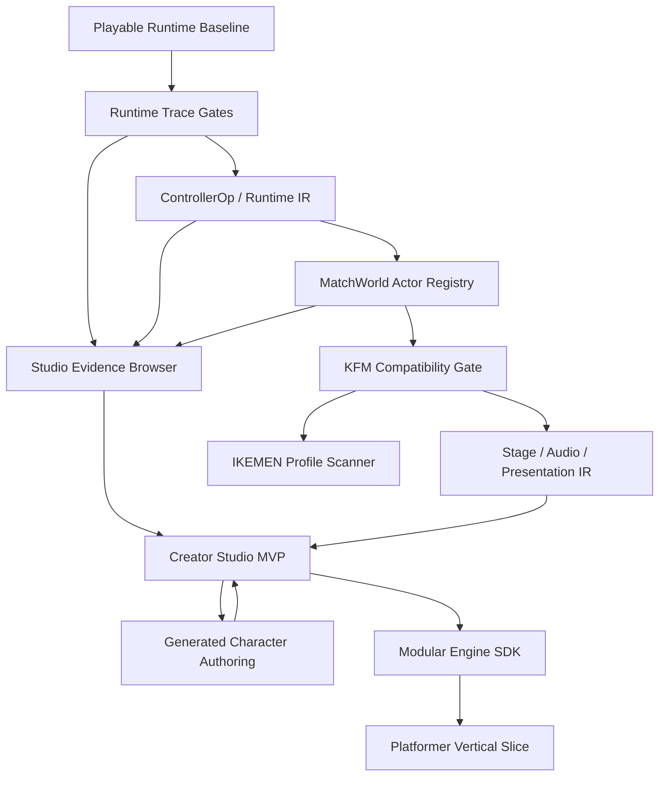

# Build Execution Backlog

This document turns the agreed architecture, Studio, generated-asset, QA, and modular-engine directions into an executable backlog. The single cross-stream construction map lives in `MASTER_CONSTRUCTION_PLAN.md`; the current operating ledger lives in `WORKPLAN.md`; architecture constraints live in `ARCHITECTURE_DECISIONS.md`. This file remains the expanded backlog context for deciding the next implementation rounds without losing the playable prototype. It does not replace `FULL_BUILD_PROGRAM.md`, `CONSTRUCTION_PROGRAM.md`, or `BUILD_PLAN.md`.

The practical wave map for all approved directions lives in `CONSTRUCTION_WAVES.md`. Use it when deciding which package can start now, which gates must close first, and which claims remain blocked.

The immediate execution authority lives in `WORKPLAN.md -> Current Execution Authority`. This backlog is intentionally broader; do not use a later backlog item to skip the runtime/evidence gates that the current authority table requires.

The product direction is intentionally broad:

1. Progressive MUGEN / IKEMEN-GO compatibility in TypeScript.
2. A local Creator Studio for importing, inspecting, generating, editing, playtesting, and exporting projects.
3. A generated character and stage pipeline backed by image generation plus sprite atlas QA.
4. A modular browser game-engine foundation that can later host platformers, beat-em-ups, arena games, and custom sprite projects.

The construction order is intentionally narrow:

```txt
Playable runtime
  -> deterministic trace gates
  -> typed controller operations
  -> real MatchWorld ownership
  -> KFM compatibility gate
  -> stage/audio/presentation parity
  -> evidence-first Studio MVP
  -> generated authoring pipeline
  -> IKEMEN profile scanner
  -> other genre module slices
```

The currently approved scope contract lives in `APPROVED_HORIZON_PLAN.md`. Use it when deciding whether a new task belongs in the current execution queue, can run in parallel as evidence/UI work, or must stay blocked until the runtime and Studio gates are stronger.

## Construction Campaign Board

This is the working board for building all agreed directions without splitting the project into unrelated prototypes.

| Campaign | Build first | Unlocks | Do not start yet |
| --- | --- | --- | --- |
| Port engine | Deterministic traces, typed controller ops, `MatchWorld` ownership, KFM route gates. | Real MUGEN compatibility can grow by evidence instead of parser counts. | ZSS/Lua, rollback, netplay, full screenpack parity. |
| Playable sandbox | Keep generated roster, Rooftop Dojo, match controls, HUD, debug bridge, and runtime URL params stable. | A usable game loop for testing every engine and Studio change. | Large visual redesigns that hide runtime diagnostics. |
| Creator Studio | Evidence Browser, Asset Library, Build Center, Character/Stage preview surfaces. | Local projects can be created, saved, compiled, playtested, and exported. | Advanced editing before project/build/evidence truth is visible. |
| Generated assets | Concept brief records, source prompt provenance, regenerated sprite rows, atlas/motion/scale QA, collision/action authoring. | Original fighters and stages become repeatable project assets. | Cropping bad source motion to pretend it is fixed. |
| IKEMEN profile | Scanner and reports for IKEMEN-only files/features before execution. | Users can understand why content loads partially or not at all. | Executing ZSS/Lua or IKEMEN-specific runtime features. |
| Modular engine | Shared project/module/input/render/audio/snapshot contracts after fighting contracts harden. | Platformer or beat-em-up slices can reuse the engine without MUGEN leakage. | Production multi-genre tooling before the fighting MVP proves the shared seams. |

The first usable horizon is not "full MUGEN." It is a private workbench where a user can load or select a character, see exactly what parsed/decoded/compiled/executed, play a stable match, export evidence, and keep building from that truth.

## Usable MVP Definition

The next "usable" bar is:

1. Default match mode opens with at least three local fighters and one stage.
2. Inspector can load a MUGEN character ZIP/folder, inspect DEF/AIR/CMD/CNS/SFF status, scrub AIR actions, and show Clsn1/Clsn2.
3. Runtime can route at least one imported KFM/CodeFuMan-style attack through real CMD/CNS data when the local fixture exists.
4. Studio can save/reopen a project, list assets with provenance, compile `project.json` into `runtime-manifest/v0`, and export compatibility/runtime evidence.
5. Build Center can export `export-bundle/v0` with browser-fetchable assets, current-session imported source files, checksums, and `sourcePackages` relink metadata.
6. Evidence Browser can filter parser, compiler, runtime trace, asset QA, compatibility, and diagnostic records.
7. Generated fighter pipeline can produce or replace one fighter with visible prompt provenance, atlas QA, motion/scale checks, collisions, and a playtest route.
8. End-of-round gates are green: `pnpm test`, `pnpm typecheck`, `pnpm build`, plus browser screenshots/diagnostics for visible or runtime behavior.

## Review Consensus

The current consensus from runtime architecture, product/UX, and QA review is:

- The expandable MVP is a typed, traceable, renderer-independent `MatchWorld`, not a bigger UI shell.
- `PlayableMatchRuntime` must shrink through incremental system extraction instead of gaining more raw controller paths.
- The hard runtime path is `RuntimeTrace -> ControllerOp -> MatchWorld -> KFM gate`; Studio and modular-engine work should not bypass that order.
- Studio should expose real project, runtime, asset, and evidence data before advanced editing.
- The Studio product order is Asset Library, Evidence Browser, Build Center, Character/Stage previews, Runtime Debug Studio, then authoring.
- Generated assets must be regenerated when source motion, scale, or pose is wrong; atlas slicing is not a cure for bad source art.
- A future platformer or beat-em-up module should prove shared engine contracts only after the fighting module has earned them.
- Every milestone closes with tests, a repeatable browser smoke where visible/runtime behavior changed, and honest compatibility labels.
- Official fixtures can be optional for local availability, but skipped official fixtures block official compatibility claims.
- Studio IA should behave like a trust workflow: `Project / Workbench -> Assets -> Evidence -> Build`, with `Character`, `Stage`, and `Debug` as contextual tools rather than equal editor tabs.
- Shared-core extraction starts with Studio/Build/Evidence contracts and import-boundary checks. Do not promote `src/game`, `MugenSnapshot`, or fighting renderer/audio types into core before they are behind generic interfaces.

## Delivery Plan

Use `MASTER_CONSTRUCTION_PLAN.md` as the release-train source of truth. The backlog is worked in this order:

| Step | Work package | Exit signal |
| --- | --- | --- |
| 1 | Runtime evidence kernel | Trace artifacts explain commands, controllers, combat reasons, actor/effect summaries, and final checksum. |
| 2 | Typed controller-operation migration | New high-value controller families produce typed operation evidence instead of only raw controller-name counts. |
| 3 | MatchWorld actor ownership | Players, helpers, projectiles, explods, targets, owners, roots, parents, and sprite owners are inspectable without changing tick behavior. |
| 4 | Official fixture gate | KFM/KFM720/CodeFuMan/SF3 Ryu reports drive focused compatibility work; one KFM normal and one special have hit/guard/state-exit evidence. |
| 5 | Stage/audio/presentation IR | Stage and sound behavior has renderer-independent diagnostics before richer Three.js presentation. |
| 6 | Evidence-first Creator Studio | Project, assets, evidence, build, preview, debug, and modules expose real data before advanced editing. |
| 7 | Generated authoring pipeline | Imagegen and `sprite-atlas-builder` outputs become provenance-rich, QA-gated, collision-authored runtime assets. |
| 8 | IKEMEN profile scanner | IKEMEN-only features are classified separately from MUGEN support claims. |
| 9 | Modular engine contracts | Shared module contracts are extracted only after fighting-runtime seams are proven. |
| 10 | Platformer slice | A non-fighting scene runs from project/build data through shared adapters. |

2026-06-25 construction refresh: all approved ideas remain in scope, but the next implementation work should tighten the runtime/evidence spine before adding more editor surface. The first refreshed runtime slices moved `Projectile`, `Helper`, `Explod`, `HitFall*`, and `FallEnvShake` into typed `ControllerOp` plus system/trace evidence. `RuntimeEffectActorWorld` is now the world-style boundary for effect actor stores, active/presentation effect advance passes, reset, summaries, and bounded projectile combat handoff; it is created by `MatchWorld` and injected into `PlayableMatchRuntime`. `MatchWorld.targetLinks` now exposes bounded target memory/binding ownership to Debug Studio and trace world evidence, `RuntimeTraceGate.requiredWorldLifecycleEvents` can require world spawn/active/remove evidence such as the synthetic Projectile spawn/remove path, `RuntimeTraceGate.requiredEffectStores` can require producer-store evidence for helper/projectile/explod ownership, and `RuntimeTraceGate.requiredMatchPauses` / `requiredMatchPauseAdvances` / `requiredMatchPauseFreezes` can require actual match-freeze snapshot plus actor/effect advance/freeze evidence for Pause/SuperPause routes, including bounded SuperPause+Projectile and SuperPause+Helper/Explod source-movetime advance/freeze artifacts. `ProjectileCombatSystem` now also proves a bounded held-back projectile guard route through `synthetic-imported-projectile-guard`, a bounded single-target `projhits`/`projmisstime` multi-hit route through `synthetic-imported-projectile-multihit`, a bounded equal-`projpriority` projectile-vs-projectile trade/removal route through `synthetic-imported-projectile-clash`, and a bounded higher-priority cancel/decrement route through `synthetic-imported-projectile-priority-cancel`; projectile removal evidence now includes bounded visible terminal playback for resolved `projhitanim`/`projremanim`/`projcancelanim` AIR actions plus actor-frame trace requirements, but exact projectile priority classes, exact terminal timing, full guard effects, multi-target projectile behavior, and IKEMEN/MUGEN projectile parity remain future work. Next runtime work should promote exact projectile parity beyond the bounded multi-hit/clash/cancel/decrement/playback subset, exact effect pause/tick ordering, exact target semantics, or real KFM/Common1 get-hit/fall/guard-state gates. Studio visual planning is allowed, but implementation must stay evidence-bound.

2026-06-27 custom-state evidence refresh: `RuntimeTraceGate` can now require `customOwnerId` in actor-frame and final-actor evidence. `pnpm qa:trace` includes required `synthetic-imported-custom-state.json` (checksum `bf632df3`), proving bounded two-actor owner-backed `HitDef p2stateno = 888` entry, P1-owned `ChangeState` chain to `889`, and `SelfState` return to P2 state `0`/control. Claim allowed: imported custom-state ownership entry/chain/return is trace-gated for this route. Still blocked: throws, redirects, helper/root/parent ownership, teams, exact tick order, and complete custom-state parity.

2026-06-27 TargetState evidence refresh: `pnpm qa:trace` now includes required `synthetic-imported-targetstate-custom.json` (checksum `fedaf0a4`), proving direct `HitDef` target memory can feed typed `TargetState value = 888`, route P2 into P1-owned state data, chain through `ChangeState` to `889`, and return through `SelfState` to P2 state `0`/control. Claim allowed: target-memory-driven owner-backed custom-state entry/chain/return is trace-gated for this route. Still blocked: throws, redirects, helper/root/parent ownership, multi-target/team semantics, exact bind/target tick order, and complete custom-state parity.

## Planning Principles

### Runtime First

The app should always open into a playable match. Imported compatibility can be partial, but the local generated roster and native stage must remain usable for runtime, renderer, UI, and QA checks.

### Runtime Monolith Pressure

`PlayableMatchRuntime` is the current risk center. Every runtime feature proposal must answer whether it reduces, preserves, or increases raw-runtime complexity. Increases are allowed only for small transitional cuts with a trace/test and a follow-up item that moves the behavior into typed IR, `ControllerOp`, `MatchWorld`, or a named system.

### Evidence Before Editing

Studio surfaces should first answer:

- What exists?
- Where did it come from?
- What parsed, decoded, compiled, executed, or failed?
- What artifact proves that?

Only then should the same surface become an editor.

### Contracts Before Features

New runtime features should enter through typed seams:

- `RuntimeTrace` and `RuntimeTraceArtifact` for repeatable evidence.
- `ControllerOp` / compiled IR for state controllers.
- `MatchWorld` for tick order, actor ownership, and snapshots.
- `project.json` for editor/project state.
- `runtime-manifest/v0` for runtime build data.

### Labels Before Claims

Compatibility status must use these levels:

```txt
Parsed
Decoded
Recognized
Compiled
Executed Partial
Executed Parity
Unsupported
Unknown
```

Never collapse parser coverage into runtime support.

## Dependency Graph



## Workstreams

### WS1: Runtime Kernel

Purpose: make the match engine deterministic, inspectable, and modular enough to host MUGEN behavior without becoming an untestable monolith.

Owns:

- `MatchWorld` as the public runtime boundary.
- Actor registry and ownership metadata.
- Tick order, pause order, collision order, and snapshot building.
- Structured combat decisions and runtime events.
- Deterministic traces and replay-style QA artifacts.

Primary deliverables:

- `MatchWorld` owns actor lifecycle instead of only delegating.
- `PlayableMatchRuntime` becomes an integration layer around systems.
- Actors expose `actorKind`, `ownerId`, `rootId`, `parentId`, `stateOwner`, and `spriteOwner`.
- Combat explains hit, guard, whiff, reject, override, reversal, and projectile interactions.

Hard gate:

- Runtime trace checksums remain stable for unchanged behavior.
- Every tick-order or combat change produces trace evidence.

### WS2: Compatibility Compiler

Purpose: convert MUGEN text/binary data into bounded, typed contracts that can be executed, skipped, and reported honestly.

Owns:

- CMD compiler.
- Expression and trigger compiler.
- CNS controller compiler.
- Compatibility profiles: `mugen-1.0`, `mugen-1.1`, `ikemen-go-scan`.
- Source locations and unsupported feature classification.

Primary deliverables:

- `HitDef`, `Target*`, `Pause`/`SuperPause`, `Projectile`, `Helper`, `Explod`, and high-value body/collision controllers such as `Width` move through typed controller operations.
- `[State -1]` command routing is inspectable from compiled command and trigger data.
- Reports show recognized, compiled, executable, partial, unsupported, and unknown counts separately.

Hard gate:

- New controller parity cannot increase raw `controller.source` dependency without a debt note and test coverage.

### WS3: KFM And Fixture Compatibility

Purpose: make one official character meaningfully playable through real imported data, then broaden coverage through measured fixtures.

Owns:

- Official KFM and KFM720 local fixture gates.
- CodeFuMan SFF v1 / PCX path.
- SF3 Ryu demo parser/report stress path.
- Imported stage fixture path.

Primary deliverables:

- KFM idle, walk, crouch, jump, one normal, one special, hit, guard, state exit, target memory, and partial custom-state return.
- Browser QA for imported sprites, boxes, commands, state numbers, HUD, and runtime debug.
- Fixture matrix results under `.scratch/qa/<feature>/`.

Hard gate:

- Do not claim full KFM or IKEMEN compatibility. The gate is explicitly partial and evidence-backed.

### WS4: Stage, Camera, Audio, And Presentation

Purpose: turn imported stages, common effects, and sound behavior into testable systems instead of renderer guesses.

Owns:

- Stage BG IR.
- Camera, floor, bounds, zoffset, localcoord, player starts.
- Delta/parallax, tiling, velocity, masks, windows, layers, and first BGCtrl pass.
- SND channel model and Web Audio diagnostics.
- FightFX/common effect resolution plan.

Primary deliverables:

- Stage reports separate parsed, rendered, animated, fallback, and unsupported layers.
- Audio diagnostics include source actor, channel, group/index, decoded payload, and stop behavior.
- Projection and camera logic remain testable outside Three.js.

Hard gate:

- No stage layer or audio event may silently disappear.

### WS5: Creator Studio Product Surface

Purpose: turn the sandbox into a local project workspace while keeping runtime truth visible.

Owns:

- Project Dashboard.
- Asset Library.
- Character Studio.
- Stage Studio.
- Runtime Debug Studio.
- QA / Evidence Browser.
- Module Studio.
- Build Center.

Primary deliverables:

- `project.json` is the editor/source-preserving contract.
- `runtime-manifest/v0` is the compiled runtime contract.
- Asset records show provenance: `mugen-import`, `ikemen-import`, `generated`, `authored`, `converted`, `runtime`.
- Build Center exports project, runtime manifest, compatibility reports, trace artifacts, and eventually workspace packages.

Hard gate:

- Studio cannot persist or export a "green" state when compile warnings, missing assets, or unverified runtime paths exist.

### WS6: Generated Asset Authoring

Purpose: make generated fighters and stages reliable runtime assets with visible provenance and QA.

Owns:

- Character concept briefs.
- Imagegen source prompts and generated-sheet provenance.
- `sprite-atlas-builder` normalization, manifests, contact sheets, GIFs, and motion QA.
- Collision/action authoring.
- MUGEN-lite template export for generated characters.

Primary deliverables:

- Generated fighter has idle, walk, crouch, jump, punch, kick, hitstun.
- Walk reads as walking, with alternating legs and stable cadence.
- Crouch and jump do not inflate relative to idle.
- Character Studio surfaces source art, atlas status, QA reports, collisions, and runtime playtest.

Hard gate:

- Bad generated motion requires regenerated source art, not cosmetic cropping.

### WS7: IKEMEN Profile And Extensions

Purpose: classify IKEMEN features without confusing them with broken MUGEN content.

Owns:

- IKEMEN profile detection.
- ZSS, Lua, and extended stage/system feature scanning.
- IKEMEN-only unsupported sections in reports.
- Research notes for future execution.

Primary deliverables:

- `ikemen-go-scan` profile scanner.
- Report sections for IKEMEN-only files, controllers, config, scripts, and presentation features.
- No execution claims without runtime evidence.

Hard gate:

- Do not implement ZSS, Lua, rollback, netplay, or model stages before the MUGEN/fighting MVP is stable.

### WS8: Modular Engine Expansion

Purpose: prove the engine can host another genre after the fighting module stabilizes.

Owns:

- Shared module contract.
- Platformer project template.
- Level/tile model.
- Platformer physics, camera follow, collectibles, hazards, and basic enemies.
- Module Studio configuration.

Primary deliverables:

- Tiny platformer scene runs from project/build data.
- Three.js adapter consumes snapshots without knowing platformer rules.
- Shared core remains free from CNS, HitDef, round, helper, and command-routing concepts.

Hard gate:

- Do not start production platformer tooling before the fighting module proves shared contracts.

## Milestone Backlog

### M0: Baseline Control

Goal: keep the current app stable while the expanded plan becomes operational.

Build:

- Preserve Runtime, Inspector, and Studio URL modes.
- Keep three local fighters and Rooftop Dojo playable.
- Keep trace artifact export visible in Studio Build and evidence records visible in Studio Evidence.
- Keep docs linked and honest.

Acceptance:

- `pnpm test`
- `pnpm typecheck`
- `pnpm build`
- Runtime screenshot.
- Studio Build screenshot after trace export.
- `window.__MUGEN_WEB_SANDBOX__` diagnostics include mode, selected fighters, stage, renderer, project, compiled project, studio evidence, and trace artifact when exported.

Blockers:

- Blank canvas.
- Broken roster/stage selection.
- Atlas QA hidden.
- Unsupported feature crash.
- Docs implying full MUGEN/IKEMEN compatibility.

### M1: Trace Gates And Controller Ops

Goal: make compatibility changes proveable before expanding controller parity.

Build:

- Add golden runtime trace scripts for native generated match.
- Add synthetic imported CMD/CNS trace gates.
- Add optional KFM trace scripts when local fixtures exist.
- Extend controller IR for `HitDef` and `Target*`.
- Make `CombatResolver` return structured reason payloads.

Acceptance:

- Trace artifacts include script, checksum, final actors/effects, events, and gates.
- A failed gate says what evidence is missing.
- State Browser / Evidence UI can show compiled operations separately from parsed controllers.

Blockers:

- Unstable checksums for unchanged scripts.
- Gate passes without evidence.
- Raw controller paths grow without explicit debt.

### M2: MatchWorld Actor Ownership

Goal: move match behavior behind a first-class world model.

Build:

- Actor registry for players, helpers, projectiles, explods, and target records.
- Ownership metadata for logical state ownership and sprite ownership.
- Snapshot builder owned by `MatchWorld`.
- First migration of helper/projectile/explod lifecycle behind systems.
- Trace coverage for owner/root/parent metadata.

Acceptance:

- Runtime Debug Studio can show actor tree and ownership.
- Helpers, projectiles, and explods are inspectable entities.
- Combat reports owner and reason for hit/guard/whiff/reject.

Blockers:

- Owner/root/parent confusion.
- Target memory leaks.
- Renderer state used as runtime source of truth.
- New side effect bypasses world systems.

### M3: Official KFM Fixture Route Gate

Goal: make official KFM meaningfully playable through real data without inflating support claims.

Build:

- Improve `[State -1]` routing for common attacks and one special.
- Broaden trigger expression support needed by KFM/Common1.
- Execute supported controller subset through typed ops.
- Improve HitDef, guard, target memory, get-hit, recovery, and state exit evidence.

Acceptance:

- KFM stands, walks, crouches, jumps, performs one normal, performs one special.
- Normal/special can hit or guard a dummy.
- Runtime session report shows routed states, executed controllers, active commands, hit/guard events, and unsupported features.

Blockers:

- Parser count sold as runtime support.
- Missing fixture but compatibility claimed.
- External assets committed to repo.
- Fixture crashes instead of reporting unsupported features.

### M4: Stage, Camera, Audio, Presentation

Goal: make stage and audiovisual behavior measurable.

Build:

- Stage BG IR for static and animated layers.
- More complete camera/floor/projection tests.
- Delta/parallax/tile/velocity/window/mask/layer support by level.
- First BGCtrl classification.
- SND channel model and audio event diagnostics.
- FightFX/common effect lookup plan.

Acceptance:

- Imported stage report separates parsed, rendered, animated, fallback, unsupported.
- Browser screenshots prove stage projection and fallback labels.
- Audio diagnostics prove decoded sounds or clear failure reasons.

Blockers:

- Silent missing layer.
- Fallback presented as rendered parity.
- Camera/floor visibly wrong without diagnostics.
- Sound event claim without decoded payload.

### M5: Evidence-First Creator Studio MVP

Goal: make Studio a usable local project workspace.

Build:

- Project Dashboard for recent projects and templates.
- Asset Library table with provenance, validation, reports, and missing refs.
- Evidence Browser with filters by asset, feature, level, fixture, and session.
- Build Center for project manifest, runtime manifest, warnings, trace artifact, report export, and package export.
- Character Studio preview for AIR/action/collision/command/state summaries.
- Stage Studio preview for bounds/floor/zoffset/starts/layers/report.
- Runtime Debug Studio for entity tree, commands, states, controllers, targets, helpers, projectiles, explods, pause/audio/effects.

Acceptance:

- User can create, save, reopen, compile, playtest, and export a project locally.
- `project.json -> runtime-manifest/v0 -> playtest/export` is visible and diagnostics-backed.
- Reports are filterable instead of JSON walls.
- Center preview/playtest remains visible for workbench-style flows.

Blockers:

- Hidden renderer state becomes editor state.
- Missing external asset marked valid.
- Persisted edit lacks compile/playtest warning.
- Unsupported/partial status not visible near affected feature.

### M6: Generated Character Authoring

Goal: make original generated fighters a repeatable authoring pipeline.

Build:

- Character concept brief schema.
- Imagegen prompt/source/provenance records.
- Sprite row regeneration workflow.
- Atlas normalization and motion/scale QA ingestion.
- Collision/action authoring first pass.
- Generated MUGEN-lite DEF/AIR/CMD/CNS template export.
- Runtime roster integration and QA badges.

Acceptance:

- One new generated fighter can be created, atlas-normalized, visually reviewed, collision-authored, and played.
- Contact sheets, GIFs, motion reports, browser screenshots, and trace artifacts are preserved.
- Walk/crouch/jump scale and motion checks are visible in Studio.

Blockers:

- Bad source motion hidden by slicing.
- Scale inflation in crouch/jump.
- Missing QA report but green badge.
- Generated asset confused with imported MUGEN support.

### M7: IKEMEN Compatibility Profile

Goal: classify IKEMEN-specific content honestly.

Current first cut:

- `IkemenFeatureScanner` creates `CompatibilityReport.profiles.ikemen` and labels findings as `Recognized + Unsupported`.
- Exported compatibility JSON, DebugPanel, Studio Evidence, and unsupported-feature summaries show scanner-only IKEMEN findings.
- Detected scanner features include ZSS files/references/fallback `.cns.zss`, ZSS function/local-variable/loop/`ignoreHitPause`/`persistent` blocks, ZSS controller syntax, Lua files/hooks including `hook.*`, IKEMEN config JSON, screenpack/select/menu/movelist signals such as `unlock`, `commandlist`, `movelist*`, and `menu.itemname.*`, `IkemenVersion`, selected IKEMEN-only controllers/triggers/params/`AssertSpecial` flags, model-stage assets, and named 3D/Z stage params.

Build:

- Broader `ikemen-go-scan` fixture corpus.
- Broader ZSS/Lua/config/screenpack/stage/system feature detection.
- Report sections for IKEMEN-only features.
- Research notes mapped to future implementation slices.

Acceptance:

- IKEMEN-only content is classified, counted, and shown in reports.
- MUGEN 1.0, MUGEN 1.1, and IKEMEN-compatible profiles stay separate.

Blockers:

- IKEMEN parse coverage described as execution.
- Unknown feature omitted from report.
- ZSS/Lua attempted before runtime contracts are ready.

### M8: Platformer Module Slice

Goal: prove modular engine expansion after the fighting module is trustworthy.

Build:

- Shared module contract.
- Platformer project template.
- Level/tile model.
- Platformer runtime module.
- Camera follow, platform collision, collectible, hazard, and simple enemy.
- Module Studio configuration.

Acceptance:

- Tiny platformer scene runs from a project manifest.
- Fighting Runtime Mode still passes regression.
- Shared core has no CNS, HitDef, round, helper, or MUGEN command-routing dependency.

Blockers:

- Platformer implementation breaks fighting runtime.
- MUGEN-only concepts leak into shared core.
- Multi-genre support is claimed before a scene runs.

## Studio Interface Roadmap

The Studio should feel like a dense game-development workbench, not a landing page.

### Shell

Destination IA: two public modes, `Playable Runtime` and `Creator Studio`. The existing public `Inspector Mode` is transitional and should move under Studio as Character Studio/Data Inspector once Studio has enough project/import surfaces to host it cleanly.

| Zone | Purpose |
| --- | --- |
| Top bar | Active project, project type, build status, Playtest, Save, Export. |
| Left rail | Project, Assets, Character, Stage, Runtime Debug, Evidence, Modules, Build. |
| Center viewport | Match playtest, AIR preview, stage preview, or trace playback. |
| Right inspector | Contextual selection details: asset, frame, layer, actor, warning, module. |
| Bottom strip | Timeline, trace scrubber, logs, commands, warnings, recent events. |

### Surfaces

| Surface | First useful version | Later version |
| --- | --- | --- |
| Project Dashboard | Recent projects, templates, active entry, project health, Playtest. | Search, tags, thumbnails, health history. |
| Asset Library | Dense asset browser with type, source, status, reports, missing refs, selected-asset dependency graph, playtest-entry replacement flow, and source/runtime mapping. | Batch import, diff, source asset replacement. |
| Evidence Browser | Filter by asset, feature, support level, fixture, trace, runtime session. | Trace scrubber, comparison, release evidence bundles. |
| Build Center | `project.json`, `runtime-manifest/v0`, warnings, trace/report export, `export-bundle/v0` ZIP with browser-fetchable local assets and current-session imported source files/checksums. | Persisted source-package reassociation, release checklist. |
| Character Studio | AIR actions, frame timeline, sprite source, axis, Clsn1/Clsn2, command/state summary. | Collision editing, action editing, generated sprite replacement. |
| Stage Studio | Floor, bounds, starts, zoffset, camera, layer list, stage report. | BGCtrl timeline, layer editing, parallax debugger. |
| Runtime Debug Studio | Entity tree, commands, states, controllers, targets, helpers, projectiles, explods, pause/audio/effects. | Breakpoint-like watches, trace diffing, compatibility replay. |
| Module Studio | Active/planned/missing modules, read-only settings, SDK notes. | Editable module settings, custom module registration. |

## First Implementation Rounds

Use this as the next practical queue.

0. Done first cut: `pnpm qa:smoke` now starts or targets a Vite server, captures Runtime desktop/mobile and Studio Build/Evidence screenshots, exports a smoke trace artifact, and writes QA bridge diagnostics under `.scratch/qa/qa-smoke/`.
1. Done first cut: `pnpm qa:trace` now exports deterministic required native-hit and synthetic imported CMD/CNS gates, plus optional official KFM `x` and `QCF_x` artifacts when the local fixture exists.
2. Done second cut: `RuntimeTraceArtifact` gates now export combat reason evidence for hit, inferred whiff, held-back guard, and HitBy/NotHitBy reject routes; override/reversal reasons are typed and categorized for future gates.
3. Done first cut: imported runtime sessions and trace gates now expose `executedOperations`, and synthetic imported traces require typed `hitdef` operation evidence instead of accepting controller-name execution alone.
4. Done first cut: `pnpm qa:trace` now includes a synthetic imported Target* route proving typed `target:*` operations after real HitDef target memory; later evidence gates now also require world-visible `targetLinks` for the same route.
5. Promote trace artifact visibility into a reusable Evidence Browser data source. First cut plus bounded in-session trace history, persisted history, artifact comparison, metric/gate review, and a frame checksum/event/delta scrubber exist in Studio Evidence; next work is multi-artifact replay-style trace diffing, source relink/regenerate actions, and richer reason/operation payloads in the UI.
6. Done first cut: `MatchWorld` exposes a derived actor registry from runtime snapshots, indexing players/effects by id, kind, owner, lifecycle status, and per-tick lifecycle event without changing match state.
7. Done first cut: Runtime Debugger now surfaces the actor registry and `pnpm qa:smoke` validates that both player actors are visible through the UI/QA bridge.
8. Done first cut: Studio now has a URL-addressable `Debug` surface with the live match playtest, actor registry, ownership index, runtime snapshot facts, selectable actor detail, command-palette actor jumps, and QA smoke coverage. Next work is filters and links to traces/controllers.
9. First extraction cut done: Target* controller side effects now apply through `TargetSystem` instead of living inline in the main `PlayableMatchRuntime` controller loop, while state-entry validation remains a match-runtime callback. `EffectActorSystem` now owns the mutable per-fighter store for Explod/Helper/Projectile serials, bounded lists, advance/removal mutation, hit-removal pruning, snapshot handoff, and read-only store summaries. `RuntimeEffectActorWorld` wraps those stores behind a world-style contract for spawn, active/presentation advance passes, removal, reset, snapshots, summaries, and bounded projectile combat handoff; `ProjectileCombatSystem` owns the bounded projectile contact/reject/override/damage/removal loop; `MatchWorld` creates/injects the world and exposes lifecycle status plus `spawn`/`active`/`remove` events, `targetLinks`, and `effectStores` to Debug Studio, trace artifacts, and smoke QA. Next: lift exact projectile parity, exact target semantics, and exact effect pause/tick decisions into `MatchWorld` without checksum drift.
10. Done Pause/SuperPause typed-operation cut: `Pause`/`SuperPause` now compile into typed `pause:*` operations, `PauseSystem` consumes that data, imported runtime sessions record `pause:pause` and `pause:superpause`, and `pnpm qa:trace` includes required `synthetic-imported-superpause.json` with typed operation, pause event, required `matchPause` snapshot evidence for actor/state/darken/remaining/movetime, and required P2 frozen-actor evidence. The follow-up `synthetic-imported-superpause-projectile-freeze.json` gate proves bounded `p1` projectile effect evidence for advancing during source `movetime` and freezing afterward during SuperPause without claiming full projectile/helper/explod pause parity.
11. Done guard/hitstun/fall-metadata/custom-get-hit/state-exit cut: `pnpm qa:trace` now exports required synthetic imported guard, hitstun, fall-metadata, attacker-owned custom get-hit controller-flow, and state-exit gates plus optional `kfm-official-x-guard.json`, `kfm-official-x-hitstun.json`, and `kfm-official-x-state-exit.json` when the local KFM fixture exists. The real KFM normal route now proves `x -> 200`, hit/guard evidence, target partial hitstun (`animNo=500`, `moveType=H`), and a longer recovery script returning P1 to idle/control. The synthetic fall gate proves simple `fall.*` HitDef metadata reaches `hitFall`; the synthetic custom get-hit gate proves `p2stateno` can route the defender into an attacker-owned state that executes partial `HitFallVel`, `HitFallDamage`, `HitFallSet`, and `FallEnvShake`. Later cuts added defender-owned Common1 fall, bounded synthetic plus optional official KFM recovery gates, a first bounded defender-owned guard-hit state route, a bounded synthetic recovery-input branch, optional official KFM air recovery-input evidence, and optional official KFM ground recovery-input evidence; remaining work is exact guard start/end/proximity/crouch/air parity, exact recovery thresholds/velocities, broader ground/air recovery parity beyond the bounded routes, and exact tick-order parity.
12. Done sixth cut: Studio now has a URL-addressable `Assets` surface with provenance/status filters, project asset flow summary, selectable asset cards, asset triage metrics, selected asset detail, playtest-entry replacement flow, source/runtime mapping, visual dependency graph, dependency drilldown, missing/partial reference summary, related evidence, entry asset summary, attention queue, QA bridge `studioAssets`, and smoke screenshot coverage. Later UI polish replaced the narrow sidebar table with card-based selection, kept the right pane as the asset detail/triage authority, moved the mobile runtime status strip away from the fighters, and removed list virtualization that produced blank full-page visual QA rows. Next work is source asset replacement and binary asset bundling.
13. Done Projectile typed-operation cut: `Projectile` now compiles into typed `projectile` operations, `ProjectileSystem` consumes that data, imported runtime sessions record `executedOperations.projectile`, and `pnpm qa:trace` includes required `synthetic-imported-projectile.json` with projectile effect actor, required world lifecycle spawn/remove evidence, required producer-store evidence, hit evidence, and required world-visible target-memory `targetLinks` evidence.
14. Done Helper typed-operation cut: `Helper` now compiles into typed `helper` operations, `HelperSystem` consumes that data, imported runtime sessions record `executedOperations.helper`, and `pnpm qa:trace` includes required `synthetic-imported-helper.json` with helper effect actor plus required world lifecycle spawn/active and producer-store evidence.
15. Done Explod typed-operation cut: `Explod` now compiles into typed `explod` operations, `RemoveExplod` compiles into typed remove data, `ExplodSystem` consumes typed spawn data, imported runtime sessions record `executedOperations.explod`, and `pnpm qa:trace` includes required `synthetic-imported-explod.json` with visual explod effect actor plus required world lifecycle spawn/active and producer-store evidence.
16. Done HitFall typed-operation cut: `HitFallVel`, `HitFallDamage`, and `HitFallSet` now compile into typed `hitfall:*` operations, `FallEnvShake` compiles into typed `fallenvshake` evidence, `StateControllerExecutor` prefers typed `HitFallSet` values, and the required `synthetic-imported-common-gethit.json` gate asserts those operation counts.
17. Done default Common1 get-hit entry cut: `HitDef` without `p2stateno` can route imported defenders into their own known Common1-style state `5000`; `pnpm qa:trace` includes required `synthetic-imported-default-gethit.json` plus optional `kfm-official-default-gethit.json`, where official KFM as defender enters real Common1 state `5000`.
18. Done default Common1 stand progression cut: `HitShakeOver` and `HitOver` triggers now advance defender-owned get-hit states; `pnpm qa:trace` includes required `synthetic-imported-default-gethit-progression.json` plus optional `kfm-official-default-gethit-progression.json`, where official KFM as defender executes real Common1 `5000 -> 5001 -> 0` and returns to idle/control. Later cuts now cover synthetic fall/recovery, synthetic recovery input, optional KFM lie-down entry, optional KFM `5110 -> 5120 -> 0` recovery, optional KFM `5050 -> 5210 -> 52 -> 0` air recovery input, optional KFM `5050 -> 5200 -> 5201 -> 52 -> 0` ground recovery input, and bounded stand/crouch guard-hit `150 -> 151` / `152 -> 153`; next work is exact guard behavior, exact recovery thresholds/velocities, broader ground/air recovery parity, and exact tick-order parity.
19. Done default Common1 fall branch, bounded recovery-chain, and bounded recovery-input cuts: `GetHitVar(yaccel)` now has a bounded runtime default, synthetic fall HitDefs can include `ground.velocity` Y, imported no-control/get-hit states are preserved from input/AI idle overrides, `fall.recovertime` now gates `CanRecover`, and `pnpm qa:trace` includes required `synthetic-imported-default-fall-gethit.json`, required `synthetic-imported-default-fall-recovery.json`, required `synthetic-imported-default-fall-recovery-input.json`, plus optional `kfm-official-default-fall-gethit.json`; the required synthetic fall gate proves `5000 -> 5030 -> 5050`, the required synthetic recovery gate proves `5000 -> 5030 -> 5050 -> 5100 -> 5101 -> 5110 -> 5120 -> 0`, the required synthetic recovery-input gate proves `CanRecover + command = "recovery"` can route `5050 -> 5210 -> 0`, and official KFM now proves real Common1 `5000 -> 5030 -> 5050 -> 5100 -> 5101 -> 5110`. Later KFM recovery evidence proves `5110 -> 5120 -> 0`, KFM air recovery-input evidence proves `5050 -> 5210 -> 52 -> 0` with checksum `516185bc`, and KFM ground recovery-input evidence proves `5050 -> 5200 -> 5201 -> 52 -> 0` with checksum `d6bd302e`. Next: exact guard behavior, exact recovery thresholds/velocities, broader ground/air recovery parity, and exact tick-order parity.
20. Done KFM official lie-down/get-up and air recovery-input cuts: CNS `[Movement]` and `[Data]` constants now flow into imported character definitions for `Const(movement.*)` and bounded down-recovery lookups, imported state entry provides a `Time = 0` evaluation point, imported CNS-derived attacks require their own `HitDef` before runtime hit activation, imported get-hit states can preserve positive ground-impact `pos y` until Common1 controllers resolve the transition, `kfm-official-default-fall-recovery.json` proves real KFM can continue from `5110` into `5120` and return to `0` with control, and `kfm-official-default-fall-recovery-input.json` proves real KFM can leave `5050` through `CanRecover + command = "recovery"`, enter `5210`, land through `52`, and return to `0` with control.
21. Done Common1 guard-hit route cut: guarded imported defenders can enter known defender-owned stand/crouch guard-hit states such as `150 -> 151` and `152 -> 153`; `command = "name"` can now be evaluated inside simple composite expressions such as `151 + 2*(command = "holddown")`; `GetHitVar(slidetime)` and `GetHitVar(ctrltime)` now return runtime-backed values from parsed `guard.slidetime` and `guard.ctrltime` on direct `HitDef` and bounded `Projectile` guard results, falling back to bounded `0` when absent; `pnpm qa:trace` includes required `synthetic-imported-default-guard-state.json`, required `synthetic-imported-crouch-guard-state.json`, required `synthetic-imported-diagonal-crouch-guard-state.json`, optional `kfm-official-default-guard-state.json`, and optional `kfm-official-default-crouch-guard-state.json` when the local KFM fixture exists. This does not claim exact guard distance, guard start/end, full crouch/air guard transitions, guard sparks/sounds, or perfect MUGEN/IKEMEN guard parity.
36. Done guard timing evidence cut: the synthetic default guard-state artifact now declares `guard.slidetime` and `guard.ctrltime`, verifies those values through the runtime snapshot and trace final actor evidence, and keeps trace actor fields optional so old artifacts without nonzero guard timing do not gain meaningless checksum noise. Remaining work is exact IKEMEN/MUGEN guard tick-order, proximity, air guard, and guard effect parity.
37. Done AssertSpecial guard-restriction cut: defender-side `NoStandGuard`/`NoCrouchGuard`/`NoAirGuard` now deny bounded guard by state type, attacker-side `Unguardable` forces hit evidence in the partial hit/guard resolver, and required `synthetic-imported-assertspecial-unguardable` proves held-back defender input no longer produces guard evidence for that route. This does not claim exact AssertSpecial lifetime, priority, global behavior, pause layering, or full MUGEN/IKEMEN guard parity.
38. Done damage-scale typed-operation cut: static numeric `AttackMulSet` and `DefenceMulSet` now compile into typed `damage-scale:attackmulset` / `damage-scale:defencemulset` operations, the runtime prefers those operations before raw param fallback, compatibility sessions record the operation keys, final trace-actor gates can assert `life`, and required `synthetic-imported-damage-scale.json` proves bounded outgoing/incoming multiplier plumbing with final target life `970`. This does not claim exact MUGEN/IKEMEN scaling order for helpers, projectiles, guards, custom states, or round edge cases.
22. Done KFM official ground recovery-input cut: CNS `[Velocity]` constants now flow into imported character definitions for `Const(velocity.*)` so the bounded ground recovery route can evaluate KFM-style `velocity.air.gethit.groundrecover`; `kfm-official-default-fall-ground-recovery.json` proves real KFM can leave `5050` through `CanRecover + command = "recovery"` near the ground, enter `5200`, self-return into `5201`, land through `52`, and return to `0` with control. Current checksum: `d6bd302e`. This is still executed partial evidence, not exact threshold, velocity, tick-order, or guard-state parity.
23. Build Evidence Browser filters over compatibility reports and trace artifacts.
24. Done fifth cut: Build Center now shows readiness rows for runtime playtest, project manifest, runtime manifest, asset validation, source packages, trace evidence, package bundle, and compatibility gates using runnable/partial/blocked/exportable states. It can export an `export-bundle/v0` ZIP with project/runtime contracts, source-runtime maps, evidence, reports, README, latest trace when available, browser-fetchable local assets, current-session imported ZIP/folder source files with package paths/bytes/source kind/SHA-256 checksums, and `project.json` source-package metadata for linked/missing relink state. Missing source packages now have explicit ZIP/Folder relink actions in Build Center and Source Packages, and the relink validator marks a reopened package linked when the loaded source contains the required normalized paths. Next work is persistent source handles, IndexedDB source metadata, and broader blocked-action affordances.
25. Plan the Studio visual direction with three focused workbench concepts before a large UI rewrite; implement only the selected direction and only against real data.
25. Move the standalone Inspector experience into Studio as Character Studio/Data Inspector, while preserving the current URL route until the Studio replacement is visually verified.
26. Build Stage Studio preview route over current stage reports.
27. Done seventh Runtime Debug Studio cut: actor rows can be selected from the Debug surface or command palette, selection is URL-restorable through `actor`, and the selected debug lens is URL-restorable through `debug=overview|targets|effects|pause|audio`. The detail panel shows ownership, lifecycle, runtime, target links, owned actors, effect-store context, imported CNS execution evidence, command-buffer history, and linked trace frame/gate evidence. Trace frame buttons jump to the Evidence Browser scrubber; execution/trace state and controller keys jump into Inspector States with URL-restorable `filter`, `state`, `controller`, and `controllerLine` params; the Inspector States list now highlights the exact state/controller row with trigger and param detail; command links jump into Inspector Commands with URL-restorable `command` params and selected token/param detail; the Debug Lens panel exposes target-link rows, effect actors/stores, pause snapshots plus pause operation evidence, and sound/envshake event diagnostics; target/effect/pause lenses now render `RuntimeTraceArtifact.world`/gate evidence from the latest trace, including target-link frame rows when present, effect-store frame rows, and Pause/SuperPause gate evidence where available, and world frame rows can jump to the Evidence scrubber; `.studioDebug` exposes runtime session plus trace evidence and `.studioDebugFilter` exposes the active lens; and `pnpm qa:smoke` validates a `p2` selection probe, imported `p1` execution/trace drilldown, exact `hitdef` Debug-to-Inspector controller jump, command-buffer evidence, CMD Browser command jump, URL-backed targets/effects/pause/audio lens screenshots, world-evidence panels, effect world rows, and effect-world-evidence-to-scrubber navigation. Next work is deeper helper/projectile/explod detail drilldowns and richer trace-frame world diffs.
28. Add stage BG IR for currently rendered static/action-backed layers.
29. Done bounded InGuardDist trigger cut: the expression evaluator now accepts a runtime `InGuardDist` callback, imported `HitDef` data carries typed/raw `guard.dist`, `CombatResolver` exposes a bounded guard-distance box check, and `pnpm qa:trace` includes required `synthetic-imported-inguarddist.json`. This proves near-but-not-contacting explicit trigger plumbing only; exact proximity guard, exact guard end, guard effects, and air guard remain future work.
30. Done bounded automatic guard-start cut: imported defenders holding back can enter defender-owned Common1-style guard-start states such as `120 -> 130` when bounded `InGuardDist` is true before contact; `pnpm qa:trace` includes required `synthetic-imported-auto-guard-start.json` plus optional `kfm-official-auto-guard-start.json` when the local KFM fixture exists. This proves the first automatic guard-start bridge only, not exact MUGEN/IKEMEN proximity guard, guard end, effects, or air guard parity.
31. Done bounded automatic guard-end cut: imported defenders can leave the bounded auto guard route through defender-owned Common1-style state `140` and return to idle/control when `InGuardDist` is no longer true; `pnpm qa:trace` includes required `synthetic-imported-auto-guard-end.json` plus optional `kfm-official-auto-guard-end.json` when the local KFM fixture exists. This proves the first automatic guard-end bridge only, not exact MUGEN/IKEMEN guard-end timing, proximity guard, effects, or air guard parity.
32. Done first actionable Studio status contract cut: generated/imported asset records, Studio gates, Evidence records, Build readiness rows, selected asset detail, `project.json`, `.studioAssets`, `.studioEvidence`, and `pnpm qa:smoke` now carry or verify severity, impact, evidence ids, blockers, exportability, and next action.
33. Done second persisted Studio evidence comparison/review/scrubber cut: exported trace artifacts are stored in bounded browser-local evidence history with project id, entry, source-package metadata, checksum, stale/current status, `.storedTraceEvidence` / `.studioEvidence.stats.persistedTraceArtifacts` QA bridge exposure, current-vs-persisted checksum/frame/event/gate/pass deltas in `.studioEvidence.persistedTraceComparisons`, a visible Trace Comparison Review with metric/gate rows, a Trace Frame Scrubber exposed as `.traceFrameScrubber`, and `pnpm qa:smoke` coverage. The scrubber now renders per-frame actor/effect/input/event deltas plus World Delta rows for trace frames with `world`, including live actor, effect-store, target-link, and lifecycle-event counts against the previous frame plus effect-store/target/lifecycle rows. Next work is replay-style multi-artifact diffing plus real relink/regenerate action affordances.
34. Add generated fighter authoring records only after project/build/evidence surfaces can show provenance.
35. Add IKEMEN profile scanner before any IKEMEN execution work.
38. Done broader IKEMEN scanner source-map cut: report-only scanning now recognizes ZSS controller syntax, Lua `hook.*` usage, screenpack/select package signals, selected IKEMEN-only controllers, `AssertSpecial` flags, source-mapped extended triggers, model-stage assets, and named 3D/Z stage parameters while keeping ZSS/Lua/IKEMEN execution blocked.
36. Define the first platformer module slice only after shared contracts prove they do not depend on CNS, HitDef, round, helper, or MUGEN command routing.
37. Done first Stage BG IR cut: imported stage layers now preserve BG section/type metadata and `StageCompatibilityReport.backgrounds.layers` classifies each layer as rendered, animated, fallback, missing, or unsupported with start/delta/tile, sprite/action coverage, decoded frame counts, unsupported layer notes, and fallback reasons. Debug compatibility output and Studio asset summaries can now point to specific stage-layer issues. Exact parallax/window/mask/trans behavior and Stage Studio editing remain future work.
38. Done first Stage Studio preview cut: Studio now has a URL-addressable `Stage` tab that shows selected stage facts, available stage switching, floor/bounds/zoffset/camera/player starts, imported DEF/SFF/music coverage, BG layer status rows, layer diagnostics, fallback reasons, BG controller diagnostics, and unsupported stage features. `pnpm qa:smoke` captures `studio-stage.png` and asserts that imported stage layer IR is visible through the browser QA bridge. This is still preview/diagnostic-only; layer editing, exact BGCtrl parity, exact parallax/mask/window/trans behavior, and authoring tools remain future work.
39. Done bounded Stage BGCtrl execution cut: `[BG ...]` layers now preserve MUGEN `id`, `[BGCtrlDef ...]`/`[BGCtrl ...]` sections parse into renderer-independent controller IR with group `looptime`, `ctrlID`, timing, type, params, and target layer labels, and `StageCompatibilityReport.backgrounds.controllers` exposes bounded/unsupported controller rows. `stageProjection`/`AxisRenderer` apply bounded `Visible`/`Enabled`/`VelSet`/`VelAdd`/`PosSet`/`PosAdd`/`Anim`/`SinX`/`SinY` behavior to matching layers, Stage Studio shows bounded BGCtrl counts and controller diagnostics for imported and native stages, and `pnpm qa:smoke` now includes a native `BGCtrl Lab` visual/canvas probe with bounded controller rows. Exact timing/parity, window/mask/trans, broader stage side effects, and editor timelines remain future work.
40. Done Workbench command-center interface cut: Studio Workbench now opens with readiness lanes for Source/Assets/Evidence/Build, a visible operator-priority callout, direct surface jumps to Assets/Evidence/Build/Debug, and primary actions for Playtest, MUGEN ZIP intake, trace export, and runtime compile. `pnpm qa:smoke` now captures `studio-workbench.png` and asserts the command center, lanes, surface jumps, action bar, and no horizontal overflow.
41. Done Projectile higher-priority cancel evidence cut: `ProjectileCombatSystem` now has unit coverage for higher `projpriority` cancel behavior, and `pnpm qa:trace` includes required `synthetic-imported-projectile-priority-cancel.json`, proving both projectiles spawn, the lower-priority projectile is removed, and the winner remains visible in its producer effect store. This did not yet claim exact MUGEN/IKEMEN projectile priority classes, terminal playback, helper-owned projectile semantics, or timing parity.
42. Done Projectile priority decrement cut: when a higher-`projpriority` projectile cancels a lower-priority projectile, the winning projectile now decrements its remaining bounded priority by 1 before later same-tick projectile clashes are resolved. `ProjectileCombatSystem` has direct chained-clash coverage, `EffectActorSystem` verifies the behavior through `RuntimeEffectActorWorld`, and the required `synthetic-imported-projectile-priority-cancel.json` trace gate requires the runtime substring `winner priority 3 -> 2`. Exact priority classes, terminal playback, and broader MUGEN/IKEMEN projectile lifecycle parity remained future work at that cut.
43. Done Projectile multi-hit cooldown cut: `Projectile` typed operations now preserve bounded `projhits` and `projmisstime`, `ProjectileSystem` tracks remaining hits and contact cooldown, `ProjectileCombatSystem` can leave a projectile alive after its first hit until the cooldown expires, and `pnpm qa:trace` includes required `synthetic-imported-projectile-multihit.json` evidence for two hits from one projectile before final removal. Exact multi-target behavior, hitpause layering, terminal playback, helper-owned projectiles, and full MUGEN/IKEMEN projectile lifecycle parity remained future work at that cut.
44. Done atomic diagonal runtime-input cut: `RuntimeInput` now normalizes atomic diagonal samples so `DB` participates in down/back checks and `UB` participates in up/back checks for bounded movement and guard detection. `PlayableMatchRuntime` uses the helper for crouch/jump/walk, direct HitDef guard, Projectile guard, and automatic guard-start checks, and `pnpm qa:trace` includes required `synthetic-imported-diagonal-crouch-guard-state.json` proving atomic `DB` can trigger both `holdback` and `holddown` command evidence. Exact MUGEN/IKEMEN simultaneous-direction conflict handling remains future work.
45. Done TargetBind SuperPause movetime cut: `PlayableMatchRuntime` re-applies active target bindings after a source actor advances during a paused `SuperPause` movetime branch, and `pnpm qa:trace` includes required `synthetic-imported-targetbind-pause.json` with checksum `df621628`, typed `hitdef`, `target:targetbind`, `pause:superpause`, source `PosAdd`, `matchPauseAdvances`, and bound `MatchWorld.targetLinks` evidence. This proves only the bounded two-actor TargetBind + source-movetime path, not exact target persistence, throws, helpers, redirects, or full MUGEN/IKEMEN pause layering.
46. Done SuperPause helper/explod effect-freeze evidence cut: `pnpm qa:trace` now includes required `synthetic-imported-superpause-effect-freeze.json` with checksum `229faa6c`, typed `helper`, `explod`, and `pause:superpause` operation evidence, `MatchWorld` lifecycle/store evidence for source-owned visual Helper/Explod actors, and `matchPauseAdvances`/`matchPauseFreezes` evidence proving those actors advance during source `movetime` and freeze afterward. This proves only the bounded visual Helper/Explod pause path, not full Helper VM behavior, Explod binding/removal parity, exact pause layering, sound/spark/super-background timing, or IKEMEN/MUGEN effect parity.
47. Done trace coverage matrix gate: `pnpm qa:trace` now writes `diagnostics.json.coverage` with compact coverage for controller families, typed operations, effect kinds, combat reasons, match-pause routes, world lifecycle routes, target-link routes, and effect-store routes. The command now fails if the current critical spine loses required coverage for `hitdef`, `target:targetbind`, `pause:superpause`, `projectile`, `helper`, `explod`, or the bounded SuperPause player/projectile/helper/explod advance/freeze routes. This is coverage accounting and regression protection; it does not add new runtime parity by itself.
48. Done broader IKEMEN scanner fixture corpus guard: `IkemenFeatureScanner` test coverage now includes Windows-style package paths, nested `save/config.json`, screenpack `fight.def`, model-stage assets, extended 3D/Z stage parameters, `Zoom`, and extended trigger recognition for `StageTime`. `SelfCommand` and `StageTime` were later promoted to bounded runtime/compiler evidence in items 118 and 119, while the rest remains report-only compatibility evidence; ZSS/Lua/IKEMEN runtime execution is still blocked until dedicated gates exist.
49. Done IKEMEN ZSS/menu/controller scanner expansion: report-only scanning now recognizes matching `.cns.zss` fallback files for CNS/ST references, ZSS language blocks, nested ZSS controller calls such as `AssertInput`, `Camera`, `ChangeMovelist`, `Depth`, `GetHitVarSet`, and `MapSet`, `RedirectID`, fightfx `F` animation prefixes, `movelist*`, `menu.itemname.*`, and selected IKEMEN-only menu modes. Claim allowed: `IkemenFeatureScanner.test.ts` proves scanner classification and `CompatibilityReport` export plumbing. Claim blocked: ZSS/Lua/screenpack/IKEMEN runtime execution, fightfx routing, controller redirection, and model-stage rendering remain unsupported.
50. Done first shared module contract draft: `src/engine/ModuleContracts.ts` now defines shared contract ids, known active/planned module records, shared-core forbidden legacy concepts, and platformer-specific blocked fighting concepts; `ProjectCompiler` exports the same contract report through `runtime-manifest/v0` so Studio Build can describe active/planned/missing module boundaries. Claim allowed: `ModuleContracts.test.ts` and `ProjectCompiler.test.ts` prove the contract registry, runtime-manifest export shape, and platformer/shared-core forbidden concept lists. Claim blocked: production platformer runtime, generic engine SDK, cross-genre tooling, and any leakage of CNS/CMD/HitDef/round/helper/projectile/explod/target/MUGEN command routing/IKEMEN ZSS into shared core remain unsupported.
51. Done Studio Modules contract visibility cut: `StudioModuleRecord` now hydrates consume/provide/forbidden/claim data from `ModuleContracts`, Studio Modules renders shared contract chips plus shared-core/platformer blocked concept panels, and `pnpm qa:smoke` captures `studio-modules.png` while asserting the visible surface, QA bridge, and exported `runtime/runtime-manifest.json` package all carry `shared-engine-contracts/v0`. Claim allowed: Studio can show which contracts modules consume/provide and which MUGEN/IKEMEN concepts are blocked from shared core. Claim blocked: this remains visibility and package evidence, not an implemented platformer module or generic SDK runtime.
52. Done architecture import-boundary gate: `ArchitectureBoundaries.test.ts` now scans static/dynamic imports and fails if `src/engine/*` imports MUGEN/App/Game/Three/package-loader code, or if `src/mugen/*` imports App/Game/Three renderer code. Claim allowed: the shared contract layer is guarded against immediate backsliding into fighting/runtime/render dependencies, and the MUGEN parser/runtime layer remains renderer-independent. Claim blocked: this is an import-boundary safety net, not full modular extraction, not a platformer runtime, and not a guarantee about higher-level design quality outside the checked import graph.
53. Done architecture boundary Studio evidence cut: Studio project gates, Build Readiness, and Evidence Browser now expose the import-boundary contract as `architecture-boundaries` / `test:architecture-boundaries`, and `pnpm qa:smoke` fails if the gate, visible Build row, or Evidence bridge record disappears. Claim allowed: the modular engine boundary is now a visible Studio/build acceptance item instead of a hidden unit-test fact. Claim blocked: this still does not implement the platformer module, full SDK extraction, or cross-genre runtime.
54. Done typed kinematic operation cut: `VelSet`, `VelAdd`, `VelMul`, `PosSet`, `PosAdd`, and bounded `Gravity` now compile into `kinematic:*` operations when their params are static numeric values; `StateControllerExecutor` consumes those ops while preserving raw expression fallback for `Const(...)` and other dynamic params; imported runtime sessions record `kinematic:posadd` evidence, and the synthetic TargetBind + SuperPause movetime gate requires it. Claim allowed: static movement/position controllers now have typed IR/evidence in at least one required runtime route. Claim blocked: exact MUGEN physics, dynamic expression lowering, full tick-order parity, and all remaining runtime-controller families are still future work.
55. Done typed resource/variable operation cut: static numeric `CtrlSet`, `LifeAdd`, `LifeSet`, `PowerAdd`, `PowerSet`, `VarSet`, `VarAdd`, and `VarRangeSet` now compile into `resource:*` / `variable:*` operations; `StateControllerExecutor` consumes those ops while preserving raw expression fallback for dynamic params and assignment forms not yet lowered; imported runtime sessions record typed resource/variable operation keys, and the required default guard-state trace now requires `resource:ctrlset` evidence. Claim allowed: basic resource/control/variable controllers have typed IR plus one runtime trace proof for control regain. Claim blocked: exact variable scoping, redirects, parent/root vars, expression lowering, IKEMEN map vars, and full controller VM parity remain future work.
56. Done typed hit-eligibility operation cut: static `HitBy`, `NotHitBy`, and `HitOverride` controllers now compile into `eligibility:*` / `hitoverride` operations; `StateControllerExecutor` consumes those ops while preserving raw fallback for dynamic timing/slot/state params; imported runtime sessions record the typed keys, and the required reject trace now requires `eligibility:nothitby` evidence. Claim allowed: bounded attr allow/deny and hit-override slot setup can be proven through typed IR and runtime evidence. Claim blocked: exact attr grammar, all `HitOverride` edge params, redirect parity, helper/projectile/custom-state corner cases, and full MUGEN/IKEMEN hit eligibility parity remain future work.
57. Done typed ReversalDef operation cut: static `ReversalDef` controllers now compile into a `reversaldef` operation carrying `reversal.attr`, `pausetime`, `p1stateno`, optional `p2stateno`, and optional target id; `PlayableMatchRuntime` consumes that typed data while preserving raw fallback for dynamic params, imported runtime sessions record `executedOperations.reversaldef`, and `pnpm qa:trace` includes required `synthetic-imported-reversal.json` evidence with reversal event/reason plus defender route `777`. Claim allowed: bounded Clsn1-based counters against matching incoming `HitDef` attrs can be proven through typed IR and runtime trace evidence. Claim blocked: exact `ReversalDef` priority, guard, projectile/helper/custom-state interactions, attr grammar parity, and full MUGEN/IKEMEN reversal semantics remain future work.
58. Done bounded direct HitDef priority cut: static `HitDef priority` params now compile into typed `hitdef` operation data and direct active-attack clashes resolve a bounded numeric priority check before normal hit resolution. A higher-priority direct attack consumes the lower-priority attack and can still hit; equal priority trades consume both. `pnpm qa:trace` includes required `synthetic-imported-hitdef-priority.json` with runtime event substring evidence, hit evidence, and final life evidence proving priority `6` beats `3`. Claim allowed: direct same-tick imported `HitDef` priority clashes have bounded runtime evidence. Claim blocked: exact MUGEN/IKEMEN priority classes, reversal/projectile/helper/custom-state priority, multi-hit priority, hitpause/tick-order parity, and full combat priority semantics remain future work.
59. Done bounded HitDef kill-flag cut: static imported `HitDef` params now preserve `kill`, `guard.kill`, and `fall.kill` through typed operation/imported-fighter data. Direct lethal hits with `kill = 0`, guarded lethal chip with `guard.kill = 0`, and stored fall damage applied by `HitFallDamage` with `fall.kill = 0` clamp the defender to life `1`. `pnpm qa:trace` includes required `synthetic-imported-hitdef-kill.json` and `synthetic-imported-hitdef-guard-kill.json`; focused runtime tests cover direct, guard, compiler, and `HitFallDamage` paths. Claim allowed: bounded nonlethal clamps for direct `HitDef`, guarded `HitDef`, and stored fall damage have typed/runtime evidence. Claim blocked: exact KO/round/no-KO/shadow behavior, helper/projectile/custom-state kill inheritance, and full MUGEN/IKEMEN kill semantics remain future work.
60. Done target-link gate detail cut: `RuntimeTraceGate.requiredTargetLinks` can now require target-link frame counts, target age, finite binding remaining ranges, and exact TargetBind offsets. The Target* and TargetBind+SuperPause gates now require the observed `36,-12` binding offset and bounded remaining evidence instead of only checking that a target link exists. Claim allowed: trace gates can catch regressions where target memory survives but binding metadata disappears or drifts. Claim blocked: full target semantics, throws, helper-owned targets, redirects, and exact MUGEN/IKEMEN target lifetime parity remain future work.
61. Done Target Debug gate-evidence UI cut: Studio Debug's `Targets` lens now renders latest trace target-link gate evidence separately from per-frame world rows, including observed tick range, frame count, target age, binding remaining, and TargetBind offset when an artifact carries it. `pnpm qa:smoke` now asserts the Targets lens exposes this gate-evidence panel. Claim allowed: target binding regressions that reach trace gates have a visible Studio inspection surface. Claim blocked: this is evidence presentation, not broader target runtime parity.
60. Done bounded AssertSpecial NoKO / LifeAdd kill cut: shared damage-kill checks now let direct `HitDef`, projectile combat, target-life damage, and stored `HitFallDamage` respect defender-side `AssertSpecial NoKO` as a clamp to life `1`. Static `LifeAdd kill` now compiles into resource operations, and negative `LifeAdd` respects both `kill = 0` and defender-side `NoKO`. `pnpm qa:trace` includes required `synthetic-imported-assertspecial-noko.json`; focused runtime tests cover direct imported hits, target life damage, `LifeAdd`, compiler output, and `HitFallDamage`. Claim allowed: bounded two-actor no-KO/nonlethal clamps have runtime and trace evidence. Claim blocked: exact round/KO state, shadow/no-KO timing, helper ownership, projectile inheritance edge cases, custom-state no-KO semantics, and full MUGEN/IKEMEN parity remain future work.
61. Done bounded Projectile terminal-animation metadata cut: static and fallback `Projectile` params now preserve `projhitanim`, `projremanim`, and `projcancelanim` into typed/runtime projectile data; hit, timeout, bounds, and cancel removal paths mark a bounded removal reason plus selected terminal animation number; projectile hit/guard/clash logs and required clash/priority-cancel trace gates expose that metadata. Claim allowed: runtime evidence can distinguish hit/remove/cancel terminal-animation intent. Claim blocked at that cut: terminal playback, exact timing, `ModifyProjectile`, rem triggers, helper-owned projectile semantics, and full MUGEN/IKEMEN projectile lifecycle parity remained future work.
62. Done bounded Projectile terminal-playback cut: removed projectiles now stay in the effect actor store long enough to play resolved hit/remove/cancel AIR actions, freeze velocity, switch to `moveType = I`, expose no collision boxes during terminal playback, and disappear after bounded terminal duration. `RuntimeTraceGate.requiredActorFrames` can require effect actor frame evidence, and the required projectile hit, clash, and priority-cancel artifacts now prove visible terminal playback for `projhitanim`/`projcancelanim` where actions exist. Exact terminal timing, `ModifyProjectile`, rem triggers, helper-owned projectile semantics, sparks/sounds, and full MUGEN/IKEMEN lifecycle parity remain future work.
63. Done Studio responsive/a11y smoke gate cut: `pnpm qa:smoke` now captures `studio-workbench-tablet.png` at 1024px and fails on horizontal overflow or missing stage-status visibility; it also captures `studio-command-palette.png` and fails if the command palette does not open with search focus, keep keyboard focus inside the dialog, close on Escape, and restore focus to the command launcher. Claim allowed: the current Studio shell polish has repeatable layout and keyboard-regression coverage. Claim blocked: this is not a full design-system refactor, full WCAG audit, or replacement for manual visual review.
64. Done bounded air guard-hit evidence cut: airborne back/forward input no longer converts the defender into standing walk state, synthetic imported guard states now include Common1-style `154 -> 155`, and `pnpm qa:trace` includes required `synthetic-imported-air-guard-state.json` proving an airborne held-back defender can block an `A`-guardable `HitDef` with `HitVelSet`, `VelAdd`, and `CtrlSet` evidence. Claim allowed: bounded imported air guard-hit routing has trace evidence. Claim blocked: exact MUGEN/IKEMEN air guard physics, landing, proximity guard, guard effects, spark/sound timing, and full guard parity remain unsupported.
65. Done official KFM air guard-hit landing evidence cut: `sysvar(n)` expression reads plus raw/typed `VarSet` and typed `VarAdd sysvar(n)` writes now work in the runtime subset, closing the Common1 state `155` landing branch that sets `sysvar(0)` before `VelSet`/`PosSet`/`ChangeState`. When `.scratch/fixtures/kfm-official.zip` exists, `pnpm qa:trace` now exports optional `kfm-official-default-air-guard-state.json` with checksum `f4378971`, using a synthetic `A`-guardable HitDef against real KFM as airborne defender and requiring Common1 states `154 -> 155 -> 52 -> grounded control` plus `HitVelSet`, `VarSet`, `VelAdd`, `CtrlSet`, `VelSet`, and `PosSet` evidence. Claim allowed: the local official KFM fixture can execute the bounded air guard-hit landing/control route. Claim blocked: this is optional fixture evidence, not CI-required public asset coverage, exact air guard physics, proximity guard, guard effects, or full IKEMEN/MUGEN parity.
66. Done bounded contact-trigger cut: direct HitDef contacts now mark state-local `MoveContact`/`MoveHit`/`MoveGuarded` trigger memory, Projectile contacts mark owner-local `ProjContact`/`ProjHit`/`ProjGuarded(projid)` trigger memory, the required `synthetic-imported-x.json` gate now proves a bounded direct `MoveHit` branch from state `200` into state `261` with checksum `55a91717`, the required `synthetic-imported-movecontact.json` gate proves direct `MoveContact` from `200` into `262` with checksum `2d0fe577`, the required `synthetic-imported-projectile.json` gate proves `ProjHit(77)` from `200` into `270` with checksum `e952e4db`, and `synthetic-imported-projectile-contact.json` proves `ProjContact(77)` from `200` into `272` with checksum `b5109c5d`. Focused runtime tests cover direct `MoveContact`/`MoveHit` and projectile `ProjContact(77)`/`ProjHit(77)` routing. Claim allowed: imported owner states can react to the current bounded direct/projectile contact markers after runtime contact is recorded. Claim blocked: exact MUGEN/IKEMEN first-tick trigger timing, helper/projectile ownership redirects, multi-target trigger lifetime, pause layering, and full contact-trigger parity.
67. Done bounded guard contact-trigger evidence cut: the required `synthetic-imported-guard.json` gate now proves held-back direct guard contact can evaluate a bounded `MoveGuarded` branch from state `200` into state `260` with checksum `ae745727`, and `synthetic-imported-projectile-guard.json` proves held-back projectile guard contact can evaluate `ProjGuarded(77)` from state `200` into state `271` with checksum `d1b26642`. Claim allowed: direct and projectile guard contacts can drive owner-state trigger branches in the current two-actor runtime. Claim blocked: exact first-tick trigger timing, helper/projectile redirected ownership, multi-target guard lifetime, guard sparks/sounds, and full IKEMEN/MUGEN guard-trigger parity.
68. Done bounded `NumTarget` trigger cut: the expression compiler now classifies `NumTarget`, `MoveGuarded`, `ProjContact`, `ProjHit`, and `ProjGuarded` as runtime-supported instead of unsupported when they are part of the current bounded subset. `ExpressionEvaluator` can read `NumTarget`/`NumTarget(id)` from live runtime target memory or snapshot target refs, and `PlayableMatchRuntime` wires that into State -1 and active-state trigger evaluation. `pnpm qa:trace` includes required `synthetic-imported-numtarget.json` with checksum `e6b6722d`, proving direct `HitDef` target memory can make `NumTarget(77) > 0` branch from state `200` into `263`. Claim allowed: bounded target-count triggers can react to current two-actor target memory. Claim blocked: full redirect semantics, helper-owned targets, multi-target teams, exact target lifetime/drop parity, and full MUGEN/IKEMEN target trigger behavior.
69. Done bounded effect-count trigger cut: `ExpressionEvaluator` now supports `NumHelper(id)`, `NumProj`, and `NumProjID(id)` through runtime callbacks, `PlayableMatchRuntime` wires those callbacks to `RuntimeEffectActorWorld` helper/projectile stores, and the expression compiler classifies those triggers as executable in the current subset. `pnpm qa:trace` includes required `synthetic-imported-numhelper.json` with checksum `efcbd1ae`, proving `NumHelper(42) > 0` branches from state `200` into `264` after helper spawn, plus required `synthetic-imported-numproj.json` with checksum `8e3363be`, proving `NumProjID(77) > 0` branches from state `200` into `273` after projectile spawn. Claim allowed: bounded helper/projectile owner states can react to current effect-actor store counts. Claim blocked: helper VM execution, redirects, exact parent/root semantics, helper-owned projectiles, exact projectile count/lifetime parity, multi-helper/team ownership, and full MUGEN/IKEMEN Helper/Projectile trigger behavior.
70. Done bounded `NumExplod` trigger cut: `ExpressionEvaluator` now supports `NumExplod(id)`, `PlayableMatchRuntime` wires it to `RuntimeEffectActorWorld` explod store counts, and the expression compiler classifies it as executable in the current subset. `pnpm qa:trace` includes required `synthetic-imported-numexplod.json` with checksum `52370594`, proving `NumExplod(9000) > 0` branches from state `200` into `274` after Explod spawn. Claim allowed: bounded owner states can react to current visual Explod store counts. Claim blocked: exact Explod binding parity, remove triggers, FightFX/common animation routing, ownpal/remappal, exact velocity/scaling semantics, exact lifetime parity, and full MUGEN/IKEMEN Explod trigger behavior.
71. Done bounded `RemoveExplod` evidence cut: `pnpm qa:trace` now includes required `synthetic-imported-removeexplod.json` with checksum `3df0ac0b`, proving a visual Explod spawned from state `200`, `RemoveExplod id = 9000` executed through typed `removeexplod` operation evidence, MatchWorld emitted explod `remove` lifecycle evidence, and the final frame had no P1 Explod actors. Claim allowed: bounded owner-side visual Explods can be removed by id. Claim blocked: advanced remove triggers, exact bind/removetime parity, FightFX/common animation routing, ownpal/remappal, exact scaling/velocity semantics, and full MUGEN/IKEMEN Explod behavior.
72. Done bounded Explod `vel`/`accel` cut: `ExplodControllerOp` now carries static `vel`/`velocity` and `accel` params, `ExplodSystem` advances visual Explod position and velocity each presentation tick, `RuntimeTraceGate` actor-frame evidence now records observed min/max position and velocity, and `pnpm qa:trace` includes required `synthetic-imported-explod-velocity.json` with checksum `fc417d71`. Claim allowed: bounded visual Explods can move through typed/raw `vel` + `accel` and prove observed motion in trace evidence. Claim blocked: exact bindtime parity, exact MUGEN/IKEMEN Explod physics/tick-order/lifetime parity, exact scaling parity, ownpal/remappal, and FightFX/common animation routing.
73. Done bounded Explod `bindtime` cut: `ExplodControllerOp` now carries static `bindtime`, `ExplodSystem` can keep visual Explods bound to owner-side `p1`/`front`/`back` offsets during presentation advance, and `pnpm qa:trace` includes required `synthetic-imported-explod-bind.json` with checksum `5e6dbad0`, proving a bound Explod follows P1 while the owner moves through `PosAdd`. Claim allowed: bounded owner-side visual Explods can follow the owner for static `bindtime`. Claim blocked: exact MUGEN/IKEMEN bind tick order, `p2`/screen-space binding parity, remove triggers, exact lifetime/physics parity, exact scaling parity, ownpal/remappal, and FightFX/common animation routing.
74. Done bounded Explod `scale` cut: `ExplodControllerOp` now carries static `scale`, `ExplodSystem` clamps and emits non-default `renderScale` in visual Explod snapshots, renderer projection scales sprites/collision boxes around the sprite axis, and `pnpm qa:trace` includes required `synthetic-imported-explod-scale.json` with checksum `87a6d889`, proving `scale = 2,0.5` through actor-frame scale evidence. Claim allowed: bounded static Explod render scaling works in the current Three.js snapshot path. Claim blocked: exact MUGEN/IKEMEN scaling parity, scale/tick-order interactions, `ownpal`, FightFX/common animation routing, and advanced blend/shadow semantics.

75. Done bounded Explod `removeongethit` cut: `ExplodControllerOp` and raw `ExplodSystem` fallback now carry `removeongethit`, `RuntimeEffectActorWorld` exposes owner-side pruning, and current direct get-hit/guard/HitOverride force-guard/Reversal victim routes remove flagged owner Explods instead of crashing or leaking actors. `pnpm qa:trace` now includes required `synthetic-imported-explod-removeongethit.json` with checksum `c713782f`, proving P2 Explod spawn/remove lifecycle around a current get-hit route. Claim allowed: bounded owner-side visual Explods flagged `removeongethit = 1` are pruned when the owner enters current get-hit routes. Claim blocked: exact MUGEN/IKEMEN tick order, helper-owned Explods, projectile get-hit parity, custom-state edge cases, FightFX/common animation routing, ownpal/remappal, and full remove-trigger semantics.

76. Done bounded Projectile -> Explod `removeongethit` cut: `ProjectileCombatSystem` now exposes a defender get-hit callback, and `PlayableMatchRuntime` routes projectile hits through the shared get-hit marker so owner-side Explods flagged `removeongethit = 1` are pruned for current projectile hit routes too. `pnpm qa:trace` includes required `synthetic-imported-explod-removeonprojectilehit.json` with checksum `3dd34719`. Claim allowed: bounded imported Projectile hit can remove the defender's owner-side visual Explod through shared effect-world pruning. Claim blocked: exact MUGEN/IKEMEN projectile hitpause order, helper-owned Explods, projectile custom states, ownpal/remappal, and full remove-trigger semantics.

77. Done bounded Projectile guard -> Explod `removeongethit` cut: the same shared projectile get-hit/guard callback path now has required trace evidence for held-back Projectile guard cleanup. `pnpm qa:trace` includes required `synthetic-imported-explod-removeonprojectileguard.json` with checksum `89b66f37`. Claim allowed: bounded imported Projectile guard can remove the defender's owner-side visual Explod through shared effect-world pruning. Claim blocked: exact MUGEN/IKEMEN projectile guard hitpause order, guard-state tick timing, helper-owned Explods, projectile custom states, ownpal/remappal, and full remove-trigger semantics.

78. Done bounded Explod pause-budget cut: `ExplodControllerOp` and raw `ExplodSystem` fallback now carry `ignorehitpause`, `pausemovetime`, and `supermovetime`. Hit pause advances only visual Explods with `ignorehitpause = 1`; `Pause`/`SuperPause` first honor source `movetime`, then paused presentation passes advance only Explods with remaining `pausemovetime`/`supermovetime` budget. `pnpm qa:trace` includes required `synthetic-imported-explod-ignorehitpause.json` with checksum `f26fd540`, proving one P1 Explod remains frozen during hitpause while a sibling with `ignorehitpause = 1` advances and both are visible in MatchWorld lifecycle/store evidence. It also includes required `synthetic-imported-explod-supermovetime.json` with checksum `8215716a`, proving one P1 Explod remains frozen after source SuperPause `movetime` while a sibling with `supermovetime = 4` advances, and required `synthetic-imported-explod-pausemovetime.json` with checksum `f943653e`, proving the same bounded actor-budget route for regular `Pause` with `pausemovetime = 4`. Claim allowed: bounded visual Explod actor pause budgets can advance during current hitpause/pause paths. Claim blocked: exact MUGEN/IKEMEN pause layering, helper-owned Explods, sound/spark/super-background timing, FightFX/common animation routing, and full tick-order parity.

79. Done runtime trace effect-payload evidence cut: `RuntimeTrace` now preserves typed `Explod`, `Helper`, and `Projectile` effect payload summaries on actor/effect snapshots, while `RuntimeTraceArtifact` clones them into final effects and exposes per-frame effect field deltas for Evidence review. Behavior checksums explicitly omit the inspection payload so richer diagnostics do not drift existing trace gates by themselves. Claim allowed: Studio/Evidence artifacts can inspect helper/projectile/explod runtime payload changes without relying only on effect-store counts. Claim blocked: full replay VM, netplay, exact MUGEN/IKEMEN effect parity, and any behavior claim without separate trace gates.

80. Done `qa:trace` effect-payload coverage cut: `scripts/qa_traces.cjs` now counts final effect payload kinds and frame-delta payload routes in `diagnostics.json.coverage`, and the trace gate fails if required `projectile`, `helper`, or `explod` payload kinds or key `projectile:hits`, `projectile:removal`, `projectile:terminal`, and `explod:bindRemaining` deltas disappear. Claim allowed: required trace artifacts prove the new effect payload inspection channel is present in the regression matrix. Claim blocked: this still does not claim exact effect behavior without separate runtime semantics gates.

81. Done trace-gated effect payload requirements cut: `RuntimeTraceGate.requiredEffectPayloads` now lets required trace gates assert typed Helper/Projectile/Explod payload samples directly, including helper id/name/state, projectile hit/removal/terminal metadata, and Explod id/bind/scale/pause flags. The synthetic Projectile, Helper, Explod, Explod bind, and Explod scale golden routes now use those requirements. Claim allowed: effect payload evidence is not only exported and counted, it can fail the actual trace gate when expected runtime payload facts disappear. Claim blocked: exact effect behavior still requires dedicated runtime semantics gates and fixture/oracle evidence.

82. Done official `TargetDrop` semantics cut: typed TargetDrop IR now preserves `excludeID` separately from normal Target* `id`, runtime dropping preserves only matching non-negative `excludeID` targets, `excludeID = -1` drops all targets, `keepone = 1` bounds preserved targets to one, and target bindings are pruned to the surviving target entries. Synthetic fixtures now use explicit `excludeID = -1` for drop-all routes. Claim allowed: bounded two-actor TargetDrop no longer inverts MUGEN's exclude-id contract. Claim blocked: redirect ownership, helper/root/parent targets, team multi-target behavior, target lifetime parity, and exact IKEMEN/MUGEN target semantics remain future work.
82a. Done TargetDrop default cut: typed TargetDrop IR and raw runtime fallback now default omitted `keepone` to `1`, matching the official MUGEN state-controller default instead of preserving every matching `excludeID` target. Unit gates cover compiler output and TargetSystem fallback with bindings pruned to the single surviving target. `RuntimeTrace` final-actor evidence now carries `targetCount` without checksum drift, and the required `synthetic-imported-target.json` gate requires final P1 `targetCount = 0` after TargetDrop cleanup. Claim allowed: bounded TargetDrop default filtering and the current two-actor cleanup route are closer to MUGEN for future multi-target/throw work. Claim blocked: multi-target runtime, redirect ownership, helper/root/parent targets, team semantics, and exact target lifetime parity remain future work.

83. Done bounded `BindToTarget` cut: static `BindToTarget` now compiles into typed `bindtotarget` operation data and the imported runtime can bind the controller owner to a recent target at `pos = x,y,Foot` for bounded `time`, exposing the active bind as `runtime.bindToTarget`. The synthetic imported Target route now requires `BindToTarget` controller and `bindtotarget` operation evidence, while focused runtime tests prove target-facing-relative Foot offsets and countdown. Claim allowed: a first owner-to-target binding route exists for throw/custom-state buildup. Claim blocked: target redirects, helper/root/parent targets, team multi-target semantics, and exact bind tick-order parity remain future work; Head/Mid target anchors are covered by item 84.

84. Done bounded `BindToTarget` target-anchor cut: CNS `[Size]` constants now index into imported character definitions as `size.*`, including `size.head.pos.x/y` and `size.mid.pos.x/y`; `BindToTarget` now resolves static `pos = x,y,Head|Mid|Foot` against the target actor's facing-relative anchor when those constants exist, with missing anchors falling back to zero instead of crashing. Focused parser/runtime tests prove Size constant indexing and Head-anchor owner binding. Claim allowed: a first two-actor `BindToTarget` Head/Mid anchor path exists for imported characters with parsed `[Size]`. Claim blocked: exact tick-order parity, redirects, helper/root/parent target resolution, multi-target/team binding, and full throw/custom-state ownership remain future work.

85. Done trace-gated `BindToTarget` Head anchor evidence cut: `MatchWorld` actor records now carry `runtime.bindToTarget` as `bindToTarget`, and `MatchWorld.targetLinks` can expose owner-to-target `BindToTarget` links separately from regular `TargetBind` links. `pnpm qa:trace` now includes required `synthetic-imported-bindtotarget-head.json` with checksum `474deaa2`, built from two synthetic imported fighters where the target parses `[Size] head.pos = 6,-72`, and the gate requires typed `bindtotarget` operation evidence plus world target-link binding offset `26,-80`. Claim allowed: the Head-anchor `BindToTarget` path has required renderer-independent trace evidence. Claim blocked: redirects, helper/root/parent target resolution, teams, exact bind tick-order parity, and full throw/custom-state ownership remain future work.

86. Done trace-gated `BindToTarget` Mid anchor evidence cut: `pnpm qa:trace` now includes required `synthetic-imported-bindtotarget-mid.json` with checksum `c65ebf56`, built from two synthetic imported fighters where the target parses `[Size] mid.pos = 4,-42`, and the gate requires typed `bindtotarget` operation evidence plus world target-link binding offset `24,-50`. Claim allowed: both Head and Mid target-size anchor paths have required renderer-independent trace evidence. Claim blocked: redirects, helper/root/parent target resolution, teams, exact bind tick-order parity, and full throw/custom-state ownership remain future work.

87. Done bounded Projectile `accel` + `projscale` cut: `ProjectileControllerOp` now carries static `accel` and `projscale`/`scale` params, `ProjectileSystem` advances projectile velocity by acceleration, exposes non-default projectile `accel`/`scale` effect payloads, and emits non-default `renderScale` for Three.js projection. `pnpm qa:trace` now includes required `synthetic-imported-projectile-motion.json` with checksum `28fb47b4`, which proves bounded projectile acceleration through observed actor-frame velocity and bounded static `projscale = 1.75,0.5` through actor-frame scale evidence. Claim allowed: bounded visual Projectile acceleration and static render scaling work in the current effect actor path. Claim blocked: exact `velmul`, scaled collision boxes, exact contact/removal timing, helper-owned projectile semantics, and full MUGEN/IKEMEN projectile parity.

88. Done bounded Projectile `velmul` cut: `ProjectileControllerOp` now carries static `velmul`, `ProjectileSystem` applies a clamped velocity multiplier after current velocity/acceleration integration, non-default projectile `velMul` is exposed in effect payloads, and `pnpm qa:trace` includes required `synthetic-imported-projectile-velmul.json` with checksum `50ca5561`. Claim allowed: bounded visual Projectile velocity multipliers can be parsed, executed, and proven through observed actor-frame velocity decay. Claim blocked: exact MUGEN/IKEMEN `velmul` tick-order parity, scaled collision boxes, exact contact/removal timing, helper-owned projectiles, and full Projectile parity.

89. Done typed `HitVelSet` operation cut: static `HitVelSet x/y` flags now lower into typed `kinematic:hitvelset` operation evidence, `StateControllerExecutor` consumes that op before raw fallback, and required synthetic Common1 guard-hit trace gates now require `kinematic:hitvelset` alongside controller-name evidence. Claim allowed: bounded stand/crouch/air guard-hit routes prove `HitVelSet` came through compiled IR instead of only raw controller params. Claim blocked: dynamic `HitVelSet` expressions, exact MUGEN/IKEMEN hit-velocity tick order, full Common1 physics parity, and official-fixture parity claims without local fixture evidence.

90. Done typed `PosFreeze` / `ScreenBound` operation cut: static one-frame bounds controllers now lower into typed `bounds:posfreeze` / `bounds:screenbound` operation evidence, `StateControllerExecutor` consumes those ops before raw dynamic fallback, `RuntimeTrace` can gate actor-frame `posFreeze` and screen/camera flags without adding those inspection fields to behavior checksums, and required `synthetic-imported-bounds.json` proves state `200` executes both typed ops. Claim allowed: bounded imported state controllers can set current-tick position-freeze and screen/camera-bound flags through compiled IR. Claim blocked: dynamic bounds expressions, exact MUGEN/IKEMEN camera and screen-edge parity, exact tick-order parity, and broad stage/camera oracle claims.
91. Done bounded `ScreenBound` camera/clamp trace cut: `RuntimeTrace` and trace artifacts now carry stage camera/bounds summaries outside behavior checksums, gates can require stage-frame camera ranges, and required `synthetic-imported-screenbound-camera.json` proves static `ScreenBound value = 0, movecamera = 0,1` plus static `PosAdd` can exceed `boundright` for the current tick while excluding P1 from X camera centering. Claim allowed: current bounded runtime has regression evidence for X clamp bypass and X camera-follow exclusion. Claim blocked: exact MUGEN/IKEMEN camera, zoom, screen-edge, vertical camera, and tick-order parity.

92. Done typed `Width` operation cut: static `Width player/value` lowers into typed `collision:width`, `PlayableMatchRuntime` records the operation and applies it to bounded body-width/push separation, `RuntimeTrace` actor-frame/final-actor evidence can require `bodyWidthFront`/`bodyWidthBack`, and required `synthetic-imported-width.json` proves state `200` executes `Width` with body width `18,44`. Claim allowed: imported state controllers can set bounded player body width through compiled IR and trace evidence. Claim blocked: dynamic width expressions, edge-width semantics, exact player/edge collision resolution, exact push overlap rules, and MUGEN/IKEMEN tick-order parity.

93. Done typed `StateTypeSet` operation cut: static `StateTypeSet statetype/movetype/physics` lowers into typed `metadata:statetypeset`, `StateControllerExecutor` consumes that operation before raw fallback, imported runtime sessions record the operation key, and required `synthetic-imported-statetypeset.json` proves state `200` updates actor-frame metadata to `C/A/N`. Claim allowed: imported state controllers can set bounded state/move/physics metadata through compiled IR and trace evidence. Claim blocked: dynamic metadata expressions, exact MUGEN/IKEMEN physics side effects, exact tick-order interactions, and broader state metadata parity.

94. Done typed `PlayerPush` operation cut: static `PlayerPush value` lowers into typed `collision:playerpush`, `StateControllerExecutor` consumes that operation before raw fallback, imported runtime sessions record the operation key, and required `synthetic-imported-playerpush.json` proves state `200` updates actor-frame `playerPush = false` evidence. Claim allowed: imported state controllers can toggle the bounded body-push flag through compiled IR and trace evidence. Claim blocked: dynamic push expressions, exact overlap resolution, team/helper push rules, and MUGEN/IKEMEN tick-order parity.
95. Done typed `Turn` operation cut: static `Turn` lowers into typed `orientation:turn`, `StateControllerExecutor` consumes that operation before raw fallback, imported runtime sessions record the operation key, and required `synthetic-imported-turn.json` proves state `200` updates actor-frame `facing = -1` evidence with checksum `9b7936e7`. Claim allowed: imported state controllers can flip bounded runtime facing through compiled IR and trace evidence. Claim blocked: exact auto-facing, tick-order, team/helper/target-facing parity, and full MUGEN/IKEMEN orientation semantics.
96. Done typed `SprPriority` operation cut: static `SprPriority value/priority` lowers into typed `sprite-effect:sprpriority`, the imported runtime consumes the operation before raw fallback, imported runtime sessions record the operation key, and required `synthetic-imported-sprpriority.json` proves state `200` updates actor-frame `spritePriority = 5` evidence with checksum `2ea86059`. Claim allowed: imported state controllers can set bounded renderer-ordering telemetry through compiled IR and trace evidence. Claim blocked: exact layer/shadow/helper/Explod draw-order parity, dynamic priority expressions, and MUGEN/IKEMEN tick-order semantics.
97. Done typed `PalFX` operation cut: static `PalFX time/add/mul/color/invert` lowers into typed `sprite-effect:palfx`, the imported runtime consumes the operation before raw fallback, imported runtime sessions record the operation key, and required `synthetic-imported-palfx.json` proves state `200` updates clamped actor-frame material telemetry with checksum `8208535e`. Claim allowed: imported state controllers can set bounded material/tint telemetry through compiled IR and trace evidence. Claim blocked: dynamic PalFX expressions, `sinadd`, exact palette math, blending/remap interaction, and MUGEN/IKEMEN timing parity.
98. Done typed `RemapPal` operation cut: static `RemapPal source/dest` lowers into typed `sprite-effect:remappal`, `StateControllerExecutor` consumes the operation before raw fallback, imported runtime sessions record the operation key, and required `synthetic-imported-remappal.json` proves state `200` updates actor-frame palette-remap telemetry with checksum `0bd6615d`. Claim allowed: imported state controllers can set bounded palette-remap telemetry through compiled IR and trace evidence. Claim blocked: dynamic RemapPal expressions, ACT/SFF pixel remapping, exact palette application, PalFX interaction, and MUGEN/IKEMEN timing parity.
99. Done bounded `InGuardDist` far-reject evidence cut: `pnpm qa:trace` now includes required `synthetic-imported-inguarddist-far.json` with checksum `d6d99236`, proving a near-but-not-contacting `HitDef` outside static `guard.dist` records whiff evidence and leaves the defender in state `0`/control instead of entering guard-start state `130`. Claim allowed: the current two-actor guard-distance box has both near-trigger and far-reject trace evidence. Claim blocked: exact MUGEN/IKEMEN proximity guard boxes, push timing, guard-end timing, sparks/sounds, and full guard parity.
100. Done typed `AfterImage` / `AfterImageTime` operation cut: static `AfterImage time/length/timegap/framegap/paladd/palmul/trans` and static `AfterImageTime time/value` lower into typed `sprite-effect:afterimage` / `sprite-effect:afterimagetime`, the imported runtime consumes those operations before raw fallback, imported runtime sessions record both operation keys, and required `synthetic-imported-afterimage.json` proves state `200` updates actor-frame ghost-trail telemetry with checksum `a254802b`. Claim allowed: imported state controllers can set bounded trail telemetry through compiled IR and trace evidence. Claim blocked: dynamic trail expressions, exact blend modes, palette/remap interaction, sampling cadence, persistence edge cases, and MUGEN/IKEMEN timing parity.
101. Done MatchWorld target-world ownership cut: `RuntimeTargetWorld` now wraps target remember/advance/snapshot/count/find/controller application; `MatchWorld` creates and injects it into `PlayableMatchRuntime`; focused target-system tests cover the world contract; existing target-link trace artifacts should remain behavior-stable. Claim allowed: current target-memory ownership has a named world boundary instead of direct helper calls in the integration runtime. Claim blocked: exact target lifetime, redirects, helper/root/parent target resolution, teams, multi-target behavior, exact bind tick-order, and full throw/custom-state parity.
102. Done Studio Command Palette action-index polish: the Studio command dialog now reads as a dense `Action index`, exposes filtered/total counts, separates Action/Surface/Signal columns, and shows status signals per action. Claim allowed: command discovery is more scannable for the Studio workflow. Claim blocked: full command workflow redesign, keyboard macro editor, or proof of advanced editing flows.
103. Done target-link ownership follow-up: `RuntimeTargetWorld` now derives target-link snapshots from target memory, TargetBind bindings, and owner-side BindToTarget bindings; `MatchWorld` actor registry consumes `RuntimeTargetWorld.snapshotLinks` instead of rebuilding the same matching logic inline. Focused tests cover bound and unbound link snapshots. Claim allowed: renderer/debug target-link evidence now uses the same target-world contract as target memory. Claim blocked: no new MUGEN target semantics, redirect/helper/team target resolution, exact lifetime, or throw parity.
104. Done Studio viewport instrument-strip polish: the Studio playtest overlay now labels the center surface as `Viewport`, uses readable Studio tab labels, and compresses the status panel into a harder telemetry strip on desktop. `pnpm qa:smoke` visually covers Runtime, Workbench, Debug, target lens, and viewport screenshots. Claim allowed: the Studio viewport status is less card-like and easier to scan. Claim blocked: no new editing workflow, no Character Studio completion, and no runtime compatibility claim.
105. Done bounded `HitDefAttr` trigger cut: `ExpressionEvaluator` can route `HitDefAttr = ...` and `HitDefAttr(...)` through a runtime callback, and `PlayableMatchRuntime` resolves it with `CombatResolver.hitAttributeMatches` against the current active imported `HitDef` attr. Focused tests cover direct expression matching plus a synthetic imported `HitDefAttr = SC, NA, SA, HA` + `MoveContact` branch, and `pnpm qa:trace` now exports required `synthetic-imported-hitdefattr.json` evidence for state `200 -> 266`. Claim allowed: KFM-style attr-filter trigger forms no longer hard-return false when the current bounded move attr matches. Claim blocked: full cancel timing/parity, exact priority classes, helper/projectile/redirect attrs, and engine-perfect MUGEN/IKEMEN attribute semantics.
106. Done bounded `PrevStateNo` trigger cut: runtime state now records the previous state when `ChangeState` / `SelfState` changes `stateNo`, `ExpressionEvaluator` reads `PrevStateNo` from live runtime state instead of a placeholder, and focused imported-runtime tests prove a synthetic CNS route `200 -> 267 -> 268` through `PrevStateNo = 200`. `pnpm qa:trace` now exports required `synthetic-imported-prevstateno.json` evidence for the same branch. Claim allowed: imported states can branch on the immediately previous state in the current two-actor runtime. Claim blocked: exact MUGEN/IKEMEN tick-order parity, redirects/custom-state ownership edges, and every state-owner transition case.
107. Done bounded `EnemyNear` redirect cut: `ExpressionEvaluator` now maps `EnemyNear, ...` and `EnemyNear(0), ...` to the current opponent runtime state, while the compiler/report classifier treats indexed `EnemyNear(1+)` as unsupported instead of overclaiming redirect parity. Focused expression/report tests cover the supported and unsupported forms, and `pnpm qa:trace` now exports required `synthetic-imported-enemynear.json` evidence for a State -1 route gated by `EnemyNear, StateNo = 0`. Claim allowed: two-actor imported routing can branch on the current opponent state through a bounded redirect. Claim blocked: `EnemyNear(n)` indexing, helpers/teams, redirects through parent/root/target, exact ownership, and full IKEMEN/MUGEN redirect semantics.
108. Done bounded P2 metric trigger cut: `ExpressionEvaluator` and the compiler now support `Facing`, `P2Facing`, `P2Life`, `P2Power`, and `NumEnemy` in the current two-actor runtime. Focused expression/compiler tests cover those identifiers, and `pnpm qa:trace` now exports required `synthetic-imported-p2metrics.json` evidence for a State -1 route gated by those opponent metrics. Claim allowed: imported routing can branch on current opponent life/power/facing presence in the sandbox. Claim blocked: team/simul/turns opponent selection, helper-owned opponents, exact redirect target ownership, and full MUGEN/IKEMEN team semantics.
109. Done bounded Projectile time trigger cut: `ExpressionEvaluator` and the compiler now support `ProjContactTime(id)`, `ProjHitTime(id)`, and `ProjGuardedTime(id)` in the current owner-state projectile-contact memory path. `PlayableMatchRuntime` records per-state projectile contact counters, treats `id = 0` as any projectile for the time triggers, and resets those counters on state entry. Focused expression/compiler tests cover the new trigger family, and `pnpm qa:trace` now exports required `synthetic-imported-projectile-time.json` evidence for a `ProjHitTime(77) >= 1` branch. Claim allowed: imported states can branch after a bounded projectile hit using time-since-contact evidence. Claim blocked: exact MUGEN/IKEMEN hitpause/tick-order parity, multi-projectile target selection, helper-owned projectile routing, redirects, teams, and exact `Proj*Time` lifetime semantics remain future work.
110. Done bounded direct-contact counter cut: `MoveContact`, `MoveHit`, and `MoveGuarded` now return state-local direct-contact frame counters instead of only booleans, and partial `MoveHitReset` clears that direct-contact memory for the controller owner. Focused runtime tests prove `MoveHit >= 1` routing after direct `HitDef` contact and prove `MoveHitReset` prevents the later counter branch. `pnpm qa:trace` now exports required `synthetic-imported-movehit-counter.json` evidence for a `MoveHit >= 1` branch. Claim allowed: imported states can branch on bounded direct contact age and can clear the current direct-contact memory. Claim blocked: exact first-tick timing, hitpause accounting, helper/redirect/team ownership, multi-target lifetime, projectile memory reset semantics, and full MUGEN/IKEMEN parity.
111. Done bounded direct hit-count trigger cut: `ExpressionEvaluator`, compiler support, and `PlayableMatchRuntime` now support bounded `HitCount` and `UniqHitCount` for direct `HitDef` hits in the current two-actor owner state. Focused runtime tests prove a `HitCount >= 1 && UniqHitCount >= 1` branch after direct imported contact, and `pnpm qa:trace` now exports required `synthetic-imported-hitcount.json` evidence for state `200 -> 264`. Claim allowed: imported states can branch on current-state direct hit counts in the bounded two-actor path. Claim blocked: guard/projectile counts, helper-owned hits, multi-target uniqueness, combo lifetime, hitpause/tick-order accounting, and full MUGEN/IKEMEN parity.
112. Done bounded `MoveReversed` trigger cut: `ExpressionEvaluator`, compiler support, and `PlayableMatchRuntime` now support bounded `MoveReversed` after a defender-side partial `ReversalDef` counters a matching direct `HitDef`. Focused runtime tests prove the attacker can branch on `MoveReversed >= 1` after hitpause, and `pnpm qa:trace` now requires `synthetic-imported-reversal.json` evidence for defender state `777` plus attacker state `778`. Claim allowed: imported states can react to the current two-actor direct reversal marker. Claim blocked: exact reversal priority, projectile/helper/custom-state reversal behavior, redirect ownership, trigger lifetime, hitpause/tick-order parity, and full MUGEN/IKEMEN parity.
113. Done bounded `PrevMoveType` trigger cut: runtime state now records previous move type when `ChangeState` / `SelfState` changes `stateNo`, using the current parsed statedef metadata when available instead of only stale runtime metadata. `ExpressionEvaluator` and the compiler classify `PrevMoveType` as executable, focused runtime tests prove `200(A) -> 269(I) -> 270` via `PrevMoveType = A`, and `pnpm qa:trace` requires `synthetic-imported-prevmovetype.json` evidence. Claim allowed: imported states can branch on the previous move type in the current two-actor runtime. Claim blocked: exact tick-order parity, redirects/custom-state ownership edges, helpers/teams, and full MUGEN/IKEMEN previous-state semantics.
114. Done IKEMEN scanner honesty cut: `IkemenFeatureScanner` no longer reports bounded-supported previous-metadata triggers as unsupported IKEMEN extended triggers once the runtime/compiler subset executes them. Focused scanner tests prove currently bounded previous-metadata triggers are omitted while adjacent unsupported triggers remain reported. Claim allowed: compatibility reports avoid false unsupported findings for bounded-supported trigger cuts. Claim blocked: broader IKEMEN trigger support remains report-only until each trigger has runtime evidence.
115. Done bounded `PrevStateType` trigger cut: runtime state now records previous state type when state changes, using parsed statedef metadata when available. `ExpressionEvaluator` and the compiler classify `PrevStateType` as executable, focused runtime tests prove an airborne attack route `200(A) -> 271(S) -> 272` via `PrevStateType = A`, and `pnpm qa:trace` requires `synthetic-imported-prevstatetype.json` evidence. Claim allowed: imported states can branch on previous state type in the current two-actor runtime. Claim blocked: exact tick-order parity, redirects/custom-state ownership edges, helpers/teams, and full MUGEN/IKEMEN previous-state semantics.
116. Done bounded `PrevAnim` trigger cut: runtime state now records previous animation when `ChangeState` / `SelfState` changes `stateNo`; `ExpressionEvaluator` and the compiler classify `PrevAnim` as executable; focused runtime tests prove a synthetic route where state `200` runs `ChangeAnim 205`, changes into `275`, then branches into `276` through `PrevAnim = 205`; and `pnpm qa:trace` requires `synthetic-imported-prevanim.json` evidence. `IkemenFeatureScanner` now omits `PrevMoveType`, `PrevAnim`, and `PrevStateType` from unsupported extended-trigger findings while still reporting adjacent unsupported triggers such as `RedLife`. Claim allowed: imported states can branch on previous animation in the current two-actor runtime. Claim blocked: exact tick-order parity, redirects/custom-state ownership edges, helpers/teams, and full MUGEN/IKEMEN previous-animation semantics.
117. Done bounded `SelfStateNoExist` trigger cut: `ExpressionEvaluator` and the compiler classify `SelfStateNoExist(n)` as executable; imported runtime trigger evaluation checks the fighter's compiled/parsed own-state table; compatibility reports no longer count this trigger as unsupported; and `pnpm qa:trace` requires `synthetic-imported-selfstatenoexist.json` evidence for a State -1 route that accepts existing state `277` and rejects missing state `9999`. Claim allowed: imported State -1 routing can branch on bounded own-state existence. Claim blocked: redirected state owners, helper/parent/root state lookup, teams, dynamic state spaces, and exact IKEMEN/MUGEN lookup parity.
118. Done bounded `SelfCommand` trigger cut: `ExpressionEvaluator` and the compiler classify `SelfCommand` as executable in the bounded owner-command-buffer path; `IkemenFeatureScanner` no longer reports `SelfCommand` as an unsupported extended trigger when the runtime subset covers it; and `pnpm qa:trace` requires `synthetic-imported-selfcommand.json` evidence for a State -1 route that reads `SelfCommand = "x"` and enters state `278`. Claim allowed: imported State -1 routing can branch on the current owner's active command. Claim blocked: helper/team/redirect command ownership, command buffer sharing, and exact IKEMEN/MUGEN lookup parity.
119. Done bounded `StageTime` trigger cut: `ExpressionEvaluator` and the compiler classify `StageTime` plus `GameTime` as executable against the current match tick; `PlayableMatchRuntime` passes that tick into active-state, State -1, setup, and dynamic dispatch evaluation; `IkemenFeatureScanner` no longer reports `StageTime` as unsupported when this bounded subset covers it; and `pnpm qa:trace` requires `synthetic-imported-stagetime.json` evidence for a delayed `x` route entering state `279` after `StageTime >= 3`. Claim allowed: imported routing can branch on current global match tick. Claim blocked: stage script timing, pause/replay/rollback accounting, round-system edge cases, and exact IKEMEN/MUGEN timing parity.

120. Done bounded defender-local received-damage trigger cut: `ExpressionEvaluator`, compiler support, and `PlayableMatchRuntime` now support bounded `ReceivedDamage` and `ReceivedHits` for the current defender state after a direct imported `HitDef` hit. The runtime records the direct hit's damage after default get-hit routing, scanner findings no longer classify `ReceivedDamage`/`ReceivedHits` as unsupported when covered by this subset, focused tests cover expression/compiler/scanner behavior, and `pnpm qa:trace` requires `synthetic-imported-receiveddamage.json` evidence for defender route `5000 -> 280`. Claim allowed: imported defender states can branch on bounded direct received-damage markers in the current two-actor path. Claim blocked: guard chip, projectile damage, target-controller damage, helpers, teams, exact trigger lifetime, hitpause accounting, and full MUGEN/IKEMEN parity.

121. Done bounded projectile received-damage trigger cut: Projectile hit resolution now routes imported defenders into known default get-hit states when available and records bounded `ReceivedDamage`/`ReceivedHits` after that state entry. `pnpm qa:trace` requires `synthetic-imported-projectile-receiveddamage.json` evidence for a Projectile route where P2 enters `5000` and branches into `280`. Claim allowed: imported defender states can branch on bounded projectile-hit received-damage markers in the current two-actor path. Claim blocked: projectile guard, target-controller damage, helpers, teams, exact trigger lifetime, hitpause accounting, exact Common1 projectile state semantics, and full MUGEN/IKEMEN parity.

122. Done bounded visual Helper velocity cut: `HelperControllerOp` and `HelperSystem` now preserve static `velset`/`vel`/`velocity`, visual Helpers move by that bounded velocity each active tick, snapshots expose helper velocity, and `pnpm qa:trace` requires `synthetic-imported-helper-velocity.json` evidence for `velset = 3,-1` with actor-frame position/velocity proof. Claim allowed: visual imported Helpers can move through bounded static velocity in the current effect actor path. Claim blocked: helper VM execution, exact helper physics/tick order, redirects, keyctrl, DestroySelf, helper-owned HitDefs/Projectiles, helper combat, parent/root semantics, scaling/palette ownership, and full MUGEN/IKEMEN helper parity.

123. Done bounded visual Helper scale cut: `HelperControllerOp` and `HelperSystem` now preserve static `scale` plus `size.xscale`/`size.yscale`, snapshots expose helper effect scale and `runtime.renderScale`, and `pnpm qa:trace` requires `synthetic-imported-helper-scale.json` evidence for `scale = 2,0.5` with actor-frame render-scale proof and helper payload proof, checksum `c749d4ba`. Claim allowed: visual imported Helpers can render with bounded static scale in the current effect actor path. Claim blocked: helper VM execution, helper collision-scale parity, helper physics/tick order, ownpal/palette ownership, redirects, keyctrl, DestroySelf, helper-owned HitDefs/Projectiles, helper combat, parent/root semantics, and full MUGEN/IKEMEN helper parity.

124. Done bounded visual Helper pause-budget cut: `HelperControllerOp` and `HelperSystem` now preserve bounded `ignorehitpause`, `pausemovetime`, and `supermovetime`; paused presentation passes can advance visual Helpers only when the matching budget allows it; helper payloads expose those pause flags. `pnpm qa:trace` requires `synthetic-imported-helper-supermovetime.json` evidence where a Helper with `supermovetime = 4` advances during `SuperPause` after source movetime expires, checksum `391eb2dc`. Claim allowed: visual imported Helpers can honor a bounded `supermovetime` presentation budget in the current effect actor path. Claim blocked: Helper VM execution during pause, exact pause layering/tick order, helper-owned HitDefs/Projectiles, helper combat, redirects, keyctrl, DestroySelf, parent/root semantics, and full MUGEN/IKEMEN Helper pause parity.

125. Done bounded visual Helper pause/ignore-hitpause evidence expansion: `pnpm qa:trace` now also requires `synthetic-imported-helper-pausemovetime.json` where a Helper with `pausemovetime = 4` advances during regular `Pause` after source movetime expires, checksum `59cd59ad`, and `synthetic-imported-helper-ignorehitpause.json` where a Helper with `ignorehitpause = 1` advances through hitpause while sibling visual Explods prove the freeze/advance contrast, checksum `5dd3072e`. Claim allowed: visual imported Helpers now have separate required evidence for `pausemovetime`, `supermovetime`, and `ignorehitpause` presentation budgets. Claim blocked: Helper VM execution during pause, exact pause/hitpause layering, helper-owned combat, redirects, parent/root semantics, and full MUGEN/IKEMEN Helper parity.
126. Done bounded `ModifyProjectile` cut: `ModifyProjectile` now compiles into typed `modifyprojectile` operations, dispatches as a side-effect controller, and mutates matching live owner-side Projectile actors through `RuntimeEffectActorWorld`. The bounded static subset covers `projid` / `id`, `velocity` / `vel`, `accel`, `velmul`, `projscale` / `scale`, `projremovetime` / `removetime`, `sprpriority`, `projpriority`, `projhits`, `projmisstime`, and `projremove`. `pnpm qa:trace` requires `synthetic-imported-modifyprojectile.json` evidence for typed controller/op execution plus observed live projectile velocity/scale/effect-payload changes; checksum `63a87da1`. Claim allowed: imported owner states can mutate a live projectile in the current bounded effect-actor path. Claim blocked: exact MUGEN/IKEMEN tick order, dynamic expressions, helper-owned projectiles, redirects, multi-projectile selection parity, rem triggers, scaled collision parity, and full Projectile lifecycle parity.
127. Done bounded `Trans` cut: static `Trans trans/value` lowers into typed `sprite-effect:trans` operations, `StateControllerExecutor` consumes the operation before raw fallback, imported runtime sessions record the operation key, and required `synthetic-imported-trans.json` proves state `200` updates actor-frame render-opacity telemetry; checksum `993d50ed`. Claim allowed: imported state controllers can set bounded opacity telemetry through compiled IR and trace evidence. Claim blocked: dynamic Trans expressions, exact add/sub alpha math, palette/remap interaction, draw-order interaction, and MUGEN/IKEMEN blending parity.
128. Done bounded `EnvColor` cut: static `EnvColor value/time/under` lowers into typed `envcolor` operations, `PlayableMatchRuntime` records bounded stage-flash events through `EnvColorSystem`, `RuntimeTrace` can gate stage-frame color/opacity evidence, and Three.js renders the resolved overlay from the stage snapshot. Required `synthetic-imported-envcolor.json` proves `value = 16,96,255`, `time = 12`, `under = 0`; checksum `956b0f4b`. Claim allowed: imported state controllers can trigger bounded stage flash telemetry/rendering through compiled IR and trace evidence. Claim blocked: dynamic EnvColor expressions, exact blend math, layer/window ordering, pause timing, and full MUGEN/IKEMEN presentation parity.

129. Done bounded `AngleDraw` cut: static `AngleSet value` and `AngleAdd value` lower into typed `sprite-effect:angleset` / `sprite-effect:angleadd` operations, `AngleDraw` lowers into `sprite-effect:angledraw`, `SpriteEffectSystem` updates bounded actor `angle` / current-tick `renderAngle`, `RuntimeTrace` gates actor-frame render-angle evidence, and Three.js rotates the sprite quad from the snapshot. Required `synthetic-imported-angle.json` proves `AngleSet = 45`, `AngleAdd = 10`, `AngleDraw`, and observed actor-frame angle `55`; checksum `127250a6`. Claim allowed: imported state controllers can trigger bounded sprite rotation telemetry/rendering through compiled IR and trace evidence. Claim blocked: dynamic angle expressions, exact MUGEN/IKEMEN axis pivot, collision-box rotation, draw-order/scale/palette interaction, and full presentation parity.

130. Done bounded `HitAdd` cut: static `HitAdd value` lowers into typed `contact:hitadd` operation evidence, `StateProgramExecutor` dispatches it through the contact side-effect path, and `PlayableMatchRuntime` adds the bounded value to current-state direct `HitCount` telemetry while leaving `UniqHitCount` tied to real target uniqueness. Required `synthetic-imported-hitadd.json` proves `HitAdd value = 2` routes `HitCount >= 3 && UniqHitCount = 1` into state `265`; checksum `910574ea`. Claim allowed: imported owner states can adjust bounded current-state direct hit count through compiled IR and trace evidence. Claim blocked: combo lifetime, guard/projectile counts, helper-owned hits, redirects, teams, exact hitpause/tick-order accounting, and full MUGEN/IKEMEN parity.

131. Done contact-memory ownership cut: `ContactMemorySystem` now owns the mutable bounded contact-memory store and read/write helpers for direct `MoveContact`/`MoveHit`/`MoveGuarded`, direct `HitCount`/`UniqHitCount`, `HitAdd`, `MoveReversed`, defender-local `ReceivedDamage`/`ReceivedHits`, and projectile contact/time markers. `PlayableMatchRuntime` now acts as actor/state-number glue for that system instead of carrying the mutation rules inline. Focused unit tests cover direct-hit uniqueness, `HitAdd`, direct reset vs projectile memory preservation, projectile id/time reads, and received-damage counters. `pnpm qa:trace` remains behavior-stable with 114/114 artifacts passed, including `synthetic-imported-hitadd.json` checksum `910574ea`. Claim allowed: bounded contact-memory mutation has a named runtime system boundary and focused tests. Claim blocked: exact contact/combo lifetime, helper/redirect/team ownership, exact hitpause/tick-order accounting, and full MUGEN/IKEMEN parity.

132. Done resource/variable ownership cut: `RuntimeResourceSystem` now owns bounded `CtrlSet`, `LifeAdd`, `LifeSet`, `PowerAdd`, `PowerSet`, `VarSet`, `VarAdd`, `VarRangeSet`, and sysvar write semantics after `StateControllerExecutor` resolves typed operation data or dynamic fallback params. Focused tests cover nonlethal negative `LifeAdd`, lower-bound power semantics, var/fvar/sysvar writes, and clamped range writes. Claim allowed: current resource/variable mutation has a named runtime system boundary and focused tests. Claim blocked: exact CNS variable scopes, parent/root/helper redirects, IKEMEN map vars, expression lowering completeness, and full controller VM parity.

133. Done stun ownership cut: `RuntimeStunSystem` now owns bounded hitstun/guardstun input-lock checks, guardstun decay, guarding flag maintenance, hit/guard horizontal friction, and hitstun decay. `PlayableMatchRuntime` delegates those timer mutations while still choosing hitstun presentation actions and preserving imported state behavior. Focused tests cover input-lock reporting, guard decay, hitstun decay, and combined friction. Claim allowed: current stun timer mutation has a named runtime system boundary and focused tests. Claim blocked: exact MUGEN/IKEMEN hitpause accounting, guard recovery thresholds, Common1 tick-order parity, helper/custom-state ownership, and full guard/hitstun semantics.

## Release Evidence Bundle

Every milestone should leave a bundle under `.scratch/qa/<milestone-or-feature>/`:

```txt
.scratch/qa/<feature>/
  diagnostics.json
  runtime.png
  studio.png
  inspector.png
  trace-artifact.json
  notes.md
```

Minimum closeout:

```bash
pnpm test
pnpm typecheck
pnpm build
```

Visible changes also require browser verification. Runtime, renderer, debug panel, stage, and sprite-pipeline changes should include screenshots plus QA bridge diagnostics.

## Explicit Non-Goals For Now

- Full IKEMEN-GO parity.
- ZSS execution.
- Lua execution.
- Rollback or netplay.
- Full screenpack/motif engine.
- Full throws/custom states.
- Full helper VM.
- Full BGCtrl/model-stage parity.
- Production platformer or beat-em-up tooling before the fighting MVP stabilizes.
- Large folder reshuffles that do not reduce runtime risk.

These are future horizons, not blockers for the private usable MVP.
